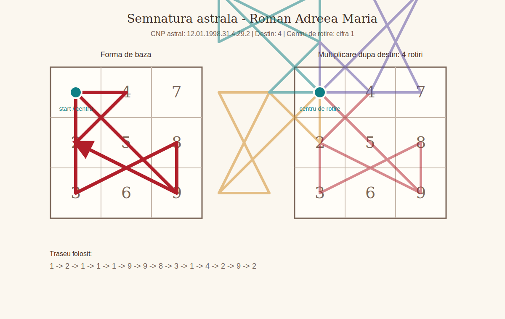
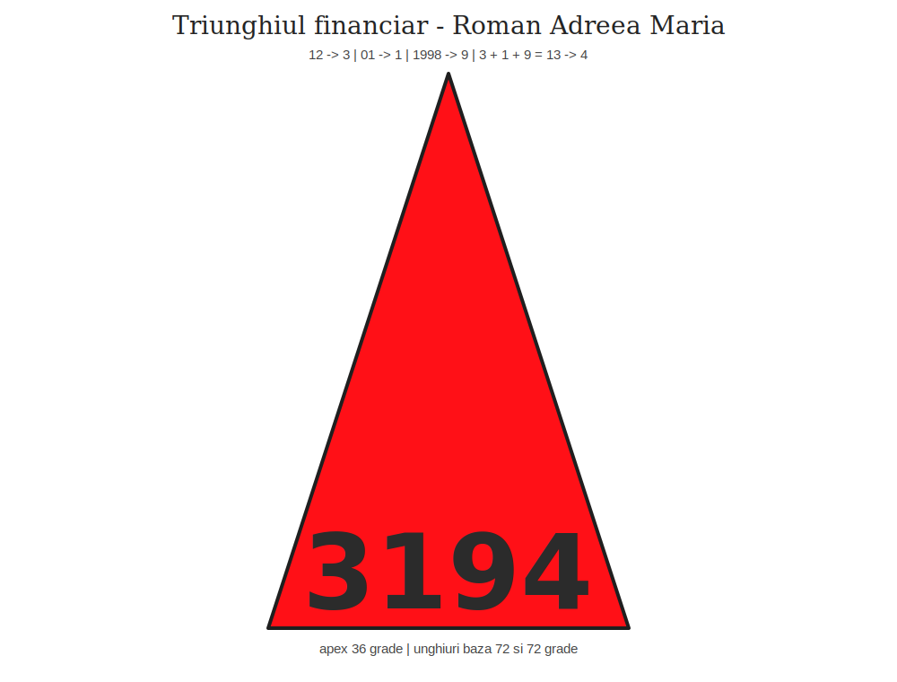
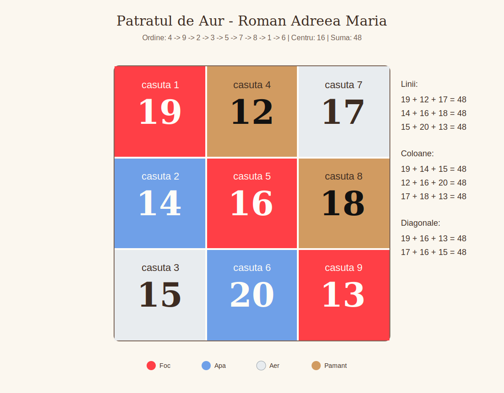

# Lucrare numerologica - Roman Andreea Maria - v1.01f

## Date generale

- Data nasterii: 12.01.1998
- Nume familie: Roman
- Prenume: Andreea Maria
- Prenume activ folosit in calcul: Andreea
- Data lucrarii: 2026-07-13

### Relatii

- Persoana analizata in relatie: Birsan Daniel Robert
- Data nasterii persoana analizata in relatie: 19.02.1998
- Tip relatie analizata: compatibilitate generala / relatie

## Cuprins

1. [Vibratiile fundamentale](#capitolul-1-vibratiile-fundamentale)
2. [Calea destinului, destinul si puntile](#capitolul-2-calea-destinului-destinul-si-puntile)
3. [Aspecte de indreptat](#capitolul-3-aspecte-de-indreptat)
4. [Structura matriciala](#capitolul-4-structura-matriciala)
5. [Codul numerologic personal al numelui](#capitolul-5-codul-numerologic-personal-al-numelui)
6. [Ciclicitatile](#capitolul-6-ciclicitatile)
7. [Relatii](#capitolul-7-relatii)
8. [Spirit](#capitolul-8-spirit)
9. [Ajutoare](#capitolul-9-ajutoare)

## Capitolul 1. Vibratiile fundamentale

### 1.1. Vibratia interioara

Acest punct descrie motivatia intima, instinctul personal si felul in care omul se simte pe sine din interior. In limbaj simplu, el raspunde la intrebarea: ce fel de energie lucreaza aici?

**Calcul:** 1 + 2 = 3

Privit in contextul motivatia intima, instinctul personal si felul in care omul se simte pe sine din interior, acest rezultat vorbeste despre comunicare, creativitate, bucurie, spontaneitate si talentul de a da forma trairilor prin cuvant sau gest. Nu trebuie inteles ca o eticheta rigida, ci ca o tendinta de lucru: o energie care poate deveni resursa atunci cand este folosita constient si care poate crea tensiune atunci cand este traita in exces sau neglijata.

### 1.2. Vibratia exterioara

Acest punct descrie felul in care persoana apare in lume, reactioneaza in contexte sociale si isi exprima prezenta. In limbaj simplu, el raspunde la intrebarea: ce fel de energie lucreaza aici?

**Calcul:** Luna nasterii = 1

Privit in contextul felul in care persoana apare in lume, reactioneaza in contexte sociale si isi exprima prezenta, acest rezultat vorbeste despre autonomie, vointa, curajul inceputului si nevoia de a lua decizii proprii. Nu trebuie inteles ca o eticheta rigida, ci ca o tendinta de lucru: o energie care poate deveni resursa atunci cand este folosita constient si care poate crea tensiune atunci cand este traita in exces sau neglijata.

### 1.3. Vibratia globala

Acest punct descrie puntea sintetica dintre interior si exterior. In limbaj simplu, el raspunde la intrebarea: ce fel de energie lucreaza aici?

**Calcul:** Vibratia interioara 3 + vibratia exterioara 1 = 4

Privit in contextul puntea sintetica dintre interior si exterior, acest rezultat vorbeste despre ordine, stabilitate, disciplina, responsabilitate si capacitatea de a construi pas cu pas. Nu trebuie inteles ca o eticheta rigida, ci ca o tendinta de lucru: o energie care poate deveni resursa atunci cand este folosita constient si care poate crea tensiune atunci cand este traita in exces sau neglijata.

### 1.4. Vibratia cosmica variabila

Acest punct descrie nuanta adusa de ultimele doua cifre ale anului de nastere. In limbaj simplu, el raspunde la intrebarea: ce fel de energie lucreaza aici?

**Calcul:** 9 + 8 = 17 -> 1 + 7 = 8

Privit in contextul nuanta adusa de ultimele doua cifre ale anului de nastere, acest rezultat vorbeste despre organizare, dreptate, rezultate, administrarea resurselor si raportarea matura la autoritate. Nu trebuie inteles ca o eticheta rigida, ci ca o tendinta de lucru: o energie care poate deveni resursa atunci cand este folosita constient si care poate crea tensiune atunci cand este traita in exces sau neglijata.

### 1.5. Vibratia cosmica totala

Acest punct descrie amprenta generationala a anului de nastere, redusa la o vibratie de baza. In limbaj simplu, el raspunde la intrebarea: ce fel de energie lucreaza aici?

**Calcul:** 1 + 9 + 9 + 8 = 27 -> 2 + 7 = 9

Privit in contextul amprenta generationala a anului de nastere, redusa la o vibratie de baza, acest rezultat vorbeste despre intelepciune, compasiune, finalizare, idealuri si capacitatea de a privi imaginea de ansamblu. Nu trebuie inteles ca o eticheta rigida, ci ca o tendinta de lucru: o energie care poate deveni resursa atunci cand este folosita constient si care poate crea tensiune atunci cand este traita in exces sau neglijata.

## Capitolul 2. Calea destinului, destinul si puntile

### 2.1. Calea destinului

Calea destinului este suma tuturor cifrelor din data de nastere inainte de reducerea finala. Ea pastreaza nuantele drumului, nu doar rezultatul redus.

**Calcul:** 1 + 2 + 0 + 1 + 1 + 9 + 9 + 8 = 31

Calea 31 se citeste prin cifrele care o compun si prin reducerea finala la 4. In termeni simpli, ea arata traseul, iar destinul redus arata esenta traseului. Privit in contextul calea destinului, acest rezultat vorbeste despre ordine, stabilitate, disciplina, responsabilitate si capacitatea de a construi pas cu pas. Nu trebuie inteles ca o eticheta rigida, ci ca o tendinta de lucru: o energie care poate deveni resursa atunci cand este folosita constient si care poate crea tensiune atunci cand este traita in exces sau neglijata.

### 2.2. Destinul

Acest punct arata directia finala de realizare. Puntile sunt importante pentru ca ne arata unde energia curge natural si unde are nevoie de traducere constienta.

**Calcul:** 3 + 1 = 4

Privit in contextul directia finala de realizare, acest rezultat vorbeste despre ordine, stabilitate, disciplina, responsabilitate si capacitatea de a construi pas cu pas. Nu trebuie inteles ca o eticheta rigida, ci ca o tendinta de lucru: o energie care poate deveni resursa atunci cand este folosita constient si care poate crea tensiune atunci cand este traita in exces sau neglijata.

### 2.3. Puntea interior - exterior

Acest punct arata diferenta dintre ce simte persoana in interior si cum se manifesta in exterior. Puntile sunt importante pentru ca ne arata unde energia curge natural si unde are nevoie de traducere constienta.

**Calcul:** |3 - 1| = 2

Privit in contextul diferenta dintre ce simte persoana in interior si cum se manifesta in exterior, acest rezultat vorbeste despre sensibilitate, cooperare, diplomatie, rabdare si capacitatea de a crea echilibru intre oameni. Nu trebuie inteles ca o eticheta rigida, ci ca o tendinta de lucru: o energie care poate deveni resursa atunci cand este folosita constient si care poate crea tensiune atunci cand este traita in exces sau neglijata.

### 2.4. Puntea interior - destin

Acest punct arata distanta dintre motivatia profunda si directia de destin. Puntile sunt importante pentru ca ne arata unde energia curge natural si unde are nevoie de traducere constienta.

**Calcul:** |3 - 4| = 1

Privit in contextul distanta dintre motivatia profunda si directia de destin, acest rezultat vorbeste despre autonomie, vointa, curajul inceputului si nevoia de a lua decizii proprii. Nu trebuie inteles ca o eticheta rigida, ci ca o tendinta de lucru: o energie care poate deveni resursa atunci cand este folosita constient si care poate crea tensiune atunci cand este traita in exces sau neglijata.

## Capitolul 3. Aspecte de indreptat

### 3.1. Aspecte de indreptat

Acest calcul indica o zona in care persoana are de rafinat o atitudine, un tipar sau o directie de folosire a energiei. Nu vorbeste despre vina, ci despre ajustare.

**Calcul:** 31 - (2 x 1) = 29

Rezultatul 29 sugereaza ca exista o tema de lucru care trebuie inteleasa prin experienta, rabdare si observarea propriilor reactii. Nu se interpreteaza izolat, ci impreuna cu solutia sa.

### 3.2. Solutia aspectelor de indreptat

Solutia arata cheia simplificata a aspectului de indreptat. Daca aspectul arata tensiunea, solutia arata directia de echilibrare.

**Calcul:** 2 + 9 = 11 -> 1 + 1 = 2

Privit in contextul solutia aspectelor de indreptat, acest rezultat vorbeste despre sensibilitate, cooperare, diplomatie, rabdare si capacitatea de a crea echilibru intre oameni. Nu trebuie inteles ca o eticheta rigida, ci ca o tendinta de lucru: o energie care poate deveni resursa atunci cand este folosita constient si care poate crea tensiune atunci cand este traita in exces sau neglijata.

## Capitolul 4. Structura matriciala

### 4.1. Matricea datei de nastere

Matricea este o harta a cifrelor prezente in codul numerologic personal. Ea arata ce energii sunt repetitive, ce energii lipsesc si unde apar vectori importanti.

**Calcul:** Data nasterii 12.01.1998 -> data compacta 12011998 -> N1 = 1 + 2 + 0 + 1 + 1 + 9 + 9 + 8 = 31 -> N2 = 3 + 1 = 4 -> N3 = 31 - (2 x 1) = 29 -> N4 = 2 + 9 = 11 -> 1 + 1 = 2 -> sir complet / numar logic = 12011998314292

```text
1111 |    4 |    -
 222 |    - |    8
   3 |    - |  999
```

Casutele pline arata resurse usor accesibile. Casutele goale nu inseamna defect, ci zone care se invata prin constienta, relatie, disciplina sau prin influenta numelui.

### 4.2. Casutele matricei

| Casuta | Cifre | Valoare | Descriere | Interpretare |
| --- | --- | ---: | --- | --- |
| 1 | 1111 | 4 | identitatea, vointa, caracterul si modul in care persoana isi afirma prezenta | Prezenta puternica a lui 1 arata o vointa vizibila si o nevoie fireasca de autonomie. Andreea poate simti des impulsul de a decide singura, de a porni lucrurile in ritmul ei si de a-si apara punctul de vedere. Cand energia este asezata matur, devine initiativa si curaj; cand se tensioneaza, poate aduce incapatanare sau tendinta de a duce totul pe cont propriu. |
| 2 | 222 | 6 | energia emotionala, empatia, sensibilitatea relationala si vitalitatea subtila | Cele trei cifre de 2 dau multa receptivitate emotionala. Persoana simte repede atmosfera dintre oameni, poate media conflicte si are nevoie de relatii in care blandetea si respectul conteaza. Sensibilitatea aceasta este o resursa, dar cere limite clare, altfel se poate transforma in oboseala, ezitare sau grija excesiva fata de reactiile celorlalti. |
| 3 | 3 | 3 | expresia, comunicarea, talentul, bucuria si felul in care omul isi pune trairile in forma | Cifra 3 este prezenta simplu, dar important: ea deschide canalul de expresie. Andreea isi poate descarca trairile prin cuvant, creativitate, umor sau gesturi spontane. Pentru ca nu este supraincarcata, aceasta energie are nevoie de incurajare si exercitiu constant, mai ales atunci cand emotiile sunt multe si greu de pus in ordine. |
| 4 | 4 | 4 | corpul, disciplina, sanatatea practica, ordinea si stabilitatea concreta | Prezenta lui 4 aduce un punct de sprijin practic. Exista capacitatea de a organiza, de a duce sarcinile pana la capat si de a construi ceva stabil atunci cand directia este clara. Fiind o singura cifra, disciplina nu trebuie fortata rigid, ci cultivata prin rutine simple, pasi mici si responsabilitati bine definite. |
| 5 | - | 0 | centrul, curajul, libertatea, intuitia practica si capacitatea de adaptare | Lipsa lui 5 arata ca libertatea, curajul schimbarii si adaptarea rapida se invata mai degraba prin experienta decat prin instinct imediat. Persoana poate prefera siguranta cunoscuta, mai ales cand nu are repere clare. Lectia aici este sa isi dea voie sa incerce, sa schimbe directia fara vinovatie si sa aiba incredere in intuitia practica formata pe parcurs. |
| 6 | - | 0 | munca, familia, responsabilitatea, grija si felul in care persoana se implica afectiv | Absenta lui 6 nu inseamna lipsa de afectiune, ci o tema de maturizare in felul de a purta responsabilitatea. Grija pentru familie, munca facuta cu inima si asumarea afectiva pot cere constienta, nu automatisme. Este important ca Andreea sa invete diferenta dintre a ajuta din iubire si a prelua prea mult din datoria altora. |
| 7 | - | 0 | spiritualitatea, intuitia, protectia, analiza si legatura cu lumea interioara | Fara 7 in matrice, introspectia profunda si increderea in protectia interioara se pot construi treptat. Persoana poate cauta confirmari din exterior inainte de a-si valida propria intelegere. Practicile de liniste, studiul, observarea viselor sau a semnelor personale pot deveni cai prin care aceasta zona se aseaza mai sigur. |
| 8 | 8 | 8 | socialul, dreptatea, organizarea, puterea si relatia cu resursele | Cifra 8 aduce simt al dreptatii, nevoie de ordine in relatia cu banii, autoritatea si rezultatele concrete. Andreea poate observa rapid ce este corect sau incorect intr-o situatie si are potential de administrare buna a resurselor. Pentru ca energia este concentrata intr-o singura cifra, conteaza sa fie folosita echilibrat, fara presiune excesiva pentru control sau performanta. |
| 9 | 999 | 27 | intelectul, memoria, intelepciunea, sinteza si capacitatea de a intelege experientele | Trei cifre de 9 indica o minte bogata, memorie buna si capacitate de a vedea sensul larg al experientelor. Exista deschidere spre intelegere, compasiune si concluzii mature, uneori chiar peste varsta. Provocarea este sa nu ramana prea mult in analiza sau idealizare, ci sa transforme ceea ce intelege in alegeri simple, aplicate in viata de zi cu zi. |

### 4.3. Pare si impare

Cifrele pare sunt asociate cu receptivitatea, relatia si constructia prin cooperare. Cifrele impare sunt asociate cu initiativa, expresia si miscarea directa.

**Calcul:** Cifre pare = 5; cifre impare = 8

Raportul dintre pare si impare arata ritmul dintre a primi si a actiona. Un dezechilibru nu este o problema in sine, dar indica unde persoana poate avea nevoie sa compenseze constient.

### 4.4. Vectorii matricei

| Vector | Denumire | Cifre | Valoare | Descriere si interpretare |
| --- | --- | --- | ---: | --- |
| 123 | Energie | 11112223 | 13 | energia de pornire, combustibilul interior si vitalitatea cu care persoana intra in viata. Este vector plin, deci energia curge mai coerent. |
| 456 | Vointa | 4 | 4 | vointa practica, corpul de lucru, disciplina si capacitatea de efort sustinut. Este vector incomplet, deci energia cere completare si exercitiu. |
| 789 | Creativitate | 8999 | 35 | creativitatea superioara, viziunea, mintea si directia in care energia se rafineaza. Este vector incomplet, deci energia cere completare si exercitiu. |
| 147 | Spiritualitate | 11114 | 8 | spiritualitatea aplicata in viata concreta, prin identitate, corp si intuitie. Este vector incomplet, deci energia cere completare si exercitiu. |
| 258 | Social | 2228 | 14 | socialul, relationarea, diplomatia si felul in care persoana se aseaza intre oameni. Este vector incomplet, deci energia cere completare si exercitiu. |
| 369 | Bunastare materiala | 3999 | 30 | bunastarea materiala, comunicarea, rezultatul vizibil si felul in care ideile devin valoare. Este vector incomplet, deci energia cere completare si exercitiu. |
| 159 | Cariera | 1111999 | 31 | cariera, axa personala si modul in care omul isi orienteaza vointa spre realizare. Este vector incomplet, deci energia cere completare si exercitiu. |
| 357 | Scopuri | 3 | 3 | scopurile, inspiratia, idealurile si felul in care persoana isi urmareste chemarea. Este vector incomplet, deci energia cere completare si exercitiu. |

### 4.5. Tendinte, fixatie si caii-trasura-vizitiul

Aceasta lectura strange dinamica matricei: dominantele, lipsurile si felul in care energia se misca prin vectorii de baza.

Casuta dominanta este 9. Casutele lipsa sunt 5, 6 si 7. Fixatia este pe vectorul 123, cu valoarea 13. Caii au valoarea 13, trasura are valoarea 4, iar vizitiul are valoarea 35.

Dominantele pot fi talente, dar si zone de exces. Lipsurile pot fi compensate prin educatie, prin alegerea mediului potrivit si prin folosirea constienta a numelui. Caii arata energia de pornire, trasura arata suportul practic, iar vizitiul arata directia mentala si spirituala.

## Capitolul 5. Codul numerologic personal al numelui

### 5.1. Numarul de exprimare

Numarul de exprimare arata cum se aude si se vede numele complet in lume. El descrie stilul prin care persoana poate sa isi exprime potentialul.

**Calcul:** Componentele numelui = 20 -> 2 + 0 = 2

Privit in contextul numarul de exprimare, acest rezultat vorbeste despre sensibilitate, cooperare, diplomatie, rabdare si capacitatea de a crea echilibru intre oameni. Nu trebuie inteles ca o eticheta rigida, ci ca o tendinta de lucru: o energie care poate deveni resursa atunci cand este folosita constient si care poate crea tensiune atunci cand este traita in exces sau neglijata.

### 5.2. Numarul intim

Numarul intim se calculeaza din vocale si vorbeste despre dorinte profunde, motivatie afectiva si nevoia interioara.

**Calcul:** Suma vocalelor = 30 -> 3 + 0 = 3

Privit in contextul numarul intim, acest rezultat vorbeste despre comunicare, creativitate, bucurie, spontaneitate si talentul de a da forma trairilor prin cuvant sau gest. Nu trebuie inteles ca o eticheta rigida, ci ca o tendinta de lucru: o energie care poate deveni resursa atunci cand este folosita constient si care poate crea tensiune atunci cand este traita in exces sau neglijata.

### 5.3. Numarul de realizare

Numarul de realizare se calculeaza din consoane si arata modul practic prin care persoana actioneaza si produce rezultate.

**Calcul:** Suma consoanelor = 44 -> 4 + 4 = 8

Privit in contextul numarul de realizare, acest rezultat vorbeste despre organizare, dreptate, rezultate, administrarea resurselor si raportarea matura la autoritate. Nu trebuie inteles ca o eticheta rigida, ci ca o tendinta de lucru: o energie care poate deveni resursa atunci cand este folosita constient si care poate crea tensiune atunci cand este traita in exces sau neglijata.

### 5.4. Numarul activ

Numarul activ vine din prenumele folosit si arata energia cu care persoana intra cel mai des in interactiunile cotidiene.

**Calcul:** Prenumele activ Andreea = 25 -> 2 + 5 = 7

Privit in contextul numarul activ, acest rezultat vorbeste despre introspectie, analiza, intuitie, spiritualitate si cautarea unui sens mai adanc. Nu trebuie inteles ca o eticheta rigida, ci ca o tendinta de lucru: o energie care poate deveni resursa atunci cand este folosita constient si care poate crea tensiune atunci cand este traita in exces sau neglijata.

### 5.5. Numarul ereditar

Numarul ereditar vine din numele de familie si descrie amprenta de neam, mostenirea subtila si tipul de energie preluata prin linia familiala.

**Calcul:** Numele de familie Roman = 25 -> 2 + 5 = 7

Privit in contextul numarul ereditar, acest rezultat vorbeste despre introspectie, analiza, intuitie, spiritualitate si cautarea unui sens mai adanc. Nu trebuie inteles ca o eticheta rigida, ci ca o tendinta de lucru: o energie care poate deveni resursa atunci cand este folosita constient si care poate crea tensiune atunci cand este traita in exces sau neglijata.

### 5.6. Numarul neamului

Numarul neamului citeste numele de familie printr-o reducere in intervalul 1-22, apropiata simbolic de limbajul arcanelor.

**Calcul:** ROMAN = 25 -> 25 - 22 = 3 -> Arcana majora 3

Aceasta informatie se citeste ca o tema de fundal. Ea poate functiona ca resursa mostenita, dar si ca responsabilitate de transformat intr-un mod personal si constient.

### 5.7. Cifre intense si influente subtile ale numelui

Cifrele intense arata ce valori apar cel mai des in nume. Primele si ultimele litere arata cum incepe si cum se inchide energia fiecarei componente din nume.

**Calcul:** Frecvente in nume: 1 = 5 aparitii; 4 = 3 aparitii; 5 = 3 aparitii; 6 = 1 aparitie; 9 = 4 aparitii -> cifra intensa = 1.

Primele si ultimele litere sunt: Roman incepe cu R=9 si se incheie cu N=5; Andreea incepe cu A=1 si se incheie cu A=1; Maria incepe cu M=4 si se incheie cu A=1. Primele vocale sunt O=6, A=1 si A=1.

Aceste elemente nu inlocuiesc numerele principale, dar coloreaza felul in care persoana se prezinta, reactioneaza si isi construieste identitatea prin nume.

## Capitolul 6. Ciclicitatile

### 6.1. Lectiile de viata

Lectiile de viata sunt citite ca teme recurente. Ele indica ce fel de energie revine in diferite etape, asemenea unor exercitii repetate.

**Calcul:** 12 x 1 x 1998 = 23976 -> lectiile 2, 3, 9, 7, 6

Sirul nu este o predictie mecanica. El ofera un limbaj pentru a intelege ce tip de lectie poate deveni mai vizibila intr-un anumit an de viata.

### 6.2. Ciclul de 9 ani

Ciclul de 9 ani descrie ritmul anilor personali. Fiecare an aduce o tema: inceput, cooperare, expresie, constructie, schimbare, armonie, analiza, putere sau finalizare.

| An | Varsta | An personal | Lectie | Interpretare pe inteles simplu |
| --- | ---: | ---: | ---: | --- |
| 2026 | 28 | 5 | 7 | Privit in contextul anul personal, acest rezultat vorbeste despre miscare, schimbare, curaj, adaptare si nevoia de experienta directa. Nu trebuie inteles ca o eticheta rigida, ci ca o tendinta de lucru: o energie care poate deveni resursa atunci cand este folosita constient si care poate crea tensiune atunci cand este traita in exces sau neglijata. |
| 2027 | 29 | 6 | 6 | Privit in contextul anul personal, acest rezultat vorbeste despre iubire, grija, familie, responsabilitate afectiva, estetica si dorinta de echilibru. Nu trebuie inteles ca o eticheta rigida, ci ca o tendinta de lucru: o energie care poate deveni resursa atunci cand este folosita constient si care poate crea tensiune atunci cand este traita in exces sau neglijata. |
| 2028 | 30 | 7 | 2 | Privit in contextul anul personal, acest rezultat vorbeste despre introspectie, analiza, intuitie, spiritualitate si cautarea unui sens mai adanc. Nu trebuie inteles ca o eticheta rigida, ci ca o tendinta de lucru: o energie care poate deveni resursa atunci cand este folosita constient si care poate crea tensiune atunci cand este traita in exces sau neglijata. |
| 2029 | 31 | 8 | 3 | Privit in contextul anul personal, acest rezultat vorbeste despre organizare, dreptate, rezultate, administrarea resurselor si raportarea matura la autoritate. Nu trebuie inteles ca o eticheta rigida, ci ca o tendinta de lucru: o energie care poate deveni resursa atunci cand este folosita constient si care poate crea tensiune atunci cand este traita in exces sau neglijata. |
| 2030 | 32 | 9 | 9 | Privit in contextul anul personal, acest rezultat vorbeste despre intelepciune, compasiune, finalizare, idealuri si capacitatea de a privi imaginea de ansamblu. Nu trebuie inteles ca o eticheta rigida, ci ca o tendinta de lucru: o energie care poate deveni resursa atunci cand este folosita constient si care poate crea tensiune atunci cand este traita in exces sau neglijata. |
| 2031 | 33 | 1 | 7 | Privit in contextul anul personal, acest rezultat vorbeste despre autonomie, vointa, curajul inceputului si nevoia de a lua decizii proprii. Nu trebuie inteles ca o eticheta rigida, ci ca o tendinta de lucru: o energie care poate deveni resursa atunci cand este folosita constient si care poate crea tensiune atunci cand este traita in exces sau neglijata. |
| 2032 | 34 | 2 | 6 | Privit in contextul anul personal, acest rezultat vorbeste despre sensibilitate, cooperare, diplomatie, rabdare si capacitatea de a crea echilibru intre oameni. Nu trebuie inteles ca o eticheta rigida, ci ca o tendinta de lucru: o energie care poate deveni resursa atunci cand este folosita constient si care poate crea tensiune atunci cand este traita in exces sau neglijata. |
| 2033 | 35 | 3 | 2 | Privit in contextul anul personal, acest rezultat vorbeste despre comunicare, creativitate, bucurie, spontaneitate si talentul de a da forma trairilor prin cuvant sau gest. Nu trebuie inteles ca o eticheta rigida, ci ca o tendinta de lucru: o energie care poate deveni resursa atunci cand este folosita constient si care poate crea tensiune atunci cand este traita in exces sau neglijata. |
| 2034 | 36 | 4 | 3 | Privit in contextul anul personal, acest rezultat vorbeste despre ordine, stabilitate, disciplina, responsabilitate si capacitatea de a construi pas cu pas. Nu trebuie inteles ca o eticheta rigida, ci ca o tendinta de lucru: o energie care poate deveni resursa atunci cand este folosita constient si care poate crea tensiune atunci cand este traita in exces sau neglijata. |
| 2035 | 37 | 5 | 9 | Privit in contextul anul personal, acest rezultat vorbeste despre miscare, schimbare, curaj, adaptare si nevoia de experienta directa. Nu trebuie inteles ca o eticheta rigida, ci ca o tendinta de lucru: o energie care poate deveni resursa atunci cand este folosita constient si care poate crea tensiune atunci cand este traita in exces sau neglijata. |
| 2036 | 38 | 6 | 7 | Privit in contextul anul personal, acest rezultat vorbeste despre iubire, grija, familie, responsabilitate afectiva, estetica si dorinta de echilibru. Nu trebuie inteles ca o eticheta rigida, ci ca o tendinta de lucru: o energie care poate deveni resursa atunci cand este folosita constient si care poate crea tensiune atunci cand este traita in exces sau neglijata. |

### 6.3. Ciclul de 7 ani si ciclul de 12 ani

Ciclul de 7 ani este legat de maturizare, disciplina si formarea structurii interioare. Ciclul de 12 ani este legat de expansiune, invatare si repozitionare in lume.

**Calcul:** Ciclul de 7 ani: 0-6 ani; ciclul de 12 ani: 0-11 ani

Aceste cicluri sunt folosite ca fundal. Ele nu spun exact ce se va intampla, ci arata ce fel de maturizare poate fi activa intr-o etapa.

### 6.4. Pinacluri

Pinaclurile descriu patru etape mari de crestere. Fiecare are o oportunitate si o provocare. Oportunitatea arata ce se poate construi, provocarea arata ce trebuie echilibrat.

| Pinaclu | Interval | Oportunitate | Provocare | Interpretare |
| --- | --- | ---: | ---: | --- |
| 1 | 0-32 | 4 | 2 | Oportunitatea se exprima prin ordine, stabilitate, disciplina, responsabilitate si capacitatea de a construi pas cu pas; provocarea cere lucrul constient cu sensibilitate, cooperare, diplomatie, rabdare si capacitatea de a crea echilibru intre oameni. |
| 2 | 33-41 | 3 | 6 | Oportunitatea se exprima prin comunicare, creativitate, bucurie, spontaneitate si talentul de a da forma trairilor prin cuvant sau gest; provocarea cere lucrul constient cu iubire, grija, familie, responsabilitate afectiva, estetica si dorinta de echilibru. |
| 3 | 42-50 | 7 | 4 | Oportunitatea se exprima prin introspectie, analiza, intuitie, spiritualitate si cautarea unui sens mai adanc; provocarea cere lucrul constient cu ordine, stabilitate, disciplina, responsabilitate si capacitatea de a construi pas cu pas. |
| 4 | 51+ | 1 | 8 | Oportunitatea se exprima prin autonomie, vointa, curajul inceputului si nevoia de a lua decizii proprii; provocarea cere lucrul constient cu organizare, dreptate, rezultate, administrarea resurselor si raportarea matura la autoritate. |

### 6.5. Ani importanti interiori si exteriori

Anii interiori marcheaza momente in care omul poate simti schimbari de directie, decizie sau maturizare. Anii exteriori sunt mai vizibili in planul evenimentelor.

**Calcul:** Ani interiori: 1998 -> 1 + 9 + 9 + 8 = 27 -> 2 + 7 = 9 -> 1998 + 9 = 2007 -> 2016 -> 2025 -> 2034.<br>Ani exteriori: 1998 + 27 = 2025 -> 2 + 0 + 2 + 5 = 9 -> 2025 + 9 = 2034.

Acesti ani se interpreteaza impreuna cu varsta, anul personal si contextul real al persoanei. Ei nu sunt promisiuni de evenimente, ci repere pentru lectura parcursului.

### 6.6. Soarta si destin

Aceasta rubrica compara baza de pornire cu directia de realizare. In calculatorul actual, formula grafica este marcata ca punct de completat, deci este pastrata cu prudenta.

**Calcul:** Baza de lucru pentru Soarta = 1201; baza de lucru pentru Destinul grafic = 1998

Pentru o lucrare finala tip examen, acest punct poate fi completat ulterior cu formula validata din documentatia scolii.

## Capitolul 7. Relatii

### 7.1. Omuletul relatiilor


_Omuletul relatiilor pentru Roman Andreea Maria si Birsan Daniel Robert_

Omuletul relatiilor compara doua persoane folosind aceeasi sursa de cifre. El arata cine sustine anumite zone, unde exista complementaritate si unde relatia cere atentie.

**Calcul:** Realizare impreuna: 3 + 1 = 4 -> de rezolvat impreuna: |3 - 1| = 2

Pentru aceasta lucrare individuala nu se calculeaza singur. Exista separat diagrama de relatie pentru cele doua persoane furnizate.

In interpretare, o cifra absenta nu inseamna lipsa de iubire, ci o zona care trebuie construita constient. O cifra puternica poate fi resursa, dar poate deveni presiune daca nu este traita matur.

## Capitolul 8. Spirit

### 8.1. Inclinatii profesionale

Acest punct priveste felul in care energia datei de nastere poate sugera o orientare profesionala. Nu este vorba despre o meserie obligatorie, ci despre un climat interior: ce tip de provocare apare, ce fel de ajutor poate sustine persoana si in ce directie se poate organiza mai bine.

**Calcul:** Obstacol = 4; ajutor = 10; directie = 13

Obstacolul arata zona care poate cere efort sau maturizare; ajutorul arata resursa care poate sustine drumul; directia arata sensul in care energia poate fi orientata. Citirea ramane simbolica si trebuie corelata cu matricea, numele si experienta reala a persoanei.

### 8.2. Inclinatii ezoterice

Inclinatiile ezoterice arata sensibilitatea fata de sensuri subtile, simboluri, intuitie, cercetare interioara sau domenii in care persoana cauta mai mult decat explicatia imediata.

**Calcul:** 12011998 : 7 -> cod principal 7; cod secundar 7

Codul principal arata poarta prin care persoana poate intra in zona subtila, iar codul secundar nuanteaza felul in care aceasta inclinatie se poate manifesta. Rezultatul nu obliga persoana spre ezoterism, ci arata o posibila deschidere spre profunzime, simbol si sens.

### 8.3. Codul spiritului si varsta spiritului

Codul spiritului este o sinteza a zilei si lunii de nastere. El este citit ca o cheie interioara, o vibratie care vorbeste despre felul in care persoana cauta sens, maturizare si directie subtila.

**Calcul:** Ziua 12 + luna 1 = 13 -> 1 + 3 = 4

Codul spiritului trebuie citit cu prudenta si blandete. El nu defineste valoarea persoanei, ci indica o tema profunda de crestere. Etapele si subetapele spiritului pot fi dezvoltate intr-o versiune ulterioara a lucrarii, daca se completeaza formula extinsa din documentatia dedicata.

## Capitolul 9. Ajutoare

### 9.1. Semnatura astrala

Semnatura astrala este un instrument grafic si simbolic care aseaza traseul numerologic personal intr-o forma vizuala. Ea nu inlocuieste analiza, ci o sustine si ofera un reper usor de urmarit.



_Semnatura astrala pentru Roman Andreea Maria_

### 9.2. Triunghiul financiar



_Triunghiul financiar pentru Roman Andreea Maria_

Triunghiul financiar combina ziua, luna, anul redus si destinul redus pentru a observa raportarea la resurse, constructie si directie materiala.

**Calcul:** Ziua 12 -> 1 + 2 = 3; luna = 1; anul 1998 -> 1 + 9 + 9 + 8 = 27 -> 2 + 7 = 9; destinul = 4 -> codul triunghiului = 3194

Se citeste ca instrument complementar. El arata cum poate persoana sa isi organizeze energia pentru rezultate, nu daca va avea sau nu succes financiar in mod garantat.

### 9.3. Patratul de aur



_Patratul de aur pentru Roman Andreea Maria_

Patratul de aur aseaza valori succesive pornind de la ziua nasterii si creeaza o schema de echilibru numeric.

**Calcul:** Centrul Patratului de Aur = 16; suma de control = 48

Centrul se citeste ca ax al structurii. Patratul poate fi folosit ca instrument de sinteza si sustinere simbolica, impreuna cu restul hartii.
