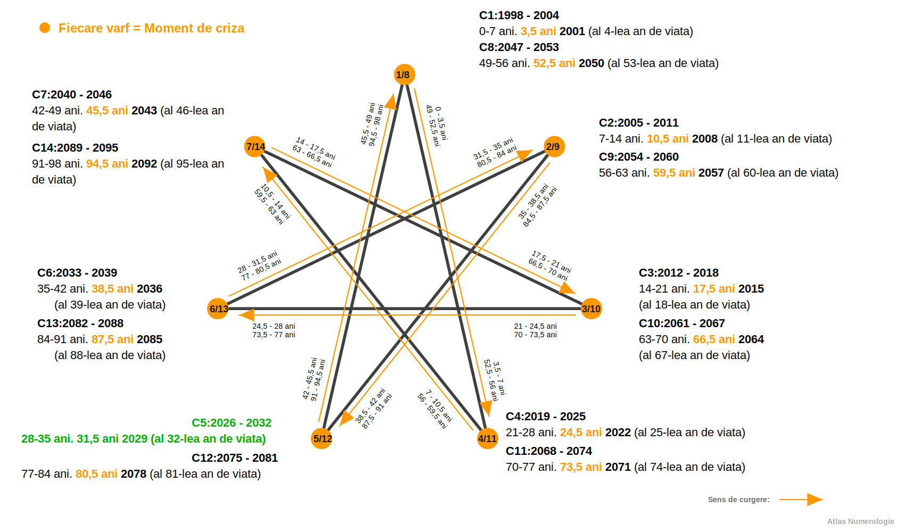
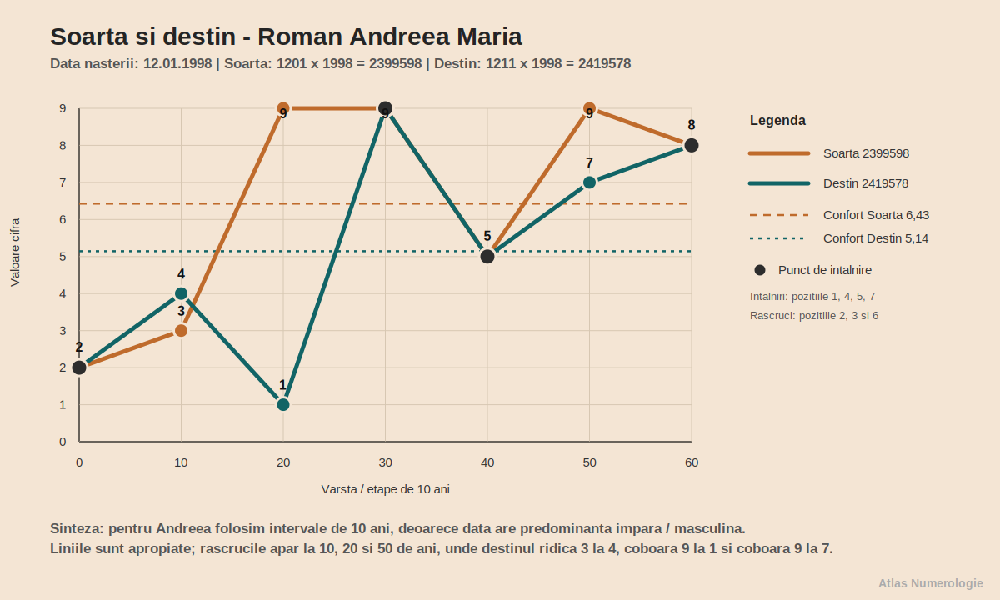
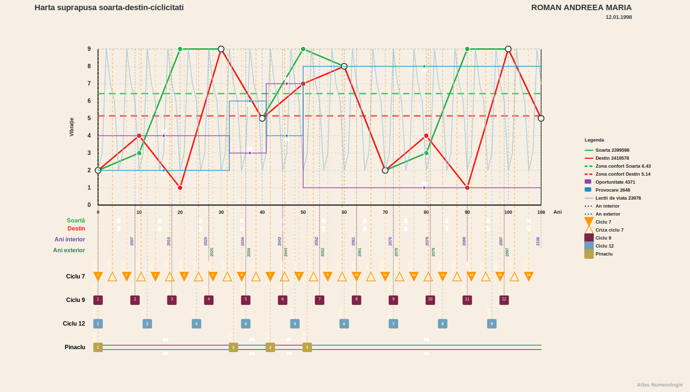

# Lucrare numerologica - Roman Andreea Maria - v1.02f

## Date generale

- Data nasterii: 12.01.1998
- Nume familie: Roman
- Prenume: Andreea Maria
- Prenume activ folosit in calcul: Andreea
- Data lucrarii: 2026-07-14

### Relatii

- Persoana analizata in relatie: Birsan Daniel Robert
- Data nasterii persoana analizata in relatie: 19.02.1998
- Tip relatie analizata: compatibilitate generala / relatie

## Cuprins

1. [Vibratiile fundamentale](#capitolul-1-vibratiile-fundamentale)
2. [Calea destinului, destinul si puntile](#capitolul-2-calea-destinului-destinul-si-puntile)
3. [Aspecte de indreptat](#capitolul-3-aspecte-de-indreptat)
4. [Structura matriciala](#capitolul-4-structura-matriciala)
5. [Codul numerologic personal al numelui](#capitolul-5-codul-numerologic-personal-al-numelui)
6. [Ciclicitatile](#capitolul-6-ciclicitatile)
7. [Relatii](#capitolul-7-relatii)
8. [Spirit](#capitolul-8-spirit)
9. [Ajutoare](#capitolul-9-ajutoare)

## Capitolul 1. Vibratiile fundamentale

### 1.1. Vibratia interioara

Vibratia interioara descrie motorul tau nevazut: ceea ce te pune in miscare inainte ca lumea sa observe o alegere sau o reactie.

In viata de zi cu zi, aceasta tema se vede in felul in care iti exprimi ideile, emotiile si bucuria de a crea. Nu este o eticheta si nici un verdict, ci o lentila prin care poti intelege mai bine de ce anumite situatii te atrag, te provoaca sau iti cer mai multa energie.

Calculul aseaza datele intr-o forma simpla si verificabila. Il citim ca punct de pornire, apoi il legam de felul in care traiesti concret aceasta tema.

**Calcul:** 1 + 2 = 3

Rezultatul 3 aduce arhetipul comunicatorului, al creatorului si al omului care transforma trairea in cuvant, gest sau forma.

La tine, Andreea, aceasta energie poate deveni vizibila atunci cand iti exprimi ideile, emotiile si bucuria de a crea. In forma ei echilibrata, iti ofera claritate si resurse; traita automat, poate crea tensiune sau senzatia ca trebuie sa fortezi lucrurile.

Cheia practica este sa folosesti aceasta energie constient: lasa-i calitatile sa lucreze pentru tine, dar observa momentul in care intensitatea ei devine graba, rigiditate, retragere sau presiune.

### 1.2. Vibratia exterioara

Vibratia exterioara arata prima impresie pe care o lasi si felul in care energia ta intra intr-o incapere, intr-o conversatie sau intr-un grup.

In viata de zi cu zi, aceasta tema se vede in felul in care te prezinti, iei initiativa si iti afirmi punctul de vedere. Nu este o eticheta si nici un verdict, ci o lentila prin care poti intelege mai bine de ce anumite situatii te atrag, te provoaca sau iti cer mai multa energie.

Calculul aseaza datele intr-o forma simpla si verificabila. Il citim ca punct de pornire, apoi il legam de felul in care traiesti concret aceasta tema.

**Calcul:** Luna nasterii = 1

Rezultatul 1 aduce arhetipul initiatorului: prezenta directa, independenta si curajul de a deschide un drum.

La tine, Andreea, aceasta energie poate deveni vizibila atunci cand te prezinti, iei initiativa si iti afirmi punctul de vedere. In forma ei echilibrata, iti ofera claritate si resurse; traita automat, poate crea tensiune sau senzatia ca trebuie sa fortezi lucrurile.

Cheia practica este sa folosesti aceasta energie constient: lasa-i calitatile sa lucreze pentru tine, dar observa momentul in care intensitatea ei devine graba, rigiditate, retragere sau presiune.

### 1.3. Vibratia globala

Vibratia globala reuneste ceea ce simti in interior cu ceea ce arati in exterior si descrie tonul general al personalitatii tale.

In viata de zi cu zi, aceasta tema se vede in felul in care transformi spontaneitatea in ordine si ideile in lucruri concrete. Nu este o eticheta si nici un verdict, ci o lentila prin care poti intelege mai bine de ce anumite situatii te atrag, te provoaca sau iti cer mai multa energie.

Calculul aseaza datele intr-o forma simpla si verificabila. Il citim ca punct de pornire, apoi il legam de felul in care traiesti concret aceasta tema.

**Calcul:** Vibratia interioara 3 + vibratia exterioara 1 = 4

Rezultatul 4 este constructorul: energia care cere stabilitate, disciplina, rabdare si o forma clara pentru ceea ce vrei sa realizezi.

La tine, Andreea, aceasta energie poate deveni vizibila atunci cand transformi spontaneitatea in ordine si ideile in lucruri concrete. In forma ei echilibrata, iti ofera claritate si resurse; traita automat, poate crea tensiune sau senzatia ca trebuie sa fortezi lucrurile.

Cheia practica este sa folosesti aceasta energie constient: lasa-i calitatile sa lucreze pentru tine, dar observa momentul in care intensitatea ei devine graba, rigiditate, retragere sau presiune.

### 1.4. Vibratia cosmica variabila

Vibratia cosmica variabila surprinde nuanta mobila adusa de ultimele doua cifre ale anului nasterii.

In viata de zi cu zi, aceasta tema se vede in felul in care administrezi responsabilitatea, rezultatele si raportarea la autoritate. Nu este o eticheta si nici un verdict, ci o lentila prin care poti intelege mai bine de ce anumite situatii te atrag, te provoaca sau iti cer mai multa energie.

Calculul aseaza datele intr-o forma simpla si verificabila. Il citim ca punct de pornire, apoi il legam de felul in care traiesti concret aceasta tema.

**Calcul:** 9 + 8 = 17 -> 1 + 7 = 8

Rezultatul 8 vorbeste despre organizare, dreptate, putere personala si folosirea matura a resurselor.

La tine, Andreea, aceasta energie poate deveni vizibila atunci cand administrezi responsabilitatea, rezultatele si raportarea la autoritate. In forma ei echilibrata, iti ofera claritate si resurse; traita automat, poate crea tensiune sau senzatia ca trebuie sa fortezi lucrurile.

Cheia practica este sa folosesti aceasta energie constient: lasa-i calitatile sa lucreze pentru tine, dar observa momentul in care intensitatea ei devine graba, rigiditate, retragere sau presiune.

### 1.5. Vibratia cosmica totala

Vibratia cosmica totala descrie fundalul generational in care te-ai nascut si felul in care experientele personale se leaga de un sens mai larg.

In viata de zi cu zi, aceasta tema se vede in felul in care inchizi etape, intelegi imaginea de ansamblu si alegi ce merita dus mai departe. Nu este o eticheta si nici un verdict, ci o lentila prin care poti intelege mai bine de ce anumite situatii te atrag, te provoaca sau iti cer mai multa energie.

Calculul aseaza datele intr-o forma simpla si verificabila. Il citim ca punct de pornire, apoi il legam de felul in care traiesti concret aceasta tema.

**Calcul:** 1 + 9 + 9 + 8 = 27 -> 2 + 7 = 9

Rezultatul 9 aduce intelepciune, compasiune, capacitate de sinteza si chemarea de a transforma experienta in sens.

La tine, Andreea, aceasta energie poate deveni vizibila atunci cand inchizi etape, intelegi imaginea de ansamblu si alegi ce merita dus mai departe. In forma ei echilibrata, iti ofera claritate si resurse; traita automat, poate crea tensiune sau senzatia ca trebuie sa fortezi lucrurile.

Cheia practica este sa folosesti aceasta energie constient: lasa-i calitatile sa lucreze pentru tine, dar observa momentul in care intensitatea ei devine graba, rigiditate, retragere sau presiune.

## Capitolul 2. Calea destinului, destinul si puntile

### 2.1. Calea destinului

Calea destinului pastreaza suma completa a datei de nastere si arata drumul prin care se formeaza directia ta de viata.

In viata de zi cu zi, aceasta tema se vede in felul in care construiesti consecvent si inveti sa dai structurii un sens personal. Nu este o eticheta si nici un verdict, ci o lentila prin care poti intelege mai bine de ce anumite situatii te atrag, te provoaca sau iti cer mai multa energie.

Calculul aseaza datele intr-o forma simpla si verificabila. Il citim ca punct de pornire, apoi il legam de felul in care traiesti concret aceasta tema.

**Calcul:** 1 + 2 + 0 + 1 + 1 + 9 + 9 + 8 = 31

Calea 31 combina initiativa lui 3 cu autonomia lui 1 si se reduce la 4, cifra constructiei durabile.

La tine, Andreea, aceasta energie poate deveni vizibila atunci cand construiesti consecvent si inveti sa dai structurii un sens personal. In forma ei echilibrata, iti ofera claritate si resurse; traita automat, poate crea tensiune sau senzatia ca trebuie sa fortezi lucrurile.

Cheia practica este sa folosesti aceasta energie constient: lasa-i calitatile sa lucreze pentru tine, dar observa momentul in care intensitatea ei devine graba, rigiditate, retragere sau presiune.

### 2.2. Destinul

Destinul este esenta redusa a caii tale si indica directia in care experientele tind sa te maturizeze.

In viata de zi cu zi, aceasta tema se vede in felul in care asezi ordine, continuitate si rezultate verificabile in jurul tau. Nu este o eticheta si nici un verdict, ci o lentila prin care poti intelege mai bine de ce anumite situatii te atrag, te provoaca sau iti cer mai multa energie.

Calculul aseaza datele intr-o forma simpla si verificabila. Il citim ca punct de pornire, apoi il legam de felul in care traiesti concret aceasta tema.

**Calcul:** 3 + 1 = 4

Destinul 4 te cheama sa construiesti, sa organizezi si sa transformi inspiratia in ceva stabil.

La tine, Andreea, aceasta energie poate deveni vizibila atunci cand asezi ordine, continuitate si rezultate verificabile in jurul tau. In forma ei echilibrata, iti ofera claritate si resurse; traita automat, poate crea tensiune sau senzatia ca trebuie sa fortezi lucrurile.

Cheia practica este sa folosesti aceasta energie constient: lasa-i calitatile sa lucreze pentru tine, dar observa momentul in care intensitatea ei devine graba, rigiditate, retragere sau presiune.

### 2.3. Puntea interior - exterior

Puntea dintre interior si exterior masoara distanta dintre ceea ce simti si felul in care te arati lumii.

In viata de zi cu zi, aceasta tema se vede in felul in care negociezi intre nevoia de expresie si nevoia de autonomie. Nu este o eticheta si nici un verdict, ci o lentila prin care poti intelege mai bine de ce anumite situatii te atrag, te provoaca sau iti cer mai multa energie.

Calculul aseaza datele intr-o forma simpla si verificabila. Il citim ca punct de pornire, apoi il legam de felul in care traiesti concret aceasta tema.

**Calcul:** |3 - 1| = 2

Puntea 2 cere tact, rabdare si cooperare, astfel incat forta ta interioara sa poata fi inteleasa si de ceilalti.

La tine, Andreea, aceasta energie poate deveni vizibila atunci cand negociezi intre nevoia de expresie si nevoia de autonomie. In forma ei echilibrata, iti ofera claritate si resurse; traita automat, poate crea tensiune sau senzatia ca trebuie sa fortezi lucrurile.

Cheia practica este sa folosesti aceasta energie constient: lasa-i calitatile sa lucreze pentru tine, dar observa momentul in care intensitatea ei devine graba, rigiditate, retragere sau presiune.

### 2.4. Puntea interior - destin

Puntea dintre interior si destin arata ce trebuie ajustat pentru ca motivatia ta profunda sa sustina directia de viata.

In viata de zi cu zi, aceasta tema se vede in felul in care transformi ideile si emotiile in decizii asumate. Nu este o eticheta si nici un verdict, ci o lentila prin care poti intelege mai bine de ce anumite situatii te atrag, te provoaca sau iti cer mai multa energie.

Calculul aseaza datele intr-o forma simpla si verificabila. Il citim ca punct de pornire, apoi il legam de felul in care traiesti concret aceasta tema.

**Calcul:** |3 - 4| = 1

Puntea 1 cere initiativa si claritate: pasul dintre ceea ce simti si ceea ce construiesti trebuie facut de tine.

La tine, Andreea, aceasta energie poate deveni vizibila atunci cand transformi ideile si emotiile in decizii asumate. In forma ei echilibrata, iti ofera claritate si resurse; traita automat, poate crea tensiune sau senzatia ca trebuie sa fortezi lucrurile.

Cheia practica este sa folosesti aceasta energie constient: lasa-i calitatile sa lucreze pentru tine, dar observa momentul in care intensitatea ei devine graba, rigiditate, retragere sau presiune.

## Capitolul 3. Aspecte de indreptat

### 3.1. Aspecte de indreptat

Aspectele de indreptat nu sunt defecte, ci locuri in care experienta iti cere atentie, rafinare si alegeri mai constiente.

In viata de zi cu zi, aceasta tema se vede in felul in care raspunzi presiunii fara sa iti pierzi centrul sau vocea personala. Nu este o eticheta si nici un verdict, ci o lentila prin care poti intelege mai bine de ce anumite situatii te atrag, te provoaca sau iti cer mai multa energie.

Calculul aseaza datele intr-o forma simpla si verificabila. Il citim ca punct de pornire, apoi il legam de felul in care traiesti concret aceasta tema.

**Calcul:** 31 - (2 x 1) = 29

Rezultatul 29 aduce o lectie despre sensibilitate, relatie si maturizarea felului in care reactionezi.

La tine, Andreea, aceasta energie poate deveni vizibila atunci cand raspunzi presiunii fara sa iti pierzi centrul sau vocea personala. In forma ei echilibrata, iti ofera claritate si resurse; traita automat, poate crea tensiune sau senzatia ca trebuie sa fortezi lucrurile.

Cheia practica este sa folosesti aceasta energie constient: lasa-i calitatile sa lucreze pentru tine, dar observa momentul in care intensitatea ei devine graba, rigiditate, retragere sau presiune.

### 3.2. Solutia aspectelor de indreptat

Solutia arata atitudinea prin care tensiunea poate fi transformata in resursa si invatare.

In viata de zi cu zi, aceasta tema se vede in felul in care folosesti dialogul, rabdarea si cooperarea in locul reactiei grabite. Nu este o eticheta si nici un verdict, ci o lentila prin care poti intelege mai bine de ce anumite situatii te atrag, te provoaca sau iti cer mai multa energie.

Calculul aseaza datele intr-o forma simpla si verificabila. Il citim ca punct de pornire, apoi il legam de felul in care traiesti concret aceasta tema.

**Calcul:** 2 + 9 = 11 -> 1 + 1 = 2

Rezultatul 2 spune ca rezolvarea vine prin echilibru emotional, ascultare si relatii construite cu tact.

La tine, Andreea, aceasta energie poate deveni vizibila atunci cand folosesti dialogul, rabdarea si cooperarea in locul reactiei grabite. In forma ei echilibrata, iti ofera claritate si resurse; traita automat, poate crea tensiune sau senzatia ca trebuie sa fortezi lucrurile.

Cheia practica este sa folosesti aceasta energie constient: lasa-i calitatile sa lucreze pentru tine, dar observa momentul in care intensitatea ei devine graba, rigiditate, retragere sau presiune.

## Capitolul 4. Structura matriciala

### 4.1. Matricea datei de nastere

Matricea datei de nastere aduna cifrele native si cele patru numere de lucru intr-o harta a resurselor, repetitiilor si zonelor de antrenament.

In viata de zi cu zi, aceasta tema se vede in felul in care iti distribui energia intre vointa, sensibilitate, minte si actiune practica. Nu este o eticheta si nici un verdict, ci o lentila prin care poti intelege mai bine de ce anumite situatii te atrag, te provoaca sau iti cer mai multa energie.

Calculul aseaza datele intr-o forma simpla si verificabila. Il citim ca punct de pornire, apoi il legam de felul in care traiesti concret aceasta tema.

**Calcul:** Data nasterii 12.01.1998 -> data compacta 12011998 -> N1 = 1 + 2 + 0 + 1 + 1 + 9 + 9 + 8 = 31 -> N2 = 3 + 1 = 4 -> N3 = 31 - (2 x 1) = 29 -> N4 = 2 + 9 = 11 -> 1 + 1 = 2 -> sir complet / numar logic = 12011998314292

```text
1111 |    4 |    -
 222 |    - |    8
   3 |    - |  999
```

Sirul complet 12011998314292 devine baza din care sunt citite casutele si vectorii matricei tale.

La tine, Andreea, aceasta energie poate deveni vizibila atunci cand iti distribui energia intre vointa, sensibilitate, minte si actiune practica. In forma ei echilibrata, iti ofera claritate si resurse; traita automat, poate crea tensiune sau senzatia ca trebuie sa fortezi lucrurile.

Cheia practica este sa folosesti aceasta energie constient: lasa-i calitatile sa lucreze pentru tine, dar observa momentul in care intensitatea ei devine graba, rigiditate, retragere sau presiune.

### 4.2. Casutele matricei

Casutele matricei arata cum sunt distribuite cifrele tale intre vointa, sensibilitate, expresie, disciplina, adaptare, responsabilitate, introspectie, organizare si intelepciune. O cifra repetata devine o resursa puternica, dar si o energie care trebuie dozata; o cifra absenta nu inseamna ca iti lipseste o calitate, ci ca ea se construieste prin experienta.

Andreea, citeste tabelul ca pe o harta de antrenament. Zonele pline iti arata ce folosesti spontan, iar zonele goale iti arata unde viata iti cere rabdare, educatie si alegeri constiente.

| Casuta | Cifre | Valoare | Descriere | Interpretare |
| --- | --- | ---: | --- | --- |
| 1 | 1111 | 4 | identitatea, vointa, caracterul si modul in care persoana isi afirma prezenta | Prezenta puternica a lui 1 arata o vointa vizibila si o nevoie fireasca de autonomie. Andreea poate simti des impulsul de a decide singura, de a porni lucrurile in ritmul ei si de a-si apara punctul de vedere. Cand energia este asezata matur, devine initiativa si curaj; cand se tensioneaza, poate aduce incapatanare sau tendinta de a duce totul pe cont propriu. |
| 2 | 222 | 6 | energia emotionala, empatia, sensibilitatea relationala si vitalitatea subtila | Cele trei cifre de 2 dau multa receptivitate emotionala. Persoana simte repede atmosfera dintre oameni, poate media conflicte si are nevoie de relatii in care blandetea si respectul conteaza. Sensibilitatea aceasta este o resursa, dar cere limite clare, altfel se poate transforma in oboseala, ezitare sau grija excesiva fata de reactiile celorlalti. |
| 3 | 3 | 3 | expresia, comunicarea, talentul, bucuria si felul in care omul isi pune trairile in forma | Cifra 3 este prezenta simplu, dar important: ea deschide canalul de expresie. Andreea isi poate descarca trairile prin cuvant, creativitate, umor sau gesturi spontane. Pentru ca nu este supraincarcata, aceasta energie are nevoie de incurajare si exercitiu constant, mai ales atunci cand emotiile sunt multe si greu de pus in ordine. |
| 4 | 4 | 4 | corpul, disciplina, sanatatea practica, ordinea si stabilitatea concreta | Prezenta lui 4 aduce un punct de sprijin practic. Exista capacitatea de a organiza, de a duce sarcinile pana la capat si de a construi ceva stabil atunci cand directia este clara. Fiind o singura cifra, disciplina nu trebuie fortata rigid, ci cultivata prin rutine simple, pasi mici si responsabilitati bine definite. |
| 5 | - | 0 | centrul, curajul, libertatea, intuitia practica si capacitatea de adaptare | Lipsa lui 5 arata ca libertatea, curajul schimbarii si adaptarea rapida se invata mai degraba prin experienta decat prin instinct imediat. Persoana poate prefera siguranta cunoscuta, mai ales cand nu are repere clare. Lectia aici este sa isi dea voie sa incerce, sa schimbe directia fara vinovatie si sa aiba incredere in intuitia practica formata pe parcurs. |
| 6 | - | 0 | munca, familia, responsabilitatea, grija si felul in care persoana se implica afectiv | Absenta lui 6 nu inseamna lipsa de afectiune, ci o tema de maturizare in felul de a purta responsabilitatea. Grija pentru familie, munca facuta cu inima si asumarea afectiva pot cere constienta, nu automatisme. Este important ca Andreea sa invete diferenta dintre a ajuta din iubire si a prelua prea mult din datoria altora. |
| 7 | - | 0 | spiritualitatea, intuitia, protectia, analiza si legatura cu lumea interioara | Fara 7 in matrice, introspectia profunda si increderea in protectia interioara se pot construi treptat. Persoana poate cauta confirmari din exterior inainte de a-si valida propria intelegere. Practicile de liniste, studiul, observarea viselor sau a semnelor personale pot deveni cai prin care aceasta zona se aseaza mai sigur. |
| 8 | 8 | 8 | socialul, dreptatea, organizarea, puterea si relatia cu resursele | Cifra 8 aduce simt al dreptatii, nevoie de ordine in relatia cu banii, autoritatea si rezultatele concrete. Andreea poate observa rapid ce este corect sau incorect intr-o situatie si are potential de administrare buna a resurselor. Pentru ca energia este concentrata intr-o singura cifra, conteaza sa fie folosita echilibrat, fara presiune excesiva pentru control sau performanta. |
| 9 | 999 | 27 | intelectul, memoria, intelepciunea, sinteza si capacitatea de a intelege experientele | Trei cifre de 9 indica o minte bogata, memorie buna si capacitate de a vedea sensul larg al experientelor. Exista deschidere spre intelegere, compasiune si concluzii mature, uneori chiar peste varsta. Provocarea este sa nu ramana prea mult in analiza sau idealizare, ci sa transforme ceea ce intelege in alegeri simple, aplicate in viata de zi cu zi. |

Imaginea de ansamblu arata multa initiativa, sensibilitate si forta mentala. Echilibrul se construieste atunci cand nu lasi vointa sau analiza sa preia tot spatiul, ci cultivi deliberat adaptarea, responsabilitatea afectiva si timpul de liniste interioara.

### 4.3. Pare si impare

Raportul dintre cifrele pare si impare arata dialogul dintre receptivitate si actiune, dintre adaptare si initiativa.

In viata de zi cu zi, aceasta tema se vede in felul in care alternezi intre a primi contextul si a-l schimba prin propria vointa. Nu este o eticheta si nici un verdict, ci o lentila prin care poti intelege mai bine de ce anumite situatii te atrag, te provoaca sau iti cer mai multa energie.

Calculul aseaza datele intr-o forma simpla si verificabila. Il citim ca punct de pornire, apoi il legam de felul in care traiesti concret aceasta tema.

**Calcul:** Cifre pare = 5; cifre impare = 8

Predominanta cifrelor impare arata un ritm mai activ, orientat spre initiativa, miscare si decizie personala.

La tine, Andreea, aceasta energie poate deveni vizibila atunci cand alternezi intre a primi contextul si a-l schimba prin propria vointa. In forma ei echilibrata, iti ofera claritate si resurse; traita automat, poate crea tensiune sau senzatia ca trebuie sa fortezi lucrurile.

Cheia practica este sa folosesti aceasta energie constient: lasa-i calitatile sa lucreze pentru tine, dar observa momentul in care intensitatea ei devine graba, rigiditate, retragere sau presiune.

### 4.4. Vectorii matricei

Vectorii unesc casutele in trasee si arata cum colaboreaza energiile tale. Ei nu se citesc ca note sau calificative, ci ca drumuri prin care vointa, emotia, mintea si actiunea se pot sustine reciproc.

Pentru tine, Andreea, un vector puternic este asemenea unui drum deja batatorit: energia circula usor pe acolo. Un vector incomplet cere mai multa prezenta, fiindca legatura dintre componente trebuie construita constient.

| Vector | Denumire | Cifre | Valoare | Descriere si interpretare |
| --- | --- | --- | ---: | --- |
| 123 | Energie | 11112223 | 13 | energia de pornire, combustibilul interior si vitalitatea cu care persoana intra in viata. Este vector plin, deci energia curge mai coerent. |
| 456 | Vointa | 4 | 4 | vointa practica, corpul de lucru, disciplina si capacitatea de efort sustinut. Este vector incomplet, deci energia cere completare si exercitiu. |
| 789 | Creativitate | 8999 | 35 | creativitatea superioara, viziunea, mintea si directia in care energia se rafineaza. Este vector incomplet, deci energia cere completare si exercitiu. |
| 147 | Spiritualitate | 11114 | 8 | spiritualitatea aplicata in viata concreta, prin identitate, corp si intuitie. Este vector incomplet, deci energia cere completare si exercitiu. |
| 258 | Social | 2228 | 14 | socialul, relationarea, diplomatia si felul in care persoana se aseaza intre oameni. Este vector incomplet, deci energia cere completare si exercitiu. |
| 369 | Bunastare materiala | 3999 | 30 | bunastarea materiala, comunicarea, rezultatul vizibil si felul in care ideile devin valoare. Este vector incomplet, deci energia cere completare si exercitiu. |
| 159 | Cariera | 1111999 | 31 | cariera, axa personala si modul in care omul isi orienteaza vointa spre realizare. Este vector incomplet, deci energia cere completare si exercitiu. |
| 357 | Scopuri | 3 | 3 | scopurile, inspiratia, idealurile si felul in care persoana isi urmareste chemarea. Este vector incomplet, deci energia cere completare si exercitiu. |

Fixatia pe 123 confirma ca ai combustibil pentru pornire si exprimare. Provocarea este sa legi aceasta energie de continuitate, de corp si de un scop clar, astfel incat entuziasmul initial sa se transforme in rezultat.

### 4.5. Tendinte, fixatie si caii-trasura-vizitiul

Aceasta lectura strange dinamica matricei: dominantele, lipsurile si felul in care energia se misca prin vectorii de baza.

Casuta dominanta este 9. Casutele lipsa sunt 5, 6 si 7. Fixatia este pe vectorul 123, cu valoarea 13. Caii au valoarea 13, trasura are valoarea 4, iar vizitiul are valoarea 35.

Dominantele pot fi talente, dar si zone de exces. Lipsurile pot fi compensate prin educatie, prin alegerea mediului potrivit si prin folosirea constienta a numelui. Caii arata energia de pornire, trasura arata suportul practic, iar vizitiul arata directia mentala si spirituala.

## Capitolul 5. Codul numerologic personal al numelui

### 5.1. Numarul de exprimare

Numarul de exprimare arata cum lucreaza numele complet ca instrument de manifestare in lume.

In viata de zi cu zi, aceasta tema se vede in felul in care iti folosesti sensibilitatea in comunicare, colaborare si apropierea de oameni. Nu este o eticheta si nici un verdict, ci o lentila prin care poti intelege mai bine de ce anumite situatii te atrag, te provoaca sau iti cer mai multa energie.

Calculul aseaza datele intr-o forma simpla si verificabila. Il citim ca punct de pornire, apoi il legam de felul in care traiesti concret aceasta tema.

**Calcul:** ROMAN = 25 -> 7; ANDREEA = 30 -> 3; MARIA = 24 -> 6. Numarul de exprimare = 7 + 3 + 6 = 16 -> 1 + 6 = 7.

Rezultatul 7 pune in centrul exprimarii tale analiza, discernamantul, intuitia si nevoia de a intelege sensul din spatele experientelor.

La tine, Andreea, aceasta energie poate deveni vizibila atunci cand iti folosesti sensibilitatea in comunicare, colaborare si apropierea de oameni. In forma ei echilibrata, iti ofera claritate si resurse; traita automat, poate crea tensiune sau senzatia ca trebuie sa fortezi lucrurile.

Cheia practica este sa folosesti aceasta energie constient: lasa-i calitatile sa lucreze pentru tine, dar observa momentul in care intensitatea ei devine graba, rigiditate, retragere sau presiune.

### 5.2. Numarul intim

Numarul intim se formeaza din vocale si descrie dorintele pe care le porti inauntru, chiar si atunci cand nu le spui imediat.

In viata de zi cu zi, aceasta tema se vede in felul in care cauti bucurie, expresie, creativitate si libertatea de a pune trairile in cuvinte. Nu este o eticheta si nici un verdict, ci o lentila prin care poti intelege mai bine de ce anumite situatii te atrag, te provoaca sau iti cer mai multa energie.

Calculul aseaza datele intr-o forma simpla si verificabila. Il citim ca punct de pornire, apoi il legam de felul in care traiesti concret aceasta tema.

**Calcul:** Suma vocalelor = 30 -> 3 + 0 = 3

Rezultatul 3 arata o nevoie profunda de comunicare, frumusete, joc si exprimare creativa.

La tine, Andreea, aceasta energie poate deveni vizibila atunci cand cauti bucurie, expresie, creativitate si libertatea de a pune trairile in cuvinte. In forma ei echilibrata, iti ofera claritate si resurse; traita automat, poate crea tensiune sau senzatia ca trebuie sa fortezi lucrurile.

Cheia practica este sa folosesti aceasta energie constient: lasa-i calitatile sa lucreze pentru tine, dar observa momentul in care intensitatea ei devine graba, rigiditate, retragere sau presiune.

### 5.3. Numarul de realizare

Numarul de realizare se formeaza din consoane si arata felul practic in care energia numelui produce rezultate.

In viata de zi cu zi, aceasta tema se vede in felul in care organizezi, administrezi si urmaresti un rezultat concret. Nu este o eticheta si nici un verdict, ci o lentila prin care poti intelege mai bine de ce anumite situatii te atrag, te provoaca sau iti cer mai multa energie.

Calculul aseaza datele intr-o forma simpla si verificabila. Il citim ca punct de pornire, apoi il legam de felul in care traiesti concret aceasta tema.

**Calcul:** Suma consoanelor = 49 -> 4 + 9 = 13 -> 1 + 3 = 4

Rezultatul 4 sustine capacitatea de organizare, disciplina, continuitatea si talentul de a transforma o idee intr-o forma stabila.

La tine, Andreea, aceasta energie poate deveni vizibila atunci cand organizezi, administrezi si urmaresti un rezultat concret. In forma ei echilibrata, iti ofera claritate si resurse; traita automat, poate crea tensiune sau senzatia ca trebuie sa fortezi lucrurile.

Cheia practica este sa folosesti aceasta energie constient: lasa-i calitatile sa lucreze pentru tine, dar observa momentul in care intensitatea ei devine graba, rigiditate, retragere sau presiune.

### 5.4. Numarul activ

Numarul activ vine din prenumele folosit zilnic si descrie energia cu care intri cel mai des in interactiuni.

In viata de zi cu zi, aceasta tema se vede in felul in care analizezi, observi in profunzime si cauti sensul din spatele aparentelor. Nu este o eticheta si nici un verdict, ci o lentila prin care poti intelege mai bine de ce anumite situatii te atrag, te provoaca sau iti cer mai multa energie.

Calculul aseaza datele intr-o forma simpla si verificabila. Il citim ca punct de pornire, apoi il legam de felul in care traiesti concret aceasta tema.

**Calcul:** Prenumele activ ANDREEA = 30 -> 3 + 0 = 3

Rezultatul 3 aduce expresie, creativitate, sociabilitate si nevoia de a pune trairile in cuvinte sau forme personale.

La tine, Andreea, aceasta energie poate deveni vizibila atunci cand analizezi, observi in profunzime si cauti sensul din spatele aparentelor. In forma ei echilibrata, iti ofera claritate si resurse; traita automat, poate crea tensiune sau senzatia ca trebuie sa fortezi lucrurile.

Cheia practica este sa folosesti aceasta energie constient: lasa-i calitatile sa lucreze pentru tine, dar observa momentul in care intensitatea ei devine graba, rigiditate, retragere sau presiune.

### 5.5. Numarul ereditar

Numarul ereditar citeste numele de familie ca pe o amprenta transmisa prin linia familiala.

In viata de zi cu zi, aceasta tema se vede in felul in care te raportezi la mostenire, apartenenta si intrebarile profunde ale familiei. Nu este o eticheta si nici un verdict, ci o lentila prin care poti intelege mai bine de ce anumite situatii te atrag, te provoaca sau iti cer mai multa energie.

Calculul aseaza datele intr-o forma simpla si verificabila. Il citim ca punct de pornire, apoi il legam de felul in care traiesti concret aceasta tema.

**Calcul:** Numele de familie Roman = 25 -> 2 + 5 = 7

Rezultatul 7 sugereaza o mostenire legata de analiza, cautare interioara, discretie si intelegerea sensurilor ascunse.

La tine, Andreea, aceasta energie poate deveni vizibila atunci cand te raportezi la mostenire, apartenenta si intrebarile profunde ale familiei. In forma ei echilibrata, iti ofera claritate si resurse; traita automat, poate crea tensiune sau senzatia ca trebuie sa fortezi lucrurile.

Cheia practica este sa folosesti aceasta energie constient: lasa-i calitatile sa lucreze pentru tine, dar observa momentul in care intensitatea ei devine graba, rigiditate, retragere sau presiune.

### 5.6. Numarul neamului

Numarul neamului pastreaza totalul numelui de familie in intervalul simbolic al celor 22 de arcane.

In viata de zi cu zi, aceasta tema se vede in felul in care transformi mostenirea familiei intr-o expresie personala si creativa. Nu este o eticheta si nici un verdict, ci o lentila prin care poti intelege mai bine de ce anumite situatii te atrag, te provoaca sau iti cer mai multa energie.

Calculul aseaza datele intr-o forma simpla si verificabila. Il citim ca punct de pornire, apoi il legam de felul in care traiesti concret aceasta tema.

**Calcul:** ROMAN = 25 -> 25 - 22 = 3 -> Arcana majora 3

Rezultatul 3 se leaga de Arcana Imparateasa: crestere, fertilitate creativa, grija si puterea de a da forma vietii.

La tine, Andreea, aceasta energie poate deveni vizibila atunci cand transformi mostenirea familiei intr-o expresie personala si creativa. In forma ei echilibrata, iti ofera claritate si resurse; traita automat, poate crea tensiune sau senzatia ca trebuie sa fortezi lucrurile.

Cheia practica este sa folosesti aceasta energie constient: lasa-i calitatile sa lucreze pentru tine, dar observa momentul in care intensitatea ei devine graba, rigiditate, retragere sau presiune.

### 5.7. Codul numerologic personal al numelui

Codul numerologic personal al numelui reuneste codul fiecarei litere cu numarul de exprimare. El pastreaza amprenta completa a numelui, nu doar reducerea sa finala, si permite sa vezi cum se distribuie cifrele in identitatea purtata zi de zi.

**Calcul:** ROMAN = R9 + O6 + M4 + A1 + N5 = 25 -> 7; cod ROMAN = 96415. ANDREEA = A1 + N5 + D4 + R9 + E5 + E5 + A1 = 30 -> 3; cod ANDREEA = 1549551. MARIA = M4 + A1 + R9 + I9 + A1 = 24 -> 6; cod MARIA = 41991.

**Calcul:** Codul literelor numelui = 96415154955141991. Codul numerologic personal al numelui = codul literelor + numarul de exprimare = 964151549551419917.

Pentru tine, Andreea, codul arata o identitate in care initiativa lui 1 este cea mai frecventa, dar lucreaza impreuna cu energia practica a lui 4, mobilitatea lui 5 si perspectiva lui 9. Numarul de exprimare 7 inchide codul printr-o invitatie la selectie, profunzime si discernamant: nu ai nevoie sa urmezi toate impulsurile deodata, ci sa alegi ceea ce are sens si poate fi dus pana la capat.

### 5.8. Cifre intense si influente subtile ale numelui

Frecventele numelui arata ce energii sunt chemate cel mai des prin literele identitatii tale.

In viata de zi cu zi, aceasta tema se vede in felul in care iti afirmi identitatea si pornesti lucrurile fara sa pierzi legatura cu ceilalti. Nu este o eticheta si nici un verdict, ci o lentila prin care poti intelege mai bine de ce anumite situatii te atrag, te provoaca sau iti cer mai multa energie.

Calculul aseaza datele intr-o forma simpla si verificabila. Il citim ca punct de pornire, apoi il legam de felul in care traiesti concret aceasta tema.

**Calcul:** Frecvente in nume: 1 = 5 aparitii; 4 = 3 aparitii; 5 = 4 aparitii; 6 = 1 aparitie; 9 = 4 aparitii -> cifra intensa = 1.

Cifra intensa 1 amplifica initiativa, autonomia si nevoia de a avea o directie proprie.

La tine, Andreea, aceasta energie poate deveni vizibila atunci cand iti afirmi identitatea si pornesti lucrurile fara sa pierzi legatura cu ceilalti. In forma ei echilibrata, iti ofera claritate si resurse; traita automat, poate crea tensiune sau senzatia ca trebuie sa fortezi lucrurile.

Cheia practica este sa folosesti aceasta energie constient: lasa-i calitatile sa lucreze pentru tine, dar observa momentul in care intensitatea ei devine graba, rigiditate, retragere sau presiune.

## Capitolul 6. Ciclicitatile

### 6.1. Lectiile de viata

Lectiile de viata formeaza un sir repetitiv care descrie temele ce revin in diferite varste.

In viata de zi cu zi, aceasta tema se vede in felul in care recunosti aceeasi tema in contexte diferite si alegi un raspuns mai matur. Nu este o eticheta si nici un verdict, ci o lentila prin care poti intelege mai bine de ce anumite situatii te atrag, te provoaca sau iti cer mai multa energie.

Calculul aseaza datele intr-o forma simpla si verificabila. Il citim ca punct de pornire, apoi il legam de felul in care traiesti concret aceasta tema.

**Calcul:** 12 x 1 x 1998 = 23976 -> lectiile 2, 3, 9, 7, 6

Sirul 2, 3, 9, 7, 6 alterneaza cooperarea, exprimarea, intelepciunea, analiza si responsabilitatea afectiva.

La tine, Andreea, aceasta energie poate deveni vizibila atunci cand recunosti aceeasi tema in contexte diferite si alegi un raspuns mai matur. In forma ei echilibrata, iti ofera claritate si resurse; traita automat, poate crea tensiune sau senzatia ca trebuie sa fortezi lucrurile.

Cheia practica este sa folosesti aceasta energie constient: lasa-i calitatile sa lucreze pentru tine, dar observa momentul in care intensitatea ei devine graba, rigiditate, retragere sau presiune.

### 6.2. Ciclul de 9 ani

Ciclul de 9 ani seamana cu o respiratie lunga a vietii: incepe, creste, se organizeaza, se schimba si apoi elibereaza ceea ce si-a incheiat rostul. Fiecare an are o tema, dar tema nu decide in locul tau; ea arata tipul de experienta cu care poti lucra mai constient.

Andreea, tabelul te ajuta sa observi succesiunea, nu sa astepti evenimente fixe. Acelasi an personal poate fi trait foarte diferit, in functie de alegerile tale, de context si de cat de pregatita esti sa folosesti energia lui.

Ciclul de 9 ani descrie ritmul anilor personali. Fiecare an aduce o tema: inceput, cooperare, expresie, constructie, schimbare, armonie, analiza, putere sau finalizare.

| An | Varsta | An personal | Lectie | Interpretare pe inteles simplu |
| --- | ---: | ---: | ---: | --- |
| 2026 | 28 | 5 | 7 | Privit in contextul anul personal, acest rezultat vorbeste despre miscare, schimbare, curaj, adaptare si nevoia de experienta directa. Nu trebuie inteles ca o eticheta rigida, ci ca o tendinta de lucru: o energie care poate deveni resursa atunci cand este folosita constient si care poate crea tensiune atunci cand este traita in exces sau neglijata. |
| 2027 | 29 | 6 | 6 | Privit in contextul anul personal, acest rezultat vorbeste despre iubire, grija, familie, responsabilitate afectiva, estetica si dorinta de echilibru. Nu trebuie inteles ca o eticheta rigida, ci ca o tendinta de lucru: o energie care poate deveni resursa atunci cand este folosita constient si care poate crea tensiune atunci cand este traita in exces sau neglijata. |
| 2028 | 30 | 7 | 2 | Privit in contextul anul personal, acest rezultat vorbeste despre introspectie, analiza, intuitie, spiritualitate si cautarea unui sens mai adanc. Nu trebuie inteles ca o eticheta rigida, ci ca o tendinta de lucru: o energie care poate deveni resursa atunci cand este folosita constient si care poate crea tensiune atunci cand este traita in exces sau neglijata. |
| 2029 | 31 | 8 | 3 | Privit in contextul anul personal, acest rezultat vorbeste despre organizare, dreptate, rezultate, administrarea resurselor si raportarea matura la autoritate. Nu trebuie inteles ca o eticheta rigida, ci ca o tendinta de lucru: o energie care poate deveni resursa atunci cand este folosita constient si care poate crea tensiune atunci cand este traita in exces sau neglijata. |
| 2030 | 32 | 9 | 9 | Privit in contextul anul personal, acest rezultat vorbeste despre intelepciune, compasiune, finalizare, idealuri si capacitatea de a privi imaginea de ansamblu. Nu trebuie inteles ca o eticheta rigida, ci ca o tendinta de lucru: o energie care poate deveni resursa atunci cand este folosita constient si care poate crea tensiune atunci cand este traita in exces sau neglijata. |
| 2031 | 33 | 1 | 7 | Privit in contextul anul personal, acest rezultat vorbeste despre autonomie, vointa, curajul inceputului si nevoia de a lua decizii proprii. Nu trebuie inteles ca o eticheta rigida, ci ca o tendinta de lucru: o energie care poate deveni resursa atunci cand este folosita constient si care poate crea tensiune atunci cand este traita in exces sau neglijata. |
| 2032 | 34 | 2 | 6 | Privit in contextul anul personal, acest rezultat vorbeste despre sensibilitate, cooperare, diplomatie, rabdare si capacitatea de a crea echilibru intre oameni. Nu trebuie inteles ca o eticheta rigida, ci ca o tendinta de lucru: o energie care poate deveni resursa atunci cand este folosita constient si care poate crea tensiune atunci cand este traita in exces sau neglijata. |
| 2033 | 35 | 3 | 2 | Privit in contextul anul personal, acest rezultat vorbeste despre comunicare, creativitate, bucurie, spontaneitate si talentul de a da forma trairilor prin cuvant sau gest. Nu trebuie inteles ca o eticheta rigida, ci ca o tendinta de lucru: o energie care poate deveni resursa atunci cand este folosita constient si care poate crea tensiune atunci cand este traita in exces sau neglijata. |
| 2034 | 36 | 4 | 3 | Privit in contextul anul personal, acest rezultat vorbeste despre ordine, stabilitate, disciplina, responsabilitate si capacitatea de a construi pas cu pas. Nu trebuie inteles ca o eticheta rigida, ci ca o tendinta de lucru: o energie care poate deveni resursa atunci cand este folosita constient si care poate crea tensiune atunci cand este traita in exces sau neglijata. |
| 2035 | 37 | 5 | 9 | Privit in contextul anul personal, acest rezultat vorbeste despre miscare, schimbare, curaj, adaptare si nevoia de experienta directa. Nu trebuie inteles ca o eticheta rigida, ci ca o tendinta de lucru: o energie care poate deveni resursa atunci cand este folosita constient si care poate crea tensiune atunci cand este traita in exces sau neglijata. |
| 2036 | 38 | 6 | 7 | Privit in contextul anul personal, acest rezultat vorbeste despre iubire, grija, familie, responsabilitate afectiva, estetica si dorinta de echilibru. Nu trebuie inteles ca o eticheta rigida, ci ca o tendinta de lucru: o energie care poate deveni resursa atunci cand este folosita constient si care poate crea tensiune atunci cand este traita in exces sau neglijata. |

Priveste acesti ani ca pe niste capitole succesive. Nu trebuie sa rezolvi totul intr-un singur an; este suficient sa recunosti tema activa si sa faci pasul potrivit ritmului in care te afli.

### 6.3. Ciclurile de 7 ani

Ciclurile de 7 ani arata maturizarea, disciplina si formarea structurii interioare. Fiecare interval are un varf si un punct de verificare; ele nu anunta evenimente obligatorii, ci momente in care o tema cere mai multa constienta.

In viata de zi cu zi, aceasta tema se vede in felul in care intelegi ca schimbarea se construieste in etape, nu intr-un singur moment. Nu este o eticheta si nici un verdict, ci o lentila prin care poti intelege mai bine de ce anumite situatii te atrag, te provoaca sau iti cer mai multa energie.

Calculul aseaza datele intr-o forma simpla si verificabila. Il citim ca punct de pornire, apoi il legam de felul in care traiesti concret aceasta tema.



| Ciclu | Ani calendaristici | Varsta | An de criza | Varf | Citire |
| --- | --- | --- | ---: | ---: | --- |
| C1 | 1998-2004 | 0-7 | 2001 | 1 | Formarea autonomiei si a increderii in initiativa proprie. |
| C2 | 2005-2011 | 7-14 | 2008 | 2 | Relatia, cooperarea si sensibilitatea se cer echilibrate. |
| C3 | 2012-2018 | 14-21 | 2015 | 3 | Exprimarea si creativitatea cauta o forma personala. |
| C4 | 2019-2025 | 21-28 | 2022 | 4 | Constructia, ordinea si responsabilitatea devin centrale. |
| C5 | 2026-2032 | 28-35 | 2029 | 5 | Ciclul activ aduce schimbare, mobilitate si alegerea constienta a directiei. |
| C6 | 2033-2039 | 35-42 | 2036 | 6 | Grija, familia si responsabilitatea afectiva se maturizeaza. |
| C7 | 2040-2046 | 42-49 | 2043 | 7 | Analiza, sensul si viata interioara cer aprofundare. |

Andreea, in 2026 intri in C5, intre 28 si 35 de ani. Energia 5 iti cere aer, miscare si adaptare, dar nu imprastiere. Verificarea din 2029 poate aduce intrebarea foarte concreta daca schimbarile tale au o directie sau sunt doar reactii la presiune. Cand pastrezi cateva repere stabile si alegi constient ce merita continuat, libertatea devine resursa.

La tine, Andreea, aceasta energie poate deveni vizibila atunci cand intelegi ca schimbarea se construieste in etape, nu intr-un singur moment. In forma ei echilibrata, iti ofera claritate si resurse; traita automat, poate crea tensiune sau senzatia ca trebuie sa fortezi lucrurile.

Cheia practica este sa lasi schimbarea sa deschida o etapa mai potrivita, fara sa pierzi continuitatea lucrurilor care deja functioneaza.

### 6.4. Ciclul de 12 ani

Ciclul de 12 ani descrie repozitionarea in lume si largirea periodica a orizontului. Il citim simbolic drept ritmul oportunitatilor care cresc impreuna cu responsabilitatea de a le sustine.

| Ciclu | Ani calendaristici | Varsta | Tema | Interpretare |
| --- | --- | --- | --- | --- |
| C1 | 1998-2009 | 0-12 | Formare primara | Se formeaza baza de incredere, apartenenta si raportare la lume. |
| C2 | 2010-2021 | 12-24 | Explorare si autonomie | Lumea se largeste prin invatare, relatii si desprinderea treptata de vechile forme. |
| C3 | 2022-2033 | 24-36 | Constructie si consolidare | Ciclul activ cere sa transformi oportunitatile in proiecte, relatii si alegeri sustenabile. |
| C4 | 2034-2045 | 36-48 | Expansiune si impact | Experienta acumulata poate primi o forma mai vizibila si mai ampla. |
| C5 | 2046-2057 | 48-60 | Autoritate si transmitere | Ceea ce ai construit poate deveni ghidaj si contributie pentru ceilalti. |
| C6 | 2058-2069 | 60-72 | Intelepciune aplicata | Experienta se transforma in sinteza si discernamant. |

La 28 de ani te afli in C3, pe pozitia 5 a ciclului. Aceasta combinatie sustine schimbarea in interiorul unei etape de constructie: poti ajusta directia, dar este important ca miscarea sa faca loc unei forme mai incapatoare de viata, nu doar sa rupa rutina.

### 6.5. Pinacluri

Pinaclurile descriu patru etape mari de crestere. Fiecare aduce o oportunitate, adica o energie pe care o poti construi, si o provocare, adica un mod de reactie care are nevoie de echilibru si maturizare.

Pentru tine, Andreea, ele functioneaza ca niste anotimpuri lungi. Nu schimba cine esti, dar muta accentul: intr-o etapa inveti sa cladesti, in alta sa comunici, apoi sa aprofundezi si, mai tarziu, sa iti asumi directia cu mai multa autonomie.

Pinaclurile descriu patru etape mari de crestere. Fiecare are o oportunitate si o provocare. Oportunitatea arata ce se poate construi, provocarea arata ce trebuie echilibrat.

| Pinaclu | Interval | Oportunitate | Provocare | Interpretare |
| --- | --- | ---: | ---: | --- |
| 1 | 0-32 | 4 | 2 | Oportunitatea se exprima prin ordine, stabilitate, disciplina, responsabilitate si capacitatea de a construi pas cu pas; provocarea cere lucrul constient cu sensibilitate, cooperare, diplomatie, rabdare si capacitatea de a crea echilibru intre oameni. |
| 2 | 33-41 | 3 | 6 | Oportunitatea se exprima prin comunicare, creativitate, bucurie, spontaneitate si talentul de a da forma trairilor prin cuvant sau gest; provocarea cere lucrul constient cu iubire, grija, familie, responsabilitate afectiva, estetica si dorinta de echilibru. |
| 3 | 42-50 | 7 | 4 | Oportunitatea se exprima prin introspectie, analiza, intuitie, spiritualitate si cautarea unui sens mai adanc; provocarea cere lucrul constient cu ordine, stabilitate, disciplina, responsabilitate si capacitatea de a construi pas cu pas. |
| 4 | 51+ | 1 | 8 | Oportunitatea se exprima prin autonomie, vointa, curajul inceputului si nevoia de a lua decizii proprii; provocarea cere lucrul constient cu organizare, dreptate, rezultate, administrarea resurselor si raportarea matura la autoritate. |

Citirea utila nu este „ce mi se va intampla?”, ci „ce calitate pot educa in aceasta etapa?”. In felul acesta, oportunitatea devine actiune, iar provocarea nu mai este obstacol, ci directie de crestere.

### 6.6. Ani importanti interiori si exteriori

Anii interiori marcheaza schimbari resimtite in constiinta, iar anii exteriori arata momente in care schimbarea devine vizibila in context.

In viata de zi cu zi, aceasta tema se vede in felul in care alinierea dintre ceea ce simti si ceea ce se intampla in jur devine mai clara. Nu este o eticheta si nici un verdict, ci o lentila prin care poti intelege mai bine de ce anumite situatii te atrag, te provoaca sau iti cer mai multa energie.

Calculul aseaza datele intr-o forma simpla si verificabila. Il citim ca punct de pornire, apoi il legam de felul in care traiesti concret aceasta tema.

**Calcul:** Ani interiori: 1998 -> 1 + 9 + 9 + 8 = 27 -> 2 + 7 = 9 -> 1998 + 9 = 2007 -> 2016 -> 2025 -> 2034.<br>Ani exteriori: 1998 + 27 = 2025 -> 2 + 0 + 2 + 5 = 9 -> 2025 + 9 = 2034.

Anii 2025 si 2034 apar in ambele serii, ceea ce indica ferestre de sincronizare intre miscarea interioara si cea exterioara.

La tine, Andreea, aceasta energie poate deveni vizibila atunci cand alinierea dintre ceea ce simti si ceea ce se intampla in jur devine mai clara. In forma ei echilibrata, iti ofera claritate si resurse; traita automat, poate crea tensiune sau senzatia ca trebuie sa fortezi lucrurile.

Cheia practica este sa folosesti aceasta energie constient: lasa-i calitatile sa lucreze pentru tine, dar observa momentul in care intensitatea ei devine graba, rigiditate, retragere sau presiune.

### 6.7. Soarta si destin

Comparatia Soarta-Destin pune alaturi baza primita si directia spre care se organizeaza implinirea.

In viata de zi cu zi, aceasta tema se vede in felul in care observi unde pornirea si directia se sustin sau cer ajustare. Nu este o eticheta si nici un verdict, ci o lentila prin care poti intelege mai bine de ce anumite situatii te atrag, te provoaca sau iti cer mai multa energie.

Calculul aseaza datele intr-o forma simpla si verificabila. Il citim ca punct de pornire, apoi il legam de felul in care traiesti concret aceasta tema.

**Calcul:** Soarta = 1201 x 1998 = 2399598; zona de confort Soarta = (2 + 3 + 9 + 9 + 5 + 9 + 8) / 7 = 45 / 7 = 6,43.

**Calcul:** Destin grafic = 1211 x 1998 = 2419578; zona de confort Destin = (2 + 4 + 1 + 9 + 5 + 7 + 8) / 7 = 36 / 7 = 5,14.



| Varsta | Soarta | Destin | Citire |
| ---: | ---: | ---: | --- |
| 0-10 ani | 2 | 2 | Punct de intalnire: sensibilitatea si relatia sustin ambele linii. |
| 10-20 ani | 3 | 4 | Rascruce intre exprimare si nevoia de structura. |
| 20-30 ani | 9 | 1 | Rascruce intre perspectiva larga si afirmarea unei directii proprii. |
| 30-40 ani | 9 | 9 | Punct de intalnire: sensul si maturizarea devin comune. |
| 40-50 ani | 5 | 5 | Punct de intalnire: schimbarea si libertatea cer alegeri asumate. |
| 50-60 ani | 9 | 7 | Rascruce intre deschiderea catre ansamblu si aprofundarea interioara. |
| 60-70 ani | 8 | 8 | Punct de intalnire: resursele si responsabilitatea se integreaza. |

Confortul Sortii este mai ridicat decat confortul Destinului. Asta sugereaza ca ceea ce este familiar si primit poate parea mai usor decat directia care trebuie activata constient. Cresterea apare atunci cand nu ramai doar in ceea ce stii deja sa faci, ci accepti efortul de a-ti construi propria directie.

La tine, Andreea, aceasta energie poate deveni vizibila atunci cand observi unde pornirea si directia se sustin sau cer ajustare. In forma ei echilibrata, iti ofera claritate si resurse; traita automat, poate crea tensiune sau senzatia ca trebuie sa fortezi lucrurile.

Cheia practica este sa privesti rascrucile ca locuri de alegere, nu ca defecte ale traseului. Intalnirile iti arata resursele stabile, iar diferentele iti arata unde ai de pus vointa si discernamant.

### 6.8. Harta suprapusa

Harta suprapusa aduce pe acelasi plan liniile Soarta-Destin, ciclurile de 7, 9 si 12 ani, anii importanti si pinaclurile. Ea te ajuta sa vezi cand mai multe ritmuri sustin aceeasi tema si cand o schimbare interioara cere raspuns concret in exterior.



Andreea, foloseste aceasta harta ca pe o vedere de ansamblu. Ea nu fixeaza evenimente, ci iti arata unde merita sa privesti mai atent felul in care se intalnesc ritmul interior, contextul si alegerile tale.

## Capitolul 7. Relatii

### 7.1. Omuletul relatiilor

Omuletul relatiilor aseaza cifrele tale si ale lui Daniel pe aceeasi geometrie, pentru a vedea resursele comune si zonele ce cer constienta.

In viata de zi cu zi, aceasta tema se vede in felul in care va completati, va reglati ritmul si invatati sa comunicati diferentele. Nu este o eticheta si nici un verdict, ci o lentila prin care poti intelege mai bine de ce anumite situatii te atrag, te provoaca sau iti cer mai multa energie.

Calculul aseaza datele intr-o forma simpla si verificabila. Il citim ca punct de pornire, apoi il legam de felul in care traiesti concret aceasta tema.


_Omuletul relatiilor pentru Roman Andreea Maria si Birsan Daniel Robert_

**Calcul:** Realizare impreuna: 3 + 1 = 4 -> de rezolvat impreuna: |3 - 1| = 2

Realizarea comuna 4 cere constructie si stabilitate, iar diferenta 2 cere rabdare, cooperare si grija fata de sensibilitatea celuilalt.

La tine, Andreea, aceasta energie poate deveni vizibila atunci cand va completati, va reglati ritmul si invatati sa comunicati diferentele. In forma ei echilibrata, iti ofera claritate si resurse; traita automat, poate crea tensiune sau senzatia ca trebuie sa fortezi lucrurile.

Cheia practica este sa folosesti aceasta energie constient: lasa-i calitatile sa lucreze pentru tine, dar observa momentul in care intensitatea ei devine graba, rigiditate, retragere sau presiune.

## Capitolul 8. Spirit

### 8.1. Inclinatii profesionale

Inclinatiile profesionale nu impun o meserie, ci descriu felul in care energia ta poate lucra, invata si produce valoare.

In viata de zi cu zi, aceasta tema se vede in felul in care transformi o provocare in resursa si apoi intr-o directie concreta. Nu este o eticheta si nici un verdict, ci o lentila prin care poti intelege mai bine de ce anumite situatii te atrag, te provoaca sau iti cer mai multa energie.

Calculul aseaza datele intr-o forma simpla si verificabila. Il citim ca punct de pornire, apoi il legam de felul in care traiesti concret aceasta tema.

**Calcul:** NU profesional = 1 + 2 + 0 + 1 + 1 + 9 + 9 + 8 = 31 -> 31 - 22 = 9, Arcana Ermitul. DA profesional = luna 1 + suma anului 27 = 28 -> 28 - 22 = 6, Arcana Indragostitii.

Arcana 9 arata ce poate bloca parcursul: retragerea prea lunga, supragandirea sau asteptarea certitudinii perfecte. Arcana 6 arata directia favorabila: alegeri asumate, colaborari potrivite si munca in care valorile personale pot ramane vii.

La tine, Andreea, aceasta energie poate deveni vizibila atunci cand transformi o provocare in resursa si apoi intr-o directie concreta. In forma ei echilibrata, iti ofera claritate si resurse; traita automat, poate crea tensiune sau senzatia ca trebuie sa fortezi lucrurile.

Cheia practica este sa folosesti aceasta energie constient: lasa-i calitatile sa lucreze pentru tine, dar observa momentul in care intensitatea ei devine graba, rigiditate, retragere sau presiune.

### 8.2. Inclinatii ezoterice

Inclinatiile ezoterice descriu deschiderea spre simbol, intuitie, cercetare interioara si sensuri care nu se vad imediat.

In viata de zi cu zi, aceasta tema se vede in felul in care cauti explicatia din spatele unui eveniment si verifici intuitia prin observatie. Nu este o eticheta si nici un verdict, ci o lentila prin care poti intelege mai bine de ce anumite situatii te atrag, te provoaca sau iti cer mai multa energie.

Calculul aseaza datele intr-o forma simpla si verificabila. Il citim ca punct de pornire, apoi il legam de felul in care traiesti concret aceasta tema.

**Calcul:** Eliminam zerourile calendaristice de completare: 1211998 : 7 = 173142,571428... -> cod principal 5. Apoi 173142 : 7 = 24734,571428... -> cod secundar 5.

Dublul cod 5 indica ezoterism stiintific, cu directie secundara spre chiromantie. Pentru tine, interesul subtil functioneaza mai bine cand intuitia este insotita de observatie, comparatie si verificare, nu cand ramane doar impresie.

La tine, Andreea, aceasta energie poate deveni vizibila atunci cand cauti explicatia din spatele unui eveniment si verifici intuitia prin observatie. In forma ei echilibrata, iti ofera claritate si resurse; traita automat, poate crea tensiune sau senzatia ca trebuie sa fortezi lucrurile.

Cheia practica este sa folosesti aceasta energie constient: lasa-i calitatile sa lucreze pentru tine, dar observa momentul in care intensitatea ei devine graba, rigiditate, retragere sau presiune.

### 8.3. Codul spiritului si varsta spiritului

Codul spiritului aseaza experienta simbolica intr-o zona, o subetapa si o varsta a spiritului. In aceasta metoda, calculul nu este simpla reducere a zilei si lunii, ci urmeaza formula validata pentru codul matricial.

In viata de zi cu zi, aceasta tema se vede in felul in care dai structurii un sens interior si construiesti cu rabdare. Nu este o eticheta si nici un verdict, ci o lentila prin care poti intelege mai bine de ce anumite situatii te atrag, te provoaca sau iti cer mai multa energie.

Calculul aseaza datele intr-o forma simpla si verificabila. Il citim ca punct de pornire, apoi il legam de felul in care traiesti concret aceasta tema.

**Calcul:** CM = 55 - 12 - (2 x 1) = 41. Codul 41 se afla in zona Haruri.

**Calcul:** Subetapa = ((41 - 1) mod 13) + 1 = (40 mod 13) + 1 = 1 + 1 = 2 -> Interactiune.

**Calcul:** Varsta Spiritului la nastere = (41 - 1) x 189 = 40 x 189 = 7.560 ani. Varsta actuala = 7.560 + 28 = 7.588 ani.

Codul 41 te aseaza simbolic in zona Haruri, unde experienta acumulata cauta sa devina intelepciune, ghidare, intuitie si serviciu. Subetapa 2, Interactiune, spune insa ca harul nu se maturizeaza in izolare: ai de invatat cine esti si ce ai de oferit in raport real cu ceilalti.

La tine, Andreea, maturizarea apare atunci cand sensibilitatea si intuitia capata limbaj, limite si o forma care poate fi impartasita. Nu este nevoie sa demonstrezi ca stii tot; este mai important sa ramai prezenta in dialog, sa asculti si sa lasi experienta sa rafineze ceea ce oferi.

Cheia practica este sa folosesti aceasta energie constient: lasa-i calitatile sa lucreze pentru tine, dar observa momentul in care intensitatea ei devine graba, rigiditate, retragere sau presiune.

## Capitolul 9. Ajutoare

### 9.1. Triunghiul financiar

Triunghiul financiar reuneste patru repere ale hartii pentru a arata felul in care energia se poate organiza in jurul resurselor si rezultatelor.

In viata de zi cu zi, aceasta tema se vede in felul in care pui initiativa, intuitia si disciplina in aceeasi directie practica. Nu este o eticheta si nici un verdict, ci o lentila prin care poti intelege mai bine de ce anumite situatii te atrag, te provoaca sau iti cer mai multa energie.

Calculul aseaza datele intr-o forma simpla si verificabila. Il citim ca punct de pornire, apoi il legam de felul in care traiesti concret aceasta tema.


_Triunghiul financiar pentru Roman Andreea Maria_

**Calcul:** Ziua 12 -> 1 + 2 = 3; luna = 1; anul 1998 -> 1 + 9 + 9 + 8 = 27 -> 2 + 7 = 9; destinul = 4 -> codul triunghiului = 3194

Codul 3194 combina expresia lui 3, initiativa lui 1, viziunea lui 9 si constructia lui 4.

La tine, Andreea, aceasta energie poate deveni vizibila atunci cand pui initiativa, intuitia si disciplina in aceeasi directie practica. In forma ei echilibrata, iti ofera claritate si resurse; traita automat, poate crea tensiune sau senzatia ca trebuie sa fortezi lucrurile.

Cheia practica este sa folosesti aceasta energie constient: lasa-i calitatile sa lucreze pentru tine, dar observa momentul in care intensitatea ei devine graba, rigiditate, retragere sau presiune.

### 9.2. Patratul de aur

Patratul de Aur este o schema de echilibru care porneste din ziua nasterii si organizeaza valorile intr-o geometrie simbolica.

In viata de zi cu zi, aceasta tema se vede in felul in care revii la centru si cauti o forma stabila pentru intentiile tale. Nu este o eticheta si nici un verdict, ci o lentila prin care poti intelege mai bine de ce anumite situatii te atrag, te provoaca sau iti cer mai multa energie.

Calculul aseaza datele intr-o forma simpla si verificabila. Il citim ca punct de pornire, apoi il legam de felul in care traiesti concret aceasta tema.


_Patratul de aur pentru Roman Andreea Maria_

**Calcul:** Centrul Patratului de Aur = 16; suma de control = 48

Centrul 16 si suma de control 48 arata o constructie care cere claritate, echilibru si verificarea pasilor.

La tine, Andreea, aceasta energie poate deveni vizibila atunci cand revii la centru si cauti o forma stabila pentru intentiile tale. In forma ei echilibrata, iti ofera claritate si resurse; traita automat, poate crea tensiune sau senzatia ca trebuie sa fortezi lucrurile.

Cheia practica este sa folosesti aceasta energie constient: lasa-i calitatile sa lucreze pentru tine, dar observa momentul in care intensitatea ei devine graba, rigiditate, retragere sau presiune.
