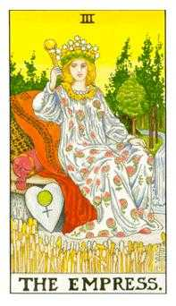
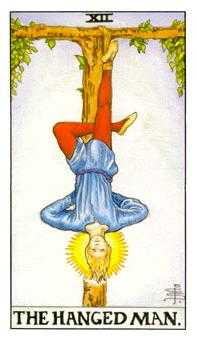
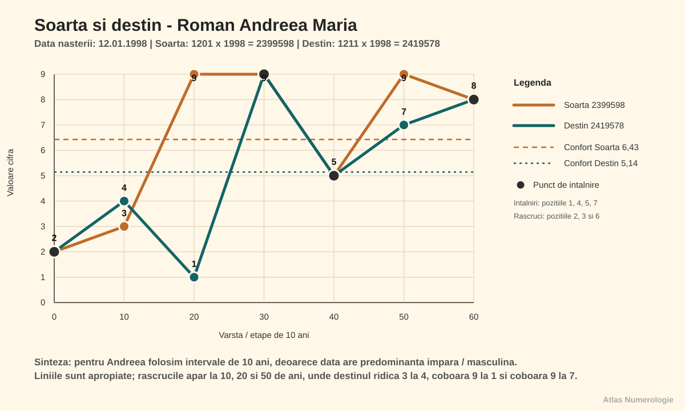
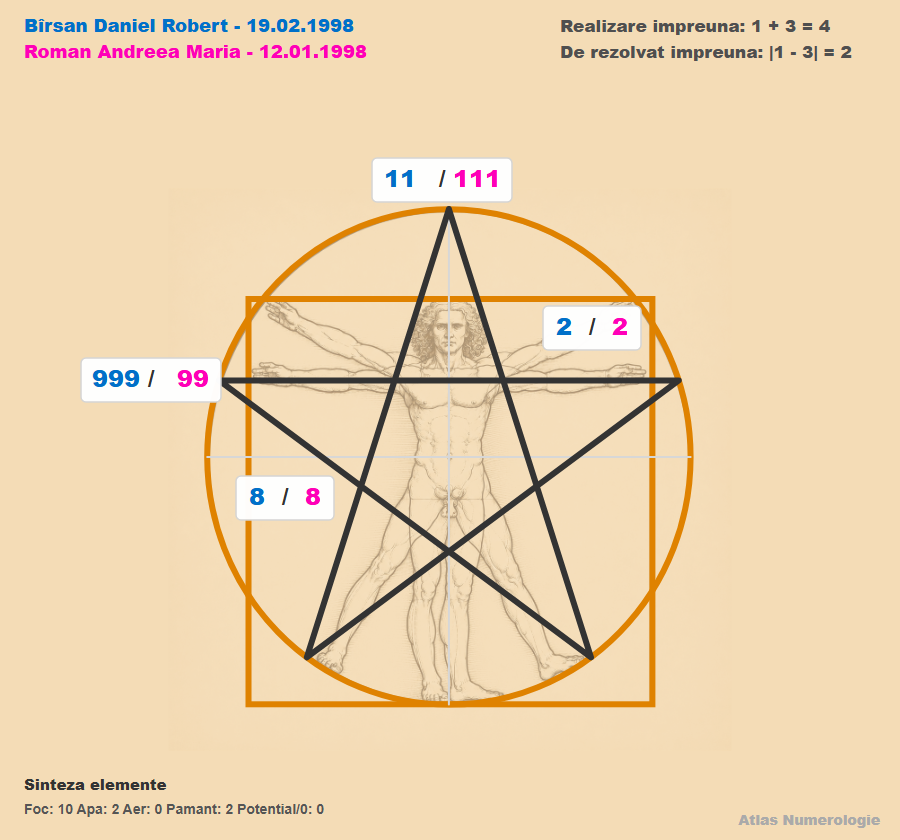
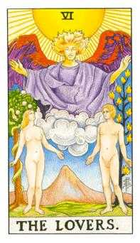
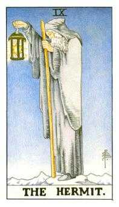

Index: RAM-19980112-v1.00r-CAP-001

# Roman Andreea Maria — 12.01.1998

Index: RAM-19980112-v1.00r-CAP-002

## Date generale

Index: RAM-19980112-v1.00r-L-001

- Persoana analizată: Roman Andreea Maria
- Prenume activ: Andreea
- Data nașterii: 12.01.1998
- Gen: feminin
- Nume anterior: nu există
- Template selectat: scurt
- Stil de redactare: conversațional
- Interval analizat: 0–108 ani
- Data lucrării: 31.07.2026
- Versiune: V1.00R
- Relație analizată: Bîrsan Daniel Robert, 19.02.1998, partener

Index: RAM-19980112-v1.00r-CAP-003

## Cuprins

Index: RAM-19980112-v1.00r-L-002

1. Vibrația interioară — Cine ești tu?
2. Vibrația exterioară — Rolul social
3. Destinul — Muntele de urcat
4. Matrița numerologică — Pătratul lui Pitagora
5. Numele — Eu și neamul
6. Spirit și karmă — Lecții și direcții de maturizare
7. Pinacluri: Oportunități și provocări
8. Ciclicități
9. Relații
10. Aplicabilitate profesională
11. Concluzii

Index: RAM-19980112-v1.00r-CAP-005

## Capitolul 1. Vibrația interioară — Cine ești tu?

Index: RAM-19980112-v1.00r-SUB-001

### 1.1. Definiție

Index: RAM-19980112-v1.00r-P-006

Andreea, vibrația interioară vorbește despre desăvârșirea caracterului și descrie natura ta lăuntrică: cine ești când nu te vede nimeni și nu trebuie să răspunzi așteptărilor din exterior. Ea arată cum primești și interpretezi ceea ce vine către tine, ce îți dorești cu adevărat, ce simți și cum înveți. De aici pornesc motivațiile și reacțiile tale autentice. Cunoscând această vibrație, îți poți recunoaște mai ușor punctele forte, slăbiciunile și direcțiile în care ai nevoie să te dezvolți.

Index: RAM-19980112-v1.00r-C-001

> [!example] Calcul
> Ziua din data de naștere = **12** → 1 + 2 = **3**

Index: RAM-19980112-v1.00r-SUB-002

### 1.2. Caracterul

Index: RAM-19980112-v1.00r-P-007

Andreea, tu ai vibrația interioară **3**: expresie, creativitate, relaționare și bucuria de a pune ideile în circulație. Arhetipal, această energie te apropie de Creator, Comunicator și Povestitor. Traseul tău adaugă o nuanță importantă: **1** pornește și își asumă inițiativa, iar **2** răspunde prin cooperare și sensibilitate; împreună formează **3**, vocea care leagă oamenii și transformă experiența într-un mesaj. Maturizarea apare când nu te împrăștii între prea multe idei, ci alegi una, îi dai formă și o duci până la un rezultat care poate fi văzut și folosit.

Index: RAM-19980112-v1.00r-SUB-003

### 1.3. Dorințele

Index: RAM-19980112-v1.00r-P-008

Îți dorești libertatea de a te exprima, oameni cu care poți schimba idei și contexte în care imaginația ta primește răspuns. Ai nevoie să simți că viața nu este doar obligație, ci și descoperire, dialog și creație.

Index: RAM-19980112-v1.00r-SUB-004

### 1.4. Motivația

Index: RAM-19980112-v1.00r-P-009

Te motivează proiectele în care poți cerceta, explica, conecta oameni sau transforma o idee într-o experiență vie. O rutină potrivită este să alegi zilnic o singură idee pe care o finalizezi înainte să deschizi alte direcții.

Index: RAM-19980112-v1.00r-SUB-005

### 1.5. Teama

Index: RAM-19980112-v1.00r-P-010

Umbra lui **3** este dispersia, promisiunea făcută din entuziasm și sensibilitatea la lipsa de răspuns. Când apare teama că nu vei fi auzită, poți vorbi prea mult sau te poți retrage brusc. Întrebarea matură este: «Care este mesajul esențial și ce formă concretă îi dau?»

Index: RAM-19980112-v1.00r-SUB-006

### 1.6. Polarități și maturizare

Index: RAM-19980112-v1.00r-T-009

<table class="polarities-table"><tbody><tr><th scope="row">Polarități pozitive</th><td><ul><li>creativitate și imaginație;</li><li>comunicare vie și capacitate de relaționare;</li><li>curiozitate și adaptare;</li><li>talent de a explica și de a transmite;</li><li>optimism care pune oamenii în mișcare.</li></ul></td></tr><tr><th scope="row">Polarități negative</th><td><ul><li>dispersie și prea multe începuturi;</li><li>nevoie de validare;</li><li>promisiuni fără continuitate;</li><li>dramatizare sau evitare prin glumă;</li><li>dificultatea de a păstra ritmul.</li></ul></td></tr><tr><th scope="row">Direcții de dezvoltare</th><td><ul><li>alege priorități puține și clare;</li><li>transformă ideea în produs, text sau acțiune;</li><li>păstrează un ritm de finalizare;</li><li>ascultă înainte să răspunzi;</li><li>folosește feedbackul ca orientare, nu ca verdict.</li></ul></td></tr></tbody></table>

Index: RAM-19980112-v1.00r-SUB-007

### 1.7. Tarot

Index: RAM-19980112-v1.00r-P-010a

Vibrația interioară **3** este asociată cu Arcana Majoră **3 — Împărăteasa**. Ea arată puterea de a hrăni o idee până când devine formă, relație, proiect sau rezultat. Pentru tine, creativitatea nu înseamnă numai inspirație, ci și capacitatea de a face un spațiu să crească, de a aduce frumusețe și de a-i ajuta pe oameni să se simtă văzuți.

Index: RAM-19980112-v1.00r-P-010b

Împărăteasa este înconjurată de natură roditoare, semn că abundența apare când energia este îngrijită și lăsată să se maturizeze. Imaginea îți amintește că talentul tău de a comunica și crea are nevoie de răbdare, ritm și grijă pentru corp. Când nu forțezi rodul, dar nici nu abandonezi procesul, ideile tale capătă consistență.

Index: RAM-19980112-v1.00r-T-010

<table><tbody><tr><td>
Index: RAM-19980112-v1.00r-G-001

<em>Arcana <strong>3</strong> — Împărăteasa</em>
</td><td><ul><li><strong>Resursă:</strong> creativitate, expresivitate și capacitatea de a face lucrurile să crească.</li><li><strong>Manifestare:</strong> comunici, conectezi oameni și dai o formă atrăgătoare ideilor.</li><li><strong>Umbră:</strong> te poți împrăștia, poți căuta validare sau poți amâna finalizarea.</li><li><strong>Maturizare:</strong> hrănești o direcție suficient de mult încât să devină rezultat.</li></ul></td></tr></tbody></table>

Index: RAM-19980112-v1.00r-CAP-006

## Capitolul 2. Vibrația exterioară — Rolul social

Index: RAM-19980112-v1.00r-SUB-008

### 2.1. Definiție

Index: RAM-19980112-v1.00r-P-011

Vibrația exterioară descrie felul în care te manifești în lume: prezența, comportamentul vizibil, imaginea socială și modul în care ceilalți îți pot percepe energia. Dacă vibrația interioară arată dinamica ta privată, vibrația exterioară arată forma prin care aceasta devine vizibilă în relații, contexte sociale și situații concrete. Ea nu spune totul despre caracter, dar indică stilul tău de apariție, reacția spontană în exterior și felul în care îți proiectezi energia. Citește-o ca pe o poartă de contact cu lumea: poate confirma vibrația interioară sau poate crea un contrast între ceea ce trăiești înăuntru și ceea ce observă ceilalți.

Index: RAM-19980112-v1.00r-C-002

> [!example] Calcul
> Luna din data de naștere = **1**

Index: RAM-19980112-v1.00r-SUB-009

### 2.2. Rolul social

Index: RAM-19980112-v1.00r-P-012

Fiind născută în luna ianuarie, ai rolul social al Pionierului, specific vibrației exterioare **1**. Oamenii te pot percepe directă, hotărâtă și capabilă să pornești lucruri. Succesul social vine când îți asumi inițiativa fără să ocupi tot spațiul și când claritatea ta deschide calea și pentru contribuția celorlalți.

Index: RAM-19980112-v1.00r-SUB-010

### 2.3. Interior și exterior

Index: RAM-19980112-v1.00r-P-013

Andreea, dacă în interior ești **3**, la exterior oamenii te pot percepe ca pe un **1**. Înăuntru ai nevoie de dialog, creativitate și varietate; în exterior poți apărea mai fermă și mai decisă. **3** spune «hai să găsim o idee», iar **1** spune «hai să începem». Împreună te ajută să transformi comunicarea în inițiativă.

Index: RAM-19980112-v1.00r-P-013a

Puntea dintre interior și exterior arată ajustarea dintre expresivitatea ta lăuntrică și imaginea hotărâtă pe care o proiectezi. Ea te ajută să observi când inițiativa lui **1** exprimă autentic creativitatea lui **3** și când, dimpotrivă, graba taie dialogul de care ai nevoie.

Index: RAM-19980112-v1.00r-C-002a

> [!example] Calculul punții interior–exterior
> |**3** − **1**| = **2**

Index: RAM-19980112-v1.00r-P-013b

Rezultatul **2** cere autenticitate prin cooperare. Spune limpede ce vrei să pornești, dar întreabă și ce vede celălalt. Când îmbini inițiativa cu ascultarea, oamenii te pot accepta ca lider fără ezitare, pentru că direcția ta nu îi exclude, ci îi ajută să își găsească locul în construcție.

Index: RAM-19980112-v1.00r-CAP-007

## Capitolul 3. Destinul — Muntele de urcat

Index: RAM-19980112-v1.00r-SUB-011

### 3.1. Definiție și calcul

Index: RAM-19980112-v1.00r-P-014

Destinul sintetizează data completă și arată o direcție de maturizare, nu un eveniment obligatoriu. Pentru destin păstrăm accentul pe rezultatul final.

Index: RAM-19980112-v1.00r-C-003

> [!example] Calcul
> Toate cifrele adunate din data de naștere = 1 + 2 + 0 + 1 + 1 + 9 + 9 + 8 = **31** → 3 + 1 = **4**

Index: RAM-19980112-v1.00r-SUB-012

### 3.2. Interpretare

Index: RAM-19980112-v1.00r-P-015

Andreea, Destinul compus **4** păstrează întâlnirea dintre **3**, care comunică și creează, și **1**, care inițiază și își asumă direcția. Rezultatul **4** îți cere să transformi această combinație într-o construcție stabilă: program, reguli, corp îngrijit, responsabilități clare și rezultate repetabile. Darul tău este să dai formă ideilor; umbra este să simți structura ca pe o limitare sau, invers, să devii rigidă când vrei siguranță. Maturizarea apare când disciplina devine cadrul care îți protejează creativitatea.

Index: RAM-19980112-v1.00r-CAP-008

## Capitolul 4. Matrița numerologică — Pătratul lui Pitagora

Index: RAM-19980112-v1.00r-SUB-013

### 4.1. Matricea datei de naștere

Index: RAM-19980112-v1.00r-P-016

Matricea pornește de la cifrele datei de naștere și de la cele patru numere de lucru. Ea arată ce energii îți sunt deja la îndemână și unde ai nevoie de aport din experiență, relații sau exercițiu. Privind pătratul tău, vei observa că unele căsuțe sunt pline, iar altele goale: cele pline indică resurse ușor de accesat, iar cele goale arată direcții care se construiesc conștient. Cele **9** căsuțe pot fi privite ca nouă computere energetice sau sfere de inteligență:

- **Căsuța 1** — inteligența psihică;
- **Căsuța 2** — inteligența emoțională;
- **Căsuța 3** — inteligența prelucrării informațiilor;
- **Căsuța 4** — inteligența corporală;
- **Căsuța 5** — inteligența intuitivă;
- **Căsuța 6** — inteligența pragmatismului;
- **Căsuța 7** — inteligența spirituală;
- **Căsuța 8** — inteligența puterii și inteligența socială;
- **Căsuța 9** — inteligența mentală.

Fiecare sferă înseamnă mult mai mult decât această scurtă descriere; important este să îți folosești conștient resursele și să construiești echilibrat zonele mai puțin active.

Index: RAM-19980112-v1.00r-C-004

> [!example] Calcul
> Data nașterii: 12.01.1998 → data compactă = **12011998**  
> N1 = 1 + 2 + 0 + 1 + 1 + 9 + 9 + 8 = **31**  
> N2 = 3 + 1 = **4**  
> N3 = 31 − (2 × 1) = **29**  
> N4 = 2 + 9 = **11**  
> Șir complet = 12011998 + 31 + 4 + 29 + 11 = **120119983142911**

Index: RAM-19980112-v1.00r-G-002

1

111111

optim 111

<svg viewBox="0 0 40 32" role="img"><polygon points="20,5 30,22 10,22"/><polygon points="20,27 10,10 30,10"/></svg>

4

4

optim 44

<svg viewBox="0 0 40 32" role="img"><circle cx="20" cy="16" r="6"/></svg>

7

-

optim 7

2

22

optim 222

<svg viewBox="0 0 40 32" role="img"><line x1="17.1" y1="16" x2="22.9" y2="16" style="stroke-linecap:butt"/><circle cx="10" cy="16" r="6"/><circle cx="30" cy="16" r="6"/></svg>

5

-

optim 55

8

8

optim 8

<svg viewBox="0 0 40 32" role="img"><circle cx="20" cy="16" r="6"/></svg>

3

3

optim 333

<svg viewBox="0 0 40 32" role="img"><circle cx="20" cy="16" r="6"/></svg>

6

-

optim 66

9

999

optim 9

<svg viewBox="0 0 40 32" role="img"><polygon points="20,4 33,27 7,27"/></svg>

Index: RAM-19980112-v1.00r-P-035

**Căsuța 1.** Ai **6** apariții. Psihicul, inițiativa și voința sunt foarte intense: poți susține presiune, poți genera multe idei și poți prelua conducerea. Umbra este rigiditatea și tendința de a decide că numai varianta ta este corectă. Puterea ta devine matură atunci când conduci fără să transformi fermitatea în control.

Index: RAM-19980112-v1.00r-P-036

**Căsuța 2.** Ai **2** apariții. Emoțiile, comunicarea și colaborarea circulă în ambele sensuri: poți primi și oferi sprijin. Numărul par de apariții poate aduce indecizie, de aceea te ajută să numești ce simți și să alegi după un dialog clar.

Index: RAM-19980112-v1.00r-P-037

**Căsuța 3.** Ai **1** apariție. Relațiile și prelucrarea informației sunt disponibile, dar au nevoie de focalizare. Curiozitatea te ajută să cercetezi; maturizarea apare când selectezi esențialul și îl transmiți fără să te risipești.

Index: RAM-19980112-v1.00r-P-038

**Căsuța 4.** Ai **1** apariție. Corpul, organizarea și orientarea spre rezultate concrete îți oferă o bază accesibilă. Ea rămâne sănătoasă când îți respecți programul, somnul și mișcarea, fără să transformi ordinea în perfecționism.

Index: RAM-19980112-v1.00r-P-039

**Căsuța 5.** Nu ai apariții, iar energia libertății, stimei de sine, curajului și nonconformismului este conservată. Ea se activează prin oameni și contexte care te încurajează să ieși din tipare. Construiește-o prin experiențe noi, limite sănătoase și alegeri asumate.

Index: RAM-19980112-v1.00r-P-040

**Căsuța 6.** Nu ai apariții. Iubirea ca ocrotire, pragmatismul, familia și administrarea concretă pot oscila și au nevoie de aport extern. Responsabilitățile împărțite, bugetul și ritualurile de familie te ajută să transformi intenția afectivă în grijă vizibilă.

Index: RAM-19980112-v1.00r-P-041

**Căsuța 7.** Nu ai apariții. Analiza profundă, solitudinea și înțelepciunea sunt energii conservate, construite prin studiu, repaus și experiențe care te obligă să încetinești. Nu căuta răspunsul numai în reacția rapidă; lasă-i timp să se așeze.

Index: RAM-19980112-v1.00r-P-042

**Căsuța 8.** Ai **1** apariție. Puterea, responsabilitatea și performanța sunt disponibile într-o formă echilibrată. Folosește-le pentru a administra corect și a duce lucrurile până la capăt, fără să preiei poverile tuturor.

Index: RAM-19980112-v1.00r-P-043

**Căsuța 9.** Ai **3** apariții. Inteligența, memoria, transformarea și orientarea către idealuri sunt puternice. Poți învăța repede și vedea imaginea largă; protejează această resursă prin priorități și pauze, ca mintea să nu devină suprasolicitată.

Index: RAM-19980112-v1.00r-SUB-015

### 4.3. Elemente și temperament

Index: RAM-19980112-v1.00r-T-012Index: RAM-19980112-v1.00r-P-044

Foc<strong>9</strong>

Pământ<strong>2</strong>

Aer<strong>1</strong>

Apă<strong>2</strong>

<ul class="element-definitions"><li><strong>Focul</strong> este esența vieții, a duhului și a spiritului care animă și activează.</li><li><strong>Pământul</strong> hrănește și dă formă.</li><li><strong>Aerul</strong> eliberează și stimulează inteligența conceptuală.</li><li><strong>Apa</strong> susține emoțiile, flexibilitatea și acumularea.</li></ul>

Index: RAM-19980112-v1.00r-P-045

Temperamentul tău predominant este **coleric**: Focul are **9** apariții, față de Pământ cu **2**, Apă cu **2** și Aer cu **1**. Reacționezi repede și ai multă energie de pornire. Echilibrul vine când dai Focului un scop, iar corpul, emoțiile și reflecția primesc timp egal în program.

Index: RAM-19980112-v1.00r-SUB-016

### 4.4. Masculin și feminin

Index: RAM-19980112-v1.00r-P-017

Total: <strong>14</strong> cifre

<strong>Impare · 10</strong><strong>Pare · 4</strong>

Matricea are **10** apariții impare și **4** pare. Inițiativa și proiecția sunt dominante, iar energia receptivă există ca resursă de echilibru. Cifrele pare te ajută să primești și să dai mai departe, dar pot aduce indecizie; folosește dialogul ca să clarifici, apoi alege fără să prelungești oscilația.

Index: RAM-19980112-v1.00r-SUB-017

### 4.5. Daruri și nevoi

Index: RAM-19980112-v1.00r-P-018

Darurile și nevoile se citesc din căsuțele cu cel puțin **2** cifre: la tine sunt **1**, **2** și **9**. Darurile sunt voința și inițiativa, sensibilitatea relațională și forța mentală. Nevoile corespunzătoare sunt autonomia și respectul pentru propria direcție (**1**), siguranța emoțională și cooperarea (**2**), precum și sensul, învățarea și transformarea (**9**).

Index: RAM-19980112-v1.00r-SUB-017a

### 4.6. Scara bunăstării

Index: RAM-19980112-v1.00r-P-019

Scara bunăstării arată că treapta cea mai înaltă este vectorul **789, Creativitate**, cu **35**. El este susținut îndeaproape de diagonala **159, Carieră**, cu **33**, și de vectorul **369, Bunăstare materială**, cu **30**. Pentru tine, împlinirea crește când mintea și capacitatea de transformare din căsuța **9** alimentează energia de lucru din vectorul **123, Energie**, iar ideile sunt așezate într-o carieră și într-o structură materială. Creativitatea nu este separată de bani: devine prosperă când are termen, formă, preț și continuitate.

Index: RAM-19980112-v1.00r-G-004

Vector 789 — Creativitate35

Vector 159 — Cariera33

Vector 369 — Bunastare materiala30

<i class="element-dot element-foc"></i>Căsuța 927

Vector 123 — Energie13

Vector 258 — Social12

Vector 147 — Spiritualitate10

<i class="element-dot element-pamant"></i>Căsuța 88

<i class="element-dot element-foc"></i>Căsuța 16

<i class="element-dot element-apa"></i>Căsuța 24

<i class="element-dot element-pamant"></i>Căsuța 44

Vector 456 — Vointa4

<i class="element-dot element-aer"></i>Căsuța 33

Vector 357 — Scopuri3

<i class="element-dot element-foc"></i>Căsuța 50

<i class="element-dot element-apa"></i>Căsuța 60

<i class="element-dot element-aer"></i>Căsuța 70

<i class="element-dot element-foc"></i>Foc<i class="element-dot element-pamant"></i>Pământ<i class="element-dot element-apa"></i>Apă<i class="element-dot element-aer"></i>Aer

Index: RAM-19980112-v1.00r-CAP-009

## Capitolul 5. Numele — Eu și neamul

Index: RAM-19980112-v1.00r-SUB-018

### 5.1. Numărul activ

Index: RAM-19980112-v1.00r-P-020a

Numărul activ este influența directă a numelui folosit zi de zi asupra comportamentului curent. El arată ce energie aduce numele în reacțiile tale obișnuite, în felul în care intri într-un context și în impresia pe care o susții prin acțiunile repetate.

Index: RAM-19980112-v1.00r-C-009

> [!example] Calcul
> Andreea = 30 → 3 + 0 = **3**

Index: RAM-19980112-v1.00r-P-021

Numărul activ **3** aduce în comportamentul tău curent comunicare, curiozitate și capacitatea de a face conexiuni. Resursa este să explici și să apropii oamenii; umbra este să deschizi prea multe direcții. Alege mesajul principal și încheie ceea ce ai promis.

Index: RAM-19980112-v1.00r-SUB-019

### 5.2. Numărul intim

Index: RAM-19980112-v1.00r-P-021b

Numărul intim se calculează din vocalele numelui complet și descrie motivația afectivă, dorințele profunde și ceea ce îți hrănește lumea interioară. Dacă Numărul activ arată energia cu care intri în viața de zi cu zi, Numărul intim arată vocea mai discretă care îți spune ce are sens pentru tine.

Index: RAM-19980112-v1.00r-C-009a

> [!example] Calcul
> Vocalele = 30 → 3 + 0 = **3**

Index: RAM-19980112-v1.00r-P-021c

Numărul intim **3** caută bucurie, dialog și libertatea de a crea. Te hrănesc oamenii cu care poți fi spontană și proiectele care îți dau o voce. Umbra este dependența de reacția publicului; păstrează creația vie chiar și când validarea întârzie.

Index: RAM-19980112-v1.00r-SUB-020

### 5.3. Numărul ereditar

Index: RAM-19980112-v1.00r-C-008

> [!example] Calcul
> Roman = 25 → 2 + 5 = **7**

Index: RAM-19980112-v1.00r-P-020

Numărul ereditar **7** aduce o memorie de neam legată de studiu, observație, discreție și căutarea adevărului. Păstrează profunzimea, dar nu transforma prudența moștenită în izolare.

Index: RAM-19980112-v1.00r-SUB-021

### 5.4. Numărul ereditar karmic

Index: RAM-19980112-v1.00r-P-022b

Numărul ereditar karmic arată o memorie simbolică a neamului și felul în care poți continua conștient resursele lui, fără să preiei automat limitele sau poverile transmise.

Index: RAM-19980112-v1.00r-C-005

> [!example] Calcul în intervalul 1–22
> Roman = 25 → 25 − 22 = **3**

Index: RAM-19980112-v1.00r-T-013

<table class="tarot-profile-table"><tbody><tr><td>Index: RAM-19980112-v1.00r-G-003 
<em>Arcana <strong>3</strong> — Împărăteasa</em>
</td><td><ul><li><strong>Resursă moștenită:</strong> creativitate, grijă și puterea de a face lucrurile să crească.</li><li><strong>Manifestare:</strong> creezi spații fertile pentru oameni și proiecte.</li><li><strong>Umbră:</strong> comoditate, risipire sau nevoie de validare.</li><li><strong>Maturizare:</strong> transformi grija și frumusețea în rezultate durabile.</li></ul></td></tr></tbody></table>

Index: RAM-19980112-v1.00r-P-022c

Numărul ereditar karmic **3**, asociat Împărătesei, vorbește despre o moștenire de creativitate, fertilitate simbolică și capacitatea de a hrăni oameni, idei sau comunități. Ești susținută când creezi, îngrijești și dai formă frumosului fără să uiți scopul practic.

Index: RAM-19980112-v1.00r-P-022d

Umbra este să confunzi grija cu supraprotecția ori abundența cu risipa. Maturizarea apare când lași fiecare proiect și fiecare om să crească în ritmul propriu, iar tu păstrezi limite, măsură și continuitate.

Index: RAM-19980112-v1.00r-SUB-022

### 5.5. Numărul de realizare

Index: RAM-19980112-v1.00r-P-021a

Numărul de realizare este asociat cu Vibrația exterioară: ambele arată impresia pe care o lași asupra celorlalți, manierele, comportamentul vizibil și felul în care energia ta devine recognoscibilă în lume. Acest număr poate amplifica realizările concrete sau le poate frâna atunci când este trăit prin umbra sa.

Index: RAM-19980112-v1.00r-C-010

> [!example] Calcul
> Consoanele = 49 → 4 + 9 = 13 → 1 + 3 = **4**

Index: RAM-19980112-v1.00r-P-022

Numărul de realizare **4** te face vizibilă ca persoană organizată, serioasă și capabilă să construiască. El poate amplifica rezultatele prin disciplină și consecvență. Umbra este rigiditatea, controlul și teama de schimbare; lasă structura să susțină viața, nu să o blocheze.

Index: RAM-19980112-v1.00r-P-022a

Vibrația exterioară **1** și Numărul de realizare **4** formează o combinație practică: **1** pornește, iar **4** construiește. Oamenii pot vedea în tine inițiativă și stabilitate. Ai grijă ca hotărârea să nu devină inflexibilitate; cere feedback înainte să fixezi definitiv forma.

Index: RAM-19980112-v1.00r-SUB-023

### 5.6. Numărul de exprimare

Index: RAM-19980112-v1.00r-P-023a

Numărul de exprimare reprezintă personalitatea ta, cheia către ceea ce poți deveni. El contribuie la formarea personalității tale și arată felul în care resursele din nume se pot reuni într-o expresie matură.

Index: RAM-19980112-v1.00r-C-012

> [!example] Calcul
> Roman = 25 → **7**  
> Andreea = 30 → **3**  
> Maria = 24 → **6**  
> Numărul de exprimare = 7 + 3 + 6 = 16 → 1 + 6 = **7**

Index: RAM-19980112-v1.00r-P-024

Numărul de exprimare **7** te susține în activități care cer cercetare, analiză, specializare, consiliere, educație sau înțelegerea mecanismelor ascunse. Ai nevoie de autonomie intelectuală și de timp pentru aprofundare. Lumea poate aștepta de la tine concluzii bine gândite, nu reacții grăbite.

Index: RAM-19980112-v1.00r-P-024a

Armonizarea dintre Numărul de exprimare **7** și Destinul **4** cere să transformi cunoașterea în metodă. **7** investighează și caută adevărul; **4** organizează și construiește. Când lucrează împreună, poți crea sisteme solide, cursuri, proceduri sau proiecte în care profunzimea devine utilă. Evită izolarea lui **7** și rigiditatea lui **4** prin colaborări bine alese și termene clare.

Index: RAM-19980112-v1.00r-SUB-023a

### 5.7. Codul numerologic al numelui

#### Numele actual — Roman Andreea Maria

Index: RAM-19980112-v1.00r-C-011

> [!example] Calcul
> Roman = R9 + O6 + M4 + A1 + N5 → **96415**
>
> Andreea = A1 + N5 + D4 + R9 + E5 + E5 + A1 → **1549551**
>
> Maria = M4 + A1 + R9 + I9 + A1 → **41991**
>
> Codul literelor numelui = **96415154955141991**
> Codul numerologic personal al numelui = 96415154955141991 + 7 = **964151549551419917**

Index: RAM-19980112-v1.00r-G-002a

data 111111

11111

optim 111

<svg viewBox="0 0 40 32" role="img"><polygon points="20,3 24,13 35,13 26,20 30,30 20,24 10,30 14,20 5,13 16,13"/></svg>

data 4

444

optim 44

<svg viewBox="0 0 40 32" role="img"><polygon points="20,4 33,27 7,27"/></svg>

data -

7

optim 7

<svg viewBox="0 0 40 32" role="img"><circle cx="20" cy="16" r="6"/></svg>

data 22

-

optim 222

data -

5555

optim 55

<svg viewBox="0 0 40 32" role="img"><rect x="8" y="4" width="24" height="24"/></svg>

data 8

-

optim 8

data 3

-

optim 333

data -

6

optim 66

<svg viewBox="0 0 40 32" role="img"><circle cx="20" cy="16" r="6"/></svg>

data 999

9999

optim 9

<svg viewBox="0 0 40 32" role="img"><rect x="8" y="4" width="24" height="24"/></svg>

Index: RAM-19980112-v1.00r-P-023

Comparând pătratul datei cu pătratul numelui, energiile comune sunt **1**, **4** și **9**. Numele confirmă inițiativa, capacitatea de organizare și forța mentală; aici identitatea exprimată și structura nativă se susțin reciproc.

Index: RAM-19980112-v1.00r-P-023b

Prin **1**, numele îți amplifică voința și originalitatea. Prin **4**, îți întărește imaginea de om practic și organizat. Prin **9**, adaugă memorie, viziune și capacitate de transformare. Aceste energii pot deveni repere constante dacă sunt folosite cu măsură.

Index: RAM-19980112-v1.00r-P-023c

Energiile **5**, **6** și **7** apar numai în matricea numelui. Numele îți poate da impresia că libertatea și curajul lui **5**, pragmatismul și grija lui **6**, respectiv introspecția lui **7** îți sunt complet naturale. În matricea datei ele sunt conservate, deci au nevoie de experiență, rutină și sprijin exterior ca să devină resurse constante.

Index: RAM-19980112-v1.00r-P-023d

Energiile **2**, **3** și **8** sunt prezente în data ta, dar nu în matricea numelui. Sensibilitatea, comunicarea spontană și responsabilitatea există nativ, însă nu sunt întotdeauna susținute de imaginea pe care o proiectează numele. Spune clar ce simți și ce îți asumi, ca oamenii să poată vedea și aceste părți ale tale.

Index: RAM-19980112-v1.00r-CAP-007b

## Capitolul 6. Spirit și karmă — Lecții și direcții de maturizare

Index: RAM-19980112-v1.00r-SUB-038

### 6.1. Codul Spiritului și vârsta Spiritului

Index: RAM-19980112-v1.00r-P-182

Codul Spiritului se citește din ziua și luna nașterii și arată zona mare de maturizare spirituală. Pentru tine, Andreea, el arată felul în care experiența se transformă în înțelepciune și serviciu.

Index: RAM-19980112-v1.00r-P-185

În tabel, poziția ta este la ziua **12** și luna **I**, unde apare codul **41**.

Index: RAM-19980112-v1.00r-T-017

| Ziua | I | II | III | IV | V | VI | VII | VIII | IX | X | XI | XII |
| --- | ---: | ---: | ---: | ---: | ---: | ---: | ---: | ---: | ---: | ---: | ---: | ---: |
| 1 | 52 | 50 | 48 | 46 | 44 | 42 | 40 | 38 | 36 | 34 | 32 | 30 |
| 2 | 51 | 49 | 47 | 45 | 43 | 41 | 39 | 37 | 35 | 33 | 31 | 29 |
| 3 | 50 | 48 | 46 | 44 | 42 | 40 | 38 | 36 | 34 | 32 | 30 | 28 |
| 4 | 49 | 47 | 45 | 43 | 41 | 39 | 37 | 35 | 33 | 31 | 29 | 27 |
| 5 | 48 | 46 | 44 | 42 | 40 | 38 | 36 | 34 | 32 | 30 | 28 | 26 |
| 6 | 47 | 45 | 43 | 41 | 39 | 37 | 35 | 33 | 31 | 29 | 27 | 25 |
| 7 | 46 | 44 | 42 | 40 | 38 | 36 | 34 | 32 | 30 | 28 | 26 | 24 |
| 8 | 45 | 43 | 41 | 39 | 37 | 35 | 33 | 31 | 29 | 27 | 25 | 23 |
| 9 | 44 | 42 | 40 | 38 | 36 | 34 | 32 | 30 | 28 | 26 | 24 | 22 |
| 10 | 43 | 41 | 39 | 37 | 35 | 33 | 31 | 29 | 27 | 25 | 23 | 21 |
| 11 | 42 | 40 | 38 | 36 | 34 | 32 | 30 | 28 | 26 | 24 | 22 | 20 |
| 12 | 41 | 39 | 37 | 35 | 33 | 31 | 29 | 27 | 25 | 23 | 21 | 19 |
| 13 | 40 | 38 | 36 | 34 | 32 | 30 | 28 | 26 | 24 | 22 | 20 | 18 |
| 14 | 39 | 37 | 35 | 33 | 31 | 29 | 27 | 25 | 23 | 21 | 19 | 17 |
| 15 | 38 | 36 | 34 | 32 | 30 | 28 | 26 | 24 | 22 | 20 | 18 | 16 |
| 16 | 37 | 35 | 33 | 31 | 29 | 27 | 25 | 23 | 21 | 19 | 17 | 15 |
| 17 | 36 | 34 | 32 | 30 | 28 | 26 | 24 | 22 | 20 | 18 | 16 | 14 |
| 18 | 35 | 33 | 31 | 29 | 27 | 25 | 23 | 21 | 19 | 17 | 15 | 13 |
| 19 | 34 | 32 | 30 | 28 | 26 | 24 | 22 | 20 | 18 | 16 | 14 | 12 |
| 20 | 33 | 31 | 29 | 27 | 25 | 23 | 21 | 19 | 17 | 15 | 13 | 11 |
| 21 | 32 | 30 | 28 | 26 | 24 | 22 | 20 | 18 | 16 | 14 | 12 | 10 |
| 22 | 31 | 29 | 27 | 25 | 23 | 21 | 19 | 17 | 15 | 13 | 11 | 9 |
| 23 | 30 | 28 | 26 | 24 | 22 | 20 | 18 | 16 | 14 | 12 | 10 | 8 |
| 24 | 29 | 27 | 25 | 23 | 21 | 19 | 17 | 15 | 13 | 11 | 9 | 7 |
| 25 | 28 | 26 | 24 | 22 | 20 | 18 | 16 | 14 | 12 | 10 | 8 | 6 |
| 26 | 27 | 25 | 23 | 21 | 19 | 17 | 15 | 13 | 11 | 9 | 7 | 5 |
| 27 | 26 | 24 | 22 | 20 | 18 | 16 | 14 | 12 | 10 | 8 | 6 | 4 |
| 28 | 25 | 23 | 21 | 19 | 17 | 15 | 13 | 11 | 9 | 7 | 5 | 3 |
| 29 | 24 |  | 20 | 18 | 16 | 14 | 12 | 10 | 8 | 6 | 4 | 2 |
| 30 | 23 |  | 19 | 17 | 15 | 13 | 11 | 9 | 7 | 5 | 3 | 1 |
| 31 | 22 |  | 18 |  | 14 |  | 10 | 8 |  | 4 |  | 0 |

Index: RAM-19980112-v1.00r-P-186

Andreea, codul **41** te așază în zona **Harurilor**. Spiritul tău învață prin intuiție, ghidare, cunoaștere rafinată și capacitatea de a pune experiența în slujba celorlalți. Harul nu înseamnă scutire de efort; devine valoros când îl disciplinezi, îl verifici și îl transformi într-un ajutor concret.

Index: RAM-19980112-v1.00r-T-018

| Zona | Interval cod | Nivel simbolic | Teme principale |
| --- | --- | --- | --- |
| Iubire | 1-13 | 0-2.500 ani | relații, emoții, atașamente, compasiune, vulnerabilitate |
| Rațiune | 14-26 | 2.500-5.000 ani | logică, discernământ, structură, analiză, minte |
| Material | 27-39 | 5.000-7.500 ani | bani, construcție, putere, manifestare, responsabilitate |
| Haruri | 40-52 | 7.500-10.000 ani | înțelepciune, haruri spirituale, ghidare, serviciu, intuiție |

Index: RAM-19980112-v1.00r-T-019

<table class="stage-table">
<colgroup><col style="width:3%"><col style="width:22%"><col style="width:8%"><col style="width:18%"><col style="width:49%"></colgroup>
<thead><tr><th>Etapă</th><th>Descriere etapă</th><th>Subetapă</th><th>Lecție</th><th>Descriere subetapă</th></tr></thead>
<tbody>
<tr class="stage-love"><td rowspan="4">1</td><td rowspan="4">Înțelegere și stabilizare</td><td>1</td><td>Început de cale</td><td>Înțeleg cine sunt și ce am de făcut pe pământ.</td></tr>
<tr class="stage-love current-row"><td>2</td><td>Interacțiune</td><td>Înțeleg cine sunt și ce am de făcut în raport cu alte persoane.</td></tr>
<tr class="stage-love"><td>3</td><td>Căutarea echilibrului</td><td>Înțeleg echilibrul dintre centru și margini, dintre apropiere și mișcare.</td></tr>
<tr class="stage-love"><td>4</td><td>Stabilitate</td><td>Stabilizez tot ce am înțeles până acum.</td></tr>
<tr class="stage-reason"><td rowspan="4">2</td><td rowspan="4">Experimentare și manifestare</td><td>5</td><td>Schimbare</td><td>Experimentez și învăț ce a rămas de lucrat, dar altfel decât până acum.</td></tr>
<tr class="stage-reason"><td>6</td><td>Prelucrarea karmei</td><td>Balansez, prelucrez ce am acumulat și creez teren stabil pentru o nouă etapă.</td></tr>
<tr class="stage-reason"><td>7</td><td>Depășirea obstacolelor</td><td>Sunt pregătit pentru experiențe mai intense și învăț să nu fug de ele.</td></tr>
<tr class="stage-reason"><td>8</td><td>Succesul</td><td>Culeg roadele a ceea ce am învățat și mă manifest responsabil.</td></tr>
<tr class="stage-material"><td rowspan="4">3</td><td rowspan="4">Finalizare și orientare către ceilalți</td><td>9</td><td>Finalizarea</td><td>Închei ce ține de mine, ca să pot privi dincolo de mine.</td></tr>
<tr class="stage-material"><td>10</td><td>Norocul</td><td>Învăț să primesc, să colaborez și să las viața să mă așeze în contexte potrivite.</td></tr>
<tr class="stage-material"><td>11</td><td>Slujirea</td><td>Îi slujesc pe alții prin experiența și maturitatea acumulată.</td></tr>
<tr class="stage-material"><td>12</td><td>Sacrificiul</td><td>Învăț diferența dintre dăruire conștientă și pierdere de sine.</td></tr>
<tr class="stage-gifts"><td>4</td><td>Examen</td><td>13</td><td>Examenul</td><td>Integrez lecția și trec spre un nivel nou de înțelegere.</td></tr>
</tbody>
</table>

Index: RAM-19980112-v1.00r-P-192

Subetapa ta este **2 — Interacțiunea**. Lecția este să înțelegi cine ești în raport cu ceilalți: ce oferi, ce primești, unde începe responsabilitatea ta și unde trebuie să îi lași celuilalt propriul drum. Harurile tale se maturizează în relație, prin ascultare și schimb real, nu prin izolare.

Index: RAM-19980112-v1.00r-P-193

Vârsta Spiritului arată simbolic experiența acumulată până la naștere și apoi experiența actualizată cu vârsta biologică.

Index: RAM-19980112-v1.00r-C-003d

> [!example] Calcul
> Vârsta la naștere = (41 × 189) − 189 = 7.749 − 189 = **7.560 ani**
>
> Vârsta actuală = 7.560 + 28 = **7.588 ani**

Index: RAM-19980112-v1.00r-P-197

Ghidarea practică este să nu păstrezi intuiția numai pentru tine. Notează ceea ce observi, verifică prin studiu și experiență, apoi oferă concluzia într-o formă folositoare. Codul **41** crește când harul se întâlnește cu responsabilitatea.

Index: RAM-19980112-v1.00r-SUB-007a

### 6.2. Karma din ziua de naștere

Index: RAM-19980112-v1.00r-P-009a

În lectura numerologică, ziua de naștere arată o încărcătură karmică simbolică. Fiind născută în ziua de **12**, te afli în intervalul **10–19**, asociat unei karme împlinite spre **80%**. Ziua ta este reprezentată de Arcana **12 — Spânzuratul**.

Index: RAM-19980112-v1.00r-C-001a

> [!example] Calcul
> Ziua nașterii = **12**
>
> Arcana karmică = **12 — Spânzuratul**
>
> Intervalul 10–19 = karma împlinită **spre 80%**

Index: RAM-19980112-v1.00r-G-001a

_Arcana **12** — Spânzuratul. Karma din ziua de naștere_

Index: RAM-19980112-v1.00r-P-009b

Spânzuratul vorbește despre schimbarea perspectivei, răbdare și renunțarea la controlul inutil. Lecția nu este să rămâi blocată sau să te sacrifici fără limită, ci să înțelegi când o pauză te ajută să vezi altfel și când amânarea devine evitare. Integrată matur, această energie îți dă profunzime și capacitatea de a găsi sens într-o experiență dificilă.

Index: RAM-19980112-v1.00r-P-009b1

Umbra karmei **12** poate fi așteptarea prea lungă, rolul de victimă sau tendința de a purta responsabilități care nu îți aparțin. Poți confunda răbdarea cu lipsa de decizie. Semnul practic este stagnarea repetată fără o înțelegere nouă.

Index: RAM-19980112-v1.00r-P-009b2

Cheia este să folosești pauza pentru claritate, apoi să alegi. Indicația spre **80%** arată o temă avansată, nu încheiată: păstrează compasiunea, dar pune limite și transformă perspectiva nouă într-un pas concret.

Index: RAM-19980112-v1.00r-SUB-010a

### 6.3. Karma din luna de naștere

Index: RAM-19980112-v1.00r-P-013c

Karma din luna de naștere arată datoria socială, familială sau personală legată de luna în care te-ai născut. Luna se păstrează ca număr între **1** și **12**, fără reducere, și indică o direcție de maturizare în raport cu familia, neamul, locul de origine sau propria persoană. Această karmă nu vorbește despre vină, ci despre o responsabilitate pe care o poți transforma în relații mai sănătoase și în alegeri mai conștiente.

Index: RAM-19980112-v1.00r-C-002b

> [!example] Calcul
> Luna nașterii = **1**
>
> Karma lunii = **karma față de frate sau soră**

Index: RAM-19980112-v1.00r-P-013d

Luna **1** îți cere susținere, ocrotire și ajutor responsabil în raport cu un frate, o soră sau cu persoane trăite simbolic în acest rol. Lecția nu este să conduci viața celuilalt, ci să fii prezentă fără să îi iei autonomia. Ajutorul matur oferă sprijin, spune adevărul și păstrează limite.

Index: RAM-19980112-v1.00r-SUB-012a

### 6.4. Karma din Calea Destinului

Index: RAM-19980112-v1.00r-P-015a

Karma din Calea Destinului păstrează suma compusă a tuturor cifrelor datei. Pentru tine citim amprenta **31**, nu doar Destinul **4**, deoarece **31** păstrează nuanța karmică a drumului.

Index: RAM-19980112-v1.00r-C-003a

> [!example] Calcul
> 1 + 2 + 0 + 1 + 1 + 9 + 9 + 8 = **31**
>
> Karma din Calea Destinului = **31**
>
> Intervalul 30–39 = categoria karmică **3**

Index: RAM-19980112-v1.00r-P-015b

Andreea, Calea karmică **31** este asociată simbolic cu Arcana **9 — Eremitul**. Ea vorbește despre o lume interioară bogată, interes pentru carte, filozofie, sens și cunoaștere, dar și despre riscul autoizolării. **3** aduce expresia și forma, iar **1** păstrează distanța și independența; împreună pot crea un om care înțelege mult, dar care trebuie să aleagă conștient când iese din spațiul interior pentru a împărtăși ceea ce știe. Imaginea unei vieți anterioare de actor sau comediant cu relații instabile este o metaforă tradițională, nu un fapt verificabil; ea avertizează asupra folosirii farmecului fără responsabilitate. Direcția matură este să transformi singurătatea în studiu, nu în izolare, și cunoașterea în ghidare folositoare.

Index: RAM-19980112-v1.00r-G-001b

_Arcana **9** — Eremitul. Karma din Calea Destinului **31**._

Index: RAM-19980112-v1.00r-SUB-012b

### 6.5. Concluzie: direcția de lucru

Index: RAM-19980112-v1.00r-P-015c

Codul Spiritului **41**, zona Harurilor și subetapa **2 — Interacțiunea** arată că darurile tale se maturizează prin relație și serviciu. Vârsta simbolică de **7.588 de ani** susține aceeași zonă. Karmele **12**, **1** și **31** cer să unești perspectiva, ajutorul responsabil și profunzimea: să nu te sacrifici inutil, să nu conduci în locul celuilalt și să nu transformi introspecția în izolare.

Index: RAM-19980112-v1.00r-CAP-010

## Capitolul 7. Pinacluri: Oportunități și provocări

Index: RAM-19980112-v1.00r-P-024b

De-a lungul vieții, treci prin patru pinacluri, fiecare cu propria oportunitate și propria provocare, structurate în tabelul de mai jos. Oportunitatea arată direcția pe care viața o poate deschide, iar provocarea arată lecția care îți cere maturizare ca să poți folosi acea direcție în mod constructiv.

Index: RAM-19980112-v1.00r-C-013

> [!example] Calcul
> Calea Destinului: **31**
> Destin compus: **3 + 1 = 4**
> Limita Pinaclului 1: 36 − **4** = **32**
> Pinacluri: **0–32 ani** → **33–42 ani** → **43–52 ani** → **53 ani–sfârșit**

Index: RAM-19980112-v1.00r-T-003

| Pinaclu | Interval | Oportunitate | Provocare | Interpretare |
| --- | --- | ---: | ---: | --- |
| 1 | 0–32 ani | 4 | 2 | Construcție și disciplină; lecția este cooperarea fără indecizie. |
| 2 | 33–42 ani | 3 | 6 | Exprimare și relaționare; responsabilitatea afectivă cere măsură. |
| 3 | 43–52 ani | 7 | 4 | Studiu și profunzime; structura trebuie păstrată fără rigiditate. |
| 4 | 53+ ani | 1 | 8 | Inițiativă și autonomie; puterea și resursele cer responsabilitate. |

Index: RAM-19980112-v1.00r-P-024c

**Pinaclul 1: până la 32 de ani**, Oportunitatea **4** îți cere să construiești: profesie, program, casă, corp și obiceiuri stabile. Provocarea **2** te învață cooperarea, răbdarea și decizia în relație. Nu trebuie să alegi între ordine și sensibilitate; construiește o formă în care oamenii pot lucra împreună.

Index: RAM-19980112-v1.00r-P-024d

**Pinaclul 2: între 33 și 42 de ani**, Oportunitatea **3** deschide comunicarea, creativitatea și vizibilitatea. Provocarea **6** cere maturitate în familie, grijă și responsabilități. Exprimă-te, dar nu promite mai mult decât poți susține.

Index: RAM-19980112-v1.00r-P-024e

**Pinaclul 3: între 43 și 52 de ani**, Oportunitatea **7** favorizează studiul, specializarea și înțelepciunea. Provocarea **4** cere ordine și continuitate. Cunoașterea devine puternică atunci când este organizată într-o metodă și aplicată.

Index: RAM-19980112-v1.00r-P-024f

**Pinaclul 4: de la 53 de ani până la sfârșitul vieții**, Oportunitatea **1** aduce autonomie și inițiativă. Provocarea **8** cere folosirea echilibrată a puterii, banilor și autorității. Condu prin exemplu și păstrează responsabilitatea pentru consecințe.

Index: RAM-19980112-v1.00r-P-024g

Andreea, la 28 de ani te afli în Pinaclul **1**, cu Oportunitatea **4** și Provocarea **2**. Perioada actuală cere să îți consolidezi baza: program, profesie, bani, corp și relații stabile. Rezultatele cresc când păstrezi disciplina, dar construiești prin dialog și cooperare, fără să lași sensibilitatea să amâne deciziile necesare.

Index: RAM-19980112-v1.00r-CAP-011

## Capitolul 8. Ciclicități

Index: RAM-19980112-v1.00r-SUB-024

### 8.1. Soarta și Destinul

Index: RAM-19980112-v1.00r-P-025

Zona ta de confort are vibrația **4**: te simți bine când lucrurile au ordine, reguli clare și o formă stabilă. Îți priește să știi ce urmează, ce responsabilitate are fiecare și cum poate fi măsurat progresul. Confortul devine limitare doar când structura nu mai lasă loc schimbării.

Index: RAM-19980112-v1.00r-C-006

> [!example] Sinteză
> Soartă: **1201 × 1998 = 2399598**  
> Destin: **1211 × 1998 = 2419578**

Index: RAM-19980112-v1.00r-G-005

Index: RAM-19980112-v1.00r-P-025a

Pe linia **Sorții**, traseul **2–3–9–9–5–9–8** vorbește despre cooperare (**2**), expresie (**3**), transformări și încheieri repetate (**9–9**), schimbare (**5**), o nouă maturizare (**9**) și putere responsabilă (**8**). Pe linia **Destinului**, traseul **2–4–1–9–5–7–8** adaugă structură (**4**), inițiativă (**1**), profunzime (**7**) și aceeași temă finală a responsabilității (**8**).

Index: RAM-19980112-v1.00r-P-025b

La **28 de ani**, atât Soarta, cât și Destinul sunt la **2**. Este o perioadă relațională: ascultarea, parteneriatul, negocierea și capacitatea de a cere ajutor au mai multă greutate decât forțarea individuală a rezultatului.

Index: RAM-19980112-v1.00r-P-025c

Valoarea **2** se află sub zonele tale de confort, ceea ce poate aduce nesiguranță ori senzația că ritmul depinde prea mult de ceilalți. Nu interpreta asta ca stagnare. Folosește perioada pentru acorduri clare, colaborări și reglarea relațiilor care susțin construcția ta.

Index: RAM-19980112-v1.00r-P-025d

Oportunitatea **4** îți cere structură, iar Provocarea **2** cere cooperare. Sfatul este să transformi discuțiile în reguli simple: cine face, până când, cu ce resurse și cum verificați rezultatul. Așa, sensibilitatea nu rămâne ezitare, ci devine coordonare.

Index: RAM-19980112-v1.00r-SUB-025

### 8.2. Anii importanți

Index: RAM-19980112-v1.00r-P-026a

**Anii importanți interiori** marchează momente în care schimbarea pornește mai ales din interiorul persoanei: decizii, maturizări, conștientizări, schimbări de perspectivă, nevoi sufletești sau transformări personale care apoi pot modifica viața din afară.

Index: RAM-19980112-v1.00r-P-026b

**Șirul anilor importanți interiori:** 2007 → 2016 → 2025 → 2034 → 2043 → 2052 → 2061 → 2070 → 2079 → 2088 → 2097 → 2106.

Index: RAM-19980112-v1.00r-P-026c

**Anii importanți exteriori** marchează momente în care schimbarea vine mai ales din afara persoanei: contexte, oameni, evenimente, oportunități, pierderi, mutări, presiuni sau situații care cer reacție și adaptare.

Index: RAM-19980112-v1.00r-P-026d

**Șirul anilor importanți exteriori:** 2025 → 2034 → 2043 → 2052 → 2061 → 2070 → 2079 → 2097.

Index: RAM-19980112-v1.00r-P-026e

Andreea, prima suprapunere importantă a fost în 2025, când schimbarea interioară a cerut și un răspuns concret din exterior. Următorul nod este 2034. În astfel de ani, observă simultan ce se maturizează în tine și ce situație din afară îți cere alegere și adaptare.

Index: RAM-19980112-v1.00r-SUB-025a

### 8.3. Lecțiile de viață

Index: RAM-19980112-v1.00r-P-028

Andreea, șirul lecțiilor **2–3–9–7–6** se repetă de-a lungul vieții. Fiecare lecție devine temelie pentru următoarea: **2** dezvoltă cooperarea, **3** expresia, **9** transformarea, **7** profunzimea, iar **6** responsabilitatea afectivă. Fiecare revenire îți cere o formă mai matură a aceleiași teme.

Index: RAM-19980112-v1.00r-T-008

| Vârstă | Lecția 1 — <strong style="font-size: 1.15em; font-weight: 700;">2</strong> | Lecția 2 — <strong style="font-size: 1.15em; font-weight: 700;">3</strong> | Lecția 3 — <strong style="font-size: 1.15em; font-weight: 700;">9</strong> | Lecția 4 — <strong style="font-size: 1.15em; font-weight: 700;">7</strong> | Lecția 5 — <strong style="font-size: 1.15em; font-weight: 700;">6</strong> |
| --- | ---: | ---: | ---: | ---: | ---: |
| 1–5 | 1998 | 1999 | 2000 | 2001 | 2002 |
| 6–10 | 2003 | 2004 | 2005 | 2006 | 2007 |
| 11–15 | 2008 | 2009 | 2010 | 2011 | 2012 |
| 16–20 | 2013 | 2014 | 2015 | 2016 | 2017 |
| 21–25 | 2018 | 2019 | 2020 | 2021 | 2022 |
| 26–30 | 2023 | 2024 | 2025 | 2026 | 2027 |
| 31–35 | 2028 | 2029 | 2030 | 2031 | 2032 |
| 36–40 | 2033 | 2034 | 2035 | 2036 | 2037 |
| 41–45 | 2038 | 2039 | 2040 | 2041 | 2042 |
| 46–50 | 2043 | 2044 | 2045 | 2046 | 2047 |
| 51–55 | 2048 | 2049 | 2050 | 2051 | 2052 |
| 56–60 | 2053 | 2054 | 2055 | 2056 | 2057 |

Index: RAM-19980112-v1.00r-P-028a

În **2026**, lecția ta este **9**: încheiere, transformare, selectarea lucrurilor care merită păstrate și eliberarea celor care și-au încheiat rolul. Ea se întâlnește cu vibrația anuală **5**, care aduce schimbare și mobilitate. Nu schimba doar ca să scapi de disconfort; închide conștient, extrage lecția și păstrează libertatea pentru o direcție mai potrivită.

Index: RAM-19980112-v1.00r-SUB-027

### 8.4. Ciclul de 9 ani

Index: RAM-19980112-v1.00r-P-028d

Ciclul de 9 ani descrie succesiunea anilor personali **1–9**. Fiecare an personal începe la ziua și luna nașterii și se încheie la următoarea aniversare, nu la 1 ianuarie.

Index: RAM-19980112-v1.00r-P-028e

Ciclul de 9 ani poate fi înțeles ca un ritm natural de creștere și transformare. Nu este o predicție rigidă și nu spune că într-un anumit an trebuie să se întâmple ceva anume, ci indică tema principală prin care omul este invitat să se cunoască mai bine.

Index: RAM-19980112-v1.00r-P-028g

- **Anul 1:** nou început, succes, centrare pe sine, leadership.
- **Anul 2:** cauză–efect, parteneriat, comunicare, cooperare.
- **Anul 3:** experiență, acțiune, cercetare, relaționare, interacțiune.
- **Anul 4:** stabilitate, casă, familie, lege, ordine, corp.
- **Anul 5:** schimbare, libertate, călătorii, ieșire din tipare.
- **Anul 6:** iubire, căsătorie, grijă, responsabilitate relațională.
- **Anul 7:** cunoaștere, lumină, proiecte, inspirație, introspecție.
- **Anul 8:** răsplată, putere, bani, faimă, consecințe.
- **Anul 9:** renaștere, analiză, reorganizare, reinventare, final, închidere.

Index: RAM-19980112-v1.00r-T-007

| Ciclu (vârstă) | Anul 1 — început | Anul 2 | Anul 3 | Anul 4 | Anul 5 | Anul 6 | Anul 7 | Anul 8 | Anul 9 — încheiere |
| --- | ---: | ---: | ---: | ---: | ---: | ---: | ---: | ---: | ---: |
| C1 (0–8) | **1998** | 1999 | 2000 | 2001 | 2002 | 2003 | 2004 | 2005 | **2006** |
| C2 (9–17) | **2007** | 2008 | 2009 | 2010 | 2011 | 2012 | 2013 | 2014 | **2015** |
| C3 (18–26) | **2016** | 2017 | 2018 | 2019 | 2020 | 2021 | 2022 | 2023 | **2024** |
| C4 (27–35) | **2025** | 2026 | 2027 | 2028 | 2029 | 2030 | 2031 | 2032 | **2033** |
| C5 (36–44) | **2034** | 2035 | 2036 | 2037 | 2038 | 2039 | 2040 | 2041 | **2042** |
| C6 (45–53) | **2043** | 2044 | 2045 | 2046 | 2047 | 2048 | 2049 | 2050 | **2051** |
| C7 (54–62) | **2052** | 2053 | 2054 | 2055 | 2056 | 2057 | 2058 | 2059 | **2060** |
| C8 (63–71) | **2061** | 2062 | 2063 | 2064 | 2065 | 2066 | 2067 | 2068 | **2069** |
| C9 (72–80) | **2070** | 2071 | 2072 | 2073 | 2074 | 2075 | 2076 | 2077 | **2078** |

Index: RAM-19980112-v1.00r-P-027

Andreea, în 2026 te afli în ciclul **4** al ritmului de 9 ani, în **Anul 2** al ciclului. Cadrul mare cere consolidare, iar poziția actuală cere parteneriate, comunicare și cooperare. Vibrația anuală **5** adaugă schimbare: păstrează fundația, dar actualizează metoda, oamenii și direcțiile care nu mai funcționează.

Index: RAM-19980112-v1.00r-SUB-027a

### 8.5. Ciclul de 12 ani

Index: RAM-19980112-v1.00r-P-027b

Ciclul de 12 ani poate fi privit ca un ciclu de expansiune, învățare și repoziționare în lume. Simbolic, el poate fi asociat cu mișcarea lui Jupiter, care are o revoluție de aproximativ 11,86 ani. Dacă ciclul de 9 ani este ritmul închiderilor și renașterilor, ciclul de 12 ani este ritmul creșterii conștiinței prin experiență și oportunități. Ciclul de 12 ani ajută la detectarea marilor ferestre de oportunitate. Anii multipli de 12 pot susține schimbări de carieră, mutări, lansări de proiecte, expansiune financiară, dezvoltare spirituală sau repoziționări sociale și profesionale.

Index: RAM-19980112-v1.00r-T-015

| Ciclu | Interval calendaristic | Vârste | Citire |
| --- | --- | ---: | --- |
| C1 | 1998–2009 | 0–11 | Formarea primelor repere și lărgirea treptată a lumii personale. |
| C2 | 2010–2021 | 12–23 | Explorare, desprindere și definirea direcției proprii. |
| **C3 — activ** | **2022–2033** | **24–35** | Extindere prin alegeri, experiențe și responsabilități asumate. |
| C4 | 2034–2045 | 36–47 | Consolidarea unei forme de viață mai ample și mai stabile. |
| C5 | 2046–2057 | 48–59 | Recalibrarea sensului și valorificarea experienței acumulate. |
| C6 | 2058–2069 | 60–71 | Transmitere, maturitate și influență exercitată cu discernământ. |

Index: RAM-19980112-v1.00r-P-027a

În 2026 ești în Ciclul de 12 ani **3**, intervalul 2022–2033. Este o etapă de expansiune prin experiențe și responsabilități noi. Pentru tine, creșterea este folositoare când are forma Destinului **4**: plan, termen, resurse și continuitate.

Index: RAM-19980112-v1.00r-CAP-013

## Capitolul 9. Relații

Index: RAM-19980112-v1.00r-L-003

- Nume: Bîrsan Daniel Robert
- Prenume activ: Daniel
- Data nașterii: 19.02.1998
- Gen: masculin
- Tipul relației: partener

Index: RAM-19980112-v1.00r-SUB-028

### 9.1. Omulețul relațiilor

Index: RAM-19980112-v1.00r-P-029

Andreea, această hartă nu dă un verdict despre relație. Ea arată ce aduce fiecare, ce se întâlnește firesc și ce aveți de construit împreună.

Index: RAM-19980112-v1.00r-G-006

_Omulețul relațiilor pentru Roman Andreea Maria și Bîrsan Daniel Robert_

Index: RAM-19980112-v1.00r-C-007

> [!example] Calcul relațional
> Realizare împreună: 1 + 3 = **4**  
> De rezolvat împreună: |1 − 3| = **2**

Index: RAM-19980112-v1.00r-P-030

În relația aceasta, Andreea, tu vii mai puternic pe zona lui **1**: inițiativă, identitate, pornire și decizie. Daniel vine cu mai multă forță pe **9**: sens, viziune și capacitatea de a privi lucrurile larg. Tu poți pune lucrurile în mișcare, iar el poate aduce perspectiva. Diferența devine motor când nu confundați viteza cu adevărul.

Index: RAM-19980112-v1.00r-P-030a

Pe zona emoțională aveți amândoi câte un **2**. Sensibilitatea există, dar nu reglează automat totul. Nu aștepta ca Daniel să intuiască ce simți și nu presupune că ai înțeles complet retragerea lui. Întrebările simple — «Ce ai simțit?», «De ce ai nevoie?» — păstrează legătura vie.

Index: RAM-19980112-v1.00r-P-030b

Pe Pământ aveți câte un **8**, deci puteți discuta practic despre responsabilități și rezultate. Rezultatul comun **4** cere construcție: reguli, stabilitate, buget, casă și gesturi repetate. Dacă dați structură Focului relațional, intensitatea încălzește și construiește; fără structură, consumă.

Index: RAM-19980112-v1.00r-P-030c

Tema de rezolvat este **2**: răbdare, ascultare și loc pentru celălalt. Pentru tine, lecția este să nu pornești singură toate mișcările și să spui clar ce simți, nu doar ce trebuie făcut. Tu aduci direcția, Daniel aduce perspectiva; cooperarea apare când amândoi vă asumați un pas concret.

Index: RAM-19980112-v1.00r-P-031

Zonele **3**, **4**, **5**, **6** și **7** nu apar în diagramă pe baza cifrelor brute din cele două date de naștere. Asta nu înseamnă că relația nu are șanse sau că aceste experiențe vă sunt interzise, ci că ele nu se activează automat și trebuie construite intenționat ori susținute printr-un aport extern: contexte, oameni, activități sau instrumente potrivite. Aveți de cultivat comunicarea directă, exprimarea nevoilor și relaționarea prin cuvânt (**3**); stabilitatea concretă, casa, regulile, programul și angajamentele respectate (**4**); excursiile, noutatea, nonconformitatea, libertatea și spațiul personal sănătos (**5**); armonia, sexualitatea, tandrețea, grija și familia (**6**); profunzimea discuțiilor, reflecția, răbdarea de a înțelege și înțelepciunea extrasă din experiențe (**7**). Practic, puteți programa săptămânal o conversație sinceră (**3**), puteți stabili un calendar comun, un buget sau reguli simple ale casei (**4**), puteți introduce periodic o excursie, o activitate nouă și timp individual fără vinovăție (**5**), puteți proteja apropierea afectivă, intimitatea și ritualurile de familie (**6**), iar pentru profunzime puteți crea momente de introspecție și repaus: să încetiniți ritmul, să priviți cu sinceritate ce trăiți și să lăsați înțelepciunea să se așeze înainte de a trage concluzii (**7**). Astfel, ceea ce nu vine automat nu rămâne un gol, ci devine un spațiu pe care îl puteți construi împreună, cu răbdare, repetiție și sprijinul potrivit.

Index: RAM-19980112-v1.00r-CAP-014

## Capitolul 10. Aplicabilitate profesională

Index: RAM-19980112-v1.00r-SUB-029

### 10.1. Aplicabilitate profesională

Index: RAM-19980112-v1.00r-P-046a

Aplicabilitatea profesională traduce data nașterii în zona muncii, carierei și colaborărilor. Ea nu impune o meserie, ci conturează direcția de lucru: energia pe care o poți folosi mai natural, ritmul profesional potrivit și obstacolul care merită recunoscut înainte să devină blocaj.

Index: RAM-19980112-v1.00r-P-046

> [!example] Calcul aplicabilitate profesională
> **NU / obstacole:** 1 + 2 + 0 + 1 + 1 + 9 + 9 + 8 = **31** → 31 − 22 = **9**
> **DA / aplicabilitate profesională:** luna **1** + (1 + 9 + 9 + 8) = 1 + 27 = **28** → 28 − 22 = **6**

Index: RAM-19980112-v1.00r-T-016

| Aplicabilitate profesională DA | Aplicabilitate profesională NU |
| --- | --- |
|  _Arcana 6 — Îndrăgostiții. Direcția profesională de cultivat_ |  _Arcana 9 — Eremitul. Obstacolul profesional de echilibrat_ |
| **Index: RAM-19980112-v1.00r-P-047** Îndrăgostiții aduc talentul alegerii, al colaborării și al construirii unor alianțe bazate pe valori comune. Profesional, te susțin în consiliere, comunicare, negociere, educație, resurse umane, servicii pentru oameni, artă, frumusețe și proiecte în care trebuie armonizate interese diferite.  Resursa ta este să vezi relația dintre oameni și să creezi acord. Umbra este indecizia sau alegerea făcută numai pentru a păstra armonia. Succesul apare când formulezi criterii clare, alegi la timp și rămâi loială valorilor care au stat la baza deciziei. | **Index: RAM-19980112-v1.00r-P-048** Eremitul ca obstacol nu arată lipsa competenței, ci riscul de a lucra prea mult singură, de a analiza până când oportunitatea trece sau de a aștepta certitudinea completă. Poți acumula cunoaștere valoroasă fără să o expui suficient.  Cheia este să păstrezi profunzimea, dar să creezi termene de ieșire în lume: publicare, prezentare, ofertă, cerere de feedback. Singurătatea devine atelier, nu ascunzătoare, iar experiența ta poate deveni reper pentru ceilalți. |

Index: RAM-19980112-v1.00r-CAP-015

## Capitolul 11. Concluzii

Index: RAM-19980112-v1.00r-SUB-030

### 11.1. Carieră și bani

Index: RAM-19980112-v1.00r-P-032

Andreea, când vorbim despre cariera ta, primul lucru la care ne uităm este potențialul tău nativ: cu ce calități ai venit, ce resurse ai în tine și în ce fel de medii poți să dai cel mai bun randament.

Index: RAM-19980112-v1.00r-P-032a

În data ta de naștere, 12.01.1998, apar foarte puternic energiile **111111**, **999**, **22**, alături de câte o apariție a lui **3**, **4** și **8**. Ai multă inițiativă, o identitate puternică, capacitatea de a porni proiecte și o energie mentală care caută sens, transformare și rezultate. Poți aduna oamenii în jurul unei idei atunci când le arăți limpede direcția.

Index: RAM-19980112-v1.00r-P-032b

Cele șase apariții ale lui **1** îți dau forță psihică, voință și capacitate de conducere, iar cele trei apariții ale lui **9** susțin analiza, memoria și înțelegerea profundă. În medii dinamice poți decide repede și poți vedea atât începutul, cât și imaginea de ansamblu. Ai grijă însă ca hotărârea să nu devină rigiditate, iar analiza să nu se transforme în suprasolicitare mentală.

Index: RAM-19980112-v1.00r-P-032c

La tine există o bază concretă prin căsuța **4**, dar energiile **5**, **6** și **7** nu apar în matricea datei. Asta înseamnă că încrederea în tine, pragmatismul financiar, continuitatea, răbdarea și timpul de reflecție trebuie construite intenționat. Ideea poate porni foarte repede; succesul apare când îi dai un sistem, un buget, un termen și un ritm de finalizare.

Index: RAM-19980112-v1.00r-P-032d

În carieră ți se potrivesc rolurile în care poți iniția, organiza și transforma o idee într-o construcție utilă. Poți funcționa bine ca antreprenor, coordonator, consultant, specialist, creator de programe sau proiecte, om de strategie ori lider al unei echipe. Rolurile complet repetitive te pot seca de energie, dar nici libertatea fără criterii nu te ajută: ai nevoie de autonomie în interiorul unei structuri clare.

Index: RAM-19980112-v1.00r-P-032e

Destinul tău **31/4** cere construcție, ordine, responsabilitate și rezultate care rezistă în timp. Vibrația interioară **12/3** aduce comunicare și creativitate, Vibrația exterioară **1** te face vizibilă și hotărâtă, iar Numărul de exprimare **7** adaugă cercetare, specializare și profunzime. Formula ta profesională este simplă: creezi prin **3**, pornești prin **1**, aprofundezi prin **7** și construiești prin **4**.

Index: RAM-19980112-v1.00r-P-032f

Arcana **6 — Îndrăgostiții** susține aplicabilitatea profesională prin alegere, colaborare și armonizarea intereselor. Îți sunt favorabile consilierea, negocierea, educația, resursele umane, comunicarea, proiectele pentru oameni, arta, estetica și activitățile în care trebuie să creezi acord. Reușești când alegi pe baza valorilor tale și nu amâni o decizie numai pentru a evita disconfortul.

Index: RAM-19980112-v1.00r-P-032g

În schimb, manifestarea dezechilibrată a Arcanei **9 — Eremitul** poate deveni o frână: izolare, analiză fără termen, acumularea cunoașterii fără expunere și așteptarea certitudinii perfecte. Profunzimea este un dar, dar are nevoie de ieșire în lume. Stabilește date concrete pentru publicare, prezentare, ofertă și feedback, astfel încât atelierul interior să nu devină ascunzătoare.

Index: RAM-19980112-v1.00r-P-032h

Pentru bunăstarea materială, căsuța **6** are nevoie de aport conștient. În practică, asta înseamnă realism, disciplină financiară, grijă pentru resurse, capacitatea de a vedea oportunitățile și asumarea responsabilității pentru bani. Nu aștepta ca pragmatismul să apară singur: folosește bugete, praguri de risc, economisire automată și criterii clare de investiție.

Index: RAM-19980112-v1.00r-P-032i

Scara bunăstării arată că **Vectorul 789 — Creativitate** este cel mai puternic, urmat de **Vectorul 159 — Carieră** și **Vectorul 369 — Bunăstare materială**. Asta îți spune că banii nu vin numai din efort, ci mai ales atunci când transformi creativitatea și cunoașterea într-o soluție repetabilă. Ai nevoie să legi ideea de o nevoie reală, apoi să îi dai preț, proces și continuitate.

Index: RAM-19980112-v1.00r-P-032j

Numărul tău ereditar karmic este **3**, asociat cu Arcana **3 — Împărăteasa**. Moștenirea aceasta susține creativitatea, îngrijirea, frumusețea, creșterea și capacitatea de a face un proiect să rodească. Profesional, poți crea spații, produse sau servicii în care oamenii se simt văzuți, susținuți și inspirați.

Index: RAM-19980112-v1.00r-P-032k

Umbra energiei ereditare **3** poate apărea prin împrăștiere, confort excesiv, nevoie de validare ori începuturi care nu ajung la maturitate. Ca să fii susținută de ea, hrănește o direcție suficient de mult încât să devină rezultat. Creativitatea ta capătă valoare economică atunci când are selecție, ritm, limite și un standard de finalizare.

Index: RAM-19980112-v1.00r-P-032l

Ai o energie de conducere foarte mare, dar leadershipul tău funcționează cel mai bine când nu ocupă tot spațiul. Ascultă oamenii, cere opinii și lasă-i să contribuie la soluție. Nu trebuie să renunți la fermitate; trebuie să o transformi într-o claritate care organizează, nu într-o presiune care îi micșorează pe ceilalți.

Index: RAM-19980112-v1.00r-P-032m

Aspectele de urmărit sunt rigiditatea, nerăbdarea, nevoia de control, suprasolicitarea mentală, dispersia creativă și dificultatea de a cere ajutor. Când simți că trebuie să le faci pe toate, oprește-te și separă rolurile: ce trebuie decis de tine, ce poate fi delegat și ce nu merită continuat.

Index: RAM-19980112-v1.00r-P-032n

În intervalul actual, **12.01.2026–11.01.2027**, te afli în Ciclul **4** de 9 ani, în Anul **2**, cu vibrația anuală **5** și Lecția **9**. Pinaclul **1** aduce Oportunitatea **4** și Provocarea **2**, iar Soarta și Destinul sunt la **2 / 2**. Este o perioadă bună pentru reorganizare, colaborări și închiderea proiectelor care consumă resurse fără să construiască valoare.

Index: RAM-19980112-v1.00r-P-032o

Cadrul actual nu îți cere să forțezi singură rezultatul. Oportunitatea **4** cere fundație, iar Provocarea **2** cere cooperare. Alege partenerii potriviți, pune acordurile în scris, testează o direcție nouă la scară mică și păstrează numai ceea ce poate fi susținut prin timp, bani și oameni reali.

Index: RAM-19980112-v1.00r-P-032p

Pe scurt, Andreea, ție ți se potrivesc carierele în care poți crea, cerceta, decide și construi. Arcana **6** favorizează colaborarea și alegerea matură, Destinul **4** cere structură, iar scara bunăstării leagă creativitatea de carieră și bani. Când activezi conștient pragmatismul lui **6**, ideile tale nu rămân doar promisiuni, ci devin resurse durabile.

Index: RAM-19980112-v1.00r-P-032q

Nu ești aici doar ca să pornești multe lucruri, ci ca să alegi ce merită crescut și să îi dai o formă stabilă. Când inițiativa lui **1**, expresia lui **3**, profunzimea lui **7** și disciplina lui **4** lucrează împreună, poți deveni un reper: un om care nu doar vede posibilități, ci le transformă în realitate.

Index: RAM-19980112-v1.00r-SUB-031

### 11.2. Iubire și relație

Index: RAM-19980112-v1.00r-P-033

Andreea, când ne uităm la relația dintre tine, născută pe 12.01.1998, și Daniel, născut pe 19.02.1998, observăm că potențialul maxim al relației este **4**, iar podul de trecut este **2**.

Index: RAM-19980112-v1.00r-P-033a

Direcția finală a relației este construcția, stabilitatea, maturizarea și așezarea concretă a lucrurilor. Energia **4** vorbește despre structură, casă, responsabilitate, ordine, asumare și o fundație comună. Întrebarea relației nu este numai cât de intens vă simțiți, ci dacă puteți construi împreună ceva real, sănătos și durabil.

Index: RAM-19980112-v1.00r-P-033b

Potențialul **4** cere maturitate. Aveți de pus lucrurile în practică, de asumat roluri, de respectat limite și de creat reguli clare. Relația nu se hrănește numai din atracție sau inspirație, ci și din consecvență, organizare și fapte repetate. Lucrată conștient, vă poate stabiliza pe amândoi.

Index: RAM-19980112-v1.00r-P-033c

Podul de trecut este **2**. Ca să ajungeți la stabilitatea lui **4**, trebuie să treceți prin cooperare, ascultare, sensibilitate, răbdare și diplomație. Nu puteți construi sănătos dacă fiecare trage singur în direcția lui; podul **2** cere un parteneriat real.

Index: RAM-19980112-v1.00r-P-033d

Energia **2** vă cere să nu transformați fiecare diferență într-o luptă de putere. Formula matură este: «nu câștig eu împotriva ta, ci câștigăm noi dacă învățăm să ne auzim». Blândețea nu înseamnă slăbiciune, ci capacitatea de a proteja legătura în timp ce spuneți adevărul.

Index: RAM-19980112-v1.00r-P-033e

Un detaliu important este că potențialul maxim **4** este chiar Destinul tău și Vibrația ta globală. Tu rezonezi natural cu direcția relației și poți vedea mai repede ce trebuie organizat, reparat sau construit. Relația îți activează propriul drum de maturizare prin responsabilitate și rezultate concrete.

Index: RAM-19980112-v1.00r-P-033f

Asta nu înseamnă că trebuie să duci relația singură. În dezechilibru, energia ta **4** poate deveni rigiditate, critică, control sau asumarea unei poveri prea mari. Daniel are nevoie să participe real la construcție, iar tu ai nevoie să lași loc și modului lui de a contribui.

Index: RAM-19980112-v1.00r-P-033g

Vibrația ta interioară urmează traseul **12/3**, același traseu pe care îl are Destinul compus al lui Daniel. Această sincronizare arată că îl poți atinge direct în zona lui de evoluție prin comunicare, expresie și transformare. În același timp, felul în care el răspunde îți oglindește calitatea propriei tale comunicări.

Index: RAM-19980112-v1.00r-P-033h

Destinul lui Daniel **12/3** și Vibrația ta interioară **12/3** pot crea sentimentul că vă recunoașteți în aceeași temă. Dar oglinda nu lucrează singură: aveți de ieșit din sacrificiu, blocaj, tăcere sau dramatizare și de transformat experiența în dialog sincer, creativ și responsabil.

Index: RAM-19980112-v1.00r-P-033i

Privind cifrele brute din data ta de naștere, tu aduci în relație **111**, **2**, **8** și **99**. Vii cu inițiativă și prezență prin cele trei apariții ale lui **1**, cu sensibilitate prin **2**, cu putere și resurse prin **8**, precum și cu analiză și profunzime prin cele două apariții ale lui **9**.

Index: RAM-19980112-v1.00r-P-033j

Daniel aduce în relație, din cifrele brute ale datei lui, **11**, **2**, **8** și **999**. El vine cu voință prin cele două apariții ale lui **1**, cu relaționare prin **2**, cu intensitate și resurse prin **8**, precum și cu o profunzime mentală accentuată prin cele trei apariții ale lui **9**.

Index: RAM-19980112-v1.00r-P-033k

Este semnificativ că veniți cu aceleași cifre de bază: **1**, **2**, **8** și **9**. Diferă intensitatea lor: tu ai mai mult **1**, iar Daniel are mai mult **9**. Tu poți pune lucrurile mai repede în mișcare, iar el poate aduce o analiză mai adâncă și o perspectivă mai largă.

Index: RAM-19980112-v1.00r-P-033l

Acolo unde aveți aceeași cifră, aveți și o zonă comună de lucru. Vă puteți înțelege firesc, dar vă puteți activa reciproc și umbrele. Tocmai de aceea, asemănarea are nevoie de conștiență, nu doar de atracție.

Index: RAM-19980112-v1.00r-P-033m

Prin **1**, amândoi veniți cu voință, inițiativă și nevoie de afirmare. Tu ai **111**, iar Daniel **11**, astfel că impulsul tău de pornire poate fi mai vizibil. În lumină vă încurajați spre curaj; în umbră pot apărea competiția, încăpățânarea și lupta pentru cine are dreptate.

Index: RAM-19980112-v1.00r-P-033n

Prin **2**, amândoi veniți cu sensibilitate, cooperare și parteneriat, iar podul relației este tot **2**. Aveți resursa empatiei, dar și riscul tăcerilor, al fricii de respingere sau al așteptării ca celălalt să ghicească. Spune ce simți și întreabă înainte să tragi concluzii.

Index: RAM-19980112-v1.00r-P-033o

Prin **8**, amândoi aduceți tema puterii, banilor, controlului, ambiției și sexualității. Energia poate susține atracția și construcția materială, dar poate aduce și posesivitate ori lupte de putere. Folosiți puterea pentru proiecte comune, nu pentru dominare.

Index: RAM-19980112-v1.00r-P-033p

Prin **9**, amândoi veniți cu profunzime, analiză și intuiție. Daniel are **999**, iar tu **99**, deci el poate interioriza și analiza mai mult. Nu îl grăbi spre concluzie, dar nici nu lăsa analiza să înlocuiască dialogul. Profunzimea trebuie adusă în cuvinte, nu transformată în distanță.

Index: RAM-19980112-v1.00r-P-033q

Faptul că aveți aceleași cifre poate crea senzația că vorbiți aceeași limbă: voință, sensibilitate, intensitate și profunzime. Totuși, dacă unul intră în orgoliu, retragere sau control, celălalt poate răspunde prin aceeași energie. Opriți escaladarea înainte să devină un reflex.

Index: RAM-19980112-v1.00r-P-033r

Pe tine, ziua **12** te motivează să simți sens, transformare, viață interioară și mișcare. În umbră, poți fugi de stabilitate dacă o confunzi cu blocajul. Pe Daniel, ziua **19** îl împinge să reușească, să conducă și să aibă impact; în umbră, poate transforma această pornire în competiție sau orgoliu.

Index: RAM-19980112-v1.00r-P-033s

Muntele tău de urcat este **4**: să construiești, să te așezi și să transformi sensul interior în realitate, fără să devii rigidă ori excesiv de controlantă. Muntele lui este **12/3**: să transforme forța în comunicare matură, expresie sinceră și dialog.

Index: RAM-19980112-v1.00r-P-033t

Pe scurt, relația poate construi ceva solid prin **4**, dar cheia este **2**: cooperare, blândețe și parteneriat real. Tu rezonezi direct cu potențialul relației, iar traseul tău interior **12/3** atinge Destinul lui Daniel. Ceea ce vă apropie trebuie lucrat conștient, pentru că aceleași energii vă pot și provoca.

Index: RAM-19980112-v1.00r-P-033u

În prezent, până la 12.01.2027, lecția ta principală este **9**. Ea îți cere încheiere, selecție, iertare și transformare: să vezi ce tipare și-au terminat rolul și ce trebuie eliberat pentru ca relația să poată continua într-o formă mai matură.

Index: RAM-19980112-v1.00r-P-033v

Te afli în Anul **2** din al patrulea ciclu de 9 ani. Este o poziție relațională, potrivită pentru apropiere, cooperare și acorduri, nu pentru forțarea unilaterală a rezultatului. Pentru că este ciclul **4**, toate discuțiile trebuie aduse spre stabilitate, responsabilitate și o construcție care poate fi susținută.

Index: RAM-19980112-v1.00r-P-033w

Soarta și Destinul sunt ambele la **2**. Contextul exterior și direcția interioară îți cer aceeași lecție: dialog, parteneriat, răbdare și adaptare. Când aceeași cifră apare pe ambele linii, tema devine greu de evitat și merită lucrată direct.

Index: RAM-19980112-v1.00r-P-033x

Vibrația anuală **5** adaugă însă schimbare, libertate și nevoia de a ieși din tipare. Nu interpreta schimbarea ca obligația de a rupe relația și nici stabilitatea ca obligația de a rămâne în ceva nesănătos. Folosește anul pentru a schimba modul în care relaționați, nu pentru a repeta automat vechile reacții.

Index: RAM-19980112-v1.00r-P-033y

Faptul că te afli sub zona de confort poate aduce neliniște, sensibilitate sau impresia că nu controlezi ritmul. Nu confunda disconfortul cu eșecul. Perioada îți cere o putere mai calmă: să rămâi prezentă, să ceri claritate și să nu iei decizii definitive într-un vârf emoțional.

Index: RAM-19980112-v1.00r-P-033z

Până la 12.01.2027, discutați concret ce păstrați, ce încheiați și ce construiți. Este o perioadă potrivită pentru vindecarea tiparelor, clarificarea rolurilor, stabilirea limitelor și reașezarea responsabilităților. O promisiune are valoare numai dacă este urmată de un comportament repetat.

Index: RAM-19980112-v1.00r-P-033aa

Ai grijă la impulsul de a prelua conducerea întregii relații. Anul **2** cere cooperare, iar lecția **9** cere să renunți la ceea ce nu mai servește. Spune ce ai nevoie, ascultă răspunsul și lasă-l pe Daniel să își asume partea lui fără să îi scrii tu rolul.

Index: RAM-19980112-v1.00r-P-033ab

Practic, stabiliți o conversație săptămânală fără telefoane, un moment lunar pentru buget și obiective comune și o regulă de oprire când discuția devine luptă de putere. Întrebările «ce ai simțit?», «de ce ai nevoie?» și «ce putem face concret?» vă ajută să treceți podul **2**.

Index: RAM-19980112-v1.00r-P-033ac

Relațional, apropierea nu trebuie să anuleze libertatea, iar libertatea nu trebuie folosită ca fugă. Păstrați timp individual, dar și ritualuri comune. Tu ai nevoie să simți că relația evoluează; Daniel are nevoie să simtă că direcția are sens. Construiți o formă în care ambele nevoi sunt vizibile.

Index: RAM-19980112-v1.00r-P-033ad

Pe scurt, Andreea, până la 12.01.2027 viața îți cere să cureți vechile tipare și să înveți parteneriatul matur. Nu câștigi prin control, ci prin claritate; nu prin grabă, ci prin consecvență; nu ducând totul singură, ci construind împreună. Dacă unești inițiativa ta cu răbdarea lui **2**, relația poate folosi potențialul **4** la nivelul lui cel mai sănătos.

Index: RAM-19980112-v1.00r-CAP-016

## Documentația și trasabilitatea lucrării

Index: RAM-19980112-v1.00r-T-014

| Resursă | Valoare |
| --- | --- |
| Agent coordonator | The Scribe |
| Grafică | The Cartographer — SVG-uri validate |
| Skill-uri | `numerologie-lucrare-redactare`; skill-urile SVG dedicate |
| Template | `scurt` — `Template_Lucrare_Numerologica_Scurt.md` + `.html` |
| Raport calculator | `1998-01-12-ROMAN-ANDREEA-MARIA-scurt-v1.00r-calculator.json` |
| SVG-uri integrate | Matrice, Scara bunăstării, Soarta–Destin și Omulețul relațiilor |
| Versiune și data redactării | V1.00R — 31.07.2026 |
