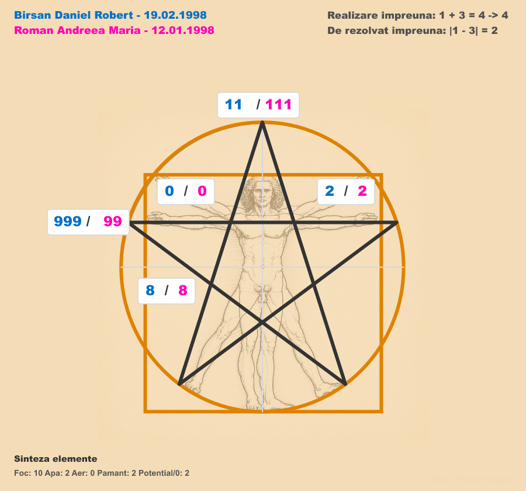
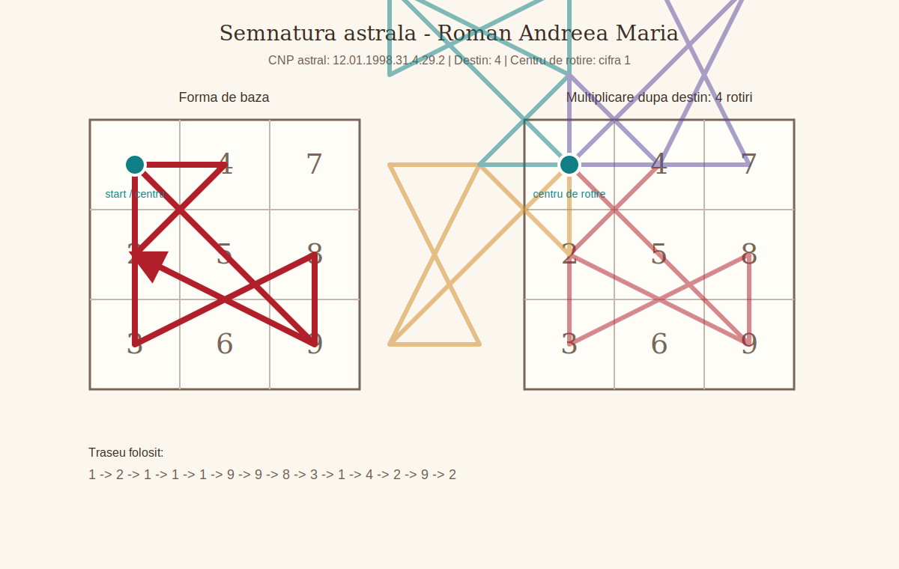
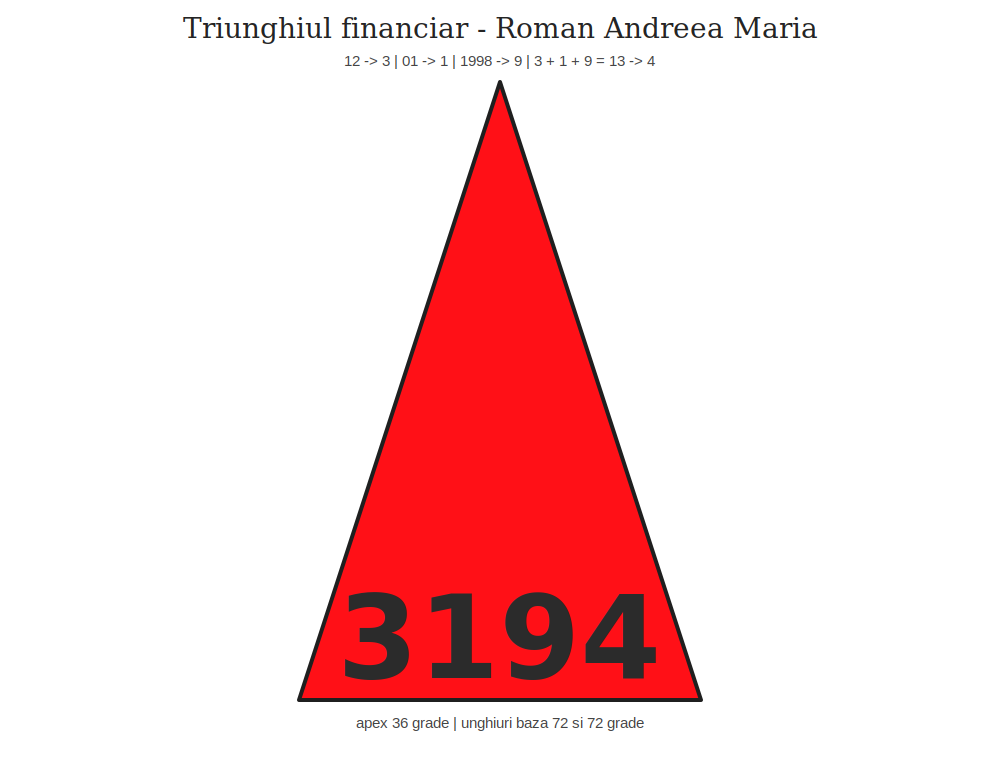
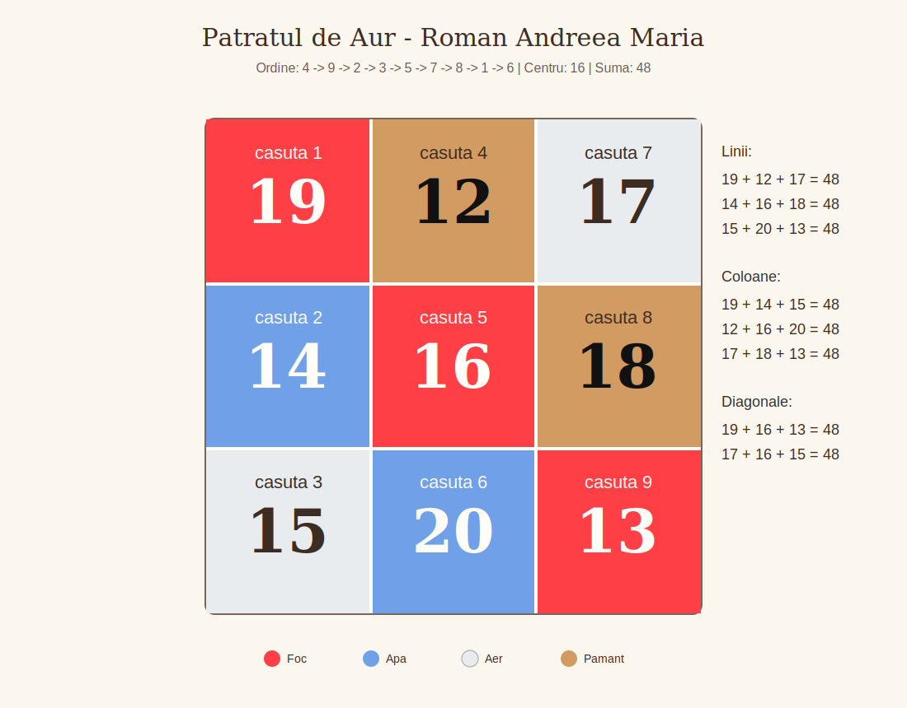

# Lucrare numerologica - Roman Andreea Maria - v1.04r

## Date generale

Aceasta lucrare este redactata intr-un stil explicativ si conversational-academic. Scopul ei este sa traduca formulele numerologice intr-un limbaj accesibil, astfel incat cititorul sa inteleaga nu doar rezultatul, ci si sensul lui. Numerologia este folosita aici ca instrument simbolic de autocunoastere, nu ca verdict fix despre persoana.

- Persoana analizata: Roman Andreea Maria
- Data nasterii: 12.01.1998
- Nume familie: Roman
- Prenume: Andreea Maria
- Prenume activ folosit in calcul: Andreea
- Versiune lucrare: v1.04r
- Data lucrarii: 2026-07-14

## Capitolul 1. Introducere

### 1.1. Prezentarea persoanei analizate

Pentru Roman Andreea Maria, analiza porneste de la doua surse principale: data nasterii si numele complet. Data nasterii arata structura nativa, adica felul in care energia este asezata la baza vietii. Numele arata forma prin care persoana se exprima in lume si felul in care identitatea este chemata sa se manifeste.

Data folosita este 12.01.1998; numele complet folosit este Roman Andreea Maria.

Vom citi fiecare rezultat prin trei pasi: ce inseamna punctul respectiv, cum se calculeaza si ce poate sugera in interpretare. Astfel, lucrarea ramane clara si pentru un cititor care nu cunoaste inainte limbajul numerologic.

### 1.2. Sinteza introductiva

Sinteza introductiva aduna vibratiile principale, asemenea unei harti rapide. Ea nu inlocuieste analiza detaliata, dar ofera o prima imagine asupra tonului general al lucrarii.

Vibratia interioara = 3; vibratia exterioara = 1; vibratia globala = 4; vibratia destinului = 4; numarul de exprimare = 7.

La prima vedere, profilul combina vibratia 3, asociata cu comunicare, creativitate, bucurie, spontaneitate si talentul de a da forma trairilor prin cuvant sau gest la nivel interior, vibratia 1, asociata cu autonomie, vointa, curajul inceputului si nevoia de a lua decizii proprii in manifestarea exterioara si vibratia 4, asociata cu ordine, stabilitate, disciplina, responsabilitate si capacitatea de a construi pas cu pas ca directie de destin. Numele adauga prin numarul de exprimare 7 o nuanta importanta: felul in care persoana isi poate arata potentialul prin analiza, profunzime, discernamant si cautarea sensului interior.

## Capitolul 2. Formule, calcule, tabele, grafice

### 2.1. Date de intrare

Datele de intrare sunt baza intregii lucrari. In numerologie, orice calcul trebuie sa fie trasabil: cititorul trebuie sa poata vedea de unde porneste rezultatul.

Ziua = 12; luna = 1; anul = 1998; data compacta = 12011998; numele complet = Roman Andreea Maria.

Aceste date vor fi folosite consecvent in toate capitolele. Cand lucram cu numele, literele sunt transformate in valori pitagoreice; cand lucram cu data, cifrele sunt adunate si reduse numerologic.

### 2.2. Vibratiile fundamentale

#### Vibratia interioara

Acest punct descrie motivatia intima, instinctul personal si felul in care omul se simte pe sine din interior. In limbaj simplu, el raspunde la intrebarea: ce fel de energie lucreaza aici?

reducere_numerologica(ziua nasterii). Calculul este: 1 + 2 = 3; rezultat final 3.

Privit in contextul motivatia intima, instinctul personal si felul in care omul se simte pe sine din interior, acest rezultat vorbeste despre comunicare, creativitate, bucurie, spontaneitate si talentul de a da forma trairilor prin cuvant sau gest. Nu trebuie inteles ca o eticheta rigida, ci ca o tendinta de lucru: o energie care poate deveni resursa atunci cand este folosita constient si care poate crea tensiune atunci cand este traita in exces sau neglijata.

#### Vibratia exterioara

Acest punct descrie felul in care persoana apare in lume, reactioneaza in contexte sociale si isi exprima prezenta. In limbaj simplu, el raspunde la intrebarea: ce fel de energie lucreaza aici?

reducere_numerologica(luna nasterii). Calculul este: 1.

Privit in contextul felul in care persoana apare in lume, reactioneaza in contexte sociale si isi exprima prezenta, acest rezultat vorbeste despre autonomie, vointa, curajul inceputului si nevoia de a lua decizii proprii. Nu trebuie inteles ca o eticheta rigida, ci ca o tendinta de lucru: o energie care poate deveni resursa atunci cand este folosita constient si care poate crea tensiune atunci cand este traita in exces sau neglijata.

#### Vibratia globala

Acest punct descrie puntea sintetica dintre interior si exterior. In limbaj simplu, el raspunde la intrebarea: ce fel de energie lucreaza aici?

reducere_numerologica(ziua nasterii + luna nasterii). Calculul este: 1 + 3 = 4; rezultat final 4.

Privit in contextul puntea sintetica dintre interior si exterior, acest rezultat vorbeste despre ordine, stabilitate, disciplina, responsabilitate si capacitatea de a construi pas cu pas. Nu trebuie inteles ca o eticheta rigida, ci ca o tendinta de lucru: o energie care poate deveni resursa atunci cand este folosita constient si care poate crea tensiune atunci cand este traita in exces sau neglijata.

#### Vibratia cosmica variabila

Acest punct descrie nuanta adusa de ultimele doua cifre ale anului de nastere. In limbaj simplu, el raspunde la intrebarea: ce fel de energie lucreaza aici?

reducere_numerologica(ultimele doua cifre ale anului). Calculul este: 9 + 8 = 17; 1 + 7 = 8; rezultat final 8.

Privit in contextul nuanta adusa de ultimele doua cifre ale anului de nastere, acest rezultat vorbeste despre organizare, dreptate, rezultate, administrarea resurselor si raportarea matura la autoritate. Nu trebuie inteles ca o eticheta rigida, ci ca o tendinta de lucru: o energie care poate deveni resursa atunci cand este folosita constient si care poate crea tensiune atunci cand este traita in exces sau neglijata.

#### Vibratia cosmica totala

Acest punct descrie amprenta generationala a anului de nastere, redusa la o vibratie de baza. In limbaj simplu, el raspunde la intrebarea: ce fel de energie lucreaza aici?

reducere_numerologica(suma cifrelor anului). Calculul este: 2 + 7 = 9; rezultat final 9.

Privit in contextul amprenta generationala a anului de nastere, redusa la o vibratie de baza, acest rezultat vorbeste despre intelepciune, compasiune, finalizare, idealuri si capacitatea de a privi imaginea de ansamblu. Nu trebuie inteles ca o eticheta rigida, ci ca o tendinta de lucru: o energie care poate deveni resursa atunci cand este folosita constient si care poate crea tensiune atunci cand este traita in exces sau neglijata.

### 2.3. Calea destinului, destinul si puntile

#### Calea destinului

Calea destinului este suma tuturor cifrelor din data de nastere inainte de reducerea finala. Ea pastreaza nuantele drumului, nu doar rezultatul redus.

1 + 2 + 0 + 1 + 1 + 9 + 9 + 8 = 31. Rezultatul neredus este 31.

Calea 31 se citeste prin cifrele care o compun si prin reducerea finala la 4. In termeni simpli, ea arata traseul, iar destinul redus arata esenta traseului. Privit in contextul calea destinului, acest rezultat vorbeste despre ordine, stabilitate, disciplina, responsabilitate si capacitatea de a construi pas cu pas. Nu trebuie inteles ca o eticheta rigida, ci ca o tendinta de lucru: o energie care poate deveni resursa atunci cand este folosita constient si care poate crea tensiune atunci cand este traita in exces sau neglijata.

#### Destinul

Acest punct arata directia finala de realizare. Puntile sunt importante pentru ca ne arata unde energia curge natural si unde are nevoie de traducere constienta.

Formula: reducere_numerologica(calea destinului). Calcul: 3 + 1 = 4; rezultat final 4.

Privit in contextul directia finala de realizare, acest rezultat vorbeste despre ordine, stabilitate, disciplina, responsabilitate si capacitatea de a construi pas cu pas. Nu trebuie inteles ca o eticheta rigida, ci ca o tendinta de lucru: o energie care poate deveni resursa atunci cand este folosita constient si care poate crea tensiune atunci cand este traita in exces sau neglijata.

#### Puntea interior - exterior

Acest punct arata diferenta dintre ce simte persoana in interior si cum se manifesta in exterior. Puntile sunt importante pentru ca ne arata unde energia curge natural si unde are nevoie de traducere constienta.

Formula: valoare_absoluta(vibratie_a - vibratie_b). Calcul: |3 - 1| = 2.

Privit in contextul diferenta dintre ce simte persoana in interior si cum se manifesta in exterior, acest rezultat vorbeste despre sensibilitate, cooperare, diplomatie, rabdare si capacitatea de a crea echilibru intre oameni. Nu trebuie inteles ca o eticheta rigida, ci ca o tendinta de lucru: o energie care poate deveni resursa atunci cand este folosita constient si care poate crea tensiune atunci cand este traita in exces sau neglijata.

#### Puntea interior - destin

Acest punct arata distanta dintre motivatia profunda si directia de destin. Puntile sunt importante pentru ca ne arata unde energia curge natural si unde are nevoie de traducere constienta.

Formula: valoare_absoluta(vibratie_a - vibratie_b). Calcul: |3 - 4| = 1.

Privit in contextul distanta dintre motivatia profunda si directia de destin, acest rezultat vorbeste despre autonomie, vointa, curajul inceputului si nevoia de a lua decizii proprii. Nu trebuie inteles ca o eticheta rigida, ci ca o tendinta de lucru: o energie care poate deveni resursa atunci cand este folosita constient si care poate crea tensiune atunci cand este traita in exces sau neglijata.

### 2.4. Aspecte de indreptat

#### Aspecte de indreptat

Acest calcul indica o zona in care persoana are de rafinat o atitudine, un tipar sau o directie de folosire a energiei. Nu vorbeste despre vina, ci despre ajustare.

31 - 2 x 1 = 29

Rezultatul 29 sugereaza ca exista o tema de lucru care trebuie inteleasa prin experienta, rabdare si observarea propriilor reactii. Nu se interpreteaza izolat, ci impreuna cu solutia sa.

#### Solutia aspectelor de indreptat

Solutia arata cheia simplificata a aspectului de indreptat. Daca aspectul arata tensiunea, solutia arata directia de echilibrare.

2 + 9 = 11; 1 + 1 = 2; rezultat final 2

Privit in contextul solutia aspectelor de indreptat, acest rezultat vorbeste despre sensibilitate, cooperare, diplomatie, rabdare si capacitatea de a crea echilibru intre oameni. Nu trebuie inteles ca o eticheta rigida, ci ca o tendinta de lucru: o energie care poate deveni resursa atunci cand este folosita constient si care poate crea tensiune atunci cand este traita in exces sau neglijata.

### 2.5. Structura matriciala

#### Matricea datei de nastere

Matricea este o harta a cifrelor prezente in codul numerologic personal. Ea arata ce energii sunt repetitive, ce energii lipsesc si unde apar vectori importanti.

Data compacta 12011998 + N1 31 + N2 4 + N3 29 + N4 2 formeaza sirul 12011998314292.

```text
1111 |    4 |    -
 222 |    - |    8
   3 |    - |  999
```

Casutele pline arata resurse usor accesibile. Casutele goale nu inseamna defect, ci zone care se invata prin constienta, relatie, disciplina sau prin influenta numelui.

#### Casutele matricei

| Casuta | Cifre | Valoare | Descriere | Interpretare |
| --- | --- | ---: | --- | --- |
| 1 | 1111 | 4 | identitatea, vointa, caracterul si modul in care persoana isi afirma prezenta | Accentul pe cifra 1 arata o vointa vizibila si o nevoie fireasca de autonomie. Andreea poate simti impulsul de a decide singura, de a porni lucrurile in ritmul ei si de a-si apara punctul de vedere. Cand energia este asezata matur, devine initiativa si curaj; cand se tensioneaza, poate aduce incapatanare sau tendinta de a duce prea mult pe cont propriu. |
| 2 | 222 | 6 | energia emotionala, empatia, sensibilitatea relationala si vitalitatea subtila | Cele trei cifre de 2 sugereaza receptivitate emotionala crescuta. Persoana poate fi atenta la atmosfera dintre oameni, poate avea inclinatie spre mediere sau impacare si are nevoie de relatii in care blandetea si respectul conteaza. Sensibilitatea aceasta este o resursa, dar cere limite clare, altfel se poate transforma in oboseala, ezitare sau grija excesiva fata de reactiile celorlalti. |
| 3 | 3 | 3 | expresia, comunicarea, talentul, bucuria si felul in care omul isi pune trairile in forma | Cifra 3 este prezenta simplu, dar important: ea deschide canalul de expresie. Andreea isi poate descarca trairile prin cuvant, creativitate, umor sau gesturi spontane. Pentru ca nu este supraincarcata, aceasta energie are nevoie de incurajare si exercitiu constant, mai ales atunci cand emotiile sunt multe si greu de pus in ordine. |
| 4 | 4 | 4 | corpul, disciplina, sanatatea practica, ordinea si stabilitatea concreta | Prezenta lui 4 aduce un punct de sprijin practic. Exista capacitatea de a organiza, de a duce sarcinile pana la capat si de a construi ceva stabil atunci cand directia este clara. Fiind o singura cifra, disciplina nu trebuie fortata rigid, ci cultivata prin rutine simple, pasi mici si responsabilitati bine definite. |
| 5 | - | 0 | centrul, curajul, libertatea, intuitia practica si capacitatea de adaptare | Lipsa lui 5 arata ca libertatea, curajul schimbarii si adaptarea rapida se invata mai degraba prin experienta decat prin instinct imediat. Persoana poate prefera siguranta cunoscuta, mai ales cand nu are repere clare. Lectia aici este sa isi dea voie sa incerce, sa schimbe directia fara vinovatie si sa aiba incredere in intuitia practica formata pe parcurs. |
| 6 | - | 0 | munca, familia, responsabilitatea, grija si felul in care persoana se implica afectiv | Absenta lui 6 nu inseamna lipsa de afectiune, ci o tema de maturizare in felul de a purta responsabilitatea. Grija pentru familie, munca facuta cu inima si asumarea afectiva pot cere constienta, nu automatisme. Este important ca Andreea sa invete diferenta dintre a ajuta din iubire si a prelua prea mult din datoria altora. |
| 7 | - | 0 | spiritualitatea, intuitia, analiza si legatura cu lumea interioara | Fara 7 in matrice, introspectia si increderea in propria intelegere interioara se pot construi treptat. Persoana poate cauta confirmari din exterior inainte de a-si valida propria intelegere. Jurnalul personal, studiul, observarea tiparelor si momentele de liniste pot deveni cai prin care aceasta zona se aseaza mai sigur. |
| 8 | 8 | 8 | socialul, dreptatea, organizarea, puterea si relatia cu resursele | Cifra 8 aduce simt al dreptatii, nevoie de ordine in relatia cu banii, autoritatea si rezultatele concrete. Andreea poate observa rapid ce este corect sau incorect intr-o situatie si are potential de administrare buna a resurselor. Pentru ca energia este concentrata intr-o singura cifra, conteaza sa fie folosita echilibrat, fara presiune excesiva pentru control sau performanta. |
| 9 | 999 | 27 | intelectul, memoria, intelepciunea, sinteza si capacitatea de a intelege experientele | Trei cifre de 9 pot indica interes mental, memorie si capacitate de sinteza. Exista deschidere spre intelegere, compasiune si concluzii mature, uneori cu o maturizare mai rapida in anumite contexte. Provocarea este sa nu ramana prea mult in analiza sau idealizare, ci sa transforme ceea ce intelege in alegeri simple, aplicate in viata de zi cu zi. |

#### Pare si impare

Cifrele pare sunt asociate cu receptivitatea, relatia si constructia prin cooperare. Cifrele impare sunt asociate cu initiativa, expresia si miscarea directa.

Total cifre pare = 5; total cifre impare = 8.

Raportul dintre pare si impare arata ritmul dintre a primi si a actiona. Un dezechilibru nu este o problema in sine, dar indica unde persoana poate avea nevoie sa compenseze constient.

#### Vectorii matricei

| Vector | Denumire | Cifre | Valoare | Descriere si interpretare |
| --- | --- | --- | ---: | --- |
| 123 | Energie | 11112223 | 13 | energia de pornire, combustibilul interior si vitalitatea cu care persoana intra in viata. Este vector plin, deci energia curge mai coerent. |
| 456 | Vointa | 4 | 4 | vointa practica, corpul de lucru, disciplina si capacitatea de efort sustinut. Este vector incomplet, deci energia cere completare si exercitiu. |
| 789 | Creativitate | 8999 | 35 | creativitatea superioara, viziunea, mintea si directia in care energia se rafineaza. Este vector incomplet, deci energia cere completare si exercitiu. |
| 147 | Spiritualitate | 11114 | 8 | spiritualitatea aplicata in viata concreta, prin identitate, corp si intuitie. Este vector incomplet, deci energia cere completare si exercitiu. |
| 258 | Social | 2228 | 14 | socialul, relationarea, diplomatia si felul in care persoana se aseaza intre oameni. Este vector incomplet, deci energia cere completare si exercitiu. |
| 369 | Bunastare materiala | 3999 | 30 | bunastarea materiala, comunicarea, rezultatul vizibil si felul in care ideile devin valoare. Este vector incomplet, deci energia cere completare si exercitiu. |
| 159 | Cariera | 1111999 | 31 | cariera, axa personala si modul in care omul isi orienteaza vointa spre realizare. Este vector incomplet, deci energia cere completare si exercitiu. |
| 357 | Scopuri | 3 | 3 | scopurile, inspiratia, idealurile si felul in care persoana isi urmareste chemarea. Este vector incomplet, deci energia cere completare si exercitiu. |

#### Tendinte, fixatie si caii-trasura-vizitiul

Aceasta lectura strange dinamica matricei: dominantele, lipsurile si felul in care energia se misca prin vectorii de baza.

Casuta dominanta este 9. Casutele lipsa sunt 5, 6 si 7. Fixatia este pe vectorul 123, cu valoarea 13. Caii au valoarea 13, trasura are valoarea 4, iar vizitiul are valoarea 35.

Dominantele pot fi talente, dar si zone de exces. Lipsurile pot fi compensate prin educatie, prin alegerea mediului potrivit si prin folosirea constienta a numelui. Caii arata energia de pornire, trasura arata suportul practic, iar vizitiul arata directia mentala si spirituala.

### 2.6. Codul numerologic personal al numelui

#### Numarul de exprimare

Numarul de exprimare arata cum se aude si se vede numele complet in lume. El descrie stilul prin care persoana poate sa isi exprime potentialul.

**Roman:** R=9 + O=6 + M=4 + A=1 + N=5 = 25 -> 2 + 5 = 7.

**Andreea:** A=1 + N=5 + D=4 + R=9 + E=5 + E=5 + A=1 = 30 -> 3 + 0 = 3.

**Maria:** M=4 + A=1 + R=9 + I=9 + A=1 = 24 -> 2 + 4 = 6.

**Numarul de exprimare:** 7 + 3 + 6 = 16 -> 1 + 6 = 7.

Privit in contextul numarul de exprimare, acest rezultat vorbeste despre introspectie, analiza, intuitie, spiritualitate si cautarea unui sens mai adanc. Nu trebuie inteles ca o eticheta rigida, ci ca o tendinta de lucru: o energie care poate deveni resursa atunci cand este folosita constient si care poate crea tensiune atunci cand este traita in exces sau neglijata.

#### Numarul intim

Numarul intim se calculeaza din vocale si vorbeste despre dorinte profunde, motivatie afectiva si nevoia interioara.

Formula folosita: reducere(suma vocalelor). Totalul este 30, iar reducerea este: 3 + 0 = 3; rezultat final 3.

Privit in contextul numarul intim, acest rezultat vorbeste despre comunicare, creativitate, bucurie, spontaneitate si talentul de a da forma trairilor prin cuvant sau gest. Nu trebuie inteles ca o eticheta rigida, ci ca o tendinta de lucru: o energie care poate deveni resursa atunci cand este folosita constient si care poate crea tensiune atunci cand este traita in exces sau neglijata.

#### Numarul de realizare

Numarul de realizare se calculeaza din consoane si arata modul practic prin care persoana actioneaza si produce rezultate.

Formula folosita: reducere(suma consoanelor). Totalul este 49, iar reducerea este: 4 + 9 = 13; 1 + 3 = 4; rezultat final 4.

Privit in contextul numarul de realizare, acest rezultat vorbeste despre ordine, stabilitate, disciplina, responsabilitate si capacitatea de a construi pas cu pas. Nu trebuie inteles ca o eticheta rigida, ci ca o tendinta de lucru: o energie care poate deveni resursa atunci cand este folosita constient si care poate crea tensiune atunci cand este traita in exces sau neglijata.

#### Numarul activ

Numarul activ vine din prenumele folosit si arata energia cu care persoana intra cel mai des in interactiunile cotidiene.

Formula folosita: reducere numerologica a prenumelui activ **Andreea**. Calculul este: A=1 + N=5 + D=4 + R=9 + E=5 + E=5 + A=1 = 30; 3 + 0 = 3; rezultat final 3.

Privit in contextul numarul activ, acest rezultat vorbeste despre comunicare, creativitate, bucurie, spontaneitate si talentul de a da forma trairilor prin cuvant sau gest. Nu trebuie inteles ca o eticheta rigida, ci ca o tendinta de lucru: o energie care poate deveni resursa atunci cand este folosita constient si care poate crea tensiune atunci cand este traita in exces sau neglijata.

#### Numarul ereditar

Numarul ereditar vine din numele de familie si descrie amprenta de neam, mostenirea subtila si tipul de energie preluata prin linia familiala.

Formula folosita: reducere numerologica. Totalul este 25, iar reducerea este: 2 + 5 = 7; rezultat final 7.

Privit in contextul numarul ereditar, acest rezultat vorbeste despre introspectie, analiza, intuitie, spiritualitate si cautarea unui sens mai adanc. Nu trebuie inteles ca o eticheta rigida, ci ca o tendinta de lucru: o energie care poate deveni resursa atunci cand este folosita constient si care poate crea tensiune atunci cand este traita in exces sau neglijata.

#### Numarul neamului

Numarul neamului citeste numele de familie printr-o reducere in intervalul 1-22, apropiata simbolic de limbajul arcanelor.

Totalul numelui de familie este 25; reducerea 22 da 3; arcana majora asociata este 3.

Aceasta informatie se citeste ca o tema de fundal. Ea poate functiona ca resursa mostenita, dar si ca responsabilitate de transformat intr-un mod personal si constient.

#### Cifre intense si influente subtile ale numelui

Cifrele intense arata ce valori apar cel mai des in nume. Primele si ultimele litere arata cum incepe si cum se inchide energia fiecarei componente din nume.

In nume apar urmatoarele frecvente principale: cifra 1 apare de 5 ori, cifra 4 de 3 ori, cifra 5 apare de 4 ori, cifra 6 o data, iar cifra 9 de 4 ori. Cifrele intense sunt 1 si 5.

**Codul literelor numelui:** Roman = 96415; Andreea = 1549551; Maria = 41991.

**Codul numerologic personal al numelui:** 96415 1549551 41991 + numarul de exprimare 7 -> 964151549551419917.

Primele si ultimele litere sunt: Roman incepe cu R=9 si se incheie cu N=5; Andreea incepe cu A=1 si se incheie cu A=1; Maria incepe cu M=4 si se incheie cu A=1. Primele vocale sunt O=6, A=1 si A=1.

Aceste elemente nu inlocuiesc numerele principale, dar coloreaza felul in care persoana se prezinta, reactioneaza si isi construieste identitatea prin nume.

### 2.7. Ciclicitatile

#### Lectiile de viata

Lectiile de viata sunt citite ca teme recurente. Ele indica ce fel de energie revine in diferite etape, asemenea unor exercitii repetate.

Formula: zi x luna x an; cifrele rezultatului se aplica ciclic pe anii de viata. Produsul este 23976, iar sirul lectiilor este [2, 3, 9, 7, 6].

Sirul nu este o predictie mecanica. El ofera un limbaj pentru a intelege ce tip de lectie poate deveni mai vizibila intr-un anumit an de viata.

#### Ciclul de 9 ani

Ciclul de 9 ani descrie ritmul anilor personali. Fiecare an aduce o tema: inceput, cooperare, expresie, constructie, schimbare, armonie, analiza, putere sau finalizare.

| An | Varsta | An personal | Lectie | Interpretare pe inteles simplu |
| --- | ---: | ---: | ---: | --- |
| 2026 | 28 | 5 | 7 | Privit in contextul anul personal, acest rezultat vorbeste despre miscare, schimbare, curaj, adaptare si nevoia de experienta directa. Nu trebuie inteles ca o eticheta rigida, ci ca o tendinta de lucru: o energie care poate deveni resursa atunci cand este folosita constient si care poate crea tensiune atunci cand este traita in exces sau neglijata. |
| 2027 | 29 | 6 | 6 | Privit in contextul anul personal, acest rezultat vorbeste despre iubire, grija, familie, responsabilitate afectiva, estetica si dorinta de echilibru. Nu trebuie inteles ca o eticheta rigida, ci ca o tendinta de lucru: o energie care poate deveni resursa atunci cand este folosita constient si care poate crea tensiune atunci cand este traita in exces sau neglijata. |
| 2028 | 30 | 7 | 2 | Privit in contextul anul personal, acest rezultat vorbeste despre introspectie, analiza, intuitie, spiritualitate si cautarea unui sens mai adanc. Nu trebuie inteles ca o eticheta rigida, ci ca o tendinta de lucru: o energie care poate deveni resursa atunci cand este folosita constient si care poate crea tensiune atunci cand este traita in exces sau neglijata. |
| 2029 | 31 | 8 | 3 | Privit in contextul anul personal, acest rezultat vorbeste despre organizare, dreptate, rezultate, administrarea resurselor si raportarea matura la autoritate. Nu trebuie inteles ca o eticheta rigida, ci ca o tendinta de lucru: o energie care poate deveni resursa atunci cand este folosita constient si care poate crea tensiune atunci cand este traita in exces sau neglijata. |
| 2030 | 32 | 9 | 9 | Privit in contextul anul personal, acest rezultat vorbeste despre intelepciune, compasiune, finalizare, idealuri si capacitatea de a privi imaginea de ansamblu. Nu trebuie inteles ca o eticheta rigida, ci ca o tendinta de lucru: o energie care poate deveni resursa atunci cand este folosita constient si care poate crea tensiune atunci cand este traita in exces sau neglijata. |
| 2031 | 33 | 1 | 7 | Privit in contextul anul personal, acest rezultat vorbeste despre autonomie, vointa, curajul inceputului si nevoia de a lua decizii proprii. Nu trebuie inteles ca o eticheta rigida, ci ca o tendinta de lucru: o energie care poate deveni resursa atunci cand este folosita constient si care poate crea tensiune atunci cand este traita in exces sau neglijata. |
| 2032 | 34 | 2 | 6 | Privit in contextul anul personal, acest rezultat vorbeste despre sensibilitate, cooperare, diplomatie, rabdare si capacitatea de a crea echilibru intre oameni. Nu trebuie inteles ca o eticheta rigida, ci ca o tendinta de lucru: o energie care poate deveni resursa atunci cand este folosita constient si care poate crea tensiune atunci cand este traita in exces sau neglijata. |
| 2033 | 35 | 3 | 2 | Privit in contextul anul personal, acest rezultat vorbeste despre comunicare, creativitate, bucurie, spontaneitate si talentul de a da forma trairilor prin cuvant sau gest. Nu trebuie inteles ca o eticheta rigida, ci ca o tendinta de lucru: o energie care poate deveni resursa atunci cand este folosita constient si care poate crea tensiune atunci cand este traita in exces sau neglijata. |
| 2034 | 36 | 4 | 3 | Privit in contextul anul personal, acest rezultat vorbeste despre ordine, stabilitate, disciplina, responsabilitate si capacitatea de a construi pas cu pas. Nu trebuie inteles ca o eticheta rigida, ci ca o tendinta de lucru: o energie care poate deveni resursa atunci cand este folosita constient si care poate crea tensiune atunci cand este traita in exces sau neglijata. |
| 2035 | 37 | 5 | 9 | Privit in contextul anul personal, acest rezultat vorbeste despre miscare, schimbare, curaj, adaptare si nevoia de experienta directa. Nu trebuie inteles ca o eticheta rigida, ci ca o tendinta de lucru: o energie care poate deveni resursa atunci cand este folosita constient si care poate crea tensiune atunci cand este traita in exces sau neglijata. |
| 2036 | 38 | 6 | 7 | Privit in contextul anul personal, acest rezultat vorbeste despre iubire, grija, familie, responsabilitate afectiva, estetica si dorinta de echilibru. Nu trebuie inteles ca o eticheta rigida, ci ca o tendinta de lucru: o energie care poate deveni resursa atunci cand este folosita constient si care poate crea tensiune atunci cand este traita in exces sau neglijata. |

#### Ciclul de 7 ani si ciclul de 12 ani

Ciclul de 7 ani este legat de maturizare, disciplina si formarea structurii interioare. Ciclul de 12 ani este legat de expansiune, invatare si repozitionare in lume.

Primul ciclu de 7 ani: 0-6. Primul ciclu de 12 ani: 0-11.

Aceste cicluri sunt folosite ca fundal. Ele nu spun exact ce se va intampla, ci arata ce fel de maturizare poate fi activa intr-o etapa.

#### Pinacluri

Pinaclurile descriu patru etape mari de crestere. Fiecare are o oportunitate si o provocare. Oportunitatea arata ce se poate construi, provocarea arata ce trebuie echilibrat.

| Pinaclu | Interval | Oportunitate | Provocare | Interpretare |
| --- | --- | ---: | ---: | --- |
| 1 | 0-32 | 4 | 2 | Oportunitatea se exprima prin ordine, stabilitate, disciplina, responsabilitate si capacitatea de a construi pas cu pas; provocarea cere lucrul constient cu sensibilitate, cooperare, diplomatie, rabdare si capacitatea de a crea echilibru intre oameni. |
| 2 | 33-41 | 3 | 6 | Oportunitatea se exprima prin comunicare, creativitate, bucurie, spontaneitate si talentul de a da forma trairilor prin cuvant sau gest; provocarea cere lucrul constient cu iubire, grija, familie, responsabilitate afectiva, estetica si dorinta de echilibru. |
| 3 | 42-50 | 7 | 4 | Oportunitatea se exprima prin introspectie, analiza, intuitie, spiritualitate si cautarea unui sens mai adanc; provocarea cere lucrul constient cu ordine, stabilitate, disciplina, responsabilitate si capacitatea de a construi pas cu pas. |
| 4 | 51+ | 1 | 8 | Oportunitatea se exprima prin autonomie, vointa, curajul inceputului si nevoia de a lua decizii proprii; provocarea cere lucrul constient cu organizare, dreptate, rezultate, administrarea resurselor si raportarea matura la autoritate. |

#### Ani importanti interiori si exteriori

Anii interiori marcheaza momente in care omul poate simti schimbari de directie, decizie sau maturizare. Anii exteriori sunt mai vizibili in planul evenimentelor.

Ani interiori calculati: [2007, 2016, 2025, 2034]. Ani exteriori calculati: [2025, 2034].

Acesti ani se interpreteaza impreuna cu varsta, anul personal si contextul real al persoanei. Ei nu sunt promisiuni de evenimente, ci repere pentru lectura parcursului.

#### Soarta si destin

Aceasta rubrica compara baza de pornire cu directia de realizare. In calculatorul actual, formula grafica este marcata ca punct de completat, deci este pastrata cu prudenta.

Baza posibila pentru soarta: 1201. Baza posibila pentru destin grafic: 1998.

Pentru o lucrare finala tip examen, acest punct poate fi completat ulterior cu formula validata din documentatia scolii.

### 2.8. Relatii

### 2.8.1. Omuletul relatiilor

Omuletul relatiilor compara doua persoane folosind aceeasi sursa de cifre. El arata cine sustine anumite zone, unde exista complementaritate si unde relatia cere atentie.

Analiza relationala priveste legatura dintre **Roman Andreea Maria** si **Birsan Daniel Robert**, nascut la **19.02.1998**. Tipul relatiei analizate este **relatie de cuplu**, citita ca dinamica dintre doua persoane: ce aduce fiecare in relatie, unde exista sustinere naturala, unde apar diferente de ritm si ce teme trebuie lucrate constient.

Scopul acestei analize nu este sa dea un verdict despre relatie, ci sa arate cum poate fi inteleasa si construita mai matur. Urmarim felul in care se combina energiile celor doua date de nastere, ce potential de realizare apare impreuna, ce trebuie rezolvat in doi si ce obiceiuri relationale pot transforma atractia sau tensiunea in cooperare concreta.



In interpretare, o cifra absenta nu inseamna lipsa de iubire, ci o zona care trebuie construita constient. O cifra puternica poate fi resursa, dar poate deveni presiune daca nu este traita matur.

### 2.9. Spirit

#### Inclinatii profesionale

Acest punct priveste felul in care energia datei de nastere poate sugera o orientare profesionala. Nu este vorba despre o meserie obligatorie, ci despre un climat interior: ce tip de provocare apare, ce fel de ajutor poate sustine persoana si in ce directie se poate organiza mai bine.

Se lucreaza cu rezultate pastrate in intervalul 1-22. Pentru aceasta persoana, calculul indica: obstacol 4, ajutor 10, directie 13.

Obstacolul arata zona care poate cere efort sau maturizare; ajutorul arata resursa care poate sustine drumul; directia arata sensul in care energia poate fi orientata. Citirea ramane simbolica si trebuie corelata cu matricea, numele si experienta reala a persoanei.

#### Inclinatii ezoterice

Inclinatiile ezoterice arata sensibilitatea fata de sensuri subtile, simboluri, intuitie, cercetare interioara sau domenii in care persoana cauta mai mult decat explicatia imediata.

Formula folosita priveste impartirea datei compacte la 7 si citirea codurilor rezultate. In acest caz: data compacta 12011998 impartita la 7 da cod principal 7 si cod secundar 7.

Codul principal sugereaza modul in care persoana poate relationa cu simbolul si sensul subtil, iar codul secundar nuanteaza felul in care aceasta inclinatie se poate manifesta. Rezultatul nu obliga persoana spre ezoterism, ci arata o posibila deschidere spre profunzime, simbol si sens.

#### Codul spiritului si varsta spiritului

Codul spiritului este o sinteza a zilei si lunii de nastere. El este citit ca o cheie interioara, o vibratie care vorbeste despre felul in care persoana cauta sens, maturizare si directie subtila.

ziua 12 + luna 1 = 13; 1 + 3 = 4; codul spiritului este 4.

Codul spiritului trebuie citit cu prudenta si blandete. El nu defineste valoarea persoanei, ci indica o tema profunda de crestere. Etapele si subetapele spiritului pot fi dezvoltate intr-o versiune ulterioara a lucrarii, daca se completeaza formula extinsa din documentatia dedicata.

### 2.10. Ajutoare

#### Triunghiul financiar

Triunghiul financiar combina ziua, luna, anul redus si destinul redus pentru a observa raportarea la resurse, constructie si directie materiala.

Baza triunghiului este [3, 1, 9, 4]; destinul din triunghi este 4.

Se citeste ca instrument complementar. El arata cum poate persoana sa isi organizeze energia pentru rezultate, nu daca va avea sau nu succes financiar in mod garantat.

#### Patratul de aur

Patratul de aur aseaza valori succesive pornind de la ziua nasterii si creeaza o schema de echilibru numeric.

Valoarea centrala este 16; suma de control este 48.

Centrul se citeste ca ax al structurii. Patratul poate fi folosit ca instrument de sinteza si sustinere simbolica, impreuna cu restul hartii.

## Capitolul 3. Caracterul

### 3.1. Vibratia interioara

Caracterul profund este citit in primul rand prin vibratia interioara. Ea arata ce misca persoana din interior inainte ca lumea sa vada rezultatul.

Ziua nasterii este 12; reducerea duce la 3.

Privit in contextul caracterul interior, acest rezultat vorbeste despre comunicare, creativitate, bucurie, spontaneitate si talentul de a da forma trairilor prin cuvant sau gest. Nu trebuie inteles ca o eticheta rigida, ci ca o tendinta de lucru: o energie care poate deveni resursa atunci cand este folosita constient si care poate crea tensiune atunci cand este traita in exces sau neglijata.

### 3.2. Liniile de tensiune si puntile

Tensiunile nu sunt defecte. Ele sunt diferente intre doua planuri ale persoanei: ce simte, ce arata si incotro merge.

Punte interior-exterior: |3 - 1| = 2. Punte interior-destin: |3 - 4| = 1.

Cand o punte are valoare mica, integrarea este mai usoara. Cand diferenta este mai mare, persoana poate simti ca trebuie sa traduca mai mult intre interior, exterior si destin.

### 3.3. Caracterul prin nume

Numele completeaza caracterul nativ. Uneori numele sustine direct ceea ce arata data; alteori aduce o energie diferita, care largeste paleta persoanei.

Numar de exprimare = 2; numar intim = 3; numar de realizare = 8.

Caracterul final nu este dat de o singura cifra. El se formeaza din dialogul dintre data nasterii, nume, experiente si alegeri constiente.

## Capitolul 4. Transformarea

### 4.1. Vibratia exterioara

Transformarea se vede in felul in care persoana invata sa se manifeste in lume. Vibratia exterioara arata interfata cu ceilalti.

Luna nasterii este 1; reducerea duce la 1.

Privit in contextul transformarea exterioara, acest rezultat vorbeste despre autonomie, vointa, curajul inceputului si nevoia de a lua decizii proprii. Nu trebuie inteles ca o eticheta rigida, ci ca o tendinta de lucru: o energie care poate deveni resursa atunci cand este folosita constient si care poate crea tensiune atunci cand este traita in exces sau neglijata.

### 4.2. Aspecte de indreptat

Aici privim zona care cere corectare. Este un punct de maturizare, nu o condamnare.

Aspecte: 31 - 2 x 1 = 29. Solutie: 2 + 9 = 11; 1 + 1 = 2; rezultat final 2.

Solutia prin 2 arata ca echilibrarea se face prin sensibilitate, cooperare, diplomatie, rabdare si capacitatea de a crea echilibru intre oameni. Cu alte cuvinte, persoana nu trebuie sa se lupte cu tema, ci sa invete sa o conduca altfel.

### 4.3. Transformarea prin cicluri

Ciclurile arata cand anumite lectii devin mai vizibile. Ele dau ritm transformarii.

Se folosesc anii personali, pinaclurile, lectiile de viata si anii importanti calculati in capitolul 2.

O transformare reala apare cand persoana intelege tema perioadei si coopereaza cu ea, in loc sa o traiasca automat.

## Capitolul 5. Destinul

### 5.1. Vibratia destinului

Destinul este una dintre directiile importante de realizare. El nu spune ca viata are un singur scenariu, ci arata ce fel de energie poate sustine implinirea.

Calea destinului este 31; reducerea ei duce la 4.

Privit in contextul destinul persoanei, acest rezultat vorbeste despre ordine, stabilitate, disciplina, responsabilitate si capacitatea de a construi pas cu pas. Nu trebuie inteles ca o eticheta rigida, ci ca o tendinta de lucru: o energie care poate deveni resursa atunci cand este folosita constient si care poate crea tensiune atunci cand este traita in exces sau neglijata.

### 5.2. Calea destinului

Calea destinului pastreaza traseul detaliat, in timp ce destinul redus arata esenta.

1 + 2 + 0 + 1 + 1 + 9 + 9 + 8 = 31

Numarul 31 arata drumul concret, iar 4 arata vibratia finala. In lectura practica, ambele sunt importante: traseul explica nuanta, rezultatul explica directia.

### 5.3. Destin si nume

Comparatia dintre destin si numele complet arata daca expresia sociala sustine direct traseul nativ sau il provoaca sa se rafineze.

Destin = 4; numar de exprimare = 7.

Cand cele doua rezultate sunt diferite, nu inseamna contradictie. Inseamna ca persoana are de invatat sa isi manifeste destinul printr-un stil propriu, modelat de nume si de experienta.

## Capitolul 6. Parcursul vietii

### 6.1. Etapele mari

Parcursul vietii este citit prin mai multe straturi: cicluri, pinacluri, ani personali si lectii.

Vezi capitolul 2.7 pentru calculele detaliate.

Aceste repere ajuta la intelegerea momentelor de schimbare, dar nu trebuie folosite fatalist. Ele indica teme, nu impun evenimente.

### 6.2. Urmatorii ani personali

| An | Varsta | Vibratie | Interpretare conversationala |
| --- | ---: | ---: | --- |
| 2026 | 28 | 5 | In acest an se activeaza vibratia 5, asociata cu miscare, schimbare, curaj, adaptare si nevoia de experienta directa. Practic, perioada invita persoana sa lucreze constient cu aceasta tema. |
| 2027 | 29 | 6 | In acest an se activeaza vibratia 6, asociata cu iubire, grija, familie, responsabilitate afectiva, estetica si dorinta de echilibru. Practic, perioada invita persoana sa lucreze constient cu aceasta tema. |
| 2028 | 30 | 7 | In acest an se activeaza vibratia 7, asociata cu introspectie, analiza, intuitie, spiritualitate si cautarea unui sens mai adanc. Practic, perioada invita persoana sa lucreze constient cu aceasta tema. |
| 2029 | 31 | 8 | In acest an se activeaza vibratia 8, asociata cu organizare, dreptate, rezultate, administrarea resurselor si raportarea matura la autoritate. Practic, perioada invita persoana sa lucreze constient cu aceasta tema. |
| 2030 | 32 | 9 | In acest an se activeaza vibratia 9, asociata cu intelepciune, compasiune, finalizare, idealuri si capacitatea de a privi imaginea de ansamblu. Practic, perioada invita persoana sa lucreze constient cu aceasta tema. |

## Capitolul 7. Ajutoare

### 7.1. Semnatura astrala

Semnatura astrala este un instrument grafic si simbolic. Ea nu inlocuieste analiza, ci o sustine vizual.

In calculatorul actual, formula este marcata ca punct de completat si se poate genera separat cu skill-ul SVG dedicat.

Semnatura astrala este inclusa mai jos ca suport vizual al traseului personal.



### 7.2. Triunghiul financiar si patratul de aur

Aceste instrumente completeaza lectura printr-o privire asupra resurselor, echilibrului si structurii de sustinere.

Triunghi financiar: [3, 1, 9, 4]. Patratul de aur: centru 16, suma control 48.





Ele se citesc impreuna cu matricea si cu destinul. Sensul lor este sa arate directii de armonizare, nu sa ofere o garantie despre rezultate materiale.

## Capitolul 8. Concluzii finale pentru numerologi

### 8.1. Sinteza finala

Sinteza finala strange rezultatele mari si le aseaza intr-o lectura coerenta.

VI=3; VE=1; VG=4; Calea destinului=31; Destin=4; Numar de exprimare=7.

Pentru Roman Andreea Maria, harta arata un dialog intre energia interioara 3, manifestarea exterioara 1 si destinul 4. Fiecare rezultat trebuie citit in relatie cu celelalte. Unde exista accent, se cere maturitate; unde exista lipsa, se cere cultivare; unde exista repetitie, se poate forma maiestrie.

### 8.2. Directii de dezvoltare

Directiile de dezvoltare transforma analiza in practica. O lucrare numerologica este utila atunci cand persoana poate pleca din ea cu intrebari clare si pasi concreti.

Se folosesc vibratiile dominante, casutele lipsa, puntile si ciclurile active.

Recomandarea generala este ca persoana sa observe cand isi foloseste energia in lumina si cand o duce in exces. Numerologia devine astfel un limbaj de autoeducare, nu o lista de etichete.

## Capitolul 9. Sfatul numerologului

Pentru Roman Andreea Maria, sfatul central este sa nu trateze cifrele ca pe niste limite, ci ca pe repere. Vibratia interioara 3 arata cum se aprinde energia personala, vibratia exterioara 1 arata cum se vede aceasta energie in lume, iar destinul 4 arata directia de implinire. Daca aceste planuri sunt traite constient, persoana poate transforma predispozitiile in alegeri mature. Daca sunt traite automat, aceleasi energii pot deveni tensiuni. Cheia este observarea, disciplina blanda si folosirea constienta a resurselor proprii.
