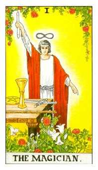
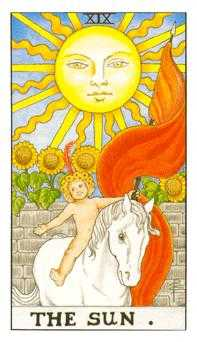

Index: BDR-19980219-v1.00r-CAP-001
# Bîrsan Daniel Robert — 19.02.1998

Index: BDR-19980219-v1.00r-CAP-002
## Date generale

Index: BDR-19980219-v1.00r-L-001
- Persoana analizată: Bîrsan Daniel Robert
- Prenume activ: Daniel
- Data nașterii: 19.02.1998
- Gen: masculin
- Nume anterior: nu există
- Template selectat: scurt
- Stil de redactare: conversațional
- Interval analizat: 0–108 ani
- Data lucrării: 18.07.2026
- Versiune: V1.00R
- Relație analizată: Roman Andreea Maria, 12.01.1998, parteneră

Index: BDR-19980219-v1.00r-CAP-003
## Cuprins

Index: BDR-19980219-v1.00r-L-002
1. Vibrația interioară — Cine ești tu?
2. Vibrația exterioară — Rolul social
3. Destinul — Muntele de urcat
4. Matrița numerologică — Pătratul lui Pitagora
5. Numele — Eu și neamul
6. Spirit și karmă — Lecții și direcții de maturizare
7. Pinacluri: Oportunități și provocări
8. Ciclicități
9. Relații
10. Aplicabilitate profesională
11. Concluzii

Index: BDR-19980219-v1.00r-CAP-005
## Capitolul 1. Vibrația interioară — Cine ești tu?

Index: BDR-19980219-v1.00r-SUB-001
### 1.1. Definiție

Index: BDR-19980219-v1.00r-P-006
Daniel, vibrația interioară vorbește despre desăvârșirea caracterului și descrie natura ta lăuntrică: cine ești când nu te vede nimeni și nu trebuie să răspunzi așteptărilor din exterior. Ea arată cum primești și interpretezi ceea ce vine către tine, ce îți dorești cu adevărat, ce simți și cum înveți. De aici pornesc motivațiile și reacțiile tale autentice. Cunoscând această vibrație, îți poți recunoaște mai ușor punctele forte, slăbiciunile și direcțiile în care ai nevoie să te dezvolți.

Index: BDR-19980219-v1.00r-C-001
> [!example] Calcul
> Ziua din data de naștere = **19** → 1 + 9 = **10** → 1 + 0 = **1**

Index: BDR-19980219-v1.00r-SUB-002
### 1.2. Caracterul

Index: BDR-19980219-v1.00r-P-007
Daniel, tu ai vibrația interioară **1**: inițiativă, autonomie și nevoie de direcție proprie. Arhetipal, această energie te așază în rolul Pionierului, Inițiatorului și Liderului. Vrei să fii primul, să deschizi drumul, să ieși în față, să alegi singur direcția și să fii recunoscut pentru ceea ce pornești. Ai nevoie să simți că acțiunea îți aparține și că nu urmezi pur și simplu traseul stabilit de altcineva. Traseul spune însă mai mult. **1** aduce pornirea, iar **9** aduce experiența și imaginea largă; împreună formează **10**, pragul dintre încheiere și un nou început. În **10**, **1** pornește, iar **0** reprezintă totul și nimicul: poate mări potențialul lui **1** sau îl poate anula atunci când energia nu primește o direcție clară. Maturizarea acestui arhetip apare când îți asumi conducerea fără să o transformi în grabă, orgoliu sau nevoie de control: alegi limpede, deschizi calea prin exemplu și le permiți și celorlalți să contribuie.

Index: BDR-19980219-v1.00r-SUB-003
### 1.3. Dorințele

Index: BDR-19980219-v1.00r-P-008
Îți dorești libertatea de a decide și satisfacția de a vedea că o idee capătă formă. Nu ai nevoie să conduci orice situație; ai nevoie să simți că vocea ta contează și că poți iniția ceva autentic.

Index: BDR-19980219-v1.00r-SUB-004
### 1.4. Motivația

Index: BDR-19980219-v1.00r-P-009
Te motivează provocările în care poți deschide un drum, simplifica o problemă sau transforma o intenție într-un prim pas. O rutină utilă pentru tine este să alegi dimineața o singură acțiune care pune ziua în mișcare.

Index: BDR-19980219-v1.00r-SUB-005
### 1.5. Teama

Index: BDR-19980219-v1.00r-P-010
Umbra lui **1** este teama de dependență, control sau pierderea autonomiei. Ea poate produce grabă ori încăpățânare. Antidotul nu este renunțarea la inițiativă, ci verificarea: „Am decis limpede sau doar reacționez?”

Index: BDR-19980219-v1.00r-SUB-006
### 1.6. Polarități și maturizare

Index: BDR-19980219-v1.00r-T-009
<table class="polarities-table">
<tbody>
<tr>
<th scope="row">Polarități pozitive</th>
<td>
<ul>
<li>autonomie și încredere în propriile forțe;</li>
<li>capacitate de leadership și inițiativă;</li>
<li>orientare spre soluții;</li>
<li>dorință de a inova și de a deschide drumuri;</li>
<li>puterea de a merge mai departe după un eșec.</li>
</ul>
</td>
</tr>
<tr>
<th scope="row">Polarități negative</th>
<td>
<ul>
<li>tendința de a controla totul;</li>
<li>dificultatea de a colabora și de a primi ajutor;</li>
<li>impulsivitate și nerăbdare;</li>
<li>orgoliu defensiv și rigiditate;</li>
<li>teama ascunsă de a părea slab sau dependent.</li>
</ul>
</td>
</tr>
<tr>
<th scope="row">Direcții de dezvoltare</th>
<td>
<ul>
<li>asumă proiecte personale cu obiective clare;</li>
<li>exersează delegarea și colaborarea;</li>
<li>cultivă răbdarea în procesele de grup;</li>
<li>acceptă feedbackul și sprijinul unui mentor;</li>
<li>observă diferența dintre curaj și impulsivitate.</li>
</ul>
</td>
</tr>
</tbody>
</table>

Index: BDR-19980219-v1.00r-SUB-007
### 1.7. Tarot

Index: BDR-19980219-v1.00r-P-010a
Vibrația interioară **1** este asociată cu Arcana Majoră **1 — Magicianul**. Daniel, această imagine îți arată cum energia inițiativei poate coborî din intenție în faptă: ai impulsul de a porni, de a alege direcția și de a folosi resursele pe care le ai la îndemână. Cartea nu adaugă un rezultat nou, ci oferă o reprezentare simbolică a felului în care îți poți manifesta matur vibrația: cu voință, claritate și responsabilitate, fără să transformi autonomia în control sau graba de a începe în abandonarea lucrurilor pe parcurs.

Index: BDR-19980219-v1.00r-P-010b
În imagine, Magicianul îndreaptă o mână către cer și cealaltă către pământ, arătând că înțelege principiul „ce este sus este și jos, ce este înăuntru este și în afară”. Pe masa lui se află simbolurile celor **4** elemente: bagheta pentru Foc, cupa pentru Apă, spada pentru Aer și moneda pentru Pământ. El le poate combina și poate comuta între ele, trecând de la inspirație la emoție, de la gândire la acțiune concretă, în funcție de ceea ce vrea să creeze. Pentru tine, Daniel, imaginea spune că potențialul nu stă în lipsa sau căutarea instrumentelor, ci în alegerea și folosirea lor conștientă: ceea ce gândești și pornești în interior are nevoie să capete o formă coerentă și vizibilă în exterior.

Index: BDR-19980219-v1.00r-T-010
<table>
<tbody>
<tr>
<td>

Index: BDR-19980219-v1.00r-G-001

<em>Arcana <strong>1</strong> — Magicianul</em>

</td>
<td>
<ul>
<li><strong>Resursă:</strong> ai voința, claritatea și instrumentele necesare pentru a transforma intenția într-un început concret.</li>
<li><strong>Manifestare:</strong> inițiezi, formulezi direcții și transformi ideea în acțiune, fără să aștepți ca toate condițiile să fie perfecte.</li>
<li><strong>Umbră:</strong> poți încerca să controlezi totul, să respingi feedbackul sau să începi impulsiv fără să duci lucrurile până la capăt.</li>
<li><strong>Maturizare:</strong> îți folosești puterea cu intenție și responsabilitate, păstrând inițiativa fără să anulezi colaborarea și realitatea celorlalți.</li>
</ul>
</td>
</tr>
</tbody>
</table>

Index: BDR-19980219-v1.00r-CAP-006
## Capitolul 2. Vibrația exterioară — Rolul social

Index: BDR-19980219-v1.00r-SUB-008
### 2.1. Definiție

Index: BDR-19980219-v1.00r-P-011
Vibrația exterioară descrie felul în care te manifești în lume: prezența, comportamentul vizibil, imaginea socială și modul în care ceilalți îți pot percepe energia. Dacă vibrația interioară arată dinamica ta privată, vibrația exterioară arată forma prin care aceasta devine vizibilă în relații, contexte sociale și situații concrete. Ea nu spune totul despre caracter, dar indică stilul tău de apariție, reacția spontană în exterior și felul în care îți proiectezi energia. Citește-o ca pe o poartă de contact cu lumea: poate confirma vibrația interioară sau poate crea un contrast între ceea ce trăiești înăuntru și ceea ce observă ceilalți.

Index: BDR-19980219-v1.00r-C-002
> [!example] Calcul
> Luna din data de naștere = **2**

Index: BDR-19980219-v1.00r-SUB-009
### 2.2. Rolul social

Index: BDR-19980219-v1.00r-P-012
Fiind născut în luna februarie, tu ai rolul social al Diplomatului, specific vibrației exterioare **2**. Pentru a avea succes în societate, ai nevoie să pui accent pe colaborare, comunicare și empatie, să ai grijă de celălalt și să cauți soluții în care lucrurile se construiesc în **2**, nu numai prin efort individual. Această energie te face mai maleabil, receptiv și capabil să înțelegi punctul de vedere al celui din fața ta. De multe ori, te poți descoperi pe tine prin relațiile pe care le construiești, pentru că **2** te învață să vezi în celălalt o oglindă a propriilor trăiri. Diplomația ta devine o adevărată resursă atunci când apropii oamenii fără să renunți la propria poziție și când cooperezi fără să lași empatia să se transforme în ezitare sau adaptare excesivă.

Index: BDR-19980219-v1.00r-SUB-010
### 2.3. Interior și exterior

Index: BDR-19980219-v1.00r-P-013
Daniel, dacă în interior ești **1**, la exterior oamenii te pot percepe ca pe un **2**. Înăuntru există impulsul de a porni, de a decide și de a urma o direcție proprie; în exterior poți apărea mai atent, cooperant și dispus să ajuți. Asta nu înseamnă că una dintre vibrații o anulează pe cealaltă. **1** îți dă inițiativa, iar **2** te ajută să o exprimi fără să pierzi legătura cu oamenii. Practic, poți spune clar „eu pornesc”, apoi să adaugi firesc „hai că te ajut” sau „hai să construim împreună”.

Index: BDR-19980219-v1.00r-P-013a
Puntea dintre interior și exterior arată distanța dintre ceea ce ești și simți în spațiul tău lăuntric și felul în care această energie devine vizibilă în relația cu lumea. Ea nu anulează niciuna dintre vibrații, ci indică ajustarea necesară pentru ca interiorul și exteriorul să poată lucra împreună. Pentru tine, Daniel, puntea arată cât de ușor poate inițiativa lui **1** să se exprime prin sensibilitatea și cooperarea lui **2**.

Index: BDR-19980219-v1.00r-C-002a
> [!example] Calculul punții interior–exterior
> |**1** − **2**| = **1**

Index: BDR-19980219-v1.00r-P-013b
Rezultatul **1** arată că între nucleul tău interior și imaginea proiectată în exterior există o diferență mică, dar importantă: tu pornești din inițiativă și autonomie, iar ceilalți te pot întâlni mai întâi prin cooperare și atenție. Autenticitatea este cheia acestei punți. Când ceea ce spui și ceea ce faci pornesc dintr-o direcție asumată, cei din jur te pot privi și accepta ca pe un lider, fără ezitare și fără dubii. Cu cât îți exprimi mai clar intențiile și păstrezi loc pentru dialog, cu atât deschizi calea și transformi pornirea personală într-o influență pozitivă asupra celor din jur.

Index: BDR-19980219-v1.00r-CAP-007
## Capitolul 3. Destinul — Muntele de urcat

Index: BDR-19980219-v1.00r-SUB-011
### 3.1. Definiție și calcul

Index: BDR-19980219-v1.00r-P-014
Destinul sintetizează data completă și arată o direcție de maturizare, nu un eveniment obligatoriu. Pentru destin păstrăm accentul pe rezultatul final.

Index: BDR-19980219-v1.00r-C-003
> [!example] Calcul
> Toate cifrele adunate din data de naștere = 1 + 9 + 0 + 2 + 1 + 9 + 9 + 8 = **39** → 3 + 9 = **12** → 1 + 2 = **3**

Index: BDR-19980219-v1.00r-SUB-012
### 3.2. Interpretare

Index: BDR-19980219-v1.00r-P-015
Daniel, rezultatul intermediar **12** arată că direcția ta se construiește prin întâlnirea dintre **1** și **2**: **1** pornește, formulează intenția și își asumă inițiativa, iar **2** răspunde „hai că te ajut”, aducând cooperare, sensibilitate și atenție la ritmul celuilalt. Lecția lui **12** este să nu alegi între autonomie și colaborare, ci să le pui la lucru împreună. Când reducem **1 + 2**, ajungem la rezultatul final **3**, iar această combinație capătă voce, expresie și creativitate. Destinul **3** te cheamă să comunici, să creezi, să explici și să aduci mișcare acolo unde lucrurile au devenit rigide. Umbra poate fi dispersia sau promisiunea fără continuare; maturizarea apare când ideea primește formă. În practică, pornește de la o intenție clară, cere contribuția potrivită și încheie ciclul prezentând concret ceea ce ai creat.

Index: BDR-19980219-v1.00r-CAP-008
## Capitolul 4. Matrița numerologică — Pătratul lui Pitagora

Index: BDR-19980219-v1.00r-SUB-013
### 4.1. Matricea datei de naștere

Index: BDR-19980219-v1.00r-P-016
Matricea pornește de la cifrele datei de naștere și de la cele patru numere de lucru. Ea arată ce energii îți sunt deja la îndemână și unde ai nevoie de aport din experiență, relații sau exercițiu. Privind pătratul tău, vei observa că unele căsuțe sunt pline, iar altele goale: cele pline indică resurse ușor de accesat, iar cele goale arată direcții care se construiesc conștient. Cele **9** căsuțe pot fi privite ca nouă computere energetice sau sfere de inteligență:

- **Căsuța 1** — inteligența psihică;
- **Căsuța 2** — inteligența emoțională;
- **Căsuța 3** — inteligența prelucrării informațiilor;
- **Căsuța 4** — inteligența corporală;
- **Căsuța 5** — inteligența intuitivă;
- **Căsuța 6** — inteligența pragmatismului;
- **Căsuța 7** — inteligența spirituală;
- **Căsuța 8** — inteligența puterii și inteligența socială;
- **Căsuța 9** — inteligența mentală.

Fiecare sferă înseamnă mult mai mult decât această scurtă descriere; important este să îți folosești conștient resursele și să construiești echilibrat zonele mai puțin active.

Index: BDR-19980219-v1.00r-C-004
> [!example] Calcul
> Data nașterii: 19.02.1998 → data compactă = **19021998**  
> N1 = 1 + 9 + 0 + 2 + 1 + 9 + 9 + 8 = **39**  
> N2 = 3 + 9 = **12**  
> N3 = 39 − (2 × 1) = **37**  
> N4 = 3 + 7 = **10**  
> Șir complet = 19021998 + 39 + 12 + 37 + 10 = **1902199839123710**

Index: BDR-19980219-v1.00r-G-002
| **1 — Foc** · 1111 · optim `111` · □ | **4 — Pământ** · — · optim `44` · absent | **7 — Aer** · 7 · optim `7` · ○ |
| --- | --- | --- |
| **2 — Apă** · 22 · optim `222` · ○—○ | **5 — Foc** · — · optim `55` · absent | **8 — Pământ** · 8 · optim `8` · ○ |
| **3 — Aer** · 33 · optim `333` · ○—○ | **6 — Apă** · — · optim `66` · absent | **9 — Foc** · 9999 · optim `9` · □ |

Index: BDR-19980219-v1.00r-P-035
**Căsuța 1.** Ai **4** apariții în căsuța cifrei **1**. Asta arată despre tine potențialul unui psihic foarte puternic, capabil să susțină multe idei și să lucreze inclusiv în medii cu un nivel ridicat de stres. Ai calități bune de leadership: poți prelua inițiativa, poți conduce și poți menține direcția atunci când ceilalți au nevoie de un reper. În polaritatea negativă, poți ajunge însă să vrei ca toate lucrurile să se facă după tine. Atunci poți fi perceput, între ghilimele, ca un „mic dictator”: rigid, încăpățânat, inflexibil și mai puțin dispus să ții cont de părerile celorlalți. Maturizarea acestei energii înseamnă să rămâi ferm în direcție, dar deschis la dialog, astfel încât puterea psihică și autoritatea ta să îi mobilizeze pe oameni, nu să îi limiteze.

Index: BDR-19980219-v1.00r-P-036
**Căsuța 2.** Reprezintă emoțiile, trăirile, comunicarea, bioenergia, spiritul de colaborare și parteneriatul. Ai **2** apariții în căsuța cifrei **2**. Sensibilitatea și capacitatea de a lucra cu celălalt sunt prezente, dar au nevoie de aport extern și exercițiu pentru a rămâne stabile. Fiind un număr par de apariții, energia poate circula în ambele sensuri: poți primi și poți da mai departe sprijin emoțional, însă în anumite situații poate apărea indecizia. Pentru tine, maturizarea acestei căsuțe înseamnă să numești clar ceea ce simți, să întrebi direct ce are nevoie celălalt și să alegi după dialog, fără să rămâi blocat între două variante.

Index: BDR-19980219-v1.00r-P-037
**Căsuța 3.** Ai **2** apariții în căsuța cifrei **3**, ceea ce arată că ești capabil atât să primești informația, cât și să o prelucrezi și să o dai mai departe într-o formă accesibilă celorlalți. Poți avea abilități foarte bune de mentor sau dascăl, mai ales atunci când faci legătura dintre idei, extragi esența și o explici clar. Cele **2** apariții pot aduce însă și nehotărâre în raport cu informația: poți acumula foarte mult, poți oscila între mai multe interpretări sau poți amâna alegerea unei direcții. Pentru a echilibra această energie, te ajută să selectezi informațiile esențiale, să le organizezi și să hotărăști ce merită aplicat sau transmis. Altfel, există riscul să te împrăștii în prea multe direcții și să risipești energia înainte ca ideile să devină rezultate. Cu cât îți ordonezi mai bine informația și iei decizii mai ferme, cu atât această căsuță îți susține mai puternic comunicarea, relațiile și capacitatea de a-i ghida pe ceilalți.

Index: BDR-19980219-v1.00r-P-038
**Căsuța 4.** Reprezintă corpul fizic, sănătatea, spiritul practic, orientarea spre rezultate concrete, organizarea, cadrul, trăinicia, statornicia și temeinicia. În matricea ta nu ai nicio apariție în căsuța cifrei **4**, ceea ce arată că această energie este conservată: nu o poți accesa întotdeauna când dorești și în aceeași măsură. Pot exista perioade în care te simți foarte sănătos și rezistent, dar și momente în care chiar o răceală ușoară te poate solicita mai mult decât te-ai aștepta. Energia poate oscila între „foarte mult” și „foarte puțin”, iar aceeași alternanță se poate vedea în organizare, disciplină și consecvență. Pentru a echilibra această căsuță, te ajută să ai planuri clare, un program stabil și obiceiuri pe care le respecți chiar și atunci când nu simți presiunea imediată a rezultatului. Acordă atenție constantă sănătății, somnului și alimentației și introdu mișcarea sau sportul în rutina ta, într-un ritm regulat și potrivit corpului tău.

Index: BDR-19980219-v1.00r-P-039
**Căsuța 5.** Reprezintă libertatea, stima de sine, imunitatea sistemică, nonconformismul — ieșirea din pătrat — spiritul de aventură, oportunismul și curajul. În matricea ta nu ai nicio apariție în căsuța cifrei **5**, ceea ce arată că această energie este conservată și poate fi activată prin factori externi. Aceștia pot fi oamenii care te susțin să îți construiești încrederea în tine sau conjuncturile care te provoacă să îți depășești limitele, să ieși din tipare și să îți ridici stima de sine. De-a lungul vieții, te ajută să încerci roluri diferite și să intri conștient în contexte în care îți exersezi curajul, libertatea de alegere și capacitatea de adaptare. Este la fel de important să te înconjori de oameni care îți recunosc potențialul și te încurajează să crești, nu de persoane care îți micșorează încrederea. Cu cât îți alegi mai bine mediul și experiențele, cu atât energia lui **5** te ajută să ieși din „pătrat” și să îți construiești o libertate autentică, susținută de încredere în tine.

Index: BDR-19980219-v1.00r-P-040
**Căsuța 6.** Reprezintă iubirea ca ocrotire, instinctele, arta, realismul și pragmatismul. Nu ai nicio apariție în căsuța cifrei **6**. Lipsa acestei cifre din Pătratul lui Pitagora poate vorbi despre o manifestare oscilantă sau extremistă în raport cu sexualitatea, pragmatismul, oportunitățile, banii, familia și echilibrul. Aportul extern se construiește prin organizare, responsabilități clare și obiceiuri repetabile care transformă intenția în rezultat.

Index: BDR-19980219-v1.00r-P-041
**Căsuța 7.** Reprezintă capacitatea omului de a observa, de a analiza, de a studia și de a experimenta, de a găsi cele mai bune soluții și de a face legătura dintre știință și duh. Este energia omului vizionar și a înțeleptului. Ai **1** apariție în căsuța cifrei **7**. Folosește timpul de liniște ca să alegi limpede, nu ca să te retragi din contactul cu lumea.

Index: BDR-19980219-v1.00r-P-042
**Căsuța 8.** Reprezintă puterea, responsabilitatea, spiritul de sacrificiu, elitismul, măiestria — performanța — ambiția, succesul în afaceri și în poziții de putere, precum și patriotismul. Ai **1** apariție în căsuța cifrei **8**. Această energie te ajută să gestionezi responsabilitatea și rezultatul, atât timp cât rămâi echitabil și nu preiei mai mult decât îți aparține.

Index: BDR-19980219-v1.00r-P-043
**Căsuța 9.** Reprezintă inteligența, compasiunea, altruismul, finalizarea, transformarea, înnoirea, adaptarea, orientarea către idealuri înalte, învățarea și predarea cunoștințelor la nivel superior. Ai **4** apariții în căsuța cifrei **9**. Memoria, analiza și viziunea sunt foarte intense; selectează prioritățile și creează pauze, ca mintea să rămână un instrument, nu o sursă de suprasolicitare.

Index: BDR-19980219-v1.00r-SUB-015
### 4.3. Elemente și temperament

Index: BDR-19980219-v1.00r-T-012Index: BDR-19980219-v1.00r-P-044

Foc<strong>8</strong>

Pământ<strong>1</strong>

Aer<strong>3</strong>

Apă<strong>2</strong>

<ul class="element-definitions">
<li><strong>Focul</strong> este esența vieții, a duhului și a spiritului care animă și activează.</li>
<li><strong>Pământul</strong> este esența materiei dense, a solidarității și a fertilității; hrănește și dă formă.</li>
<li><strong>Aerul</strong> este esența inteligenței conceptuale, care eliberează și stimulează.</li>
<li><strong>Apa</strong> este esența emoțiilor și a fecundității; face lucrurile maleabile și flexibile și susține acumularea.</li>
</ul>

Index: BDR-19980219-v1.00r-P-045
Temperamentul tău predominant este **coleric**, deoarece **Focul** are totalul cel mai mare: **8** apariții, față de Aer cu **3**, Apă cu **2** și Pământ cu **1**. Asta se vede prin inițiativă, reacție rapidă și nevoia de a porni lucrurile. Ca energia ta să rămână constructivă, dă-i o direcție clară și susține-o prin ritm, pauze și colaborare.

Index: BDR-19980219-v1.00r-SUB-016
### 4.4. Masculin și feminin

Index: BDR-19980219-v1.00r-P-017

Total: <strong>14</strong> cifre

<strong>Impare · 11</strong><strong>Pare · 3</strong>

Matricea are **11** apariții impare și **3** pare. Cifrele pare susțin capacitatea de a primi și de a da mai departe; când devin foarte numeroase, pot aduce și indecizie. La tine ele există, dar nu domină: energia de inițiere, proiectare și decizie este mai puternică decât energia de receptare și stabilizare. Daniel, asta nu înseamnă că trebuie să fii permanent „în atac”, ci că ai nevoie să înveți deliberat pauza, cooperarea și ritmul corpului.

Index: BDR-19980219-v1.00r-SUB-017
### 4.5. Daruri și nevoi

Index: BDR-19980219-v1.00r-P-018
Darurile și nevoile se citesc numai din căsuțele cu cel puțin **2** cifre. La tine, acestea sunt **1**, **2**, **3** și **9**. Ca daruri, ele susțin inițiativa, sensibilitatea relațională, exprimarea și forța mentală. Ca nevoi, aceleași energii cer autonomie pentru **1**, siguranță emoțională și cooperare pentru **2**, dialog și relații vii pentru **3**, respectiv sens, învățare și un orizont mai înalt pentru **9**. Căsuțele cu o singură cifră și cele goale nu intră în lectura darurilor și nevoilor; ele se citesc separat, prin potențialul disponibil sau direcția de dezvoltare.

Index: BDR-19980219-v1.00r-SUB-017a
### 4.6. Scara bunăstării

Index: BDR-19980219-v1.00r-P-019
Scara bunăstării îți arată ce te poate face fericit și împlinit în această viață. La tine, cea mai înaltă treaptă este vectorul **789, Creativitate**: te bucură să găsești soluții inovatoare la probleme, să gândești liber și să ieși din șabloanele rigide. Pentru ca această bunăstare creativă să se manifeste la nivelul ei cel mai înalt, are nevoie de sprijinul vectorului **369, Bunăstare materială**. Cu alte cuvinte, ideile tale cresc atunci când reușești să le dai o formă concretă, să acumulezi resurse și să păstrezi ordine și disciplină în obiceiurile și deprinderile tale. Bunăstarea materială se sprijină, la rândul ei, pe vectorul **159, Carieră**: ai nevoie să construiești o direcție profesională prin care valoarea ta să devină vizibilă și utilă. Cariera ta este susținută de căsuța **9**, adică de mental, viziune și capacitatea de transformare. Pentru ca această forță mentală să rămână clară și productivă, este important să îți dozezi vectorul **123, Energie**, încărcându-te echilibrat cu energie psihică, emoțională și expresivă. Traseul tău este, așadar, unul coerent: îți îngrijești energia, îți întărești mentalul, îți construiești cariera, creezi stabilitate materială, iar din această bază îți poți exprima pe deplin creativitatea.

Index: BDR-19980219-v1.00r-G-004

Vector 789 - Creativitate51

Vector 369 - Bunăstare materială42

Vector 159 - Carieră40

<i class="element-dot element-foc"></i>Căsuța 936

Vector 123 - Energie14

Vector 357 - Scopuri13

Vector 258 - Social12

Vector 147 - Spiritualitate11

<i class="element-dot element-pamant"></i>Căsuța 88

<i class="element-dot element-aer"></i>Căsuța 77

<i class="element-dot element-aer"></i>Căsuța 36

<i class="element-dot element-foc"></i>Căsuța 14

<i class="element-dot element-apa"></i>Căsuța 24

Vector 456 - Vointa0

<i class="element-dot element-pamant"></i>Căsuța 40

<i class="element-dot element-foc"></i>Căsuța 50

<i class="element-dot element-apa"></i>Căsuța 60

<i class="element-dot element-foc"></i>Foc<i class="element-dot element-pamant"></i>Pamant<i class="element-dot element-apa"></i>Apa<i class="element-dot element-aer"></i>Aer

Index: BDR-19980219-v1.00r-CAP-009
## Capitolul 5. Numele — Eu și neamul

Index: BDR-19980219-v1.00r-SUB-018
### 5.1. Numărul activ

Index: BDR-19980219-v1.00r-P-020a
Numărul activ este influența directă a numelui folosit zi de zi asupra comportamentului curent. El arată ce energie aduce numele în reacțiile tale obișnuite, în felul în care intri într-un context și în impresia pe care o susții prin acțiunile repetate.

Index: BDR-19980219-v1.00r-C-009
> [!example] Calcul
> Daniel = 27 → 2 + 7 = **9**

Index: BDR-19980219-v1.00r-P-021
Daniel, Numărul tău activ este **9** și îți aduce un aport de viziune, compasiune, capacitate de sinteză și orientare către sens. În comportamentul de zi cu zi, poți vedea imaginea de ansamblu, poți înțelege ușor mai multe puncte de vedere și poți transforma experiența în concluzii utile pentru ceilalți. Resursa lui **9** este maturitatea de a încheia, de a ierta și de a ridica discuția deasupra interesului imediat. Defectele apar când devii prea detașat, moralizator sau dezamăgit de ritmul oamenilor: poți cere mult, poți evita detaliile concrete ori poți închide o etapă înainte ca ceilalți să fi înțeles ce se întâmplă. Păstrează viziunea mare, dar spune clar ce ai nevoie și ce pas concret urmează.

Index: BDR-19980219-v1.00r-SUB-019
### 5.2. Numărul intim

Index: BDR-19980219-v1.00r-P-021b
Numărul intim se calculează din vocalele numelui complet și descrie motivația afectivă, dorințele profunde și ceea ce îți hrănește lumea interioară. Dacă Numărul activ arată energia cu care intri în viața de zi cu zi, Numărul intim arată vocea mai discretă care îți spune ce are sens pentru tine.

Index: BDR-19980219-v1.00r-C-009a
> [!example] Calcul
> Vocalele = 36 → 3 + 6 = **9**

Index: BDR-19980219-v1.00r-P-021c
Numărul intim **9** caută sens, înțelegere și o perspectivă mai largă decât interesul imediat. Te poate face receptiv la nedreptate, atent la experiențele celorlalți și motivat să închei lucrurile cu demnitate. Umbra apare când preiei prea mult din greutatea lumii sau când idealul devine atât de înalt încât realitatea pare mereu insuficientă. Maturizarea înseamnă să păstrezi compasiunea, dar să alegi concret unde îți investești energia.

Index: BDR-19980219-v1.00r-SUB-020
### 5.3. Numărul ereditar

Index: BDR-19980219-v1.00r-C-008
> [!example] Calcul
> Bîrsan = 27 → 2 + 7 = **9**

Index: BDR-19980219-v1.00r-P-020
Numărul ereditar **9** aduce o memorie de neam legată de sens, finalizare și responsabilitate. Păstrează înțelepciunea utilă, dar nu purta automat fiecare povară a trecutului.

Index: BDR-19980219-v1.00r-SUB-021
### 5.4. Numărul ereditar karmic

Index: BDR-19980219-v1.00r-P-022b
Numărul ereditar karmic arată o memorie simbolică a neamului și felul în care poți continua conștient resursele lui, fără să preiei automat limitele sau poverile transmise.

Index: BDR-19980219-v1.00r-C-005
> [!example] Calcul în intervalul 1–22
> Bîrsan = 27 → 27 − 22 = **5**

Index: BDR-19980219-v1.00r-T-013
<table class="tarot-profile-table"><tbody><tr><td>Index: BDR-19980219-v1.00r-G-003 
<em>Arcana <strong>5</strong> — Marele Preot</em>
</td><td><ul><li><strong>Resursă moștenită:</strong> tradiție, învățătură și valori.</li><li><strong>Manifestare:</strong> transformă experiența în reper.</li><li><strong>Umbră:</strong> rigiditate și conformism.</li><li><strong>Maturizare:</strong> verifică tradiția și păstrează principiile vii.</li></ul></td></tr></tbody></table>

Index: BDR-19980219-v1.00r-P-022c
Daniel, Numărul tău ereditar karmic este **5**. În lectura simbolică, el vorbește despre un neam al faraonilor, al păstrătorilor de cunoaștere, ordine și ritual. Arhetipul Marelui Preot amintește de oameni care comunicau direct cu zeii, primeau învățătură și o transmiteau mai departe prin reguli, inițieri și practici ezoterice. Dacă vrei să fii susținut de această energie, cultivă mai departe partea vie a acestui neam: învață cu seriozitate, respectă valorile care au sens, caută cunoașterea spirituală fără să o transformi în spectacol și ajută-i pe ceilalți să găsească un reper.

Index: BDR-19980219-v1.00r-P-022d
Umbra lui **5** este rigiditatea: poți confunda tradiția cu adevărul absolut, poți deveni moralizator sau poți aștepta validarea unei autorități înainte să îți asumi propria voce. Maturizarea apare când păstrezi esența — respectul pentru cunoaștere, etică și transmitere — dar verifici mereu dacă o regulă servește viața de acum. Astfel, Marele Preot nu devine o cușcă a trecutului, ci un pod între înțelepciunea moștenită și alegerile tale concrete.

Index: BDR-19980219-v1.00r-SUB-022
### 5.5. Numărul de realizare

Index: BDR-19980219-v1.00r-P-021a
Numărul de realizare este asociat cu Vibrația exterioară: ambele arată impresia pe care o lași asupra celorlalți, manierele, comportamentul vizibil și felul în care energia ta devine recognoscibilă în lume. Acest număr poate amplifica realizările concrete sau le poate frâna atunci când este trăit prin umbra sa.

Index: BDR-19980219-v1.00r-C-010
> [!example] Calcul
> Consoanele = 51 → 5 + 1 = **6**

Index: BDR-19980219-v1.00r-P-022
Daniel, Numărul tău de realizare este **6**, iar ceilalți te pot percepe ca pe o persoană pragmatică, responsabilă, atentă la oameni și capabilă să creeze ordine, confort și siguranță. În forma lui matură, **6** te ajută să îți asumi un rol de sprijin, să duci lucrurile până la capăt și să transformi o intenție bună într-un rezultat concret. Umbra apare când responsabilitatea devine povară: poți prelua prea mult, poți încerca să salvezi oameni care nu ți-au cerut ajutorul sau poți controla în numele armoniei. Acolo se poate frâna realizarea ta, pentru că energia se consumă în grija față de toate problemele, nu în alegerea lucrului esențial.

Index: BDR-19980219-v1.00r-P-022a
Vibrația exterioară **2** și Numărul de realizare **6** se împletesc armonios: ambele susțin colaborarea, armonia, tactul și grija față de relații. **2** îți dă capacitatea de a asculta, de a simți ritmul celuilalt și de a negocia fără să rupi legătura; **6** aduce maturitatea de a organiza, de a proteja și de a așeza lucrurile într-o formă stabilă. Împreună, te pot face un bun mediator, coordonator sau om de încredere într-o echipă. Ai grijă însă la indecizia lui **2** și la perfecționismul ori supracontrolul lui **6**: nu amâna o decizie de teamă să nu superi și nu transforma colaborarea într-o obligație de a purta totul singur. Cere contribuții clare, pune limite blânde și lasă rezultatele să confirme ceea ce spui.

Index: BDR-19980219-v1.00r-SUB-023
### 5.6. Numărul de exprimare

Index: BDR-19980219-v1.00r-P-023a
Numărul de exprimare reprezintă personalitatea ta, cheia către ceea ce poți deveni. El contribuie la formarea personalității tale și arată felul în care resursele din nume se pot reuni într-o expresie matură.

Index: BDR-19980219-v1.00r-C-012
> [!example] Calcul
> Bîrsan = 27 → **9**  
> Daniel = 27 → **9**  
> Robert = 33 → **6**  
> Numărul de exprimare = 9 + 9 + 6 = 24 → 2 + 4 = **6**

Index: BDR-19980219-v1.00r-P-024
Daniel, Numărul de exprimare **6** te susține să obții succese remarcabile în activități politice și în roluri publice în care contează responsabilitatea față de oameni. Poți ajunge în posturi importante în stat, iar lumea așteaptă de la tine mai multe acțiuni decât cuvinte: rezultate vizibile, decizii echilibrate și capacitatea de a pune ordine acolo unde ceilalți văd doar interese diferite. Pentru tine, familia, căminul, pragmatismul și armonia nu sunt teme secundare, ci repere prin care îți verifici alegerile.

Index: BDR-19980219-v1.00r-P-024a
Este important să armonizezi Numărul de exprimare **6** cu Destinul **3**. **6** vrea să protejeze, să organizeze și să stabilizeze; **3** vrea să comunice, să creeze și să facă ideile ușor de înțeles. Când lucrează împreună, nu rămâi doar omul care rezolvă problemele, ci devii omul care le explică limpede, mobilizează oameni și transformă grija într-un proiect concret. Ai grijă ca **6** să nu devină povară sau control, iar **3** să nu rămână doar promisiune: spune ce urmează să faci, alege o formă practică și du lucrul până la capăt. Așa, vocea Destinului **3** dă expresie responsabilității lui **6**, iar responsabilitatea lui **6** oferă stabilitate creativității lui **3**.

Index: BDR-19980219-v1.00r-SUB-023a
### 5.7. Codul numerologic al numelui

#### Numele actual — Bîrsan Daniel Robert

Index: BDR-19980219-v1.00r-C-011
> [!example] Calcul
> Bîrsan = B2 + Î9 + R9 + S1 + A1 + N5 → **299115**
>
> Daniel = D4 + A1 + N5 + I9 + E5 + L3 → **415953**
>
> Robert = R9 + O6 + B2 + E5 + R9 + T2 → **962592**
>
> Codul literelor numelui = **299115415953962592**
> Codul numerologic personal al numelui = 299115415953962592 + 6 = **2991154159539625926**

Index: BDR-19980219-v1.00r-G-002a
| **data 1111** · 111 · optim `111` · △ | **data —** · 4 · optim `44` · ○ | **data 7** · — · optim `7` · absent |
| --- | --- | --- |
| **data 22** · 222 · optim `222` · △ | **data —** · 5555 · optim `55` · □ | **data 8** · — · optim `8` · absent |
| **data 33** · 3 · optim `333` · ○ | **data —** · 66 · optim `66` · ○—○ | **data 9999** · 99999 · optim `9` · ☆ |

Index: BDR-19980219-v1.00r-P-023
Daniel, dacă comparăm pătratul datei de naștere cu pătratul numelui tău, vedem cât de bine se aliniază identitatea pe care o exprimi prin nume cu structura ta nativă. Numele tău susține patru energii deja prezente în data de naștere: **1**, **2**, **3** și **9**. Aici există o bază reală, nu doar o impresie despre tine.

Index: BDR-19980219-v1.00r-P-023b
Prin **1**, numele te susține să inițiezi, să fii original și să îți asumi rolul de lider. Prin **2**, îți susține capacitatea de colaborare, parteneriat, empatie și sensibilitate emoțională. Iar prin **3**, îți dă sprijin să fii creativ, să comunici și să pui oamenii în legătură prin ideile tale.

Index: BDR-19980219-v1.00r-P-023c
Prin **9**, numele îți amplifică puterea mentală, capacitatea de a înțelege oamenii, de a transforma o experiență și de a renaște după schimbări, asemenea păsării Phoenix. Aceste patru energii — **1**, **2**, **3** și **9** — sunt direcțiile în care numele și data ta de naștere se susțin reciproc și în care poți construi cu mai multă naturalețe.

Index: BDR-19980219-v1.00r-P-023d
Dacă punem alături pătratul datei de naștere și pătratul numelui tău, observăm că numele te susține să inițiezi, să fii original și să îți asumi rolul de lider prin **1**; să colaborezi, să construiești parteneriate și să manifești empatie și emoție prin **2**; să fii creativ și să comunici prin **3**; precum și să folosești puterea mentală pentru a te transforma și pentru a-i ajuta pe alții să se transforme prin **9**, asemenea păsării Phoenix. În schimb, energiile **4**, **5** și **6** apar numai în matricea numelui. De aceea, numele îți poate crea impresia că organizarea și disciplina lui **4**, curajul și încrederea lui **5**, respectiv pragmatismul și orientarea spre familie ale lui **6** îți sunt deja naturale. Matricea datei nu le susține însă nativ, astfel că nu te poți baza pe ele ca pe niște resurse spontane și constante; ele au nevoie de efort conștient și de sprijin exterior pentru a putea fi manifestate.

Index: BDR-19980219-v1.00r-CAP-007b
## Capitolul 6. Spirit și karmă — Lecții și direcții de maturizare

Index: BDR-19980219-v1.00r-SUB-038
### 6.1. Codul Spiritului și vârsta Spiritului

Index: BDR-19980219-v1.00r-P-182
Codul Spiritului se citește din ziua și luna nașterii. Pentru tine, Daniel, el arată zona mare de maturizare spirituală și lecția prin care spiritul învață să își așeze experiența.

Index: BDR-19980219-v1.00r-P-185
În tabel, poziția ta este la ziua **19** și luna **II**, unde apare codul **32**.

Index: BDR-19980219-v1.00r-T-017
| Ziua | I | II | III | IV | V | VI | VII | VIII | IX | X | XI | XII |
| --- | ---: | ---: | ---: | ---: | ---: | ---: | ---: | ---: | ---: | ---: | ---: | ---: |
| 1 | 52 | 50 | 48 | 46 | 44 | 42 | 40 | 38 | 36 | 34 | 32 | 30 |
| 2 | 51 | 49 | 47 | 45 | 43 | 41 | 39 | 37 | 35 | 33 | 31 | 29 |
| 3 | 50 | 48 | 46 | 44 | 42 | 40 | 38 | 36 | 34 | 32 | 30 | 28 |
| 4 | 49 | 47 | 45 | 43 | 41 | 39 | 37 | 35 | 33 | 31 | 29 | 27 |
| 5 | 48 | 46 | 44 | 42 | 40 | 38 | 36 | 34 | 32 | 30 | 28 | 26 |
| 6 | 47 | 45 | 43 | 41 | 39 | 37 | 35 | 33 | 31 | 29 | 27 | 25 |
| 7 | 46 | 44 | 42 | 40 | 38 | 36 | 34 | 32 | 30 | 28 | 26 | 24 |
| 8 | 45 | 43 | 41 | 39 | 37 | 35 | 33 | 31 | 29 | 27 | 25 | 23 |
| 9 | 44 | 42 | 40 | 38 | 36 | 34 | 32 | 30 | 28 | 26 | 24 | 22 |
| 10 | 43 | 41 | 39 | 37 | 35 | 33 | 31 | 29 | 27 | 25 | 23 | 21 |
| 11 | 42 | 40 | 38 | 36 | 34 | 32 | 30 | 28 | 26 | 24 | 22 | 20 |
| 12 | 41 | 39 | 37 | 35 | 33 | 31 | 29 | 27 | 25 | 23 | 21 | 19 |
| 13 | 40 | 38 | 36 | 34 | 32 | 30 | 28 | 26 | 24 | 22 | 20 | 18 |
| 14 | 39 | 37 | 35 | 33 | 31 | 29 | 27 | 25 | 23 | 21 | 19 | 17 |
| 15 | 38 | 36 | 34 | 32 | 30 | 28 | 26 | 24 | 22 | 20 | 18 | 16 |
| 16 | 37 | 35 | 33 | 31 | 29 | 27 | 25 | 23 | 21 | 19 | 17 | 15 |
| 17 | 36 | 34 | 32 | 30 | 28 | 26 | 24 | 22 | 20 | 18 | 16 | 14 |
| 18 | 35 | 33 | 31 | 29 | 27 | 25 | 23 | 21 | 19 | 17 | 15 | 13 |
| 19 | 34 | 32 | 30 | 28 | 26 | 24 | 22 | 20 | 18 | 16 | 14 | 12 |
| 20 | 33 | 31 | 29 | 27 | 25 | 23 | 21 | 19 | 17 | 15 | 13 | 11 |
| 21 | 32 | 30 | 28 | 26 | 24 | 22 | 20 | 18 | 16 | 14 | 12 | 10 |
| 22 | 31 | 29 | 27 | 25 | 23 | 21 | 19 | 17 | 15 | 13 | 11 | 9 |
| 23 | 30 | 28 | 26 | 24 | 22 | 20 | 18 | 16 | 14 | 12 | 10 | 8 |
| 24 | 29 | 27 | 25 | 23 | 21 | 19 | 17 | 15 | 13 | 11 | 9 | 7 |
| 25 | 28 | 26 | 24 | 22 | 20 | 18 | 16 | 14 | 12 | 10 | 8 | 6 |
| 26 | 27 | 25 | 23 | 21 | 19 | 17 | 15 | 13 | 11 | 9 | 7 | 5 |
| 27 | 26 | 24 | 22 | 20 | 18 | 16 | 14 | 12 | 10 | 8 | 6 | 4 |
| 28 | 25 | 23 | 21 | 19 | 17 | 15 | 13 | 11 | 9 | 7 | 5 | 3 |
| 29 | 24 |  | 20 | 18 | 16 | 14 | 12 | 10 | 8 | 6 | 4 | 2 |
| 30 | 23 |  | 19 | 17 | 15 | 13 | 11 | 9 | 7 | 5 | 3 | 1 |
| 31 | 22 |  | 18 |  | 14 |  | 10 | 8 |  | 4 |  | 0 |

Index: BDR-19980219-v1.00r-P-186
Daniel, tu ai codul **32**, iar acesta arată că spiritul tău a venit să învețe în zona **Materială**. Este o etapă în care spiritul evoluează prin construcție, responsabilitate, rezultate și administrarea resurselor. Aici înveți cum energia ta interioară și resursele de care dispui pot fi transformate în ceva concret, vizibil și folositor în lume. Pe scurt, spiritul tău a venit să experimenteze în această viață tot ceea ce ține de planul material și să dea formă practică potențialului pe care îl porți în interior.

Index: BDR-19980219-v1.00r-T-018
| Zona | Interval cod | Nivel simbolic | Teme principale |
| --- | --- | --- | --- |
| Iubire | 1-13 | 0-2.500 ani | relații, emoții, atașamente, compasiune, vulnerabilitate |
| Rațiune | 14-26 | 2.500-5.000 ani | logică, discernământ, structură, analiză, minte |
| Material | 27-39 | 5.000-7.500 ani | bani, construcție, putere, manifestare, responsabilitate |
| Haruri | 40-52 | 7.500-10.000 ani | înțelepciune, haruri spirituale, ghidare, serviciu, intuiție |

Index: BDR-19980219-v1.00r-T-019
<table class="stage-table">
<colgroup><col style="width:7%"><col style="width:22%"><col style="width:8%"><col style="width:18%"><col style="width:45%"></colgroup>
<thead><tr><th>Etapă</th><th>Descriere etapă</th><th>Subetapă</th><th>Lecție</th><th>Descriere subetapă</th></tr></thead>
<tbody>
<tr class="stage-love"><td rowspan="4">1</td><td rowspan="4">Înțelegere și stabilizare</td><td>1</td><td>Început de cale</td><td>Înțeleg cine sunt și ce am de făcut pe pământ.</td></tr>
<tr class="stage-love"><td>2</td><td>Interacțiune</td><td>Înțeleg cine sunt și ce am de făcut în raport cu alte persoane.</td></tr>
<tr class="stage-love"><td>3</td><td>Căutarea echilibrului</td><td>Înțeleg echilibrul dintre centru și margini, dintre apropiere și mișcare.</td></tr>
<tr class="stage-love"><td>4</td><td>Stabilitate</td><td>Stabilizez tot ce am înțeles până acum.</td></tr>
<tr class="stage-reason"><td rowspan="4">2</td><td rowspan="4">Experimentare și manifestare</td><td>5</td><td>Schimbare</td><td>Experimentez și învăț ce a rămas de lucrat, dar altfel decât până acum.</td></tr>
<tr class="stage-reason current-row"><td>6</td><td>Prelucrarea karmei</td><td>Balansez, prelucrez ce am acumulat și creez teren stabil pentru o nouă etapă.</td></tr>
<tr class="stage-reason"><td>7</td><td>Depășirea obstacolelor</td><td>Sunt pregătit pentru experiențe mai intense și învăț să nu fug de ele.</td></tr>
<tr class="stage-reason"><td>8</td><td>Succesul</td><td>Culeg roadele a ceea ce am învățat și mă manifest responsabil.</td></tr>
<tr class="stage-material"><td rowspan="4">3</td><td rowspan="4">Finalizare și orientare către ceilalți</td><td>9</td><td>Finalizarea</td><td>Închei ce ține de mine, ca să pot privi dincolo de mine.</td></tr>
<tr class="stage-material"><td>10</td><td>Norocul</td><td>Învăț să primesc, să colaborez și să las viața să mă așeze în contexte potrivite.</td></tr>
<tr class="stage-material"><td>11</td><td>Slujirea</td><td>Îi slujesc pe alții prin experiența și maturitatea acumulată.</td></tr>
<tr class="stage-material"><td>12</td><td>Sacrificiul</td><td>Învăț diferența dintre dăruire conștientă și pierdere de sine.</td></tr>
<tr class="stage-gifts"><td>4</td><td>Examen</td><td>13</td><td>Examenul</td><td>Integrez lecția și trec spre un nivel nou de înțelegere.</td></tr>
</tbody>
</table>

Index: BDR-19980219-v1.00r-P-192
Pentru tine, Daniel, subetapa **6** se numește **Prelucrarea karmei**. Asta înseamnă că tema centrală nu este să fugi de responsabilități, ci să le așezi corect: ce îți aparține, ce ai preluat de la familie, ce duci pentru alții și unde trebuie să creezi un teren mai stabil pentru următoarea etapă. Este o lecție de echilibrare, rafinare și maturizare prin lucruri concrete.

Index: BDR-19980219-v1.00r-P-193
Vârsta Spiritului arată simbolic experiența acumulată până la naștere și apoi experiența actualizată cu vârsta biologică.

Index: BDR-19980219-v1.00r-C-003d
> [!example] Calcul
> Vârsta la naștere = (32 × 189) - 189 = 6.048 - 189 = **5.859 ani**
>
> Vârsta actuală = 5.859 + 28 = **5.887 ani**

Index: BDR-19980219-v1.00r-P-197
Ghidarea practică este simplă: când apare presiune materială, profesională, familială sau relațională, nu o trata ca pe o piedică, ci ca pe locul în care ai ceva de ordonat. Pentru codul **32**, progresul vine când transformi haosul în structură, emoțiile în decizii mature și responsabilitățile în alegeri asumate.

Index: BDR-19980219-v1.00r-SUB-007a
### 6.2. Karma din ziua de naștere

Index: BDR-19980219-v1.00r-P-009a
În lectura numerologică, ziua de naștere ne arată încărcătura karmică pe care o aducem din alte vieți. Este important să ții cont de această latură ascunsă a naturii tale, deoarece ea tinde să se manifeste și în viața actuală. Așadar, Daniel, fiind născut în ziua de **19**, te afli în intervalul **10–19**. Conform acestei metode, asta înseamnă că într-o viață anterioară ți-ai îndeplinit karma spre **80%**. Ziua ta de naștere este reprezentată de Arcana **19 — Soarele**.

Index: BDR-19980219-v1.00r-C-001a
> [!example] Calcul
> Ziua nașterii = **19**
>
> Arcana karmică = **19 — Soarele**
>
> Intervalul 10–19 = karma împlinită **spre 80%**

Index: BDR-19980219-v1.00r-G-001a

_Arcana **19** — Soarele. Karma din ziua de naștere_

Index: BDR-19980219-v1.00r-P-009b
Daniel, **Soarele** este legat de modul în care îți manifești puterea personală, succesul, recunoașterea și relația cu propriul ego. Lecția principală este să găsești echilibrul dintre strălucirea individuală și contribuția pe care o aduci celor din jur. Când integrezi armonios această energie, inspiri prin exemplu, conduci cu generozitate și îți folosești succesul pentru a crea valoare și pentru ceilalți. Puterea ta nu mai are nevoie să ocupe tot spațiul, pentru că devine suficient de sigură încât să deschidă drumuri și să îi ajute și pe ceilalți să crească.

Index: BDR-19980219-v1.00r-P-009b1
În forma sa dezechilibrată, karma **19** poate aduce orgoliu, dorință excesivă de validare, nevoia permanentă de a fi în centrul atenției sau tendința de a confunda succesul exterior cu împlinirea interioară. Pot apărea lecții legate de autoritate, de relația cu figura paternă ori de dificultatea de a colabora atunci când simți că trebuie să demonstrezi singur ce poți. Uneori, o reușită poate fi urmată de o corecție de direcție care îți amintește să păstrezi modestia, măsura și contactul cu oamenii; aceasta este o posibilă manifestare simbolică a temei, nu o predicție obligatorie.

Index: BDR-19980219-v1.00r-P-009b2
Cheia evoluției este să cultivi recunoștința, responsabilitatea și generozitatea. Soarele autentic nu luminează doar pentru sine, ci oferă căldură și lumină tuturor. Când îți pui talentele și realizările în slujba unui scop mai înalt, energia karmică a Arcanei **19** poate deveni o sursă de împlinire, prosperitate și influență pozitivă asupra celor din jur. Indicația „spre **80%**” arată că această temă se află într-o zonă avansată de împlinire, dar nu că este încheiată: rafinarea rămasă înseamnă să strălucești fără să orbești și să conduci fără să micșorezi locul celorlalți.

Index: BDR-19980219-v1.00r-SUB-010a
### 6.3. Karma din luna de naștere

Index: BDR-19980219-v1.00r-P-013c
Karma din luna de naștere arată datoria socială, familială sau personală legată de luna în care te-ai născut. Luna se păstrează ca număr între **1** și **12**, fără reducere, și indică o direcție de maturizare în raport cu familia, neamul, locul de origine sau propria persoană. Această karmă nu vorbește despre vină, ci despre o responsabilitate pe care o poți transforma în relații mai sănătoase și în alegeri mai conștiente.

Index: BDR-19980219-v1.00r-C-002b
> [!example] Calcul
> Luna nașterii = **2**
>
> Karma lunii = **karma bunătății, bunicilor și femeilor**

Index: BDR-19980219-v1.00r-P-013d
Daniel, luna **2** îți cere să cultivi bunătatea, empatia și ajutorul oferit cu discernământ, mai ales în raport cu bunicii, femeile din familie și persoanele vulnerabile. Lecția nu este să preiei toate poverile lor, ci să fii prezent, să asculți și să ajuți într-o formă care păstrează demnitatea ambelor părți. Umbra poate apărea când confunzi bunătatea cu sacrificiul fără limite, când eviți un adevăr ca să nu superi sau când aștepți recunoștință pentru sprijinul oferit. Maturizarea acestei karme înseamnă să spui „te ajut” fără să te abandonezi pe tine: oferi grijă, dar păstrezi limite clare și îi lași celuilalt propria responsabilitate.

Index: BDR-19980219-v1.00r-SUB-012a
### 6.4. Karma din Calea Destinului

Index: BDR-19980219-v1.00r-P-015a
Karma din Calea Destinului arată ritmul karmic al vieții și felul în care se pot manifesta șansele, obstacolele și ajutoarele de-a lungul drumului. Calculul pornește de la toate cifrele datei de naștere, dar rezultatul se păstrează neredus complet. Astfel, nu citim numai Destinul final **3**, ci și amprenta compusă **39**, deoarece ea păstrează nuanța karmică pe care reducerea ar pierde-o.

Index: BDR-19980219-v1.00r-C-003a
> [!example] Calcul
> 1 + 9 + 0 + 2 + 1 + 9 + 9 + 8 = **39**
>
> Karma din Calea Destinului = **39**
>
> Intervalul 30–39 = categoria karmică **3**

Index: BDR-19980219-v1.00r-P-015b
**Numărul minții.** Daniel, ești un om foarte inteligent, cu o gândire puternică și profundă. Poți ajunge foarte departe prin capacitatea ta de a înțelege, de a face legături și de a transforma informația în cunoaștere. În această lectură karmică, frâna ta poate fi invidia față de oamenii care îți seamănă sau care, într-un anumit domeniu, au ajuns mai departe decât tine. Când lași comparația să devină invidie, ea îți „ascute sabia karmei”: îți consumă energia, îți tulbură judecata și poate favoriza stresul, autosabotajul sau refugiul în obiceiuri distructive, precum jocurile de noroc, alcoolul ori alte substanțe. Aceste consecințe nu sunt inevitabile; ele reprezintă un avertisment simbolic despre felul în care o emoție necontrolată îți poate devia potențialul. Nu-i invidia pe cei mai buni, ci observă-i, admiră-le munca și învață de la ei, pentru că și ei au fost cândva la început. Elimină invidia din viața ta sub toate formele și transformă comparația în inspirație. În plan simbolic, această karmă păstrează și imaginea unei vieți anterioare consumate prin jocuri de noroc, patimi și risipirea timpului fără o construcție adevărată. Tocmai de aceea, lecția ta actuală este să alegi luciditatea, disciplina și creația: să folosești mintea pe care o ai pentru a construi, nu pentru a te compara.

Index: BDR-19980219-v1.00r-SUB-012b
### 6.5. Concluzie: direcția de lucru

Index: BDR-19980219-v1.00r-P-015c
Daniel, Codul Spiritului **32**, zona Material și subetapa **6 — Prelucrarea karmei** formează cadrul mare al acestui capitol. Vârsta simbolică a Spiritului, **5.887 de ani**, se află în intervalul Material, ceea ce sugerează că maturizarea ta trece prin construcție, responsabilitate, administrarea resurselor și transformarea experienței în rezultate vizibile. Karmele **19**, **2** și **39** arată ce ai de ordonat în acest cadru: puterea personală și relația cu succesul, felul în care ajuți și colaborezi, respectiv modul în care îți transformi mintea și influența într-un mesaj folositor.

Index: BDR-19980219-v1.00r-CAP-010
## Capitolul 7. Pinacluri: Oportunități și provocări

Index: BDR-19980219-v1.00r-P-024b
De-a lungul vieții, treci prin patru pinacluri, fiecare cu propria oportunitate și propria provocare, structurate în tabelul de mai jos. Oportunitatea arată direcția pe care viața o poate deschide, iar provocarea arată lecția care îți cere maturizare ca să poți folosi acea direcție în mod constructiv.

Index: BDR-19980219-v1.00r-T-003
| Pinaclu | Interval | Oportunitate | Provocare | Interpretare |
| --- | --- | ---: | ---: | --- |
| 1 | 0–33 ani | 3 | 1 | Comunicarea și creativitatea sunt oportunitatea; provocarea este să te afirmi fără grabă sau izolare. |
| 2 | 34–42 ani | 1 | 8 | Autonomia devine oportunitate, iar provocarea 8 cere administrarea matură a banilor, puterii și responsabilității. |
| 3 | 43–51 ani | 4 | 7 | Construcția pas cu pas este favorizată; provocarea 7 cere încredere, analiză și timp interior. |
| 4 | 52+ ani | 2 | 7 | Cooperarea și diplomația devin resurse; provocarea 7 păstrează lecția discernământului și a profunzimii. |

Index: BDR-19980219-v1.00r-P-024c
**Pinaclul 1: până la 33 de ani**, Oportunitatea **3** îți deschide comunicarea, creativitatea, imaginația și posibilitatea de a urca pe scara socială prin oameni, idei și un cerc larg de prieteni. Provocarea **1** te pune însă în situații în care trebuie să te descurci singur, să îți câștigi independența și să înveți leadershipul. Nu aștepta mereu confirmare: exprimă-te, dar asumă și primul pas.

Index: BDR-19980219-v1.00r-P-024d
**Pinaclul 2: între 34 și 42 de ani**, Oportunitatea **1** te cheamă către poziții de conducere, inițiativă, originalitate și întărirea capacității psihice. Provocarea **8** aduce lecții despre responsabilitate, autoritate, putere de sacrificiu, respect pentru karmă și pentru consecințele puterii. Pot apărea și contexte de luptă pentru influență; cheia este să conduci ferm, fără să transformi autoritatea în control.

Index: BDR-19980219-v1.00r-P-024e
**Pinaclul 3: între 43 și 51 de ani**, Oportunitatea **4** îți cere muncă susținută, atenție la corpul fizic și capacitatea de a materializa mai ușor ceea ce ai pregătit. Provocarea **7** te învață să apreciezi singurătatea, solitudinea, studiul, analiza și legătura dintre cunoaștere și spirit. Ea poate aduce retragere, îndoială sau tendința de a te izola; maturizarea înseamnă să transformi timpul singur în claritate, nu în separare. Această oportunitate se întinde pe toată viața: cunoaște calitățile lui **4** și învinge defectele lui **7** prin disciplină, răbdare și încredere.

Index: BDR-19980219-v1.00r-P-024f
**Pinaclul 4: după 52 de ani**, Oportunitatea **2** te așază în contexte de cooperare, empatie, prietenie și diplomație. Viața te poate pune în situații în care să apropii oameni, să înveți pe alții empatia și să construiești relații bazate pe încredere. Provocarea **7** rămâne activă: păstrează profunzimea și discernământul, dar nu te retrage din legături atunci când ai ceva valoros de oferit.

Index: BDR-19980219-v1.00r-P-024g
Daniel, tu te afli acum în Pinaclul **1**, în care ai Oportunitatea **3** și Provocarea **1**. Prin această combinație, ai de învățat să îți câștigi independența și, în același timp, să urci pe scara socială prin comunicare, creativitate și colaborare. Ai un potențial important de „alpinist social”: poți ajunge în cercuri tot mai largi și poți deveni un lider care se remarcă prin idei originale și prin felul în care îi apropie pe oameni. Lecția ta este să conduci fără ego, să îți păstrezi originalitatea și să transformi vizibilitatea într-o contribuție reală.

Index: BDR-19980219-v1.00r-CAP-011
## Capitolul 8. Ciclicități

Index: BDR-19980219-v1.00r-SUB-024
### 8.1. Soarta și Destinul

Index: BDR-19980219-v1.00r-P-025
Daniel, zona de confort îți arată locul în care te simți cel mai bine, unde energia ta curge firesc și unde poți simți mai ușor bucurie și împlinire. La tine, această zonă are vibrația **3**: te simți în elementul tău când poți fi creativ, când ai mai multe domenii în care să te exprimi și să te extinzi, când glumești, comunici și lași ideile să circule. Îți priește să cunoști multă lume, să fii înconjurat de oameni și să urci în cercuri sociale în care poți aduce energie, optimism și o perspectivă personală. Pe scurt, confortul tău nu este izolarea, ci spațiul viu în care ai oameni, dialog, mișcare și libertatea de a te face remarcat prin ceea ce creezi și transmiți.

Index: BDR-19980219-v1.00r-C-006
> [!example] Sinteză
> Soartă: **1902 × 1998 = 3800196**  
> Destin: **1912 × 1998 = 3820176**

Index: BDR-19980219-v1.00r-G-005

Index: BDR-19980219-v1.00r-P-025a
Daniel, pe linia **Sorții**, traseul **3–8–0–0–1–9–6** îți cere să comunici și să creezi (**3**), să folosești responsabil puterea și resursele (**8**), să accepți două etape de oprire și relansare (**0–0**), apoi să inițiezi (**1**), să închei și să transformi (**9**) și să construiești armonie, familie și stabilitate (**6**). Pe linia **Destinului**, traseul **3–8–2–0–1–7–6** te îndeamnă să te exprimi (**3**), să administrezi matur (**8**), să cooperezi (**2**), să te reorientezi (**0**), să conduci independent (**1**), să aprofundezi și să înveți (**7**), iar apoi să îți asumi responsabilitatea față de oameni și familie (**6**).

Index: BDR-19980219-v1.00r-P-025b
La **28–30 de ani**, te afli într-o etapă în care atât **Soarta**, cât și **Destinul** sunt la **0**. **0** înseamnă **Totul sau Nimic**: un potențial nelimitat, care depinde de alegerile și de nivelul tău de conștientizare. Este esențial să trăiești în prezent, să observi oportunitățile și să nu rămâi blocat între regretele trecutului și grijile pentru viitor.

Index: BDR-19980219-v1.00r-P-025c
În același timp, pe grafic te afli **sub zona de confort**, ceea ce poate aduce apatie, lipsă de motivație sau impresia că lucrurile stagnează. Ai nevoie de un plus de voință și disciplină pentru a ieși din inerție și pentru a transforma potențialul lui **0** în rezultate concrete. Cu cât acționezi mai conștient, cu atât valorifici mai bine această perioadă.

Index: BDR-19980219-v1.00r-P-025d
**Oportunitatea 3** îți cere să comunici, să creezi, să îți exprimi ideile și să fii deschis către oameni și experiențe noi. **Provocarea 1** te învață să ai încredere în tine, să iei inițiativa și să nu aștepți ca altcineva să decidă în locul tău. Sfatul perioadei este simplu: ieși din apatie, exprimă-te, acționează cu curaj și profită de oportunități, deoarece în vibrația **0** viitorul este modelat în mare măsură de alegerile pe care le faci în prezent.

Index: BDR-19980219-v1.00r-SUB-025
### 8.2. Anii importanți

Index: BDR-19980219-v1.00r-P-026a
**Anii importanți interiori** marchează momente în care schimbarea pornește mai ales din interiorul persoanei: decizii, maturizări, conștientizări, schimbări de perspectivă, nevoi sufletești sau transformări personale care apoi pot modifica viața din afară.

Index: BDR-19980219-v1.00r-P-026b
**Șirul anilor importanți interiori:** 2007 → 2016 → 2025 → 2034 → 2043 → 2052 → 2061 → 2070 → 2079 → 2088 → 2097 → 2106.

Index: BDR-19980219-v1.00r-P-026c
**Anii importanți exteriori** marchează momente în care schimbarea vine mai ales din afara persoanei: contexte, oameni, evenimente, oportunități, pierderi, mutări, presiuni sau situații care cer reacție și adaptare.

Index: BDR-19980219-v1.00r-P-026d
**Șirul anilor importanți exteriori:** 2025 → 2034 → 2043 → 2052 → 2061 → 2070 → 2079 → 2097.

Index: BDR-19980219-v1.00r-P-026e
Daniel, când același an apare în ambele șiruri, schimbarea pe care o simți în interior cere și un răspuns concret în viața din afară. Prima astfel de suprapunere este în 2025, iar apoi ritmul revine periodic. În acești ani, fii atent atât la ceea ce se maturizează în tine, cât și la situațiile care îți cer să alegi, să reacționezi sau să schimbi ceva concret.

Index: BDR-19980219-v1.00r-SUB-025a
### 8.3. Lecțiile de viață

Index: BDR-19980219-v1.00r-P-028
Daniel, șirul lecțiilor **7–5–9–2–4** se repetă de-a lungul vieții. Fiecare lecție învățată devine o piatră de temelie pentru următoarea, iar fiecare revenire a șirului îți întărește caracterul și îți oferă ocazia să aplici mai matur ceea ce ai înțeles deja.

- **7** — profunzimea discuțiilor, studiul, răbdarea de a observa și înțelepciunea extrasă din experiențe;
- **5** — libertatea, excursiile, schimbarea, nonconformitatea și curajul de a ieși din tiparele care te limitează;
- **9** — sensul, transformarea, încheierea unei etape și orientarea către idealuri mai înalte;
- **2** — relația, cooperarea, empatia, ascultarea și capacitatea de a-i face loc celuilalt;
- **4** — stabilitatea concretă, casa, regulile, organizarea și construirea unei forme durabile.

Index: BDR-19980219-v1.00r-T-008
| Vârstă | Lecția 1 — <strong style="font-size: 1.15em; font-weight: 700;">7</strong> | Lecția 2 — <strong style="font-size: 1.15em; font-weight: 700;">5</strong> | Lecția 3 — <strong style="font-size: 1.15em; font-weight: 700;">9</strong> | Lecția 4 — <strong style="font-size: 1.15em; font-weight: 700;">2</strong> | Lecția 5 — <strong style="font-size: 1.15em; font-weight: 700;">4</strong> |
| --- | ---: | ---: | ---: | ---: | ---: |
| 1–5 | 1998 | 1999 | 2000 | 2001 | 2002 |
| 6–10 | 2003 | 2004 | 2005 | 2006 | 2007 |
| 11–15 | 2008 | 2009 | 2010 | 2011 | 2012 |
| 16–20 | 2013 | 2014 | 2015 | 2016 | 2017 |
| 21–25 | 2018 | 2019 | 2020 | 2021 | 2022 |
| 26–30 | 2023 | 2024 | 2025 | 2026 | 2027 |
| 31–35 | 2028 | 2029 | 2030 | 2031 | 2032 |
| 36–40 | 2033 | 2034 | 2035 | 2036 | 2037 |
| 41–45 | 2038 | 2039 | 2040 | 2041 | 2042 |
| 46–50 | 2043 | 2044 | 2045 | 2046 | 2047 |
| 51–55 | 2048 | 2049 | 2050 | 2051 | 2052 |
| 56–60 | 2053 | 2054 | 2055 | 2056 | 2057 |

Index: BDR-19980219-v1.00r-P-028a
În **2026**, Daniel, lecția ta este **2**: relația, cooperarea, răbdarea, ascultarea și finețea cu care îi faci loc celuilalt. Nu este un an în care să forțezi totul singur; este un an în care rezultatele cresc atunci când ceri feedback, formulezi întrebări clare și construiești acorduri reale. Lecția **2** se întâlnește cu anul personal **4**, așa că sensibilitatea și cooperarea au nevoie de formă concretă: program, responsabilități împărțite, promisiuni respectate și pași mici repetați. Când unești aceste două energii, relațiile devin mai stabile, iar ceea ce construiești împreună poate rezista în timp.

Index: BDR-19980219-v1.00r-SUB-026
### 8.4. Ciclul de 7 ani

Index: BDR-19980219-v1.00r-P-028b
Ciclul de 7 ani este un ritm secundar de maturizare, construit pe pragurile de vârstă **7**, **14**, **21**, **28** și **35**. El adaugă o lectură a etapelor prin care omul își formează structura interioară, raportarea la limite, disciplina, responsabilitatea și relația cu timpul. Acest ciclu are o corelație simbolico-astronomică importantă cu mișcarea lui Saturn. Saturn finalizează o orbită completă în jurul Soarelui în aproximativ 29,46 ani; împărțită în 4 faze majore, această durată produce segmente de aproximativ 7,36 ani. De aici poate fi înțeleasă baza saturniană a ciclului de 7 ani: fiecare segment marchează o etapă de testare, creștere, consolidare și asumare. În limbaj astrologic, Saturn este asociat cu timpul, disciplina, structura, karma, maturizarea și verificările vieții. De aceea, ciclul de 7 ani poate fi citit ca o succesiune de praguri saturniene, în care omul este invitat să observe ce a construit, ce trebuie corectat și ce formă interioară devine suficient de solidă pentru etapa următoare. Reprezentarea grafică a acestui ciclu este Septagrama, unde fiecare vârf marchează un moment de criză la jumătatea unui segment de 7 ani și include un „Rezultat pereche”.

Index: BDR-19980219-v1.00r-G-007

_Septagrama ciclurilor de 7 ani — ciclul activ este evidențiat cu verde._

Index: BDR-19980219-v1.00r-P-028c
Daniel, în **2026** intri în **Ciclul 5**, care acoperă intervalul 2026–2032 și vârsta de 28–35 de ani. Prima jumătate, de la 28 la 31,5 ani, îți cere să verifici ce structură ai construit până acum: ce responsabilități îți aparțin, ce reguli te susțin și unde libertatea are nevoie de disciplină ca să producă rezultate. Pragul central apare în **2029**, la 31,5 ani. Nu trebuie privit ca un verdict, ci ca un punct de verificare: ceea ce funcționează poate fi consolidat, iar ceea ce este instabil cere corectare înainte de a merge mai departe. Rezultatul pereche **5/12** leagă mișcarea, schimbarea și nevoia de libertate de răbdare, schimbarea perspectivei și asumare; pentru tine, cheia este să nu confunzi progresul cu graba. În a doua jumătate a ciclului, dintre 31,5 și 35 de ani, experiențele și alegerile făcute până la pragul din 2029 trebuie transformate într-o formă mai matură: un ritm de lucru stabil, limite clare, responsabilități asumate și proiecte care pot rezista în timp.

Index: BDR-19980219-v1.00r-SUB-027
### 8.5. Ciclul de 9 ani

Index: BDR-19980219-v1.00r-P-028d
Ciclul de 9 ani descrie succesiunea anilor personali **1–9**. Fiecare an personal începe la ziua și luna nașterii și se încheie la următoarea aniversare, nu la 1 ianuarie.

Index: BDR-19980219-v1.00r-P-028e
Ciclul de 9 ani poate fi înțeles ca un ritm natural de creștere și transformare. Nu este o predicție rigidă și nu spune că într-un anumit an trebuie să se întâmple ceva anume, ci indică tema principală prin care omul este invitat să se cunoască mai bine.

Index: BDR-19980219-v1.00r-P-028g
- **Anul 1:** nou început, succes, centrare pe sine, leadership.
- **Anul 2:** cauză–efect, parteneriat, comunicare, cooperare.
- **Anul 3:** experiență, acțiune, cercetare, relaționare, interacțiune.
- **Anul 4:** stabilitate, casă, familie, lege, ordine, corp.
- **Anul 5:** schimbare, libertate, călătorii, ieșire din tipare.
- **Anul 6:** iubire, căsătorie, grijă, responsabilitate relațională.
- **Anul 7:** cunoaștere, lumină, proiecte, inspirație, introspecție.
- **Anul 8:** răsplată, putere, bani, faimă, consecințe.
- **Anul 9:** renaștere, analiză, reorganizare, reinventare, final, închidere.

Index: BDR-19980219-v1.00r-T-007
| Ciclu (vârstă) | Anul 1 — început | Anul 2 | Anul 3 | Anul 4 | Anul 5 | Anul 6 | Anul 7 | Anul 8 | Anul 9 — încheiere |
| --- | ---: | ---: | ---: | ---: | ---: | ---: | ---: | ---: | ---: |
| C1 (0–8) | **1998** | 1999 | 2000 | 2001 | 2002 | 2003 | 2004 | 2005 | **2006** |
| C2 (9–17) | **2007** | 2008 | 2009 | 2010 | 2011 | 2012 | 2013 | 2014 | **2015** |
| C3 (18–26) | **2016** | 2017 | 2018 | 2019 | 2020 | 2021 | 2022 | 2023 | **2024** |
| C4 (27–35) | **2025** | 2026 | 2027 | 2028 | 2029 | 2030 | 2031 | 2032 | **2033** |
| C5 (36–44) | **2034** | 2035 | 2036 | 2037 | 2038 | 2039 | 2040 | 2041 | **2042** |
| C6 (45–53) | **2043** | 2044 | 2045 | 2046 | 2047 | 2048 | 2049 | 2050 | **2051** |
| C7 (54–62) | **2052** | 2053 | 2054 | 2055 | 2056 | 2057 | 2058 | 2059 | **2060** |
| C8 (63–71) | **2061** | 2062 | 2063 | 2064 | 2065 | 2066 | 2067 | 2068 | **2069** |
| C9 (72–80) | **2070** | 2071 | 2072 | 2073 | 2074 | 2075 | 2076 | 2077 | **2078** |

Index: BDR-19980219-v1.00r-P-027
Daniel, anul evidențiat cu roșu arată poziția ta actuală în acest ciclu. În 2026 te afli în ciclul **4**, o etapă care vorbește despre consolidare: să pui ordine în program, să îți organizezi bugetul, să lucrezi consecvent și să construiești o fundație stabilă. În interiorul acestui ciclu, te afli în **Anul 2**, care aduce parteneriate, comunicare și cooperare. Pentru tine, perioada cere să îmbini structura cu deschiderea către ceilalți: să nu construiești totul singur, ci să alegi oamenii potriviți, să asculți, să negociezi și să transformi colaborările în rezultate durabile.

Index: BDR-19980219-v1.00r-SUB-027a
### 8.6. Ciclul de 12 ani

Index: BDR-19980219-v1.00r-P-027b
Ciclul de 12 ani poate fi privit ca un ciclu de expansiune, învățare și repoziționare în lume. Simbolic, el poate fi asociat cu mișcarea lui Jupiter, care are o revoluție de aproximativ 11,86 ani. Dacă ciclul de 9 ani este ritmul închiderilor și renașterilor, ciclul de 12 ani este ritmul creșterii conștiinței prin experiență și oportunități. Ciclul de 12 ani ajută la detectarea marilor ferestre de oportunitate. Anii multipli de 12 pot susține schimbări de carieră, mutări, lansări de proiecte, expansiune financiară, dezvoltare spirituală sau repoziționări sociale și profesionale.

Index: BDR-19980219-v1.00r-T-015
| Ciclu | Interval calendaristic | Vârste | Citire |
| --- | --- | ---: | --- |
| C1 | 1998–2009 | 0–11 | Formarea primelor repere și lărgirea treptată a lumii personale. |
| C2 | 2010–2021 | 12–23 | Explorare, desprindere și definirea direcției proprii. |
| **C3 — activ** | **2022–2033** | **24–35** | Extindere prin alegeri, experiențe și responsabilități asumate. |
| C4 | 2034–2045 | 36–47 | Consolidarea unei forme de viață mai ample și mai stabile. |
| C5 | 2046–2057 | 48–59 | Recalibrarea sensului și valorificarea experienței acumulate. |
| C6 | 2058–2069 | 60–71 | Transmitere, maturitate și influență exercitată cu discernământ. |

Index: BDR-19980219-v1.00r-P-027a
Daniel, ciclul de 12 ani arată etapele largi în care viața îți extinde orizontul. În 2026 te afli în al treilea ciclu, cel dintre 2022 și 2033, iar accentul cade pe mișcare, adaptare și transformarea oportunităților în direcții concrete. Este o perioadă potrivită să dai o formă mai încăpătoare proiectelor, carierei, relațiilor și modului în care îți administrezi resursele.

Index: BDR-19980219-v1.00r-CAP-013
## Capitolul 9. Relații

Index: BDR-19980219-v1.00r-L-003
- Nume: Roman Andreea Maria
- Prenume activ: Andreea
- Data nașterii: 12.01.1998
- Gen: feminin
- Tipul relației: parteneră

Index: BDR-19980219-v1.00r-SUB-028
### 9.1. Omulețul relațiilor

Index: BDR-19980219-v1.00r-P-029
Daniel, această hartă nu dă un verdict despre relație. Ea arată ce aduce fiecare, ce se întâlnește firesc și ce trebuie construit împreună.

Index: BDR-19980219-v1.00r-G-006

_Omulețul relațiilor pentru Bîrsan Daniel Robert și Roman Andreea Maria_

Index: BDR-19980219-v1.00r-C-007
> [!example] Calcul relațional
> Realizare împreună: 1 + 3 = **4**  
> De rezolvat împreună: |1 − 3| = **2**

Index: BDR-19980219-v1.00r-P-030
În relația aceasta, Daniel, tu vii cu multă forță pe zona lui **9**: sens, viziune, înțelegere și capacitatea de a privi lucrurile mai larg. Andreea vine mai puternic pe zona lui **1**: inițiativă, identitate, pornire și decizie. Focul există la amândoi, dar nu se aprinde la fel. Tu poți aduce perspectiva și maturizarea, iar ea poate împinge lucrurile spre mișcare și alegere. Dacă vă ascultați, diferența poate deveni motor; dacă vă grăbiți să vă judecați, poate deveni o luptă de direcție.

Index: BDR-19980219-v1.00r-P-030a
Pe zona emoțională, amândoi aveți câte un **2**. Sensibilitatea există, dar nu este atât de abundentă încât totul să se regleze singur. De aceea, Daniel, nu te baza pe ideea că Andreea va simți automat ce ai vrut să spui și nu presupune nici că tu vei înțelege imediat tot ce se întâmplă în ea. Relația are nevoie de întrebări simple, spuse la timp: „Ce ai simțit?”, „De ce ai nevoie?”, „Cum putem așeza asta?”.

Index: BDR-19980219-v1.00r-P-030b
Pe zona de Pământ, amândoi aveți câte un **8**, ceea ce vă poate ajuta să discutați și practic: ce faceți, cum vă organizați și ce responsabilitate își asumă fiecare. Împreună aveți un Foc relațional puternic, care poate aduce atracție, intensitate, ambiție și dorința de a duce relația undeva, nu doar de a o trăi de la o zi la alta. Rezultatul comun **4** îți spune clar, Daniel, că relația are nevoie de construcție. Nu ajung emoția și interesul; este nevoie de formă: reguli clare, stabilitate, ritm, gesturi repetate, proiecte concrete și asumare. Dacă lăsați totul doar pe impuls, Focul consumă; dacă îi dați structură, Focul încălzește și construiește.

Index: BDR-19980219-v1.00r-P-030c
Tema de rezolvat împreună este **2**, deci lecția voastră este relația însăși: răbdarea, ascultarea, finețea și felul în care fiecare îi face loc celuilalt. Pentru tine, asta înseamnă să nu împingi mereu lucrurile numai prin direcție și concluzie. Uneori este nevoie să încetinești, să întrebi și să lași spațiu. Andreea poate aduce reglaj relațional și sensibilitate, dar și ea trebuie să spună clar ce simte, nu doar să aștepte să fie intuită. Când lucrați matur cu acest **2**, tu aduci direcția, ea aduce nuanța, iar împreună puteți crea cooperare reală.

Index: BDR-19980219-v1.00r-P-031
Zonele **3**, **4**, **5**, **6** și **7** nu apar în diagramă pe baza cifrelor brute din cele două date de naștere. Asta nu înseamnă că relația nu are șanse sau că aceste experiențe vă sunt interzise, ci că ele nu se activează automat și trebuie construite intenționat ori susținute printr-un aport extern: contexte, oameni, activități sau instrumente potrivite. Aveți de cultivat comunicarea directă, exprimarea nevoilor și relaționarea prin cuvânt (**3**); stabilitatea concretă, casa, regulile, programul și angajamentele respectate (**4**); excursiile, noutatea, nonconformitatea, libertatea și spațiul personal sănătos (**5**); armonia, sexualitatea, tandrețea, grija și familia (**6**); profunzimea discuțiilor, reflecția, răbdarea de a înțelege și înțelepciunea extrasă din experiențe (**7**). Practic, puteți programa săptămânal o conversație sinceră (**3**), puteți stabili un calendar comun, un buget sau reguli simple ale casei (**4**), puteți introduce periodic o excursie, o activitate nouă și timp individual fără vinovăție (**5**), puteți proteja apropierea afectivă, intimitatea și ritualurile de familie (**6**), iar pentru profunzime puteți crea momente de introspecție și repaus: să încetiniți ritmul, să priviți cu sinceritate ce trăiți și să lăsați înțelepciunea să se așeze înainte de a trage concluzii (**7**). Astfel, ceea ce nu vine automat nu rămâne un gol, ci devine un spațiu pe care îl puteți construi împreună, cu răbdare, repetiție și sprijinul potrivit.

Index: BDR-19980219-v1.00r-CAP-014
## Capitolul 10. Aplicabilitate profesională

Index: BDR-19980219-v1.00r-SUB-029
### 10.1. Aplicabilitate profesională

Index: BDR-19980219-v1.00r-P-046a
Aplicabilitatea profesională traduce data nașterii în zona muncii, carierei și colaborărilor. Ea nu impune o meserie, ci conturează direcția de lucru: energia pe care o poți folosi mai natural, ritmul profesional potrivit și obstacolul care merită recunoscut înainte să devină blocaj.

Index: BDR-19980219-v1.00r-P-046
> [!example] Calcul aplicabilitate profesională
> **NU / obstacole:** 1 + 9 + 0 + 2 + 1 + 9 + 9 + 8 = **39** → 39 − 22 = **17** 
> **DA / aplicabilitate profesională:** luna **2** + (1 + 9 + 9 + 8) = 2 + 27 = **29** → 29 − 22 = **7**

Index: BDR-19980219-v1.00r-T-016
| Aplicabilitate profesională DA | Aplicabilitate profesională NU |
| --- | --- |
|  _Arcana 7 — Carul. Direcția profesională de cultivat_ |  _Arcana 17 — Steaua. Obstacolul profesional de echilibrat_ |
| **Index: BDR-19980219-v1.00r-P-047** Carul simbolizează ambiția, determinarea și capacitatea de a transforma obiectivele în rezultate concrete. În plan profesional, această energie te susține atunci când îți asumi responsabilități, iei inițiativa și nu te retragi în fața provocărilor. Ai voință, spirit competitiv și capacitatea de a rămâne concentrat chiar și în situații dificile, mobilizând resurse și oameni pentru atingerea unui scop comun.  Carul favorizează domeniile dinamice, în care sunt necesare decizii rapide, leadership și perseverență: management, antreprenoriat, vânzări, logistică, transport, armată, poliție, sport, inginerie, coordonarea proiectelor sau orice activitate în care organizarea și asumarea responsabilității sunt esențiale. Poți da cel mai bun randament atunci când ai obiective clare, autonomie și posibilitatea de a conduce sau de a influența direcția unei echipe.  Cheia succesului acestei arcane este echilibrul dintre voință și autocontrol. Adevărata victorie nu vine din forță sau grabă, ci din disciplină, strategie și consecvență. Atunci când îți canalizezi energia în mod matur, poți deveni un lider respectat, capabil să depășești obstacolele și să transformi provocările în oportunități de dezvoltare și succes profesional. | **Index: BDR-19980219-v1.00r-P-048** Când Steaua apare ca obstacol în carieră, ea nu indică lipsa talentului, ci dificultatea de a transforma talentul în rezultate concrete. Ai idei, inspirație și potențial, însă poți rămâne blocat în planuri, idealuri sau în așteptarea momentului perfect. Uneori îți subestimezi valoarea, eviți să te afirmi sau renunți prea repede când realitatea nu corespunde așteptărilor.  Un alt blocaj poate fi perfecționismul și nevoia de validare din partea celorlalți. Dacă aprecierea nu apare imediat, motivația poate scădea și poți abandona proiecte valoroase înainte ca ele să se maturizeze. Steaua poate arăta și tendința de a visa mult și de a acționa prea puțin, lăsând oportunități importante să treacă.  Lecția acestei arcane este să transformi inspirația în disciplină și perseverență. Succesul profesional nu apare doar prin talent sau viziune, ci prin pași constanți, asumare și încredere în propriile capacități. Când renunți la căutarea perfecțiunii și începi să construiești consecvent, Steaua își dezvăluie adevărata forță: capacitatea de a inspira, de a crea și de a deveni un reper pentru ceilalți. Obstacolul devine astfel cea mai mare oportunitate de dezvoltare profesională. |

Index: BDR-19980219-v1.00r-CAP-015
## Capitolul 11. Concluzii

Index: BDR-19980219-v1.00r-SUB-029a
### 11.1. Harta suprapusă

Index: BDR-19980219-v1.00r-P-031a
Harta suprapusă reunește Soarta și Destinul cu zona de confort, anii importanți și ciclurile de **7**, **9** și **12** ani. Ea te ajută să observi unde se întâlnesc schimbările interioare cu evenimentele exterioare și în ce perioade mai multe ritmuri susțin aceeași direcție.

Index: BDR-19980219-v1.00r-G-008

Index: BDR-19980219-v1.00r-SUB-030
### 11.2. Carieră și bani

Index: BDR-19980219-v1.00r-P-032
Daniel, în carieră ești autentic atunci când inițiativa Vibrației interioare **1** se vede în exterior prin cooperarea și diplomația Vibrației exterioare **2**, iar Destinul **3** transformă ideea într-un mesaj pe care oamenii îl pot înțelege și urma. Numele adaugă responsabilitatea lui **6** și perspectiva repetată a lui **9**, iar Scara bunăstării confirmă multă energie în vectorul **789, Creativitate**, vectorul **369, Bunăstare materială**, și diagonala **159, Carieră**. Resursa ta este să vezi direcția, să formulezi și să mobilizezi. Partea de construit se află în energiile **4**, **5** și **6**: organizare, măsură, pragmatism, buget și continuitate. De aceea, progresul tău nu depinde de încă o idee, ci de forma simplă pe care i-o dai: termen, responsabil, buget, rutină și încheiere.

Index: BDR-19980219-v1.00r-P-032a
În intervalul actual, **19.02.2026–18.02.2027**, te afli în Ciclul **4** de 9 ani, în Anul **2** al acestui ciclu, cu vibrația anuală **4** și Lecția **2**. Ciclul de 7 ani **5** abia începe, Ciclul de 12 ani **3** continuă expansiunea, iar Pinaclul **1** îți oferă Oportunitatea **3** și Provocarea **1**. Pe graficul Soartă–Destin ești la **0 / 0**, sub zona de confort, ceea ce poate crea senzația de stagnare sau lipsă de direcție. Nu este momentul să aștepți ca impulsul să apară singur. Este o fereastră de pregătire: pune ordine în program și bani, alege colaboratorii potriviți, testează ideile la scară mică și construiește sistemul care va putea susține o creștere ulterioară.

Index: BDR-19980219-v1.00r-T-020
| Fereastră | Suprapunerea principală | Utilizare profesională |
| --- | --- | --- |
| **19.02.2026–18.02.2027** | Ciclul de 9 ani: C4, Anul **2**; vibrația anuală **4**; Lecția **2**; Ciclul de 7 ani **5**; Ciclul de 12 ani **3**; Soartă–Destin **0 / 0** | Pregătire, structură, buget, colaborări și validarea unei direcții. Nu forța rezultatul final; construiește mecanismul care îl poate produce. |
| **Pragul din 2029** | Centrul Ciclului de 7 ani **5**; nevoie de verificare înaintea perioadelor materiale mai puternice | Punct de bilanț și posibilă schimbare de direcție. Păstrează ce funcționează, oprește risipa și corectează proiectele care nu au fundație. |
| **19.02.2030–18.02.2031** | Vibrația anuală **8**; Anul **6** al ciclului de 9 ani; Lecția **9**; după pragul din 2029; Oportunitatea **3**, Provocarea **1**; Soartă–Destin **1 / 1** | Cea mai apropiată fereastră puternică pentru bani, negociere, promovare și autoritate. Rezultatul cere inițiativă și finalizarea proiectelor fără valoare. |
| **19.02.2032–18.02.2033** | Anul **8** al ciclului de 9 ani; vibrația anuală **1**; Lecția **4**; Pinaclul **2** cu Oportunitatea **1** și Provocarea **8**; Soartă–Destin **6 / 6** | Lansare, schimbare de rol sau afacere. Este o fereastră puternică pentru inițiativă, cu condiția să existe disciplină și maturitate financiară. |
| **19.02.2034–18.02.2035** | Începe un nou ciclu de 9 ani și Ciclul de 12 ani **4**; vibrația anuală **3**; Lecția **5**; Soartă–Destin **8 / 8**; an important interior și exterior | Repoziționare majoră, expansiune și putere materială. Este punctul cel mai dens, dar cere adaptare și folosirea responsabilă a autorității. |
| **19.02.2039–18.02.2040** | Vibrația anuală **8**; Anul **6**; Lecția **5**; Ciclul de 12 ani **4**; Soartă–Destin **6 / 6** | Consolidare, venit, funcție de conducere și valorificarea unei structuri construite anterior. Schimbarea trebuie legată de responsabilitate pe termen lung. |

Index: BDR-19980219-v1.00r-P-032b
Răsturnarea de situație nu trebuie citită ca un eveniment inevitabil. Pentru tine, primul prag care cere pregătire este **2029**: ceea ce nu are structură poate deveni greu de susținut, iar ceea ce funcționează poate trece la un nivel superior. Al doilea punct este **2034**, când se schimbă simultan ritmul ciclului de 9 ani și cadrul ciclului de 12 ani, iar Soarta și Destinul ajung la **8 / 8**. Abordarea potrivită este cea a Carului: obiectiv clar, strategie, ritm și autocontrol. Umbra Stelei îți cere să nu aștepți momentul perfect și să nu confunzi inspirația cu rezultatul. Verifică săptămânal ce produce valoare, ce consumă fără rezultat și care este următoarea acțiune măsurabilă.

Index: BDR-19980219-v1.00r-SUB-031
### 11.3. Iubire și relația cu Andreea

Index: BDR-19980219-v1.00r-P-033
În iubire, autenticitatea ta apare când nu alegi între forța lui **1** și sensibilitatea lui **2**. În interior ai nevoie să știi ce vrei și încotro mergi; în exterior ai capacitatea de a asculta, de a coopera și de a simți ritmul relației. Puntea **1** dintre interior și exterior îți cere coerență: spune clar ce simți și ce intenționezi, apoi lasă-i Andreei loc real să răspundă. Nu te micșora pentru a evita un conflict, dar nici nu transforma direcția personală într-o decizie luată pentru amândoi. Așa poți fi perceput și acceptat ca un om hotărât, fără ca hotărârea ta să devină presiune.

Index: BDR-19980219-v1.00r-P-033a
În relația cu Andreea, rezultatul comun **4** cere construcție: reguli, stabilitate, timp protejat, buget, casă și angajamente respectate. Tema de rezolvat împreună este **2**, deci legătura se maturizează prin răbdare, întrebări simple și responsabilitate împărțită. Tu aduci mai mult din perspectiva lui **9**, iar Andreea aduce pornirea lui **1**. Diferența poate deveni motor dacă tu nu rămâi numai în analiză, iar ea nu este lăsată să poarte singură inițiativa. Întrebările utile sunt: „Ce ai simțit?”, „De ce ai nevoie?”, „Ce alegem împreună?” și „Cine își asumă fiecare pas?”.

Index: BDR-19980219-v1.00r-P-033b
Perioada **19.02.2026–18.02.2027** este deja relațională: Anul **2** al ciclului de 9 ani, Lecția **2** și vibrația anuală **4** pun împreună cooperarea și structura. Totuși, Soarta și Destinul sunt la **0 / 0**, sub zona de confort, iar Ciclul de 7 ani **5** abia începe. De aceea, prezentul este mai potrivit pentru clarificarea relației decât pentru o hotărâre luată din teamă sau grabă. Discutați programul, banii, spațiul personal, familia, locuința și felul în care reparați un conflict. Ceea ce așezați acum devine fundația după care puteți evalua matur fereastra următoare.

Index: BDR-19980219-v1.00r-T-021
| Fereastră | Suprapunerea principală | Sens relațional |
| --- | --- | --- |
| **19.02.2026–18.02.2027** | Anul **2** al ciclului de 9 ani; vibrația anuală **4**; Lecția **2**; Soartă–Destin **0 / 0** | Clarificare, reguli comune și observarea modului în care funcționați în realitate. Este o etapă de fundație, nu o obligație de oficializare. |
| **19.02.2028–18.02.2029** | Vibrația anuală **6**; Anul **4**; Destin **2**; Oportunitatea **3**, Provocarea **1**; înaintea pragului din 2029 | Cea mai apropiată fereastră favorabilă pentru căsătorie, familie și cămin, dacă relația este deja matură și decizia este asumată de amândoi. |
| **19.02.2033–18.02.2034** | Vibrația anuală **2**; Anul **9**; Lecția **7**; începutul Ciclului de 7 ani **6**; Soartă–Destin **3 / 3** | Clarificare și alegere matură. Poate susține oficializarea unei relații consolidate, după închiderea neclarităților sau etapelor vechi. |
| **19.02.2037–18.02.2038** | Vibrația anuală **6**; Anul **4**; Lecția **4**; după pragul din 2036; Ciclul de 12 ani **4** | Fereastră puternică pentru stabilitate, casă și familie. Este mai matură structural, dar cere discuții clare despre bani, putere și responsabilități. |

Index: BDR-19980219-v1.00r-P-033c
Cu Andreea, pregătirea practică poate fi simplă. O dată pe săptămână, aveți o conversație fără telefoane despre starea relației; o dată pe lună, verificați bugetul, programul și un obiectiv comun; periodic, păstrați atât o experiență nouă împreună, cât și timp individual fără vinovăție. Când apare tensiunea, nu încerca să o rezolvi numai prin concluzie. Spune mai întâi ce ai simțit, întreabă ce a trăit ea și abia apoi decideți pasul. Pentru tine, formula matură nu este „eu hotărăsc”, ci „eu spun limpede ce vreau, te ascult și construim o alegere pe care o putem susține”.

Index: BDR-19980219-v1.00r-P-034
Ferestrele de mai sus nu promit bani, schimbări profesionale sau căsătorie. Ele arată momente în care mai multe ritmuri simbolice se întâlnesc și pot susține o anumită direcție. Folosește-le ca repere de pregătire: observă contextul real, calitatea relației, resursele disponibile și consecințele unei decizii. Când interiorul tău **1** alege limpede, exteriorul **2** ascultă și cooperează, iar Destinul **3** exprimă și duce ideea către oameni, harta devine utilă nu pentru că decide în locul tău, ci pentru că te ajută să alegi mai conștient.

Index: BDR-19980219-v1.00r-CAP-016
## Documentația și trasabilitatea lucrării

Index: BDR-19980219-v1.00r-T-014
| Resursă | Valoare |
| --- | --- |
| Agent coordonator | The Scribe |
| Agenți subcontractați | The Cartographer — validare SVG relațional |
| Skill-uri | `numerologie-lucrare-redactare`; `numerologie-SVG-omuletul-relatiilor` |
| Template | `scurt` — `Template_Lucrare_Numerologica_Scurt.md` + `.html` |
| Raport calculator | `1998-02-19-BIRSAN-DANIEL-ROBERT-scurt-v1.00r-calculator.json` |
| Registru formule și data validării | `vault/Numerologie/Registru formule.md` — 18.07.2026 |
| SVG-uri integrate | G-002 Matrița datei de naștere; G-002a Matrița numelui; G-004 Scara bunăstării; G-005 Soarta și Destinul; G-006 Omulețul relațiilor; G-007 Septagrama ciclurilor de 7 ani; G-008 Harta suprapusă Soartă–Destin și ciclicități |
| Versiune și data redactării | V1.00R — 18.07.2026 |
