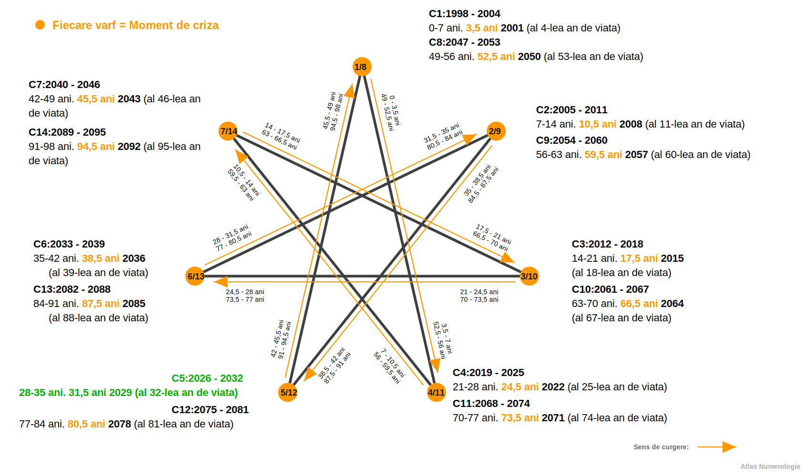
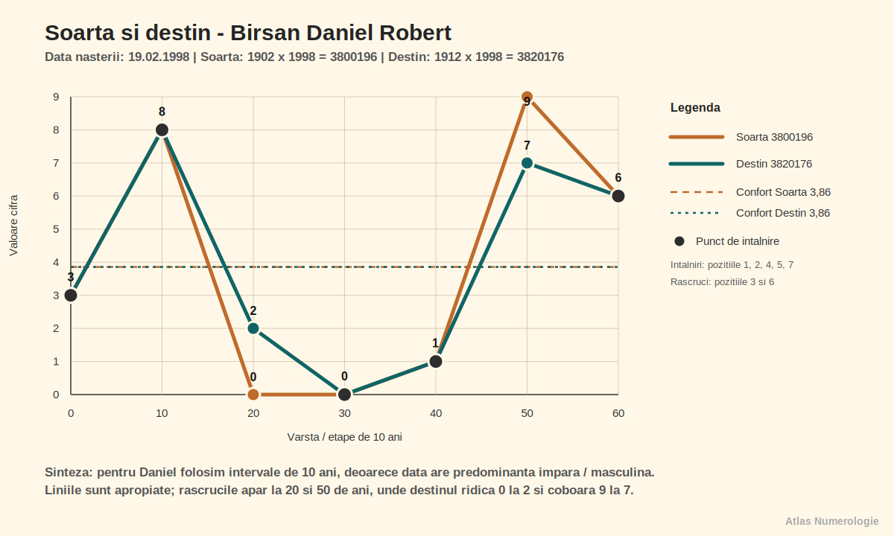
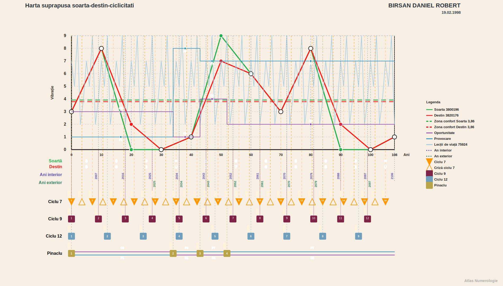
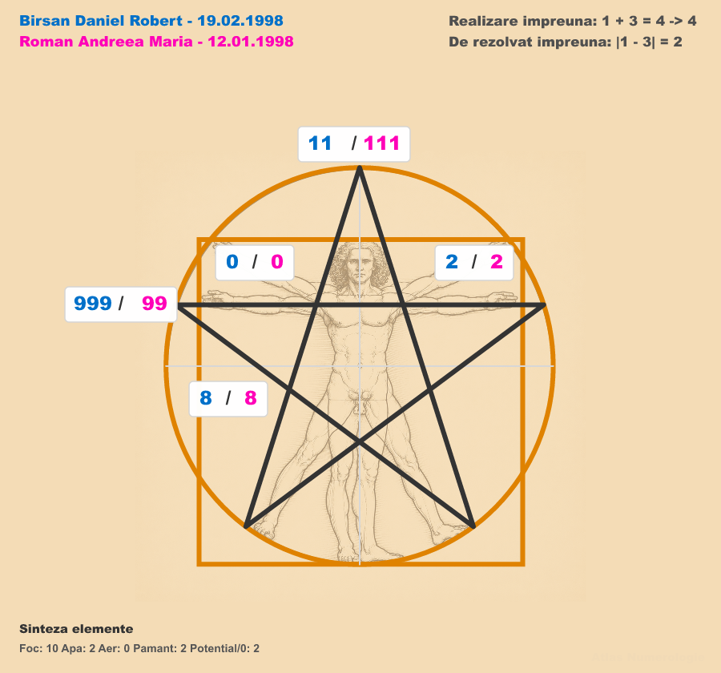
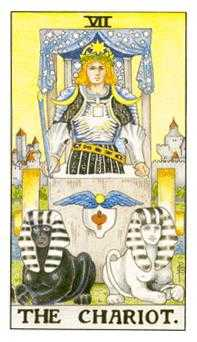
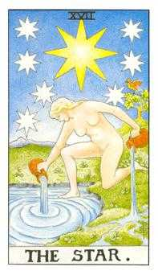
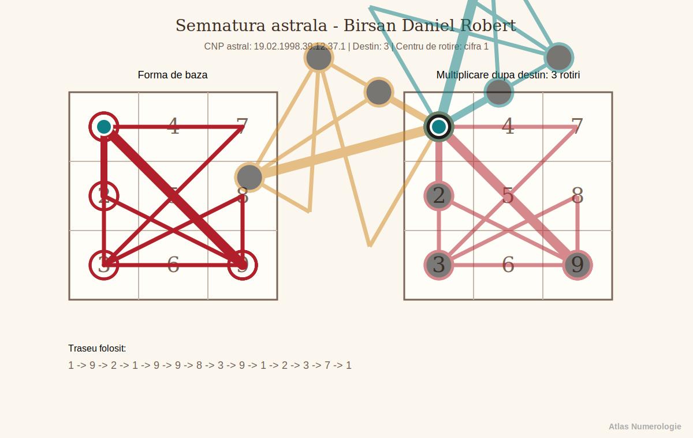
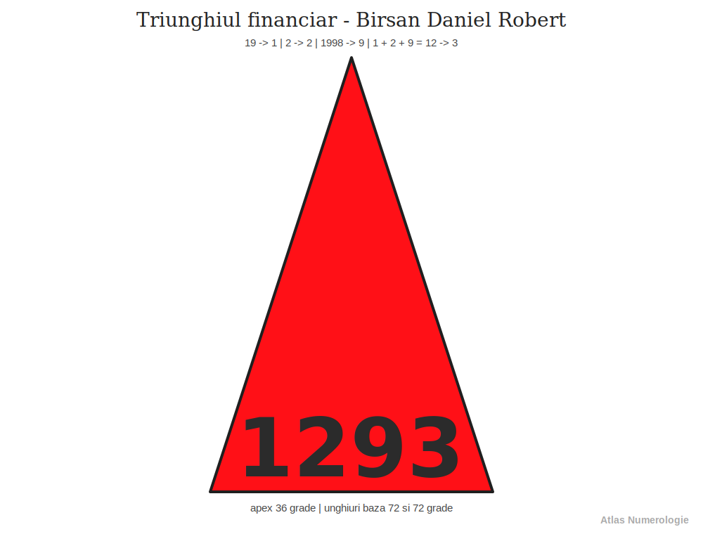
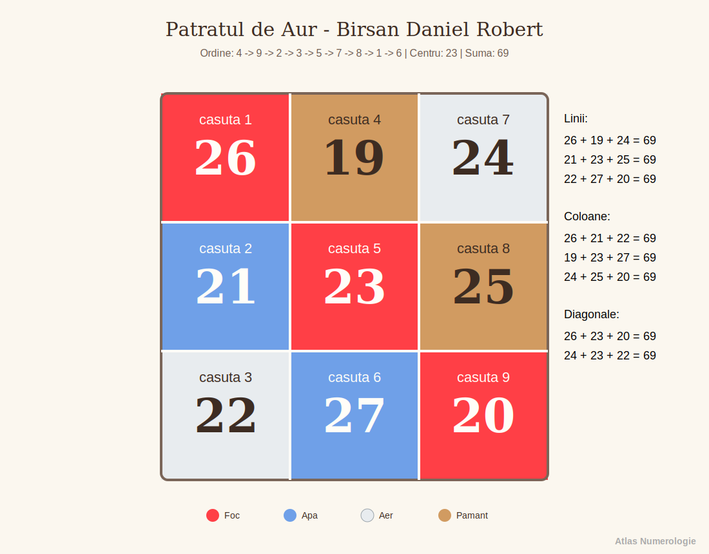

Index: BDR-19980219-v1.04r-CAP-001
# Lucrare numerologica - Birsan Daniel Robert - v1.04r

Index: BDR-19980219-v1.04r-CAP-002
## Date generale

Index: BDR-19980219-v1.04r-L-001
- Persoana analizata: Birsan Daniel Robert
- Data nasterii: 19.02.1998
- Nume familie: Birsan
- Prenume: Daniel Robert
- Prenume activ folosit in calcul: Daniel
- Versiune lucrare: v1.04r
- Data lucrarii: 2026-06-29
- Template de lucru: templates/Template_Lucrare_Numerologica_Examen.md
- Tip lucrare: lucrare numerologica de examen
- Stil de redactare: explicativ, conversational-academic
- Nivel de detaliere: amplu

Index: BDR-19980219-v1.04r-SUB-001
### Relatii

Index: BDR-19980219-v1.04r-L-002
- Persoana analizata in relatie: Roman Andreea Maria
- Data nasterii persoana analizata in relatie: 12.01.1998
- Tip relatie analizata: compatibilitate generala / relatie

Index: BDR-19980219-v1.04r-CAP-003
## Capitolul 1. Formule, calcule, tabele, grafice

Index: BDR-19980219-v1.04r-SUB-002
### 1.1. Vibratiile fundamentale

Index: BDR-19980219-v1.04r-SUB-003
#### Vibratia interioara

Index: BDR-19980219-v1.04r-P-001
Daniel, aici ne uitam la vibratia interioara. Ea descrie motorul tau intim: motivatia de baza, instinctul personal, felul in care te simti pe tine cand nu trebuie sa demonstrezi nimic nimanui. Daca ar fi sa folosim o analogie, vibratia interioara este scanteia din camera interioara: nu se vede mereu din afara, dar ea aprinde decizia, curajul, reactia si directia ta reala.

Index: BDR-19980219-v1.04r-P-002
Pentru tine, vibratia interioara raspunde la intrebari simple, dar importante: ce ma porneste, ce ma enerveaza, ce imi da curaj, ce vreau sa aleg singur? Inainte sa vorbim despre destin, relatii sau rezultate, aici vedem energia care apasa prima data pe acceleratie.

Index: BDR-19980219-v1.04r-P-003
Pentru vibratia interioara reducem ziua ta de nastere la o singura cifra.

Index: BDR-19980219-v1.04r-C-001
**Calcul:** 1 + 9 = 10 -> 1 + 0 = 1

Index: BDR-19980219-v1.04r-P-004
Rezultatul este 1. Arhetipurile acestei vibratii sunt initiatorul, deschizatorul de drum, liderul, pionierul, omul care spune "incep eu". In forma buna, 1-ul nu asteapta sa fie impins de la spate; el porneste, decide, testeaza si isi asuma.

Index: BDR-19980219-v1.04r-P-005
La tine, Daniel, asta inseamna ca in interior exista o nevoie puternica de autonomie. Ai nevoie sa simti ca alegerea iti apartine. Cand energia 1 este folosita matur, te ajuta sa incepi proiecte, sa te ridici repede dupa blocaje si sa iti spui clar punctul de vedere. Cand este tensionata, poate deveni graba, incapatanare, reactie defensiva sau senzatia ca trebuie sa faci totul singur.

Index: BDR-19980219-v1.04r-P-006
Pe scurt, vibratia interioara 1 iti spune asa: "nu astepta mereu permisiune; invata sa pornesti, dar invata si sa conduci fara sa fortezi".

Index: BDR-19980219-v1.04r-SUB-004
#### Vibratia exterioara

Index: BDR-19980219-v1.04r-P-007
Aici ne uitam la vibratia exterioara. Daca vibratia interioara este camera interioara, vibratia exterioara este usa prin care iesi in lume. Ea arata cum te vad ceilalti la primul contact, cum reactionezi in contexte sociale si ce fel de prezenta transmiti cand intri intr-un grup, intr-o conversatie sau intr-o situatie noua.

Index: BDR-19980219-v1.04r-P-008
Vibratia exterioara nu spune neaparat tot ce esti, ci forma prin care energia ta devine vizibila. Este ca ambalajul unei carti: nu contine intreaga poveste, dar creeaza prima impresie si ii invita pe ceilalti sa se apropie intr-un anumit fel.

Index: BDR-19980219-v1.04r-P-009
Pentru vibratia exterioara folosim luna nasterii. Luna 2 este deja redusa la o singura cifra.

Index: BDR-19980219-v1.04r-C-002
**Calcul:** 2 = 2

Index: BDR-19980219-v1.04r-P-010
Rezultatul este 2. Arhetipurile vibratiei 2 sunt mediatorul, partenerul, diplomatul, ascultatorul, omul care simte atmosfera din camera. Daca 1-ul spune "eu pornesc", 2-ul spune "hai sa simtim ritmul potrivit".

Index: BDR-19980219-v1.04r-P-011
In exterior, Daniel, oamenii pot vedea la tine o parte mai sensibila, diplomata si atenta la nuante. Chiar daca in interior ai motor de 1, in afara poti parea mai calm, mai atent, mai dispus sa asculti sau sa negociezi. Aici apare o combinatie interesanta: inauntru exista initiativa, iar in afara apare filtrul relational.

Index: BDR-19980219-v1.04r-P-012
Vibratia exterioara 2 te ajuta sa simti oamenii, sa prinzi tensiunile subtile, sa observi cand cineva se inchide sau cand o situatie are nevoie de mai multa rabdare. Partea de echilibrat este sa nu transformi diplomatia in amanare si sa nu iti ascunzi decizia doar ca sa nu deranjezi.

Index: BDR-19980219-v1.04r-SUB-005
#### Vibratia globala

Index: BDR-19980219-v1.04r-P-013
Acest punct descrie vibratia globala. Ea este sinteza dintre vibratia interioara si vibratia exterioara: cum se intalneste ce simti in interior cu felul in care apari in exterior. Daca vibratia interioara este motorul si vibratia exterioara este caroseria, vibratia globala este felul in care masina se misca efectiv pe drum.

Index: BDR-19980219-v1.04r-P-014
Vibratia globala arata tonul general al personalitatii, energia care apare cand interiorul si exteriorul incep sa lucreze impreuna. Uneori confirma usor celelalte vibratii, alteori arata exact zona prin care trebuie sa te traduci mai bine.

Index: BDR-19980219-v1.04r-P-015
Pentru vibratia globala adunam vibratia interioara cu vibratia exterioara.

Index: BDR-19980219-v1.04r-C-003
**Calcul:** 1 + 2 = 3

Index: BDR-19980219-v1.04r-P-016
Rezultatul este 3. Arhetipurile vibratiei 3 sunt comunicatorul, povestitorul, creatorul, artistul, omul care pune trairea in cuvinte, forma sau gest. Daca 1 porneste si 2 simte, 3 exprima.

Index: BDR-19980219-v1.04r-P-017
La tine, Daniel, vibratia globala 3 arata ca energia ta se echilibreaza prin exprimare. Nu iti ajunge doar sa vrei ceva si nici doar sa simti atmosfera; ai nevoie sa formulezi, sa spui, sa explici, sa creezi o punte prin cuvant sau prin actiune vizibila.

Index: BDR-19980219-v1.04r-P-018
Cand nu comunici, energia se poate strange si ceilalti pot intelege gresit ce se intampla in tine. Cand exprimi constient, 3-ul devine un canal foarte bun: te ajuta sa clarifici, sa destinzi tensiuni, sa transmiti idei si sa faci oamenii sa inteleaga mai usor ce vrei.

Index: BDR-19980219-v1.04r-SUB-006
#### Vibratia cosmica variabila

Index: BDR-19980219-v1.04r-P-019
Vibratia cosmica variabila. Ea vine din ultimele doua cifre ale anului de nastere si arata o nuanta mai personala a generatiei tale, o culoare de fundal care se activeaza in felul in care te raportezi la timp, rezultate, maturizare si presiunea de a construi ceva.

Index: BDR-19980219-v1.04r-P-020
Daca vibratia interioara este motorul personal, iar vibratia exterioara este prezenta sociala, vibratia cosmica variabila seamana cu vremea in care conduci: nu schimba cine esti, dar influenteaza ritmul, tensiunea, prudenta si felul in care iti gestionezi resursele.

Index: BDR-19980219-v1.04r-P-021
Pentru vibratia cosmica variabila folosim ultimele doua cifre ale anului tau de nastere.

Index: BDR-19980219-v1.04r-C-004
**Calcul:** 9 + 8 = 17 -> 1 + 7 = 8

Index: BDR-19980219-v1.04r-P-022
Rezultatul este 8. Arhetipurile vibratiei 8 sunt administratorul, strategul, constructorul de rezultate, omul care invata legea consecintelor, autoritatea matura. 8-ul nu se multumeste doar cu intentii frumoase; el intreaba: ce faci concret, ce organizezi, ce ramane in urma ta?

Index: BDR-19980219-v1.04r-P-023
Prin vibratia cosmica variabila 8, Daniel, ai o chemare spre organizare, rezultate si raportare matura la responsabilitate. Aceasta energie te poate ajuta sa gestionezi bani, timp, proiecte, limite si decizii importante. Este o vibratie care cere coloana vertebrala: promisiunile trebuie sustinute prin fapte.

Index: BDR-19980219-v1.04r-P-024
In forma tensionata, 8-ul poate aduce presiune, control, frica de esec sau raportare prea dura la reusita. De aceea, pentru tine, lectia nu este doar sa obtii rezultate, ci sa inveti sa le construiesti fara sa te rigidizezi.

Index: BDR-19980219-v1.04r-SUB-007
#### Vibratia cosmica totala

Index: BDR-19980219-v1.04r-P-025
Vibratia cosmica totala. Ea vine din anul complet de nastere si descrie amprenta mai larga a contextului in care ai intrat in viata. Nu este doar despre tine ca individ, ci despre fundalul simbolic al anului: ce fel de lectie generala, ce fel de atmosfera si ce fel de chemare mai larga insotesc drumul tau.

Index: BDR-19980219-v1.04r-P-026
Ca analogie, vibratia cosmica totala este decorul piesei in care joci rolul personal. Vibratia interioara arata personajul din interior, vibratia exterioara arata cum intra pe scena, vibratia globala arata cum se misca, iar vibratia cosmica totala arata lumina mare a scenei, atmosfera in care toate acestea se intampla.

Index: BDR-19980219-v1.04r-P-027
Pentru vibratia cosmica totala adunam toate cifrele anului complet.

Index: BDR-19980219-v1.04r-C-005
**Calcul:** 1 + 9 + 9 + 8 = 27 -> 2 + 7 = 9

Index: BDR-19980219-v1.04r-P-028
Rezultatul este 9. Arhetipurile vibratiei 9 sunt inteleptul, vizionarul, ghidul, umanistul, omul care cauta sensul mai mare al experientelor. 9-ul strange multe lectii si incearca sa vada imaginea de ansamblu.

Index: BDR-19980219-v1.04r-P-029
Fundalul anului iti aduce vibratia 9, Daniel. Ea te impinge sa privesti mai larg, sa intelegi sensul experientelor si sa nu ramai blocat in detalii marunte. Poti avea o tendinta naturala de a cauta explicatii, de a lega lucrurile intre ele si de a simti ca viata trebuie sa aiba o directie mai profunda decat simpla rutina.

Index: BDR-19980219-v1.04r-P-030
In forma buna, vibratia cosmica totala 9 iti da perspectiva, intuitie larga si capacitatea de a invata din experiente. In forma dificila, poate aduce oboseala, idealism excesiv sau tendinta de a duce prea mult pentru altii. De aceea, aici cheia este discernamantul: sa ajuti fara sa te pierzi si sa cauti sensul fara sa fugi de concret.

Index: BDR-19980219-v1.04r-SUB-008
### 1.2. Calea destinului, destinul si puntile

Index: BDR-19980219-v1.04r-P-031
Calea destinului, destinul si puntile formeaza impreuna harta drumului tau de baza. Daca vibratiile fundamentale ne-au aratat cum pornesti din interior, cum apari in exterior si cum se vede energia ta globala, aici mergem mai departe si ne uitam la traseu: incotro se duce energia, prin ce fel de experiente se maturizeaza si ce legaturi trebuie facute intre partile tale.

Index: BDR-19980219-v1.04r-P-032
Imagineaza-ti ca viata este un drum lung. Calea destinului este traseul complet de pe harta, cu toate curbele, intersectiile si zonele prin care treci. Destinul este directia principala in care drumul te conduce. Puntile sunt podurile dintre felul in care simti, felul in care te arati si felul in care ajungi sa te implinesti. Cand puntile sunt constiente, nu mai simti ca o parte din tine trage intr-o directie si alta parte in alta directie.

Index: BDR-19980219-v1.04r-SUB-009
#### Calea destinului

Index: BDR-19980219-v1.04r-P-033
Calea destinului este suma tuturor cifrelor din data de nastere inainte de reducerea finala. Ea pastreaza nuantele drumului, nu doar rezultatul redus. Daca destinul final este titlul capitolului, calea destinului este povestea din spatele titlului: cum se formeaza directia, din ce materiale este construita si ce ton are parcursul.

Index: BDR-19980219-v1.04r-P-034
Calea destinului poate fi privita ca traseul complet de pe harta. Arhetipurile ei sunt calatorul, navigatorul, omul care invata din drum si cel care intelege ca destinatia nu se formeaza dintr-un singur pas, ci din toate experientele adunate.

Index: BDR-19980219-v1.04r-P-035
Pentru calea destinului adunam toate cifrele din data ta de nastere si pastram suma completa.

Index: BDR-19980219-v1.04r-C-006
**Calcul:** 1 + 9 + 0 + 2 + 1 + 9 + 9 + 8 = 39

Index: BDR-19980219-v1.04r-P-036
Calea ta este 39. Aici apar doua energii care lucreaza impreuna: 3-ul aduce exprimare, comunicare, creativitate si nevoie de miscare vie, iar 9-ul aduce intelegere larga, sensibilitate fata de oameni, finalizare si capacitatea de a vedea imaginea de ansamblu. Arhetipic, 39 poate fi vazut ca povestitorul matur, comunicatorul care a trait ceva si il poate transforma in sens pentru ceilalti.

Index: BDR-19980219-v1.04r-P-037
Calea 39 iti arata un drum in care exprimarea, oamenii si sensul se combina. Daniel, nu este suficient doar sa stii sau sa simti; ai nevoie sa transmiti mai departe, sa formulezi, sa pui in cuvinte, in idei sau in actiuni ceea ce ai inteles. In viata de zi cu zi, asta se poate vedea cand explici cuiva o situatie complicata pe intelesul lui, cand transformi o experienta grea intr-o lectie utila sau cand simti ca o idee nu este completa pana nu o spui, o scrii, o construiesti sau o impartasesti.

Index: BDR-19980219-v1.04r-P-038
Partea frumoasa a lui 39 este ca poate da voce unei experiente. Partea care cere atentie este riscul de a simti prea multe, de a strange prea mult in interior sau de a amana exprimarea pana cand devine tensiune. Pentru tine, cheia este sa lasi comunicarea sa fie un instrument de eliberare si clarificare, nu doar o reactie dupa ce presiunea s-a acumulat.

Index: BDR-19980219-v1.04r-SUB-010
#### Destinul

Index: BDR-19980219-v1.04r-P-039
Destinul arata directia finala de realizare, cifra catre care se reduce calea. Daca 39 este traseul complet, 3 este semnul mare de pe drum: directia prin comunicare, expresie, creativitate, relatie vie cu oamenii si capacitatea de a aduce lumina intr-o situatie prin cuvant, idee, umor, inspiratie sau prezenta.

Index: BDR-19980219-v1.04r-P-040
Destinul poate fi privit ca semnul principal de orientare. Arhetipurile acestei rubrici sunt chemarea, directia, tinta interioara si vocea care intreaba: "prin ce devin eu mai implinit si mai util in lume?"

Index: BDR-19980219-v1.04r-P-041
Pentru destin reducem calea destinului pana ajungem la vibratia de baza.

Index: BDR-19980219-v1.04r-C-007
**Calcul:** 3 + 9 = 12 -> 1 + 2 = 3

Index: BDR-19980219-v1.04r-P-042
Rezultatul este 3. Arhetipurile destinului 3 sunt comunicatorul, artistul, povestitorul, creatorul de atmosfera, omul care leaga oamenii prin idei si expresie. Nu inseamna neaparat scena, spectacol sau arta in sens clasic. Poate insemna si sa explici bine, sa vinzi o idee, sa creezi continut, sa coordonezi o discutie, sa aduci claritate intr-o echipa sau sa gasesti formula potrivita atunci cand ceilalti nu stiu cum sa spuna ce simt.

Index: BDR-19980219-v1.04r-P-043
Directia ta de realizare merge prin 3, Daniel: comunicare, exprimare, creativitate si contact viu cu oamenii. Cand iti asumi vocea, ideile si felul tau de a transmite, destinul se misca mai natural. In termeni simpli, viata iti cere sa nu ramai doar in observatie sau analiza, ci sa dai forma lucrurilor: sa formulezi, sa creezi, sa explici, sa pui oamenii in miscare printr-o idee sau printr-o stare.

Index: BDR-19980219-v1.04r-P-044
In varianta echilibrata, 3-ul tau devine bucurie, inteligenta expresiva, flexibilitate si capacitatea de a face lucrurile mai usor de inteles. In varianta tensionata, poate deveni risipire, gluma folosita ca aparare, multe inceputuri fara finalizare sau tendinta de a evita subiectele grele prin schimbarea tonului. De aceea, destinul 3 nu inseamna doar sa vorbesti mai mult, ci sa vorbesti mai clar, mai asumat si mai conectat la ceea ce vrei sa construiesti.

Index: BDR-19980219-v1.04r-SUB-011
#### Puntea interior - exterior

Index: BDR-19980219-v1.04r-P-045
Aici comparam ce simti in interior cu felul in care te manifesti in exterior. Puntea ne arata unde curge usor energia si unde ai nevoie sa te traduci mai constient pentru ceilalti.

Index: BDR-19980219-v1.04r-P-046
Imagineaza-ti aceasta punte ca legatura dintre camera interioara si usa prin care iesi in lume. Arhetipurile ei sunt traducatorul, mesagerul si omul care invata sa arate in exterior ceea ce simte in interior, fara sa piarda nici adevarul personal, nici tactul relational.

Index: BDR-19980219-v1.04r-P-047
Pentru puntea interior-exterior calculam diferenta dintre vibratia interioara si vibratia exterioara.

Index: BDR-19980219-v1.04r-C-008
**Calcul:** |1 - 2| = 1

Index: BDR-19980219-v1.04r-P-048
La tine, interiorul vine prin 1, iar exteriorul prin 2: inauntru exista initiativa, autonomie si impuls de decizie, iar in afara se vede mai mult sensibilitatea, diplomatia si atentia la reactie. Imagineaza-ti ca in interior ai un conducator care vrea sa porneasca repede, iar la exterior ai un diplomat care vrea sa simta mai intai terenul. Ambele parti sunt utile. Problema apare doar cand conducatorul se enerveaza ca diplomatul asteapta prea mult sau cand diplomatul ascunde decizia ca sa nu creeze tensiune.

Index: BDR-19980219-v1.04r-P-049
Puntea 1 iti spune ca intre interior si exterior cheia este asumarea. Daniel, cand esti clar cu decizia ta, oamenii te inteleg mai usor. Cand eziti sau astepti prea multe confirmari, apare tensiune intre ce vrei si ce arati. In viata de zi cu zi, asta poate arata asa: stii ce vrei, dar formulezi prea bland; simti ca trebuie sa spui nu, dar amani; ai o directie, dar o prezinti ca intrebare ca sa nu deranjezi.

Index: BDR-19980219-v1.04r-P-050
Arhetipul puntii 1 este initiatorul matur: omul care poate ramane atent la ceilalti, fara sa-si piarda directia. Exercitiul tau este sa spui mai repede si mai simplu ce alegi. Nu brutal, nu rigid, ci limpede. Cand puntea aceasta functioneaza, 1-ul interior nu mai pare presiune, iar 2-ul exterior nu mai pare ezitare; impreuna devin fermitate cu tact.

Index: BDR-19980219-v1.04r-SUB-012
#### Puntea interior - destin

Index: BDR-19980219-v1.04r-P-051
Acest punct arata distanta dintre motivatia profunda si directia de destin. Puntea interior-destin vorbeste despre felul in care motorul personal ajunge sa serveasca directia mare a vietii.

Index: BDR-19980219-v1.04r-P-052
Ca analogie, aici vedem drumul dintre scanteie si forma finala. Arhetipurile acestei punti sunt alchimistul, mediatorul interior si constructorul de sens: partea care ia impulsul brut si il aseaza intr-o directie mai clara, mai utila si mai usor de trait.

Index: BDR-19980219-v1.04r-P-053
Pentru puntea interior-destin calculam diferenta dintre vibratia interioara si destin.

Index: BDR-19980219-v1.04r-C-009
**Calcul:** |1 - 3| = 2

Index: BDR-19980219-v1.04r-P-054
La tine vedem trecerea de la 1, adica dorinta de autonomie si initiativa, catre 3, adica destinul comunicarii si al exprimarii. Diferenta dintre ele este 2, iar asta spune ca drumul tau nu se deschide doar prin vointa, ci prin relatie, ritm, rabdare si colaborare.

Index: BDR-19980219-v1.04r-P-055
Cu alte cuvinte, interiorul tau poate spune "vreau sa fac", destinul tau spune "exprima, creeaza, transmite", iar puntea 2 intreaba "cu cine, in ce ton, in ce ritm si cu cata ascultare?". Este o punte foarte importanta pentru ca te invata ca vocea ta devine mai puternica atunci cand nu trece peste oameni, ci ii include.

Index: BDR-19980219-v1.04r-P-056
Intre motivatia ta profunda si destin apare vibratia 2. Asta iti spune, Daniel, ca drumul tau nu se implineste doar prin forta personala, ci si prin rabdare, cooperare, ascultare si relatii construite cu finete. In exemple concrete, 2-ul se vede cand alegi sa asculti inainte sa raspunzi, cand construiesti un parteneriat in loc sa duci totul singur, cand adaptezi mesajul la omul din fata ta sau cand transformi o discutie tensionata intr-o punte reala.

Index: BDR-19980219-v1.04r-P-057
Arhetipul acestei punti este mediatorul creator: omul care poate avea initiativa, dar stie ca mesajul ajunge mai bine cand este asezat in relatie. Pentru tine, Daniel, asta inseamna ca succesul nu vine doar din a avea ideea buna, ci din felul in care o transmiti, o negociezi, o faci inteleasa si o asezi intr-un context in care ceilalti pot raspunde.

Index: BDR-19980219-v1.04r-SUB-013
### 1.3. Aspecte de indreptat

Index: BDR-19980219-v1.04r-P-058
Aspectele de indreptat nu sunt defecte si nu trebuie citite ca etichete grele. Ele arata mai degraba locul in care energia ta poate fi educata, rafinata si folosita mai constient. Daca destinul arata drumul, aspectele de indreptat arata pietrele de pe drum: nu ca sa te opresti in ele, ci ca sa inveti cum le treci mai matur.

Index: BDR-19980219-v1.04r-P-059
La tine, Daniel, aceasta rubrica este importanta pentru ca lucreaza cu diferenta dintre potentialul drumului si primul impuls al zilei de nastere. Cu alte cuvinte, ne uitam la felul in care initiativa ta interioara poate deveni uneori prea rapida, prea defensiva sau prea orientata spre control, iar apoi vedem cum poate fi transformata in directie limpede.

Index: BDR-19980219-v1.04r-SUB-014
#### Aspecte de indreptat

Index: BDR-19980219-v1.04r-P-060
Aici ne uitam la o zona pe care tu o poti rafina. Nu vorbim despre vina sau defect, Daniel, ci despre un tipar care are nevoie de mai multa constienta. Imagineaza-ti aceasta zona ca pe un muschi: daca il folosesti impulsiv, poate crea tensiune; daca il antrenezi, devine forta, stabilitate si precizie.

Index: BDR-19980219-v1.04r-P-061
Rezultatul acestei rubrici este 37. In el avem 3-ul, care tine de comunicare, expresie, spontaneitate si felul in care dai forma unei idei, si 7-ul, care tine de analiza, profunzime, observatie, introspectie si cautarea unui sens mai adanc. Arhetipic, 37 poate fi vazut ca cercetatorul care trebuie sa invete sa vorbeasca sau ca povestitorul care nu se multumeste cu suprafata lucrurilor.

Index: BDR-19980219-v1.04r-P-062
Pentru aspectele de indreptat pornim de la calea destinului si scadem de doua ori prima cifra din ziua nasterii.

Index: BDR-19980219-v1.04r-C-010
**Calcul:** 39 - 2 x 1 = 37

Index: BDR-19980219-v1.04r-P-063
Rezultatul 37 iti arata o tema care se intelege prin experienta, nu doar prin teorie. Pentru tine, observarea reactiilor proprii este foarte importanta: cand te grabesti, cand te aperi, cand vrei sa controlezi si cand poti alege altfel. In viata de zi cu zi, 37 se poate vedea cand simti ceva rapid, dar ai nevoie sa intelegi de ce ai reactionat asa; cand spui o idee, dar apoi iti dai seama ca in spate era o emotie nespusa; sau cand preferi sa rezolvi singur o situatie, desi o discutie clara ar fi simplificat lucrurile.

Index: BDR-19980219-v1.04r-P-064
Partea buna a lui 37 este ca iti poate da minte fina, intuitie, capacitate de analiza si forta de a transforma experienta in intelegere. Partea de lucrat este sa nu te inchizi in capul tau, sa nu supraanalizezi pana se pierde spontaneitatea si sa nu folosesti distanta ca forma de aparare. Aici lectia este sa ramai prezent: sa observi, dar si sa comunici; sa intelegi, dar si sa actionezi; sa ai profunzime, dar fara sa te rupi de oameni.

Index: BDR-19980219-v1.04r-SUB-015
#### Solutia aspectelor de indreptat

Index: BDR-19980219-v1.04r-P-065
Solutia arata cheia simplificata a aspectului de indreptat. Daca aspectul arata tensiunea, solutia arata directia de echilibrare. In cazul tau, 37 se reduce la 1, ceea ce inseamna ca iesirea din blocaj vine prin asumare, decizie, initiativa si claritate personala.

Index: BDR-19980219-v1.04r-P-066
Este ca si cum 37 iti pune intrebarea "intelegi ce se intampla in tine?", iar 1 iti spune "bine, acum alege si mergi intr-o directie". Solutia nu este sa fortezi lucrurile, ci sa nu ramai blocat in analiza. Cand simti ca ai intors o problema pe toate partile, 1-ul te cheama sa faci pasul urmator: sa spui ce vrei, sa incepi, sa trasezi o limita sau sa iei o decizie.

Index: BDR-19980219-v1.04r-P-067
Pentru solutie reducem rezultatul obtinut la o singura cifra.

Index: BDR-19980219-v1.04r-C-011
**Calcul:** 3 + 7 = 10 -> 1 + 0 = 1

Index: BDR-19980219-v1.04r-P-068
Solutia vine prin 1: Daniel, ai nevoie sa iti asumi decizia si sa nu astepti mereu ca exteriorul sa confirme ce simti deja. Cand alegi limpede, energia se strange si devine directie. Practic, asta poate insemna sa formulezi mai repede o intentie, sa spui "asta aleg", sa incepi un proiect inainte sa ai toate garantiile sau sa iti sustii punctul de vedere fara sa il transformi intr-o lupta.

Index: BDR-19980219-v1.04r-P-069
Arhetipul solutiei 1 este liderul interior: partea din tine care poate lua initiativa fara sa devina rigida. Cand aceasta solutie este folosita matur, 37 nu mai ramane o spirala de ganduri, ci devine intelegere aplicata. Analizezi, intelegi, apoi alegi. Asta este cheia: nu doar profunzime, ci profunzime care se transforma in actiune.

Index: BDR-19980219-v1.04r-SUB-016
### 1.4. Structura matriciala

Index: BDR-19980219-v1.04r-SUB-017
#### Matricea datei de nastere

Index: BDR-19980219-v1.04r-P-070
Matricea este una dintre cele mai utile harti de orientare din lucrare, Daniel. Ea nu te defineste rigid, ci iti arata unde ai energii care pornesc firesc, unde apar repetitii puternice si ce zone merita cultivate cu mai multa rabdare.

Index: BDR-19980219-v1.04r-P-071
Pentru matrice pornim de la data de nastere si construim, pe rand, N1, N2, N3 si N4. La final, data compacta impreuna cu aceste patru valori formeaza sirul complet, adica numarul logic al persoanei.

Index: BDR-19980219-v1.04r-C-011a
**Calcul:** Data nasterii 19.02.1998 -> data compacta 19021998 -> N1 = 1 + 9 + 0 + 2 + 1 + 9 + 9 + 8 = 39 -> N2 = 3 + 9 = 12 -> 1 + 2 = 3 -> N3 = 39 - (2 x 1) = 37 -> N4 = 3 + 7 = 10 -> 1 + 0 = 1 -> sir complet / numar logic = 19021998 + 39 + 3 + 37 + 1 = 19021998393371

Index: BDR-19980219-v1.04r-T-001
```text
1: 111  / optim 111 / triunghi | 4: - / optim 44 / absent | 7: 7    / optim 7 / cerc
2: 2    / optim 222 / cerc     | 5: - / optim 55 / absent | 8: 8    / optim 8 / cerc
3: 333  / optim 333 / triunghi | 6: - / optim 66 / absent | 9: 9999 / optim 9 / patrat
```


Index: BDR-19980219-v1.04r-P-072
Casutele pline arata resurse la care ai acces mai usor. Casutele goale nu sunt defecte si nu spun ca iti lipseste ceva esential; ele indica locuri in care invatarea devine mai constienta, prin experienta, relatie, disciplina si alegeri repetate.

Index: BDR-19980219-v1.04r-SUB-018
#### Casutele matricei

Index: BDR-19980219-v1.04r-T-002
| Casuta | Cifre | Valoare | Descriere | Calcul si interpretare |
| --- | --- | ---: | --- | --- |
| 1 | 111 | 3 | identitatea, vointa, caracterul si modul in care persoana isi afirma prezenta | Casuta este prezenta. Vibratia 1, asociata cu autonomie, vointa, curajul inceputului si nevoia de a lua decizii proprii. Cantitatea 3 arata cat de accesibila este aceasta energie. |
| 2 | 2 | 2 | energia emotionala, empatia, sensibilitatea relationala si vitalitatea subtila | Casuta este prezenta. Vibratia 2, asociata cu sensibilitate, cooperare, diplomatie, rabdare si capacitatea de a crea echilibru intre oameni. Cantitatea 1 arata cat de accesibila este aceasta energie. |
| 3 | 333 | 9 | expresia, comunicarea, talentul, bucuria si felul in care iti pui trairile in forma | Casuta este prezenta. Vibratia 3, asociata cu comunicare, creativitate, bucurie, spontaneitate si talentul de a da forma trairilor prin cuvant sau gest. Cantitatea 3 arata cat de accesibila este aceasta energie. |
| 4 | - | 0 | corpul, disciplina, sanatatea practica, ordinea si stabilitatea concreta | Casuta este absenta. Vibratia 4, asociata cu ordine, stabilitate, disciplina, responsabilitate si capacitatea de a construi pas cu pas. Cantitatea 0 arata cat de accesibila este aceasta energie. |
| 5 | - | 0 | centrul, curajul, libertatea, intuitia practica si capacitatea de adaptare | Casuta este absenta. Vibratia 5, asociata cu miscare, schimbare, curaj, adaptare si nevoia de experienta directa. Cantitatea 0 arata cat de accesibila este aceasta energie. |
| 6 | - | 0 | munca, familia, responsabilitatea, grija si felul in care te implici afectiv | Casuta este absenta. Vibratia 6, asociata cu iubire, grija, familie, responsabilitate afectiva, estetica si dorinta de echilibru. Cantitatea 0 arata cat de accesibila este aceasta energie. |
| 7 | 7 | 7 | spiritualitatea, intuitia, protectia, analiza si legatura cu lumea interioara | Casuta este prezenta. Vibratia 7, asociata cu introspectie, analiza, intuitie, spiritualitate si cautarea unui sens mai adanc. Cantitatea 1 arata cat de accesibila este aceasta energie. |
| 8 | 8 | 8 | socialul, dreptatea, organizarea, puterea si relatia cu resursele | Casuta este prezenta. Vibratia 8, asociata cu organizare, dreptate, rezultate, administrarea resurselor si raportarea matura la autoritate. Cantitatea 1 arata cat de accesibila este aceasta energie. |
| 9 | 9999 | 36 | intelectul, memoria, intelepciunea, sinteza si capacitatea de a intelege experientele | Casuta este prezenta. Vibratia 9, asociata cu intelepciune, compasiune, finalizare, idealuri si capacitatea de a privi imaginea de ansamblu. Cantitatea 4 arata cat de accesibila este aceasta energie. |

Index: BDR-19980219-v1.04r-SUB-019
#### Pare si impare

Index: BDR-19980219-v1.04r-P-073
Cifrele pare sunt asociate cu receptivitatea, relatia si constructia prin cooperare. Cifrele impare sunt asociate cu initiativa, expresia si miscarea directa.

Index: BDR-19980219-v1.04r-P-074
Total cifre pare = 2; total cifre impare = 11.

Index: BDR-19980219-v1.04r-P-075
Raportul dintre pare si impare iti arata felul in care alternezi intre a primi, a observa si a actiona. Daca balanta inclina mai mult intr-o directie, nu este o problema de corectat cu forta, ci un indiciu bland: acolo merita sa aduci mai multa prezenta si alegere constienta.

Index: BDR-19980219-v1.04r-SUB-020
#### Vectorii matricei

Index: BDR-19980219-v1.04r-T-003
| Vector | Denumire | Cifre | Valoare | Interpretare |
| --- | --- | --- | ---: | --- |
| 123 | Energie | 1112333 | 14 | Vector plin. Energia de pornire exista si poate fi folosita coerent: identitatea 1, sensibilitatea 2 si exprimarea 3 se leaga intre ele. Daniel poate porni lucruri, poate simti contextul si poate comunica impulsul initial, cu conditia sa nu arda energia prea repede. |
| 456 | Vointa | - | 0 | Vector complet lipsa. Aici lipsesc 4, 5 si 6: corpul, regulile, centrul, curajul practic, munca si responsabilitatea afectiva. Interpretarea nu este lipsa de vointa, ci nevoie de antrenament constient: program, disciplina, rutina corporala, limite si asumarea lucrurilor facute pas cu pas. |
| 789 | Creativitate | 789999 | 51 | Vector plin si cel mai puternic vector al matricei. 7 aduce analiza si intuitie, 8 organizare si raportare la rezultat, iar 9 viziune ampla si memorie. Aici apare fixatia: mintea, sensul si imaginea de ansamblu pot domina restul hartii. |
| 147 | Spiritualitate | 1117 | 10 | Vector incomplet prin lipsa lui 4. Identitatea 1 si intuitia 7 exista, dar corpul, stabilitatea, regulile si disciplina concreta trebuie cultivate. Spiritualitatea devine mai utila cand este asezata in practici simple, repetabile, nu doar in intelegeri interioare. |
| 258 | Social | 28 | 10 | Vector incomplet prin lipsa lui 5. Sensibilitatea 2 si organizarea 8 exista, dar centrul personal, curajul de adaptare si libertatea asumata trebuie intarite. In relatii, Daniel poate simti si poate administra situatii, dar are nevoie sa ramana prezent in propriul centru. |
| 369 | Bunastare materiala | 3339999 | 45 | Vector incomplet prin lipsa lui 6. Comunicarea 3 si viziunea 9 sunt foarte puternice, deci ideile pot produce valoare, dar lipsa lui 6 cere responsabilitate practica, continuitate, grija fata de munca si finalizare. Bunastarea creste cand inspiratia este legata de serviciu concret. |
| 159 | Cariera | 1119999 | 39 | Vector incomplet prin lipsa lui 5. Identitatea 1 si viziunea 9 dau directie, ambitie si imagine mare, dar centrul 5 cere curaj de adaptare, flexibilitate si contact cu experienta directa. Cariera se aseaza mai bine cand Daniel nu ramane doar in idee, ci testeaza, ajusteaza si se expune. |
| 357 | Scopuri | 3337 | 16 | Vector incomplet prin lipsa lui 5. Exprimarea 3 si intuitia 7 pot da scopuri inspirate, dar fara 5 poate lipsi centrul de decizie care transforma chemarea in miscare. Scopurile au nevoie de curaj practic, experiment si asumarea drumului chiar inainte ca totul sa fie perfect clar. |

Index: BDR-19980219-v1.04r-SUB-021
#### Tendinte, fixatie si caii-trasura-vizitiul

Index: BDR-19980219-v1.04r-P-076
Aceasta lectura strange dinamica matricei: dominantele, lipsurile si felul in care energia se misca prin vectorii de baza.

Index: BDR-19980219-v1.04r-P-076a
Comparatia cu optimul adauga reperul de echilibru. Matricea optima folosita ca baza este `111 | 44 | 7`, `222 | 55 | 8`, `333 | 66 | 9`, cu total general 72. Matricea ta are total general 65, deci nu lipseste forta, ci lipseste mai ales zona care face energia sa curga prin corp, centru si responsabilitate practica.

Index: BDR-19980219-v1.04r-T-003b
| Casuta | Cantitate<br>personala | Valoare<br>personala | Cantitate<br>optima | Valoare<br>optima | Diferenta | Citire |
| --- | ---: | ---: | ---: | ---: | ---: | --- |
| 1 | 3 | 3 | 3 | 3 | 0 | Identitatea si initiativa sunt la optim: poti porni, decide si ocupa un loc propriu. |
| 2 | 1 | 2 | 3 | 6 | -4 | Sensibilitatea exista, dar are nevoie de exercitiu relational, rabdare si ascultare constienta. |
| 3 | 3 | 9 | 3 | 9 | 0 | Exprimarea este la optim: comunicarea, creativitatea si adaptarea pot curge firesc. |
| 4 | 0 | 0 | 2 | 8 | -8 | Lipseste baza practica: corp, ordine, program, disciplina si stabilitate. |
| 5 | 0 | 0 | 2 | 10 | -10 | Lipseste centrul de reglaj: curaj practic, libertate asumata, prezenta in experienta directa. |
| 6 | 0 | 0 | 2 | 12 | -12 | Lipseste sustinerea afectiv-practica: responsabilitate, grija, continuitate si finalizare. |
| 7 | 1 | 7 | 1 | 7 | 0 | Intuitia si analiza sunt la optim: exista acces natural la observatie si sens interior. |
| 8 | 1 | 8 | 1 | 8 | 0 | Organizarea si raportul cu rezultatul sunt la optim: poti administra resurse cand ai cadru. |
| 9 | 4 | 36 | 1 | 9 | +27 | Zona de viziune, memorie si sens este mult peste optim; poate deveni talent major, dar si suprasolicitare mentala. |

Index: BDR-19980219-v1.04r-P-076b
Pe linii, prima linie `1-4-7` are 10 fata de optimul 18, a doua linie `2-5-8` are 10 fata de optimul 24, iar a treia linie `3-6-9` are 45 fata de optimul 30. Asta arata ca energia se strange puternic in zona de exprimare, rezultat si sens, dar are nevoie de 4, 5 si 6 ca sa nu ramana doar in minte, inspiratie sau analiza.

Index: BDR-19980219-v1.04r-P-076c
Pe coloane, coloana `1-2-3` are 14 fata de optimul 18, coloana `4-5-6` are 0 fata de optimul 30, iar coloana `7-8-9` are 51 fata de optimul 24. Aici se vede cel mai clar lectia curgerii energiei: pornirea exista, vizitiul mental-spiritual este foarte puternic, dar trasura practica lipseste. Ca energia sa curga, Daniel are nevoie sa alimenteze constient coloana 4-5-6 prin rutina, corp, limite, exercitiu, responsabilitate si finalizare concreta.

Index: BDR-19980219-v1.04r-P-077
Casuta dominanta este 9, cu valoarea 36. Casutele lipsa sunt 4, 5 si 6, adica zona de corp, stabilitate, centru, curaj practic, munca si responsabilitate afectiva. Aceste lipsuri nu anuleaza potentialul, dar arata unde energia trebuie educata prin obiceiuri, limite si actiuni repetate.

Index: BDR-19980219-v1.04r-P-078
Fixatia este vectorul plin cu valoarea cea mai mare. In cazul tau, Daniel, fixatia este pe vectorul 789, Creativitate, cu valoarea 51. Este importanta pentru ca arata zona in care energia se duce aproape natural: intuitie, analiza, organizare, memorie, viziune si intelegerea imaginii mari. Partea buna este ca poti vedea rapid sensul unei situatii. Partea de lucrat este sa nu ramai blocat doar in minte, observatie sau concluzii, ci sa cobori intelegerea in corp, program, munca si decizii concrete.

Index: BDR-19980219-v1.04r-P-078a
In analogia cai, trasura si vizitiu, caii sunt vectorul 123 si arata forta de pornire. La tine, caii au valoarea 14 si sunt plini: exista combustibil, initiativa, sensibilitate si exprimare. Trasura este vectorul 456 si arata suportul practic, corpul vehiculului, disciplina si capacitatea de a duce greutatea drumului. Aici valoarea este 0, pentru ca lipsesc 4, 5 si 6; de aceea, energia de pornire are nevoie de structura, rutina si responsabilitate ca sa nu ramana doar impuls. Vizitiul este vectorul 789 si arata directia mentala si spirituala. Cu valoarea 51, vizitiul este foarte puternic: mintea vede departe, dar trebuie sa conduca bland caii si sa nu uite ca trasura are nevoie de intretinere.

Index: BDR-19980219-v1.04r-P-078b
Scara bunastarii pune in ordine descrescatoare valorile vectorilor si ale casutelor. Ea arata unde exista acumulare mare de energie si unde apar trepte slabe sau absente. In lectura ta, varful este vectorul 789, urmat de 369 si 159, deci mintea, viziunea, exprimarea si orientarea spre rezultat sunt foarte active. La baza apar 456 si casutele 4, 5 si 6 cu valoare 0, ceea ce confirma aceeasi lectie: bunastarea creste cand energia mentala si creativa este sprijinita de corp, disciplina, centru si responsabilitate concreta.

Index: BDR-19980219-v1.04r-T-003a
| Treapta | Tip | Valoare |
| --- | --- | ---: |
| Vector 789 - Creativitate | Vector | 51 |
| Vector 369 - Bunastare materiala | Vector | 45 |
| Vector 159 - Cariera | Vector | 39 |
| Casuta 9 - Foc | Casuta | 36 |
| Vector 357 - Scopuri | Vector | 16 |
| Vector 123 - Energie | Vector | 14 |
| Vector 147 - Spiritualitate | Vector | 10 |
| Vector 258 - Social | Vector | 10 |
| Casuta 3 - Aer | Casuta | 9 |
| Casuta 8 - Pamant | Casuta | 8 |
| Casuta 7 - Aer | Casuta | 7 |
| Casuta 1 - Foc | Casuta | 3 |
| Casuta 2 - Apa | Casuta | 2 |
| Vector 456 - Vointa | Vector | 0 |
| Casuta 4 - Pamant | Casuta | 0 |
| Casuta 5 - Foc | Casuta | 0 |
| Casuta 6 - Apa | Casuta | 0 |

Index: BDR-19980219-v1.04r-SUB-022
### 1.5. Codul numerologic personal al numelui

Index: BDR-19980219-v1.04r-SUB-023
#### Numarul de exprimare

Index: BDR-19980219-v1.04r-P-081
Numarul de exprimare arata cum se aude si se vede numele tau complet in lume. El descrie stilul prin care iti poti exprima potentialul, cum iti pui calitatile in forma si ce fel de impresie energetica lasa numele tau complet. Este ca o semnatura ampla: nu spune doar cine esti in interior, ci cum poti functiona cand iti folosesti intregul nume ca resursa.

Index: BDR-19980219-v1.04r-P-082
Arhetipurile numarului de exprimare sunt mesagerul, rolul social, constructorul imaginii personale si omul care invata sa isi foloseasca potentialul in mod vizibil. Acest numar raspunde la intrebari precum: cum ma exprim cand sunt intreg, ce ton are prezenta mea si ce fel de contributie pot aduce prin felul meu de a fi?

Index: BDR-19980219-v1.04r-P-083
Pentru numarul de exprimare adunam valorile numelui complet si reducem rezultatul final.

Index: BDR-19980219-v1.04r-C-012
**Calcul:** Birsan 27 + Daniel 27 + Robert 33 = 87 -> 8 + 7 = 15 -> 1 + 5 = 6

Index: BDR-19980219-v1.04r-P-084
Rezultatul este 6. Arhetipurile vibratiei 6 sunt protectorul, armonizatorul, omul care repara, gazda, educatorul, cel care simte cand ceva trebuie asezat mai frumos, mai cald sau mai responsabil. Prin numarul de exprimare 6, Daniel, numele tau cere caldura, responsabilitate si echilibru. Tu te poti exprima bine cand aduci oamenilor siguranta, frumusete, grija sau sentimentul ca lucrurile sunt asezate.

Index: BDR-19980219-v1.04r-P-085
In viata de zi cu zi, 6-ul se poate vedea atunci cand vrei ca lucrurile sa fie corecte pentru toata lumea, cand iti pasa de atmosfera dintr-un loc, cand simti nevoia sa repari o relatie sau cand preiei spontan rolul celui care organizeaza, ajuta sau tine lucrurile impreuna. Dar aici exista si o atentie importanta: umbra apare cand iei prea mult asupra ta, cand vrei sa salvezi oameni care nu cer asta sau cand confunzi responsabilitatea cu obligatia de a duce totul singur.

Index: BDR-19980219-v1.04r-P-086
Pentru tine, cheia lui 6 este sa oferi fara sa te pierzi. Numele tau poate transmite incredere, seriozitate si disponibilitate, dar are nevoie si de limite clare. Cand 6-ul este matur, el nu devine povara; devine prezenta calda, structurata si demna de incredere.

Index: BDR-19980219-v1.04r-SUB-024
#### Numarul intim

Index: BDR-19980219-v1.04r-P-087
Numarul intim se calculeaza din vocale si vorbeste despre dorinte profunde, motivatie afectiva si nevoia interioara. Daca numarul de exprimare este felul in care se aude numele tau in lume, numarul intim este vocea mai tacuta din spate: ce cauti cu adevarat, ce te misca afectiv si ce are nevoie sufletul tau ca sa simta sens.

Index: BDR-19980219-v1.04r-P-088
Ca analogie, vocalele sunt respiratia numelui. Ele nu sunt mereu cele mai vizibile, dar dau emotie, curgere si vibratie interioara. Arhetipurile numarului intim sunt cautatorul, inima ascunsa, idealistul si omul care nu se multumeste doar cu forma exterioara a lucrurilor.

Index: BDR-19980219-v1.04r-P-089
Pentru numarul intim adunam vocalele din nume si reducem totalul.

Index: BDR-19980219-v1.04r-C-013
**Calcul:** 36 -> 3 + 6 = 9

Index: BDR-19980219-v1.04r-P-090
Rezultatul este 9. Arhetipurile vibratiei 9 sunt inteleptul, umanitarul, vizionarul, omul care vede imaginea mare si cel care cauta sensul din spatele experientei. In interior, prin numarul intim 9, tu cauti sens. Daniel, nu te multumesti doar cu lucruri mici sau rupte de imaginea mare; ai nevoie sa intelegi de ce faci ceva si ce valoare are pentru oameni sau pentru drumul tau.

Index: BDR-19980219-v1.04r-P-091
In situatii concrete, 9-ul intim se poate simti cand te afecteaza nedreptatea, cand nu poti ramane indiferent fata de suferinta altora, cand ai nevoie sa vezi rostul unei relatii sau cand simti ca o activitate fara sens te consuma mai mult decat te hraneste. Acest 9 poate aduce profunzime, compasiune si maturitate, dar poate aduce si oboseala daca preiei prea mult din greutatea lumii.

Index: BDR-19980219-v1.04r-P-092
Pentru tine, Daniel, 9-ul intim cere discernamant: sa iti pastrezi capacitatea de a intelege oamenii, dar fara sa devii responsabil pentru toate durerile lor. Cand este echilibrat, acest numar iti da perspectiva, intelepciune si o forma de noblete interioara.

Index: BDR-19980219-v1.04r-SUB-025
#### Numarul de realizare

Index: BDR-19980219-v1.04r-P-093
Numarul de realizare se calculeaza din consoane si arata modul practic prin care persoana actioneaza si produce rezultate. Consoanele sunt structura numelui, partea care sustine forma si o face concreta. Daca vocalele sunt respiratia, consoanele sunt scheletul prin care intentia devine actiune.

Index: BDR-19980219-v1.04r-P-094
Arhetipurile numarului de realizare sunt constructorul, executantul, omul de incredere si partea care transforma potentialul in rezultat. Aici nu vorbim doar despre ce simti, ci despre cum faci, cum finalizezi, cum raspunzi practic si ce fel de rezultate poti produce cand energia ta este pusa la lucru.

Index: BDR-19980219-v1.04r-P-095
Pentru numarul de realizare adunam consoanele din nume si reducem totalul.

Index: BDR-19980219-v1.04r-C-014
**Calcul:** 51 -> 5 + 1 = 6

Index: BDR-19980219-v1.04r-P-096
Rezultatul este din nou 6. In plan practic, numarul de realizare 6 iti spune ca rezultatele vin mai bine cand construiesti armonie si incredere. Daniel, ai de invatat sa fii responsabil fara sa devii salvatorul tuturor. Asta inseamna ca poti produce rezultate bune in contexte in care conteaza grija, estetica, organizarea, sprijinul, educatia, relatia cu oamenii sau capacitatea de a stabiliza o situatie.

Index: BDR-19980219-v1.04r-P-097
In viata de zi cu zi, acest 6 se poate vedea cand un proiect merge mai bine pentru ca tu aduci ordine, cand oamenii se linistesc fiindca simt ca te pot baza pe tine sau cand ai rabdarea sa repari ceva ce altcineva ar abandona. Totusi, realizarea prin 6 cere o regula simpla: ajuta, dar nu prelua vietile altora. Construieste, dar nu cara singur toata constructia.

Index: BDR-19980219-v1.04r-P-098
Pentru tine, 6-ul repetat in exprimare si realizare intareste tema responsabilitatii. Numele tau are o directie clara: sa creeze incredere, echilibru si sentimentul ca lucrurile pot fi asezate. Cand pui limite sanatoase, aceasta energie devine foarte productiva.

Index: BDR-19980219-v1.04r-SUB-026
#### Numarul activ

Index: BDR-19980219-v1.04r-P-099
Numarul activ vine din prenumele folosit si arata energia cu care intri cel mai des in interactiunile cotidiene. Este partea cea mai apelata a numelui tau, pentru ca oamenii te striga, te cheama si te recunosc prin acest prenume. De aceea, numarul activ descrie felul in care reactionezi rapid si cum te pui in miscare in viata de zi cu zi.

Index: BDR-19980219-v1.04r-P-100
Ca analogie, numarul activ este cheia pe care o folosesti cel mai des la usa identitatii tale. Arhetipurile lui sunt raspunsul spontan, prezenta cotidiana, rolul de zi cu zi si energia cu care intri in conversatii, decizii si situatii obisnuite.

Index: BDR-19980219-v1.04r-P-101
Pentru numarul activ folosim prenumele activ, Daniel, si reducem totalul lui.

Index: BDR-19980219-v1.04r-C-015
**Calcul:** Daniel = 27 -> 2 + 7 = 9

Index: BDR-19980219-v1.04r-P-102
Prenumele activ Daniel duce spre 9, deci in interactiunile de zi cu zi poti aduce perspectiva, maturitate si capacitatea de a vedea imaginea mare. Aici apare arhetipul observatorului matur: omul care nu se opreste doar la detaliu, ci cauta contextul, rostul si urmarea unei situatii.

Index: BDR-19980219-v1.04r-P-103
In viata de zi cu zi, numarul activ 9 poate aparea atunci cand ai tendinta sa privesti lucrurile de sus, sa cauti sensul unei discutii, sa vrei sa intelegi motivatia oamenilor sau sa ai rabdare cu situatii pe care altii le judeca prea repede. Ai grija doar sa nu pari distant atunci cand, de fapt, tu incerci sa intelegi tot tabloul. Uneori oamenii au nevoie sa simta nu doar ca ii intelegi, ci si ca esti prezent emotional langa ei.

Index: BDR-19980219-v1.04r-SUB-027
#### Numarul ereditar

Index: BDR-19980219-v1.04r-P-104
Numarul ereditar vine din numele de familie si descrie amprenta de neam, mostenirea subtila si tipul de energie preluata prin linia familiala. Nu il citim ca destin fix, ci ca fundal: o frecventa care vine cu numele si care poate fi traita constient, transformata sau maturizata.

Index: BDR-19980219-v1.04r-P-105
Ca analogie, numarul ereditar este pamantul din care creste copacul numelui tau. Nu iti decide toate ramurile, dar iti arata ce fel de radacina simbolica porti. Arhetipurile lui sunt mostenirea, memoria familiala, radacina si tema pe care o poti duce mai departe intr-o forma personala.

Index: BDR-19980219-v1.04r-P-106
Pentru numarul ereditar folosim numele de familie si reducem totalul lui.

Index: BDR-19980219-v1.04r-C-016
**Calcul:** Birsan = 27 -> 2 + 7 = 9

Index: BDR-19980219-v1.04r-P-107
Prin numele de familie apare tot vibratia 9. Daniel, din linia de neam poate veni o tema de intelepciune, finalizare si responsabilitate fata de sens. Poate exista o sensibilitate fata de lucruri nespuse, fata de istorii de familie, fata de nevoia de a intelege, de a inchide capitole sau de a duce mai departe ceva cu mai multa constienta.

Index: BDR-19980219-v1.04r-P-108
In viata concreta, 9-ul ereditar poate arata o tendinta de a simti greutatea trecutului, de a cauta explicatii pentru ce s-a intamplat in familie sau de a avea o maturitate interioara formata devreme. Important este sa o traiesti personal, nu ca pe o povara preluata automat. Mostenirea devine resursa cand alegi ce pastrezi, ce transformi si ce nu mai duci mai departe.

Index: BDR-19980219-v1.04r-SUB-028
#### Numarul neamului

Index: BDR-19980219-v1.04r-P-109
Numarul neamului citeste numele de familie printr-o reducere in intervalul 1-22, apropiata simbolic de limbajul arcanelor. Aici nu cautam o eticheta, ci o tema de fundal: ce lectie simbolica poate veni prin nume si ce fel de energie poate fi transformata in maturitate.

Index: BDR-19980219-v1.04r-P-110
Arhetipic, aceasta rubrica vorbeste despre firul de familie, scoala interioara a neamului si felul in care o mostenire poate deveni invatatura. Daca numarul ereditar arata vibratia principala a numelui de familie, numarul neamului adauga o imagine simbolica mai nuantata.

Index: BDR-19980219-v1.04r-P-111
Totalul numelui de familie este 27; reducerea 22 da 5; arcana majora asociata este 5.

Index: BDR-19980219-v1.04r-P-112
Rezultatul este 5. Arhetipurile lui 5 sunt profesorul, cautatorul de libertate, omul care invata prin experienta, ghidul, reformatorul si cel care are nevoie sa inteleaga regulile ca sa le poata folosi viu, nu mecanic. Aceasta informatie se citeste ca o tema de fundal. Ea poate functiona ca resursa mostenita, dar si ca responsabilitate de transformat intr-un mod personal si constient.

Index: BDR-19980219-v1.04r-P-113
Pentru tine, Daniel, 5-ul neamului poate sugera ca in spatele numelui exista o tema legata de adaptare, invatare, schimbare si raportare la reguli. Poate fi important sa nu repeti mecanic ce ai primit, ci sa intelegi, sa alegi si sa transformi. Cand 5-ul este matur, el nu fuge de responsabilitate, ci gaseste o forma vie, flexibila si personala de a merge mai departe.

Index: BDR-19980219-v1.04r-P-113a
Pentru codul numerologic personal al numelui, luam fiecare parte a numelui complet, calculam codul literelor si apoi adaugam numarul de exprimare. Calculul urmator arata traseul complet.

Index: BDR-19980219-v1.04r-C-011b
**Calcul:**
BIRSAN = B2 + I9 + R9 + S1 + A1 + N5 = 27 -> 2 + 7 = 9; cod BIRSAN = 299115.
DANIEL = D4 + A1 + N5 + I9 + E5 + L3 = 27 -> 2 + 7 = 9; cod DANIEL = 415953.
ROBERT = R9 + O6 + B2 + E5 + R9 + T2 = 33 -> 3 + 3 = 6; cod ROBERT = 962592.
Numar de exprimare = 9 + 9 + 6 = 24 -> 2 + 4 = 6.

Index: BDR-19980219-v1.04r-C-011c
**Calcul:**
Codul literelor numelui = 299115 + 415953 + 962592 = 299115415953962592.
Codul numerologic personal al numelui = codul literelor + numarul de exprimare = 299115415953962592 + 6 = 2991154159539625926

Index: BDR-19980219-v1.04r-T-003c
```text
1: 111 / optim 111 / triunghi | 4: 4    / optim 44 / cerc     | 7: - / optim 7 / absent
2: 222 / optim 222 / triunghi | 5: 5555 / optim 55 / patrat   | 8: - / optim 8 / absent
3: 3   / optim 333 / cerc     | 6: 66   / optim 66 / triunghi | 9: 99999 / optim 9 / pentagrama
```

Index: BDR-19980219-v1.04r-SUB-029
#### Cifre intense si influente subtile ale numelui

Index: BDR-19980219-v1.04r-P-114
Cifrele intense arata ce valori apar cel mai des in nume. Primele si ultimele litere arata cum incepe si cum se inchide energia fiecarei componente din nume. Aceasta zona este mai subtila: nu inlocuieste numerele principale, ci adauga textura, asemenea unor accente intr-o voce.

Index: BDR-19980219-v1.04r-P-115
Ca analogie, cifrele intense sunt cuvintele pe care numele tau le repeta des, iar primele si ultimele litere sunt portile: cum intri intr-o energie si cum o inchei. Arhetipurile acestei rubrici sunt accentul, reflexul, semnalul subtil si modul in care numele apasa anumite butoane interioare.

Index: BDR-19980219-v1.04r-P-116
In nume apar urmatoarele frecvente principale: cifra 1 apare de 3 ori, cifra 2 de 3 ori, cifra 3 o data, cifra 4 o data, cifra 5 de 4 ori, cifra 6 o data, iar cifra 9 de 5 ori. Cifra intensa este 9. Primele si ultimele litere sunt: Birsan incepe cu B=2 si se incheie cu N=5; Daniel incepe cu D=4 si se incheie cu L=3; Robert incepe cu R=9 si se incheie cu T=2. Primele vocale sunt I=9, A=1 si O=6.

Index: BDR-19980219-v1.04r-P-117
Pentru tine, Daniel, cifra intensa este 9, ceea ce intareste mult tema perspectivei, a sensului, a intelegerii si a maturizarii prin experiente. Faptul ca 9 apare si la numarul intim, si la numarul activ, si la numarul ereditar, iar apoi revine ca frecventa intensa, arata ca numele tau impinge foarte des spre imaginea mare. Asta poate fi o resursa puternica: vezi conexiuni, intelegi contexte, simti cand o situatie are nevoie de inchidere sau de sens.

Index: BDR-19980219-v1.04r-P-118
In acelasi timp, o cifra intensa poate deveni si suprasolicitare. Daca 9-ul lucreaza prea mult, poti obosi incercand sa intelegi tot, sa ierti tot, sa pui sens in tot sau sa vezi mereu tabloul mare cand uneori este nevoie doar de un pas simplu si concret. Primele si ultimele litere arata si ele o miscare interesanta: intri prin sensibilitate, structura si viziune, apoi inchizi prin libertate, expresie si relatie. Aceste elemente coloreaza felul in care te prezinti, reactionezi si iti construiesti identitatea prin nume.

Index: BDR-19980219-v1.04r-SUB-030
### 1.6. Ciclicitatile

Index: BDR-19980219-v1.04r-SUB-031
#### Lectiile de viata

Index: BDR-19980219-v1.04r-P-119
Lectiile de viata pot fi privite ca teme care revin pana cand devin mai usor de recunoscut si de trait matur. Nu vin sa te pedepseasca, ci sa iti ofere ocazii repetate de a exersa increderea, schimbarea, sensul, rabdarea sau constructia concreta.

Index: BDR-19980219-v1.04r-P-120
Pentru lectiile de viata inmultim ziua, luna si anul. Din rezultatul obtinut citim sirul lectiilor care revine in diferite etape si iti arata ce energie merita lucrata mai constient.

Index: BDR-19980219-v1.04r-C-017
**Calcul:** 19 x 2 x 1998 = 75924 -> 7, 5, 9, 2, 4

Index: BDR-19980219-v1.04r-P-121
Sirul acesta iti ofera un mod mai calm de a citi repetitiile vietii: uneori lucrezi cu profunzimea si increderea, alteori cu schimbarea, sensul, rabdarea sau constructia concreta. Privit astfel, fiecare etapa poate deveni un loc de maturizare si alegere, nu doar o perioada care trece peste tine.

Index: BDR-19980219-v1.04r-SUB-032
#### Ciclul de 9 ani

Index: BDR-19980219-v1.04r-P-122
Ciclul de 9 ani descrie ritmul anilor personali. Fiecare an aduce o tema: inceput, cooperare, expresie, constructie, schimbare, armonie, analiza, putere sau finalizare.

Index: BDR-19980219-v1.04r-T-004
| An | Varsta | An personal | Lectie | Interpretare pe inteles simplu |
| --- | ---: | ---: | ---: | --- |
| 2026 | 28 | 4 | 2 | Anul cere asezare, ordine si rabdare. Este o perioada buna pentru planuri concrete, dar lectia 2 aminteste ca Daniel nu trebuie sa le faca pe toate singur: cooperarea si ascultarea conteaza mult. |
| 2027 | 29 | 5 | 4 | Energia se misca mai repede si poate aduce schimbari de directie. Lectia 4 cere totusi structura, ca libertatea sa nu devina imprastiere, ci o alegere asumata. |
| 2028 | 30 | 6 | 7 | Accentul cade pe relatii, familie, responsabilitati afective si echilibru. Lectia 7 il invita sa nu raspunda doar din datorie, ci sa inteleaga mai profund ce simte si ce are nevoie. |
| 2029 | 31 | 7 | 5 | Este un an mai interior, potrivit pentru analiza, studiu si selectie. Lectia 5 aduce nevoia de aer proaspat: introspectia ajuta, dar nu trebuie transformata in izolare. |
| 2030 | 32 | 8 | 9 | Apar teme de rezultate, decizie, bani, statut sau responsabilitate. Lectia 9 cere maturitate: ce nu mai are sens trebuie incheiat curat, ca energia sa ramana disponibila pentru etapa urmatoare. |
| 2031 | 33 | 9 | 2 | Se inchide un ciclu si pot aparea bilanturi importante. Lectia 2 cere impacare, cooperare si atentie la relatii, nu doar concluzii trase rational. |
| 2032 | 34 | 1 | 4 | Se deschide o etapa noua, cu mai multa initiativa personala. Lectia 4 il ajuta pe Daniel sa transforme entuziasmul in directie clara, program si consecventa. |
| 2033 | 35 | 2 | 7 | Anul cere tact, rabdare si mai multa finete in relationare. Lectia 7 arata ca unele raspunsuri vin prin liniste, observatie si incredere in propria intuitie. |
| 2034 | 36 | 3 | 5 | Comunicarea devine foarte importanta: discutii, idei, oameni, vizibilitate. Lectia 5 adauga schimbare si flexibilitate, deci Daniel are de ramas deschis fara sa piarda firul principal. |
| 2035 | 37 | 4 | 9 | Revine tema constructiei, dar cu o lectie de finalizare. Este un an in care munca serioasa conteaza, iar unele lucruri trebuie incheiate matur pentru a nu consuma energie inutil. |
| 2036 | 38 | 5 | 2 | Anul aduce miscare, iesire din rutina si nevoia de adaptare. Lectia 2 cere ca schimbarile sa fie discutate, negociate si asezate cu grija fata de oamenii implicati. |

Index: BDR-19980219-v1.04r-SUB-033
#### Ciclurile de 7 ani

Index: BDR-19980219-v1.04r-P-123
Ciclurile de 7 ani arata maturizarea, disciplina si formarea structurii interioare. Le citim ca praguri de lucru care revin din sapte in sapte ani si arata cum se aseaza energia in etape concrete de viata.

Index: BDR-19980219-v1.04r-C-017a


Index: BDR-19980219-v1.04r-T-004a
| Ciclu | Ani calendaristici | Varsta | Varsta criza | An criza | An de viata | Varf | Pereche | Rezultat pereche | Interpretare |
| --- | --- | --- | ---: | ---: | --- | ---: | --- | ---: | --- |
| C1 | 1998-2004 | 0-7 | 3,5 | 2001 | al 4-lea | 1 | 1/8 | 9 | Primul prag leaga afirmarea de raportul cu puterea si cere integrarea lor prin sens, maturitate si intelegerea mai larga a experientei. |
| C2 | 2005-2011 | 7-14 | 10,5 | 2008 | al 11-lea | 2 | 2/6 | 8 | Relatia, familia si nevoia de armonie se verifica prin responsabilitate, limite si raport matur cu autoritatea. |
| C3 | 2012-2018 | 14-21 | 17,5 | 2015 | al 18-lea | 3 | 3/10 | 4 | Exprimarea si schimbarea de etapa cer structura, disciplina si o forma concreta prin care energia sa se stabilizeze. |
| C4 | 2019-2025 | 21-28 | 24,5 | 2022 | al 25-lea | 4 | 4/11 | 6 | Constructia personala se intalneste cu intuitia si intensitatea lui 11; rezultatul cere echilibru, grija si responsabilitate afectiva. |
| C5 | 2026-2032 | 28-35 | 31,5 | 2029 | al 32-lea | 5 | 5/9 | 5 | Ciclul activ deschide tema libertatii, schimbarii si maturizarii prin sens; lectia este sa ramai mobil fara sa risipesti directia. |
| C6 | 2033-2039 | 35-42 | 38,5 | 2036 | al 39-lea | 6 | 3/7 | 1 | Expresia si analiza se aduna intr-o decizie proprie; aici se cere initiativa lucida, nu doar intelegere interioara. |
| C7 | 2040-2046 | 42-49 | 45,5 | 2043 | al 46-lea | 7 | 1/5 | 6 | Autonomia si schimbarea se maturizeaza prin responsabilitate, familie simbolica, grija si capacitatea de a aseza relatiile. |
| C8 | 2047-2053 | 49-56 | 52,5 | 2050 | al 53-lea | 1 | 1/8 | 9 | Revine varful 1/8: initiativa si puterea se cer integrate prin sens, generozitate si perspectiva. |
| C9 | 2054-2060 | 56-63 | 59,5 | 2057 | al 60-lea | 2 | 2/6 | 8 | Relatia si grija se verifica prin responsabilitate concreta, echilibru material si limite clare. |
| C10 | 2061-2067 | 63-70 | 66,5 | 2064 | al 67-lea | 3 | 3/10 | 4 | Comunicarea si schimbarea de ciclu au nevoie de ordine, metoda si constructie pas cu pas. |
| C11 | 2068-2074 | 70-77 | 73,5 | 2071 | al 74-lea | 4 | 4/11 | 6 | Structura si intuitia trebuie puse in slujba armoniei, a impacarii si a responsabilitatii asumate. |
| C12 | 2075-2081 | 77-84 | 80,5 | 2078 | al 81-lea | 5 | 5/9 | 5 | Libertatea se reia ca tema de sinteza: schimbare cu sens, nu fuga de forma. |
| C13 | 2082-2088 | 84-91 | 87,5 | 2085 | al 88-lea | 6 | 3/7 | 1 | Analiza si expresia cer o ultima forma de initiativa clara si asumata. |
| C14 | 2089-2095 | 91-98 | 94,5 | 2092 | al 95-lea | 7 | 1/5 | 6 | Autonomia si libertatea se inchid prin responsabilitate, blandete si asezare relationala. |

Index: BDR-19980219-v1.04r-P-124a
Daniel se afla in ciclul C5, 28-35 ani, adica etapa varfului 5, cu perechea 5/9 si rezultat pereche 5. Momentul de criza al acestui ciclu este la 31,5 ani, in 2029, al 32-lea an de viata. Nu il citim ca eveniment negativ obligatoriu, ci ca prag de verificare: cat de liber poate ramane fara sa piarda sensul, cat de flexibil poate fi fara sa se imprastie si cat de matur poate inchide sau reorganiza ce nu mai sustine directia vietii.

Index: BDR-19980219-v1.04r-P-124b
Pentru harta lui, aceasta septagrama se leaga direct de lectia deja vazuta in matrice: energia mentala si creativa este puternica, dar are nevoie de centru, corp si ritm concret. Ciclul 5/9 poate aduce schimbari, dorinta de miscare, cautare de sens si nevoie de aer nou. Cheia este ca schimbarea sa fie folosita ca metoda de crestere, nu ca reactie la presiune. Daca Daniel isi pune libertatea in forma prin disciplina minima, alegeri clare si finalizari reale, energia ciclului poate curge mai bine.

Index: BDR-19980219-v1.04r-SUB-033a
#### Ciclul de 12 ani

Index: BDR-19980219-v1.04r-P-124d
Ciclul de 12 ani se citeste prin analogia cu Jupiter. Jupiter are o orbita de aproximativ 11,86 ani, deci o data la aproape 12 ani revine pe pozitia de la nastere. In lectura simbolica, acest ritm arata intoarcerile mari ale expansiunii: oportunitati, crestere, largirea orizontului, bogatie, sansa de a primi mai mult si nevoia de a fi pregatit pentru ceea ce vine.

Index: BDR-19980219-v1.04r-T-004b
| Ciclu | Ani calendaristici | Varsta | Tema | Interpretare |
| --- | --- | --- | --- | --- |
| C1 | 1998-2009 | 0-12 | Formare primara | Se formeaza baza de incredere, invatare si raportare la lume. Expansiunea este absorbita prin familie, mediu si primele modele de viata. |
| C2 | 2010-2021 | 12-24 | Explorare si autonomie | Jupiter deschide orizontul prin cautare, educatie, oameni noi si desprindere treptata de forma veche. Persoana invata ce inseamna libertatea si directia proprie. |
| C3 | 2022-2033 | 24-36 | Constructie si consolidare identitara | Ciclul activ. Oportunitatile cer pregatire, structura si curaj de crestere. Ce vine mai mare trebuie sustinut prin disciplina, alegeri clare si capacitatea de a nu risipi sansa. |
| C4 | 2034-2045 | 36-48 | Expansiune si impact | La 36 de ani se intalnesc ciclul de 9 ani si ciclul de 12 ani. Poate aparea o recalibrare majora: sens, statut, misiune, proiecte mai ample. |
| C5 | 2046-2057 | 48-60 | Autoritate si transmitere | Ce a fost construit poate deveni influenta, mentorat, responsabilitate sociala sau profesionala. Expansiunea cere maturitate si masura. |
| C6 | 2058-2069 | 60-72 | Intelepciune aplicata | Experienta acumulata se poate transforma in ghidaj, sinteza si contributie mai larga. |
| C7 | 2070-2081 | 72-84 | Sinteza si eliberare | Se pastreaza ceea ce are sens si se elibereaza formele care nu mai sustin cresterea interioara. |

Index: BDR-19980219-v1.04r-P-124e
Pentru Daniel, ciclul activ de 12 ani este C3, 24-36 ani, inceput in 2022 si activ pana in 2033. La varsta de 28 ani, pozitia in ciclul de 12 ani este 5, adica o faza de schimbare, mobilitate si ajustare. Aceasta nu este doar miscare de dragul miscarii, ci pregatirea pentru o forma mai mare de viata: proiecte, responsabilitati, directie profesionala, relatii, bani, statut sau sens personal.

Index: BDR-19980219-v1.04r-P-124f
Intoarcerile jupiteriene importante pentru el sunt in jurul varstelor 12, 24, 36, 48 si 60 de ani, adica aproximativ in 2010, 2022, 2034, 2046 si 2058. La fiecare astfel de prag, viata poate aduce o deschidere: o oportunitate, o extindere a lumii, o crestere a responsabilitatii sau o schimbare de perspectiva. Ideea centrala este pregatirea: cand vine sansa, trebuie sa existe structura interioara, discernamant si capacitatea de a sustine ceea ce se mareste.

Index: BDR-19980219-v1.04r-P-125
Aceste cicluri sunt folosite ca fundal. Ele nu spun exact ce se va intampla, ci arata ce fel de maturizare, expansiune si pregatire poate fi activa intr-o etapa.

Index: BDR-19980219-v1.04r-SUB-034
#### Pinacluri

Index: BDR-19980219-v1.04r-P-126
Pinaclurile descriu patru etape mari de crestere. Fiecare are o oportunitate si o provocare. Oportunitatea arata ce se poate construi, provocarea arata ce trebuie echilibrat.

Index: BDR-19980219-v1.04r-T-005
| Pinaclu | Interval | Oportunitate | Provocare | Interpretare |
| --- | --- | ---: | ---: | --- |
| 1 | 0-33 | 3 | 1 | Oportunitatea se exprima prin comunicare, creativitate, bucurie, spontaneitate si talentul de a da forma trairilor prin cuvant sau gest; provocarea cere lucrul constient cu autonomie, vointa, curajul inceputului si nevoia de a lua decizii proprii. |
| 2 | 34-42 | 1 | 8 | Oportunitatea se exprima prin autonomie, vointa, curajul inceputului si nevoia de a lua decizii proprii; provocarea cere lucrul constient cu organizare, dreptate, rezultate, administrarea resurselor si raportarea matura la autoritate. |
| 3 | 43-51 | 4 | 7 | Oportunitatea se exprima prin ordine, stabilitate, disciplina, responsabilitate si capacitatea de a construi pas cu pas; provocarea cere lucrul constient cu introspectie, analiza, intuitie, spiritualitate si cautarea unui sens mai adanc. |
| 4 | 52+ | 2 | 7 | Oportunitatea se exprima prin sensibilitate, cooperare, diplomatie, rabdare si capacitatea de a crea echilibru intre oameni; provocarea cere lucrul constient cu introspectie, analiza, intuitie, spiritualitate si cautarea unui sens mai adanc. |

Index: BDR-19980219-v1.04r-SUB-035
#### Ani importanti interiori si exteriori

Index: BDR-19980219-v1.04r-P-127
Anii interiori si anii exteriori se citesc ca doua feluri diferite de a intalni schimbarea. Anii interiori sunt importanti pentru ca arata momentele in care miscarea porneste din tine: se schimba felul in care vezi lucrurile, se maturizeaza o decizie, se modifica o dorinta sau apare nevoia de a te aseza altfel fata de propria viata. Uneori, in exterior nu se vede imediat nimic spectaculos, dar inauntru se schimba centrul de greutate. Anii exteriori, in schimb, vorbesc despre presiuni, contexte si evenimente care vin din afara: oameni, situatii, oportunitati, blocaje sau responsabilitati vizibile. Cand un an este si interior, si exterior, schimbarea se simte pe ambele planuri: ceva se clarifica inauntru si cere un raspuns concret in afara.

Index: BDR-19980219-v1.04r-C-017b
**Calcul:** An interior: 1998 -> 1 + 9 + 9 + 8 = 27 -> 2 + 7 = 9 -> 1998 + 9 = 2007 -> 2 + 0 + 0 + 7 = 9 -> 2007 + 9 = 2016.

Index: BDR-19980219-v1.04r-C-017c
**Calcul:** An exterior: 1998 -> 1 + 9 + 9 + 8 = 27 -> 1998 + 27 = 2025.

Index: BDR-19980219-v1.04r-T-004c
| An | Varsta | Interior | Exterior | Descriere / interpretare |
| ---: | ---: | --- | --- | --- |
| 2016 | 18 | Da | - | An de clarificare interioara, cu posibila schimbare de valori, decizii personale si maturizare emotionala. |
| 2017 | 19 | - | - | - |
| 2018 | 20 | - | - | - |
| 2019 | 21 | - | - | - |
| 2020 | 22 | - | - | - |
| 2021 | 23 | - | - | - |
| 2022 | 24 | - | - | - |
| 2023 | 25 | - | - | - |
| 2024 | 26 | - | - | - |
| 2025 | 27 | Da | Da | An cu dubla influenta: proces interior puternic si solicitare exterioara vizibila. Ce se clarifica inauntru cere si raspuns concret in afara. |
| 2026 | 28 | - | - | - |
| 2027 | 29 | - | - | - |
| 2028 | 30 | - | - | - |
| 2029 | 31 | - | - | - |
| 2030 | 32 | - | - | - |
| 2031 | 33 | - | - | - |
| 2032 | 34 | - | - | - |
| 2033 | 35 | - | - | - |
| 2034 | 36 | Da | Da | An de suprapunere majora: maturizarea interioara se intalneste cu un prag exterior. Poate cere decizii vizibile, asumare si reasezare de directie. |
| 2035 | 37 | - | - | - |
| 2036 | 38 | - | - | - |
| 2037 | 39 | - | - | - |
| 2038 | 40 | - | - | - |
| 2039 | 41 | - | - | - |
| 2040 | 42 | - | - | - |
| 2041 | 43 | - | - | - |
| 2042 | 44 | - | - | - |
| 2043 | 45 | Da | Da | An cu dubla influenta, legat de bilant interior si contexte exterioare care cer raspuns matur. Se citeste ca prag de integrare si alegere. |
| 2044 | 46 | - | - | - |
| 2045 | 47 | - | - | - |
| 2046 | 48 | - | - | - |

Index: BDR-19980219-v1.04r-P-129
Acesti ani se interpreteaza impreuna cu varsta, anul personal si contextul real al persoanei. Ei nu sunt promisiuni de evenimente, ci repere pentru lectura parcursului.

La Daniel se vede o sincronizare importanta intre anii interiori si anii exteriori incepand cu 2025, apoi 2034 si 2043. Aceste repere sunt la distanta de 9 ani si se suprapun cu ritmul ciclurilor de 9 ani, ceea ce arata ca schimbarile interioare nu lucreaza izolat: in acele perioade, transformarile din interior sunt chemate de contexte exterioare si sunt impinse sa devina vizibile in decizii, relatii, munca si directie de viata.

Interpretarea practica este ca, din 9 in 9 ani, se activeaza o fereastra de aliniere intre ce se schimba in Daniel si ce se schimba in jurul lui. Cand apare o astfel de perioada, nu este suficient sa citeasca doar starea interioara sau doar evenimentele exterioare; sensul apare din suprapunerea lor. Exteriorul confirma, preseaza sau declanseaza maturizarea interioara, iar interiorul trebuie sa raspunda prin alegeri concrete.

Index: BDR-19980219-v1.04r-SUB-036
#### Soarta si destin

Index: BDR-19980219-v1.04r-P-130
Soarta si Destin compara doua linii ale vietii: soarta, adica linia de conditionare, cadrul primit si drumul initial, si destinul grafic, adica directia de implinire si varianta care cere urcare constienta. Cele doua rezultate se pastreaza ca numere grafice de 7 cifre si se citesc impreuna prin zona de confort, puncte de intalnire si puncte de rascruce.

Index: BDR-19980219-v1.04r-P-131
Pentru soarta se foloseste formula `ZZLL x AAAA`. Pornim de la data de nastere, o transformam in formatul zi-luna, apoi inmultim acest reper cu anul nasterii. Calculul de mai jos arata numarul grafic al sortii si media lui de confort.

Index: BDR-19980219-v1.04r-C-019a
**Calcul:** Soarta = 1902 x 1998 = 3800196; zona de confort soarta = (3 + 8 + 0 + 0 + 1 + 9 + 6) / 7 = 27 / 7 = 3,86.

Index: BDR-19980219-v1.04r-P-132
Pentru destinul grafic folosim aceeasi structura, dar inlocuim zerourile din data de lucru cu 1. Astfel vedem cum se modifica linia atunci cand potentialul latent este activat. Calculul de mai jos arata numarul grafic al destinului si media lui de confort.

Index: BDR-19980219-v1.04r-C-019b
**Calcul:** Destin grafic = 1912 x 1998 = 3820176; zona de confort destin = (3 + 8 + 2 + 0 + 1 + 7 + 6) / 7 = 27 / 7 = 3,86.

Index: BDR-19980219-v1.04r-C-019c


_Grafic Soarta si Destin pentru Birsan Daniel Robert_

Index: BDR-19980219-v1.04r-T-005a
| Pozitie | Soarta | Destin | Citire |
| ---: | ---: | ---: | --- |
| 1 | 3 | 3 | Punct de intalnire: cadrul primit si directia de implinire pornesc din aceeasi nevoie de expresie si comunicare. |
| 2 | 8 | 8 | Punct de intalnire: puterea, resursele si responsabilitatea sunt teme comune. |
| 3 | 0 | 2 | Punct de rascruce: destinul cere relatie, sensibilitate si cooperare acolo unde soarta poate ramane goala sau pasiva. |
| 4 | 0 | 0 | Punct comun de lucru: structura practica trebuie construita constient. |
| 5 | 1 | 1 | Punct de intalnire: initiativa personala ramane fir comun. |
| 6 | 9 | 7 | Punct de rascruce: soarta duce spre intensitate mentala si sens larg, iar destinul cere analiza, discernamant si interiorizare. |
| 7 | 6 | 6 | Punct de intalnire: finalul graficului cere responsabilitate, armonie si grija fata de forma concreta a vietii. |

Index: BDR-19980219-v1.04r-P-132a
Pentru Daniel folosim citirea pe intervale de 10 ani, deoarece data lui are predominanta impara / masculina. Cele doua linii sunt foarte apropiate si au aceeasi zona de confort, 3,86. Asta arata ca drumul primit si directia de implinire nu sunt in conflict major, dar exista doua puncte de lucru clare: la 20 de ani, unde destinul cere activarea relatiei si a sensibilitatii, si la 50 de ani, unde intensitatea lui 9 trebuie rafinata prin analiza si discernamantul lui 7.

Index: BDR-19980219-v1.04r-SUB-036a
#### Harta suprapusa

Index: BDR-19980219-v1.04r-C-019e


_Harta suprapusa Soarta-Destin-Ciclicitati pentru Birsan Daniel Robert_

Index: BDR-19980219-v1.04r-SUB-037
### 1.7. Relatii

Index: BDR-19980219-v1.04r-P-132b
Analiza relationala de mai jos priveste legatura dintre **Birsan Daniel Robert** si **Roman Andreea Maria**, nascuta la **12.01.1998**. Tipul relatiei analizate este o **compatibilitate generala / relatie**, citita ca dinamica dintre doua persoane: ce aduce fiecare in relatie, unde exista sustinere naturala, unde apar diferente de ritm si ce teme trebuie lucrate constient.

Index: BDR-19980219-v1.04r-P-132c
Scopul acestei analize nu este sa dea un verdict despre relatie, ci sa arate cum poate fi inteleasa si construita mai matur. Urmarim felul in care se combina energiile celor doua date de nastere, ce potential de realizare apare impreuna, ce trebuie rezolvat in doi si ce obiceiuri relationale pot transforma atractia sau tensiunea in cooperare concreta.

Index: BDR-19980219-v1.04r-SUB-038
### 1.7.1. Omuletul relatiilor

Index: BDR-19980219-v1.04r-P-133
Daniel, aici nu ne uitam la relatie ca la un verdict, ci ca la o harta de orientare. Omuletul relatiilor iti arata ce aduci tu in legatura cu Andreea, ce aduce ea, unde va completati firesc si unde este nevoie sa fiti mai constienti unul cu celalalt. Ideea nu este sa cautam cine are dreptate, ci sa vedem cum puteti construi o relatie mai limpede, mai asezata si mai vie.

Index: BDR-19980219-v1.04r-C-018


_Omuletul relatiilor pentru Birsan Daniel Robert si Roman Andreea Maria_

Index: BDR-19980219-v1.04r-C-019
**Calcul:** Realizare impreuna: 1 + 3 = 4 -> de rezolvat impreuna: |1 - 3| = 2

Index: BDR-19980219-v1.04r-P-135
In relatia asta, Daniel, tu vii cu multa forta pe zona lui 9: sens, viziune, intelegere, capacitatea de a privi lucrurile mai larg. Andreea vine mai puternic pe zona lui 1: initiativa, identitate, pornire, decizie. Asta inseamna ca focul exista la amandoi, dar nu se aprinde la fel. Tu poti aduce perspectiva si maturizare, iar ea poate impinge lucrurile spre miscare si alegere. Daca va ascultati, aceasta diferenta poate deveni motor; daca va grabiti sa va judecati, poate deveni lupta de directie.

Index: BDR-19980219-v1.04r-P-136
Pe zona emotionala, amandoi aveti cate un 2. Asta imi spune ca sensibilitatea exista, dar nu este atat de abundenta incat totul sa se regleze singur. De aceea, Daniel, nu te baza pe ideea ca Andreea va simti automat ce ai vrut sa spui, si nu presupune nici ca tu vei intelege imediat tot ce se intampla in ea. Relatia are nevoie de intrebari simple, spuse la timp: "ce ai simtit?", "ce ai nevoie?", "cum putem aseza asta?". Pe zona de pamant, amandoi aveti cate un 8, ceea ce va poate ajuta sa discutati si practic: ce facem, cum organizam, ce responsabilitate isi ia fiecare.

Index: BDR-19980219-v1.04r-P-137
Impreuna, aveti un foc relational puternic. Asta poate da atractie, intensitate, ambitie si dorinta de a duce relatia undeva, nu doar de a o trai de pe o zi pe alta. Rezultatul comun 4 iti spune foarte clar, Daniel: relatia are nevoie de constructie. Nu ajunge sa existe emotie sau interes; trebuie sa existe forma. Vorbim despre reguli clare, stabilitate, ritm, gesturi repetate, proiecte concrete si asumare. Daca lasati totul doar pe impuls, focul consuma. Daca ii dati structura, focul incalzeste si construieste.

Index: BDR-19980219-v1.04r-P-138
Tema de rezolvat impreuna este 2, deci lectia voastra este relatia in sine: rabdarea, ascultarea, finetea, felul in care fiecare ii face loc celuilalt. Pentru tine, asta inseamna sa nu impingi mereu lucrurile doar prin directie si concluzie. Uneori relatia are nevoie sa incetinesti, sa intrebi, sa lasi spatiu. Andreea poate aduce reglaj relational si sensibilitate, dar si ea are nevoie sa spuna clar ce simte, nu doar sa astepte sa fie intuita. Cand lucrati matur cu acest 2, tu aduci directie, ea aduce nuanta, iar impreuna puteti crea cooperare reala.

Index: BDR-19980219-v1.04r-P-139
Zonele 3, 4, 5, 6 si 7 nu apar in diagrama pe baza datelor brute, iar aici e partea practica pentru tine, Daniel. Nu inseamna ca relatia nu are sanse; inseamna ca anumite lucruri trebuie construite intentionat. Aveti nevoie sa exersati comunicarea directa, stabilitatea concreta, libertatea sanatoasa, grija de zi cu zi si profunzimea discutiilor. Altfel spus: nu lasa relatia doar pe atractie, intensitate sau presupuneri. Pune intrebari, stabileste obiceiuri mici, fii prezent, spune ce ai nevoie si invita-o si pe Andreea sa faca la fel. Relatia aceasta se poate aseza mai bine cand amandoi construiti constient ceea ce nu vine automat.

Index: BDR-19980219-v1.04r-SUB-039
### 1.8. Spirit

Index: BDR-19980219-v1.04r-SUB-040
#### Inclinatii profesionale

Index: BDR-19980219-v1.04r-P-140
Aplicabilitatea profesionala traduce data nasterii in zona muncii, carierei si colaborarilor. Aici nu cautam o meserie obligatorie pentru tine, Daniel, ci o directie de lucru: ce fel de energie poti folosi mai natural, ce ritm profesional ti se potriveste si ce tip de obstacol merita recunoscut inainte sa devina blocaj.

Index: BDR-19980219-v1.04r-P-141
In aceasta metoda citim doua raspunsuri. `DA` arata aplicabilitatea profesionala, adica directia care poate fi cultivata si folosita concret. `NU` arata obstacolele, adica formele prin care energia se poate bloca daca nu este gestionata constient.

Index: BDR-19980219-v1.04r-C-019d
**Calcul:**
DA / aplicabilitate profesionala: luna 2 + (1 + 9 + 9 + 8) = 2 + 27 = 29 -> 29 - 22 = 7.
NU / obstacole: 1 + 9 + 0 + 2 + 1 + 9 + 9 + 8 = 39 -> 39 - 22 = 17.

Index: BDR-19980219-v1.04r-T-005c
| Arcana | Interpretare |
| --- | --- |
| Index: BDR-19980219-v1.04r-IMG-001<br><br>_Arcana 7 - Carul. Aplicabilitate profesionala / DA_ | Index: BDR-19980219-v1.04r-P-142<br>Carul iti spune ca profesional ai nevoie de directie, miscare si control interior. Nu esti facut sa ramai prea mult intr-un loc in care doar executi fara sa intelegi sensul drumului. Ai nevoie de obiective clare, autonomie, provocari care cer prezenta si situatii in care poti organiza forte diferite: oameni, resurse, timp, presiune, emotie si decizie. In varianta buna, Carul poate sustine domenii legate de coordonare, management, vanzari, logistica, sport, transport, proiecte dinamice, antreprenoriat, interventie rapida, strategie sau roluri in care trebuie sa tii fraiele fara sa te rupi de oameni. |
| Index: BDR-19980219-v1.04r-IMG-002<br><br>_Arcana 17 - Steaua. Obstacole / NU_ | Index: BDR-19980219-v1.04r-P-142a<br>Partea care cere atentie este Steaua pe pozitia de `NU`. Asta nu inseamna ca inspiratia este gresita, ci ca poate deveni obstacol atunci cand ramane doar vis, asteptare sau incredere fara plan. Daca idealizezi prea mult directia profesionala, poti amana pasii concreti. Daca astepti confirmarea perfecta, poti pierde momentul in care trebuie sa actionezi. Cheia este sa folosesti speranta Stelei ca sursa de sens, dar sa o pui in Car: program, decizie, ritm, responsabilitate si actiune vizibila. |

Index: BDR-19980219-v1.04r-SUB-041
#### Inclinatii ezoterice

Index: BDR-19980219-v1.04r-P-143
Inclinatiile ezoterice arata sensibilitatea ta fata de sensuri subtile, simboluri, intuitie, cercetare interioara sau domenii in care cauti mai mult decat explicatia imediata.

Index: BDR-19980219-v1.04r-P-144
Pentru inclinatiile ezoterice citim data compacta prin impartirea la 7 si urmarim codul principal impreuna cu nuanta secundara.

Index: BDR-19980219-v1.04r-C-020
**Calcul:** 19021998 : 7 = 2717428,**2**85714...

Index: BDR-19980219-v1.04r-P-145
Codul principal 2 te aseaza in zona **ezoterismului spiritual**. Pentru tine, Daniel, inclinatia nu vine neaparat prin teorii complicate, ci prin felul in care simti oamenii, locurile, atmosfera unei incaperi si miscarile fine dintre oameni. Ai o sensibilitate care poate observa rapid cand un mediu este apasator, cand o persoana are nevoie de sustinere sau cand o relatie nu mai este echilibrata.

Index: BDR-19980219-v1.04r-C-020b
**Calcul:** 2717428 : 7 = 388204,**0**

Index: BDR-19980219-v1.04r-P-146
Codul secundar 0 duce aceasta deschidere spre **filosofie**. Asta inseamna ca nu ai nevoie sa fortezi practici spectaculoase, ci sa cauti intelesul din spatele experientelor. Ti se potrivesc activitati care iti clarifica mintea si iti rafineaza intuitia:

Index: BDR-19980219-v1.04r-L-003
- un profil sau un canal de social media construit ca spatiu de observatie: poti urmari tendinte, simboluri, reactii colective, subiecte care revin si felul in care oamenii raspund emotional la ele;
- meditatie simpla, respiratie constienta sau perioade scurte de liniste, ca sa diferentiezi intuitia de reactie emotionala;
- studiul filosofiei, psihologiei, simbolurilor, spiritualitatii si al textelor care explica sensul experientelor umane;
- lucrul cu intrebari profunde, nu doar cu raspunsuri rapide: ce invat din aceasta situatie, ce imi arata relatia aceasta, unde simt dezechilibru si ce pot aseza mai matur;
- activitati de sustinere emotionala, ascultare, consiliere informala sau lucru cu oamenii, atata timp cat pastrezi limite clare si nu preiei starile tuturor.

Index: BDR-19980219-v1.04r-P-147
Directia buna pentru tine este sa iti transformi sensibilitatea in discernamant. Cand simti ceva, nu trebuie sa reactionezi imediat; mai intai observa, noteaza, compara si abia apoi trage concluzia. Asa, intuitia devine instrument de orientare, nu sursa de confuzie.

Index: BDR-19980219-v1.04r-SUB-042
#### Codul spiritului si varsta spiritului

Index: BDR-19980219-v1.04r-P-148
Codul spiritului se citeste din ziua si luna nasterii. Pentru tine, Daniel, el arata zona mare de maturizare spirituala si lectia prin care spiritul invata sa isi aseze experienta.

Index: BDR-19980219-v1.04r-P-149
Pentru selectia Codului Spiritului folosim ziua 19 si luna 2. Cautam ziua pe verticala si luna pe orizontala in tabelul rapid; CM nu se mai calculeaza separat, ci se alege direct din intersectia celor doua coordonate.

Index: BDR-19980219-v1.04r-C-021
**Selectie din tabel:** ziua 19 + luna II -> CM = **32**

Index: BDR-19980219-v1.04r-P-150
In tabel, pozitia ta este la ziua 19 si luna II, unde apare codul **32**.

Index: BDR-19980219-v1.04r-T-006
| Ziua | I | II | III | IV | V | VI | VII | VIII | IX | X | XI | XII |
| --- | ---: | ---: | ---: | ---: | ---: | ---: | ---: | ---: | ---: | ---: | ---: | ---: |
| 1 | <span class="spirit-zone-gifts">52</span> | <span class="spirit-zone-gifts">50</span> | <span class="spirit-zone-gifts">48</span> | <span class="spirit-zone-gifts">46</span> | <span class="spirit-zone-gifts">44</span> | <span class="spirit-zone-gifts">42</span> | <span class="spirit-zone-gifts">40</span> | <span class="spirit-zone-material">38</span> | <span class="spirit-zone-material">36</span> | <span class="spirit-zone-material">34</span> | <span class="spirit-zone-material">32</span> | <span class="spirit-zone-material">30</span> |
| 2 | <span class="spirit-zone-gifts">51</span> | <span class="spirit-zone-gifts">49</span> | <span class="spirit-zone-gifts">47</span> | <span class="spirit-zone-gifts">45</span> | <span class="spirit-zone-gifts">43</span> | <span class="spirit-zone-gifts">41</span> | <span class="spirit-zone-material">39</span> | <span class="spirit-zone-material">37</span> | <span class="spirit-zone-material">35</span> | <span class="spirit-zone-material">33</span> | <span class="spirit-zone-material">31</span> | <span class="spirit-zone-material">29</span> |
| 3 | <span class="spirit-zone-gifts">50</span> | <span class="spirit-zone-gifts">48</span> | <span class="spirit-zone-gifts">46</span> | <span class="spirit-zone-gifts">44</span> | <span class="spirit-zone-gifts">42</span> | <span class="spirit-zone-gifts">40</span> | <span class="spirit-zone-material">38</span> | <span class="spirit-zone-material">36</span> | <span class="spirit-zone-material">34</span> | <span class="spirit-zone-material">32</span> | <span class="spirit-zone-material">30</span> | <span class="spirit-zone-material">28</span> |
| 4 | <span class="spirit-zone-gifts">49</span> | <span class="spirit-zone-gifts">47</span> | <span class="spirit-zone-gifts">45</span> | <span class="spirit-zone-gifts">43</span> | <span class="spirit-zone-gifts">41</span> | <span class="spirit-zone-material">39</span> | <span class="spirit-zone-material">37</span> | <span class="spirit-zone-material">35</span> | <span class="spirit-zone-material">33</span> | <span class="spirit-zone-material">31</span> | <span class="spirit-zone-material">29</span> | <span class="spirit-zone-material">27</span> |
| 5 | <span class="spirit-zone-gifts">48</span> | <span class="spirit-zone-gifts">46</span> | <span class="spirit-zone-gifts">44</span> | <span class="spirit-zone-gifts">42</span> | <span class="spirit-zone-gifts">40</span> | <span class="spirit-zone-material">38</span> | <span class="spirit-zone-material">36</span> | <span class="spirit-zone-material">34</span> | <span class="spirit-zone-material">32</span> | <span class="spirit-zone-material">30</span> | <span class="spirit-zone-material">28</span> | <span class="spirit-zone-reason">26</span> |
| 6 | <span class="spirit-zone-gifts">47</span> | <span class="spirit-zone-gifts">45</span> | <span class="spirit-zone-gifts">43</span> | <span class="spirit-zone-gifts">41</span> | <span class="spirit-zone-material">39</span> | <span class="spirit-zone-material">37</span> | <span class="spirit-zone-material">35</span> | <span class="spirit-zone-material">33</span> | <span class="spirit-zone-material">31</span> | <span class="spirit-zone-material">29</span> | <span class="spirit-zone-material">27</span> | <span class="spirit-zone-reason">25</span> |
| 7 | <span class="spirit-zone-gifts">46</span> | <span class="spirit-zone-gifts">44</span> | <span class="spirit-zone-gifts">42</span> | <span class="spirit-zone-gifts">40</span> | <span class="spirit-zone-material">38</span> | <span class="spirit-zone-material">36</span> | <span class="spirit-zone-material">34</span> | <span class="spirit-zone-material">32</span> | <span class="spirit-zone-material">30</span> | <span class="spirit-zone-material">28</span> | <span class="spirit-zone-reason">26</span> | <span class="spirit-zone-reason">24</span> |
| 8 | <span class="spirit-zone-gifts">45</span> | <span class="spirit-zone-gifts">43</span> | <span class="spirit-zone-gifts">41</span> | <span class="spirit-zone-material">39</span> | <span class="spirit-zone-material">37</span> | <span class="spirit-zone-material">35</span> | <span class="spirit-zone-material">33</span> | <span class="spirit-zone-material">31</span> | <span class="spirit-zone-material">29</span> | <span class="spirit-zone-material">27</span> | <span class="spirit-zone-reason">25</span> | <span class="spirit-zone-reason">23</span> |
| 9 | <span class="spirit-zone-gifts">44</span> | <span class="spirit-zone-gifts">42</span> | <span class="spirit-zone-gifts">40</span> | <span class="spirit-zone-material">38</span> | <span class="spirit-zone-material">36</span> | <span class="spirit-zone-material">34</span> | <span class="spirit-zone-material">32</span> | <span class="spirit-zone-material">30</span> | <span class="spirit-zone-material">28</span> | <span class="spirit-zone-reason">26</span> | <span class="spirit-zone-reason">24</span> | <span class="spirit-zone-reason">22</span> |
| 10 | <span class="spirit-zone-gifts">43</span> | <span class="spirit-zone-gifts">41</span> | <span class="spirit-zone-material">39</span> | <span class="spirit-zone-material">37</span> | <span class="spirit-zone-material">35</span> | <span class="spirit-zone-material">33</span> | <span class="spirit-zone-material">31</span> | <span class="spirit-zone-material">29</span> | <span class="spirit-zone-material">27</span> | <span class="spirit-zone-reason">25</span> | <span class="spirit-zone-reason">23</span> | <span class="spirit-zone-reason">21</span> |
| 11 | <span class="spirit-zone-gifts">42</span> | <span class="spirit-zone-gifts">40</span> | <span class="spirit-zone-material">38</span> | <span class="spirit-zone-material">36</span> | <span class="spirit-zone-material">34</span> | <span class="spirit-zone-material">32</span> | <span class="spirit-zone-material">30</span> | <span class="spirit-zone-material">28</span> | <span class="spirit-zone-reason">26</span> | <span class="spirit-zone-reason">24</span> | <span class="spirit-zone-reason">22</span> | <span class="spirit-zone-reason">20</span> |
| 12 | <span class="spirit-zone-gifts">41</span> | <span class="spirit-zone-material">39</span> | <span class="spirit-zone-material">37</span> | <span class="spirit-zone-material">35</span> | <span class="spirit-zone-material">33</span> | <span class="spirit-zone-material">31</span> | <span class="spirit-zone-material">29</span> | <span class="spirit-zone-material">27</span> | <span class="spirit-zone-reason">25</span> | <span class="spirit-zone-reason">23</span> | <span class="spirit-zone-reason">21</span> | <span class="spirit-zone-reason">19</span> |
| 13 | <span class="spirit-zone-gifts">40</span> | <span class="spirit-zone-material">38</span> | <span class="spirit-zone-material">36</span> | <span class="spirit-zone-material">34</span> | <span class="spirit-zone-material">32</span> | <span class="spirit-zone-material">30</span> | <span class="spirit-zone-material">28</span> | <span class="spirit-zone-reason">26</span> | <span class="spirit-zone-reason">24</span> | <span class="spirit-zone-reason">22</span> | <span class="spirit-zone-reason">20</span> | <span class="spirit-zone-reason">18</span> |
| 14 | <span class="spirit-zone-material">39</span> | <span class="spirit-zone-material">37</span> | <span class="spirit-zone-material">35</span> | <span class="spirit-zone-material">33</span> | <span class="spirit-zone-material">31</span> | <span class="spirit-zone-material">29</span> | <span class="spirit-zone-material">27</span> | <span class="spirit-zone-reason">25</span> | <span class="spirit-zone-reason">23</span> | <span class="spirit-zone-reason">21</span> | <span class="spirit-zone-reason">19</span> | <span class="spirit-zone-reason">17</span> |
| 15 | <span class="spirit-zone-material">38</span> | <span class="spirit-zone-material">36</span> | <span class="spirit-zone-material">34</span> | <span class="spirit-zone-material">32</span> | <span class="spirit-zone-material">30</span> | <span class="spirit-zone-material">28</span> | <span class="spirit-zone-reason">26</span> | <span class="spirit-zone-reason">24</span> | <span class="spirit-zone-reason">22</span> | <span class="spirit-zone-reason">20</span> | <span class="spirit-zone-reason">18</span> | <span class="spirit-zone-reason">16</span> |
| 16 | <span class="spirit-zone-material">37</span> | <span class="spirit-zone-material">35</span> | <span class="spirit-zone-material">33</span> | <span class="spirit-zone-material">31</span> | <span class="spirit-zone-material">29</span> | <span class="spirit-zone-material">27</span> | <span class="spirit-zone-reason">25</span> | <span class="spirit-zone-reason">23</span> | <span class="spirit-zone-reason">21</span> | <span class="spirit-zone-reason">19</span> | <span class="spirit-zone-reason">17</span> | <span class="spirit-zone-reason">15</span> |
| 17 | <span class="spirit-zone-material">36</span> | <span class="spirit-zone-material">34</span> | <span class="spirit-zone-material">32</span> | <span class="spirit-zone-material">30</span> | <span class="spirit-zone-material">28</span> | <span class="spirit-zone-reason">26</span> | <span class="spirit-zone-reason">24</span> | <span class="spirit-zone-reason">22</span> | <span class="spirit-zone-reason">20</span> | <span class="spirit-zone-reason">18</span> | <span class="spirit-zone-reason">16</span> | <span class="spirit-zone-reason">14</span> |
| 18 | <span class="spirit-zone-material">35</span> | <span class="spirit-zone-material">33</span> | <span class="spirit-zone-material">31</span> | <span class="spirit-zone-material">29</span> | <span class="spirit-zone-material">27</span> | <span class="spirit-zone-reason">25</span> | <span class="spirit-zone-reason">23</span> | <span class="spirit-zone-reason">21</span> | <span class="spirit-zone-reason">19</span> | <span class="spirit-zone-reason">17</span> | <span class="spirit-zone-reason">15</span> | <span class="spirit-zone-love">13</span> |
| 19 | <span class="spirit-zone-material">34</span> | <span class="spirit-cell-highlight">32</span> | <span class="spirit-zone-material">30</span> | <span class="spirit-zone-material">28</span> | <span class="spirit-zone-reason">26</span> | <span class="spirit-zone-reason">24</span> | <span class="spirit-zone-reason">22</span> | <span class="spirit-zone-reason">20</span> | <span class="spirit-zone-reason">18</span> | <span class="spirit-zone-reason">16</span> | <span class="spirit-zone-reason">14</span> | <span class="spirit-zone-love">12</span> |
| 20 | <span class="spirit-zone-material">33</span> | <span class="spirit-zone-material">31</span> | <span class="spirit-zone-material">29</span> | <span class="spirit-zone-material">27</span> | <span class="spirit-zone-reason">25</span> | <span class="spirit-zone-reason">23</span> | <span class="spirit-zone-reason">21</span> | <span class="spirit-zone-reason">19</span> | <span class="spirit-zone-reason">17</span> | <span class="spirit-zone-reason">15</span> | <span class="spirit-zone-love">13</span> | <span class="spirit-zone-love">11</span> |
| 21 | <span class="spirit-zone-material">32</span> | <span class="spirit-zone-material">30</span> | <span class="spirit-zone-material">28</span> | <span class="spirit-zone-reason">26</span> | <span class="spirit-zone-reason">24</span> | <span class="spirit-zone-reason">22</span> | <span class="spirit-zone-reason">20</span> | <span class="spirit-zone-reason">18</span> | <span class="spirit-zone-reason">16</span> | <span class="spirit-zone-reason">14</span> | <span class="spirit-zone-love">12</span> | <span class="spirit-zone-love">10</span> |
| 22 | <span class="spirit-zone-material">31</span> | <span class="spirit-zone-material">29</span> | <span class="spirit-zone-material">27</span> | <span class="spirit-zone-reason">25</span> | <span class="spirit-zone-reason">23</span> | <span class="spirit-zone-reason">21</span> | <span class="spirit-zone-reason">19</span> | <span class="spirit-zone-reason">17</span> | <span class="spirit-zone-reason">15</span> | <span class="spirit-zone-love">13</span> | <span class="spirit-zone-love">11</span> | <span class="spirit-zone-love">9</span> |
| 23 | <span class="spirit-zone-material">30</span> | <span class="spirit-zone-material">28</span> | <span class="spirit-zone-reason">26</span> | <span class="spirit-zone-reason">24</span> | <span class="spirit-zone-reason">22</span> | <span class="spirit-zone-reason">20</span> | <span class="spirit-zone-reason">18</span> | <span class="spirit-zone-reason">16</span> | <span class="spirit-zone-reason">14</span> | <span class="spirit-zone-love">12</span> | <span class="spirit-zone-love">10</span> | <span class="spirit-zone-love">8</span> |
| 24 | <span class="spirit-zone-material">29</span> | <span class="spirit-zone-material">27</span> | <span class="spirit-zone-reason">25</span> | <span class="spirit-zone-reason">23</span> | <span class="spirit-zone-reason">21</span> | <span class="spirit-zone-reason">19</span> | <span class="spirit-zone-reason">17</span> | <span class="spirit-zone-reason">15</span> | <span class="spirit-zone-love">13</span> | <span class="spirit-zone-love">11</span> | <span class="spirit-zone-love">9</span> | <span class="spirit-zone-love">7</span> |
| 25 | <span class="spirit-zone-material">28</span> | <span class="spirit-zone-reason">26</span> | <span class="spirit-zone-reason">24</span> | <span class="spirit-zone-reason">22</span> | <span class="spirit-zone-reason">20</span> | <span class="spirit-zone-reason">18</span> | <span class="spirit-zone-reason">16</span> | <span class="spirit-zone-reason">14</span> | <span class="spirit-zone-love">12</span> | <span class="spirit-zone-love">10</span> | <span class="spirit-zone-love">8</span> | <span class="spirit-zone-love">6</span> |
| 26 | <span class="spirit-zone-material">27</span> | <span class="spirit-zone-reason">25</span> | <span class="spirit-zone-reason">23</span> | <span class="spirit-zone-reason">21</span> | <span class="spirit-zone-reason">19</span> | <span class="spirit-zone-reason">17</span> | <span class="spirit-zone-reason">15</span> | <span class="spirit-zone-love">13</span> | <span class="spirit-zone-love">11</span> | <span class="spirit-zone-love">9</span> | <span class="spirit-zone-love">7</span> | <span class="spirit-zone-love">5</span> |
| 27 | <span class="spirit-zone-reason">26</span> | <span class="spirit-zone-reason">24</span> | <span class="spirit-zone-reason">22</span> | <span class="spirit-zone-reason">20</span> | <span class="spirit-zone-reason">18</span> | <span class="spirit-zone-reason">16</span> | <span class="spirit-zone-reason">14</span> | <span class="spirit-zone-love">12</span> | <span class="spirit-zone-love">10</span> | <span class="spirit-zone-love">8</span> | <span class="spirit-zone-love">6</span> | <span class="spirit-zone-love">4</span> |
| 28 | <span class="spirit-zone-reason">25</span> | <span class="spirit-zone-reason">23</span> | <span class="spirit-zone-reason">21</span> | <span class="spirit-zone-reason">19</span> | <span class="spirit-zone-reason">17</span> | <span class="spirit-zone-reason">15</span> | <span class="spirit-zone-love">13</span> | <span class="spirit-zone-love">11</span> | <span class="spirit-zone-love">9</span> | <span class="spirit-zone-love">7</span> | <span class="spirit-zone-love">5</span> | <span class="spirit-zone-love">3</span> |
| 29 | <span class="spirit-zone-reason">24</span> |  | <span class="spirit-zone-reason">20</span> | <span class="spirit-zone-reason">18</span> | <span class="spirit-zone-reason">16</span> | <span class="spirit-zone-reason">14</span> | <span class="spirit-zone-love">12</span> | <span class="spirit-zone-love">10</span> | <span class="spirit-zone-love">8</span> | <span class="spirit-zone-love">6</span> | <span class="spirit-zone-love">4</span> | <span class="spirit-zone-love">2</span> |
| 30 | <span class="spirit-zone-reason">23</span> |  | <span class="spirit-zone-reason">19</span> | <span class="spirit-zone-reason">17</span> | <span class="spirit-zone-reason">15</span> | <span class="spirit-zone-love">13</span> | <span class="spirit-zone-love">11</span> | <span class="spirit-zone-love">9</span> | <span class="spirit-zone-love">7</span> | <span class="spirit-zone-love">5</span> | <span class="spirit-zone-love">3</span> | <span class="spirit-zone-love">1</span> |
| 31 | <span class="spirit-zone-reason">22</span> |  | <span class="spirit-zone-reason">18</span> |  | <span class="spirit-zone-reason">14</span> |  | <span class="spirit-zone-love">10</span> | <span class="spirit-zone-love">8</span> |  | <span class="spirit-zone-love">4</span> |  | <span class="spirit-zone-love">0</span> |

Index: BDR-19980219-v1.04r-P-151
Codul 32 intra in zona **Material**, adica etapa in care spiritul invata prin constructie, responsabilitate, rezultate, resurse si felul in care energia interioara devine ceva concret in lume.

Index: BDR-19980219-v1.04r-T-007
| Zona | Interval cod | Nivel simbolic | Teme principale |
| --- | --- | --- | --- |
| <span class="zone-badge zone-love">Iubire</span> | 1-13 | 0-2.500 ani | relatii, emotii, atasamente, compasiune, vulnerabilitate |
| <span class="zone-badge zone-reason">Ratiune</span> | 14-26 | 2.500-5.000 ani | logica, discernamant, structura, analiza, minte |
| <span class="zone-badge zone-material">Material</span> | 27-39 | 5.000-7.500 ani | bani, constructie, putere, manifestare, responsabilitate |
| <span class="zone-badge zone-gifts">Haruri</span> | 40-52 | 7.500-10.000 ani | intelepciune, haruri spirituale, ghidare, serviciu, intuitie |

Index: BDR-19980219-v1.04r-P-152
Subetapa se stabileste dupa ce CM a fost ales din tabel. Codul Spiritului 32 se aseaza apoi pe ciclul celor treisprezece lectii, pentru a vedea pozitia exacta in matricea lectiilor.

Index: BDR-19980219-v1.04r-C-022
**Calcul explicat:** CM nu este obtinut printr-o formula separata, ci este selectat direct din tabelul T-006. Pentru Daniel, intersectia dintre ziua 19 si luna II indica **CM = 32**. Abia dupa aceasta selectie folosim CM pentru a determina subetapa.

Formula subetapei este `((CM - 1) mod 13) + 1`, deoarece cele treisprezece lectii se repeta ciclic: scadem 1 ca sa pornim numararea ciclului de la zero, aplicam restul impartirii la 13, apoi adaugam 1 ca sa revenim la numerotarea lectiilor de la 1 la 13.

Pentru Daniel: `32 - 1 = 31`. Impartim 31 la 13: `13 x 2 = 26`, iar restul este `31 - 26 = 5`. Revenim la scara 1-13 prin `5 + 1 = 6`. Rezultatul este **subetapa 6**.

**Formula finala:** `((32 - 1) mod 13) + 1 = (31 mod 13) + 1 = 5 + 1 = 6`

Index: BDR-19980219-v1.04r-P-153
Matricea lectiilor arata cum sunt organizate cele treisprezece subetape ale Codului Spiritului. Ele sunt impartite in patru etape mari: intelegere si stabilizare, experimentare si manifestare, finalizare si orientare catre ceilalti, apoi examenul de integrare.

Index: BDR-19980219-v1.04r-T-008
<table class="stage-table">
<thead><tr><th>Etapa</th><th>Descriere etapa</th><th>Subetapa</th><th>Lectie</th><th>Descriere subetapa</th></tr></thead>
<tbody>
<tr class="stage-love"><td rowspan="4">1</td><td rowspan="4">Intelegere si stabilizare</td><td>1</td><td>Inceput de cale</td><td>Inteleg cine sunt si ce am de facut pe pamant.</td></tr>
<tr class="stage-love"><td>2</td><td>Interactiune</td><td>Inteleg cine sunt si ce am de facut in raport cu alte persoane.</td></tr>
<tr class="stage-love"><td>3</td><td>Cautarea echilibrului</td><td>Inteleg echilibrul dintre centru si margini, dintre apropiere si miscare.</td></tr>
<tr class="stage-love"><td>4</td><td>Stabilitate</td><td>Stabilizez tot ce am inteles pana acum.</td></tr>
<tr class="stage-reason"><td rowspan="4">2</td><td rowspan="4">Experimentare si manifestare</td><td>5</td><td>Schimbare</td><td>Experimentez si invat ce a ramas de lucrat, dar altfel decat pana acum.</td></tr>
<tr class="stage-reason current-row"><td>6</td><td>Prelucrarea karmei</td><td>Balancez, prelucrez ce am acumulat si creez teren stabil pentru o noua etapa.</td></tr>
<tr class="stage-reason"><td>7</td><td>Depasirea obstacolelor</td><td>Sunt pregatit pentru experiente mai intense si invat sa nu fug de ele.</td></tr>
<tr class="stage-reason"><td>8</td><td>Succesul</td><td>Culeg roadele a ceea ce am invatat si ma manifest responsabil.</td></tr>
<tr class="stage-material"><td rowspan="4">3</td><td rowspan="4">Finalizare si orientare catre ceilalti</td><td>9</td><td>Finalizarea</td><td>Inchei ce tine de mine, ca sa pot privi dincolo de mine.</td></tr>
<tr class="stage-material"><td>10</td><td>Norocul</td><td>Invat sa primesc, sa colaborez si sa las viata sa ma aseze in contexte potrivite.</td></tr>
<tr class="stage-material"><td>11</td><td>Slujirea</td><td>Ii slujesc pe altii prin experienta si maturitatea acumulata.</td></tr>
<tr class="stage-material"><td>12</td><td>Sacrificiul</td><td>Invat diferenta dintre daruire constienta si pierdere de sine.</td></tr>
<tr class="stage-gifts"><td>4</td><td>Examen</td><td>13</td><td>Examenul</td><td>Integrez lectia si trec spre un nivel nou de intelegere.</td></tr>
</tbody>
</table>

Index: BDR-19980219-v1.04r-P-154
Pentru tine, Daniel, subetapa 6 se numeste **Prelucrarea karmei**. Asta inseamna ca tema centrala nu este sa fugi de responsabilitati, ci sa le asezi corect: ce iti apartine, ce ai preluat de la familie, ce duci pentru altii si unde trebuie sa creezi un teren mai stabil pentru urmatoarea etapa. Este o lectie de echilibrare, rafinare si maturizare prin lucruri concrete.

Index: BDR-19980219-v1.04r-P-155
Varsta spiritului arata simbolic experienta acumulata pana la nastere si apoi experienta actualizata cu varsta biologica.

Index: BDR-19980219-v1.04r-C-023
**Calcul explicat:** Varsta Spiritului la nastere se calculeaza din Codul Spiritului. Fiecare treapta de cod reprezinta simbolic 189 de ani de experienta spirituala, iar formula folosita in metoda este `(CM x 189) - 189`. Se scade 189 la final deoarece primul cod reprezinta baza de pornire a ciclului; astfel, calculul arata experienta acumulata pana la intrarea in viata actuala.

Pentru Daniel: `32 x 189 = 6.048`, apoi `6.048 - 189 = 5.859`. Aceasta este **Varsta Spiritului la nastere: 5.859 ani**. Pentru varsta actuala se adauga varsta biologica din momentul lucrarii: `5.859 + 28 = 5.887`.

**Formula finala:** `Varsta la nastere = (32 x 189) - 189 = 6.048 - 189 = 5.859 ani`; `Varsta actuala = 5.859 + 28 = 5.887 ani`

Index: BDR-19980219-v1.04r-P-156
Ghidarea practica este simpla: cand apare presiune materiala, profesionala, familiala sau relationala, nu o trata ca pe o piedica, ci ca pe locul in care ai ceva de ordonat. Pentru codul 32, progresul vine cand transformi haosul in structura, emotiile in decizii mature si responsabilitatile in alegeri asumate.

Index: BDR-19980219-v1.04r-SUB-043
### 1.9. Ajutoare

Index: BDR-19980219-v1.04r-P-156a
Ajutoarele sunt instrumente simbolice de sustinere, construite pe baza hartii numerologice personale. Ele pot fi privite ca talismane: obiecte, placute, carduri, medalioane sau elemente decorative pe care se imprima o schema numerologica, cum ar fi semnatura astrala, triunghiul financiar sau patratul de aur. Rolul lor este sa functioneze ca puncte de orientare, nu ca inlocuitor pentru decizie, disciplina sau actiune concreta.

Index: BDR-19980219-v1.04r-P-156b
Un ajutor bine construit devine o ancora vizuala si energetica. El sustine alinierea cu ceea ce persoana are de facut, clarifica intentia si ajuta la organizarea atentiei. In interpretare se explica felul in care talismanul poate fi purtat, asezat in spatiul de lucru sau folosit intr-un ritual personal simplu, pentru a lega intentia de actiune si rezultat.

Index: BDR-19980219-v1.04r-SUB-043a
#### Semnatura astrala

Index: BDR-19980219-v1.04r-P-156c
Semnatura astrala iti arata traseul principal intr-o forma vizuala. La tine, Daniel, pornirea este in cifra 1, ceea ce vorbeste despre initiativa, identitate si nevoia de a-ti asuma directia. Traseul se intoarce des prin 9 si 3, deci ai o semnatura care cere sa transformi experienta acumulata in exprimare, comunicare si creatie concreta.

Index: BDR-19980219-v1.04r-C-023aa


_Semnatura astrala - traseul personal al lui Daniel_

Index: BDR-19980219-v1.04r-SUB-044
#### Triunghiul financiar

Index: BDR-19980219-v1.04r-P-157
Triunghiul financiar combina ziua, luna, anul redus si destinul redus pentru a observa raportarea la resurse, constructie si directie materiala.

Index: BDR-19980219-v1.04r-P-158
Pentru triunghi pornim de la zi, luna, anul redus si destinul redus. Diagrama de mai jos aseaza aceste valori in forma lor de lucru, ca sa putem citi relatia dintre pornire, sustinere, viziune si rezultat.

Index: BDR-19980219-v1.04r-C-023a


_Triunghiul financiar - codul 1293_

Index: BDR-19980219-v1.04r-P-159
Se citeste ca instrument complementar. El arata cum poate persoana sa isi organizeze energia pentru rezultate, nu daca va avea sau nu succes financiar in mod garantat.

Index: BDR-19980219-v1.04r-SUB-045
#### Patratul de aur

Index: BDR-19980219-v1.04r-P-160
Patratul de aur aseaza valori succesive pornind de la ziua nasterii si creeaza o schema de echilibru numeric.

Index: BDR-19980219-v1.04r-P-161
Pentru patrat pornim de la ziua nasterii si completam schema in ordinea specifica instrumentului. Diagrama de mai jos arata centrul, traseul si suma de control, apoi citim ce fel de stabilizare simbolica propune.

Index: BDR-19980219-v1.04r-C-023b


_Patratul de aur - centru 23 si suma de control 69_

Index: BDR-19980219-v1.04r-P-162
Centrul se citeste ca ax al structurii. Patratul poate fi folosit ca instrument de sinteza si sustinere simbolica, impreuna cu restul hartii.

Index: BDR-19980219-v1.04r-CAP-004
## Capitolul 2. Caracterul

Index: BDR-19980219-v1.04r-P-163
Caracterul arata felul in care energia ta de baza se simte din interior si se observa in alegerile zilnice. Aici nu citim doar "cum esti", ci cum pornesti, cum reactionezi, cum iti aperi directia si ce se intampla cand vointa ta se intalneste cu oamenii din jur.

Index: BDR-19980219-v1.04r-P-164
Ca analogie, caracterul este felul in care tii volanul. Destinatia poate fi una, masina poate fi alta, dar caracterul arata cum conduci: repede sau rabdator, direct sau diplomatic, cu incredere sau cu ezitare. In cazul tau, Daniel, cheia caracterului sta in dialogul dintre 1, 2, 3, 6 si 9: initiativa, relationare, exprimare, responsabilitate si sens.

Index: BDR-19980219-v1.04r-SUB-046
### 2.1. Vibratia interioara

Index: BDR-19980219-v1.04r-P-165
Vibratia interioara arata motorul caracterului. Este impulsul care porneste din tine inainte sa fie filtrat de context, educatie sau asteptarile celorlalti. Arhetipurile acestei rubrici sunt scanteia, initiatorul, prima reactie si vointa care spune "eu aleg".

Index: BDR-19980219-v1.04r-P-166
Pentru vibratia interioara reducem ziua nasterii la o singura cifra.

Index: BDR-19980219-v1.04r-C-024
**Calcul:** 1 + 9 = 10 -> 1 + 0 = 1

Index: BDR-19980219-v1.04r-P-167
Rezultatul este 1. In caracterul tau, 1-ul arata initiativa si nevoie de autonomie. Daniel, cand iti folosesti vointa cu luciditate, poti deschide drumuri. Cand o folosesti defensiv, poti intra in tensiune cu cei care nu tin ritmul tau.

Index: BDR-19980219-v1.04r-P-168
In viata de zi cu zi, acest 1 se poate vedea cand simti repede ce vrei, cand preferi sa decizi singur, cand nu iti place sa fii impins de la spate sau cand te irita neclaritatea. Partea luminoasa este curajul de a incepe. Partea de lucrat este sa nu confunzi autonomia cu izolarea si sa nu transformi decizia intr-o reactie de aparare.

Index: BDR-19980219-v1.04r-SUB-047
### 2.2. Liniile de tensiune si puntile

Index: BDR-19980219-v1.04r-P-169
Tensiunile nu sunt defecte. Ele sunt diferente intre doua planuri ale persoanei: ce simte, ce arata si incotro merge. Puntile arata cum se poate face traducerea intre aceste planuri, ca energia sa nu ramana fragmentata.

Index: BDR-19980219-v1.04r-P-170
Imagineaza-ti puntile ca niste treceri intre camerele aceleiasi case. Daca usa este deschisa, circuli usor. Daca usa este blocata, simti ca o parte din tine vrea ceva, iar alta parte se exprima altfel.

Index: BDR-19980219-v1.04r-P-171
Pentru puntea interior-exterior calculam diferenta dintre vibratia interioara si vibratia exterioara. Pentru puntea interior-destin calculam diferenta dintre vibratia interioara si destin.

Index: BDR-19980219-v1.04r-C-025
**Calcul:** Punte interior-exterior: |1 - 2| = 1 -> Punte interior-destin: |1 - 3| = 2

Index: BDR-19980219-v1.04r-P-172
Puntea 1 dintre interior si exterior spune ca ai nevoie sa exprimi mai clar ce alegi. Interiorul tau porneste repede, exteriorul poate filtra prin diplomatie, iar cheia este sa nu ascunzi decizia sub prea multa prudenta. Puntea 2 dintre interior si destin iti arata ca realizarea nu vine doar prin forta personala, ci prin relatie, ascultare, ritm si cooperare.

Index: BDR-19980219-v1.04r-P-173
Cand aceste puntile sunt traite matur, Daniel, caracterul tau devine ferm fara sa fie taios si sensibil fara sa fie ezitant. Cand sunt traite automat, poti oscila intre "fac singur" si "astept sa vad cum reactioneaza ceilalti".

Index: BDR-19980219-v1.04r-SUB-048
### 2.3. Caracterul prin nume

Index: BDR-19980219-v1.04r-P-174
Numele completeaza caracterul nativ. Uneori numele sustine direct ceea ce arata data; alteori aduce o energie diferita, care largeste paleta persoanei. In cazul tau, numele aduce multa energie de 6 si 9, adica responsabilitate, grija, sens si perspectiva.

Index: BDR-19980219-v1.04r-P-175
Pentru caracterul prin nume citim impreuna numarul de exprimare, numarul intim si numarul de realizare.

Index: BDR-19980219-v1.04r-C-026
**Calcul:** Numar de exprimare = 6 -> numar intim = 9 -> numar de realizare = 6

Index: BDR-19980219-v1.04r-P-176
Numarul de exprimare 6 iti da o prezenta care poate inspira incredere, grija si dorinta de echilibru. Numarul intim 9 arata ca in interior cauti sens si imagine de ansamblu. Numarul de realizare 6 spune ca rezultatele apar mai bine cand construiesti armonie, stabilitate si responsabilitate.

Index: BDR-19980219-v1.04r-P-177
Caracterul final nu este dat de o singura cifra. El se formeaza din dialogul dintre data nasterii, nume, experiente si alegeri constiente. La tine, Daniel, 1-ul vrea autonomie, 6-ul vrea responsabilitate, iar 9-ul vrea sens. Cand aceste trei energii coopereaza, poti fi un om care porneste lucruri, le aseaza frumos si le da o directie mai larga.

Index: BDR-19980219-v1.04r-CAP-005
## Capitolul 3. Transformarea

Index: BDR-19980219-v1.04r-P-178
Transformarea arata cum inveti sa folosesti altfel energia pe care o ai deja. Nu este vorba despre a deveni altcineva, ci despre a rafina felul in care reactionezi, comunici, alegi si te asezi in relatie cu oamenii si cu etapele vietii.

Index: BDR-19980219-v1.04r-P-179
Ca analogie, transformarea este atelierul interior: intri cu material brut si iesi cu ceva mai clar, mai folositor si mai constient. Pentru tine, Daniel, transformarea se produce mai ales cand initiativa ta invata diplomatie, cand analiza devine actiune si cand comunicarea nu mai este amanata.

Index: BDR-19980219-v1.04r-SUB-049
### 3.1. Vibratia exterioara

Index: BDR-19980219-v1.04r-P-180
Vibratia exterioara arata cum te intalnesti cu ceilalti si cum iti reglezi prezenta. Ea este zona in care lumea interactioneaza prima data cu tine. Arhetipurile ei sunt diplomatului, oglinzii sociale, ritmului relational si felului in care iti asezi energia in exterior.

Index: BDR-19980219-v1.04r-P-181
Pentru vibratia exterioara folosim luna nasterii. Luna 2 este deja redusa la o singura cifra.

Index: BDR-19980219-v1.04r-C-027
**Calcul:** 2 = 2

Index: BDR-19980219-v1.04r-P-182
Pentru tine, transformarea exterioara trece prin 2: mai multa ascultare, mai multa diplomatie si o relatie mai buna cu ritmul celorlalti. Daniel, nu inseamna sa renunti la vointa ta, ci sa inveti sa o exprimi fara sa rupi legatura.

Index: BDR-19980219-v1.04r-P-183
In viata de zi cu zi, asta inseamna sa simti cand o decizie trebuie comunicata mai bland, cand o conversatie are nevoie de rabdare si cand prezenta ta poate deschide o relatie in loc sa o tensioneze. Transformarea prin 2 nu te face mai slab; te face mai fin in felul in care iti folosesti forta.

Index: BDR-19980219-v1.04r-SUB-050
### 3.2. Aspecte de indreptat

Index: BDR-19980219-v1.04r-P-184
Aici privim zona care cere corectare. Este un punct de maturizare, nu o condamnare. Aspectul de indreptat functioneaza ca o oglinda: iti arata ce tipar merita observat, educat si condus altfel.

Index: BDR-19980219-v1.04r-P-186
Pentru aspectele de indreptat pornim de la formula specifica acestei rubrici, apoi reducem rezultatul pana la cifra care arata directia de corectare.

Index: BDR-19980219-v1.04r-C-028
**Calcul:** 39 - 2 x 1 = 37 -> 3 + 7 = 10 -> 1 + 0 = 1

Index: BDR-19980219-v1.04r-P-187
Solutia prin 1 arata ca echilibrarea se face prin autonomie, vointa, curajul inceputului si nevoia de a lua decizii proprii. Cu alte cuvinte, persoana nu trebuie sa se lupte cu tema, ci sa invete sa o conduca altfel.

Index: BDR-19980219-v1.04r-P-188
Pentru tine, Daniel, asta inseamna ca nu este suficient sa intelegi o situatie. Dupa intelegere, vine pasul de asumare: ce alegi, ce spui, ce incepi, ce limitezi. Cand ramai prea mult in analiza, energia se aduna si poate deveni tensiune. Cand alegi limpede, 37 se transforma in maturitate aplicata.

Index: BDR-19980219-v1.04r-SUB-051
### 3.3. Transformarea prin cicluri

Index: BDR-19980219-v1.04r-C-019e


_Harta suprapusa Soarta-Destin-Ciclicitati, utilizata pentru interpretarea ciclurilor_

Index: BDR-19980219-v1.04r-P-189
Ciclurile arata cand anumite lectii devin mai vizibile. Ele dau ritm transformarii. Daca aspectele de indreptat arata ce ai de rafinat, ciclurile arata cand anumite teme ies mai puternic la suprafata.

Index: BDR-19980219-v1.04r-P-190
Se folosesc anii personali, pinaclurile, lectiile de viata si anii importanti calculati in capitolul 1.

Index: BDR-19980219-v1.04r-C-029
**Calcul:** An personal = zi redusa + luna redusa + anul calendaristic redus -> pinaclurile, lectiile si anii importanti se citesc din calculele capitolului 1.6.

Index: BDR-19980219-v1.04r-P-191
O transformare reala apare cand persoana intelege tema perioadei si coopereaza cu ea, in loc sa o traiasca automat. Pentru Daniel, ritmul urmatorilor ani arata trecerea prin stabilizare, miscare, responsabilitate, analiza si rezultate. Nu este o lista de evenimente impuse, ci un limbaj pentru a intelege ce fel de energie devine mai vizibila in fiecare etapa.

Index: BDR-19980219-v1.04r-CAP-006
## Capitolul 4. Destinul

Index: BDR-19980219-v1.04r-P-192
Destinul arata directia principala de implinire. Nu il citim ca pe o sentinta, ci ca pe o chemare: ce fel de energie cere sa fie traita mai constient, unde se simte drumul mai viu si ce anume iti da senzatia ca viata ta are forma.

Index: BDR-19980219-v1.04r-P-193
La tine, destinul merge prin 3, iar calea destinului este 39. Asta inseamna ca exprimarea, comunicarea, creativitatea, relationarea si transformarea experientei in sens sunt teme centrale. Destinul tau nu cere tacere acumulata, ci voce, forma, claritate si contact viu cu oamenii.

Index: BDR-19980219-v1.04r-SUB-052
### 4.1. Vibratia destinului

Index: BDR-19980219-v1.04r-P-194
Destinul este directia majora de realizare. El nu spune ca viata are un singur scenariu, ci arata ce fel de energie cere implinire. Arhetipurile destinului 3 sunt comunicatorul, povestitorul, creatorul, artistul, omul care da forma trairilor si face lucrurile mai usor de inteles pentru ceilalti.

Index: BDR-19980219-v1.04r-P-195
Pentru destin reducem calea destinului pana la o singura cifra.

Index: BDR-19980219-v1.04r-C-030
**Calcul:** 3 + 9 = 12 -> 1 + 2 = 3

Index: BDR-19980219-v1.04r-P-196
Destinul tau, Daniel, cere exprimare. Ai nevoie sa iti folosesti vocea, ideile, creativitatea si capacitatea de a pune trairile in forma. Cand taci prea mult sau iti minimalizezi expresia, drumul se simte mai stramt.

Index: BDR-19980219-v1.04r-P-197
In viata de zi cu zi, destinul 3 poate insemna sa explici, sa creezi, sa scrii, sa vorbesti, sa construiesti continut, sa dai oamenilor o perspectiva sau sa aduci bucurie si claritate intr-un context. Umbra lui 3 apare cand expresia devine risipire sau cand gluma acopera ce ar trebui spus direct.

Index: BDR-19980219-v1.04r-SUB-053
### 4.2. Calea destinului

Index: BDR-19980219-v1.04r-P-198
Calea destinului pastreaza traseul detaliat, in timp ce destinul redus arata esenta. Daca destinul 3 este titlul, calea 39 este povestea din spate. Ea arata ca exprimarea ta nu este una superficiala; ea se formeaza din experiente, sens, observatie si dorinta de a intelege oamenii.

Index: BDR-19980219-v1.04r-P-199
Pentru calea destinului adunam toate cifrele datei tale de nastere.

Index: BDR-19980219-v1.04r-C-031
**Calcul:** 1 + 9 + 0 + 2 + 1 + 9 + 9 + 8 = 39

Index: BDR-19980219-v1.04r-P-200
Numarul 39 arata drumul concret, iar 3 arata vibratia finala. In lectura practica, ambele sunt importante: traseul explica nuanta, rezultatul explica directia.

Index: BDR-19980219-v1.04r-P-201
Pentru tine, Daniel, 39 spune ca ai nevoie sa transformi experienta in expresie. 9-ul aduce profunzime, intelegere si imagine de ansamblu, iar 3-ul cere forma, comunicare si miscare. Cand cele doua lucreaza impreuna, poti lua ceva trait sau observat si il poti face util pentru altii prin cuvant, proiect, idee sau prezenta.

Index: BDR-19980219-v1.04r-SUB-054
### 4.3. Destin si nume

Index: BDR-19980219-v1.04r-P-202
Comparatia dintre destin si numele complet arata daca expresia sociala sustine direct traseul nativ sau il provoaca sa se rafineze. Destinul tau este 3, iar numarul de exprimare este 6, deci avem un dialog intre creativitate si responsabilitate, intre exprimare si grija, intre voce si echilibru.

Index: BDR-19980219-v1.04r-P-203
Pentru comparatie citim destinul redus si numarul de exprimare calculat din numele complet.

Index: BDR-19980219-v1.04r-C-032
**Calcul:** Destin = 3 -> numar de exprimare = 6

Index: BDR-19980219-v1.04r-P-204
Cand cele doua rezultate sunt diferite, nu inseamna contradictie. Inseamna ca ai de invatat sa iti manifesti destinul printr-un stil propriu, modelat de nume si de experienta.

Index: BDR-19980219-v1.04r-P-205
La tine, Daniel, 3-ul vrea sa exprime, iar 6-ul vrea sa aseze, sa repare si sa creeze incredere. Asta poate fi o combinatie foarte buna: poti comunica intr-un mod care nu doar atrage atentia, ci si linisteste, organizeaza si construieste. Provocarea este sa nu iti cenzurezi expresia din dorinta de a nu deranja si sa nu transformi responsabilitatea in presiune.

Index: BDR-19980219-v1.04r-CAP-007
## Capitolul 5. Parcursul vietii

Index: BDR-19980219-v1.04r-SUB-055
### 5.1. Etapele mari

Index: BDR-19980219-v1.04r-P-206
Parcursul vietii nu este o harta care iti fixeaza viitorul, Daniel, ci un mod mai atent de a citi etapele prin care treci. Ciclurile, pinaclurile, anii personali si lectiile pun in ordine ritmuri care devin vizibile in alegerile, provocarile si oportunitatile tale.

Index: BDR-19980219-v1.04r-P-207
Vezi capitolul 1.6 pentru calculele detaliate.

Index: BDR-19980219-v1.04r-P-208
Priveste aceste repere ca pe un limbaj de orientare, nu ca pe o sentinta. Ele nu impun evenimente si nu iti iau libertatea de alegere; doar iti arata ce teme pot cere mai multa atentie, rabdare sau curaj intr-o anumita perioada.

Index: BDR-19980219-v1.04r-SUB-056
### 5.2. Urmatorii ani personali

Index: BDR-19980219-v1.04r-P-209
Anul personal arata tema de lucru a unui an calendaristic. Il calculam din ziua redusa, luna redusa si anul calendaristic redus. Pentru Daniel, ziua 19 se reduce la 1, luna februarie ramane 2, deci baza personala este 1 + 2 = 3. La aceasta baza adaugam vibratia fiecarui an.

Index: BDR-19980219-v1.04r-P-210
Pentru anul curent 2026, anul calendaristic se reduce astfel:

Index: BDR-19980219-v1.04r-C-033
**Calcul:** zi 19 -> 1 -> luna 2 -> 2 -> anul 2026 -> 2 + 0 + 2 + 6 = 10 -> 1 + 0 = 1 -> 1 + 2 + 1 = 4

Index: BDR-19980219-v1.04r-T-009
| An | Varsta | Vibratie | Interpretare conversationala |
| --- | ---: | ---: | --- |
| 2021 | 23 | 8 | A fost un an care a cerut maturizare in raport cu rezultatele, responsabilitatea si resursele. Energia 8 pune intrebarea: ce administrezi mai bine si ce consecinte iti asumi? |
| 2022 | 24 | 9 | A fost o etapa de inchidere, curatare si intelegere. Unele lucruri au cerut desprindere, iar altele au cerut mai multa intelepciune si perspectiva. |
| 2023 | 25 | 1 | A deschis un ciclu nou. Energia 1 cere initiativa, decizie si curajul de a porni, chiar daca nu toate confirmarile sunt deja prezente. |
| 2024 | 26 | 2 | A adus mai multa atentie pe relatii, rabdare si ritmul celorlalti. A fost un an bun pentru cooperare, reglaje fine si diplomatie. |
| 2025 | 27 | 3 | A activat exprimarea, comunicarea si nevoia de a pune trairile in forma. Energia 3 cere voce, creativitate si contact mai viu cu oamenii. |
| 2026 | 28 | 4 | Daniel intra intr-o etapa in care lucrurile trebuie puse in ordine. E un an bun pentru munca serioasa, stabilizare si decizii practice, fara graba inutila. |
| 2027 | 29 | 5 | Anul aduce miscare si dorinta de schimbare. Poate fi o perioada buna pentru experiente noi, cu conditia sa nu fie abandonate lucrurile importante doar din impuls. |
| 2028 | 30 | 6 | Tema principala devine echilibrul in relatii si responsabilitatile personale. Daniel are de invatat sa fie prezent pentru ceilalti fara sa ia totul asupra lui. |
| 2029 | 31 | 7 | Ritmul se intoarce spre interior. Este un an potrivit pentru analiza, studiu, liniste si alegeri mai selective, mai ales daca apare nevoia de sens. |
| 2030 | 32 | 8 | Energia se duce spre rezultate, autoritate si organizarea resurselor. Anul cere decizii mature si o relatie mai clara cu banii, munca si responsabilitatea. |
| 2031 | 33 | 9 | Se inchide un ciclu si devin mai vizibile concluziile. Este un an bun pentru eliberare, iertare, maturizare si alegerea lucrurilor care mai au sens. |
| 2032 | 34 | 1 | Incepe o etapa noua. Energia 1 cere initiativa, curaj si decizii personale mai clare. Este un an bun pentru porniri, dar nu pentru graba oarba. |
| 2033 | 35 | 2 | Ritmul se aseaza pe cooperare si relatie. Daniel are de lucrat cu rabdarea, ascultarea si felul in care isi exprima vointa fara sa piarda legatura. |
| 2034 | 36 | 3 | Comunicarea si creativitatea devin centrale. Este un an bun pentru idei, exprimare, proiecte vizibile si mai multa usurinta in contactul cu oamenii. |
| 2035 | 37 | 4 | Energia cere stabilizare, disciplina si constructie. Este un an in care planurile trebuie coborate in concret, cu pasi clari si munca sustinuta. |
| 2036 | 38 | 5 | Anul aduce miscare, schimbare si nevoia de libertate. Este important ca deschiderea spre nou sa fie insotita de discernamant si continuitate. |

Index: BDR-19980219-v1.04r-CAP-008
## Capitolul 6. Ajutoare

Index: BDR-19980219-v1.04r-P-210a
Ajutoarele sunt instrumente simbolice de sustinere, construite pe baza hartii numerologice personale. Le putem privi ca pe niste talismane: obiecte, placute, carduri, medalioane sau elemente decorative pe care se poate imprima o schema numerologica, cum ar fi triunghiul financiar sau patratul de aur. Rolul lor nu este sa inlocuiasca decizia, disciplina sau actiunea concreta, ci sa creeze un punct de orientare. Cand omul vede zilnic un simbol calculat din propria data de nastere, mintea isi aminteste mai usor directia, iar energia se poate aseza mai clar in jurul lucrurilor care trebuie facute.

Index: BDR-19980219-v1.04r-P-210b
In limbaj simplu, un astfel de ajutor functioneaza ca o ancora vizuala si energetica. Triunghiul financiar poate fi folosit pentru a sustine raportarea la bani, rezultate, initiativa si organizare materiala, iar patratul de aur poate sustine echilibrul, stabilitatea si coerenta interioara. Nu vorbim despre un obiect magic care rezolva viata in locul tau, ci despre un suport de aliniere: te ajuta sa ramai mai conectat la ceea ce ai de construit, sa iti aduni atentia, sa iti clarifici intentia si sa folosesti mai constient resursele personale. Daca este purtat, asezat intr-un spatiu de lucru sau folosit intr-un ritual personal simplu, talismanul devine o forma concreta prin care iti reamintesti directia si creezi mai multa ordine intre intentie, actiune si rezultat.

Index: BDR-19980219-v1.04r-SUB-057
### 6.1. Semnatura astrala

Index: BDR-19980219-v1.04r-P-211
Semnatura astrala iti arata traseul principal intr-o forma vizuala. La tine, Daniel, pornirea este in cifra 1, ceea ce vorbeste despre initiativa, identitate si nevoia de a-ti asuma directia. Traseul se intoarce des prin 9 si 3, deci ai o semnatura care cere sa transformi experienta acumulata in exprimare, comunicare si creatie concreta.

Index: BDR-19980219-v1.04r-P-212
Pentru acest ajutor folosim data nasterii, codul numeric personal si codul numerologic personal. Din ele obtinem CNP-ul astral, iar traseul se deseneaza pe centrele casutelor din patratul lui Pitagora. Cifra 0 ramane in codul numeric, dar nu are casuta in patratul 1-9, deci nu se traseaza ca punct. Cand aceeasi legatura apare de mai multe ori, linia se ingroasa, pentru ca repetitia arata o zona prin care energia revine insistent. Destinul arata de cate ori se multiplica forma.

Index: BDR-19980219-v1.04r-C-034
**Calcul:** 19021998 + 39 + 3 + 37 + 1 = 19021998393371 -> fara 0 in patratul 1-9: 1 -> 9 -> 2 -> 1 -> 1 -> 9 -> 9 -> 8 -> 3 -> 9 -> 3 -> 3 -> 7 -> 1 -> Destin: 3

Index: BDR-19980219-v1.04r-C-035


_Semnatura astrala - traseul personal al lui Daniel_

Index: BDR-19980219-v1.04r-P-213
Interpretarea este simpla: nu esti construit sa mergi doar pe acumulare tacuta. Cand ramai blocat in analiza sau in asteptarea momentului perfect, semnatura te impinge inapoi spre actiune si exprimare. Cifra 1 iti cere sa pornesti, 9 iti cere sa vezi imaginea larga, iar 3 iti cere sa dai forma prin cuvant, proiect, prezenta si comunicare. Traseul revine puternic pe legaturile 1-9 si 3-9, iar asta iti arata ca directia personala, experienta acumulata si exprimarea trebuie tinute impreuna: nu ajunge doar sa intelegi, Daniel, ci trebuie sa transformi intelegerea in gest, mesaj si actiune vizibila.

Index: BDR-19980219-v1.04r-SUB-058
### 6.2. Triunghiul financiar

Index: BDR-19980219-v1.04r-P-214
Triunghiul financiar arata cum se organizeaza relatia ta cu resursele, munca si directia materiala. Pentru calcul luam pe rand ziua, luna, anul redus si destinul redus, apoi le asezam in forma triunghiului.

Index: BDR-19980219-v1.04r-C-036
**Calcul:** 19 -> 1 -> 2 -> 2 -> 1998 -> 9 -> 1 + 2 + 9 = 12 -> 3

Index: BDR-19980219-v1.04r-C-037


_Triunghiul financiar - codul 1293_

Index: BDR-19980219-v1.04r-P-215
Pentru tine, Daniel, cheia nu este sa fortezi rezultatul, ci sa legi initiativa de cooperare. Cifra 1 porneste, cifra 2 calibreaza relatia cu oamenii, cifra 9 iti da imaginea mare, iar cifra 3 te ajuta sa vinzi, sa explici, sa creezi sau sa comunici valoarea. Cand una dintre aceste parti lipseste, apar amanarea, risipirea sau sentimentul ca muncesti fara directie.

Index: BDR-19980219-v1.04r-SUB-059
### 6.3. Patratul de aur

Index: BDR-19980219-v1.04r-P-216
Patratul de aur aseaza ziua de nastere intr-o matrice de echilibru. Pentru calcul pornim de la ziua nasterii, completam patratul dupa ordinea instrumentului si obtinem centrul impreuna cu suma de control.

Index: BDR-19980219-v1.04r-C-038
**Calcul:** Ziua nasterii: 19 -> Centru: 23 -> 23 x 3 = 69

Index: BDR-19980219-v1.04r-C-039


_Patratul de aur - centru 23 si suma de control 69_

Index: BDR-19980219-v1.04r-P-217
Patratul tau arata ca stabilitatea se construieste prin organizare, dar nu intr-un mod rigid. Centrul 23 cere miscare, adaptare si comunicare, iar suma 69 aduce o tema de responsabilitate fata de ceea ce creezi. Cand iti ordonezi timpul si iti alegi clar prioritatile, partea creativa a lui 3 devine mult mai usor de folosit.

Index: BDR-19980219-v1.04r-CAP-009
## Capitolul 7. Concluzii finale pentru numerologi

Index: BDR-19980219-v1.04r-SUB-060
### 7.1. Concluzie finala

Index: BDR-19980219-v1.04r-P-218
Concluzia finala aduna ideile importante intr-o imagine coerenta, ca sa ramai nu doar cu cifre, ci cu o directie pe care o poti recunoaste in viata de zi cu zi.

Index: BDR-19980219-v1.04r-P-219
Vibratia interioara: 1; vibratia exterioara: 2; vibratia globala: 3; calea destinului: 39; destinul: 3; numarul de exprimare: 6.

Index: BDR-19980219-v1.04r-P-220
Daniel, harta ta pune la aceeasi masa initiativa lui 1, sensibilitatea relationala a lui 2 si vocea creativa a destinului 3. Ai resursele sa pornesti, sa intelegi oamenii si sa exprimi ceea ce conteaza pentru tine. Nu e nevoie sa fii perfect pentru ca aceste energii sa lucreze bine impreuna; e suficient sa le observi, sa le educi cu rabdare si sa transformi repetitiile in deprinderi care te ajuta.

Index: BDR-19980219-v1.04r-SUB-061
### 7.2. Directii de dezvoltare

Index: BDR-19980219-v1.04r-P-221
Directiile de dezvoltare dau analizei un rost practic. Lucrarea devine cu adevarat utila atunci cand pleci din ea cu cateva intrebari sincere, cu pasi mici si clari, iar nu cu presiunea de a schimba totul dintr-o data.

Index: BDR-19980219-v1.04r-P-222
Pentru aceasta orientare ne uitam la vibratiile dominante, la casutele care cer antrenament, la puntile dintre energii si la ciclurile active. Impreuna, ele arata unde merita sa investesti atentia acum, fara sa te reduca la o formula.

Index: BDR-19980219-v1.04r-P-223
Recomandarea mea pentru tine este sa observi, cu sinceritate si fara asprime, cand iti folosesti energia in forma ei buna si cand o impingi spre exces. Numerologia te poate ajuta tocmai fiindca ofera un limbaj de autoeducare: nu iti pune etichete, ci iti arata unde poti alege mai constient.

Index: BDR-19980219-v1.04r-CAP-010
## Capitolul 8. Sfatul numerologului

Index: BDR-19980219-v1.04r-P-224
Daniel, ideea cea mai importanta este sa nu privesti cifrele ca pe limite, ci ca pe repere care te ajuta sa te cunosti mai bine. Vibratia interioara 1 iti arata de unde pornește curajul personal, vibratia exterioara 2 iti arata cum il asezi in relatie cu oamenii, iar destinul 3 iti aminteste sa dai glas ideilor si experientelor tale. Traite constient, aceste energii devin alegeri mature; traite pe pilot automat, pot crea tensiune. Cheia ramane simpla si puternica: observare, disciplina blanda, comunicare sincera si incredere in pasii mici pe care ii faci consecvent.
