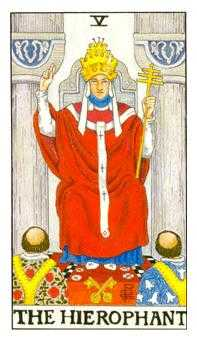

# Lucrare numerologica - Birsan Daniel Robert - v1.06r

## Date generale

- Persoana analizata: Birsan Daniel Robert
- Data nasterii: 19.02.1998
- Nume familie: Birsan
- Prenume: Daniel Robert
- Prenume activ folosit in calcul: Daniel
- Gen: masculin
- Nume anterioare: niciunul
- Template: examen
- Stil de redactare: conversational
- Nivel de detaliere: amplu
- Interval analizat: complet, 0-108 ani (1998-2106)
- Data lucrarii: 2026-07-16

### Intrebarile persoanei

- Iubire: Care sunt lectiile si directiile importante in viata sentimentala?
- Cariera: Care sunt directiile profesionale potrivite si cum isi poate valorifica potentialul?

### Relatii

- Persoana analizata in relatie: Roman Andreea Maria
- Prenume activ persoana analizata in relatie: Andreea
- Data nasterii persoana analizata in relatie: 12.01.1998
- Gen persoana analizata in relatie: feminin
- Tip relatie analizata: partenera de cuplu

## Cuprins

1. [Vibratiile fundamentale](#capitolul-1-vibratiile-fundamentale)
2. [Calea destinului, destinul si puntile](#capitolul-2-calea-destinului-destinul-si-puntile)
3. [Aspecte de indreptat](#capitolul-3-aspecte-de-indreptat)
4. [Structura matriciala](#capitolul-4-structura-matriciala)
5. [Codul numerologic personal al numelui](#capitolul-5-codul-numerologic-personal-al-numelui)
6. [Ciclicitatile](#capitolul-6-ciclicitatile)
7. [Relatii](#capitolul-7-relatii)
8. [Spirit](#capitolul-8-spirit)
9. [Ajutoare](#capitolul-9-ajutoare)
10. [Raspunsuri la intrebarile persoanei](#raspunsuri-la-intrebarile-persoanei)

## Capitolul 1. Vibratiile fundamentale

### 1.1. Vibratia interioara

Daniel, in tine exista un impuls care se trezeste inainte ca ceilalti sa vada ceva la exterior. Este motivatia ta de baza, felul in care alegi atunci cand nu trebuie sa demonstrezi nimic nimanui. Seamana cu o scanteie discreta: nu se vede mereu, dar de aici pornesc curajul, reactiile si directia ta adevarata.

Aceasta parte a ta raspunde la intrebari simple, dar importante: ce te pune in miscare, ce iti da curaj, ce te irita si ce simti ca trebuie sa alegi singur? Inainte de destin, relatii sau rezultate, exista acest prim impuls care iti da pornirea.

Pentru vibratia interioara reducem ziua ta de nastere la o singura cifra.

**Calcul:** 1 + 9 = 10 -> 1 + 0 = 1

Rezultatul este 1. Arhetipurile acestei vibratii sunt initiatorul, deschizatorul de drum, liderul, pionierul, omul care spune "incep eu". In forma buna, 1-ul nu asteapta sa fie impins de la spate; el porneste, decide, testeaza si isi asuma.

La tine, Daniel, asta inseamna ca in interior exista o nevoie puternica de autonomie. Ai nevoie sa simti ca alegerea iti apartine. Cand energia 1 este folosita matur, te ajuta sa incepi proiecte, sa te ridici repede dupa blocaje si sa iti spui clar punctul de vedere. Cand este tensionata, poate deveni graba, incapatanare, reactie defensiva sau senzatia ca trebuie sa faci totul singur.

Mesajul acestei energii este simplu: nu astepta mereu permisiunea de a porni, dar invata sa conduci lucrurile fara sa fortezi oamenii sau imprejurarile.

### 1.2. Vibratia exterioara

Felul in care esti perceput la primul contact poate fi mai bland decat forta pe care o simti in interior. Este partea din tine care iese in lume si se face vazuta in conversatii, in grupuri si in situatii noi.

Prima impresie nu spune tot ce esti, dar le ofera celorlalti o poarta catre tine. La fel ca coperta unei carti, ea nu contine intreaga poveste, insa poate transmite calm, apropiere si disponibilitate pentru dialog.

Pentru vibratia exterioara folosim luna nasterii. Luna 2 este deja redusa la o singura cifra.

**Calcul:** 2 = 2

Rezultatul este 2. Arhetipurile vibratiei 2 sunt mediatorul, partenerul, diplomatul, ascultatorul, omul care simte atmosfera din camera. Daca 1-ul spune "eu pornesc", 2-ul spune "hai sa simtim ritmul potrivit".

In exterior, Daniel, oamenii pot vedea la tine o parte mai sensibila, diplomata si atenta la nuante. Chiar daca in interior ai motor de 1, in afara poti parea mai calm, mai atent, mai dispus sa asculti sau sa negociezi. Aici apare o combinatie interesanta: inauntru exista initiativa, iar in afara apare filtrul relational.

Sensibilitatea lui 2 te ajuta sa simti oamenii, sa surprinzi tensiunile subtile si sa observi cand o situatie are nevoie de mai multa rabdare. Ai grija doar ca diplomatia sa nu se transforme in amanare si sa nu iti ascunzi decizia de teama ca ai putea deranja.

### 1.3. Vibratia globala

Cand vointa ta interioara se intalneste cu sensibilitatea pe care o arati lumii, se contureaza felul tau firesc de a merge prin viata. Initiativa si atentia fata de ceilalti nu sunt doua parti separate, ci doua forte care pot invata sa lucreze impreuna.

Din aceasta intalnire se naste tonul general al personalitatii tale. Cand ceea ce simti si ceea ce arati se sustin reciproc, oamenii te inteleg mai usor, iar tu iti poti exprima mai limpede intentiile.

Pentru vibratia globala adunam vibratia interioara cu vibratia exterioara.

**Calcul:** 1 + 2 = 3

Rezultatul este 3. Arhetipurile vibratiei 3 sunt comunicatorul, povestitorul, creatorul, artistul, omul care pune trairea in cuvinte, forma sau gest. Daca 1 porneste si 2 simte, 3 exprima.

La tine, Daniel, echilibrul se construieste prin exprimare. Nu iti ajunge doar sa vrei ceva sau sa simti atmosfera; ai nevoie sa formulezi, sa spui, sa explici si sa creezi o punte prin cuvant sau printr-o actiune vizibila.

Cand nu comunici, energia se poate strange si ceilalti pot intelege gresit ce se intampla in tine. Cand exprimi constient, 3-ul devine un canal foarte bun: te ajuta sa clarifici, sa destinzi tensiuni, sa transmiti idei si sa faci oamenii sa inteleaga mai usor ce vrei.

### 1.4. Vibratia cosmica variabila

Anul in care te-ai nascut adauga povestii tale o nevoie puternica de a construi ceva concret. Aceasta influenta se simte in felul in care te raportezi la timp, rezultate, maturizare si responsabilitate.

Ea nu schimba cine esti, dar coloreaza drumul pe care mergi. Uneori iti cere ritm si fermitate, alteori prudenta, rabdare si o administrare mai atenta a resurselor tale.

Pentru vibratia cosmica variabila folosim ultimele doua cifre ale anului tau de nastere.

**Calcul:** 9 + 8 = 17 -> 1 + 7 = 8

Rezultatul este 8. Vibratia 8 sustine administrarea, strategia, constructia de rezultate si asumarea unei autoritati mature. Ea nu se multumeste doar cu intentii frumoase; intreaba ce faci concret, ce organizezi si ce ramane in urma ta.

Energia lui 8 aduce, Daniel, o chemare spre organizare, rezultate si o raportare matura la responsabilitate. Te poate ajuta sa gestionezi bani, timp, proiecte, limite si decizii importante. Ea iti cere coloana vertebrala si te invata ca promisiunile capata greutate atunci cand sunt sustinute prin fapte.

In forma tensionata, 8-ul poate aduce presiune, control, frica de esec sau raportare prea dura la reusita. De aceea, pentru tine, lectia nu este doar sa obtii rezultate, ci sa inveti sa le construiesti fara sa te rigidizezi.

### 1.5. Vibratia cosmica totala

Privit in intregime, anul nasterii descrie atmosfera mai larga in care ai venit pe lume. Este un fundal simbolic care insoteste drumul tau si te indeamna sa cauti sensul mai profund al experientelor prin care treci.

Imagineaza-ti aceasta influenta ca pe lumina unei scene: nu hotaraste in locul tau ce rol vei juca, dar da o anumita atmosfera intregii povesti si scoate la vedere lectiile care cer sa fie intelese.

Pentru vibratia cosmica totala adunam toate cifrele anului complet.

**Calcul:** 1 + 9 + 9 + 8 = 27 -> 2 + 7 = 9

Rezultatul este 9. Vibratia 9 aduce perspectiva larga, orientare spre sens, capacitate de ghidare si sensibilitate fata de oameni. Ea strange multe lectii si incearca sa vada imaginea de ansamblu.

Fundalul anului iti aduce vibratia 9, Daniel. Ea te impinge sa privesti mai larg, sa intelegi sensul experientelor si sa nu ramai blocat in detalii marunte. Poti avea o tendinta naturala de a cauta explicatii, de a lega lucrurile intre ele si de a simti ca viata trebuie sa aiba o directie mai profunda decat simpla rutina.

Traita echilibrat, energia lui 9 iti da perspectiva, intuitie si capacitatea de a invata din experiente. Atunci cand devine apasatoare, poate aduce oboseala, idealism excesiv sau tendinta de a duce prea mult pentru altii. Cheia este discernamantul: sa ajuti fara sa te pierzi si sa cauti sensul fara sa fugi de concret.

## Capitolul 2. Calea destinului, destinul si puntile

Calea destinului, destinul si puntile formeaza impreuna harta drumului tau de baza. Vibratiile fundamentale descriu pornirea interioara, manifestarea exterioara si energia globala, iar traseul arata incotro se indreapta energia, prin ce experiente se maturizeaza si ce legaturi trebuie facute intre partile tale.

Imagineaza-ti ca viata este un drum lung. Calea destinului este traseul complet de pe harta, cu toate curbele, intersectiile si zonele prin care treci. Destinul este directia principala in care drumul te conduce. Puntile sunt podurile dintre felul in care simti, felul in care te arati si felul in care ajungi sa te implinesti. Cand puntile sunt constiente, nu mai simti ca o parte din tine trage intr-o directie si alta parte in alta directie.

### 2.1. Calea destinului

Calea destinului este suma tuturor cifrelor din data de nastere inainte de reducerea finala. Ea pastreaza nuantele drumului, nu doar rezultatul redus. Daca destinul final este titlul capitolului, calea destinului este povestea din spatele titlului: cum se formeaza directia, din ce materiale este construita si ce ton are parcursul.

Calea destinului poate fi privita ca traseul complet de pe harta. Ea descrie felul in care inveti din drum si intelegi ca directia nu se formeaza dintr-un singur pas, ci din toate experientele adunate.

Pentru calea destinului adunam toate cifrele din data ta de nastere si pastram suma completa.

**Calcul:** 1 + 9 + 0 + 2 + 1 + 9 + 9 + 8 = 39

Calea ta este 39. In aceasta combinatie lucreaza impreuna doua energii: 3-ul aduce exprimare, comunicare, creativitate si nevoie de miscare vie, iar 9-ul aduce intelegere larga, sensibilitate fata de oameni, finalizare si capacitatea de a vedea imaginea de ansamblu. Ca imagine, 39 descrie comunicatorul matur care transforma experienta traita in sens pentru ceilalti.

Calea 39 iti arata un drum in care exprimarea, oamenii si sensul se combina. Daniel, nu este suficient doar sa stii sau sa simti; ai nevoie sa transmiti mai departe, sa formulezi, sa pui in cuvinte, in idei sau in actiuni ceea ce ai inteles. In viata de zi cu zi, asta se poate vedea cand explici cuiva o situatie complicata pe intelesul lui, cand transformi o experienta grea intr-o lectie utila sau cand simti ca o idee nu este completa pana nu o spui, o scrii, o construiesti sau o impartasesti.

Partea frumoasa a lui 39 este ca poate da voce unei experiente. Partea care cere atentie este riscul de a simti prea multe, de a strange prea mult in interior sau de a amana exprimarea pana cand devine tensiune. Pentru tine, cheia este sa lasi comunicarea sa fie un instrument de eliberare si clarificare, nu doar o reactie dupa ce presiunea s-a acumulat.

### 2.2. Destinul

Destinul arata directia finala de realizare, cifra catre care se reduce calea. Daca 39 este traseul complet, 3 este semnul mare de pe drum: directia prin comunicare, expresie, creativitate, relatie vie cu oamenii si capacitatea de a aduce lumina intr-o situatie prin cuvant, idee, umor, inspiratie sau prezenta.

Destinul poate fi privit ca semnul principal de orientare. El reuneste chemarea, directia, tinta interioara si intrebarea: "prin ce devin eu mai implinit si mai util in lume?"

Pentru destin reducem calea destinului pana ajungem la vibratia de baza.

**Calcul:** 3 + 9 = 12 -> 1 + 2 = 3

Rezultatul este 3. Destinul 3 sustine comunicarea, creativitatea, construirea unei atmosfere si legarea oamenilor prin idei si expresie. Nu inseamna neaparat scena, spectacol sau arta in sens clasic. Poate insemna si sa explici bine, sa vinzi o idee, sa creezi continut, sa coordonezi o discutie, sa aduci claritate intr-o echipa sau sa gasesti formula potrivita atunci cand ceilalti nu stiu cum sa spuna ce simt.

Directia ta de realizare merge prin 3, Daniel: comunicare, exprimare, creativitate si contact viu cu oamenii. Cand iti asumi vocea, ideile si felul tau de a transmite, destinul se misca mai natural. In termeni simpli, viata iti cere sa nu ramai doar in observatie sau analiza, ci sa dai forma lucrurilor: sa formulezi, sa creezi, sa explici, sa pui oamenii in miscare printr-o idee sau printr-o stare.

In varianta echilibrata, 3-ul tau devine bucurie, inteligenta expresiva, flexibilitate si capacitatea de a face lucrurile mai usor de inteles. In varianta tensionata, poate deveni risipire, gluma folosita ca aparare, multe inceputuri fara finalizare sau tendinta de a evita subiectele grele prin schimbarea tonului. De aceea, destinul 3 nu inseamna doar sa vorbesti mai mult, ci sa vorbesti mai clar, mai asumat si mai conectat la ceea ce vrei sa construiesti.

### 2.3. Puntea interior - exterior

Comparatia dintre trairea interioara si manifestarea exterioara arata unde curge usor energia si unde ai nevoie sa te traduci mai constient pentru ceilalti.

Imagineaza-ti aceasta punte ca legatura dintre camera interioara si usa prin care iesi in lume. Ea traduce si transmite in exterior ceea ce simti in interior, fara sa pierzi nici adevarul personal, nici tactul relational.

Pentru puntea interior-exterior calculam diferenta dintre vibratia interioara si vibratia exterioara.

**Calcul:** |1 - 2| = 1

La tine, interiorul vine prin 1, iar exteriorul prin 2: inauntru exista initiativa, autonomie si impuls de decizie, iar in afara se vede mai mult sensibilitatea, diplomatia si atentia la reactie. Imagineaza-ti ca in interior ai un conducator care vrea sa porneasca repede, iar la exterior ai un diplomat care vrea sa simta mai intai terenul. Ambele parti sunt utile. Problema apare doar cand conducatorul se enerveaza ca diplomatul asteapta prea mult sau cand diplomatul ascunde decizia ca sa nu creeze tensiune.

Puntea 1 iti spune ca intre interior si exterior cheia este asumarea. Daniel, cand esti clar cu decizia ta, oamenii te inteleg mai usor. Cand eziti sau astepti prea multe confirmari, apare tensiune intre ce vrei si ce arati. In viata de zi cu zi, asta poate arata asa: stii ce vrei, dar formulezi prea bland; simti ca trebuie sa spui nu, dar amani; ai o directie, dar o prezinti ca intrebare ca sa nu deranjezi.

Forma matura a puntii 1 inseamna sa ramai atent la ceilalti fara sa-ti pierzi directia. Exercitiul tau este sa spui mai repede si mai simplu ce alegi. Nu brutal, nu rigid, ci limpede. Cand puntea aceasta functioneaza, 1-ul interior nu mai pare presiune, iar 2-ul exterior nu mai pare ezitare; impreuna devin fermitate cu tact.

### 2.4. Puntea interior - destin

Acest punct arata distanta dintre motivatia profunda si directia de destin. Puntea interior-destin vorbeste despre felul in care motorul personal ajunge sa serveasca directia mare a vietii.

Ca analogie, aceasta punte este drumul dintre scanteie si forma finala. Ea ia impulsul brut, il mediaza interior si il aseaza intr-o directie mai clara, mai utila si mai usor de trait.

Pentru puntea interior-destin calculam diferenta dintre vibratia interioara si destin.

**Calcul:** |1 - 3| = 2

La tine vedem trecerea de la 1, adica dorinta de autonomie si initiativa, catre 3, adica destinul comunicarii si al exprimarii. Diferenta dintre ele este 2, iar asta spune ca drumul tau nu se deschide doar prin vointa, ci prin relatie, ritm, rabdare si colaborare.

Cu alte cuvinte, interiorul tau poate spune "vreau sa fac", destinul tau spune "exprima, creeaza, transmite", iar puntea 2 intreaba "cu cine, in ce ton, in ce ritm si cu cata ascultare?". Este o punte foarte importanta pentru ca te invata ca vocea ta devine mai puternica atunci cand nu trece peste oameni, ci ii include.

Intre motivatia ta profunda si destin apare vibratia 2. Asta iti spune, Daniel, ca drumul tau nu se implineste doar prin forta personala, ci si prin rabdare, cooperare, ascultare si relatii construite cu finete. In exemple concrete, 2-ul se vede cand alegi sa asculti inainte sa raspunzi, cand construiesti un parteneriat in loc sa duci totul singur, cand adaptezi mesajul la omul din fata ta sau cand transformi o discutie tensionata intr-o punte reala.

Forma matura a acestei punti combina initiativa cu medierea creativa si intelege ca mesajul ajunge mai bine cand este asezat in relatie. Pentru tine, Daniel, asta inseamna ca succesul nu vine doar din a avea ideea buna, ci din felul in care o transmiti, o negociezi, o faci inteleasa si o asezi intr-un context in care ceilalti pot raspunde.

## Capitolul 3. Aspecte de indreptat

Aspectele de indreptat nu sunt defecte si nu trebuie citite ca etichete grele. Ele arata mai degraba locul in care energia ta poate fi educata, rafinata si folosita mai constient. Daca destinul arata drumul, aspectele de indreptat arata pietrele de pe drum: nu ca sa te opresti in ele, ci ca sa inveti cum le treci mai matur.

La tine, Daniel, aceasta rubrica este importanta pentru ca lucreaza cu diferenta dintre potentialul drumului si primul impuls al zilei de nastere. Cu alte cuvinte, ne uitam la felul in care initiativa ta interioara poate deveni uneori prea rapida, prea defensiva sau prea orientata spre control, iar apoi vedem cum poate fi transformata in directie limpede.

### 3.1. Aspecte de indreptat

Exista in tine o zona care poate fi rafinata cu rabdare. Nu vorbim despre vina sau defect, Daniel, ci despre un tipar care are nevoie de mai multa constienta. Imagineaza-ti aceasta parte ca pe un muschi: folosita impulsiv poate crea tensiune, dar antrenata cu rabdare devine forta, stabilitate si precizie.

Rezultatul acestei rubrici este 37. In el avem 3-ul, care tine de comunicare, expresie, spontaneitate si felul in care dai forma unei idei, si 7-ul, care tine de analiza, profunzime, observatie, introspectie si cautarea unui sens mai adanc. Ca imagine, 37 descrie cercetatorul care invata sa vorbeasca limpede sau comunicatorul care nu se multumeste cu suprafata lucrurilor.

Pentru aspectele de indreptat pornim de la calea destinului si scadem de doua ori prima cifra din ziua nasterii.

**Calcul:** 39 - 2 x 1 = 37

Rezultatul 37 iti arata o tema care se intelege prin experienta, nu doar prin teorie. Pentru tine, observarea reactiilor proprii este foarte importanta: cand te grabesti, cand te aperi, cand vrei sa controlezi si cand poti alege altfel. In viata de zi cu zi, 37 se poate vedea cand simti ceva rapid, dar ai nevoie sa intelegi de ce ai reactionat asa; cand spui o idee, dar apoi iti dai seama ca in spate era o emotie nespusa; sau cand preferi sa rezolvi singur o situatie, desi o discutie clara ar fi simplificat lucrurile.

Partea buna a lui 37 este ca iti poate da minte fina, intuitie, capacitate de analiza si forta de a transforma experienta in intelegere. Partea de lucrat este sa nu te inchizi in capul tau, sa nu supraanalizezi pana se pierde spontaneitatea si sa nu folosesti distanta ca forma de aparare. Aici lectia este sa ramai prezent: sa observi, dar si sa comunici; sa intelegi, dar si sa actionezi; sa ai profunzime, dar fara sa te rupi de oameni.

### 3.2. Solutia aspectelor de indreptat

Solutia arata cheia simplificata a aspectului de indreptat. Daca aspectul arata tensiunea, solutia arata directia de echilibrare. In cazul tau, 37 se reduce la 1, ceea ce inseamna ca iesirea din blocaj vine prin asumare, decizie, initiativa si claritate personala.

Este ca si cum 37 iti pune intrebarea "intelegi ce se intampla in tine?", iar 1 iti spune "bine, acum alege si mergi intr-o directie". Solutia nu este sa fortezi lucrurile, ci sa nu ramai blocat in analiza. Cand simti ca ai intors o problema pe toate partile, 1-ul te cheama sa faci pasul urmator: sa spui ce vrei, sa incepi, sa trasezi o limita sau sa iei o decizie.

Pentru solutie reducem rezultatul obtinut la o singura cifra.

**Calcul:** 3 + 7 = 10 -> 1 + 0 = 1

Solutia vine prin 1: Daniel, ai nevoie sa iti asumi decizia si sa nu astepti mereu ca exteriorul sa confirme ce simti deja. Cand alegi limpede, energia se strange si devine directie. Practic, asta poate insemna sa formulezi mai repede o intentie, sa spui "asta aleg", sa incepi un proiect inainte sa ai toate garantiile sau sa iti sustii punctul de vedere fara sa il transformi intr-o lupta.

Forma matura a solutiei 1 activeaza conducerea interioara si capacitatea de a lua initiativa fara rigiditate. Cand aceasta solutie este folosita matur, 37 nu mai ramane o spirala de ganduri, ci devine intelegere aplicata. Analizezi, intelegi, apoi alegi. Asta este cheia: nu doar profunzime, ci profunzime care se transforma in actiune.

## Capitolul 4. Structura matriciala

### 4.1. Matricea datei de nastere

Matricea este una dintre cele mai utile harti de orientare din lucrare, Daniel. Ea nu te defineste rigid, ci iti arata unde ai energii care pornesc firesc, unde apar repetitii puternice si ce zone merita cultivate cu mai multa rabdare.

Pentru matrice pornim de la data de nastere si construim, pe rand, N1, N2, N3 si N4. La final, data compacta impreuna cu aceste patru valori formeaza sirul complet, adica numarul logic al persoanei.

**Calcul:** Data nasterii 19.02.1998 -> data compacta 19021998 -> N1 = 1 + 9 + 0 + 2 + 1 + 9 + 9 + 8 = 39 -> N2 = 3 + 9 = 12 -> 1 + 2 = 3 -> N3 = 39 - (2 x 1) = 37 -> N4 = 3 + 7 = 10 -> 1 + 0 = 1 -> sir complet / numar logic = 19021998 + 39 + 3 + 37 + 1 = 19021998393371

```text
1: 111  / optim 111 / triunghi | 4: - / optim 44 / absent | 7: 7    / optim 7 / cerc
2: 2    / optim 222 / cerc     | 5: - / optim 55 / absent | 8: 8    / optim 8 / cerc
3: 333  / optim 333 / triunghi | 6: - / optim 66 / absent | 9: 9999 / optim 9 / patrat
```


Casutele pline arata resurse la care ai acces mai usor. Casutele goale nu sunt defecte si nu spun ca iti lipseste ceva esential; ele indica locuri in care invatarea devine mai constienta, prin experienta, relatie, disciplina si alegeri repetate.

### 4.2. Casutele matricei

| Casuta | Cifre | Valoare | Descriere | Calcul si interpretare |
| --- | --- | ---: | --- | --- |
| 1 | 111 | 3 | identitatea, vointa, caracterul si modul in care persoana isi afirma prezenta | Casuta este prezenta. Vibratia 1, asociata cu autonomie, vointa, curajul inceputului si nevoia de a lua decizii proprii. Cantitatea 3 arata cat de accesibila este aceasta energie. |
| 2 | 2 | 2 | energia emotionala, empatia, sensibilitatea relationala si vitalitatea subtila | Casuta este prezenta. Vibratia 2, asociata cu sensibilitate, cooperare, diplomatie, rabdare si capacitatea de a crea echilibru intre oameni. Cantitatea 1 arata cat de accesibila este aceasta energie. |
| 3 | 333 | 9 | expresia, comunicarea, talentul, bucuria si felul in care iti pui trairile in forma | Casuta este prezenta. Vibratia 3, asociata cu comunicare, creativitate, bucurie, spontaneitate si talentul de a da forma trairilor prin cuvant sau gest. Cantitatea 3 arata cat de accesibila este aceasta energie. |
| 4 | - | 0 | corpul, disciplina, sanatatea practica, ordinea si stabilitatea concreta | Casuta este absenta. Vibratia 4, asociata cu ordine, stabilitate, disciplina, responsabilitate si capacitatea de a construi pas cu pas. Cantitatea 0 arata cat de accesibila este aceasta energie. |
| 5 | - | 0 | centrul, curajul, libertatea, intuitia practica si capacitatea de adaptare | Casuta este absenta. Vibratia 5, asociata cu miscare, schimbare, curaj, adaptare si nevoia de experienta directa. Cantitatea 0 arata cat de accesibila este aceasta energie. |
| 6 | - | 0 | munca, familia, responsabilitatea, grija si felul in care te implici afectiv | Casuta este absenta. Vibratia 6, asociata cu iubire, grija, familie, responsabilitate afectiva, estetica si dorinta de echilibru. Cantitatea 0 arata cat de accesibila este aceasta energie. |
| 7 | 7 | 7 | spiritualitatea, intuitia, protectia, analiza si legatura cu lumea interioara | Casuta este prezenta. Vibratia 7, asociata cu introspectie, analiza, intuitie, spiritualitate si cautarea unui sens mai adanc. Cantitatea 1 arata cat de accesibila este aceasta energie. |
| 8 | 8 | 8 | socialul, dreptatea, organizarea, puterea si relatia cu resursele | Casuta este prezenta. Vibratia 8, asociata cu organizare, dreptate, rezultate, administrarea resurselor si raportarea matura la autoritate. Cantitatea 1 arata cat de accesibila este aceasta energie. |
| 9 | 9999 | 36 | intelectul, memoria, intelepciunea, sinteza si capacitatea de a intelege experientele | Casuta este prezenta. Vibratia 9, asociata cu intelepciune, compasiune, finalizare, idealuri si capacitatea de a privi imaginea de ansamblu. Cantitatea 4 arata cat de accesibila este aceasta energie. |

### 4.3. Pare si impare

Cifrele pare sunt asociate cu receptivitatea, relatia si constructia prin cooperare. Cifrele impare sunt asociate cu initiativa, expresia si miscarea directa.

Total cifre pare = 2; total cifre impare = 11.

Raportul dintre pare si impare iti arata felul in care alternezi intre a primi, a observa si a actiona. Daca balanta inclina mai mult intr-o directie, nu este o problema de corectat cu forta, ci un indiciu bland: acolo merita sa aduci mai multa prezenta si alegere constienta.

### 4.4. Vectorii matricei

| Vector | Denumire | Cifre | Valoare | Interpretare |
| --- | --- | --- | ---: | --- |
| 123 | Energie | 1112333 | 14 | Vector plin. Energia de pornire exista si poate fi folosita coerent: identitatea 1, sensibilitatea 2 si exprimarea 3 se leaga intre ele. Daniel poate porni lucruri, poate simti contextul si poate comunica impulsul initial, cu conditia sa nu arda energia prea repede. |
| 456 | Vointa | - | 0 | Vector complet lipsa. Aici lipsesc 4, 5 si 6: corpul, regulile, centrul, curajul practic, munca si responsabilitatea afectiva. Interpretarea nu este lipsa de vointa, ci nevoie de antrenament constient: program, disciplina, rutina corporala, limite si asumarea lucrurilor facute pas cu pas. |
| 789 | Creativitate | 789999 | 51 | Vector plin si cel mai puternic vector al matricei. 7 aduce analiza si intuitie, 8 organizare si raportare la rezultat, iar 9 viziune ampla si memorie. Aici apare fixatia: mintea, sensul si imaginea de ansamblu pot domina restul hartii. |
| 147 | Spiritualitate | 1117 | 10 | Vector incomplet prin lipsa lui 4. Identitatea 1 si intuitia 7 exista, dar corpul, stabilitatea, regulile si disciplina concreta trebuie cultivate. Spiritualitatea devine mai utila cand este asezata in practici simple, repetabile, nu doar in intelegeri interioare. |
| 258 | Social | 28 | 10 | Vector incomplet prin lipsa lui 5. Sensibilitatea 2 si organizarea 8 exista, dar centrul personal, curajul de adaptare si libertatea asumata trebuie intarite. In relatii, Daniel poate simti si poate administra situatii, dar are nevoie sa ramana prezent in propriul centru. |
| 369 | Bunastare materiala | 3339999 | 45 | Vector incomplet prin lipsa lui 6. Comunicarea 3 si viziunea 9 sunt foarte puternice, deci ideile pot produce valoare, dar lipsa lui 6 cere responsabilitate practica, continuitate, grija fata de munca si finalizare. Bunastarea creste cand inspiratia este legata de serviciu concret. |
| 159 | Cariera | 1119999 | 39 | Vector incomplet prin lipsa lui 5. Identitatea 1 si viziunea 9 dau directie, ambitie si imagine mare, dar centrul 5 cere curaj de adaptare, flexibilitate si contact cu experienta directa. Cariera se aseaza mai bine cand Daniel nu ramane doar in idee, ci testeaza, ajusteaza si se expune. |
| 357 | Scopuri | 3337 | 16 | Vector incomplet prin lipsa lui 5. Exprimarea 3 si intuitia 7 pot da scopuri inspirate, dar fara 5 poate lipsi centrul de decizie care transforma chemarea in miscare. Scopurile au nevoie de curaj practic, experiment si asumarea drumului chiar inainte ca totul sa fie perfect clar. |

### 4.5. Tendinte, fixatie si caii-trasura-vizitiul

Aceasta lectura strange dinamica matricei: dominantele, lipsurile si felul in care energia se misca prin vectorii de baza.

Comparatia cu optimul adauga reperul de echilibru. Matricea optima folosita ca baza este `111 | 44 | 7`, `222 | 55 | 8`, `333 | 66 | 9`, cu total general 72. Matricea ta are total general 65, deci nu lipseste forta, ci lipseste mai ales zona care face energia sa curga prin corp, centru si responsabilitate practica.

| Casuta | Cantitate<br>personala | Valoare<br>personala | Cantitate<br>optima | Valoare<br>optima | Diferenta | Citire |
| --- | ---: | ---: | ---: | ---: | ---: | --- |
| 1 | 3 | 3 | 3 | 3 | 0 | Identitatea si initiativa sunt la optim: poti porni, decide si ocupa un loc propriu. |
| 2 | 1 | 2 | 3 | 6 | -4 | Sensibilitatea exista, dar are nevoie de exercitiu relational, rabdare si ascultare constienta. |
| 3 | 3 | 9 | 3 | 9 | 0 | Exprimarea este la optim: comunicarea, creativitatea si adaptarea pot curge firesc. |
| 4 | 0 | 0 | 2 | 8 | -8 | Lipseste baza practica: corp, ordine, program, disciplina si stabilitate. |
| 5 | 0 | 0 | 2 | 10 | -10 | Lipseste centrul de reglaj: curaj practic, libertate asumata, prezenta in experienta directa. |
| 6 | 0 | 0 | 2 | 12 | -12 | Lipseste sustinerea afectiv-practica: responsabilitate, grija, continuitate si finalizare. |
| 7 | 1 | 7 | 1 | 7 | 0 | Intuitia si analiza sunt la optim: exista acces natural la observatie si sens interior. |
| 8 | 1 | 8 | 1 | 8 | 0 | Organizarea si raportul cu rezultatul sunt la optim: poti administra resurse cand ai cadru. |
| 9 | 4 | 36 | 1 | 9 | +27 | Zona de viziune, memorie si sens este mult peste optim; poate deveni talent major, dar si suprasolicitare mentala. |

Pe linii, prima linie `1-4-7` are 10 fata de optimul 18, a doua linie `2-5-8` are 10 fata de optimul 24, iar a treia linie `3-6-9` are 45 fata de optimul 30. Asta arata ca energia se strange puternic in zona de exprimare, rezultat si sens, dar are nevoie de 4, 5 si 6 ca sa nu ramana doar in minte, inspiratie sau analiza.

Pe coloane, coloana `1-2-3` are 14 fata de optimul 18, coloana `4-5-6` are 0 fata de optimul 30, iar coloana `7-8-9` are 51 fata de optimul 24. Aici se vede cel mai clar lectia curgerii energiei: pornirea exista, vizitiul mental-spiritual este foarte puternic, dar trasura practica lipseste. Ca energia sa curga, Daniel are nevoie sa alimenteze constient coloana 4-5-6 prin rutina, corp, limite, exercitiu, responsabilitate si finalizare concreta.

Casuta dominanta este 9, cu valoarea 36. Casutele lipsa sunt 4, 5 si 6, adica zona de corp, stabilitate, centru, curaj practic, munca si responsabilitate afectiva. Aceste lipsuri nu anuleaza potentialul, dar arata unde energia trebuie educata prin obiceiuri, limite si actiuni repetate.

Fixatia este vectorul plin cu valoarea cea mai mare. In cazul tau, Daniel, fixatia este pe vectorul 789, Creativitate, cu valoarea 51. Este importanta pentru ca arata zona in care energia se duce aproape natural: intuitie, analiza, organizare, memorie, viziune si intelegerea imaginii mari. Partea buna este ca poti vedea rapid sensul unei situatii. Partea de lucrat este sa nu ramai blocat doar in minte, observatie sau concluzii, ci sa cobori intelegerea in corp, program, munca si decizii concrete.

In analogia cai, trasura si vizitiu, caii sunt vectorul 123 si arata forta de pornire. La tine, caii au valoarea 14 si sunt plini: exista combustibil, initiativa, sensibilitate si exprimare. Trasura este vectorul 456 si arata suportul practic, corpul vehiculului, disciplina si capacitatea de a duce greutatea drumului. Aici valoarea este 0, pentru ca lipsesc 4, 5 si 6; de aceea, energia de pornire are nevoie de structura, rutina si responsabilitate ca sa nu ramana doar impuls. Vizitiul este vectorul 789 si arata directia mentala si spirituala. Cu valoarea 51, vizitiul este foarte puternic: mintea vede departe, dar trebuie sa conduca bland caii si sa nu uite ca trasura are nevoie de intretinere.

Scara bunastarii pune in ordine descrescatoare valorile vectorilor si ale casutelor. Ea arata unde exista acumulare mare de energie si unde apar trepte slabe sau absente. In lectura ta, varful este vectorul 789, urmat de 369 si 159, deci mintea, viziunea, exprimarea si orientarea spre rezultat sunt foarte active. La baza apar 456 si casutele 4, 5 si 6 cu valoare 0, ceea ce confirma aceeasi lectie: bunastarea creste cand energia mentala si creativa este sprijinita de corp, disciplina, centru si responsabilitate concreta.

| Treapta | Tip | Valoare |
| --- | --- | ---: |
| Vector 789 - Creativitate | Vector | 51 |
| Vector 369 - Bunastare materiala | Vector | 45 |
| Vector 159 - Cariera | Vector | 39 |
| Casuta 9 - Foc | Casuta | 36 |
| Vector 357 - Scopuri | Vector | 16 |
| Vector 123 - Energie | Vector | 14 |
| Vector 147 - Spiritualitate | Vector | 10 |
| Vector 258 - Social | Vector | 10 |
| Casuta 3 - Aer | Casuta | 9 |
| Casuta 8 - Pamant | Casuta | 8 |
| Casuta 7 - Aer | Casuta | 7 |
| Casuta 1 - Foc | Casuta | 3 |
| Casuta 2 - Apa | Casuta | 2 |
| Vector 456 - Vointa | Vector | 0 |
| Casuta 4 - Pamant | Casuta | 0 |
| Casuta 5 - Foc | Casuta | 0 |
| Casuta 6 - Apa | Casuta | 0 |

## Capitolul 5. Codul numerologic personal al numelui

### 5.1. Numarul de exprimare

Numarul de exprimare arata cum se aude si se vede numele tau complet in lume. El descrie stilul prin care iti poti exprima potentialul, cum iti pui calitatile in forma si ce fel de impresie energetica lasa numele tau complet. Este ca o semnatura ampla: nu spune doar cine esti in interior, ci cum poti functiona cand iti folosesti intregul nume ca resursa.

Numarul de exprimare descrie rolul social, imaginea personala si felul in care potentialul devine vizibil. El raspunde la intrebari precum: cum ma exprim cand sunt intreg, ce ton are prezenta mea si ce fel de contributie pot aduce prin felul meu de a fi?

Pentru numarul de exprimare adunam valorile numelui complet si reducem rezultatul final.

**Calcul:** Birsan 27 + Daniel 27 + Robert 33 = 87 -> 8 + 7 = 15 -> 1 + 5 = 6

Rezultatul este 6. Vibratia 6 sustine protectia, armonizarea, repararea, educarea si atentia pentru ceea ce trebuie asezat mai frumos, mai cald sau mai responsabil. Prin numarul de exprimare 6, Daniel, numele tau cere caldura, responsabilitate si echilibru. Tu te poti exprima bine cand aduci oamenilor siguranta, frumusete, grija sau sentimentul ca lucrurile sunt asezate.

In viata de zi cu zi, 6-ul se poate vedea atunci cand vrei ca lucrurile sa fie corecte pentru toata lumea, cand iti pasa de atmosfera dintr-un loc, cand simti nevoia sa repari o relatie sau cand preiei spontan rolul celui care organizeaza, ajuta sau tine lucrurile impreuna. Dar aici exista si o atentie importanta: umbra apare cand iei prea mult asupra ta, cand vrei sa salvezi oameni care nu cer asta sau cand confunzi responsabilitatea cu obligatia de a duce totul singur.

Pentru tine, cheia lui 6 este sa oferi fara sa te pierzi. Numele tau poate transmite incredere, seriozitate si disponibilitate, dar are nevoie si de limite clare. Cand 6-ul este matur, el nu devine povara; devine prezenta calda, structurata si demna de incredere.

### 5.2. Numarul intim

Numarul intim se calculeaza din vocale si vorbeste despre dorinte profunde, motivatie afectiva si nevoia interioara. Daca numarul de exprimare este felul in care se aude numele tau in lume, numarul intim este vocea mai tacuta din spate: ce cauti cu adevarat, ce te misca afectiv si ce are nevoie sufletul tau ca sa simta sens.

Ca analogie, vocalele sunt respiratia numelui. Ele nu sunt mereu cele mai vizibile, dar dau emotie, curgere si vibratie interioara. Numarul intim descrie cautarea launtrica, idealurile si nevoia de a trece dincolo de forma exterioara a lucrurilor.

Pentru numarul intim adunam vocalele din nume si reducem totalul.

**Calcul:** 36 -> 3 + 6 = 9

Rezultatul este 9. Vibratia 9 sustine intelegerea, orientarea umanitara, viziunea larga si cautarea sensului din spatele experientei. In interior, prin numarul intim 9, tu cauti sens. Daniel, nu te multumesti doar cu lucruri mici sau rupte de imaginea mare; ai nevoie sa intelegi de ce faci ceva si ce valoare are pentru oameni sau pentru drumul tau.

In situatii concrete, 9-ul intim se poate simti cand te afecteaza nedreptatea, cand nu poti ramane indiferent fata de suferinta altora, cand ai nevoie sa vezi rostul unei relatii sau cand simti ca o activitate fara sens te consuma mai mult decat te hraneste. Acest 9 poate aduce profunzime, compasiune si maturitate, dar poate aduce si oboseala daca preiei prea mult din greutatea lumii.

Pentru tine, Daniel, 9-ul intim cere discernamant: sa iti pastrezi capacitatea de a intelege oamenii, dar fara sa devii responsabil pentru toate durerile lor. Cand este echilibrat, acest numar iti da perspectiva, intelepciune si o forma de noblete interioara.

### 5.3. Numarul de realizare

Numarul de realizare se calculeaza din consoane si arata modul practic prin care persoana actioneaza si produce rezultate. Consoanele sunt structura numelui, partea care sustine forma si o face concreta. Daca vocalele sunt respiratia, consoanele sunt scheletul prin care intentia devine actiune.

Numarul de realizare descrie executia, increderea, constructia si felul in care potentialul se transforma in rezultat. Nu vorbim doar despre ce simti, ci despre cum faci, cum finalizezi, cum raspunzi practic si ce fel de rezultate poti produce cand energia ta este pusa la lucru.

Pentru numarul de realizare adunam consoanele din nume si reducem totalul.

**Calcul:** 51 -> 5 + 1 = 6

Rezultatul este din nou 6. In plan practic, numarul de realizare 6 iti spune ca rezultatele vin mai bine cand construiesti armonie si incredere. Daniel, ai de invatat sa fii responsabil fara sa devii salvatorul tuturor. Asta inseamna ca poti produce rezultate bune in contexte in care conteaza grija, estetica, organizarea, sprijinul, educatia, relatia cu oamenii sau capacitatea de a stabiliza o situatie.

In viata de zi cu zi, acest 6 se poate vedea cand un proiect merge mai bine pentru ca tu aduci ordine, cand oamenii se linistesc fiindca simt ca te pot baza pe tine sau cand ai rabdarea sa repari ceva ce altcineva ar abandona. Totusi, realizarea prin 6 cere o regula simpla: ajuta, dar nu prelua vietile altora. Construieste, dar nu cara singur toata constructia.

Pentru tine, 6-ul repetat in exprimare si realizare intareste tema responsabilitatii. Numele tau are o directie clara: sa creeze incredere, echilibru si sentimentul ca lucrurile pot fi asezate. Cand pui limite sanatoase, aceasta energie devine foarte productiva.

### 5.4. Numarul activ

Numarul activ vine din prenumele folosit si arata energia cu care intri cel mai des in interactiunile cotidiene. Este partea cea mai apelata a numelui tau, pentru ca oamenii te striga, te cheama si te recunosc prin acest prenume. De aceea, numarul activ descrie felul in care reactionezi rapid si cum te pui in miscare in viata de zi cu zi.

Ca analogie, numarul activ este cheia pe care o folosesti cel mai des la usa identitatii tale. El descrie raspunsul spontan, prezenta cotidiana, rolul de zi cu zi si energia cu care intri in conversatii, decizii si situatii obisnuite.

Pentru numarul activ folosim prenumele activ, Daniel, si reducem totalul lui.

**Calcul:** Daniel = 27 -> 2 + 7 = 9

Prenumele activ Daniel duce spre 9, deci in interactiunile de zi cu zi poti aduce perspectiva, maturitate si capacitatea de a vedea imaginea mare. Se contureaza astfel un observator matur, care nu se opreste doar la detaliu, ci cauta contextul, rostul si urmarea unei situatii.

In viata de zi cu zi, numarul activ 9 poate aparea atunci cand ai tendinta sa privesti lucrurile de sus, sa cauti sensul unei discutii, sa vrei sa intelegi motivatia oamenilor sau sa ai rabdare cu situatii pe care altii le judeca prea repede. Ai grija doar sa nu pari distant atunci cand, de fapt, tu incerci sa intelegi tot tabloul. Uneori oamenii au nevoie sa simta nu doar ca ii intelegi, ci si ca esti prezent emotional langa ei.

### 5.5. Numarul ereditar

Numarul ereditar vine din numele de familie si descrie amprenta de neam, mostenirea subtila si tipul de energie preluata prin linia familiala. Nu il citim ca destin fix, ci ca fundal: o frecventa care vine cu numele si care poate fi traita constient, transformata sau maturizata.

Ca analogie, numarul ereditar este pamantul din care creste copacul numelui tau. Nu iti decide toate ramurile, dar iti arata ce fel de radacina simbolica porti. El vorbeste despre mostenire, memorie familiala, radacina si tema pe care o poti duce mai departe intr-o forma personala.

Pentru numarul ereditar folosim numele de familie si reducem totalul lui.

**Calcul:** Birsan = 27 -> 2 + 7 = 9

Prin numele de familie apare tot vibratia 9. Daniel, din linia de neam poate veni o tema de intelepciune, finalizare si responsabilitate fata de sens. Poate exista o sensibilitate fata de lucruri nespuse, fata de istorii de familie, fata de nevoia de a intelege, de a inchide capitole sau de a duce mai departe ceva cu mai multa constienta.

In viata concreta, 9-ul ereditar poate arata o tendinta de a simti greutatea trecutului, de a cauta explicatii pentru ce s-a intamplat in familie sau de a avea o maturitate interioara formata devreme. Important este sa o traiesti personal, nu ca pe o povara preluata automat. Mostenirea devine resursa cand alegi ce pastrezi, ce transformi si ce nu mai duci mai departe.

### 5.6. Numarul neamului

Numarul neamului citeste numele de familie printr-o reducere in intervalul 1-22, apropiata simbolic de limbajul arcanelor. Nu este o eticheta, ci o tema de fundal: ce lectie simbolica poate veni prin nume si ce fel de energie poate fi transformata in maturitate.

Simbolic, aceasta rubrica vorbeste despre firul de familie, scoala interioara a neamului si felul in care o mostenire poate deveni invatatura. Daca numarul ereditar arata vibratia principala a numelui de familie, numarul neamului adauga o imagine mai nuantata.

Pentru numarul neamului pastram totalul numelui de familie si il aducem in intervalul arcanelor majore prin scaderea lui 22.

**Calcul:** BIRSAN = B2 + I9 + R9 + S1 + A1 + N5 = 27 -> 27 - 22 = **5**

| Arcana | Interpretare |
| --- | --- |
| <br>_Arcana 5 - Marele Preot. Numarul neamului_ | Rezultatul este **5**, iar arcana majora asociata este **Marele Preot**. In aceasta pozitie, cartea vorbeste despre traditie, invatatura si valorile transmise prin familie. Ea sugereaza ca numele Birsan poarta simbolic o scoala a neamului: reguli, credinte, modele de autoritate si lectii primite de la cei care au venit inainte. Darul acestei mosteniri poate fi capacitatea de a invata profund, de a cauta sensul din spatele regulilor si, la maturitate, de a deveni pentru altii un reper, un profesor sau un ghid.<br><br>Pentru tine, Daniel, Marele Preot nu cere supunere oarba fata de traditie. El te invita sa verifici ce principii te maturizeaza si ce reguli au ramas doar forme fara viata. Umbra arcanei 5 poate aparea ca rigiditate, conformism, teama de a iesi din tiparul familiei ori dependenta de aprobarea unei autoritati. Forma ei constructiva apare cand pastrezi intelepciunea utila, transformi experienta in practica si iti construiesti propriul sistem de valori. Astfel, mostenirea neamului nu devine o povara repetata mecanic, ci o invatatura asumata, vie si transmisa mai departe cu discernamant. |

### 5.7. Codul numerologic personal al numelui

Pentru codul numerologic personal al numelui, luam fiecare parte a numelui complet, calculam codul literelor si apoi adaugam numarul de exprimare. Calculul urmator arata traseul complet.

**Calcul:** BIRSAN = B2 + I9 + R9 + S1 + A1 + N5 = 27 -> 2 + 7 = 9; cod BIRSAN = 299115. DANIEL = D4 + A1 + N5 + I9 + E5 + L3 = 27 -> 2 + 7 = 9; cod DANIEL = 415953. ROBERT = R9 + O6 + B2 + E5 + R9 + T2 = 33 -> 3 + 3 = 6; cod ROBERT = 962592. Numar de exprimare = 9 + 9 + 6 = 24 -> 2 + 4 = 6.

**Calcul:** Codul literelor numelui = 299115 + 415953 + 962592 = 299115415953962592. Codul numerologic personal al numelui = codul literelor + numarul de exprimare = 299115415953962592 + 6 = 2991154159539625926

```text
1: 111 / optim 111 / triunghi | 4: 4    / optim 44 / cerc     | 7: - / optim 7 / absent
2: 222 / optim 222 / triunghi | 5: 5555 / optim 55 / patrat   | 8: - / optim 8 / absent
3: 3   / optim 333 / cerc     | 6: 66   / optim 66 / triunghi | 9: 99999 / optim 9 / pentagrama
```

### 5.8. Cifre intense si influente subtile ale numelui

Cifrele intense arata ce valori apar cel mai des in nume. Primele si ultimele litere arata cum incepe si cum se inchide energia fiecarei componente din nume. Aceasta zona este mai subtila: nu inlocuieste numerele principale, ci adauga textura, asemenea unor accente intr-o voce.

Ca analogie, cifrele intense sunt cuvintele pe care numele tau le repeta des, iar primele si ultimele litere sunt portile: cum intri intr-o energie si cum o inchei. Rubrica descrie accentul, reflexul, semnalul subtil si modul in care numele apasa anumite butoane interioare.

In nume apar urmatoarele frecvente principale: cifra 1 apare de 3 ori, cifra 2 de 3 ori, cifra 3 o data, cifra 4 o data, cifra 5 de 4 ori, cifra 6 o data, iar cifra 9 de 5 ori. Cifra intensa este 9. Primele si ultimele litere sunt: Birsan incepe cu B=2 si se incheie cu N=5; Daniel incepe cu D=4 si se incheie cu L=3; Robert incepe cu R=9 si se incheie cu T=2. Primele vocale sunt I=9, A=1 si O=6.

Pentru tine, Daniel, cifra intensa este 9, ceea ce intareste mult tema perspectivei, a sensului, a intelegerii si a maturizarii prin experiente. Faptul ca 9 apare si la numarul intim, si la numarul activ, si la numarul ereditar, iar apoi revine ca frecventa intensa, arata ca numele tau impinge foarte des spre imaginea mare. Asta poate fi o resursa puternica: vezi conexiuni, intelegi contexte, simti cand o situatie are nevoie de inchidere sau de sens.

In acelasi timp, o cifra intensa poate deveni si suprasolicitare. Daca 9-ul lucreaza prea mult, poti obosi incercand sa intelegi tot, sa ierti tot, sa pui sens in tot sau sa vezi mereu tabloul mare cand uneori este nevoie doar de un pas simplu si concret. Primele si ultimele litere arata si ele o miscare interesanta: intri prin sensibilitate, structura si viziune, apoi inchizi prin libertate, expresie si relatie. Aceste elemente coloreaza felul in care te prezinti, reactionezi si iti construiesti identitatea prin nume.

## Capitolul 6. Ciclicitatile

### 6.1. Lectiile de viata

Lectiile de viata pot fi privite ca teme care revin pana cand devin mai usor de recunoscut si de trait matur. Nu vin sa te pedepseasca, ci sa iti ofere ocazii repetate de a exersa increderea, schimbarea, sensul, rabdarea sau constructia concreta.

Pentru lectiile de viata inmultim ziua, luna si anul. Din rezultatul obtinut citim sirul lectiilor care revine in diferite etape si iti arata ce energie merita lucrata mai constient.

**Calcul:** 19 x 2 x 1998 = 75924 -> 7, 5, 9, 2, 4

Sirul acesta iti ofera un mod mai calm de a citi repetitiile vietii: uneori lucrezi cu profunzimea si increderea, alteori cu schimbarea, sensul, rabdarea sau constructia concreta. Privit astfel, fiecare etapa poate deveni un loc de maturizare si alegere, nu doar o perioada care trece peste tine.

### 6.2. Ciclul de 9 ani

Ciclul de 9 ani descrie ritmul anilor personali. Fiecare an aduce o tema: inceput, cooperare, expresie, constructie, schimbare, armonie, analiza, putere sau finalizare.

| An | Varsta | An personal | Lectie | Interpretare pe inteles simplu |
| --- | ---: | ---: | ---: | --- |
| 2026 | 28 | 4 | 2 | Anul cere asezare, ordine si rabdare. Este o perioada buna pentru planuri concrete, dar lectia 2 aminteste ca Daniel nu trebuie sa le faca pe toate singur: cooperarea si ascultarea conteaza mult. |
| 2027 | 29 | 5 | 4 | Energia se misca mai repede si poate aduce schimbari de directie. Lectia 4 cere totusi structura, ca libertatea sa nu devina imprastiere, ci o alegere asumata. |
| 2028 | 30 | 6 | 7 | Accentul cade pe relatii, familie, responsabilitati afective si echilibru. Lectia 7 il invita sa nu raspunda doar din datorie, ci sa inteleaga mai profund ce simte si ce are nevoie. |
| 2029 | 31 | 7 | 5 | Este un an mai interior, potrivit pentru analiza, studiu si selectie. Lectia 5 aduce nevoia de aer proaspat: introspectia ajuta, dar nu trebuie transformata in izolare. |
| 2030 | 32 | 8 | 9 | Apar teme de rezultate, decizie, bani, statut sau responsabilitate. Lectia 9 cere maturitate: ce nu mai are sens trebuie incheiat curat, ca energia sa ramana disponibila pentru etapa urmatoare. |
| 2031 | 33 | 9 | 2 | Se inchide un ciclu si pot aparea bilanturi importante. Lectia 2 cere impacare, cooperare si atentie la relatii, nu doar concluzii trase rational. |
| 2032 | 34 | 1 | 4 | Se deschide o etapa noua, cu mai multa initiativa personala. Lectia 4 il ajuta pe Daniel sa transforme entuziasmul in directie clara, program si consecventa. |
| 2033 | 35 | 2 | 7 | Anul cere tact, rabdare si mai multa finete in relationare. Lectia 7 arata ca unele raspunsuri vin prin liniste, observatie si incredere in propria intuitie. |
| 2034 | 36 | 3 | 5 | Comunicarea devine foarte importanta: discutii, idei, oameni, vizibilitate. Lectia 5 adauga schimbare si flexibilitate, deci Daniel are de ramas deschis fara sa piarda firul principal. |
| 2035 | 37 | 4 | 9 | Revine tema constructiei, dar cu o lectie de finalizare. Este un an in care munca serioasa conteaza, iar unele lucruri trebuie incheiate matur pentru a nu consuma energie inutil. |
| 2036 | 38 | 5 | 2 | Anul aduce miscare, iesire din rutina si nevoia de adaptare. Lectia 2 cere ca schimbarile sa fie discutate, negociate si asezate cu grija fata de oamenii implicati. |

### 6.3. Ciclurile de 7 ani

Ciclurile de 7 ani arata maturizarea, disciplina si formarea structurii interioare. Le citim ca praguri de lucru care revin din sapte in sapte ani si arata cum se aseaza energia in etape concrete de viata.


| Ciclu | Ani calendaristici | Varsta | Varsta criza | An criza | An de viata | Varf | Pereche | Rezultat pereche | Interpretare |
| --- | --- | --- | ---: | ---: | --- | ---: | --- | ---: | --- |
| C1 | 1998-2004 | 0-7 | 3,5 | 2001 | al 4-lea | 1 | 1/8 | 9 | Primul prag leaga afirmarea de raportul cu puterea si cere integrarea lor prin sens, maturitate si intelegerea mai larga a experientei. |
| C2 | 2005-2011 | 7-14 | 10,5 | 2008 | al 11-lea | 2 | 2/6 | 8 | Relatia, familia si nevoia de armonie se verifica prin responsabilitate, limite si raport matur cu autoritatea. |
| C3 | 2012-2018 | 14-21 | 17,5 | 2015 | al 18-lea | 3 | 3/10 | 4 | Exprimarea si schimbarea de etapa cer structura, disciplina si o forma concreta prin care energia sa se stabilizeze. |
| C4 | 2019-2025 | 21-28 | 24,5 | 2022 | al 25-lea | 4 | 4/11 | 6 | Constructia personala se intalneste cu intuitia si intensitatea lui 11; rezultatul cere echilibru, grija si responsabilitate afectiva. |
| C5 | 2026-2032 | 28-35 | 31,5 | 2029 | al 32-lea | 5 | 5/9 | 5 | Ciclul activ deschide tema libertatii, schimbarii si maturizarii prin sens; lectia este sa ramai mobil fara sa risipesti directia. |
| C6 | 2033-2039 | 35-42 | 38,5 | 2036 | al 39-lea | 6 | 3/7 | 1 | Expresia si analiza se aduna intr-o decizie proprie; aici se cere initiativa lucida, nu doar intelegere interioara. |
| C7 | 2040-2046 | 42-49 | 45,5 | 2043 | al 46-lea | 7 | 1/5 | 6 | Autonomia si schimbarea se maturizeaza prin responsabilitate, familie simbolica, grija si capacitatea de a aseza relatiile. |
| C8 | 2047-2053 | 49-56 | 52,5 | 2050 | al 53-lea | 1 | 1/8 | 9 | Revine varful 1/8: initiativa si puterea se cer integrate prin sens, generozitate si perspectiva. |
| C9 | 2054-2060 | 56-63 | 59,5 | 2057 | al 60-lea | 2 | 2/6 | 8 | Relatia si grija se verifica prin responsabilitate concreta, echilibru material si limite clare. |
| C10 | 2061-2067 | 63-70 | 66,5 | 2064 | al 67-lea | 3 | 3/10 | 4 | Comunicarea si schimbarea de ciclu au nevoie de ordine, metoda si constructie pas cu pas. |
| C11 | 2068-2074 | 70-77 | 73,5 | 2071 | al 74-lea | 4 | 4/11 | 6 | Structura si intuitia trebuie puse in slujba armoniei, a impacarii si a responsabilitatii asumate. |
| C12 | 2075-2081 | 77-84 | 80,5 | 2078 | al 81-lea | 5 | 5/9 | 5 | Libertatea se reia ca tema de sinteza: schimbare cu sens, nu fuga de forma. |
| C13 | 2082-2088 | 84-91 | 87,5 | 2085 | al 88-lea | 6 | 3/7 | 1 | Analiza si expresia cer o ultima forma de initiativa clara si asumata. |
| C14 | 2089-2095 | 91-98 | 94,5 | 2092 | al 95-lea | 7 | 1/5 | 6 | Autonomia si libertatea se inchid prin responsabilitate, blandete si asezare relationala. |

Daniel, acum te afli in ciclul C5, intre 28 si 35 de ani. Varful 5 aduce nevoia de miscare, libertate si schimbare, iar perechea 5/9 iti cere sa legi aceasta libertate de sens, maturitate si capacitatea de a incheia ceea ce nu te mai reprezinta. In 2029, in jurul varstei de 31,5 ani, ajungi la punctul de verificare al ciclului. Nu este un semn ca trebuie sa se intample ceva negativ, ci un moment in care viata te poate intreba foarte direct: poti sa ramai liber fara sa te risipesti, poti sa schimbi directia fara sa pierzi firul si poti sa inchizi matur ceea ce nu mai sustine drumul tau?

In harta ta, septagrama se leaga direct de ceea ce am vazut deja in matrice: mintea si creativitatea au multa forta, dar functioneaza mai bine cand le dai centru, ritm si o forma concreta. Ciclul 5/9 poate trezi dorinta de schimbare, de miscare si de aer nou. Pentru tine, cheia este sa folosesti schimbarea ca metoda de crestere, nu doar ca reactie la presiune. Cand iti pui libertatea intr-o forma simpla — cateva reguli clare, alegeri asumate si lucruri duse pana la capat — energia acestui ciclu incepe sa lucreze in favoarea ta.

### 6.4. Ciclul de 12 ani

Ciclul de 12 ani poate fi privit ca ritmul prin care viata iti largeste periodic orizontul. Il asociem simbolic cu Jupiter, care revine aproape o data la 12 ani in zona sa de la nastere. Pentru tine, Daniel, aceste reveniri vorbesc despre momente in care poti vedea mai departe, poti primi o oportunitate mai mare sau poti fi chemat sa cresti. Intrebarea nu este doar ce vine spre tine, ci si cat de pregatit esti sa sustii ceea ce se mareste.

| Ciclu | Ani calendaristici | Varsta | Tema | Interpretare |
| --- | --- | --- | --- | --- |
| C1 | 1998-2009 | 0-12 | Formare primara | In primii ani ti-ai format baza de incredere si felul de a privi lumea prin familie, mediu si modelele apropiate. |
| C2 | 2010-2021 | 12-24 | Explorare si autonomie | Ai inceput sa-ti largesti lumea prin invatare, oameni noi si desprinderea treptata de formele vechi, cautand libertatea si directia proprie. |
| C3 | 2022-2033 | 24-36 | Constructie si consolidare identitara | Acesta este ciclul tau activ. Oportunitatile pot creste, dar iti cer pregatire, structura si curajul de a nu risipi ceea ce primesti. |
| C4 | 2034-2045 | 36-48 | Expansiune si impact | La 36 de ani, ciclul de 9 ani se intalneste cu cel de 12 ani. Pentru tine poate fi o recalibrare importanta de sens, statut, misiune sau proiecte mai ample. |
| C5 | 2046-2057 | 48-60 | Autoritate si transmitere | Ceea ce ai construit poate deveni influenta, mentorat si responsabilitate fata de ceilalti. Cresterea iti va cere masura si maturitate. |
| C6 | 2058-2069 | 60-72 | Intelepciune aplicata | Experienta acumulata poate deveni ghidaj, sinteza si o contributie mai larga pe care o oferi mai departe. |
| C7 | 2070-2081 | 72-84 | Sinteza si eliberare | Vei putea pastra ceea ce are sens pentru tine si elibera formele care nu-ti mai sustin cresterea interioara. |

Pentru tine, ciclul activ de 12 ani este C3, intre 24 si 36 de ani, inceput in 2022 si activ pana in 2033. La 28 de ani te afli pe pozitia 5, o faza de schimbare, mobilitate si ajustare. Nu este vorba despre miscare de dragul miscarii, ci despre pregatirea unei forme mai incapatoare de viata: proiecte mai serioase, responsabilitati, directie profesionala, relatii, bani, statut si sens personal.

Revenirile importante pentru tine sunt in jurul varstelor de 12, 24, 36, 48 si 60 de ani, aproximativ in 2010, 2022, 2034, 2046 si 2058. La fiecare asemenea prag, viata iti poate deschide o usa: o oportunitate, o lume mai larga, o responsabilitate mai mare sau o perspectiva noua. Mesajul este simplu: atunci cand apare sansa, ai nevoie de suficienta structura interioara si discernamant ca sa poti pastra si dezvolta ceea ce primesti.

Priveste aceste cicluri ca pe un fundal al maturizarii tale, nu ca pe o lista de evenimente obligatorii. Ele nu iti spun exact ce se va intampla, ci iti arata cand merita sa fii mai atent la crestere, pregatire si felul in care folosesti oportunitatile.

### 6.5. Pinacluri

Pinaclurile descriu patru etape mari de crestere. Fiecare are o oportunitate si o provocare. Oportunitatea arata ce se poate construi, provocarea arata ce trebuie echilibrat.

| Pinaclu | Interval | Oportunitate | Provocare | Interpretare |
| --- | --- | ---: | ---: | --- |
| 1 | 0-33 | 3 | 1 | Oportunitatea se exprima prin comunicare, creativitate, bucurie, spontaneitate si talentul de a da forma trairilor prin cuvant sau gest; provocarea cere lucrul constient cu autonomie, vointa, curajul inceputului si nevoia de a lua decizii proprii. |
| 2 | 34-42 | 1 | 8 | Oportunitatea se exprima prin autonomie, vointa, curajul inceputului si nevoia de a lua decizii proprii; provocarea cere lucrul constient cu organizare, dreptate, rezultate, administrarea resurselor si raportarea matura la autoritate. |
| 3 | 43-51 | 4 | 7 | Oportunitatea se exprima prin ordine, stabilitate, disciplina, responsabilitate si capacitatea de a construi pas cu pas; provocarea cere lucrul constient cu introspectie, analiza, intuitie, spiritualitate si cautarea unui sens mai adanc. |
| 4 | 52+ | 2 | 7 | Oportunitatea se exprima prin sensibilitate, cooperare, diplomatie, rabdare si capacitatea de a crea echilibru intre oameni; provocarea cere lucrul constient cu introspectie, analiza, intuitie, spiritualitate si cautarea unui sens mai adanc. |

### 6.6. Ani importanti interiori si exteriori

Anii interiori si anii exteriori se citesc ca doua feluri diferite de a intalni schimbarea. Anii interiori sunt importanti pentru ca arata momentele in care miscarea porneste din tine: se schimba felul in care vezi lucrurile, se maturizeaza o decizie, se modifica o dorinta sau apare nevoia de a te aseza altfel fata de propria viata. Uneori, in exterior nu se vede imediat nimic spectaculos, dar inauntru se schimba centrul de greutate. Anii exteriori, in schimb, vorbesc despre presiuni, contexte si evenimente care vin din afara: oameni, situatii, oportunitati, blocaje sau responsabilitati vizibile. Cand un an este si interior, si exterior, schimbarea se simte pe ambele planuri: ceva se clarifica inauntru si cere un raspuns concret in afara.

**Calcul:** An interior: 1998 -> 1 + 9 + 9 + 8 = 27 -> 2 + 7 = 9 -> 1998 + 9 = 2007 -> 2 + 0 + 0 + 7 = 9 -> 2007 + 9 = 2016.

**Calcul:** An exterior: 1998 -> 1 + 9 + 9 + 8 = 27 -> 1998 + 27 = 2025.

| An | Varsta | Interior | Exterior | Descriere / interpretare |
| ---: | ---: | --- | --- | --- |
| 2016 | 18 | Da | - | An de clarificare interioara, cu posibila schimbare de valori, decizii personale si maturizare emotionala. |
| 2017 | 19 | - | - | - |
| 2018 | 20 | - | - | - |
| 2019 | 21 | - | - | - |
| 2020 | 22 | - | - | - |
| 2021 | 23 | - | - | - |
| 2022 | 24 | - | - | - |
| 2023 | 25 | - | - | - |
| 2024 | 26 | - | - | - |
| 2025 | 27 | Da | Da | An cu dubla influenta: proces interior puternic si solicitare exterioara vizibila. Ce se clarifica inauntru cere si raspuns concret in afara. |
| 2026 | 28 | - | - | - |
| 2027 | 29 | - | - | - |
| 2028 | 30 | - | - | - |
| 2029 | 31 | - | - | - |
| 2030 | 32 | - | - | - |
| 2031 | 33 | - | - | - |
| 2032 | 34 | - | - | - |
| 2033 | 35 | - | - | - |
| 2034 | 36 | Da | Da | An de suprapunere majora: maturizarea interioara se intalneste cu un prag exterior. Poate cere decizii vizibile, asumare si reasezare de directie. |
| 2035 | 37 | - | - | - |
| 2036 | 38 | - | - | - |
| 2037 | 39 | - | - | - |
| 2038 | 40 | - | - | - |
| 2039 | 41 | - | - | - |
| 2040 | 42 | - | - | - |
| 2041 | 43 | - | - | - |
| 2042 | 44 | - | - | - |
| 2043 | 45 | Da | Da | An cu dubla influenta, legat de bilant interior si contexte exterioare care cer raspuns matur. Se citeste ca prag de integrare si alegere. |
| 2044 | 46 | - | - | - |
| 2045 | 47 | - | - | - |
| 2046 | 48 | - | - | - |

Daniel, in sirul tau apare o sincronizare importanta incepand cu 2025: anii interiori si cei exteriori ajung sa se activeze impreuna, iar apoi aceeasi intalnire revine din 9 in 9 ani, in 2034 si 2043. Asta inseamna ca ritmul schimbarilor tale interioare si presiunea sau oportunitatile venite din exterior intra pe aceeasi cadenta cu ciclul de 9 ani. Ceea ce se clarifica inauntrul tau nu mai ramane doar o traire privata, ci cere o alegere, o discutie, o reorganizare sau o actiune vizibila in lume. Pentru ca 2025, 2034 si 2043 pastreaza aceeasi pozitie in ritmul de 9 ani, tema nu pare intamplatoare: viata revine periodic la intrebarea daca poti exprima in exterior ceea ce ai inteles si schimbat in interior. Nu citim aceste praguri ca promisiuni de evenimente fixe, ci ca momente de aliniere, in care ai mai multa sansa sa pui in aceeasi directie gandul, decizia si realitatea concreta.

### 6.7. Soarta si destin

Soarta si Destin compara doua linii ale vietii: soarta, adica linia de conditionare, cadrul primit si drumul initial, si destinul grafic, adica directia de implinire si varianta care cere urcare constienta. Cele doua rezultate se pastreaza ca numere grafice de 7 cifre si se citesc impreuna prin zona de confort, puncte de intalnire si puncte de rascruce.

Pentru soarta se foloseste formula `ZZLL x AAAA`. Pornim de la data de nastere, o transformam in formatul zi-luna, apoi inmultim acest reper cu anul nasterii. Calculul de mai jos arata numarul grafic al sortii si media lui de confort.

**Calcul:** Soarta = 1902 x 1998 = 3800196; zona de confort soarta = (3 + 8 + 0 + 0 + 1 + 9 + 6) / 7 = 27 / 7 = 3,86.

Pentru destinul grafic folosim aceeasi structura, dar inlocuim zerourile din data de lucru cu 1. Astfel vedem cum se modifica linia atunci cand potentialul latent este activat. Calculul de mai jos arata numarul grafic al destinului si media lui de confort.

**Calcul:** Destin grafic = 1912 x 1998 = 3820176; zona de confort destin = (3 + 8 + 2 + 0 + 1 + 7 + 6) / 7 = 27 / 7 = 3,86.


_Grafic Soarta si Destin pentru Birsan Daniel Robert_

| Varsta | Soarta | Destin | Citire |
| ---: | ---: | ---: | --- |
| 0-10 ani | 3 | 3 | Punct de intalnire: cadrul primit si directia de implinire pornesc din aceeasi nevoie de expresie si comunicare. |
| 10-20 ani | 8 | 8 | Punct de intalnire: puterea, resursele si responsabilitatea sunt teme comune. |
| 20-30 ani | 0 | 2 | Punct de rascruce: destinul cere relatie, sensibilitate si cooperare acolo unde soarta poate ramane goala sau pasiva. |
| 30-40 ani | 0 | 0 | Punct comun de lucru: structura practica trebuie construita constient. |
| 40-50 ani | 1 | 1 | Punct de intalnire: initiativa personala ramane fir comun. |
| 50-60 ani | 9 | 7 | Punct de rascruce: soarta duce spre intensitate mentala si sens larg, iar destinul cere analiza, discernamant si interiorizare. |
| 60-70 ani | 6 | 6 | Punct de intalnire: finalul graficului cere responsabilitate, armonie si grija fata de forma concreta a vietii. |

Pentru Daniel folosim citirea pe intervale de 10 ani, deoarece data lui are predominanta impara / masculina. Cele doua linii sunt foarte apropiate si au aceeasi zona de confort, 3,86. Asta arata ca drumul primit si directia de implinire nu sunt in conflict major, dar exista doua puncte de lucru clare: la 20 de ani, unde destinul cere activarea relatiei si a sensibilitatii, si la 50 de ani, unde intensitatea lui 9 trebuie rafinata prin analiza si discernamantul lui 7.

### 6.8. Harta suprapusa


_Harta suprapusa Soarta-Destin-Ciclicitati pentru Birsan Daniel Robert_

## Capitolul 7. Relatii

### 7.1. Omuletul relatiilor

Relatia dintre Daniel si Andreea este citita ca harta de orientare, nu ca verdict. Omuletul relatiilor descrie contributia fiecaruia, zonele de completare fireasca si aspectele care cer mai multa constienta reciproca. Scopul este construirea unei legaturi mai limpezi, mai asezate si mai vii, nu stabilirea celui care are dreptate.


_Omuletul relatiilor pentru Birsan Daniel Robert si Roman Andreea Maria_

**Calcul:** Realizare impreuna: 1 + 3 = 4 -> de rezolvat impreuna: |1 - 3| = 2

In relatia asta, Daniel, tu vii cu multa forta pe zona lui 9: sens, viziune, intelegere, capacitatea de a privi lucrurile mai larg. Andreea vine mai puternic pe zona lui 1: initiativa, identitate, pornire, decizie. Asta inseamna ca focul exista la amandoi, dar nu se aprinde la fel. Tu poti aduce perspectiva si maturizare, iar ea poate impinge lucrurile spre miscare si alegere. Daca va ascultati, aceasta diferenta poate deveni motor; daca va grabiti sa va judecati, poate deveni lupta de directie.

Pe zona emotionala, amandoi aveti cate un 2. Asta imi spune ca sensibilitatea exista, dar nu este atat de abundenta incat totul sa se regleze singur. De aceea, Daniel, nu te baza pe ideea ca Andreea va simti automat ce ai vrut sa spui, si nu presupune nici ca tu vei intelege imediat tot ce se intampla in ea. Relatia are nevoie de intrebari simple, spuse la timp: "ce ai simtit?", "ce ai nevoie?", "cum putem aseza asta?". Pe zona de pamant, amandoi aveti cate un 8, ceea ce va poate ajuta sa discutati si practic: ce facem, cum organizam, ce responsabilitate isi ia fiecare.

Impreuna, aveti un foc relational puternic. Asta poate da atractie, intensitate, ambitie si dorinta de a duce relatia undeva, nu doar de a o trai de pe o zi pe alta. Rezultatul comun 4 iti spune foarte clar, Daniel: relatia are nevoie de constructie. Nu ajunge sa existe emotie sau interes; trebuie sa existe forma. Vorbim despre reguli clare, stabilitate, ritm, gesturi repetate, proiecte concrete si asumare. Daca lasati totul doar pe impuls, focul consuma. Daca ii dati structura, focul incalzeste si construieste.

Tema de rezolvat impreuna este 2, deci lectia voastra este relatia in sine: rabdarea, ascultarea, finetea, felul in care fiecare ii face loc celuilalt. Pentru tine, asta inseamna sa nu impingi mereu lucrurile doar prin directie si concluzie. Uneori relatia are nevoie sa incetinesti, sa intrebi, sa lasi spatiu. Andreea poate aduce reglaj relational si sensibilitate, dar si ea are nevoie sa spuna clar ce simte, nu doar sa astepte sa fie intuita. Cand lucrati matur cu acest 2, tu aduci directie, ea aduce nuanta, iar impreuna puteti crea cooperare reala.

Zonele 3, 4, 5, 6 si 7 nu apar in diagrama pe baza datelor brute, iar aici e partea practica pentru tine, Daniel. Nu inseamna ca relatia nu are sanse; inseamna ca anumite lucruri trebuie construite intentionat. Aveti nevoie sa exersati comunicarea directa, stabilitatea concreta, libertatea sanatoasa, grija de zi cu zi si profunzimea discutiilor. Altfel spus: nu lasa relatia doar pe atractie, intensitate sau presupuneri. Pune intrebari, stabileste obiceiuri mici, fii prezent, spune ce ai nevoie si invita-o si pe Andreea sa faca la fel. Relatia aceasta se poate aseza mai bine cand amandoi construiti constient ceea ce nu vine automat.

## Capitolul 8. Spirit

### 8.1. Inclinatii profesionale

Aplicabilitatea profesionala traduce data nasterii in zona muncii, carierei si colaborarilor. Ea nu impune o meserie, ci contureaza directia de lucru: energia pe care o poti folosi mai natural, ritmul profesional potrivit si obstacolul care merita recunoscut inainte sa devina blocaj.

In aceasta metoda citim doua raspunsuri. `DA` arata aplicabilitatea profesionala, adica directia care poate fi cultivata si folosita concret. `NU` arata obstacolele, adica formele prin care energia se poate bloca daca nu este gestionata constient.

**Calcul:** NU / obstacole: 1 + 9 + 0 + 2 + 1 + 9 + 9 + 8 = 39 -> 39 - 22 = 17.<br>
DA / aplicabilitate profesionala: luna 2 + (1 + 9 + 9 + 8) = 2 + 27 = 29 -> 29 - 22 = 7.

| Arcana | Interpretare |
| --- | --- |
| <br>_Arcana 7 - Carul. Aplicabilitate profesionala / DA_ | Carul iti spune ca profesional ai nevoie de directie, miscare si control interior. Nu esti facut sa ramai prea mult intr-un loc in care doar executi fara sa intelegi sensul drumului. Ai nevoie de obiective clare, autonomie, provocari care cer prezenta si situatii in care poti organiza forte diferite: oameni, resurse, timp, presiune, emotie si decizie. In varianta buna, Carul poate sustine domenii legate de coordonare, management, vanzari, logistica, sport, transport, proiecte dinamice, antreprenoriat, interventie rapida, strategie sau roluri in care trebuie sa tii fraiele fara sa te rupi de oameni. |
| <br>_Arcana 17 - Steaua. Obstacole / NU_ | Partea care cere atentie este Steaua pe pozitia de `NU`. Asta nu inseamna ca inspiratia este gresita, ci ca poate deveni obstacol atunci cand ramane doar vis, asteptare sau incredere fara plan. Daca idealizezi prea mult directia profesionala, poti amana pasii concreti. Daca astepti confirmarea perfecta, poti pierde momentul in care trebuie sa actionezi. Cheia este sa folosesti speranta Stelei ca sursa de sens, dar sa o pui in Car: program, decizie, ritm, responsabilitate si actiune vizibila. |

### 8.2. Inclinatii ezoterice

Inclinatiile ezoterice arata sensibilitatea ta fata de sensuri subtile, simboluri, intuitie, cercetare interioara sau domenii in care cauti mai mult decat explicatia imediata.

Pentru inclinatiile ezoterice citim data compacta prin impartirea la 7 si urmarim codul principal impreuna cu nuanta secundara.

**Calcul:** 19021998 : 7 = 2717428,**2**85714...

Codul principal 2 te aseaza in zona **ezoterismului spiritual**. Pentru tine, Daniel, inclinatia nu vine neaparat prin teorii complicate, ci prin felul in care simti oamenii, locurile, atmosfera unei incaperi si miscarile fine dintre oameni. Ai o sensibilitate care poate observa rapid cand un mediu este apasator, cand o persoana are nevoie de sustinere sau cand o relatie nu mai este echilibrata.

**Calcul:** 2717428 : 7 = 388204,**0**

Codul secundar 0 duce aceasta deschidere spre **filosofie**. Asta inseamna ca nu ai nevoie sa fortezi practici spectaculoase, ci sa cauti intelesul din spatele experientelor. Ti se potrivesc activitati care iti clarifica mintea si iti rafineaza intuitia:

- un profil sau un canal de social media construit ca spatiu de observatie: poti urmari tendinte, simboluri, reactii colective, subiecte care revin si felul in care oamenii raspund emotional la ele;
- meditatie simpla, respiratie constienta sau perioade scurte de liniste, ca sa diferentiezi intuitia de reactie emotionala;
- studiul filosofiei, psihologiei, simbolurilor, spiritualitatii si al textelor care explica sensul experientelor umane;
- lucrul cu intrebari profunde, nu doar cu raspunsuri rapide: ce invat din aceasta situatie, ce imi arata relatia aceasta, unde simt dezechilibru si ce pot aseza mai matur;
- activitati de sustinere emotionala, ascultare, consiliere informala sau lucru cu oamenii, atata timp cat pastrezi limite clare si nu preiei starile tuturor.

Directia buna pentru tine este sa iti transformi sensibilitatea in discernamant. Cand simti ceva, nu trebuie sa reactionezi imediat; mai intai observa, noteaza, compara si abia apoi trage concluzia. Asa, intuitia devine instrument de orientare, nu sursa de confuzie.

### 8.3. Codul spiritului si varsta spiritului

Codul spiritului se citeste din ziua si luna nasterii. Pentru tine, Daniel, el arata zona mare de maturizare spirituala si lectia prin care spiritul invata sa isi aseze experienta.

Pentru calcul folosim ziua 19 si luna 2. Cautam ziua pe verticala si luna pe orizontala in tabelul rapid; aceeasi valoare se poate verifica prin formula.

**Calcul:** CM = 55 - 19 - (2 x 2) = 55 - 19 - 4 = 32

In tabel, pozitia ta este la ziua 19 si luna II, unde apare codul **32**.

| Ziua | I | II | III | IV | V | VI | VII | VIII | IX | X | XI | XII |
| --- | ---: | ---: | ---: | ---: | ---: | ---: | ---: | ---: | ---: | ---: | ---: | ---: |
| 1 | <span class="spirit-zone-gifts">52</span> | <span class="spirit-zone-gifts">50</span> | <span class="spirit-zone-gifts">48</span> | <span class="spirit-zone-gifts">46</span> | <span class="spirit-zone-gifts">44</span> | <span class="spirit-zone-gifts">42</span> | <span class="spirit-zone-gifts">40</span> | <span class="spirit-zone-material">38</span> | <span class="spirit-zone-material">36</span> | <span class="spirit-zone-material">34</span> | <span class="spirit-zone-material">32</span> | <span class="spirit-zone-material">30</span> |
| 2 | <span class="spirit-zone-gifts">51</span> | <span class="spirit-zone-gifts">49</span> | <span class="spirit-zone-gifts">47</span> | <span class="spirit-zone-gifts">45</span> | <span class="spirit-zone-gifts">43</span> | <span class="spirit-zone-gifts">41</span> | <span class="spirit-zone-material">39</span> | <span class="spirit-zone-material">37</span> | <span class="spirit-zone-material">35</span> | <span class="spirit-zone-material">33</span> | <span class="spirit-zone-material">31</span> | <span class="spirit-zone-material">29</span> |
| 3 | <span class="spirit-zone-gifts">50</span> | <span class="spirit-zone-gifts">48</span> | <span class="spirit-zone-gifts">46</span> | <span class="spirit-zone-gifts">44</span> | <span class="spirit-zone-gifts">42</span> | <span class="spirit-zone-gifts">40</span> | <span class="spirit-zone-material">38</span> | <span class="spirit-zone-material">36</span> | <span class="spirit-zone-material">34</span> | <span class="spirit-zone-material">32</span> | <span class="spirit-zone-material">30</span> | <span class="spirit-zone-material">28</span> |
| 4 | <span class="spirit-zone-gifts">49</span> | <span class="spirit-zone-gifts">47</span> | <span class="spirit-zone-gifts">45</span> | <span class="spirit-zone-gifts">43</span> | <span class="spirit-zone-gifts">41</span> | <span class="spirit-zone-material">39</span> | <span class="spirit-zone-material">37</span> | <span class="spirit-zone-material">35</span> | <span class="spirit-zone-material">33</span> | <span class="spirit-zone-material">31</span> | <span class="spirit-zone-material">29</span> | <span class="spirit-zone-material">27</span> |
| 5 | <span class="spirit-zone-gifts">48</span> | <span class="spirit-zone-gifts">46</span> | <span class="spirit-zone-gifts">44</span> | <span class="spirit-zone-gifts">42</span> | <span class="spirit-zone-gifts">40</span> | <span class="spirit-zone-material">38</span> | <span class="spirit-zone-material">36</span> | <span class="spirit-zone-material">34</span> | <span class="spirit-zone-material">32</span> | <span class="spirit-zone-material">30</span> | <span class="spirit-zone-material">28</span> | <span class="spirit-zone-reason">26</span> |
| 6 | <span class="spirit-zone-gifts">47</span> | <span class="spirit-zone-gifts">45</span> | <span class="spirit-zone-gifts">43</span> | <span class="spirit-zone-gifts">41</span> | <span class="spirit-zone-material">39</span> | <span class="spirit-zone-material">37</span> | <span class="spirit-zone-material">35</span> | <span class="spirit-zone-material">33</span> | <span class="spirit-zone-material">31</span> | <span class="spirit-zone-material">29</span> | <span class="spirit-zone-material">27</span> | <span class="spirit-zone-reason">25</span> |
| 7 | <span class="spirit-zone-gifts">46</span> | <span class="spirit-zone-gifts">44</span> | <span class="spirit-zone-gifts">42</span> | <span class="spirit-zone-gifts">40</span> | <span class="spirit-zone-material">38</span> | <span class="spirit-zone-material">36</span> | <span class="spirit-zone-material">34</span> | <span class="spirit-zone-material">32</span> | <span class="spirit-zone-material">30</span> | <span class="spirit-zone-material">28</span> | <span class="spirit-zone-reason">26</span> | <span class="spirit-zone-reason">24</span> |
| 8 | <span class="spirit-zone-gifts">45</span> | <span class="spirit-zone-gifts">43</span> | <span class="spirit-zone-gifts">41</span> | <span class="spirit-zone-material">39</span> | <span class="spirit-zone-material">37</span> | <span class="spirit-zone-material">35</span> | <span class="spirit-zone-material">33</span> | <span class="spirit-zone-material">31</span> | <span class="spirit-zone-material">29</span> | <span class="spirit-zone-material">27</span> | <span class="spirit-zone-reason">25</span> | <span class="spirit-zone-reason">23</span> |
| 9 | <span class="spirit-zone-gifts">44</span> | <span class="spirit-zone-gifts">42</span> | <span class="spirit-zone-gifts">40</span> | <span class="spirit-zone-material">38</span> | <span class="spirit-zone-material">36</span> | <span class="spirit-zone-material">34</span> | <span class="spirit-zone-material">32</span> | <span class="spirit-zone-material">30</span> | <span class="spirit-zone-material">28</span> | <span class="spirit-zone-reason">26</span> | <span class="spirit-zone-reason">24</span> | <span class="spirit-zone-reason">22</span> |
| 10 | <span class="spirit-zone-gifts">43</span> | <span class="spirit-zone-gifts">41</span> | <span class="spirit-zone-material">39</span> | <span class="spirit-zone-material">37</span> | <span class="spirit-zone-material">35</span> | <span class="spirit-zone-material">33</span> | <span class="spirit-zone-material">31</span> | <span class="spirit-zone-material">29</span> | <span class="spirit-zone-material">27</span> | <span class="spirit-zone-reason">25</span> | <span class="spirit-zone-reason">23</span> | <span class="spirit-zone-reason">21</span> |
| 11 | <span class="spirit-zone-gifts">42</span> | <span class="spirit-zone-gifts">40</span> | <span class="spirit-zone-material">38</span> | <span class="spirit-zone-material">36</span> | <span class="spirit-zone-material">34</span> | <span class="spirit-zone-material">32</span> | <span class="spirit-zone-material">30</span> | <span class="spirit-zone-material">28</span> | <span class="spirit-zone-reason">26</span> | <span class="spirit-zone-reason">24</span> | <span class="spirit-zone-reason">22</span> | <span class="spirit-zone-reason">20</span> |
| 12 | <span class="spirit-zone-gifts">41</span> | <span class="spirit-zone-material">39</span> | <span class="spirit-zone-material">37</span> | <span class="spirit-zone-material">35</span> | <span class="spirit-zone-material">33</span> | <span class="spirit-zone-material">31</span> | <span class="spirit-zone-material">29</span> | <span class="spirit-zone-material">27</span> | <span class="spirit-zone-reason">25</span> | <span class="spirit-zone-reason">23</span> | <span class="spirit-zone-reason">21</span> | <span class="spirit-zone-reason">19</span> |
| 13 | <span class="spirit-zone-gifts">40</span> | <span class="spirit-zone-material">38</span> | <span class="spirit-zone-material">36</span> | <span class="spirit-zone-material">34</span> | <span class="spirit-zone-material">32</span> | <span class="spirit-zone-material">30</span> | <span class="spirit-zone-material">28</span> | <span class="spirit-zone-reason">26</span> | <span class="spirit-zone-reason">24</span> | <span class="spirit-zone-reason">22</span> | <span class="spirit-zone-reason">20</span> | <span class="spirit-zone-reason">18</span> |
| 14 | <span class="spirit-zone-material">39</span> | <span class="spirit-zone-material">37</span> | <span class="spirit-zone-material">35</span> | <span class="spirit-zone-material">33</span> | <span class="spirit-zone-material">31</span> | <span class="spirit-zone-material">29</span> | <span class="spirit-zone-material">27</span> | <span class="spirit-zone-reason">25</span> | <span class="spirit-zone-reason">23</span> | <span class="spirit-zone-reason">21</span> | <span class="spirit-zone-reason">19</span> | <span class="spirit-zone-reason">17</span> |
| 15 | <span class="spirit-zone-material">38</span> | <span class="spirit-zone-material">36</span> | <span class="spirit-zone-material">34</span> | <span class="spirit-zone-material">32</span> | <span class="spirit-zone-material">30</span> | <span class="spirit-zone-material">28</span> | <span class="spirit-zone-reason">26</span> | <span class="spirit-zone-reason">24</span> | <span class="spirit-zone-reason">22</span> | <span class="spirit-zone-reason">20</span> | <span class="spirit-zone-reason">18</span> | <span class="spirit-zone-reason">16</span> |
| 16 | <span class="spirit-zone-material">37</span> | <span class="spirit-zone-material">35</span> | <span class="spirit-zone-material">33</span> | <span class="spirit-zone-material">31</span> | <span class="spirit-zone-material">29</span> | <span class="spirit-zone-material">27</span> | <span class="spirit-zone-reason">25</span> | <span class="spirit-zone-reason">23</span> | <span class="spirit-zone-reason">21</span> | <span class="spirit-zone-reason">19</span> | <span class="spirit-zone-reason">17</span> | <span class="spirit-zone-reason">15</span> |
| 17 | <span class="spirit-zone-material">36</span> | <span class="spirit-zone-material">34</span> | <span class="spirit-zone-material">32</span> | <span class="spirit-zone-material">30</span> | <span class="spirit-zone-material">28</span> | <span class="spirit-zone-reason">26</span> | <span class="spirit-zone-reason">24</span> | <span class="spirit-zone-reason">22</span> | <span class="spirit-zone-reason">20</span> | <span class="spirit-zone-reason">18</span> | <span class="spirit-zone-reason">16</span> | <span class="spirit-zone-reason">14</span> |
| 18 | <span class="spirit-zone-material">35</span> | <span class="spirit-zone-material">33</span> | <span class="spirit-zone-material">31</span> | <span class="spirit-zone-material">29</span> | <span class="spirit-zone-material">27</span> | <span class="spirit-zone-reason">25</span> | <span class="spirit-zone-reason">23</span> | <span class="spirit-zone-reason">21</span> | <span class="spirit-zone-reason">19</span> | <span class="spirit-zone-reason">17</span> | <span class="spirit-zone-reason">15</span> | <span class="spirit-zone-love">13</span> |
| 19 | <span class="spirit-zone-material">34</span> | <span class="spirit-cell-highlight">32</span> | <span class="spirit-zone-material">30</span> | <span class="spirit-zone-material">28</span> | <span class="spirit-zone-reason">26</span> | <span class="spirit-zone-reason">24</span> | <span class="spirit-zone-reason">22</span> | <span class="spirit-zone-reason">20</span> | <span class="spirit-zone-reason">18</span> | <span class="spirit-zone-reason">16</span> | <span class="spirit-zone-reason">14</span> | <span class="spirit-zone-love">12</span> |
| 20 | <span class="spirit-zone-material">33</span> | <span class="spirit-zone-material">31</span> | <span class="spirit-zone-material">29</span> | <span class="spirit-zone-material">27</span> | <span class="spirit-zone-reason">25</span> | <span class="spirit-zone-reason">23</span> | <span class="spirit-zone-reason">21</span> | <span class="spirit-zone-reason">19</span> | <span class="spirit-zone-reason">17</span> | <span class="spirit-zone-reason">15</span> | <span class="spirit-zone-love">13</span> | <span class="spirit-zone-love">11</span> |
| 21 | <span class="spirit-zone-material">32</span> | <span class="spirit-zone-material">30</span> | <span class="spirit-zone-material">28</span> | <span class="spirit-zone-reason">26</span> | <span class="spirit-zone-reason">24</span> | <span class="spirit-zone-reason">22</span> | <span class="spirit-zone-reason">20</span> | <span class="spirit-zone-reason">18</span> | <span class="spirit-zone-reason">16</span> | <span class="spirit-zone-reason">14</span> | <span class="spirit-zone-love">12</span> | <span class="spirit-zone-love">10</span> |
| 22 | <span class="spirit-zone-material">31</span> | <span class="spirit-zone-material">29</span> | <span class="spirit-zone-material">27</span> | <span class="spirit-zone-reason">25</span> | <span class="spirit-zone-reason">23</span> | <span class="spirit-zone-reason">21</span> | <span class="spirit-zone-reason">19</span> | <span class="spirit-zone-reason">17</span> | <span class="spirit-zone-reason">15</span> | <span class="spirit-zone-love">13</span> | <span class="spirit-zone-love">11</span> | <span class="spirit-zone-love">9</span> |
| 23 | <span class="spirit-zone-material">30</span> | <span class="spirit-zone-material">28</span> | <span class="spirit-zone-reason">26</span> | <span class="spirit-zone-reason">24</span> | <span class="spirit-zone-reason">22</span> | <span class="spirit-zone-reason">20</span> | <span class="spirit-zone-reason">18</span> | <span class="spirit-zone-reason">16</span> | <span class="spirit-zone-reason">14</span> | <span class="spirit-zone-love">12</span> | <span class="spirit-zone-love">10</span> | <span class="spirit-zone-love">8</span> |
| 24 | <span class="spirit-zone-material">29</span> | <span class="spirit-zone-material">27</span> | <span class="spirit-zone-reason">25</span> | <span class="spirit-zone-reason">23</span> | <span class="spirit-zone-reason">21</span> | <span class="spirit-zone-reason">19</span> | <span class="spirit-zone-reason">17</span> | <span class="spirit-zone-reason">15</span> | <span class="spirit-zone-love">13</span> | <span class="spirit-zone-love">11</span> | <span class="spirit-zone-love">9</span> | <span class="spirit-zone-love">7</span> |
| 25 | <span class="spirit-zone-material">28</span> | <span class="spirit-zone-reason">26</span> | <span class="spirit-zone-reason">24</span> | <span class="spirit-zone-reason">22</span> | <span class="spirit-zone-reason">20</span> | <span class="spirit-zone-reason">18</span> | <span class="spirit-zone-reason">16</span> | <span class="spirit-zone-reason">14</span> | <span class="spirit-zone-love">12</span> | <span class="spirit-zone-love">10</span> | <span class="spirit-zone-love">8</span> | <span class="spirit-zone-love">6</span> |
| 26 | <span class="spirit-zone-material">27</span> | <span class="spirit-zone-reason">25</span> | <span class="spirit-zone-reason">23</span> | <span class="spirit-zone-reason">21</span> | <span class="spirit-zone-reason">19</span> | <span class="spirit-zone-reason">17</span> | <span class="spirit-zone-reason">15</span> | <span class="spirit-zone-love">13</span> | <span class="spirit-zone-love">11</span> | <span class="spirit-zone-love">9</span> | <span class="spirit-zone-love">7</span> | <span class="spirit-zone-love">5</span> |
| 27 | <span class="spirit-zone-reason">26</span> | <span class="spirit-zone-reason">24</span> | <span class="spirit-zone-reason">22</span> | <span class="spirit-zone-reason">20</span> | <span class="spirit-zone-reason">18</span> | <span class="spirit-zone-reason">16</span> | <span class="spirit-zone-reason">14</span> | <span class="spirit-zone-love">12</span> | <span class="spirit-zone-love">10</span> | <span class="spirit-zone-love">8</span> | <span class="spirit-zone-love">6</span> | <span class="spirit-zone-love">4</span> |
| 28 | <span class="spirit-zone-reason">25</span> | <span class="spirit-zone-reason">23</span> | <span class="spirit-zone-reason">21</span> | <span class="spirit-zone-reason">19</span> | <span class="spirit-zone-reason">17</span> | <span class="spirit-zone-reason">15</span> | <span class="spirit-zone-love">13</span> | <span class="spirit-zone-love">11</span> | <span class="spirit-zone-love">9</span> | <span class="spirit-zone-love">7</span> | <span class="spirit-zone-love">5</span> | <span class="spirit-zone-love">3</span> |
| 29 | <span class="spirit-zone-reason">24</span> |  | <span class="spirit-zone-reason">20</span> | <span class="spirit-zone-reason">18</span> | <span class="spirit-zone-reason">16</span> | <span class="spirit-zone-reason">14</span> | <span class="spirit-zone-love">12</span> | <span class="spirit-zone-love">10</span> | <span class="spirit-zone-love">8</span> | <span class="spirit-zone-love">6</span> | <span class="spirit-zone-love">4</span> | <span class="spirit-zone-love">2</span> |
| 30 | <span class="spirit-zone-reason">23</span> |  | <span class="spirit-zone-reason">19</span> | <span class="spirit-zone-reason">17</span> | <span class="spirit-zone-reason">15</span> | <span class="spirit-zone-love">13</span> | <span class="spirit-zone-love">11</span> | <span class="spirit-zone-love">9</span> | <span class="spirit-zone-love">7</span> | <span class="spirit-zone-love">5</span> | <span class="spirit-zone-love">3</span> | <span class="spirit-zone-love">1</span> |
| 31 | <span class="spirit-zone-reason">22</span> |  | <span class="spirit-zone-reason">18</span> |  | <span class="spirit-zone-reason">14</span> |  | <span class="spirit-zone-love">10</span> | <span class="spirit-zone-love">8</span> |  | <span class="spirit-zone-love">4</span> |  | <span class="spirit-zone-love">0</span> |

Codul 32 intra in zona **Material**, adica etapa in care spiritul invata prin constructie, responsabilitate, rezultate, resurse si felul in care energia interioara devine ceva concret in lume.

| Zona | Interval cod | Nivel simbolic | Teme principale |
| --- | --- | --- | --- |
| <span class="zone-badge zone-love">Iubire</span> | 1-13 | 0-2.500 ani | relatii, emotii, atasamente, compasiune, vulnerabilitate |
| <span class="zone-badge zone-reason">Ratiune</span> | 14-26 | 2.500-5.000 ani | logica, discernamant, structura, analiza, minte |
| <span class="zone-badge zone-material">Material</span> | 27-39 | 5.000-7.500 ani | bani, constructie, putere, manifestare, responsabilitate |
| <span class="zone-badge zone-gifts">Haruri</span> | 40-52 | 7.500-10.000 ani | intelepciune, haruri spirituale, ghidare, serviciu, intuitie |

Subetapa se calculeaza din codul spiritului, asezand codul pe ciclul celor treisprezece lectii. Calculul de mai jos arata pozitia exacta in matricea lectiilor.

**Calcul explicat:** Subetapa se calculeaza din Codul Spiritului, care aici este 32. Formula folosita este `((CM - 1) mod 13) + 1`, deoarece cele treisprezece lectii se repeta ciclic: scadem 1 ca sa pornim numararea ciclului de la zero, aplicam restul impartirii la 13, apoi adaugam 1 ca sa revenim la numerotarea lectiilor de la 1 la 13.

Pentru Daniel: `32 - 1 = 31`. Impartim 31 la 13: `13 x 2 = 26`, iar restul este `31 - 26 = 5`. Revenim la scara 1-13 prin `5 + 1 = 6`. Rezultatul este **subetapa 6**.

**Formula finala:** `((32 - 1) mod 13) + 1 = (31 mod 13) + 1 = 5 + 1 = 6`

Matricea lectiilor arata cum sunt organizate cele treisprezece subetape ale Codului Spiritului. Ele sunt impartite in patru etape mari: intelegere si stabilizare, experimentare si manifestare, finalizare si orientare catre ceilalti, apoi examenul de integrare.

<table class="stage-table">
<thead><tr><th>Etapa</th><th>Descriere etapa</th><th>Subetapa</th><th>Lectie</th><th>Descriere subetapa</th></tr></thead>
<tbody>
<tr class="stage-love"><td rowspan="4">1</td><td rowspan="4">Intelegere si stabilizare</td><td>1</td><td>Inceput de cale</td><td>Inteleg cine sunt si ce am de facut pe pamant.</td></tr>
<tr class="stage-love"><td>2</td><td>Interactiune</td><td>Inteleg cine sunt si ce am de facut in raport cu alte persoane.</td></tr>
<tr class="stage-love"><td>3</td><td>Cautarea echilibrului</td><td>Inteleg echilibrul dintre centru si margini, dintre apropiere si miscare.</td></tr>
<tr class="stage-love"><td>4</td><td>Stabilitate</td><td>Stabilizez tot ce am inteles pana acum.</td></tr>
<tr class="stage-reason"><td rowspan="4">2</td><td rowspan="4">Experimentare si manifestare</td><td>5</td><td>Schimbare</td><td>Experimentez si invat ce a ramas de lucrat, dar altfel decat pana acum.</td></tr>
<tr class="stage-reason current-row"><td>6</td><td>Prelucrarea karmei</td><td>Balancez, prelucrez ce am acumulat si creez teren stabil pentru o noua etapa.</td></tr>
<tr class="stage-reason"><td>7</td><td>Depasirea obstacolelor</td><td>Sunt pregatit pentru experiente mai intense si invat sa nu fug de ele.</td></tr>
<tr class="stage-reason"><td>8</td><td>Succesul</td><td>Culeg roadele a ceea ce am invatat si ma manifest responsabil.</td></tr>
<tr class="stage-material"><td rowspan="4">3</td><td rowspan="4">Finalizare si orientare catre ceilalti</td><td>9</td><td>Finalizarea</td><td>Inchei ce tine de mine, ca sa pot privi dincolo de mine.</td></tr>
<tr class="stage-material"><td>10</td><td>Norocul</td><td>Invat sa primesc, sa colaborez si sa las viata sa ma aseze in contexte potrivite.</td></tr>
<tr class="stage-material"><td>11</td><td>Slujirea</td><td>Ii slujesc pe altii prin experienta si maturitatea acumulata.</td></tr>
<tr class="stage-material"><td>12</td><td>Sacrificiul</td><td>Invat diferenta dintre daruire constienta si pierdere de sine.</td></tr>
<tr class="stage-gifts"><td>4</td><td>Examen</td><td>13</td><td>Examenul</td><td>Integrez lectia si trec spre un nivel nou de intelegere.</td></tr>
</tbody>
</table>

Pentru tine, Daniel, subetapa 6 se numeste **Prelucrarea karmei**. Asta inseamna ca tema centrala nu este sa fugi de responsabilitati, ci sa le asezi corect: ce iti apartine, ce ai preluat de la familie, ce duci pentru altii si unde trebuie sa creezi un teren mai stabil pentru urmatoarea etapa. Este o lectie de echilibrare, rafinare si maturizare prin lucruri concrete.

Varsta spiritului arata simbolic experienta acumulata pana la nastere si apoi experienta actualizata cu varsta biologica.

**Calcul explicat:** Varsta Spiritului la nastere se calculeaza din Codul Spiritului. Fiecare treapta de cod reprezinta simbolic 189 de ani de experienta spirituala, iar formula folosita in metoda este `(CM x 189) - 189`. Se scade 189 la final deoarece primul cod reprezinta baza de pornire a ciclului; astfel, calculul arata experienta acumulata pana la intrarea in viata actuala.

Pentru Daniel: `32 x 189 = 6.048`, apoi `6.048 - 189 = 5.859`. Aceasta este **Varsta Spiritului la nastere: 5.859 ani**. Pentru varsta actuala se adauga varsta biologica din momentul lucrarii: `5.859 + 28 = 5.887`.

**Formula finala:** `Varsta la nastere = (32 x 189) - 189 = 6.048 - 189 = 5.859 ani`; `Varsta actuala = 5.859 + 28 = 5.887 ani`

Ghidarea practica este simpla: cand apare presiune materiala, profesionala, familiala sau relationala, nu o trata ca pe o piedica, ci ca pe locul in care ai ceva de ordonat. Pentru codul 32, progresul vine cand transformi haosul in structura, emotiile in decizii mature si responsabilitatile in alegeri asumate.

## Capitolul 9. Ajutoare

Ajutoarele sunt instrumente simbolice de sustinere construite din harta numerologica personala. Le poti privi ca pe niste talismane: forme vizuale care nu inlocuiesc decizia sau actiunea, ci iti amintesc directia, iti aduna atentia si te ajuta sa folosesti mai constient resursele tale.

### 9.1. Triunghiul financiar

Triunghiul financiar combina ziua, luna, anul redus si destinul redus pentru a observa raportarea la resurse, constructie si directie materiala.

Pentru triunghi pornim de la zi, luna, anul redus si destinul redus. Diagrama de mai jos aseaza aceste valori in forma lor de lucru, ca sa putem citi relatia dintre pornire, sustinere, viziune si rezultat.


_Triunghiul financiar - codul 1293_

Se citeste ca instrument complementar. El arata cum poate persoana sa isi organizeze energia pentru rezultate, nu daca va avea sau nu succes financiar in mod garantat.

### 9.2. Patratul de aur

Patratul de aur aseaza valori succesive pornind de la ziua nasterii si creeaza o schema de echilibru numeric.

Pentru patrat pornim de la ziua nasterii si completam schema in ordinea specifica instrumentului. Diagrama de mai jos arata centrul, traseul si suma de control, apoi citim ce fel de stabilizare simbolica propune.


_Patratul de aur - centru 23 si suma de control 69_

Centrul se citeste ca ax al structurii. Patratul poate fi folosit ca instrument de sinteza si sustinere simbolica, impreuna cu restul hartii.

## Raspunsuri la intrebarile persoanei

### Iubire

Lectia principala in viata sentimentala este echilibrul dintre autonomie si cooperare. Vibratia interioara 1 are nevoie de alegere proprie si directie, in timp ce vibratia exterioara 2 cere tact, ascultare si ritm comun. Vibratia globala 3 arata ca relatia se mentine vie prin exprimare: sentimentele, asteptarile si nemultumirile trebuie spuse clar, inainte sa devina presupuneri sau retragere.

In relatia cu Andreea, rezultatul comun 4 cere constructie concreta, iar tema de rezolvat 2 cere rabdare si reciprocitate. Directia buna nu este intensitatea fara forma, ci stabilitatea creata prin obiceiuri, responsabilitati impartite, discutii regulate si libertatea fiecaruia de a ramane el insusi. Zonele absente 3, 4, 5, 6 si 7 din diagrama relationala nu anunta un verdict; ele indica exact capacitatile care trebuie exersate constient: dialogul, stabilitatea, flexibilitatea, grija cotidiana si profunzimea.

Pentru Daniel, alegerea matura in iubire inseamna sa spuna direct ce doreste fara sa transforme directia in control si sa asculte fara sa confunde rabdarea cu amanarea unei discutii importante. Relatia se consolideaza atunci cand initiativa lui si sensibilitatea comuna sunt puse in slujba unui proiect de cuplu clar.

### Cariera

Directia profesionala combina comunicarea si creativitatea destinului 3 cu forta de analiza si viziunea matricei. Vectorul 7-8-9 are valoarea 51 si este dominant, iar diagonala 1-5-9 are valoarea 39; aceste rezultate sustin roluri in care Daniel intelege ansamblul, formuleaza o strategie si transmite o directie. Numarul de exprimare 6 adauga responsabilitate, orientare spre calitate si capacitatea de a crea ordine pentru oameni.

Arcana profesionala DA este 7, Carul: progresul vine prin obiective clare, autonomie, coordonare, decizie si miscare. Sunt potrivite proiectele dinamice, managementul, vanzarile consultative, strategia, logistica, antreprenoriatul, coordonarea echipelor ori activitatile in care comunicarea trebuie transformata in rezultat. Arcana NU este 17, Steaua, iar obstacolul apare cand viziunea ramane ideal, asteptare sau cautare a contextului perfect.

Potentialul se valorifica printr-o regula simpla: fiecare idee importanta trebuie tradusa intr-un termen, un responsabil si un rezultat masurabil. Absenta vectorului practic 4-5-6 arata nevoia de rutina, disciplina corporala, procese si finalizare. Cand viziunea lui 9, exprimarea lui 3 si directia Carului sunt sustinute de structura zilnica, Daniel poate transforma intelegerea larga in conducere aplicata si rezultate stabile.
