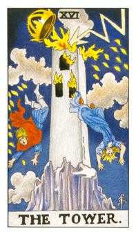
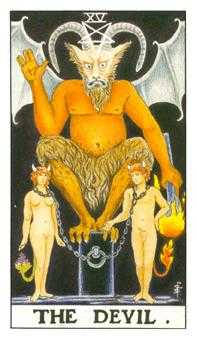
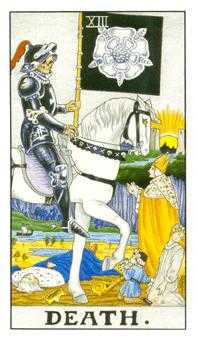
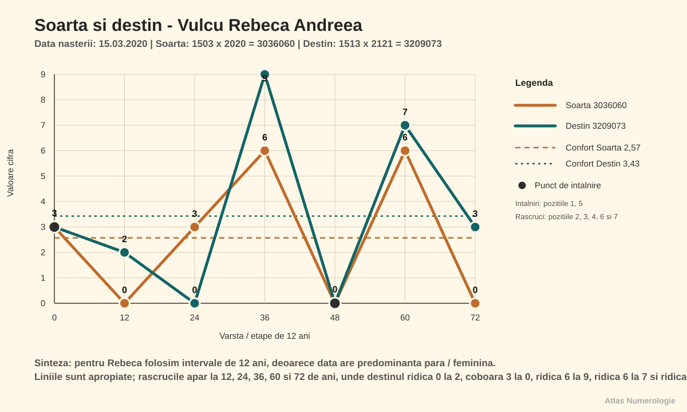

Index: VRA-20200315-v1.00r-CAP-001

# Vulcu Rebeca Andreea — 15.03.2020

Index: VRA-20200315-v1.00r-CAP-002

## Date generale

Index: VRA-20200315-v1.00r-L-001

- Persoana analizată: Vulcu Rebeca Andreea
- Prenume activ: Rebeca
- Data nașterii: 15.03.2020
- Gen: feminin
- Relație analizată: Vulcu Marc Ioan, frate, născut la 14.07.2025
- Nume anterior: nu există
- Template selectat: scurt
- Stil de redactare: conversațional
- Interval analizat: 0–108 ani
- Data lucrării: 08.08.2026
- Versiune: V1.00R

Index: VRA-20200315-v1.00r-CAP-003

## Cuprins

Index: VRA-20200315-v1.00r-L-002

1. Vibrația interioară — Cine ești tu?
2. Vibrația exterioară — Rolul social
3. Destinul — Muntele de urcat
4. Matrița numerologică — Pătratul lui Pitagora
5. Numele — Eu și neamul
6. Spirit și karmă — Lecții și direcții de maturizare
7. Pinacluri: Oportunități și provocări
8. Ciclicități
9. Relații
10. Aplicabilitate profesională
11. Concluzii

Index: VRA-20200315-v1.00r-CAP-005

## Capitolul 1. Vibrația interioară — Cine ești tu?

Index: VRA-20200315-v1.00r-SUB-001

### 1.1. Definiție

Index: VRA-20200315-v1.00r-P-006

Rebeca, vibrația interioară vorbește despre desăvârșirea caracterului și descrie natura ta lăuntrică: cine ești când nu te vede nimeni și nu trebuie să răspunzi așteptărilor din exterior. Ea arată cum primești și interpretezi ceea ce vine către tine, ce îți dorești cu adevărat, ce simți și cum înveți. De aici pornesc motivațiile și reacțiile tale autentice. Cunoscând această vibrație, îți poți recunoaște mai ușor punctele forte, slăbiciunile și direcțiile în care ai nevoie să te dezvolți.

Index: VRA-20200315-v1.00r-C-001

> [!example] Calcul
> Ziua din data de naștere = **15** → 1 + 5 = **6**

Index: VRA-20200315-v1.00r-SUB-002

### 1.2. Caracterul

Index: VRA-20200315-v1.00r-P-007

Rebeca, tu ai vibrația interioară **6**: grijă, responsabilitate, frumusețe, familie și nevoia de armonie. Traseul zilei tale pornește din **15**, unde **1** inițiază, iar **5** caută libertate; împreună ajung la **6**, energia care învață să transforme dorința în ocrotire matură. Arhetipal, această vibrație te apropie de Protector, Vindecător și Creator de spațiu cald. Maturizarea apare când nu confunzi iubirea cu salvarea tuturor, ci înveți să ajuți cu limite clare.

Index: VRA-20200315-v1.00r-SUB-003

### 1.3. Dorințele

Index: VRA-20200315-v1.00r-P-008

Îți dorești apropiere, siguranță afectivă și un mediu în care oamenii se poartă frumos unii cu alții. Ai nevoie de ordine emoțională, de gesturi concrete de grijă și de sentimentul că ceea ce construiești aduce bine cuiva.

Index: VRA-20200315-v1.00r-SUB-004

### 1.4. Motivația

Index: VRA-20200315-v1.00r-P-009

Te motivează proiectele în care poți îngriji, organiza, înfrumuseța sau repara ceva. O rutină potrivită este să alegi zilnic un gest concret de responsabilitate: să termini, să așezi, să clarifici sau să faci un lucru util pentru spațiul tău.

Index: VRA-20200315-v1.00r-SUB-005

### 1.5. Teama

Index: VRA-20200315-v1.00r-P-010

Umbra lui **6** este suprasolicitarea prin grijă, perfecționismul afectiv și tendința de a lua asupra ta emoțiile celorlalți. Când simți că trebuie să repari tot, întreabă-te: «Ce îmi aparține mie și ce trebuie să las celuilalt?»

Index: VRA-20200315-v1.00r-SUB-006

### 1.6. Polarități și maturizare

Index: VRA-20200315-v1.00r-T-009

<table class="polarities-table"><tbody><tr><th scope="row">Polarități pozitive</th><td><ul><li>grijă și responsabilitate;</li><li>simț estetic și capacitate de armonizare;</li><li>loialitate față de cei apropiați;</li><li>talent de a crea spații calde și sigure;</li><li>capacitate de a susține și vindeca prin prezență.</li></ul></td></tr><tr><th scope="row">Polarități negative</th><td><ul><li>supraprotecție și control prin grijă;</li><li>vinovăție când alegi pentru tine;</li><li>perfecționism în familie sau relații;</li><li>asumarea problemelor altora;</li><li>nevoie de aprobare afectivă.</li></ul></td></tr><tr><th scope="row">Direcții de dezvoltare</th><td><ul><li>ajută fără să te pierzi;</li><li>pune limite blânde și clare;</li><li>transformă grija în acțiuni concrete;</li><li>acceptă imperfecțiunea oamenilor;</li><li>hrănește și propriile tale nevoi.</li></ul></td></tr></tbody></table>

Index: VRA-20200315-v1.00r-CAP-006

## Capitolul 2. Vibrația exterioară — Rolul social

Index: VRA-20200315-v1.00r-SUB-008

### 2.1. Definiție

Index: VRA-20200315-v1.00r-P-011

Vibrația exterioară descrie felul în care te manifești în lume: prezența, comportamentul vizibil, imaginea socială și modul în care ceilalți îți pot percepe energia. Dacă vibrația interioară arată dinamica ta privată, vibrația exterioară arată forma prin care aceasta devine vizibilă în relații, contexte sociale și situații concrete. Ea nu spune totul despre caracter, dar indică stilul tău de apariție, reacția spontană în exterior și felul în care îți proiectezi energia. Citește-o ca pe o poartă de contact cu lumea: poate confirma vibrația interioară sau poate crea un contrast între ceea ce trăiești înăuntru și ceea ce observă ceilalți.

Index: VRA-20200315-v1.00r-C-002

> [!example] Calcul
> Luna din data de naștere = **3**

Index: VRA-20200315-v1.00r-SUB-009

### 2.2. Rolul social

Index: VRA-20200315-v1.00r-P-012

Fiind născută în luna martie, ai rolul social al Comunicatorului, specific vibrației exterioare **3**. Oamenii te pot percepe expresivă, curioasă, jucăușă și capabilă să aduci viață într-un grup. Succesul social vine când mesajul tău rămâne limpede și nu se risipește în prea multe direcții.

Index: VRA-20200315-v1.00r-SUB-010

### 2.3. Interior și exterior

Index: VRA-20200315-v1.00r-P-013

Rebeca, dacă în interior ești **6**, la exterior oamenii te pot percepe ca pe un **3**. Înăuntru cauți armonie și grijă; în exterior poți apărea veselă, expresivă și spontană. **6** spune «vreau să fie bine», iar **3** spune «hai să vorbim și să ne bucurăm». Împreună pot face din tine o prezență caldă și luminoasă.

Index: VRA-20200315-v1.00r-P-013a

Puntea dintre interior și exterior arată ajustarea dintre responsabilitatea interioară și expresivitatea vizibilă. Ea te ajută să observi când gluma, povestea sau joaca exprimă autentic grija ta și când pot ascunde o nevoie mai profundă de siguranță.

Index: VRA-20200315-v1.00r-C-002a

> [!example] Calculul punții interior–exterior
> |**6** − **3**| = **3**

Index: VRA-20200315-v1.00r-P-013b

Rezultatul **3** cere autenticitate prin comunicare. Când spui ce simți simplu și viu, oamenii te pot primi fără ezitare în rolul tău: nu doar ca persoană care are grijă, ci ca om care aduce bucurie, cuvânt și coerență între intenție și gest.

Index: VRA-20200315-v1.00r-CAP-007

## Capitolul 3. Destinul — Muntele de urcat

Index: VRA-20200315-v1.00r-SUB-011

### 3.1. Definiție și calcul

Index: VRA-20200315-v1.00r-P-014

Destinul sintetizează data completă și arată o direcție de maturizare, nu un eveniment obligatoriu. Pentru destin păstrăm accentul pe rezultatul final.

Index: VRA-20200315-v1.00r-C-003

> [!example] Calcul
> Toate cifrele adunate din data de naștere = 1 + 5 + 0 + 3 + 2 + 0 + 2 + 0 = **13** → 1 + 3 = **4**
>
> Cifra de interpretare = **4**

Index: VRA-20200315-v1.00r-SUB-012

### 3.2. Interpretare

Index: VRA-20200315-v1.00r-P-015

Rebeca, Destinul compus **4** vine din **13**, o sumă care vorbește despre transformare, efort și reorganizare. Muntele tău de urcat este să construiești ordine, răbdare și rezultate concrete. Vibrația ta interioară **6** vrea armonie, iar Destinul **4** cere structură: când cele două lucrează împreună, poți deveni un om de încredere, capabil să așeze lucrurile frumos și temeinic.

Index: VRA-20200315-v1.00r-CAP-008

## Capitolul 4. Matrița numerologică — Pătratul lui Pitagora

Index: VRA-20200315-v1.00r-SUB-013

### 4.1. Matricea datei de naștere

Index: VRA-20200315-v1.00r-P-016

Matricea pornește de la cifrele datei de naștere și de la cele patru numere de lucru. Ea arată ce energii îți sunt deja la îndemână și unde ai nevoie de aport din experiență, relații sau exercițiu. Privind pătratul tău, vei observa că unele căsuțe sunt pline, iar altele goale: cele pline indică resurse ușor de accesat, iar cele goale arată direcții care se construiesc conștient. Cele **9** căsuțe pot fi privite ca nouă computere energetice sau sfere de inteligență:

- **Căsuța 1** — inteligența psihică;
- **Căsuța 2** — inteligența emoțională;
- **Căsuța 3** — inteligența prelucrării informațiilor;
- **Căsuța 4** — inteligența corporală;
- **Căsuța 5** — inteligența intuitivă;
- **Căsuța 6** — inteligența pragmatismului;
- **Căsuța 7** — inteligența spirituală;
- **Căsuța 8** — inteligența puterii și inteligența socială;
- **Căsuța 9** — inteligența mentală.

Fiecare sferă înseamnă mult mai mult decât această scurtă descriere; important este să îți folosești conștient resursele și să construiești echilibrat zonele mai puțin active.

Index: VRA-20200315-v1.00r-C-004

> [!example] Calcul
> Data nașterii: 15.03.2020 → data compactă = **15032020**  
> N1 = 1 + 5 + 0 + 3 + 2 + 0 + 2 + 0 = **13**  
> N2 = 1 + 3 = **4**  
> N3 = 13 − (2 × 1) = **11**  
> N4 = 1 + 1 = **2**  
> Șir complet = 15032020 + 13 + 4 + 11 + 2 = **15032020134112**

Index: VRA-20200315-v1.00r-G-002

1

1111

optim 111

<svg viewBox="0 0 40 32" role="img"><rect x="8" y="4" width="24" height="24"/></svg>

4

4

optim 44

<svg viewBox="0 0 40 32" role="img"><circle cx="20" cy="16" r="6"/></svg>

7

-

optim 7

2

222

optim 222

<svg viewBox="0 0 40 32" role="img"><polygon points="20,4 33,27 7,27"/></svg>

5

5

optim 55

<svg viewBox="0 0 40 32" role="img"><circle cx="20" cy="16" r="6"/></svg>

8

-

optim 8

3

33

optim 333

<svg viewBox="0 0 40 32" role="img"><line x1="17.1" y1="16" x2="22.9" y2="16" style="stroke-linecap:butt"/><circle cx="10" cy="16" r="6"/><circle cx="30" cy="16" r="6"/></svg>

6

-

optim 66

9

-

optim 9

Index: VRA-20200315-v1.00r-P-035

**Căsuța 1.** Ai **4** apariții. Psihicul și inițiativa sunt puternice: poți porni lucruri, poți insista și poți apăra ceea ce simți că este important. Umbra este încăpățânarea; maturizarea apare când fermitatea ta rămâne deschisă la dialog.

Index: VRA-20200315-v1.00r-P-036

**Căsuța 2.** Ai **3** apariții. Emoțiile, comunicarea și colaborarea sunt foarte active. Simți repede atmosfera și poți răspunde intuitiv oamenilor. Ai grijă să nu absorbi prea mult din starea celorlalți; numește ce simți și respiră înainte să reacționezi.

Index: VRA-20200315-v1.00r-P-037

**Căsuța 3.** Ai **2** apariții. Relațiile și prelucrarea informației circulă bine, cu schimb în ambele sensuri. Poți învăța prin dialog și poveste. Când apar prea multe idei, alege firul central și du-l până la capăt.

Index: VRA-20200315-v1.00r-P-038

**Căsuța 4.** Ai **1** apariție. Corpul, organizarea și rezultatele concrete sunt disponibile ca bază. Sprijină-le prin program, somn, mișcare și reguli simple, fără să transformi ordinea în presiune.

Index: VRA-20200315-v1.00r-P-039

**Căsuța 5.** Ai **1** apariție. Libertatea, curajul și stima de sine sunt prezente într-o formă accesibilă. Energia se maturizează când alegi experiențe noi cu măsură și nu confunzi libertatea cu fuga de responsabilitate.

Index: VRA-20200315-v1.00r-P-040

**Căsuța 6.** Nu ai apariții. Iubirea ca ocrotire, pragmatismul și administrarea concretă sunt energii conservate. Ele se construiesc prin exemple bune, ritualuri de familie, buget, responsabilități împărțite și exercițiul de a transforma grija în gesturi vizibile.

Index: VRA-20200315-v1.00r-P-041

**Căsuța 7.** Nu ai apariții. Observația profundă, răbdarea și înțelepciunea sunt energii conservate. Ele se activează prin studiu, liniște, natură, rugăciune, întrebări bune și oameni care te ajută să nu răspunzi doar din impuls.

Index: VRA-20200315-v1.00r-P-042

**Căsuța 8.** Nu ai apariții. Puterea, responsabilitatea socială și performanța sunt energii conservate. Ele se construiesc prin limite, asumare, relație sănătoasă cu banii și contexte în care înveți să folosești autoritatea fără teamă.

Index: VRA-20200315-v1.00r-P-043

**Căsuța 9.** Nu ai apariții. Inteligența mentală, compasiunea largă și transformarea sunt conservate. Nu înseamnă lipsă, ci o zonă care are nevoie de hrană: lectură, modele bune, experiențe de sens și timp pentru a înțelege imaginea de ansamblu.

Index: VRA-20200315-v1.00r-SUB-015

### 4.3. Elemente și temperament

Index: VRA-20200315-v1.00r-T-012Index: VRA-20200315-v1.00r-P-044

Foc<strong>5</strong>

Pământ<strong>1</strong>

Aer<strong>2</strong>

Apă<strong>3</strong>

<ul class="element-definitions"><li><strong>Focul</strong> este esența vieții, a duhului și a spiritului care animă și activează.</li><li><strong>Pământul</strong> este esența materiei dense, a solidarității și a fertilității, care hrănește și dă formă.</li><li><strong>Aerul</strong> este esența inteligenței conceptuale care eliberează și stimulează.</li><li><strong>Apa</strong> este esența emoțiilor și a fecundității, maleabilă, flexibilă și orientată spre acumulare.</li></ul>

Index: VRA-20200315-v1.00r-P-045

Temperamentul tău predominant este **coleric**, cu Focul la **5** apariții, urmat de Apă cu **3**, Aer cu **2** și Pământ cu **1**. Ai energie de pornire și răspuns rapid, dar echilibrul vine când emoțiile primesc limbaj, iar corpul primește ritm și stabilitate.

Index: VRA-20200315-v1.00r-SUB-016

### 4.4. Masculin și feminin

Index: VRA-20200315-v1.00r-P-017

Total: <strong>14</strong> cifre

<strong>Impare · 10</strong><strong>Pare · 4</strong>

Matricea are **10** apariții impare și **4** pare. Inițiativa și proiecția sunt dominante, iar energia receptivă există ca resursă de echilibru. Cifrele pare te ajută să primești și să dai mai departe, dar pot aduce indecizie; folosește dialogul ca să clarifici, apoi alege fără să prelungești oscilația.

Index: VRA-20200315-v1.00r-SUB-017

### 4.5. Daruri și nevoi

Index: VRA-20200315-v1.00r-P-018

Darurile și nevoile se citesc din căsuțele cu cel puțin **2** cifre: la tine sunt **1**, **2** și **3**. Darul lui **1** este inițiativa, dar nevoia lui este să fie ascultată fără să devină încăpățânare. Darul lui **2** este sensibilitatea, iar nevoia lui este siguranța emoțională. Darul lui **3** este comunicarea, iar nevoia lui este să primească spațiu de exprimare și finalizare.

Index: VRA-20200315-v1.00r-SUB-017a

### 4.6. Scara bunăstării

Index: VRA-20200315-v1.00r-P-019

Scara bunăstării arată că treapta dominantă este vectorul **123, Energie**, cu **16**. El este susținut de vectorul **258, Social** și de vectorul **357, Scopuri**, ambele cu **11**. Pentru tine, împlinirea pornește din energie, emoție și comunicare, apoi are nevoie să fie orientată spre oameni și scopuri clare. Bunăstarea materială apare când energia de început primește disciplină și direcție.

Index: VRA-20200315-v1.00r-G-004

Vector 123 — Energie16

Vector 258 — Social11

Vector 357 — Scopuri11

Vector 159 — Cariera9

Vector 456 — Vointa9

Vector 147 — Spiritualitate8

<i class="element-dot element-apa"></i>Căsuța 26

<i class="element-dot element-aer"></i>Căsuța 36

Vector 369 — Bunastare materiala6

<i class="element-dot element-foc"></i>Căsuța 55

<i class="element-dot element-foc"></i>Căsuța 14

<i class="element-dot element-pamant"></i>Căsuța 44

<i class="element-dot element-apa"></i>Căsuța 60

<i class="element-dot element-aer"></i>Căsuța 70

Vector 789 — Creativitate0

<i class="element-dot element-pamant"></i>Căsuța 80

<i class="element-dot element-foc"></i>Căsuța 90

<i class="element-dot element-foc"></i>Foc<i class="element-dot element-pamant"></i>Pământ<i class="element-dot element-apa"></i>Apă<i class="element-dot element-aer"></i>Aer

Index: VRA-20200315-v1.00r-CAP-009

## Capitolul 5. Numele — Eu și neamul

Index: VRA-20200315-v1.00r-SUB-018

### 5.1. Numărul activ

Index: VRA-20200315-v1.00r-P-020a

Numărul activ este influența directă a numelui folosit zi de zi asupra comportamentului curent. El arată ce energie aduce numele în reacțiile tale obișnuite, în felul în care intri într-un context și în impresia pe care o susții prin acțiunile repetate.

Index: VRA-20200315-v1.00r-C-009

> [!example] Calcul
> Rebeca = 25 → 2 + 5 = **7**

Index: VRA-20200315-v1.00r-P-021

Numărul activ **7** aduce în comportamentul tău curent observație, profunzime și nevoie de înțelegere. Poți părea uneori retrasă sau selectivă, dar în interior cauți sens. Resursa este discernământul; umbra este izolarea.

Index: VRA-20200315-v1.00r-SUB-019

### 5.2. Numărul intim

Index: VRA-20200315-v1.00r-P-021b

Numărul intim se calculează din vocalele numelui complet și descrie motivația afectivă, dorințele profunde și ceea ce îți hrănește lumea interioară. Dacă Numărul activ arată energia cu care intri în viața de zi cu zi, Numărul intim arată vocea mai discretă care îți spune ce are sens pentru tine.

Index: VRA-20200315-v1.00r-C-009a

> [!example] Calcul
> Vocalele numelui = 3 + 3 + 5 + 5 + 1 + 1 + 5 + 5 + 1 = **29** → 2 + 9 = **11** → 1 + 1 = **2**

Index: VRA-20200315-v1.00r-P-021c

Numărul intim **2** caută apropiere, blândețe și siguranță afectivă. Te hrănesc relațiile în care poți simți că ești ascultată. Umbra este sensibilitatea la respingere; maturizarea apare când spui ce ai nevoie fără să aștepți ca ceilalți să ghicească.

Index: VRA-20200315-v1.00r-SUB-020

### 5.3. Numărul ereditar

Index: VRA-20200315-v1.00r-C-008

> [!example] Calcul
> Vulcu = 16 → 1 + 6 = **7**

Index: VRA-20200315-v1.00r-P-020

Numărul ereditar **7** aduce o memorie de neam legată de discreție, observație, credință, studiu și căutarea adevărului. Poți moșteni nevoia de a înțelege lucrurile în profunzime și de a nu te mulțumi cu aparențele.

Index: VRA-20200315-v1.00r-SUB-021

### 5.4. Numărul ereditar karmic

Index: VRA-20200315-v1.00r-P-022b

Numărul ereditar karmic arată o memorie simbolică a neamului și felul în care poți continua conștient resursele lui, fără să preiei automat limitele sau poverile transmise.

Index: VRA-20200315-v1.00r-C-005

> [!example] Calcul în intervalul 1–22
> Vulcu = **16**
>
> Arcana neamului = **16 — Turnul**

Index: VRA-20200315-v1.00r-T-013

<table class="tarot-profile-table"><tbody><tr><td>Index: VRA-20200315-v1.00r-G-003 
<em>Arcana <strong>16</strong> — Turnul</em>
</td><td><ul><li><strong>Resursă moștenită:</strong> capacitatea de a vedea ce nu mai este stabil și de a reclădi pe baze reale.</li><li><strong>Manifestare:</strong> curajul de a schimba structuri vechi, reguli sau tipare de familie.</li><li><strong>Umbră:</strong> teamă de pierdere, reacții bruște sau rezistență la schimbare până când presiunea devine mare.</li><li><strong>Maturizare:</strong> construirea unei siguranțe interioare care nu depinde doar de formele vechi.</li></ul></td></tr></tbody></table>

Index: VRA-20200315-v1.00r-P-022c

Numărul ereditar karmic **16**, asociat Turnului, vorbește despre o moștenire în care adevărul cere uneori restructurare. Rebeca, poți duce mai departe resursa de a reface lucrurile mai sincer, mai curat și mai stabil decât au fost înainte.

Index: VRA-20200315-v1.00r-P-022d

Umbra este să te agăți de forme care par sigure, dar nu mai susțin viața. Maturizarea apare când accepți schimbarea ca pe o șansă de curățare, nu ca pe o pedeapsă.

Index: VRA-20200315-v1.00r-SUB-022

### 5.5. Numărul de realizare

Index: VRA-20200315-v1.00r-P-021a

Numărul de realizare este asociat cu Vibrația exterioară: ambele arată impresia pe care o lași asupra celorlalți, manierele, comportamentul vizibil și felul în care energia ta devine recognoscibilă în lume. Acest număr poate amplifica realizările concrete sau le poate frâna atunci când este trăit prin umbra sa.

Index: VRA-20200315-v1.00r-C-010

> [!example] Calcul
> Consoanele numelui = **42** → 4 + 2 = **6**

Index: VRA-20200315-v1.00r-P-022

Numărul de realizare **6** te face vizibilă ca persoană caldă, atentă și responsabilă. Ceilalți pot simți la tine dorința de armonie și capacitatea de a ține împreună oamenii sau lucrurile.

Index: VRA-20200315-v1.00r-P-022a

Vibrația exterioară **3** și Numărul de realizare **6** formează o combinație afectivă: **3** exprimă, iar **6** ocrotește. Imaginea ta devine matură când comunicarea nu rămâne doar joacă, ci devine grijă concretă.

Index: VRA-20200315-v1.00r-SUB-023

### 5.6. Numărul de exprimare

Index: VRA-20200315-v1.00r-P-023a

Numărul de exprimare reprezintă personalitatea ta, cheia către ceea ce poți deveni. El contribuie la formarea personalității tale și arată felul în care resursele din nume se pot reuni într-o expresie matură.

Index: VRA-20200315-v1.00r-C-012

> [!example] Calcul
> Vulcu = 7, Rebeca = 7, Andreea = 3 → 7 + 7 + 3 = **17** → 1 + 7 = **8**

Index: VRA-20200315-v1.00r-P-024

Numărul de exprimare **8** susține responsabilitatea, administrarea resurselor și curajul de a ocupa un loc vizibil. Poți crește în roluri în care înveți să folosești puterea cu maturitate.

Index: VRA-20200315-v1.00r-P-024a

Armonizarea dintre Numărul de exprimare **8** și Destinul **4** cere structură, disciplină și rezultate verificabile. **8** vrea impact, iar **4** cere fundație; împreună pot construi autoritate sănătoasă.

Index: VRA-20200315-v1.00r-SUB-023a

### 5.7. Codul numerologic al numelui

#### Numele actual — Vulcu Rebeca Andreea

Index: VRA-20200315-v1.00r-C-011

> [!example] Calcul
> Vulcu: 4 + 3 + 3 + 3 + 3 = **16** → **7**
>
> Rebeca: 9 + 5 + 2 + 5 + 3 + 1 = **25** → **7**
>
> Andreea: 1 + 5 + 4 + 9 + 5 + 5 + 1 = **30** → **3**
>
> Codul literelor numelui = **43333952531149551**
>
> Codul numerologic personal al numelui = **8**

Index: VRA-20200315-v1.00r-G-002a

data 1111

111

optim 111

<svg viewBox="0 0 40 32" role="img"><polygon points="20,4 33,27 7,27"/></svg>

data 4

44

optim 44

<svg viewBox="0 0 40 32" role="img"><line x1="17.1" y1="16" x2="22.9" y2="16" style="stroke-linecap:butt"/><circle cx="10" cy="16" r="6"/><circle cx="30" cy="16" r="6"/></svg>

data -

-

optim 7

data 222

2

optim 222

<svg viewBox="0 0 40 32" role="img"><circle cx="20" cy="16" r="6"/></svg>

data 5

55555

optim 55

<svg viewBox="0 0 40 32" role="img"><polygon points="20,3 24,13 35,13 26,20 30,30 20,24 10,30 14,20 5,13 16,13"/></svg>

data -

8

optim 8

<svg viewBox="0 0 40 32" role="img"><circle cx="20" cy="16" r="6"/></svg>

data 33

33333

optim 333

<svg viewBox="0 0 40 32" role="img"><polygon points="20,3 24,13 35,13 26,20 30,30 20,24 10,30 14,20 5,13 16,13"/></svg>

data -

-

optim 66

data -

99

optim 9

<svg viewBox="0 0 40 32" role="img"><line x1="17.1" y1="16" x2="22.9" y2="16" style="stroke-linecap:butt"/><circle cx="10" cy="16" r="6"/><circle cx="30" cy="16" r="6"/></svg>

Index: VRA-20200315-v1.00r-P-023

Comparând pătratul datei cu pătratul numelui, energiile comune valide sunt **1**, **2**, **3**, **4** și **5**. Numele susține inițiativa, sensibilitatea, comunicarea, ordinea și curajul de a experimenta.

Index: VRA-20200315-v1.00r-P-023b

Prin **1**, numele îți întărește pornirea; prin **2**, îți susține relaționarea; prin **3**, îți amplifică expresia; prin **4**, adaugă formă; prin **5**, deschide libertatea. Aceste energii există și în matricea nativă, deci pot fi interpretate ca sprijin real.

Index: VRA-20200315-v1.00r-P-023c

Energiile **6**, **7**, **8** și **9** nu apar în matricea datei. Chiar dacă numele poate conține unele dintre ele, lectura personală se păstrează pe ceea ce are suport nativ și pe ceea ce se construiește conștient prin experiență.

Index: VRA-20200315-v1.00r-CAP-007b

## Capitolul 6. Spirit și karmă — Lecții și direcții de maturizare

Index: VRA-20200315-v1.00r-SUB-038

### 6.1. Codul Spiritului și vârsta Spiritului

Index: VRA-20200315-v1.00r-P-182

Codul Spiritului se citește din ziua și luna nașterii și arată zona mare de maturizare spirituală. Pentru tine, Rebeca, el arată felul în care experiența se transformă în înțelepciune și serviciu.

Index: VRA-20200315-v1.00r-P-185

În tabel, poziția ta este la ziua **15** și luna **III**, unde apare codul **34**.

Index: VRA-20200315-v1.00r-T-017

| Ziua | I | II | III | IV | V | VI | VII | VIII | IX | X | XI | XII |
| --- | ---: | ---: | ---: | ---: | ---: | ---: | ---: | ---: | ---: | ---: | ---: | ---: |
| 1 | 52 | 50 | 48 | 46 | 44 | 42 | 40 | 38 | 36 | 34 | 32 | 30 |
| 2 | 51 | 49 | 47 | 45 | 43 | 41 | 39 | 37 | 35 | 33 | 31 | 29 |
| 3 | 50 | 48 | 46 | 44 | 42 | 40 | 38 | 36 | 34 | 32 | 30 | 28 |
| 4 | 49 | 47 | 45 | 43 | 41 | 39 | 37 | 35 | 33 | 31 | 29 | 27 |
| 5 | 48 | 46 | 44 | 42 | 40 | 38 | 36 | 34 | 32 | 30 | 28 | 26 |
| 6 | 47 | 45 | 43 | 41 | 39 | 37 | 35 | 33 | 31 | 29 | 27 | 25 |
| 7 | 46 | 44 | 42 | 40 | 38 | 36 | 34 | 32 | 30 | 28 | 26 | 24 |
| 8 | 45 | 43 | 41 | 39 | 37 | 35 | 33 | 31 | 29 | 27 | 25 | 23 |
| 9 | 44 | 42 | 40 | 38 | 36 | 34 | 32 | 30 | 28 | 26 | 24 | 22 |
| 10 | 43 | 41 | 39 | 37 | 35 | 33 | 31 | 29 | 27 | 25 | 23 | 21 |
| 11 | 42 | 40 | 38 | 36 | 34 | 32 | 30 | 28 | 26 | 24 | 22 | 20 |
| 12 | 41 | 39 | 37 | 35 | 33 | 31 | 29 | 27 | 25 | 23 | 21 | 19 |
| 13 | 40 | 38 | 36 | 34 | 32 | 30 | 28 | 26 | 24 | 22 | 20 | 18 |
| 14 | 39 | 37 | 35 | 33 | 31 | 29 | 27 | 25 | 23 | 21 | 19 | 17 |
| 15 | 38 | 36 | 34 | 32 | 30 | 28 | 26 | 24 | 22 | 20 | 18 | 16 |
| 16 | 37 | 35 | 33 | 31 | 29 | 27 | 25 | 23 | 21 | 19 | 17 | 15 |
| 17 | 36 | 34 | 32 | 30 | 28 | 26 | 24 | 22 | 20 | 18 | 16 | 14 |
| 18 | 35 | 33 | 31 | 29 | 27 | 25 | 23 | 21 | 19 | 17 | 15 | 13 |
| 19 | 34 | 32 | 30 | 28 | 26 | 24 | 22 | 20 | 18 | 16 | 14 | 12 |
| 20 | 33 | 31 | 29 | 27 | 25 | 23 | 21 | 19 | 17 | 15 | 13 | 11 |
| 21 | 32 | 30 | 28 | 26 | 24 | 22 | 20 | 18 | 16 | 14 | 12 | 10 |
| 22 | 31 | 29 | 27 | 25 | 23 | 21 | 19 | 17 | 15 | 13 | 11 | 9 |
| 23 | 30 | 28 | 26 | 24 | 22 | 20 | 18 | 16 | 14 | 12 | 10 | 8 |
| 24 | 29 | 27 | 25 | 23 | 21 | 19 | 17 | 15 | 13 | 11 | 9 | 7 |
| 25 | 28 | 26 | 24 | 22 | 20 | 18 | 16 | 14 | 12 | 10 | 8 | 6 |
| 26 | 27 | 25 | 23 | 21 | 19 | 17 | 15 | 13 | 11 | 9 | 7 | 5 |
| 27 | 26 | 24 | 22 | 20 | 18 | 16 | 14 | 12 | 10 | 8 | 6 | 4 |
| 28 | 25 | 23 | 21 | 19 | 17 | 15 | 13 | 11 | 9 | 7 | 5 | 3 |
| 29 | 24 |  | 20 | 18 | 16 | 14 | 12 | 10 | 8 | 6 | 4 | 2 |
| 30 | 23 |  | 19 | 17 | 15 | 13 | 11 | 9 | 7 | 5 | 3 | 1 |
| 31 | 22 |  | 18 |  | 14 |  | 10 | 8 |  | 4 |  | 0 |

Index: VRA-20200315-v1.00r-P-186

Rebeca, codul **34** te așază în zona **Materială**. Spiritul tău învață prin construcție, responsabilitate, rezultate, administrarea resurselor și transformarea potențialului interior în ceva concret și folositor.

Index: VRA-20200315-v1.00r-T-018

| Zona | Interval cod | Nivel simbolic | Teme principale |
| --- | --- | --- | --- |
| Iubire | 1-13 | 0-2.500 ani | relații, emoții, atașamente, compasiune, vulnerabilitate |
| Rațiune | 14-26 | 2.500-5.000 ani | logică, discernământ, structură, analiză, minte |
| Material | 27-39 | 5.000-7.500 ani | bani, construcție, putere, manifestare, responsabilitate |
| Haruri | 40-52 | 7.500-10.000 ani | înțelepciune, haruri spirituale, ghidare, serviciu, intuiție |

Index: VRA-20200315-v1.00r-T-019

<table class="stage-table">
<colgroup><col style="width:7%"><col style="width:22%"><col style="width:8%"><col style="width:18%"><col style="width:45%"></colgroup>
<thead><tr><th>Etapă</th><th>Descriere etapă</th><th>Subetapă</th><th>Lecție</th><th>Descriere subetapă</th></tr></thead>
<tbody>
<tr class="stage-love"><td rowspan="4">1</td><td rowspan="4">Înțelegere și stabilizare</td><td>1</td><td>Început de cale</td><td>Înțeleg cine sunt și ce am de făcut pe pământ.</td></tr>
<tr class="stage-love"><td>2</td><td>Interacțiune</td><td>Înțeleg cine sunt și ce am de făcut în raport cu alte persoane.</td></tr>
<tr class="stage-love"><td>3</td><td>Căutarea echilibrului</td><td>Înțeleg echilibrul dintre centru și margini, dintre apropiere și mișcare.</td></tr>
<tr class="stage-love"><td>4</td><td>Stabilitate</td><td>Stabilizez tot ce am înțeles până acum.</td></tr>
<tr class="stage-reason"><td rowspan="4">2</td><td rowspan="4">Experimentare și manifestare</td><td>5</td><td>Schimbare</td><td>Experimentez și învăț ce a rămas de lucrat, dar altfel decât până acum.</td></tr>
<tr class="stage-reason"><td>6</td><td>Prelucrarea karmei</td><td>Balansez, prelucrez ce am acumulat și creez teren stabil pentru o nouă etapă.</td></tr>
<tr class="stage-reason"><td>7</td><td>Depășirea obstacolelor</td><td>Sunt pregătit pentru experiențe mai intense și învăț să nu fug de ele.</td></tr>
<tr class="stage-reason current-row"><td class="current-substage">8</td><td class="current-substage">Succesul</td><td class="current-substage">Culeg roadele a ceea ce am învățat și mă manifest responsabil.</td></tr>
<tr class="stage-material"><td rowspan="4">3</td><td rowspan="4">Finalizare și orientare către ceilalți</td><td>9</td><td>Finalizarea</td><td>Închei ce ține de mine, ca să pot privi dincolo de mine.</td></tr>
<tr class="stage-material"><td>10</td><td>Norocul</td><td>Învăț să primesc, să colaborez și să las viața să mă așeze în contexte potrivite.</td></tr>
<tr class="stage-material"><td>11</td><td>Slujirea</td><td>Îi slujesc pe alții prin experiența și maturitatea acumulată.</td></tr>
<tr class="stage-material"><td>12</td><td>Sacrificiul</td><td>Învăț diferența dintre dăruire conștientă și pierdere de sine.</td></tr>
<tr class="stage-gifts"><td>4</td><td>Examen</td><td>13</td><td>Examenul</td><td>Integrez lecția și trec spre un nivel nou de înțelegere.</td></tr>
</tbody>
</table>

Index: VRA-20200315-v1.00r-P-192

Subetapa ta este **8 — Succesul**. Lecția este să culegi roadele a ceea ce ai învățat și să transformi manifestarea în responsabilitate, nu în presiune.

Index: VRA-20200315-v1.00r-P-193

Vârsta Spiritului arată simbolic experiența acumulată până la naștere și apoi experiența actualizată cu vârsta biologică.

Index: VRA-20200315-v1.00r-C-003d

> [!example] Calcul
> Vârsta la naștere = (34 × 189) - 189 = **6237**
>
> Vârsta actuală = 6237 + 6 = **6243**

Index: VRA-20200315-v1.00r-P-197

Ghidarea practică este să înveți să construiești încet, cu răbdare. Când ai o idee sau o dorință, întreabă-te ce formă concretă îi dai: timp, spațiu, regulă, obiect, economie, responsabilitate.

Index: VRA-20200315-v1.00r-SUB-007a

### 6.2. Karma din ziua de naștere

Index: VRA-20200315-v1.00r-P-009a

În lectura numerologică, ziua de naștere arată o încărcătură karmică simbolică. Fiind născută în ziua de **15**, te afli în zona de aproximativ **80%** și lucrezi cu Arcana **15 — Diavolul**.

Index: VRA-20200315-v1.00r-C-001a

> [!example] Calcul
> Ziua nașterii = **15**
>
> Arcana karmică = **15 — Diavolul**
>
> Intervalul 10–19 = karma împlinită **spre 80%**

Index: VRA-20200315-v1.00r-G-001a

_Arcana **15** — Diavolul. Karma din ziua de naștere_

Index: VRA-20200315-v1.00r-P-009b

Diavolul vorbește simbolic despre atașamente, dorință, magnetism și felul în care puterea instinctivă poate fi folosită matur. Resursa este vitalitatea; umbra este dependența de plăcere, control sau validare.

Index: VRA-20200315-v1.00r-P-009b1

Umbra karmei **15** poate apărea ca încăpățânare, posesivitate ori legare de lucruri care oferă confort rapid. Nu este un verdict, ci o imagine despre locul unde libertatea interioară cere atenție.

Index: VRA-20200315-v1.00r-P-009b2

Cheia este să alegi conștient: ce te hrănește cu adevărat și ce doar te ține prinsă. Când dorința primește limită și discernământ, devine energie de creație.

Index: VRA-20200315-v1.00r-SUB-010a

### 6.3. Karma din luna de naștere

Index: VRA-20200315-v1.00r-P-013c

Karma din luna de naștere arată datoria socială, familială sau personală legată de luna în care te-ai născut. Luna se păstrează ca număr între **1** și **12**, fără reducere, și indică o direcție de maturizare în raport cu familia, neamul, locul de origine sau propria persoană. Această karmă nu vorbește despre vină, ci despre o responsabilitate pe care o poți transforma în relații mai sănătoase și în alegeri mai conștiente.

Index: VRA-20200315-v1.00r-C-002b

> [!example] Calcul
> Luna nașterii = **3**
>
> Karma lunii = **responsabilitate în comunicare și relaționare**

Index: VRA-20200315-v1.00r-P-013d

Luna **3** îți cere să lucrezi cu expresia, cuvântul și felul în care creezi legături. Umbra este risipirea sau folosirea cuvântului ca evitare; maturizarea apare când spui adevărul cu blândețe.

Index: VRA-20200315-v1.00r-SUB-012a

### 6.4. Karma din Calea Destinului

Index: VRA-20200315-v1.00r-P-015a

Karma din Calea Destinului păstrează suma compusă a tuturor cifrelor datei. Pentru tine citim amprenta **13**, nu doar Destinul redus la **4**.

Index: VRA-20200315-v1.00r-C-003a

> [!example] Calcul
> 1 + 5 + 0 + 3 + 2 + 0 + 2 + 0 = **13**
>
> Karma din Calea Destinului = **13**
>
> Intervalul 10–19 = categoria karmică **spre 80%**

Index: VRA-20200315-v1.00r-P-015b

Rebeca, Calea karmică **13** este asociată simbolic cu Arcana **13 — Moartea**. Ea vorbește despre transformare, încheierea formelor vechi și capacitatea de a renaște mai matur. Nu indică un eveniment fatal, ci o lecție de curățare și reorganizare.

Index: VRA-20200315-v1.00r-G-001b

_Arcana **13** — Moartea. Karma din Calea Destinului_

Index: VRA-20200315-v1.00r-SUB-012b

### 6.5. Concluzie: direcția de lucru

Index: VRA-20200315-v1.00r-P-015c

Codul Spiritului **34**, zona Materială și subetapa **8 — Putere** arată că direcția ta de maturizare trece prin folosirea responsabilă a resurselor. Karma zilei **15**, Karma lunii **3** și Calea karmică **13** te învață să transformi dorința, cuvântul și schimbarea în construcție concretă.

Index: VRA-20200315-v1.00r-CAP-010

## Capitolul 7. Pinacluri: Oportunități și provocări

Index: VRA-20200315-v1.00r-P-024b

De-a lungul vieții, treci prin patru pinacluri, fiecare cu propria oportunitate și propria provocare, structurate în tabelul de mai jos. Oportunitatea arată direcția pe care viața o poate deschide, iar provocarea arată lecția care îți cere maturizare ca să poți folosi acea direcție în mod constructiv.

Index: VRA-20200315-v1.00r-C-013

> [!example] Calcul
> Calea Destinului: **13**
> Destin compus: **4**
> Limita Pinaclului 1: 36 - **4** = **32**
> Pinacluri: **0–32** -> **33–42** -> **43–52** -> **53+**

Index: VRA-20200315-v1.00r-T-003

| Pinaclu | Interval | Oportunitate | Provocare | Interpretare |
| --- | --- | ---: | ---: | --- |
| Pinaclul 1 | 0–32 | 9 | 3 | Învățare prin compasiune, finalizări și comunicare matură. |
| Pinaclul 2 | 33–42 | 1 | 2 | Inițiativă nouă, cu lecția cooperării. |
| Pinaclul 3 | 43–52 | 1 | 1 | Autonomie puternică, cu atenție la ego și încăpățânare. |
| Pinaclul 4 | 53+ | 7 | 1 | Înțelepciune, cercetare și autonomie interioară. |

Index: VRA-20200315-v1.00r-P-024c

**Pinaclul 1: până la 32 de ani**, Oportunitatea **9** îți deschide compasiunea, imaginația și înțelegerea largă, iar Provocarea **3** cere să comunici limpede, fără risipire.

Index: VRA-20200315-v1.00r-P-024d

**Pinaclul 2: între 33 și 42 de ani**, Oportunitatea **1** aduce inițiativă și autonomie. Provocarea **2** cere cooperare, ascultare și răbdare în relații.

Index: VRA-20200315-v1.00r-P-024e

**Pinaclul 3: între 43 și 52 de ani**, Oportunitatea **1** se repetă și cere curaj. Provocarea **1** te învață să conduci fără orgoliu și să începi fără să forțezi.

Index: VRA-20200315-v1.00r-P-024f

**Pinaclul 4: de la 53 de ani până la sfârșitul vieții**, Oportunitatea **7** favorizează studiul, credința, înțelepciunea și profunzimea. Provocarea **1** cere autonomie matură.

Index: VRA-20200315-v1.00r-P-024g

Rebeca, la 6 ani te afli în Pinaclul **1**, cu Oportunitatea **9** și Provocarea **3**. Pentru etapa copilăriei, asta se traduce prin imaginație, sensibilitate și nevoia de a învăța să exprimi ce simți în cuvinte simple.

Index: VRA-20200315-v1.00r-CAP-011

## Capitolul 8. Ciclicități

Index: VRA-20200315-v1.00r-SUB-024

### 8.1. Soarta și Destinul

Index: VRA-20200315-v1.00r-P-025

Zona ta de confort este între oportunitățile **4.5** și provocările **1.75**: te simți bine când există structură, dar ai nevoie și de libertate controlată pentru inițiativă și explorare.

Index: VRA-20200315-v1.00r-C-006

> [!example] Sinteză
> Soartă: **1503 × 2020 = 3036060**  
> Destin: **1513 × 2121 = 3209073**

Index: VRA-20200315-v1.00r-G-005

Index: VRA-20200315-v1.00r-P-025a

Pe linia **Sorții**, traseul **3–0–3–6–0–6–0** aduce comunicare, pauze de acumulare și responsabilitate afectivă. Pe linia **Destinului**, traseul **3–2–0–9–0–7–3** adaugă cooperare, transformare, introspecție și expresie. Pentru tine, Rebeca, citirea aceasta arată că bucuria de a vorbi și de a crea are nevoie de răbdare, înțelegere și timp interior.

Index: VRA-20200315-v1.00r-P-025b

La **6 ani**, graficul se citește încă în zona de formare: familia, ritmul zilnic și oamenii apropiați sunt mai importante decât interpretarea unor decizii personale majore. Energia perioadei susține învățarea prin cuvânt, joacă, reguli simple și siguranță emoțională.

Index: VRA-20200315-v1.00r-P-025c

Când apar valori precum **0** în șiruri, le citim prudent: ele nu adaugă o direcție numerologică separată, ci pot amplifica sau deschide potențialul cifrei de lângă ele. Pentru tine, pauzele dintre cifre arată că lucrurile au nevoie de timp de așezare.

Index: VRA-20200315-v1.00r-P-025d

Sfatul pentru etapa actuală este blând și concret: ritm stabil, somn, activități creative, povești, reguli explicate și mult spațiu pentru a spune ce simți. Astfel, energia lui **3** devine comunicare, iar Destinul **4** începe să se formeze ca siguranță.

Index: VRA-20200315-v1.00r-SUB-025

### 8.2. Anii importanți

Index: VRA-20200315-v1.00r-P-026a

**Anii importanți interiori** marchează momente în care schimbarea pornește mai ales din interiorul persoanei: decizii, maturizări, conștientizări, schimbări de perspectivă, nevoi sufletești sau transformări personale care apoi pot modifica viața din afară.

Index: VRA-20200315-v1.00r-P-026b

**Șirul anilor importanți interiori:** 2024 → 2032 → 2039 → 2044 → 2045 → 2047 → 2051 → 2059 → 2066 → 2071 → 2072 → 2074 → 2078 → 2086 → 2093 → 2098 → 2099 → 2101 → 2105 → 2113 → 2120 → 2125 → 2126 → 2128.

Index: VRA-20200315-v1.00r-P-026c

**Anii importanți exteriori** marchează momente în care schimbarea vine mai ales din afara persoanei: contexte, oameni, evenimente, oportunități, pierderi, mutări, presiuni sau situații care cer reacție și adaptare.

Index: VRA-20200315-v1.00r-P-026d

**Șirul anilor importanți exteriori:** 2024 → 2032 → 2039 → 2053 → 2063 → 2074 → 2087 → 2104 → 2111 → 2116 → 2126.

Index: VRA-20200315-v1.00r-P-026e

Rebeca, prima suprapunere importantă este în **2024**, când schimbarea interioară și cea exterioară apar împreună. Următorul nod mare este **2032**. În astfel de ani, familia și mediul pot observa mai clar ce se maturizează în tine.

Index: VRA-20200315-v1.00r-SUB-025a

### 8.3. Lecțiile de viață

Index: VRA-20200315-v1.00r-P-028

Rebeca, lecțiile de viață se recalculează din produsul zilei, lunii și anului nașterii: **15 × 3 × 2020 = 90900 → 9, 0, 9, 0, 0**. Șirul **9–0–9–0–0** se repetă de-a lungul vieții. Fiecare revenire îți oferă ocazia să trăiești mai matur cele două teme ale sale:

- **9** — compasiune, imaginație, încheierea etapelor, desprindere și capacitatea de a privi experiențele dintr-o perspectivă mai largă;
- **0** — un spațiu de acumulare și deschidere care nu adaugă o direcție numerologică separată, ci amplifică lecția din jur și cere răbdare, receptivitate și timp pentru integrare.

Repetarea lui **9** întărește tema sensibilității și a înțelegerii, iar cele trei poziții de **0** arată că ritmul tău include pauze importante de așezare. Lecția nu este să grăbești sensul, ci să lași experiența să se clarifice înainte de a merge mai departe.

Index: VRA-20200315-v1.00r-T-008

| Vârstă | Lecția 1 — <strong style="font-size: 1.15em; font-weight: 700;">9</strong> | Lecția 2 — <strong style="font-size: 1.15em; font-weight: 700;">0</strong> | Lecția 3 — <strong style="font-size: 1.15em; font-weight: 700;">9</strong> | Lecția 4 — <strong style="font-size: 1.15em; font-weight: 700;">0</strong> | Lecția 5 — <strong style="font-size: 1.15em; font-weight: 700;">0</strong> |
| --- | ---: | ---: | ---: | ---: | ---: |
| 1–5 | 2020 | 2021 | 2022 | 2023 | 2024 |
| 6–10 | 2025 | 2026 | 2027 | 2028 | 2029 |
| 11–15 | 2030 | 2031 | 2032 | 2033 | 2034 |
| 16–20 | 2035 | 2036 | 2037 | 2038 | 2039 |
| 21–25 | 2040 | 2041 | 2042 | 2043 | 2044 |
| 26–30 | 2045 | 2046 | 2047 | 2048 | 2049 |
| 31–35 | 2050 | 2051 | 2052 | 2053 | 2054 |
| 36–40 | 2055 | 2056 | 2057 | 2058 | 2059 |
| 41–45 | 2060 | 2061 | 2062 | 2063 | 2064 |
| 46–50 | 2065 | 2066 | 2067 | 2068 | 2069 |
| 51–55 | 2070 | 2071 | 2072 | 2073 | 2074 |
| 56–60 | 2075 | 2076 | 2077 | 2078 | 2079 |

Index: VRA-20200315-v1.00r-P-028a

În **2026**, Rebeca, lecția ta este **0**. Ea nu aduce o temă numerică separată, ci deschide un timp de acumulare, receptivitate și integrare, în care ceea ce înveți are nevoie să se așeze înainte de a deveni acțiune. Lecția **0** se întâlnește cu anul personal **1**, care deschide începuturi: familia te poate ajuta cel mai bine oferindu-ți experiențe noi în pași simpli, un ritm stabil și libertatea de a observa înainte de a răspunde. Astfel, începutul nu devine grabă, ci curiozitate susținută de siguranță.

Index: VRA-20200315-v1.00r-SUB-027

### 8.4. Ciclul de 9 ani

Index: VRA-20200315-v1.00r-P-028d

Ciclul de 9 ani descrie succesiunea anilor personali **1–9**. Fiecare an personal începe la ziua și luna nașterii și se încheie la următoarea aniversare, nu la 1 ianuarie.

Index: VRA-20200315-v1.00r-P-028e

Ciclul de 9 ani poate fi înțeles ca un ritm natural de creștere și transformare. Nu este o predicție rigidă și nu spune că într-un anumit an trebuie să se întâmple ceva anume, ci indică tema principală prin care omul este invitat să se cunoască mai bine.

Index: VRA-20200315-v1.00r-P-028g

- **Anul 1:** nou început, succes, centrare pe sine, leadership.
- **Anul 2:** cauză–efect, parteneriat, comunicare, cooperare.
- **Anul 3:** experiență, acțiune, cercetare, relaționare, interacțiune.
- **Anul 4:** stabilitate, casă, familie, lege, ordine, corp.
- **Anul 5:** schimbare, libertate, călătorii, ieșire din tipare.
- **Anul 6:** iubire, căsătorie, grijă, responsabilitate relațională.
- **Anul 7:** cunoaștere, lumină, proiecte, inspirație, introspecție.
- **Anul 8:** răsplată, putere, bani, faimă, consecințe.
- **Anul 9:** renaștere, analiză, reorganizare, reinventare, final, închidere.

Index: VRA-20200315-v1.00r-T-007

| Ciclu (vârstă) | Anul 1 — început | Anul 2 | Anul 3 | Anul 4 | Anul 5 | Anul 6 | Anul 7 | Anul 8 | Anul 9 — încheiere |
| --- | ---: | ---: | ---: | ---: | ---: | ---: | ---: | ---: | ---: |
| C1 (0–8) | **2020** | 2021 | 2022 | 2023 | 2024 | 2025 | 2026 | 2027 | **2028** |
| C2 (9–17) | **2029** | 2030 | 2031 | 2032 | 2033 | 2034 | 2035 | 2036 | **2037** |
| C3 (18–26) | **2038** | 2039 | 2040 | 2041 | 2042 | 2043 | 2044 | 2045 | **2046** |
| C4 (27–35) | **2047** | 2048 | 2049 | 2050 | 2051 | 2052 | 2053 | 2054 | **2055** |
| C5 (36–44) | **2056** | 2057 | 2058 | 2059 | 2060 | 2061 | 2062 | 2063 | **2064** |
| C6 (45–53) | **2065** | 2066 | 2067 | 2068 | 2069 | 2070 | 2071 | 2072 | **2073** |
| C7 (54–62) | **2074** | 2075 | 2076 | 2077 | 2078 | 2079 | 2080 | 2081 | **2082** |
| C8 (63–71) | **2083** | 2084 | 2085 | 2086 | 2087 | 2088 | 2089 | 2090 | **2091** |
| C9 (72–80) | **2092** | 2093 | 2094 | 2095 | 2096 | 2097 | 2098 | 2099 | **2100** |

Index: VRA-20200315-v1.00r-P-027

Rebeca, în 2026 ești în primul ciclu de 9 ani, în **Anul 7** ca vârstă și cu an personal **1** în raportul calculatorului. Este o etapă de începuturi, învățare și formare a încrederii prin experiențe simple, repetate și sigure.

Index: VRA-20200315-v1.00r-SUB-027a

### 8.5. Ciclul de 12 ani

Index: VRA-20200315-v1.00r-P-027b

Ciclul de 12 ani poate fi privit ca un ciclu de expansiune, învățare și repoziționare în lume. Simbolic, el poate fi asociat cu mișcarea lui Jupiter, care are o revoluție de aproximativ 11,86 ani. Dacă ciclul de 9 ani este ritmul închiderilor și renașterilor, ciclul de 12 ani este ritmul creșterii conștiinței prin experiență și oportunități. Ciclul de 12 ani ajută la detectarea marilor ferestre de oportunitate. Anii multipli de 12 pot susține schimbări de carieră, mutări, lansări de proiecte, expansiune financiară, dezvoltare spirituală sau repoziționări sociale și profesionale.

Index: VRA-20200315-v1.00r-T-015

| Ciclu | Interval calendaristic | Vârste | Citire |
| --- | --- | ---: | --- |
| **Ciclul 1 — activ** | **2020–2031** | **0–11** | Formarea primelor repere: corp, familie, ritm, limbaj emoțional și primele reguli ale siguranței. |
| Ciclul 2 | 2032–2043 | 12–23 | Explorare, desprindere treptată și definirea unei direcții proprii în raport cu familia și lumea. |
| Ciclul 3 | 2044–2055 | 24–35 | Extindere prin alegeri, experiențe, studiu, relații și responsabilități asumate conștient. |
| Ciclul 4 | 2056–2067 | 36–47 | Consolidarea unei forme de viață mai ample: profesie, familie, structură, statut și stabilitate. |
| Ciclul 5 | 2068–2079 | 48–59 | Recalibrarea sensului și valorificarea experienței acumulate prin libertate matură și selecție. |
| Ciclul 6 | 2080–2091 | 60–71 | Transmitere, maturitate și influență exercitată cu discernământ în familie, comunitate sau proiecte. |
| Ciclul 7 | 2092–2103 | 72–83 | Sinteză spirituală, simplificare și întoarcere la ceea ce rămâne esențial după multe experiențe. |
| Ciclul 8 | 2104–2115 | 84–95 | Moștenire, ghidare și administrarea responsabilă a puterii, resurselor și înțelepciunii acumulate. |
| Ciclul 9 | 2116–2127 | 96–107 | Integrare târzie, împăcare cu etapele parcurse și închiderea ciclurilor lungi cu luciditate. |

Index: VRA-20200315-v1.00r-P-027a

În 2026 ești în Ciclul de 12 ani **1**, intervalul 2020–2031. Este o etapă de bază: corp, familie, ritm, prime reguli, limbaj emoțional și sentimentul că lumea poate fi un loc sigur.

Index: VRA-20200315-v1.00r-CAP-013

## Capitolul 9. Relații

Index: VRA-20200315-v1.00r-L-003

- Nume: Vulcu Marc Ioan
- Data nașterii: 14.07.2025
- Gen: masculin
- Tipul relației: frate

Index: VRA-20200315-v1.00r-SUB-028

### 9.1. Omulețul relațiilor

Index: VRA-20200315-v1.00r-G-006

Index: VRA-20200315-v1.00r-C-007

> [!example] Calcul relațional
> Realizare împreună: 6 + 5 = 11 → **2**  
> De rezolvat împreună: |6 − 5| = **1**

Index: VRA-20200315-v1.00r-P-029

Rebeca, tu vii în relația cu fratele tău prin ziua redusă **6**, iar Marc prin **5**. Tu aduci grijă, armonie și tendința de a proteja; el aduce curiozitate, mișcare și dorință de explorare. Potențialul comun **2** cere cooperare, apropiere și atenție la ritmul emoțional al fiecăruia.

Index: VRA-20200315-v1.00r-P-030

Tema de rezolvat **1** este identitatea. Faptul că ești sora mai mare nu înseamnă că trebuie să porți responsabilitatea pentru toate reacțiile lui Marc. Ai voie să ai propriile obiecte, prietenii și momente de liniște, iar el are nevoie să descopere singur ce poate face. Legătura devine sănătoasă când ajutorul nu se transformă în control.

Index: VRA-20200315-v1.00r-P-031

Împreună aveți Foc **4**, Apă **4**, Aer **2**, Pământ **1** și potențialul lui **0** de **4** ori. Inițiativa și emoția sunt puternice, dar partea practică are nevoie de reguli simple, ritualuri de familie și responsabilități potrivite vârstei. Activitățile comune scurte, urmate de timp separat, vă ajută să păstrați și apropierea, și autonomia.

Index: VRA-20200315-v1.00r-CAP-014

## Capitolul 10. Aplicabilitate profesională

Index: VRA-20200315-v1.00r-SUB-029

### 10.1. Aplicabilitate profesională

Index: VRA-20200315-v1.00r-C-014

> [!example] Calcul
> DA: luna 3 + suma cifrelor anului 4 = **7**  
> NU: suma tuturor cifrelor datei = **13**

Index: VRA-20200315-v1.00r-T-016

| Aplicabilitate profesională DA | Aplicabilitate profesională NU |
| --- | --- |
| **7 — Carul:** direcție, mobilizare și capacitatea de a conduce energia către o țintă. | **13 — Moartea:** obstacolul poate fi teama de schimbare sau dificultatea de a încheia o etapă. |

Index: VRA-20200315-v1.00r-P-046

Pentru Rebeca, această secțiune descrie un potențial aflat încă în formare. Energia **7** susține concentrarea, învățarea și orientarea către un scop, iar **13** cere acceptarea transformării. Un mediu stabil, dar flexibil, îi permite să învețe că schimbarea nu distruge siguranța, ci poate crea o formă mai potrivită.

Index: VRA-20200315-v1.00r-CAP-015

## Capitolul 11. Concluzii

Index: VRA-20200315-v1.00r-SUB-030

### 11.1. Carieră și bani

Index: VRA-20200315-v1.00r-P-032

Rebeca, cariera și banii se vor citi mai târziu prin felul în care energia ta de **6** învață să aibă grijă fără să se piardă, iar Destinul **4** învață să construiască pas cu pas. În matricea ta, vectorul **123, Energie** este cel mai puternic, ceea ce arată vitalitate, emoție și comunicare; banii vor avea nevoie de structură, pentru că zona **6–7–8–9** se construiește conștient prin educație, exemple și responsabilități potrivite vârstei.

Index: VRA-20200315-v1.00r-P-032a

Numărul activ **7** și Numărul de exprimare **8** adaugă o direcție interesantă: în timp, poți deveni un om care observă mult, înțelege profund și învață să administreze resurse sau responsabilități. Pentru etapa actuală, cheia nu este presiunea performanței, ci formarea unor obiceiuri sănătoase: ritm, ordine, joacă inteligentă, libertate cu limite și încurajarea curiozității.

Index: VRA-20200315-v1.00r-P-032b

Arcana neamului **16 — Turnul** spune că moștenirea ta cere construcții sincere, nu forme păstrate doar pentru aparență. În plan practic, asta înseamnă că mediul potrivit pentru tine este unul stabil, dar nu rigid: reguli clare, explicații, adevăr spus pe înțelesul tău și libertatea de a reconstrui când ceva nu mai funcționează.

Index: VRA-20200315-v1.00r-P-032c

În perioada copilăriei, Pinaclul **1** aduce Oportunitatea **9** și Provocarea **3**. Ai nevoie de povești, artă, natură, compasiune și contexte în care poți exprima ce simți. Când emoțiile sunt numite și așezate, energia ta devine creativă; când sunt grăbite sau ignorate, pot apărea încăpățânare, dramatizare sau retragere.

Index: VRA-20200315-v1.00r-P-032d

Pe scurt, direcția ta este să unești căldura lui **6**, expresia lui **3**, structura lui **4** și puterea matură a lui **8**. Când vei crește, cariera bună pentru tine va fi una în care poți îngriji, organiza, transforma și construi ceva util oamenilor, fără să îți pierzi bucuria și sensibilitatea.

Index: VRA-20200315-v1.00r-SUB-031

### 11.2. Iubire și relație

Index: VRA-20200315-v1.00r-P-032r

Rebeca, relația cu Marc are potențialul **2**, deci crește prin cooperare, blândețe și sentimentul că sunteți de aceeași parte. Tu poți aduce grijă și continuitate, iar el poate aduce joc, mișcare și noutate.

Index: VRA-20200315-v1.00r-P-032s

Podul **1** vă cere să rămâneți două persoane distincte. Nu trebuie să fii permanent „cea responsabilă”, iar Marc nu trebuie fixat în rolul „celui mic”. Când adulții evită comparațiile, vă oferă timp individual și împart responsabilitățile potrivit vârstei, apropierea nu devine competiție.

Index: VRA-20200315-v1.00r-SUB-040

### 11.3. Momentul prezent

Index: VRA-20200315-v1.00r-P-032t

Rebeca, în 2026 te afli în primul Pinaclu, cu Oportunitatea **9** și Provocarea **3**, în primul ciclu de 9 ani și în primul ciclu de 12 ani. Anul personal **1** deschide inițiativa, iar Lecția **0** cere timp de acumulare și integrare. Pentru etapa ta actuală, direcția potrivită este să primești experiențe noi în pași mici, cu rutină stabilă, exprimare prin joc și libertatea de a observa înainte de a răspunde.

Index: VRA-20200315-v1.00r-CAP-016

## Documentația și trasabilitatea lucrării

Index: VRA-20200315-v1.00r-T-014

| Resursă | Valoare |
| --- | --- |
| Agent coordonator | The Scribe |
| Grafică | The Cartographer — SVG-uri validate |
| Skill-uri | `numerologie-lucrare-redactare`; skill-urile SVG dedicate |
| Template | `scurt` — `Template_Lucrare_Numerologica_Scurt.md` + `.html` |
| Raport calculator | `2020-03-15-VULCU-REBECA-ANDREEA-scurt-v1.00r-calculator.json` |
| SVG-uri integrate | Matrice, Scara bunăstării, Soartă–Destin și Omulețul relațiilor |
| Versiune și data redactării | V1.00R — 08.08.2026 |
