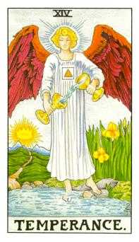
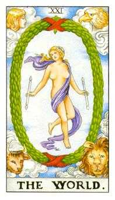
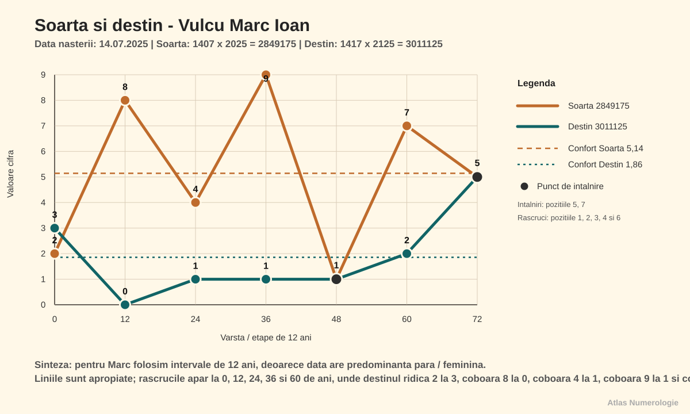
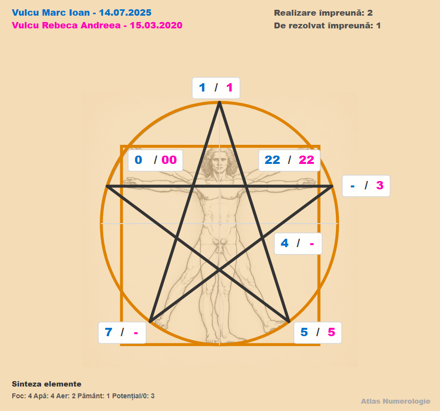

Index: VMI-20250714-v1.00r-CAP-001

# Vulcu Marc Ioan — 14.07.2025

Index: VMI-20250714-v1.00r-CAP-002

## Date generale

Index: VMI-20250714-v1.00r-L-001

- Persoana analizată: Vulcu Marc Ioan
- Prenume activ: Marc
- Data nașterii: 14.07.2025
- Ora nașterii: 14:26
- Gen: masculin
- Nume anterior: nu există
- Relație analizată: Vulcu Rebeca Andreea, soră, născută la 15.03.2020
- Template selectat: scurt
- Stil de redactare: conversațional
- Interval analizat: 0–108 ani
- Data lucrării: 08.08.2026
- Versiune: V1.00R

Index: VMI-20250714-v1.00r-CAP-003

## Cuprins

Index: VMI-20250714-v1.00r-L-002

1. Vibrația interioară — Cine ești tu?
2. Vibrația exterioară — Rolul social
3. Destinul — Muntele de urcat
4. Matrița numerologică — Pătratul lui Pitagora
5. Numele — Eu și neamul
6. Spirit și karmă — Lecții și direcții de maturizare
7. Pinacluri: Oportunități și provocări
8. Ciclicități
9. Relații
10. Aplicabilitate profesională
11. Concluzii

Index: VMI-20250714-v1.00r-CAP-005

## Capitolul 1. Vibrația interioară — Cine ești tu?

Index: VMI-20250714-v1.00r-SUB-001

### 1.1. Definiție

Index: VMI-20250714-v1.00r-P-001

Marc, vibrația interioară vorbește despre desăvârșirea caracterului și descrie natura ta lăuntrică: cine ești când nu te vede nimeni și nu trebuie să răspunzi așteptărilor din exterior. Ea arată cum primești și interpretezi ceea ce vine către tine, ce îți dorești cu adevărat, ce simți și cum înveți. De aici pornesc motivațiile și reacțiile tale autentice. Cunoscând această vibrație, îți poți recunoaște mai ușor punctele forte, slăbiciunile și direcțiile în care ai nevoie să te dezvolți.

Index: VMI-20250714-v1.00r-C-001

> [!example] Calcul
> Ziua din data de naștere = **14** → 1 + 4 = **5**

Index: VMI-20250714-v1.00r-SUB-002

### 1.2. Caracterul

Index: VMI-20250714-v1.00r-P-002

Caracterul **5** este curios, mobil și receptiv la noutate. Arhetipal, te apropii de Explorator: observi repede ce se schimbă și înveți când ai voie să încerci. Maturizarea apare când libertatea are un cadru suficient de clar încât experiența să poată fi dusă până la capăt.

Index: VMI-20250714-v1.00r-SUB-003

### 1.3. Dorințele

Index: VMI-20250714-v1.00r-P-003

Îți dorești varietate, mișcare și spațiu pentru descoperire. Te hrănesc jocurile care au mai multe soluții, poveștile, deplasarea și posibilitatea de a alege între două variante potrivite vârstei tale.

Index: VMI-20250714-v1.00r-SUB-004

### 1.4. Motivația

Index: VMI-20250714-v1.00r-P-004

Te motivează noutatea și rezultatul vizibil. O rutină utilă este să alegi o activitate scurtă, să o termini și abia apoi să treci la următoarea; astfel, curiozitatea nu se transformă în risipire.

Index: VMI-20250714-v1.00r-SUB-005

### 1.5. Teama

Index: VMI-20250714-v1.00r-P-005

Umbra lui **5** este senzația că regula sau repetarea îți ia libertatea. Când devii neliniștit, ai nevoie de limite explicate simplu și de o alternativă acceptabilă, nu de multe opțiuni care te pot copleși.

Index: VMI-20250714-v1.00r-SUB-006

### 1.6. Polarități și maturizare

Index: VMI-20250714-v1.00r-T-009

|  |  |
| --- | --- |
| **Polarități pozitive** | curiozitate; adaptare; curaj de a încerca; mobilitate; învățare prin experiență |
| **Polarități negative** | nerăbdare; schimbarea rapidă a direcției; refuzul rutinei; suprastimulare |
| **Direcții de dezvoltare** | libertate cu limite; activități încheiate; alternanță între mișcare și repaus; alegeri puține și clare |

Index: VMI-20250714-v1.00r-CAP-006

## Capitolul 2. Vibrația exterioară — Rolul social

Index: VMI-20250714-v1.00r-SUB-008

### 2.1. Definiție

Index: VMI-20250714-v1.00r-P-006

Vibrația exterioară descrie felul în care te manifești în lume: prezența, comportamentul vizibil, imaginea socială și modul în care ceilalți îți pot percepe energia. Dacă vibrația interioară arată dinamica ta privată, vibrația exterioară arată forma prin care aceasta devine vizibilă în relații, contexte sociale și situații concrete. Ea nu spune totul despre caracter, dar indică stilul tău de apariție, reacția spontană în exterior și felul în care îți proiectezi energia. Citește-o ca pe o poartă de contact cu lumea: poate confirma vibrația interioară sau poate crea un contrast între ceea ce trăiești înăuntru și ceea ce observă ceilalți.

Index: VMI-20250714-v1.00r-C-002

> [!example] Calcul
> Luna din data de naștere = **7**

Index: VMI-20250714-v1.00r-SUB-009

### 2.2. Rolul social

Index: VMI-20250714-v1.00r-P-007

Arhetipal, rolul social **7** seamănă cu Observatorul: înainte să participi, poți privi, asculta și verifica dacă mediul este sigur. Resursa este profunzimea; umbra este retragerea atunci când ritmul exterior devine prea intens.

Index: VMI-20250714-v1.00r-SUB-010

### 2.3. Interior și exterior

Index: VMI-20250714-v1.00r-P-008

Marc, dacă în interior ești **5**, la exterior oamenii te pot percepe ca pe un **7**. Înăuntru vrei mișcare și varietate, iar în afară poți părea mai prudent. Cele două energii se armonizează când ai timp să observi înainte de a explora.

Index: VMI-20250714-v1.00r-P-009

Puntea interior–exterior arată ajustarea dintre nucleul tău mobil și imaginea mai rezervată pe care o văd ceilalți.

Index: VMI-20250714-v1.00r-C-003

> [!example] Calculul punții interior–exterior
> |**5** − **7**| = **2**

Index: VMI-20250714-v1.00r-P-010

Puntea **2** cere cooperare, răbdare și autenticitate emoțională. Când poți spune sau arăta ce ai nevoie, comportamentul tău devine coerent cu intenția, iar oamenii te pot primi fără ezitare în rolul pe care îl asumi.

Index: VMI-20250714-v1.00r-CAP-007

## Capitolul 3. Destinul — Muntele de urcat

Index: VMI-20250714-v1.00r-SUB-011

### 3.1. Definiție și calcul

Index: VMI-20250714-v1.00r-P-011

Destinul sintetizează data completă și arată o direcție de maturizare, nu un eveniment obligatoriu. Pentru destin păstrăm accentul pe rezultatul final.

Index: VMI-20250714-v1.00r-C-004

> [!example] Calcul
> Toate cifrele adunate din data de naștere = 1 + 4 + 0 + 7 + 2 + 0 + 2 + 5 = **21**  
> Destin compus: 2 + 1 = **3**  
> Cifra de interpretare = **3**

Index: VMI-20250714-v1.00r-SUB-012

### 3.2. Interpretare

Index: VMI-20250714-v1.00r-P-012

Muntele tău de urcat este exprimarea: să transformi experiența lui **5** și observația lui **7** în cuvânt, imagine, joc sau proiect. Destinul **3** se maturizează prin claritate și continuitate, nu prin cantitatea ideilor începute.

Index: VMI-20250714-v1.00r-CAP-008

## Capitolul 4. Matrița numerologică — Pătratul lui Pitagora

Index: VMI-20250714-v1.00r-SUB-013

### 4.1. Matricea datei de naștere

Index: VMI-20250714-v1.00r-P-013

Cele nouă căsuțe se citesc din data compactă și din numerele de lucru și descriu nouă forme de inteligență:

- **1** — inteligența psihică;
- **2** — inteligența emoțională;
- **3** — prelucrarea informațiilor;
- **4** — inteligența corporală;
- **5** — inteligența intuitivă;
- **6** — pragmatismul;
- **7** — inteligența spirituală;
- **8** — puterea și inteligența socială;
- **9** — inteligența mentală.

Index: VMI-20250714-v1.00r-C-005

> [!example] Calcul
> Data compactă = **14072025**  
> N1 = **21**; N2 = **3**; N3 = **19**; N4 = **10**  
> Șir complet = **140720252131910**

Index: VMI-20250714-v1.00r-G-002

1

1111

optim 111

<svg viewBox="0 0 40 32" role="img"><rect x="8" y="4" width="24" height="24"/></svg>

4

4

optim 44

<svg viewBox="0 0 40 32" role="img"><circle cx="20" cy="16" r="6"/></svg>

7

7

optim 7

<svg viewBox="0 0 40 32" role="img"><circle cx="20" cy="16" r="6"/></svg>

2

222

optim 222

<svg viewBox="0 0 40 32" role="img"><polygon points="20,4 33,27 7,27"/></svg>

5

5

optim 55

<svg viewBox="0 0 40 32" role="img"><circle cx="20" cy="16" r="6"/></svg>

8

-

optim 8

3

3

optim 333

<svg viewBox="0 0 40 32" role="img"><circle cx="20" cy="16" r="6"/></svg>

6

-

optim 66

9

9

optim 9

<svg viewBox="0 0 40 32" role="img"><circle cx="20" cy="16" r="6"/></svg>

Index: VMI-20250714-v1.00r-P-014

**Căsuța 1.** Reprezintă psihicul, inițiativa, voința și capacitatea de a susține o direcție. Ai **4** apariții în căsuța cifrei **1**, ceea ce indică o forță psihică intensă și un potențial natural de leadership. Poți porni repede, poți rămâne ferm când apare presiunea și îi poți ajuta pe ceilalți să vadă ce urmează. Umbra acestei intensități apare când fermitatea devine încăpățânare, când vrei ca lucrurile să se facă numai în ritmul tău sau când ocupi tot spațiul deciziei. Maturizarea înseamnă să îți păstrezi inițiativa, dar să asculți până la capăt, să împarți responsabilitatea și să folosești autoritatea pentru a mobiliza, nu pentru a controla.

Index: VMI-20250714-v1.00r-P-015

**Căsuța 2.** Reprezintă emoțiile, comunicarea, sensibilitatea, colaborarea și felul în care energia circulă între tine și ceilalți. Ai **3** apariții în căsuța cifrei **2**, astfel încât registrul emoțional este activ și receptiv: poți simți repede atmosfera și poți răspunde firesc nevoii de apropiere. Această sensibilitate te ajută în cooperare, dar poate amplifica reacțiile atunci când mediul este agitat sau când nu găsești cuvintele potrivite pentru ceea ce simți. Umbra poate apărea ca suprasolicitare emoțională, nerăbdare în dialog ori tendința de a prelua starea celuilalt. Te echilibrează un limbaj simplu al emoțiilor, pauzele de reglare, limitele blânde și relațiile în care poți spune clar ce simți și ce ai nevoie.

Index: VMI-20250714-v1.00r-P-016

**Căsuța 3.** Reprezintă relaționarea, curiozitatea și capacitatea de a primi, organiza și transmite informația. Ai **1** apariție în căsuța cifrei **3**, ceea ce îți oferă acces direct la această energie, dar cere folosire conștientă pentru a deveni stabilă. Poți înțelege prin poveste, joc, imagine și dialog, mai ales când informația are un fir clar și un scop concret. Umbra poate fi graba de a trece la altă idee înainte ca prima să fie înțeleasă sau dificultatea de a explica ceea ce ai intuit deja. Te ajută să repeți cu propriile cuvinte, să pui întrebări, să alegi informația esențială și să duci o idee până la o concluzie înainte de a deschide alta.

Index: VMI-20250714-v1.00r-P-017

**Căsuța 4.** Reprezintă corpul, sănătatea în lectura simbolică a matricei, organizarea, spiritul practic și orientarea către rezultate concrete. Ai **1** apariție în căsuța cifrei **4**, ceea ce arată că poți construi ordine și stabilitate atunci când ai un cadru clar. Îți priesc activitățile în care vezi progresul, lucrezi cu mâinile sau transformi o idee într-un rezultat observabil. Umbra apare când rutina este abandonată prea repede, iar energia intensă a inițiativei te face să sari peste pașii mici. Maturizarea acestei căsuțe se sprijină pe somn, mișcare, alimentație echilibrată, sarcini simple și obiceiuri repetate, fără a transforma disciplina într-o formă rigidă.

Index: VMI-20250714-v1.00r-P-018

**Căsuța 5.** Reprezintă libertatea, stima de sine, curajul, adaptarea, nonconformismul și capacitatea de a ieși din tipare. Ai **1** apariție în căsuța cifrei **5**, ceea ce îți oferă impulsul de a explora și de a încerca o cale proprie. Resursa este flexibilitatea: poți descoperi soluții noi atunci când ai voie să experimentezi și să înveți direct din consecințe. Umbra poate fi confundarea libertății cu lipsa limitelor, schimbarea direcției din impuls sau căutarea permanentă a stimulului nou. Energia se maturizează când alegi singur între câteva opțiuni clare, îți asumi rezultatul și revii la un punct stabil după fiecare explorare.

Index: VMI-20250714-v1.00r-P-019

**Căsuța 6.** Reprezintă iubirea ca ocrotire, instinctele, arta, realismul și pragmatismul. Nu ai nicio apariție în căsuța cifrei **6**, de aceea această energie este conservată: nu este disponibilă constant la cerere și se poate manifesta alternativ, foarte intens într-un context și foarte puțin în altul. Poți avea nevoie de exemple concrete pentru a transforma afecțiunea în grijă practică, inspirația în lucru terminat și dorința într-o alegere realistă. Aportul extern vine prin familie, educatori, activități artistice, sarcini potrivite vârstei și contexte în care vezi legătura dintre efort și rezultat. Construiești conștient această energie prin responsabilități mici, rutine repetabile, participare la viața familiei și învățarea diferenței dintre a ocroti și a prelua totul asupra ta.

Index: VMI-20250714-v1.00r-P-020

**Căsuța 7.** Reprezintă observația, analiza, studiul, experimentarea și capacitatea de a lega cunoașterea concretă de sens. Ai **1** apariție în căsuța cifrei **7**, ceea ce îți oferă o energie activă de cercetător: poți vedea detalii, poți urmări cum funcționează lucrurile și poți învăța din încercare. Resursa este discernământul care se formează atunci când ai timp să observi înainte de a trage concluzia. Umbra poate fi retragerea excesivă, neîncrederea sau păstrarea întrebărilor numai pentru tine. Te ajută momentele de liniște urmate de dialog, experimentele practice, lectura și încurajarea de a explica ce ai descoperit, nu doar de a păstra concluzia în interior.

Index: VMI-20250714-v1.00r-P-021

**Căsuța 8.** Reprezintă puterea, responsabilitatea, ambiția, performanța și capacitatea de a administra resurse ori roluri sociale. Nu ai nicio apariție în căsuța cifrei **8**, astfel încât această energie este conservată și are nevoie de contexte potrivite pentru a fi activată. Poți oscila între evitarea responsabilității și asumarea prea intensă atunci când vrei să dovedești că poți. Aportul extern sănătos vine prin adulți echitabili, reguli explicate, sarcini cu început și final și feedback care separă valoarea ta de rezultat. Maturizarea se construiește treptat: îți asumi partea ta, înveți să ceri ajutor, administrezi resurse mici și descoperi că puterea reală înseamnă consecvență și responsabilitate, nu presiune sau control.

Index: VMI-20250714-v1.00r-P-022

**Căsuța 9.** Reprezintă inteligența mentală, memoria, compasiunea, învățarea, finalizarea și capacitatea de transformare. Ai **1** apariție în căsuța cifrei **9**, ceea ce îți oferă acces la înțelegerea de ansamblu și la legarea experiențelor într-o concluzie. Poți învăța bine atunci când informația are sens, este asociată unei povești și poate fi folosită într-o situație reală. Umbra apare când imaginea mare te face să treci prea repede peste detalii sau când o concluzie intuită nu este verificată. Îți dezvolți această energie prin lectură, conversație, recapitulare, proiecte duse până la capăt și exercițiul de a spune nu doar ce ai înțeles, ci și pe ce observații se bazează.

Index: VMI-20250714-v1.00r-SUB-015

### 4.3. Elemente și temperament

Index: VMI-20250714-v1.00r-T-012

Foc<strong>6</strong>

Pământ<strong>1</strong>

Aer<strong>2</strong>

Apă<strong>3</strong>

Index: VMI-20250714-v1.00r-P-023

Temperamentul este predominant **coleric**: Focul **6** pornește repede, Apa **3** adaugă sensibilitate, Aerul **2** susține ideea, iar Pământul **1** cere ancorare prin corp și rutină.

Index: VMI-20250714-v1.00r-SUB-016

### 4.4. Masculin și feminin

Index: VMI-20250714-v1.00r-P-024

Raportul este de **8 cifre impare** la **4 cifre pare**. Energia de inițiativă este dominantă; capacitatea de a primi și de a da mai departe există, dar trebuie susținută prin cooperare și pauze de reglare.

Index: VMI-20250714-v1.00r-SUB-017

### 4.5. Daruri și nevoi

Index: VMI-20250714-v1.00r-P-025

Vectorii plini sunt **123 — Energie**, **147 — Spiritualitate**, **159 — Carieră** și **357 — Scopuri**. Fixația **147** cere flexibilitate în convingeri, iar tendința **159** cere ca ambiția să fie legată de un scop folositor.

Index: VMI-20250714-v1.00r-SUB-018

### 4.6. Scara bunăstării

Index: VMI-20250714-v1.00r-P-026

Treapta dominantă este **159 — Carieră (18)**, urmată de **789 — Creativitate (16)** și de **147 — Spiritualitate** împreună cu **357 — Scopuri (15)**. Lanțul devine stabil când energia primește structură și finalizare.

Index: VMI-20250714-v1.00r-G-004

Vector 159 — Cariera18

Vector 789 — Creativitate16

Vector 147 — Spiritualitate15

Vector 357 — Scopuri15

Vector 123 — Energie13

Vector 369 — Bunastare materiala12

Vector 258 — Social11

Vector 456 — Vointa9

<i class="element-dot element-foc"></i>Căsuța 99

<i class="element-dot element-aer"></i>Căsuța 77

<i class="element-dot element-apa"></i>Căsuța 26

<i class="element-dot element-foc"></i>Căsuța 55

<i class="element-dot element-foc"></i>Căsuța 14

<i class="element-dot element-pamant"></i>Căsuța 44

<i class="element-dot element-aer"></i>Căsuța 33

<i class="element-dot element-apa"></i>Căsuța 60

<i class="element-dot element-pamant"></i>Căsuța 80

<i class="element-dot element-foc"></i>Foc<i class="element-dot element-pamant"></i>Pământ<i class="element-dot element-apa"></i>Apă<i class="element-dot element-aer"></i>Aer

Index: VMI-20250714-v1.00r-CAP-009

## Capitolul 5. Numele — Eu și neamul

Index: VMI-20250714-v1.00r-SUB-019

### 5.1. Numărul activ

Index: VMI-20250714-v1.00r-P-026a

Numărul activ descrie influența prenumelui folosit zi de zi asupra comportamentului curent. El arată energia cu care Marc intră spontan într-un context, felul în care reacționează și impresia pe care o susține prin acțiunile sale obișnuite.

Index: VMI-20250714-v1.00r-C-006

> [!example] Calcul
> Marc = 4 + 1 + 9 + 3 = **17** → **8**

Index: VMI-20250714-v1.00r-P-027

Numărul activ **8** aduce hotărâre, simț al rezultatului și dorința de a stăpâni o sarcină. Maturizarea cere folosirea puterii fără rigiditate.

Index: VMI-20250714-v1.00r-SUB-020

### 5.2. Numărul intim

Index: VMI-20250714-v1.00r-P-027a

Numărul intim se calculează din vocalele numelui complet și descrie motivația afectivă, dorințele profunde și ceea ce îi hrănește lumea interioară. Dacă Numărul activ arată energia vizibilă a reacției, Numărul intim arată nevoia discretă care îi dă sens alegerilor.

Index: VMI-20250714-v1.00r-C-007

> [!example] Calcul
> Vocalele numelui = **23** → **5**

Index: VMI-20250714-v1.00r-P-028

Numărul intim **5** caută libertate, experiență și varietate. Te hrănește explorarea, dar siguranța apare când știi unde te întorci.

Index: VMI-20250714-v1.00r-SUB-021

### 5.3. Numărul ereditar

Index: VMI-20250714-v1.00r-P-028a

Numărul ereditar se extrage din numele de familie și indică resursele, reflexele și temele simbolice transmise prin linia de neam. El nu stabilește un destin fix, ci arată fondul moștenit pe care Marc îl poate continua, transforma sau depăși conștient.

Index: VMI-20250714-v1.00r-C-008

> [!example] Calcul
> Vulcu = **16** → **7**

Index: VMI-20250714-v1.00r-P-029

Numărul ereditar **7** aduce o memorie de neam legată de observație, discreție, cercetare și căutarea adevărului.

Index: VMI-20250714-v1.00r-SUB-022

### 5.4. Numărul ereditar karmic

Index: VMI-20250714-v1.00r-P-029a

Numărul ereditar karmic citește numele de familie în intervalul simbolic **1–22** și evidențiază o lecție arhetipală a neamului. El arată ce tipar cere înțelegere și maturizare, astfel încât resursele moștenite să fie folosite fără repetarea automată a limitelor trecutului.

Index: VMI-20250714-v1.00r-C-009

> [!example] Calcul în intervalul 1–22
> Vulcu = **16** → Arcana **16 — Turnul**

Index: VMI-20250714-v1.00r-T-013

| Arcana | Interpretare |
| --- | --- |
|  | <ul><li><strong>Resursă:</strong> capacitatea de a vedea ce nu mai este stabil și de a identifica punctul care trebuie refăcut.</li><li><strong>Manifestare:</strong> curajul de a reconstrui sincer, de a încerca din nou și de a căuta o bază mai sigură.</li><li><strong>Umbră:</strong> reacția bruscă la schimbare, încăpățânarea sau păstrarea unei forme care nu mai funcționează.</li><li><strong>Maturizare:</strong> construirea siguranței interioare și acceptarea schimbării ca etapă de curățare și refacere.</li></ul> |

Index: VMI-20250714-v1.00r-SUB-023

### 5.5. Numărul de realizare

Index: VMI-20250714-v1.00r-P-029b

Numărul de realizare se calculează din consoanele numelui complet și descrie comportamentul vizibil, manierele și felul în care Marc este perceput de ceilalți. El arată prin ce calități poate transforma potențialul interior în rezultate concrete și unde această expresie exterioară poate deveni rigidă.

Index: VMI-20250714-v1.00r-C-010

> [!example] Calcul
> Consoanele numelui = **31** → **4**

Index: VMI-20250714-v1.00r-P-030

Numărul de realizare **4** te face vizibil ca persoană care poate ordona, construi și duce lucrurile către o formă concretă.

Index: VMI-20250714-v1.00r-SUB-024

### 5.6. Numărul de exprimare

Index: VMI-20250714-v1.00r-P-030a

Numărul de exprimare reunește toate componentele numelui și descrie direcția în care personalitatea lui Marc se poate dezvolta. El arată cum resursele interioare și imaginea exterioară pot lucra împreună într-o formă matură, coerentă și recognoscibilă.

Index: VMI-20250714-v1.00r-C-011

> [!example] Calcul
> Vulcu **7** + Marc **8** + Ioan **3** = **18** → **9**

Index: VMI-20250714-v1.00r-P-031

Numărul de exprimare **9** susține perspectiva largă, imaginația și compasiunea. Umbra este dispersia; maturizarea cere alegerea unui scop concret.

Index: VMI-20250714-v1.00r-SUB-025

### 5.7. Codul numerologic al numelui

Index: VMI-20250714-v1.00r-P-031a

Codul numerologic al numelui păstrează succesiunea vibrațiilor atribuite fiecărei litere și permite observarea distribuției lor în matrice. Compararea lui cu matricea datei de naștere arată ce energii sunt susținute de nume, ce resurse sunt amplificate și ce zone cer context, exercițiu sau relaționare conștientă.

#### Numele actual — Vulcu Marc Ioan

Index: VMI-20250714-v1.00r-C-012

> [!example] Calcul
> Vulcu: **43333** → 16 → 7  
> Marc: **4193** → 17 → 8  
> Ioan: **9615** → 21 → 3  
> Codul literelor numelui = **4333341939615**  
> Codul numerologic personal al numelui = **9**

Index: VMI-20250714-v1.00r-G-002a

data 1111

11

optim 111

<svg viewBox="0 0 40 32" role="img"><line x1="17.1" y1="16" x2="22.9" y2="16" style="stroke-linecap:butt"/><circle cx="10" cy="16" r="6"/><circle cx="30" cy="16" r="6"/></svg>

data 4

44

optim 44

<svg viewBox="0 0 40 32" role="img"><line x1="17.1" y1="16" x2="22.9" y2="16" style="stroke-linecap:butt"/><circle cx="10" cy="16" r="6"/><circle cx="30" cy="16" r="6"/></svg>

data 7

-

optim 7

data 222

-

optim 222

data 5

5

optim 55

<svg viewBox="0 0 40 32" role="img"><circle cx="20" cy="16" r="6"/></svg>

data -

-

optim 8

data 3

33333

optim 333

<svg viewBox="0 0 40 32" role="img"><polygon points="20,3 24,13 35,13 26,20 30,30 20,24 10,30 14,20 5,13 16,13"/></svg>

data -

6

optim 66

<svg viewBox="0 0 40 32" role="img"><circle cx="20" cy="16" r="6"/></svg>

data 9

999

optim 9

<svg viewBox="0 0 40 32" role="img"><polygon points="20,4 33,27 7,27"/></svg>

Index: VMI-20250714-v1.00r-P-032

Matricea numelui susține nativ energiile **1**, **3**, **4**, **5** și **9**. Energiile native **2** și **7** nu sunt susținute de nume și au nevoie de context relațional și reflecție conștientă.

Index: VMI-20250714-v1.00r-CAP-010

## Capitolul 6. Spirit și karmă — Lecții și direcții de maturizare

Index: VMI-20250714-v1.00r-SUB-026

### 6.1. Codul Spiritului și vârsta Spiritului

Index: VMI-20250714-v1.00r-C-013

> [!example] Calcul
> 55 − 14 − (2 × 7) = **27**  
> Subetapa = **1 — Început de cale**  
> Vârsta Spiritului la naștere = **4914**; la 08.08.2026 = **4915**

Index: VMI-20250714-v1.00r-T-017

| Ziua | I | II | III | IV | V | VI | VII | VIII | IX | X | XI | XII |
| --- | ---: | ---: | ---: | ---: | ---: | ---: | ---: | ---: | ---: | ---: | ---: | ---: |
| 1 | 52 | 50 | 48 | 46 | 44 | 42 | 40 | 38 | 36 | 34 | 32 | 30 |
| 2 | 51 | 49 | 47 | 45 | 43 | 41 | 39 | 37 | 35 | 33 | 31 | 29 |
| 3 | 50 | 48 | 46 | 44 | 42 | 40 | 38 | 36 | 34 | 32 | 30 | 28 |
| 4 | 49 | 47 | 45 | 43 | 41 | 39 | 37 | 35 | 33 | 31 | 29 | 27 |
| 5 | 48 | 46 | 44 | 42 | 40 | 38 | 36 | 34 | 32 | 30 | 28 | 26 |
| 6 | 47 | 45 | 43 | 41 | 39 | 37 | 35 | 33 | 31 | 29 | 27 | 25 |
| 7 | 46 | 44 | 42 | 40 | 38 | 36 | 34 | 32 | 30 | 28 | 26 | 24 |
| 8 | 45 | 43 | 41 | 39 | 37 | 35 | 33 | 31 | 29 | 27 | 25 | 23 |
| 9 | 44 | 42 | 40 | 38 | 36 | 34 | 32 | 30 | 28 | 26 | 24 | 22 |
| 10 | 43 | 41 | 39 | 37 | 35 | 33 | 31 | 29 | 27 | 25 | 23 | 21 |
| 11 | 42 | 40 | 38 | 36 | 34 | 32 | 30 | 28 | 26 | 24 | 22 | 20 |
| 12 | 41 | 39 | 37 | 35 | 33 | 31 | 29 | 27 | 25 | 23 | 21 | 19 |
| 13 | 40 | 38 | 36 | 34 | 32 | 30 | 28 | 26 | 24 | 22 | 20 | 18 |
| 14 | 39 | 37 | 35 | 33 | 31 | 29 | 27 | 25 | 23 | 21 | 19 | 17 |
| 15 | 38 | 36 | 34 | 32 | 30 | 28 | 26 | 24 | 22 | 20 | 18 | 16 |
| 16 | 37 | 35 | 33 | 31 | 29 | 27 | 25 | 23 | 21 | 19 | 17 | 15 |
| 17 | 36 | 34 | 32 | 30 | 28 | 26 | 24 | 22 | 20 | 18 | 16 | 14 |
| 18 | 35 | 33 | 31 | 29 | 27 | 25 | 23 | 21 | 19 | 17 | 15 | 13 |
| 19 | 34 | 32 | 30 | 28 | 26 | 24 | 22 | 20 | 18 | 16 | 14 | 12 |
| 20 | 33 | 31 | 29 | 27 | 25 | 23 | 21 | 19 | 17 | 15 | 13 | 11 |
| 21 | 32 | 30 | 28 | 26 | 24 | 22 | 20 | 18 | 16 | 14 | 12 | 10 |
| 22 | 31 | 29 | 27 | 25 | 23 | 21 | 19 | 17 | 15 | 13 | 11 | 9 |
| 23 | 30 | 28 | 26 | 24 | 22 | 20 | 18 | 16 | 14 | 12 | 10 | 8 |
| 24 | 29 | 27 | 25 | 23 | 21 | 19 | 17 | 15 | 13 | 11 | 9 | 7 |
| 25 | 28 | 26 | 24 | 22 | 20 | 18 | 16 | 14 | 12 | 10 | 8 | 6 |
| 26 | 27 | 25 | 23 | 21 | 19 | 17 | 15 | 13 | 11 | 9 | 7 | 5 |
| 27 | 26 | 24 | 22 | 20 | 18 | 16 | 14 | 12 | 10 | 8 | 6 | 4 |
| 28 | 25 | 23 | 21 | 19 | 17 | 15 | 13 | 11 | 9 | 7 | 5 | 3 |
| 29 | 24 |  | 20 | 18 | 16 | 14 | 12 | 10 | 8 | 6 | 4 | 2 |
| 30 | 23 |  | 19 | 17 | 15 | 13 | 11 | 9 | 7 | 5 | 3 | 1 |
| 31 | 22 |  | 18 |  | 14 |  | 10 | 8 |  | 4 |  | 0 |

Index: VMI-20250714-v1.00r-T-018

| Zona | Interval cod | Nivel simbolic | Teme principale |
| --- | --- | --- | --- |
| Iubire | 1-13 | 0-2.500 ani | relații, emoții, atașamente, compasiune, vulnerabilitate |
| Rațiune | 14-26 | 2.500-5.000 ani | logică, discernământ, structură, analiză, minte |
| Material | 27-39 | 5.000-7.500 ani | bani, construcție, putere, manifestare, responsabilitate |
| Haruri | 40-52 | 7.500-10.000 ani | înțelepciune, haruri spirituale, ghidare, serviciu, intuiție |

Index: VMI-20250714-v1.00r-T-019

<table class="stage-table">
<colgroup><col style="width:7%"><col style="width:22%"><col style="width:8%"><col style="width:18%"><col style="width:45%"></colgroup>
<thead><tr><th>Etapă</th><th>Descriere etapă</th><th>Subetapă</th><th>Lecție</th><th>Descriere subetapă</th></tr></thead>
<tbody>
<tr class="stage-love current-row"><td rowspan="4">1</td><td rowspan="4">Înțelegere și stabilizare</td><td class="current-substage">1</td><td class="current-substage">Început de cale</td><td class="current-substage">Înțeleg cine sunt și ce am de făcut pe pământ.</td></tr>
<tr class="stage-love"><td>2</td><td>Interacțiune</td><td>Înțeleg cine sunt și ce am de făcut în raport cu alte persoane.</td></tr>
<tr class="stage-love"><td>3</td><td>Căutarea echilibrului</td><td>Înțeleg echilibrul dintre centru și margini, dintre apropiere și mișcare.</td></tr>
<tr class="stage-love"><td>4</td><td>Stabilitate</td><td>Stabilizez tot ce am înțeles până acum.</td></tr>
<tr class="stage-reason"><td rowspan="4">2</td><td rowspan="4">Experimentare și manifestare</td><td>5</td><td>Schimbare</td><td>Experimentez și învăț ce a rămas de lucrat, dar altfel decât până acum.</td></tr>
<tr class="stage-reason"><td>6</td><td>Prelucrarea karmei</td><td>Balansez, prelucrez ce am acumulat și creez teren stabil pentru o nouă etapă.</td></tr>
<tr class="stage-reason"><td>7</td><td>Depășirea obstacolelor</td><td>Sunt pregătit pentru experiențe mai intense și învăț să nu fug de ele.</td></tr>
<tr class="stage-reason"><td>8</td><td>Succesul</td><td>Culeg roadele a ceea ce am învățat și mă manifest responsabil.</td></tr>
<tr class="stage-material"><td rowspan="4">3</td><td rowspan="4">Finalizare și orientare către ceilalți</td><td>9</td><td>Finalizarea</td><td>Închei ce ține de mine, ca să pot privi dincolo de mine.</td></tr>
<tr class="stage-material"><td>10</td><td>Norocul</td><td>Învăț să primesc, să colaborez și să las viața să mă așeze în contexte potrivite.</td></tr>
<tr class="stage-material"><td>11</td><td>Slujirea</td><td>Îi slujesc pe alții prin experiența și maturitatea acumulată.</td></tr>
<tr class="stage-material"><td>12</td><td>Sacrificiul</td><td>Învăț diferența dintre dăruire conștientă și pierdere de sine.</td></tr>
<tr class="stage-gifts"><td>4</td><td>Examen</td><td>13</td><td>Examenul</td><td>Integrez lecția și trec spre un nivel nou de înțelegere.</td></tr>
</tbody>
</table>

Index: VMI-20250714-v1.00r-P-033

Codul **27** te așază la începutul zonei Materiale. Spiritul învață să transforme curiozitatea în obiect, construcție, rutină și rezultat folositor.

Index: VMI-20250714-v1.00r-SUB-027

### 6.2. Karma din ziua de naștere

Index: VMI-20250714-v1.00r-C-014

> [!example] Calcul
> Ziua **14** → Arcana **14 — Cumpătarea** → karma împlinită **spre 80%**

Index: VMI-20250714-v1.00r-G-001

Index: VMI-20250714-v1.00r-P-034

Cumpătarea cere măsură, dozaj și alternanță între mișcare și repaus. Libertatea devine resursă când are ritm.

Index: VMI-20250714-v1.00r-SUB-028

### 6.3. Karma din luna de naștere

Index: VMI-20250714-v1.00r-C-015

> [!example] Calcul
> Luna nașterii = **7**

Index: VMI-20250714-v1.00r-P-035

Luna **7** cere răbdare, observație și respect pentru timpul interior. Umbra este izolarea; direcția matură este profunzimea împărtășită.

Index: VMI-20250714-v1.00r-SUB-029

### 6.4. Karma din Calea Destinului

Index: VMI-20250714-v1.00r-C-016

> [!example] Calcul
> Calea Destinului = **21** → Arcana **21 — Lumea**

Index: VMI-20250714-v1.00r-G-001a

Index: VMI-20250714-v1.00r-P-036

Calea karmică **21** vorbește despre integrarea experiențelor și închiderea etapelor. Lecția este să vezi ansamblul fără să pierzi pasul concret.

Index: VMI-20250714-v1.00r-SUB-030

### 6.5. Concluzie: direcția de lucru

Index: VMI-20250714-v1.00r-P-037

Direcția comună unește măsura lui **14**, profunzimea lui **7**, integrarea lui **21** și manifestarea codului **27**: explorezi, observi, alegi și dai formă concretă experienței.

Index: VMI-20250714-v1.00r-CAP-011

## Capitolul 7. Pinacluri: Oportunități și provocări

Index: VMI-20250714-v1.00r-C-017

> [!example] Calcul
> Calea Destinului **21** → Destin compus **3**  
> Limita Pinaclului 1: 36 − 3 = **33**  
> Intervale: **0–33 → 34–43 → 44–53 → 54+**

Index: VMI-20250714-v1.00r-T-003

| Pinaclu | Interval | Oportunitate | Provocare |
| --- | --- | ---: | ---: |
| Pinaclul 1 | 0–33 | 3 | 2 |
| Pinaclul 2 | 34–43 | 5 | 4 |
| Pinaclul 3 | 44–53 | 8 | 2 |
| Pinaclul 4 | 54+ | 7 | 2 |

Index: VMI-20250714-v1.00r-P-038

**Pinaclul 1: intervalul 0–33**, Oportunitatea **3** susține expresia și creativitatea, iar Provocarea **2** cere cooperare.

Index: VMI-20250714-v1.00r-P-039

**Pinaclul 2: intervalul 34–43**, Oportunitatea **5** aduce schimbare, iar Provocarea **4** cere structură.

Index: VMI-20250714-v1.00r-P-040

**Pinaclul 3: intervalul 44–53**, Oportunitatea **8** susține autoritatea și resursele, iar Provocarea **2** cere tact.

Index: VMI-20250714-v1.00r-P-041

**Pinaclul 4: intervalul 54+**, Oportunitatea **7** favorizează cunoașterea, iar Provocarea **2** păstrează deschiderea relațională.

Index: VMI-20250714-v1.00r-CAP-012

## Capitolul 8. Ciclicități

Index: VMI-20250714-v1.00r-SUB-031

### 8.1. Soarta și Destinul

Index: VMI-20250714-v1.00r-G-005

Index: VMI-20250714-v1.00r-C-018

> [!example] Numere grafice
> Soartă: 1407 × 2025 = **2849175**  
> Destin: 1417 × 2125 = **3011125**

Index: VMI-20250714-v1.00r-P-042

Marc, în data ta predomină energia impară, astfel încât graficul se citește cu pasul de **10 ani**. Zona de confort și punctele de schimbare sunt repere simbolice; în copilărie se traduc prin ritmul familiei, învățare și siguranță.

Index: VMI-20250714-v1.00r-SUB-032

### 8.2. Anii importanți

Index: VMI-20250714-v1.00r-P-043

Anii interiori descriu momente în care schimbarea pornește din decizii, maturizări și nevoi lăuntrice.

Index: VMI-20250714-v1.00r-P-044

**Șirul anilor importanți interiori:** 2034 → 2043 → 2052 → 2061 → 2070 → 2079 → 2088 → 2097 → 2106 → 2115 → 2124 → 2133.

Index: VMI-20250714-v1.00r-P-045

Anii exteriori descriu schimbări aduse prin contexte, oameni, oportunități sau presiuni care cer adaptare.

Index: VMI-20250714-v1.00r-P-046

**Șirul anilor importanți exteriori:** 2034 → 2043 → 2052 → 2061 → 2070 → 2079 → 2097 → 2115 → 2124 → 2133.

Index: VMI-20250714-v1.00r-SUB-033

### 8.3. Lecțiile de viață

Index: VMI-20250714-v1.00r-C-019

> [!example] Calcul
> 14 × 7 × 2025 = **198450** → lecțiile **1–9–8–4–5–0**

Index: VMI-20250714-v1.00r-T-008

| Vârstă | Lecția 1 — <strong style="font-size: 1.15em; font-weight: 700;">1</strong> | Lecția 2 — <strong style="font-size: 1.15em; font-weight: 700;">9</strong> | Lecția 3 — <strong style="font-size: 1.15em; font-weight: 700;">8</strong> | Lecția 4 — <strong style="font-size: 1.15em; font-weight: 700;">4</strong> | Lecția 5 — <strong style="font-size: 1.15em; font-weight: 700;">5</strong> | Lecția 6 — <strong style="font-size: 1.15em; font-weight: 700;">0</strong> |
| --- | ---: | ---: | ---: | ---: | ---: | ---: |
| 1–6 | 2025 | 2026 | 2027 | 2028 | 2029 | 2030 |
| 7–12 | 2031 | 2032 | 2033 | 2034 | 2035 | 2036 |
| 13–18 | 2037 | 2038 | 2039 | 2040 | 2041 | 2042 |
| 19–24 | 2043 | 2044 | 2045 | 2046 | 2047 | 2048 |
| 25–30 | 2049 | 2050 | 2051 | 2052 | 2053 | 2054 |
| 31–36 | 2055 | 2056 | 2057 | 2058 | 2059 | 2060 |
| 37–42 | 2061 | 2062 | 2063 | 2064 | 2065 | 2066 |
| 43–48 | 2067 | 2068 | 2069 | 2070 | 2071 | 2072 |
| 49–54 | 2073 | 2074 | 2075 | 2076 | 2077 | 2078 |
| 55–60 | 2079 | 2080 | 2081 | 2082 | 2083 | 2084 |

Index: VMI-20250714-v1.00r-P-047

În **2026**, lecția activă este **9**, iar anul personal este **4**. Empatia și imaginația au nevoie de ordine, activități încheiate și reguli blânde.

Index: VMI-20250714-v1.00r-SUB-034

### 8.4. Ciclul de 9 ani

Index: VMI-20250714-v1.00r-T-007

| Ciclu (vârstă) | Anul 1 — început | Anul 2 | Anul 3 | Anul 4 | Anul 5 | Anul 6 | Anul 7 | Anul 8 | Anul 9 — încheiere |
| --- | ---: | ---: | ---: | ---: | ---: | ---: | ---: | ---: | ---: |
| C1 (0–8) | **2025** | 2026 | 2027 | 2028 | 2029 | 2030 | 2031 | 2032 | **2033** |
| C2 (9–17) | **2034** | 2035 | 2036 | 2037 | 2038 | 2039 | 2040 | 2041 | **2042** |
| C3 (18–26) | **2043** | 2044 | 2045 | 2046 | 2047 | 2048 | 2049 | 2050 | **2051** |
| C4 (27–35) | **2052** | 2053 | 2054 | 2055 | 2056 | 2057 | 2058 | 2059 | **2060** |
| C5 (36–44) | **2061** | 2062 | 2063 | 2064 | 2065 | 2066 | 2067 | 2068 | **2069** |
| C6 (45–53) | **2070** | 2071 | 2072 | 2073 | 2074 | 2075 | 2076 | 2077 | **2078** |
| C7 (54–62) | **2079** | 2080 | 2081 | 2082 | 2083 | 2084 | 2085 | 2086 | **2087** |
| C8 (63–71) | **2088** | 2089 | 2090 | 2091 | 2092 | 2093 | 2094 | 2095 | **2096** |
| C9 (72–80) | **2097** | 2098 | 2099 | 2100 | 2101 | 2102 | 2103 | 2104 | **2105** |

Index: VMI-20250714-v1.00r-P-048

Te afli în primul ciclu de 9 ani. Anul personal **4** pune accent pe corp, rutină, siguranță și repere repetate.

Index: VMI-20250714-v1.00r-SUB-035

### 8.5. Ciclul de 12 ani

Index: VMI-20250714-v1.00r-T-015

| Ciclu | Interval calendaristic | Vârste | Citire |
| --- | --- | ---: | --- |
| **Ciclul 1 — activ** | **2025–2036** | **0–11** | Formarea siguranței, a limbajului emoțional și a primelor repere de familie. |
| Ciclul 2 | 2037–2048 | 12–23 | Explorare, autonomie treptată și descoperirea intereselor proprii. |
| Ciclul 3 | 2049–2060 | 24–35 | Extindere prin studiu, relații, experiențe și responsabilități asumate. |
| Ciclul 4 | 2061–2072 | 36–47 | Consolidarea unei forme de viață stabile: profesie, familie și statut. |
| Ciclul 5 | 2073–2084 | 48–59 | Recalibrarea sensului și valorificarea matură a experienței acumulate. |
| Ciclul 6 | 2085–2096 | 60–71 | Transmitere, mentorat și influență exercitată cu discernământ. |
| Ciclul 7 | 2097–2108 | 72–83 | Sinteză, simplificare și întoarcere la ceea ce este esențial. |
| Ciclul 8 | 2109–2120 | 84–95 | Administrarea responsabilă a resurselor și a moștenirii personale. |
| Ciclul 9 | 2121–2132 | 96–107 | Integrarea etapelor parcurse și închiderea lucidă a ciclurilor lungi. |

Index: VMI-20250714-v1.00r-P-049

Ciclul de 12 ani **1**, 2025–2036, este etapa formării fundamentale: familie, somn, joc, limbaj emoțional și primele reguli.

Index: VMI-20250714-v1.00r-CAP-013

## Capitolul 9. Relații

Index: VMI-20250714-v1.00r-L-003

- Nume: Vulcu Rebeca Andreea
- Data nașterii: 15.03.2020
- Tipul relației: soră

Index: VMI-20250714-v1.00r-SUB-036

### 9.1. Omulețul relațiilor

Index: VMI-20250714-v1.00r-G-006

Index: VMI-20250714-v1.00r-C-020

> [!example] Calcul relațional
> Realizare împreună: 5 + 6 = 11 → **2**  
> De rezolvat împreună: |5 − 6| = **1**

Index: VMI-20250714-v1.00r-P-050

Marc, tu aduci mișcarea lui **5**, iar Rebeca grija lui **6**. Potențialul comun **2** cere cooperare și apropiere, iar tema **1** cere ca fiecare să își păstreze identitatea.

Index: VMI-20250714-v1.00r-P-051

Împreună aveți Foc **4**, Apă **4**, Aer **2**, Pământ **1** și potențial **0** de patru ori. Stabilitatea și regulile se construiesc intenționat (4), iar responsabilitatea și puterea primesc sprijin din familie și activități potrivite (8).

Index: VMI-20250714-v1.00r-CAP-014

## Capitolul 10. Aplicabilitate profesională

Index: VMI-20250714-v1.00r-SUB-037

### 10.1. Aplicabilitate profesională

Index: VMI-20250714-v1.00r-P-051a

Aplicabilitatea profesională traduce data nașterii în zona muncii, a învățării și a colaborării. Ea nu stabilește de acum o meserie pentru tine, ci arată energia pe care o poți folosi mai natural, tipul de probleme care îți pot trezi interesul și obstacolul interior care merită recunoscut înainte să îți frâneze dezvoltarea.

Index: VMI-20250714-v1.00r-C-021

> [!example] Calcul
> DA: 7 + 9 = **16**  
> NU: 21 = **21**

Index: VMI-20250714-v1.00r-T-016

| Aplicabilitate profesională DA | Aplicabilitate profesională NU |
| --- | --- |
|  _Arcana 16 — Turnul. Direcția profesională de cultivat_ |  _Arcana 21 — Lumea. Obstacolul profesional de echilibrat_ |
| **Index: VMI-20250714-v1.00r-P-052** Turnul simbolizează capacitatea de a observa repede unde o structură este fragilă și de a avea curajul să o refaci pe o bază mai bună. În plan profesional, această energie te poate susține când trebuie să identifici o eroare, să pui întrebări incomode, să reorganizezi un sistem sau să continui după ce prima soluție nu a funcționat. Poți manifesta această resursă prin curiozitatea de a desface și reconstrui, prin plăcerea de a testa mai multe variante și prin inițiativa de a interveni atunci când ceilalți acceptă prea ușor o problemă.  Turnul favorizează contexte în care analiza și reconstrucția produc un rezultat concret: inginerie, arhitectură, construcții, tehnologie, programare și depanare, securitate informatică, reparații tehnice, cercetare, controlul calității, audit, administrarea riscului sau proiecte de transformare. La vârsta ta, aceste aptitudini pot fi observate fără a alege încă o profesie, prin jocuri de construcție, mecanisme, puzzle-uri, experimente și proiecte în care poți corecta o versiune și încerca din nou.  Condiția de maturizare este să deosebești schimbarea necesară de impulsul de a respinge ori de a dărâma prea repede. Verifică faptele, explică ce nu funcționează și propune o alternativă înainte să rupi forma veche. Când inițiativa este însoțită de răbdare, colaborare și un plan de reconstrucție, Turnul devine talentul de a transforma criza într-o soluție mai sigură și mai folositoare. | **Index: VMI-20250714-v1.00r-P-052a** Când Lumea apare ca obstacol profesional, ea nu indică lipsa talentului, ci dificultatea de a închide un ciclu atunci când vezi prea multe posibilități deodată. Poți imagina foarte clar rezultatul final, dar tocmai imaginea completă te poate face să amâni versiunea intermediară, să cauți încă o îmbunătățire sau să începi alt proiect înainte ca primul să fie terminat. Orizontul larg este o resursă reală, însă devine blocaj dacă fiecare lucrare trebuie să pară completă și impecabilă de la început.  Dispersia, perfecționismul și nevoia de validare pot consuma energia care ar trebui folosită pentru finalizare. Poți fi atras de multe domenii, poți compara un rezultat aflat la început cu realizările mature ale altora sau poți considera că un pas mic nu este suficient de important. În timp, acest tipar poate lăsa proiecte valoroase neterminate, nu pentru că nu ai capacitate, ci pentru că pragul imaginar al reușitei a fost așezat prea departe.  Cheia practică este să definești de la început ce înseamnă „terminat”, să lucrezi în etape scurte și să prezinți versiuni care pot fi îmbunătățite ulterior. Închide un proiect înainte de a deschide altul, cere feedback pentru un rezultat concret și compară progresul cu etapa ta anterioară, nu cu perfecțiunea. Astfel, Lumea încetează să fie presiunea de a cuprinde totul și devine capacitatea matură de a integra ideile, de a vedea ansamblul și de a duce o lucrare până la capăt. |

Index: VMI-20250714-v1.00r-CAP-015

## Capitolul 11. Concluzii

Index: VMI-20250714-v1.00r-SUB-038

### 11.1. Carieră și bani

Index: VMI-20250714-v1.00r-P-053

Marc, potențialul profesional leagă explorarea lui **5**, expresia Destinului **3**, rezultatul Numărului activ **8** și perspectiva Numărului de exprimare **9**. Vectorul **159 — Carieră** este cel mai puternic, dar energiile **6** și **8** sunt conservate în matricea nativă; disciplina, responsabilitatea și relația cu resursele trebuie formate prin exercițiu.

Index: VMI-20250714-v1.00r-P-054

Nu este nevoie să îți fie aleasă acum o meserie. Este mai util să fie observat ce termini cu plăcere, cum repari o problemă și în ce contexte curiozitatea rămâne vie. Libertatea lui **5** primește cadrul lui **4**, iar expresia lui **3** servește perspectiva lui **9**.

Index: VMI-20250714-v1.00r-SUB-039

### 11.2. Iubire și relație

Index: VMI-20250714-v1.00r-P-055

Relația cu sora ta are potențialul **2**, deci crește prin apropiere, cooperare și încredere. Tu aduci noutatea, iar Rebeca poate aduce grijă și continuitate.

Index: VMI-20250714-v1.00r-P-056

Podul **1** vă cere să rămâneți două persoane distincte. Comparațiile puține, limitele identice explicate pe înțelesul fiecăruia, activitățile comune scurte și timpul individual transformă competiția în autonomie sănătoasă.

Index: VMI-20250714-v1.00r-SUB-040

### 11.3. Momentul prezent

Index: VMI-20250714-v1.00r-P-057

Marc, în intervalul actual te afli în primul Pinaclu, cu Oportunitatea **3** și Provocarea **2**, în primul ciclu de 9 ani și în primul ciclu de 12 ani. Anul personal **4** din 2026 cere rutină, corp, siguranță și repere simple, iar Lecția **9** aduce empatie și imaginație. Pentru vârsta ta, sinteza practică este un mediu stabil în care poți explora fără grabă, poți termina activități scurte și poți învăța să numești ceea ce simți.

Index: VMI-20250714-v1.00r-CAP-016

## Documentația și trasabilitatea lucrării

Index: VMI-20250714-v1.00r-T-014

| Resursă | Valoare |
| --- | --- |
| Template | `scurt` — model Bîrsan Daniel Robert v1.00r |
| Raport calculator | `2025-07-14-VULCU-MARC-IOAN-scurt-v1.00r-calculator.json` |
| Grafice integrate | Matrice, Scara bunăstării, Soartă–Destin și Omulețul relațiilor |
| Versiune și data redactării | V1.00R — 08.08.2026 |
