# Chibulcutean Tamara - Lucrare Examen - structurata pe capitole

> Copie de lucru pornita din extractia PDF. Tabelele detectate automat au fost eliminate din fluxul principal pentru a reduce duplicarea; imaginile paginilor raman atasate la fiecare pagina pentru verificare vizuala.


## Rezumat verificare VAULT/Numerologie

- Rubrici verificate si gasite in VAULT/Numerologie: 184.
- Rubrici marcate ca `concept lipsa in VAULT/Numerologie`: 52.
- Rubrici fara referinta deocamdata: 2.
- Campurile provizorii `Calcul pas cu pas: de separat si verificat` si `Rezultat: de confirmat din calculul extras` au fost eliminate din rubricile verificate.
- Pentru fiecare rubrica ramasa in zona de formule sunt pastrate: conceptul, metoda de calcul, calculul, statusul de verificare si pagina sursa.

## Harta capitolelor

- Coperta si cuprins initial: paginile 1-5 (5 pagini)
- Capitolul 1. Introducere: paginile 6-19 (14 pagini)
- Capitolul 2. Formule, calcule, tabele, grafice: paginile 20-89 (70 pagini)
- Capitolul 3. Caracterul: paginile 90-203 (114 pagini)
- Capitolul 4. Transformarea: paginile 204-265 (62 pagini)
- Capitolul 5. Destinul: paginile 266-293 (28 pagini)
- Capitolul 6. Parcursul vietii: paginile 294-368 (75 pagini)
- Capitolul 7. Ajutoare: paginile 369-374 (6 pagini)
- Capitolul 8. Concluzii finale pentru numerologi: paginile 375-389 (15 pagini)
- Capitolul 9. Sfatul numerologului: paginile 390-410 (21 pagini)

## Model de rubrica pentru calcule

Pentru fiecare rubrica de calcul, forma de lucru recomandata este:

- Concept analizat: ce masoara vibratia sau notiunea.
- Metoda de calcul: regula folosita.
- Calcul pas cu pas: operatiile numerice, fara tabel daca nu este necesar.
- Rezultat: vibratia/conceptul obtinut.
- Verificare pagina: pagina/paginile din PDF unde apare calculul.

# Coperta si cuprins initial

_Pagini sursa: 1-5._

## Pagini si text sursa

### Pagina 1

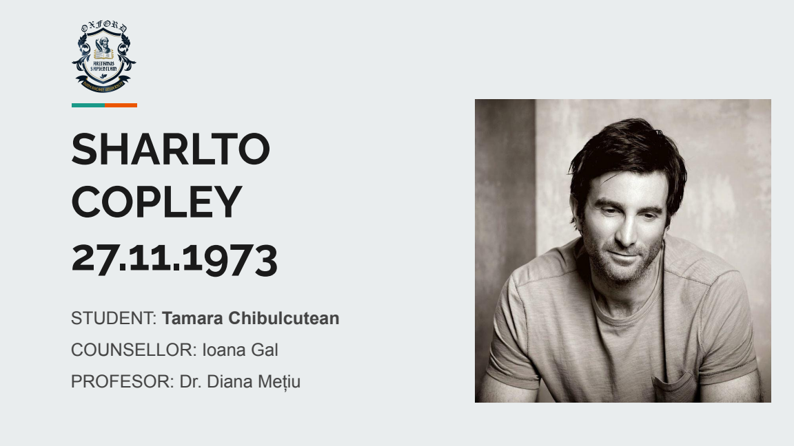

```text
SHARLTO
COPLEY
STUDENT: Tamara Chibulcutean
COUNSELLOR: Ioana Gal
PROFESOR: Dr. Diana Mețiu
```

### Pagina 2


```text
Cuprins
```

### Pagina 3

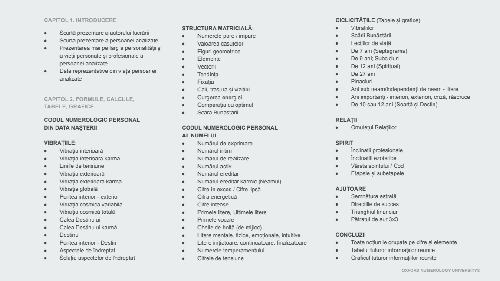

```text
CAPITOL 1. INTRODUCERE CICLICITĂȚILE (Tabele și grafice):
STRUCTURA MATRICIALĂ: ● Vibrațiilor
● Scurtă prezentare a autorului lucrării
● Numerele pare / impare ● Scării Bunăstării
● Scurtă prezentare a persoanei analizate
● Valoarea căsuțelor ● Lecțiilor de viață
● Prezentarea mai pe larg a personalității și
● Figuri geometrice ● De 7 ani (Septagrama)
a vieții personale și profesionale a
● Elemente ● De 9 ani; Subcicluri
persoanei analizate
● Vectorii ● De 12 ani (Spiritual)
● Date reprezentative din viața persoanei
● Tendința ● De 27 ani
analizate
● Fixația ● Pinacluri
● Caii, trăsura și vizitiul ● Ani sub neam/independenți de neam - litere
CAPITOL 2. FORMULE, CALCULE, ● Curgerea energiei ● Ani importanți - interiori, exteriori, criză, răscruce
TABELE, GRAFICE ● Comparația cu optimul ● De 10 sau 12 ani (Soartă și Destin)
● Scara Bunăstării
CODUL NUMEROLOGIC PERSONAL RELAȚII
DIN DATA NAȘTERII CODUL NUMEROLOGIC PERSONAL ● Omulețul Relațiilor
AL NUMELUI
VIBRAȚIILE: ● Numărul de exprimare SPIRIT
● Vibrația interioară ● Numărul intim ● Înclinații profesionale
● Vibrația interioară karmă ● Numărul de realizare ● Înclinațiii ezoterice
● Liniile de tensiune ● Numărul activ ● Vârsta spiritului / Cod
● Vibrația exterioară ● Numărul ereditar ● Etapele și subetapele
● Vibrația exterioară karmă ● Numărul ereditar karmic (Neamul)
● Vibrația globală ● Cifre în exces / Cifre lipsă AJUTOARE
● Puntea interior - exterior ● Cifra energetică ● Semnătura astrală
● Vibrația cosmică variabilă ● Cifre intense ● Direcțiile de succes
● Vibrația cosmică totală ● Primele litere, Ultimele litere ● Triunghiul financiar
● Calea Destinului ● Primele vocale ● Pătratul de aur 3x3
● Calea Destinului karmă ● Cheile de boltă (de mijloc)
● Destinul ● Litere mentale, fizice, emoționale, intuitive CONCLUZII
● Puntea interior - Destin ● Litere inițiatoare, continuatoare, finalizatoare ● Toate noțiunile grupate pe cifre și elemente
● Aspectele de îndreptat ● Numerele temperamentului ● Tabelul tuturor informațiilor reunite
● Soluția aspectelor de îndreptat ● Cifrele de tensiune ● Graficul tuturor informațiilor reunite
OXFORD NUMEROLOGY UNIVERSITY®
```

### Pagina 4

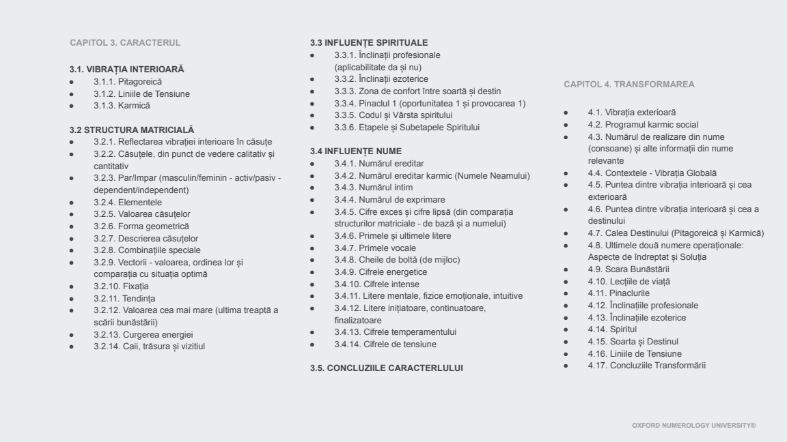

```text
CAPITOL 3. CARACTERUL 3.3 INFLUENȚE SPIRITUALE
● 3.3.1. Înclinații profesionale
3.1. VIBRAȚIA INTERIOARĂ (aplicabilitate da și nu)
● 3.1.1. Pitagoreică ● 3.3.2. Înclinații ezoterice CAPITOL 4. TRANSFORMAREA
● 3.1.2. Liniile de Tensiune ● 3.3.3. Zona de confort între soartă și destin
● 3.1.3. Karmică ● 3.3.4. Pinaclul 1 (oportunitatea 1 și provocarea 1)
● 3.3.5. Codul și Vârsta spiritului ● 4.1. Vibrația exterioară
3.2 STRUCTURA MATRICIALĂ ● 3.3.6. Etapele și Subetapele Spiritului ● 4.2. Programul karmic social
● 4.3. Numărul de realizare din nume
● 3.2.1. Reflectarea vibrației interioare în căsuțe
● 3.2.2. Căsuțele, din punct de vedere calitativ și 3.4 INFLUENȚE NUME (consoane) și alte informații din nume
cantitativ ● 3.4.1. Numărul ereditar relevante
● 3.2.3. Par/Impar (masculin/feminin - activ/pasiv - ● 3.4.2. Numărul ereditar karmic (Numele Neamului) ● 4.4. Contextele - Vibrația Globală
dependent/independent) ● 3.4.3. Numărul intim ● 4.5. Puntea dintre vibrația interioară și cea
● 3.2.4. Elementele ● 3.4.4. Numărul de exprimare exterioară
● 3.2.5. Valoarea căsuțelor ● 3.4.5. Cifre exces și cifre lipsă (din comparația ● 4.6. Puntea dintre vibrația interioară și cea a
● 3.2.6. Forma geometrică structurilor matriciale - de bază și a numelui) destinului
● 3.2.7. Descrierea căsuțelor ● 3.4.6. Primele și ultimele litere ● 4.7. Calea Destinului (Pitagoreică și Karmică)
● 3.2.8. Combinațiile speciale ● 3.4.7. Primele vocale ● 4.8. Ultimele două numere operaționale:
● 3.2.9. Vectorii - valoarea, ordinea lor și ● 3.4.8. Cheile de boltă (de mijloc) Aspecte de îndreptat și Soluția
comparația cu situația optimă ● 3.4.9. Cifrele energetice ● 4.9. Scara Bunăstării
● 3.2.10. Fixația ● 3.4.10. Cifrele intense ● 4.10. Lecțiile de viață
● 3.2.11. Tendința ● 3.4.11. Litere mentale, fizice emoționale, intuitive ● 4.11. Pinaclurile
● 3.2.12. Valoarea cea mai mare (ultima treaptă a ● 3.4.12. Litere inițiatoare, continuatoare, ● 4.12. Înclinațiile profesionale
scării bunăstării) finalizatoare ● 4.13. Înclinațiile ezoterice
● 3.2.13. Curgerea energiei ● 3.4.13. Cifrele temperamentului ● 4.14. Spiritul
● 3.2.14. Caii, trăsura și vizitiul ● 3.4.14. Cifrele de tensiune ● 4.15. Soarta și Destinul
● 4.16. Liniile de Tensiune
3.5. CONCLUZIILE CARACTERLULUI ● 4.17. Concluziile Transformării
OXFORD NUMEROLOGY UNIVERSITY®
```

### Pagina 5

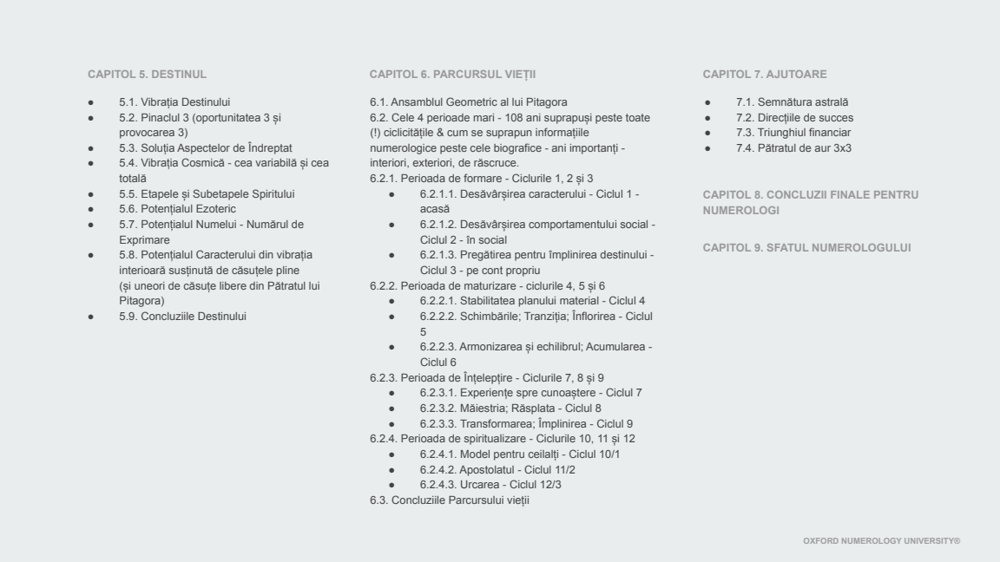

```text
CAPITOL 5. DESTINUL CAPITOL 6. PARCURSUL VIEȚII CAPITOL 7. AJUTOARE
● 5.1. Vibrația Destinului 6.1. Ansamblul Geometric al lui Pitagora ● 7.1. Semnătura astrală
● 5.2. Pinaclul 3 (oportunitatea 3 și 6.2. Cele 4 perioade mari - 108 ani suprapuși peste toate ● 7.2. Direcțiile de succes
provocarea 3) (!) ciclicitățile & cum se suprapun informațiile ● 7.3. Triunghiul financiar
● 5.3. Soluția Aspectelor de Îndreptat numerologice peste cele biografice - ani importanți - ● 7.4. Pătratul de aur 3x3
● 5.4. Vibrația Cosmică - cea variabilă și cea interiori, exteriori, de răscruce.
totală 6.2.1. Perioada de formare - Ciclurile 1, 2 și 3
● 5.5. Etapele și Subetapele Spiritului ● 6.2.1.1. Desăvârșirea caracterului - Ciclul 1 - CAPITOL 8. CONCLUZII FINALE PENTRU
● 5.6. Potențialul Ezoteric acasă NUMEROLOGI
● 5.7. Potențialul Numelui - Numărul de ● 6.2.1.2. Desăvârșirea comportamentului social -
Exprimare Ciclul 2 - în social
CAPITOL 9. SFATUL NUMEROLOGULUI
● 5.8. Potențialul Caracterului din vibrația ● 6.2.1.3. Pregătirea pentru împlinirea destinului -
interioară susținută de căsuțele pline Ciclul 3 - pe cont propriu
(și uneori de căsuțe libere din Pătratul lui 6.2.2. Perioada de maturizare - ciclurile 4, 5 și 6
Pitagora) ● 6.2.2.1. Stabilitatea planului material - Ciclul 4
● 5.9. Concluziile Destinului ● 6.2.2.2. Schimbările; Tranziția; Înflorirea - Ciclul
5
● 6.2.2.3. Armonizarea și echilibrul; Acumularea -
Ciclul 6
6.2.3. Perioada de Înțelepțire - Ciclurile 7, 8 și 9
● 6.2.3.1. Experiențe spre cunoaștere - Ciclul 7
● 6.2.3.2. Măiestria; Răsplata - Ciclul 8
● 6.2.3.3. Transformarea; Împlinirea - Ciclul 9
6.2.4. Perioada de spiritualizare - Ciclurile 10, 11 și 12
● 6.2.4.1. Model pentru ceilalți - Ciclul 10/1
● 6.2.4.2. Apostolatul - Ciclul 11/2
● 6.2.4.3. Urcarea - Ciclul 12/3
6.3. Concluziile Parcursului vieții
OXFORD NUMEROLOGY UNIVERSITY®
```

# Capitolul 1. Introducere

_Pagini sursa: 6-19._

## Pagini si text sursa

### Pagina 6


```text
Introducere
```

### Pagina 7

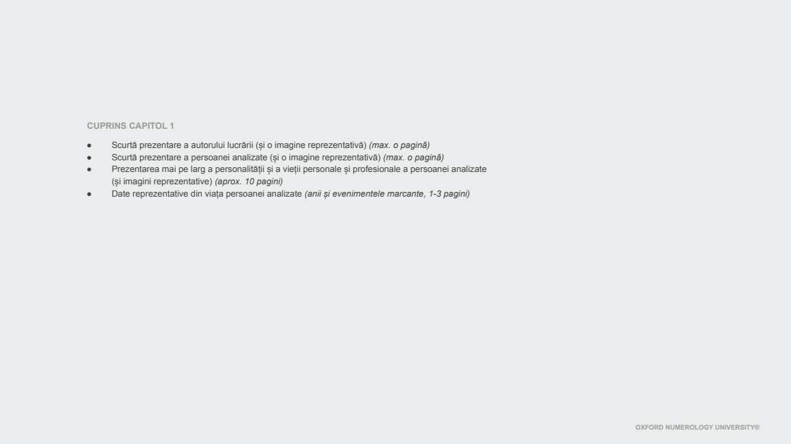

```text
CUPRINS CAPITOL 1
● Scurtă prezentare a autorului lucrării (și o imagine reprezentativă) (max. o pagină)
● Scurtă prezentare a persoanei analizate (și o imagine reprezentativă) (max. o pagină)
● Prezentarea mai pe larg a personalității și a vieții personale și profesionale a persoanei analizate
(și imagini reprezentative) (aprox. 10 pagini)
● Date reprezentative din viața persoanei analizate (anii și evenimentele marcante, 1-3 pagini)
OXFORD NUMEROLOGY UNIVERSITY®
```

### Pagina 8

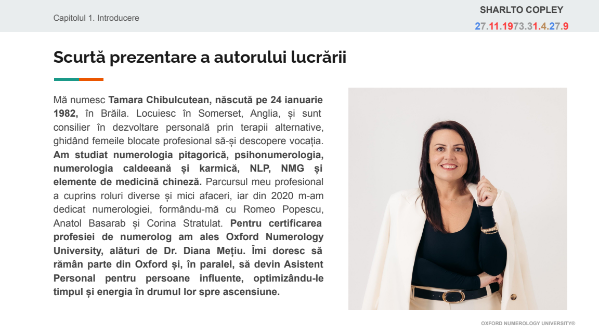

```text
Capitolul 1. Introducere
Scurtă prezentare a autorului lucrării
Mă numesc Tamara Chibulcutean, născută pe 24 ianuarie
1982, în Brăila. Locuiesc în Somerset, Anglia, și sunt
consilier în dezVAULTare personală prin terapii alternative,
ghidând femeile blocate profesional să-și descopere vocația.
Am studiat numerologia pitagorică, psihonumerologia,
numerologia caldeeană și karmică, NLP, NMG și
elemente de medicină chineză. Parcursul meu profesional
a cuprins roluri diverse și mici afaceri, iar din 2020 m-am
dedicat numerologiei, formându-mă cu Romeo Popescu,
Anatol Basarab și Corina Stratulat. Pentru certificarea
profesiei de numerolog am ales Oxford Numerology
University, alături de Dr. Diana Mețiu. Îmi doresc să
rămân parte din Oxford și, în paralel, să devin Asistent
Personal pentru persoane influente, optimizându-le
timpul și energia în drumul lor spre ascensiune.
OXFORD NUMEROLOGY UNIVERSITY®
```

### Pagina 9

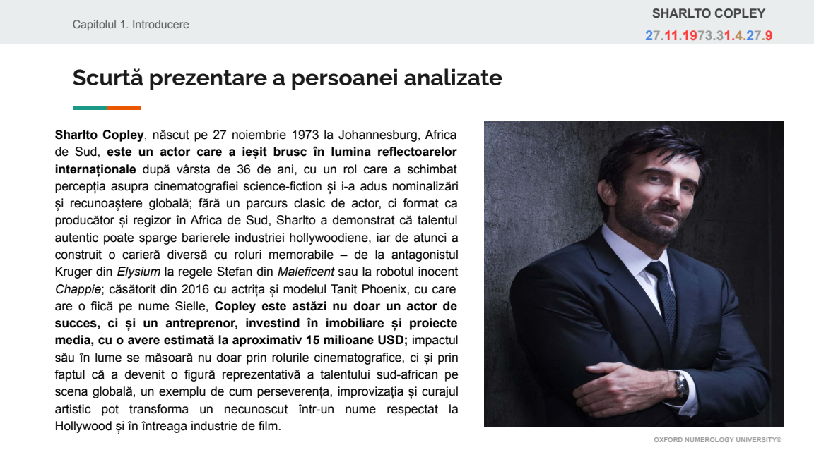

```text
Capitolul 1. Introducere
Scurtă prezentare a persoanei analizate
Sharlto Copley, născut pe 27 noiembrie 1973 la Johannesburg, Africa
de Sud, este un actor care a ieșit brusc în lumina reflectoarelor
internaționale după vârsta de 36 de ani, cu un rol care a schimbat
percepția asupra cinematografiei science-fiction și i-a adus nominalizări
și recunoaștere globală; fără un parcurs clasic de actor, ci format ca
producător și regizor în Africa de Sud, Sharlto a demonstrat că talentul
autentic poate sparge barierele industriei hollywoodiene, iar de atunci a
construit o carieră diversă cu roluri memorabile – de la antagonistul
Kruger din Elysium la regele Stefan din Maleficent sau la robotul inocent
Chappie; căsătorit din 2016 cu actrița și modelul Tanit Phoenix, cu care
are o fiică pe nume Sielle, Copley este astăzi nu doar un actor de
succes, ci și un antreprenor, investind în imobiliare și proiecte
media, cu o avere estimată la aproximativ 15 milioane USD; impactul
său în lume se măsoară nu doar prin rolurile cinematografice, ci și prin
faptul că a devenit o figură reprezentativă a talentului sud-african pe
scena globală, un exemplu de cum perseverența, improvizația și curajul
artistic pot transforma un necunoscut într-un nume respectat la
Hollywood și în întreaga industrie de film.
OXFORD NUMEROLOGY UNIVERSITY®
```

### Pagina 10

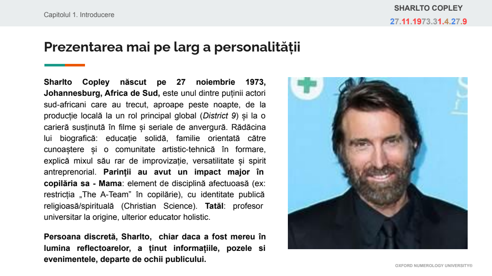

```text
Capitolul 1. Introducere
Prezentarea mai pe larg a personalității
Sharlto Copley născut pe 27 noiembrie 1973,
Johannesburg, Africa de Sud, este unul dintre puținii actori
sud-africani care au trecut, aproape peste noapte, de la
producție locală la un rol principal global (District 9) și la o
carieră susținută în filme și seriale de anvergură. Rădăcina
lui biografică: educație solidă, familie orientată către
cunoaștere și o comunitate artistic-tehnică în formare,
explică mixul său rar de improvizație, versatilitate și spirit
antreprenorial. Parinții au avut un impact major în
copilăria sa - Mama: element de disciplină afectuoasă (ex:
restricția „The A-Team” în copilărie), cu identitate publică
religioasă/spirituală (Christian Science). Tatăl: profesor
universitar la origine, ulterior educator holistic.
Persoana discretă, Sharlto, chiar daca a fost mereu în
lumina reflectoarelor, a ținut informațiile, pozele si
evenimentele, departe de ochii publicului.
OXFORD NUMEROLOGY UNIVERSITY®
```

### Pagina 11

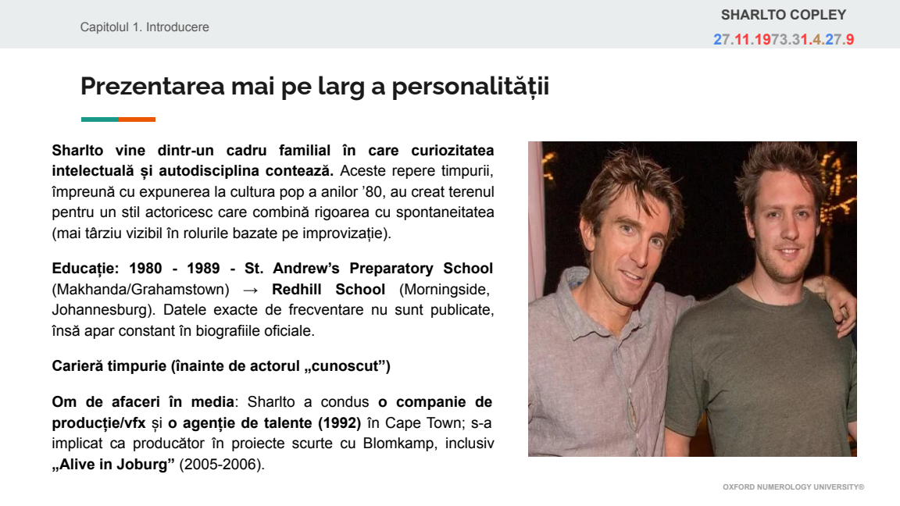

```text
Capitolul 1. Introducere
Prezentarea mai pe larg a personalității
Sharlto vine dintr-un cadru familial în care curiozitatea
intelectuală și autodisciplina contează. Aceste repere timpurii,
împreună cu expunerea la cultura pop a anilor ’80, au creat terenul
pentru un stil actoricesc care combină rigoarea cu spontaneitatea
(mai târziu vizibil în rolurile bazate pe improvizație).
Educație: 1980 - 1989 - St. Andrew’s Preparatory School
(Makhanda/Grahamstown) → Redhill School (Morningside,
Johannesburg). Datele exacte de frecventare nu sunt publicate,
însă apar constant în biografiile oficiale.
Carieră timpurie (înainte de actorul „cunoscut”)
Om de afaceri în media: Sharlto a condus o companie de
producție/vfx și o agenție de talente (1992) în Cape Town; s-a
implicat ca producător în proiecte scurte cu Blomkamp, inclusiv
„Alive in Joburg” (2005-2006).
OXFORD NUMEROLOGY UNIVERSITY®
```

### Pagina 12


```text
Capitolul 1. Introducere
Prezentarea mai pe larg a personalității
Carieră
După liceu, Sharlto a fost ani buni om de business în producție
media în Africa de Sud, unde l-a sprijinit pe adolescentul Neill
Blomkamp (mai tânăr cu 6 ani) cu acces la calculatoarele firmei
sale, pentru a-și dezVAULTa pasiunea pentru animație/3D, moment
care îi va marca cariera. Un articol „Wired” precizează că un
profesor i-a făcut cunoștință când Blomkamp avea 16 ani și
că Sharlto cofondase deja o companie de producție – de aici
o prietenie/parteneriat de durată. (Anul exact al întâlnirii nu e
precizat public; estimarea 1995–1996 se bazează pe vârsta lui
Blomkamp.).
Primul mare rol – „District 9” (2009): Blomkamp îl distribuie
pentru naturalețea în fața camerei; mare parte din dialog e
improvizat astfel aducându-i și prima Nominalizare.
OXFORD NUMEROLOGY UNIVERSITY®
```

### Pagina 13

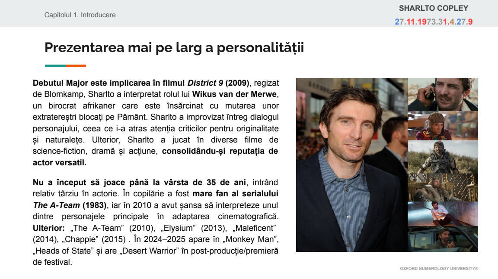

```text
Capitolul 1. Introducere
Prezentarea mai pe larg a personalității
Debutul Major este implicarea în filmul District 9 (2009), regizat
de Blomkamp, Sharlto a interpretat rolul lui Wikus van der Merwe,
un birocrat afrikaner care este însărcinat cu mutarea unor
extratereștri blocați pe Pământ. Sharlto a improvizat întreg dialogul
personajului, ceea ce i-a atras atenția criticilor pentru originalitate
și naturalețe. Ulterior, Sharlto a jucat în diverse filme de
science-fiction, dramă și acțiune, consolidându-și reputația de
actor versatil.
Nu a început să joace până la vârsta de 35 de ani, intrând
relativ târziu în actorie. În copilărie a fost mare fan al serialului
The A-Team (1983), iar în 2010 a avut șansa să interpreteze unul
dintre personajele principale în adaptarea cinematografică.
Ulterior: „The A-Team” (2010), „Elysium” (2013), „Maleficent”
(2014), „Chappie” (2015) . În 2024–2025 apare în „Monkey Man”,
„Heads of State” și are „Desert Warrior” în post-producție/premieră
de festival.
OXFORD NUMEROLOGY UNIVERSITY®
```

### Pagina 14

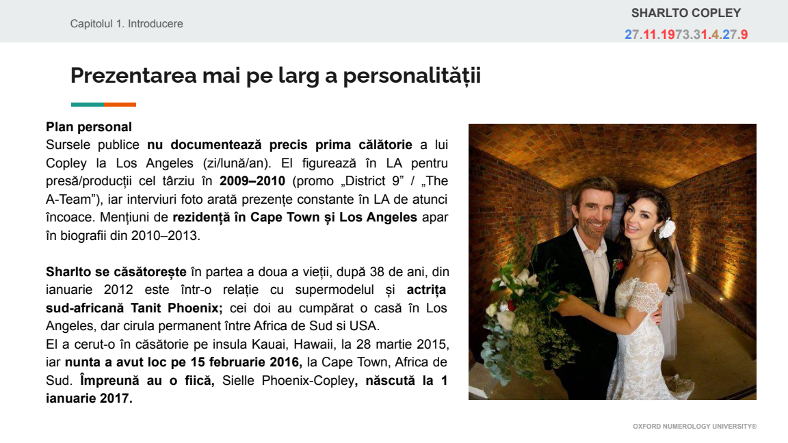

```text
Capitolul 1. Introducere
Prezentarea mai pe larg a personalității
Plan personal
Sursele publice nu documentează precis prima călătorie a lui
Copley la Los Angeles (zi/lună/an). El figurează în LA pentru
presă/producții cel târziu în 2009–2010 (promo „District 9” / „The
A-Team”), iar interviuri foto arată prezențe constante în LA de atunci
încoace. Mențiuni de rezidență în Cape Town și Los Angeles apar
în biografii din 2010–2013.
Sharlto se căsătorește în partea a doua a vieții, după 38 de ani, din
ianuarie 2012 este într-o relație cu supermodelul și actrița
sud-africană Tanit Phoenix; cei doi au cumpărat o casă în Los
Angeles, dar cirula permanent între Africa de Sud si USA.
El a cerut-o în căsătorie pe insula Kauai, Hawaii, la 28 martie 2015,
iar nunta a avut loc pe 15 februarie 2016, la Cape Town, Africa de
Sud. Împreună au o fiică, Sielle Phoenix-Copley, născută la 1
ianuarie 2017.
OXFORD NUMEROLOGY UNIVERSITY®
```

### Pagina 15

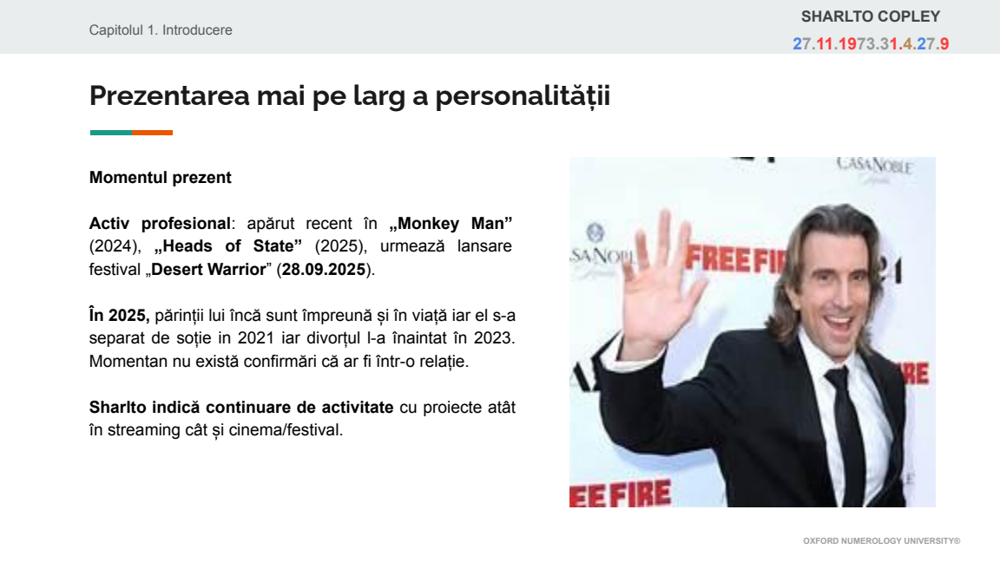

```text
Capitolul 1. Introducere
Prezentarea mai pe larg a personalității
Momentul prezent
Activ profesional: apărut recent în „Monkey Man”
(2024), „Heads of State” (2025), urmează lansare
festival „Desert Warrior” (28.09.2025).
În 2025, părinții lui încă sunt împreună și în viață iar el s-a
separat de soție in 2021 iar divorțul l-a înaintat în 2023.
Momentan nu există confirmări că ar fi într-o relație.
Sharlto indică continuare de activitate cu proiecte atât
în streaming cât și cinema/festival.
OXFORD NUMEROLOGY UNIVERSITY®
```

### Pagina 16

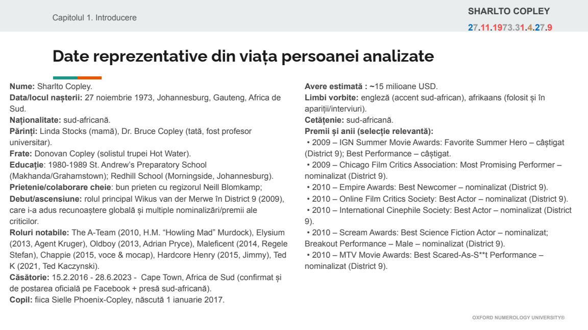

```text
Capitolul 1. Introducere
Date reprezentative din viața persoanei analizate
Nume: Sharlto Copley. Avere estimată : ~15 milioane USD.
Data/locul nașterii: 27 noiembrie 1973, Johannesburg, Gauteng, Africa de Limbi vorbite: engleză (accent sud-african), afrikaans (folosit și în
Sud. apariții/interviuri).
Naționalitate: sud-africană. Cetățenie: sud-africană.
Părinți: Linda Stocks (mamă), Dr. Bruce Copley (tată, fost profesor Premii și anii (selecție relevantă):
universitar). • 2009 – IGN Summer Movie Awards: Favorite Summer Hero – câștigat
Frate: Donovan Copley (solistul trupei Hot Water). (District 9); Best Performance – câștigat.
Educație: 1980-1989 St. Andrew’s Preparatory School • 2009 – Chicago Film Critics Association: Most Promising Performer –
(Makhanda/Grahamstown); Redhill School (Morningside, Johannesburg). nominalizat (District 9).
Prietenie/colaborare cheie: bun prieten cu regizorul Neill Blomkamp; • 2010 – Empire Awards: Best Newcomer – nominalizat (District 9).
Debut/ascensiune: rolul principal Wikus van der Merwe în District 9 (2009), • 2010 – Online Film Critics Society: Best Actor – nominalizat (District 9).
care i-a adus recunoaștere globală și multiple nominalizări/premii ale • 2010 – International Cinephile Society: Best Actor – nominalizat (District
criticilor. 9).
Roluri notabile: The A-Team (2010, H.M. “Howling Mad” Murdock), Elysium • 2010 – Scream Awards: Best Science Fiction Actor – nominalizat;
(2013, Agent Kruger), Oldboy (2013, Adrian Pryce), Maleficent (2014, Regele Breakout Performance – Male – nominalizat (District 9).
Stefan), Chappie (2015, voce & mocap), Hardcore Henry (2015, Jimmy), Ted • 2010 – MTV Movie Awards: Best Scared-As-S**t Performance –
K (2021, Ted Kaczynski). nominalizat (District 9).
Căsătorie: 15.2.2016 - 28.6.2023 - Cape Town, Africa de Sud (confirmat și
de postarea oficială pe Facebook + presă sud-africană).
Copil: fiica Sielle Phoenix-Copley, născută 1 ianuarie 2017.
OXFORD NUMEROLOGY UNIVERSITY®
```

### Pagina 17

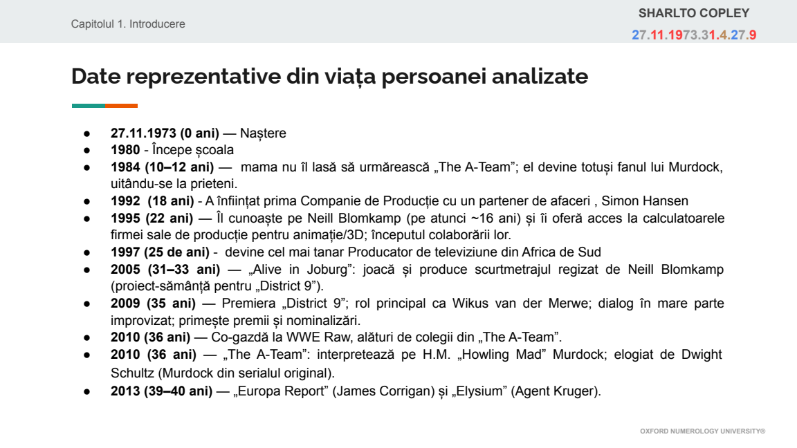

```text
Capitolul 1. Introducere
Date reprezentative din viața persoanei analizate
● 27.11.1973 (0 ani) — Naștere
● 1980 - Începe școala
● 1984 (10–12 ani) — mama nu îl lasă să urmărească „The A-Team”; el devine totuși fanul lui Murdock,
uitându-se la prieteni.
● 1992 (18 ani) - A înființat prima Companie de Producție cu un partener de afaceri , Simon Hansen
● 1995 (22 ani) — Îl cunoaște pe Neill Blomkamp (pe atunci ~16 ani) și îi oferă acces la calculatoarele
firmei sale de producție pentru animație/3D; începutul colaborării lor.
● 1997 (25 de ani) - devine cel mai tanar Producator de televiziune din Africa de Sud
● 2005 (31–33 ani) — „Alive in Joburg”: joacă și produce scurtmetrajul regizat de Neill Blomkamp
(proiect-sămânță pentru „District 9”).
● 2009 (35 ani) — Premiera „District 9”; rol principal ca Wikus van der Merwe; dialog în mare parte
improvizat; primește premii și nominalizări.
● 2010 (36 ani) — Co-gazdă la WWE Raw, alături de colegii din „The A-Team”.
● 2010 (36 ani) — „The A-Team”: interpretează pe H.M. „Howling Mad” Murdock; elogiat de Dwight
Schultz (Murdock din serialul original).
● 2013 (39–40 ani) — „Europa Report” (James Corrigan) și „Elysium” (Agent Kruger).
OXFORD NUMEROLOGY UNIVERSITY®
```

### Pagina 18

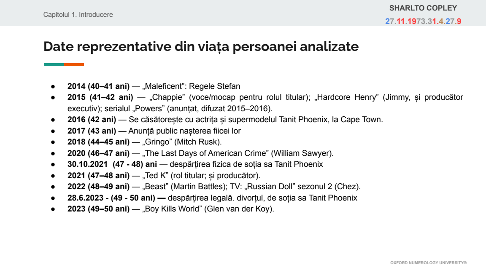

```text
Capitolul 1. Introducere
Date reprezentative din viața persoanei analizate
● 2014 (40–41 ani) — „Maleficent”: Regele Stefan
● 2015 (41–42 ani) — „Chappie” (voce/mocap pentru rolul titular); „Hardcore Henry” (Jimmy, și producător
executiv); serialul „Powers” (anunțat, difuzat 2015–2016).
● 2016 (42 ani) — Se căsătorește cu actrița și supermodelul Tanit Phoenix, la Cape Town.
● 2017 (43 ani) — Anunță public nașterea fiicei lor
● 2018 (44–45 ani) — „Gringo” (Mitch Rusk).
● 2020 (46–47 ani) — „The Last Days of American Crime” (William Sawyer).
● 30.10.2021 (47 - 48) ani — despărțirea fizica de soția sa Tanit Phoenix
● 2021 (47–48 ani) — „Ted K” (rol titular; și producător).
● 2022 (48–49 ani) — „Beast” (Martin Battles); TV: „Russian Doll” sezonul 2 (Chez).
● 28.6.2023 - (49 - 50 ani) — despărțirea legală. divorțul, de soția sa Tanit Phoenix
● 2023 (49–50 ani) — „Boy Kills World” (Glen van der Koy).
OXFORD NUMEROLOGY UNIVERSITY®
```

### Pagina 19

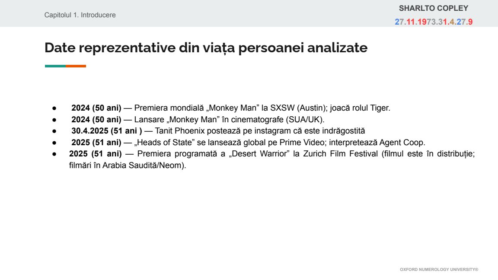

```text
Capitolul 1. Introducere
Date reprezentative din viața persoanei analizate
● 2024 (50 ani) — Premiera mondială „Monkey Man” la SXSW (Austin); joacă rolul Tiger.
● 2024 (50 ani) — Lansare „Monkey Man” în cinematografe (SUA/UK).
● 30.4.2025 (51 ani ) — Tanit Phoenix postează pe instagram că este indrăgostită
● 2025 (51 ani) — „Heads of State” se lansează global pe Prime Video; interpretează Agent Coop.
● 2025 (51 ani) — Premiera programată a „Desert Warrior” la Zurich Film Festival (filmul este în distribuție;
filmări în Arabia Saudită/Neom).
OXFORD NUMEROLOGY UNIVERSITY®
```

# Capitolul 2. Formule, calcule, tabele, grafice

_Pagini sursa: 20-89._

## Formule si calcule extrase pentru rafinare

### Vibrația Interioară

- Concept analizat: verificat in VAULT/Numerologie - [[Vibratie Interioara]].
- Metoda de calcul: Vibrația Interioară: suma cifrelor componente din ziua de naștere = 2+7 = 9
- Calcul: suma cifrelor componente din ziua de naștere = 2+7 = 9
- Verificare: ok - concept verificat in VAULT/Numerologie; formula de calcul este compatibila cu documentatia.
- Verificare pagina: pagina 22.

### Vibrația Interioară Karmă

- Concept analizat: verificat in VAULT/Numerologie - [[Karma din Ziua Nasterii]].
- Metoda de calcul: Vibrația Interioară Karmă: ziua de naștere - 22 (dacă ziua > 22) = 27 - 22 = 5
- Calcul: ziua de naștere - 22 (dacă ziua > 22) = 27 - 22 = 5
- Verificare: ok - concept verificat in VAULT/Numerologie; formula de calcul este compatibila cu documentatia.
- Verificare pagina: pagina 22.

### Vibrația Exterioară

- Concept analizat: verificat in VAULT/Numerologie - [[Vibratie Exterioara]].
- Metoda de calcul: Vibrația Exterioară: suma cifrelor componente a lunii de naștere = VE 11 = 1+1 = 2
- Calcul: suma cifrelor componente a lunii de naștere = VE 11 = 1+1 = 2
- Verificare: ok - concept verificat in VAULT/Numerologie; formula de calcul este compatibila cu documentatia.
- Verificare pagina: pagina 22.

### Vibrația Exterioară Karmă

- Concept analizat: verificat in VAULT/Numerologie - [[Karma din Luna Nasterii]].
- Metoda de calcul: Vibrația Exterioară Karmă: luna de naștere = 11
- Calcul: luna de naștere = 11
- Verificare: ok - concept verificat in VAULT/Numerologie; formula de calcul este compatibila cu documentatia.
- Verificare pagina: pagina 22.

### Vibrația Globală

- Concept analizat: verificat in VAULT/Numerologie - [[Vibratie Globala]].
- Metoda de calcul: Vibrația Globală: reprezintă suma cifrelor componente dintre VI 9 + VE 2 = VG 11 = 1+1 = 2
- Calcul: reprezintă suma cifrelor componente dintre VI 9 + VE 2 = VG 11 = 1+1 = 2
- Verificare: ok - concept verificat in VAULT/Numerologie; formula de calcul este compatibila cu documentatia.
- Verificare pagina: pagina 22.

### Puntea dintre Vibrația Interioară și Vibrația Exterioară

- Concept analizat: verificat in VAULT/Numerologie - [[Punti]].
- Metoda de calcul: Puntea dintre Vibrația Interioară și Vibrația Exterioară: diferenta dintre VI - VE = 9 - 5 = 4
- Calcul: diferenta dintre VI - VE = 9 - 5 = 4
- Verificare: ok - concept verificat in VAULT/Numerologie; formula de calcul este compatibila cu documentatia.
- Verificare pagina: pagina 22.

### Vibrația Cosmică Variabilă

- Concept analizat: verificat in VAULT/Numerologie - [[Vibratie Cosmica Variabila]].
- Metoda de calcul: Vibrația Cosmică Variabilă: reprezintă ultimele două cifre adunate din an = VCV 73 = 7 + 3 = 10 = 1
- Calcul: reprezintă ultimele două cifre adunate din an = VCV 73 = 7 + 3 = 10 = 1
- Verificare: ok - concept verificat in VAULT/Numerologie; formula de calcul este compatibila cu documentatia.
- Verificare pagina: pagina 22.

### Vibrația Cosmică Totală

- Concept analizat: verificat in VAULT/Numerologie - [[Vibratie Cosmica Totala]].
- Metoda de calcul: Vibrația Cosmică Totală: reprezintă suma totală a anului = VCT 1973 = 1+9+7+3 = 2+0 = 2
- Calcul: reprezintă suma totală a anului = VCT 1973 = 1+9+7+3 = 2+0 = 2
- Verificare: ok - concept verificat in VAULT/Numerologie; formula de calcul este compatibila cu documentatia.
- Verificare pagina: pagina 22.

### Calea Destinului

- Concept analizat: verificat in VAULT/Numerologie - [[Calea Destinului]].
- Metoda de calcul: Calea Destinului: suma tuturor cifrelor din data de naștere: ziua+luna+anul = 2+7+1+1+1+9+7+3 = 31
- Calcul: suma tuturor cifrelor din data de naștere: ziua+luna+anul = 2+7+1+1+1+9+7+3 = 31
- Verificare: ok - concept verificat in VAULT/Numerologie; formula de calcul este compatibila cu documentatia.
- Verificare pagina: pagina 23.

### Calea Destinului Karmă

- Concept analizat: verificat in VAULT/Numerologie - [[Karma din Calea Destinului]].
- Metoda de calcul: Calea Destinului Karmă: CD -22 = 31-22 = 9
- Calcul: CD -22 = 31-22 = 9
- Verificare: ok - concept verificat in VAULT/Numerologie; formula de calcul este compatibila cu documentatia.
- Verificare pagina: pagina 23.

### Destinul

- Concept analizat: verificat in VAULT/Numerologie - [[Vibratia Destinului]].
- Metoda de calcul: Destinul: suma cifrelor componente din calea destinului 3+1 = 4
- Calcul: suma cifrelor componente din calea destinului 3+1 = 4
- Verificare: ok - concept verificat in VAULT/Numerologie; formula de calcul este compatibila cu documentatia.
- Verificare pagina: pagina 23.

### Puntea dintre Vibrația Interioară și Destin

- Concept analizat: verificat in VAULT/Numerologie - [[Punti]].
- Metoda de calcul: Puntea dintre Vibrația Interioară și Destin: 9 - 4 = 5
- Calcul: 9 - 4 = 5
- Verificare: ok - concept verificat in VAULT/Numerologie; formula de calcul este compatibila cu documentatia.
- Verificare pagina: pagina 23.

### Aspecte de Îndreptat

- Concept analizat: verificat in VAULT/Numerologie - [[Aspecte de Indreptat]].
- Metoda de calcul: Aspecte de Îndreptat: 2 si 7
- Calcul: Aspecte de Îndreptat: 2 si 7
- Verificare: ok - concept verificat in VAULT/Numerologie; metoda trebuie rafinata din textul paginii.
- Verificare pagina: pagina 23.

### Soluția Aspectelor de Îndreptat

- Concept analizat: verificat in VAULT/Numerologie - [[Aspecte de Indreptat]].
- Metoda de calcul: Soluția Aspectelor de Îndreptat: 9
- Calcul: Soluția Aspectelor de Îndreptat: 9
- Verificare: ok - concept verificat in VAULT/Numerologie; metoda trebuie rafinata din textul paginii.
- Verificare pagina: pagina 23.

### - Cifra Destinului - Cifra Vocalelor

- Concept analizat: verificat in VAULT/Numerologie - [[Influentele Numelui]].
- Metoda de calcul: - Cifra Destinului - Cifra Vocalelor: 4 - 9 = 5
- Calcul: 4 - 9 = 5
- Verificare: ok - concept verificat in VAULT/Numerologie; formula de calcul este compatibila cu documentatia.
- Verificare pagina: pagina 34.

### - Cifra Destinului - Cifra Consoanelor

- Concept analizat: verificat in VAULT/Numerologie - [[Influentele Numelui]].
- Metoda de calcul: - Cifra Destinului - Cifra Consoanelor: 4 - 7 = 3
- Calcul: 4 - 7 = 3
- Verificare: ok - concept verificat in VAULT/Numerologie; formula de calcul este compatibila cu documentatia.
- Verificare pagina: pagina 34.

### Calea destinului 31

- Concept analizat: verificat in VAULT/Numerologie - [[Calea Destinului]].
- Metoda de calcul: Calea destinului 31 => începând cu 31 de ani, viața începe să aibă așteptări mai mari , iar ciclicitatea va avea
- Calcul: Calea destinului 31 => începând cu 31 de ani, viața începe să aibă așteptări mai mari , iar ciclicitatea va avea
- Verificare: ok - concept verificat in VAULT/Numerologie; formula de calcul este compatibila cu documentatia.
- Verificare pagina: pagina 35.

### Ciclicitatea Lecțiilor de viață

- Concept analizat: verificat in VAULT/Numerologie - [[Lectii de Viata]].
- Metoda de calcul: Ciclicitatea Lecțiilor de viață: 27 x 11 x 1973 = 585981
- Calcul: 27 x 11 x 1973 = 585981
- Verificare: ok - concept verificat in VAULT/Numerologie; formula de calcul este compatibila cu documentatia.
- Verificare pagina: pagina 38.

### Ciclicitatea de 7 ani

- Concept analizat: verificat in VAULT/Numerologie - [[Ciclul de 7 Ani]].
- Metoda de calcul: Ciclicitatea de 7 ani:din punct de vedere fizic , în corpul omului au loc diferite transformări / schimbări din 7 în 7 ani
- Calcul: Ciclicitatea de 7 ani:din punct de vedere fizic , în corpul omului au loc diferite transformări / schimbări din 7 în 7 ani
- Verificare: ok - concept verificat in VAULT/Numerologie; metoda trebuie rafinata din textul paginii.
- Verificare pagina: pagina 40.

### Ciclicitatea de 9 ani

- Concept analizat: verificat in VAULT/Numerologie - [[Ciclul de 9 Ani]].
- Metoda de calcul: Ciclicitatea de 9 ani:modul de a gândi și de a lua hotărâri, de a găsi soluții, de a fixa lucrurile, puterea de a rezista prin viață, de
- Calcul: Ciclicitatea de 9 ani:modul de a gândi și de a lua hotărâri, de a găsi soluții, de a fixa lucrurile, puterea de a rezista prin viață, de
- Verificare: ok - concept verificat in VAULT/Numerologie; metoda trebuie rafinata din textul paginii.
- Verificare pagina: pagina 42.

### Ciclicitatea de 12 ani

- Concept analizat: verificat in VAULT/Numerologie - [[Ciclul de 12 Ani]].
- Metoda de calcul: Ciclicitatea de 12 ani: Spiritualitate
- Calcul: Ciclicitatea de 12 ani: Spiritualitate
- Verificare: ok - concept verificat in VAULT/Numerologie; metoda trebuie rafinata din textul paginii.
- Verificare pagina: pagina 43.

### Ciclicitatea de 27 de ani

- Concept analizat: concept lipsa in VAULT/Numerologie.
- Metoda de calcul: Ciclicitatea de 27 de ani:
- Calcul: Ciclicitatea de 27 de ani:
- Verificare: concept lipsa in VAULT/Numerologie.
- Verificare pagina: pagina 44.

### * 36

- Concept analizat: verificat in VAULT/Numerologie - [[Vibratia Destinului]].
- Metoda de calcul: * 36 = Numărul Omului; D = Destinul Ziua 9 Luna 2 An 2
- Calcul: * 36 = Numărul Omului; D = Destinul Ziua 9 Luna 2 An 2
- Verificare: ok - concept verificat in VAULT/Numerologie; formula de calcul este compatibila cu documentatia.
- Verificare pagina: pagina 46.

### ● Pinaclul 1

- Concept analizat: verificat in VAULT/Numerologie - [[Pinacluri - Oportunitati si Provocari]].
- Metoda de calcul: ● Pinaclul 1: 0 - 32 ani
- Calcul: ● Pinaclul 1: 0 - 32 ani
- Verificare: ok - concept verificat in VAULT/Numerologie; metoda trebuie rafinata din textul paginii.
- Verificare pagina: pagina 48.

### ● Pinaclul 2

- Concept analizat: verificat in VAULT/Numerologie - [[Pinacluri - Oportunitati si Provocari]].
- Metoda de calcul: ● Pinaclul 2: 33 - 42 ani
- Calcul: ● Pinaclul 2: 33 - 42 ani
- Verificare: ok - concept verificat in VAULT/Numerologie; metoda trebuie rafinata din textul paginii.
- Verificare pagina: pagina 48.

### ● Pinaclul 3

- Concept analizat: verificat in VAULT/Numerologie - [[Pinacluri - Oportunitati si Provocari]].
- Metoda de calcul: ● Pinaclul 3: 43 - 52 ani
- Calcul: ● Pinaclul 3: 43 - 52 ani
- Verificare: ok - concept verificat in VAULT/Numerologie; metoda trebuie rafinata din textul paginii.
- Verificare pagina: pagina 48.

### ● Pinaclul 4

- Concept analizat: verificat in VAULT/Numerologie - [[Pinacluri - Oportunitati si Provocari]].
- Metoda de calcul: ● Pinaclul 4: 53 - sfârșit
- Calcul: ● Pinaclul 4: 53 - sfârșit
- Verificare: ok - concept verificat in VAULT/Numerologie; metoda trebuie rafinata din textul paginii.
- Verificare pagina: pagina 48.

### Ciclicitatea de 10 sau 12 ani - Soartă și Destin

- Concept analizat: verificat in VAULT/Numerologie - [[Soarta si Destin]].
- Metoda de calcul: Ciclicitatea de 10 sau 12 ani - Soartă și Destin: Bărbat - 10 ani
- Calcul: Ciclicitatea de 10 sau 12 ani - Soartă și Destin: Bărbat - 10 ani
- Verificare: ok - concept verificat in VAULT/Numerologie; formula/metoda se verifica in [[Soarta si Destin]].
- Verificare pagina: pagina 53.


### Relatii - Omuletul relatiilor

- Nota editoriala: rubricile separate `+3`, `Valoarea prenumelui de botez + Valoarea zilei de nastere + 3`, `impreuna ceea ce vibratia 7 cere`, `vibratiilor interioare 7 (1 + 6) - 9 (2+7)` si `Vibratia 2 reprezinta` au fost eliminate ca rubrici individuale, fiind incluse in acest subcapitol.
- Concept analizat: Relatii - Omuletul relatiilor.
- Verificare: subcapitol prezent in lucrare; referinta dedicata lipseste deocamdata in VAULT/Numerologie.

### Calea atingerii Potențialului

- Concept analizat: verificat in VAULT/Numerologie - [[Deschidere spre Ezoterism]].
- Metoda de calcul: Calea atingerii Potențialului: Împărțim încă odată la 7 numărul întreg obținut anterior. Marcăm zecimala după
- Calcul: Calea atingerii Potențialului: Împărțim încă odată la 7 numărul întreg obținut anterior. Marcăm zecimala după
- Verificare: ok - concept verificat in VAULT/Numerologie; formula/metoda se verifica in [[Deschidere spre Ezoterism]].
- Verificare pagina: pagina 76.

### Calea atingerii Potențialului 3873

- Concept analizat: verificat in VAULT/Numerologie - [[Deschidere spre Ezoterism]].
- Metoda de calcul: Calea atingerii Potențialului 3873:7 = 553,28 Rezultat: 2 Terapiilor
- Calcul: 7 = 553,28 Rezultat: 2 Terapiilor
- Verificare: ok - concept verificat in VAULT/Numerologie; formula/metoda se verifica in [[Deschidere spre Ezoterism]].
- Verificare pagina: pagina 76.

### (CM x 189) - 189

- Concept analizat: verificat in VAULT/Numerologie - [[Codul Spiritului]].
- Metoda de calcul: (CM x 189) - 189 = Vârsta Spiritului la naștere
- Calcul: (CM x 189) - 189 = Vârsta Spiritului la naștere
- Verificare: ok - concept verificat in VAULT/Numerologie; formula de calcul este compatibila cu documentatia.
- Verificare pagina: pagina 77.

### Vârsta Spiritului la naștere + Vârsta în ani împliniți

- Concept analizat: verificat in VAULT/Numerologie - [[Codul Spiritului]].
- Metoda de calcul: Vârsta Spiritului la naștere + Vârsta în ani împliniți = Vârsta Spiritului in acel moment
- Calcul: Vârsta Spiritului la naștere + Vârsta în ani împliniți = Vârsta Spiritului in acel moment
- Verificare: ok - concept verificat in VAULT/Numerologie; formula de calcul este compatibila cu documentatia.
- Verificare pagina: pagina 77.

### Vârsta Spiritului (6 x 189) - 189

- Concept analizat: verificat in VAULT/Numerologie - [[Codul Spiritului]].
- Metoda de calcul: Vârsta Spiritului (6 x 189) - 189 = 1134 - 189 = 945 + 52 ani (2025) = 997 ani
- Calcul: Vârsta Spiritului (6 x 189) - 189 = 1134 - 189 = 945 + 52 ani (2025) = 997 ani
- Verificare: ok - concept verificat in VAULT/Numerologie; formula de calcul este compatibila cu documentatia.
- Verificare pagina: pagina 77.

### Barbați

- Concept analizat: verificat in VAULT/Numerologie - [[Vibratie Cosmica Variabila]].
- Metoda de calcul: Barbați: 10 - Vibratia cosmică variabilă redusă la o cifră (din anul de naștere)
- Calcul: Barbați: 10 - Vibratia cosmică variabilă redusă la o cifră (din anul de naștere)
- Verificare: ok - concept verificat in VAULT/Numerologie; metoda trebuie rafinata din textul paginii.
- Verificare pagina: pagina 82.

### Femei

- Concept analizat: verificat in VAULT/Numerologie - [[Vibratie Cosmica Variabila]].
- Metoda de calcul: Femei: 5 + Vibratia cosmică variabilă redusă la o cifră (din anul de naștere)
- Calcul: Femei: 5 + Vibratia cosmică variabilă redusă la o cifră (din anul de naștere)
- Verificare: ok - concept verificat in VAULT/Numerologie; metoda trebuie rafinata din textul paginii.
- Verificare pagina: pagina 82.

### Triunghiul financiar

- Concept analizat: verificat in VAULT/Numerologie - [[Cod Numerologic Personal]].
- Metoda de calcul: Triunghiul financiar: 9224
- Calcul: Triunghiul financiar: 9224
- Verificare: ok - concept verificat in VAULT/Numerologie; metoda trebuie rafinata din textul paginii.
- Verificare pagina: pagina 83.

### Pătratul de Aur (Magic) 3x3 30+31+32

- Concept analizat: verificat in VAULT/Numerologie - [[Cod Numerologic Personal]].
- Metoda de calcul: Pătratul de Aur (Magic) 3x3 30+31+32=93
- Calcul: Pătratul de Aur (Magic) 3x3 30+31+32=93
- Verificare: ok - concept verificat in VAULT/Numerologie; formula de calcul este compatibila cu documentatia.
- Verificare pagina: pagina 84.

### Pătratul de aur conține numere care adunate pe fiecare rând, 34 27 32 34+27+32

- Concept analizat: verificat in VAULT/Numerologie - [[Cod Numerologic Personal]].
- Metoda de calcul: Pătratul de aur conține numere care adunate pe fiecare rând, 34 27 32 34+27+32=93
- Calcul: Pătratul de aur conține numere care adunate pe fiecare rând, 34 27 32 34+27+32=93
- Verificare: ok - concept verificat in VAULT/Numerologie; formula de calcul este compatibila cu documentatia.
- Verificare pagina: pagina 84.

### ● Elemente masculine

- Concept analizat: verificat in VAULT/Numerologie - [[Deschidere spre Ezoterism]].
- Metoda de calcul: ● Elemente masculine: 11 (1111, 33, 777, 99) ● Calea ezoterică: 2 - Terapii
- Calcul: ● Elemente masculine: 11 (1111, 33, 777, 99) ● Calea ezoterică: 2 - Terapii
- Verificare: ok - concept verificat in VAULT/Numerologie; metoda trebuie rafinata din textul paginii.
- Verificare pagina: pagina 86.

### ● Vibrația interioară

- Concept analizat: verificat in VAULT/Numerologie - [[Vibratie Interioara]].
- Metoda de calcul: ● Vibrația interioară: 27 = 2+7 = 9 K: 27-22 =5
- Calcul: 27 = 2+7 = 9 K: 27-22 =5
- Verificare: ok - concept verificat in VAULT/Numerologie; formula de calcul este compatibila cu documentatia.
- Verificare pagina: pagina 86.

### ● Vibrația exterioară

- Concept analizat: verificat in VAULT/Numerologie - [[Vibratie Exterioara]].
- Metoda de calcul: ● Vibrația exterioară: 11 K: 11
- Calcul: ● Vibrația exterioară: 11 K: 11
- Verificare: ok - concept verificat in VAULT/Numerologie; metoda trebuie rafinata din textul paginii.
- Verificare pagina: pagina 86.

### ● Vibrația cosmică

- Concept analizat: concept lipsa in VAULT/Numerologie.
- Metoda de calcul: ● Vibrația cosmică: 1973 = 73 = 7+3 = 10 = 10 = 1
- Calcul: 1973 = 73 = 7+3 = 10 = 10 = 1
- Verificare: concept lipsa in VAULT/Numerologie.
- Verificare pagina: pagina 86.

### ● Soarta

- Concept analizat: verificat in VAULT/Numerologie - [[Soarta si Destin]].
- Metoda de calcul: ● Soarta: 2711x1973=5348803
- Calcul: 2711x1973=5348803
- Verificare: ok - concept verificat in VAULT/Numerologie; formula de calcul este compatibila cu documentatia.
- Verificare pagina: pagina 86.

### ● Calea Destinului

- Concept analizat: verificat in VAULT/Numerologie - [[Calea Destinului]].
- Metoda de calcul: ● Calea Destinului: 31
- Calcul: ● Calea Destinului: 31
- Verificare: ok - concept verificat in VAULT/Numerologie; metoda trebuie rafinata din textul paginii.
- Verificare pagina: pagina 86.

### ● Vârsta spiritului

- Concept analizat: verificat in VAULT/Numerologie - [[Codul Spiritului]].
- Metoda de calcul: ● Vârsta spiritului: 945 de ani la naștere
- Calcul: ● Vârsta spiritului: 945 de ani la naștere
- Verificare: ok - concept verificat in VAULT/Numerologie; metoda trebuie rafinata din textul paginii.
- Verificare pagina: pagina 86.

### ● Aspecte de îndreptat

- Concept analizat: verificat in VAULT/Numerologie - [[Aspecte de Indreptat]].
- Metoda de calcul: ● Aspecte de îndreptat: 27 ● Zona de confort: 4,42
- Calcul: ● Aspecte de îndreptat: 27 ● Zona de confort: 4,42
- Verificare: ok - concept verificat in VAULT/Numerologie; metoda trebuie rafinata din textul paginii.
- Verificare pagina: pagina 86.

### ● Soluția de indreptat

- Concept analizat: verificat in VAULT/Numerologie - [[Pinacluri - Oportunitati si Provocari]].
- Metoda de calcul: ● Soluția de indreptat: 9 ● Pinacluri: 0-32, 33-42, 43-52, 53 - sfârșitul vieții
- Calcul: ● Soluția de indreptat: 9 ● Pinacluri: 0-32, 33-42, 43-52, 53 - sfârșitul vieții
- Verificare: ok - concept verificat in VAULT/Numerologie; metoda trebuie rafinata din textul paginii.
- Verificare pagina: pagina 86.

### ● Vibrația Globală

- Concept analizat: verificat in VAULT/Numerologie - [[Vibratie Globala]].
- Metoda de calcul: ● Vibrația Globală: VI + VE = 27 + 11 = 9+2 = 11 = 2 ● Oportunități: O1= 2 (0-32) O2=2 (33-42)
- Calcul: VI + VE = 27 + 11 = 9+2 = 11 = 2 ● Oportunități: O1= 2 (0-32) O2=2 (33-42)
- Verificare: ok - concept verificat in VAULT/Numerologie; formula de calcul este compatibila cu documentatia.
- Verificare pagina: pagina 86.

### ● Puntea VI - VE

- Concept analizat: verificat in VAULT/Numerologie - [[Punti]].
- Metoda de calcul: ● Puntea VI - VE = 9 - 2 = 7 O3 = 4 (43-52) O4 = 4 (53-sf)
- Calcul: ● Puntea VI - VE = 9 - 2 = 7 O3 = 4 (43-52) O4 = 4 (53-sf)
- Verificare: ok - concept verificat in VAULT/Numerologie; formula de calcul este compatibila cu documentatia.
- Verificare pagina: pagina 86.

### ● Puntea VI - D = 9 - 4 = 5 ● Provocări

- Concept analizat: verificat in VAULT/Numerologie - [[Punti]].
- Metoda de calcul: ● Puntea VI - D = 9 - 4 = 5 ● Provocări: P1=7 (0-32) P2=7 (33-42) P3 = 0 (43-52) 27
- Calcul: P1=7 (0-32) P2=7 (33-42) P3 = 0 (43-52) 27
- Verificare: ok - concept verificat in VAULT/Numerologie; formula de calcul este compatibila cu documentatia.
- Verificare pagina: pagina 86.

### ● Scara Bunăstării

- Concept analizat: verificat in VAULT/Numerologie - [[Scara Bunastarii]].
- Metoda de calcul: ● Scara Bunăstării: 0 - C65,6,8; 4 - V.V (4, 05, 06) V.Soci (22, 05, 2068, 2075
- Calcul: ● Scara Bunăstării: 0 - C65,6,8; 4 - V.V (4, 05, 06) V.Soci (22, 05, 2068, 2075
- Verificare: ok - concept verificat in VAULT/Numerologie; metoda trebuie rafinata din textul paginii.
- Verificare pagina: pagina 86.

### ● Ciclul de 9 ani

- Concept analizat: verificat in VAULT/Numerologie - [[Ciclul de 9 Ani]].
- Metoda de calcul: ● Ciclul de 9 ani: Ciclu: 6 ; An:7 , Lecția de viață:9.; Litera: O, 2019, 2026, 2033, 2040, 2047, 2054, 2061, 2068
- Calcul: ● Ciclul de 9 ani: Ciclu: 6 ; An:7 , Lecția de viață:9.; Litera: O, 2019, 2026, 2033, 2040, 2047, 2054, 2061, 2068
- Verificare: ok - concept verificat in VAULT/Numerologie; metoda trebuie rafinata din textul paginii.
- Verificare pagina: pagina 86.

### V. Ext

- Concept analizat: verificat in VAULT/Numerologie - [[Punti]].
- Metoda de calcul: V. Ext = 11 Puntea VI-D = 5 Pătrat Pitagora = 99 Nr. Activ = 3 Provocarea 1 = 7
- Calcul: V. Ext = 11 Puntea VI-D = 5 Pătrat Pitagora = 99 Nr. Activ = 3 Provocarea 1 = 7
- Verificare: ok - concept verificat in VAULT/Numerologie; formula de calcul este compatibila cu documentatia.
- Verificare pagina: pagina 87.

### V. ext Karmică

- Concept analizat: verificat in VAULT/Numerologie - [[Lectii de Viata]].
- Metoda de calcul: V. ext Karmică =11 Lecții de viață = 585981 Nr intim =9 Soarta = 5348803 Provocarea 2 = 7
- Calcul: V. ext Karmică =11 Lecții de viață = 585981 Nr intim =9 Soarta = 5348803 Provocarea 2 = 7
- Verificare: ok - concept verificat in VAULT/Numerologie; formula de calcul este compatibila cu documentatia.
- Verificare pagina: pagina 87.

### Vibrație Cosmică

- Concept analizat: verificat in VAULT/Numerologie - [[Soarta si Destin]].
- Metoda de calcul: Vibrație Cosmică = 1 Soarta = 5348803 Nr karmic Neam =9 Destin = 5348803 Asp de Indreptat = 27
- Calcul: Vibrație Cosmică = 1 Soarta = 5348803 Nr karmic Neam =9 Destin = 5348803 Asp de Indreptat = 27
- Verificare: ok - concept verificat in VAULT/Numerologie; formula de calcul este compatibila cu documentatia.
- Verificare pagina: pagina 87.

### Calea Destinului

- Concept analizat: verificat in VAULT/Numerologie - [[Punti]].
- Metoda de calcul: Calea Destinului = 31 Destin = 5348803 Aplicabilitate Da= 9 Calea Destinului = 31 Puntea VI-VE = 7
- Calcul: Calea Destinului = 31 Destin = 5348803 Aplicabilitate Da= 9 Calea Destinului = 31 Puntea VI-VE = 7
- Verificare: ok - concept verificat in VAULT/Numerologie; formula de calcul este compatibila cu documentatia.
- Verificare pagina: pagina 87.

### V. ext

- Concept analizat: verificat in VAULT/Numerologie - [[Soarta si Destin]].
- Metoda de calcul: V. ext = 2 Cod matriceal CM = 6 Destin = 4 Soarta = 5348803 Provocarea 4 = 0
- Calcul: V. ext = 2 Cod matriceal CM = 6 Destin = 4 Soarta = 5348803 Provocarea 4 = 0
- Verificare: ok - concept verificat in VAULT/Numerologie; formula de calcul este compatibila cu documentatia.
- Verificare pagina: pagina 87.

### Vibrația Globală

- Concept analizat: verificat in VAULT/Numerologie - [[Vibratie Globala]].
- Metoda de calcul: Vibrația Globală = 2 Nr Ereditar = 4 Destin = 5348803 Soarta = 5348803
- Calcul: Vibrația Globală = 2 Nr Ereditar = 4 Destin = 5348803 Soarta = 5348803
- Verificare: ok - concept verificat in VAULT/Numerologie; formula de calcul este compatibila cu documentatia.
- Verificare pagina: pagina 87.

### Zona de comfort

- Concept analizat: verificat in VAULT/Numerologie - [[Soarta si Destin]].
- Metoda de calcul: Zona de comfort = 4,42 Soarta = 5348803 Destin = 5348803
- Calcul: Zona de comfort = 4,42 Soarta = 5348803 Destin = 5348803
- Verificare: ok - concept verificat in VAULT/Numerologie; formula de calcul este compatibila cu documentatia.
- Verificare pagina: pagina 87.

### Calea Ezoterică

- Concept analizat: verificat in VAULT/Numerologie - [[Deschidere spre Ezoterism]].
- Metoda de calcul: Calea Ezoterică = 2 Oportunitatea 4 =4
- Calcul: Calea Ezoterică = 2 Oportunitatea 4 =4
- Verificare: ok - concept verificat in VAULT/Numerologie; formula de calcul este compatibila cu documentatia.
- Verificare pagina: pagina 87.

### Aspecte de indreptat

- Concept analizat: verificat in VAULT/Numerologie - [[Aspecte de Indreptat]].
- Metoda de calcul: Aspecte de indreptat = 27
- Calcul: Aspecte de indreptat = 27
- Verificare: ok - concept verificat in VAULT/Numerologie; formula de calcul este compatibila cu documentatia.
- Verificare pagina: pagina 87.

### Ciclul de 9 ani

- Concept analizat: verificat in VAULT/Numerologie - [[Ciclul de 9 Ani]].
- Metoda de calcul: Ciclul de 9 ani: 585981
- Calcul: Ciclul de 9 ani: 585981
- Verificare: ok - concept verificat in VAULT/Numerologie; metoda trebuie rafinata din textul paginii.
- Verificare pagina: pagina 88.

### (27.11.1973) 1983 1993 2003 2013 2023 2033 2043 2053 2063 Răspuns

- Concept analizat: concept lipsa in VAULT/Numerologie.
- Metoda de calcul: (27.11.1973) 1983 1993 2003 2013 2023 2033 2043 2053 2063 Răspuns: Ciclu
- Calcul: (27.11.1973) 1983 1993 2003 2013 2023 2033 2043 2053 2063 Răspuns: Ciclu
- Verificare: concept lipsa in VAULT/Numerologie.
- Verificare pagina: pagina 89.

## Pagini si text sursa

### Pagina 20

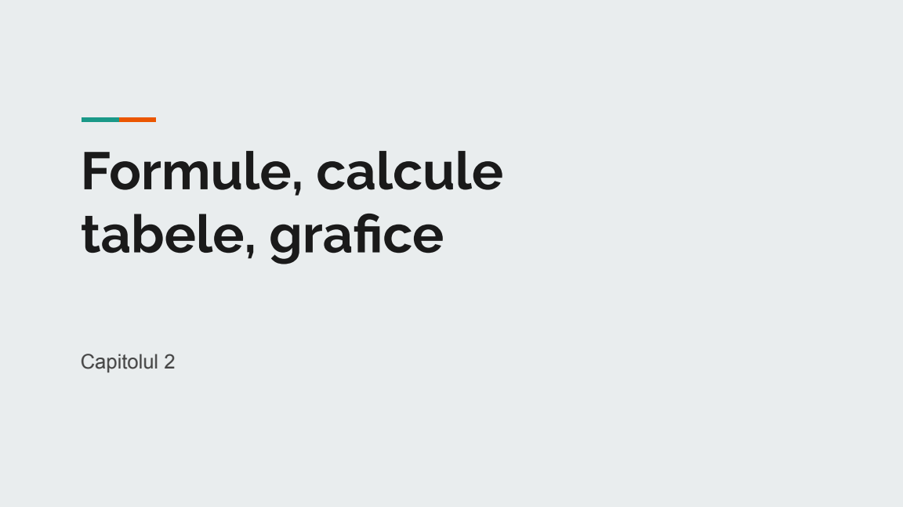

```text
Formule, calcule
tabele, grafice
```

### Pagina 21

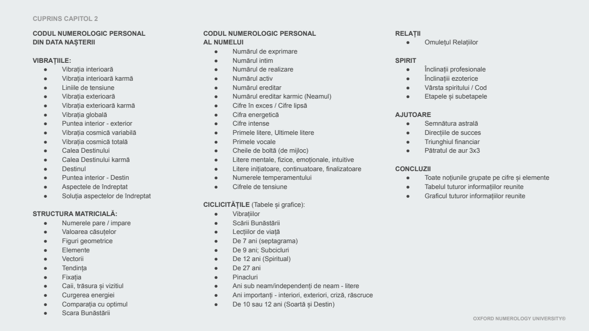

```text
CUPRINS CAPITOL 2
CODUL NUMEROLOGIC PERSONAL CODUL NUMEROLOGIC PERSONAL RELAȚII
DIN DATA NAȘTERII AL NUMELUI ● Omulețul Relațiilor
● Numărul de exprimare
VIBRAȚIILE: ● Numărul intim SPIRIT
● Vibrația interioară ● Numărul de realizare ● Înclinații profesionale
● Vibrația interioară karmă ● Numărul activ ● Înclinațiii ezoterice
● Liniile de tensiune ● Numărul ereditar ● Vârsta spiritului / Cod
● Vibrația exterioară ● Numărul ereditar karmic (Neamul) ● Etapele și subetapele
● Vibrația exterioară karmă ● Cifre în exces / Cifre lipsă
● Vibrația globală ● Cifra energetică AJUTOARE
● Puntea interior - exterior ● Cifre intense ● Semnătura astrală
● Vibrația cosmică variabilă ● Primele litere, Ultimele litere ● Direcțiile de succes
● Vibrația cosmică totală ● Primele vocale ● Triunghiul financiar
● Calea Destinului ● Cheile de boltă (de mijloc) ● Pătratul de aur 3x3
● Calea Destinului karmă ● Litere mentale, fizice, emoționale, intuitive
● Destinul ● Litere inițiatoare, continuatoare, finalizatoare CONCLUZII
● Puntea interior - Destin ● Numerele temperamentului ● Toate noțiunile grupate pe cifre și elemente
● Aspectele de îndreptat ● Cifrele de tensiune ● Tabelul tuturor informațiilor reunite
● Soluția aspectelor de îndreptat ● Graficul tuturor informațiilor reunite
CICLICITĂȚILE (Tabele și grafice):
STRUCTURA MATRICIALĂ: ● Vibrațiilor
● Numerele pare / impare ● Scării Bunăstării
● Valoarea căsuțelor ● Lecțiilor de viață
● Figuri geometrice ● De 7 ani (septagrama)
● Elemente ● De 9 ani; Subcicluri
● Vectorii ● De 12 ani (Spiritual)
● Tendința ● De 27 ani
● Fixația ● Pinacluri
● Caii, trăsura și vizitiul ● Ani sub neam/independenți de neam - litere
● Curgerea energiei ● Ani importanți - interiori, exteriori, criză, răscruce
● Comparația cu optimul ● De 10 sau 12 ani (Soartă și Destin)
● Scara Bunăstării
OXFORD NUMEROLOGY UNIVERSITY®
```

### Pagina 22

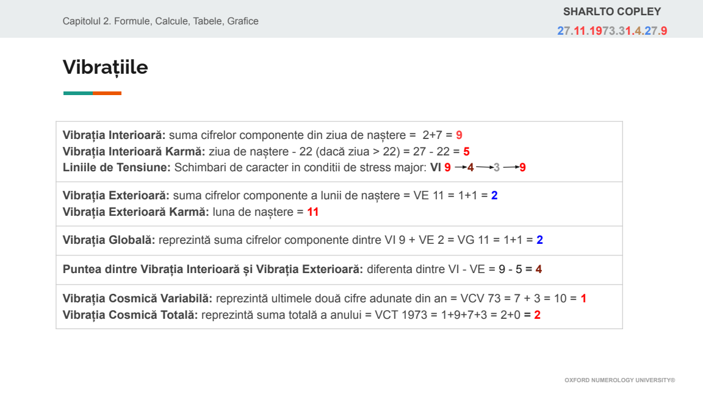

```text
Capitolul 2. Formule, Calcule, Tabele, Grafice
Vibrațiile
Vibrația Interioară: suma cifrelor componente din ziua de naștere = 2+7 = 9
Vibrația Interioară Karmă: ziua de naștere - 22 (dacă ziua > 22) = 27 - 22 = 5
Liniile de Tensiune: Schimbari de caracter in conditii de stress major: VI 9 4 3 9
Vibrația Exterioară: suma cifrelor componente a lunii de naștere = VE 11 = 1+1 = 2
Vibrația Exterioară Karmă: luna de naștere = 11
Vibrația Globală: reprezintă suma cifrelor componente dintre VI 9 + VE 2 = VG 11 = 1+1 = 2
Puntea dintre Vibrația Interioară și Vibrația Exterioară: diferenta dintre VI - VE = 9 - 5 = 4
Vibrația Cosmică Variabilă: reprezintă ultimele două cifre adunate din an = VCV 73 = 7 + 3 = 10 = 1
Vibrația Cosmică Totală: reprezintă suma totală a anului = VCT 1973 = 1+9+7+3 = 2+0 = 2
OXFORD NUMEROLOGY UNIVERSITY®
```

### Pagina 23

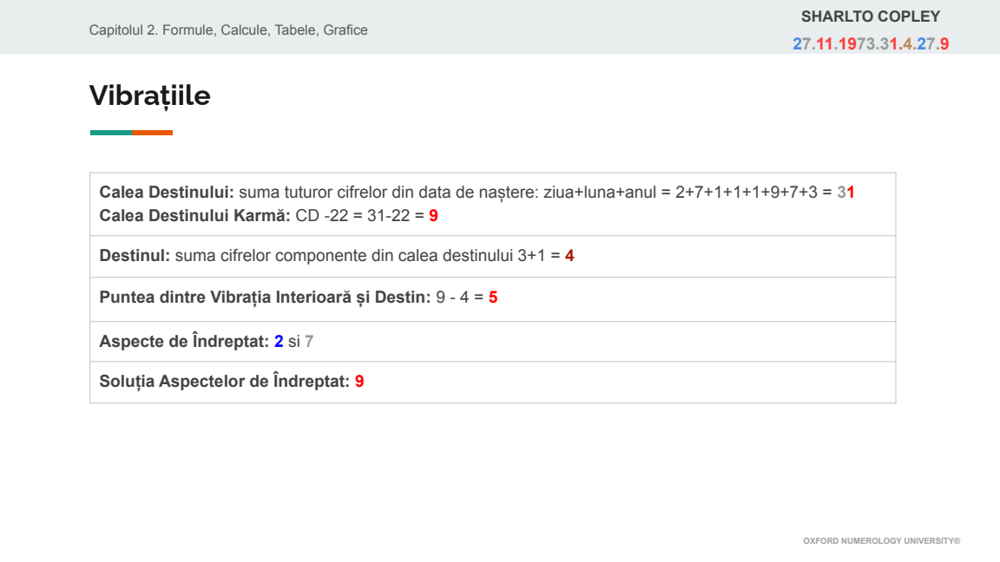

```text
Capitolul 2. Formule, Calcule, Tabele, Grafice
Vibrațiile
Calea Destinului: suma tuturor cifrelor din data de naștere: ziua+luna+anul = 2+7+1+1+1+9+7+3 = 31
Calea Destinului Karmă: CD -22 = 31-22 = 9
Destinul: suma cifrelor componente din calea destinului 3+1 = 4
Puntea dintre Vibrația Interioară și Destin: 9 - 4 = 5
Aspecte de Îndreptat: 2 si 7
Soluția Aspectelor de Îndreptat: 9
OXFORD NUMEROLOGY UNIVERSITY®
```

### Pagina 24

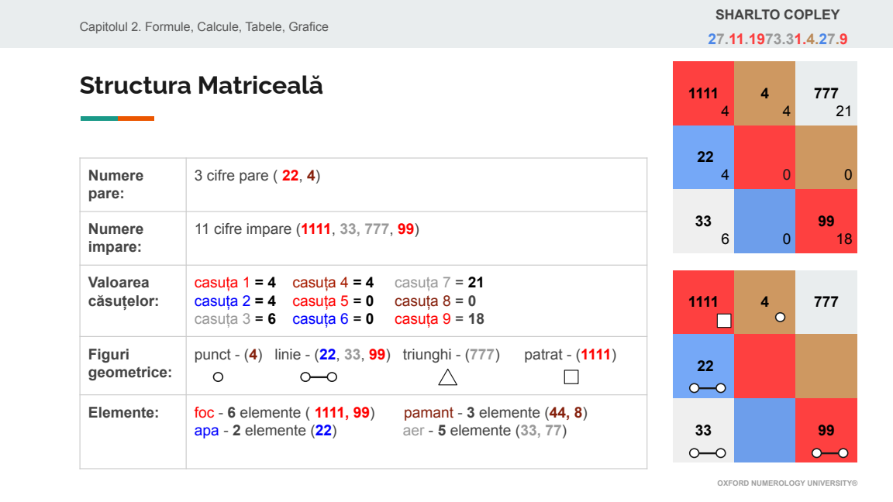

```text
Capitolul 2. Formule, Calcule, Tabele, Grafice
Structura Matriceală
1111 4 777
4 4 21
22
Numere 3 cifre pare ( 22, 4) 4 0 0
pare:
33 99
Numere 11 cifre impare (1111, 33, 777, 99)
6 0 18
impare:
Valoarea casuța 1 = 4 casuța 4 = 4 casuța 7 = 21
căsuțelor: casuța 2 = 4 casuța 5 = 0 casuța 8 = 0 1111 4 777
casuța 3 = 6 casuța 6 = 0 casuța 9 = 18
Figuri punct - (4) linie - (22, 33, 99) triunghi - (777) patrat - (1111)
22
geometrice:
Elemente: foc - 6 elemente ( 1111, 99) pamant - 3 elemente (44, 8)
apa - 2 elemente (22) aer - 5 elemente (33, 77) 33 99
OXFORD NUMEROLOGY UNIVERSITY®
```

### Pagina 25

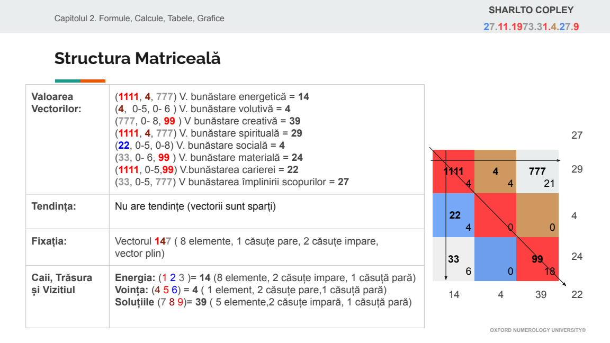

```text
Capitolul 2. Formule, Calcule, Tabele, Grafice
Structura Matriceală
Valoarea (1111, 4, 777) V. bunăstare energetică = 14
Vectorilor: (4, 0-5, 0- 6 ) V. bunăstare volutivă = 4
(777, 0- 8, 99 ) V bunăstare creativă = 39
(1111, 4, 777) V. bunăstare spirituală = 29 27
(22, 0-5, 0-8) V. bunăstare socială = 4
(33, 0- 6, 99 ) V. bunăstare materială = 24
(1111, 0-5,99) V.bunăstarea carierei = 22 1111 4 777 29
(33, 0-5, 777) V bunăstarea împlinirii scopurilor = 27 4 4 21
Tendința: Nu are tendințe (vectorii sunt sparți)
22 4
4 0 0
Fixația: Vectorul 147 ( 8 elemente, 1 căsuțe pare, 2 căsuțe impare,
vector plin)
33 99 24
6 0 18
Caii, Trăsura Energia: (1 2 3 )= 14 (8 elemente, 2 căsuțe impare, 1 căsuță pară)
și Vizitiul Voința: (4 5 6) = 4 ( 1 element, 2 căsuțe pare,1 căsuță pară)
14 4 39 22
Soluțiile (7 8 9)= 39 ( 5 elemente,2 căsuțe impară, 1 căsuță pară)
OXFORD NUMEROLOGY UNIVERSITY®
```

### Pagina 26

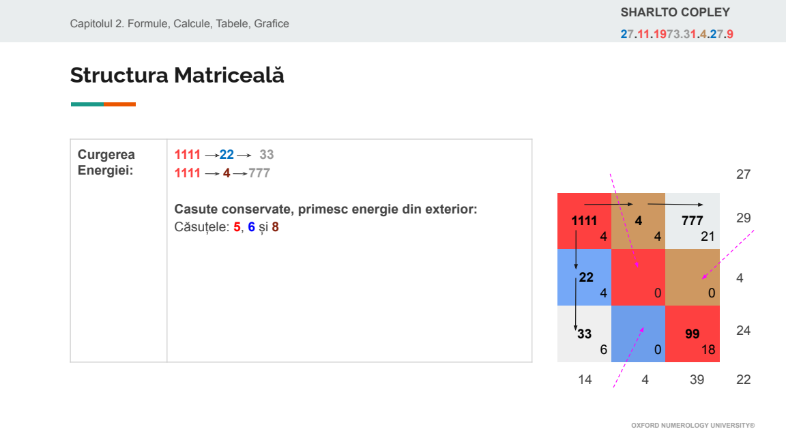

```text
Capitolul 2. Formule, Calcule, Tabele, Grafice
Structura Matriceală
Curgerea 1111 22 33
Energiei: 1111 4 777 27
Casute conservate, primesc energie din exterior:
1111 4 777 29
Căsuțele: 5, 6 și 8
4 4 21
22 4
4 0 0
33 99 24
6 0 18
14 4 39 22
OXFORD NUMEROLOGY UNIVERSITY®
```

### Pagina 27

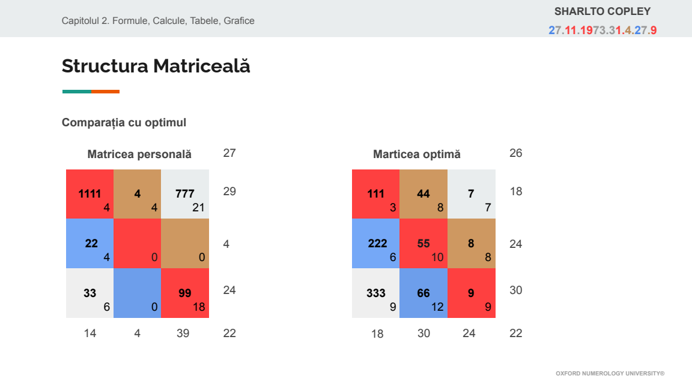

```text
Capitolul 2. Formule, Calcule, Tabele, Grafice
Structura Matriceală
Comparația cu optimul
Matricea personală 27 Marticea optimă 26
1111 4 777 29 111 44 7 18
4 4 21 3 8 7
22 4 222 55 8 24
4 0 0 6 10 8
33 99 24 333 66 9 30
6 0 18 9 12 9
14 4 39 22 18 30 24 22
OXFORD NUMEROLOGY UNIVERSITY®
```

### Pagina 28


```text
Capitolul 2. Formule, Calcule, Tabele, Grafice
Scara Bunăstării
Valorile căsuțelor și vectorilor ordonate succesiv
27
0 Căsuțele: 5, 6, 8 29 V. bunăstarea spirituală - (1111, 4, 777)
Căsuțele: 1111, 22, 4
V. bunăstarea creativă - (777, (0-8),
4 V. bunăstare socială - (22, (0-5), (0-8) 39
V. bunăstare volitivă - (4, (0-5), (0-6) 99) 1111 4 777 29
4 4 21
6 Căsuțele: 33
14 V. bunăstare energetică - 1111, 22, 33
22 4
18 Căsuțele: 99
4 0 0
21 Căsuțele: 777
22 V. bunăstarea carierei - (1111, (0-5), 99) 33 99 24
24 V. bunăstarea materială - (33, (0-6), 99) 6 0 18
V. Bunăstarea împlinirii scopurilor - (33,
27
(0-5), 777) 14 4 39 22
OXFORD NUMEROLOGY UNIVERSITY®
```

### Pagina 29

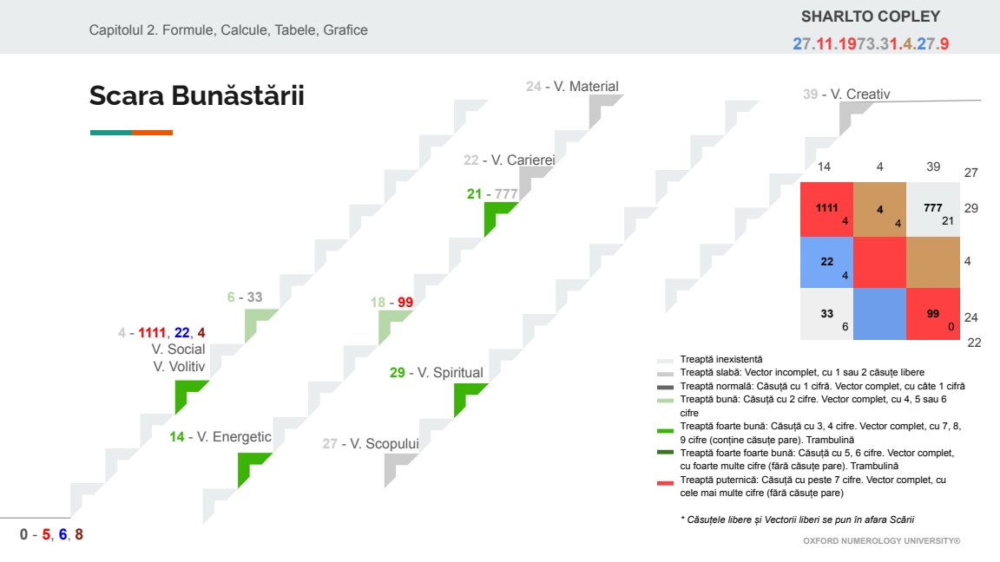

```text
Capitolul 2. Formule, Calcule, Tabele, Grafice
Scara Bunăstării 24 - V. Material
22 - V. Carierei
14 4 39
27
21 - 777
1111 4 777 29
4 4 21
22 4
4
6 - 33
18 - 99
33 99 24
6 0
4 - 1111, 22, 4
22
V. Social
Treaptă inexistentă
V. Volitiv
29 - V. Spiritual Treaptă slabă: Vector incomplet, cu 1 sau 2 căsuțe libere
Treaptă normală: Căsuță cu 1 cifră. Vector complet, cu câte 1 cifră
Treaptă bună: Căsuță cu 2 cifre. Vector complet, cu 4, 5 sau 6
cifre
Treaptă foarte bună: Căsuță cu 3, 4 cifre. Vector complet, cu 7, 8,
14 - V. Energetic
27 - V. Scopului 9 cifre (conține căsuțe pare). Trambulină
Treaptă foarte foarte bună: Căsuță cu 5, 6 cifre. Vector complet,
cu foarte multe cifre (fără căsuțe pare). Trambulină
Treaptă puternică: Căsuță cu peste 7 cifre. Vector complet, cu
cele mai multe cifre (fără căsuțe pare)
* Căsuțele libere și Vectorii liberi se pun în afara Scării
0 - 5, 6, 8
OXFORD NUMEROLOGY UNIVERSITY®
vitaerC
.V
-
93
```

### Pagina 30

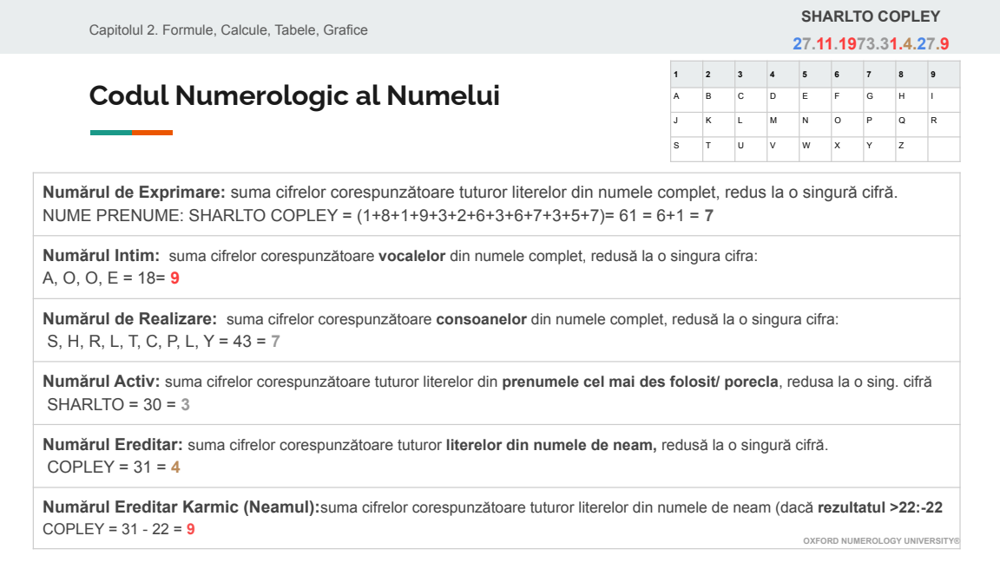

```text
Capitolul 2. Formule, Calcule, Tabele, Grafice
1 2 3 4 5 6 7 8 9
Codul Numerologic al Numelui
A B C D E F G H I
J K L M N O P Q R
S T U V W X Y Z
Numărul de Exprimare: suma cifrelor corespunzătoare tuturor literelor din numele complet, redus la o singură cifră.
NUME PRENUME: SHARLTO COPLEY = (1+8+1+9+3+2+6+3+6+7+3+5+7)= 61 = 6+1 = 7
Numărul Intim: suma cifrelor corespunzătoare vocalelor din numele complet, redusă la o singura cifra:
A, O, O, E = 18= 9
Numărul de Realizare: suma cifrelor corespunzătoare consoanelor din numele complet, redusă la o singura cifra:
S, H, R, L, T, C, P, L, Y = 43 = 7
Numărul Activ: suma cifrelor corespunzătoare tuturor literelor din prenumele cel mai des folosit/ porecla, redusa la o sing. cifră
SHARLTO = 30 = 3
Numărul Ereditar: suma cifrelor corespunzătoare tuturor literelor din numele de neam, redusă la o singură cifră.
COPLEY = 31 = 4
Numărul Ereditar Karmic (Neamul):suma cifrelor corespunzătoare tuturor literelor din numele de neam (dacă rezultatul >22:-22
COPLEY = 31 - 22 = 9
OXFORD NUMEROLOGY UNIVERSITY®
```

### Pagina 31

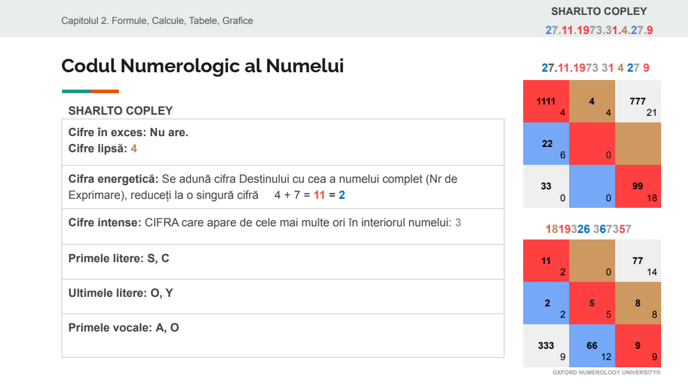

```text
Capitolul 2. Formule, Calcule, Tabele, Grafice
Codul Numerologic al Numelui
27.11.1973 31 4 27 9
1111 4 777
Cifre în exces: Nu are.
22
Cifre lipsă: 4
6 0
Cifra energetică: Se adună cifra Destinului cu cea a numelui complet (Nr de
33 99
Exprimare), reduceți la o singură cifră 4 + 7 = 11 = 2
0 0 18
Cifre intense: CIFRA care apare de cele mai multe ori în interiorul numelui: 3
1819326 367357
Primele litere: S, C
11 77
2 0 14
Ultimele litere: O, Y
2 5 8
2 5 8
Primele vocale: A, O
333 66 9
9 12 9
OXFORD NUMEROLOGY UNIVERSITY®
```

### Pagina 32

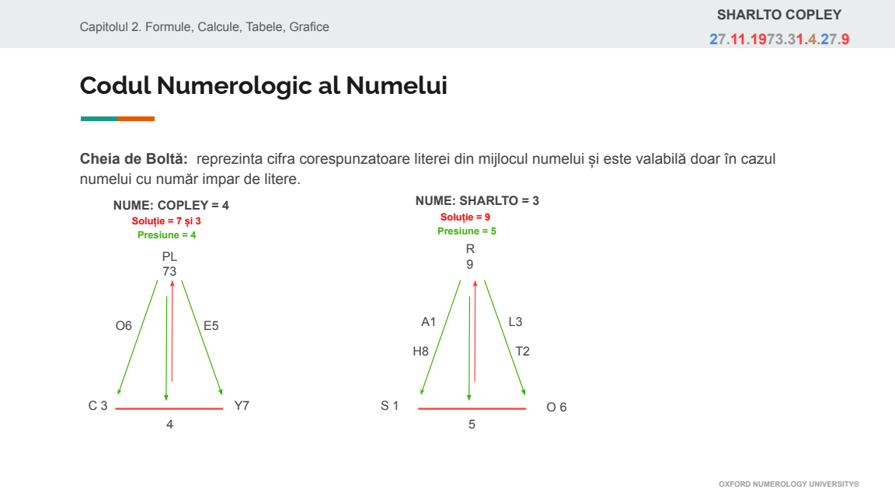

```text
Capitolul 2. Formule, Calcule, Tabele, Grafice
Codul Numerologic al Numelui
Cheia de Boltă: reprezinta cifra corespunzatoare literei din mijlocul numelui și este valabilă doar în cazul
numelui cu număr impar de litere.
NUME: SHARLTO = 3
NUME: COPLEY = 4
Soluție = 9
Soluție = 7 și 3
Presiune = 5
Presiune = 4
R
PL
9
73
A1 L3
O6 E5
H8 T2
C 3 Y7 S 1 O 6
4 5
OXFORD NUMEROLOGY UNIVERSITY®
```

### Pagina 33

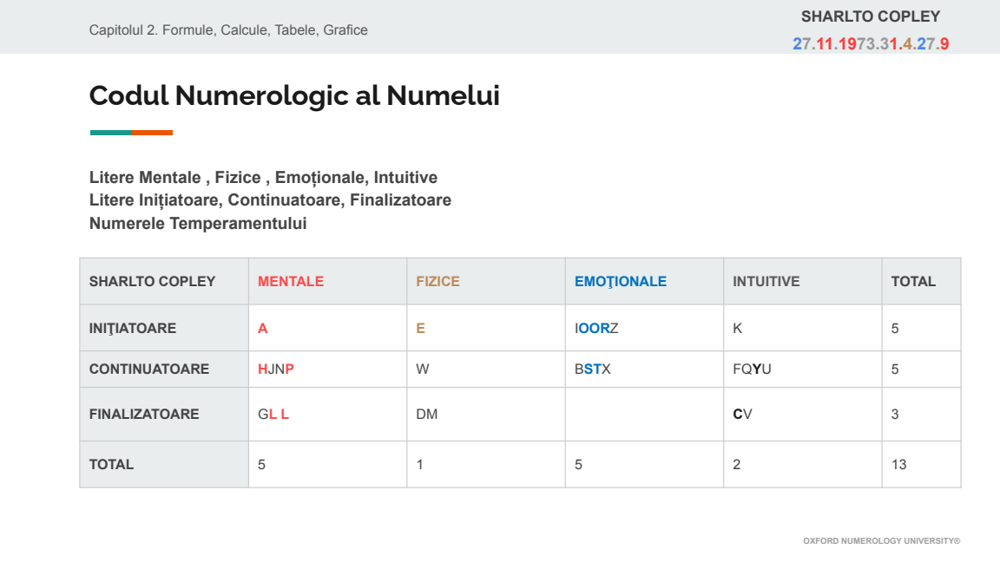

```text
Capitolul 2. Formule, Calcule, Tabele, Grafice
Codul Numerologic al Numelui
Litere Mentale , Fizice , Emoționale, Intuitive
Litere Inițiatoare, Continuatoare, Finalizatoare
Numerele Temperamentului
INIŢIATOARE A E IOORZ K 5
CONTINUATOARE HJNP W BSTX FQYU 5
FINALIZATOARE GL L DM CV 3
TOTAL 5 1 5 2 13
OXFORD NUMEROLOGY UNIVERSITY®
```

### Pagina 34

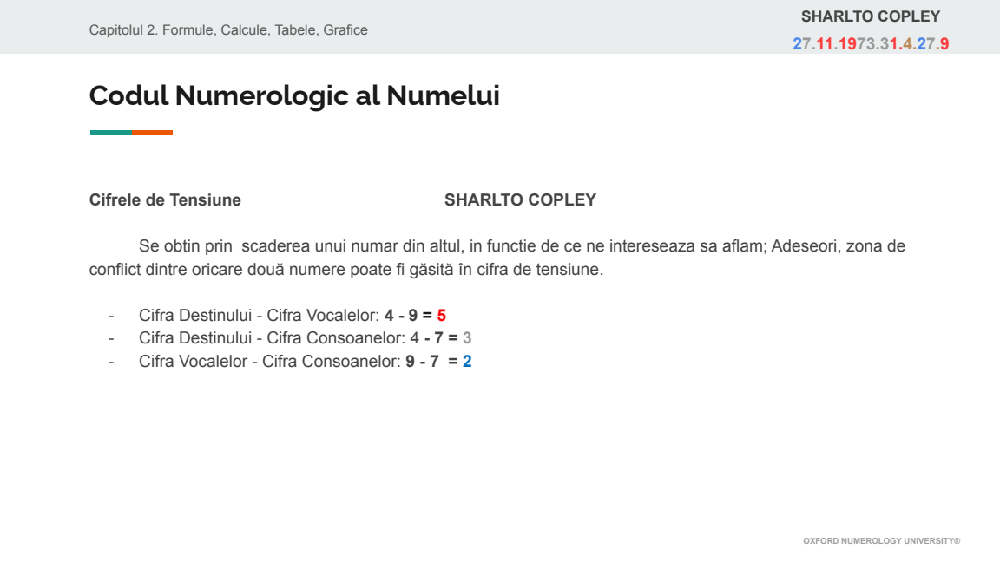

```text
Capitolul 2. Formule, Calcule, Tabele, Grafice
Codul Numerologic al Numelui
Cifrele de Tensiune SHARLTO COPLEY
Se obtin prin scaderea unui numar din altul, in functie de ce ne intereseaza sa aflam; Adeseori, zona de
conflict dintre oricare două numere poate fi găsită în cifra de tensiune.
- Cifra Destinului - Cifra Vocalelor: 4 - 9 = 5
- Cifra Destinului - Cifra Consoanelor: 4 - 7 = 3
- Cifra Vocalelor - Cifra Consoanelor: 9 - 7 = 2
OXFORD NUMEROLOGY UNIVERSITY®
```

### Pagina 35

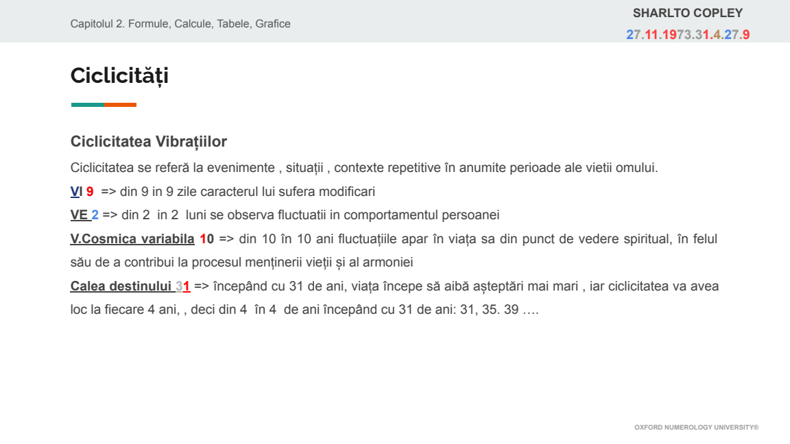

```text
Capitolul 2. Formule, Calcule, Tabele, Grafice
Ciclicități
Ciclicitatea Vibrațiilor
Ciclicitatea se referă la evenimente , situații , contexte repetitive în anumite perioade ale vietii omului.
VI 9 => din 9 in 9 zile caracterul lui sufera modificari
VE 2 => din 2 in 2 luni se observa fluctuatii in comportamentul persoanei
V.Cosmica variabila 10 => din 10 în 10 ani fluctuațiile apar în viața sa din punct de vedere spiritual, în felul
său de a contribui la procesul menținerii vieții și al armoniei
Calea destinului 31 => începând cu 31 de ani, viața începe să aibă așteptări mai mari , iar ciclicitatea va avea
loc la fiecare 4 ani, , deci din 4 în 4 de ani începând cu 31 de ani: 31, 35. 39 ….
OXFORD NUMEROLOGY UNIVERSITY®
```

### Pagina 36

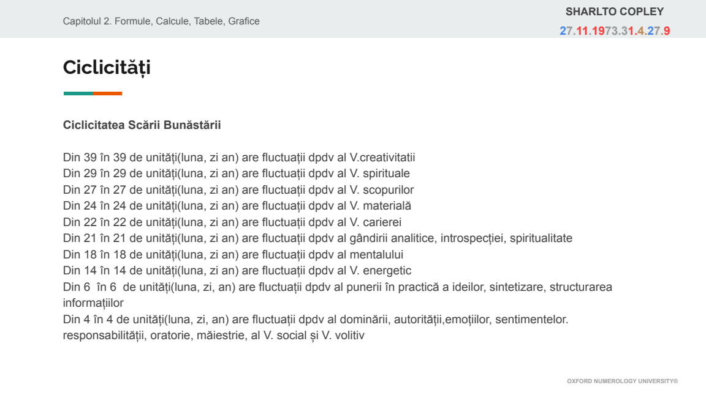

```text
Capitolul 2. Formule, Calcule, Tabele, Grafice
Ciclicități
Ciclicitatea Scării Bunăstării
Din 39 în 39 de unități(luna, zi an) are fluctuații dpdv al V.creativitatii
Din 29 în 29 de unități(luna, zi an) are fluctuații dpdv al V. spirituale
Din 27 în 27 de unități(luna, zi an) are fluctuații dpdv al V. scopurilor
Din 24 în 24 de unități(luna, zi an) are fluctuații dpdv al V. materială
Din 22 în 22 de unități(luna, zi an) are fluctuații dpdv al V. carierei
Din 21 în 21 de unități(luna, zi an) are fluctuații dpdv al gândirii analitice, introspecției, spiritualitate
Din 18 în 18 de unități(luna, zi an) are fluctuații dpdv al mentalului
Din 14 în 14 de unități(luna, zi an) are fluctuații dpdv al V. energetic
Din 6 în 6 de unități(luna, zi, an) are fluctuații dpdv al punerii în practică a ideilor, sintetizare, structurarea
informațiilor
Din 4 în 4 de unități(luna, zi, an) are fluctuații dpdv al dominării, autorității,emoțiilor, sentimentelor.
responsabilității, oratorie, măiestrie, al V. social și V. volitiv
OXFORD NUMEROLOGY UNIVERSITY®
```

### Pagina 37

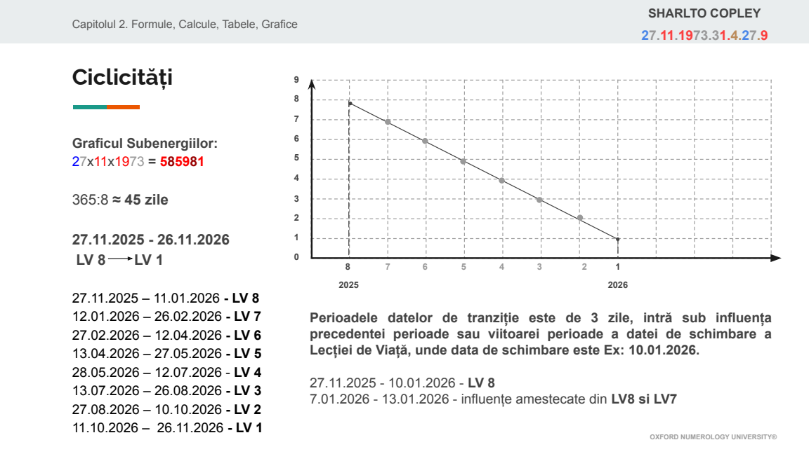

```text
Capitolul 2. Formule, Calcule, Tabele, Grafice
Ciclicități
9
8
7
Graficul Subenergiilor: 6
27x11x1973 = 585981 5
4
365:8 ≈ 45 zile 3
2
27.11.2025 - 26.11.2026 1
LV 8 LV 1 0
8 7 6 5 4 3 2 1
2025 2026
27.11.2025 – 11.01.2026 - LV 8
12.01.2026 – 26.02.2026 - LV 7 Perioadele datelor de tranziție este de 3 zile, intră sub influența
27.02.2026 – 12.04.2026 - LV 6 precedentei perioade sau viitoarei perioade a datei de schimbare a
13.04.2026 – 27.05.2026 - LV 5 Lecției de Viață, unde data de schimbare este Ex: 10.01.2026.
28.05.2026 – 12.07.2026 - LV 4
27.11.2025 - 10.01.2026 - LV 8
13.07.2026 – 26.08.2026 - LV 3
7.01.2026 - 13.01.2026 - influențe amestecate din LV8 si LV7
27.08.2026 – 10.10.2026 - LV 2
11.10.2026 – 26.11.2026 - LV 1
OXFORD NUMEROLOGY UNIVERSITY®
```

### Pagina 38

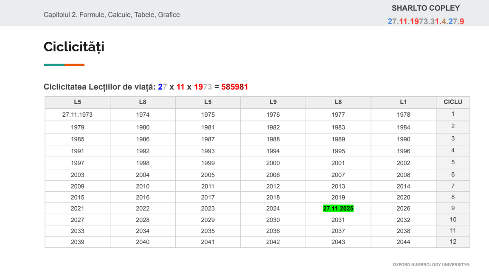

```text
Capitolul 2. Formule, Calcule, Tabele, Grafice
Ciclicități
Ciclicitatea Lecțiilor de viață: 27 x 11 x 1973 = 585981
L5 L8 L5 L9 L8 L1 CICLU
27.11.1973 1974 1975 1976 1977 1978 1
1979 1980 1981 1982 1983 1984 2
1985 1986 1987 1988 1989 1990 3
1991 1992 1993 1994 1995 1996 4
1997 1998 1999 2000 2001 2002 5
2003 2004 2005 2006 2007 2008 6
2009 2010 2011 2012 2013 2014 7
2015 2016 2017 2018 2019 2020 8
2021 2022 2023 2024 27.11.2025 2026 9
2027 2028 2029 2030 2031 2032 10
2033 2034 2035 2036 2037 2038 11
2039 2040 2041 2042 2043 2044 12
OXFORD NUMEROLOGY UNIVERSITY®
```

### Pagina 39

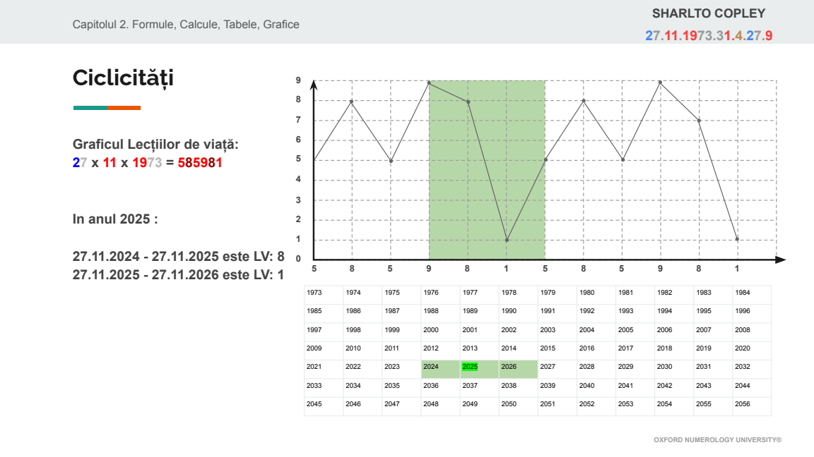

```text
Capitolul 2. Formule, Calcule, Tabele, Grafice
Ciclicități
9
8
7
Graficul Lecțiilor de viață: 6
27 x 11 x 1973 = 585981 5
4
3
In anul 2025 : 2
1
27.11.2024 - 27.11.2025 este LV: 8
0
5 8 5 9 8 1 5 8 5 9 8 1
27.11.2025 - 27.11.2026 este LV: 1
1973 1974 1975 1976 1977 1978 1979 1980 1981 1982 1983 1984
1985 1986 1987 1988 1989 1990 1991 1992 1993 1994 1995 1996
1997 1998 1999 2000 2001 2002 2003 2004 2005 2006 2007 2008
2009 2010 2011 2012 2013 2014 2015 2016 2017 2018 2019 2020
2021 2022 2023 2024 2025 2026 2027 2028 2029 2030 2031 2032
2033 2034 2035 2036 2037 2038 2039 2040 2041 2042 2043 2044
2045 2046 2047 2048 2049 2050 2051 2052 2053 2054 2055 2056
OXFORD NUMEROLOGY UNIVERSITY®
```

### Pagina 40

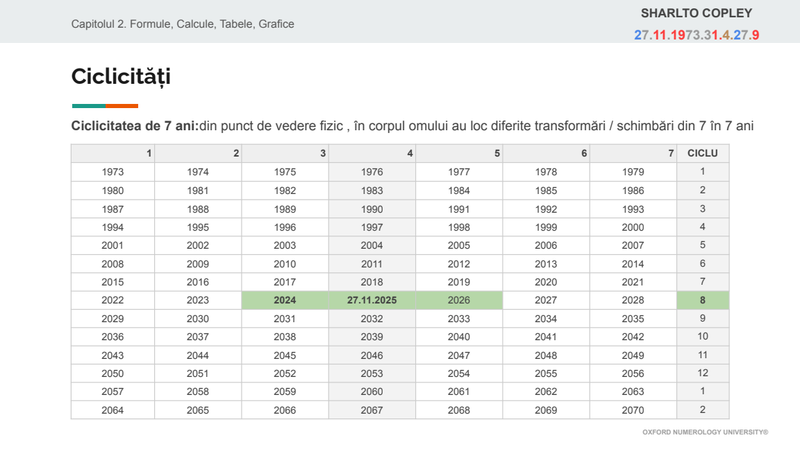

```text
Capitolul 2. Formule, Calcule, Tabele, Grafice
Ciclicități
Ciclicitatea de 7 ani:din punct de vedere fizic , în corpul omului au loc diferite transformări / schimbări din 7 în 7 ani
1 2 3 4 5 6 7 CICLU
1973 1974 1975 1976 1977 1978 1979 1
1980 1981 1982 1983 1984 1985 1986 2
1987 1988 1989 1990 1991 1992 1993 3
1994 1995 1996 1997 1998 1999 2000 4
2001 2002 2003 2004 2005 2006 2007 5
2008 2009 2010 2011 2012 2013 2014 6
2015 2016 2017 2018 2019 2020 2021 7
2022 2023 2024 27.11.2025 2026 2027 2028 8
2029 2030 2031 2032 2033 2034 2035 9
2036 2037 2038 2039 2040 2041 2042 10
2043 2044 2045 2046 2047 2048 2049 11
2050 2051 2052 2053 2054 2055 2056 12
2057 2058 2059 2060 2061 2062 2063 1
2064 2065 2066 2067 2068 2069 2070 2
OXFORD NUMEROLOGY UNIVERSITY®
```

### Pagina 41

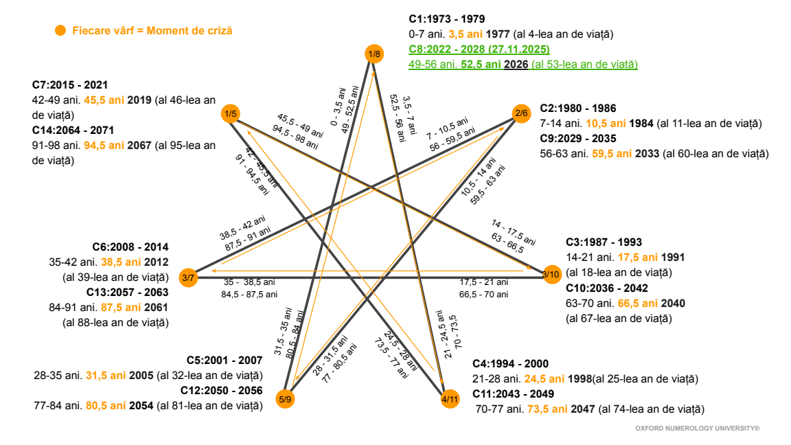

```text
C1:1973 - 1979
Fiecare vârf = Moment de criză 0-7 ani. 3,5 ani 1977 (al 4-lea an de viață)
C8:2022 - 2028 (27.11.2025)
1/8
49-56 ani. 52,5 ani 2026 (al 53-lea an de viață)
C7:2015 - 2021
4
d C 9
2
e 1 1
-
- 4 v
4
9 : i
9
8 a 2 ț 0
a
a ă 6
n
n ) 4
i
i
.
. -
4
9 2
5
4 0
,
,
5
5 7
a
a 1
n
n
i
i 2
2
0
0
6
1
7
9 (
(
a
a
l
l
4
9
6
5
-
-
l
l
e
e
a
a
a
a
n
n 1/5 4 2 94 4 , 5 5 , 5 - 9 - 8 4 9 a n a i ni 0 -
3, 5 a
ni
4 9 - 5
2, 5 a
ni
5 2 ,5
- 5 6 a n i
3 ,5
- 7 a n i 7 5 - 6 1 - 0 5 ,5 9 , a 5 n a i ni 2/6
C
7 C 5 - 6
2
9 1 -
:
: 4 6
1
2 3
9
0 a
8
2 n a
0
9 i n . i
-
- 1 .
1
2 5 0
9
0 9 ,5
8
3 ,5 a
6
5 a n n i i 1 9 2 8 0 4 3 3 ( a (a l 1 l 1 6 - 0 le -l a e a a n a n d e d e v i v a i ț a ă ț ) ă)
de viață) 9 1 - 9 4
,
-
5
4
a
5
n
,5
i a n i 1 0, 5 9 - ,
1
5
4
-
a
6
n
3
i a ni
5
C6:2008 - 2014 38 8 , 7 5 , 5 - 4 - 2 9 1 a n a i ni 1 6 4 3 - - 1 6 7 6 , , 5 5 ani C3:1987 - 1993
14-21 ani. 17,5 ani 1991
35-42 ani. 38,5 ani 2012
(al 39-lea an de viață) 3/7 3/10 (al 18-lea an de viață)
35 - 38,5 ani 17,5 - 21 ani
C10:2036 - 2042
C13:2057 - 2063 84,5 - 87,5 ani 66,5 - 70 ani
63-70 ani. 66,5 ani 2040
84-91 ani. 87,5 ani 2061
28-35 ( a a n l i 8 . 8 3 - 1 le ,5 a a a n n i d 2 e 0 0 vi 5 a ț ( ă a ) l 32- C le 5 a : 2 a 0 n 0 d 1 e - v 2 ia 0 ț 0 ă 7 ) 3 1, 5 - 3 5 a
ni
8 0, 5 - 8 4 a
ni
2 8 - 7 3 7 1 - , 5 8 0 a , n 5 i a ni 7 3 ,5 2 - 4 7 ,5 7 - a 2 n 8 i a n i
in
a 5 ,4 2 - 1 2 5 ,3 7 - 0 7 C 21 4 - : 2 1 8 9 9 a 4 n i - . 2 2 0 4 0 ,5 0 ani ( 1 a 9 l 9 6 8 7 ( - a le l a 2 5 a - n le d a e a v n ia d ță e ) viață)
C12:2050 - 2056
C11:2043 - 2049
5/9 4/11
77-84 ani. 80,5 ani 2054 (al 81-lea an de viață)
70-77 ani. 73,5 ani 2047 (al 74-lea an de viață)
OXFORD NUMEROLOGY UNIVERSITY®
```

### Pagina 42

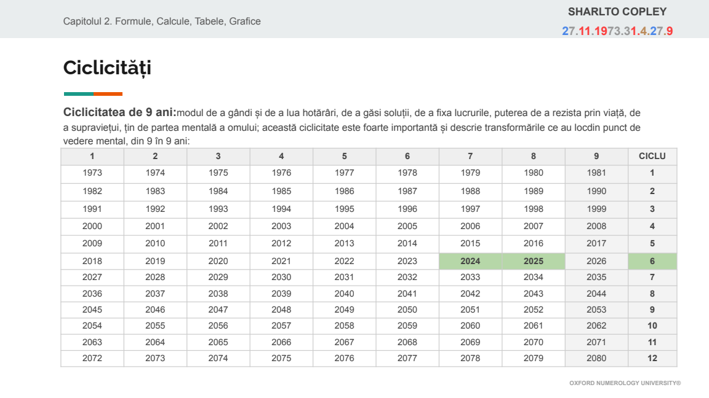

```text
Capitolul 2. Formule, Calcule, Tabele, Grafice
Ciclicități
Ciclicitatea de 9 ani:modul de a gândi și de a lua hotărâri, de a găsi soluții, de a fixa lucrurile, puterea de a rezista prin viață, de
a supraviețui, țin de partea mentală a omului; această ciclicitate este foarte importantă și descrie transformările ce au locdin punct de
vedere mental, din 9 în 9 ani:
1 2 3 4 5 6 7 8 9 CICLU
1973 1974 1975 1976 1977 1978 1979 1980 1981 1
1982 1983 1984 1985 1986 1987 1988 1989 1990 2
1991 1992 1993 1994 1995 1996 1997 1998 1999 3
2000 2001 2002 2003 2004 2005 2006 2007 2008 4
2009 2010 2011 2012 2013 2014 2015 2016 2017 5
2018 2019 2020 2021 2022 2023 2024 2025 2026 6
2027 2028 2029 2030 2031 2032 2033 2034 2035 7
2036 2037 2038 2039 2040 2041 2042 2043 2044 8
2045 2046 2047 2048 2049 2050 2051 2052 2053 9
2054 2055 2056 2057 2058 2059 2060 2061 2062 10
2063 2064 2065 2066 2067 2068 2069 2070 2071 11
2072 2073 2074 2075 2076 2077 2078 2079 2080 12
OXFORD NUMEROLOGY UNIVERSITY®
```

### Pagina 43

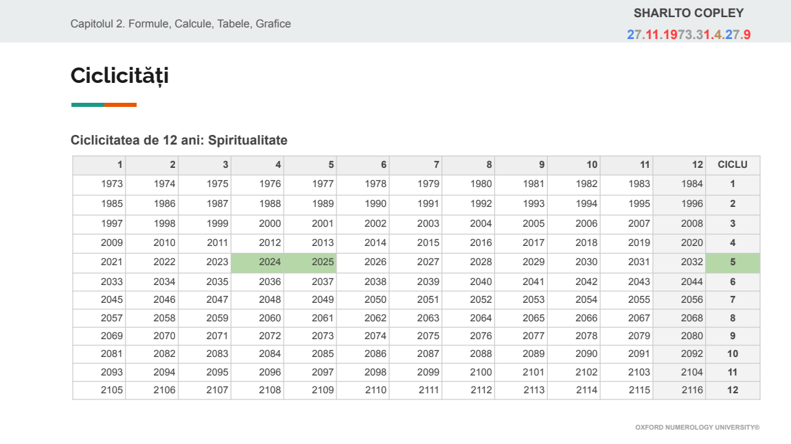

```text
Capitolul 2. Formule, Calcule, Tabele, Grafice
Ciclicități
Ciclicitatea de 12 ani: Spiritualitate
1 2 3 4 5 6 7 8 9 10 11 12 CICLU
1973 1974 1975 1976 1977 1978 1979 1980 1981 1982 1983 1984 1
1985 1986 1987 1988 1989 1990 1991 1992 1993 1994 1995 1996 2
1997 1998 1999 2000 2001 2002 2003 2004 2005 2006 2007 2008 3
2009 2010 2011 2012 2013 2014 2015 2016 2017 2018 2019 2020 4
2021 2022 2023 2024 2025 2026 2027 2028 2029 2030 2031 2032 5
2033 2034 2035 2036 2037 2038 2039 2040 2041 2042 2043 2044 6
2045 2046 2047 2048 2049 2050 2051 2052 2053 2054 2055 2056 7
2057 2058 2059 2060 2061 2062 2063 2064 2065 2066 2067 2068 8
2069 2070 2071 2072 2073 2074 2075 2076 2077 2078 2079 2080 9
2081 2082 2083 2084 2085 2086 2087 2088 2089 2090 2091 2092 10
2093 2094 2095 2096 2097 2098 2099 2100 2101 2102 2103 2104 11
2105 2106 2107 2108 2109 2110 2111 2112 2113 2114 2115 2116 12
OXFORD NUMEROLOGY UNIVERSITY®
```

### Pagina 44

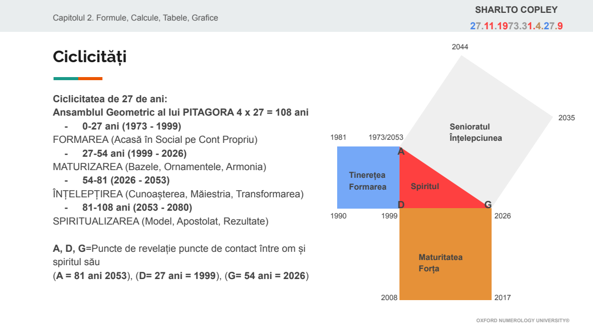

```text
Capitolul 2. Formule, Calcule, Tabele, Grafice
2044
Ciclicități
Ciclicitatea de 27 de ani:
Ansamblul Geometric al lui PITAGORA 4 x 27 = 108 ani
2035
- 0-27 ani (1973 - 1999) Senioratul
FORMAREA (Acasă în Social pe Cont Propriu) 1981 1973/2053 Înțelepciunea
- 27-54 ani (1999 - 2026) A
MATURIZAREA (Bazele, Ornamentele, Armonia)
Tinerețea
- 54-81 (2026 - 2053)
Formarea Spiritul
ÎNȚELEPȚIREA (Cunoașterea, Măiestria, Transformarea)
D G
- 81-108 ani (2053 - 2080)
1990 1999 2026
SPIRITUALIZAREA (Model, Apostolat, Rezultate)
A, D, G=Puncte de revelație puncte de contact între om și
Maturitatea
spiritul său
Forța
(A = 81 ani 2053), (D= 27 ani = 1999), (G= 54 ani = 2026)
2008 2017
OXFORD NUMEROLOGY UNIVERSITY®
```

### Pagina 45

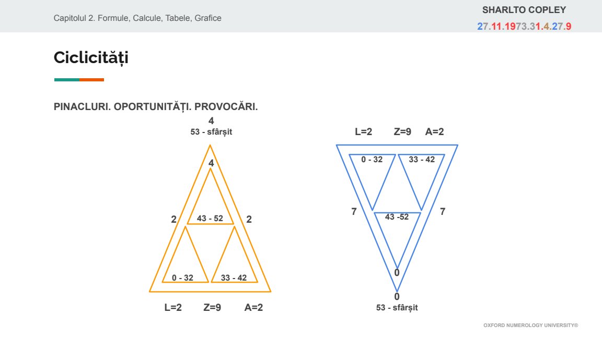

```text
Capitolul 2. Formule, Calcule, Tabele, Grafice
Ciclicități
PINACLURI. OPORTUNITĂȚI. PROVOCĂRI.
4
53 - sfârșit L=2 Z=9 A=2
0 - 32 33 - 42
4
7 7
2 43 - 52 2 43 -52
0
0 - 32 33 - 42
0
L=2 Z=9 A=2 53 - sfârșit
OXFORD NUMEROLOGY UNIVERSITY®
```

### Pagina 46

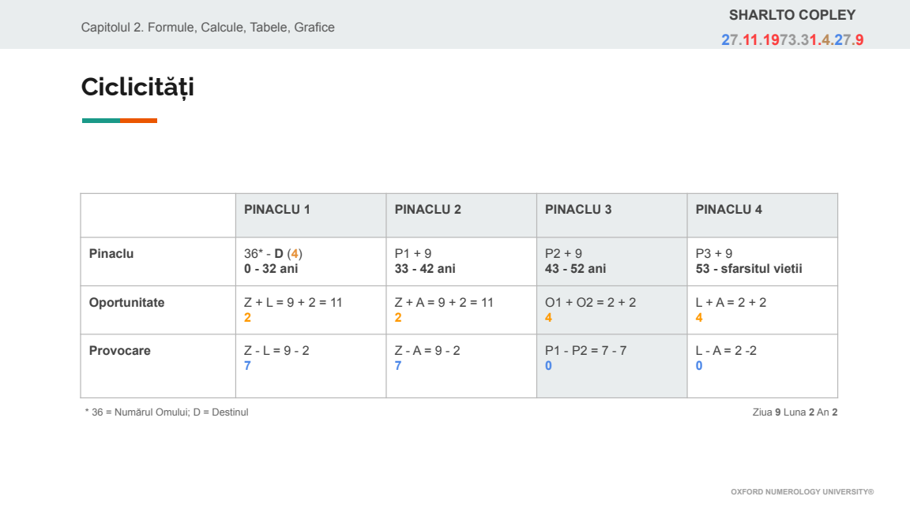

```text
Capitolul 2. Formule, Calcule, Tabele, Grafice
Ciclicități
PINACLU 1 PINACLU 2 PINACLU 3 PINACLU 4
Pinaclu 36* - D (4) P1 + 9 P2 + 9 P3 + 9
0 - 32 ani 33 - 42 ani 43 - 52 ani 53 - sfarsitul vietii
Oportunitate Z + L = 9 + 2 = 11 Z + A = 9 + 2 = 11 O1 + O2 = 2 + 2 L + A = 2 + 2
2 2 4 4
Provocare Z - L = 9 - 2 Z - A = 9 - 2 P1 - P2 = 7 - 7 L - A = 2 -2
7 7 0 0
* 36 = Numărul Omului; D = Destinul Ziua 9 Luna 2 An 2
OXFORD NUMEROLOGY UNIVERSITY®
```

### Pagina 47

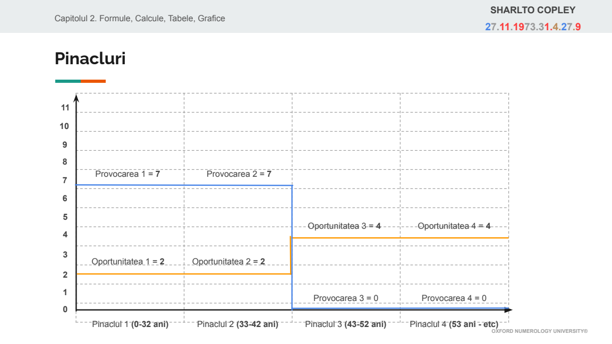

```text
Capitolul 2. Formule, Calcule, Tabele, Grafice
Pinacluri
11
10
9
8
Provocarea 1 = 7 Provocarea 2 = 7
7
6
5
Oportunitatea 3 = 4 Oportunitatea 4 = 4
4
3
Oportunitatea 1 = 2 Oportunitatea 2 = 2
2
1
Provocarea 3 = 0 Provocarea 4 = 0
0
Pinaclul 1 (0-32 ani) Pinaclul 2 (33-42 ani) Pinaclul 3 (43-52 ani) Pinaclul 4 (53 ani - etc)
OXFORD NUMEROLOGY UNIVERSITY®
```

### Pagina 48

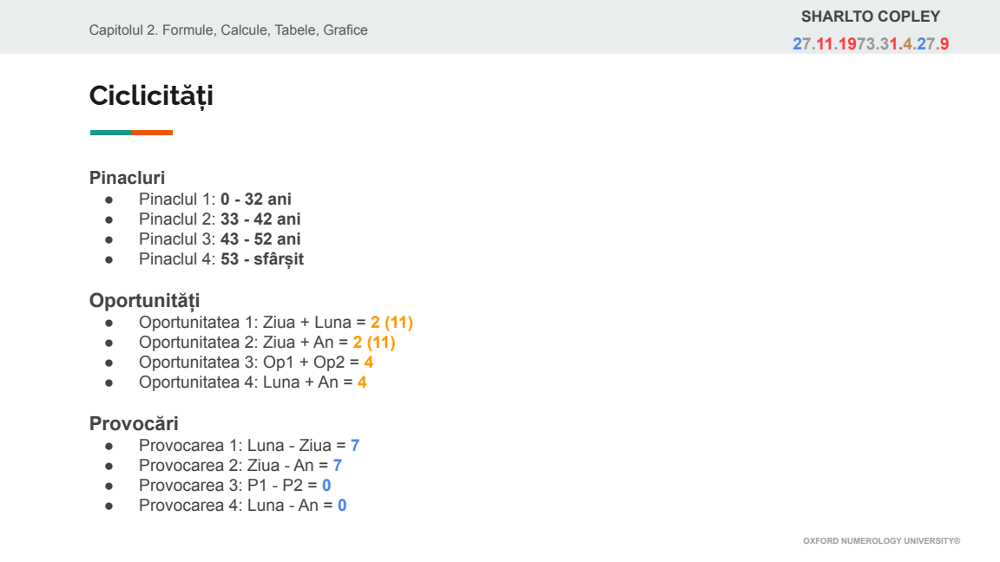

```text
Capitolul 2. Formule, Calcule, Tabele, Grafice
Ciclicități
Pinacluri
● Pinaclul 1: 0 - 32 ani
● Pinaclul 2: 33 - 42 ani
● Pinaclul 3: 43 - 52 ani
● Pinaclul 4: 53 - sfârșit
Oportunități
● Oportunitatea 1: Ziua + Luna = 2 (11)
● Oportunitatea 2: Ziua + An = 2 (11)
● Oportunitatea 3: Op1 + Op2 = 4
● Oportunitatea 4: Luna + An = 4
Provocări
● Provocarea 1: Luna - Ziua = 7
● Provocarea 2: Ziua - An = 7
● Provocarea 3: P1 - P2 = 0
● Provocarea 4: Luna - An = 0
OXFORD NUMEROLOGY UNIVERSITY®
```

### Pagina 49

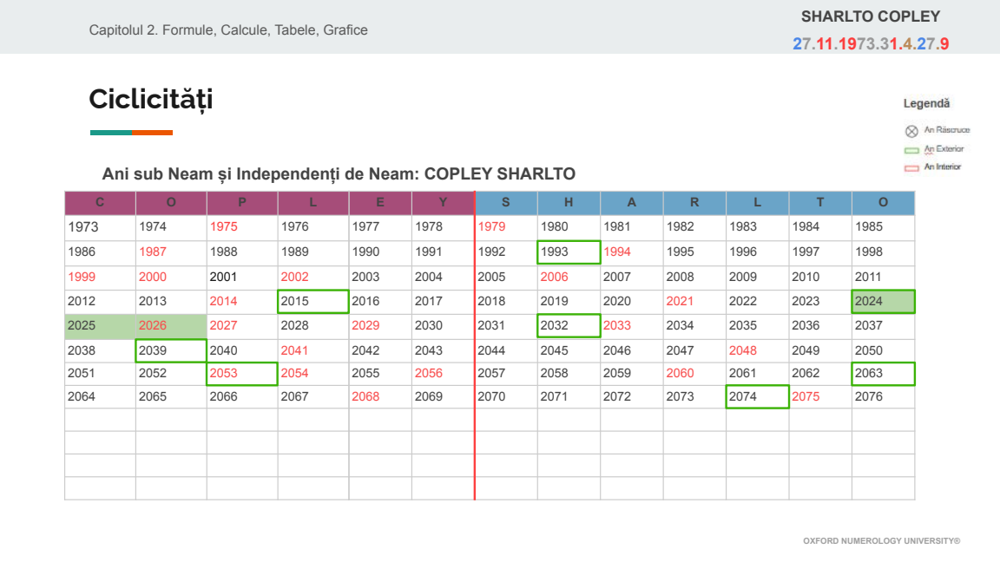

```text
Capitolul 2. Formule, Calcule, Tabele, Grafice
Ciclicități
Ani sub Neam și Independenți de Neam: COPLEY SHARLTO
C O P L E Y S H A R L T O
1973 1974 1975 1976 1977 1978 1979 1980 1981 1982 1983 1984 1985
1986 1987 1988 1989 1990 1991 1992 1993 1994 1995 1996 1997 1998
1999 2000 2001 2002 2003 2004 2005 2006 2007 2008 2009 2010 2011
2012 2013 2014 2015 2016 2017 2018 2019 2020 2021 2022 2023 2024
2025 2026 2027 2028 2029 2030 2031 2032 2033 2034 2035 2036 2037
2038 2039 2040 2041 2042 2043 2044 2045 2046 2047 2048 2049 2050
2051 2052 2053 2054 2055 2056 2057 2058 2059 2060 2061 2062 2063
2064 2065 2066 2067 2068 2069 2070 2071 2072 2073 2074 2075 2076
OXFORD NUMEROLOGY UNIVERSITY®
```

### Pagina 50

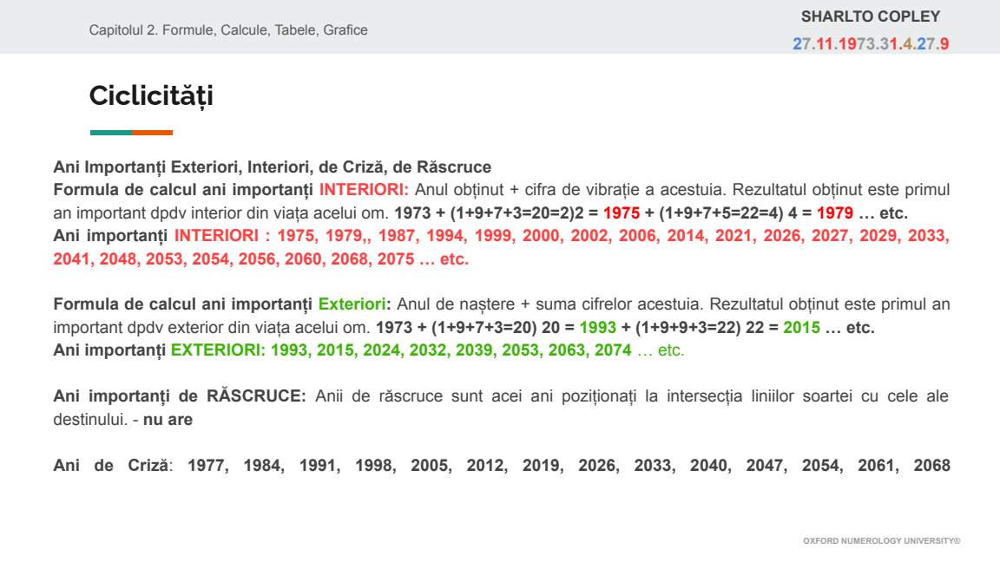

```text
Capitolul 2. Formule, Calcule, Tabele, Grafice
Ciclicități
Ani Importanți Exteriori, Interiori, de Criză, de Răscruce
Formula de calcul ani importanți INTERIORI: Anul obținut + cifra de vibrație a acestuia. Rezultatul obținut este primul
an important dpdv interior din viața acelui om. 1973 + (1+9+7+3=20=2)2 = 1975 + (1+9+7+5=22=4) 4 = 1979 … etc.
Ani importanți INTERIORI : 1975, 1979,, 1987, 1994, 1999, 2000, 2002, 2006, 2014, 2021, 2026, 2027, 2029, 2033,
2041, 2048, 2053, 2054, 2056, 2060, 2068, 2075 … etc.
Formula de calcul ani importanți Exteriori: Anul de naștere + suma cifrelor acestuia. Rezultatul obținut este primul an
important dpdv exterior din viața acelui om. 1973 + (1+9+7+3=20) 20 = 1993 + (1+9+9+3=22) 22 = 2015 … etc.
Ani importanți EXTERIORI: 1993, 2015, 2024, 2032, 2039, 2053, 2063, 2074 … etc.
Ani importanți de RĂSCRUCE: Anii de răscruce sunt acei ani poziționați la intersecția liniilor soartei cu cele ale
destinului. - nu are
Ani de Criză: 1977, 1984, 1991, 1998, 2005, 2012, 2019, 2026, 2033, 2040, 2047, 2054, 2061, 2068
OXFORD NUMEROLOGY UNIVERSITY®
```

### Pagina 51

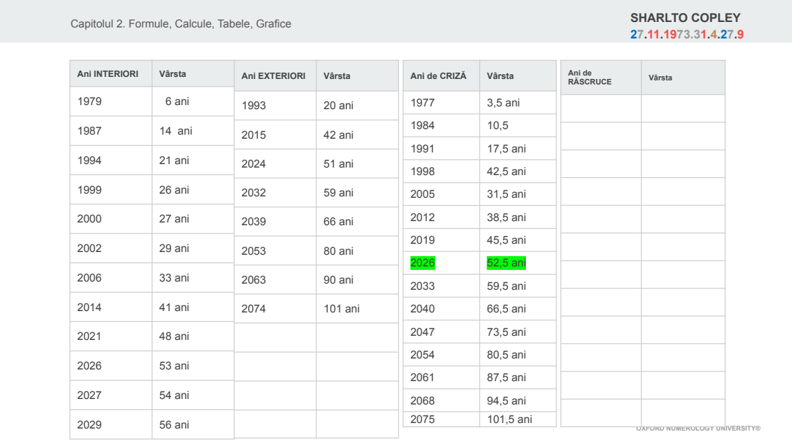

```text
Capitolul 2. Formule, Calcule, Tabele, Grafice
Ani INTERIORI Vârsta Ani EXTERIORI Vârsta Ani de CRIZĂ Vârsta Ani de Vârsta
RĂSCRUCE
1979 6 ani 1993 20 ani 1977 3,5 ani
1984 10,5
1987 14 ani
2015 42 ani
1991 17,5 ani
1994 21 ani
2024 51 ani
1998 42,5 ani
1999 26 ani 2032 59 ani 2005 31,5 ani
2000 27 ani 2039 66 ani 2012 38,5 ani
2019 45,5 ani
2002 29 ani 2053 80 ani
2026 52,5 ani
2006 33 ani 2063 90 ani
2033 59,5 ani
2014 41 ani 2074 101 ani 2040 66,5 ani
2047 73,5 ani
2021 48 ani
2054 80,5 ani
2026 53 ani
2061 87,5 ani
2027 54 ani
2068 94,5 ani
2075 101,5 ani
2029 56 ani
OXFORD NUMEROLOGY UNIVERSITY®
```

### Pagina 52

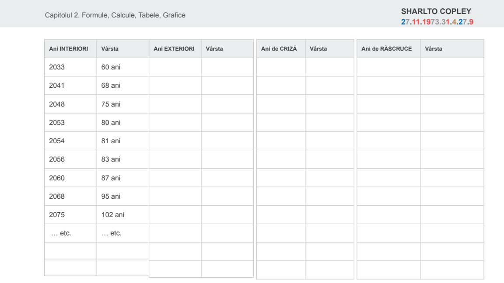

```text
Capitolul 2. Formule, Calcule, Tabele, Grafice
Ani INTERIORI Vârsta Ani EXTERIORI Vârsta Ani de CRIZĂ Vârsta Ani de RĂSCRUCE Vârsta
2033 60 ani
2041 68 ani
2048 75 ani
2053 80 ani
2054 81 ani
2056 83 ani
2060 87 ani
2068 95 ani
2075 102 ani
… etc. … etc.
OXFORD NUMEROLOGY UNIVERSITY®
```

### Pagina 53

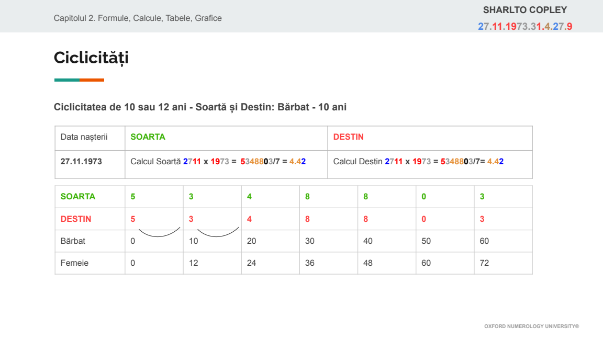

```text
Capitolul 2. Formule, Calcule, Tabele, Grafice
Ciclicități
Ciclicitatea de 10 sau 12 ani - Soartă și Destin: Bărbat - 10 ani
Data nașterii SOARTA DESTIN
27.11.1973 Calcul Soartă 2711 x 1973 = 5348803/7 = 4.42 Calcul Destin 2711 x 1973 = 5348803/7= 4.42
SOARTA 5 3 4 8 8 0 3
DESTIN 5 3 4 8 8 0 3
Bărbat 0 10 20 30 40 50 60
Femeie 0 12 24 36 48 60 72
OXFORD NUMEROLOGY UNIVERSITY®
```

### Pagina 54

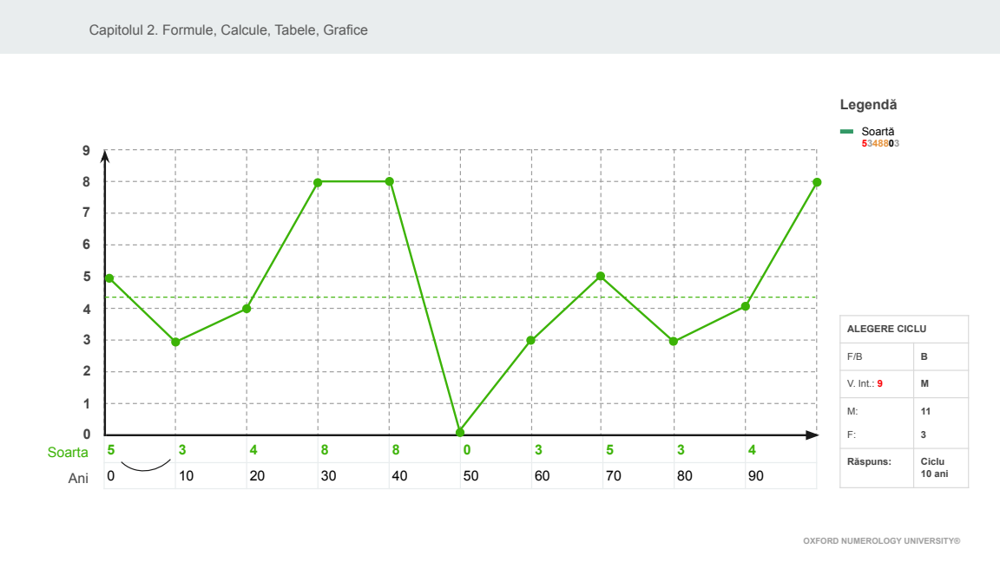

```text
Capitolul 2. Formule, Calcule, Tabele, Grafice
Legendă
Soartă
5348803
9
8
7
6
5
4
ALEGERE CICLU
3
F/B B
2
V. Int.: 9 M
1
M: 11
0 F: 3
Soarta 5 3 4 8 8 0 3 5 3 4
Răspuns: Ciclu
Ani 0 10 20 30 40 50 60 70 80 90 10 ani
OXFORD NUMEROLOGY UNIVERSITY®
```

### Pagina 55

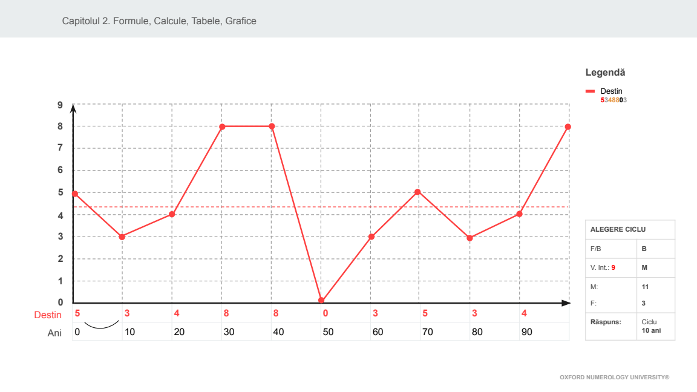

```text
Capitolul 2. Formule, Calcule, Tabele, Grafice
Legendă
Destin
5348803
9
8
7
6
5
4
ALEGERE CICLU
3
F/B B
2
V. Int.: 9 M
1
M: 11
0 F: 3
Destin 5 3 4 8 8 0 3 5 3 4
Răspuns: Ciclu
Ani 0 10 20 30 40 50 60 70 80 90 10 ani
OXFORD NUMEROLOGY UNIVERSITY®
```

### Pagina 56

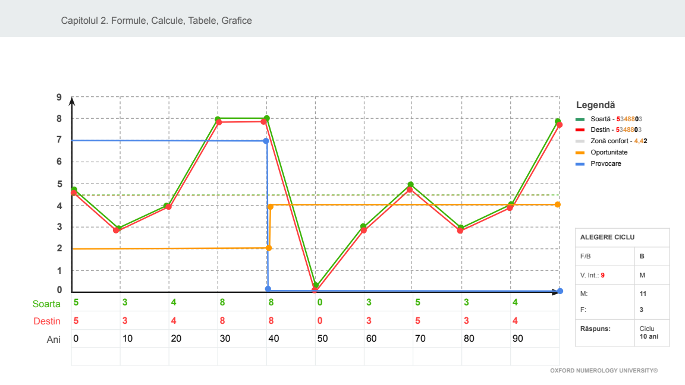

```text
Capitolul 2. Formule, Calcule, Tabele, Grafice
9
Legendă
8 Soartă - 5348803
Destin - 5348803
7
Zonă confort - 4,42
Oportunitate
6
Provocare
5
4
3
ALEGERE CICLU
2
F/B B
1
V. Int.: 9 M
0
M: 11
Soarta 5 3 4 8 8 0 3 5 3 4
F: 3
Destin 5 3 4 8 8 0 3 5 3 4
Răspuns: Ciclu
Ani 0 10 20 30 40 50 60 70 80 90 10 ani
OXFORD NUMEROLOGY UNIVERSITY®
```

### Pagina 57

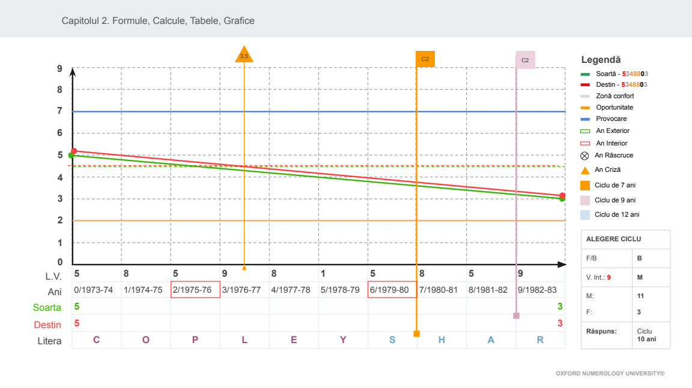

```text
Capitolul 2. Formule, Calcule, Tabele, Grafice
3,5 C2 C2 Legendă
9
Soartă - 5348803
Destin - 5348803
8
Zonă confort
7 Oportunitate
Provocare
6 An Exterior
An Interior
5 An Răscruce
An Criză
4
Ciclu de 7 ani
3 Ciclu de 9 ani
Ciclu de 12 ani
2
1 ALEGERE CICLU
0 F/B B
L.V. 5 8 5 9 8 1 5 8 5 9 V. Int.: 9 M
Ani 0/1973-74 1/1974-75 2/1975-76 3/1976-77 4/1977-78 5/1978-79 6/1979-80 7/1980-81 8/1981-82 9/1982-83
M: 11
Soarta 5 3
F: 3
Destin 5 3
Răspuns: Ciclu
Litera C O P L E Y S H A R 10 ani
OXFORD NUMEROLOGY UNIVERSITY®
```

### Pagina 58

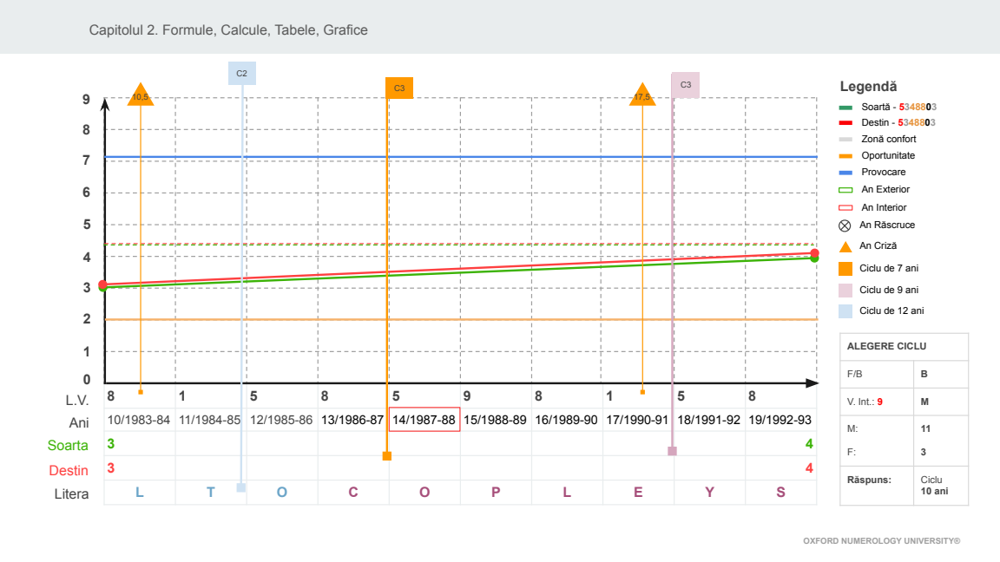

```text
Capitolul 2. Formule, Calcule, Tabele, Grafice
C2
C3 C3 Legendă
9 10,5 17,5
Soartă - 5348803
Destin - 5348803
8
Zonă confort
7 Oportunitate
Provocare
6 An Exterior
An Interior
5 An Răscruce
An Criză
4
Ciclu de 7 ani
3 Ciclu de 9 ani
Ciclu de 12 ani
2
1 ALEGERE CICLU
0 F/B B
L.V. 8 1 5 8 5 9 8 1 5 8 V. Int.: 9 M
Ani 10/1983-84 11/1984-85 12/1985-86 13/1986-87 14/1987-88 15/1988-89 16/1989-90 17/1990-91 18/1991-92 19/1992-93
M: 11
Soarta 3 4
F: 3
Destin 3 4
Răspuns: Ciclu
Litera L T O C O P L E Y S 10 ani
OXFORD NUMEROLOGY UNIVERSITY®
```

### Pagina 59

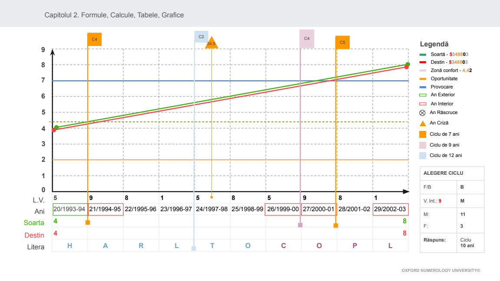

```text
Capitolul 2. Formule, Calcule, Tabele, Grafice
C4 C2 C4
24,5 C5 Legendă
9
Soartă - 5348803
8 Destin - 5348803
Zonă confort - 4,42
7 Oportunitate
Provocare
6 An Exterior
An Interior
5 An Răscruce
An Criză
4
Ciclu de 7 ani
3 Ciclu de 9 ani
Ciclu de 12 ani
2
1 ALEGERE CICLU
0 F/B B
L.V. 5 9 8 1 5 8 5 9 8 1 V. Int.: 9 M
Ani 20/1993-94 21/1994-95 22/1995-96 23/1996-97 24/1997-98 25/1998-99 26/1999-00 27/2000-01 28/2001-02 29/2002-03
M: 11
Soarta 4 8
F: 3
Destin 4 8
Răspuns: Ciclu
Litera H A R L T O C O P L 10 ani
OXFORD NUMEROLOGY UNIVERSITY®
```

### Pagina 60

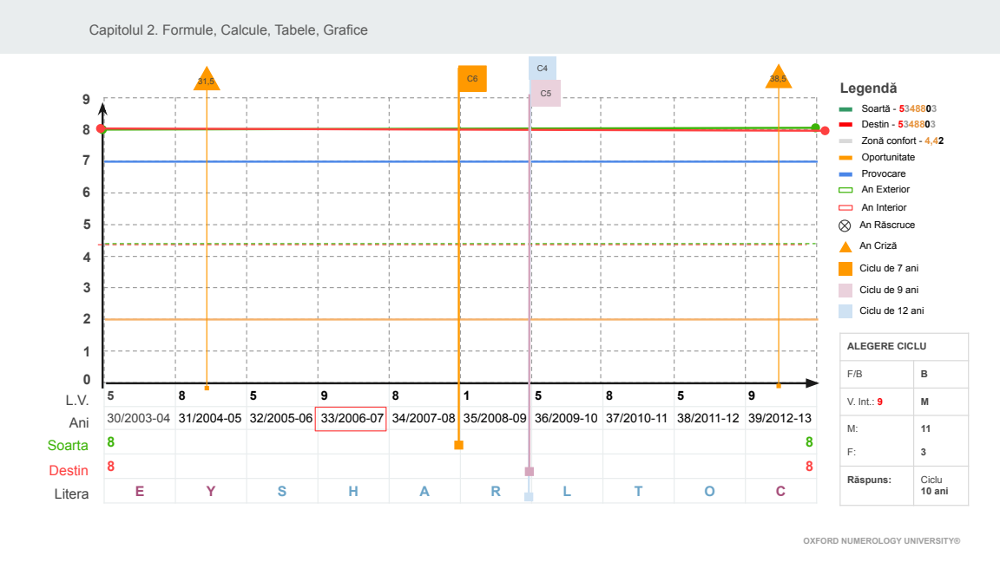

```text
Capitolul 2. Formule, Calcule, Tabele, Grafice
C4
31,5 C6 38,5
Legendă
9 C5
Soartă - 5348803
8 Destin - 5348803
Zonă confort - 4,42
7 Oportunitate
Provocare
6 An Exterior
An Interior
5 An Răscruce
An Criză
4
Ciclu de 7 ani
3 Ciclu de 9 ani
Ciclu de 12 ani
2
1 ALEGERE CICLU
0 F/B B
L.V. 5 8 5 9 8 1 5 8 5 9 V. Int.: 9 M
Ani 30/2003-04 31/2004-05 32/2005-06 33/2006-07 34/2007-08 35/2008-09 36/2009-10 37/2010-11 38/2011-12 39/2012-13
M: 11
Soarta 8 8
F: 3
Destin 8 8
Răspuns: Ciclu
Litera E Y S H A R L T O C 10 ani
OXFORD NUMEROLOGY UNIVERSITY®
```

### Pagina 61

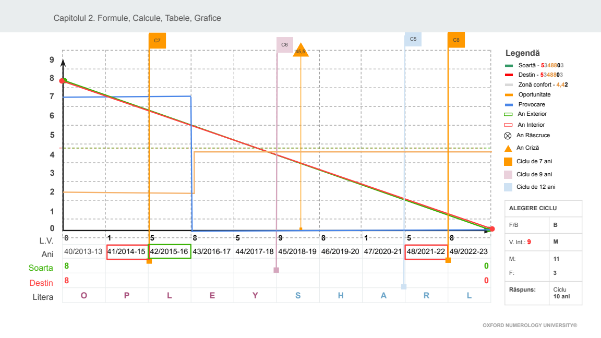

```text
Capitolul 2. Formule, Calcule, Tabele, Grafice
C7 C5 C8
C6
45,5 Legendă
9
Soartă - 5348803
8 Destin - 5348803
Zonă confort - 4,42
7 Oportunitate
Provocare
6 An Exterior
An Interior
5 An Răscruce
An Criză
4
Ciclu de 7 ani
3 Ciclu de 9 ani
Ciclu de 12 ani
2
1 ALEGERE CICLU
0 F/B B
L.V. 8 1 5 8 5 9 8 1 5 8 V. Int.: 9 M
Ani 40/2013-13 41/2014-15 42/2015-16 43/2016-17 44/2017-18 45/2018-19 46/2019-20 47/2020-21 48/2021-22 49/2022-23
M: 11
Soarta 8 0
F: 3
Destin 8 0
Răspuns: Ciclu
Litera O P L E Y S H A R L 10 ani
OXFORD NUMEROLOGY UNIVERSITY®
```

### Pagina 62

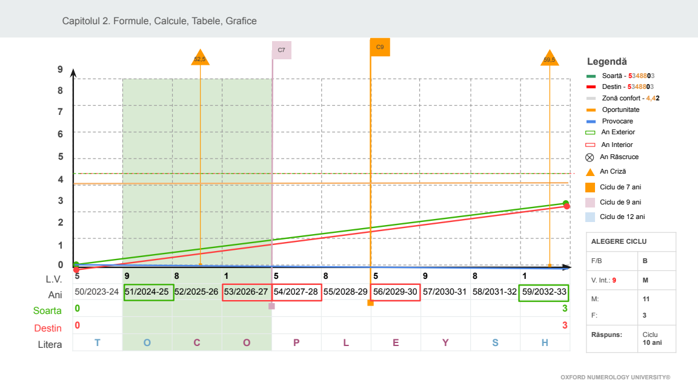

```text
Capitolul 2. Formule, Calcule, Tabele, Grafice
C7 C9
52,5 59,5 Legendă
9
Soartă - 5348803
8 Destin - 5348803
Zonă confort - 4,42
7 Oportunitate
Provocare
6 An Exterior
An Interior
5 An Răscruce
An Criză
4
Ciclu de 7 ani
3 Ciclu de 9 ani
Ciclu de 12 ani
2
1 ALEGERE CICLU
0 F/B B
L.V. 5 9 8 1 5 8 5 9 8 1 V. Int.: 9 M
Ani 50/2023-24 51/2024-25 52/2025-26 53/2026-27 54/2027-28 55/2028-29 56/2029-30 57/2030-31 58/2031-32 59/2032-33
M: 11
Soarta 0 3
F: 3
Destin 0 3
Răspuns: Ciclu
Litera T O C O P L E Y S H 10 ani
OXFORD NUMEROLOGY UNIVERSITY®
```

### Pagina 63

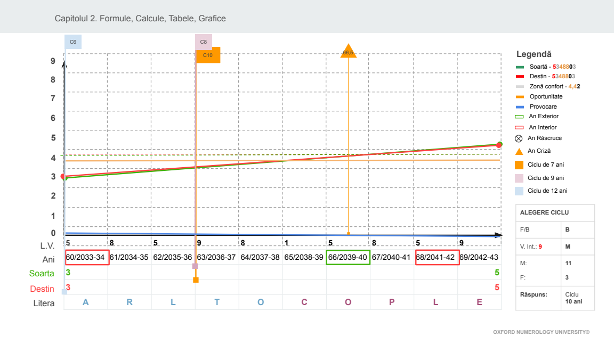

```text
Capitolul 2. Formule, Calcule, Tabele, Grafice
C6 C8
C10 66,5 Legendă
9
Soartă - 5348803
8 Destin - 5348803
Zonă confort - 4,42
7 Oportunitate
Provocare
6 An Exterior
An Interior
5 An Răscruce
An Criză
4
Ciclu de 7 ani
3 Ciclu de 9 ani
Ciclu de 12 ani
2
1 ALEGERE CICLU
0 F/B B
L.V. 5 8 5 9 8 1 5 8 5 9 V. Int.: 9 M
Ani 60/2033-34 61/2034-35 62/2035-36 63/2036-37 64/2037-38 65/2038-39 66/2039-40 67/2040-41 68/2041-42 69/2042-43
M: 11
Soarta 3 5
F: 3
Destin 3 5
Răspuns: Ciclu
Litera A R L T O C O P L E 10 ani
OXFORD NUMEROLOGY UNIVERSITY®
```

### Pagina 64

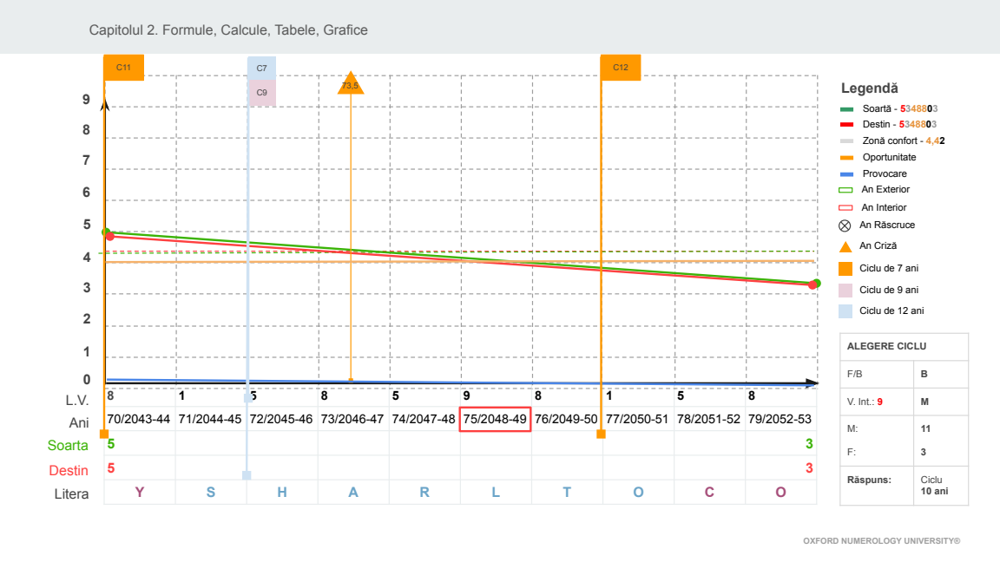

```text
Capitolul 2. Formule, Calcule, Tabele, Grafice
C11 C7 C12
73,5 Legendă
9 C9
Soartă - 5348803
8 Destin - 5348803
Zonă confort - 4,42
7 Oportunitate
Provocare
6 An Exterior
An Interior
5 An Răscruce
An Criză
4
Ciclu de 7 ani
3 Ciclu de 9 ani
Ciclu de 12 ani
2
1 ALEGERE CICLU
0 F/B B
L.V. 8 1 5 8 5 9 8 1 5 8 V. Int.: 9 M
Ani 70/2043-44 71/2044-45 72/2045-46 73/2046-47 74/2047-48 75/2048-49 76/2049-50 77/2050-51 78/2051-52 79/2052-53
M: 11
Soarta 5 3
F: 3
Destin 5 3
Răspuns: Ciclu
Litera Y S H A R L T O C O 10 ani
OXFORD NUMEROLOGY UNIVERSITY®
```

### Pagina 65

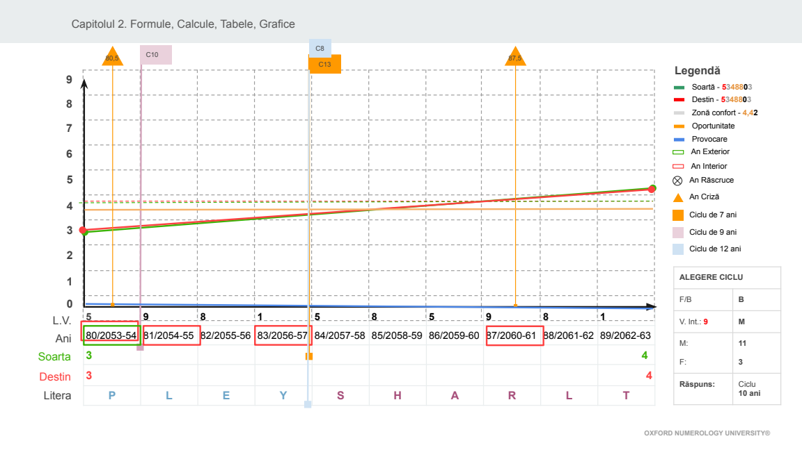

```text
Capitolul 2. Formule, Calcule, Tabele, Grafice
C8
80,5 C10 87,5
C13
Legendă
9
Soartă - 5348803
8 Destin - 5348803
Zonă confort - 4,42
7 Oportunitate
Provocare
6 An Exterior
An Interior
5 An Răscruce
An Criză
4
Ciclu de 7 ani
3 Ciclu de 9 ani
Ciclu de 12 ani
2
1 ALEGERE CICLU
0 F/B B
L.V. 5 9 8 1 5 8 5 9 8 1 V. Int.: 9 M
Ani 80/2053-54 81/2054-55 82/2055-56 83/2056-57 84/2057-58 85/2058-59 86/2059-60 87/2060-61 88/2061-62 89/2062-63
M: 11
Soarta 3 4
F: 3
Destin 3 4
Răspuns: Ciclu
Litera P L E Y S H A R L T 10 ani
OXFORD NUMEROLOGY UNIVERSITY®
```

### Pagina 66

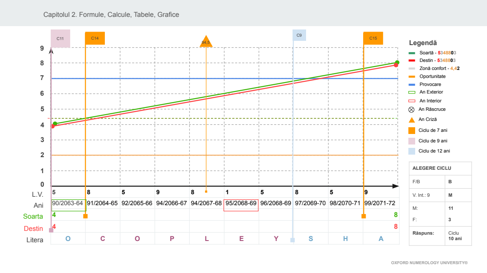

```text
Capitolul 2. Formule, Calcule, Tabele, Grafice
C9
C11 C14 C15
94,5 Legendă
9
Soartă - 5348803
8 Destin - 5348803
Zonă confort - 4,42
7 Oportunitate
Provocare
6 An Exterior
An Interior
5 An Răscruce
An Criză
4
Ciclu de 7 ani
3 Ciclu de 9 ani
Ciclu de 12 ani
2
1 ALEGERE CICLU
0 F/B B
L.V. 5 8 5 9 8 1 5 8 5 9 V. Int.: 9 M
Ani 90/2063-64 91/2064-65 92/2065-66 94/2066-67 94/2067-68 95/2068-69 96/2068-69 97/2069-70 98/2070-71 99/2071-72
M: 11
Soarta 4 8
F: 3
Destin 4 8
Răspuns: Ciclu
Litera O C O P L E Y S H A 10 ani
OXFORD NUMEROLOGY UNIVERSITY®
```

### Pagina 67

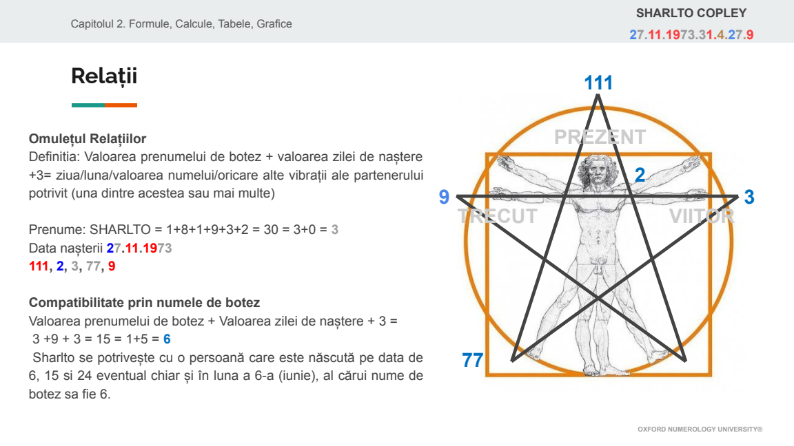

```text
Capitolul 2. Formule, Calcule, Tabele, Grafice
Relații
111
PREZENT
Omulețul Relațiilor
Definitia: Valoarea prenumelui de botez + valoarea zilei de naștere
+3= ziua/luna/valoarea numelui/oricare alte vibrații ale partenerului 2
potrivit (una dintre acestea sau mai multe) 9 3
TRECUT VIITOR
Prenume: SHARLTO = 1+8+1+9+3+2 = 30 = 3+0 = 3
Data nașterii 27.11.1973
111, 2, 3, 77, 9
Compatibilitate prin numele de botez
Valoarea prenumelui de botez + Valoarea zilei de naștere + 3 =
3 +9 + 3 = 15 = 1+5 = 6
Sharlto se potrivește cu o persoană care este născută pe data de 77
6, 15 si 24 eventual chiar și în luna a 6-a (iunie), al cărui nume de
botez sa fie 6.
OXFORD NUMEROLOGY UNIVERSITY®
```

### Pagina 68

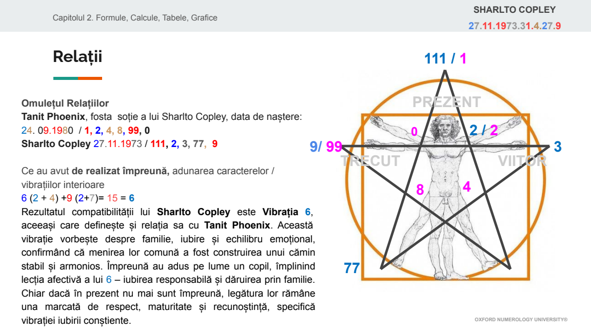

```text
Capitolul 2. Formule, Calcule, Tabele, Grafice
Relații
111 / 1
PREZENT
Omulețul Relațiilor
Tanit Phoenix, fosta soție a lui Sharlto Copley, data de naștere:
24. 09.1980 / 1, 2, 4, 8, 99, 0 0 2 / 2
Sharlto Copley 27.11.1973 / 111, 2, 3, 77, 9 9/ 99 3
TRECUT VIITOR
Ce au avut de realizat împreună, adunarea caracterelor /
vibrațiilor interioare 4
8
6 (2 + 4) +9 (2+7)= 15 = 6
Rezultatul compatibilității lui Sharlto Copley este Vibrația 6,
aceeași care definește și relația sa cu Tanit Phoenix. Această
vibrație vorbește despre familie, iubire și echilibru emoțional,
confirmând că menirea lor comună a fost construirea unui cămin
stabil și armonios. Împreună au adus pe lume un copil, împlinind 77
lecția afectivă a lui 6 – iubirea responsabilă și dăruirea prin familie.
Chiar dacă în prezent nu mai sunt împreună, legătura lor rămâne
una marcată de respect, maturitate și recunoștință, specifică
vibrației iubirii conștiente. OXFORD NUMEROLOGY UNIVERSITY®
```

### Pagina 69

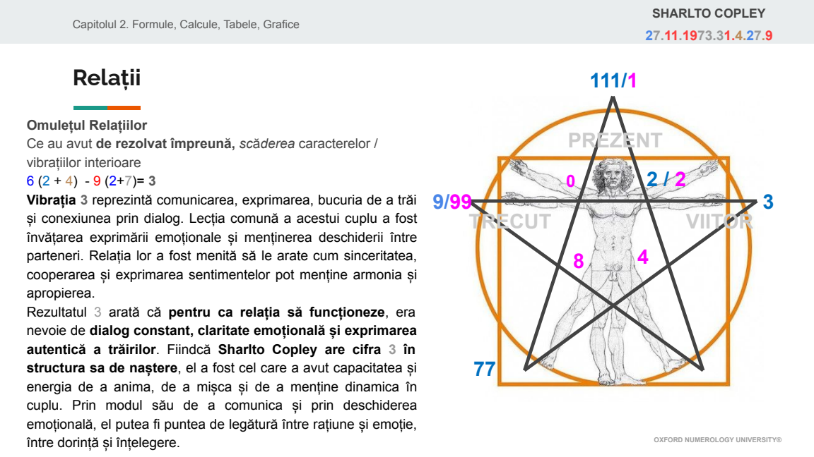

```text
Capitolul 2. Formule, Calcule, Tabele, Grafice
Relații
111/1
Omulețul Relațiilor
PREZENT
Ce au avut de rezolvat împreună, scăderea caracterelor /
vibrațiilor interioare
6 (2 + 4) - 9 (2+7)= 3 0 2 / 2
Vibrația 3 reprezintă comunicarea, exprimarea, bucuria de a trăi 9/99 3
și conexiunea prin dialog. Lecția comună a acestui cuplu a fost TRECUT VIITOR
învățarea exprimării emoționale și menținerea deschiderii între
parteneri. Relația lor a fost menită să le arate cum sinceritatea, 8 4
cooperarea și exprimarea sentimentelor pot menține armonia și
apropierea.
Rezultatul 3 arată că pentru ca relația să funcționeze, era
nevoie de dialog constant, claritate emoțională și exprimarea
autentică a trăirilor. Fiindcă Sharlto Copley are cifra 3 în
structura sa de naștere, el a fost cel care a avut capacitatea și 77
energia de a anima, de a mișca și de a menține dinamica în
cuplu. Prin modul său de a comunica și prin deschiderea
emoțională, el putea fi puntea de legătură între rațiune și emoție,
între dorință și înțelegere. OXFORD NUMEROLOGY UNIVERSITY®
```

### Pagina 70

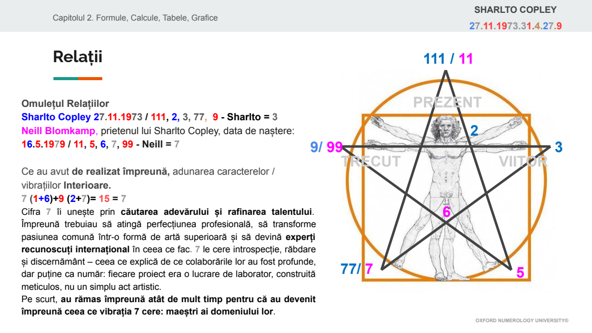

```text
Capitolul 2. Formule, Calcule, Tabele, Grafice
Relații
111 / 11
PREZENT
Omulețul Relațiilor
Sharlto Copley 27.11.1973 / 111, 2, 3, 77, 9 - Sharlto = 3
Neill Blomkamp, prietenul lui Sharlto Copley, data de naștere: 2
16.5.1979 / 11, 5, 6, 7, 99 - Neill = 7 9/ 99 3
TRECUT VIITOR
Ce au avut de realizat împreună, adunarea caracterelor /
vibrațiilor Interioare.
7 (1+6)+9 (2+7)= 15 = 7
6
Cifra 7 îi unește prin căutarea adevărului și rafinarea talentului.
Împreună trebuiau să atingă perfecțiunea profesională, să transforme
pasiunea comună într-o formă de artă superioară și să devină experți
recunoscuți internațional în ceea ce fac. 7 le cere introspecție, răbdare
și discernământ – ceea ce explică de ce colaborările lor au fost profunde,
77/ 7
5
dar puține ca număr: fiecare proiect era o lucrare de laborator, construită
meticulos, nu un simplu act artistic.
Pe scurt, au rămas împreună atât de mult timp pentru că au devenit
împreună ceea ce vibrația 7 cere: maeștri ai domeniului lor.
OXFORD NUMEROLOGY UNIVERSITY®
```

### Pagina 71

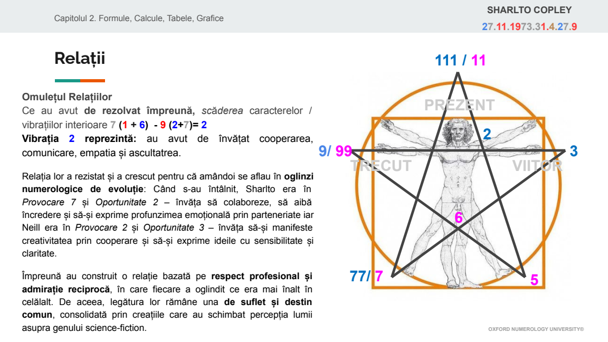

```text
Capitolul 2. Formule, Calcule, Tabele, Grafice
Relații
111 / 11
Omulețul Relațiilor
PREZENT
Ce au avut de rezolvat împreună, scăderea caracterelor /
vibrațiilor interioare 7 (1 + 6) - 9 (2+7)= 2
2
Vibrația 2 reprezintă: au avut de învățat cooperarea,
9/ 99 3
comunicare, empatia și ascultatrea.
TRECUT VIITOR
Relația lor a rezistat și a crescut pentru că amândoi se aflau în oglinzi
numerologice de evoluție: Când s-au întâlnit, Sharlto era în
Provocare 7 și Oportunitate 2 – învăța să colaboreze, să aibă
încredere și să-și exprime profunzimea emoțională prin parteneriate iar 6
Neill era în Provocare 2 și Oportunitate 3 – învăța să-și manifeste
creativitatea prin cooperare și să-și exprime ideile cu sensibilitate și
claritate.
77/ 7
Împreună au construit o relație bazată pe respect profesional și 5
admirație reciprocă, în care fiecare a oglindit ce era mai înalt în
celălalt. De aceea, legătura lor rămâne una de suflet și destin
comun, consolidată prin creațiile care au schimbat percepția lumii
asupra genului science-fiction.
OXFORD NUMEROLOGY UNIVERSITY®
```

### Pagina 72

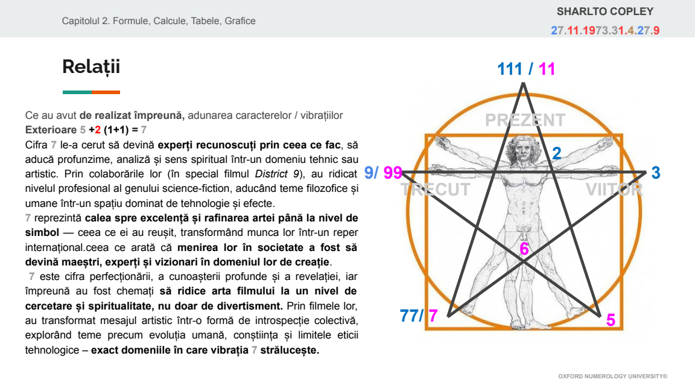

```text
Capitolul 2. Formule, Calcule, Tabele, Grafice
Relații
111 / 11
Ce au avut de realizat împreună, adunarea caracterelor / vibrațiilor PREZENT
Exterioare 5 +2 (1+1) = 7
Cifra 7 le-a cerut să devină experți recunoscuți prin ceea ce fac, să
2
aducă profunzime, analiză și sens spiritual într-un domeniu tehnic sau
9/ 99 3
artistic. Prin colaborările lor (în special filmul District 9), au ridicat
nivelul profesional al genului science-fiction, aducând teme filozofice și TRECUT VIITOR
umane într-un spațiu dominat de tehnologie și efecte.
7 reprezintă calea spre excelență și rafinarea artei până la nivel de
simbol — ceea ce ei au reușit, transformând munca lor într-un reper
internațional.ceea ce arată că menirea lor în societate a fost să 6
devină maeștri, experți și vizionari în domeniul lor de creație.
7 este cifra perfecționării, a cunoașterii profunde și a revelației, iar
împreună au fost chemați să ridice arta filmului la un nivel de
cercetare și spiritualitate, nu doar de divertisment. Prin filmele lor,
77/ 7
5
au transformat mesajul artistic într-o formă de introspecție colectivă,
explorând teme precum evoluția umană, conștiința și limitele eticii
tehnologice – exact domeniile în care vibrația 7 strălucește.
OXFORD NUMEROLOGY UNIVERSITY®
```

### Pagina 73

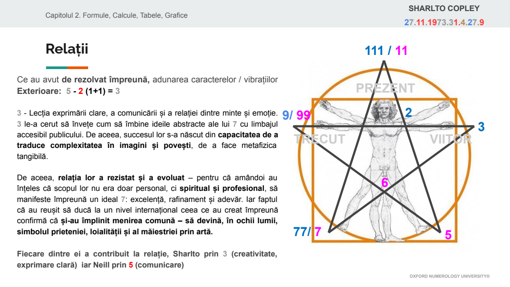

```text
Capitolul 2. Formule, Calcule, Tabele, Grafice
Relații
111 / 11
Ce au avut de rezolvat împreună, adunarea caracterelor / vibrațiilor
PREZENT
Exterioare: 5 - 2 (1+1) = 3
3 - Lecția exprimării clare, a comunicării și a relației dintre minte și emoție. 9/ 99
2
3 le-a cerut să învețe cum să îmbine ideile abstracte ale lui 7 cu limbajul 3
accesibil publicului. De aceea, succesul lor s-a născut din capacitatea de a
TRECUT VIITOR
traduce complexitatea în imagini și povești, de a face metafizica
tangibilă.
De aceea, relația lor a rezistat și a evoluat – pentru că amândoi au
6
înțeles că scopul lor nu era doar personal, ci spiritual și profesional, să
manifeste împreună un ideal 7: excelență, rafinament și adevăr. Iar faptul
că au reușit să ducă la un nivel internațional ceea ce au creat împreună
confirmă că și-au împlinit menirea comună – să devină, în ochii lumii,
simbolul prieteniei, loialității și al măiestriei prin artă. 77/ 7 5
Fiecare dintre ei a contribuit la relație, Sharlto prin 3 (creativitate,
exprimare clară) iar Neill prin 5 (comunicare)
OXFORD NUMEROLOGY UNIVERSITY®
```

### Pagina 74

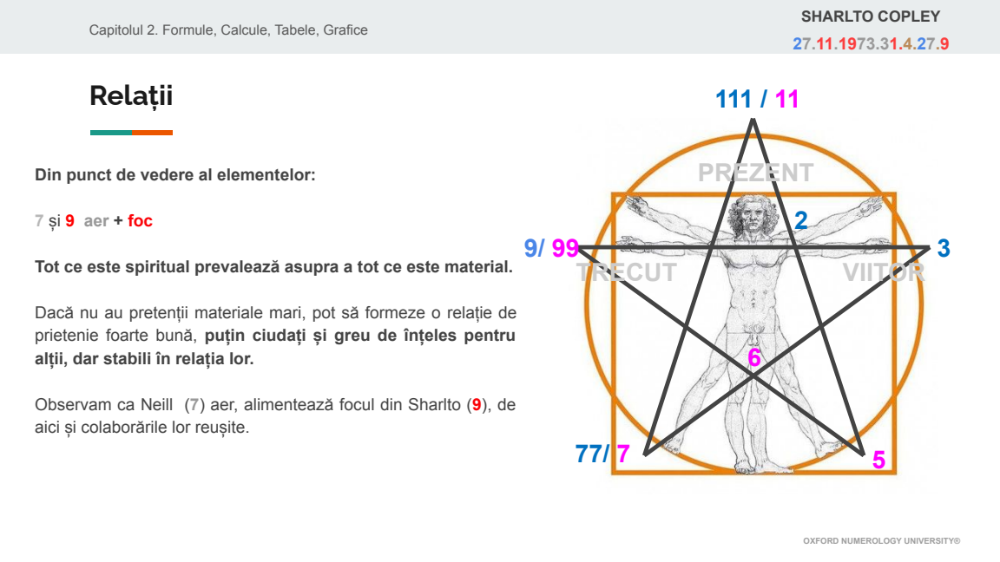

```text
Capitolul 2. Formule, Calcule, Tabele, Grafice
Relații
111 / 11
PREZENT
Din punct de vedere al elementelor:
7 și 9 aer + foc 2
9/ 99 3
Tot ce este spiritual prevalează asupra a tot ce este material. TRECUT VIITOR
Dacă nu au pretenții materiale mari, pot să formeze o relație de
prietenie foarte bună, puțin ciudați și greu de înțeles pentru
6
alții, dar stabili în relația lor.
Observam ca Neill (7) aer, alimentează focul din Sharlto (9), de
aici și colaborările lor reușite.
77/ 7
5
OXFORD NUMEROLOGY UNIVERSITY®
```

### Pagina 75

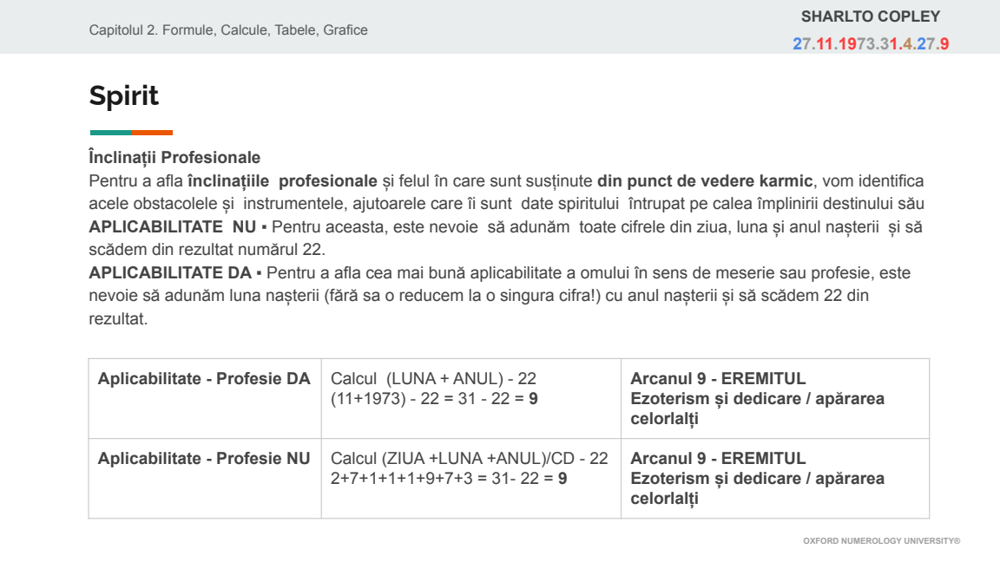

```text
Capitolul 2. Formule, Calcule, Tabele, Grafice
Spirit
Înclinații Profesionale
Pentru a afla înclinațiile profesionale și felul în care sunt susținute din punct de vedere karmic, vom identifica
acele obstacolele și instrumentele, ajutoarele care îi sunt date spiritului întrupat pe calea împlinirii destinului său
APLICABILITATE NU ▪ Pentru aceasta, este nevoie să adunăm toate cifrele din ziua, luna și anul nașterii și să
scădem din rezultat numărul 22.
APLICABILITATE DA ▪ Pentru a afla cea mai bună aplicabilitate a omului în sens de meserie sau profesie, este
nevoie să adunăm luna nașterii (fără sa o reducem la o singura cifra!) cu anul nașterii și să scădem 22 din
rezultat.
Aplicabilitate - Profesie DA Calcul (LUNA + ANUL) - 22 Arcanul 9 - EREMITUL
(11+1973) - 22 = 31 - 22 = 9 Ezoterism și dedicare / apărarea
celorlalți
Aplicabilitate - Profesie NU Calcul (ZIUA +LUNA +ANUL)/CD - 22 Arcanul 9 - EREMITUL
2+7+1+1+1+9+7+3 = 31- 22 = 9 Ezoterism și dedicare / apărarea
celorlalți
OXFORD NUMEROLOGY UNIVERSITY®
```

### Pagina 76

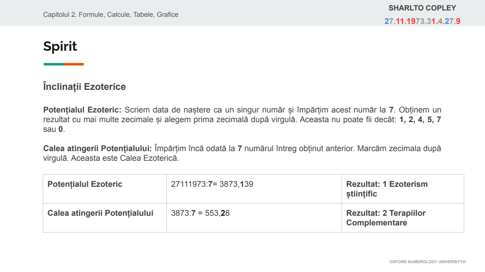

```text
Capitolul 2. Formule, Calcule, Tabele, Grafice
Spirit
Înclinații Ezoterice
Potențialul Ezoteric: Scriem data de naștere ca un singur număr și împărțim acest număr la 7. Obținem un
rezultat cu mai multe zecimale și alegem prima zecimală după virgulă. Aceasta nu poate fii decât: 1, 2, 4, 5, 7
sau 0.
Calea atingerii Potențialului: Împărțim încă odată la 7 numărul întreg obținut anterior. Marcăm zecimala după
virgulă. Aceasta este Calea Ezoterică.
Potențialul Ezoteric 27111973:7= 3873,139 Rezultat: 1 Ezoterism
științific
Calea atingerii Potențialului 3873:7 = 553,28 Rezultat: 2 Terapiilor
Complementare
OXFORD NUMEROLOGY UNIVERSITY®
```

### Pagina 77

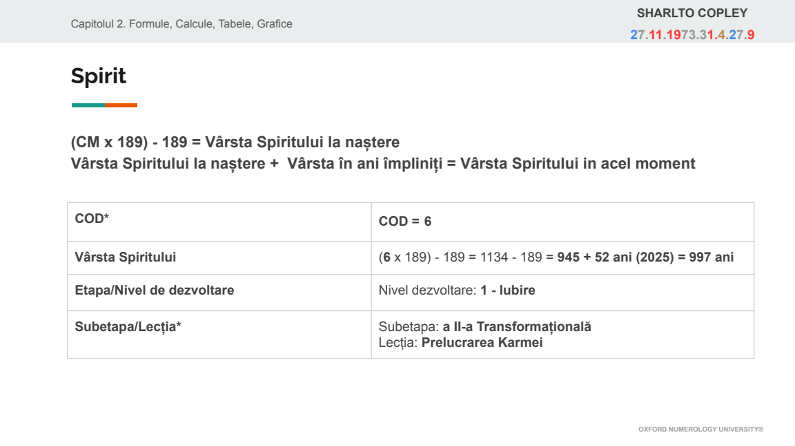

```text
Capitolul 2. Formule, Calcule, Tabele, Grafice
Spirit
(CM x 189) - 189 = Vârsta Spiritului la naștere
Vârsta Spiritului la naștere + Vârsta în ani împliniți = Vârsta Spiritului in acel moment
COD* COD = 6
Vârsta Spiritului (6 x 189) - 189 = 1134 - 189 = 945 + 52 ani (2025) = 997 ani
Etapa/Nivel de dezVAULTare Nivel dezVAULTare: 1 - Iubire
Subetapa/Lecția* Subetapa: a II-a Transformațională
Lecția: Prelucrarea Karmei
OXFORD NUMEROLOGY UNIVERSITY®
```

### Pagina 78

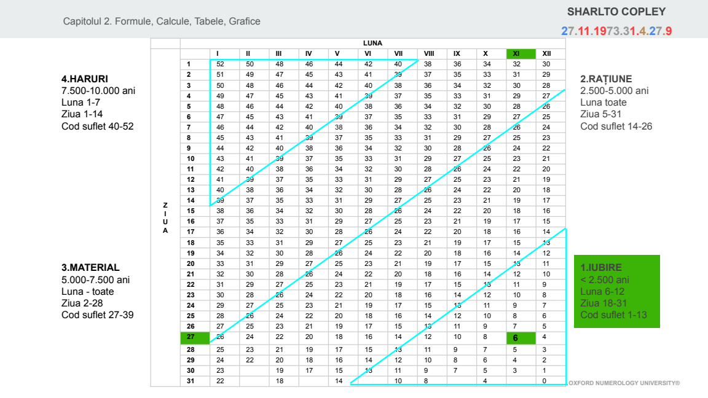

```text
Capitolul 2. Formule, Calcule, Tabele, Grafice
LUNA
I II III IV V VI VII VIII IX X XI XII
1 52 50 48 46 44 42 40 38 36 34 32 30
4.HARURI 2 51 49 47 45 43 41 39 37 35 33 31 29 2.RAȚIUNE
3 50 48 46 44 42 40 38 36 34 32 30 28
7.500-10.000 ani 2.500-5.000 ani
4 49 47 45 43 41 39 37 35 33 31 29 27
Luna 1-7 Luna toate
5 48 46 44 42 40 38 36 34 32 30 28 26
Ziua 1-14 Ziua 5-31
6 47 45 43 41 39 37 35 33 31 29 27 25
Cod suflet 40-52 7 46 44 42 40 38 36 34 32 30 28 26 24 Cod suflet 14-26
8 45 43 41 39 37 35 33 31 29 27 25 23
9 44 42 40 38 36 34 32 30 28 26 24 22
10 43 41 39 37 35 33 31 29 27 25 23 21
11 42 40 38 36 34 32 30 28 26 24 22 20
12 41 39 37 35 33 31 29 27 25 23 21 19
13 40 38 36 34 32 30 28 26 24 22 20 18
14 39 37 35 33 31 29 27 25 23 21 19 17
Z
I 15 38 36 34 32 30 28 26 24 22 20 18 16
U 16 37 35 33 31 29 27 25 23 21 19 17 15
A 17 36 34 32 30 28 26 24 22 20 18 16 14
18 35 33 31 29 27 25 23 21 19 17 15 13
19 34 32 30 28 26 24 22 20 18 16 14 12
20 33 31 29 27 25 23 21 19 17 15 13 11
3.MATERIAL 1.IUBIRE
21 32 30 28 26 24 22 20 18 16 14 12 10
5.000-7.500 ani < 2.500 ani
22 31 29 27 25 23 21 19 17 15 13 11 9
Luna - toate Luna 6-12
23 30 28 26 24 22 20 18 16 14 12 10 8
Ziua 2-28 Ziua 18-31
24 29 27 25 23 21 19 17 15 13 11 9 7
Cod suflet 27-39 25 28 26 24 22 20 18 16 14 12 10 8 6 Cod suflet 1-13
26 27 25 23 21 19 17 15 13 11 9 7 5
27 26 24 22 20 18 16 14 12 10 8 6 4
28 25 23 21 19 17 15 13 11 9 7 5 3
29 24 22 20 18 16 14 12 10 8 6 4 2
30 23 19 17 15 13 11 9 7 5 3 1
31 22 18 14 10 8 4 0 OXFORD NUMEROLOGY UNIVERSITY®
```

### Pagina 79

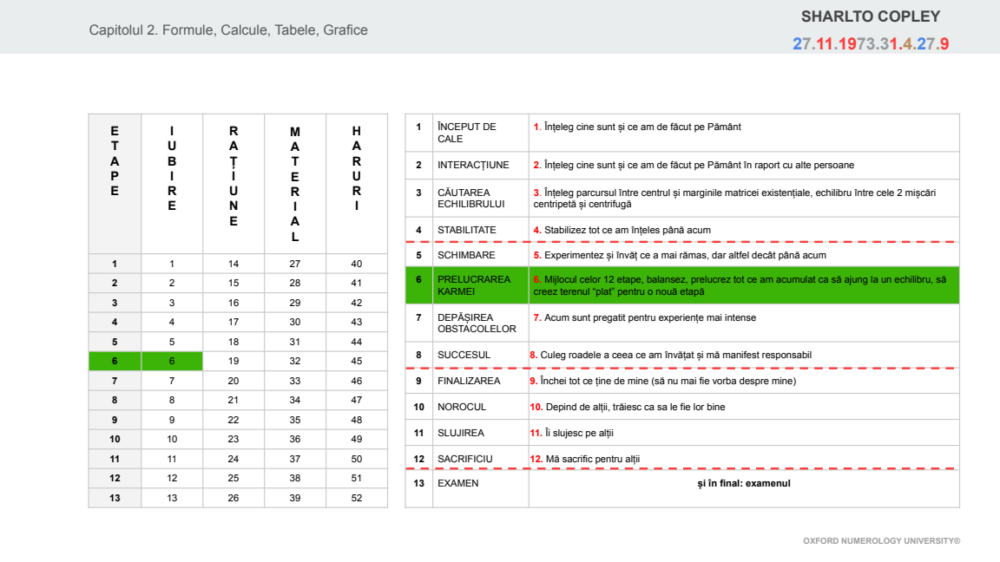

```text
Capitolul 2. Formule, Calcule, Tabele, Grafice
E I R M H 1 ÎNCEPUT DE 1. Înțeleg cine sunt și ce am de făcut pe Pământ
CALE
T U A A A
A B Ț T R
2 INTERACȚIUNE 2. Înțeleg cine sunt și ce am de făcut pe Pământ în raport cu alte persoane
P I I E U
E R U R R 3 CĂUTAREA 3. Înțeleg parcursul între centrul și marginile matricei existențiale, echilibru între cele 2 mișcări
E N I I ECHILIBRULUI centripetă și centrifugă
E A
4 STABILITATE 4. Stabilizez tot ce am înțeles până acum
L
5 SCHIMBARE 5. Experimentez și învăț ce a mai rămas, dar altfel decât până acum
1 1 14 27 40
2 2 15 28 41 6 PRELUCRAREA 6. Mijlocul celor 12 etape, balansez, prelucrez tot ce am acumulat ca să ajung la un echilibru, să
KARMEI creez terenul “plat” pentru o nouă etapă
3 3 16 29 42
7 DEPĂȘIREA 7. Acum sunt pregatit pentru experiențe mai intense
4 4 17 30 43
OBSTACOLELOR
5 5 18 31 44
8 SUCCESUL 8. Culeg roadele a ceea ce am învățat și mă manifest responsabil
6 6 19 32 45
7 7 20 33 46 9 FINALIZAREA 9. Închei tot ce ține de mine (să nu mai fie vorba despre mine)
8 8 21 34 47
10 NOROCUL 10. Depind de alții, trăiesc ca sa le fie lor bine
9 9 22 35 48
11 SLUJIREA 11. Îi slujesc pe alții
10 10 23 36 49
11 11 24 37 50 12 SACRIFICIU 12. Mă sacrific pentru alții
12 12 25 38 51
13 EXAMEN și în final: examenul
13 13 26 39 52
OXFORD NUMEROLOGY UNIVERSITY®
```

### Pagina 80

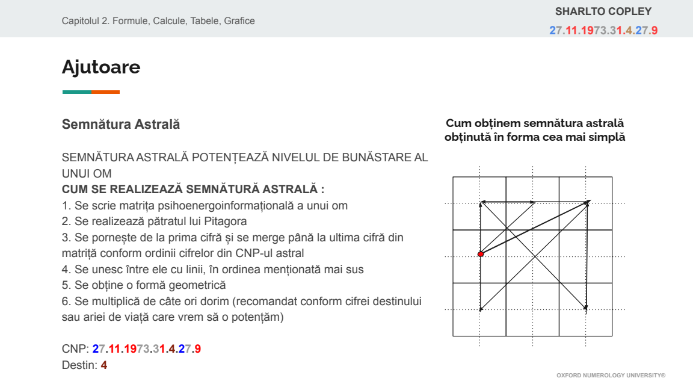

```text
Capitolul 2. Formule, Calcule, Tabele, Grafice
Ajutoare
Semnătura Astrală Cum obținem semnătura astrală
obținută în forma cea mai simplă
SEMNĂTURA ASTRALĂ POTENȚEAZĂ NIVELUL DE BUNĂSTARE AL
UNUI OM
CUM SE REALIZEAZĂ SEMNĂTURĂ ASTRALĂ :
1. Se scrie matrița psihoenergoinformațională a unui om
2. Se realizează pătratul lui Pitagora
3. Se pornește de la prima cifră și se merge până la ultima cifră din
matriță conform ordinii cifrelor din CNP-ul astral
4. Se unesc între ele cu linii, în ordinea menționată mai sus
5. Se obține o formă geometrică
6. Se multiplică de câte ori dorim (recomandat conform cifrei destinului
sau ariei de viață care vrem să o potențăm)
CNP: 27.11.1973.31.4.27.9
Destin: 4
OXFORD NUMEROLOGY UNIVERSITY®
```

### Pagina 81

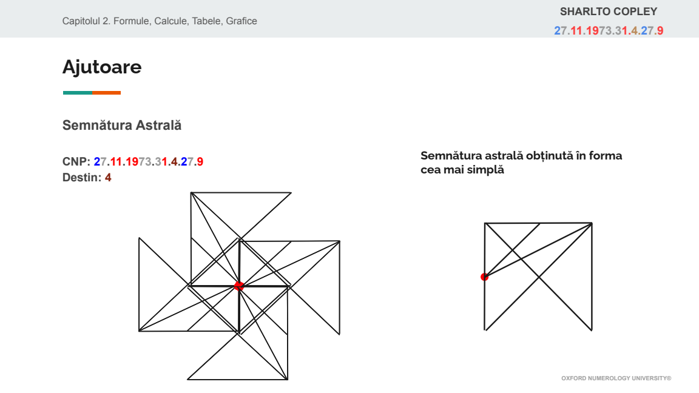

```text
Capitolul 2. Formule, Calcule, Tabele, Grafice
Ajutoare
Semnătura Astrală
CNP: 27.11.1973.31.4.27.9
Destin: 4
OXFORD NUMEROLOGY UNIVERSITY®
Semnătura astrală obținută în forma
cea mai simplă
```

### Pagina 82

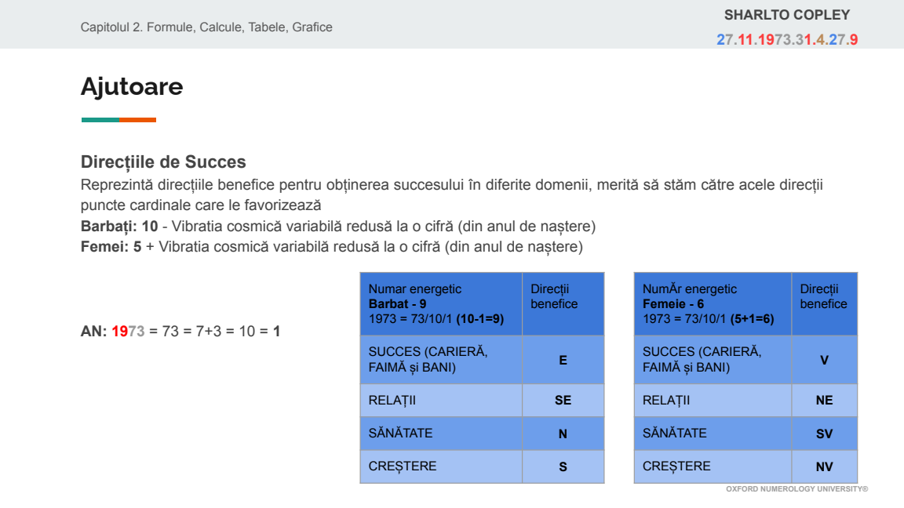

```text
Capitolul 2. Formule, Calcule, Tabele, Grafice
Ajutoare
Direcțiile de Succes
Reprezintă direcțiile benefice pentru obținerea succesului în diferite domenii, merită să stăm către acele direcții
puncte cardinale care le favorizează
Barbați: 10 - Vibratia cosmică variabilă redusă la o cifră (din anul de naștere)
Femei: 5 + Vibratia cosmică variabilă redusă la o cifră (din anul de naștere)
Numar energetic Direcții NumĂr energetic Direcții
Barbat - 9 benefice Femeie - 6 benefice
1973 = 73/10/1 (10-1=9) 1973 = 73/10/1 (5+1=6)
AN: 1973 = 73 = 7+3 = 10 = 1
SUCCES (CARIERĂ, SUCCES (CARIERĂ,
E V
FAIMĂ și BANI) FAIMĂ și BANI)
RELAȚII SE RELAȚII NE
SĂNĂTATE N SĂNĂTATE SV
CREȘTERE S CREȘTERE NV
OXFORD NUMEROLOGY UNIVERSITY®
```

### Pagina 83

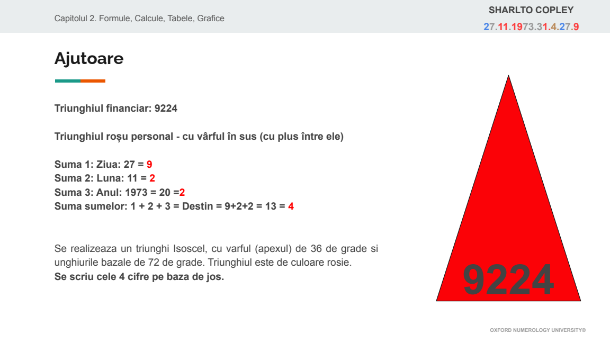

```text
Capitolul 2. Formule, Calcule, Tabele, Grafice
Ajutoare
Triunghiul financiar: 9224
Triunghiul roșu personal - cu vârful în sus (cu plus între ele)
Suma 1: Ziua: 27 = 9
Suma 2: Luna: 11 = 2
Suma 3: Anul: 1973 = 20 =2
Suma sumelor: 1 + 2 + 3 = Destin = 9+2+2 = 13 = 4
Se realizeaza un triunghi Isoscel, cu varful (apexul) de 36 de grade si
unghiurile bazale de 72 de grade. Triunghiul este de culoare rosie.
9224
Se scriu cele 4 cifre pe baza de jos.
OXFORD NUMEROLOGY UNIVERSITY®
```

### Pagina 84

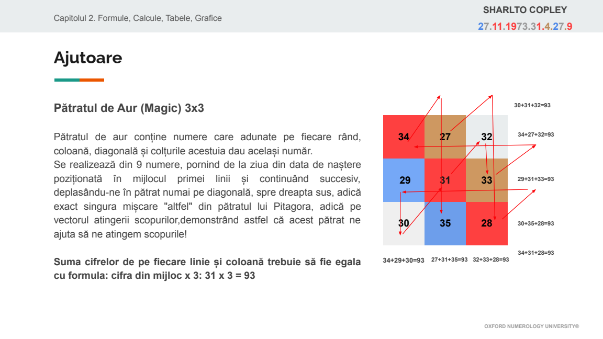

```text
Capitolul 2. Formule, Calcule, Tabele, Grafice
Ajutoare
Pătratul de Aur (Magic) 3x3 30+31+32=93
Pătratul de aur conține numere care adunate pe fiecare rând, 34 27 32 34+27+32=93
coloană, diagonală și colțurile acestuia dau același număr.
Se realizează din 9 numere, pornind de la ziua din data de naștere
poziționată în mijlocul primei linii și continuând succesiv, 29 31 33 29+31+33=93
deplasându-ne în pătrat numai pe diagonală, spre dreapta sus, adică
exact singura mișcare "altfel" din pătratul lui Pitagora, adică pe
vectorul atingerii scopurilor,demonstrând astfel că acest pătrat ne
30 35 28 30+35+28=93
ajuta să ne atingem scopurile!
34+31+28=93
Suma cifrelor de pe fiecare linie și coloană trebuie să fie egala 34+29+30=93 27+31+35=93 32+33+28=93
cu formula: cifra din mijloc x 3: 31 x 3 = 93
OXFORD NUMEROLOGY UNIVERSITY®
```

### Pagina 85

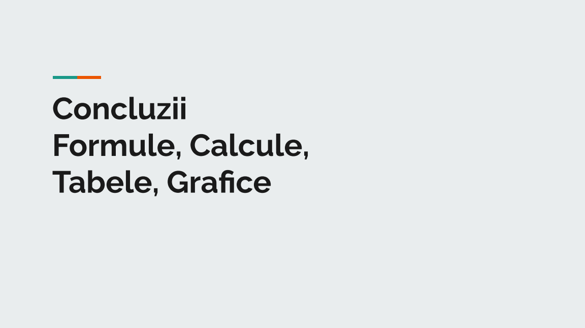

```text
Concluzii
Formule, Calcule,
Tabele, Grafice
```

### Pagina 86

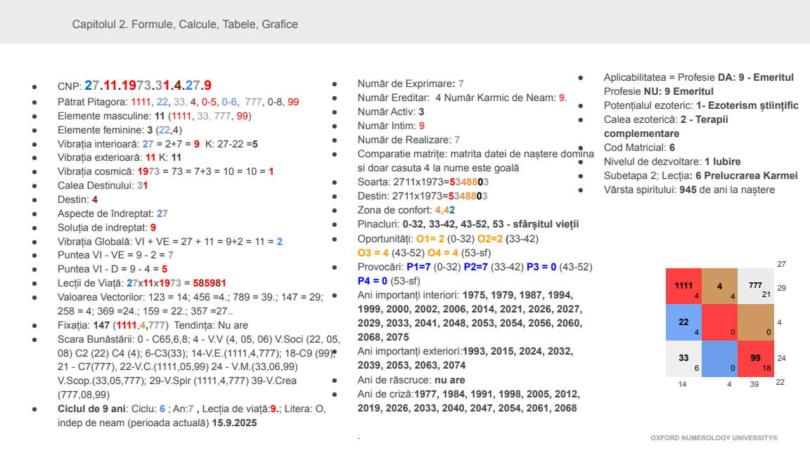

```text
Capitolul 2. Formule, Calcule, Tabele, Grafice
● Aplicabilitatea = Profesie DA: 9 - Emeritul
● CNP: 27.11.1973.31.4.27.9 ● Număr de Exprimare: 7
Profesie NU: 9 Emeritul
● Număr Ereditar: 4 Număr Karmic de Neam: 9.
● Pătrat Pitagora: 1111, 22, 33, 4, 0-5, 0-6, 777, 0-8, 99 ● Potențialul ezoteric: 1- Ezoterism științific
● Număr Activ: 3
● Elemente masculine: 11 (1111, 33, 777, 99) ● Calea ezoterică: 2 - Terapii
● Număr Intim: 9
● Elemente feminine: 3 (22,4)
complementare
● Număr de Realizare: 7
● Vibrația interioară: 27 = 2+7 = 9 K: 27-22 =5
● Cod Matricial: 6
● Comparatie matrițe: matrita datei de naștere domina
● Vibrația exterioară: 11 K: 11
● Nivelul de dezVAULTare: 1 Iubire
si doar casuta 4 la nume este goală
● Vibrația cosmică: 1973 = 73 = 7+3 = 10 = 10 = 1
● Subetapa 2; Lecția: 6 Prelucrarea Karmei
● Soarta: 2711x1973=5348803
● Calea Destinului: 31
● Vârsta spiritului: 945 de ani la naștere
● Destin: 4
● Destin: 2711x1973=5348803
● Aspecte de îndreptat: 27 ● Zona de confort: 4,42
● Soluția de indreptat: 9 ● Pinacluri: 0-32, 33-42, 43-52, 53 - sfârșitul vieții
● Vibrația Globală: VI + VE = 27 + 11 = 9+2 = 11 = 2 ● Oportunități: O1= 2 (0-32) O2=2 (33-42)
● Puntea VI - VE = 9 - 2 = 7 O3 = 4 (43-52) O4 = 4 (53-sf)
● Puntea VI - D = 9 - 4 = 5 ● Provocări: P1=7 (0-32) P2=7 (33-42) P3 = 0 (43-52) 27
● Lecții de Viață: 27x11x1973 = 585981 P4 = 0 (53-sf) 1111 4 777 29
● Valoarea Vectorilor: 123 = 14; 456 =4.; 789 = 39.; 147 = 29; ● Ani importanți interiori: 1975, 1979, 1987, 1994, 4 4 21
258 = 4; 369 =24.; 159 = 22.; 357 =27.. 1999, 2000, 2002, 2006, 2014, 2021, 2026, 2027,
● Fixația: 147 (1111,4,777) Tendința: Nu are 2029, 2033, 2041, 2048, 2053, 2054, 2056, 2060, 22 4
4 0 0
● Scara Bunăstării: 0 - C65,6,8; 4 - V.V (4, 05, 06) V.Soci (22, 05, 2068, 2075
08) C2 (22) C4 (4); 6-C3(33); 14-V.E.(1111,4,777); 18-C9 (99)●; Ani importanți exteriori:1993, 2015, 2024, 2032,
33 99 24
21 - C7(777), 22-V.C.(1111,05,99) 24 - V.M.(33,06,99) 2039, 2053, 2063, 2074 6 0 18
V.Scop.(33,05,777); 29-V.Spir (1111,4,777) 39-V.Crea ● Ani de răscruce: nu are 14 4 39 22
(777,08,99) ● Ani de criză:1977, 1984, 1991, 1998, 2005, 2012,
● Ciclul de 9 ani: Ciclu: 6 ; An:7 , Lecția de viață:9.; Litera: O, 2019, 2026, 2033, 2040, 2047, 2054, 2061, 2068
indep de neam (perioada actuală) 15.9.2025
.
OXFORD NUMEROLOGY UNIVERSITY®
```

### Pagina 87

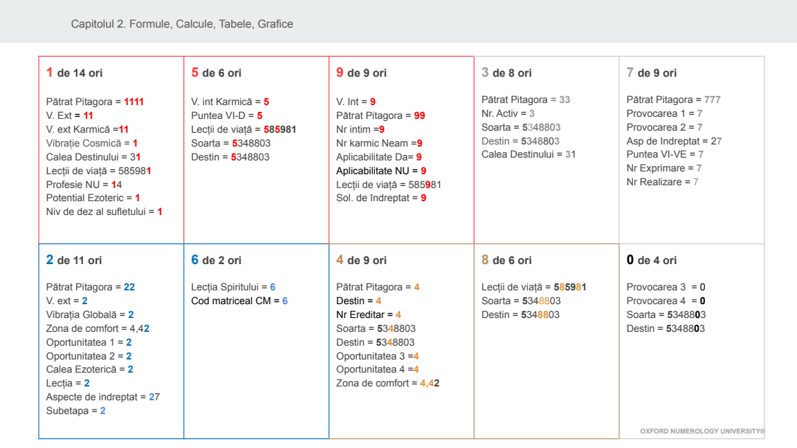

```text
Capitolul 2. Formule, Calcule, Tabele, Grafice
1 de 14 ori 5 de 6 ori 9 de 9 ori 3 de 8 ori 7 de 9 ori
Pătrat Pitagora = 1111 V. int Karmică = 5 V. Int = 9 Pătrat Pitagora = 33 Pătrat Pitagora = 777
V. Ext = 11 Puntea VI-D = 5 Pătrat Pitagora = 99 Nr. Activ = 3 Provocarea 1 = 7
V. ext Karmică =11 Lecții de viață = 585981 Nr intim =9 Soarta = 5348803 Provocarea 2 = 7
Vibrație Cosmică = 1 Soarta = 5348803 Nr karmic Neam =9 Destin = 5348803 Asp de Indreptat = 27
Calea Destinului = 31 Destin = 5348803 Aplicabilitate Da= 9 Calea Destinului = 31 Puntea VI-VE = 7
Lecții de viață = 585981 Aplicabilitate NU = 9 Nr Exprimare = 7
Profesie NU = 14 Lecții de viață = 585981 Nr Realizare = 7
Potential Ezoteric = 1 Sol. de îndreptat = 9
Niv de dez al sufletului = 1
2 de 11 ori 6 de 2 ori 4 de 9 ori 8 de 6 ori 0 de 4 ori
Pătrat Pitagora = 22 Lecția Spiritului = 6 Pătrat Pitagora = 4 Lecții de viață = 585981 Provocarea 3 = 0
V. ext = 2 Cod matriceal CM = 6 Destin = 4 Soarta = 5348803 Provocarea 4 = 0
Vibrația Globală = 2 Nr Ereditar = 4 Destin = 5348803 Soarta = 5348803
Zona de comfort = 4,42 Soarta = 5348803 Destin = 5348803
Oportunitatea 1 = 2 Destin = 5348803
Oportunitatea 2 = 2 Oportunitatea 3 =4
Calea Ezoterică = 2 Oportunitatea 4 =4
Lecția = 2 Zona de comfort = 4,42
Aspecte de indreptat = 27
Subetapa = 2
OXFORD NUMEROLOGY UNIVERSITY®
```

### Pagina 88

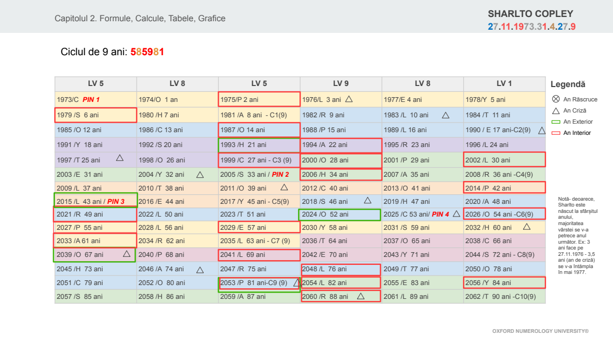

```text
Capitolul 2. Formule, Calcule, Tabele, Grafice
Ciclul de 9 ani: 585981
LV 5 LV 8 LV 5 LV 9 LV 8 LV 1 Legendă
1973/C PIN 1 1974/O 1 an 1975/P 2 ani 1976/L 3 ani 1977/E 4 ani 1978/Y 5 ani An Răscruce
An Criză
1979 /S 6 ani 1980 /H 7 ani 1981 /A 8 ani - C1(9) 1982 /R 9 ani 1983 /L 10 ani 1984 /T 11 ani
An Exterior
1985 /O 12 ani 1986 /C 13 ani 1987 /O 14 ani 1988 /P 15 ani 1989 /L 16 ani 1990 / E 17 ani-C2(9)
An Interior
1991 /Y 18 ani 1992 /S 20 ani 1993 /H 21 ani 1994 /A 22 ani 1995 /R 23 ani 1996 /L 24 ani
1997 /T 25 ani 1998 /O 26 ani 1999 /C 27 a n i - C3 (9) 2000 /O 28 ani 2001 /P 29 ani 2002 /L 30 ani
2003 /E 31 ani 2004 /Y 32 ani 2005 /S 33 ani / PIN 2 2006 /H 34 ani 2007 /A 35 ani 2008 /R 36 ani -C4(9)
2009 /L 37 ani 2010 /T 38 ani 2011 /O 39 ani 2012 /C 40 ani 2013 /O 41 ani 2014 /P 42 ani
2015 /L 43 a n i / P I N 3 2016 /E 44 ani 2017 /Y 45 ani - C5(9) 2018 /S 46 ani 2019 /H 47 ani 2020 /A 48 ani Notă- deoarece,
Sharlto este
născut la sfârșitul
2021 /R 49 ani 2022 /L 50 ani 2023 /T 51 ani 2024 /O 52 ani 2025 /C 53 ani/ PIN 4 2026 /O 54 ani -C6(9)
anului,
majoritatea
2027 /P 55 ani 2028 /L 56 ani 2029 /E 57 ani 2030 /Y 58 ani 2031 /S 59 ani 2032 /H 60 ani
vârstei se v-a
petrece anul
2033 /A 61 ani 2034 /R 62 ani 2035 /L 63 ani - C7 (9) 2036 /T 64 ani 2037 /O 65 ani 2038 /C 66 ani următor. Ex: 3
ani face pe
2039 /O 67 ani 2040 /P 68 ani 2041 /L 69 ani 2042 /E 70 ani 2043 /Y 71 ani 2044 /S 72 ani - C8(9) 27.11.1976 - 3,5
ani (an de criză)
2045 /H 73 ani 2046 /A 74 ani 2047 /R 75 ani 2048 /L 76 ani 2049 /T 77 ani 2050 /O 78 ani se v-a întămpla
în mai 1977.
2051 /C 79 ani 2052 /O 80 ani 2053 /P 81 a n i-C9 (9) 2054 /L 82 ani 2055 /E 83 ani 2056 /Y 84 ani
2057 /S 85 ani 2058 /H 86 ani 2059 /A 87 ani 2060 /R 88 ani 2061 /L 89 ani 2062 /T 90 ani -C10(9)
OXFORD NUMEROLOGY UNIVERSITY®
```

### Pagina 89

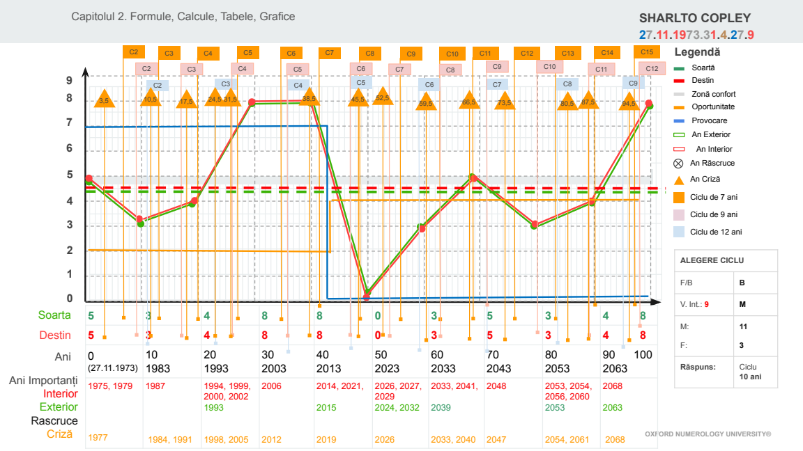

```text
Capitolul 2. Formule, Calcule, Tabele, Grafice SHARLTO COPLEY
C2 C3 C4 C5 C6 C7 C8 C9 C10 C11 C12 C13 C14 C15 Legendă
C2 C3 C4 C5 C6 C7 C8 C9 C10 C11 C12 Soartă
9 C2 C3 C4 C5 C6 C7 C8 C9 Destin
8 3,5 10,5 17,5 24,5 31,5 38,5 45,5 52,5 59,5 66,5 73,5 80,5 87,5 94,5 O Zo p n o ă rt u c n o i n ta fo te rt
7 Provocare
An Exterior
6 An Interior
An Răscruce
5
An Criză
4 Ciclu de 7 ani
Ciclu de 9 ani
3
Ciclu de 12 ani
2
ALEGERE CICLU
1
F/B B
0
V. Int.: 9 M
Soarta 5 3 4 8 8 0 3 5 3 4 8
M: 11
Destin 5 3 4 8 8 0 3 5 3 4 8
F: 3
Ani 0 10 20 30 40 50 60 70 80 90 100
(27.11.1973) 1983 1993 2003 2013 2023 2033 2043 2053 2063 Răspuns: Ciclu
Ani Importanți 10 ani
1975, 1979 1987 1994, 1999, 2006 2014, 2021, 2026, 2027, 2033, 2041, 2048 2053, 2054, 2068
Interior
2000, 2002 2029 2056, 2060
Exterior 1993 2015 2024, 2032 2039 2053 2063
Rascruce
Criză 1977 1984, 1991 1998, 2005 2012 2019 2026 2033, 2040 2047 2054, 2061 2068 OXFORD NUMEROLOGY UNIVERSITY®
```

# Capitolul 3. Caracterul

_Pagini sursa: 90-203._

## Formule si calcule extrase pentru rafinare

### Formula Vibratiei interioare

- Concept analizat: concept lipsa in VAULT/Numerologie.
- Metoda de calcul: Formula Vibratiei interioare = suma cifrelor componente din ziua de naștere. Dacă ziua de naștere este
- Calcul: Formula Vibratiei interioare = suma cifrelor componente din ziua de naștere. Dacă ziua de naștere este
- Verificare: concept lipsa in VAULT/Numerologie.
- Verificare pagina: pagina 93.

### aspectelor caracterului lui 3

- Concept analizat: concept lipsa in VAULT/Numerologie.
- Metoda de calcul: aspectelor caracterului lui 3: energia se împrăștie, apar superficialitatea și vorba multă,nemulțumirea 5-8
- Calcul: aspectelor caracterului lui 3: energia se împrăștie, apar superficialitatea și vorba multă,nemulțumirea 5-8
- Verificare: concept lipsa in VAULT/Numerologie.
- Verificare pagina: pagina 104.

### Vibrația interioară 9/27 este susținută prin 99, 22 și 777

- Concept analizat: verificat in VAULT/Numerologie - [[Vibratie Interioara]].
- Metoda de calcul: Vibrația interioară 9/27 este susținută prin 99, 22 și 777: multă energie pe 9 și
- Calcul: Vibrația interioară 9/27 este susținută prin 99, 22 și 777: multă energie pe 9 și
- Verificare: ok - concept verificat in VAULT/Numerologie; metoda trebuie rafinata din textul paginii.
- Verificare pagina: pagina 110.

### Persoana analizată are un caracter de Foc orientat spre sens

- Concept analizat: verificat in VAULT/Numerologie - [[Vibratie Interioara]].
- Metoda de calcul: Persoana analizată are un caracter de Foc orientat spre sens: vibrația interioară 9/27 (comunicarea
- Calcul: Persoana analizată are un caracter de Foc orientat spre sens: vibrația interioară 9/27 (comunicarea
- Verificare: ok - concept verificat in VAULT/Numerologie; metoda trebuie rafinata din textul paginii.
- Verificare pagina: pagina 132.

### Zi + Luna + An sau (Calea destinului) - 22

- Concept analizat: verificat in VAULT/Numerologie - [[Calea Destinului]].
- Metoda de calcul: Zi + Luna + An sau (Calea destinului) - 22: 2+7+1+1+1+9+7+3 = 31 - 22 = 9
- Calcul: 2+7+1+1+1+9+7+3 = 31 - 22 = 9
- Verificare: ok - concept verificat in VAULT/Numerologie; formula de calcul este compatibila cu documentatia.
- Verificare pagina: pagina 141.

### Rezultat

- Concept analizat: verificat in VAULT/Numerologie - [[Deschidere spre Ezoterism]].
- Metoda de calcul: Rezultat: 2 Calea ezoterică 2 este cea a Terapiilor complementare.
- Calcul: Rezultat: 2 Calea ezoterică 2 este cea a Terapiilor complementare.
- Verificare: ok - concept verificat in VAULT/Numerologie; metoda trebuie rafinata din textul paginii.
- Verificare pagina: pagina 144.

### ZZLL x AAAA = XXXXXXX 2711 x 1973 = 5348803 SOARTA

- Concept analizat: verificat in VAULT/Numerologie - [[Soarta si Destin]].
- Metoda de calcul: ZZLL x AAAA = XXXXXXX 2711 x 1973 = 5348803 SOARTA: 5348803
- Calcul: 5348803
- Verificare: ok - concept verificat in VAULT/Numerologie; formula de calcul este compatibila cu documentatia.
- Verificare pagina: pagina 146.

### Pinaclul 1 se află după formula

- Concept analizat: verificat in VAULT/Numerologie - [[Pinacluri - Oportunitati si Provocari]].
- Metoda de calcul: Pinaclul 1 se află după formula: 36 minus cifra destinului: 36* - VD (4) 0 - 32 ani
- Calcul: Pinaclul 1 se află după formula: 36 minus cifra destinului: 36* - VD (4) 0 - 32 ani
- Verificare: ok - concept verificat in VAULT/Numerologie; formula/metoda se verifica in tabelul cu pinacluri din [[Pinacluri - Oportunitati si Provocari]].
- Verificare pagina: pagina 150.

### Durata tuturor întrupărilor spiritului

- Concept analizat: verificat in VAULT/Numerologie - [[Codul Spiritului]].
- Metoda de calcul: Durata tuturor întrupărilor spiritului = 9072 ani + 756 ani = 9828 ani* 9 vibrația pitagoreică a acestor numere
- Calcul: Durata tuturor întrupărilor spiritului = 9072 ani + 756 ani = 9828 ani* 9 vibrația pitagoreică a acestor numere
- Verificare: ok - concept verificat in VAULT/Numerologie; formula de calcul este compatibila cu documentatia.
- Verificare pagina: pagina 154.

### este

- Concept analizat: verificat in VAULT/Numerologie - [[Codul Spiritului]].
- Metoda de calcul: este: (CM x 189) - 189 + Vârsta în ani împliniți = vârsta spiritului 9828 ani : 52 = 189 ani
- Calcul: (CM x 189) - 189 + Vârsta în ani împliniți = vârsta spiritului 9828 ani : 52 = 189 ani
- Verificare: ok - concept verificat in VAULT/Numerologie; formula de calcul este compatibila cu documentatia.
- Verificare pagina: pagina 154.

### 756 ani x 3 cicluri (formare, transformare și pentru ceilalți)

- Concept analizat: concept lipsa in VAULT/Numerologie.
- Metoda de calcul: 756 ani x 3 cicluri (formare, transformare și pentru ceilalți) = 2268 ani
- Calcul: 756 ani x 3 cicluri (formare, transformare și pentru ceilalți) = 2268 ani
- Verificare: concept lipsa in VAULT/Numerologie.
- Verificare pagina: pagina 154.

### (CM x 189) - 189 + Vârsta în ani împliniți = vârsta spiritului 9828 ani*

- Concept analizat: verificat in VAULT/Numerologie - [[Codul Spiritului]].
- Metoda de calcul: (CM x 189) - 189 + Vârsta în ani împliniți = vârsta spiritului 9828 ani* : 52 = 189 ani
- Calcul: 52 = 189 ani
- Verificare: ok - concept verificat in VAULT/Numerologie; formula de calcul este compatibila cu documentatia.
- Verificare pagina: pagina 154.

### CM

- Concept analizat: verificat in VAULT/Numerologie - [[Codul Spiritului]].
- Metoda de calcul: CM = COD = se ia din tabelul de mai jos (conform graficului Etapelor Spiritului), fiind intersecția zilei cu cea a
- Calcul: CM = COD = se ia din tabelul de mai jos (conform graficului Etapelor Spiritului), fiind intersecția zilei cu cea a
- Verificare: ok - concept verificat in VAULT/Numerologie; formula de calcul este compatibila cu documentatia.
- Verificare pagina: pagina 154.

### CM

- Concept analizat: verificat in VAULT/Numerologie - [[Codul Spiritului]].
- Metoda de calcul: CM = COD = (conform graficului Etapelor Spiritului) fiind intersecția zilei 27 cu cea a lunii XI = 6
- Calcul: CM = COD = (conform graficului Etapelor Spiritului) fiind intersecția zilei 27 cu cea a lunii XI = 6
- Verificare: ok - concept verificat in VAULT/Numerologie; formula de calcul este compatibila cu documentatia.
- Verificare pagina: pagina 158.

### (6 x 189) - 189 + Vârsta în ani împliniți

- Concept analizat: concept lipsa in VAULT/Numerologie.
- Metoda de calcul: (6 x 189) - 189 + Vârsta în ani împliniți = 945 ani (la naștere) + 53 ani = 998 ani în 2025
- Calcul: (6 x 189) - 189 + Vârsta în ani împliniți = 945 ani (la naștere) + 53 ani = 998 ani în 2025
- Verificare: concept lipsa in VAULT/Numerologie.
- Verificare pagina: pagina 158.

### - cifra destinului şi cea a vocalelor

- Concept analizat: verificat in VAULT/Numerologie - [[Vibratia Destinului]].
- Metoda de calcul: - cifra destinului şi cea a vocalelor: 4 (par) - 9 (impar) = 5 (impar)
- Calcul: 4 (par) - 9 (impar) = 5 (impar)
- Verificare: ok - concept verificat in VAULT/Numerologie; formula de calcul este compatibila cu documentatia.
- Verificare pagina: pagina 178.

### - cifra destinului și cea a consoanelor

- Concept analizat: verificat in VAULT/Numerologie - [[Vibratia Destinului]].
- Metoda de calcul: - cifra destinului și cea a consoanelor: 4 (par) - 7 (impar) = 3 (impar)
- Calcul: 4 (par) - 7 (impar) = 3 (impar)
- Verificare: ok - concept verificat in VAULT/Numerologie; formula de calcul este compatibila cu documentatia.
- Verificare pagina: pagina 178.

## Pagini si text sursa

### Pagina 90


```text
Caracterul
```

### Pagina 91

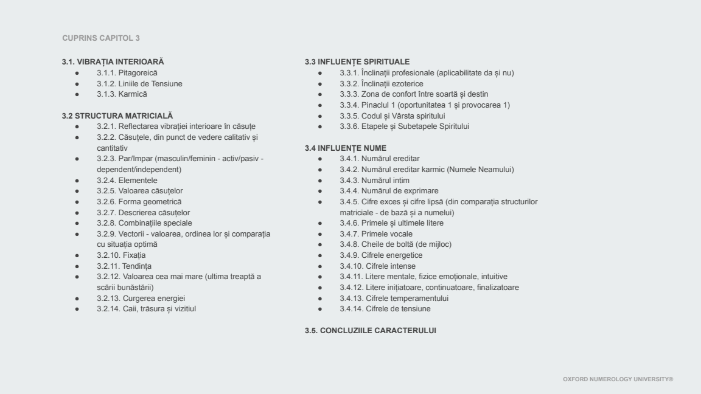

```text
CUPRINS CAPITOL 3
3.1. VIBRAȚIA INTERIOARĂ 3.3 INFLUENȚE SPIRITUALE
● 3.1.1. Pitagoreică ● 3.3.1. Înclinații profesionale (aplicabilitate da și nu)
● 3.1.2. Liniile de Tensiune ● 3.3.2. Înclinații ezoterice
● 3.1.3. Karmică ● 3.3.3. Zona de confort între soartă și destin
● 3.3.4. Pinaclul 1 (oportunitatea 1 și provocarea 1)
3.2 STRUCTURA MATRICIALĂ ● 3.3.5. Codul și Vârsta spiritului
● 3.2.1. Reflectarea vibrației interioare în căsuțe ● 3.3.6. Etapele și Subetapele Spiritului
● 3.2.2. Căsuțele, din punct de vedere calitativ și
cantitativ 3.4 INFLUENȚE NUME
● 3.2.3. Par/Impar (masculin/feminin - activ/pasiv - ● 3.4.1. Numărul ereditar
dependent/independent) ● 3.4.2. Numărul ereditar karmic (Numele Neamului)
● 3.2.4. Elementele ● 3.4.3. Numărul intim
● 3.2.5. Valoarea căsuțelor ● 3.4.4. Numărul de exprimare
● 3.2.6. Forma geometrică ● 3.4.5. Cifre exces și cifre lipsă (din comparația structurilor
● 3.2.7. Descrierea căsuțelor matriciale - de bază și a numelui)
● 3.2.8. Combinațiile speciale ● 3.4.6. Primele și ultimele litere
● 3.2.9. Vectorii - valoarea, ordinea lor și comparația ● 3.4.7. Primele vocale
cu situația optimă ● 3.4.8. Cheile de boltă (de mijloc)
● 3.2.10. Fixația ● 3.4.9. Cifrele energetice
● 3.2.11. Tendința ● 3.4.10. Cifrele intense
● 3.2.12. Valoarea cea mai mare (ultima treaptă a ● 3.4.11. Litere mentale, fizice emoționale, intuitive
scării bunăstării) ● 3.4.12. Litere inițiatoare, continuatoare, finalizatoare
● 3.2.13. Curgerea energiei ● 3.4.13. Cifrele temperamentului
● 3.2.14. Caii, trăsura și vizitiul ● 3.4.14. Cifrele de tensiune
3.5. CONCLUZIILE CARACTERULUI
OXFORD NUMEROLOGY UNIVERSITY®
```

### Pagina 92

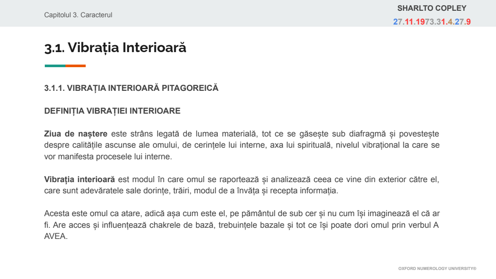

```text
Capitolul 3. Caracterul
3.1. Vibrația Interioară
3.1.1. VIBRAȚIA INTERIOARĂ PITAGOREICĂ
DEFINIȚIA VIBRAȚIEI INTERIOARE
Ziua de naștere este strâns legată de lumea materială, tot ce se găsește sub diafragmă și povestește
despre calitățile ascunse ale omului, de cerințele lui interne, axa lui spirituală, nivelul vibrațional la care se
vor manifesta procesele lui interne.
Vibrația interioară est modul în care omul se raportează și analizează ceea ce vine din exterior către el,
care sunt adevăratele sale dorințe, trăiri, modul de a învăța și recepta informația.
Acesta este omul ca atare, adică așa cum este el, pe pământul de sub cer și nu cum își imaginează el că ar
fi. Are acces și influențează chakrele de bază, trebuințele bazale și tot ce își poate dori omul prin verbul A
AVEA.
OXFORD NUMEROLOGY UNIVERSITY®
```

### Pagina 93

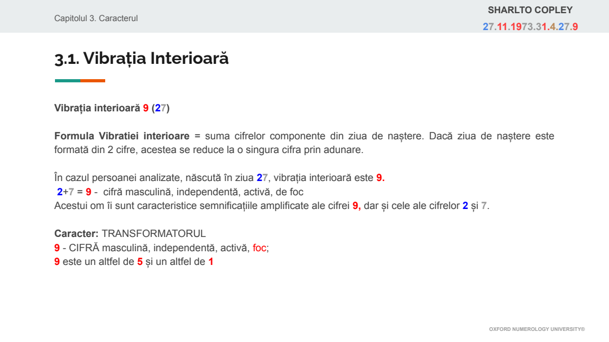

```text
Capitolul 3. Caracterul
3.1. Vibrația Interioară
Vibrația interioară 9 (27)
Formula Vibratiei interioare = suma cifrelor componente din ziua de naștere. Dacă ziua de naștere este
formată din 2 cifre, acestea se reduce la o singura cifra prin adunare.
În cazul persoanei analizate, născută în ziua 27, vibrația interioară este 9.
2+7 = 9 - cifră masculină, independentă, activă, de foc
Acestui om îi sunt caracteristice semnificațiile amplificate ale cifrei 9, dar și cele ale cifrelor 2 și 7.
Caracter: TRANSFORMATORUL
9 - CIFRĂ masculină, independentă, activă, foc;
9 este un altfel de 5 și un altfel de 1
OXFORD NUMEROLOGY UNIVERSITY®
```

### Pagina 94

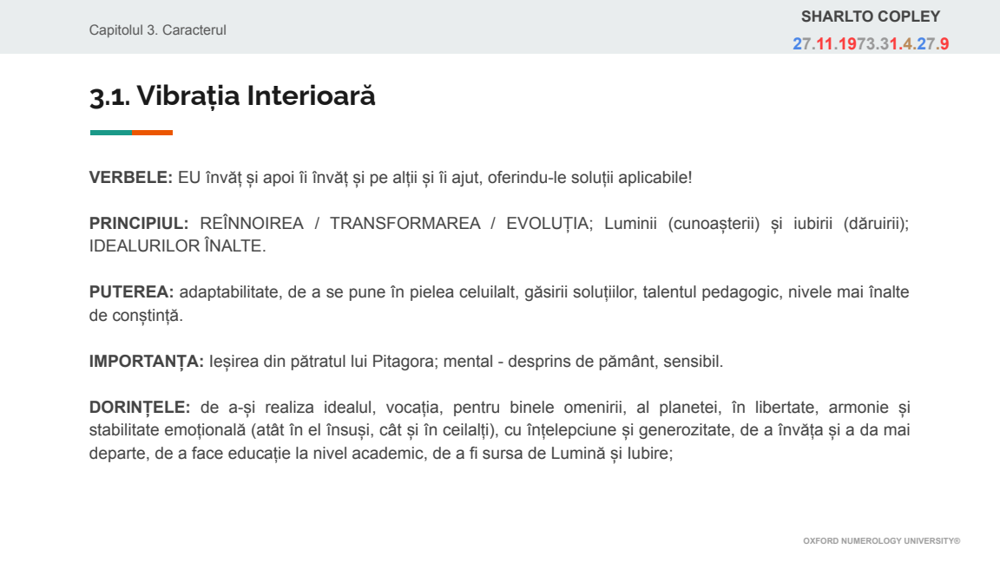

```text
Capitolul 3. Caracterul
3.1. Vibrația Interioară
VERBELE: EU învăț și apoi îi învăț și pe alții și îi ajut, oferindu-le soluții aplicabile!
PRINCIPIUL: REÎNNOIREA / TRANSFORMAREA / EVOLUȚIA; Luminii (cunoașterii) și iubirii (dăruirii);
IDEALURILOR ÎNALTE.
PUTEREA: adaptabilitate, de a se pune în pielea celuilalt, găsirii soluțiilor, talentul pedagogic, nivele mai înalte
de conștință.
IMPORTANȚA: Ieșirea din pătratul lui Pitagora; mental - desprins de pământ, sensibil.
DORINȚELE: de a-și realiza idealul, vocația, pentru binele omenirii, al planetei, în libertate, armonie și
stabilitate emoțională (atât în el însuși, cât și în ceilalți), cu înțelepciune și generozitate, de a învăța și a da mai
departe, de a face educație la nivel academic, de a fi sursa de Lumină și Iubire;
OXFORD NUMEROLOGY UNIVERSITY®
```

### Pagina 95

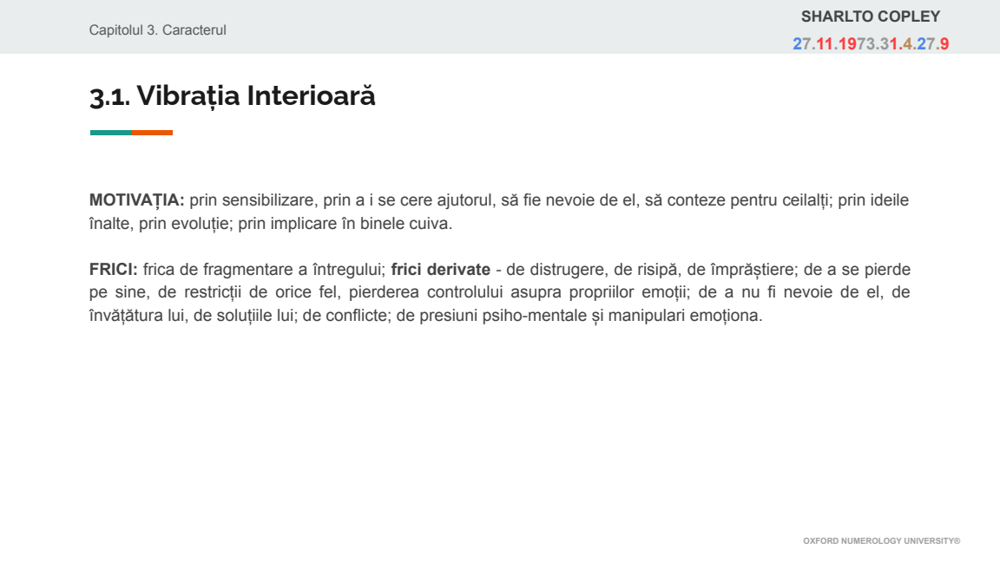

```text
Capitolul 3. Caracterul
3.1. Vibrația Interioară
MOTIVAȚIA: prin sensibilizare, prin a i se cere ajutorul, să fie nevoie de el, să conteze pentru ceilalți; prin ideile
înalte, prin evoluție; prin implicare în binele cuiva.
FRICI: frica de fragmentare a întregului; frici derivate - de distrugere, de risipă, de împrăștiere; de a se pierde
pe sine, de restricții de orice fel, pierderea controlului asupra propriilor emoții; de a nu fi nevoie de el, de
învățătura lui, de soluțiile lui; de conflicte; de presiuni psiho-mentale și manipulari emoționa.
OXFORD NUMEROLOGY UNIVERSITY®
```

### Pagina 96

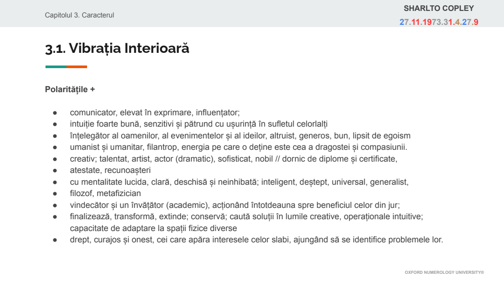

```text
Capitolul 3. Caracterul
3.1. Vibrația Interioară
Polaritățile +
● comunicator, elevat în exprimare, influențator;
● intuiție foarte bună, senzitivi și pătrund cu ușurință în sufletul celorlalți
● înțelegător al oamenilor, al evenimentelor și al ideilor, altruist, generos, bun, lipsit de egoism
● umanist și umanitar, filantrop, energia pe care o deține este cea a dragostei și compasiunii.
● creativ; talentat, artist, actor (dramatic), sofisticat, nobil // dornic de diplome și certificate,
● atestate, recunoașteri
● cu mentalitate lucida, clară, deschisă și neinhibată; inteligent, deștept, universal, generalist,
● filozof, metafizician
● vindecător și un învățător (academic), acționând întotdeauna spre beneficiul celor din jur;
● finalizează, transformă, extinde; conservă; caută soluții în lumile creative, operaționale intuitive;
capacitate de adaptare la spații fizice diverse
● drept, curajos și onest, cei care apăra interesele celor slabi, ajungând să se identifice problemele lor.
OXFORD NUMEROLOGY UNIVERSITY®
```

### Pagina 97

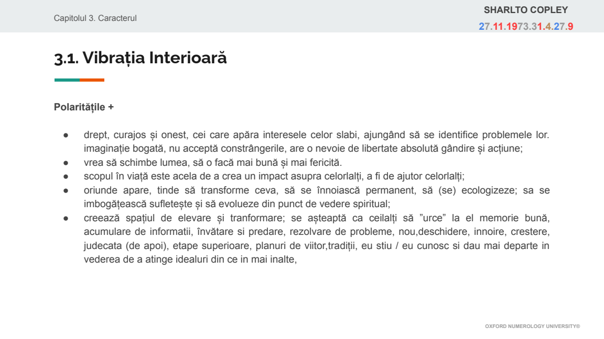

```text
Capitolul 3. Caracterul
3.1. Vibrația Interioară
Polaritățile +
● drept, curajos și onest, cei care apăra interesele celor slabi, ajungând să se identifice problemele lor.
imaginație bogată, nu acceptă constrângerile, are o nevoie de libertate absolută gândire și acțiune;
● vrea să schimbe lumea, să o facă mai bună și mai fericită.
● scopul în viață este acela de a crea un impact asupra celorlalți, a fi de ajutor celorlalți;
● oriunde apare, tinde să transforme ceva, să se înnoiască permanent, să (se) ecologizeze; sa se
imbogățească sufletește și să evolueze din punct de vedere spiritual;
● creează spațiul de elevare și tranformare; se așteaptă ca ceilalți să ”urce” la el memorie bună,
acumulare de informatii, învătare si predare, rezolvare de probleme, nou,deschidere, innoire, crestere,
judecata (de apoi), etape superioare, planuri de viitor,tradiții, eu stiu / eu cunosc si dau mai departe in
vederea de a atinge idealuri din ce in mai inalte,
OXFORD NUMEROLOGY UNIVERSITY®
```

### Pagina 98

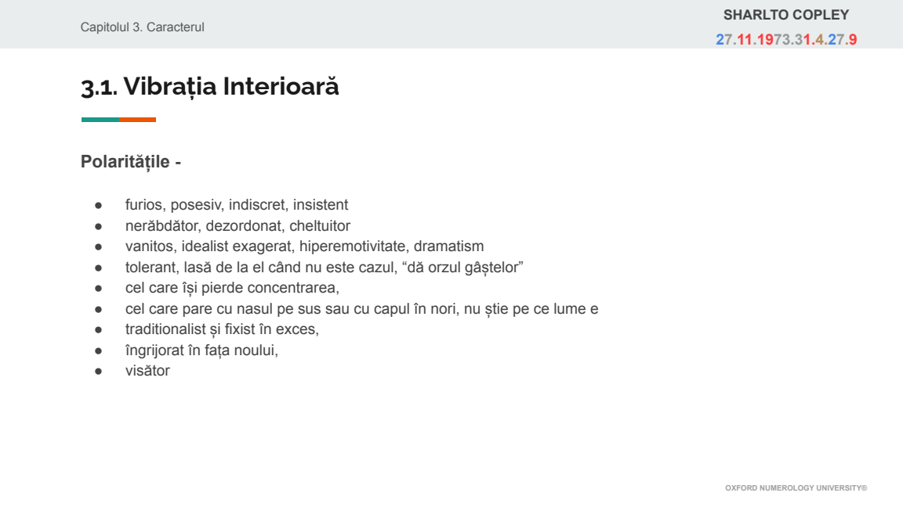

```text
Capitolul 3. Caracterul
3.1. Vibrația Interioară
Polaritățile -
● furios, posesiv, indiscret, insistent
● nerăbdător, dezordonat, cheltuitor
● vanitos, idealist exagerat, hiperemotivitate, dramatism
● tolerant, lasă de la el când nu este cazul, “dă orzul gâștelor”
● cel care își pierde concentrarea,
● cel care pare cu nasul pe sus sau cu capul în nori, nu știe pe ce lume e
● traditionalist și fixist în exces,
● îngrijorat în fața noului,
● visător
OXFORD NUMEROLOGY UNIVERSITY®
```

### Pagina 99

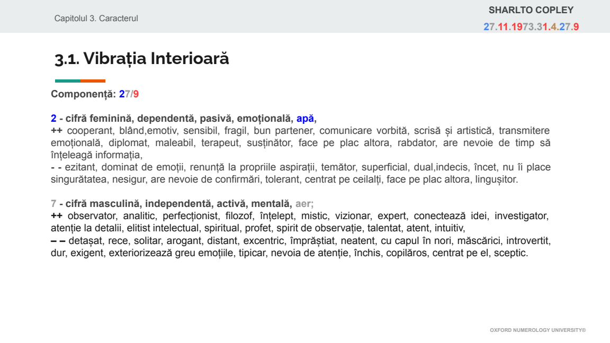

```text
Capitolul 3. Caracterul
3.1. Vibrația Interioară
Componență: 27/9
2 - cifră feminină, dependentă, pasivă, emoțională, apă,
++ cooperant, blând,emotiv, sensibil, fragil, bun partener, comunicare vorbită, scrisă și artistică, transmitere
emoțională, diplomat, maleabil, terapeut, susținător, face pe plac altora, rabdator, are nevoie de timp să
înțeleagă informația,
- - ezitant, dominat de emoții, renunță la propriile aspirații, temător, superficial, dual,indecis, încet, nu îi place
singurătatea, nesigur, are nevoie de confirmări, tolerant, centrat pe ceilalți, face pe plac altora, lingușitor.
7 - cifră masculină, independentă, activă, mentală, aer;
++ observator, analitic, perfecționist, filozof, înțelept, mistic, vizionar, expert, conectează idei, investigator,
atenție la detalii, elitist intelectual, spiritual, profet, spirit de observație, talentat, atent, intuitiv,
– – detașat, rece, solitar, arogant, distant, excentric, împrăștiat, neatent, cu capul în nori, măscărici, introvertit,
dur, exigent, exteriorizează greu emoțiile, tipicar, nevoia de atenție, închis, copilăros, centrat pe el, sceptic.
OXFORD NUMEROLOGY UNIVERSITY®
```

### Pagina 100

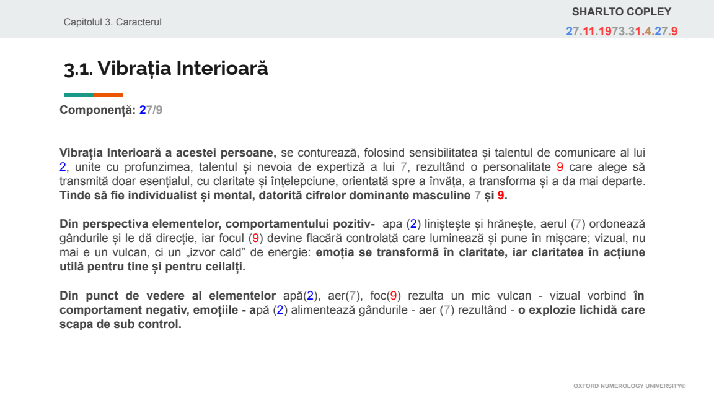

```text
Capitolul 3. Caracterul
3.1. Vibrația Interioară
Componență: 27/9
Vibrația Interioară a acestei persoane, se conturează, folosind sensibilitatea și talentul de comunicare al lui
2, unite cu profunzimea, talentul și nevoia de expertiză a lui 7, rezultând o personalitate 9 care alege să
transmită doar esențialul, cu claritate și înțelepciune, orientată spre a învăța, a transforma și a da mai departe.
Tinde să fie individualist și mental, datorită cifrelor dominante masculine 7 și 9.
Din perspectiva elementelor, comportamentului pozitiv- apa (2) liniștește și hrănește, aerul (7) ordonează
gândurile și le dă direcție, iar focul (9) devine flacără controlată care luminează și pune în mișcare; vizual, nu
mai e un vulcan, ci un „izvor cald” de energie: emoția se transformă în claritate, iar claritatea în acțiune
utilă pentru tine și pentru ceilalți.
Din punct de vedere al elementelor apă(2), aer(7), foc(9) rezulta un mic vulcan - vizual vorbind în
comportament negativ, emoțiile - apă (2) alimentează gândurile - aer (7) rezultând - o explozie lichidă care
scapa de sub control.
OXFORD NUMEROLOGY UNIVERSITY®
```

### Pagina 101

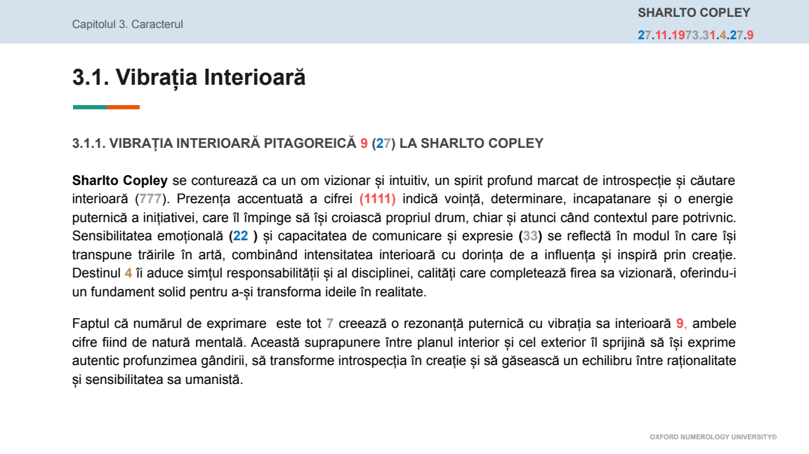

```text
Capitolul 3. Caracterul
3.1. Vibrația Interioară
3.1.1. VIBRAȚIA INTERIOARĂ PITAGOREICĂ 9 (27) LA SHARLTO COPLEY
Sharlto Copley se conturează ca un om vizionar și intuitiv, un spirit profund marcat de introspecție și căutare
interioară (777). Prezența accentuată a cifrei (1111) indică voință, determinare, incapatanare și o energie
puternică a inițiativei, care îl împinge să își croiască propriul drum, chiar și atunci când contextul pare potrivnic.
Sensibilitatea emoțională (22 ) și capacitatea de comunicare și expresie (33) se reflectă în modul în care își
transpune trăirile în artă, combinând intensitatea interioară cu dorința de a influența și inspiră prin creație.
Destinul 4 îi aduce simțul responsabilității și al disciplinei, calități care completează firea sa vizionară, oferindu-i
un fundament solid pentru a-și transforma ideile în realitate.
Faptul că numărul de exprimare este tot 7 creează o rezonanță puternică cu vibrația sa interioară 9, ambele
cifre fiind de natură mentală. Această suprapunere între planul interior și cel exterior îl sprijină să își exprime
autentic profunzimea gândirii, să transforme introspecția în creație și să găsească un echilibru între raționalitate
și sensibilitatea sa umanistă.
OXFORD NUMEROLOGY UNIVERSITY®
```

### Pagina 102

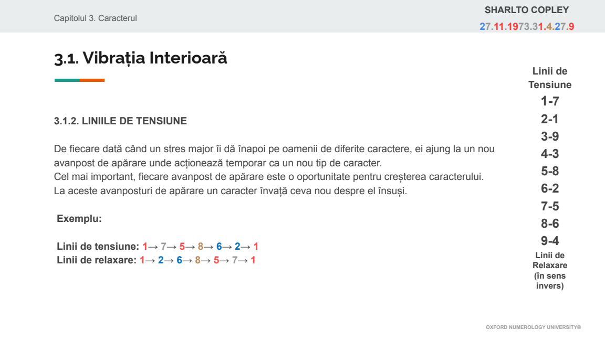

```text
Capitolul 3. Caracterul
3.1. Vibrația Interioară
Linii de
Tensiune
1-7
2-1
3.1.2. LINIILE DE TENSIUNE
3-9
De fiecare dată când un stres major îi dă înapoi pe oamenii de diferite caractere, ei ajung la un nou
4-3
avanpost de apărare unde acționează temporar ca un nou tip de caracter.
5-8
Cel mai important, fiecare avanpost de apărare este o oportunitate pentru creșterea caracterului.
6-2
La aceste avanposturi de apărare un caracter învață ceva nou despre el însuși.
7-5
Exemplu:
8-6
9-4
Linii de tensiune: 1→ 7→ 5→ 8→ 6→ 2→ 1
Linii de
Linii de relaxare: 1→ 2→ 6→ 8→ 5→ 7→ 1
Relaxare
(în sens
invers)
OXFORD NUMEROLOGY UNIVERSITY®
```

### Pagina 103

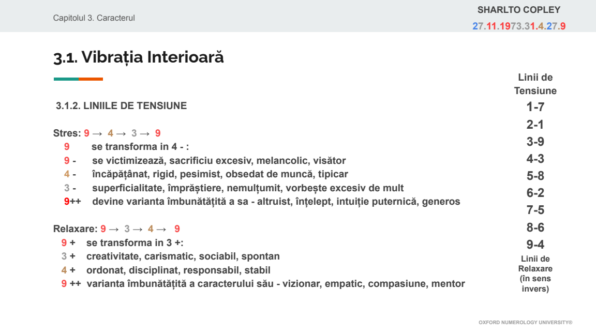

```text
Capitolul 3. Caracterul
3.1. Vibrația Interioară
Linii de
Tensiune
3.1.2. LINIILE DE TENSIUNE 1-7
2-1
Stres: 9 → 4 → 3 → 9
3-9
9 se transforma in 4 - :
4-3
9 - se victimizează, sacrificiu excesiv, melancolic, visător
4 - încăpățânat, rigid, pesimist, obsedat de muncă, tipicar 5-8
3 - superficialitate, împrăștiere, nemulțumit, vorbește excesiv de mult
6-2
9++ devine varianta îmbunătățită a sa - altruist, înțelept, intuiție puternică, generos
7-5
8-6
Relaxare: 9 → 3 → 4 → 9
9 + se transforma in 3 +: 9-4
3 + creativitate, carismatic, sociabil, spontan
Linii de
4 + ordonat, disciplinat, responsabil, stabil Relaxare
(în sens
9 ++ varianta îmbunătățită a caracterului său - vizionar, empatic, compasiune, mentor
invers)
OXFORD NUMEROLOGY UNIVERSITY®
```

### Pagina 104

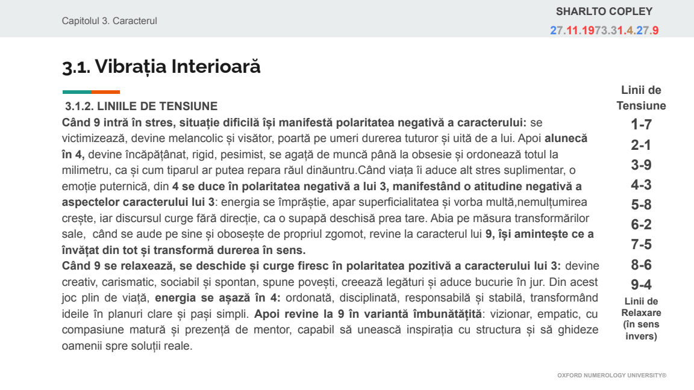

```text
Capitolul 3. Caracterul
3.1. Vibrația Interioară
Linii de
3.1.2. LINIILE DE TENSIUNE Tensiune
Când 9 intră în stres, situație dificilă își manifestă polaritatea negativă a caracterului: se 1-7
victimizează, devine melancolic și visător, poartă pe umeri durerea tuturor și uită de a lui. Apoi alunecă
2-1
în 4, devine încăpățânat, rigid, pesimist, se agață de muncă până la obsesie și ordonează totul la
3-9
milimetru, ca și cum tiparul ar putea repara răul dinăuntru.Când viața îi aduce alt stres suplimentar, o
emoție puternică, din 4 se duce în polaritatea negativă a lui 3, manifestând o atitudine negativă a 4-3
aspectelor caracterului lui 3: energia se împrăștie, apar superficialitatea și vorba multă,nemulțumirea 5-8
crește, iar discursul curge fără direcție, ca o supapă deschisă prea tare. Abia pe măsura transformărilor
6-2
sale, când se aude pe sine și obosește de propriul zgomot, revine la caracterul lui 9, își amintește ce a
7-5
învățat din tot și transformă durerea în sens.
Când 9 se relaxează, se deschide și curge firesc în polaritatea pozitivă a caracterului lui 3: devine 8-6
creativ, carismatic, sociabil și spontan, spune povești, creează legături și aduce bucurie în jur. Din acest 9-4
joc plin de viață, energia se așază în 4: ordonată, disciplinată, responsabilă și stabilă, transformând
Linii de
ideile în planuri clare și pași simpli. Apoi revine la 9 în variantă îmbunătățită: vizionar, empatic, cu Relaxare
(în sens
compasiune matură și prezență de mentor, capabil să unească inspirația cu structura și să ghideze
invers)
oamenii spre soluții reale.
OXFORD NUMEROLOGY UNIVERSITY®
```

### Pagina 105

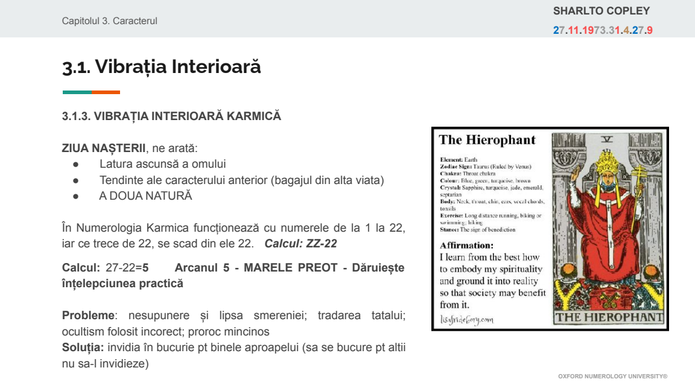

```text
Capitolul 3. Caracterul
3.1. Vibrația Interioară
3.1.3. VIBRAȚIA INTERIOARĂ KARMICĂ
ZIUA NAȘTERII, ne arată:
● Latura ascunsă a omului
● Tendinte ale caracterului anterior (bagajul din alta viata)
● A DOUA NATURĂ
În Numerologia Karmica funcționează cu numerele de la 1 la 22,
iar ce trece de 22, se scad din ele 22. Calcul: ZZ-22
Calcul: 27-22=5 Arcanul 5 - MARELE PREOT - Dăruiește
înțelepciunea practică
Probleme: nesupunere și lipsa smereniei; tradarea tatalui;
ocultism folosit incorect; proroc mincinos
Soluția: invidia în bucurie pt binele aproapelui (sa se bucure pt altii
nu sa-l invidieze)
OXFORD NUMEROLOGY UNIVERSITY®
```

### Pagina 106

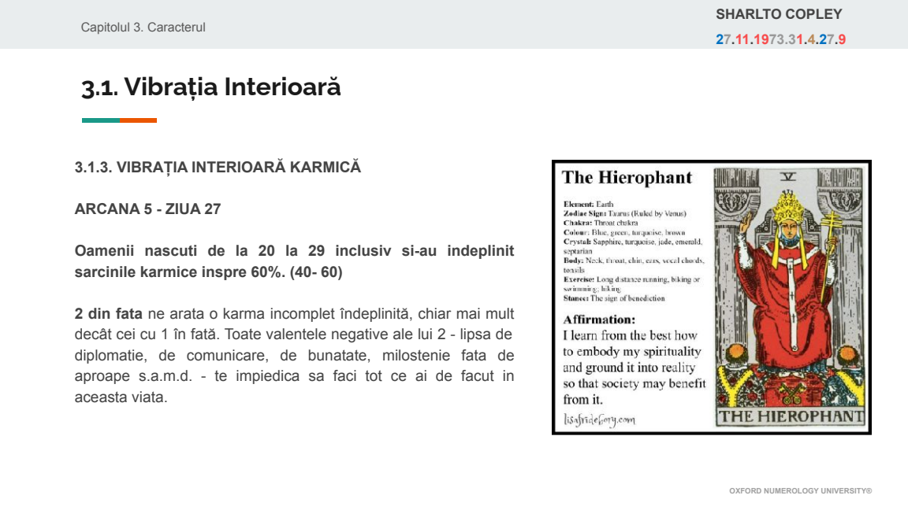

```text
Capitolul 3. Caracterul
3.1. Vibrația Interioară
3.1.3. VIBRAȚIA INTERIOARĂ KARMICĂ
ARCANA 5 - ZIUA 27
Oamenii nascuti de la 20 la 29 inclusiv si-au indeplinit
sarcinile karmice inspre 60%. (40- 60)
2 din fata ne arata o karma incomplet îndeplinită, chiar mai mult
decât cei cu 1 în fată. Toate valentele negative ale lui 2 - lipsa de
diplomatie, de comunicare, de bunatate, milostenie fata de
aproape s.a.m.d. - te impiedica sa faci tot ce ai de facut in
aceasta viata.
OXFORD NUMEROLOGY UNIVERSITY®
```

### Pagina 107

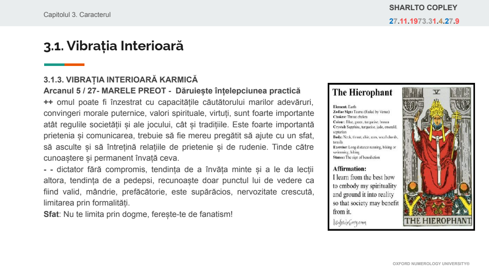

```text
Capitolul 3. Caracterul
3.1. Vibrația Interioară
3.1.3. VIBRAȚIA INTERIOARĂ KARMICĂ
Arcanul 5 / 27- MARELE PREOT - Dăruiește înțelepciunea practică
++ omul poate fi înzestrat cu capacitățile căutătorului marilor adevăruri,
convingeri morale puternice, valori spirituale, virtuți, sunt foarte importante
atât regulile societății și ale jocului, cât și tradițiile. Este foarte importantă
prietenia și comunicarea, trebuie să fie mereu pregătit să ajute cu un sfat,
să asculte și să întrețină relațiile de prietenie și de rudenie. Tinde către
cunoaștere și permanent învață ceva.
- - dictator fără compromis, tendința de a învăța minte și a le da lecții
altora, tendința de a pedepsi, recunoaște doar punctul lui de vedere ca
fiind valid, mândrie, prefăcătorie, este supărăcios, nervozitate crescută,
limitarea prin formalități.
Sfat: Nu te limita prin dogme, ferește-te de fanatism!
OXFORD NUMEROLOGY UNIVERSITY®
```

### Pagina 108

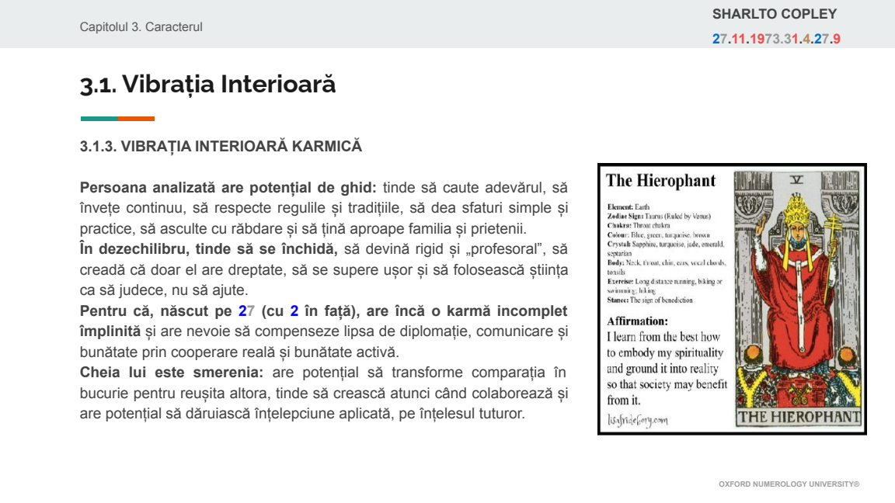

```text
Capitolul 3. Caracterul
3.1. Vibrația Interioară
3.1.3. VIBRAȚIA INTERIOARĂ KARMICĂ
Persoana analizată are potențial de ghid: tinde să caute adevărul, să
învețe continuu, să respecte regulile și tradițiile, să dea sfaturi simple și
practice, să asculte cu răbdare și să țină aproape familia și prietenii.
În dezechilibru, tinde să se închidă, să devină rigid și „profesoral”, să
creadă că doar el are dreptate, să se supere ușor și să folosească știința
ca să judece, nu să ajute.
Pentru că, născut pe 27 (cu 2 în față), are încă o karmă incomplet
împlinită și are nevoie să compenseze lipsa de diplomație, comunicare și
bunătate prin cooperare reală și bunătate activă.
Cheia lui este smerenia: are potențial să transforme comparația în
bucurie pentru reușita altora, tinde să crească atunci când colaborează și
are potențial să dăruiască înțelepciune aplicată, pe înțelesul tuturor.
OXFORD NUMEROLOGY UNIVERSITY®
```

### Pagina 109

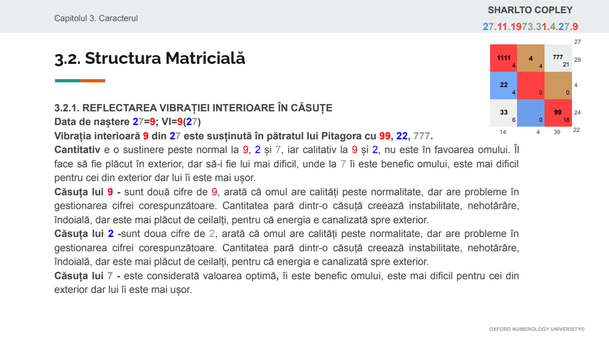

```text
Capitolul 3. Caracterul
27
3.2. Structura Matricială
1111 4 777 29
4 4 21
22 4
4 0 0
3.2.1. REFLECTAREA VIBRAȚIEI INTERIOARE ÎN CĂSUȚE
33 99 24
Data de naștere 27=9; VI=9(27) 6 0 18
Vibrația interioară 9 din 27 este susținută în pătratul lui Pitagora cu 99, 22, 777. 14 4 39 22
Cantitativ e o sustinere peste normal la 9, 2 și 7, iar calitativ la 9 și 2, nu este în favoarea omului. Îl
face să fie plăcut în exterior, dar să-i fie lui mai dificil, unde la 7 îi este benefic omului, este mai dificil
pentru cei din exterior dar lui îi este mai ușor.
Căsuța lui 9 - sunt două cifre de 9, arată că omul are calități peste normalitate, dar are probleme în
gestionarea cifrei corespunzătoare. Cantitatea pară dintr-o căsuță creează instabilitate, nehotărâre,
îndoială, dar este mai plăcut de ceilalți, pentru că energia e canalizată spre exterior.
Căsuța lui 2 -sunt doua cifre de 2, arată că omul are calități peste normalitate, dar are probleme în
gestionarea cifrei corespunzătoare. Cantitatea pară dintr-o căsuță creează instabilitate, nehotărâre,
îndoială, dar este mai plăcut de ceilalți, pentru că energia e canalizată spre exterior.
Căsuța lui 7 - este considerată valoarea optimă, îi este benefic omului, este mai dificil pentru cei din
exterior dar lui îi este mai ușor.
OXFORD NUMEROLOGY UNIVERSITY®
```

### Pagina 110

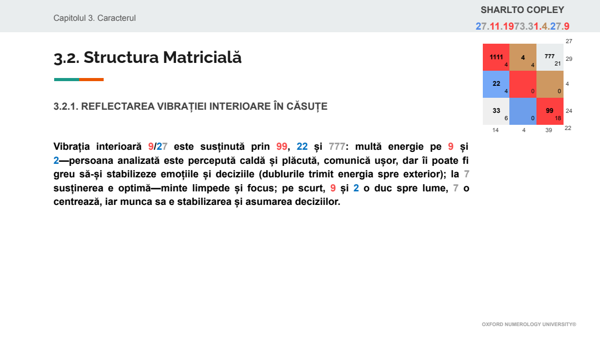

```text
Capitolul 3. Caracterul
27
3.2. Structura Matricială
1111 4 777 29
4 4 21
22 4
4 0 0
3.2.1. REFLECTAREA VIBRAȚIEI INTERIOARE ÎN CĂSUȚE
33 99 24
6 0 18
14 4 39 22
Vibrația interioară 9/27 este susținută prin 99, 22 și 777: multă energie pe 9 și
2—persoana analizată este percepută caldă și plăcută, comunică ușor, dar îi poate fi
greu să-și stabilizeze emoțiile și deciziile (dublurile trimit energia spre exterior); la 7
susținerea e optimă—minte limpede și focus; pe scurt, 9 și 2 o duc spre lume, 7 o
centrează, iar munca sa e stabilizarea și asumarea deciziilor.
OXFORD NUMEROLOGY UNIVERSITY®
```

### Pagina 111

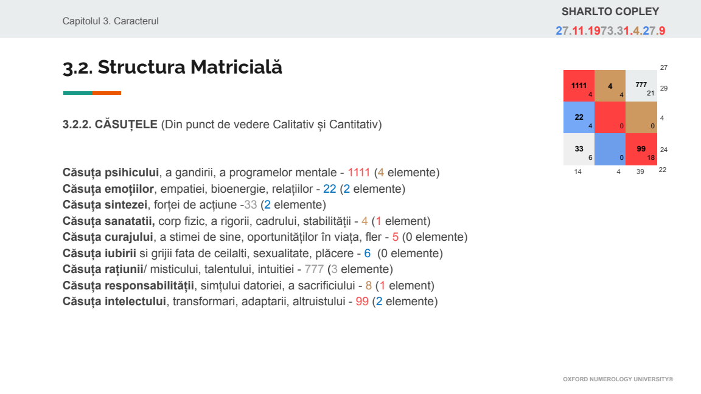

```text
Capitolul 3. Caracterul
3.2. Structura Matricială
27
1111 4 777 29
4 4 21
22 4
3.2.2. CĂSUȚELE (Din punct de vedere Calitativ și Cantitativ)
4 0 0
33 99 24
6 0 18
Căsuța psihicului, a gandirii, a programelor mentale - 1111 (4 elemente) 14 4 39 22
Căsuța emoțiilor, empatiei, bioenergie, relațiilor - 22 (2 elemente)
Căsuța sintezei, forței de acțiune -33 (2 elemente)
Căsuța sanatatii, corp fizic, a rigorii, cadrului, stabilității - 4 (1 element)
Căsuța curajului, a stimei de sine, oportunităților în viața, fler - 5 (0 elemente)
Căsuța iubirii si grijii fata de ceilalti, sexualitate, plăcere - 6 (0 elemente)
Căsuța rațiunii/ misticului, talentului, intuitiei - 777 (3 elemente)
Căsuța responsabilității, simțului datoriei, a sacrificiului - 8 (1 element)
Căsuța intelectului, transformari, adaptarii, altruistului - 99 (2 elemente)
OXFORD NUMEROLOGY UNIVERSITY®
```

### Pagina 112

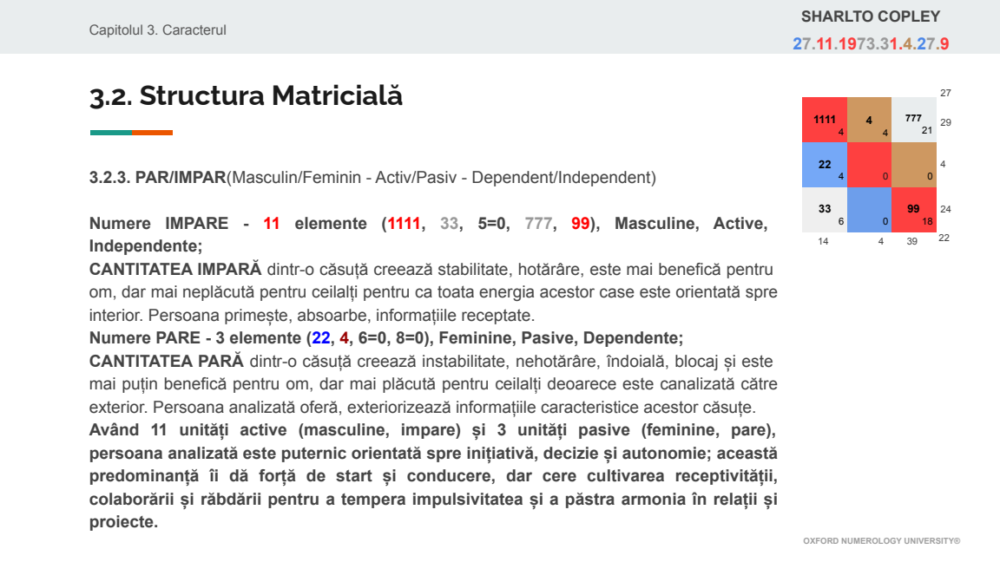

```text
Capitolul 3. Caracterul
3.2. Structura Matricială
27
1111 4 777 29
4 4 21
22 4
3.2.3. PAR/IMPAR(Masculin/Feminin - Activ/Pasiv - Dependent/Independent) 4 0 0
33 99 24
Numere IMPARE - 11 elemente (1111, 33, 5=0, 777, 99), Masculine, Active, 6 0 18
Independente; 14 4 39 22
CANTITATEA IMPARĂ dintr-o căsuță creează stabilitate, hotărâre, este mai benefică pentru
om, dar mai neplăcută pentru ceilalți pentru ca toata energia acestor case este orientată spre
interior. Persoana primește, absoarbe, informațiile receptate.
Numere PARE - 3 elemente (22, 4, 6=0, 8=0), Feminine, Pasive, Dependente;
CANTITATEA PARĂ dintr-o căsuță creează instabilitate, nehotărâre, îndoială, blocaj și este
mai puțin benefică pentru om, dar mai plăcută pentru ceilalți deoarece este canalizată către
exterior. Persoana analizată oferă, exteriorizează informațiile caracteristice acestor căsuțe.
Având 11 unități active (masculine, impare) și 3 unități pasive (feminine, pare),
persoana analizată este puternic orientată spre inițiativă, decizie și autonomie; această
predominanță îi dă forță de start și conducere, dar cere cultivarea receptivității,
colaborării și răbdării pentru a tempera impulsivitatea și a păstra armonia în relații și
proiecte.
OXFORD NUMEROLOGY UNIVERSITY®
```

### Pagina 113

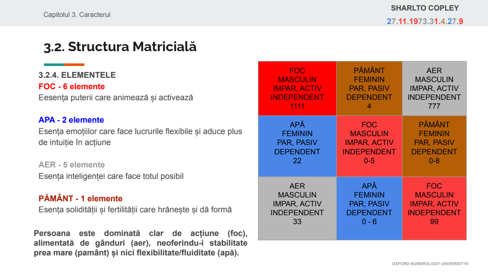

```text
Capitolul 3. Caracterul
3.2. Structura Matricială
FOC PĂMÂNT AER
3.2.4. ELEMENTELE
MASCULIN FEMININ MASCULIN
FOC - 6 elemente
IMPAR, ACTIV PAR, PASIV IMPAR, ACTIV
Eesența puterii care animează și activează INDEPENDENT DEPENDENT INDEPENDENT
1111 4 777
APA - 2 elemente
APĂ FOC PĂMÂNT
Esența emoțiilor care face lucrurile flexibile și aduce plus
FEMININ MASCULIN FEMININ
de intuiție în acțiune PAR, PASIV IMPAR, ACTIV PAR, PASIV
DEPENDENT INDEPENDENT DEPENDENT
22 0-5 0-8
AER - 5 elemente
Esența inteligenței care face totul posibil
AER APĂ FOC
MASCULIN FEMININ MASCULIN
PĂMÂNT - 1 elemente
IMPAR, ACTIV PAR, PASIV IMPAR, ACTIV
Esența solidității și fertilității care hrănește și dă formă
INDEPENDENT DEPENDENT INDEPENDENT
33 0 - 6 99
Persoana este dominată clar de acțiune (foc),
alimentată de gânduri (aer), neoferindu-i stabilitate
prea mare (pamânt) și nici flexibilitate/fluiditate (apă).
OXFORD NUMEROLOGY UNIVERSITY®
```

### Pagina 114

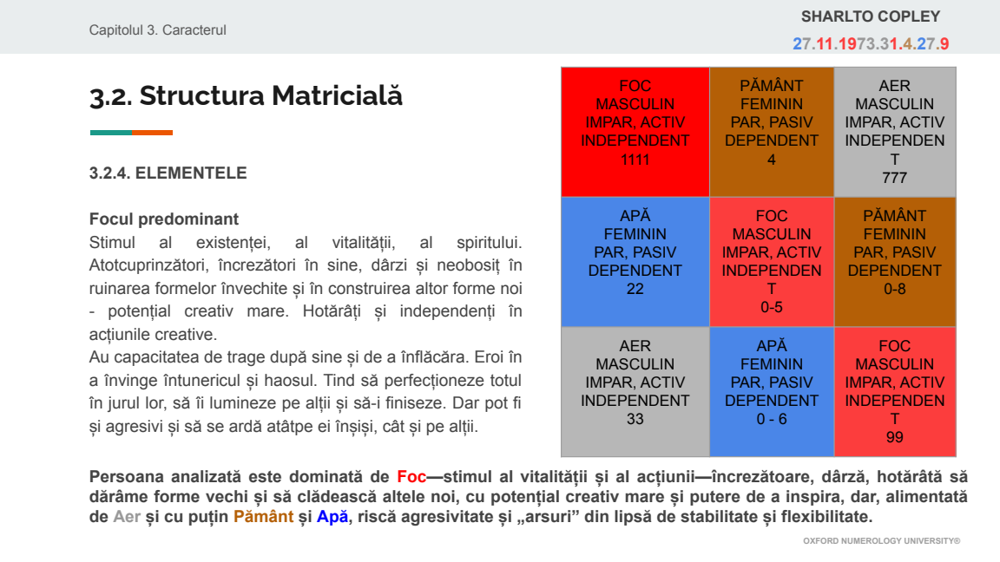

```text
Capitolul 3. Caracterul
FOC PĂMÂNT AER
3.2. Structura Matricială
MASCULIN FEMININ MASCULIN
IMPAR, ACTIV PAR, PASIV IMPAR, ACTIV
INDEPENDENT DEPENDENT INDEPENDEN
1111 4 T
3.2.4. ELEMENTELE
777
Focul predominant APĂ FOC PĂMÂNT
FEMININ MASCULIN FEMININ
Stimul al existenței, al vitalității, al spiritului.
PAR, PASIV IMPAR, ACTIV PAR, PASIV
Atotcuprinzători, încrezători în sine, dârzi și neobosiț în
DEPENDENT INDEPENDEN DEPENDENT
ruinarea formelor învechite și în construirea altor forme noi 22 T 0-8
- potențial creativ mare. Hotărâți și independenți în 0-5
acțiunile creative.
AER APĂ FOC
Au capacitatea de trage după sine și de a înflăcăra. Eroi în
MASCULIN FEMININ MASCULIN
a învinge întunericul și haosul. Tind să perfecționeze totul IMPAR, ACTIV PAR, PASIV IMPAR, ACTIV
în jurul lor, să îi lumineze pe alții și să-i finiseze. Dar pot fi INDEPENDENT DEPENDENT INDEPENDEN
33 0 - 6 T
și agresivi și să se ardă atâtpe ei înșiși, cât și pe alții.
99
Persoana analizată este dominată de Foc—stimul al vitalității și al acțiunii—încrezătoare, dârză, hotărâtă să
dărâme forme vechi și să clădească altele noi, cu potențial creativ mare și putere de a inspira, dar, alimentată
de Aer și cu puțin Pământ și Apă, riscă agresivitate și „arsuri” din lipsă de stabilitate și flexibilitate.
OXFORD NUMEROLOGY UNIVERSITY®
```

### Pagina 115

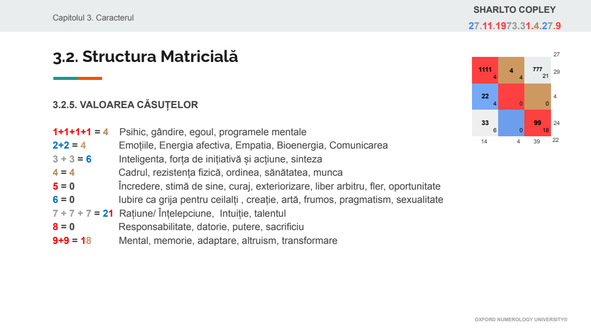

```text
Capitolul 3. Caracterul
3.2. Structura Matricială 27
1111 4 777 29
4 4 21
22 4
3.2.5. VALOAREA CĂSUȚELOR 4 0 0
33 99 24
1+1+1+1 = 4 Psihic, gândire, egoul, programele mentale 6 0 18
2+2 = 4 Emoțiile, Energia afectiva, Empatia, Bioenergia, Comunicarea 14 4 39 22
3 + 3 = 6 Inteligenta, forța de inițiativă și acțiune, sinteza
4 = 4 Cadrul, rezistența fizică, ordinea, sănătatea, munca
5 = 0 Încredere, stimă de sine, curaj, exteriorizare, liber arbitru, fler, oportunitate
6 = 0 Iubire ca grija pentru ceilalți , creație, artă, frumos, pragmatism, sexualitate
7 + 7 + 7 = 21 Rațiune/ Înțelepciune, Intuiție, talentul
8 = 0 Responsabilitate, datorie, putere, sacrificiu
9+9 = 18 Mental, memorie, adaptare, altruism, transformare
OXFORD NUMEROLOGY UNIVERSITY®
```

### Pagina 116

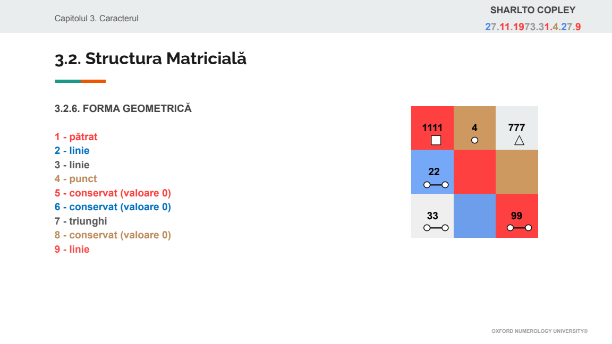

```text
Capitolul 3. Caracterul
3.2. Structura Matricială
3.2.6. FORMA GEOMETRICĂ
1111 4 777
1 - pătrat
2 - linie
3 - linie
22
4 - punct
5 - conservat (valoare 0)
6 - conservat (valoare 0)
33 99
7 - triunghi
8 - conservat (valoare 0)
9 - linie
OXFORD NUMEROLOGY UNIVERSITY®
```

### Pagina 117

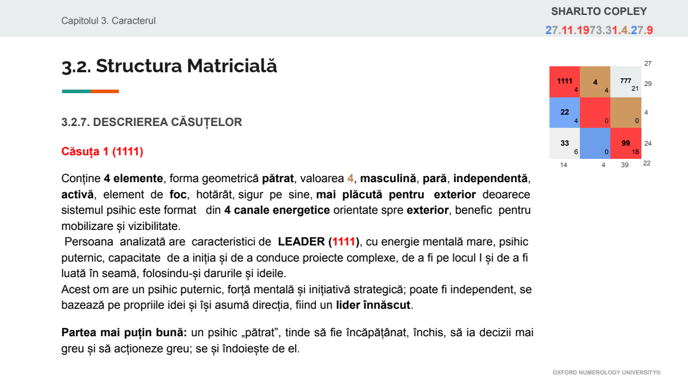

```text
Capitolul 3. Caracterul
3.2. Structura Matricială 27
1111 4 777 29
4 4 21
22 4
3.2.7. DESCRIEREA CĂSUȚELOR 4 0 0
33 99 24
Căsuța 1 (1111) 6 0 18
14 4 39 22
Conține 4 elemente, forma geometrică pătrat, valoarea 4, masculină, pară, independentă,
activă, element de foc, hotărât, sigur pe sine, mai plăcută pentru exterior deoarece
sistemul psihic este format din 4 canale energetice orientate spre exterior, benefic pentru
mobilizare și vizibilitate.
Persoana analizată are caracteristici de LEADER (1111), cu energie mentală mare, psihic
puternic, capacitate de a iniția și de a conduce proiecte complexe, de a fi pe locul I și de a fi
luată în seamă, folosindu-și darurile și ideile.
Acest om are un psihic puternic, forță mentală și inițiativă strategică; poate fi independent, se
bazează pe propriile idei și își asumă direcția, fiind un lider înnăscut.
Partea mai puțin bună: un psihic „pătrat”, tinde să fie încăpățânat, închis, să ia decizii mai
greu și să acționeze greu; se și îndoiește de el.
OXFORD NUMEROLOGY UNIVERSITY®
```

### Pagina 118

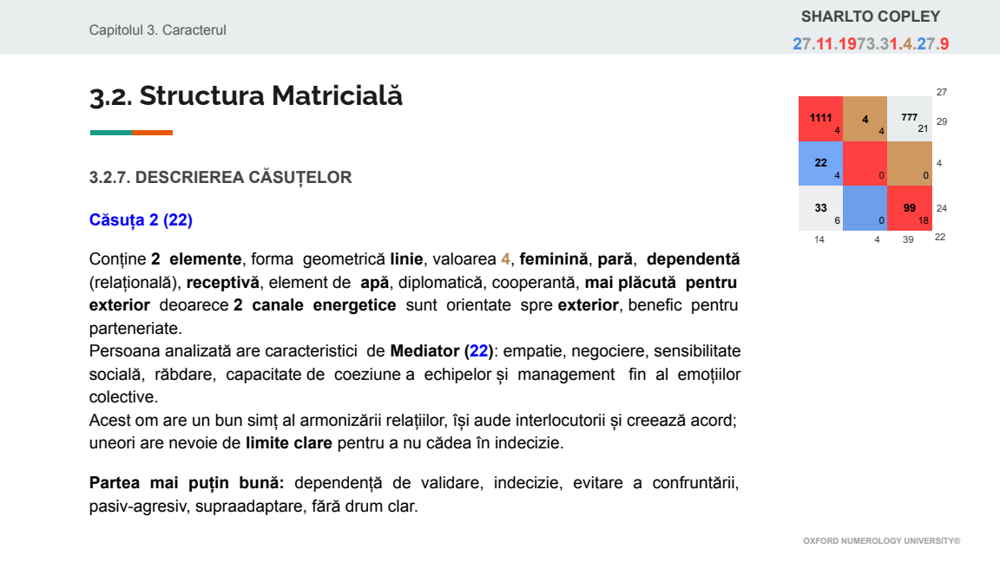

```text
Capitolul 3. Caracterul
3.2. Structura Matricială 27
1111 4 777 29
4 4 21
22 4
3.2.7. DESCRIEREA CĂSUȚELOR 4 0 0
33 99 24
Căsuța 2 (22) 6 0 18
14 4 39 22
Conține 2 elemente, forma geometrică linie, valoarea 4, feminină, pară, dependentă
(relațională), receptivă, element de apă, diplomatică, cooperantă, mai plăcută pentru
exterior deoarece 2 canale energetice sunt orientate spre exterior, benefic pentru
parteneriate.
Persoana analizată are caracteristici de Mediator (22): empatie, negociere, sensibilitate
socială, răbdare, capacitate de coeziune a echipelor și management fin al emoțiilor
colective.
Acest om are un bun simț al armonizării relațiilor, își aude interlocutorii și creează acord;
uneori are nevoie de limite clare pentru a nu cădea în indecizie.
Partea mai puțin bună: dependență de validare, indecizie, evitare a confruntării,
pasiv-agresiv, supraadaptare, fără drum clar.
OXFORD NUMEROLOGY UNIVERSITY®
```

### Pagina 119

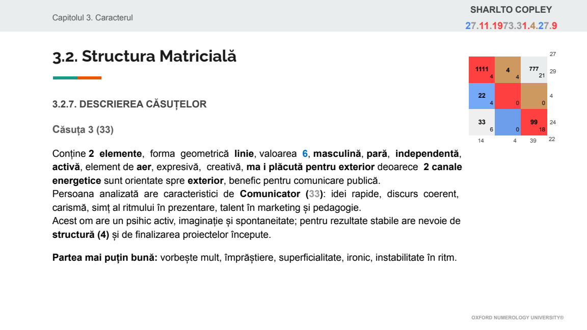

```text
Capitolul 3. Caracterul
3.2. Structura Matricială 27
1111 4 777 29
4 4 21
22 4
3.2.7. DESCRIEREA CĂSUȚELOR 4 0 0
33 99 24
Căsuța 3 (33) 6 0 18
14 4 39 22
Conține 2 elemente, forma geometrică linie, valoarea 6, masculină, pară, independentă,
activă, element de aer, expresivă, creativă, ma i plăcută pentru exterior deoarece 2 canale
energetice sunt orientate spre exterior, benefic pentru comunicare publică.
Persoana analizată are caracteristici de Comunicator (33): idei rapide, discurs coerent,
carismă, simț al ritmului în prezentare, talent în marketing și pedagogie.
Acest om are un psihic activ, imaginație și spontaneitate; pentru rezultate stabile are nevoie de
structură (4) și de finalizarea proiectelor începute.
Partea mai puțin bună: vorbește mult, împrăștiere, superficialitate, ironic, instabilitate în ritm.
OXFORD NUMEROLOGY UNIVERSITY®
```

### Pagina 120

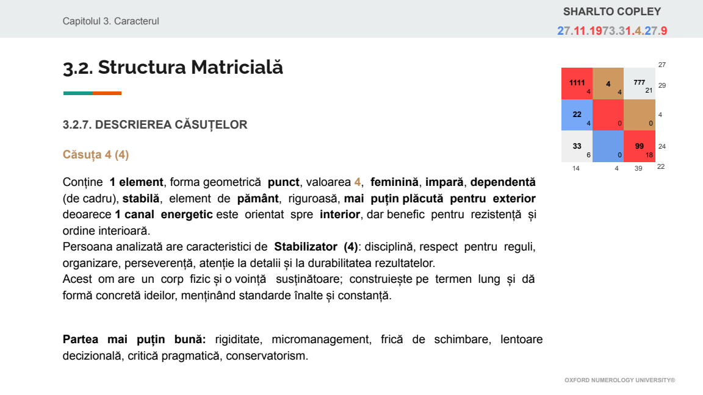

```text
Capitolul 3. Caracterul
3.2. Structura Matricială 27
1111 4 777 29
4 4 21
22 4
3.2.7. DESCRIEREA CĂSUȚELOR 4 0 0
33 99 24
Căsuța 4 (4) 6 0 18
14 4 39 22
Conține 1 element, forma geometrică punct, valoarea 4, feminină, impară, dependentă
(de cadru), stabilă, element de pământ, riguroasă, mai puțin plăcută pentru exterior
deoarece 1 canal energetic este orientat spre interior, dar benefic pentru rezistență și
ordine interioară.
Persoana analizată are caracteristici de Stabilizator (4): disciplină, respect pentru reguli,
organizare, perseverență, atenție la detalii și la durabilitatea rezultatelor.
Acest om are un corp fizic și o voință susținătoare; construiește pe termen lung și dă
formă concretă ideilor, menținând standarde înalte și constanță.
Partea mai puțin bună: rigiditate, micromanagement, frică de schimbare, lentoare
decizională, critică pragmatică, conservatorism.
OXFORD NUMEROLOGY UNIVERSITY®
```

### Pagina 121

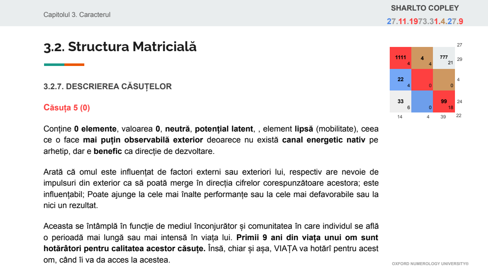

```text
Capitolul 3. Caracterul
3.2. Structura Matricială 27
1111 4 777 29
4 4 21
22 4
3.2.7. DESCRIEREA CĂSUȚELOR 4 0 0
33 99 24
Căsuța 5 (0) 6 0 18
14 4 39 22
Conține 0 elemente, valoarea 0, neutră, potențial latent, , element lipsă (mobilitate), ceea
ce o face mai puțin observabilă exterior deoarece nu există canal energetic nativ pe
arhetip, dar e benefic ca direcție de dezVAULTare.
Arată că omul este influențat de factori externi sau exteriori lui, respectiv are nevoie de
impulsuri din exterior ca să poată merge în direcția cifrelor corespunzătoare acestora; este
influențabil; Poate ajunge la cele mai înalte performanțe sau la cele mai defavorabile sau la
nici un rezultat.
Aceasta se întâmplă în funcție de mediul înconjurător și comunitatea în care individul se află
o perioadă mai lungă sau mai intensă în viața lui. Primii 9 ani din viața unui om sunt
hotărâtori pentru calitatea acestor căsuțe. Însă, chiar și așa, VIAȚA va hotărî pentru acest
om, când îi va da acces la acestea.
OXFORD NUMEROLOGY UNIVERSITY®
```

### Pagina 122

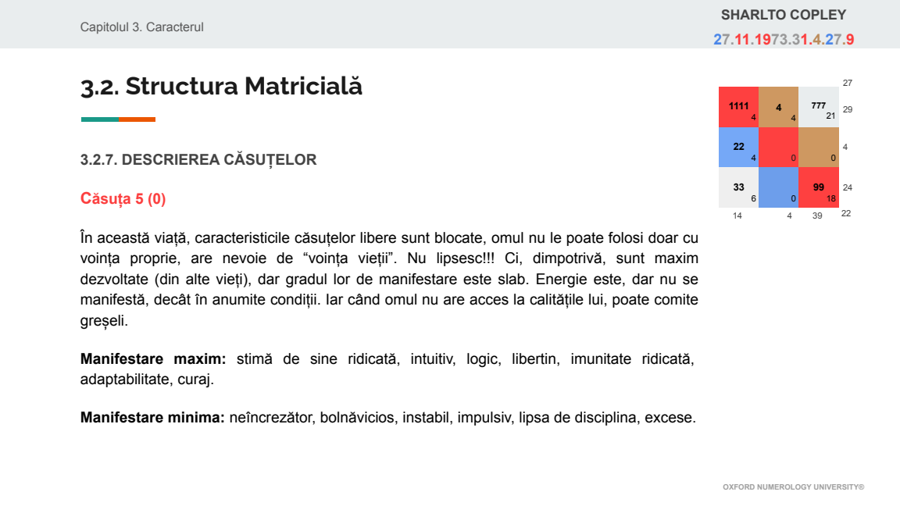

```text
Capitolul 3. Caracterul
3.2. Structura Matricială 27
1111 4 777 29
4 4 21
22 4
3.2.7. DESCRIEREA CĂSUȚELOR 4 0 0
33 99 24
Căsuța 5 (0) 6 0 18
14 4 39 22
În această viață, caracteristicile căsuțelor libere sunt blocate, omul nu le poate folosi doar cu
voința proprie, are nevoie de “voința vieții”. Nu lipsesc!!! Ci, dimpotrivă, sunt maxim
dezVAULTate (din alte vieți), dar gradul lor de manifestare este slab. Energie este, dar nu se
manifestă, decât în anumite condiții. Iar când omul nu are acces la calitățile lui, poate comite
greșeli.
Manifestare maxim: stimă de sine ridicată, intuitiv, logic, libertin, imunitate ridicată,
adaptabilitate, curaj.
Manifestare minima: neîncrezător, bolnăvicios, instabil, impulsiv, lipsa de disciplina, excese.
OXFORD NUMEROLOGY UNIVERSITY®
```

### Pagina 123

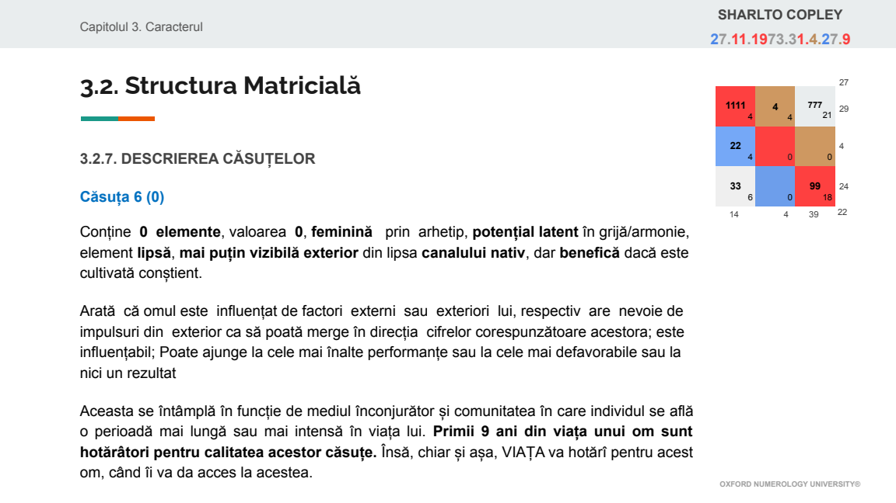

```text
Capitolul 3. Caracterul
3.2. Structura Matricială 27
1111 4 777 29
4 4 21
22 4
3.2.7. DESCRIEREA CĂSUȚELOR 4 0 0
33 99 24
Căsuța 6 (0) 6 0 18
14 4 39 22
Conține 0 elemente, valoarea 0, feminină prin arhetip, potențial latent în grijă/armonie,
element lipsă, mai puțin vizibilă exterior din lipsa canalului nativ, dar benefică dacă este
cultivată conștient.
Arată că omul este influențat de factori externi sau exteriori lui, respectiv are nevoie de
impulsuri din exterior ca să poată merge în direcția cifrelor corespunzătoare acestora; este
influențabil; Poate ajunge la cele mai înalte performanțe sau la cele mai defavorabile sau la
nici un rezultat
Aceasta se întâmplă în funcție de mediul înconjurător și comunitatea în care individul se află
o perioadă mai lungă sau mai intensă în viața lui. Primii 9 ani din viața unui om sunt
hotărâtori pentru calitatea acestor căsuțe. Însă, chiar și așa, VIAȚA va hotărî pentru acest
om, când îi va da acces la acestea.
OXFORD NUMEROLOGY UNIVERSITY®
```

### Pagina 124

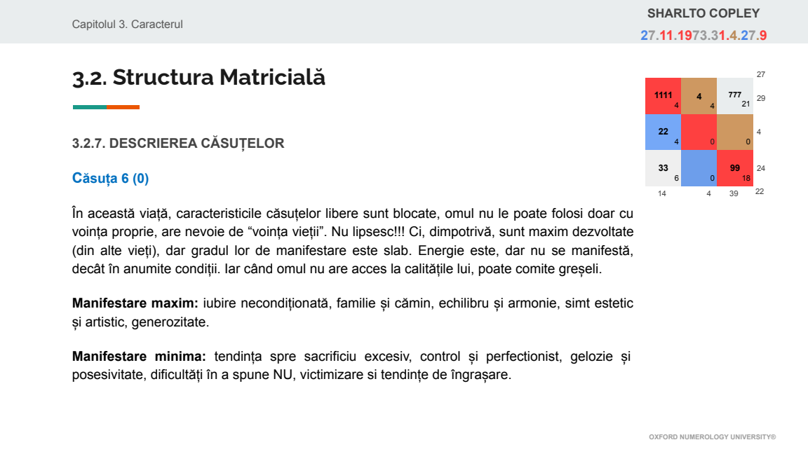

```text
Capitolul 3. Caracterul
3.2. Structura Matricială 27
1111 4 777 29
4 4 21
22 4
3.2.7. DESCRIEREA CĂSUȚELOR 4 0 0
33 99 24
Căsuța 6 (0) 6 0 18
14 4 39 22
În această viață, caracteristicile căsuțelor libere sunt blocate, omul nu le poate folosi doar cu
voința proprie, are nevoie de “voința vieții”. Nu lipsesc!!! Ci, dimpotrivă, sunt maxim dezVAULTate
(din alte vieți), dar gradul lor de manifestare este slab. Energie este, dar nu se manifestă,
decât în anumite condiții. Iar când omul nu are acces la calitățile lui, poate comite greșeli.
Manifestare maxim: iubire necondiționată, familie și cămin, echilibru și armonie, simt estetic
și artistic, generozitate.
Manifestare minima: tendința spre sacrificiu excesiv, control și perfectionist, gelozie și
posesivitate, dificultăți în a spune NU, victimizare si tendințe de îngrașare.
OXFORD NUMEROLOGY UNIVERSITY®
```

### Pagina 125

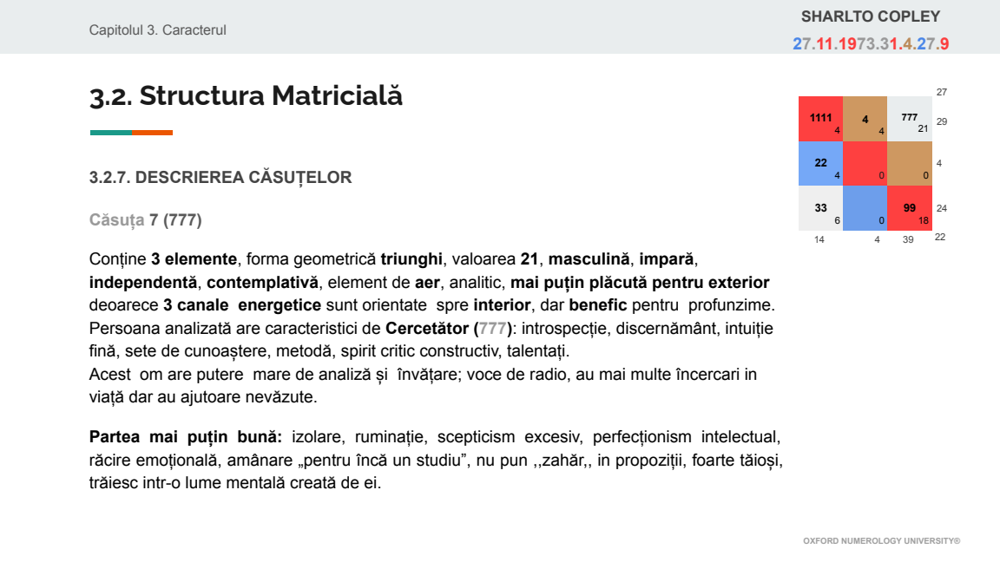

```text
Capitolul 3. Caracterul
3.2. Structura Matricială 27
1111 4 777 29
4 4 21
22 4
3.2.7. DESCRIEREA CĂSUȚELOR 4 0 0
33 99 24
Căsuța 7 (777) 6 0 18
14 4 39 22
Conține 3 elemente, forma geometrică triunghi, valoarea 21, masculină, impară,
independentă, contemplativă, element de aer, analitic, mai puțin plăcută pentru exterior
deoarece 3 canale energetice sunt orientate spre interior, dar benefic pentru profunzime.
Persoana analizată are caracteristici de Cercetător (777): introspecție, discernământ, intuiție
fină, sete de cunoaștere, metodă, spirit critic constructiv, talentați.
Acest om are putere mare de analiză și învățare; voce de radio, au mai multe încercari in
viață dar au ajutoare nevăzute.
Partea mai puțin bună: izolare, ruminație, scepticism excesiv, perfecționism intelectual,
răcire emoțională, amânare „pentru încă un studiu”, nu pun ,,zahăr,, in propoziții, foarte tăioși,
trăiesc intr-o lume mentală creată de ei.
OXFORD NUMEROLOGY UNIVERSITY®
```

### Pagina 126

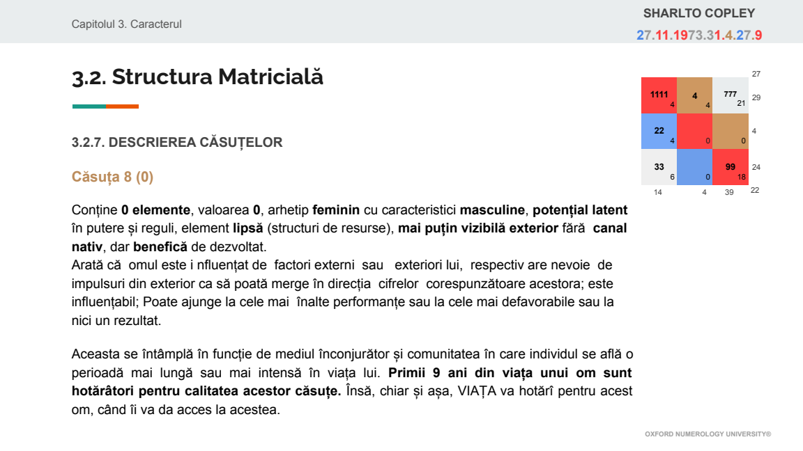

```text
Capitolul 3. Caracterul
3.2. Structura Matricială 27
1111 4 777 29
4 4 21
22 4
3.2.7. DESCRIEREA CĂSUȚELOR 4 0 0
33 99 24
Căsuța 8 (0) 6 0 18
14 4 39 22
Conține 0 elemente, valoarea 0, arhetip feminin cu caracteristici masculine, potențial latent
în putere și reguli, element lipsă (structuri de resurse), mai puțin vizibilă exterior fără canal
nativ, dar benefică de dezVAULTat.
Arată că omul este i nfluențat de factori externi sau exteriori lui, respectiv are nevoie de
impulsuri din exterior ca să poată merge în direcția cifrelor corespunzătoare acestora; este
influențabil; Poate ajunge la cele mai înalte performanțe sau la cele mai defavorabile sau la
nici un rezultat.
Aceasta se întâmplă în funcție de mediul înconjurător și comunitatea în care individul se află o
perioadă mai lungă sau mai intensă în viața lui. Primii 9 ani din viața unui om sunt
hotărâtori pentru calitatea acestor căsuțe. Însă, chiar și așa, VIAȚA va hotărî pentru acest
om, când îi va da acces la acestea.
OXFORD NUMEROLOGY UNIVERSITY®
```

### Pagina 127

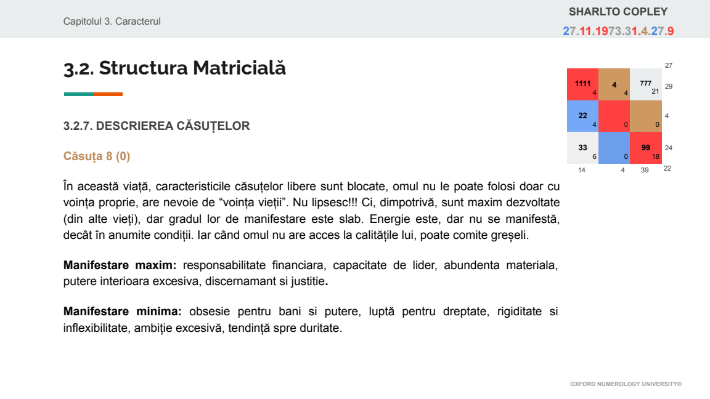

```text
Capitolul 3. Caracterul
3.2. Structura Matricială 27
1111 4 777 29
4 4 21
22 4
3.2.7. DESCRIEREA CĂSUȚELOR 4 0 0
33 99 24
Căsuța 8 (0) 6 0 18
14 4 39 22
În această viață, caracteristicile căsuțelor libere sunt blocate, omul nu le poate folosi doar cu
voința proprie, are nevoie de “voința vieții”. Nu lipsesc!!! Ci, dimpotrivă, sunt maxim dezVAULTate
(din alte vieți), dar gradul lor de manifestare este slab. Energie este, dar nu se manifestă,
decât în anumite condiții. Iar când omul nu are acces la calitățile lui, poate comite greșeli.
Manifestare maxim: responsabilitate financiara, capacitate de lider, abundenta materiala,
putere interioara excesiva, discernamant si justitie.
Manifestare minima: obsesie pentru bani si putere, luptă pentru dreptate, rigiditate si
inflexibilitate, ambiție excesivă, tendință spre duritate.
OXFORD NUMEROLOGY UNIVERSITY®
```

### Pagina 128

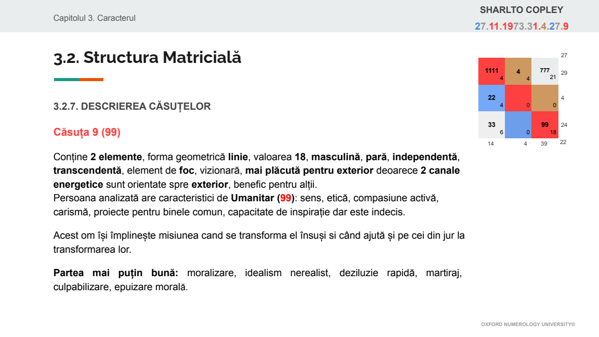

```text
Capitolul 3. Caracterul
3.2. Structura Matricială 27
1111 4 777 29
4 4 21
22 4
3.2.7. DESCRIEREA CĂSUȚELOR 4 0 0
33 99 24
Căsuța 9 (99) 6 0 18
14 4 39 22
Conține 2 elemente, forma geometrică linie, valoarea 18, masculină, pară, independentă,
transcendentă, element de foc, vizionară, mai plăcută pentru exterior deoarece 2 canale
energetice sunt orientate spre exterior, benefic pentru alții.
Persoana analizată are caracteristici de Umanitar (99): sens, etică, compasiune activă,
carismă, proiecte pentru binele comun, capacitate de inspirație dar este indecis.
Acest om își împlinește misiunea cand se transforma el însuși si când ajută și pe cei din jur la
transformarea lor.
Partea mai puțin bună: moralizare, idealism nerealist, deziluzie rapidă, martiraj,
culpabilizare, epuizare morală.
OXFORD NUMEROLOGY UNIVERSITY®
```

### Pagina 129

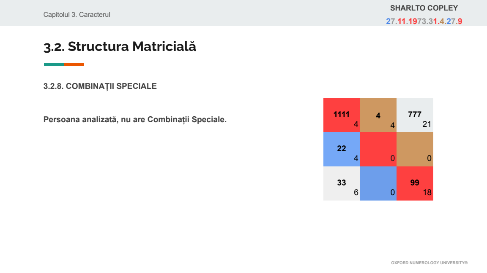

```text
Capitolul 3. Caracterul
3.2. Structura Matricială
3.2.8. COMBINAȚII SPECIALE
1111 4 777
Persoana analizată, nu are Combinații Speciale.
4 4 21
22
4 0 0
33 99
6 0 18
OXFORD NUMEROLOGY UNIVERSITY®
```

### Pagina 130

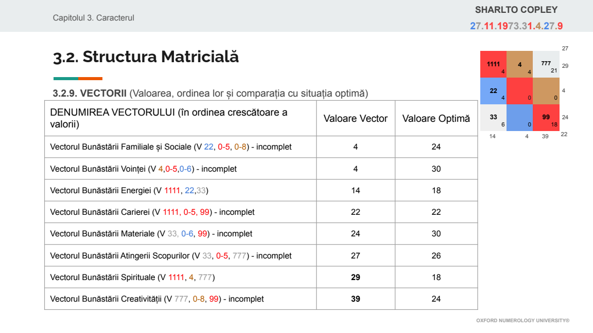

```text
Capitolul 3. Caracterul
27
3.2. Structura Matricială
1111 4 777 29
4 4 21
3.2.9. VECTORII (Valoarea, ordinea lor și comparația cu situația optimă) 22 4
4 0 0
DENUMIREA VECTORULUI (în ordinea crescătoare a
Valoare Vector Valoare Optimă 33 99 24
valorii) 6 0 18
14 4 39 22
Vectorul Bunăstării Familiale și Sociale (V 22, 0-5, 0-8) - incomplet 4 24
Vectorul Bunăstării Voinței (V 4,0-5,0-6) - incomplet 4 30
Vectorul Bunăstării Energiei (V 1111, 22,33) 14 18
Vectorul Bunăstării Carierei (V 1111, 0-5, 99) - incomplet 22 22
Vectorul Bunăstării Materiale (V 33, 0-6, 99) - incomplet 24 30
Vectorul Bunăstării Atingerii Scopurilor (V 33, 0-5, 777) - incomplet 27 26
Vectorul Bunăstării Spirituale (V 1111, 4, 777) 29 18
Vectorul Bunăstării Creativității (V 777, 0-8, 99) - incomplet 39 24
OXFORD NUMEROLOGY UNIVERSITY®
```

### Pagina 131

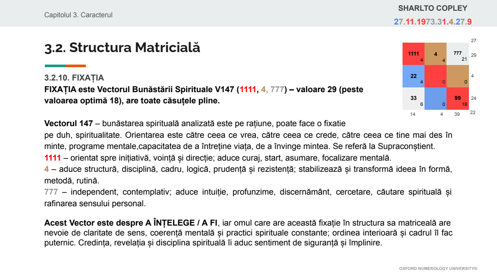

```text
Capitolul 3. Caracterul
27
3.2. Structura Matricială
1111 4 777 29
4 4 21
3.2.10. FIXAȚIA 22 4
4 0 0
FIXAȚIA este Vectorul Bunăstării Spirituale V147 (1111, 4, 777) – valoare 29 (peste
valoarea optimă 18), are toate căsuțele pline. 33 99 24
6 0 18
14 4 39 22
Vectorul 147 – bunăstarea spirituală analizată este pe rațiune, poate face o fixatie
pe duh, spiritualitate. Orientarea este către ceea ce vrea, către ceea ce crede, către ceea ce tine mai des în
minte, programe mentale,capacitatea de a întreține viața, de a învinge mintea. Se referă la Supraconștient.
1111 – orientat spre inițiativă, voință și direcție; aduce curaj, start, asumare, focalizare mentală.
4 – aduce structură, disciplină, cadru, logică, prudență și rezistență; stabilizează și transformă ideea în formă,
metodă, rutină.
777 – independent, contemplativ; aduce intuiție, profunzime, discernământ, cercetare, căutare spirituală și
rafinarea sensului personal.
Acest Vector este despre A ÎNȚELEGE / A FI, iar omul care are această fixație în structura sa matriceală are
nevoie de claritate de sens, coerență mentală și practici spirituale constante; ordinea interioară și cadrul îl fac
puternic. Credința, revelația și disciplina spirituală îi aduc sentiment de siguranță și împlinire.
OXFORD NUMEROLOGY UNIVERSITY®
```

### Pagina 132

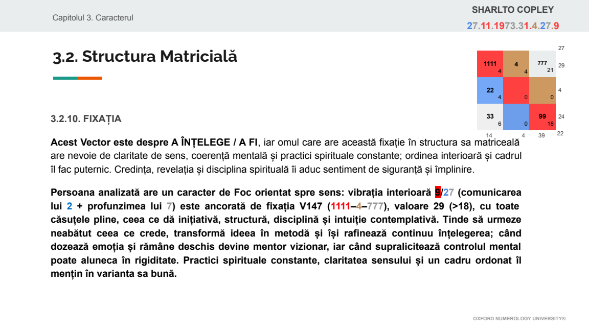

```text
Capitolul 3. Caracterul
27
3.2. Structura Matricială
1111 4 777 29
4 4 21
22 4
4 0 0
3.2.10. FIXAȚIA 33 99 24
6 0 18
14 4 39 22
Acest Vector este despre A ÎNȚELEGE / A FI, iar omul care are această fixație în structura sa matriceală
are nevoie de claritate de sens, coerență mentală și practici spirituale constante; ordinea interioară și cadrul
îl fac puternic. Credința, revelația și disciplina spirituală îi aduc sentiment de siguranță și împlinire.
Persoana analizată are un caracter de Foc orientat spre sens: vibrația interioară 9/27 (comunicarea
lui 2 + profunzimea lui 7) este ancorată de fixația V147 (1111–4–777), valoare 29 (>18), cu toate
căsuțele pline, ceea ce dă inițiativă, structură, disciplină și intuiție contemplativă. Tinde să urmeze
neabătut ceea ce crede, transformă ideea în metodă și își rafinează continuu înțelegerea; când
dozează emoția și rămâne deschis devine mentor vizionar, iar când supralicitează controlul mental
poate aluneca în rigiditate. Practici spirituale constante, claritatea sensului și un cadru ordonat îl
mențin în varianta sa bună.
OXFORD NUMEROLOGY UNIVERSITY®
```

### Pagina 133

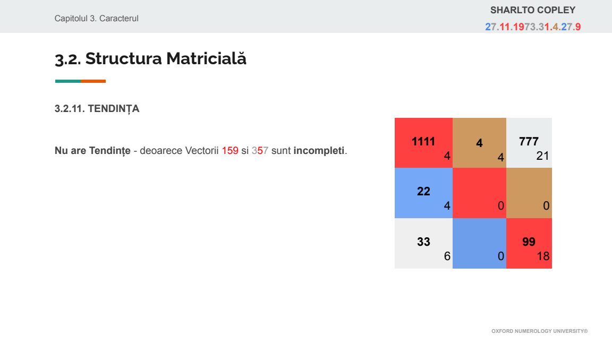

```text
Capitolul 3. Caracterul
3.2. Structura Matricială
3.2.11. TENDINȚA
1111 4 777
Nu are Tendințe - deoarece Vectorii 159 si 357 sunt incompleti.
4 4 21
22
4 0 0
33 99
6 0 18
OXFORD NUMEROLOGY UNIVERSITY®
```

### Pagina 134

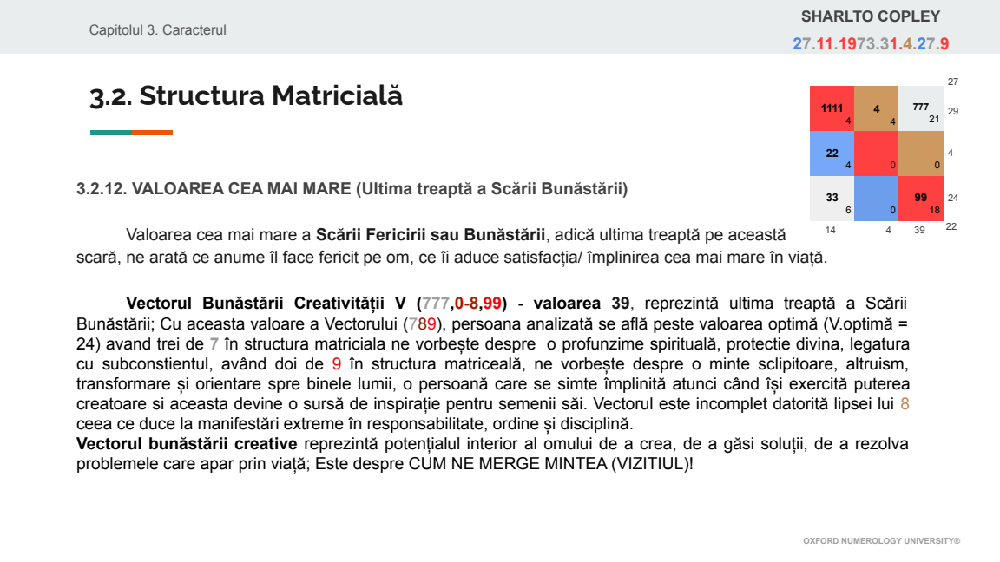

```text
Capitolul 3. Caracterul
27
3.2. Structura Matricială
1111 4 777 29
4 4 21
22 4
4 0 0
3.2.12. VALOAREA CEA MAI MARE (Ultima treaptă a Scării Bunăstării)
33 99 24
6 0 18
Valoarea cea mai mare a Scării Fericirii sau Bunăstării, adică ultima treaptă pe această 14 4 39 22
scară, ne arată ce anume îl face fericit pe om, ce îi aduce satisfacția/ împlinirea cea mai mare în viață.
Vectorul Bunăstării Creativității V (777,0-8,99) - valoarea 39, reprezintă ultima treaptă a Scării
Bunăstării; Cu aceasta valoare a Vectorului (789), persoana analizată se află peste valoarea optimă (V.optimă =
24) avand trei de 7 în structura matriciala ne vorbește despre o profunzime spirituală, protectie divina, legatura
cu subconstientul, având doi de 9 în structura matriceală, ne vorbește despre o minte sclipitoare, altruism,
transformare și orientare spre binele lumii, o persoană care se simte împlinită atunci când își exercită puterea
creatoare si aceasta devine o sursă de inspirație pentru semenii săi. Vectorul este incomplet datorită lipsei lui 8
ceea ce duce la manifestări extreme în responsabilitate, ordine și disciplină.
Vectorul bunăstării creative reprezintă potențialul interior al omului de a crea, de a găsi soluții, de a rezolva
problemele care apar prin viață; Este despre CUM NE MERGE MINTEA (VIZITIUL)!
OXFORD NUMEROLOGY UNIVERSITY®
```

### Pagina 135

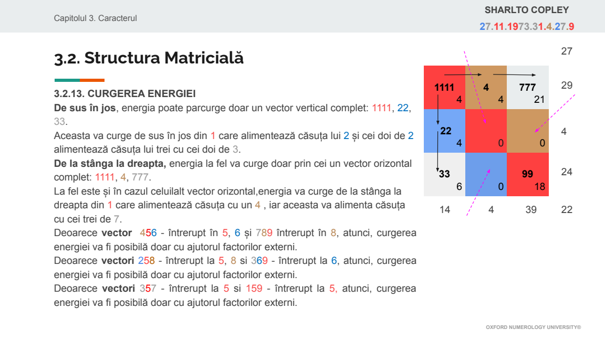

```text
Capitolul 3. Caracterul
27
3.2. Structura Matricială
1111 4 777 29
3.2.13. CURGEREA ENERGIEI
4 4 21
De sus în jos, energia poate parcurge doar un vector vertical complet: 1111, 22,
33.
22 4
Aceasta va curge de sus în jos din 1 care alimentează căsuța lui 2 și cei doi de 2
4 0 0
alimentează căsuța lui trei cu cei doi de 3.
De la stânga la dreapta, energia la fel va curge doar prin cei un vector orizontal
33 99 24
complet: 1111, 4, 777.
6 0 18
La fel este și în cazul celuilalt vector orizontal,energia va curge de la stânga la
dreapta din 1 care alimentează căsuța cu un 4 , iar aceasta va alimenta căsuța
14 4 39 22
cu cei trei de 7.
Deoarece vector 456 - întrerupt în 5, 6 și 789 întrerupt în 8, atunci, curgerea
energiei va fi posibilă doar cu ajutorul factorilor externi.
Deoarece vectori 258 - întrerupt la 5, 8 si 369 - întrerupt la 6, atunci, curgerea
energiei va fi posibilă doar cu ajutorul factorilor externi.
Deoarece vectori 357 - întrerupt la 5 si 159 - întrerupt la 5, atunci, curgerea
energiei va fi posibilă doar cu ajutorul factorilor externi.
OXFORD NUMEROLOGY UNIVERSITY®
```

### Pagina 136

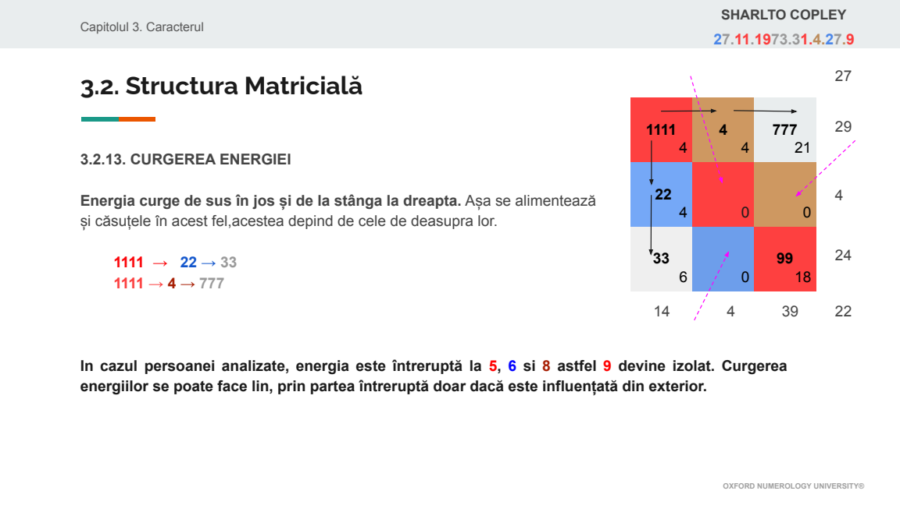

```text
Capitolul 3. Caracterul
27
3.2. Structura Matricială
1111 4 777 29
4 4 21
3.2.13. CURGEREA ENERGIEI
22 4
Energia curge de sus în jos și de la stânga la dreapta. Așa se alimentează
4 0 0
și căsuțele în acest fel,acestea depind de cele de deasupra lor.
33 99 24
1111 → 22 → 33
6 0 18
1111 → 4 → 777
14 4 39 22
In cazul persoanei analizate, energia este întreruptă la 5, 6 si 8 astfel 9 devine izolat. Curgerea
energiilor se poate face lin, prin partea întreruptă doar dacă este influențată din exterior.
OXFORD NUMEROLOGY UNIVERSITY®
```

### Pagina 137

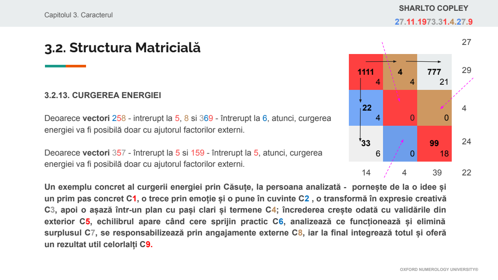

```text
Capitolul 3. Caracterul
27
3.2. Structura Matricială
1111 4 777 29
4 4 21
3.2.13. CURGEREA ENERGIEI
22 4
Deoarece vectori 258 - intrerupt la 5, 8 si 369 - întrerupt la 6, atunci, curgerea 4 0 0
energiei va fi posibilă doar cu ajutorul factorilor externi.
33 99 24
Deoarece vectori 357 - întrerupt la 5 si 159 - întrerupt la 5, atunci, curgerea 6 0 18
energiei va fi posibilă doar cu ajutorul factorilor externi.
14 4 39 22
Un exemplu concret al curgerii energiei prin Căsuțe, la persoana analizată - pornește de la o idee și
un prim pas concret C1, o trece prin emoție și o pune în cuvinte C2 , o transformă în expresie creativă
C3, apoi o așază într-un plan cu pași clari și termene C4; încrederea crește odată cu validările din
exterior C5, echilibrul apare când cere sprijin practic C6, analizează ce funcționează și elimină
surplusul C7, se responsabilizează prin angajamente externe C8, iar la final integrează totul și oferă
un rezultat util celorlalți C9.
OXFORD NUMEROLOGY UNIVERSITY®
```

### Pagina 138

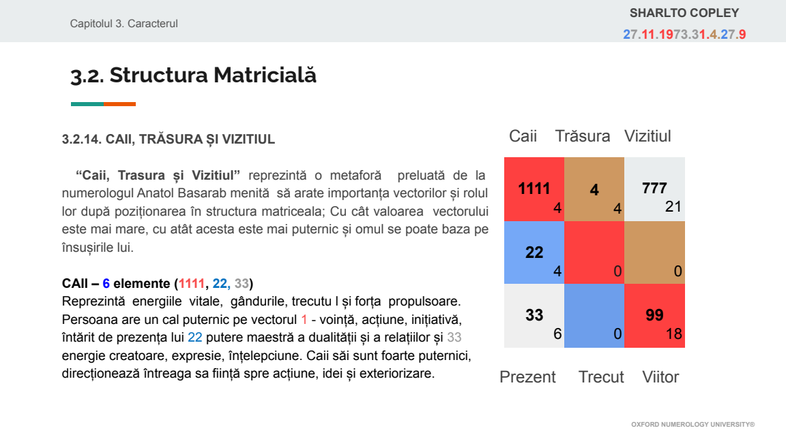

```text
Capitolul 3. Caracterul
3.2. Structura Matricială
Caii Trăsura Vizitiul
3.2.14. CAII, TRĂSURA ȘI VIZITIUL
“Caii, Trasura și Vizitiul” reprezintă o metaforă preluată de la
1111 4 777
numerologul Anatol Basarab menită să arate importanța vectorilor și rolul
4 4 21
lor după poziționarea în structura matriceala; Cu cât valoarea vectorului
este mai mare, cu atât acesta este mai puternic și omul se poate baza pe
însușirile lui.
22
4 0 0
CAII – 6 elemente (1111, 22, 33)
Reprezintă energiile vitale, gândurile, trecutu l și forța propulsoare.
33 99
Persoana are un cal puternic pe vectorul 1 - voință, acțiune, inițiativă,
6 0 18
întărit de prezența lui 22 putere maestră a dualității și a relațiilor și 33
energie creatoare, expresie, înțelepciune. Caii săi sunt foarte puternici,
direcționează întreaga sa ființă spre acțiune, idei și exteriorizare. Prezent Trecut Viitor
OXFORD NUMEROLOGY UNIVERSITY®
```

### Pagina 139

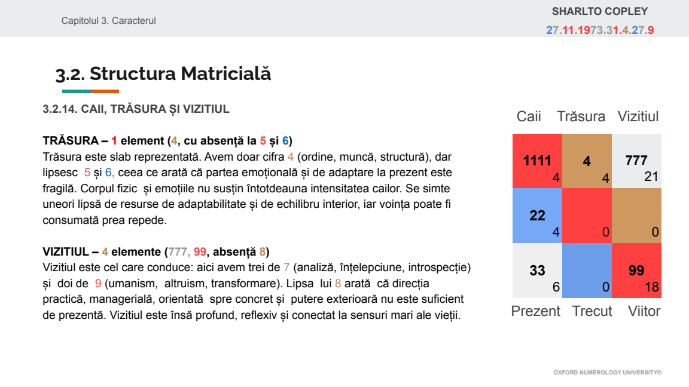

```text
Capitolul 3. Caracterul
3.2. Structura Matricială
3.2.14. CAII, TRĂSURA ȘI VIZITIUL
Caii Trăsura Vizitiul
TRĂSURA – 1 element (4, cu absență la 5 și 6)
Trăsura este slab reprezentată. Avem doar cifra 4 (ordine, muncă, structură), dar 1111 4 777
lipsesc 5 și 6, ceea ce arată că partea emoțională și de adaptare la prezent este
4 4 21
fragilă. Corpul fizic și emoțiile nu susțin întotdeauna intensitatea cailor. Se simte
uneori lipsă de resurse de adaptabilitate și de echilibru interior, iar voința poate fi
22
consumată prea repede.
4 0 0
VIZITIUL – 4 elemente (777, 99, absență 8)
Vizitiul este cel care conduce: aici avem trei de 7 (analiză, înțelepciune, introspecție) 33 99
și doi de 9 (umanism, altruism, transformare). Lipsa lui 8 arată că direcția 6 0 18
practică, managerială, orientată spre concret și putere exterioară nu este suficient
Prezent Trecut Viitor
de prezentă. Vizitiul este însă profund, reflexiv și conectat la sensuri mari ale vieții.
OXFORD NUMEROLOGY UNIVERSITY®
```

### Pagina 140

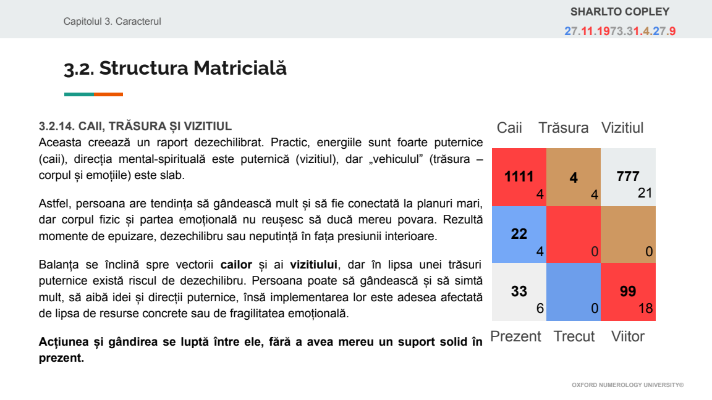

```text
Capitolul 3. Caracterul
3.2. Structura Matricială
3.2.14. CAII, TRĂSURA ȘI VIZITIUL Caii Trăsura Vizitiul
Aceasta creează un raport dezechilibrat. Practic, energiile sunt foarte puternice
(caii), direcția mental-spirituală este puternică (vizitiul), dar „vehiculul” (trăsura –
corpul și emoțiile) este slab. 1111 4 777
4 4 21
Astfel, persoana are tendința să gândească mult și să fie conectată la planuri mari,
dar corpul fizic și partea emoțională nu reușesc să ducă mereu povara. Rezultă
22
momente de epuizare, dezechilibru sau neputință în fața presiunii interioare.
4 0 0
Balanța se înclină spre vectorii cailor și ai vizitiului, dar în lipsa unei trăsuri
puternice există riscul de dezechilibru. Persoana poate să gândească și să simtă
33 99
mult, să aibă idei și direcții puternice, însă implementarea lor este adesea afectată
6 0 18
de lipsa de resurse concrete sau de fragilitatea emoțională.
Prezent Trecut Viitor
Acțiunea și gândirea se luptă între ele, fără a avea mereu un suport solid în
prezent.
OXFORD NUMEROLOGY UNIVERSITY®
```

### Pagina 141

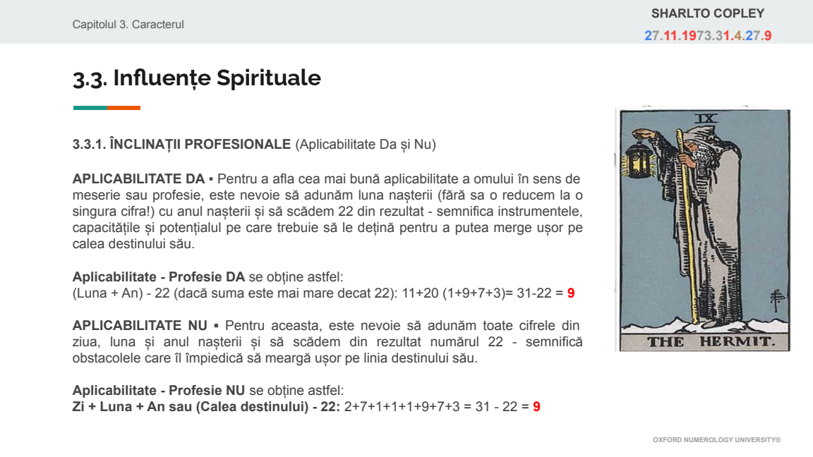

```text
Capitolul 3. Caracterul
3.3. Influențe Spirituale
3.3.1. ÎNCLINAȚII PROFESIONALE (Aplicabilitate Da și Nu)
APLICABILITATE DA ▪ Pentru a afla cea mai bună aplicabilitate a omului în sens de
meserie sau profesie, este nevoie să adunăm luna nașterii (fără sa o reducem la o
singura cifra!) cu anul nașterii și să scădem 22 din rezultat - semnifica instrumentele,
capacitățile și potențialul pe care trebuie să le dețină pentru a putea merge ușor pe
calea destinului său.
Aplicabilitate - Profesie DA se obține astfel:
(Luna + An) - 22 (dacă suma este mai mare decat 22): 11+20 (1+9+7+3)= 31-22 = 9
APLICABILITATE NU ▪ Pentru aceasta, este nevoie să adunăm toate cifrele din
ziua, luna și anul nașterii și să scădem din rezultat numărul 22 - semnifică
obstacolele care îl împiedică să meargă ușor pe linia destinului său.
Aplicabilitate - Profesie NU se obține astfel:
Zi + Luna + An sau (Calea destinului) - 22: 2+7+1+1+1+9+7+3 = 31 - 22 = 9
OXFORD NUMEROLOGY UNIVERSITY®
```

### Pagina 142

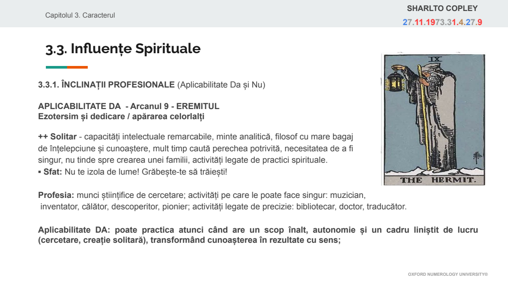

```text
Capitolul 3. Caracterul
3.3. Influențe Spirituale
3.3.1. ÎNCLINAȚII PROFESIONALE (Aplicabilitate Da și Nu)
APLICABILITATE DA - Arcanul 9 - EREMITUL
Ezotersim și dedicare / apărarea celorlalți
++ Solitar - capacități intelectuale remarcabile, minte analitică, filosof cu mare bagaj
de înțelepciune și cunoaștere, mult timp caută perechea potrivită, necesitatea de a fi
singur, nu tinde spre crearea unei familii, activități legate de practici spirituale.
▪ Sfat: Nu te izola de lume! Grăbește-te să trăiești!
Profesia: munci științifice de cercetare; activități pe care le poate face singur: muzician,
inventator, călător, descoperitor, pionier; activități legate de precizie: bibliotecar, doctor, traducător.
Aplicabilitate DA: poate practica atunci când are un scop înalt, autonomie și un cadru liniștit de lucru
(cercetare, creație solitară), transformând cunoașterea în rezultate cu sens;
OXFORD NUMEROLOGY UNIVERSITY®
```

### Pagina 143

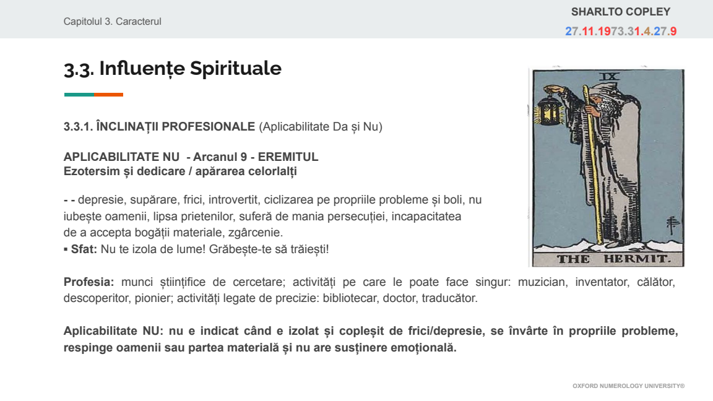

```text
Capitolul 3. Caracterul
3.3. Influențe Spirituale
3.3.1. ÎNCLINAȚII PROFESIONALE (Aplicabilitate Da și Nu)
APLICABILITATE NU - Arcanul 9 - EREMITUL
Ezotersim și dedicare / apărarea celorlalți
- - depresie, supărare, frici, introvertit, ciclizarea pe propriile probleme și boli, nu
iubește oamenii, lipsa prietenilor, suferă de mania persecuției, incapacitatea
de a accepta bogății materiale, zgârcenie.
▪ Sfat: Nu te izola de lume! Grăbește-te să trăiești!
Profesia: munci științifice de cercetare; activități pe care le poate face singur: muzician, inventator, călător,
descoperitor, pionier; activități legate de precizie: bibliotecar, doctor, traducător.
Aplicabilitate NU: nu e indicat când e izolat și copleșit de frici/depresie, se învârte în propriile probleme,
respinge oamenii sau partea materială și nu are susținere emoțională.
OXFORD NUMEROLOGY UNIVERSITY®
```

### Pagina 144

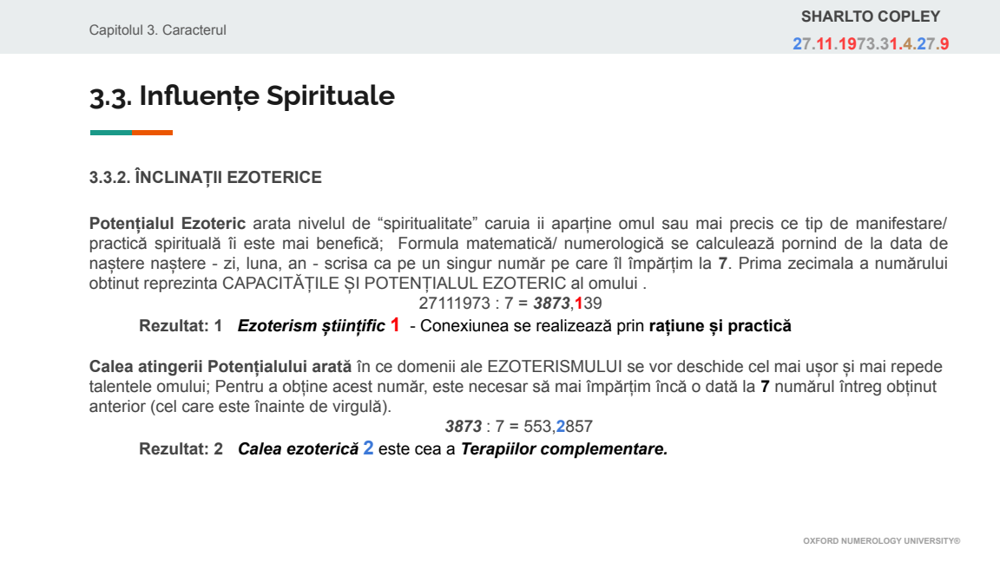

```text
Capitolul 3. Caracterul
3.3. Influențe Spirituale
3.3.2. ÎNCLINAȚII EZOTERICE
Potențialul Ezoteric arata nivelul de “spiritualitate” caruia ii aparține omul sau mai precis ce tip de manifestare/
practică spirituală îi este mai benefică; Formula matematică/ numerologică se calculează pornind de la data de
naștere naștere - zi, luna, an - scrisa ca pe un singur număr pe care îl împărțim la 7. Prima zecimala a numărului
obtinut reprezinta CAPACITĂȚILE ȘI POTENȚIALUL EZOTERIC al omului .
27111973 : 7 = 3873,139
Rezultat: 1 Ezoterism științific 1 - Conexiunea se realizează prin rațiune și practică
Calea atingerii Potențialului arată în ce domenii ale EZOTERISMULUI se vor deschide cel mai ușor și mai repede
talentele omului; Pentru a obține acest număr, este necesar să mai împărțim încă o dată la 7 numărul întreg obținut
anterior (cel care este înainte de virgulă).
3873 : 7 = 553,2857
Rezultat: 2 Calea ezoterică 2 este cea a Terapiilor complementare.
OXFORD NUMEROLOGY UNIVERSITY®
```

### Pagina 145

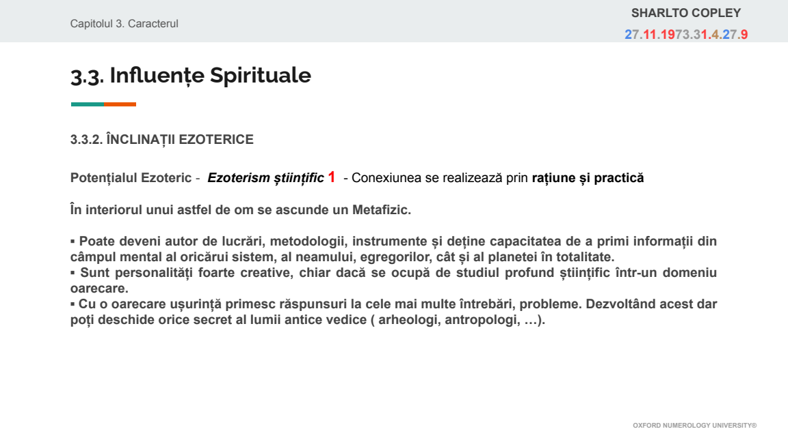

```text
Capitolul 3. Caracterul
3.3. Influențe Spirituale
3.3.2. ÎNCLINAȚII EZOTERICE
Potențialul Ezoteric - Ezoterism științific 1 - Conexiunea se realizează prin rațiune și practică
În interiorul unui astfel de om se ascunde un Metafizic.
▪ Poate deveni autor de lucrări, metodologii, instrumente și deține capacitatea de a primi informații din
câmpul mental al oricărui sistem, al neamului, egregorilor, cât și al planetei în totalitate.
▪ Sunt personalități foarte creative, chiar dacă se ocupă de studiul profund științific într-un domeniu
oarecare.
▪ Cu o oarecare ușurință primesc răspunsuri la cele mai multe întrebări, probleme. DezVAULTând acest dar
poți deschide orice secret al lumii antice vedice ( arheologi, antropologi, …).
OXFORD NUMEROLOGY UNIVERSITY®
```

### Pagina 146

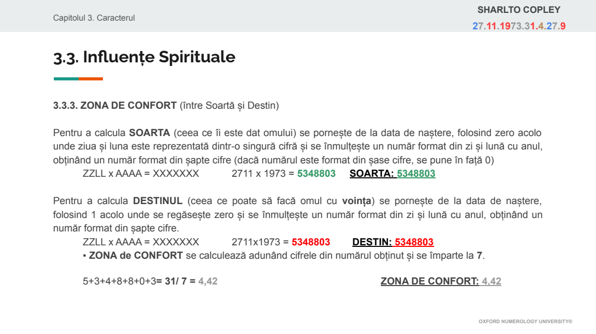

```text
Capitolul 3. Caracterul
3.3. Influențe Spirituale
3.3.3. ZONA DE CONFORT (între Soartă și Destin)
Pentru a calcula SOARTA (ceea ce îi este dat omului) se pornește de la data de naștere, folosind zero acolo
unde ziua și luna este reprezentată dintr-o singură cifră și se înmulțește un număr format din zi și lună cu anul,
obținând un număr format din șapte cifre (dacă numărul este format din șase cifre, se pune în față 0)
ZZLL x AAAA = XXXXXXX 2711 x 1973 = 5348803 SOARTA: 5348803
Pentru a calcula DESTINUL (ceea ce poate să facă omul cu voința) se pornește de la data de naștere,
folosind 1 acolo unde se regăsește zero și se înmulțește un număr format din zi și lună cu anul, obținând un
număr format din șapte cifre.
ZZLL x AAAA = XXXXXXX 2711x1973 = 5348803 DESTIN: 5348803
▪ ZONA de CONFORT se calculează adunând cifrele din numărul obținut și se împarte la 7.
5+3+4+8+8+0+3= 31/ 7 = 4,42 ZONA DE CONFORT: 4,42
OXFORD NUMEROLOGY UNIVERSITY®
```

### Pagina 147

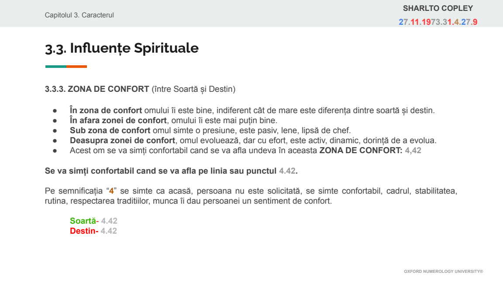

```text
Capitolul 3. Caracterul
3.3. Influențe Spirituale
3.3.3. ZONA DE CONFORT (între Soartă și Destin)
● În zona de confort omului îi este bine, indiferent cât de mare este diferența dintre soartă și destin.
● În afara zonei de confort, omului îi este mai puțin bine.
● Sub zona de confort omul simte o presiune, este pasiv, lene, lipsă de chef.
● Deasupra zonei de confort, omul evoluează, dar cu efort, este activ, dinamic, dorință de a evolua.
● Acest om se va simți confortabil cand se va afla undeva în aceasta ZONA DE CONFORT: 4,42
Se va simți confortabil cand se va afla pe linia sau punctul 4.42.
Pe semnificația “4” se simte ca acasă, persoana nu este solicitată, se simte confortabil, cadrul, stabilitatea,
rutina, respectarea traditiilor, munca îi dau persoanei un sentiment de confort.
Soartă- 4.42
Destin- 4.42
OXFORD NUMEROLOGY UNIVERSITY®
```

### Pagina 148

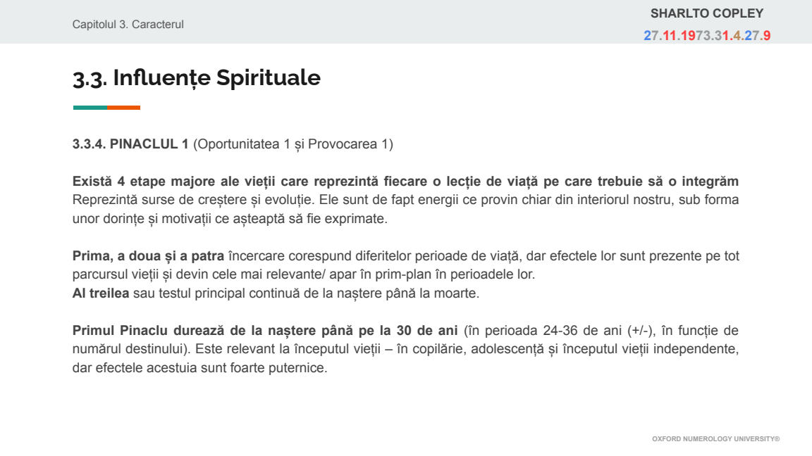

```text
Capitolul 3. Caracterul
3.3. Influențe Spirituale
3.3.4. PINACLUL 1 (Oportunitatea 1 și Provocarea 1)
Există 4 etape majore ale vieții care reprezintă fiecare o lecție de viață pe care trebuie să o integrăm
Reprezintă surse de creștere și evoluție. Ele sunt de fapt energii ce provin chiar din interiorul nostru, sub forma
unor dorințe și motivații ce așteaptă să fie exprimate.
Prima, a doua și a patra încercare corespund diferitelor perioade de viață, dar efectele lor sunt prezente pe tot
parcursul vieții și devin cele mai relevante/ apar în prim-plan în perioadele lor.
Al treilea sau testul principal continuă de la naștere până la moarte.
Primul Pinaclu durează de la naștere până pe la 30 de ani (în perioada 24-36 de ani (+/-), în funcție de
numărul destinului). Este relevant la începutul vieții – în copilărie, adolescență și începutul vieții independente,
dar efectele acestuia sunt foarte puternice.
OXFORD NUMEROLOGY UNIVERSITY®
```

### Pagina 149

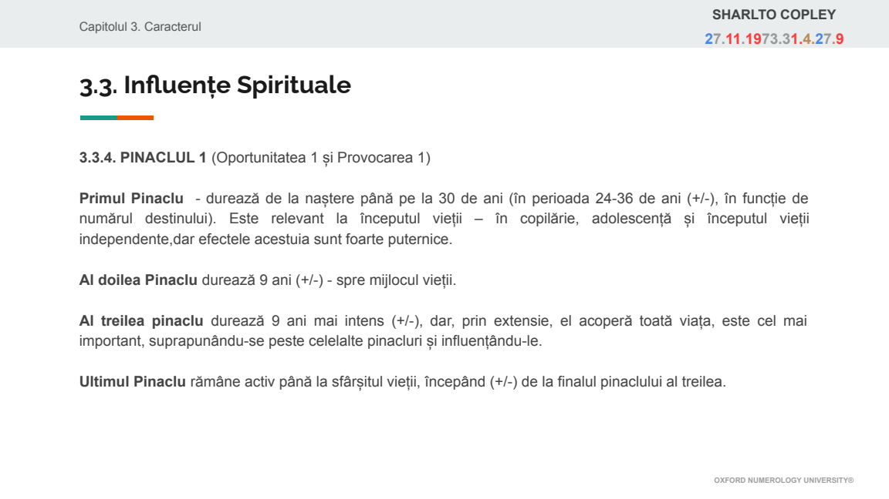

```text
Capitolul 3. Caracterul
3.3. Influențe Spirituale
3.3.4. PINACLUL 1 (Oportunitatea 1 și Provocarea 1)
Primul Pinaclu - durează de la naștere până pe la 30 de ani (în perioada 24-36 de ani (+/-), în funcție de
numărul destinului). Este relevant la începutul vieții – în copilărie, adolescență și începutul vieții
independente,dar efectele acestuia sunt foarte puternice.
Al doilea Pinaclu durează 9 ani (+/-) - spre mijlocul vieții.
Al treilea pinaclu durează 9 ani mai intens (+/-), dar, prin extensie, el acoperă toată viața, este cel mai
important, suprapunându-se peste celelalte pinacluri și influențându-le.
Ultimul Pinaclu rămâne activ până la sfârșitul vieții, începând (+/-) de la finalul pinaclului al treilea.
OXFORD NUMEROLOGY UNIVERSITY®
```

### Pagina 150

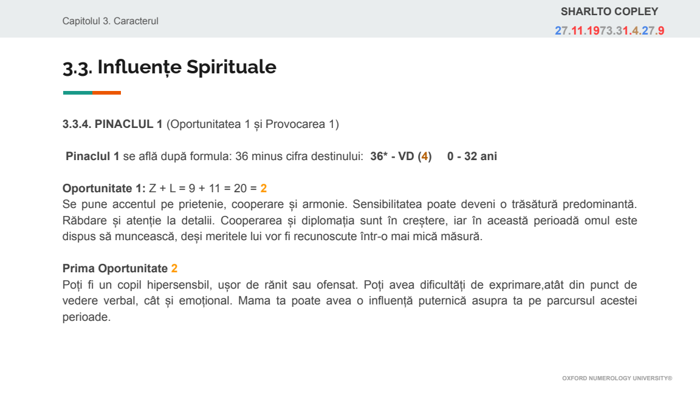

```text
Capitolul 3. Caracterul
3.3. Influențe Spirituale
3.3.4. PINACLUL 1 (Oportunitatea 1 și Provocarea 1)
Pinaclul 1 se află după formula: 36 minus cifra destinului: 36* - VD (4) 0 - 32 ani
Oportunitate 1: Z + L = 9 + 11 = 20 = 2
Se pune accentul pe prietenie, cooperare și armonie. Sensibilitatea poate deveni o trăsătură predominantă.
Răbdare și atenție la detalii. Cooperarea și diplomația sunt în creștere, iar în această perioadă omul este
dispus să muncească, deși meritele lui vor fi recunoscute într-o mai mică măsură.
Prima Oportunitate 2
Poți fi un copil hipersensbil, ușor de rănit sau ofensat. Poți avea dificultăți de exprimare,atât din punct de
vedere verbal, cât și emoțional. Mama ta poate avea o influență puternică asupra ta pe parcursul acestei
perioade.
OXFORD NUMEROLOGY UNIVERSITY®
```

### Pagina 151

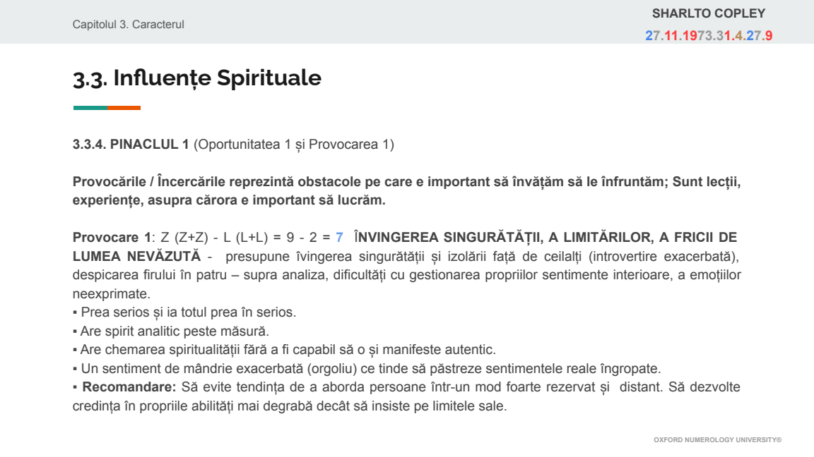

```text
Capitolul 3. Caracterul
3.3. Influențe Spirituale
3.3.4. PINACLUL 1 (Oportunitatea 1 și Provocarea 1)
Provocările / Încercările reprezintă obstacole pe care e important să învățăm să le înfruntăm; Sunt lecții,
experiențe, asupra cărora e important să lucrăm.
Provocare 1: Z (Z+Z) - L (L+L) = 9 - 2 = 7 ÎNVINGEREA SINGURĂTĂȚII, A LIMITĂRILOR, A FRICII DE
LUMEA NEVĂZUTĂ - presupune îvingerea singurătății și izolării față de ceilalți (introvertire exacerbată),
despicarea firului în patru – supra analiza, dificultăți cu gestionarea propriilor sentimente interioare, a emoțiilor
neexprimate.
▪ Prea serios și ia totul prea în serios.
▪ Are spirit analitic peste măsură.
▪ Are chemarea spiritualității fără a fi capabil să o și manifeste autentic.
▪ Un sentiment de mândrie exacerbată (orgoliu) ce tinde să păstreze sentimentele reale îngropate.
▪ Recomandare: Să evite tendința de a aborda persoane într-un mod foarte rezervat și distant. Să dezVAULTe
credința în propriile abilități mai degrabă decât să insiste pe limitele sale.
OXFORD NUMEROLOGY UNIVERSITY®
```

### Pagina 152

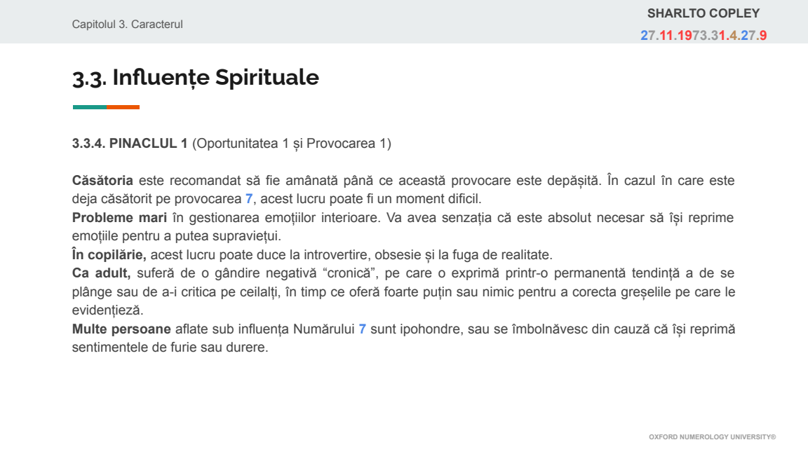

```text
Capitolul 3. Caracterul
3.3. Influențe Spirituale
3.3.4. PINACLUL 1 (Oportunitatea 1 și Provocarea 1)
Căsătoria este recomandat să fie amânată până ce această provocare este depășită. În cazul în care este
deja căsătorit pe provocarea 7, acest lucru poate fi un moment dificil.
Probleme mari în gestionarea emoțiilor interioare. Va avea senzația că este absolut necesar să își reprime
emoțiile pentru a putea supraviețui.
În copilărie, acest lucru poate duce la introvertire, obsesie și la fuga de realitate.
Ca adult, suferă de o gândire negativă “cronică”, pe care o exprimă printr-o permanentă tendință a de se
plânge sau de a-i critica pe ceilalți, în timp ce oferă foarte puțin sau nimic pentru a corecta greșelile pe care le
evidențieză.
Multe persoane aflate sub influența Numărului 7 sunt ipohondre, sau se îmbolnăvesc din cauză că își reprimă
sentimentele de furie sau durere.
OXFORD NUMEROLOGY UNIVERSITY®
```

### Pagina 153

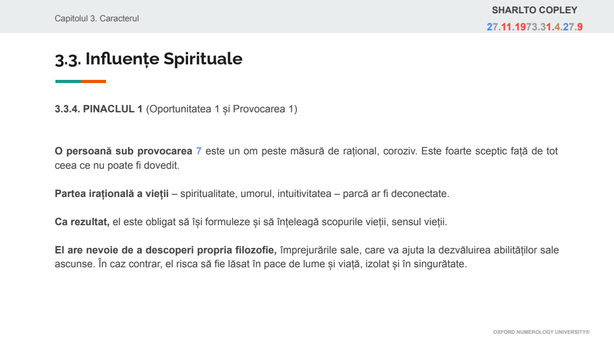

```text
Capitolul 3. Caracterul
3.3. Influențe Spirituale
3.3.4. PINACLUL 1 (Oportunitatea 1 și Provocarea 1)
O persoană sub provocarea 7 este un om peste măsură de rațional, coroziv. Este foarte sceptic față de tot
ceea ce nu poate fi dovedit.
Partea irațională a vieții – spiritualitate, umorul, intuitivitatea – parcă ar fi deconectate.
Ca rezultat, el este obligat să își formuleze și să înțeleagă scopurile vieții, sensul vieții.
El are nevoie de a descoperi propria filozofie, împrejurările sale, care va ajuta la dezvăluirea abilităților sale
ascunse. În caz contrar, el risca să fie lăsat în pace de lume și viață, izolat și în singurătate.
OXFORD NUMEROLOGY UNIVERSITY®
```

### Pagina 154

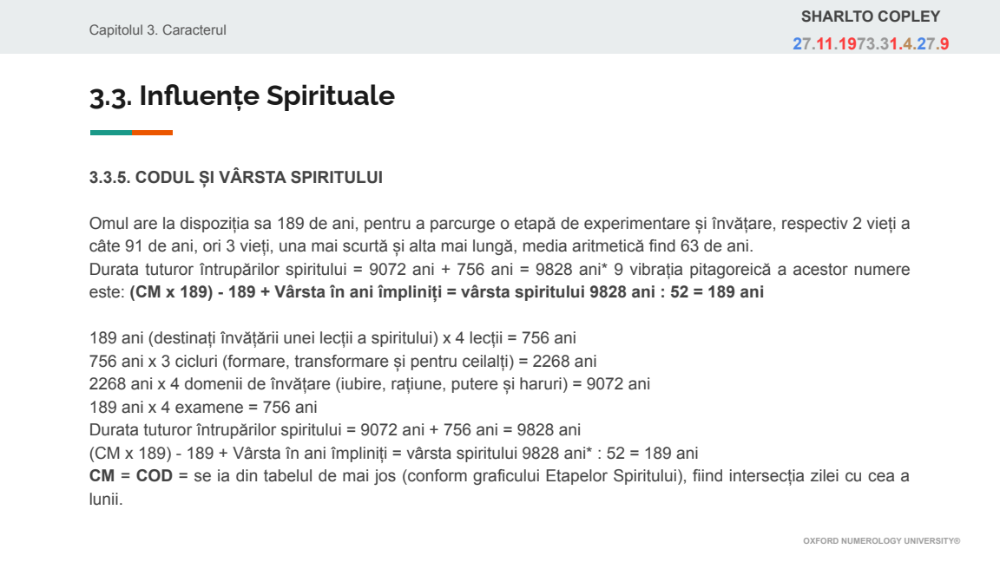

```text
Capitolul 3. Caracterul
3.3. Influențe Spirituale
3.3.5. CODUL ȘI VÂRSTA SPIRITULUI
Omul are la dispoziția sa 189 de ani, pentru a parcurge o etapă de experimentare și învățare, respectiv 2 vieți a
câte 91 de ani, ori 3 vieți, una mai scurtă și alta mai lungă, media aritmetică find 63 de ani.
Durata tuturor întrupărilor spiritului = 9072 ani + 756 ani = 9828 ani* 9 vibrația pitagoreică a acestor numere
este: (CM x 189) - 189 + Vârsta în ani împliniți = vârsta spiritului 9828 ani : 52 = 189 ani
189 ani (destinați învățării unei lecții a spiritului) x 4 lecții = 756 ani
756 ani x 3 cicluri (formare, transformare și pentru ceilalți) = 2268 ani
2268 ani x 4 domenii de învățare (iubire, rațiune, putere și haruri) = 9072 ani
189 ani x 4 examene = 756 ani
Durata tuturor întrupărilor spiritului = 9072 ani + 756 ani = 9828 ani
(CM x 189) - 189 + Vârsta în ani împliniți = vârsta spiritului 9828 ani* : 52 = 189 ani
CM = COD = se ia din tabelul de mai jos (conform graficului Etapelor Spiritului), fiind intersecția zilei cu cea a
lunii.
OXFORD NUMEROLOGY UNIVERSITY®
```

### Pagina 155

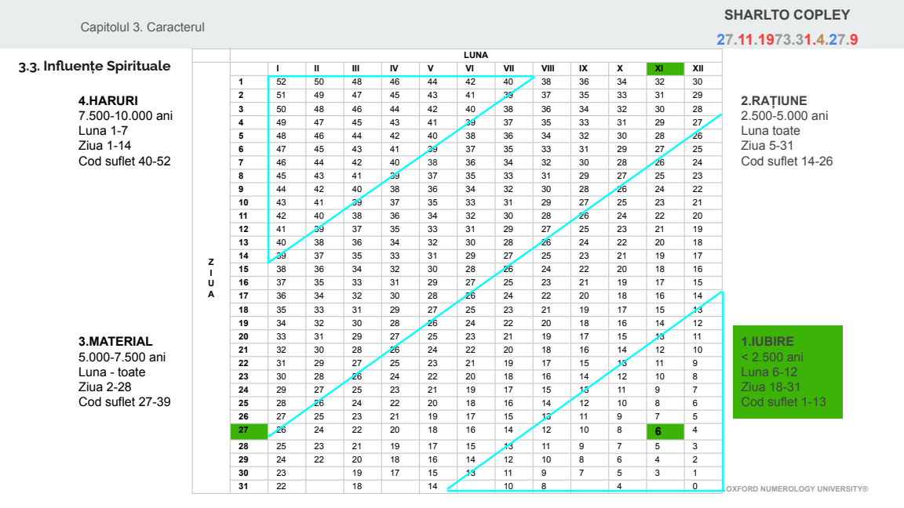

```text
Capitolul 3. Caracterul
LUNA
3.3. Influențe Spirituale
I II III IV V VI VII VIII IX X XI XII
1 52 50 48 46 44 42 40 38 36 34 32 30
4.HARURI 2 51 49 47 45 43 41 39 37 35 33 31 29 2.RAȚIUNE
3 50 48 46 44 42 40 38 36 34 32 30 28
7.500-10.000 ani 2.500-5.000 ani
4 49 47 45 43 41 39 37 35 33 31 29 27
Luna 1-7 Luna toate
5 48 46 44 42 40 38 36 34 32 30 28 26
Ziua 1-14 Ziua 5-31
6 47 45 43 41 39 37 35 33 31 29 27 25
Cod suflet 40-52 7 46 44 42 40 38 36 34 32 30 28 26 24 Cod suflet 14-26
8 45 43 41 39 37 35 33 31 29 27 25 23
9 44 42 40 38 36 34 32 30 28 26 24 22
10 43 41 39 37 35 33 31 29 27 25 23 21
11 42 40 38 36 34 32 30 28 26 24 22 20
12 41 39 37 35 33 31 29 27 25 23 21 19
13 40 38 36 34 32 30 28 26 24 22 20 18
14 39 37 35 33 31 29 27 25 23 21 19 17
Z
I 15 38 36 34 32 30 28 26 24 22 20 18 16
U 16 37 35 33 31 29 27 25 23 21 19 17 15
A 17 36 34 32 30 28 26 24 22 20 18 16 14
18 35 33 31 29 27 25 23 21 19 17 15 13
19 34 32 30 28 26 24 22 20 18 16 14 12
20 33 31 29 27 25 23 21 19 17 15 13 11
3.MATERIAL 1.IUBIRE
21 32 30 28 26 24 22 20 18 16 14 12 10
5.000-7.500 ani < 2.500 ani
22 31 29 27 25 23 21 19 17 15 13 11 9
Luna - toate Luna 6-12
23 30 28 26 24 22 20 18 16 14 12 10 8
Ziua 2-28 Ziua 18-31
24 29 27 25 23 21 19 17 15 13 11 9 7
Cod suflet 27-39 25 28 26 24 22 20 18 16 14 12 10 8 6 Cod suflet 1-13
26 27 25 23 21 19 17 15 13 11 9 7 5
27 26 24 22 20 18 16 14 12 10 8 6 4
28 25 23 21 19 17 15 13 11 9 7 5 3
29 24 22 20 18 16 14 12 10 8 6 4 2
30 23 19 17 15 13 11 9 7 5 3 1
31 22 18 14 10 8 4 0 OXFORD NUMEROLOGY UNIVERSITY®
```

### Pagina 156

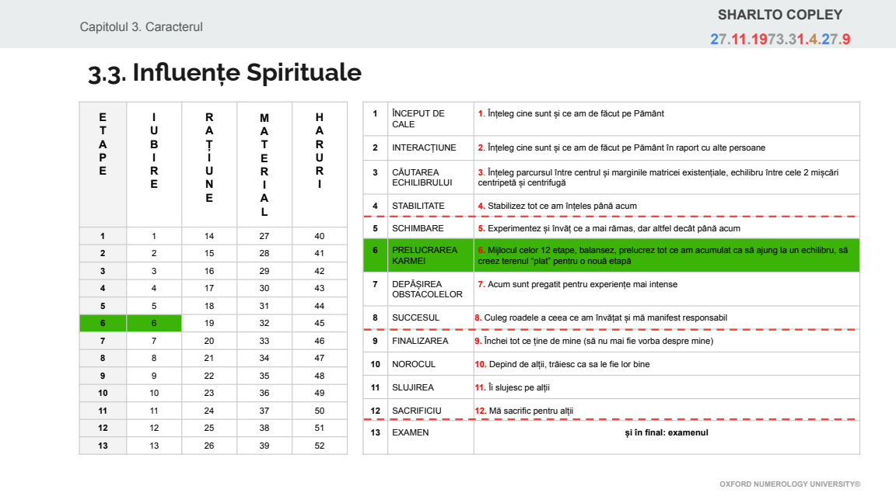

```text
Capitolul 3. Caracterul
3.3. Influențe Spirituale
E I R M H 1 ÎNCEPUT DE 1. Înțeleg cine sunt și ce am de făcut pe Pământ
CALE
T U A A A
A B Ț T R
2 INTERACȚIUNE 2. Înțeleg cine sunt și ce am de făcut pe Pământ în raport cu alte persoane
P I I E U
E R U R R 3 CĂUTAREA 3. Înțeleg parcursul între centrul și marginile matricei existențiale, echilibru între cele 2 mișcări
E N I I ECHILIBRULUI centripetă și centrifugă
E A
4 STABILITATE 4. Stabilizez tot ce am înțeles până acum
L
5 SCHIMBARE 5. Experimentez și învăț ce a mai rămas, dar altfel decât până acum
1 1 14 27 40
2 2 15 28 41 6 PRELUCRAREA 6. Mijlocul celor 12 etape, balansez, prelucrez tot ce am acumulat ca să ajung la un echilibru, să
KARMEI creez terenul “plat” pentru o nouă etapă
3 3 16 29 42
7 DEPĂȘIREA 7. Acum sunt pregatit pentru experiențe mai intense
4 4 17 30 43
OBSTACOLELOR
5 5 18 31 44
8 SUCCESUL 8. Culeg roadele a ceea ce am învățat și mă manifest responsabil
6 6 19 32 45
7 7 20 33 46 9 FINALIZAREA 9. Închei tot ce ține de mine (să nu mai fie vorba despre mine)
8 8 21 34 47
10 NOROCUL 10. Depind de alții, trăiesc ca sa le fie lor bine
9 9 22 35 48
11 SLUJIREA 11. Îi slujesc pe alții
10 10 23 36 49
11 11 24 37 50 12 SACRIFICIU 12. Mă sacrific pentru alții
12 12 25 38 51
13 EXAMEN și în final: examenul
13 13 26 39 52
OXFORD NUMEROLOGY UNIVERSITY®
```

### Pagina 157

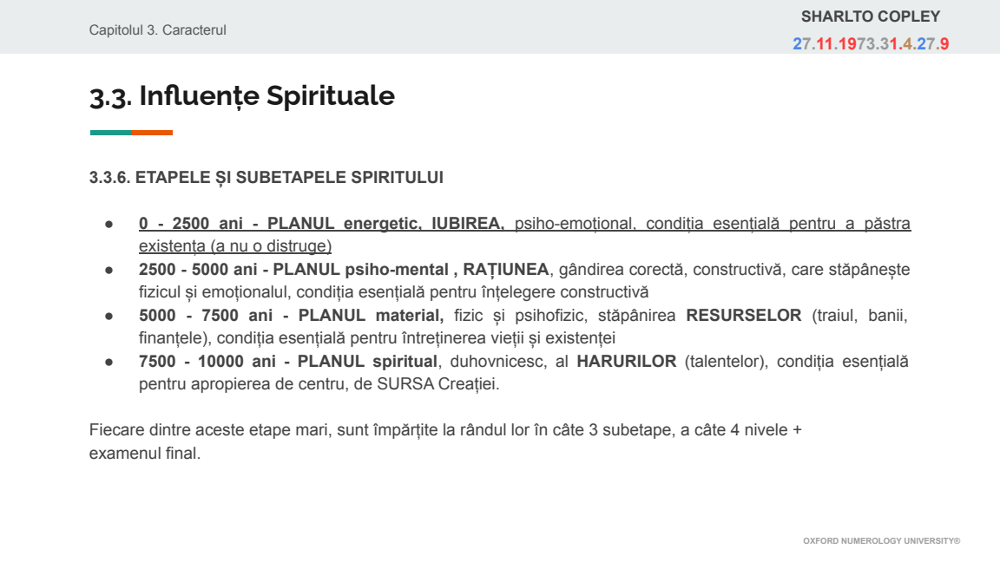

```text
Capitolul 3. Caracterul
3.3. Influențe Spirituale
3.3.6. ETAPELE ȘI SUBETAPELE SPIRITULUI
● 0 - 2500 ani - PLANUL energetic, IUBIREA, psiho-emoțional, condiția esențială pentru a păstra
existența (a nu o distruge)
● 2500 - 5000 ani - PLANUL psiho-mental , RAȚIUNEA, gândirea corectă, constructivă, care stăpânește
fizicul și emoționalul, condiția esențială pentru înțelegere constructivă
● 5000 - 7500 ani - PLANUL material, fizic și psihofizic, stăpânirea RESURSELOR (traiul, banii,
finanțele), condiția esențială pentru întreținerea vieții și existenței
● 7500 - 10000 ani - PLANUL spiritual, duhovnicesc, al HARURILOR (talentelor), condiția esențială
pentru apropierea de centru, de SURSA Creației.
Fiecare dintre aceste etape mari, sunt împărțite la rândul lor în câte 3 subetape, a câte 4 nivele +
examenul final.
OXFORD NUMEROLOGY UNIVERSITY®
```

### Pagina 158

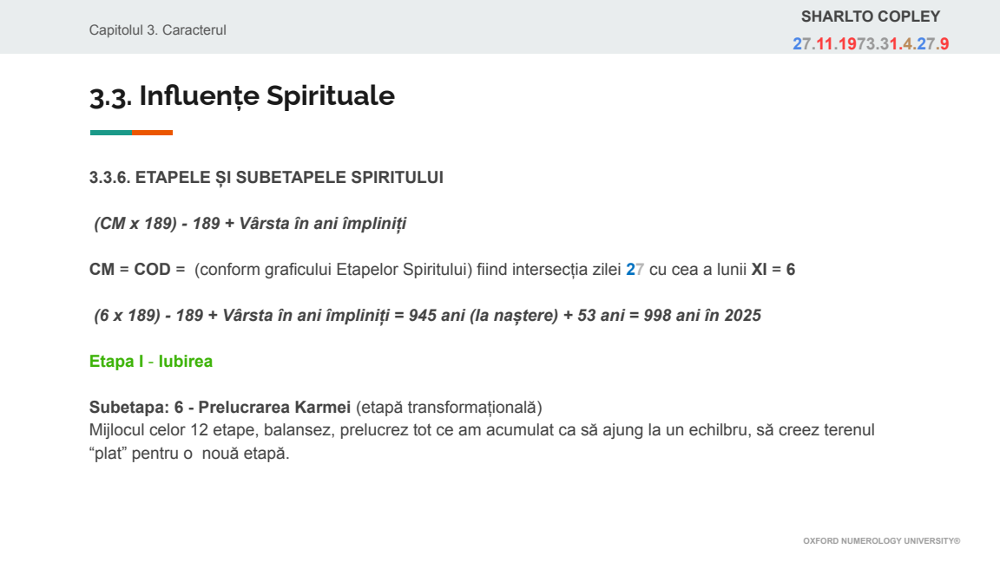

```text
Capitolul 3. Caracterul
3.3. Influențe Spirituale
3.3.6. ETAPELE ȘI SUBETAPELE SPIRITULUI
(CM x 189) - 189 + Vârsta în ani împliniți
CM = COD = (conform graficului Etapelor Spiritului) fiind intersecția zilei 27 cu cea a lunii XI = 6
(6 x 189) - 189 + Vârsta în ani împliniți = 945 ani (la naștere) + 53 ani = 998 ani în 2025
Etapa I - Iubirea
Subetapa: 6 - Prelucrarea Karmei (etapă transformațională)
Mijlocul celor 12 etape, balansez, prelucrez tot ce am acumulat ca să ajung la un echilbru, să creez terenul
“plat” pentru o nouă etapă.
OXFORD NUMEROLOGY UNIVERSITY®
```

### Pagina 159

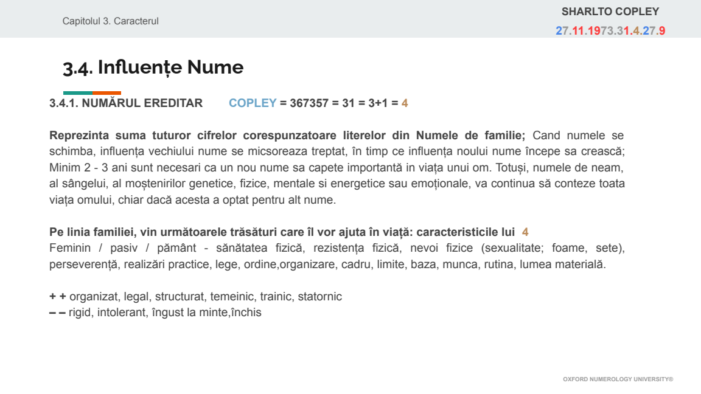

```text
Capitolul 3. Caracterul
3.4. Influențe Nume
3.4.1. NUMĂRUL EREDITAR COPLEY = 367357 = 31 = 3+1 = 4
Reprezinta suma tuturor cifrelor corespunzatoare literelor din Numele de familie; Cand numele se
schimba, influența vechiului nume se micsoreaza treptat, în timp ce influența noului nume începe sa crească;
Minim 2 - 3 ani sunt necesari ca un nou nume sa capete importantă in viața unui om. Totuși, numele de neam,
al sângelui, al moștenirilor genetice, fizice, mentale si energetice sau emoționale, va continua să conteze toata
viața omului, chiar dacă acesta a optat pentru alt nume.
Pe linia familiei, vin următoarele trăsături care îl vor ajuta în viață: caracteristicile lui 4
Feminin / pasiv / pământ - sănătatea fizică, rezistența fizică, nevoi fizice (sexualitate; foame, sete),
perseverență, realizări practice, lege, ordine,organizare, cadru, limite, baza, munca, rutina, lumea materială.
+ + organizat, legal, structurat, temeinic, trainic, statornic
– – rigid, intolerant, îngust la minte,închis
OXFORD NUMEROLOGY UNIVERSITY®
```

### Pagina 160

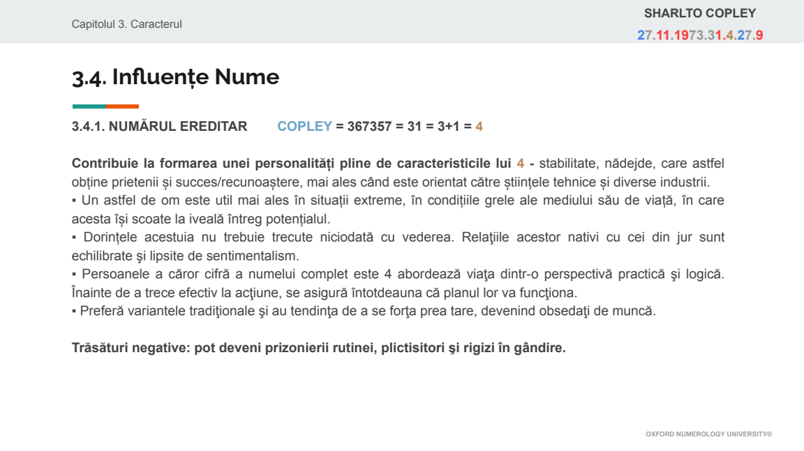

```text
Capitolul 3. Caracterul
3.4. Influențe Nume
3.4.1. NUMĂRUL EREDITAR COPLEY = 367357 = 31 = 3+1 = 4
Contribuie la formarea unei personalități pline de caracteristicile lui 4 - stabilitate, nădejde, care astfel
obține prietenii și succes/recunoaștere, mai ales când este orientat către științele tehnice și diverse industrii.
▪ Un astfel de om este util mai ales în situații extreme, în condițiile grele ale mediului său de viață, în care
acesta își scoate la iveală întreg potențialul.
▪ Dorințele acestuia nu trebuie trecute niciodată cu vederea. Relaţiile acestor nativi cu cei din jur sunt
echilibrate şi lipsite de sentimentalism.
▪ Persoanele a căror cifră a numelui complet este 4 abordează viaţa dintr-o perspectivă practică şi logică.
Înainte de a trece efectiv la acţiune, se asigură întotdeauna că planul lor va funcţiona.
▪ Preferă variantele tradiţionale şi au tendinţa de a se forţa prea tare, devenind obsedaţi de muncă.
Trăsături negative: pot deveni prizonierii rutinei, plictisitori şi rigizi în gândire.
OXFORD NUMEROLOGY UNIVERSITY®
```

### Pagina 161

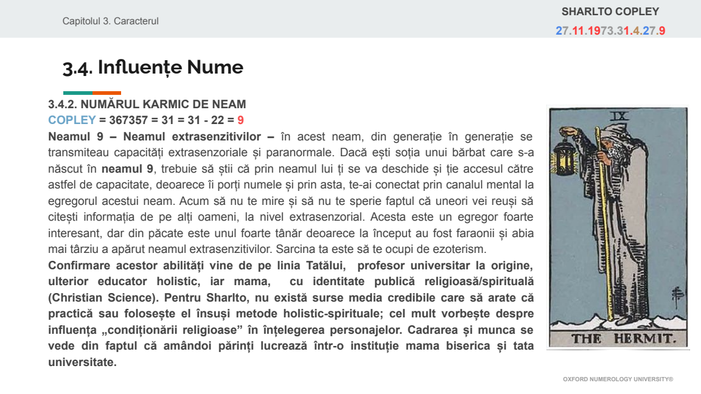

```text
Capitolul 3. Caracterul
3.4. Influențe Nume
3.4.2. NUMĂRUL KARMIC DE NEAM
COPLEY = 367357 = 31 = 31 - 22 = 9
Neamul 9 – Neamul extrasenzitivilor – în acest neam, din generație în generație se
transmiteau capacități extrasenzoriale și paranormale. Dacă ești soția unui bărbat care s-a
născut în neamul 9, trebuie să știi că prin neamul lui ți se va deschide și ție accesul către
astfel de capacitate, deoarece îi porți numele și prin asta, te-ai conectat prin canalul mental la
egregorul acestui neam. Acum să nu te mire și să nu te sperie faptul că uneori vei reuși să
citești informația de pe alți oameni, la nivel extrasenzorial. Acesta este un egregor foarte
interesant, dar din păcate este unul foarte tânăr deoarece la început au fost faraonii și abia
mai târziu a apărut neamul extrasenzitivilor. Sarcina ta este să te ocupi de ezoterism.
Confirmare acestor abilități vine de pe linia Tatălui, profesor universitar la origine,
ulterior educator holistic, iar mama, cu identitate publică religioasă/spirituală
(Christian Science). Pentru Sharlto, nu există surse media credibile care să arate că
practică sau folosește el însuși metode holistic-spirituale; cel mult vorbește despre
influența „condiționării religioase” în înțelegerea personajelor. Cadrarea și munca se
vede din faptul că amândoi părinți lucrează într-o instituție mama biserica și tata
universitate.
OXFORD NUMEROLOGY UNIVERSITY®
```

### Pagina 162

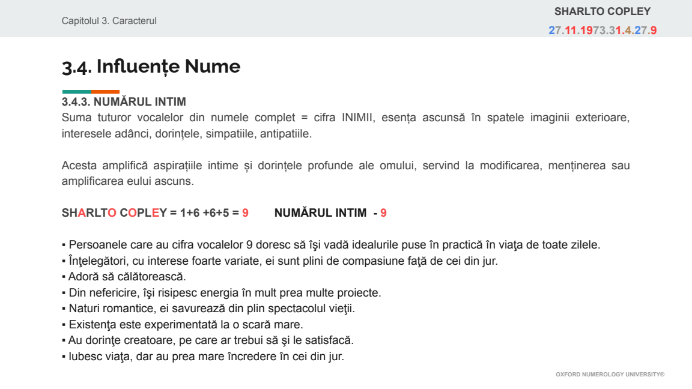

```text
Capitolul 3. Caracterul
3.4. Influențe Nume
3.4.3. NUMĂRUL INTIM
Suma tuturor vocalelor din numele complet = cifra INIMII, esența ascunsă în spatele imaginii exterioare,
interesele adânci, dorințele, simpatiile, antipatiile.
Acesta amplifică aspirațiile intime și dorințele profunde ale omului, servind la modificarea, menținerea sau
amplificarea eului ascuns.
▪ Persoanele care au cifra vocalelor 9 doresc să îşi vadă idealurile puse în practică în viaţa de toate zilele.
▪ Înţelegători, cu interese foarte variate, ei sunt plini de compasiune faţă de cei din jur.
▪ Adoră să călătorească.
▪ Din nefericire, îşi risipesc energia în mult prea multe proiecte.
▪ Naturi romantice, ei savurează din plin spectacolul vieţii.
▪ Existenţa este experimentată la o scară mare.
▪ Au dorinţe creatoare, pe care ar trebui să şi le satisfacă.
▪ lubesc viaţa, dar au prea mare încredere în cei din jur.
OXFORD NUMEROLOGY UNIVERSITY®
```

### Pagina 163

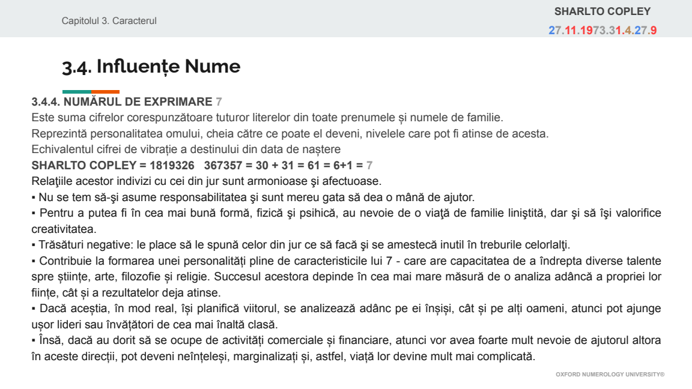

```text
Capitolul 3. Caracterul
3.4. Influențe Nume
3.4.4. NUMĂRUL DE EXPRIMARE 7
Este suma cifrelor corespunzătoare tuturor literelor din toate prenumele și numele de familie.
Reprezintă personalitatea omului, cheia către ce poate el deveni, nivelele care pot fi atinse de acesta.
Echivalentul cifrei de vibrație a destinului din data de naștere
Relaţiile acestor indivizi cu cei din jur sunt armonioase şi afectuoase.
▪ Nu se tem să-şi asume responsabilitatea şi sunt mereu gata să dea o mână de ajutor.
▪ Pentru a putea fi în cea mai bună formă, fizică şi psihică, au nevoie de o viaţă de familie liniştită, dar şi să îşi valorifice
creativitatea.
▪ Trăsături negative: le place să le spună celor din jur ce să facă şi se amestecă inutil în treburile celorlalţi.
▪ Contribuie la formarea unei personalități pline de caracteristicile lui 7 - care are capacitatea de a îndrepta diverse talente
spre științe, arte, filozofie și religie. Succesul acestora depinde în cea mai mare măsură de o analiza adâncă a propriei lor
ființe, cât și a rezultatelor deja atinse.
▪ Dacă aceștia, în mod real, își planifică viitorul, se analizează adânc pe ei înșiși, cât și pe alți oameni, atunci pot ajunge
ușor lideri sau învățători de cea mai înaltă clasă.
▪ Însă, dacă au dorit să se ocupe de activități comerciale și financiare, atunci vor avea foarte mult nevoie de ajutorul altora
în aceste direcții, pot deveni neînțeleși, marginalizați și, astfel, viață lor devine mult mai complicată.
OXFORD NUMEROLOGY UNIVERSITY®
```

### Pagina 164

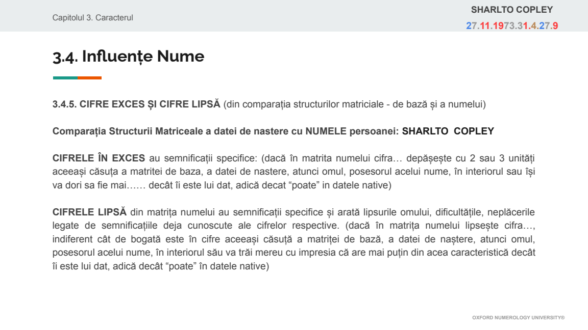

```text
Capitolul 3. Caracterul
3.4. Influențe Nume
3.4.5. CIFRE EXCES ȘI CIFRE LIPSĂ (din comparația structurilor matriciale - de bază și a numelui)
Comparația Structurii Matriceale a datei de nastere cu NUMELE persoanei: SHARLTO COPLEY
CIFRELE ÎN EXCES au semnificații specifice: (dacă în matrita numelui cifra… depășește cu 2 sau 3 unități
aceeași căsuța a matritei de baza, a datei de nastere, atunci omul, posesorul acelui nume, în interiorul sau își
va dori sa fie mai…… decât îi este lui dat, adică decat “poate” in datele native)
CIFRELE LIPSĂ din matrița numelui au semnificații specifice și arată lipsurile omului, dificultățile, neplăcerile
legate de semnificațiile deja cunoscute ale cifrelor respective. (dacă în matrița numelui lipsește cifra…,
indiferent cât de bogată este în cifre aceeași căsuță a matriței de bază, a datei de naștere, atunci omul,
posesorul acelui nume, în interiorul său va trăi mereu cu impresia că are mai puțin din acea caracteristică decât
îi este lui dat, adică decât “poate” în datele native)
OXFORD NUMEROLOGY UNIVERSITY®
```

### Pagina 165

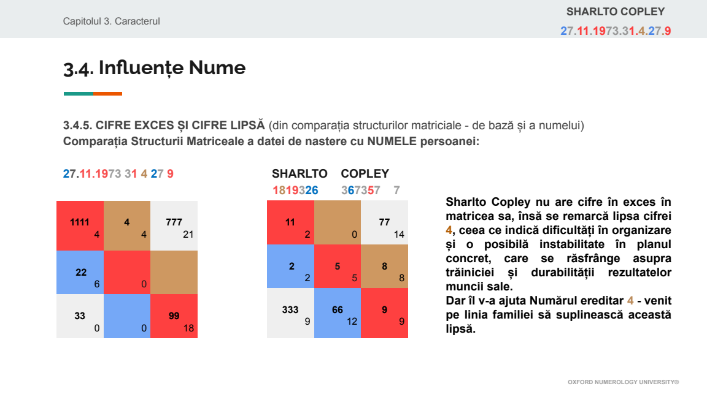

```text
Capitolul 3. Caracterul
3.4. Influențe Nume
3.4.5. CIFRE EXCES ȘI CIFRE LIPSĂ (din comparația structurilor matriciale - de bază și a numelui)
Comparația Structurii Matriceale a datei de nastere cu NUMELE persoanei:
27.11.1973 31 4 27 9 SHARLTO COPLEY
1819326 367357 7
Sharlto Copley nu are cifre în exces în
matricea sa, însă se remarcă lipsa cifrei
1111 4 777 11 77
4, ceea ce indică dificultăți în organizare
4 4 21 2 0 14
și o posibilă instabilitate în planul
concret, care se răsfrânge asupra
2 5 8
22 trăiniciei și durabilității rezultatelor
2 5 8
6 0 muncii sale.
Dar îl v-a ajuta Numărul ereditar 4 - venit
333 66 9
33 99 pe linia familiei să suplinească această
9 12 9
0 0 18 lipsă.
OXFORD NUMEROLOGY UNIVERSITY®
```

### Pagina 166

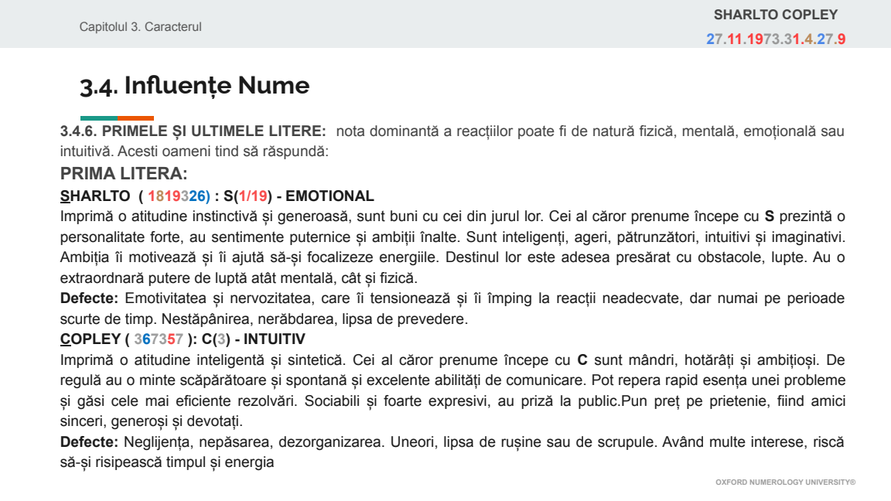

```text
Capitolul 3. Caracterul
3.4. Influențe Nume
3.4.6. PRIMELE ȘI ULTIMELE LITERE: nota dominantă a reacțiilor poate fi de natură fizică, mentală, emoțională sau
intuitivă. Acesti oameni tind să răspundă:
PRIMA LITERA:
SHARLTO ( 1819326) : S(1/19) - EMOTIONAL
Imprimă o atitudine instinctivă și generoasă, sunt buni cu cei din jurul lor. Cei al căror prenume începe cu S prezintă o
personalitate forte, au sentimente puternice și ambiții înalte. Sunt inteligenți, ageri, pătrunzători, intuitivi și imaginativi.
Ambiția îi motivează și îi ajută să-și focalizeze energiile. Destinul lor este adesea presărat cu obstacole, lupte. Au o
extraordnară putere de luptă atât mentală, cât și fizică.
Defecte: Emotivitatea și nervozitatea, care îi tensionează și îi împing la reacții neadecvate, dar numai pe perioade
scurte de timp. Nestăpânirea, nerăbdarea, lipsa de prevedere.
COPLEY ( 367357 ): C(3) - INTUITIV
Imprimă o atitudine inteligentă și sintetică. Cei al căror prenume începe cu C sunt mândri, hotărâți și ambițioși. De
regulă au o minte scăpărătoare și spontană și excelente abilități de comunicare. Pot repera rapid esența unei probleme
și găsi cele mai eficiente rezolvări. Sociabili și foarte expresivi, au priză la public.Pun preț pe prietenie, fiind amici
sinceri, generoși și devotați.
Defecte: Neglijența, nepăsarea, dezorganizarea. Uneori, lipsa de rușine sau de scrupule. Având multe interese, riscă
să-și risipească timpul și energia
OXFORD NUMEROLOGY UNIVERSITY®
```

### Pagina 167

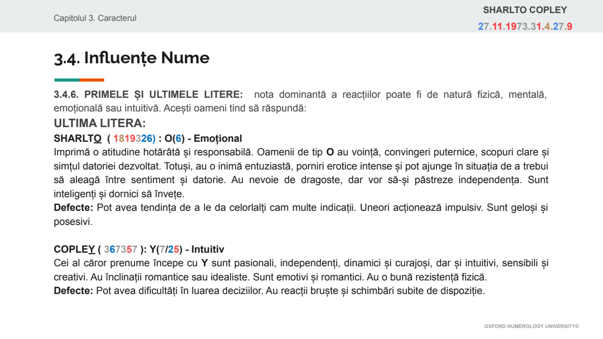

```text
Capitolul 3. Caracterul
3.4. Influențe Nume
3.4.6. PRIMELE ȘI ULTIMELE LITERE: nota dominantă a reacțiilor poate fi de natură fizică, mentală,
emoțională sau intuitivă. Acești oameni tind să răspundă:
ULTIMA LITERA:
SHARLTO ( 1819326) : O(6) - Emoțional
Imprimă o atitudine hotărâtă și responsabilă. Oamenii de tip O au voință, convingeri puternice, scopuri clare și
simțul datoriei dezVAULTat. Totuși, au o inimă entuziastă, porniri erotice intense și pot ajunge în situația de a trebui
să aleagă între sentiment și datorie. Au nevoie de dragoste, dar vor să-și păstreze independența. Sunt
inteligenți și dornici să învețe.
Defecte: Pot avea tendința de a le da celorlalți cam multe indicații. Uneori acționează impulsiv. Sunt geloși și
posesivi.
COPLEY ( 367357 ): Y(7/25) - Intuitiv
Cei al căror prenume începe cu Y sunt pasionali, independenți, dinamici și curajoși, dar și intuitivi, sensibili și
creativi. Au înclinații romantice sau idealiste. Sunt emotivi și romantici. Au o bună rezistență fizică.
Defecte: Pot avea dificultăți în luarea deciziilor. Au reacții bruște și schimbări subite de dispoziție.
OXFORD NUMEROLOGY UNIVERSITY®
```

### Pagina 168

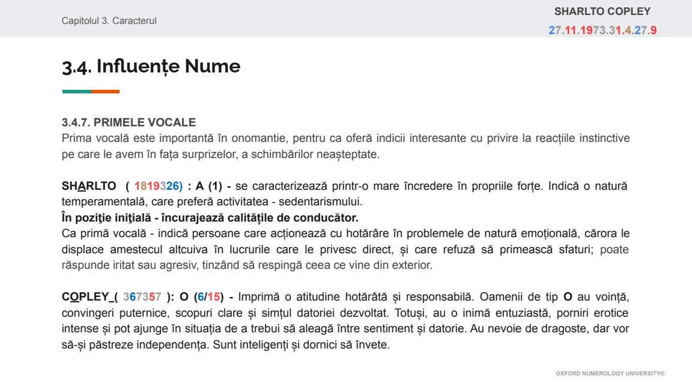

```text
Capitolul 3. Caracterul
3.4. Influențe Nume
3.4.7. PRIMELE VOCALE
Prima vocală este importantă în onomantie, pentru ca oferă indicii interesante cu privire la reacțiile instinctive
pe care le avem în fața surprizelor, a schimbărilor neașteptate.
SHARLTO ( 1819326) : A (1) - se caracterizează printr-o mare încredere în propriile forțe. Indică o natură
temperamentală, care preferă activitatea - sedentarismului.
În poziţie iniţială - încurajează calitățile de conducător.
Ca primă vocală - indică persoane care acționează cu hotărâre în problemele de natură emoțională, cărora le
displace amestecul altcuiva în lucrurile care le privesc direct, și care refuză să primească sfaturi; poate
răspunde iritat sau agresiv, tinzând să respingă ceea ce vine din exterior.
COPLEY ( 367357 ): O (6/15) - Imprimă o atitudine hotărâtă și responsabilă. Oamenii de tip O au voință,
convingeri puternice, scopuri clare și simțul datoriei dezVAULTat. Totuși, au o inimă entuziastă, porniri erotice
intense și pot ajunge în situația de a trebui să aleagă între sentiment și datorie. Au nevoie de dragoste, dar vor
să-și păstreze independența. Sunt inteligenți și dornici să învete.
OXFORD NUMEROLOGY UNIVERSITY®
```

### Pagina 169

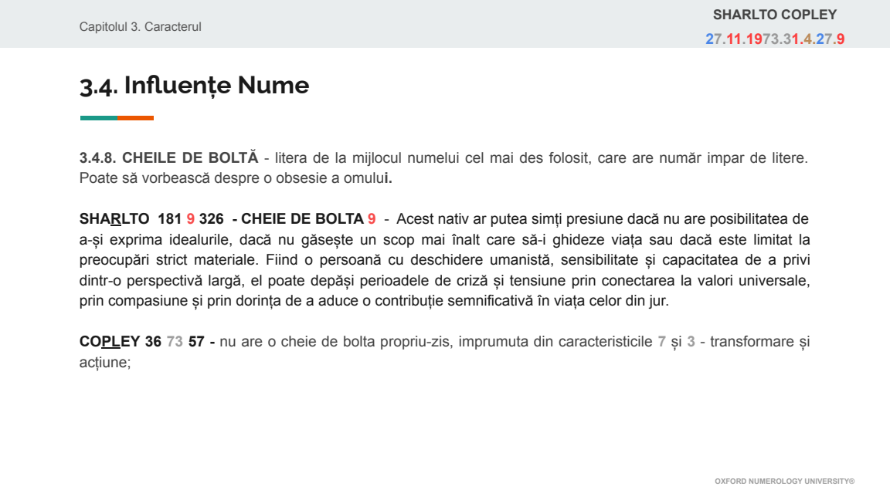

```text
Capitolul 3. Caracterul
3.4. Influențe Nume
3.4.8. CHEILE DE BOLTĂ - litera de la mijlocul numelui cel mai des folosit, care are număr impar de litere.
Poate să vorbească despre o obsesie a omului.
SHARLTO 181 9 326 - CHEIE DE BOLTA 9 - Acest nativ ar putea simți presiune dacă nu are posibilitatea de
a-și exprima idealurile, dacă nu găsește un scop mai înalt care să-i ghideze viața sau dacă este limitat la
preocupări strict materiale. Fiind o persoană cu deschidere umanistă, sensibilitate și capacitatea de a privi
dintr-o perspectivă largă, el poate depăși perioadele de criză și tensiune prin conectarea la valori universale,
prin compasiune și prin dorința de a aduce o contribuție semnificativă în viața celor din jur.
COPLEY 36 73 57 - nu are o cheie de bolta propriu-zis, imprumuta din caracteristicile 7 și 3 - transformare și
acțiune;
OXFORD NUMEROLOGY UNIVERSITY®
```

### Pagina 170

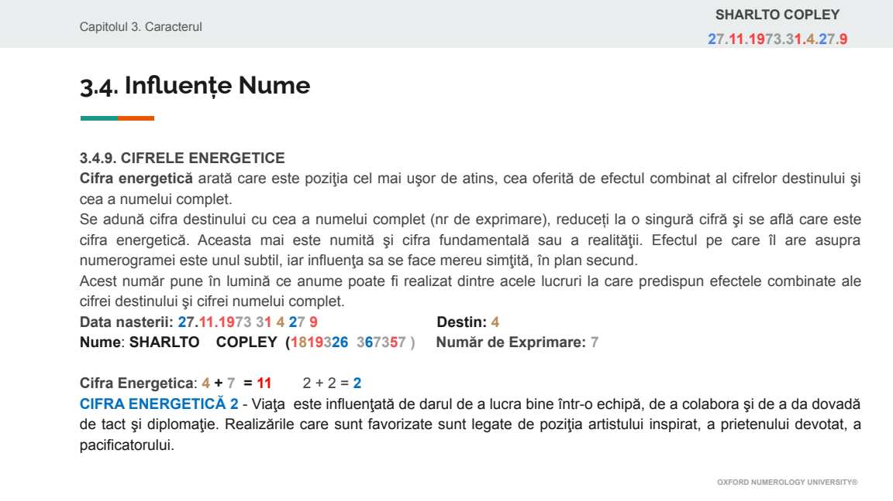

```text
Capitolul 3. Caracterul
3.4. Influențe Nume
3.4.9. CIFRELE ENERGETICE
Cifra energetică arată care este poziţia cel mai uşor de atins, cea oferită de efectul combinat al cifrelor destinului şi
cea a numelui complet.
Se adună cifra destinului cu cea a numelui complet (nr de exprimare), reduceți la o singură cifră şi se află care este
cifra energetică. Aceasta mai este numită şi cifra fundamentală sau a realităţii. Efectul pe care îl are asupra
numerogramei este unul subtil, iar influenţa sa se face mereu simţită, în plan secund.
Acest număr pune în lumină ce anume poate fi realizat dintre acele lucruri la care predispun efectele combinate ale
cifrei destinului şi cifrei numelui complet.
Data nasterii: 27.11.1973 31 4 27 9 Destin: 4
Nume: SHARLTO COPLEY (1819326 367357 ) Număr de Exprimare: 7
Cifra Energetica: 4 + 7 = 11 2 + 2 = 2
CIFRA ENERGETICĂ 2 - Viaţa este influenţată de darul de a lucra bine într-o echipă, de a colabora şi de a da dovadă
de tact şi diplomaţie. Realizările care sunt favorizate sunt legate de poziţia artistului inspirat, a prietenului devotat, a
pacificatorului.
OXFORD NUMEROLOGY UNIVERSITY®
```

### Pagina 171

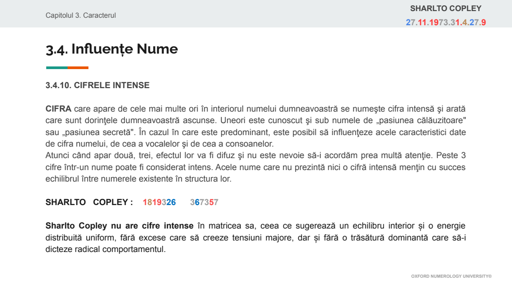

```text
Capitolul 3. Caracterul
3.4. Influențe Nume
3.4.10. CIFRELE INTENSE
CIFRA care apare de cele mai multe ori în interiorul numelui dumneavoastră se numeşte cifra intensă şi arată
care sunt dorinţele dumneavoastră ascunse. Uneori este cunoscut şi sub numele de „pasiunea călăuzitoare"
sau „pasiunea secretă". În cazul în care este predominant, este posibil să influenţeze acele caracteristici date
de cifra numelui, de cea a vocalelor şi de cea a consoanelor.
Atunci când apar două, trei, efectul lor va fi difuz şi nu este nevoie să-i acordăm prea multă atenţie. Peste 3
cifre într-un nume poate fi considerat intens. Acele nume care nu prezintă nici o cifră intensă menţin cu succes
echilibrul între numerele existente în structura lor.
Sharlto Copley nu are cifre intense în matricea sa, ceea ce sugerează un echilibru interior și o energie
distribuită uniform, fără excese care să creeze tensiuni majore, dar și fără o trăsătură dominantă care să-i
dicteze radical comportamentul.
OXFORD NUMEROLOGY UNIVERSITY®
```

### Pagina 172

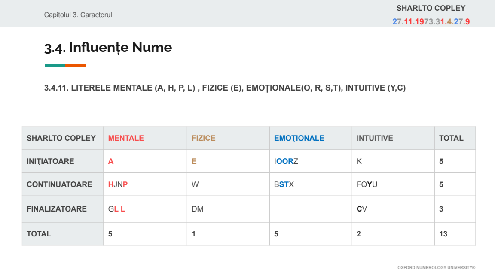

```text
Capitolul 3. Caracterul
3.4. Influențe Nume
3.4.11. LITERELE MENTALE (A, H, P, L) , FIZICE (E), EMOȚIONALE(O, R, S,T), INTUITIVE (Y,C)
INIŢIATOARE A E IOORZ K 5
CONTINUATOARE HJNP W BSTX FQYU 5
FINALIZATOARE GL L DM CV 3
TOTAL 5 1 5 2 13
OXFORD NUMEROLOGY UNIVERSITY®
```

### Pagina 173

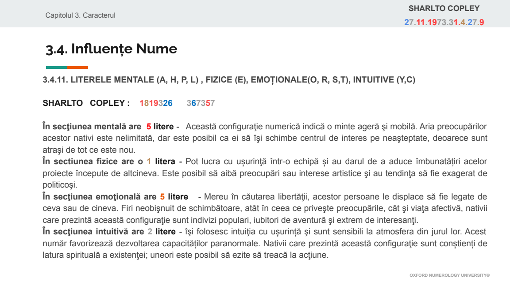

```text
Capitolul 3. Caracterul
3.4. Influențe Nume
3.4.11. LITERELE MENTALE (A, H, P, L) , FIZICE (E), EMOȚIONALE(O, R, S,T), INTUITIVE (Y,C)
În secţiunea mentală are 5 litere - Această configuraţie numerică indică o minte ageră şi mobilă. Aria preocupărilor
acestor nativi este nelimitată, dar este posibil ca ei să îşi schimbe centrul de interes pe neaşteptate, deoarece sunt
atraşi de tot ce este nou.
În sectiunea fizice are o 1 litera - Pot lucra cu ușurinţă într-o echipă și au darul de a aduce îmbunatățiri acelor
proiecte începute de altcineva. Este posibil să aibă preocupări sau interese artistice şi au tendinţa să fie exagerat de
politicoşi.
În secţiunea emoţională are 5 litere - Mereu în căutarea libertăţii, acestor persoane le displace să fie legate de
ceva sau de cineva. Firi neobişnuit de schimbătoare, atât în ceea ce priveşte preocupările, cât şi viaţa afectivă, nativii
care prezintă această configuraţie sunt indivizi populari, iubitori de aventură şi extrem de interesanţi.
În secţiunea intuitivă are 2 litere - îşi folosesc intuiţia cu ușurință şi sunt sensibili la atmosfera din jurul lor. Acest
număr favorizează dezVAULTarea capacităților paranormale. Nativii care prezintă această configuraţie sunt conștienți de
latura spirituală a existenţei; uneori este posibil să ezite să treacă la acţiune.
OXFORD NUMEROLOGY UNIVERSITY®
```

### Pagina 174

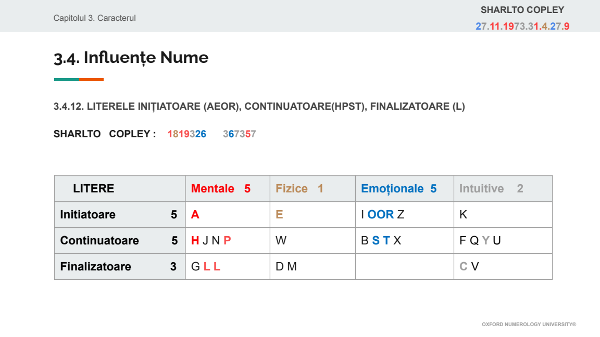

```text
Capitolul 3. Caracterul
3.4. Influențe Nume
3.4.12. LITERELE INIȚIATOARE (AEOR), CONTINUATOARE(HPST), FINALIZATOARE (L)
LITERE Mentale 5 Fizice 1 Emoționale 5 Intuitive 2
Initiatoare 5 A E I OOR Z K
Continuatoare 5 H J N P W B S T X F Q Y U
Finalizatoare 3 G L L D M C V
OXFORD NUMEROLOGY UNIVERSITY®
```

### Pagina 175

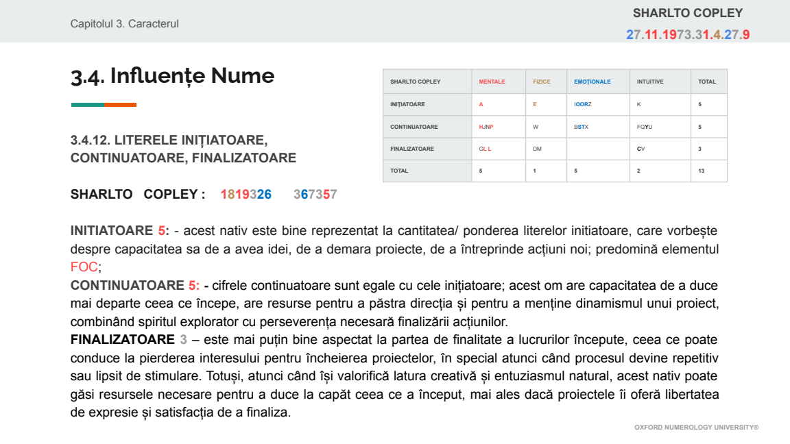

```text
Capitolul 3. Caracterul
3.4. Influențe Nume
INIŢIATOARE A E IOORZ K 5
CONTINUATOARE HJNP W BSTX FQYU 5
3.4.12. LITERELE INIȚIATOARE,
FINALIZATOARE GL L DM CV 3
CONTINUATOARE, FINALIZATOARE
TOTAL 5 1 5 2 13
INITIATOARE 5: - acest nativ este bine reprezentat la cantitatea/ ponderea literelor initiatoare, care vorbește
despre capacitatea sa de a avea idei, de a demara proiecte, de a întreprinde acțiuni noi; predomină elementul
FOC;
CONTINUATOARE 5: - cifrele continuatoare sunt egale cu cele inițiatoare; acest om are capacitatea de a duce
mai departe ceea ce începe, are resurse pentru a păstra direcția și pentru a menține dinamismul unui proiect,
combinând spiritul explorator cu perseverența necesară finalizării acțiunilor.
FINALIZATOARE 3 – este mai puțin bine aspectat la partea de finalitate a lucrurilor începute, ceea ce poate
conduce la pierderea interesului pentru încheierea proiectelor, în special atunci când procesul devine repetitiv
sau lipsit de stimulare. Totuși, atunci când își valorifică latura creativă și entuziasmul natural, acest nativ poate
găsi resursele necesare pentru a duce la capăt ceea ce a început, mai ales dacă proiectele îi oferă libertatea
de expresie și satisfacția de a finaliza.
OXFORD NUMEROLOGY UNIVERSITY®
```

### Pagina 176

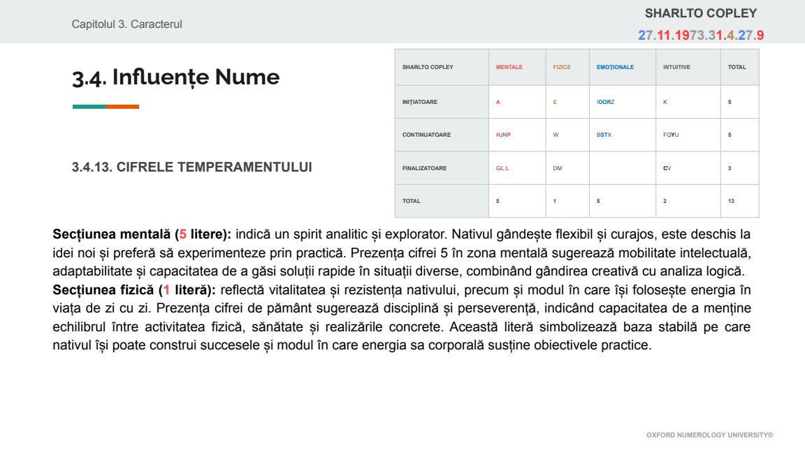

```text
Capitolul 3. Caracterul
3.4. Influențe Nume SHARLTO COPLEY MENTALE FIZICE EMOŢIONALE INTUITIVE TOTAL
INIŢIATOARE A E IOORZ K 5
CONTINUATOARE HJNP W BSTX FQYU 5
3.4.13. CIFRELE TEMPERAMENTULUI
FINALIZATOARE GL L DM CV 3
TOTAL 5 1 5 2 13
Secțiunea mentală (5 litere): indică un spirit analitic și explorator. Nativul gândește flexibil și curajos, este deschis la
idei noi și preferă să experimenteze prin practică. Prezența cifrei 5 în zona mentală sugerează mobilitate intelectuală,
adaptabilitate și capacitatea de a găsi soluții rapide în situații diverse, combinând gândirea creativă cu analiza logică.
Secțiunea fizică (1 literă): reflectă vitalitatea și rezistența nativului, precum și modul în care își folosește energia în
viața de zi cu zi. Prezența cifrei de pământ sugerează disciplină și perseverență, indicând capacitatea de a menține
echilibrul între activitatea fizică, sănătate și realizările concrete. Această literă simbolizează baza stabilă pe care
nativul își poate construi succesele și modul în care energia sa corporală susține obiectivele practice.
OXFORD NUMEROLOGY UNIVERSITY®
```

### Pagina 177

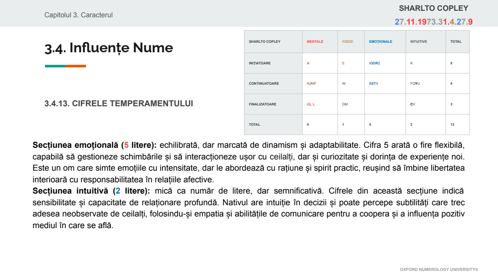

```text
Capitolul 3. Caracterul
3.4. Influențe Nume SHARLTO COPLEY MENTALE FIZICE EMOŢIONALE INTUITIVE TOTAL
INIŢIATOARE A E IOORZ K 5
CONTINUATOARE HJNP W BSTX FQYU 5
3.4.13. CIFRELE TEMPERAMENTULUI
FINALIZATOARE GL L DM CV 3
TOTAL 5 1 5 2 13
Secțiunea emoțională (5 litere): echilibrată, dar marcată de dinamism și adaptabilitate. Cifra 5 arată o fire flexibilă,
capabilă să gestioneze schimbările și să interacționeze ușor cu ceilalți, dar și curiozitate și dorința de experiențe noi.
Este un om care simte emoțiile cu intensitate, dar le abordează cu rațiune și spirit practic, reușind să îmbine libertatea
interioară cu responsabilitatea în relațiile afective.
Secțiunea intuitivă (2 litere): mică ca număr de litere, dar semnificativă. Cifrele din această secțiune indică
sensibilitate și capacitate de relaționare profundă. Nativul are intuiție în decizii și poate percepe subtilități care trec
adesea neobservate de ceilalți, folosindu-și empatia și abilitățile de comunicare pentru a coopera și a influența pozitiv
mediul în care se află.
OXFORD NUMEROLOGY UNIVERSITY®
```

### Pagina 178

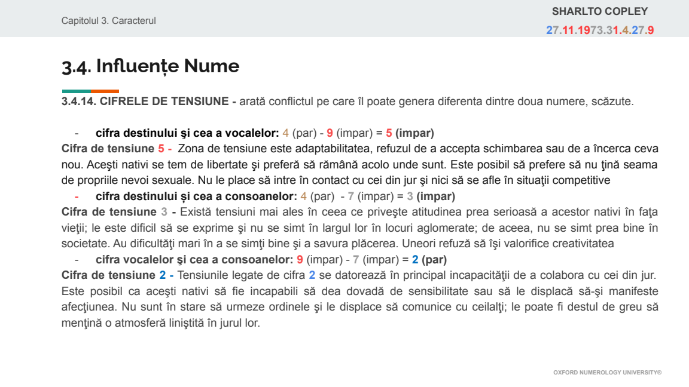

```text
Capitolul 3. Caracterul
3.4. Influențe Nume
3.4.14. CIFRELE DE TENSIUNE - arată conflictul pe care îl poate genera diferenta dintre doua numere, scăzute.
- cifra destinului şi cea a vocalelor: 4 (par) - 9 (impar) = 5 (impar)
Cifra de tensiune 5 - Zona de tensiune este adaptabilitatea, refuzul de a accepta schimbarea sau de a încerca ceva
nou. Aceşti nativi se tem de libertate şi preferă să rămână acolo unde sunt. Este posibil să prefere să nu ţină seama
de propriile nevoi sexuale. Nu le place să intre în contact cu cei din jur şi nici să se afle în situaţii competitive
- cifra destinului și cea a consoanelor: 4 (par) - 7 (impar) = 3 (impar)
Cifra de tensiune 3 - Există tensiuni mai ales în ceea ce priveşte atitudinea prea serioasă a acestor nativi în faţa
vieţii; le este dificil să se exprime şi nu se simt în largul lor în locuri aglomerate; de aceea, nu se simt prea bine în
societate. Au dificultăţi mari în a se simţi bine şi a savura plăcerea. Uneori refuză să îşi valorifice creativitatea
- cifra vocalelor şi cea a consoanelor: 9 (impar) - 7 (impar) = 2 (par)
Cifra de tensiune 2 - Tensiunile legate de cifra 2 se datorează în principal incapacităţii de a colabora cu cei din jur.
Este posibil ca aceşti nativi să fie incapabili să dea dovadă de sensibilitate sau să le displacă să-şi manifeste
afecţiunea. Nu sunt în stare să urmeze ordinele şi le displace să comunice cu ceilalţi; le poate fi destul de greu să
menţină o atmosferă liniştită în jurul lor.
OXFORD NUMEROLOGY UNIVERSITY®
```

### Pagina 179


```text
Concluziile
Caracterului
```

### Pagina 180

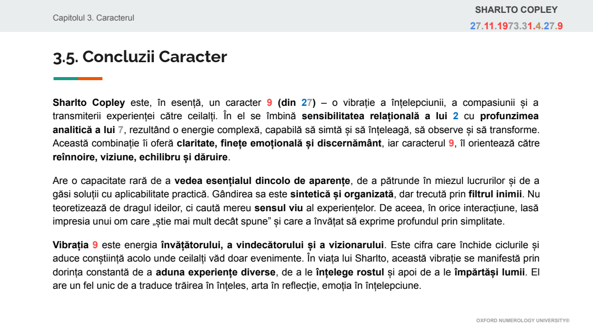

```text
Capitolul 3. Caracterul
3.5. Concluzii Caracter
Sharlto Copley este, în esență, un caracter 9 (din 27) – o vibrație a înțelepciunii, a compasiunii și a
transmiterii experienței către ceilalți. În el se îmbină sensibilitatea relațională a lui 2 cu profunzimea
analitică a lui 7, rezultând o energie complexă, capabilă să simtă și să înțeleagă, să observe și să transforme.
Această combinație îi oferă claritate, finețe emoțională și discernământ, iar caracterul 9, îl orientează către
reînnoire, viziune, echilibru și dăruire.
Are o capacitate rară de a vedea esențialul dincolo de aparențe, de a pătrunde în miezul lucrurilor și de a
găsi soluții cu aplicabilitate practică. Gândirea sa este sintetică și organizată, dar trecută prin filtrul inimii. Nu
teoretizează de dragul ideilor, ci caută mereu sensul viu al experiențelor. De aceea, în orice interacțiune, lasă
impresia unui om care „știe mai mult decât spune” și care a învățat să exprime profundul prin simplitate.
Vibrația 9 este energia învățătorului, a vindecătorului și a vizionarului. Este cifra care închide ciclurile și
aduce conștiință acolo unde ceilalți văd doar evenimente. În viața lui Sharlto, această vibrație se manifestă prin
dorința constantă de a aduna experiențe diverse, de a le înțelege rostul și apoi de a le împărtăși lumii. El
are un fel unic de a traduce trăirea în înțeles, arta în reflecție, emoția în înțelepciune.
OXFORD NUMEROLOGY UNIVERSITY®
```

### Pagina 181

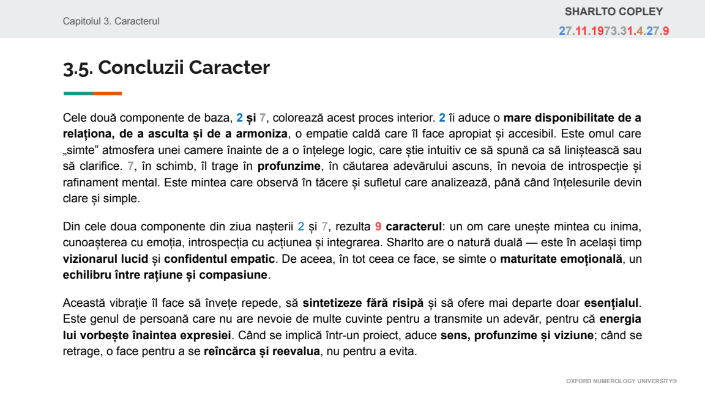

```text
Capitolul 3. Caracterul
3.5. Concluzii Caracter
Cele două componente de baza, 2 și 7, colorează acest proces interior. 2 îi aduce o mare disponibilitate de a
relaționa, de a asculta și de a armoniza, o empatie caldă care îl face apropiat și accesibil. Este omul care
„simte” atmosfera unei camere înainte de a o înțelege logic, care știe intuitiv ce să spună ca să liniștească sau
să clarifice. 7, în schimb, îl trage în profunzime, în căutarea adevărului ascuns, în nevoia de introspecție și
rafinament mental. Este mintea care observă în tăcere și sufletul care analizează, până când înțelesurile devin
clare și simple.
Din cele doua componente din ziua nașterii 2 și 7, rezulta 9 caracterul: un om care unește mintea cu inima,
cunoașterea cu emoția, introspecția cu acțiunea și integrarea. Sharlto are o natură duală — este în același timp
vizionarul lucid și confidentul empatic. De aceea, în tot ceea ce face, se simte o maturitate emoțională, un
echilibru între rațiune și compasiune.
Această vibrație îl face să învețe repede, să sintetizeze fără risipă și să ofere mai departe doar esențialul.
Este genul de persoană care nu are nevoie de multe cuvinte pentru a transmite un adevăr, pentru că energia
lui vorbește înaintea expresiei. Când se implică într-un proiect, aduce sens, profunzime și viziune; când se
retrage, o face pentru a se reîncărca și reevalua, nu pentru a evita.
OXFORD NUMEROLOGY UNIVERSITY®
```

### Pagina 182

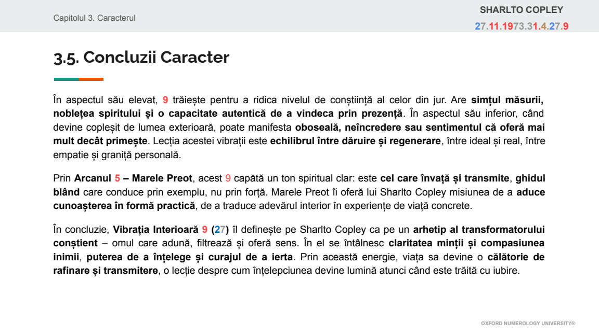

```text
Capitolul 3. Caracterul
3.5. Concluzii Caracter
În aspectul său elevat, 9 trăiește pentru a ridica nivelul de conștiință al celor din jur. Are simțul măsurii,
noblețea spiritului și o capacitate autentică de a vindeca prin prezență. În aspectul său inferior, când
devine copleșit de lumea exterioară, poate manifesta oboseală, neîncredere sau sentimentul că oferă mai
mult decât primește. Lecția acestei vibrații este echilibrul între dăruire și regenerare, între ideal și real, între
empatie și graniță personală.
Prin Arcanul 5 – Marele Preot, acest 9 capătă un ton spiritual clar: este cel care învață și transmite, ghidul
blând care conduce prin exemplu, nu prin forță. Marele Preot îi oferă lui Sharlto Copley misiunea de a aduce
cunoașterea în formă practică, de a traduce adevărul interior în experiențe de viață concrete.
În concluzie, Vibrația Interioară 9 (27) îl definește pe Sharlto Copley ca pe un arhetip al transformatorului
conștient – omul care adună, filtrează și oferă sens. În el se întâlnesc claritatea minții și compasiunea
inimii, puterea de a înțelege și curajul de a ierta. Prin această energie, viața sa devine o călătorie de
rafinare și transmitere, o lecție despre cum înțelepciunea devine lumină atunci când este trăită cu iubire.
OXFORD NUMEROLOGY UNIVERSITY®
```

### Pagina 183

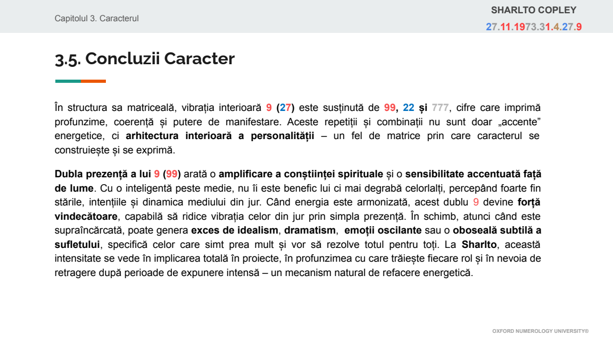

```text
Capitolul 3. Caracterul
3.5. Concluzii Caracter
În structura sa matriceală, vibrația interioară 9 (27) este susținută de 99, 22 și 777, cifre care imprimă
profunzime, coerență și putere de manifestare. Aceste repetiții și combinații nu sunt doar „accente”
energetice, ci arhitectura interioară a personalității – un fel de matrice prin care caracterul se
construiește și se exprimă.
Dubla prezență a lui 9 (99) arată o amplificare a conștiinței spirituale și o sensibilitate accentuată față
de lume. Cu o inteligentă peste medie, nu îi este benefic lui ci mai degrabă celorlalți, percepând foarte fin
stările, intențiile și dinamica mediului din jur. Când energia este armonizată, acest dublu 9 devine forță
vindecătoare, capabilă să ridice vibrația celor din jur prin simpla prezență. În schimb, atunci când este
supraîncărcată, poate genera exces de idealism, dramatism, emoții oscilante sau o oboseală subtilă a
sufletului, specifică celor care simt prea mult și vor să rezolve totul pentru toți. La Sharlto, această
intensitate se vede în implicarea totală în proiecte, în profunzimea cu care trăiește fiecare rol și în nevoia de
retragere după perioade de expunere intensă – un mecanism natural de refacere energetică.
OXFORD NUMEROLOGY UNIVERSITY®
```

### Pagina 184

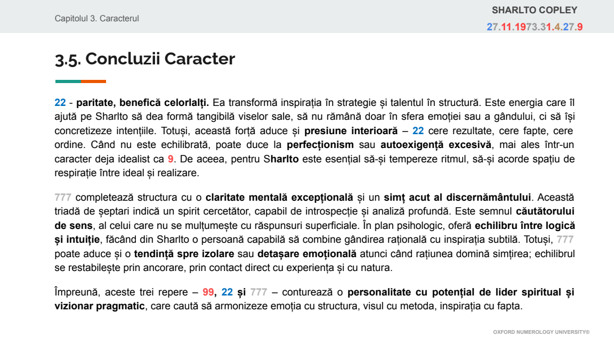

```text
Capitolul 3. Caracterul
3.5. Concluzii Caracter
22 - paritate, benefică celorlalți. Ea transformă inspirația în strategie și talentul în structură. Este energia care îl
ajută pe Sharlto să dea formă tangibilă viselor sale, să nu rămână doar în sfera emoției sau a gândului, ci să își
concretizeze intențiile. Totuși, această forță aduce și presiune interioară – 22 cere rezultate, cere fapte, cere
ordine. Când nu este echilibrată, poate duce la perfecționism sau autoexigență excesivă, mai ales într-un
caracter deja idealist ca 9. De aceea, pentru Sharlto este esențial să-și tempereze ritmul, să-și acorde spațiu de
respirație între ideal și realizare.
777 completează structura cu o claritate mentală excepțională și un simț acut al discernământului. Această
triadă de șeptari indică un spirit cercetător, capabil de introspecție și analiză profundă. Este semnul căutătorului
de sens, al celui care nu se mulțumește cu răspunsuri superficiale. În plan psihologic, oferă echilibru între logică
și intuiție, făcând din Sharlto o persoană capabilă să combine gândirea rațională cu inspirația subtilă. Totuși, 777
poate aduce și o tendință spre izolare sau detașare emoțională atunci când rațiunea domină simțirea; echilibrul
se restabilește prin ancorare, prin contact direct cu experiența și cu natura.
Împreună, aceste trei repere – 99, 22 și 777 – conturează o personalitate cu potențial de lider spiritual și
vizionar pragmatic, care caută să armonizeze emoția cu structura, visul cu metoda, inspirația cu fapta.
OXFORD NUMEROLOGY UNIVERSITY®
```

### Pagina 185

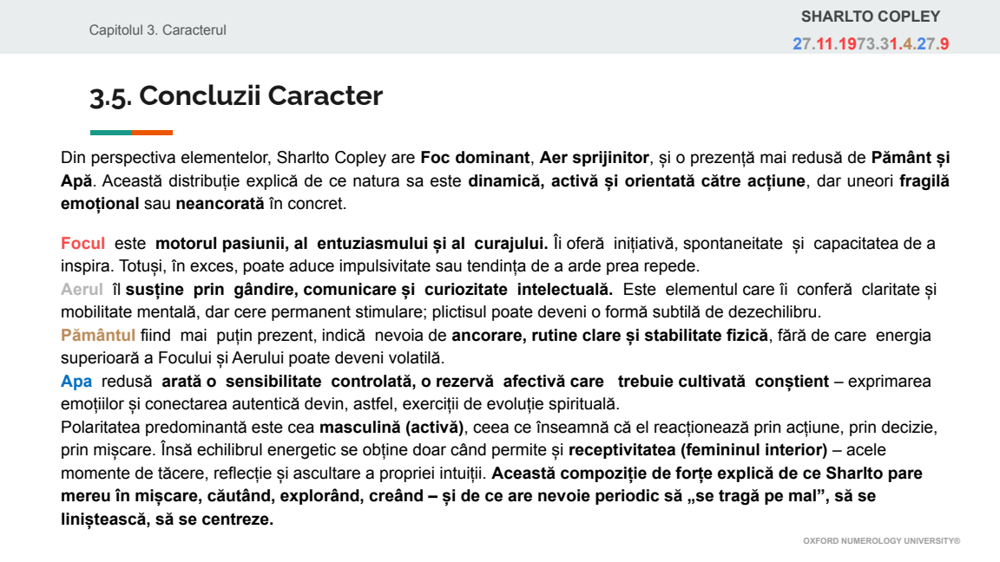

```text
Capitolul 3. Caracterul
3.5. Concluzii Caracter
Din perspectiva elementelor, Sharlto Copley are Foc dominant, Aer sprijinitor, și o prezență mai redusă de Pământ și
Apă. Această distribuție explică de ce natura sa este dinamică, activă și orientată către acțiune, dar uneori fragilă
emoțional sau neancorată în concret.
Focul este motorul pasiunii, al entuziasmului și al curajului. Îi oferă inițiativă, spontaneitate și capacitatea de a
inspira. Totuși, în exces, poate aduce impulsivitate sau tendința de a arde prea repede.
Aerul îl susține prin gândire, comunicare și curiozitate intelectuală. Este elementul care îi conferă claritate și
mobilitate mentală, dar cere permanent stimulare; plictisul poate deveni o formă subtilă de dezechilibru.
Pământul fiind mai puțin prezent, indică nevoia de ancorare, rutine clare și stabilitate fizică, fără de care energia
superioară a Focului și Aerului poate deveni volatilă.
Apa redusă arată o sensibilitate controlată, o rezervă afectivă care trebuie cultivată conștient – exprimarea
emoțiilor și conectarea autentică devin, astfel, exerciții de evoluție spirituală.
Polaritatea predominantă este cea masculină (activă), ceea ce înseamnă că el reacționează prin acțiune, prin decizie,
prin mișcare. Însă echilibrul energetic se obține doar când permite și receptivitatea (femininul interior) – acele
momente de tăcere, reflecție și ascultare a propriei intuiții. Această compoziție de forțe explică de ce Sharlto pare
mereu în mișcare, căutând, explorând, creând – și de ce are nevoie periodic să „se tragă pe mal”, să se
liniștească, să se centreze.
OXFORD NUMEROLOGY UNIVERSITY®
```

### Pagina 186

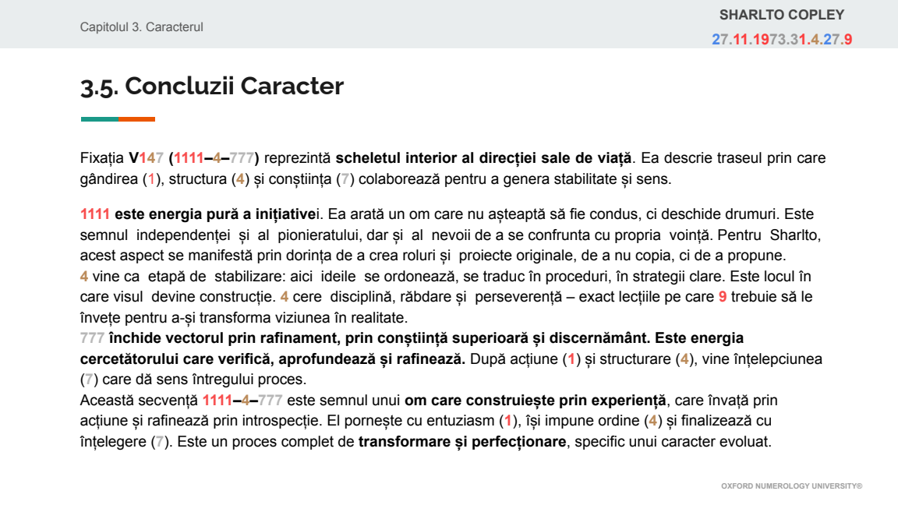

```text
Capitolul 3. Caracterul
3.5. Concluzii Caracter
Fixația V147 (1111–4–777) reprezintă scheletul interior al direcției sale de viață. Ea descrie traseul prin care
gândirea (1), structura (4) și conștiința (7) colaborează pentru a genera stabilitate și sens.
1111 este energia pură a inițiativei. Ea arată un om care nu așteaptă să fie condus, ci deschide drumuri. Este
semnul independenței și al pionieratului, dar și al nevoii de a se confrunta cu propria voință. Pentru Sharlto,
acest aspect se manifestă prin dorința de a crea roluri și proiecte originale, de a nu copia, ci de a propune.
4 vine ca etapă de stabilizare: aici ideile se ordonează, se traduc în proceduri, în strategii clare. Este locul în
care visul devine construcție. 4 cere disciplină, răbdare și perseverență – exact lecțiile pe care 9 trebuie să le
învețe pentru a-și transforma viziunea în realitate.
777 închide vectorul prin rafinament, prin conștiință superioară și discernământ. Este energia
cercetătorului care verifică, aprofundează și rafinează. După acțiune (1) și structurare (4), vine înțelepciunea
(7) care dă sens întregului proces.
Această secvență 1111–4–777 este semnul unui om care construiește prin experiență, care învață prin
acțiune și rafinează prin introspecție. El pornește cu entuziasm (1), își impune ordine (4) și finalizează cu
înțelegere (7). Este un proces complet de transformare și perfecționare, specific unui caracter evoluat.
OXFORD NUMEROLOGY UNIVERSITY®
```

### Pagina 187

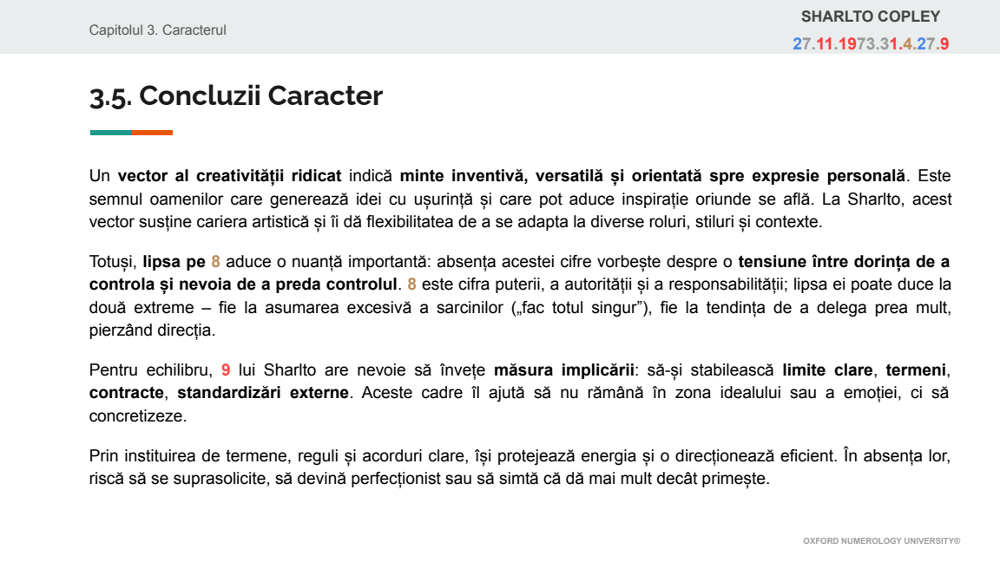

```text
Capitolul 3. Caracterul
3.5. Concluzii Caracter
Un vector al creativității ridicat indică minte inventivă, versatilă și orientată spre expresie personală. Este
semnul oamenilor care generează idei cu ușurință și care pot aduce inspirație oriunde se află. La Sharlto, acest
vector susține cariera artistică și îi dă flexibilitatea de a se adapta la diverse roluri, stiluri și contexte.
Totuși, lipsa pe 8 aduce o nuanță importantă: absența acestei cifre vorbește despre o tensiune între dorința de a
controla și nevoia de a preda controlul. 8 este cifra puterii, a autorității și a responsabilității; lipsa ei poate duce la
două extreme – fie la asumarea excesivă a sarcinilor („fac totul singur”), fie la tendința de a delega prea mult,
pierzând direcția.
Pentru echilibru, 9 lui Sharlto are nevoie să învețe măsura implicării: să-și stabilească limite clare, termeni,
contracte, standardizări externe. Aceste cadre îl ajută să nu rămână în zona idealului sau a emoției, ci să
concretizeze.
Prin instituirea de termene, reguli și acorduri clare, își protejează energia și o direcționează eficient. În absența lor,
riscă să se suprasolicite, să devină perfecționist sau să simtă că dă mai mult decât primește.
OXFORD NUMEROLOGY UNIVERSITY®
```

### Pagina 188

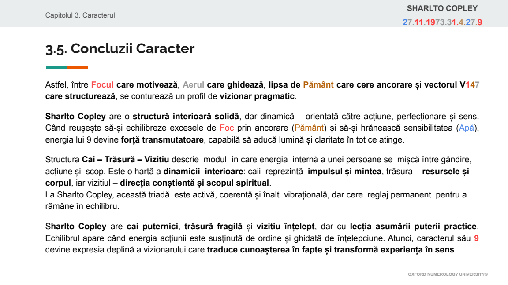

```text
Capitolul 3. Caracterul
3.5. Concluzii Caracter
Astfel, între Focul care motivează, Aerul care ghidează, lipsa de Pământ care cere ancorare și vectorul V147
care structurează, se conturează un profil de vizionar pragmatic.
Sharlto Copley are o structură interioară solidă, dar dinamică – orientată către acțiune, perfecționare și sens.
Când reușește să-și echilibreze excesele de Foc prin ancorare (Pământ) și să-și hrănească sensibilitatea (Apă),
energia lui 9 devine forță transmutatoare, capabilă să aducă lumină și claritate în tot ce atinge.
Structura Cai – Trăsură – Vizitiu descrie modul în care energia internă a unei persoane se mișcă între gândire,
acțiune și scop. Este o hartă a dinamicii interioare: caii reprezintă impulsul și mintea, trăsura – resursele și
corpul, iar vizitiul – direcția conștientă și scopul spiritual.
La Sharlto Copley, această triadă este activă, coerentă și înalt vibrațională, dar cere reglaj permanent pentru a
rămâne în echilibru.
Sharlto Copley are cai puternici, trăsură fragilă și vizitiu înțelept, dar cu lecția asumării puterii practice.
Echilibrul apare când energia acțiunii este susținută de ordine și ghidată de înțelepciune. Atunci, caracterul său 9
devine expresia deplină a vizionarului care traduce cunoașterea în fapte și transformă experiența în sens.
OXFORD NUMEROLOGY UNIVERSITY®
```

### Pagina 189

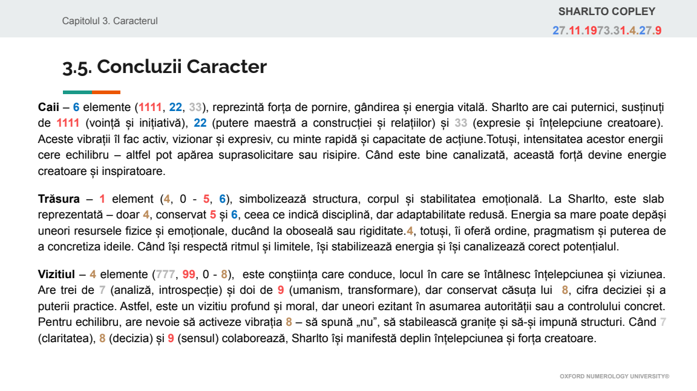

```text
Capitolul 3. Caracterul
3.5. Concluzii Caracter
Caii – 6 elemente (1111, 22, 33), reprezintă forța de pornire, gândirea și energia vitală. Sharlto are cai puternici, susținuți
de 1111 (voință și inițiativă), 22 (putere maestră a construcției și relațiilor) și 33 (expresie și înțelepciune creatoare).
Aceste vibrații îl fac activ, vizionar și expresiv, cu minte rapidă și capacitate de acțiune.Totuși, intensitatea acestor energii
cere echilibru – altfel pot apărea suprasolicitare sau risipire. Când este bine canalizată, această forță devine energie
creatoare și inspiratoare.
Trăsura – 1 element (4, 0 - 5, 6), simbolizează structura, corpul și stabilitatea emoțională. La Sharlto, este slab
reprezentată – doar 4, conservat 5 și 6, ceea ce indică disciplină, dar adaptabilitate redusă. Energia sa mare poate depăși
uneori resursele fizice și emoționale, ducând la oboseală sau rigiditate.4, totuși, îi oferă ordine, pragmatism și puterea de
a concretiza ideile. Când își respectă ritmul și limitele, își stabilizează energia și își canalizează corect potențialul.
Vizitiul – 4 elemente (777, 99, 0 - 8), este conștiința care conduce, locul în care se întâlnesc înțelepciunea și viziunea.
Are trei de 7 (analiză, introspecție) și doi de 9 (umanism, transformare), dar conservat căsuța lui 8, cifra deciziei și a
puterii practice. Astfel, este un vizitiu profund și moral, dar uneori ezitant în asumarea autorității sau a controlului concret.
Pentru echilibru, are nevoie să activeze vibrația 8 – să spună „nu”, să stabilească granițe și să-și impună structuri. Când 7
(claritatea), 8 (decizia) și 9 (sensul) colaborează, Sharlto își manifestă deplin înțelepciunea și forța creatoare.
OXFORD NUMEROLOGY UNIVERSITY®
```

### Pagina 190

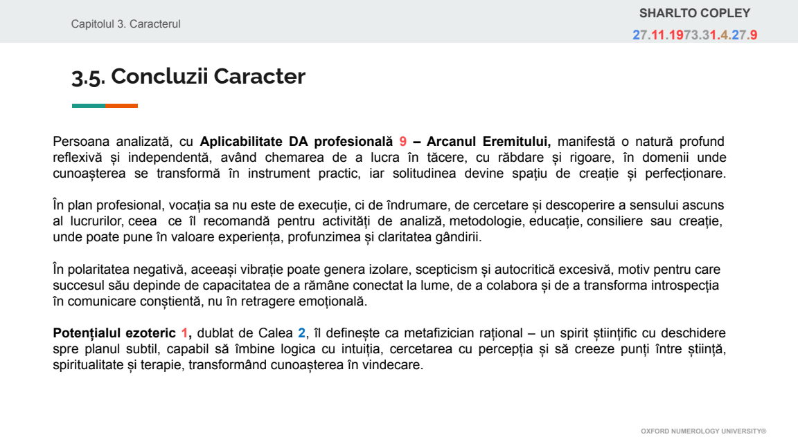

```text
Capitolul 3. Caracterul
3.5. Concluzii Caracter
Persoana analizată, cu Aplicabilitate DA profesională 9 – Arcanul Eremitului, manifestă o natură profund
reflexivă și independentă, având chemarea de a lucra în tăcere, cu răbdare și rigoare, în domenii unde
cunoașterea se transformă în instrument practic, iar solitudinea devine spațiu de creație și perfecționare.
În plan profesional, vocația sa nu este de execuție, ci de îndrumare, de cercetare și descoperire a sensului ascuns
al lucrurilor, ceea ce îl recomandă pentru activități de analiză, metodologie, educație, consiliere sau creație,
unde poate pune în valoare experiența, profunzimea și claritatea gândirii.
În polaritatea negativă, aceeași vibrație poate genera izolare, scepticism și autocritică excesivă, motiv pentru care
succesul său depinde de capacitatea de a rămâne conectat la lume, de a colabora și de a transforma introspecția
în comunicare conștientă, nu în retragere emoțională.
Potențialul ezoteric 1, dublat de Calea 2, îl definește ca metafizician rațional – un spirit științific cu deschidere
spre planul subtil, capabil să îmbine logica cu intuiția, cercetarea cu percepția și să creeze punți între știință,
spiritualitate și terapie, transformând cunoașterea în vindecare.
OXFORD NUMEROLOGY UNIVERSITY®
```

### Pagina 191

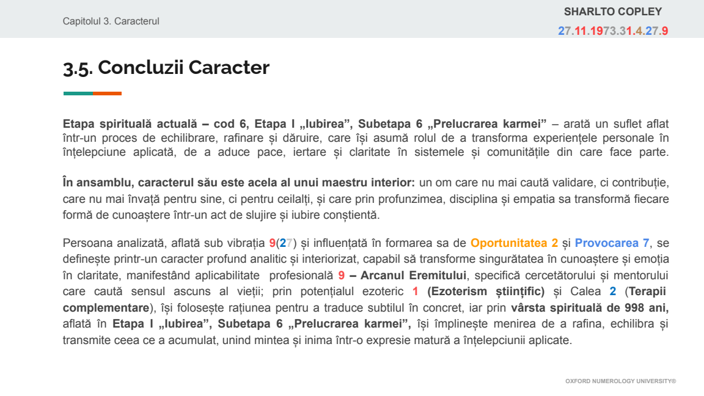

```text
Capitolul 3. Caracterul
3.5. Concluzii Caracter
Etapa spirituală actuală – cod 6, Etapa I „Iubirea”, Subetapa 6 „Prelucrarea karmei” – arată un suflet aflat
într-un proces de echilibrare, rafinare și dăruire, care își asumă rolul de a transforma experiențele personale în
înțelepciune aplicată, de a aduce pace, iertare și claritate în sistemele și comunitățile din care face parte.
În ansamblu, caracterul său este acela al unui maestru interior: un om care nu mai caută validare, ci contribuție,
care nu mai învață pentru sine, ci pentru ceilalți, și care prin profunzimea, disciplina și empatia sa transformă fiecare
formă de cunoaștere într-un act de slujire și iubire conștientă.
Persoana analizată, aflată sub vibrația 9(27) și influențată în formarea sa de Oportunitatea 2 și Provocarea 7, se
definește printr-un caracter profund analitic și interiorizat, capabil să transforme singurătatea în cunoaștere și emoția
în claritate, manifestând aplicabilitate profesională 9 – Arcanul Eremitului, specifică cercetătorului și mentorului
care caută sensul ascuns al vieții; prin potențialul ezoteric 1 (Ezoterism științific) și Calea 2 (Terapii
complementare), își folosește rațiunea pentru a traduce subtilul în concret, iar prin vârsta spirituală de 998 ani,
aflată în Etapa I „Iubirea”, Subetapa 6 „Prelucrarea karmei”, își împlinește menirea de a rafina, echilibra și
transmite ceea ce a acumulat, unind mintea și inima într-o expresie matură a înțelepciunii aplicate.
OXFORD NUMEROLOGY UNIVERSITY®
```

### Pagina 192

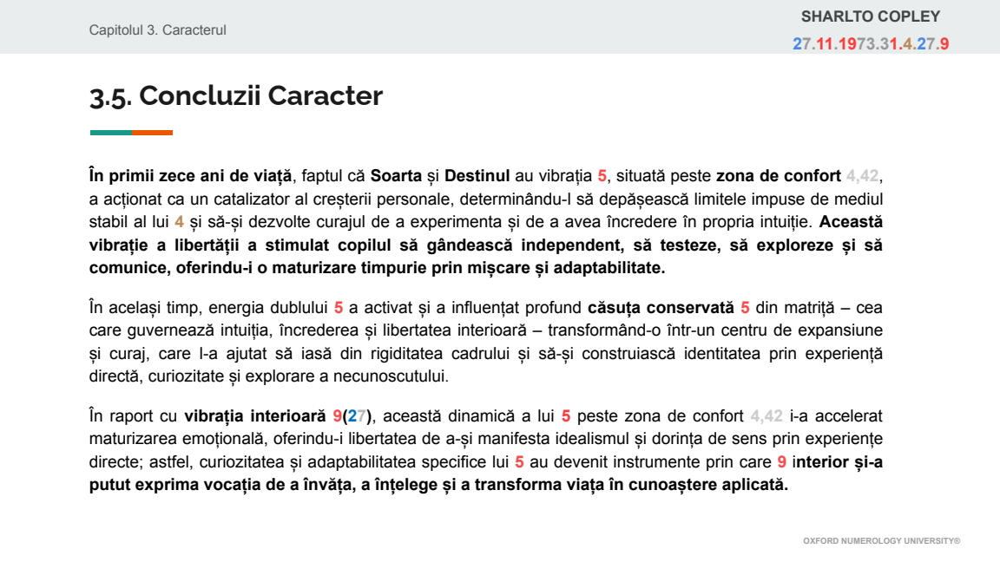

```text
Capitolul 3. Caracterul
3.5. Concluzii Caracter
În primii zece ani de viață, faptul că Soarta și Destinul au vibrația 5, situată peste zona de confort 4,42,
a acționat ca un catalizator al creșterii personale, determinându-l să depășească limitele impuse de mediul
stabil al lui 4 și să-și dezVAULTe curajul de a experimenta și de a avea încredere în propria intuiție. Această
vibrație a libertății a stimulat copilul să gândească independent, să testeze, să exploreze și să
comunice, oferindu-i o maturizare timpurie prin mișcare și adaptabilitate.
În același timp, energia dublului 5 a activat și a influențat profund căsuța conservată 5 din matriță – cea
care guvernează intuiția, încrederea și libertatea interioară – transformând-o într-un centru de expansiune
și curaj, care l-a ajutat să iasă din rigiditatea cadrului și să-și construiască identitatea prin experiență
directă, curiozitate și explorare a necunoscutului.
În raport cu vibrația interioară 9(27), această dinamică a lui 5 peste zona de confort 4,42 i-a accelerat
maturizarea emoțională, oferindu-i libertatea de a-și manifesta idealismul și dorința de sens prin experiențe
directe; astfel, curiozitatea și adaptabilitatea specifice lui 5 au devenit instrumente prin care 9 interior și-a
putut exprima vocația de a învăța, a înțelege și a transforma viața în cunoaștere aplicată.
OXFORD NUMEROLOGY UNIVERSITY®
```

### Pagina 193

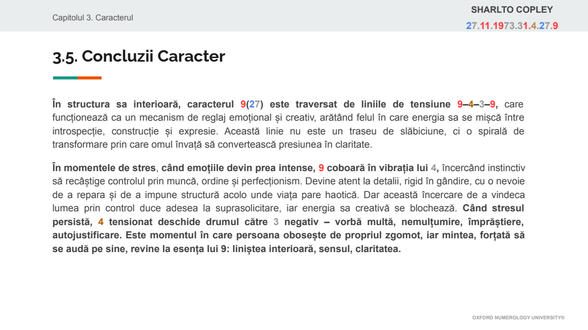

```text
Capitolul 3. Caracterul
3.5. Concluzii Caracter
În structura sa interioară, caracterul 9(27) este traversat de liniile de tensiune 9–4–3–9, care
funcționează ca un mecanism de reglaj emoțional și creativ, arătând felul în care energia sa se mișcă între
introspecție, construcție și expresie. Această linie nu este un traseu de slăbiciune, ci o spirală de
transformare prin care omul învață să convertească presiunea în claritate.
În momentele de stres, când emoțiile devin prea intense, 9 coboară în vibrația lui 4, încercând instinctiv
să recâștige controlul prin muncă, ordine și perfecționism. Devine atent la detalii, rigid în gândire, cu o nevoie
de a repara și de a impune structură acolo unde viața pare haotică. Dar această încercare de a vindeca
lumea prin control duce adesea la suprasolicitare, iar energia sa creativă se blochează. Când stresul
persistă, 4 tensionat deschide drumul către 3 negativ – vorbă multă, nemulțumire, împrăștiere,
autojustificare. Este momentul în care persoana obosește de propriul zgomot, iar mintea, forțată să
se audă pe sine, revine la esența lui 9: liniștea interioară, sensul, claritatea.
OXFORD NUMEROLOGY UNIVERSITY®
```

### Pagina 194

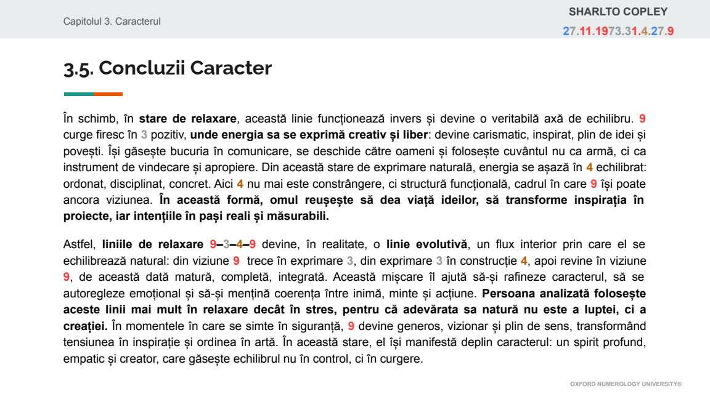

```text
Capitolul 3. Caracterul
3.5. Concluzii Caracter
În schimb, în stare de relaxare, această linie funcționează invers și devine o veritabilă axă de echilibru. 9
curge firesc în 3 pozitiv, unde energia sa se exprimă creativ și liber: devine carismatic, inspirat, plin de idei și
povești. Își găsește bucuria în comunicare, se deschide către oameni și folosește cuvântul nu ca armă, ci ca
instrument de vindecare și apropiere. Din această stare de exprimare naturală, energia se așază în 4 echilibrat:
ordonat, disciplinat, concret. Aici 4 nu mai este constrângere, ci structură funcțională, cadrul în care 9 își poate
ancora viziunea. În această formă, omul reușește să dea viață ideilor, să transforme inspirația în
proiecte, iar intențiile în pași reali și măsurabili.
Astfel, liniile de relaxare 9–3–4–9 devine, în realitate, o linie evolutivă, un flux interior prin care el se
echilibrează natural: din viziune 9 trece în exprimare 3, din exprimare 3 în construcție 4, apoi revine în viziune
9, de această dată matură, completă, integrată. Această mișcare îl ajută să-și rafineze caracterul, să se
autoregleze emoțional și să-și mențină coerența între inimă, minte și acțiune. Persoana analizată folosește
aceste linii mai mult în relaxare decât în stres, pentru că adevărata sa natură nu este a luptei, ci a
creației. În momentele în care se simte în siguranță, 9 devine generos, vizionar și plin de sens, transformând
tensiunea în inspirație și ordinea în artă. În această stare, el își manifestă deplin caracterul: un spirit profund,
empatic și creator, care găsește echilibrul nu în control, ci în curgere.
OXFORD NUMEROLOGY UNIVERSITY®
```

### Pagina 195

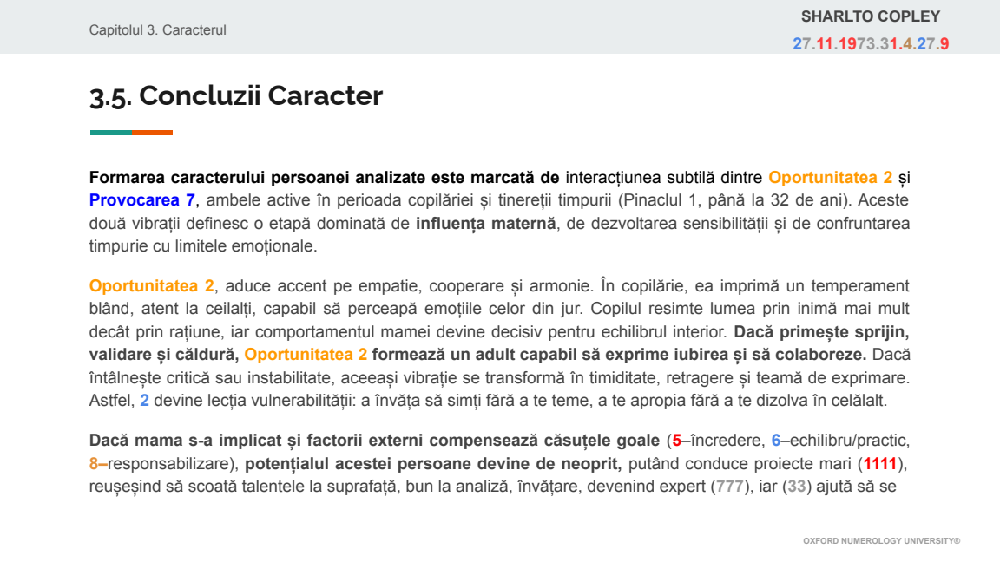

```text
Capitolul 3. Caracterul
3.5. Concluzii Caracter
Formarea caracterului persoanei analizate este marcată de interacțiunea subtilă dintre Oportunitatea 2 și
Provocarea 7, ambele active în perioada copilăriei și tinereții timpurii (Pinaclul 1, până la 32 de ani). Aceste
două vibrații definesc o etapă dominată de influența maternă, de dezVAULTarea sensibilității și de confruntarea
timpurie cu limitele emoționale.
Oportunitatea 2, aduce accent pe empatie, cooperare și armonie. În copilărie, ea imprimă un temperament
blând, atent la ceilalți, capabil să perceapă emoțiile celor din jur. Copilul resimte lumea prin inimă mai mult
decât prin rațiune, iar comportamentul mamei devine decisiv pentru echilibrul interior. Dacă primește sprijin,
validare și căldură, Oportunitatea 2 formează un adult capabil să exprime iubirea și să colaboreze. Dacă
întâlnește critică sau instabilitate, aceeași vibrație se transformă în timiditate, retragere și teamă de exprimare.
Astfel, 2 devine lecția vulnerabilității: a învăța să simți fără a te teme, a te apropia fără a te dizolva în celălalt.
Dacă mama s-a implicat și factorii externi compensează căsuțele goale (5–încredere, 6–echilibru/practic,
8–responsabilizare), potențialul acestei persoane devine de neoprit, putând conduce proiecte mari (1111),
reușeșind să scoată talentele la suprafață, bun la analiză, învățare, devenind expert (777), iar (33) ajută să se
OXFORD NUMEROLOGY UNIVERSITY®
```

### Pagina 196

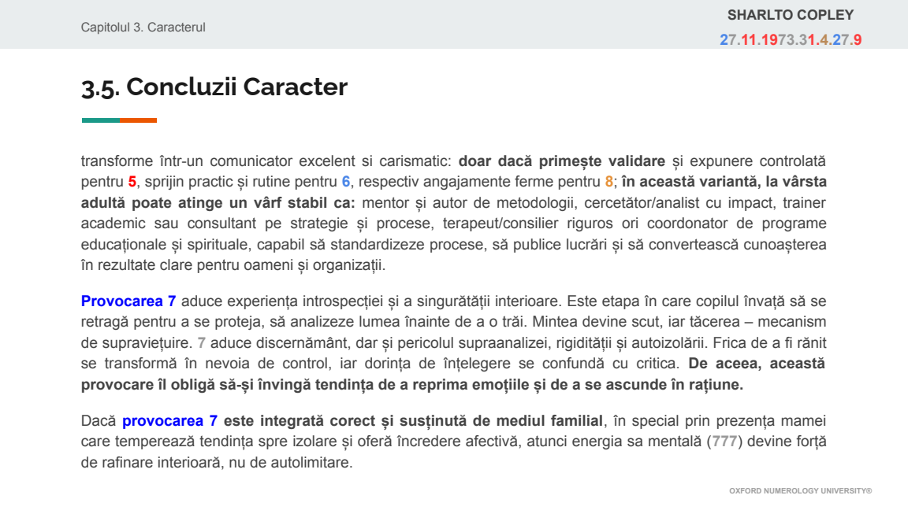

```text
Capitolul 3. Caracterul
3.5. Concluzii Caracter
transforme într-un comunicator excelent si carismatic: doar dacă primește validare și expunere controlată
pentru 5, sprijin practic și rutine pentru 6, respectiv angajamente ferme pentru 8; în această variantă, la vârsta
adultă poate atinge un vârf stabil ca: mentor și autor de metodologii, cercetător/analist cu impact, trainer
academic sau consultant pe strategie și procese, terapeut/consilier riguros ori coordonator de programe
educaționale și spirituale, capabil să standardizeze procese, să publice lucrări și să convertească cunoașterea
în rezultate clare pentru oameni și organizații.
Provocarea 7 aduce experiența introspecției și a singurătății interioare. Este etapa în care copilul învață să se
retragă pentru a se proteja, să analizeze lumea înainte de a o trăi. Mintea devine scut, iar tăcerea – mecanism
de supraviețuire. 7 aduce discernământ, dar și pericolul supraanalizei, rigidității și autoizolării. Frica de a fi rănit
se transformă în nevoia de control, iar dorința de înțelegere se confundă cu critica. De aceea, această
provocare îl obligă să-și învingă tendința de a reprima emoțiile și de a se ascunde în rațiune.
Dacă provocarea 7 este integrată corect și susținută de mediul familial, în special prin prezența mamei
care temperează tendința spre izolare și oferă încredere afectivă, atunci energia sa mentală (777) devine forță
de rafinare interioară, nu de autolimitare.
OXFORD NUMEROLOGY UNIVERSITY®
```

### Pagina 197

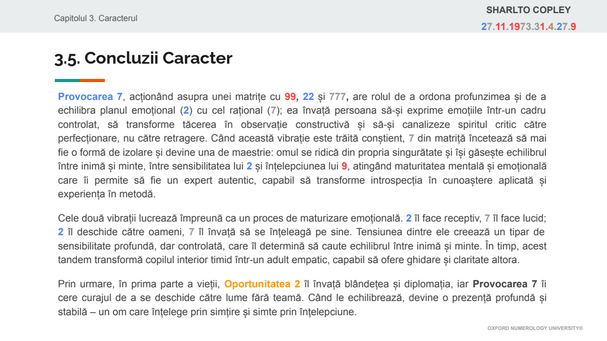

```text
Capitolul 3. Caracterul
3.5. Concluzii Caracter
Provocarea 7, acționând asupra unei matrițe cu 99, 22 și 777, are rolul de a ordona profunzimea și de a
echilibra planul emoțional (2) cu cel rațional (7); ea învață persoana să-și exprime emoțiile într-un cadru
controlat, să transforme tăcerea în observație constructivă și să-și canalizeze spiritul critic către
perfecționare, nu către retragere. Când această vibrație este trăită conștient, 7 din matriță încetează să mai
fie o formă de izolare și devine una de maestrie: omul se ridică din propria singurătate și își găsește echilibrul
între inimă și minte, între sensibilitatea lui 2 și înțelepciunea lui 9, atingând maturitatea mentală și emoțională
care îi permite să fie un expert autentic, capabil să transforme introspecția în cunoaștere aplicată și
experiența în metodă.
Cele două vibrații lucrează împreună ca un proces de maturizare emoțională. 2 îl face receptiv, 7 îl face lucid;
2 îl deschide către oameni, 7 îl învață să se înțeleagă pe sine. Tensiunea dintre ele creează un tipar de
sensibilitate profundă, dar controlată, care îl determină să caute echilibrul între inimă și minte. În timp, acest
tandem transformă copilul interior timid într-un adult empatic, capabil să ofere ghidare și claritate altora.
Prin urmare, în prima parte a vieții, Oportunitatea 2 îl învață blândețea și diplomația, iar Provocarea 7 îi
cere curajul de a se deschide către lume fără teamă. Când le echilibrează, devine o prezență profundă și
stabilă – un om care înțelege prin simțire și simte prin înțelepciune.
OXFORD NUMEROLOGY UNIVERSITY®
```

### Pagina 198

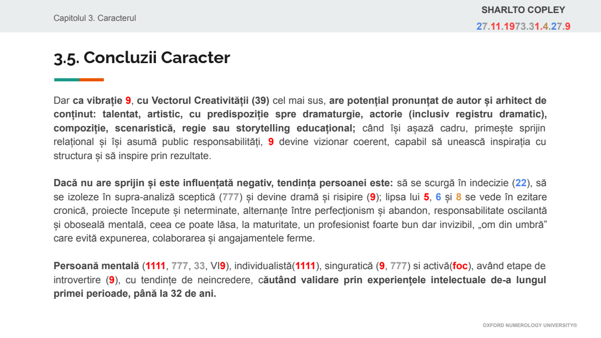

```text
Capitolul 3. Caracterul
3.5. Concluzii Caracter
Dar ca vibrație 9, cu Vectorul Creativității (39) cel mai sus, are potențial pronunțat de autor și arhitect de
conținut: talentat, artistic, cu predispoziție spre dramaturgie, actorie (inclusiv registru dramatic),
compoziție, scenaristică, regie sau storytelling educațional; când își așază cadru, primește sprijin
relațional și își asumă public responsabilități, 9 devine vizionar coerent, capabil să unească inspirația cu
structura și să inspire prin rezultate.
Dacă nu are sprijin și este influențată negativ, tendința persoanei este: să se scurgă în indecizie (22), să
se izoleze în supra-analiză sceptică (777) și devine dramă și risipire (9); lipsa lui 5, 6 și 8 se vede în ezitare
cronică, proiecte începute și neterminate, alternanțe între perfecționism și abandon, responsabilitate oscilantă
și oboseală mentală, ceea ce poate lăsa, la maturitate, un profesionist foarte bun dar invizibil, „om din umbră”
care evită expunerea, colaborarea și angajamentele ferme.
Persoană mentală (1111, 777, 33, VI9), individualistă(1111), singuratică (9, 777) si activă(foc), având etape de
introvertire (9), cu tendințe de neincredere, căutând validare prin experiențele intelectuale de-a lungul
primei perioade, până la 32 de ani.
OXFORD NUMEROLOGY UNIVERSITY®
```

### Pagina 199

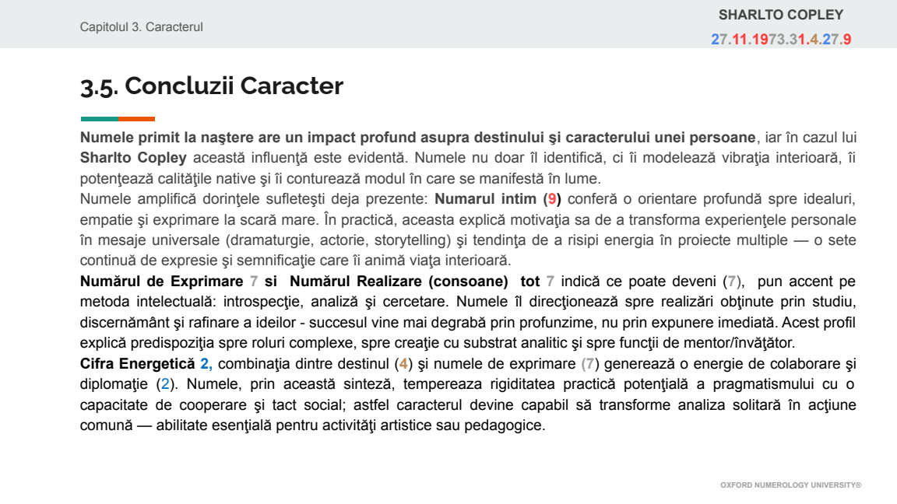

```text
Capitolul 3. Caracterul
3.5. Concluzii Caracter
Numele primit la naştere are un impact profund asupra destinului şi caracterului unei persoane, iar în cazul lui
Sharlto Copley această influenţă este evidentă. Numele nu doar îl identifică, ci îi modelează vibraţia interioară, îi
potenţează calităţile native şi îi conturează modul în care se manifestă în lume.
Numele amplifică dorinţele sufleteşti deja prezente: Numarul intim (9) conferă o orientare profundă spre idealuri,
empatie şi exprimare la scară mare. În practică, aceasta explică motivaţia sa de a transforma experienţele personale
în mesaje universale (dramaturgie, actorie, storytelling) şi tendinţa de a risipi energia în proiecte multiple — o sete
continuă de expresie şi semnificaţie care îi animă viaţa interioară.
Numărul de Exprimare 7 si Numărul Realizare (consoane) tot 7 indică ce poate deveni (7), pun accent pe
metoda intelectuală: introspecţie, analiză şi cercetare. Numele îl direcţionează spre realizări obţinute prin studiu,
discernământ şi rafinare a ideilor - succesul vine mai degrabă prin profunzime, nu prin expunere imediată. Acest profil
explică predispoziţia spre roluri complexe, spre creaţie cu substrat analitic şi spre funcţii de mentor/învăţător.
Cifra Energetică 2, combinaţia dintre destinul (4) şi numele de exprimare (7) generează o energie de colaborare şi
diplomaţie (2). Numele, prin această sinteză, tempereaza rigiditatea practică potenţială a pragmatismului cu o
capacitate de cooperare şi tact social; astfel caracterul devine capabil să transforme analiza solitară în acţiune
comună — abilitate esenţială pentru activităţi artistice sau pedagogice.
OXFORD NUMEROLOGY UNIVERSITY®
```

### Pagina 200

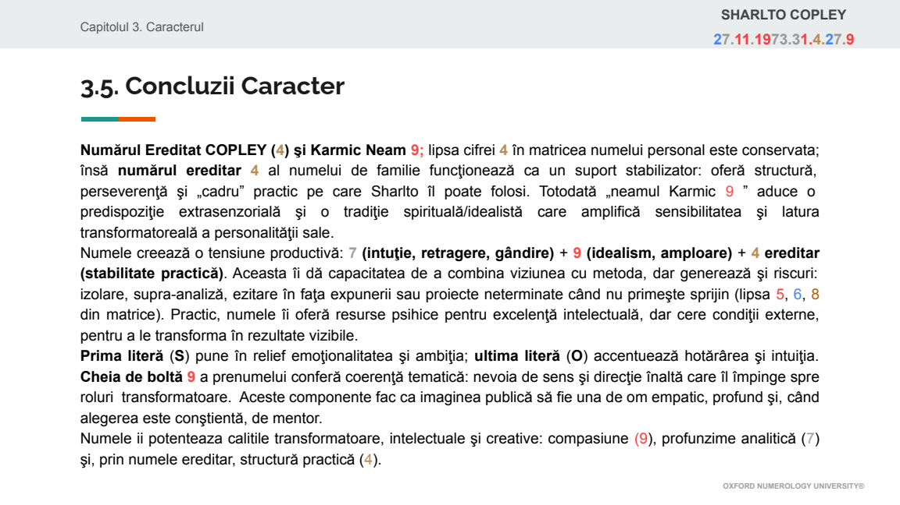

```text
Capitolul 3. Caracterul
3.5. Concluzii Caracter
Numărul Ereditat COPLEY (4) şi Karmic Neam 9; lipsa cifrei 4 în matricea numelui personal este conservata;
însă numărul ereditar 4 al numelui de familie funcţionează ca un suport stabilizator: oferă structură,
perseverenţă şi „cadru” practic pe care Sharlto îl poate folosi. Totodată „neamul Karmic 9 ” aduce o
predispoziţie extrasenzorială şi o tradiţie spirituală/idealistă care amplifică sensibilitatea şi latura
transformatoreală a personalităţii sale.
Numele creează o tensiune productivă: 7 (intuţie, retragere, gândire) + 9 (idealism, amploare) + 4 ereditar
(stabilitate practică). Aceasta îi dă capacitatea de a combina viziunea cu metoda, dar generează şi riscuri:
izolare, supra-analiză, ezitare în faţa expunerii sau proiecte neterminate când nu primeşte sprijin (lipsa 5, 6, 8
din matrice). Practic, numele îi oferă resurse psihice pentru excelenţă intelectuală, dar cere condiţii externe,
pentru a le transforma în rezultate vizibile.
Prima literă (S) pune în relief emoţionalitatea şi ambiţia; ultima literă (O) accentuează hotărârea şi intuiţia.
Cheia de boltă 9 a prenumelui conferă coerenţă tematică: nevoia de sens şi direcţie înaltă care îl împinge spre
roluri transformatoare. Aceste componente fac ca imaginea publică să fie una de om empatic, profund şi, când
alegerea este conştientă, de mentor.
Numele ii potenteaza calitile transformatoare, intelectuale şi creative: compasiune (9), profunzime analitică (7)
şi, prin numele ereditar, structură practică (4).
OXFORD NUMEROLOGY UNIVERSITY®
```

### Pagina 201

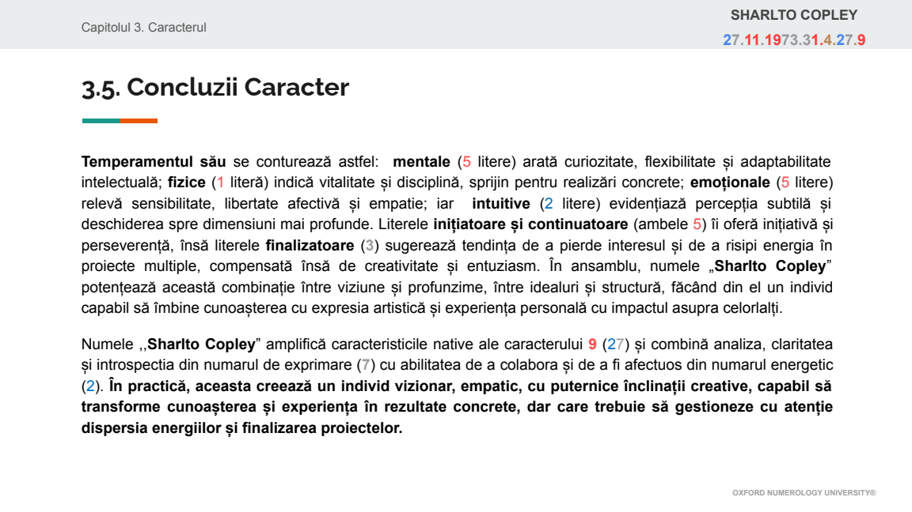

```text
Capitolul 3. Caracterul
3.5. Concluzii Caracter
Temperamentul său se conturează astfel: mentale (5 litere) arată curiozitate, flexibilitate și adaptabilitate
intelectuală; fizice (1 literă) indică vitalitate și disciplină, sprijin pentru realizări concrete; emoționale (5 litere)
relevă sensibilitate, libertate afectivă și empatie; iar intuitive (2 litere) evidențiază percepția subtilă și
deschiderea spre dimensiuni mai profunde. Literele inițiatoare și continuatoare (ambele 5) îi oferă inițiativă și
perseverență, însă literele finalizatoare (3) sugerează tendința de a pierde interesul și de a risipi energia în
proiecte multiple, compensată însă de creativitate și entuziasm. În ansamblu, numele „Sharlto Copley”
potențează această combinație între viziune și profunzime, între idealuri și structură, făcând din el un individ
capabil să îmbine cunoașterea cu expresia artistică și experiența personală cu impactul asupra celorlalți.
Numele ,,Sharlto Copley” amplifică caracteristicile native ale caracterului 9 (27) și combină analiza, claritatea
și introspectia din numarul de exprimare (7) cu abilitatea de a colabora și de a fi afectuos din numarul energetic
(2). În practică, aceasta creează un individ vizionar, empatic, cu puternice înclinații creative, capabil să
transforme cunoașterea și experiența în rezultate concrete, dar care trebuie să gestioneze cu atenție
dispersia energiilor și finalizarea proiectelor.
OXFORD NUMEROLOGY UNIVERSITY®
```

### Pagina 202

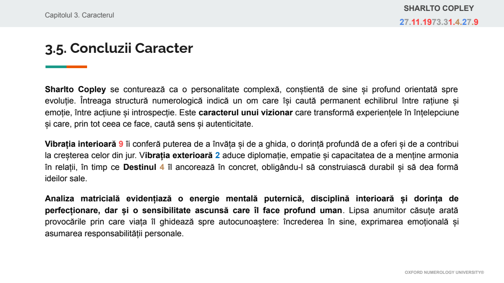

```text
Capitolul 3. Caracterul
3.5. Concluzii Caracter
Sharlto Copley se conturează ca o personalitate complexă, conștientă de sine și profund orientată spre
evoluție. Întreaga structură numerologică indică un om care își caută permanent echilibrul între rațiune și
emoție, între acțiune și introspecție. Este caracterul unui vizionar care transformă experiențele în înțelepciune
și care, prin tot ceea ce face, caută sens și autenticitate.
Vibrația interioară 9 îi conferă puterea de a învăța și de a ghida, o dorință profundă de a oferi și de a contribui
la creșterea celor din jur. Vibrația exterioară 2 aduce diplomație, empatie și capacitatea de a menține armonia
în relații, în timp ce Destinul 4 îl ancorează în concret, obligându-l să construiască durabil și să dea formă
ideilor sale.
Analiza matricială evidențiază o energie mentală puternică, disciplină interioară și dorința de
perfecționare, dar și o sensibilitate ascunsă care îl face profund uman. Lipsa anumitor căsuțe arată
provocările prin care viața îl ghidează spre autocunoaștere: încrederea în sine, exprimarea emoțională și
asumarea responsabilității personale.
OXFORD NUMEROLOGY UNIVERSITY®
```

### Pagina 203

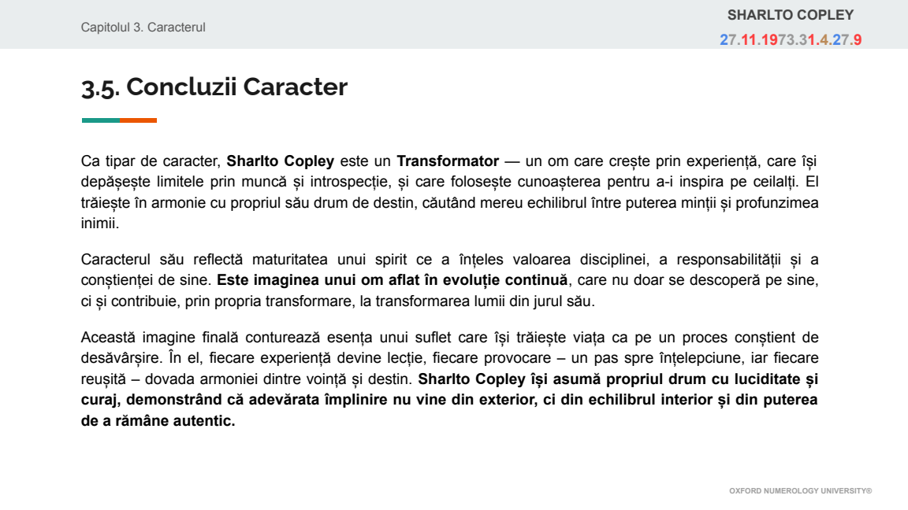

```text
Capitolul 3. Caracterul
3.5. Concluzii Caracter
Ca tipar de caracter, Sharlto Copley este un Transformator — un om care crește prin experiență, care își
depășește limitele prin muncă și introspecție, și care folosește cunoașterea pentru a-i inspira pe ceilalți. El
trăiește în armonie cu propriul său drum de destin, căutând mereu echilibrul între puterea minții și profunzimea
inimii.
Caracterul său reflectă maturitatea unui spirit ce a înțeles valoarea disciplinei, a responsabilității și a
conștienței de sine. Este imaginea unui om aflat în evoluție continuă, care nu doar se descoperă pe sine,
ci și contribuie, prin propria transformare, la transformarea lumii din jurul său.
Această imagine finală conturează esența unui suflet care își trăiește viața ca pe un proces conștient de
desăvârșire. În el, fiecare experiență devine lecție, fiecare provocare – un pas spre înțelepciune, iar fiecare
reușită – dovada armoniei dintre voință și destin. Sharlto Copley își asumă propriul drum cu luciditate și
curaj, demonstrând că adevărata împlinire nu vine din exterior, ci din echilibrul interior și din puterea
de a rămâne autentic.
OXFORD NUMEROLOGY UNIVERSITY®
```

# Capitolul 4. Transformarea

_Pagini sursa: 204-265._

## Formule si calcule extrase pentru rafinare

### ● 4.8. Ultimele două numere operaționale

- Concept analizat: verificat in VAULT/Numerologie - [[Aspecte de Indreptat]].
- Metoda de calcul: ● 4.8. Ultimele două numere operaționale: Aspecte de îndreptat
- Calcul: ● 4.8. Ultimele două numere operaționale: Aspecte de îndreptat
- Verificare: ok - concept verificat in VAULT/Numerologie; metoda trebuie rafinata din textul paginii.
- Verificare pagina: pagina 205.

### Vibrația Exterioară este reprezentată de luna de naștere - Noiembrie

- Concept analizat: verificat in VAULT/Numerologie - [[Vibratie Exterioara]].
- Metoda de calcul: Vibrația Exterioară este reprezentată de luna de naștere - Noiembrie: 2 (11)
- Calcul: Vibrația Exterioară este reprezentată de luna de naștere - Noiembrie: 2 (11)
- Verificare: ok - concept verificat in VAULT/Numerologie; metoda trebuie rafinata din textul paginii.
- Verificare pagina: pagina 208.

### Persoana analizată are vibrație interioară 9 din 27

- Concept analizat: concept lipsa in VAULT/Numerologie.
- Metoda de calcul: Persoana analizată are vibrație interioară 9 din 27: în profunzime, combină empatia și comunicarea lui 2
- Calcul: Persoana analizată are vibrație interioară 9 din 27: în profunzime, combină empatia și comunicarea lui 2
- Verificare: concept lipsa in VAULT/Numerologie.
- Verificare pagina: pagina 211.

### ZIUA + LUNA

- Concept analizat: verificat in VAULT/Numerologie - [[Vibratie Globala]].
- Metoda de calcul: ZIUA + LUNA = VIBRAȚIA GLOBALĂ
- Calcul: ZIUA + LUNA = VIBRAȚIA GLOBALĂ
- Verificare: ok - concept verificat in VAULT/Numerologie; formula de calcul este compatibila cu documentatia.
- Verificare pagina: pagina 213.

### Vibrație globală

- Concept analizat: concept lipsa in VAULT/Numerologie.
- Metoda de calcul: Vibrație globală = V interioară + V exterioară = 9 + 2 = 11= 2
- Calcul: Vibrație globală = V interioară + V exterioară = 9 + 2 = 11= 2
- Verificare: concept lipsa in VAULT/Numerologie.
- Verificare pagina: pagina 213.

### Puntea (VI - VD)

- Concept analizat: verificat in VAULT/Numerologie - [[Punti]].
- Metoda de calcul: Puntea (VI - VD) = VI - VD Puntea (VI-VD) = 9 - 4 = 5
- Calcul: Puntea (VI - VD) = VI - VD Puntea (VI-VD) = 9 - 4 = 5
- Verificare: ok - concept verificat in VAULT/Numerologie; formula de calcul este compatibila cu documentatia.
- Verificare pagina: pagina 214.

### ZIUA (Z+Z) + LUNA (L+L) + ANUL (A+A+A+A)

- Concept analizat: verificat in VAULT/Numerologie - [[Calea Destinului]].
- Metoda de calcul: ZIUA (Z+Z) + LUNA (L+L) + ANUL (A+A+A+A) = 2+7+1+1+1+9+7+3 = 31 = Calea Destinului
- Calcul: ZIUA (Z+Z) + LUNA (L+L) + ANUL (A+A+A+A) = 2+7+1+1+1+9+7+3 = 31 = Calea Destinului
- Verificare: ok - concept verificat in VAULT/Numerologie; formula de calcul este compatibila cu documentatia.
- Verificare pagina: pagina 215.

### talentelor proprii, astfel încât să ajungă la Destinul 4

- Concept analizat: verificat in VAULT/Numerologie - [[Vibratia Destinului]].
- Metoda de calcul: talentelor proprii, astfel încât să ajungă la Destinul 4: structură, metodă, disciplină și construirea de proiecte
- Calcul: talentelor proprii, astfel încât să ajungă la Destinul 4: structură, metodă, disciplină și construirea de proiecte
- Verificare: ok - concept verificat in VAULT/Numerologie; metoda trebuie rafinata din textul paginii.
- Verificare pagina: pagina 216.

### Exista 5 categorii de căi ale destinului

- Concept analizat: verificat in VAULT/Numerologie - [[Vibratia Destinului]].
- Metoda de calcul: Exista 5 categorii de căi ale destinului:
- Calcul: Exista 5 categorii de căi ale destinului:
- Verificare: ok - concept verificat in VAULT/Numerologie; metoda trebuie rafinata din textul paginii.
- Verificare pagina: pagina 218.

### cele negative; Ceea ce omul traieste

- Concept analizat: concept lipsa in VAULT/Numerologie.
- Metoda de calcul: cele negative; Ceea ce omul traieste = calea pe care o parcurge este plina de efectele cauzelor nascute
- Calcul: cele negative; Ceea ce omul traieste = calea pe care o parcurge este plina de efectele cauzelor nascute
- Verificare: concept lipsa in VAULT/Numerologie.
- Verificare pagina: pagina 219.

### Calea destinului minus 2 x prima cifră din ziua de naștere

- Concept analizat: verificat in VAULT/Numerologie - [[Calea Destinului]].
- Metoda de calcul: Calea destinului minus 2 x prima cifră din ziua de naștere: 31- 2 x 2 = 27
- Calcul: 31- 2 x 2 = 27
- Verificare: ok - concept verificat in VAULT/Numerologie; formula de calcul este compatibila cu documentatia.
- Verificare pagina: pagina 223.

### Calea destinului minus 2 x prima cifră din ziua de naștere) redusă la o singură cifră

- Concept analizat: verificat in VAULT/Numerologie - [[Calea Destinului]].
- Metoda de calcul: Calea destinului minus 2 x prima cifră din ziua de naștere) redusă la o singură cifră: 2 + 7 = 9
- Calcul: 2 + 7 = 9
- Verificare: ok - concept verificat in VAULT/Numerologie; formula de calcul este compatibila cu documentatia.
- Verificare pagina: pagina 223.

### În profunzime, aceste două vibrații se manifestă ca oglinzi

- Concept analizat: concept lipsa in VAULT/Numerologie.
- Metoda de calcul: În profunzime, aceste două vibrații se manifestă ca oglinzi: 2 îl cheamă spre lume, iar 7 îl trage în interior. Când
- Calcul: În profunzime, aceste două vibrații se manifestă ca oglinzi: 2 îl cheamă spre lume, iar 7 îl trage în interior. Când
- Verificare: concept lipsa in VAULT/Numerologie.
- Verificare pagina: pagina 224.

### superior sunt alte caracteristici la care ne verifica viața. Să învingă toate aspectele negative al lui 5

- Concept analizat: concept lipsa in VAULT/Numerologie.
- Metoda de calcul: superior sunt alte caracteristici la care ne verifica viața. Să învingă toate aspectele negative al lui 5:
- Calcul: superior sunt alte caracteristici la care ne verifica viața. Să învingă toate aspectele negative al lui 5:
- Verificare: concept lipsa in VAULT/Numerologie.
- Verificare pagina: pagina 232.

### Ciclicitatea Lecțiilor de viață

- Concept analizat: verificat in VAULT/Numerologie - [[Lectii de Viata]].
- Metoda de calcul: Ciclicitatea Lecțiilor de viață: 27 x 11 x 1973 = 585981
- Calcul: 27 x 11 x 1973 = 585981
- Verificare: ok - concept verificat in VAULT/Numerologie; formula de calcul este compatibila cu documentatia.
- Verificare pagina: pagina 234.

### ▪ Primul Pinaclu se află după formula

- Concept analizat: verificat in VAULT/Numerologie - [[Vibratia Destinului]].
- Metoda de calcul: ▪ Primul Pinaclu se află după formula: 36 minus cifra destinului 36 - 4 = 0 - 32 ani
- Calcul: 36 minus cifra destinului 36 - 4 = 0 - 32 ani
- Verificare: ok - concept verificat in VAULT/Numerologie; formula de calcul este compatibila cu documentatia.
- Verificare pagina: pagina 236.

### ▪ Al doilea Pinaclu se află adunând 9 ani, de la următorul an (+9) 33 + 9

- Concept analizat: verificat in VAULT/Numerologie - [[Pinacluri - Oportunitati si Provocari]].
- Metoda de calcul: ▪ Al doilea Pinaclu se află adunând 9 ani, de la următorul an (+9) 33 + 9 = 33 - 42 ani
- Calcul: ▪ Al doilea Pinaclu se află adunând 9 ani, de la următorul an (+9) 33 + 9 = 33 - 42 ani
- Verificare: ok - concept verificat in VAULT/Numerologie; formula de calcul este compatibila cu documentatia.
- Verificare pagina: pagina 236.

### ▪ Al treilea pinaclu se afla adunând încă 9 ani, de la următorul an (+9) 43 + 9

- Concept analizat: verificat in VAULT/Numerologie - [[Pinacluri - Oportunitati si Provocari]].
- Metoda de calcul: ▪ Al treilea pinaclu se afla adunând încă 9 ani, de la următorul an (+9) 43 + 9 = 43 - 52 ani
- Calcul: ▪ Al treilea pinaclu se afla adunând încă 9 ani, de la următorul an (+9) 43 + 9 = 43 - 52 ani
- Verificare: ok - concept verificat in VAULT/Numerologie; formula de calcul este compatibila cu documentatia.
- Verificare pagina: pagina 236.

### * 36

- Concept analizat: verificat in VAULT/Numerologie - [[Vibratia Destinului]].
- Metoda de calcul: * 36 = Numărul Omului; D = Destinul Ziua 9 Luna 2 An 2
- Calcul: * 36 = Numărul Omului; D = Destinul Ziua 9 Luna 2 An 2
- Verificare: ok - concept verificat in VAULT/Numerologie; formula de calcul este compatibila cu documentatia.
- Verificare pagina: pagina 237.

### ● Pinaclul 1

- Concept analizat: verificat in VAULT/Numerologie - [[Pinacluri - Oportunitati si Provocari]].
- Metoda de calcul: ● Pinaclul 1: 0 - 32 ani
- Calcul: ● Pinaclul 1: 0 - 32 ani
- Verificare: ok - concept verificat in VAULT/Numerologie; metoda trebuie rafinata din textul paginii.
- Verificare pagina: pagina 238.

### ● Pinaclul 2

- Concept analizat: verificat in VAULT/Numerologie - [[Pinacluri - Oportunitati si Provocari]].
- Metoda de calcul: ● Pinaclul 2: 33 - 42 ani
- Calcul: ● Pinaclul 2: 33 - 42 ani
- Verificare: ok - concept verificat in VAULT/Numerologie; metoda trebuie rafinata din textul paginii.
- Verificare pagina: pagina 238.

### ● Pinaclul 3

- Concept analizat: verificat in VAULT/Numerologie - [[Pinacluri - Oportunitati si Provocari]].
- Metoda de calcul: ● Pinaclul 3: 43 - 52 ani
- Calcul: ● Pinaclul 3: 43 - 52 ani
- Verificare: ok - concept verificat in VAULT/Numerologie; metoda trebuie rafinata din textul paginii.
- Verificare pagina: pagina 238.

### ● Pinaclul 4

- Concept analizat: verificat in VAULT/Numerologie - [[Pinacluri - Oportunitati si Provocari]].
- Metoda de calcul: ● Pinaclul 4: 53 - sfârșit
- Calcul: ● Pinaclul 4: 53 - sfârșit
- Verificare: ok - concept verificat in VAULT/Numerologie; metoda trebuie rafinata din textul paginii.
- Verificare pagina: pagina 238.

### Rezultat

- Concept analizat: verificat in VAULT/Numerologie - [[Deschidere spre Ezoterism]].
- Metoda de calcul: Rezultat: 2 Calea ezoterică 2 este cea a Terapiilor complementare.
- Calcul: Rezultat: 2 Calea ezoterică 2 este cea a Terapiilor complementare.
- Verificare: ok - concept verificat in VAULT/Numerologie; metoda trebuie rafinata din textul paginii.
- Verificare pagina: pagina 242.

### (CM x 189) - 189

- Concept analizat: verificat in VAULT/Numerologie - [[Codul Spiritului]].
- Metoda de calcul: (CM x 189) - 189 = Vârsta Spiritului la naștere
- Calcul: (CM x 189) - 189 = Vârsta Spiritului la naștere
- Verificare: ok - concept verificat in VAULT/Numerologie; formula de calcul este compatibila cu documentatia.
- Verificare pagina: pagina 245.

### Vârsta Spiritului (6 x 189) - 189

- Concept analizat: verificat in VAULT/Numerologie - [[Codul Spiritului]].
- Metoda de calcul: Vârsta Spiritului (6 x 189) - 189 = 1134 - 189 = 945 ani + 52 ani (2025) = 997 de ani
- Calcul: Vârsta Spiritului (6 x 189) - 189 = 1134 - 189 = 945 ani + 52 ani (2025) = 997 de ani
- Verificare: ok - concept verificat in VAULT/Numerologie; formula de calcul este compatibila cu documentatia.
- Verificare pagina: pagina 245.

### ZZLL x AAAA

- Concept analizat: verificat in VAULT/Numerologie - [[Soarta si Destin]].
- Metoda de calcul: ZZLL x AAAA = XXXXXXX SOARTA 2711 x 1973 = 5348803
- Calcul: ZZLL x AAAA = XXXXXXX SOARTA 2711 x 1973 = 5348803
- Verificare: ok - concept verificat in VAULT/Numerologie; formula de calcul este compatibila cu documentatia.
- Verificare pagina: pagina 247.

### Ciclicitatea de 10 sau 12 ani - Soartă și Destin

- Concept analizat: verificat in VAULT/Numerologie - [[Soarta si Destin]].
- Metoda de calcul: Ciclicitatea de 10 sau 12 ani - Soartă și Destin: Bărbat - 10 ani
- Calcul: Ciclicitatea de 10 sau 12 ani - Soartă și Destin: Bărbat - 10 ani
- Verificare: ok - concept verificat in VAULT/Numerologie; formula/metoda se verifica in [[Soarta si Destin]].
- Verificare pagina: pagina 248.

### 8 - 6 Pas 1

- Concept analizat: concept lipsa in VAULT/Numerologie.
- Metoda de calcul: 8 - 6 Pas 1: aspectele negative Relaxare: 9 → 3 → 4 → 9
- Calcul: 8 - 6 Pas 1: aspectele negative Relaxare: 9 → 3 → 4 → 9
- Verificare: concept lipsa in VAULT/Numerologie.
- Verificare pagina: pagina 252.

### 9 - 4 Pas 2

- Concept analizat: concept lipsa in VAULT/Numerologie.
- Metoda de calcul: 9 - 4 Pas 2: aspectele pozitive 9 + se transforma in 3 +:
- Calcul: 9 - 4 Pas 2: aspectele pozitive 9 + se transforma in 3 +:
- Verificare: concept lipsa in VAULT/Numerologie.
- Verificare pagina: pagina 252.

### Persoana cu Vibrația Exterioară 2 joacă rolul SAMARITEANULUI în plan social

- Concept analizat: verificat in VAULT/Numerologie - [[Vibratie Exterioara]].
- Metoda de calcul: Persoana cu Vibrația Exterioară 2 joacă rolul SAMARITEANULUI în plan social: „Sunt pentru tine”. De
- Calcul: Persoana cu Vibrația Exterioară 2 joacă rolul SAMARITEANULUI în plan social: „Sunt pentru tine”. De
- Verificare: ok - concept verificat in VAULT/Numerologie; metoda trebuie rafinata din textul paginii.
- Verificare pagina: pagina 254.

### de 2

- Concept analizat: concept lipsa in VAULT/Numerologie.
- Metoda de calcul: de 2: empatic, diplomat, partener, uneori timid, bun comunicator (poate deveni și manipulator subtil). Vibrația
- Calcul: de 2: empatic, diplomat, partener, uneori timid, bun comunicator (poate deveni și manipulator subtil). Vibrația
- Verificare: concept lipsa in VAULT/Numerologie.
- Verificare pagina: pagina 254.

### conduce – și fără 1− – fără impulsivitate, autoritarism, izolare orgolioasă. Astfel, ajunge natural la Destinul 4

- Concept analizat: verificat in VAULT/Numerologie - [[Vibratia Destinului]].
- Metoda de calcul: conduce – și fără 1− – fără impulsivitate, autoritarism, izolare orgolioasă. Astfel, ajunge natural la Destinul 4:
- Calcul: conduce – și fără 1− – fără impulsivitate, autoritarism, izolare orgolioasă. Astfel, ajunge natural la Destinul 4:
- Verificare: ok - concept verificat in VAULT/Numerologie; metoda trebuie rafinata din textul paginii.
- Verificare pagina: pagina 256.

### Calea Destinului Karmică 31 (4) indică o lecție de singurătate activă și discernământ

- Concept analizat: verificat in VAULT/Numerologie - [[Karma din Calea Destinului]].
- Metoda de calcul: Calea Destinului Karmică 31 (4) indică o lecție de singurătate activă și discernământ: perioade în care
- Calcul: Calea Destinului Karmică 31 (4) indică o lecție de singurătate activă și discernământ: perioade în care
- Verificare: ok - concept verificat in VAULT/Numerologie; metoda trebuie rafinata din textul paginii.
- Verificare pagina: pagina 256.

### vine cu memorie de

- Concept analizat: verificat in VAULT/Numerologie - [[Vibratie Interioara]].
- Metoda de calcul: vine cu memorie de: carismă și interpretare de roluri plus vibrația interioară 9 care are aceste caracteristici de
- Calcul: vine cu memorie de: carismă și interpretare de roluri plus vibrația interioară 9 care are aceste caracteristici de
- Verificare: ok - concept verificat in VAULT/Numerologie; metoda trebuie rafinata din textul paginii.
- Verificare pagina: pagina 256.

### acțiune, leadership, deschidere de drumuri, astfel încât Destinul 4 se configurează ca structură

- Concept analizat: verificat in VAULT/Numerologie - [[Vibratia Destinului]].
- Metoda de calcul: acțiune, leadership, deschidere de drumuri, astfel încât Destinul 4 se configurează ca structură:
- Calcul: acțiune, leadership, deschidere de drumuri, astfel încât Destinul 4 se configurează ca structură:
- Verificare: ok - concept verificat in VAULT/Numerologie; metoda trebuie rafinata din textul paginii.
- Verificare pagina: pagina 258.

### rezervă. 7 filtrează și rafinează 9

- Concept analizat: concept lipsa in VAULT/Numerologie.
- Metoda de calcul: rezervă. 7 filtrează și rafinează 9: îi taie excesul de patos, îi ordonează vibrația, îi cere metodă, îl protejează de
- Calcul: rezervă. 7 filtrează și rafinează 9: îi taie excesul de patos, îi ordonează vibrația, îi cere metodă, îl protejează de
- Verificare: concept lipsa in VAULT/Numerologie.
- Verificare pagina: pagina 261.

### Vibrația globală (9 + 2 = 11 → 2) arată tipul de presiuni pe care viața i le așază pe umeri

- Concept analizat: verificat in VAULT/Numerologie - [[Vibratie Globala]].
- Metoda de calcul: Vibrația globală (9 + 2 = 11 → 2) arată tipul de presiuni pe care viața i le așază pe umeri: parteneriate, alianțe,
- Calcul: parteneriate, alianțe,
- Verificare: ok - concept verificat in VAULT/Numerologie; formula de calcul este compatibila cu documentatia.
- Verificare pagina: pagina 262.

### Între VI 9 și Destin 4 rezultă Puntea 5 – lecția lui „altfel”

- Concept analizat: verificat in VAULT/Numerologie - [[Punti]].
- Metoda de calcul: Între VI 9 și Destin 4 rezultă Puntea 5 – lecția lui „altfel”: mobilitate, curaj, scenă, a ieși din tipar. Ca 9 să
- Calcul: Între VI 9 și Destin 4 rezultă Puntea 5 – lecția lui „altfel”: mobilitate, curaj, scenă, a ieși din tipar. Ca 9 să
- Verificare: ok - concept verificat in VAULT/Numerologie; metoda trebuie rafinata din textul paginii.
- Verificare pagina: pagina 262.

### prindă oportunitățile, să îndrăznească să lanseze. Aici se conectează și Calea destinului 31

- Concept analizat: verificat in VAULT/Numerologie - [[Calea Destinului]].
- Metoda de calcul: prindă oportunitățile, să îndrăznească să lanseze. Aici se conectează și Calea destinului 31: CE = 3 (mesaj,
- Calcul: CE = 3 (mesaj,
- Verificare: ok - concept verificat in VAULT/Numerologie; formula de calcul este compatibila cu documentatia.
- Verificare pagina: pagina 262.

### rânduială; dar etapele îi cer să urce peste linie când 5 devine vânt de schimbare (0–10 ani

- Concept analizat: concept lipsa in VAULT/Numerologie.
- Metoda de calcul: rânduială; dar etapele îi cer să urce peste linie când 5 devine vânt de schimbare (0–10 ani: curaj, explorare),
- Calcul: rânduială; dar etapele îi cer să urce peste linie când 5 devine vânt de schimbare (0–10 ani: curaj, explorare),
- Verificare: concept lipsa in VAULT/Numerologie.
- Verificare pagina: pagina 263.

### Scara bunăstării îl așază pe o coloană clară

- Concept analizat: verificat in VAULT/Numerologie - [[Scara Bunastarii]].
- Metoda de calcul: Scara bunăstării îl așază pe o coloană clară: la bază are căsuțe conservate pe 5-6-8, deci învață încrederea,
- Calcul: Scara bunăstării îl așază pe o coloană clară: la bază are căsuțe conservate pe 5-6-8, deci învață încrederea,
- Verificare: ok - concept verificat in VAULT/Numerologie; metoda trebuie rafinata din textul paginii.
- Verificare pagina: pagina 263.

### Aici îl ajută lecțiile de viață ciclice

- Concept analizat: verificat in VAULT/Numerologie - [[Lectii de Viata]].
- Metoda de calcul: Aici îl ajută lecțiile de viață ciclice: 5 (altfel, mobilitate, strălucire fără autodistrugere), 8 (putere și
- Calcul: Aici îl ajută lecțiile de viață ciclice: 5 (altfel, mobilitate, strălucire fără autodistrugere), 8 (putere și
- Verificare: ok - concept verificat in VAULT/Numerologie; metoda trebuie rafinata din textul paginii.
- Verificare pagina: pagina 264.

### destinului, 4 destin – vedem transformarea firească a lui Sharlto Copley

- Concept analizat: verificat in VAULT/Numerologie - [[Vibratia Destinului]].
- Metoda de calcul: destinului, 4 destin – vedem transformarea firească a lui Sharlto Copley: dintr-un 9 idealist, predispus la solitudine
- Calcul: destinului, 4 destin – vedem transformarea firească a lui Sharlto Copley: dintr-un 9 idealist, predispus la solitudine
- Verificare: ok - concept verificat in VAULT/Numerologie; metoda trebuie rafinata din textul paginii.
- Verificare pagina: pagina 265.

## Pagini si text sursa

### Pagina 204

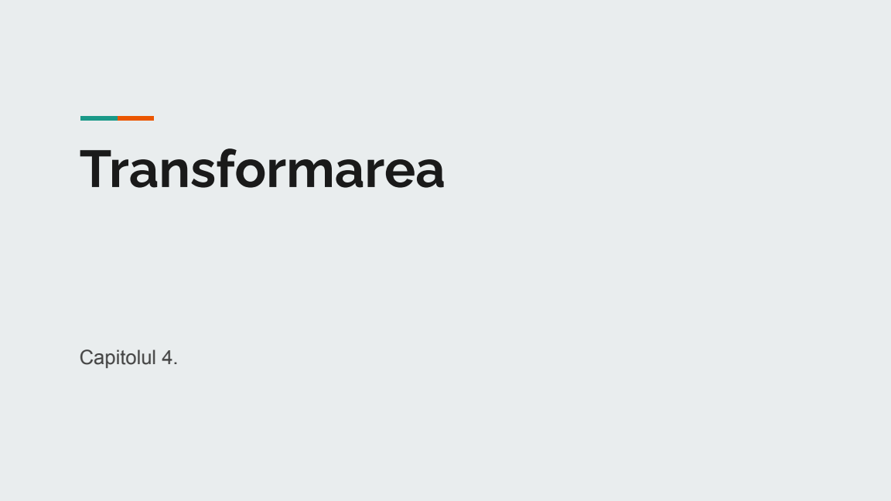

```text
Transformarea
```

### Pagina 205

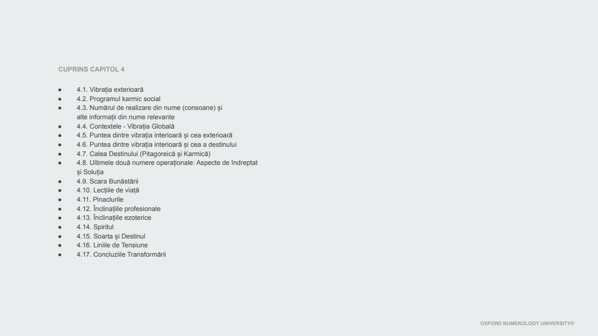

```text
CUPRINS CAPITOL 4
● 4.1. Vibrația exterioară
● 4.2. Programul karmic social
● 4.3. Numărul de realizare din nume (consoane) și
alte informații din nume relevante
● 4.4. Contextele - Vibrația Globală
● 4.5. Puntea dintre vibrația interioară și cea exterioară
● 4.6. Puntea dintre vibrația interioară și cea a destinului
● 4.7. Calea Destinului (Pitagoreică și Karmică)
● 4.8. Ultimele două numere operaționale: Aspecte de îndreptat
și Soluția
● 4.9. Scara Bunăstării
● 4.10. Lecțiile de viață
● 4.11. Pinaclurile
● 4.12. Înclinațiile profesionale
● 4.13. Înclinațiile ezoterice
● 4.14. Spiritul
● 4.15. Soarta și Destinul
● 4.16. Liniile de Tensiune
● 4.17. Concluziile Transformării
OXFORD NUMEROLOGY UNIVERSITY®
---
```

### Pagina 206

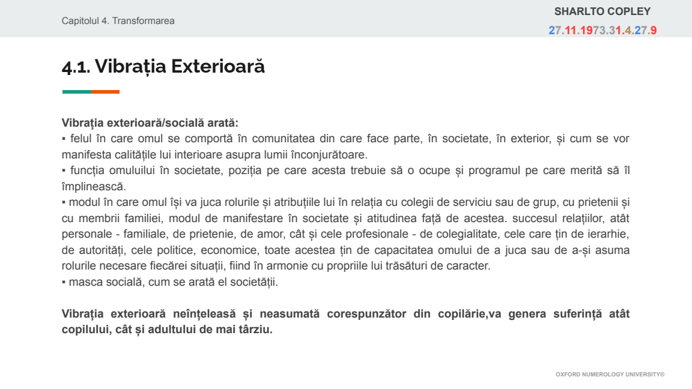

```text
Capitolul 4. Transformarea
4.1. Vibrația Exterioară
Vibrația exterioară/socială arată:
▪ felul în care omul se comportă în comunitatea din care face parte, în societate, în exterior, și cum se vor
manifesta calitățile lui interioare asupra lumii înconjurătoare.
▪ funcția omuluilui în societate, poziția pe care acesta trebuie să o ocupe și programul pe care merită să îl
împlinească.
▪ modul în care omul își va juca rolurile și atribuțiile lui în relația cu colegii de serviciu sau de grup, cu prietenii și
cu membrii familiei, modul de manifestare în societate și atitudinea față de acestea. succesul relațiilor, atât
personale - familiale, de prietenie, de amor, cât și cele profesionale - de colegialitate, cele care țin de ierarhie,
de autorități, cele politice, economice, toate acestea țin de capacitatea omului de a juca sau de a-și asuma
rolurile necesare fiecărei situații, fiind în armonie cu propriile lui trăsături de caracter.
▪ masca socială, cum se arată el societății.
Vibrația exterioară neînțeleasă și neasumată corespunzător din copilărie,va genera suferință atât
copilului, cât și adultului de mai târziu.
OXFORD NUMEROLOGY UNIVERSITY®
```

### Pagina 207

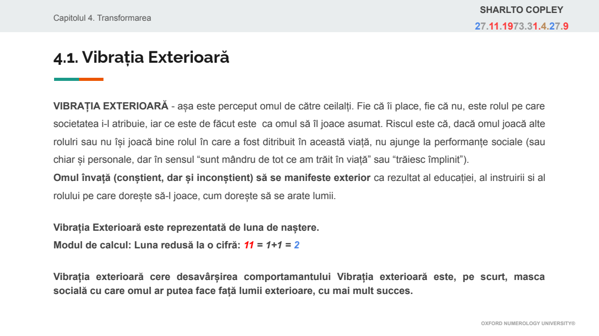

```text
Capitolul 4. Transformarea
4.1. Vibrația Exterioară
VIBRAȚIA EXTERIOARĂ - așa este perceput omul de către ceilalți. Fie că îi place, fie că nu, este rolul pe care
societatea i-l atribuie, iar ce este de făcut este ca omul să îl joace asumat. Riscul este că, dacă omul joacă alte
rolulri sau nu își joacă bine rolul în care a fost ditribuit în această viață, nu ajunge la performanțe sociale (sau
chiar și personale, dar în sensul “sunt mândru de tot ce am trăit în viață” sau “trăiesc împlinit”).
Omul învață (conștient, dar și inconștient) să se manifeste exterior ca rezultat al educației, al instruirii si al
rolului pe care dorește să-l joace, cum dorește să se arate lumii.
Vibrația Exterioară este reprezentată de luna de naștere.
Modul de calcul: Luna redusă la o cifră: 11 = 1+1 = 2
Vibrația exterioară cere desavârșirea comportamantului Vibrația exterioară este, pe scurt, masca
socială cu care omul ar putea face față lumii exterioare, cu mai mult succes.
OXFORD NUMEROLOGY UNIVERSITY®
```

### Pagina 208

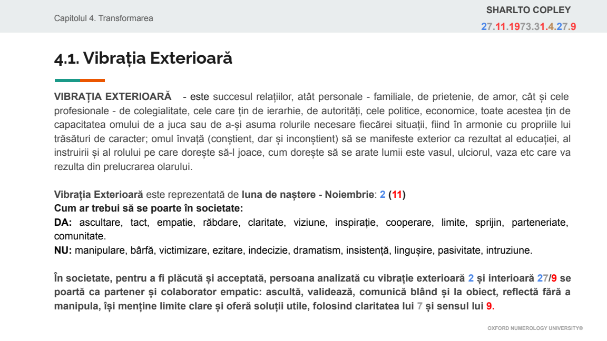

```text
Capitolul 4. Transformarea
4.1. Vibrația Exterioară
VIBRAȚIA EXTERIOARĂ - este succesul relațiilor, atât personale - familiale, de prietenie, de amor, cât și cele
profesionale - de colegialitate, cele care țin de ierarhie, de autorități, cele politice, economice, toate acestea țin de
capacitatea omului de a juca sau de a-și asuma rolurile necesare fiecărei situații, fiind în armonie cu propriile lui
trăsături de caracter; omul învață (conștient, dar și inconștient) să se manifeste exterior ca rezultat al educației, al
instruirii și al rolului pe care dorește să-l joace, cum dorește să se arate lumii este vasul, ulciorul, vaza etc care va
rezulta din prelucrarea olarului.
Vibrația Exterioară este reprezentată de luna de naștere - Noiembrie: 2 (11)
Cum ar trebui să se poarte în societate:
DA: ascultare, tact, empatie, răbdare, claritate, viziune, inspirație, cooperare, limite, sprijin, parteneriate,
comunitate.
NU: manipulare, bârfă, victimizare, ezitare, indecizie, dramatism, insistență, lingușire, pasivitate, intruziune.
În societate, pentru a fi plăcută și acceptată, persoana analizată cu vibrație exterioară 2 și interioară 27/9 se
poartă ca partener și colaborator empatic: ascultă, validează, comunică blând și la obiect, reflectă fără a
manipula, își menține limite clare și oferă soluții utile, folosind claritatea lui 7 și sensul lui 9.
OXFORD NUMEROLOGY UNIVERSITY®
```

### Pagina 209

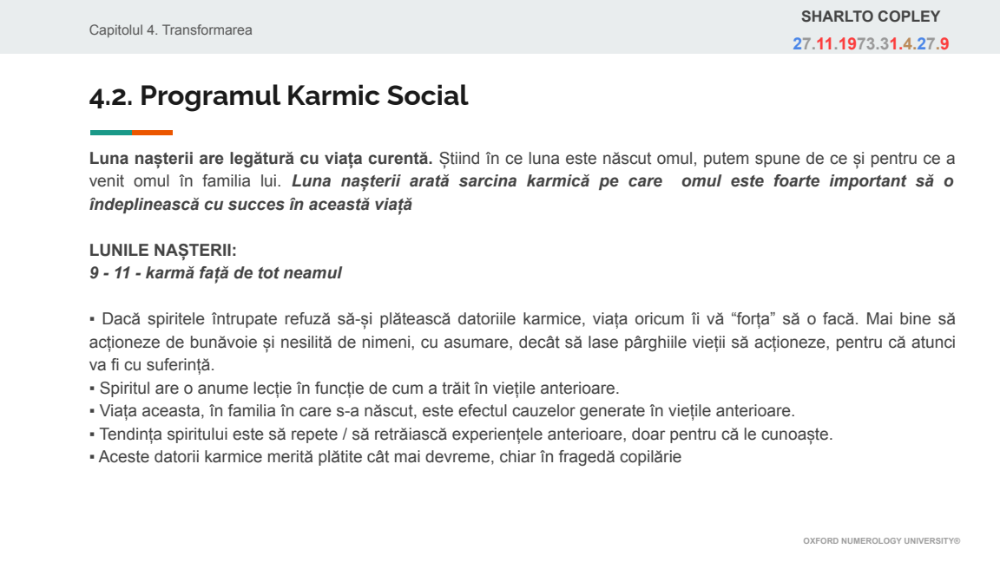

```text
Capitolul 4. Transformarea
4.2. Programul Karmic Social
Luna nașterii are legătură cu viața curentă. Știind în ce luna este născut omul, putem spune de ce și pentru ce a
venit omul în familia lui. Luna nașterii arată sarcina karmică pe care omul este foarte important să o
îndeplinească cu succes în această viață
LUNILE NAȘTERII:
9 - 11 - karmă față de tot neamul
▪ Dacă spiritele întrupate refuză să-și plătească datoriile karmice, viața oricum îi vă “forța” să o facă. Mai bine să
acționeze de bunăvoie și nesilită de nimeni, cu asumare, decât să lase pârghiile vieții să acționeze, pentru că atunci
va fi cu suferință.
▪ Spiritul are o anume lecție în funcție de cum a trăit în viețile anterioare.
▪ Viața aceasta, în familia în care s-a născut, este efectul cauzelor generate în viețile anterioare.
▪ Tendința spiritului este să repete / să retrăiască experiențele anterioare, doar pentru că le cunoaște.
▪ Aceste datorii karmice merită plătite cât mai devreme, chiar în fragedă copilărie
OXFORD NUMEROLOGY UNIVERSITY®
```

### Pagina 210

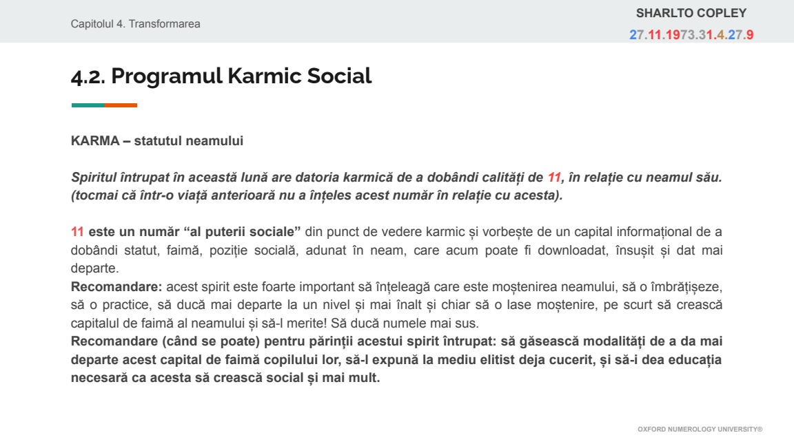

```text
Capitolul 4. Transformarea
4.2. Programul Karmic Social
KARMA – statutul neamului
Spiritul întrupat în această lună are datoria karmică de a dobândi calități de 11, în relație cu neamul său.
(tocmai că într-o viață anterioară nu a înțeles acest număr în relație cu acesta).
11 este un număr “al puterii sociale” din punct de vedere karmic și vorbește de un capital informațional de a
dobândi statut, faimă, poziție socială, adunat în neam, care acum poate fi downloadat, însușit și dat mai
departe.
Recomandare: acest spirit este foarte important să înțeleagă care este moștenirea neamului, să o îmbrățișeze,
să o practice, să ducă mai departe la un nivel și mai înalt și chiar să o lase moștenire, pe scurt să crească
capitalul de faimă al neamului și să-l merite! Să ducă numele mai sus.
Recomandare (când se poate) pentru părinții acestui spirit întrupat: să găsească modalități de a da mai
departe acest capital de faimă copilului lor, să-l expună la mediu elitist deja cucerit, și să-i dea educația
necesară ca acesta să crească social și mai mult.
OXFORD NUMEROLOGY UNIVERSITY®
```

### Pagina 211

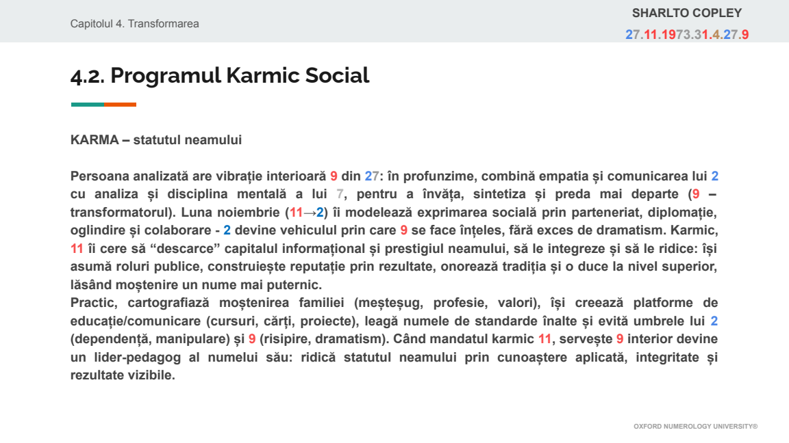

```text
Capitolul 4. Transformarea
4.2. Programul Karmic Social
KARMA – statutul neamului
Persoana analizată are vibrație interioară 9 din 27: în profunzime, combină empatia și comunicarea lui 2
cu analiza și disciplina mentală a lui 7, pentru a învăța, sintetiza și preda mai departe (9 –
transformatorul). Luna noiembrie (11→2) îi modelează exprimarea socială prin parteneriat, diplomație,
oglindire și colaborare - 2 devine vehiculul prin care 9 se face înțeles, fără exces de dramatism. Karmic,
11 îi cere să “descarce” capitalul informațional și prestigiul neamului, să le integreze și să le ridice: își
asumă roluri publice, construiește reputație prin rezultate, onorează tradiția și o duce la nivel superior,
lăsând moștenire un nume mai puternic.
Practic, cartografiază moștenirea familiei (meșteșug, profesie, valori), își creează platforme de
educație/comunicare (cursuri, cărți, proiecte), leagă numele de standarde înalte și evită umbrele lui 2
(dependență, manipulare) și 9 (risipire, dramatism). Când mandatul karmic 11, servește 9 interior devine
un lider-pedagog al numelui său: ridică statutul neamului prin cunoaștere aplicată, integritate și
rezultate vizibile.
OXFORD NUMEROLOGY UNIVERSITY®
```

### Pagina 212

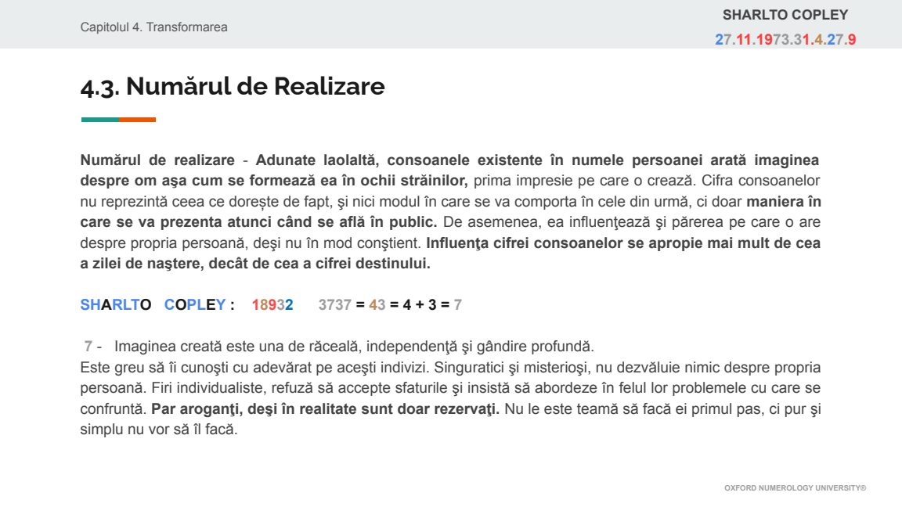

```text
Capitolul 4. Transformarea
4.3. Numărul de Realizare
Numărul de realizare - Adunate laolaltă, consoanele existente în numele persoanei arată imaginea
despre om aşa cum se formează ea în ochii străinilor, prima impresie pe care o crează. Cifra consoanelor
nu reprezintă ceea ce dorește de fapt, şi nici modul în care se va comporta în cele din urmă, ci doar maniera în
care se va prezenta atunci când se află în public. De asemenea, ea influenţează şi părerea pe care o are
despre propria persoană, deşi nu în mod conştient. Influenţa cifrei consoanelor se apropie mai mult de cea
a zilei de naştere, decât de cea a cifrei destinului.
7 - Imaginea creată este una de răceală, independenţă şi gândire profundă.
Este greu să îi cunoşti cu adevărat pe aceşti indivizi. Singuratici şi misterioşi, nu dezvăluie nimic despre propria
persoană. Firi individualiste, refuză să accepte sfaturile şi insistă să abordeze în felul lor problemele cu care se
confruntă. Par aroganţi, deşi în realitate sunt doar rezervaţi. Nu le este teamă să facă ei primul pas, ci pur şi
simplu nu vor să îl facă.
OXFORD NUMEROLOGY UNIVERSITY®
```

### Pagina 213

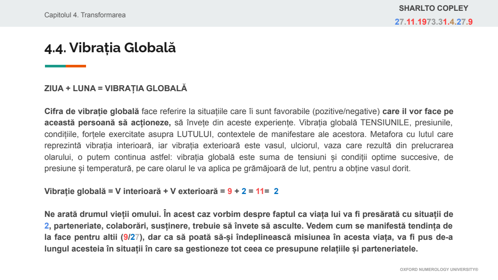

```text
Capitolul 4. Transformarea
4.4. Vibrația Globală
ZIUA + LUNA = VIBRAȚIA GLOBALĂ
Cifra de vibrație globală face referire la situațiile care îi sunt favorabile (pozitive/negative) care il vor face pe
această persoană să acționeze, să învețe din aceste experiențe. Vibrația globală TENSIUNILE, presiunile,
condițiile, forțele exercitate asupra LUTULUI, contextele de manifestare ale acestora. Metafora cu lutul care
reprezintă vibrația interioară, iar vibrația exterioară este vasul, ulciorul, vaza care rezultă din prelucrarea
olarului, o putem continua astfel: vibrația globală este suma de tensiuni și condiții optime succesive, de
presiune și temperatură, pe care olarul le va aplica pe grămăjoară de lut, pentru a obține vasul dorit.
Vibrație globală = V interioară + V exterioară = 9 + 2 = 11= 2
Ne arată drumul vieții omului. În acest caz vorbim despre faptul ca viața lui va fi presărată cu situații de
2, parteneriate, colaborări, susținere, trebuie să învete să asculte. Vedem cum se manifestă tendința de
la face pentru altii (9/27), dar ca să poată să-și îndeplinească misiunea în acesta viața, va fi pus de-a
lungul acesteia în situații în care sa gestioneze tot ceea ce presupune relațiile și parteneriatele.
OXFORD NUMEROLOGY UNIVERSITY®
```

### Pagina 214

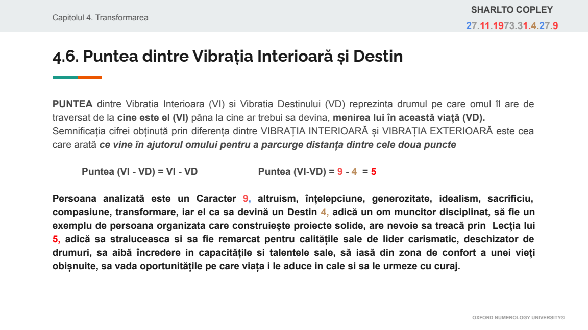

```text
Capitolul 4. Transformarea
4.6. Puntea dintre Vibrația Interioară și Destin
PUNTEA dintre Vibratia Interioara (VI) si Vibratia Destinului (VD) reprezinta drumul pe care omul îl are de
traversat de la cine este el (VI) pâna la cine ar trebui sa devina, menirea lui în această viață (VD).
Semnificația cifrei obținută prin diferența dintre VIBRAȚIA INTERIOARĂ și VIBRAȚIA EXTERIOARĂ este cea
care arată ce vine în ajutorul omului pentru a parcurge distanța dintre cele doua puncte
Puntea (VI - VD) = VI - VD Puntea (VI-VD) = 9 - 4 = 5
Persoana analizată este un Caracter 9, altruism, înțelepciune, generozitate, idealism, sacrificiu,
compasiune, transformare, iar el ca sa devină un Destin 4, adică un om muncitor disciplinat, să fie un
exemplu de persoana organizata care construiește proiecte solide, are nevoie sa treacă prin Lecția lui
5, adică sa straluceasca si sa fie remarcat pentru calitățile sale de lider carismatic, deschizator de
drumuri, sa aibă încredere in capacitățile si talentele sale, să iasă din zona de confort a unei vieți
obișnuite, sa vada oportunitățile pe care viața i le aduce in cale si sa le urmeze cu curaj.
OXFORD NUMEROLOGY UNIVERSITY®
```

### Pagina 215

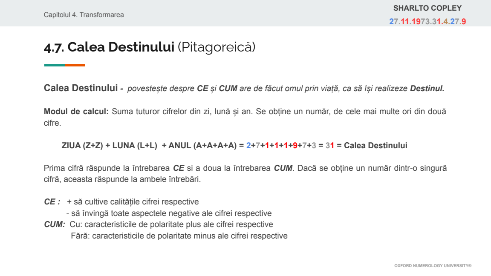

```text
Capitolul 4. Transformarea
4.7. Calea Destinului (Pitagoreică)
Calea Destinului - povestește despre CE și CUM are de făcut omul prin viață, ca să își realizeze Destinul.
Modul de calcul: Suma tuturor cifrelor din zi, lună și an. Se obține un număr, de cele mai multe ori din două
cifre.
ZIUA (Z+Z) + LUNA (L+L) + ANUL (A+A+A+A) = 2+7+1+1+1+9+7+3 = 31 = Calea Destinului
Prima cifră răspunde la întrebarea CE si a doua la întrebarea CUM. Dacă se obține un număr dintr-o singură
cifră, aceasta răspunde la ambele întrebări.
CE : + să cultive calitățile cifrei respective
- să învingă toate aspectele negative ale cifrei respective
CUM: Cu: caracteristicile de polaritate plus ale cifrei respective
Fără: caracteristicile de polaritate minus ale cifrei respective
OXFORD NUMEROLOGY UNIVERSITY®
```

### Pagina 216

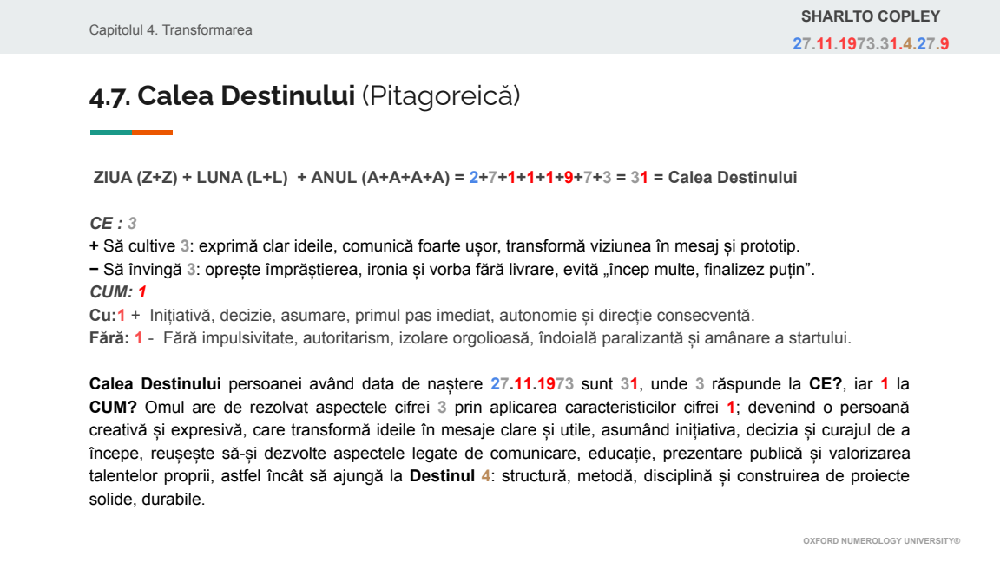

```text
Capitolul 4. Transformarea
4.7. Calea Destinului (Pitagoreică)
ZIUA (Z+Z) + LUNA (L+L) + ANUL (A+A+A+A) = 2+7+1+1+1+9+7+3 = 31 = Calea Destinului
CE : 3
+ Să cultive 3: exprimă clar ideile, comunică foarte ușor, transformă viziunea în mesaj și prototip.
− Să învingă 3: oprește împrăștierea, ironia și vorba fără livrare, evită „încep multe, finalizez puțin”.
CUM: 1
Cu:1 + Inițiativă, decizie, asumare, primul pas imediat, autonomie și direcție consecventă.
Fără: 1 - Fără impulsivitate, autoritarism, izolare orgolioasă, îndoială paralizantă și amânare a startului.
Calea Destinului persoanei având data de naștere 27.11.1973 sunt 31, unde 3 răspunde la CE?, iar 1 la
CUM? Omul are de rezolvat aspectele cifrei 3 prin aplicarea caracteristicilor cifrei 1; devenind o persoană
creativă și expresivă, care transformă ideile în mesaje clare și utile, asumând inițiativa, decizia și curajul de a
începe, reușește să-și dezVAULTe aspectele legate de comunicare, educație, prezentare publică și valorizarea
talentelor proprii, astfel încât să ajungă la Destinul 4: structură, metodă, disciplină și construirea de proiecte
solide, durabile.
OXFORD NUMEROLOGY UNIVERSITY®
```

### Pagina 217

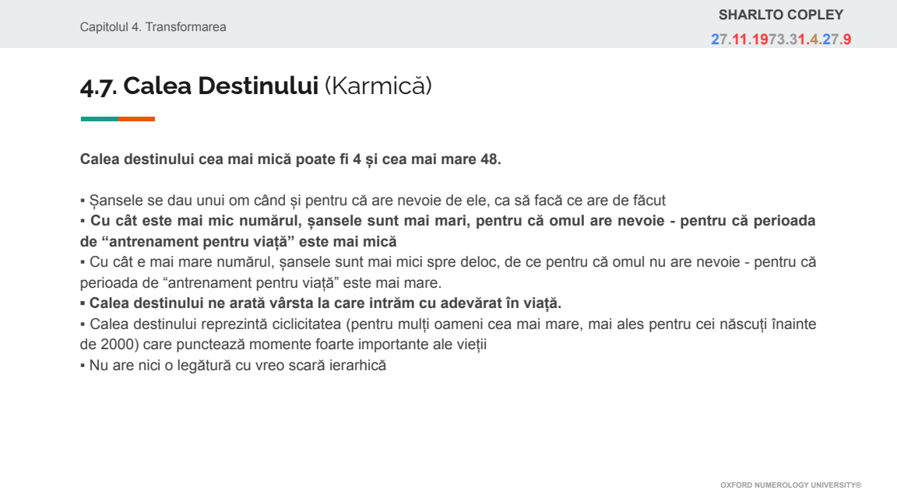

```text
Capitolul 4. Transformarea
4.7. Calea Destinului (Karmică)
Calea destinului cea mai mică poate fi 4 și cea mai mare 48.
▪ Șansele se dau unui om când și pentru că are nevoie de ele, ca să facă ce are de făcut
▪ Cu cât este mai mic numărul, șansele sunt mai mari, pentru că omul are nevoie - pentru că perioada
de “antrenament pentru viață” este mai mică
▪ Cu cât e mai mare numărul, șansele sunt mai mici spre deloc, de ce pentru că omul nu are nevoie - pentru că
perioada de “antrenament pentru viață” este mai mare.
▪ Calea destinului ne arată vârsta la care intrăm cu adevărat în viață.
▪ Calea destinului reprezintă ciclicitatea (pentru mulți oameni cea mai mare, mai ales pentru cei născuți înainte
de 2000) care punctează momente foarte importante ale vieții
▪ Nu are nici o legătură cu vreo scară ierarhică
OXFORD NUMEROLOGY UNIVERSITY®
```

### Pagina 218

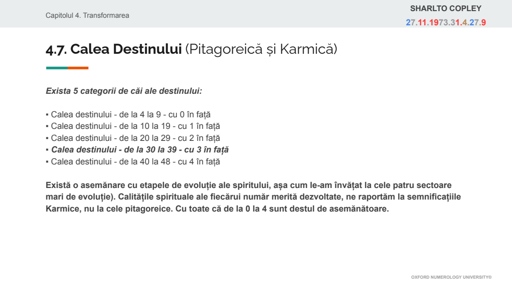

```text
Capitolul 4. Transformarea
4.7. Calea Destinului (Pitagoreică și Karmică)
Exista 5 categorii de căi ale destinului:
▪ Calea destinului - de la 4 la 9 - cu 0 în față
▪ Calea destinului - de la 10 la 19 - cu 1 în față
▪ Calea destinului - de la 20 la 29 - cu 2 în față
▪ Calea destinului - de la 30 la 39 - cu 3 în față
▪ Calea destinului - de la 40 la 48 - cu 4 în față
Există o asemănare cu etapele de evoluție ale spiritului, așa cum le-am învățat la cele patru sectoare
mari de evoluție). Calitățile spirituale ale fiecărui număr merită dezVAULTate, ne raportăm la semnificațiile
Karmice, nu la cele pitagoreice. Cu toate că de la 0 la 4 sunt destul de asemănătoare.
OXFORD NUMEROLOGY UNIVERSITY®
```

### Pagina 219

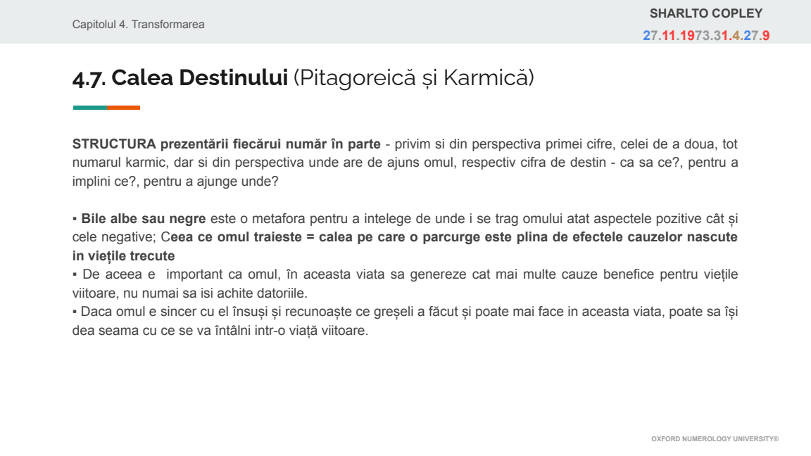

```text
Capitolul 4. Transformarea
4.7. Calea Destinului (Pitagoreică și Karmică)
STRUCTURA prezentării fiecărui număr în parte - privim si din perspectiva primei cifre, celei de a doua, tot
numarul karmic, dar si din perspectiva unde are de ajuns omul, respectiv cifra de destin - ca sa ce?, pentru a
implini ce?, pentru a ajunge unde?
▪ Bile albe sau negre este o metafora pentru a intelege de unde i se trag omului atat aspectele pozitive cât și
cele negative; Ceea ce omul traieste = calea pe care o parcurge este plina de efectele cauzelor nascute
in viețile trecute
▪ De aceea e important ca omul, în aceasta viata sa genereze cat mai multe cauze benefice pentru viețile
viitoare, nu numai sa isi achite datoriile.
▪ Daca omul e sincer cu el însuși și recunoaște ce greșeli a făcut și poate mai face in aceasta viata, poate sa își
dea seama cu ce se va întâlni intr-o viață viitoare.
OXFORD NUMEROLOGY UNIVERSITY®
```

### Pagina 220

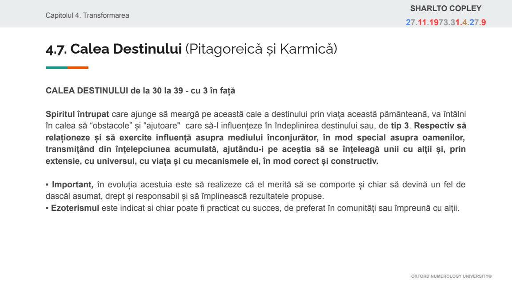

```text
Capitolul 4. Transformarea
4.7. Calea Destinului (Pitagoreică și Karmică)
CALEA DESTINULUI de la 30 la 39 - cu 3 în față
Spiritul întrupat care ajunge să meargă pe această cale a destinului prin viața această pământeană, va întâlni
în calea să “obstacole” și “ajutoare" care să-l influențeze în îndeplinirea destinului sau, de tip 3. Respectiv să
relaționeze și să exercite influență asupra mediului înconjurător, în mod special asupra oamenilor,
transmițând din înțelepciunea acumulată, ajutându-i pe aceștia să se înțeleagă unii cu alții și, prin
extensie, cu universul, cu viața și cu mecanismele ei, în mod corect și constructiv.
▪ Important, în evoluția acestuia este să realizeze că el merită să se comporte și chiar să devină un fel de
dascăl asumat, drept și responsabil și să împlinească rezultatele propuse.
▪ Ezoterismul este indicat si chiar poate fi practicat cu succes, de preferat în comunități sau împreună cu alții.
OXFORD NUMEROLOGY UNIVERSITY®
```

### Pagina 221

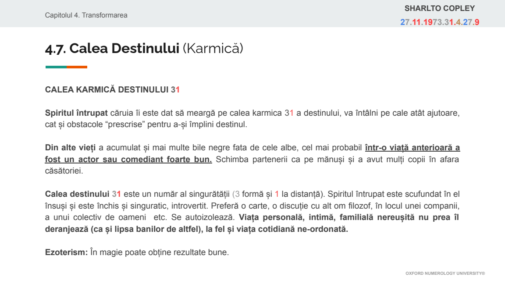

```text
Capitolul 4. Transformarea
4.7. Calea Destinului (Karmică)
CALEA KARMICĂ DESTINULUI 31
Spiritul întrupat căruia îi este dat să meargă pe calea karmica 31 a destinului, va întâlni pe cale atât ajutoare,
cat și obstacole “prescrise” pentru a-și împlini destinul.
Din alte vieți a acumulat și mai multe bile negre fata de cele albe, cel mai probabil într-o viață anterioară a
fost un actor sau comediant foarte bun. Schimba partenerii ca pe mănuși și a avut mulți copii în afara
căsătoriei.
Calea destinului 31 este un număr al singurătății (3 formă și 1 la distanță). Spiritul întrupat este scufundat în el
însuși și este închis și singuratic, introvertit. Preferă o carte, o discuție cu alt om filozof, în locul unei companii,
a unui colectiv de oameni etc. Se autoizolează. Viața personală, intimă, familială nereușită nu prea îl
deranjează (ca și lipsa banilor de altfel), la fel și viața cotidiană ne-ordonată.
Ezoterism: În magie poate obține rezultate bune.
OXFORD NUMEROLOGY UNIVERSITY®
```

### Pagina 222

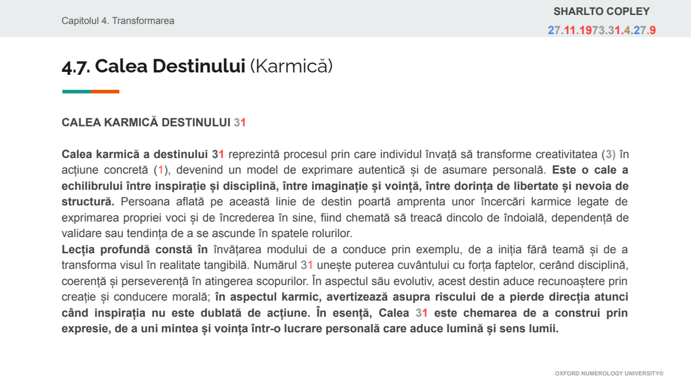

```text
Capitolul 4. Transformarea
4.7. Calea Destinului (Karmică)
CALEA KARMICĂ DESTINULUI 31
Calea karmică a destinului 31 reprezintă procesul prin care individul învață să transforme creativitatea (3) în
acțiune concretă (1), devenind un model de exprimare autentică și de asumare personală. Este o cale a
echilibrului între inspirație și disciplină, între imaginație și voință, între dorința de libertate și nevoia de
structură. Persoana aflată pe această linie de destin poartă amprenta unor încercări karmice legate de
exprimarea propriei voci și de încrederea în sine, fiind chemată să treacă dincolo de îndoială, dependență de
validare sau tendința de a se ascunde în spatele rolurilor.
Lecția profundă constă în învățarea modului de a conduce prin exemplu, de a iniția fără teamă și de a
transforma visul în realitate tangibilă. Numărul 31 unește puterea cuvântului cu forța faptelor, cerând disciplină,
coerență și perseverență în atingerea scopurilor. În aspectul său evolutiv, acest destin aduce recunoaștere prin
creație și conducere morală; în aspectul karmic, avertizează asupra riscului de a pierde direcția atunci
când inspirația nu este dublată de acțiune. În esență, Calea 31 este chemarea de a construi prin
expresie, de a uni mintea și voința într-o lucrare personală care aduce lumină și sens lumii.
OXFORD NUMEROLOGY UNIVERSITY®
```

### Pagina 223

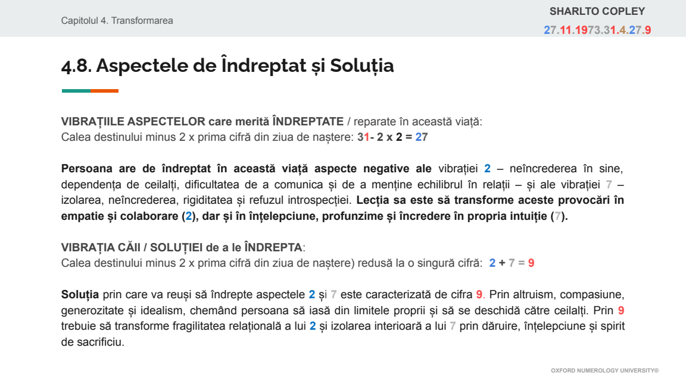

```text
Capitolul 4. Transformarea
4.8. Aspectele de Îndreptat și Soluția
VIBRAȚIILE ASPECTELOR care merită ÎNDREPTATE / reparate în această viață:
Calea destinului minus 2 x prima cifră din ziua de naștere: 31- 2 x 2 = 27
Persoana are de îndreptat în această viață aspecte negative ale vibrației 2 – neîncrederea în sine,
dependența de ceilalți, dificultatea de a comunica și de a menține echilibrul în relații – și ale vibrației 7 –
izolarea, neîncrederea, rigiditatea și refuzul introspecției. Lecția sa este să transforme aceste provocări în
empatie și colaborare (2), dar și în înțelepciune, profunzime și încredere în propria intuiție (7).
VIBRAȚIA CĂII / SOLUȚIEI de a le ÎNDREPTA:
Calea destinului minus 2 x prima cifră din ziua de naștere) redusă la o singură cifră: 2 + 7 = 9
Soluția prin care va reuși să îndrepte aspectele 2 și 7 este caracterizată de cifra 9. Prin altruism, compasiune,
generozitate și idealism, chemând persoana să iasă din limitele proprii și să se deschidă către ceilalți. Prin 9
trebuie să transforme fragilitatea relațională a lui 2 și izolarea interioară a lui 7 prin dăruire, înțelepciune și spirit
de sacrificiu.
OXFORD NUMEROLOGY UNIVERSITY®
```

### Pagina 224

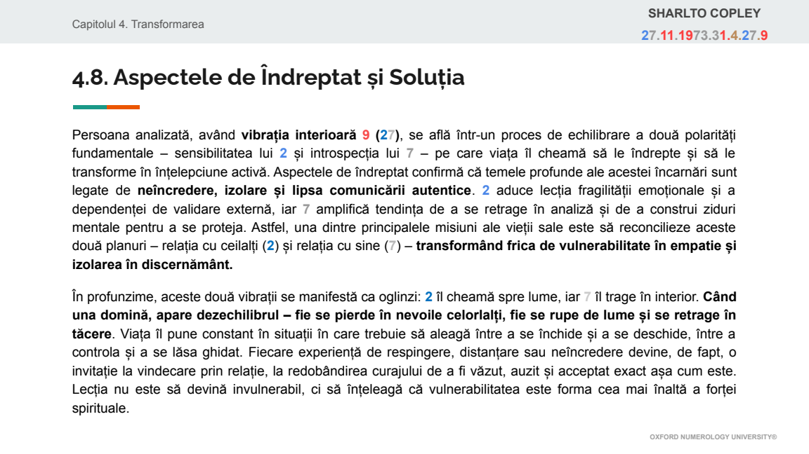

```text
Capitolul 4. Transformarea
4.8. Aspectele de Îndreptat și Soluția
Persoana analizată, având vibrația interioară 9 (27), se află într-un proces de echilibrare a două polarități
fundamentale – sensibilitatea lui 2 și introspecția lui 7 – pe care viața îl cheamă să le îndrepte și să le
transforme în înțelepciune activă. Aspectele de îndreptat confirmă că temele profunde ale acestei încarnări sunt
legate de neîncredere, izolare și lipsa comunicării autentice. 2 aduce lecția fragilității emoționale și a
dependenței de validare externă, iar 7 amplifică tendința de a se retrage în analiză și de a construi ziduri
mentale pentru a se proteja. Astfel, una dintre principalele misiuni ale vieții sale este să reconcilieze aceste
două planuri – relația cu ceilalți (2) și relația cu sine (7) – transformând frica de vulnerabilitate în empatie și
izolarea în discernământ.
În profunzime, aceste două vibrații se manifestă ca oglinzi: 2 îl cheamă spre lume, iar 7 îl trage în interior. Când
una domină, apare dezechilibrul – fie se pierde în nevoile celorlalți, fie se rupe de lume și se retrage în
tăcere. Viața îl pune constant în situații în care trebuie să aleagă între a se închide și a se deschide, între a
controla și a se lăsa ghidat. Fiecare experiență de respingere, distanțare sau neîncredere devine, de fapt, o
invitație la vindecare prin relație, la redobândirea curajului de a fi văzut, auzit și acceptat exact așa cum este.
Lecția nu este să devină invulnerabil, ci să înțeleagă că vulnerabilitatea este forma cea mai înaltă a forței
spirituale.
OXFORD NUMEROLOGY UNIVERSITY®
```

### Pagina 225

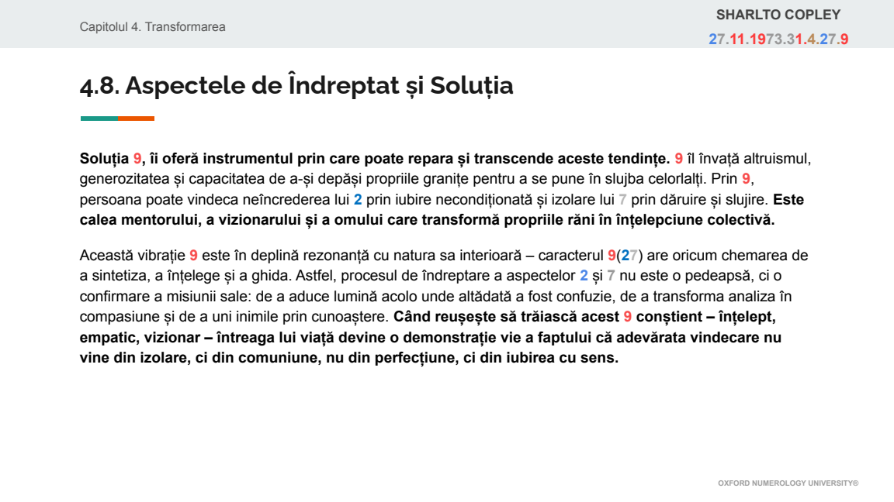

```text
Capitolul 4. Transformarea
4.8. Aspectele de Îndreptat și Soluția
Soluția 9, îi oferă instrumentul prin care poate repara și transcende aceste tendințe. 9 îl învață altruismul,
generozitatea și capacitatea de a-și depăși propriile granițe pentru a se pune în slujba celorlalți. Prin 9,
persoana poate vindeca neîncrederea lui 2 prin iubire necondiționată și izolare lui 7 prin dăruire și slujire. Este
calea mentorului, a vizionarului și a omului care transformă propriile răni în înțelepciune colectivă.
Această vibrație 9 este în deplină rezonanță cu natura sa interioară – caracterul 9(27) are oricum chemarea de
a sintetiza, a înțelege și a ghida. Astfel, procesul de îndreptare a aspectelor 2 și 7 nu este o pedeapsă, ci o
confirmare a misiunii sale: de a aduce lumină acolo unde altădată a fost confuzie, de a transforma analiza în
compasiune și de a uni inimile prin cunoaștere. Când reușește să trăiască acest 9 conștient – înțelept,
empatic, vizionar – întreaga lui viață devine o demonstrație vie a faptului că adevărata vindecare nu
vine din izolare, ci din comuniune, nu din perfecțiune, ci din iubirea cu sens.
OXFORD NUMEROLOGY UNIVERSITY®
```

### Pagina 226

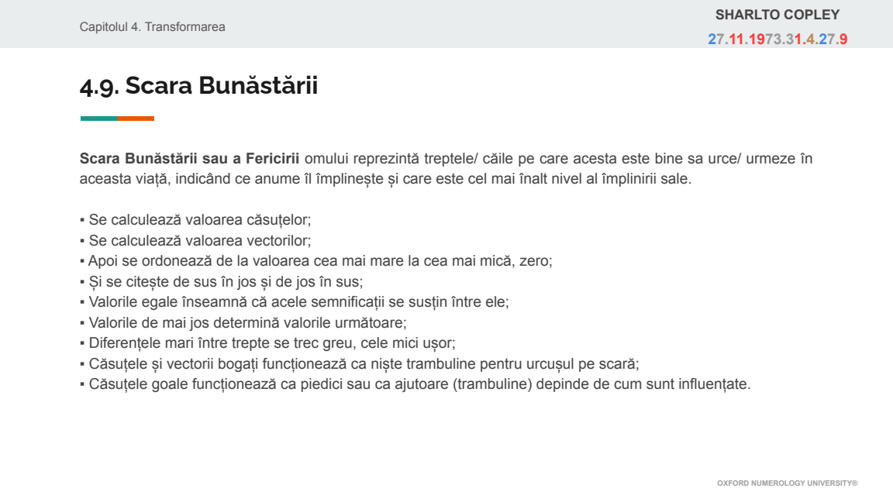

```text
Capitolul 4. Transformarea
4.9. Scara Bunăstării
Scara Bunăstării sau a Fericirii omului reprezintă treptele/ căile pe care acesta este bine sa urce/ urmeze în
aceasta viață, indicând ce anume îl împlinește și care este cel mai înalt nivel al împlinirii sale.
▪ Se calculează valoarea căsuțelor;
▪ Se calculează valoarea vectorilor;
▪ Apoi se ordonează de la valoarea cea mai mare la cea mai mică, zero;
▪ Și se citește de sus în jos și de jos în sus;
▪ Valorile egale înseamnă că acele semnificații se susțin între ele;
▪ Valorile de mai jos determină valorile următoare;
▪ Diferențele mari între trepte se trec greu, cele mici ușor;
▪ Căsuțele și vectorii bogați funcționează ca niște trambuline pentru urcușul pe scară;
▪ Căsuțele goale funcționează ca piedici sau ca ajutoare (trambuline) depinde de cum sunt influențate.
OXFORD NUMEROLOGY UNIVERSITY®
```

### Pagina 227

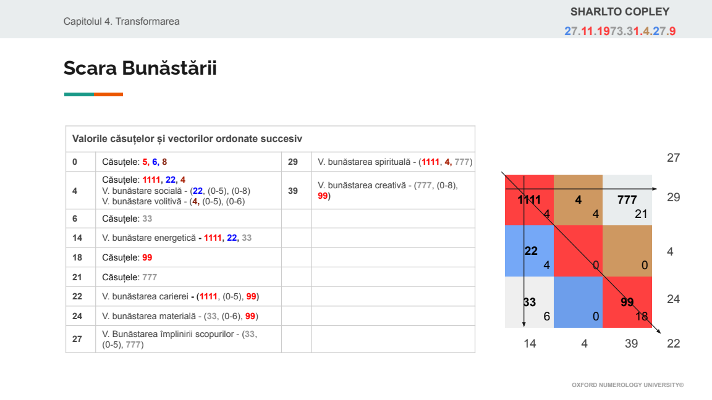

```text
Capitolul 4. Transformarea
Scara Bunăstării
Valorile căsuțelor și vectorilor ordonate succesiv
27
0 Căsuțele: 5, 6, 8 29 V. bunăstarea spirituală - (1111, 4, 777)
Căsuțele: 1111, 22, 4
V. bunăstarea creativă - (777, (0-8),
4 V. bunăstare socială - (22, (0-5), (0-8) 39
V. bunăstare volitivă - (4, (0-5), (0-6) 99) 1111 4 777 29
4 4 21
6 Căsuțele: 33
14 V. bunăstare energetică - 1111, 22, 33
22 4
18 Căsuțele: 99
4 0 0
21 Căsuțele: 777
22 V. bunăstarea carierei - (1111, (0-5), 99) 33 99 24
24 V. bunăstarea materială - (33, (0-6), 99) 6 0 18
V. Bunăstarea împlinirii scopurilor - (33,
27
(0-5), 777) 14 4 39 22
OXFORD NUMEROLOGY UNIVERSITY®
```

### Pagina 228


```text
Capitolul 4. Transformarea
Scara Bunăstării 24 - V. Material
22 - V. Carierei
14 4 39
27
21 - 777
1111 4 777 29
4 4 21
22 4
4
6 - 33
18 - 99
33 99 24
6 0
4 - 1111, 22, 4
22
V. Social
Treaptă inexistentă
V. Volitiv
29 - V. Spiritual Treaptă slabă: Vector incomplet, cu 1 sau 2 căsuțe libere
Treaptă normală: Căsuță cu 1 cifră. Vector complet, cu câte 1 cifră
Treaptă bună: Căsuță cu 2 cifre. Vector complet, cu 4, 5 sau 6
cifre
Treaptă foarte bună: Căsuță cu 3, 4 cifre. Vector complet, cu 7, 8,
14 - V. Energetic
27 - V. Scopului 9 cifre (conține căsuțe pare). Trambulină
Treaptă foarte foarte bună: Căsuță cu 5, 6 cifre. Vector complet,
cu foarte multe cifre (fără căsuțe pare). Trambulină
Treaptă puternică: Căsuță cu peste 7 cifre. Vector complet, cu
cele mai multe cifre (fără căsuțe pare)
* Căsuțele libere și Vectorii liberi se pun în afara Scării
0 - 5, 6, 8
OXFORD NUMEROLOGY UNIVERSITY®
vitaerC
.V
-
93
```

### Pagina 229

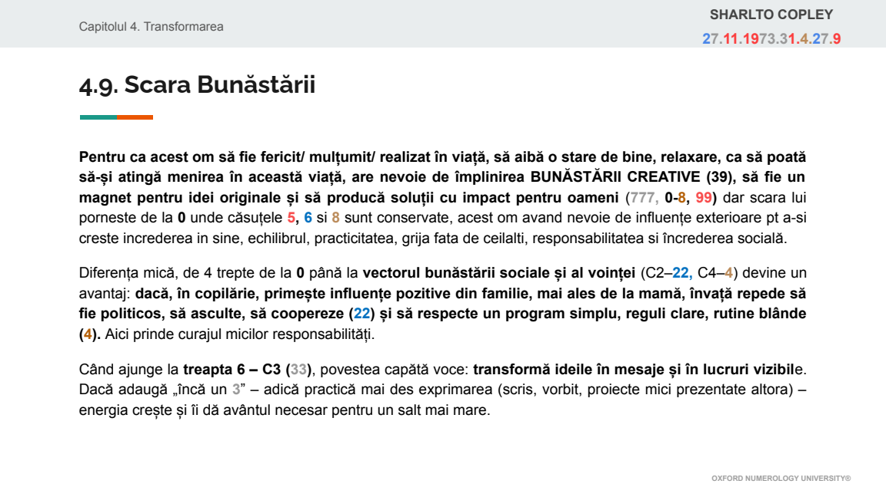

```text
Capitolul 4. Transformarea
4.9. Scara Bunăstării
Pentru ca acest om să fie fericit/ mulțumit/ realizat în viață, să aibă o stare de bine, relaxare, ca să poată
să-și atingă menirea în această viață, are nevoie de împlinirea BUNĂSTĂRII CREATIVE (39), să fie un
magnet pentru idei originale și să producă soluții cu impact pentru oameni (777, 0-8, 99) dar scara lui
porneste de la 0 unde căsuțele 5, 6 si 8 sunt conservate, acest om avand nevoie de influențe exterioare pt a-si
creste increderea in sine, echilibrul, practicitatea, grija fata de ceilalti, responsabilitatea si încrederea socială.
Diferența mică, de 4 trepte de la 0 până la vectorul bunăstării sociale și al voinței (C2–22, C4–4) devine un
avantaj: dacă, în copilărie, primește influențe pozitive din familie, mai ales de la mamă, învață repede să
fie politicos, să asculte, să coopereze (22) și să respecte un program simplu, reguli clare, rutine blânde
(4). Aici prinde curajul micilor responsabilități.
Când ajunge la treapta 6 – C3 (33), povestea capătă voce: transformă ideile în mesaje și în lucruri vizibile.
Dacă adaugă „încă un 3” – adică practică mai des exprimarea (scris, vorbit, proiecte mici prezentate altora) –
energia crește și îi dă avântul necesar pentru un salt mai mare.
OXFORD NUMEROLOGY UNIVERSITY®
```

### Pagina 230

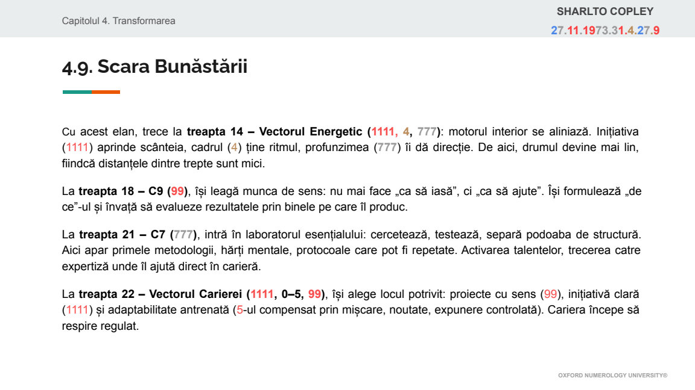

```text
Capitolul 4. Transformarea
4.9. Scara Bunăstării
Cu acest elan, trece la treapta 14 – Vectorul Energetic (1111, 4, 777): motorul interior se aliniază. Inițiativa
(1111) aprinde scânteia, cadrul (4) ține ritmul, profunzimea (777) îi dă direcție. De aici, drumul devine mai lin,
fiindcă distanțele dintre trepte sunt mici.
La treapta 18 – C9 (99), își leagă munca de sens: nu mai face „ca să iasă”, ci „ca să ajute”. Își formulează „de
ce”-ul și învață să evalueze rezultatele prin binele pe care îl produc.
La treapta 21 – C7 (777), intră în laboratorul esențialului: cercetează, testează, separă podoaba de structură.
Aici apar primele metodologii, hărți mentale, protocoale care pot fi repetate. Activarea talentelor, trecerea catre
expertiză unde îl ajută direct în carieră.
La treapta 22 – Vectorul Carierei (1111, 0–5, 99), își alege locul potrivit: proiecte cu sens (99), inițiativă clară
(1111) și adaptabilitate antrenată (5-ul compensat prin mișcare, noutate, expunere controlată). Cariera începe să
respire regulat.
OXFORD NUMEROLOGY UNIVERSITY®
```

### Pagina 231

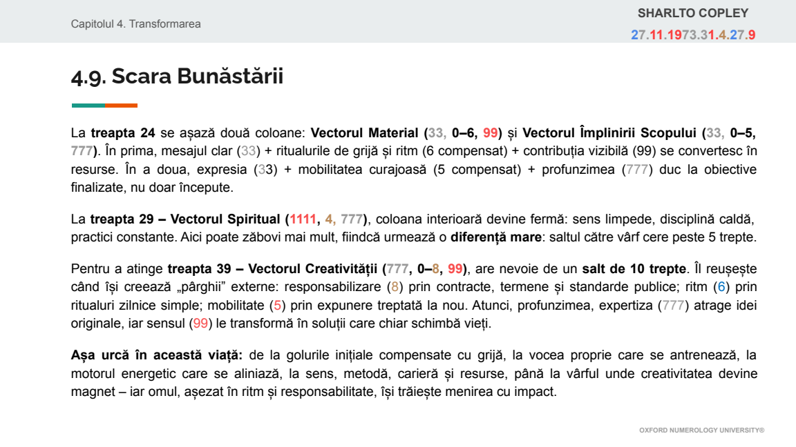

```text
Capitolul 4. Transformarea
4.9. Scara Bunăstării
La treapta 24 se așază două coloane: Vectorul Material (33, 0–6, 99) și Vectorul Împlinirii Scopului (33, 0–5,
777). În prima, mesajul clar (33) + ritualurile de grijă și ritm (6 compensat) + contribuția vizibilă (99) se convertesc în
resurse. În a doua, expresia (33) + mobilitatea curajoasă (5 compensat) + profunzimea (777) duc la obiective
finalizate, nu doar începute.
La treapta 29 – Vectorul Spiritual (1111, 4, 777), coloana interioară devine fermă: sens limpede, disciplină caldă,
practici constante. Aici poate zăbovi mai mult, fiindcă urmează o diferență mare: saltul către vârf cere peste 5 trepte.
Pentru a atinge treapta 39 – Vectorul Creativității (777, 0–8, 99), are nevoie de un salt de 10 trepte. Îl reușește
când își creează „pârghii” externe: responsabilizare (8) prin contracte, termene și standarde publice; ritm (6) prin
ritualuri zilnice simple; mobilitate (5) prin expunere treptată la nou. Atunci, profunzimea, expertiza (777) atrage idei
originale, iar sensul (99) le transformă în soluții care chiar schimbă vieți.
Așa urcă în această viață: de la golurile inițiale compensate cu grijă, la vocea proprie care se antrenează, la
motorul energetic care se aliniază, la sens, metodă, carieră și resurse, până la vârful unde creativitatea devine
magnet – iar omul, așezat în ritm și responsabilitate, își trăiește menirea cu impact.
OXFORD NUMEROLOGY UNIVERSITY®
```

### Pagina 232

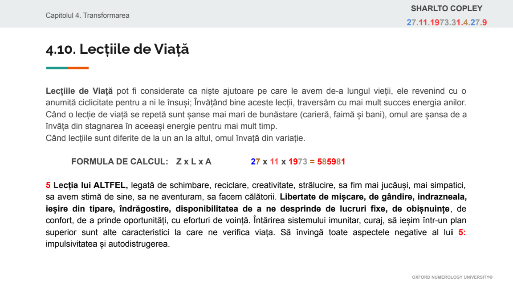

```text
Capitolul 4. Transformarea
4.10. Lecțiile de Viață
Lecțiile de Viață pot fi considerate ca niște ajutoare pe care le avem de-a lungul vieții, ele revenind cu o
anumită ciclicitate pentru a ni le însuși; Învățând bine aceste lecții, traversăm cu mai mult succes energia anilor.
Când o lecție de viață se repetă sunt șanse mai mari de bunăstare (carieră, faimă și bani), omul are șansa de a
învăța din stagnarea în aceeași energie pentru mai mult timp.
Când lecțiile sunt diferite de la un an la altul, omul învață din variație.
FORMULA DE CALCUL: Z x L x A 27 x 11 x 1973 = 585981
5 Lecția lui ALTFEL, legată de schimbare, reciclare, creativitate, strălucire, sa fim mai jucăuși, mai simpatici,
sa avem stimă de sine, sa ne aventuram, sa facem călătorii. Libertate de mișcare, de gândire, indrazneala,
ieșire din tipare, îndrăgostire, disponibilitatea de a ne desprinde de lucruri fixe, de obișnuințe, de
confort, de a prinde oportunități, cu eforturi de voință. Întărirea sistemului imunitar, curaj, să ieșim într-un plan
superior sunt alte caracteristici la care ne verifica viața. Să învingă toate aspectele negative al lui 5:
impulsivitatea și autodistrugerea.
OXFORD NUMEROLOGY UNIVERSITY®
```

### Pagina 233

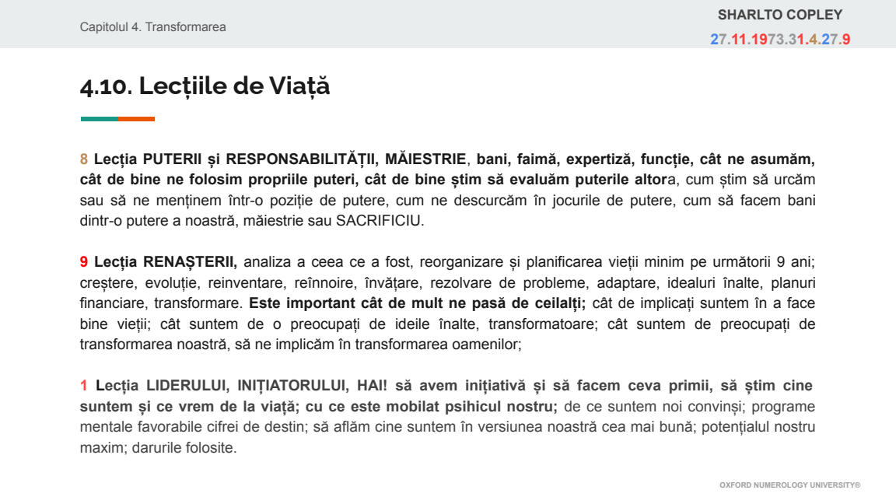

```text
Capitolul 4. Transformarea
4.10. Lecțiile de Viață
8 Lecția PUTERII și RESPONSABILITĂȚII, MĂIESTRIE, bani, faimă, expertiză, funcție, cât ne asumăm,
cât de bine ne folosim propriile puteri, cât de bine știm să evaluăm puterile altora, cum știm să urcăm
sau să ne menținem într-o poziție de putere, cum ne descurcăm în jocurile de putere, cum să facem bani
dintr-o putere a noastră, măiestrie sau SACRIFICIU.
9 Lecția RENAȘTERII, analiza a ceea ce a fost, reorganizare și planificarea vieții minim pe următorii 9 ani;
creștere, evoluție, reinventare, reînnoire, învățare, rezolvare de probleme, adaptare, idealuri înalte, planuri
financiare, transformare. Este important cât de mult ne pasă de ceilalți; cât de implicați suntem în a face
bine vieții; cât suntem de o preocupați de ideile înalte, transformatoare; cât suntem de preocupați de
transformarea noastră, să ne implicăm în transformarea oamenilor;
1 Lecția LIDERULUI, INIȚIATORULUI, HAI! să avem inițiativă și să facem ceva primii, să știm cine
suntem și ce vrem de la viață; cu ce este mobilat psihicul nostru; de ce suntem noi convinși; programe
mentale favorabile cifrei de destin; să aflăm cine suntem în versiunea noastră cea mai bună; potențialul nostru
maxim; darurile folosite.
OXFORD NUMEROLOGY UNIVERSITY®
```

### Pagina 234

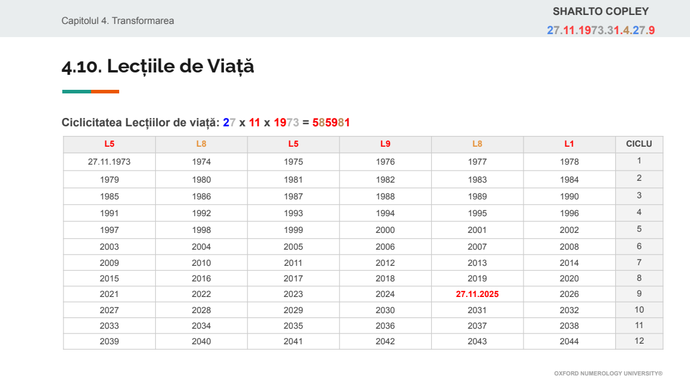

```text
Capitolul 4. Transformarea
4.10. Lecțiile de Viață
Ciclicitatea Lecțiilor de viață: 27 x 11 x 1973 = 585981
L5 L8 L5 L9 L8 L1 CICLU
27.11.1973 1974 1975 1976 1977 1978 1
1979 1980 1981 1982 1983 1984 2
1985 1986 1987 1988 1989 1990 3
1991 1992 1993 1994 1995 1996 4
1997 1998 1999 2000 2001 2002 5
2003 2004 2005 2006 2007 2008 6
2009 2010 2011 2012 2013 2014 7
2015 2016 2017 2018 2019 2020 8
2021 2022 2023 2024 27.11.2025 2026 9
2027 2028 2029 2030 2031 2032 10
2033 2034 2035 2036 2037 2038 11
2039 2040 2041 2042 2043 2044 12
OXFORD NUMEROLOGY UNIVERSITY®
```

### Pagina 235

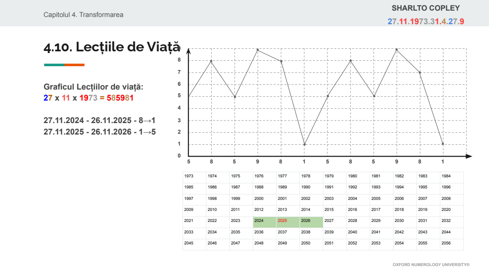

```text
Capitolul 4. Transformarea
4.10. Lecțiile de Viață
9
8
7
Graficul Lecțiilor de viață: 6
27 x 11 x 1973 = 585981 5
4
27.11.2024 - 26.11.2025 - 8→1 3
27.11.2025 - 26.11.2026 - 1→5 2
1
0
5 8 5 9 8 1 5 8 5 9 8 1
1973 1974 1975 1976 1977 1978 1979 1980 1981 1982 1983 1984
1985 1986 1987 1988 1989 1990 1991 1992 1993 1994 1995 1996
1997 1998 1999 2000 2001 2002 2003 2004 2005 2006 2007 2008
2009 2010 2011 2012 2013 2014 2015 2016 2017 2018 2019 2020
2021 2022 2023 2024 2025 2026 2027 2028 2029 2030 2031 2032
2033 2034 2035 2036 2037 2038 2039 2040 2041 2042 2043 2044
2045 2046 2047 2048 2049 2050 2051 2052 2053 2054 2055 2056
OXFORD NUMEROLOGY UNIVERSITY®
```

### Pagina 236

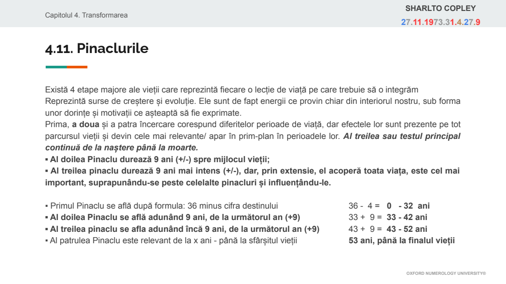

```text
Capitolul 4. Transformarea
4.11. Pinaclurile
Există 4 etape majore ale vieții care reprezintă fiecare o lecție de viață pe care trebuie să o integrăm
Reprezintă surse de creștere și evoluție. Ele sunt de fapt energii ce provin chiar din interiorul nostru, sub forma
unor dorințe și motivații ce așteaptă să fie exprimate.
Prima, a doua și a patra încercare corespund diferitelor perioade de viață, dar efectele lor sunt prezente pe tot
parcursul vieții și devin cele mai relevante/ apar în prim-plan în perioadele lor. Al treilea sau testul principal
continuă de la naștere până la moarte.
▪ Al doilea Pinaclu durează 9 ani (+/-) spre mijlocul vieții;
▪ Al treilea pinaclu durează 9 ani mai intens (+/-), dar, prin extensie, el acoperă toata viața, este cel mai
important, suprapunându-se peste celelalte pinacluri și influențându-le.
▪ Primul Pinaclu se află după formula: 36 minus cifra destinului 36 - 4 = 0 - 32 ani
▪ Al doilea Pinaclu se află adunând 9 ani, de la următorul an (+9) 33 + 9 = 33 - 42 ani
▪ Al treilea pinaclu se afla adunând încă 9 ani, de la următorul an (+9) 43 + 9 = 43 - 52 ani
▪ Al patrulea Pinaclu este relevant de la x ani - până la sfârșitul vieții 53 ani, până la finalul vieții
OXFORD NUMEROLOGY UNIVERSITY®
```

### Pagina 237

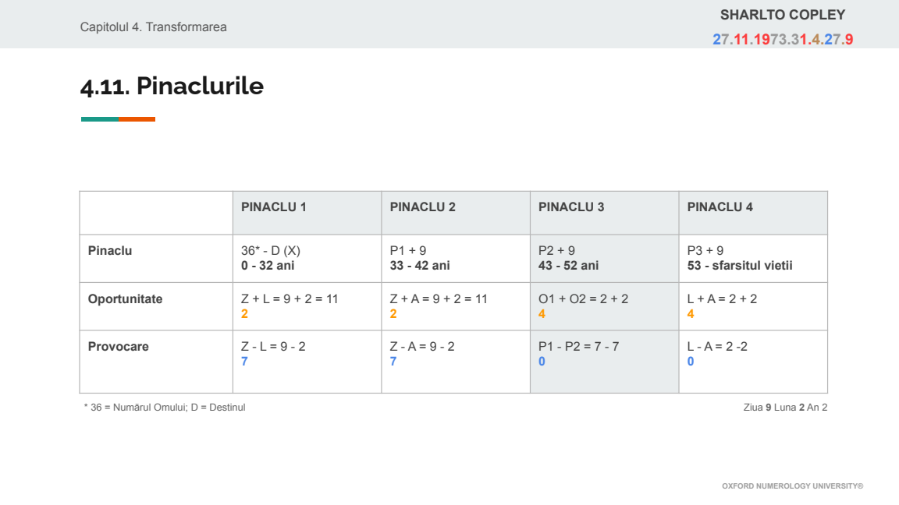

```text
Capitolul 4. Transformarea
4.11. Pinaclurile
PINACLU 1 PINACLU 2 PINACLU 3 PINACLU 4
Pinaclu 36* - D (X) P1 + 9 P2 + 9 P3 + 9
0 - 32 ani 33 - 42 ani 43 - 52 ani 53 - sfarsitul vietii
Oportunitate Z + L = 9 + 2 = 11 Z + A = 9 + 2 = 11 O1 + O2 = 2 + 2 L + A = 2 + 2
2 2 4 4
Provocare Z - L = 9 - 2 Z - A = 9 - 2 P1 - P2 = 7 - 7 L - A = 2 -2
7 7 0 0
* 36 = Numărul Omului; D = Destinul Ziua 9 Luna 2 An 2
OXFORD NUMEROLOGY UNIVERSITY®
```

### Pagina 238

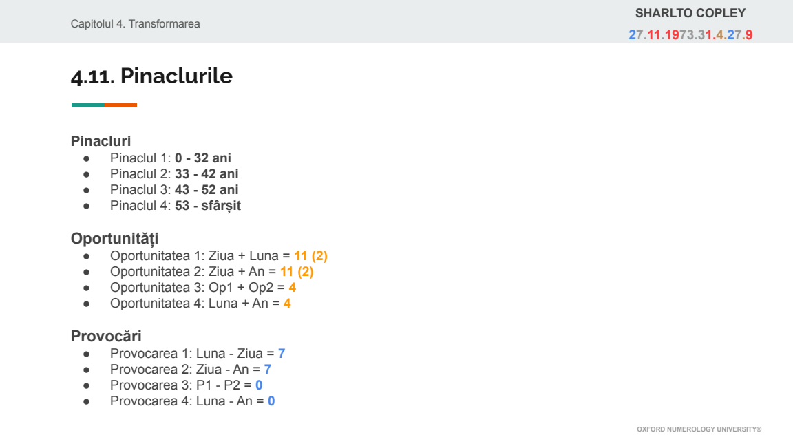

```text
Capitolul 4. Transformarea
4.11. Pinaclurile
Pinacluri
● Pinaclul 1: 0 - 32 ani
● Pinaclul 2: 33 - 42 ani
● Pinaclul 3: 43 - 52 ani
● Pinaclul 4: 53 - sfârșit
Oportunități
● Oportunitatea 1: Ziua + Luna = 11 (2)
● Oportunitatea 2: Ziua + An = 11 (2)
● Oportunitatea 3: Op1 + Op2 = 4
● Oportunitatea 4: Luna + An = 4
Provocări
● Provocarea 1: Luna - Ziua = 7
● Provocarea 2: Ziua - An = 7
● Provocarea 3: P1 - P2 = 0
● Provocarea 4: Luna - An = 0
OXFORD NUMEROLOGY UNIVERSITY®
```

### Pagina 239

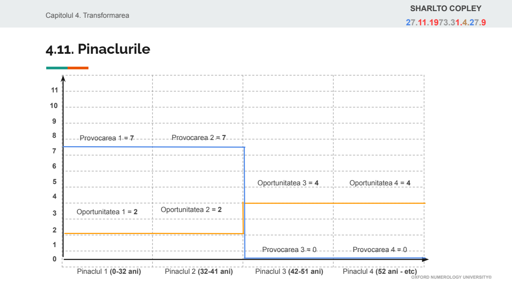

```text
Capitolul 4. Transformarea
4.11. Pinaclurile
11
10
9
8
Provocarea 1 = 7 Provocarea 2 = 7
7
6
5 Oportunitatea 3 = 4 Oportunitatea 4 = 4
4
Oportunitatea 2 = 2
3 Oportunitatea 1 = 2
2
1
Provocarea 3 = 0 Provocarea 4 = 0
0
Pinaclul 1 (0-32 ani) Pinaclul 2 (32-41 ani) Pinaclul 3 (42-51 ani) Pinaclul 4 (52 ani - etc)
OXFORD NUMEROLOGY UNIVERSITY®
```

### Pagina 240

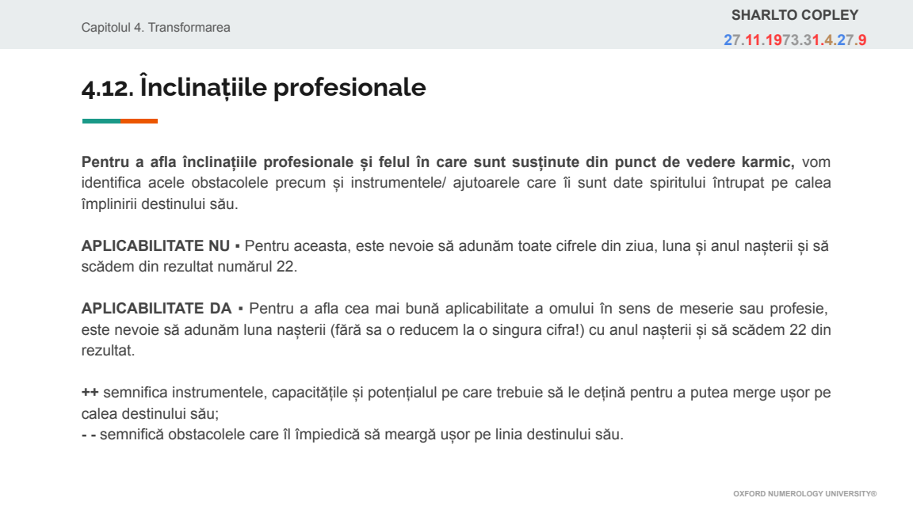

```text
Capitolul 4. Transformarea
4.12. Înclinațiile profesionale
Pentru a afla înclinațiile profesionale și felul în care sunt susținute din punct de vedere karmic, vom
identifica acele obstacolele precum și instrumentele/ ajutoarele care îi sunt date spiritului întrupat pe calea
împlinirii destinului său.
APLICABILITATE NU ▪ Pentru aceasta, este nevoie să adunăm toate cifrele din ziua, luna și anul nașterii și să
scădem din rezultat numărul 22.
APLICABILITATE DA ▪ Pentru a afla cea mai bună aplicabilitate a omului în sens de meserie sau profesie,
este nevoie să adunăm luna nașterii (fără sa o reducem la o singura cifra!) cu anul nașterii și să scădem 22 din
rezultat.
++ semnifica instrumentele, capacitățile și potențialul pe care trebuie să le dețină pentru a putea merge ușor pe
calea destinului său;
- - semnifică obstacolele care îl împiedică să meargă ușor pe linia destinului său.
OXFORD NUMEROLOGY UNIVERSITY®
```

### Pagina 241

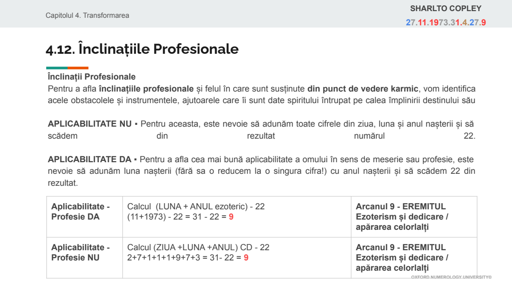

```text
Capitolul 4. Transformarea
4.12. Înclinațiile Profesionale
Înclinații Profesionale
Pentru a afla înclinațiile profesionale și felul în care sunt susținute din punct de vedere karmic, vom identifica
acele obstacolele și instrumentele, ajutoarele care îi sunt date spiritului întrupat pe calea împlinirii destinului său
APLICABILITATE NU ▪ Pentru aceasta, este nevoie să adunăm toate cifrele din ziua, luna și anul nașterii și să
scădem din rezultat numărul 22.
APLICABILITATE DA ▪ Pentru a afla cea mai bună aplicabilitate a omului în sens de meserie sau profesie, este
nevoie să adunăm luna nașterii (fără sa o reducem la o singura cifra!) cu anul nașterii și să scădem 22 din
rezultat.
Aplicabilitate - Calcul (LUNA + ANUL ezoteric) - 22 Arcanul 9 - EREMITUL
Profesie DA (11+1973) - 22 = 31 - 22 = 9 Ezoterism și dedicare /
apărarea celorlalți
Aplicabilitate - Calcul (ZIUA +LUNA +ANUL) CD - 22 Arcanul 9 - EREMITUL
Profesie NU 2+7+1+1+1+9+7+3 = 31- 22 = 9 Ezoterism și dedicare /
apărarea celorlalți
OXFORD NUMEROLOGY UNIVERSITY®
```

### Pagina 242

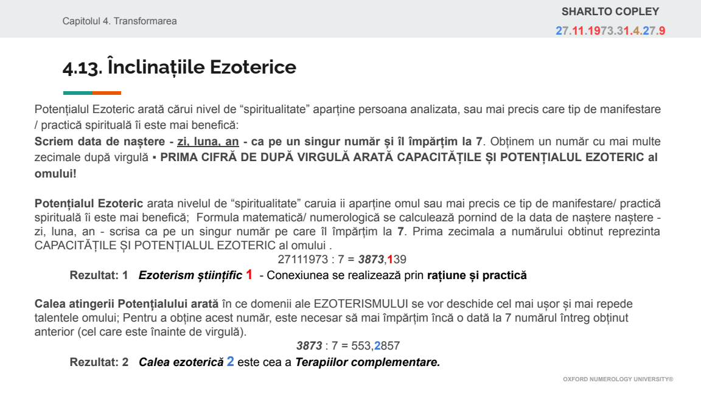

```text
Capitolul 4. Transformarea
4.13. Înclinațiile Ezoterice
Potențialul Ezoteric arată cărui nivel de “spiritualitate” aparține persoana analizata, sau mai precis care tip de manifestare
/ practică spirituală îi este mai benefică:
Scriem data de naștere - zi, luna, an - ca pe un singur număr și îl împărțim la 7. Obținem un număr cu mai multe
zecimale după virgulă ▪ PRIMA CIFRĂ DE DUPĂ VIRGULĂ ARATĂ CAPACITĂȚILE ȘI POTENȚIALUL EZOTERIC al
omului!
Potențialul Ezoteric arata nivelul de “spiritualitate” caruia ii aparține omul sau mai precis ce tip de manifestare/ practică
spirituală îi este mai benefică; Formula matematică/ numerologică se calculează pornind de la data de naștere naștere -
zi, luna, an - scrisa ca pe un singur număr pe care îl împărțim la 7. Prima zecimala a numărului obtinut reprezinta
CAPACITĂȚILE ȘI POTENȚIALUL EZOTERIC al omului .
27111973 : 7 = 3873,139
Rezultat: 1 Ezoterism științific 1 - Conexiunea se realizează prin rațiune și practică
Calea atingerii Potențialului arată în ce domenii ale EZOTERISMULUI se vor deschide cel mai ușor și mai repede
talentele omului; Pentru a obține acest număr, este necesar să mai împărțim încă o dată la 7 numărul întreg obținut
anterior (cel care este înainte de virgulă).
3873 : 7 = 553,2857
Rezultat: 2 Calea ezoterică 2 este cea a Terapiilor complementare.
OXFORD NUMEROLOGY UNIVERSITY®
```

### Pagina 243

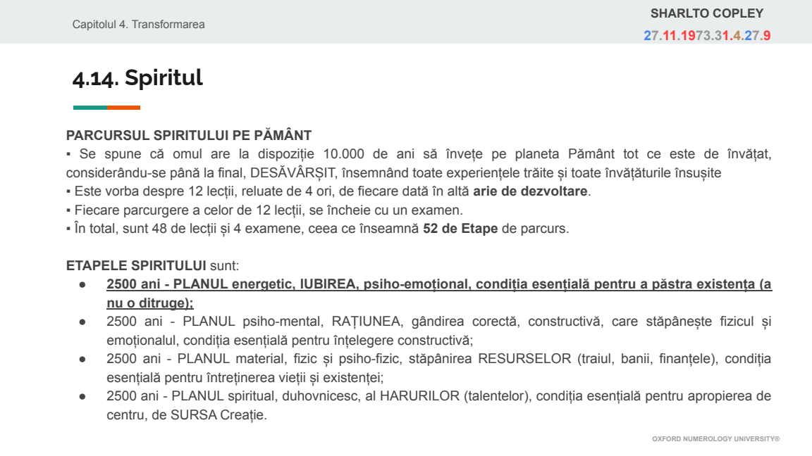

```text
Capitolul 4. Transformarea
4.14. Spiritul
PARCURSUL SPIRITULUI PE PĂMÂNT
▪ Se spune că omul are la dispoziție 10.000 de ani să învețe pe planeta Pământ tot ce este de învățat,
considerându-se până la final, DESĂVÂRȘIT, însemnând toate experiențele trăite și toate învățăturile însușite
▪ Este vorba despre 12 lecții, reluate de 4 ori, de fiecare dată în altă arie de dezVAULTare.
▪ Fiecare parcurgere a celor de 12 lecții, se încheie cu un examen.
▪ În total, sunt 48 de lecții și 4 examene, ceea ce înseamnă 52 de Etape de parcurs.
ETAPELE SPIRITULUI sunt:
● 2500 ani - PLANUL energetic, IUBIREA, psiho-emoțional, condiția esențială pentru a păstra existența (a
nu o ditruge);
● 2500 ani - PLANUL psiho-mental, RAȚIUNEA, gândirea corectă, constructivă, care stăpânește fizicul și
emoționalul, condiția esențială pentru înțelegere constructivă;
● 2500 ani - PLANUL material, fizic și psiho-fizic, stăpânirea RESURSELOR (traiul, banii, finanțele), condiția
esențială pentru întreținerea vieții și existenței;
● 2500 ani - PLANUL spiritual, duhovnicesc, al HARURILOR (talentelor), condiția esențială pentru apropierea de
centru, de SURSA Creație.
OXFORD NUMEROLOGY UNIVERSITY®
```

### Pagina 244

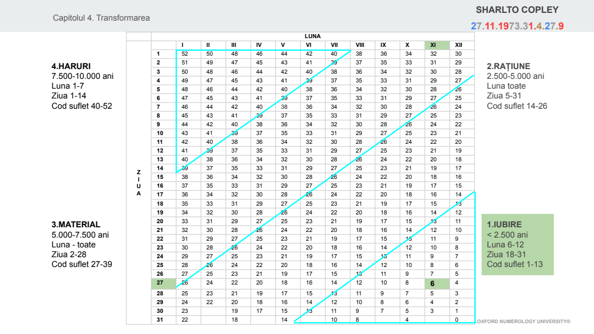

```text
Capitolul 4. Transformarea
LUNA
I II III IV V VI VII VIII IX X XI XII
1 52 50 48 46 44 42 40 38 36 34 32 30
4.HARURI 2 51 49 47 45 43 41 39 37 35 33 31 29 2.RAȚIUNE
3 50 48 46 44 42 40 38 36 34 32 30 28
7.500-10.000 ani 2.500-5.000 ani
4 49 47 45 43 41 39 37 35 33 31 29 27
Luna 1-7 Luna toate
5 48 46 44 42 40 38 36 34 32 30 28 26
Ziua 1-14 Ziua 5-31
6 47 45 43 41 39 37 35 33 31 29 27 25
Cod suflet 40-52 7 46 44 42 40 38 36 34 32 30 28 26 24 Cod suflet 14-26
8 45 43 41 39 37 35 33 31 29 27 25 23
9 44 42 40 38 36 34 32 30 28 26 24 22
10 43 41 39 37 35 33 31 29 27 25 23 21
11 42 40 38 36 34 32 30 28 26 24 22 20
12 41 39 37 35 33 31 29 27 25 23 21 19
13 40 38 36 34 32 30 28 26 24 22 20 18
14 39 37 35 33 31 29 27 25 23 21 19 17
Z
I 15 38 36 34 32 30 28 26 24 22 20 18 16
U 16 37 35 33 31 29 27 25 23 21 19 17 15
A 17 36 34 32 30 28 26 24 22 20 18 16 14
18 35 33 31 29 27 25 23 21 19 17 15 13
19 34 32 30 28 26 24 22 20 18 16 14 12
20 33 31 29 27 25 23 21 19 17 15 13 11
3.MATERIAL 1.IUBIRE
21 32 30 28 26 24 22 20 18 16 14 12 10
5.000-7.500 ani < 2.500 ani
22 31 29 27 25 23 21 19 17 15 13 11 9
Luna - toate Luna 6-12
23 30 28 26 24 22 20 18 16 14 12 10 8
Ziua 2-28 Ziua 18-31
24 29 27 25 23 21 19 17 15 13 11 9 7
Cod suflet 27-39 25 28 26 24 22 20 18 16 14 12 10 8 6 Cod suflet 1-13
26 27 25 23 21 19 17 15 13 11 9 7 5
27 26 24 22 20 18 16 14 12 10 8 6 4
28 25 23 21 19 17 15 13 11 9 7 5 3
29 24 22 20 18 16 14 12 10 8 6 4 2
30 23 19 17 15 13 11 9 7 5 3 1
31 22 18 14 10 8 4 0 OXFORD NUMEROLOGY UNIVERSITY®
```

### Pagina 245

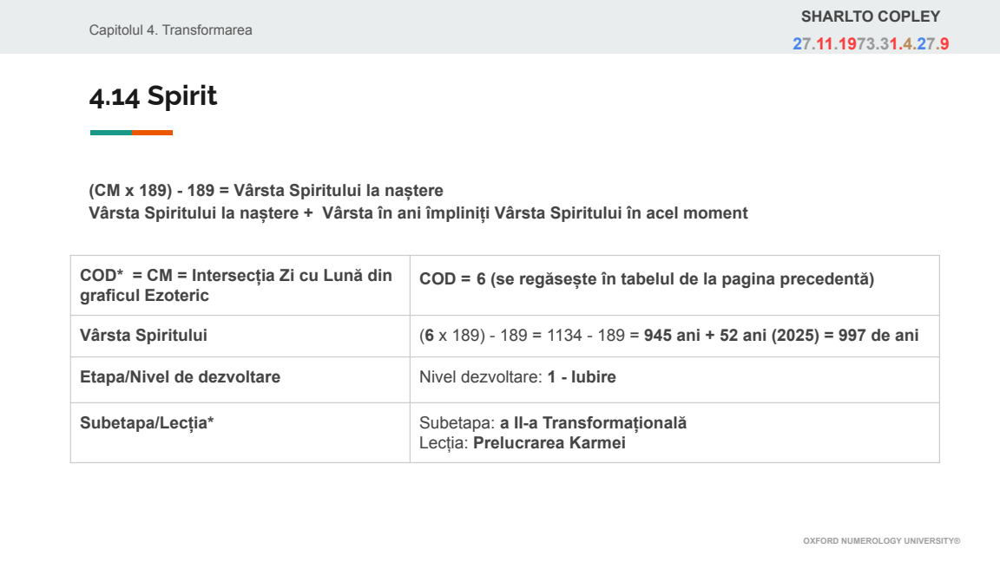

```text
Capitolul 4. Transformarea
4.14 Spirit
(CM x 189) - 189 = Vârsta Spiritului la naștere
Vârsta Spiritului la naștere + Vârsta în ani împliniți Vârsta Spiritului în acel moment
COD* = CM = Intersecția Zi cu Lună din COD = 6 (se regăsește în tabelul de la pagina precedentă)
graficul Ezoteric
Vârsta Spiritului (6 x 189) - 189 = 1134 - 189 = 945 ani + 52 ani (2025) = 997 de ani
Etapa/Nivel de dezVAULTare Nivel dezVAULTare: 1 - Iubire
Subetapa/Lecția* Subetapa: a II-a Transformațională
Lecția: Prelucrarea Karmei
OXFORD NUMEROLOGY UNIVERSITY®
```

### Pagina 246

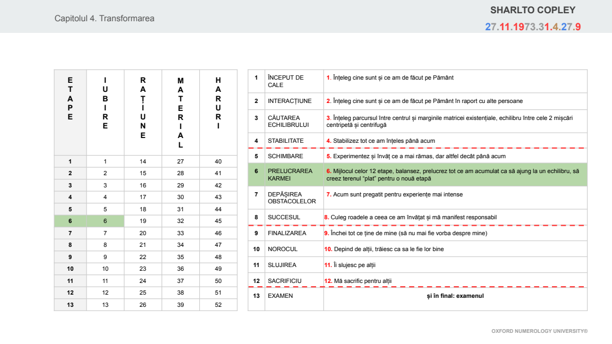

```text
Capitolul 4. Transformarea
E I R M H 1 ÎNCEPUT DE 1. Înțeleg cine sunt și ce am de făcut pe Pământ
CALE
T U A A A
A B Ț T R
2 INTERACȚIUNE 2. Înțeleg cine sunt și ce am de făcut pe Pământ în raport cu alte persoane
P I I E U
E R U R R 3 CĂUTAREA 3. Înțeleg parcursul între centrul și marginile matricei existențiale, echilibru între cele 2 mișcări
E N I I ECHILIBRULUI centripetă și centrifugă
E A
4 STABILITATE 4. Stabilizez tot ce am înțeles până acum
L
5 SCHIMBARE 5. Experimentez și învăț ce a mai rămas, dar altfel decât până acum
1 1 14 27 40
2 2 15 28 41 6 PRELUCRAREA 6. Mijlocul celor 12 etape, balansez, prelucrez tot ce am acumulat ca să ajung la un echilibru, să
KARMEI creez terenul “plat” pentru o nouă etapă
3 3 16 29 42
7 DEPĂȘIREA 7. Acum sunt pregatit pentru experiențe mai intense
4 4 17 30 43
OBSTACOLELOR
5 5 18 31 44
8 SUCCESUL 8. Culeg roadele a ceea ce am învățat și mă manifest responsabil
6 6 19 32 45
7 7 20 33 46 9 FINALIZAREA 9. Închei tot ce ține de mine (să nu mai fie vorba despre mine)
8 8 21 34 47
10 NOROCUL 10. Depind de alții, trăiesc ca sa le fie lor bine
9 9 22 35 48
11 SLUJIREA 11. Îi slujesc pe alții
10 10 23 36 49
11 11 24 37 50 12 SACRIFICIU 12. Mă sacrific pentru alții
12 12 25 38 51
13 EXAMEN și în final: examenul
13 13 26 39 52
OXFORD NUMEROLOGY UNIVERSITY®
```

### Pagina 247

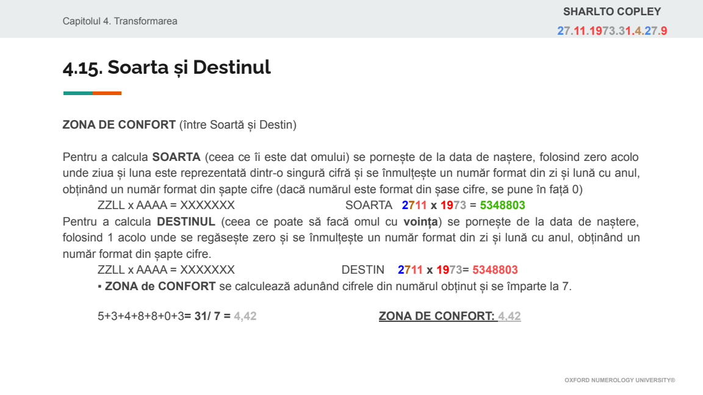

```text
Capitolul 4. Transformarea
4.15. Soarta și Destinul
ZONA DE CONFORT (între Soartă și Destin)
Pentru a calcula SOARTA (ceea ce îi este dat omului) se pornește de la data de naștere, folosind zero acolo
unde ziua și luna este reprezentată dintr-o singură cifră și se înmulțește un număr format din zi și lună cu anul,
obținând un număr format din șapte cifre (dacă numărul este format din șase cifre, se pune în față 0)
ZZLL x AAAA = XXXXXXX SOARTA 2711 x 1973 = 5348803
Pentru a calcula DESTINUL (ceea ce poate să facă omul cu voința) se pornește de la data de naștere,
folosind 1 acolo unde se regăsește zero și se înmulțește un număr format din zi și lună cu anul, obținând un
număr format din șapte cifre.
ZZLL x AAAA = XXXXXXX DESTIN 2711 x 1973= 5348803
▪ ZONA de CONFORT se calculează adunând cifrele din numărul obținut și se împarte la 7.
5+3+4+8+8+0+3= 31/ 7 = 4,42 ZONA DE CONFORT: 4,42
OXFORD NUMEROLOGY UNIVERSITY®
```

### Pagina 248

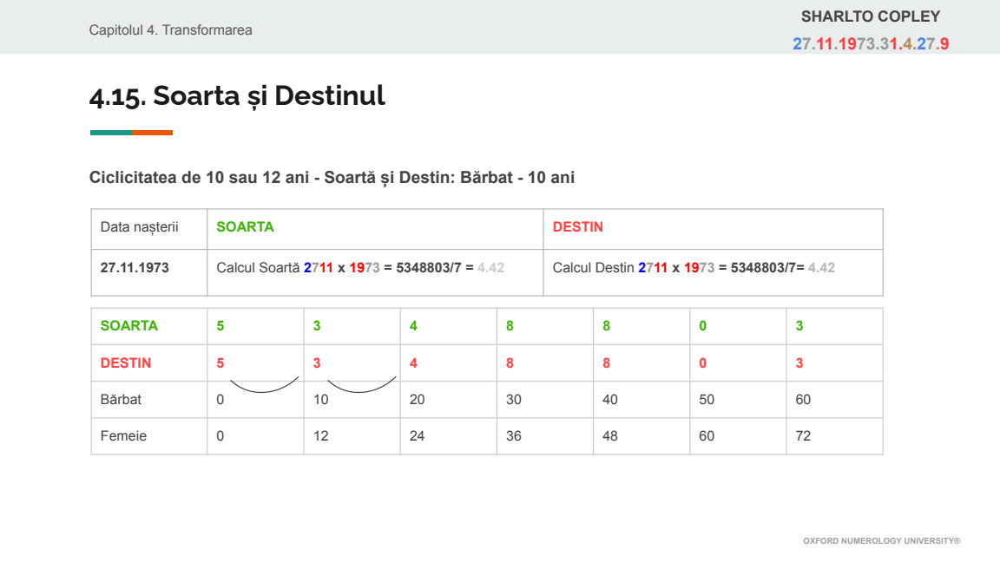

```text
Capitolul 4. Transformarea
4.15. Soarta și Destinul
Ciclicitatea de 10 sau 12 ani - Soartă și Destin: Bărbat - 10 ani
Data nașterii SOARTA DESTIN
27.11.1973 Calcul Soartă 2711 x 1973 = 5348803/7 = 4.42 Calcul Destin 2711 x 1973 = 5348803/7= 4.42
SOARTA 5 3 4 8 8 0 3
DESTIN 5 3 4 8 8 0 3
Bărbat 0 10 20 30 40 50 60
Femeie 0 12 24 36 48 60 72
OXFORD NUMEROLOGY UNIVERSITY®
```

### Pagina 249

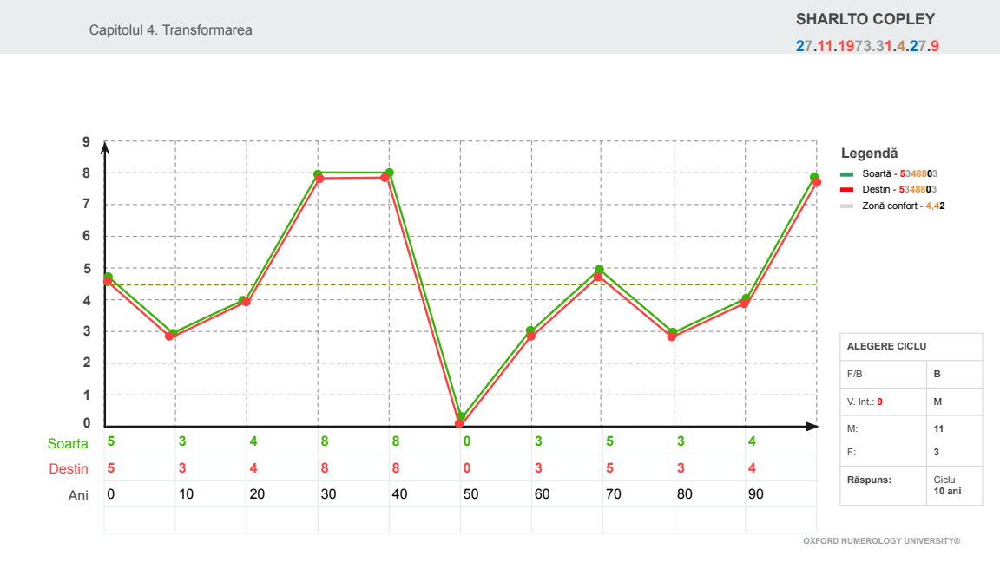

```text
Capitolul 4. Transformarea
9
Legendă
8 Soartă - 5348803
Destin - 5348803
7 Zonă confort - 4,42
6
5
4
3
ALEGERE CICLU
2
F/B B
1
V. Int.: 9 M
0
M: 11
Soarta 5 3 4 8 8 0 3 5 3 4
F: 3
Destin 5 3 4 8 8 0 3 5 3 4
Răspuns: Ciclu
Ani 0 10 20 30 40 50 60 70 80 90 10 ani
OXFORD NUMEROLOGY UNIVERSITY®
```

### Pagina 250

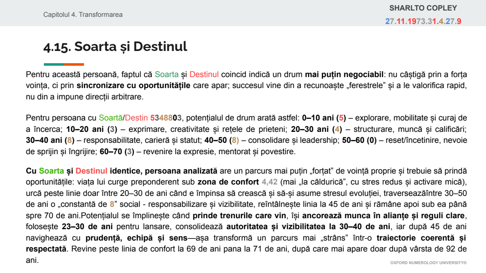

```text
Capitolul 4. Transformarea
4.15. Soarta și Destinul
Pentru această persoană, faptul că Soarta și Destinul coincid indică un drum mai puțin negociabil: nu câștigă prin a forța
voința, ci prin sincronizare cu oportunitățile care apar; succesul vine din a recunoaște „ferestrele” și a le valorifica rapid,
nu din a impune direcții arbitrare.
Pentru persoana cu Soartă/Destin 5348803, potențialul de drum arată astfel: 0–10 ani (5) – explorare, mobilitate și curaj de
a încerca; 10–20 ani (3) – exprimare, creativitate și rețele de prieteni; 20–30 ani (4) – structurare, muncă și calificări;
30–40 ani (8) – responsabilitate, carieră și statut; 40–50 (8) – consolidare și leadership; 50–60 (0) – reset/încetinire, nevoie
de sprijin și îngrijire; 60–70 (3) – revenire la expresie, mentorat și povestire.
Cu Soarta și Destinul identice, persoana analizată are un parcurs mai puțin „forțat” de voință proprie și trebuie să prindă
oportunitățile: viața lui curge preponderent sub zona de confort 4,42 (mai „la căldurică”, cu stres redus și activare mică),
urcă peste linie doar între 20–30 de ani când e împinsa să crească și să-și asume stresul evoluției, traverseazăîntre 30–50
de ani o „constantă de 8” social - responsabilizare și vizibilitate, reîntâlnește linia la 45 de ani și rămâne apoi sub ea până
spre 70 de ani.Potențialul se împlinește când prinde trenurile care vin, își ancorează munca în alianțe și reguli clare,
folosește 23–30 de ani pentru lansare, consolidează autoritatea și vizibilitatea la 30–40 de ani, iar după 45 de ani
navighează cu prudență, echipă și sens—așa transformă un parcurs mai „strâns” într-o traiectorie coerentă și
respectată. Revine peste linia de confort la 69 de ani pana la 71 de ani, după care mai apare doar după vârsta de 92 de
ani.
OXFORD NUMEROLOGY UNIVERSITY®
```

### Pagina 251

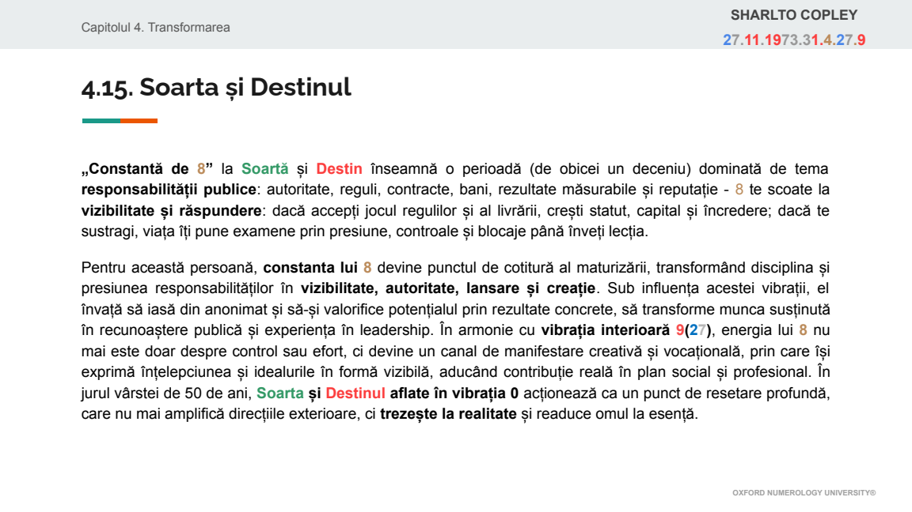

```text
Capitolul 4. Transformarea
4.15. Soarta și Destinul
„Constantă de 8” la Soartă și Destin înseamnă o perioadă (de obicei un deceniu) dominată de tema
responsabilității publice: autoritate, reguli, contracte, bani, rezultate măsurabile și reputație - 8 te scoate la
vizibilitate și răspundere: dacă accepți jocul regulilor și al livrării, crești statut, capital și încredere; dacă te
sustragi, viața îți pune examene prin presiune, controale și blocaje până înveți lecția.
Pentru această persoană, constanta lui 8 devine punctul de cotitură al maturizării, transformând disciplina și
presiunea responsabilităților în vizibilitate, autoritate, lansare și creație. Sub influența acestei vibrații, el
învață să iasă din anonimat și să-și valorifice potențialul prin rezultate concrete, să transforme munca susținută
în recunoaștere publică și experiența în leadership. În armonie cu vibrația interioară 9(27), energia lui 8 nu
mai este doar despre control sau efort, ci devine un canal de manifestare creativă și vocațională, prin care își
exprimă înțelepciunea și idealurile în formă vizibilă, aducând contribuție reală în plan social și profesional. În
jurul vârstei de 50 de ani, Soarta și Destinul aflate în vibrația 0 acționează ca un punct de resetare profundă,
care nu mai amplifică direcțiile exterioare, ci trezește la realitate și readuce omul la esență.
OXFORD NUMEROLOGY UNIVERSITY®
```

### Pagina 252

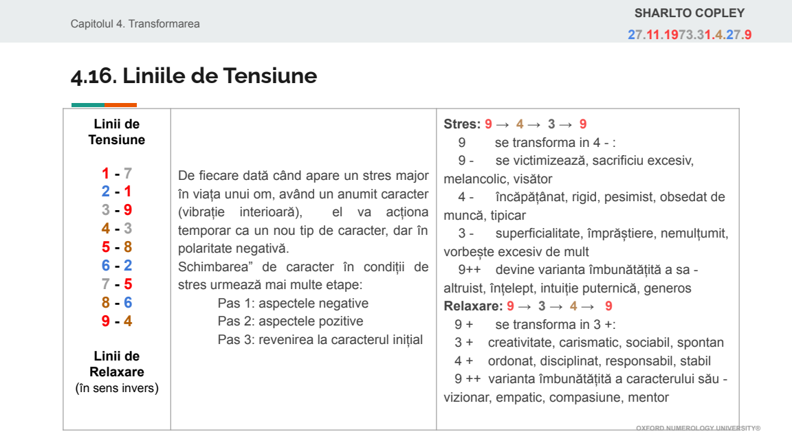

```text
Capitolul 4. Transformarea
4.16. Liniile de Tensiune
Linii de Stres: 9 → 4 → 3 → 9
Tensiune 9 se transforma in 4 - :
9 - se victimizează, sacrificiu excesiv,
1 - 7
De fiecare dată când apare un stres major melancolic, visător
2 - 1
în viața unui om, având un anumit caracter 4 - încăpățânat, rigid, pesimist, obsedat de
3 - 9 (vibrație interioară), el va acționa muncă, tipicar
4 - 3 temporar ca un nou tip de caracter, dar în 3 - superficialitate, împrăștiere, nemulțumit,
5 - 8 polaritate negativă. vorbește excesiv de mult
6 - 2 Schimbarea” de caracter în condiții de 9++ devine varianta îmbunătățită a sa -
7 - 5 stres urmează mai multe etape: altruist, înțelept, intuiție puternică, generos
8 - 6 Pas 1: aspectele negative Relaxare: 9 → 3 → 4 → 9
9 - 4 Pas 2: aspectele pozitive 9 + se transforma in 3 +:
Pas 3: revenirea la caracterul inițial 3 + creativitate, carismatic, sociabil, spontan
Linii de
4 + ordonat, disciplinat, responsabil, stabil
Relaxare
9 ++ varianta îmbunătățită a caracterului său -
(în sens invers)
vizionar, empatic, compasiune, mentor
OXFORD NUMEROLOGY UNIVERSITY®
```

### Pagina 253


```text
Concluziile
Transformării
```

### Pagina 254

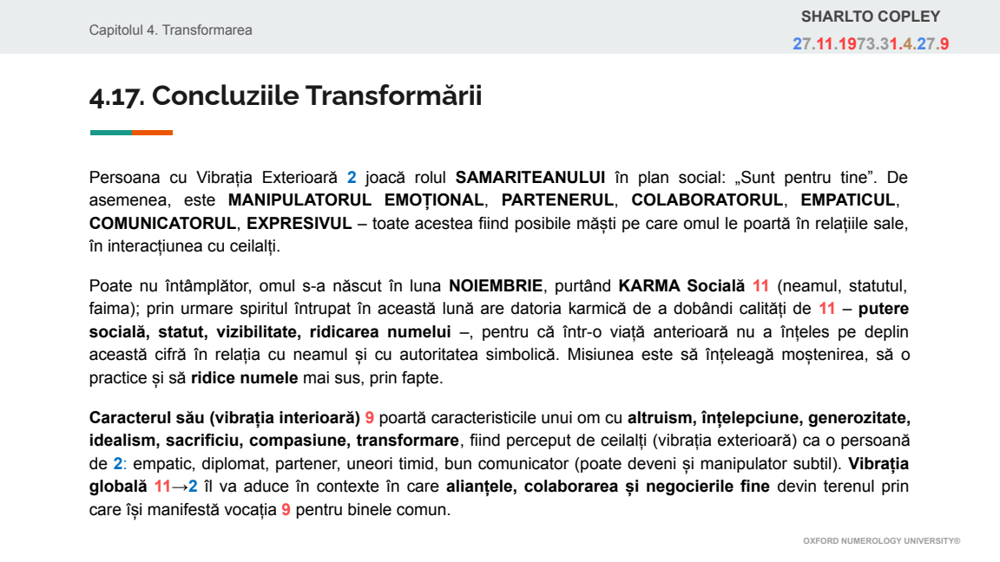

```text
Capitolul 4. Transformarea
4.17. Concluziile Transformării
Persoana cu Vibrația Exterioară 2 joacă rolul SAMARITEANULUI în plan social: „Sunt pentru tine”. De
asemenea, este MANIPULATORUL EMOȚIONAL, PARTENERUL, COLABORATORUL, EMPATICUL,
COMUNICATORUL, EXPRESIVUL – toate acestea fiind posibile măști pe care omul le poartă în relațiile sale,
în interacțiunea cu ceilalți.
Poate nu întâmplător, omul s-a născut în luna NOIEMBRIE, purtând KARMA Socială 11 (neamul, statutul,
faima); prin urmare spiritul întrupat în această lună are datoria karmică de a dobândi calități de 11 – putere
socială, statut, vizibilitate, ridicarea numelui –, pentru că într-o viață anterioară nu a înțeles pe deplin
această cifră în relația cu neamul și cu autoritatea simbolică. Misiunea este să înțeleagă moștenirea, să o
practice și să ridice numele mai sus, prin fapte.
Caracterul său (vibrația interioară) 9 poartă caracteristicile unui om cu altruism, înțelepciune, generozitate,
idealism, sacrificiu, compasiune, transformare, fiind perceput de ceilalți (vibrația exterioară) ca o persoană
de 2: empatic, diplomat, partener, uneori timid, bun comunicator (poate deveni și manipulator subtil). Vibrația
globală 11→2 îl va aduce în contexte în care alianțele, colaborarea și negocierile fine devin terenul prin
care își manifestă vocația 9 pentru binele comun.
OXFORD NUMEROLOGY UNIVERSITY®
```

### Pagina 255

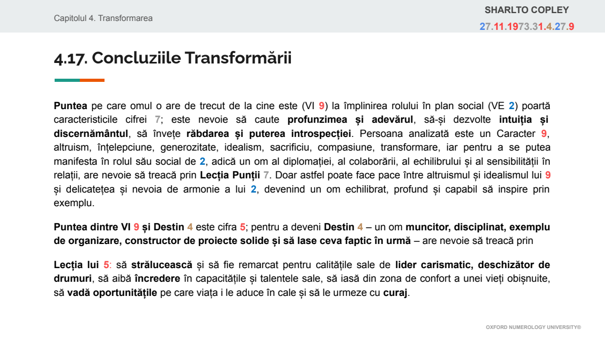

```text
Capitolul 4. Transformarea
4.17. Concluziile Transformării
Puntea pe care omul o are de trecut de la cine este (VI 9) la împlinirea rolului în plan social (VE 2) poartă
caracteristicile cifrei 7; este nevoie să caute profunzimea și adevărul, să-și dezVAULTe intuiția și
discernământul, să învețe răbdarea și puterea introspecției. Persoana analizată este un Caracter 9,
altruism, înțelepciune, generozitate, idealism, sacrificiu, compasiune, transformare, iar pentru a se putea
manifesta în rolul său social de 2, adică un om al diplomației, al colaborării, al echilibrului și al sensibilității în
relații, are nevoie să treacă prin Lecția Punții 7. Doar astfel poate face pace între altruismul și idealismul lui 9
și delicatețea și nevoia de armonie a lui 2, devenind un om echilibrat, profund și capabil să inspire prin
exemplu.
Puntea dintre VI 9 și Destin 4 este cifra 5; pentru a deveni Destin 4 – un om muncitor, disciplinat, exemplu
de organizare, constructor de proiecte solide și să lase ceva faptic în urmă – are nevoie să treacă prin
Lecția lui 5: să strălucească și să fie remarcat pentru calitățile sale de lider carismatic, deschizător de
drumuri, să aibă încredere în capacitățile și talentele sale, să iasă din zona de confort a unei vieți obișnuite,
să vadă oportunitățile pe care viața i le aduce în cale și să le urmeze cu curaj.
OXFORD NUMEROLOGY UNIVERSITY®
```

### Pagina 256

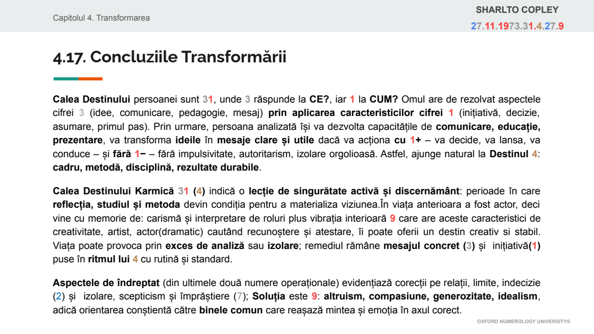

```text
Capitolul 4. Transformarea
4.17. Concluziile Transformării
Calea Destinului persoanei sunt 31, unde 3 răspunde la CE?, iar 1 la CUM? Omul are de rezolvat aspectele
cifrei 3 (idee, comunicare, pedagogie, mesaj) prin aplicarea caracteristicilor cifrei 1 (inițiativă, decizie,
asumare, primul pas). Prin urmare, persoana analizată își va dezVAULTa capacitățile de comunicare, educație,
prezentare, va transforma ideile în mesaje clare și utile dacă va acționa cu 1+ – va decide, va lansa, va
conduce – și fără 1− – fără impulsivitate, autoritarism, izolare orgolioasă. Astfel, ajunge natural la Destinul 4:
cadru, metodă, disciplină, rezultate durabile.
Calea Destinului Karmică 31 (4) indică o lecție de singurătate activă și discernământ: perioade în care
reflecția, studiul și metoda devin condiția pentru a materializa viziunea.În viața anterioara a fost actor, deci
vine cu memorie de: carismă și interpretare de roluri plus vibrația interioară 9 care are aceste caracteristici de
creativitate, artist, actor(dramatic) cautând recunoștere și atestare, îi poate oferii un destin creativ si stabil.
Viața poate provoca prin exces de analiză sau izolare; remediul rămâne mesajul concret (3) și inițiativă(1)
puse în ritmul lui 4 cu rutină și standard.
Aspectele de îndreptat (din ultimele două numere operaționale) evidențiază corecții pe relații, limite, indecizie
(2) și izolare, scepticism și împrăștiere (7); Soluția este 9: altruism, compasiune, generozitate, idealism,
adică orientarea conștientă către binele comun care reașază mintea și emoția în axul corect.
OXFORD NUMEROLOGY UNIVERSITY®
```

### Pagina 257

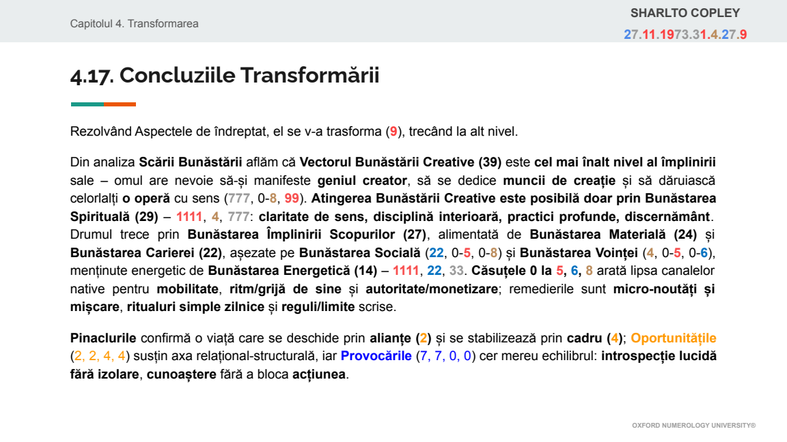

```text
Capitolul 4. Transformarea
4.17. Concluziile Transformării
Rezolvând Aspectele de îndreptat, el se v-a trasforma (9), trecând la alt nivel.
Din analiza Scării Bunăstării aflăm că Vectorul Bunăstării Creative (39) este cel mai înalt nivel al împlinirii
sale – omul are nevoie să-și manifeste geniul creator, să se dedice muncii de creație și să dăruiască
celorlalți o operă cu sens (777, 0-8, 99). Atingerea Bunăstării Creative este posibilă doar prin Bunăstarea
Spirituală (29) – 1111, 4, 777: claritate de sens, disciplină interioară, practici profunde, discernământ.
Drumul trece prin Bunăstarea Împlinirii Scopurilor (27), alimentată de Bunăstarea Materială (24) și
Bunăstarea Carierei (22), așezate pe Bunăstarea Socială (22, 0-5, 0-8) și Bunăstarea Voinței (4, 0-5, 0-6),
menținute energetic de Bunăstarea Energetică (14) – 1111, 22, 33. Căsuțele 0 la 5, 6, 8 arată lipsa canalelor
native pentru mobilitate, ritm/grijă de sine și autoritate/monetizare; remedierile sunt micro-noutăți și
mișcare, ritualuri simple zilnice și reguli/limite scrise.
Pinaclurile confirmă o viață care se deschide prin alianțe (2) și se stabilizează prin cadru (4); Oportunitățile
(2, 2, 4, 4) susțin axa relațional-structurală, iar Provocările (7, 7, 0, 0) cer mereu echilibrul: introspecție lucidă
fără izolare, cunoaștere fără a bloca acțiunea.
OXFORD NUMEROLOGY UNIVERSITY®
```

### Pagina 258

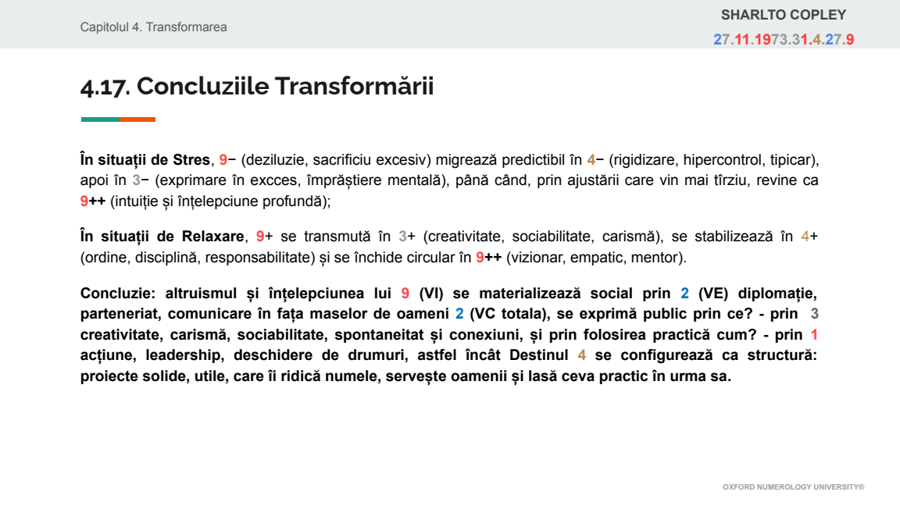

```text
Capitolul 4. Transformarea
4.17. Concluziile Transformării
În situații de Stres, 9− (deziluzie, sacrificiu excesiv) migrează predictibil în 4− (rigidizare, hipercontrol, tipicar),
apoi în 3− (exprimare în excces, împrăștiere mentală), până când, prin ajustării care vin mai tîrziu, revine ca
9++ (intuiție și înțelepciune profundă);
În situații de Relaxare, 9+ se transmută în 3+ (creativitate, sociabilitate, carismă), se stabilizează în 4+
(ordine, disciplină, responsabilitate) și se închide circular în 9++ (vizionar, empatic, mentor).
Concluzie: altruismul și înțelepciunea lui 9 (VI) se materializează social prin 2 (VE) diplomație,
parteneriat, comunicare în fața maselor de oameni 2 (VC totala), se exprimă public prin ce? - prin 3
creativitate, carismă, sociabilitate, spontaneitat și conexiuni, și prin folosirea practică cum? - prin 1
acțiune, leadership, deschidere de drumuri, astfel încât Destinul 4 se configurează ca structură:
proiecte solide, utile, care îi ridică numele, servește oamenii și lasă ceva practic în urma sa.
OXFORD NUMEROLOGY UNIVERSITY®
```

### Pagina 259

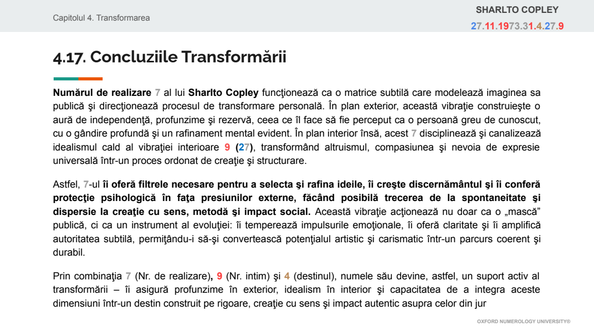

```text
Capitolul 4. Transformarea
4.17. Concluziile Transformării
Numărul de realizare 7 al lui Sharlto Copley funcţionează ca o matrice subtilă care modelează imaginea sa
publică şi direcţionează procesul de transformare personală. În plan exterior, această vibraţie construieşte o
aură de independenţă, profunzime şi rezervă, ceea ce îl face să fie perceput ca o persoană greu de cunoscut,
cu o gândire profundă şi un rafinament mental evident. În plan interior însă, acest 7 disciplinează şi canalizează
idealismul cald al vibraţiei interioare 9 (27), transformând altruismul, compasiunea şi nevoia de expresie
universală într-un proces ordonat de creaţie şi structurare.
Astfel, 7-ul îi oferă filtrele necesare pentru a selecta şi rafina ideile, îi creşte discernământul şi îi conferă
protecţie psihologică în faţa presiunilor externe, făcând posibilă trecerea de la spontaneitate şi
dispersie la creaţie cu sens, metodă şi impact social. Această vibraţie acţionează nu doar ca o „mască”
publică, ci ca un instrument al evoluţiei: îi temperează impulsurile emoţionale, îi oferă claritate şi îi amplifică
autoritatea subtilă, permiţându-i să-şi convertească potenţialul artistic şi carismatic într-un parcurs coerent şi
durabil.
Prin combinaţia 7 (Nr. de realizare), 9 (Nr. intim) şi 4 (destinul), numele său devine, astfel, un suport activ al
transformării – îi asigură profunzime în exterior, idealism în interior şi capacitatea de a integra aceste
dimensiuni într-un destin construit pe rigoare, creaţie cu sens şi impact autentic asupra celor din jur
OXFORD NUMEROLOGY UNIVERSITY®
```

### Pagina 260

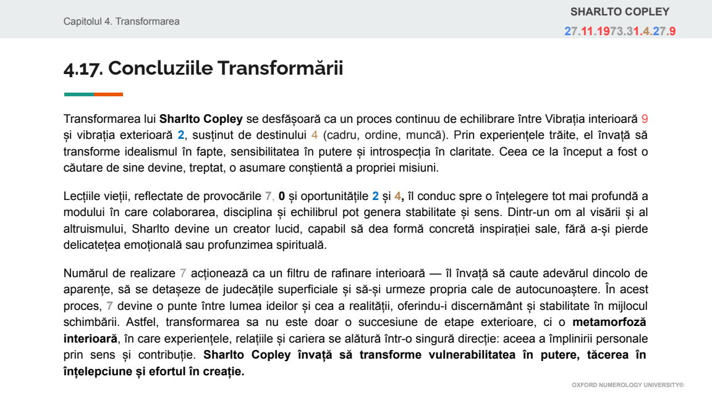

```text
Capitolul 4. Transformarea
4.17. Concluziile Transformării
Transformarea lui Sharlto Copley se desfășoară ca un proces continuu de echilibrare între Vibrația interioară 9
și vibrația exterioară 2, susținut de destinului 4 (cadru, ordine, muncă). Prin experiențele trăite, el învață să
transforme idealismul în fapte, sensibilitatea în putere și introspecția în claritate. Ceea ce la început a fost o
căutare de sine devine, treptat, o asumare conștientă a propriei misiuni.
Lecțiile vieții, reflectate de provocările 7, 0 și oportunitățile 2 și 4, îl conduc spre o înțelegere tot mai profundă a
modului în care colaborarea, disciplina și echilibrul pot genera stabilitate și sens. Dintr-un om al visării și al
altruismului, Sharlto devine un creator lucid, capabil să dea formă concretă inspirației sale, fără a-și pierde
delicatețea emoțională sau profunzimea spirituală.
Numărul de realizare 7 acționează ca un filtru de rafinare interioară — îl învață să caute adevărul dincolo de
aparențe, să se detașeze de judecățile superficiale și să-și urmeze propria cale de autocunoaștere. În acest
proces, 7 devine o punte între lumea ideilor și cea a realității, oferindu-i discernământ și stabilitate în mijlocul
schimbării. Astfel, transformarea sa nu este doar o succesiune de etape exterioare, ci o metamorfoză
interioară, în care experiențele, relațiile și cariera se alătură într-o singură direcție: aceea a împlinirii personale
prin sens și contribuție. Sharlto Copley învață să transforme vulnerabilitatea în putere, tăcerea în
înțelepciune și efortul în creație.
OXFORD NUMEROLOGY UNIVERSITY®
```

### Pagina 261

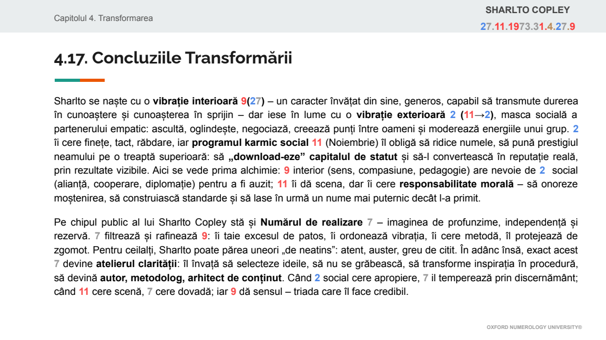

```text
Capitolul 4. Transformarea
4.17. Concluziile Transformării
Sharlto se naște cu o vibrație interioară 9(27) – un caracter învățat din sine, generos, capabil să transmute durerea
în cunoaștere și cunoașterea în sprijin – dar iese în lume cu o vibrație exterioară 2 (11→2), masca socială a
partenerului empatic: ascultă, oglindește, negociază, creează punți între oameni și moderează energiile unui grup. 2
îi cere finețe, tact, răbdare, iar programul karmic social 11 (Noiembrie) îl obligă să ridice numele, să pună prestigiul
neamului pe o treaptă superioară: să „download-eze” capitalul de statut și să-l convertească în reputație reală,
prin rezultate vizibile. Aici se vede prima alchimie: 9 interior (sens, compasiune, pedagogie) are nevoie de 2 social
(alianță, cooperare, diplomație) pentru a fi auzit; 11 îi dă scena, dar îi cere responsabilitate morală – să onoreze
moștenirea, să construiască standarde și să lase în urmă un nume mai puternic decât l-a primit.
Pe chipul public al lui Sharlto Copley stă și Numărul de realizare 7 – imaginea de profunzime, independență și
rezervă. 7 filtrează și rafinează 9: îi taie excesul de patos, îi ordonează vibrația, îi cere metodă, îl protejează de
zgomot. Pentru ceilalți, Sharlto poate părea uneori „de neatins”: atent, auster, greu de citit. În adânc însă, exact acest
7 devine atelierul clarității: îl învață să selecteze ideile, să nu se grăbească, să transforme inspirația în procedură,
să devină autor, metodolog, arhitect de conținut. Când 2 social cere apropiere, 7 il temperează prin discernământ;
când 11 cere scenă, 7 cere dovadă; iar 9 dă sensul – triada care îl face credibil.
OXFORD NUMEROLOGY UNIVERSITY®
```

### Pagina 262

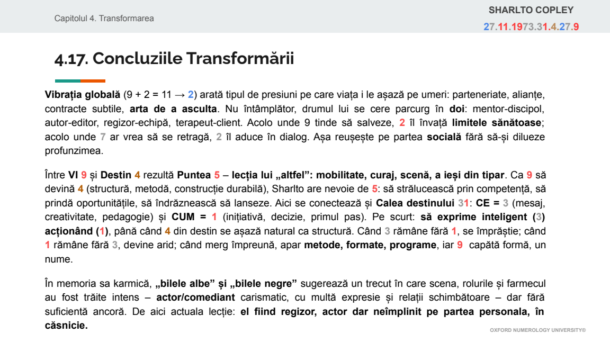

```text
Capitolul 4. Transformarea
4.17. Concluziile Transformării
Vibrația globală (9 + 2 = 11 → 2) arată tipul de presiuni pe care viața i le așază pe umeri: parteneriate, alianțe,
contracte subtile, arta de a asculta. Nu întâmplător, drumul lui se cere parcurg în doi: mentor-discipol,
autor-editor, regizor-echipă, terapeut-client. Acolo unde 9 tinde să salveze, 2 îl învață limitele sănătoase;
acolo unde 7 ar vrea să se retragă, 2 îl aduce în dialog. Așa reușește pe partea socială fără să-și dilueze
profunzimea.
Între VI 9 și Destin 4 rezultă Puntea 5 – lecția lui „altfel”: mobilitate, curaj, scenă, a ieși din tipar. Ca 9 să
devină 4 (structură, metodă, construcție durabilă), Sharlto are nevoie de 5: să strălucească prin competență, să
prindă oportunitățile, să îndrăznească să lanseze. Aici se conectează și Calea destinului 31: CE = 3 (mesaj,
creativitate, pedagogie) și CUM = 1 (inițiativă, decizie, primul pas). Pe scurt: să exprime inteligent (3)
acționând (1), până când 4 din destin se așază natural ca structură. Când 3 rămâne fără 1, se împrăștie; când
1 rămâne fără 3, devine arid; când merg împreună, apar metode, formate, programe, iar 9 capătă formă, un
nume.
În memoria sa karmică, „bilele albe” și „bilele negre” sugerează un trecut în care scena, rolurile și farmecul
au fost trăite intens – actor/comediant carismatic, cu multă expresie și relații schimbătoare – dar fără
suficientă ancoră. De aici actuala lecție: el fiind regizor, actor dar neîmplinit pe partea personala, în
căsnicie.
OXFORD NUMEROLOGY UNIVERSITY®
```

### Pagina 263

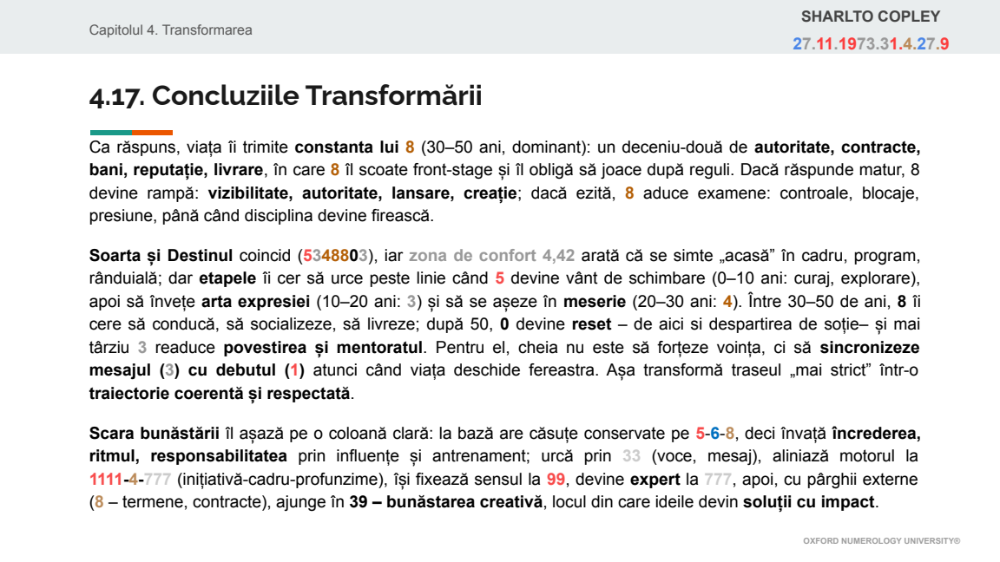

```text
Capitolul 4. Transformarea
4.17. Concluziile Transformării
Ca răspuns, viața îi trimite constanta lui 8 (30–50 ani, dominant): un deceniu-două de autoritate, contracte,
bani, reputație, livrare, în care 8 îl scoate front-stage și îl obligă să joace după reguli. Dacă răspunde matur, 8
devine rampă: vizibilitate, autoritate, lansare, creație; dacă ezită, 8 aduce examene: controale, blocaje,
presiune, până când disciplina devine firească.
Soarta și Destinul coincid (5348803), iar zona de confort 4,42 arată că se simte „acasă” în cadru, program,
rânduială; dar etapele îi cer să urce peste linie când 5 devine vânt de schimbare (0–10 ani: curaj, explorare),
apoi să învețe arta expresiei (10–20 ani: 3) și să se așeze în meserie (20–30 ani: 4). Între 30–50 de ani, 8 îi
cere să conducă, să socializeze, să livreze; după 50, 0 devine reset – de aici si despartirea de soție– și mai
târziu 3 readuce povestirea și mentoratul. Pentru el, cheia nu este să forțeze voința, ci să sincronizeze
mesajul (3) cu debutul (1) atunci când viața deschide fereastra. Așa transformă traseul „mai strict” într-o
traiectorie coerentă și respectată.
Scara bunăstării îl așază pe o coloană clară: la bază are căsuțe conservate pe 5-6-8, deci învață încrederea,
ritmul, responsabilitatea prin influențe și antrenament; urcă prin 33 (voce, mesaj), aliniază motorul la
1111-4-777 (inițiativă-cadru-profunzime), își fixează sensul la 99, devine expert la 777, apoi, cu pârghii externe
(8 – termene, contracte), ajunge în 39 – bunăstarea creativă, locul din care ideile devin soluții cu impact.
OXFORD NUMEROLOGY UNIVERSITY®
```

### Pagina 264

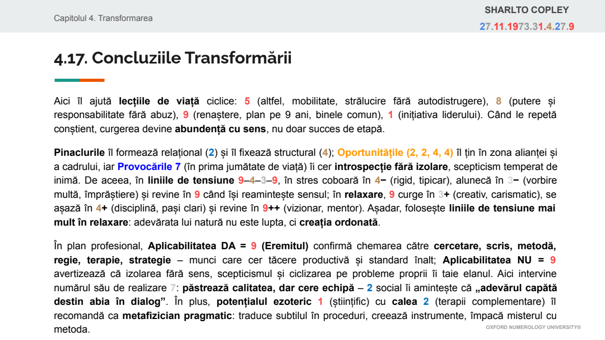

```text
Capitolul 4. Transformarea
4.17. Concluziile Transformării
Aici îl ajută lecțiile de viață ciclice: 5 (altfel, mobilitate, strălucire fără autodistrugere), 8 (putere și
responsabilitate fără abuz), 9 (renaștere, plan pe 9 ani, binele comun), 1 (inițiativa liderului). Când le repetă
conștient, curgerea devine abundență cu sens, nu doar succes de etapă.
Pinaclurile îl formează relațional (2) și îl fixează structural (4); Oportunitățile (2, 2, 4, 4) îl țin în zona alianței și
a cadrului, iar Provocările 7 (în prima jumătate de viață) îi cer introspecție fără izolare, scepticism temperat de
inimă. De aceea, în liniile de tensiune 9–4–3–9, în stres coboară în 4− (rigid, tipicar), alunecă în 3− (vorbire
multă, împrăștiere) și revine în 9 când își reamintește sensul; în relaxare, 9 curge în 3+ (creativ, carismatic), se
așază în 4+ (disciplină, pași clari) și revine în 9++ (vizionar, mentor). Așadar, folosește liniile de tensiune mai
mult în relaxare: adevărata lui natură nu este lupta, ci creația ordonată.
În plan profesional, Aplicabilitatea DA = 9 (Eremitul) confirmă chemarea către cercetare, scris, metodă,
regie, terapie, strategie – munci care cer tăcere productivă și standard înalt; Aplicabilitatea NU = 9
avertizează că izolarea fără sens, scepticismul și ciclizarea pe probleme proprii îi taie elanul. Aici intervine
numărul său de realizare 7: păstrează calitatea, dar cere echipă – 2 social îi amintește că „adevărul capătă
destin abia în dialog”. În plus, potențialul ezoteric 1 (științific) cu calea 2 (terapii complementare) îl
recomandă ca metafizician pragmatic: traduce subtilul în proceduri, creează instrumente, împacă misterul cu
metoda. OXFORD NUMEROLOGY UNIVERSITY®
```

### Pagina 265

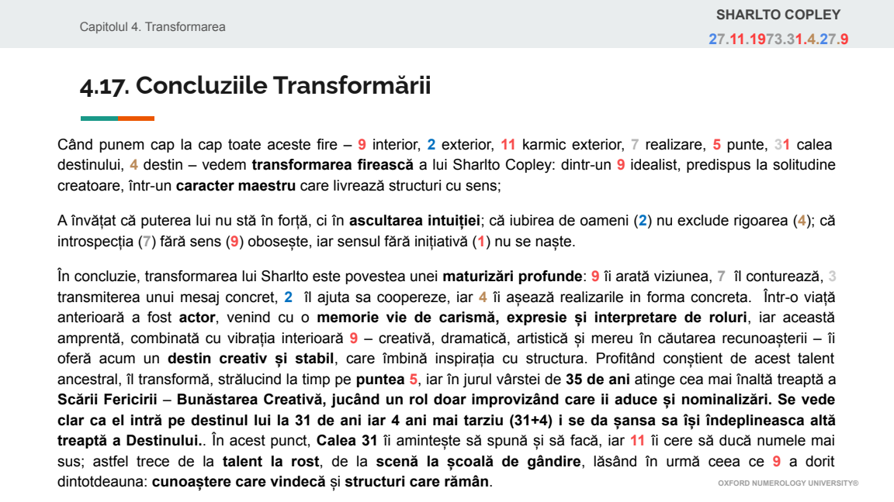

```text
Capitolul 4. Transformarea
4.17. Concluziile Transformării
Când punem cap la cap toate aceste fire – 9 interior, 2 exterior, 11 karmic exterior, 7 realizare, 5 punte, 31 calea
destinului, 4 destin – vedem transformarea firească a lui Sharlto Copley: dintr-un 9 idealist, predispus la solitudine
creatoare, într-un caracter maestru care livrează structuri cu sens;
A învățat că puterea lui nu stă în forță, ci în ascultarea intuiției; că iubirea de oameni (2) nu exclude rigoarea (4); că
introspecția (7) fără sens (9) obosește, iar sensul fără inițiativă (1) nu se naște.
În concluzie, transformarea lui Sharlto este povestea unei maturizări profunde: 9 îi arată viziunea, 7 îl conturează, 3
transmiterea unui mesaj concret, 2 îl ajuta sa coopereze, iar 4 îi așează realizarile in forma concreta. Într-o viață
anterioară a fost actor, venind cu o memorie vie de carismă, expresie și interpretare de roluri, iar această
amprentă, combinată cu vibrația interioară 9 – creativă, dramatică, artistică și mereu în căutarea recunoașterii – îi
oferă acum un destin creativ și stabil, care îmbină inspirația cu structura. Profitând conștient de acest talent
ancestral, îl transformă, strălucind la timp pe puntea 5, iar în jurul vârstei de 35 de ani atinge cea mai înaltă treaptă a
Scării Fericirii – Bunăstarea Creativă, jucând un rol doar improvizând care ii aduce și nominalizări. Se vede
clar ca el intră pe destinul lui la 31 de ani iar 4 ani mai tarziu (31+4) i se da șansa sa își îndeplineasca altă
treaptă a Destinului.. În acest punct, Calea 31 îi amintește să spună și să facă, iar 11 îi cere să ducă numele mai
sus; astfel trece de la talent la rost, de la scenă la școală de gândire, lăsând în urmă ceea ce 9 a dorit
dintotdeauna: cunoaștere care vindecă și structuri care rămân.
OXFORD NUMEROLOGY UNIVERSITY®
```

# Capitolul 5. Destinul

_Pagini sursa: 266-293._

## Formule si calcule extrase pentru rafinare

### ZIUA + LUNA + ANUL

- Concept analizat: verificat in VAULT/Numerologie - [[Vibratia Destinului]].
- Metoda de calcul: ZIUA + LUNA + ANUL = 2+7+1+1+1+9+7+3= 31 3 + 1 = 4 Vibratia DESTINULUI = 4
- Calcul: ZIUA + LUNA + ANUL = 2+7+1+1+1+9+7+3= 31 3 + 1 = 4 Vibratia DESTINULUI = 4
- Verificare: ok - concept verificat in VAULT/Numerologie; formula de calcul este compatibila cu documentatia.
- Verificare pagina: pagina 269.

### VIBRAȚIA DESTINULUI

- Concept analizat: verificat in VAULT/Numerologie - [[Vibratia Destinului]].
- Metoda de calcul: VIBRAȚIA DESTINULUI = ZIUA + LUNA + ANUL
- Calcul: VIBRAȚIA DESTINULUI = ZIUA + LUNA + ANUL
- Verificare: ok - concept verificat in VAULT/Numerologie; formula de calcul este compatibila cu documentatia.
- Verificare pagina: pagina 269.

### Vibrația destinului

- Concept analizat: verificat in VAULT/Numerologie - [[Vibratia Destinului]].
- Metoda de calcul: Vibrația destinului = VOCAȚIA, Menirea Vasului, Apogeul, Potențialitatea maximă,
- Calcul: Vibrația destinului = VOCAȚIA, Menirea Vasului, Apogeul, Potențialitatea maximă,
- Verificare: ok - concept verificat in VAULT/Numerologie; formula de calcul este compatibila cu documentatia.
- Verificare pagina: pagina 269.

### ▪ Primul Pinaclu se află după formula

- Concept analizat: verificat in VAULT/Numerologie - [[Vibratia Destinului]].
- Metoda de calcul: ▪ Primul Pinaclu se află după formula: 36 minus cifra destinului 36 - 4 = 32 ani
- Calcul: 36 minus cifra destinului 36 - 4 = 32 ani
- Verificare: ok - concept verificat in VAULT/Numerologie; formula de calcul este compatibila cu documentatia.
- Verificare pagina: pagina 272.

### ▪ Al doilea Pinaclu se află adunând 9 ani, de la următorul an (+9) 33 + 9

- Concept analizat: verificat in VAULT/Numerologie - [[Pinacluri - Oportunitati si Provocari]].
- Metoda de calcul: ▪ Al doilea Pinaclu se află adunând 9 ani, de la următorul an (+9) 33 + 9 = 42 ani
- Calcul: ▪ Al doilea Pinaclu se află adunând 9 ani, de la următorul an (+9) 33 + 9 = 42 ani
- Verificare: ok - concept verificat in VAULT/Numerologie; formula de calcul este compatibila cu documentatia.
- Verificare pagina: pagina 272.

### ▪ Al treilea pinaclu se afla adunând încă 9 ani, de la următorul an (+9) 43 + 9

- Concept analizat: verificat in VAULT/Numerologie - [[Pinacluri - Oportunitati si Provocari]].
- Metoda de calcul: ▪ Al treilea pinaclu se afla adunând încă 9 ani, de la următorul an (+9) 43 + 9 = 52 ani
- Calcul: ▪ Al treilea pinaclu se afla adunând încă 9 ani, de la următorul an (+9) 43 + 9 = 52 ani
- Verificare: ok - concept verificat in VAULT/Numerologie; formula de calcul este compatibila cu documentatia.
- Verificare pagina: pagina 272.

### PINACLU 3 (43- 52 ani)

- Concept analizat: verificat in VAULT/Numerologie - [[Pinacluri - Oportunitati si Provocari]].
- Metoda de calcul: PINACLU 3 (43- 52 ani): O1 + O2 = 11+11 = 22 = 2+2=4 O3 = 4
- Calcul: O1 + O2 = 11+11 = 22 = 2+2=4 O3 = 4
- Verificare: ok - concept verificat in VAULT/Numerologie; formula de calcul este compatibila cu documentatia.
- Verificare pagina: pagina 273.

### PINACLU 3 (43- 52 ani)

- Concept analizat: verificat in VAULT/Numerologie - [[Pinacluri - Oportunitati si Provocari]].
- Metoda de calcul: PINACLU 3 (43- 52 ani): P1 - P2 = 4 - 4 P3 = 0
- Calcul: P1 - P2 = 4 - 4 P3 = 0
- Verificare: ok - concept verificat in VAULT/Numerologie; formula de calcul este compatibila cu documentatia.
- Verificare pagina: pagina 274.

### Calea destinului minus 2 x prima cifră din ziua de naștere

- Concept analizat: verificat in VAULT/Numerologie - [[Calea Destinului]].
- Metoda de calcul: Calea destinului minus 2 x prima cifră din ziua de naștere: 31- 2 x 2 = 27
- Calcul: 31- 2 x 2 = 27
- Verificare: ok - concept verificat in VAULT/Numerologie; formula de calcul este compatibila cu documentatia.
- Verificare pagina: pagina 276.

### Calea destinului minus 2 x prima cifră din ziua de naștere, redusă la o singură cifră

- Concept analizat: verificat in VAULT/Numerologie - [[Calea Destinului]].
- Metoda de calcul: Calea destinului minus 2 x prima cifră din ziua de naștere, redusă la o singură cifră: 2 + 7 = 9
- Calcul: 2 + 7 = 9
- Verificare: ok - concept verificat in VAULT/Numerologie; formula de calcul este compatibila cu documentatia.
- Verificare pagina: pagina 276.

### Vârsta Spiritului (6 x 189) - 189

- Concept analizat: verificat in VAULT/Numerologie - [[Codul Spiritului]].
- Metoda de calcul: Vârsta Spiritului (6 x 189) - 189 = 1134 - 189 = 945 ani + 51 ani = 996 ani
- Calcul: Vârsta Spiritului (6 x 189) - 189 = 1134 - 189 = 945 ani + 51 ani = 996 ani
- Verificare: ok - concept verificat in VAULT/Numerologie; formula de calcul este compatibila cu documentatia.
- Verificare pagina: pagina 280.

### Rezultat

- Concept analizat: verificat in VAULT/Numerologie - [[Deschidere spre Ezoterism]].
- Metoda de calcul: Rezultat: 2 Calea ezoterică 2 este cea a Terapiilor complementare.
- Calcul: Rezultat: 2 Calea ezoterică 2 este cea a Terapiilor complementare.
- Verificare: ok - concept verificat in VAULT/Numerologie; metoda trebuie rafinata din textul paginii.
- Verificare pagina: pagina 281.

### Cifra Destinului - Cifra Vocalelor

- Concept analizat: verificat in VAULT/Numerologie - [[Influentele Numelui]].
- Metoda de calcul: Cifra Destinului - Cifra Vocalelor: 4 - 9 = 5
- Calcul: 4 - 9 = 5
- Verificare: ok - concept verificat in VAULT/Numerologie; formula de calcul este compatibila cu documentatia.
- Verificare pagina: pagina 282.

### Cifra Destinului - Cifra Consoanelor

- Concept analizat: verificat in VAULT/Numerologie - [[Influentele Numelui]].
- Metoda de calcul: Cifra Destinului - Cifra Consoanelor: 4 - 7 = 3
- Calcul: 4 - 7 = 3
- Verificare: ok - concept verificat in VAULT/Numerologie; formula de calcul este compatibila cu documentatia.
- Verificare pagina: pagina 282.

### Vibrația DESTINULUI, obținută prin însumarea cifrelor din data nașterii (2+7+1+1+1+9+7+3

- Concept analizat: verificat in VAULT/Numerologie - [[Vibratia Destinului]].
- Metoda de calcul: Vibrația DESTINULUI, obținută prin însumarea cifrelor din data nașterii (2+7+1+1+1+9+7+3 = 31 → 4), arată
- Calcul: Vibrația DESTINULUI, obținută prin însumarea cifrelor din data nașterii (2+7+1+1+1+9+7+3 = 31 → 4), arată
- Verificare: ok - concept verificat in VAULT/Numerologie; formula de calcul este compatibila cu documentatia.
- Verificare pagina: pagina 287.

### Calea Destinului ne arată CE are de împlinit omul și CUM merită să-și împlinească Destinul

- Concept analizat: verificat in VAULT/Numerologie - [[Calea Destinului]].
- Metoda de calcul: Calea Destinului ne arată CE are de împlinit omul și CUM merită să-și împlinească Destinul: 31 → 3/1. CE (3)
- Calcul: Calea Destinului ne arată CE are de împlinit omul și CUM merită să-și împlinească Destinul: 31 → 3/1. CE (3)
- Verificare: ok - concept verificat in VAULT/Numerologie; metoda trebuie rafinata din textul paginii.
- Verificare pagina: pagina 287.

### naște firesc 4

- Concept analizat: verificat in VAULT/Numerologie - [[Vibratia Destinului]].
- Metoda de calcul: naște firesc 4: structură, plan, execuție, rezultate durabile. Așa se configurează destinul: nu prin acumulări
- Calcul: naște firesc 4: structură, plan, execuție, rezultate durabile. Așa se configurează destinul: nu prin acumulări
- Verificare: ok - concept verificat in VAULT/Numerologie; metoda trebuie rafinata din textul paginii.
- Verificare pagina: pagina 287.

### Aspectele de îndreptat ale acestei existențe decurg din formula 31 − 2×prima cifră din zi 2

- Concept analizat: concept lipsa in VAULT/Numerologie.
- Metoda de calcul: Aspectele de îndreptat ale acestei existențe decurg din formula 31 − 2×prima cifră din zi 2 = 27 și vorbesc
- Calcul: Aspectele de îndreptat ale acestei existențe decurg din formula 31 − 2×prima cifră din zi 2 = 27 și vorbesc
- Verificare: concept lipsa in VAULT/Numerologie.
- Verificare pagina: pagina 289.

### Vibrația cosmică clarifică funcția și locul omului în viață. Componenta fixă a anului (1+9

- Concept analizat: concept lipsa in VAULT/Numerologie.
- Metoda de calcul: Vibrația cosmică clarifică funcția și locul omului în viață. Componenta fixă a anului (1+9 = 10 → 1) indică un
- Calcul: Vibrația cosmică clarifică funcția și locul omului în viață. Componenta fixă a anului (1+9 = 10 → 1) indică un
- Verificare: concept lipsa in VAULT/Numerologie.
- Verificare pagina: pagina 289.

### sens (9). În acest tablou, Destinul 4 nu îngustează orizontul; îl ancorează

- Concept analizat: verificat in VAULT/Numerologie - [[Vibratia Destinului]].
- Metoda de calcul: sens (9). În acest tablou, Destinul 4 nu îngustează orizontul; îl ancorează: transformă idealurile în structuri,
- Calcul: sens (9). În acest tablou, Destinul 4 nu îngustează orizontul; îl ancorează: transformă idealurile în structuri,
- Verificare: ok - concept verificat in VAULT/Numerologie; metoda trebuie rafinata din textul paginii.
- Verificare pagina: pagina 289.

### Concluzia Destinului

- Concept analizat: verificat in VAULT/Numerologie - [[Vibratia Destinului]].
- Metoda de calcul: Concluzia Destinului: altruismul și înțelepciunea lui 9 se materializează social prin 2 (diplomație, parteneriat,
- Calcul: Concluzia Destinului: altruismul și înțelepciunea lui 9 se materializează social prin 2 (diplomație, parteneriat,
- Verificare: ok - concept verificat in VAULT/Numerologie; metoda trebuie rafinata din textul paginii.
- Verificare pagina: pagina 290.

### Conform întregii analize (VI

- Concept analizat: verificat in VAULT/Numerologie - [[Scara Bunastarii]].
- Metoda de calcul: Conform întregii analize (VI=9, VE=2, Calea 31→4, Pinacluri și Scara Bunăstării), după 31 de ani începe
- Calcul: Conform întregii analize (VI=9, VE=2, Calea 31→4, Pinacluri și Scara Bunăstării), după 31 de ani începe
- Verificare: ok - concept verificat in VAULT/Numerologie; formula de calcul este compatibila cu documentatia.
- Verificare pagina: pagina 290.

### între 33–42 de ani (ordine, metodă, planificare, rezultate concrete) și o maturizare deplină în Pinaclul 3

- Concept analizat: verificat in VAULT/Numerologie - [[Pinacluri - Oportunitati si Provocari]].
- Metoda de calcul: între 33–42 de ani (ordine, metodă, planificare, rezultate concrete) și o maturizare deplină în Pinaclul 3:
- Calcul: între 33–42 de ani (ordine, metodă, planificare, rezultate concrete) și o maturizare deplină în Pinaclul 3:
- Verificare: ok - concept verificat in VAULT/Numerologie; metoda trebuie rafinata din textul paginii.
- Verificare pagina: pagina 290.

### și modelează destinul (4) nativului. Prin structura sa numerică, acest nume adună trei straturi esențiale

- Concept analizat: verificat in VAULT/Numerologie - [[Vibratia Destinului]].
- Metoda de calcul: și modelează destinul (4) nativului. Prin structura sa numerică, acest nume adună trei straturi esențiale: numărul
- Calcul: și modelează destinul (4) nativului. Prin structura sa numerică, acest nume adună trei straturi esențiale: numărul
- Verificare: ok - concept verificat in VAULT/Numerologie; metoda trebuie rafinata din textul paginii.
- Verificare pagina: pagina 291.

### (31), numele acționează ca o punte de transformare

- Concept analizat: verificat in VAULT/Numerologie - [[Calea Destinului]].
- Metoda de calcul: (31), numele acționează ca o punte de transformare: mesajul și pedagogia lui 3 (calea destinului), combinate cu
- Calcul: (31), numele acționează ca o punte de transformare: mesajul și pedagogia lui 3 (calea destinului), combinate cu
- Verificare: ok - concept verificat in VAULT/Numerologie; metoda trebuie rafinata din textul paginii.
- Verificare pagina: pagina 291.

## Pagini si text sursa

### Pagina 266


```text
Destinul
```

### Pagina 267

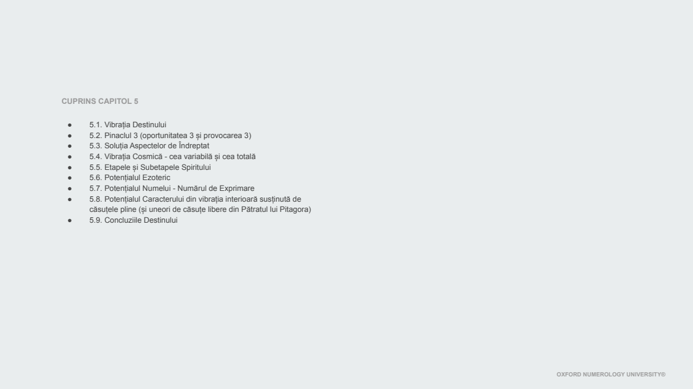

```text
CUPRINS CAPITOL 5
● 5.1. Vibrația Destinului
● 5.2. Pinaclul 3 (oportunitatea 3 și provocarea 3)
● 5.3. Soluția Aspectelor de Îndreptat
● 5.4. Vibrația Cosmică - cea variabilă și cea totală
● 5.5. Etapele și Subetapele Spiritului
● 5.6. Potențialul Ezoteric
● 5.7. Potențialul Numelui - Numărul de Exprimare
● 5.8. Potențialul Caracterului din vibrația interioară susținută de
căsuțele pline (și uneori de căsuțe libere din Pătratul lui Pitagora)
● 5.9. Concluziile Destinului
OXFORD NUMEROLOGY UNIVERSITY®
---
```

### Pagina 268

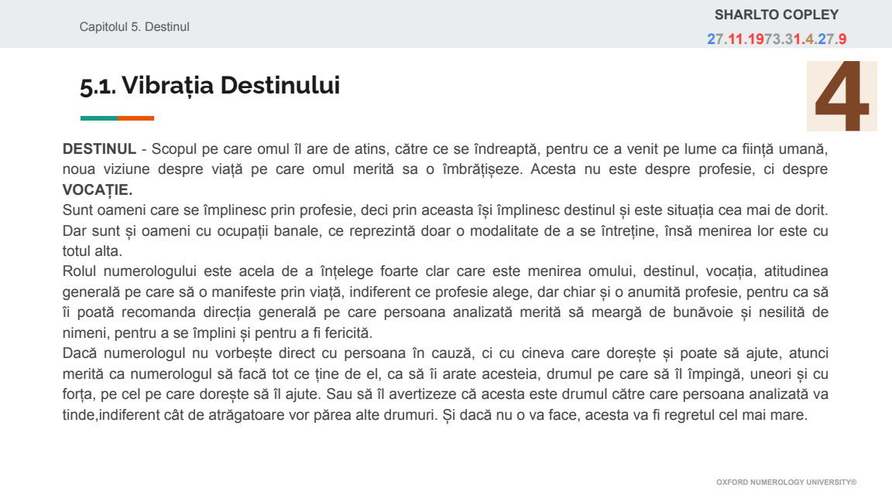

```text
Capitolul 5. Destinul
5.1. Vibrația Destinului
DESTINUL - Scopul pe care omul îl are de atins, către ce se îndreaptă, pentru ce a venit pe lume ca ființă umană,
noua viziune despre viață pe care omul merită sa o îmbrățișeze. Acesta nu este despre profesie, ci despre
VOCAȚIE.
Sunt oameni care se împlinesc prin profesie, deci prin aceasta își împlinesc destinul și este situația cea mai de dorit.
Dar sunt și oameni cu ocupații banale, ce reprezintă doar o modalitate de a se întreține, însă menirea lor este cu
totul alta.
Rolul numerologului este acela de a înțelege foarte clar care este menirea omului, destinul, vocația, atitudinea
generală pe care să o manifeste prin viață, indiferent ce profesie alege, dar chiar și o anumită profesie, pentru ca să
îi poată recomanda direcția generală pe care persoana analizată merită să meargă de bunăvoie și nesilită de
nimeni, pentru a se împlini și pentru a fi fericită.
Dacă numerologul nu vorbește direct cu persoana în cauză, ci cu cineva care dorește și poate să ajute, atunci
merită ca numerologul să facă tot ce ține de el, ca să îi arate acesteia, drumul pe care să îl împingă, uneori și cu
forța, pe cel pe care dorește să îl ajute. Sau să îl avertizeze că acesta este drumul către care persoana analizată va
tinde,indiferent cât de atrăgatoare vor părea alte drumuri. Și dacă nu o va face, acesta va fi regretul cel mai mare.
OXFORD NUMEROLOGY UNIVERSITY®
```

### Pagina 269

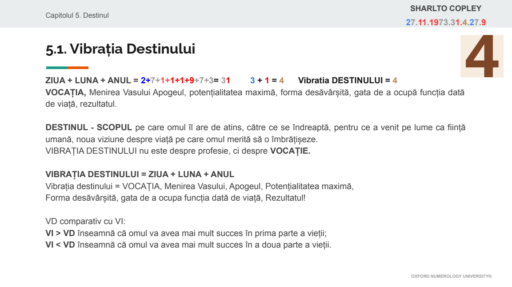

```text
Capitolul 5. Destinul
5.1. Vibrația Destinului
ZIUA + LUNA + ANUL = 2+7+1+1+1+9+7+3= 31 3 + 1 = 4 Vibratia DESTINULUI = 4
VOCAȚIA, Menirea Vasului Apogeul, potențialitatea maximă, forma desăvârșită, gata de a ocupă funcția dată
de viață, rezultatul.
DESTINUL - SCOPUL pe care omul îl are de atins, către ce se îndreaptă, pentru ce a venit pe lume ca ființă
umană, noua viziune despre viață pe care omul merită să o îmbrățișeze.
VIBRAȚIA DESTINULUI nu este despre profesie, ci despre VOCAȚIE.
VIBRAȚIA DESTINULUI = ZIUA + LUNA + ANUL
Vibrația destinului = VOCAȚIA, Menirea Vasului, Apogeul, Potențialitatea maximă,
Forma desăvârșită, gata de a ocupa funcția dată de viață, Rezultatul!
VD comparativ cu VI:
VI > VD înseamnă că omul va avea mai mult succes în prima parte a vieții;
VI < VD înseamnă că omul va avea mai mult succes în a doua parte a vieții.
OXFORD NUMEROLOGY UNIVERSITY®
```

### Pagina 270

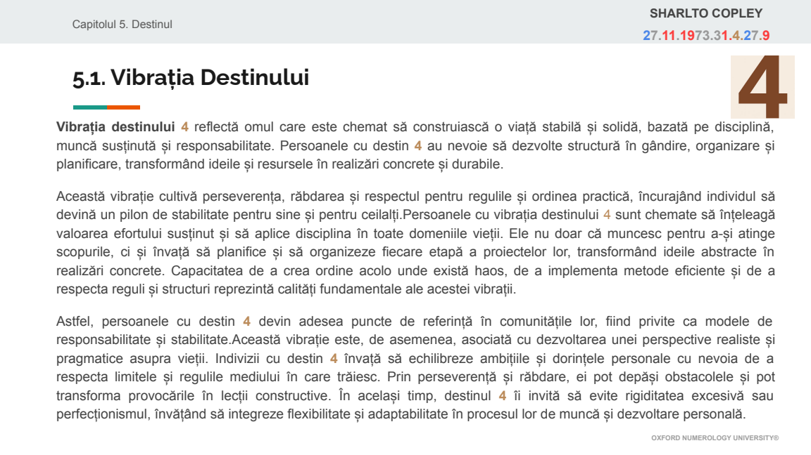

```text
Capitolul 5. Destinul
5.1. Vibrația Destinului
Vibrația destinului 4 reflectă omul care este chemat să construiască o viață stabilă și solidă, bazată pe disciplină,
muncă susținută și responsabilitate. Persoanele cu destin 4 au nevoie să dezVAULTe structură în gândire, organizare și
planificare, transformând ideile și resursele în realizări concrete și durabile.
Această vibrație cultivă perseverența, răbdarea și respectul pentru regulile și ordinea practică, încurajând individul să
devină un pilon de stabilitate pentru sine și pentru ceilalți.Persoanele cu vibrația destinului 4 sunt chemate să înțeleagă
valoarea efortului susținut și să aplice disciplina în toate domeniile vieții. Ele nu doar că muncesc pentru a-și atinge
scopurile, ci și învață să planifice și să organizeze fiecare etapă a proiectelor lor, transformând ideile abstracte în
realizări concrete. Capacitatea de a crea ordine acolo unde există haos, de a implementa metode eficiente și de a
respecta reguli și structuri reprezintă calități fundamentale ale acestei vibrații.
Astfel, persoanele cu destin 4 devin adesea puncte de referință în comunitățile lor, fiind privite ca modele de
responsabilitate și stabilitate.Această vibrație este, de asemenea, asociată cu dezVAULTarea unei perspective realiste și
pragmatice asupra vieții. Indivizii cu destin 4 învață să echilibreze ambițiile și dorințele personale cu nevoia de a
respecta limitele și regulile mediului în care trăiesc. Prin perseverență și răbdare, ei pot depăși obstacolele și pot
transforma provocările în lecții constructive. În același timp, destinul 4 îi invită să evite rigiditatea excesivă sau
perfecționismul, învățând să integreze flexibilitate și adaptabilitate în procesul lor de muncă și dezVAULTare personală.
OXFORD NUMEROLOGY UNIVERSITY®
```

### Pagina 271

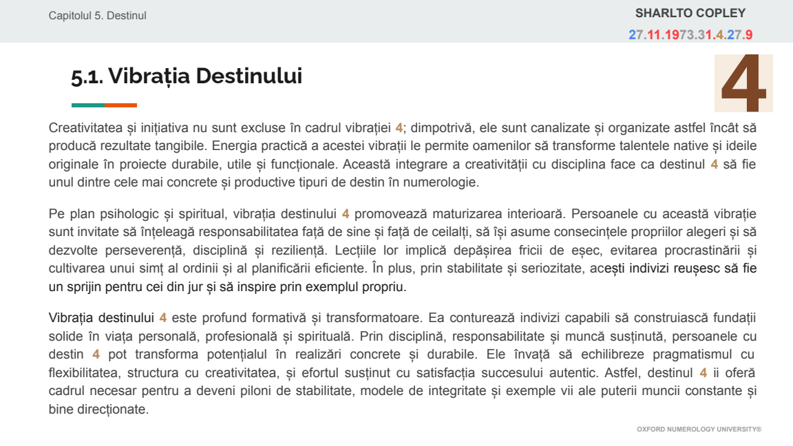

```text
Capitolul 5. Destinul SHARLTO COPLEY
5.1. Vibrația Destinului
Creativitatea și inițiativa nu sunt excluse în cadrul vibrației 4; dimpotrivă, ele sunt canalizate și organizate astfel încât să
producă rezultate tangibile. Energia practică a acestei vibrații le permite oamenilor să transforme talentele native și ideile
originale în proiecte durabile, utile și funcționale. Această integrare a creativității cu disciplina face ca destinul 4 să fie
unul dintre cele mai concrete și productive tipuri de destin în numerologie.
Pe plan psihologic și spiritual, vibrația destinului 4 promovează maturizarea interioară. Persoanele cu această vibrație
sunt invitate să înțeleagă responsabilitatea față de sine și față de ceilalți, să își asume consecințele propriilor alegeri și să
dezVAULTe perseverență, disciplină și reziliență. Lecțiile lor implică depășirea fricii de eșec, evitarea procrastinării și
cultivarea unui simț al ordinii și al planificării eficiente. În plus, prin stabilitate și seriozitate, acești indivizi reușesc să fie
un sprijin pentru cei din jur și să inspire prin exemplul propriu.
Vibrația destinului 4 este profund formativă și transformatoare. Ea conturează indivizi capabili să construiască fundații
solide în viața personală, profesională și spirituală. Prin disciplină, responsabilitate și muncă susținută, persoanele cu
destin 4 pot transforma potențialul în realizări concrete și durabile. Ele învață să echilibreze pragmatismul cu
flexibilitatea, structura cu creativitatea, și efortul susținut cu satisfacția succesului autentic. Astfel, destinul 4 ii oferă
cadrul necesar pentru a deveni piloni de stabilitate, modele de integritate și exemple vii ale puterii muncii constante și
bine direcționate.
OXFORD NUMEROLOGY UNIVERSITY®
```

### Pagina 272

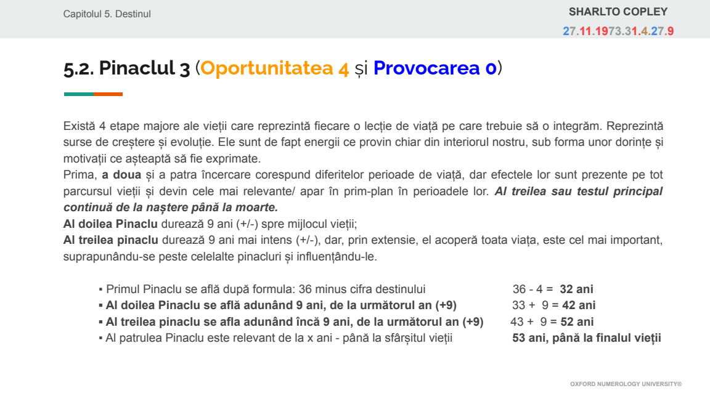

```text
Capitolul 5. Destinul SHARLTO COPLEY
5.2. Pinaclul 3 (Oportunitatea 4 și Provocarea 0)
Există 4 etape majore ale vieții care reprezintă fiecare o lecție de viață pe care trebuie să o integrăm. Reprezintă
surse de creștere și evoluție. Ele sunt de fapt energii ce provin chiar din interiorul nostru, sub forma unor dorințe și
motivații ce așteaptă să fie exprimate.
Prima, a doua și a patra încercare corespund diferitelor perioade de viață, dar efectele lor sunt prezente pe tot
parcursul vieții și devin cele mai relevante/ apar în prim-plan în perioadele lor. Al treilea sau testul principal
continuă de la naștere până la moarte.
Al doilea Pinaclu durează 9 ani (+/-) spre mijlocul vieții;
Al treilea pinaclu durează 9 ani mai intens (+/-), dar, prin extensie, el acoperă toata viața, este cel mai important,
suprapunându-se peste celelalte pinacluri și influențându-le.
▪ Primul Pinaclu se află după formula: 36 minus cifra destinului 36 - 4 = 32 ani
▪ Al doilea Pinaclu se află adunând 9 ani, de la următorul an (+9) 33 + 9 = 42 ani
▪ Al treilea pinaclu se afla adunând încă 9 ani, de la următorul an (+9) 43 + 9 = 52 ani
▪ Al patrulea Pinaclu este relevant de la x ani - până la sfârșitul vieții 53 ani, până la finalul vieții
OXFORD NUMEROLOGY UNIVERSITY®
```

### Pagina 273

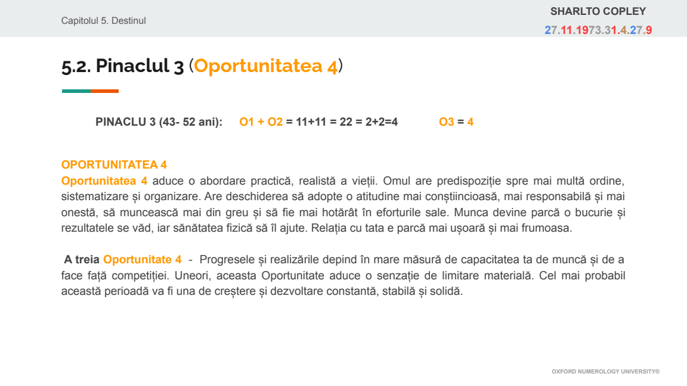

```text
Capitolul 5. Destinul
5.2. Pinaclul 3 (Oportunitatea 4)
PINACLU 3 (43- 52 ani): O1 + O2 = 11+11 = 22 = 2+2=4 O3 = 4
OPORTUNITATEA 4
Oportunitatea 4 aduce o abordare practică, realistă a vieții. Omul are predispoziție spre mai multă ordine,
sistematizare și organizare. Are deschiderea să adopte o atitudine mai conștiincioasă, mai responsabilă și mai
onestă, să muncească mai din greu și să fie mai hotărât în eforturile sale. Munca devine parcă o bucurie și
rezultatele se văd, iar sănătatea fizică să îl ajute. Relația cu tata e parcă mai ușoară și mai frumoasa.
A treia Oportunitate 4 - Progresele și realizările depind în mare măsură de capacitatea ta de muncă și de a
face față competiției. Uneori, aceasta Oportunitate aduce o senzație de limitare materială. Cel mai probabil
această perioadă va fi una de creștere și dezVAULTare constantă, stabilă și solidă.
OXFORD NUMEROLOGY UNIVERSITY®
```

### Pagina 274

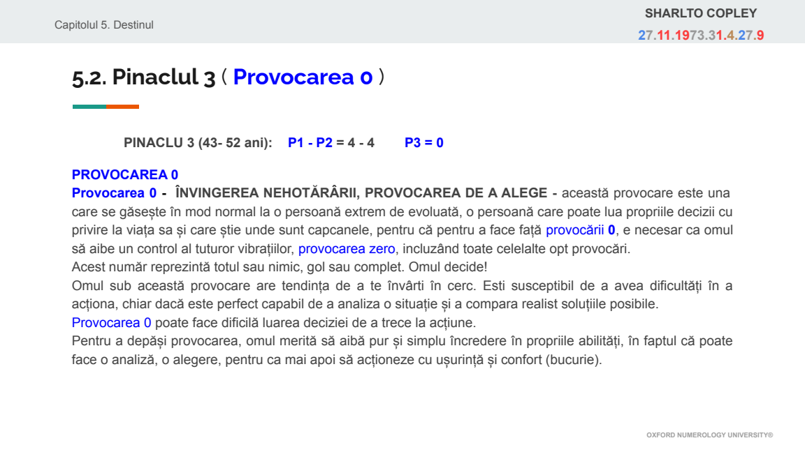

```text
Capitolul 5. Destinul
5.2. Pinaclul 3 ( Provocarea 0 )
PINACLU 3 (43- 52 ani): P1 - P2 = 4 - 4 P3 = 0
PROVOCAREA 0
Provocarea 0 - ÎNVINGEREA NEHOTĂRÂRII, PROVOCAREA DE A ALEGE - această provocare este una
care se găsește în mod normal la o persoană extrem de evoluată, o persoană care poate lua propriile decizii cu
privire la viața sa și care știe unde sunt capcanele, pentru că pentru a face față provocării 0, e necesar ca omul
să aibe un control al tuturor vibrațiilor, provocarea zero, incluzând toate celelalte opt provocări.
Acest număr reprezintă totul sau nimic, gol sau complet. Omul decide!
Omul sub această provocare are tendința de a te învârti în cerc. Esti susceptibil de a avea dificultăți în a
acționa, chiar dacă este perfect capabil de a analiza o situație și a compara realist soluțiile posibile.
Provocarea 0 poate face dificilă luarea deciziei de a trece la acțiune.
Pentru a depăși provocarea, omul merită să aibă pur și simplu încredere în propriile abilități, în faptul că poate
face o analiză, o alegere, pentru ca mai apoi să acționeze cu ușurință și confort (bucurie).
OXFORD NUMEROLOGY UNIVERSITY®
```

### Pagina 275

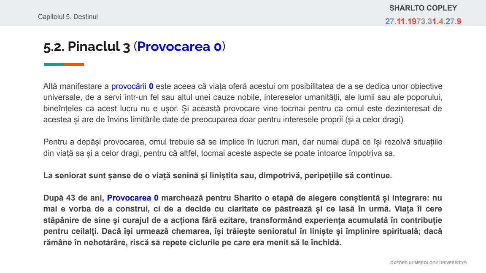

```text
Capitolul 5. Destinul
5.2. Pinaclul 3 (Provocarea 0)
Altă manifestare a provocării 0 este aceea că viața oferă acestui om posibilitatea de a se dedica unor obiective
universale, de a servi într-un fel sau altul unei cauze nobile, intereselor umanității, ale lumii sau ale poporului,
bineînțeles ca acest lucru nu e ușor. Și această provocare vine tocmai pentru ca omul este dezinteresat de
acestea și are de învins limitările date de preocuparea doar pentru interesele proprii (și a celor dragi)
Pentru a depăși provocarea, omul trebuie să se implice în lucruri mari, dar numai după ce își rezolvă situațiile
din viață sa și a celor dragi, pentru că altfel, tocmai aceste aspecte se poate întoarce împotriva sa.
La seniorat sunt șanse de o viață senină și liniștita sau, dimpotrivă, peripețiile să continue.
După 43 de ani, Provocarea 0 marchează pentru Sharlto o etapă de alegere conștientă și integrare: nu
mai e vorba de a construi, ci de a decide cu claritate ce păstrează și ce lasă în urmă. Viața îi cere
stăpânire de sine și curajul de a acționa fără ezitare, transformând experiența acumulată în contribuție
pentru ceilalți. Dacă își urmează chemarea, își trăiește senioratul în liniște și împlinire spirituală; dacă
rămâne în nehotărâre, riscă să repete ciclurile pe care era menit să le închidă.
OXFORD NUMEROLOGY UNIVERSITY®
```

### Pagina 276

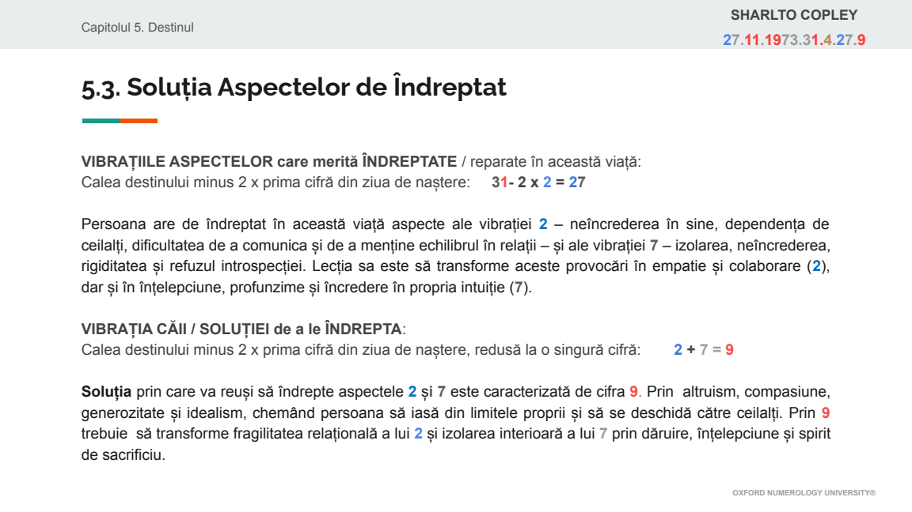

```text
Capitolul 5. Destinul
5.3. Soluția Aspectelor de Îndreptat
VIBRAȚIILE ASPECTELOR care merită ÎNDREPTATE / reparate în această viață:
Calea destinului minus 2 x prima cifră din ziua de naștere: 31- 2 x 2 = 27
Persoana are de îndreptat în această viață aspecte ale vibrației 2 – neîncrederea în sine, dependența de
ceilalți, dificultatea de a comunica și de a menține echilibrul în relații – și ale vibrației 7 – izolarea, neîncrederea,
rigiditatea și refuzul introspecției. Lecția sa este să transforme aceste provocări în empatie și colaborare (2),
dar și în înțelepciune, profunzime și încredere în propria intuiție (7).
VIBRAȚIA CĂII / SOLUȚIEI de a le ÎNDREPTA:
Calea destinului minus 2 x prima cifră din ziua de naștere, redusă la o singură cifră: 2 + 7 = 9
Soluția prin care va reuși să îndrepte aspectele 2 și 7 este caracterizată de cifra 9. Prin altruism, compasiune,
generozitate și idealism, chemând persoana să iasă din limitele proprii și să se deschidă către ceilalți. Prin 9
trebuie să transforme fragilitatea relațională a lui 2 și izolarea interioară a lui 7 prin dăruire, înțelepciune și spirit
de sacrificiu.
OXFORD NUMEROLOGY UNIVERSITY®
```

### Pagina 277

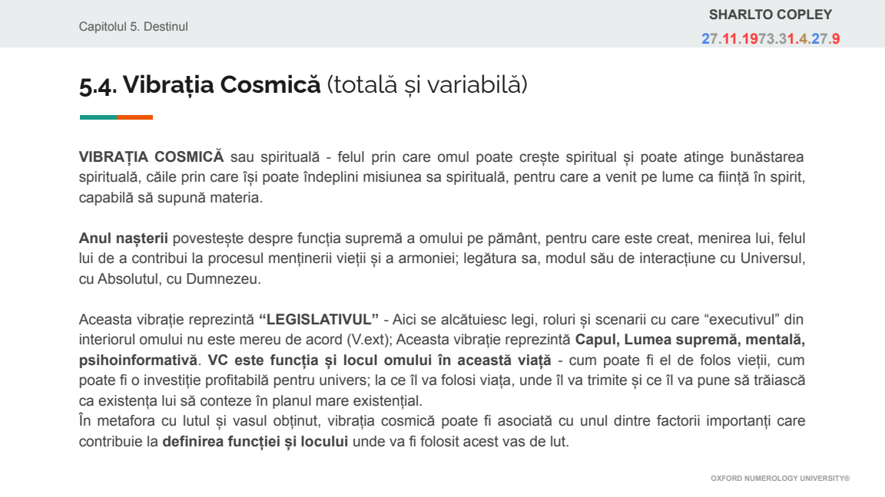

```text
Capitolul 5. Destinul
5.4. Vibrația Cosmică (totală și variabilă)
VIBRAȚIA COSMICĂ sau spirituală - felul prin care omul poate crește spiritual și poate atinge bunăstarea
spirituală, căile prin care își poate îndeplini misiunea sa spirituală, pentru care a venit pe lume ca ființă în spirit,
capabilă să supună materia.
Anul nașterii povestește despre funcția supremă a omului pe pământ, pentru care este creat, menirea lui, felul
lui de a contribui la procesul menținerii vieții și a armoniei; legătura sa, modul său de interacțiune cu Universul,
cu Absolutul, cu Dumnezeu.
Aceasta vibrație reprezintă “LEGISLATIVUL” - Aici se alcătuiesc legi, roluri și scenarii cu care “executivul” din
interiorul omului nu este mereu de acord (V.ext); Aceasta vibrație reprezintă Capul, Lumea supremă, mentală,
psihoinformativă. VC este funcția și locul omului în această viață - cum poate fi el de folos vieții, cum
poate fi o investiție profitabilă pentru univers; la ce îl va folosi viața, unde îl va trimite și ce îl va pune să trăiască
ca existența lui să conteze în planul mare existențial.
În metafora cu lutul și vasul obținut, vibrația cosmică poate fi asociată cu unul dintre factorii importanți care
contribuie la definirea funcției și locului unde va fi folosit acest vas de lut.
OXFORD NUMEROLOGY UNIVERSITY®
```

### Pagina 278

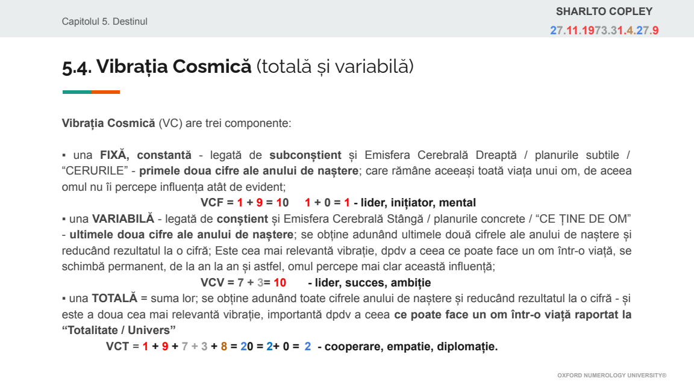

```text
Capitolul 5. Destinul
5.4. Vibrația Cosmică (totală și variabilă)
Vibrația Cosmică (VC) are trei componente:
▪ una FIXĂ, constantă - legată de subconștient și Emisfera Cerebrală Dreaptă / planurile subtile /
“CERURILE” - primele doua cifre ale anului de naștere; care rămâne aceeași toată viața unui om, de aceea
omul nu îi percepe influența atât de evident;
VCF = 1 + 9 = 10 1 + 0 = 1 - lider, inițiator, mental
▪ una VARIABILĂ - legată de conștient și Emisfera Cerebrală Stângă / planurile concrete / “CE ȚINE DE OM”
- ultimele doua cifre ale anului de naștere; se obține adunând ultimele două cifrele ale anului de naștere și
reducând rezultatul la o cifră; Este cea mai relevantă vibrație, dpdv a ceea ce poate face un om într-o viață, se
schimbă permanent, de la an la an și astfel, omul percepe mai clar această influență;
VCV = 7 + 3= 10 - lider, succes, ambiție
▪ una TOTALĂ = suma lor; se obține adunând toate cifrele anului de naștere și reducând rezultatul la o cifră - și
este a doua cea mai relevantă vibrație, importantă dpdv a ceea ce poate face un om într-o viață raportat la
“Totalitate / Univers”
VCT = 1 + 9 + 7 + 3 + 8 = 20 = 2+ 0 = 2 - cooperare, empatie, diplomație.
OXFORD NUMEROLOGY UNIVERSITY®
```

### Pagina 279

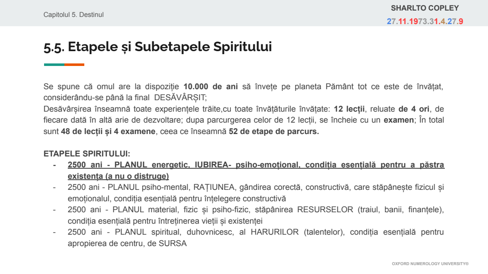

```text
Capitolul 5. Destinul
5.5. Etapele și Subetapele Spiritului
Se spune că omul are la dispoziție 10.000 de ani să învețe pe planeta Pământ tot ce este de învățat,
considerându-se până la final DESĂVÂRȘIT;
Desăvârșirea înseamnă toate experiențele trăite,cu toate învățăturile învățate: 12 lecții, reluate de 4 ori, de
fiecare dată în altă arie de dezVAULTare; dupa parcurgerea celor de 12 lecții, se încheie cu un examen; În total
sunt 48 de lecții și 4 examene, ceea ce înseamnă 52 de etape de parcurs.
ETAPELE SPIRITULUI:
- 2500 ani - PLANUL energetic, IUBIREA- psiho-emoțional, condiția esențială pentru a păstra
existența (a nu o distruge)
- 2500 ani - PLANUL psiho-mental, RAȚIUNEA, gândirea corectă, constructivă, care stăpânește fizicul și
emoționalul, condiția esențială pentru înțelegere constructivă
- 2500 ani - PLANUL material, fizic și psiho-fizic, stăpânirea RESURSELOR (traiul, banii, finanțele),
condiția esențială pentru întreținerea vieții și existenței
- 2500 ani - PLANUL spiritual, duhovnicesc, al HARURILOR (talentelor), condiția esențială pentru
apropierea de centru, de SURSA
OXFORD NUMEROLOGY UNIVERSITY®
```

### Pagina 280

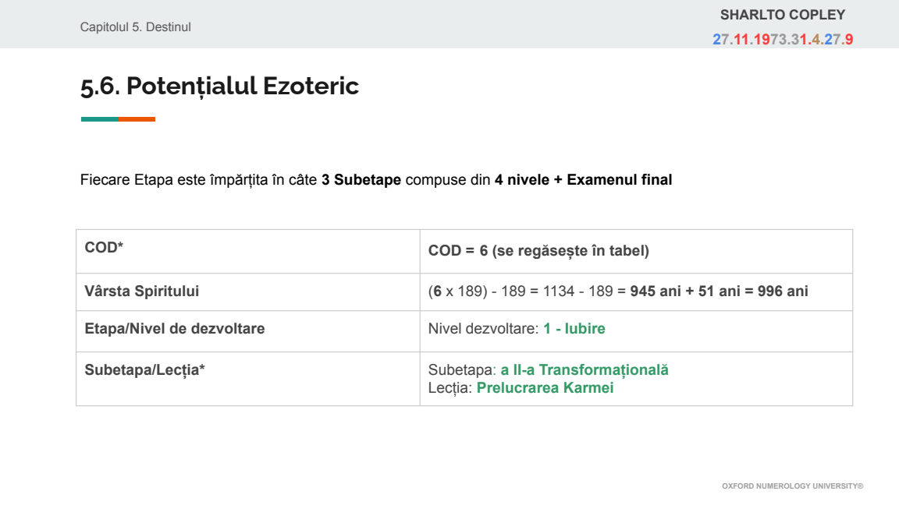

```text
Capitolul 5. Destinul
5.6. Potențialul Ezoteric
Fiecare Etapa este împărțita în câte 3 Subetape compuse din 4 nivele + Examenul final
COD* COD = 6 (se regăsește în tabel)
Vârsta Spiritului (6 x 189) - 189 = 1134 - 189 = 945 ani + 51 ani = 996 ani
Etapa/Nivel de dezVAULTare Nivel dezVAULTare: 1 - Iubire
Subetapa/Lecția* Subetapa: a II-a Transformațională
Lecția: Prelucrarea Karmei
OXFORD NUMEROLOGY UNIVERSITY®
```

### Pagina 281

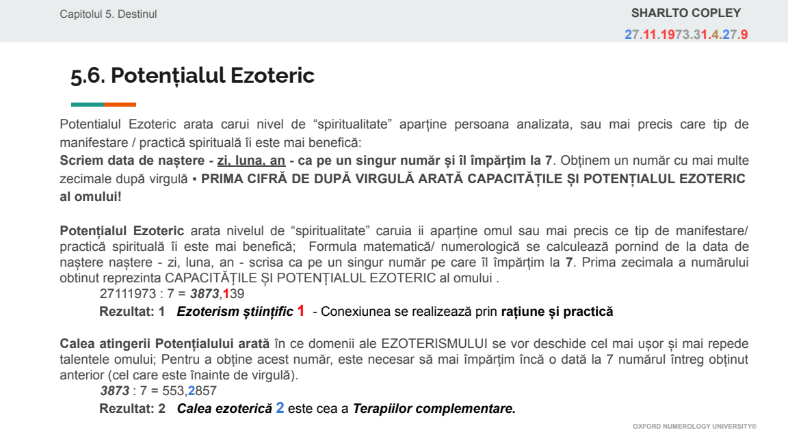

```text
Capitolul 5. Destinul SHARLTO COPLEY
5.6. Potențialul Ezoteric
Potentialul Ezoteric arata carui nivel de “spiritualitate” aparține persoana analizata, sau mai precis care tip de
manifestare / practică spirituală îi este mai benefică:
Scriem data de naștere - zi, luna, an - ca pe un singur număr și îl împărțim la 7. Obținem un număr cu mai multe
zecimale după virgulă ▪ PRIMA CIFRĂ DE DUPĂ VIRGULĂ ARATĂ CAPACITĂȚILE ȘI POTENȚIALUL EZOTERIC
al omului!
Potențialul Ezoteric arata nivelul de “spiritualitate” caruia ii aparține omul sau mai precis ce tip de manifestare/
practică spirituală îi este mai benefică; Formula matematică/ numerologică se calculează pornind de la data de
naștere naștere - zi, luna, an - scrisa ca pe un singur număr pe care îl împărțim la 7. Prima zecimala a numărului
obtinut reprezinta CAPACITĂȚILE ȘI POTENȚIALUL EZOTERIC al omului .
27111973 : 7 = 3873,139
Rezultat: 1 Ezoterism științific 1 - Conexiunea se realizează prin rațiune și practică
Calea atingerii Potențialului arată în ce domenii ale EZOTERISMULUI se vor deschide cel mai ușor și mai repede
talentele omului; Pentru a obține acest număr, este necesar să mai împărțim încă o dată la 7 numărul întreg obținut
anterior (cel care este înainte de virgulă).
3873 : 7 = 553,2857
Rezultat: 2 Calea ezoterică 2 este cea a Terapiilor complementare.
OXFORD NUMEROLOGY UNIVERSITY®
```

### Pagina 282

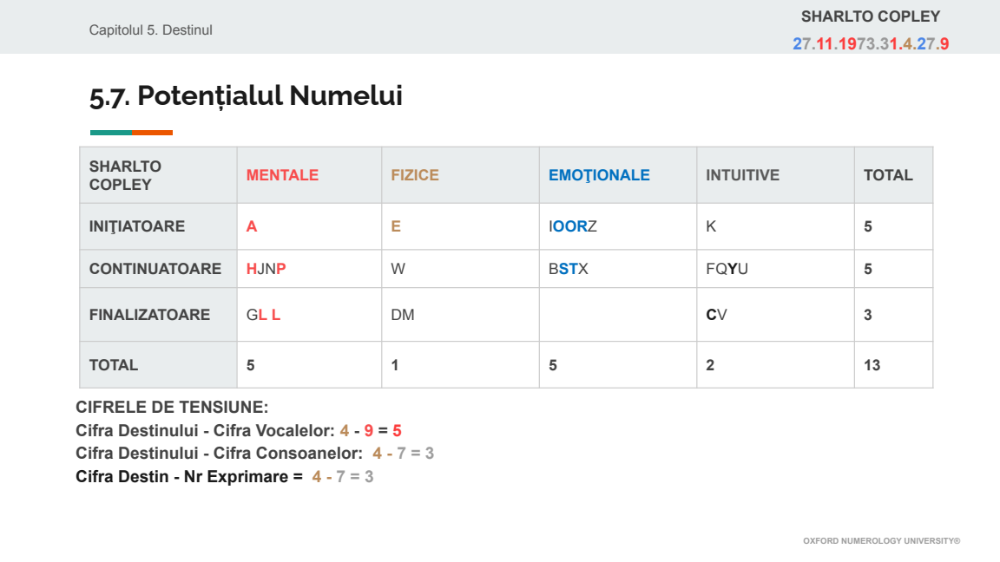

```text
Capitolul 5. Destinul
5.7. Potențialul Numelui
SHARLTO
MENTALE FIZICE EMOŢIONALE INTUITIVE TOTAL
COPLEY
INIŢIATOARE A E IOORZ K 5
CONTINUATOARE HJNP W BSTX FQYU 5
FINALIZATOARE GL L DM CV 3
TOTAL 5 1 5 2 13
CIFRELE DE TENSIUNE:
Cifra Destinului - Cifra Vocalelor: 4 - 9 = 5
Cifra Destinului - Cifra Consoanelor: 4 - 7 = 3
Cifra Destin - Nr Exprimare = 4 - 7 = 3
OXFORD NUMEROLOGY UNIVERSITY®
```

### Pagina 283

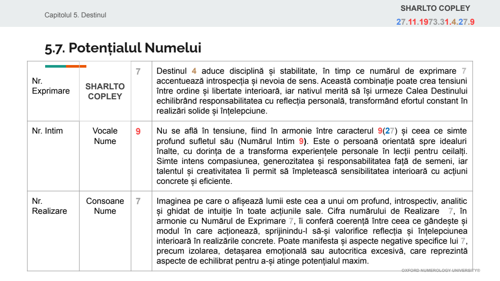

```text
Capitolul 5. Destinul
5.7. Potențialul Numelui
7 Destinul 4 aduce disciplină și stabilitate, în timp ce numărul de exprimare 7
Nr. accentuează introspecția și nevoia de sens. Această combinație poate crea tensiuni
SHARLTO
Exprimare între ordine și libertate interioară, iar nativul merită să își urmeze Calea Destinului
COPLEY
echilibrând responsabilitatea cu reflecția personală, transformând efortul constant în
realizări solide și înțelepciune.
Nr. Intim Vocale 9 Nu se află în tensiune, fiind în armonie între caracterul 9(27) și ceea ce simte
Nume profund sufletul său (Numărul Intim 9). Este o persoană orientată spre idealuri
înalte, cu dorința de a transforma experiențele personale în lecții pentru ceilalți.
Simte intens compasiunea, generozitatea și responsabilitatea față de semeni, iar
talentul și creativitatea îi permit să împletească sensibilitatea interioară cu acțiuni
concrete și eficiente.
Nr. Consoane 7 Imaginea pe care o afișează lumii este cea a unui om profund, introspectiv, analitic
Realizare Nume și ghidat de intuiție în toate acțiunile sale. Cifra numărului de Realizare 7, în
armonie cu Numărul de Exprimare 7, îi conferă coerență între ceea ce gândește și
modul în care acționează, sprijinindu-l să-și valorifice reflecția și înțelepciunea
interioară în realizările concrete. Poate manifesta și aspecte negative specifice lui 7,
precum izolarea, detașarea emoțională sau autocritica excesivă, care reprezintă
aspecte de echilibrat pentru a-și atinge potențialul maxim.
OXFORD NUMEROLOGY UNIVERSITY®
```

### Pagina 284

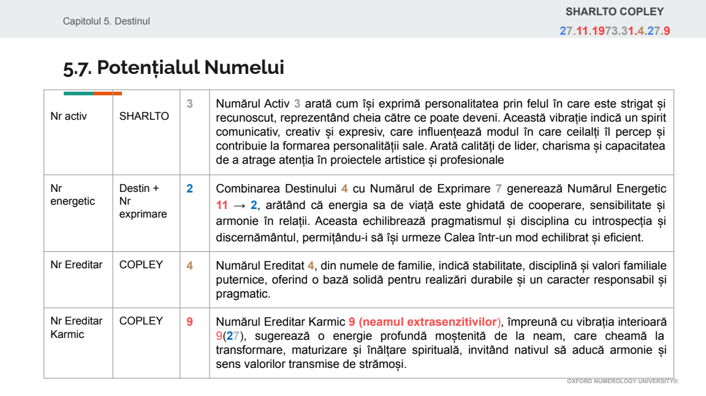

```text
Capitolul 5. Destinul
5.7. Potențialul Numelui
3 Numărul Activ 3 arată cum își exprimă personalitatea prin felul în care este strigat și
Nr activ SHARLTO recunoscut, reprezentând cheia către ce poate deveni. Această vibrație indică un spirit
comunicativ, creativ și expresiv, care influențează modul în care ceilalți îl percep și
contribuie la formarea personalității sale. Arată calități de lider, charisma și capacitatea
de a atrage atenția în proiectele artistice și profesionale
Nr Destin + 2 Combinarea Destinului 4 cu Numărul de Exprimare 7 generează Numărul Energetic
energetic Nr
11 → 2, arătând că energia sa de viață este ghidată de cooperare, sensibilitate și
exprimare
armonie în relații. Aceasta echilibrează pragmatismul și disciplina cu introspecția și
discernământul, permițându-i să își urmeze Calea într-un mod echilibrat și eficient.
Nr Ereditar COPLEY 4 Numărul Ereditat 4, din numele de familie, indică stabilitate, disciplină și valori familiale
puternice, oferind o bază solidă pentru realizări durabile și un caracter responsabil și
pragmatic.
Nr Ereditar COPLEY 9 Numărul Ereditar Karmic 9 (neamul extrasenzitivilor), împreună cu vibrația interioară
Karmic 9(27), sugerează o energie profundă moștenită de la neam, care cheamă la
transformare, maturizare și înălțare spirituală, invitând nativul să aducă armonie și
sens valorilor transmise de strămoși.
OXFORD NUMEROLOGY UNIVERSITY®
```

### Pagina 285

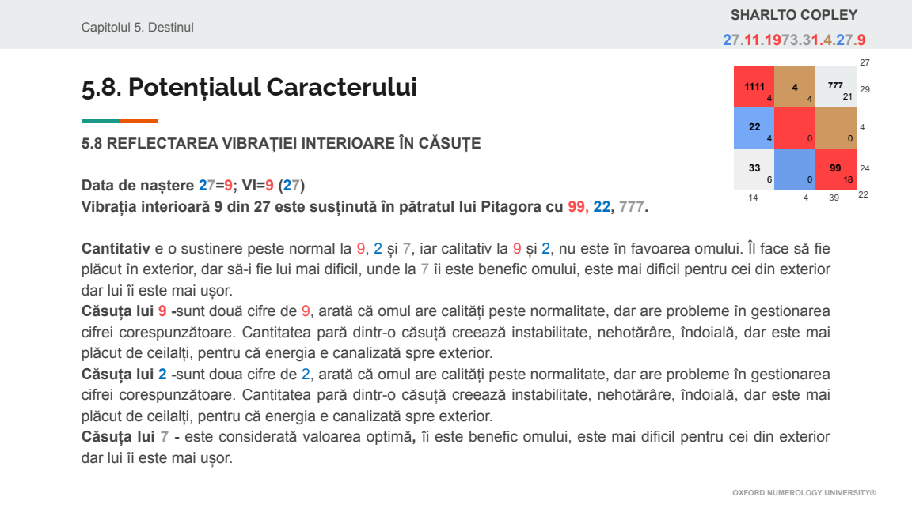

```text
Capitolul 5. Destinul
27
5.8. Potențialul Caracterului
1111 4 777 29
4 4 21
22 4
5.8 REFLECTAREA VIBRAȚIEI INTERIOARE ÎN CĂSUȚE 4 0 0
33 99 24
Data de naștere 27=9; VI=9 (27) 6 0 18
14 4 39 22
Vibrația interioară 9 din 27 este susținută în pătratul lui Pitagora cu 99, 22, 777.
Cantitativ e o sustinere peste normal la 9, 2 și 7, iar calitativ la 9 și 2, nu este în favoarea omului. Îl face să fie
plăcut în exterior, dar să-i fie lui mai dificil, unde la 7 îi este benefic omului, este mai dificil pentru cei din exterior
dar lui îi este mai ușor.
Căsuța lui 9 -sunt două cifre de 9, arată că omul are calități peste normalitate, dar are probleme în gestionarea
cifrei corespunzătoare. Cantitatea pară dintr-o căsuță creează instabilitate, nehotărâre, îndoială, dar este mai
plăcut de ceilalți, pentru că energia e canalizată spre exterior.
Căsuța lui 2 -sunt doua cifre de 2, arată că omul are calități peste normalitate, dar are probleme în gestionarea
cifrei corespunzătoare. Cantitatea pară dintr-o căsuță creează instabilitate, nehotărâre, îndoială, dar este mai
plăcut de ceilalți, pentru că energia e canalizată spre exterior.
Căsuța lui 7 - este considerată valoarea optimă, îi este benefic omului, este mai dificil pentru cei din exterior
dar lui îi este mai ușor.
OXFORD NUMEROLOGY UNIVERSITY®
```

### Pagina 286


```text
Concluziile
Destinului
```

### Pagina 287

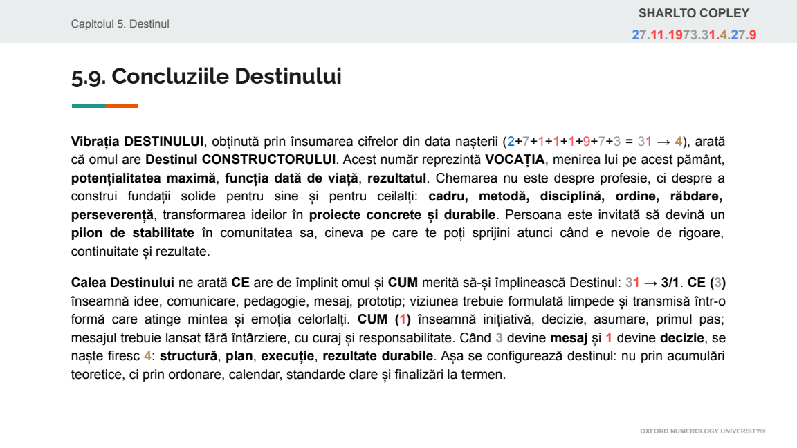

```text
Capitolul 5. Destinul
5.9. Concluziile Destinului
Vibrația DESTINULUI, obținută prin însumarea cifrelor din data nașterii (2+7+1+1+1+9+7+3 = 31 → 4), arată
că omul are Destinul CONSTRUCTORULUI. Acest număr reprezintă VOCAȚIA, menirea lui pe acest pământ,
potențialitatea maximă, funcția dată de viață, rezultatul. Chemarea nu este despre profesie, ci despre a
construi fundații solide pentru sine și pentru ceilalți: cadru, metodă, disciplină, ordine, răbdare,
perseverență, transformarea ideilor în proiecte concrete și durabile. Persoana este invitată să devină un
pilon de stabilitate în comunitatea sa, cineva pe care te poți sprijini atunci când e nevoie de rigoare,
continuitate și rezultate.
Calea Destinului ne arată CE are de împlinit omul și CUM merită să-și împlinească Destinul: 31 → 3/1. CE (3)
înseamnă idee, comunicare, pedagogie, mesaj, prototip; viziunea trebuie formulată limpede și transmisă într-o
formă care atinge mintea și emoția celorlalți. CUM (1) înseamnă inițiativă, decizie, asumare, primul pas;
mesajul trebuie lansat fără întârziere, cu curaj și responsabilitate. Când 3 devine mesaj și 1 devine decizie, se
naște firesc 4: structură, plan, execuție, rezultate durabile. Așa se configurează destinul: nu prin acumulări
teoretice, ci prin ordonare, calendar, standarde clare și finalizări la termen.
OXFORD NUMEROLOGY UNIVERSITY®
```

### Pagina 288

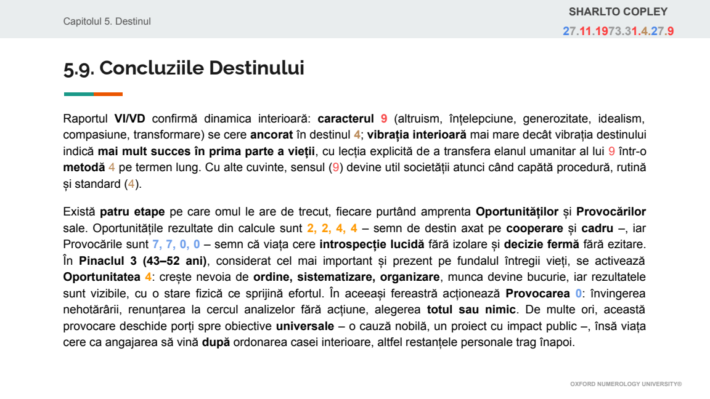

```text
Capitolul 5. Destinul
5.9. Concluziile Destinului
Raportul VI/VD confirmă dinamica interioară: caracterul 9 (altruism, înțelepciune, generozitate, idealism,
compasiune, transformare) se cere ancorat în destinul 4; vibrația interioară mai mare decât vibrația destinului
indică mai mult succes în prima parte a vieții, cu lecția explicită de a transfera elanul umanitar al lui 9 într-o
metodă 4 pe termen lung. Cu alte cuvinte, sensul (9) devine util societății atunci când capătă procedură, rutină
și standard (4).
Există patru etape pe care omul le are de trecut, fiecare purtând amprenta Oportunităților și Provocărilor
sale. Oportunitățile rezultate din calcule sunt 2, 2, 4, 4 – semn de destin axat pe cooperare și cadru –, iar
Provocările sunt 7, 7, 0, 0 – semn că viața cere introspecție lucidă fără izolare și decizie fermă fără ezitare.
În Pinaclul 3 (43–52 ani), considerat cel mai important și prezent pe fundalul întregii vieți, se activează
Oportunitatea 4: crește nevoia de ordine, sistematizare, organizare, munca devine bucurie, iar rezultatele
sunt vizibile, cu o stare fizică ce sprijină efortul. În aceeași fereastră acționează Provocarea 0: învingerea
nehotărârii, renunțarea la cercul analizelor fără acțiune, alegerea totul sau nimic. De multe ori, această
provocare deschide porți spre obiective universale – o cauză nobilă, un proiect cu impact public –, însă viața
cere ca angajarea să vină după ordonarea casei interioare, altfel restanțele personale trag înapoi.
OXFORD NUMEROLOGY UNIVERSITY®
```

### Pagina 289

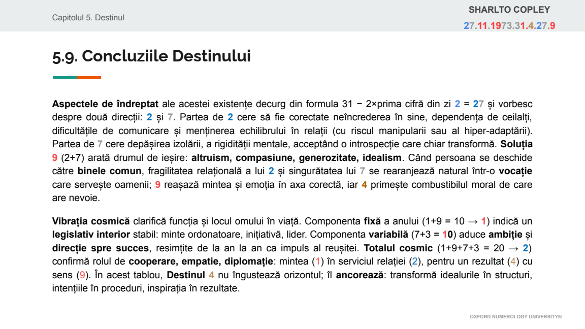

```text
Capitolul 5. Destinul
5.9. Concluziile Destinului
Aspectele de îndreptat ale acestei existențe decurg din formula 31 − 2×prima cifră din zi 2 = 27 și vorbesc
despre două direcții: 2 și 7. Partea de 2 cere să fie corectate neîncrederea în sine, dependența de ceilalți,
dificultățile de comunicare și menținerea echilibrului în relații (cu riscul manipularii sau al hiper-adaptării).
Partea de 7 cere depășirea izolării, a rigidității mentale, acceptând o introspecție care chiar transformă. Soluția
9 (2+7) arată drumul de ieșire: altruism, compasiune, generozitate, idealism. Când persoana se deschide
către binele comun, fragilitatea relațională a lui 2 și singurătatea lui 7 se rearanjează natural într-o vocație
care servește oamenii; 9 reașază mintea și emoția în axa corectă, iar 4 primește combustibilul moral de care
are nevoie.
Vibrația cosmică clarifică funcția și locul omului în viață. Componenta fixă a anului (1+9 = 10 → 1) indică un
legislativ interior stabil: minte ordonatoare, inițiativă, lider. Componenta variabilă (7+3 = 10) aduce ambiție și
direcție spre succes, resimțite de la an la an ca impuls al reușitei. Totalul cosmic (1+9+7+3 = 20 → 2)
confirmă rolul de cooperare, empatie, diplomație: mintea (1) în serviciul relației (2), pentru un rezultat (4) cu
sens (9). În acest tablou, Destinul 4 nu îngustează orizontul; îl ancorează: transformă idealurile în structuri,
intențiile în proceduri, inspirația în rezultate.
OXFORD NUMEROLOGY UNIVERSITY®
```

### Pagina 290

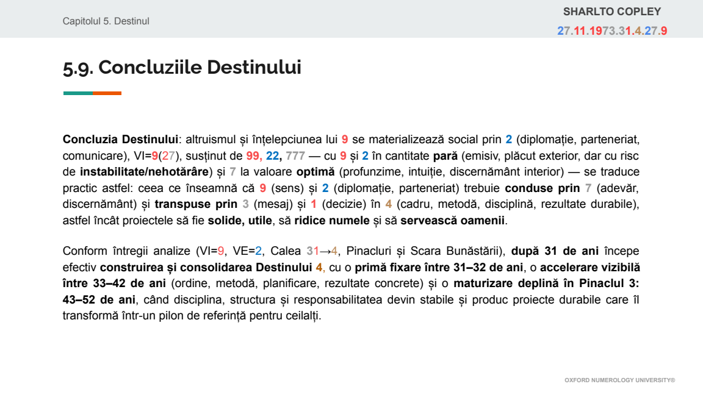

```text
Capitolul 5. Destinul
5.9. Concluziile Destinului
Concluzia Destinului: altruismul și înțelepciunea lui 9 se materializează social prin 2 (diplomație, parteneriat,
comunicare), VI=9(27), susținut de 99, 22, 777 — cu 9 și 2 în cantitate pară (emisiv, plăcut exterior, dar cu risc
de instabilitate/nehotărâre) și 7 la valoare optimă (profunzime, intuiție, discernământ interior) — se traduce
practic astfel: ceea ce înseamnă că 9 (sens) și 2 (diplomație, parteneriat) trebuie conduse prin 7 (adevăr,
discernământ) și transpuse prin 3 (mesaj) și 1 (decizie) în 4 (cadru, metodă, disciplină, rezultate durabile),
astfel încât proiectele să fie solide, utile, să ridice numele și să servească oamenii.
Conform întregii analize (VI=9, VE=2, Calea 31→4, Pinacluri și Scara Bunăstării), după 31 de ani începe
efectiv construirea și consolidarea Destinului 4, cu o primă fixare între 31–32 de ani, o accelerare vizibilă
între 33–42 de ani (ordine, metodă, planificare, rezultate concrete) și o maturizare deplină în Pinaclul 3:
43–52 de ani, când disciplina, structura și responsabilitatea devin stabile și produc proiecte durabile care îl
transformă într-un pilon de referință pentru ceilalți.
OXFORD NUMEROLOGY UNIVERSITY®
```

### Pagina 291

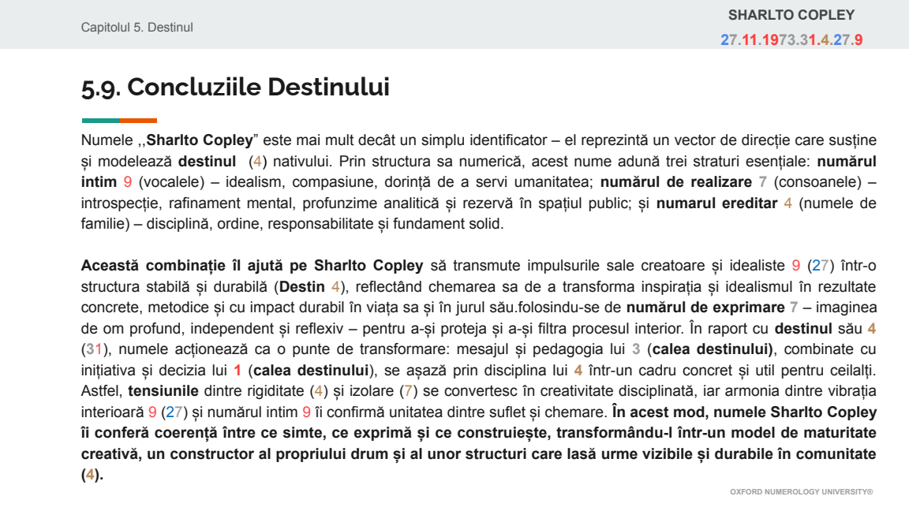

```text
Capitolul 5. Destinul
5.9. Concluziile Destinului
Numele ,,Sharlto Copley” este mai mult decât un simplu identificator – el reprezintă un vector de direcție care susține
și modelează destinul (4) nativului. Prin structura sa numerică, acest nume adună trei straturi esențiale: numărul
intim 9 (vocalele) – idealism, compasiune, dorință de a servi umanitatea; numărul de realizare 7 (consoanele) –
introspecție, rafinament mental, profunzime analitică și rezervă în spațiul public; și numarul ereditar 4 (numele de
familie) – disciplină, ordine, responsabilitate și fundament solid.
Această combinație îl ajută pe Sharlto Copley să transmute impulsurile sale creatoare și idealiste 9 (27) într-o
structura stabilă și durabilă (Destin 4), reflectând chemarea sa de a transforma inspirația și idealismul în rezultate
concrete, metodice și cu impact durabil în viața sa și în jurul său.folosindu-se de numărul de exprimare 7 – imaginea
de om profund, independent și reflexiv – pentru a-și proteja și a-și filtra procesul interior. În raport cu destinul său 4
(31), numele acționează ca o punte de transformare: mesajul și pedagogia lui 3 (calea destinului), combinate cu
inițiativa și decizia lui 1 (calea destinului), se așază prin disciplina lui 4 într-un cadru concret și util pentru ceilalți.
Astfel, tensiunile dintre rigiditate (4) și izolare (7) se convertesc în creativitate disciplinată, iar armonia dintre vibrația
interioară 9 (27) și numărul intim 9 îi confirmă unitatea dintre suflet și chemare. În acest mod, numele Sharlto Copley
îi conferă coerență între ce simte, ce exprimă și ce construiește, transformându-l într-un model de maturitate
creativă, un constructor al propriului drum și al unor structuri care lasă urme vizibile și durabile în comunitate
(4).
OXFORD NUMEROLOGY UNIVERSITY®
```

### Pagina 292

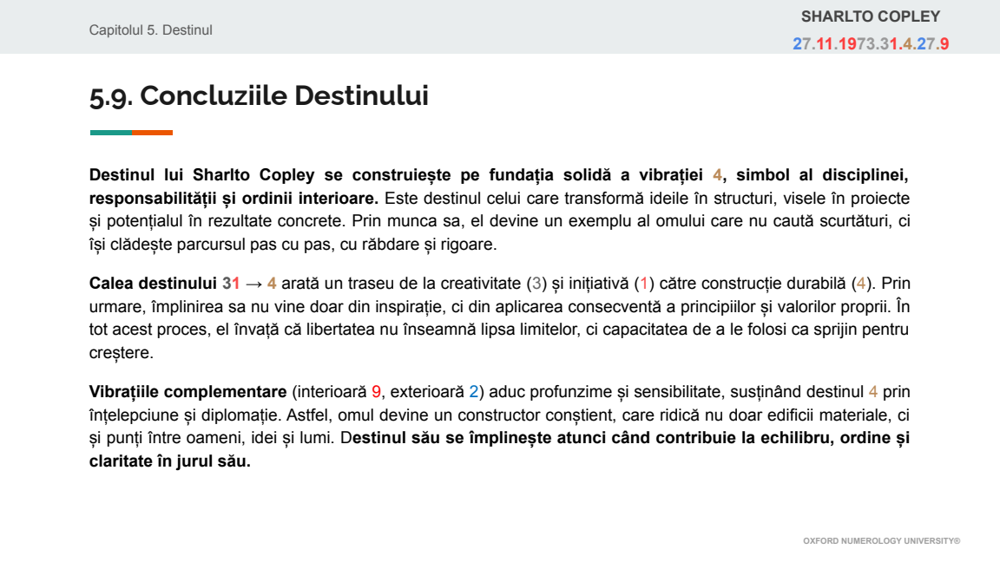

```text
Capitolul 5. Destinul
5.9. Concluziile Destinului
Destinul lui Sharlto Copley se construiește pe fundația solidă a vibrației 4, simbol al disciplinei,
responsabilității și ordinii interioare. Este destinul celui care transformă ideile în structuri, visele în proiecte
și potențialul în rezultate concrete. Prin munca sa, el devine un exemplu al omului care nu caută scurtături, ci
își clădește parcursul pas cu pas, cu răbdare și rigoare.
Calea destinului 31 → 4 arată un traseu de la creativitate (3) și inițiativă (1) către construcție durabilă (4). Prin
urmare, împlinirea sa nu vine doar din inspirație, ci din aplicarea consecventă a principiilor și valorilor proprii. În
tot acest proces, el învață că libertatea nu înseamnă lipsa limitelor, ci capacitatea de a le folosi ca sprijin pentru
creștere.
Vibrațiile complementare (interioară 9, exterioară 2) aduc profunzime și sensibilitate, susținând destinul 4 prin
înțelepciune și diplomație. Astfel, omul devine un constructor conștient, care ridică nu doar edificii materiale, ci
și punți între oameni, idei și lumi. Destinul său se împlinește atunci când contribuie la echilibru, ordine și
claritate în jurul său.
OXFORD NUMEROLOGY UNIVERSITY®
```

### Pagina 293

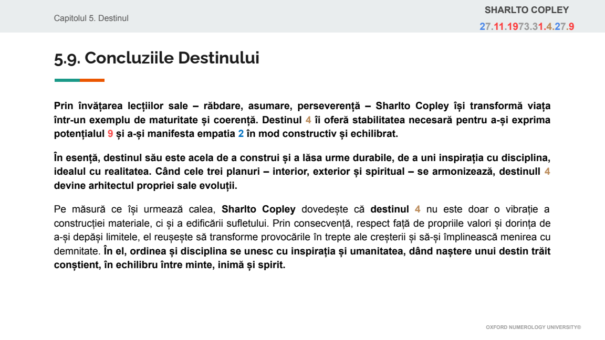

```text
Capitolul 5. Destinul
5.9. Concluziile Destinului
Prin învățarea lecțiilor sale – răbdare, asumare, perseverență – Sharlto Copley își transformă viața
într-un exemplu de maturitate și coerență. Destinul 4 îi oferă stabilitatea necesară pentru a-și exprima
potențialul 9 și a-și manifesta empatia 2 în mod constructiv și echilibrat.
În esență, destinul său este acela de a construi și a lăsa urme durabile, de a uni inspirația cu disciplina,
idealul cu realitatea. Când cele trei planuri – interior, exterior și spiritual – se armonizează, destinull 4
devine arhitectul propriei sale evoluții.
Pe măsură ce își urmează calea, Sharlto Copley dovedește că destinul 4 nu este doar o vibrație a
construcției materiale, ci și a edificării sufletului. Prin consecvență, respect față de propriile valori și dorința de
a-și depăși limitele, el reușește să transforme provocările în trepte ale creșterii și să-și împlinească menirea cu
demnitate. În el, ordinea și disciplina se unesc cu inspirația și umanitatea, dând naștere unui destin trăit
conștient, în echilibru între minte, inimă și spirit.
OXFORD NUMEROLOGY UNIVERSITY®
```

# Capitolul 6. Parcursul vietii

_Pagini sursa: 294-368._

## Formule si calcule extrase pentru rafinare

### Toate vibrațiile din codul numerologic personal

- Concept analizat: verificat in VAULT/Numerologie - [[Ciclul de 7 Ani]].
- Metoda de calcul: Toate vibrațiile din codul numerologic personal: Scara bunăstării - toate treptele; Ciclicități de 7 ani; Ciclicități de
- Calcul: Toate vibrațiile din codul numerologic personal: Scara bunăstării - toate treptele; Ciclicități de 7 ani; Ciclicități de
- Verificare: ok - concept verificat in VAULT/Numerologie; metoda trebuie rafinata din textul paginii.
- Verificare pagina: pagina 296.

### - Triunghiul

- Concept analizat: verificat in VAULT/Numerologie - [[Codul Spiritului]].
- Metoda de calcul: - Triunghiul: SPIRITUL (C10, C11, C12)
- Calcul: - Triunghiul: SPIRITUL (C10, C11, C12)
- Verificare: ok - concept verificat in VAULT/Numerologie; metoda trebuie rafinata din textul paginii.
- Verificare pagina: pagina 296.

### Ciclicitatea de 27 ani

- Concept analizat: verificat in VAULT/Numerologie - [[Ciclul de 7 Ani]].
- Metoda de calcul: Ciclicitatea de 27 ani: Ansamblul geometric al lui Pitagora
- Calcul: Ciclicitatea de 27 ani: Ansamblul geometric al lui Pitagora
- Verificare: ok - concept verificat in VAULT/Numerologie; metoda trebuie rafinata din textul paginii.
- Verificare pagina: pagina 297.

### ciclul mental 6

- Concept analizat: concept lipsa in VAULT/Numerologie.
- Metoda de calcul: ciclul mental 6: 45 - 54 ani – IUBIRE
- Calcul: ciclul mental 6: 45 - 54 ani – IUBIRE
- Verificare: concept lipsa in VAULT/Numerologie.
- Verificare pagina: pagina 297.

### ciclul mental 7

- Concept analizat: concept lipsa in VAULT/Numerologie.
- Metoda de calcul: ciclul mental 7: 54 - 63 ani - CUNOAȘTERE
- Calcul: ciclul mental 7: 54 - 63 ani - CUNOAȘTERE
- Verificare: concept lipsa in VAULT/Numerologie.
- Verificare pagina: pagina 297.

### ciclul mental 8

- Concept analizat: concept lipsa in VAULT/Numerologie.
- Metoda de calcul: ciclul mental 8: 63 - 72 ani - RĂSPLATĂ
- Calcul: ciclul mental 8: 63 - 72 ani - RĂSPLATĂ
- Verificare: concept lipsa in VAULT/Numerologie.
- Verificare pagina: pagina 297.

### ciclul mental 1

- Concept analizat: verificat in VAULT/Numerologie - [[Ciclul de 9 Ani]].
- Metoda de calcul: ciclul mental 1: 0 - 9 ani - ÎNCEPUT
- Calcul: ciclul mental 1: 0 - 9 ani - ÎNCEPUT
- Verificare: ok - concept verificat in VAULT/Numerologie; metoda trebuie rafinata din textul paginii.
- Verificare pagina: pagina 297.

### ciclul mental 9

- Concept analizat: concept lipsa in VAULT/Numerologie.
- Metoda de calcul: ciclul mental 9: 72 - 81 ani - RENAȘTERE
- Calcul: ciclul mental 9: 72 - 81 ani - RENAȘTERE
- Verificare: concept lipsa in VAULT/Numerologie.
- Verificare pagina: pagina 297.

### ciclul mental 2

- Concept analizat: concept lipsa in VAULT/Numerologie.
- Metoda de calcul: ciclul mental 2: 9 - 18 ani - CAUZĂ - EFECT
- Calcul: ciclul mental 2: 9 - 18 ani - CAUZĂ - EFECT
- Verificare: concept lipsa in VAULT/Numerologie.
- Verificare pagina: pagina 297.

### ciclul mental 3

- Concept analizat: verificat in VAULT/Numerologie - [[Ciclul de 7 Ani]].
- Metoda de calcul: ciclul mental 3: 18 - 27 ani - EXPERIENȚĂ
- Calcul: ciclul mental 3: 18 - 27 ani - EXPERIENȚĂ
- Verificare: ok - concept verificat in VAULT/Numerologie; metoda trebuie rafinata din textul paginii.
- Verificare pagina: pagina 297.

### ciclul mental 10 = 1

- Concept analizat: concept lipsa in VAULT/Numerologie.
- Metoda de calcul: ciclul mental 10 = 1: 81 - 90 ani - (UN NOU)
- Calcul: 81 - 90 ani - (UN NOU)
- Verificare: concept lipsa in VAULT/Numerologie.
- Verificare pagina: pagina 297.

### ciclul mental 4

- Concept analizat: concept lipsa in VAULT/Numerologie.
- Metoda de calcul: ciclul mental 4: 27 - 36 ani - STABILITATE
- Calcul: ciclul mental 4: 27 - 36 ani - STABILITATE
- Verificare: concept lipsa in VAULT/Numerologie.
- Verificare pagina: pagina 297.

### ciclul mental 11 = 2

- Concept analizat: verificat in VAULT/Numerologie - [[Ciclul de 9 Ani]].
- Metoda de calcul: ciclul mental 11 = 2: 90 - 99 ani CAUZĂ EFECT
- Calcul: 90 - 99 ani CAUZĂ EFECT
- Verificare: ok - concept verificat in VAULT/Numerologie; metoda trebuie rafinata din textul paginii.
- Verificare pagina: pagina 297.

### ciclul mental 12 = 3

- Concept analizat: concept lipsa in VAULT/Numerologie.
- Metoda de calcul: ciclul mental 12 = 3: 99 - 108 ani EXPERIENȚĂ
- Calcul: 99 - 108 ani EXPERIENȚĂ
- Verificare: concept lipsa in VAULT/Numerologie.
- Verificare pagina: pagina 297.

### ciclul mental 5

- Concept analizat: concept lipsa in VAULT/Numerologie.
- Metoda de calcul: ciclul mental 5: 36 - 45 ani - ALTFEL
- Calcul: ciclul mental 5: 36 - 45 ani - ALTFEL
- Verificare: concept lipsa in VAULT/Numerologie.
- Verificare pagina: pagina 297.

### Ciclicitatea de 27 de ani

- Concept analizat: concept lipsa in VAULT/Numerologie.
- Metoda de calcul: Ciclicitatea de 27 de ani:
- Calcul: Ciclicitatea de 27 de ani:
- Verificare: concept lipsa in VAULT/Numerologie.
- Verificare pagina: pagina 298.

### CICLUL 1 (0 - 9 ani)

- Concept analizat: verificat in VAULT/Numerologie - [[Ciclul de 9 Ani]].
- Metoda de calcul: CICLUL 1 (0 - 9 ani): 27.11.1973 - 26.11.1982
- Calcul: CICLUL 1 (0 - 9 ani): 27.11.1973 - 26.11.1982
- Verificare: ok - concept verificat in VAULT/Numerologie; metoda trebuie rafinata din textul paginii.
- Verificare pagina: pagina 299.

### Lecțiile de viață în primul ciclu

- Concept analizat: verificat in VAULT/Numerologie - [[Lectii de Viata]].
- Metoda de calcul: Lecțiile de viață în primul ciclu: 5 8 5 9 8 1 5 8 5
- Calcul: Lecțiile de viață în primul ciclu: 5 8 5 9 8 1 5 8 5
- Verificare: ok - concept verificat in VAULT/Numerologie; metoda trebuie rafinata din textul paginii.
- Verificare pagina: pagina 299.

### CICLUL MENTAL 1

- Concept analizat: verificat in VAULT/Numerologie - [[Ciclul de 9 Ani]].
- Metoda de calcul: CICLUL MENTAL 1: 0 - 9 ANI ÎNCEPUTUL
- Calcul: CICLUL MENTAL 1: 0 - 9 ANI ÎNCEPUTUL
- Verificare: ok - concept verificat in VAULT/Numerologie; metoda trebuie rafinata din textul paginii.
- Verificare pagina: pagina 299.

### Soarta si Destin

- Concept analizat: verificat in VAULT/Numerologie - [[Soarta si Destin]].
- Metoda de calcul: Soarta si Destin: 5 → 3
- Calcul: Soarta si Destin: 5 → 3
- Verificare: ok - concept verificat in VAULT/Numerologie; metoda trebuie rafinata din textul paginii.
- Verificare pagina: pagina 299.

### Lectia acestui ciclu este dezVAULTarea vointei. Ani de criză

- Concept analizat: verificat in VAULT/Numerologie - [[Lectii de Viata]].
- Metoda de calcul: Lectia acestui ciclu este dezVAULTarea vointei. Ani de criză: 1976-77 (3,5 ani - mai 1977)
- Calcul: Lectia acestui ciclu este dezVAULTarea vointei. Ani de criză: 1976-77 (3,5 ani - mai 1977)
- Verificare: ok - concept verificat in VAULT/Numerologie; metoda trebuie rafinata din textul paginii.
- Verificare pagina: pagina 299.

### În primul ciclu de 9 ani, persoana are doi ani importanți interior

- Concept analizat: concept lipsa in VAULT/Numerologie.
- Metoda de calcul: În primul ciclu de 9 ani, persoana are doi ani importanți interior: 1975-76 (vârsta 2–3 ani) dependent de neam
- Calcul: În primul ciclu de 9 ani, persoana are doi ani importanți interior: 1975-76 (vârsta 2–3 ani) dependent de neam
- Verificare: concept lipsa in VAULT/Numerologie.
- Verificare pagina: pagina 302.

### CICLUL MENTAL 2

- Concept analizat: concept lipsa in VAULT/Numerologie.
- Metoda de calcul: CICLUL MENTAL 2: 9 - 18 ANI LEGEA CAUZĂ - EFECT
- Calcul: CICLUL MENTAL 2: 9 - 18 ANI LEGEA CAUZĂ - EFECT
- Verificare: concept lipsa in VAULT/Numerologie.
- Verificare pagina: pagina 304.

### CICLUL 2 (9 -18 ani)

- Concept analizat: concept lipsa in VAULT/Numerologie.
- Metoda de calcul: CICLUL 2 (9 -18 ani): 27.11.1982 - 26.11.1991
- Calcul: CICLUL 2 (9 -18 ani): 27.11.1982 - 26.11.1991
- Verificare: concept lipsa in VAULT/Numerologie.
- Verificare pagina: pagina 305.

### Soarta si Destin

- Concept analizat: verificat in VAULT/Numerologie - [[Soarta si Destin]].
- Metoda de calcul: Soarta si Destin: 3 → 4
- Calcul: Soarta si Destin: 3 → 4
- Verificare: ok - concept verificat in VAULT/Numerologie; metoda trebuie rafinata din textul paginii.
- Verificare pagina: pagina 305.

### CICLUL MENTAL 3

- Concept analizat: verificat in VAULT/Numerologie - [[Ciclul de 7 Ani]].
- Metoda de calcul: CICLUL MENTAL 3: 18 - 27 ANI EXPERIENȚA, PE CONT PROPRIU
- Calcul: CICLUL MENTAL 3: 18 - 27 ANI EXPERIENȚA, PE CONT PROPRIU
- Verificare: ok - concept verificat in VAULT/Numerologie; metoda trebuie rafinata din textul paginii.
- Verificare pagina: pagina 310.

### Bunăstare

- Concept analizat: verificat in VAULT/Numerologie - [[Lectii de Viata]].
- Metoda de calcul: Bunăstare: sa corecteze programele mentale greșite din Ciclul 1 și să învețe lecțiile restante cauză-efect din
- Calcul: Bunăstare: sa corecteze programele mentale greșite din Ciclul 1 și să învețe lecțiile restante cauză-efect din
- Verificare: ok - concept verificat in VAULT/Numerologie; metoda trebuie rafinata din textul paginii.
- Verificare pagina: pagina 310.

### CICLUL MENTAL 3

- Concept analizat: verificat in VAULT/Numerologie - [[Ciclul de 7 Ani]].
- Metoda de calcul: CICLUL MENTAL 3: 18 - 27 ANI - EXPERIENȚA, PE CONT PROPRIU
- Calcul: CICLUL MENTAL 3: 18 - 27 ANI - EXPERIENȚA, PE CONT PROPRIU
- Verificare: ok - concept verificat in VAULT/Numerologie; metoda trebuie rafinata din textul paginii.
- Verificare pagina: pagina 311.

### CICLUL 3 (18 - 27 ani)

- Concept analizat: verificat in VAULT/Numerologie - [[Ciclul de 7 Ani]].
- Metoda de calcul: CICLUL 3 (18 - 27 ani): 27.11.1991 - 26.11.2000
- Calcul: CICLUL 3 (18 - 27 ani): 27.11.1991 - 26.11.2000
- Verificare: ok - concept verificat in VAULT/Numerologie; metoda trebuie rafinata din textul paginii.
- Verificare pagina: pagina 311.

### Soarta si destin

- Concept analizat: verificat in VAULT/Numerologie - [[Soarta si Destin]].
- Metoda de calcul: Soarta si destin: 3 → 4 → 8 colaborării lor.
- Calcul: Soarta si destin: 3 → 4 → 8 colaborării lor.
- Verificare: ok - concept verificat in VAULT/Numerologie; metoda trebuie rafinata din textul paginii.
- Verificare pagina: pagina 311.

### În Ciclul 3 (18–27 ani), lecțiile de viață se succed anual

- Concept analizat: verificat in VAULT/Numerologie - [[Ciclul de 7 Ani]].
- Metoda de calcul: În Ciclul 3 (18–27 ani), lecțiile de viață se succed anual: 5, 8, 5, 9, 8, 1, 5, 8, 5, conturând o etapă a
- Calcul: În Ciclul 3 (18–27 ani), lecțiile de viață se succed anual: 5, 8, 5, 9, 8, 1, 5, 8, 5, conturând o etapă a
- Verificare: ok - concept verificat in VAULT/Numerologie; metoda trebuie rafinata din textul paginii.
- Verificare pagina: pagina 313.

### În Ciclul 3, persoana are ani importanți interiori

- Concept analizat: verificat in VAULT/Numerologie - [[Lectii de Viata]].
- Metoda de calcul: În Ciclul 3, persoana are ani importanți interiori: 1994-95 sub lecția 9 și 1999-00 sub lecția 5. 1994 marchează
- Calcul: În Ciclul 3, persoana are ani importanți interiori: 1994-95 sub lecția 9 și 1999-00 sub lecția 5. 1994 marchează
- Verificare: ok - concept verificat in VAULT/Numerologie; metoda trebuie rafinata din textul paginii.
- Verificare pagina: pagina 313.

### CICLUL MENTAL 4

- Concept analizat: concept lipsa in VAULT/Numerologie.
- Metoda de calcul: CICLUL MENTAL 4: 27 - 36 ANI STABILITATE
- Calcul: CICLUL MENTAL 4: 27 - 36 ANI STABILITATE
- Verificare: concept lipsa in VAULT/Numerologie.
- Verificare pagina: pagina 315.

### CICLUL 4 (27 - 36 ani)

- Concept analizat: concept lipsa in VAULT/Numerologie.
- Metoda de calcul: CICLUL 4 (27 - 36 ani): 27.11.2000 - 26.11. 2009 9”).
- Calcul: CICLUL 4 (27 - 36 ani): 27.11.2000 - 26.11. 2009 9”).
- Verificare: concept lipsa in VAULT/Numerologie.
- Verificare pagina: pagina 316.

### Soarta si Destin

- Concept analizat: verificat in VAULT/Numerologie - [[Soarta si Destin]].
- Metoda de calcul: Soarta si Destin : 4 →8 → 8
- Calcul: Soarta si Destin : 4 →8 → 8
- Verificare: ok - concept verificat in VAULT/Numerologie; metoda trebuie rafinata din textul paginii.
- Verificare pagina: pagina 316.

### Joburg”

- Concept analizat: verificat in VAULT/Numerologie - [[Vibratia Destinului]].
- Metoda de calcul: Joburg”: (proiect-sămânță pentru „District 9”). La 31 de ani intră pe Destinul lui.
- Calcul: Joburg”: (proiect-sămânță pentru „District 9”). La 31 de ani intră pe Destinul lui.
- Verificare: ok - concept verificat in VAULT/Numerologie; metoda trebuie rafinata din textul paginii.
- Verificare pagina: pagina 319.

### marca viața profund, el devenind celebru din acest moment. Iarăsi, treapta următoare a Destinului 31+4

- Concept analizat: verificat in VAULT/Numerologie - [[Vibratia Destinului]].
- Metoda de calcul: marca viața profund, el devenind celebru din acest moment. Iarăsi, treapta următoare a Destinului 31+4 = 35
- Calcul: marca viața profund, el devenind celebru din acest moment. Iarăsi, treapta următoare a Destinului 31+4 = 35
- Verificare: ok - concept verificat in VAULT/Numerologie; formula de calcul este compatibila cu documentatia.
- Verificare pagina: pagina 319.

### 9 ani, destinul se ridică peste linia de confort, iar constanta 8 aduce vizibilitate, putere și recunoaștere socială

- Concept analizat: verificat in VAULT/Numerologie - [[Vibratia Destinului]].
- Metoda de calcul: 9 ani, destinul se ridică peste linia de confort, iar constanta 8 aduce vizibilitate, putere și recunoaștere socială:
- Calcul: 9 ani, destinul se ridică peste linia de confort, iar constanta 8 aduce vizibilitate, putere și recunoaștere socială:
- Verificare: ok - concept verificat in VAULT/Numerologie; metoda trebuie rafinata din textul paginii.
- Verificare pagina: pagina 320.

### CICLUL MENTAL 5

- Concept analizat: concept lipsa in VAULT/Numerologie.
- Metoda de calcul: CICLUL MENTAL 5: 36 - 45 ANI SCHIMBARE
- Calcul: CICLUL MENTAL 5: 36 - 45 ANI SCHIMBARE
- Verificare: concept lipsa in VAULT/Numerologie.
- Verificare pagina: pagina 321.

### CICLUL 5 (36 - 45 ani)

- Concept analizat: concept lipsa in VAULT/Numerologie.
- Metoda de calcul: CICLUL 5 (36 - 45 ani): 27.11.2009 - 26.11. 2018 Schultz (Murdock din serialul original).
- Calcul: CICLUL 5 (36 - 45 ani): 27.11.2009 - 26.11. 2018 Schultz (Murdock din serialul original).
- Verificare: concept lipsa in VAULT/Numerologie.
- Verificare pagina: pagina 322.

### Soarta si Destin

- Concept analizat: verificat in VAULT/Numerologie - [[Soarta si Destin]].
- Metoda de calcul: Soarta si Destin : 8 → 8
- Calcul: Soarta si Destin : 8 → 8
- Verificare: ok - concept verificat in VAULT/Numerologie; metoda trebuie rafinata din textul paginii.
- Verificare pagina: pagina 322.

### influență

- Concept analizat: verificat in VAULT/Numerologie - [[Pinacluri - Oportunitati si Provocari]].
- Metoda de calcul: influență: Pinaclul 2 → 3 Oportunitatile trec din 2 comunicare în 4 stabilitate, abordarea practică a vieții (casătoria) și
- Calcul: influență: Pinaclul 2 → 3 Oportunitatile trec din 2 comunicare în 4 stabilitate, abordarea practică a vieții (casătoria) și
- Verificare: ok - concept verificat in VAULT/Numerologie; metoda trebuie rafinata din textul paginii.
- Verificare pagina: pagina 326.

### supermodelul Tanit Phoenix, la Cape Town. Vibrația zilei este aleasă instinctiv (nu se știe cine a ales-o) (15

- Concept analizat: concept lipsa in VAULT/Numerologie.
- Metoda de calcul: supermodelul Tanit Phoenix, la Cape Town. Vibrația zilei este aleasă instinctiv (nu se știe cine a ales-o) (15=6) care v-a ajuta la
- Calcul: supermodelul Tanit Phoenix, la Cape Town. Vibrația zilei este aleasă instinctiv (nu se știe cine a ales-o) (15=6) care v-a ajuta la
- Verificare: concept lipsa in VAULT/Numerologie.
- Verificare pagina: pagina 326.

### o vibrație la alta în majoritatea cadrelor de influență

- Concept analizat: verificat in VAULT/Numerologie - [[Pinacluri - Oportunitati si Provocari]].
- Metoda de calcul: o vibrație la alta în majoritatea cadrelor de influență: Pinaclul 2 → 3 Oportunitatile trec din 2 parteneriate în
- Calcul: o vibrație la alta în majoritatea cadrelor de influență: Pinaclul 2 → 3 Oportunitatile trec din 2 parteneriate în
- Verificare: ok - concept verificat in VAULT/Numerologie; metoda trebuie rafinata din textul paginii.
- Verificare pagina: pagina 327.

### CICLUL MENTAL 6

- Concept analizat: concept lipsa in VAULT/Numerologie.
- Metoda de calcul: CICLUL MENTAL 6: 45 - 54 ANI IUBIRE
- Calcul: CICLUL MENTAL 6: 45 - 54 ANI IUBIRE
- Verificare: concept lipsa in VAULT/Numerologie.
- Verificare pagina: pagina 329.

### CICLUL 6 (45 - 54 ani)

- Concept analizat: concept lipsa in VAULT/Numerologie.
- Metoda de calcul: CICLUL 6 (45 - 54 ani): 27.11.2018 - 26.11. 2027
- Calcul: CICLUL 6 (45 - 54 ani): 27.11.2018 - 26.11. 2027
- Verificare: concept lipsa in VAULT/Numerologie.
- Verificare pagina: pagina 330.

### Soarta si Destinul

- Concept analizat: verificat in VAULT/Numerologie - [[Vibratia Destinului]].
- Metoda de calcul: Soarta si Destinul: 8 (45- 50 ani) Man” la SXSW (Austin); joacă rolul Tiger.
- Calcul: Soarta si Destinul: 8 (45- 50 ani) Man” la SXSW (Austin); joacă rolul Tiger.
- Verificare: ok - concept verificat in VAULT/Numerologie; metoda trebuie rafinata din textul paginii.
- Verificare pagina: pagina 330.

### Soarta si Destinul

- Concept analizat: verificat in VAULT/Numerologie - [[Vibratia Destinului]].
- Metoda de calcul: Soarta si Destinul: 0 (51- 54 ani) ● 2024 (50 ani) — Lansare „Monkey Man” în
- Calcul: Soarta si Destinul: 0 (51- 54 ani) ● 2024 (50 ani) — Lansare „Monkey Man” în
- Verificare: ok - concept verificat in VAULT/Numerologie; metoda trebuie rafinata din textul paginii.
- Verificare pagina: pagina 330.

### CICLUL MENTAL 7

- Concept analizat: concept lipsa in VAULT/Numerologie.
- Metoda de calcul: CICLUL MENTAL 7: 54 - 63 ANI CUNOAȘTERE
- Calcul: CICLUL MENTAL 7: 54 - 63 ANI CUNOAȘTERE
- Verificare: concept lipsa in VAULT/Numerologie.
- Verificare pagina: pagina 337.

### CICLUL 7 (54 - 63 ani)

- Concept analizat: concept lipsa in VAULT/Numerologie.
- Metoda de calcul: CICLUL 7 (54 - 63 ani): 27.11.2027 - 26.11. 2036)
- Calcul: CICLUL 7 (54 - 63 ani): 27.11.2027 - 26.11. 2036)
- Verificare: concept lipsa in VAULT/Numerologie.
- Verificare pagina: pagina 338.

### Soarta di destinul

- Concept analizat: verificat in VAULT/Numerologie - [[Vibratia Destinului]].
- Metoda de calcul: Soarta di destinul: 0 (54-60 ani)
- Calcul: Soarta di destinul: 0 (54-60 ani)
- Verificare: ok - concept verificat in VAULT/Numerologie; metoda trebuie rafinata din textul paginii.
- Verificare pagina: pagina 338.

### Soarta si Destinul

- Concept analizat: verificat in VAULT/Numerologie - [[Vibratia Destinului]].
- Metoda de calcul: Soarta si Destinul: 3 (60 - 63 ani)
- Calcul: Soarta si Destinul: 3 (60 - 63 ani)
- Verificare: ok - concept verificat in VAULT/Numerologie; metoda trebuie rafinata din textul paginii.
- Verificare pagina: pagina 338.

### 2033 – sub lecția 1, independent de neam (litera 1)

- Concept analizat: verificat in VAULT/Numerologie - [[Lectii de Viata]].
- Metoda de calcul: 2033 – sub lecția 1, independent de neam (litera 1): premergător ciclului, aduce decizii independente și
- Calcul: 2033 – sub lecția 1, independent de neam (litera 1): premergător ciclului, aduce decizii independente și
- Verificare: ok - concept verificat in VAULT/Numerologie; metoda trebuie rafinata din textul paginii.
- Verificare pagina: pagina 341.

### CICLUL MENTAL 8

- Concept analizat: concept lipsa in VAULT/Numerologie.
- Metoda de calcul: CICLUL MENTAL 8: 63 - 72 ANI (RĂS)PLATA
- Calcul: CICLUL MENTAL 8: 63 - 72 ANI (RĂS)PLATA
- Verificare: concept lipsa in VAULT/Numerologie.
- Verificare pagina: pagina 342.

### CICLUL 8 (63 - 72 ani)

- Concept analizat: verificat in VAULT/Numerologie - [[Lectii de Viata]].
- Metoda de calcul: CICLUL 8 (63 - 72 ani): 27.11.2036 - 26.11.2045 Lecții: 9 8 1 5 8 5 9 8 1 5
- Calcul: CICLUL 8 (63 - 72 ani): 27.11.2036 - 26.11.2045 Lecții: 9 8 1 5 8 5 9 8 1 5
- Verificare: ok - concept verificat in VAULT/Numerologie; metoda trebuie rafinata din textul paginii.
- Verificare pagina: pagina 343.

### Oportunitate

- Concept analizat: verificat in VAULT/Numerologie - [[Vibratia Destinului]].
- Metoda de calcul: Oportunitate: 4 Soarta si Destinul: 3 (2036 - 2042)
- Calcul: Oportunitate: 4 Soarta si Destinul: 3 (2036 - 2042)
- Verificare: ok - concept verificat in VAULT/Numerologie; metoda trebuie rafinata din textul paginii.
- Verificare pagina: pagina 343.

### Provocare

- Concept analizat: verificat in VAULT/Numerologie - [[Soarta si Destin]].
- Metoda de calcul: Provocare: 0 Soarta si Destin: 5 (2043 - 2045)
- Calcul: Provocare: 0 Soarta si Destin: 5 (2043 - 2045)
- Verificare: ok - concept verificat in VAULT/Numerologie; metoda trebuie rafinata din textul paginii.
- Verificare pagina: pagina 343.

### CICLUL MENTAL 9

- Concept analizat: concept lipsa in VAULT/Numerologie.
- Metoda de calcul: CICLUL MENTAL 9: 72 - 81 ANI RENAȘTEREA
- Calcul: CICLUL MENTAL 9: 72 - 81 ANI RENAȘTEREA
- Verificare: concept lipsa in VAULT/Numerologie.
- Verificare pagina: pagina 348.

### CICLUL 9 (72 - 81 ani)

- Concept analizat: concept lipsa in VAULT/Numerologie.
- Metoda de calcul: CICLUL 9 (72 - 81 ani): 27.11.2045 - 26.11.2054
- Calcul: CICLUL 9 (72 - 81 ani): 27.11.2045 - 26.11.2054
- Verificare: concept lipsa in VAULT/Numerologie.
- Verificare pagina: pagina 349.

### Soarta si destin

- Concept analizat: verificat in VAULT/Numerologie - [[Soarta si Destin]].
- Metoda de calcul: Soarta si destin: 3 (2053 - 2054)
- Calcul: Soarta si destin: 3 (2053 - 2054)
- Verificare: ok - concept verificat in VAULT/Numerologie; metoda trebuie rafinata din textul paginii.
- Verificare pagina: pagina 349.

### CICLUL MENTAL 10 SAU DIN NOU 1

- Concept analizat: concept lipsa in VAULT/Numerologie.
- Metoda de calcul: CICLUL MENTAL 10 SAU DIN NOU 1: 81 - 90 ANI UN NOU / ALT ÎNCEPUT
- Calcul: CICLUL MENTAL 10 SAU DIN NOU 1: 81 - 90 ANI UN NOU / ALT ÎNCEPUT
- Verificare: concept lipsa in VAULT/Numerologie.
- Verificare pagina: pagina 353.

### CICLUL 10 (81 - 90 ani)

- Concept analizat: verificat in VAULT/Numerologie - [[Lectii de Viata]].
- Metoda de calcul: CICLUL 10 (81 - 90 ani): 27.11.2054 - 26.11. 2063 Lecții:9 8 1 5 8 5 9 8 1 5
- Calcul: CICLUL 10 (81 - 90 ani): 27.11.2054 - 26.11. 2063 Lecții:9 8 1 5 8 5 9 8 1 5
- Verificare: ok - concept verificat in VAULT/Numerologie; metoda trebuie rafinata din textul paginii.
- Verificare pagina: pagina 353.

### Oportunitate

- Concept analizat: verificat in VAULT/Numerologie - [[Soarta si Destin]].
- Metoda de calcul: Oportunitate: 4 Soarta si Destin: 3 → 4
- Calcul: Oportunitate: 4 Soarta si Destin: 3 → 4
- Verificare: ok - concept verificat in VAULT/Numerologie; metoda trebuie rafinata din textul paginii.
- Verificare pagina: pagina 353.

### CICLUL MENTAL 11 SAU DIN NOU 2

- Concept analizat: verificat in VAULT/Numerologie - [[Ciclul de 9 Ani]].
- Metoda de calcul: CICLUL MENTAL 11 SAU DIN NOU 2: 90 - 99 ANI (ALTFEL DE) CAUZĂ - EFECT
- Calcul: CICLUL MENTAL 11 SAU DIN NOU 2: 90 - 99 ANI (ALTFEL DE) CAUZĂ - EFECT
- Verificare: ok - concept verificat in VAULT/Numerologie; metoda trebuie rafinata din textul paginii.
- Verificare pagina: pagina 357.

### 2

- Concept analizat: concept lipsa in VAULT/Numerologie.
- Metoda de calcul: 2 = 1 + 1, TU și ceilalți, arată-le calea, că deja ai atâta experiență de viață cât să fi ajuns deja la niște învățăminte de
- Calcul: 2 = 1 + 1, TU și ceilalți, arată-le calea, că deja ai atâta experiență de viață cât să fi ajuns deja la niște învățăminte de
- Verificare: concept lipsa in VAULT/Numerologie.
- Verificare pagina: pagina 357.

### CICLUL 11 (90 - 99 ani)

- Concept analizat: verificat in VAULT/Numerologie - [[Ciclul de 9 Ani]].
- Metoda de calcul: CICLUL 11 (90 - 99 ani): 27.11.2063- 26.11.2071 Lecții: 5 8 5 9 8 1 5 8 5
- Calcul: CICLUL 11 (90 - 99 ani): 27.11.2063- 26.11.2071 Lecții: 5 8 5 9 8 1 5 8 5
- Verificare: ok - concept verificat in VAULT/Numerologie; metoda trebuie rafinata din textul paginii.
- Verificare pagina: pagina 357.

### Oportunitate

- Concept analizat: verificat in VAULT/Numerologie - [[Soarta si Destin]].
- Metoda de calcul: Oportunitate: 4 Soarta si Destin: 4
- Calcul: Oportunitate: 4 Soarta si Destin: 4
- Verificare: ok - concept verificat in VAULT/Numerologie; metoda trebuie rafinata din textul paginii.
- Verificare pagina: pagina 357.

### CICLUL MENTAL 12 SAU DIN NOU 3

- Concept analizat: concept lipsa in VAULT/Numerologie.
- Metoda de calcul: CICLUL MENTAL 12 SAU DIN NOU 3: 99 - 108 ANI EXPERIENȚA (LA UN ALT NIVEL)
- Calcul: CICLUL MENTAL 12 SAU DIN NOU 3: 99 - 108 ANI EXPERIENȚA (LA UN ALT NIVEL)
- Verificare: concept lipsa in VAULT/Numerologie.
- Verificare pagina: pagina 360.

### CICLUL 12 (99 - 108 ani)

- Concept analizat: concept lipsa in VAULT/Numerologie.
- Metoda de calcul: CICLUL 12 (99 - 108 ani): 27.11.2072 - 26.11. 2081
- Calcul: CICLUL 12 (99 - 108 ani): 27.11.2072 - 26.11. 2081
- Verificare: concept lipsa in VAULT/Numerologie.
- Verificare pagina: pagina 360.

## Pagini si text sursa

### Pagina 294

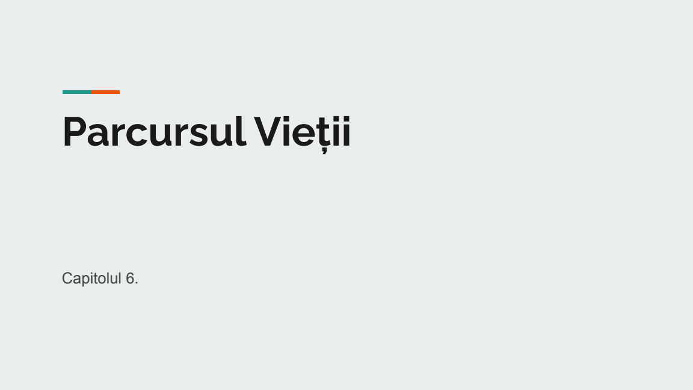

```text
Parcursul Vieții
```

### Pagina 295

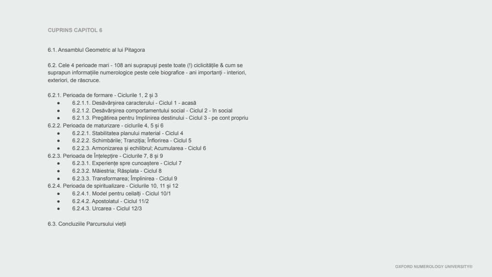

```text
CUPRINS CAPITOL 6
6.1. Ansamblul Geometric al lui Pitagora
6.2. Cele 4 perioade mari - 108 ani suprapuși peste toate (!) ciclicitățile & cum se
suprapun informațiile numerologice peste cele biografice - ani importanți - interiori,
exteriori, de răscruce.
6.2.1. Perioada de formare - Ciclurile 1, 2 și 3
● 6.2.1.1. Desăvârșirea caracterului - Ciclul 1 - acasă
● 6.2.1.2. Desăvârșirea comportamentului social - Ciclul 2 - în social
● 6.2.1.3. Pregătirea pentru împlinirea destinului - Ciclul 3 - pe cont propriu
6.2.2. Perioada de maturizare - ciclurile 4, 5 și 6
● 6.2.2.1. Stabilitatea planului material - Ciclul 4
● 6.2.2.2. Schimbările; Tranziția; Înflorirea - Ciclul 5
● 6.2.2.3. Armonizarea și echilibrul; Acumularea - Ciclul 6
6.2.3. Perioada de Înțelepțire - Ciclurile 7, 8 și 9
● 6.2.3.1. Experiențe spre cunoaștere - Ciclul 7
● 6.2.3.2. Măiestria; Răsplata - Ciclul 8
● 6.2.3.3. Transformarea; Împlinirea - Ciclul 9
6.2.4. Perioada de spiritualizare - Ciclurile 10, 11 și 12
● 6.2.4.1. Model pentru ceilalți - Ciclul 10/1
● 6.2.4.2. Apostolatul - Ciclul 11/2
● 6.2.4.3. Urcarea - Ciclul 12/3
6.3. Concluziile Parcursului vieții
OXFORD NUMEROLOGY UNIVERSITY®
---
```

### Pagina 296

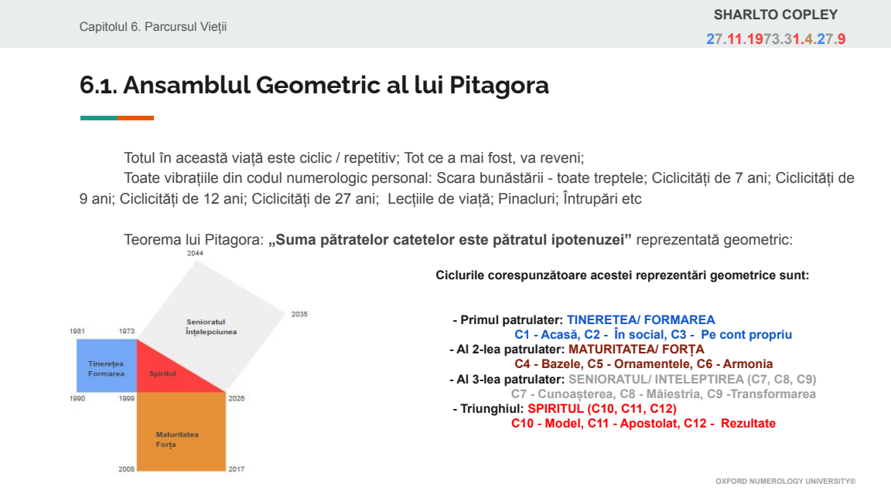

```text
Capitolul 6. Parcursul Vieții
6.1. Ansamblul Geometric al lui Pitagora
Totul în această viață este ciclic / repetitiv; Tot ce a mai fost, va reveni;
Toate vibrațiile din codul numerologic personal: Scara bunăstării - toate treptele; Ciclicități de 7 ani; Ciclicități de
9 ani; Ciclicități de 12 ani; Ciclicități de 27 ani; Lecțiile de viață; Pinacluri; Întrupări etc
Teorema lui Pitagora: „Suma pătratelor catetelor este pătratul ipotenuzei” reprezentată geometric:
Ciclurile corespunzătoare acestei reprezentări geometrice sunt:
- Primul patrulater: TINERETEA/ FORMAREA
C1 - Acasă, C2 - În social, C3 - Pe cont propriu
- Al 2-lea patrulater: MATURITATEA/ FORȚA
C4 - Bazele, C5 - Ornamentele, C6 - Armonia
- Al 3-lea patrulater: SENIORATUL/ INTELEPTIREA (C7, C8, C9)
C7 - Cunoașterea, C8 - Măiestria, C9 -Transformarea
- Triunghiul: SPIRITUL (C10, C11, C12)
C10 - Model, C11 - Apostolat, C12 - Rezultate
OXFORD NUMEROLOGY UNIVERSITY®
```

### Pagina 297

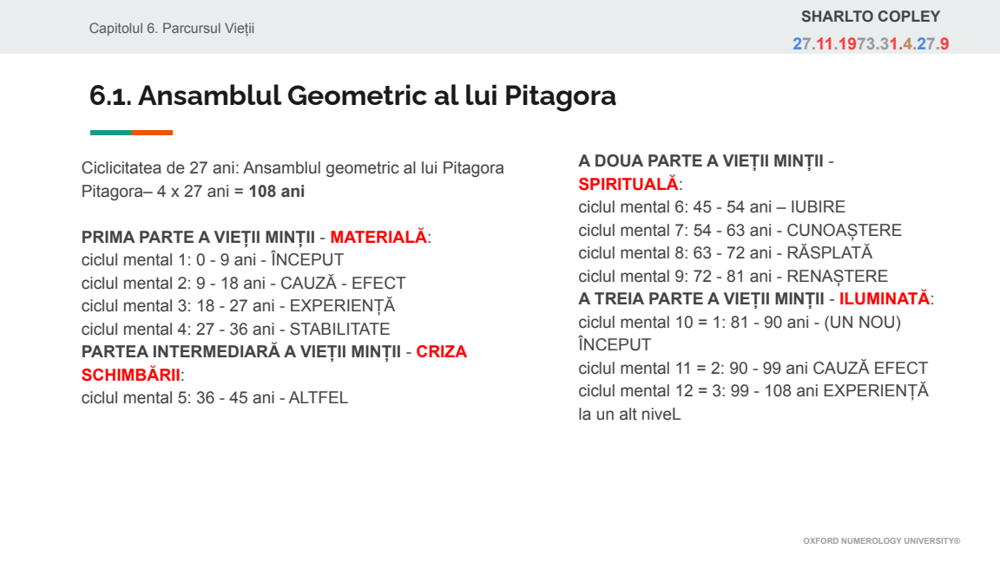

```text
Capitolul 6. Parcursul Vieții
6.1. Ansamblul Geometric al lui Pitagora
A DOUA PARTE A VIEȚII MINȚII -
Ciclicitatea de 27 ani: Ansamblul geometric al lui Pitagora
SPIRITUALĂ:
Pitagora– 4 x 27 ani = 108 ani
ciclul mental 6: 45 - 54 ani – IUBIRE
ciclul mental 7: 54 - 63 ani - CUNOAȘTERE
PRIMA PARTE A VIEȚII MINȚII - MATERIALĂ:
ciclul mental 8: 63 - 72 ani - RĂSPLATĂ
ciclul mental 1: 0 - 9 ani - ÎNCEPUT
ciclul mental 9: 72 - 81 ani - RENAȘTERE
ciclul mental 2: 9 - 18 ani - CAUZĂ - EFECT
A TREIA PARTE A VIEȚII MINȚII - ILUMINATĂ:
ciclul mental 3: 18 - 27 ani - EXPERIENȚĂ
ciclul mental 10 = 1: 81 - 90 ani - (UN NOU)
ciclul mental 4: 27 - 36 ani - STABILITATE
ÎNCEPUT
PARTEA INTERMEDIARĂ A VIEȚII MINȚII - CRIZA
ciclul mental 11 = 2: 90 - 99 ani CAUZĂ EFECT
SCHIMBĂRII:
ciclul mental 12 = 3: 99 - 108 ani EXPERIENȚĂ
ciclul mental 5: 36 - 45 ani - ALTFEL
la un alt niveL
OXFORD NUMEROLOGY UNIVERSITY®
```

### Pagina 298

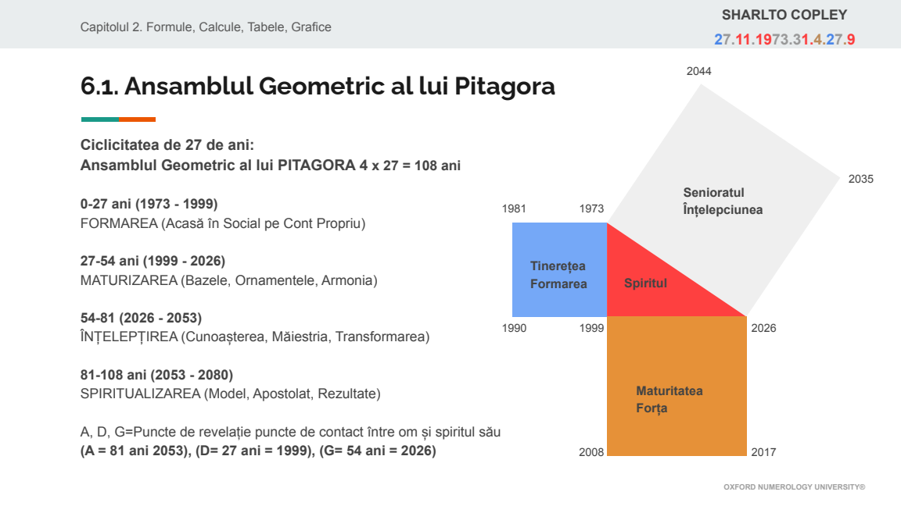

```text
Capitolul 2. Formule, Calcule, Tabele, Grafice
2044
6.1. Ansamblul Geometric al lui Pitagora
Ciclicitatea de 27 de ani:
Ansamblul Geometric al lui PITAGORA 4 x 27 = 108 ani
2035
Senioratul
0-27 ani (1973 - 1999)
1981 1973 Înțelepciunea
FORMAREA (Acasă în Social pe Cont Propriu)
27-54 ani (1999 - 2026)
Tinerețea
MATURIZAREA (Bazele, Ornamentele, Armonia)
Formarea Spiritul
54-81 (2026 - 2053)
1990 1999 2026
ÎNȚELEPȚIREA (Cunoașterea, Măiestria, Transformarea)
81-108 ani (2053 - 2080)
SPIRITUALIZAREA (Model, Apostolat, Rezultate) Maturitatea
Forța
A, D, G=Puncte de revelație puncte de contact între om și spiritul său
(A = 81 ani 2053), (D= 27 ani = 1999), (G= 54 ani = 2026) 2008 2017
OXFORD NUMEROLOGY UNIVERSITY®
```

### Pagina 299

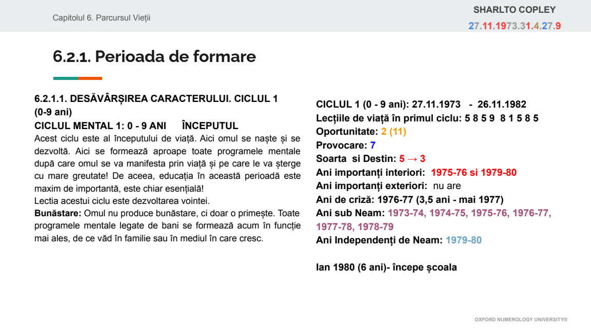

```text
Capitolul 6. Parcursul Vieții
6.2.1. Perioada de formare
6.2.1.1. DESĂVÂRȘIREA CARACTERULUI. CICLUL 1
CICLUL 1 (0 - 9 ani): 27.11.1973 - 26.11.1982
(0-9 ani)
Lecțiile de viață în primul ciclu: 5 8 5 9 8 1 5 8 5
CICLUL MENTAL 1: 0 - 9 ANI ÎNCEPUTUL
Oportunitate: 2 (11)
Acest ciclu este al începutului de viață. Aici omul se naște și se
Provocare: 7
dezVAULTă. Aici se formează aproape toate programele mentale
Soarta si Destin: 5 → 3
după care omul se va manifesta prin viață și pe care le va șterge
Ani importanți interiori: 1975-76 si 1979-80
cu mare greutate! De aceea, educația în această perioadă este
Ani importanți exteriori: nu are
maxim de importantă, este chiar esențială!
Lectia acestui ciclu este dezVAULTarea vointei. Ani de criză: 1976-77 (3,5 ani - mai 1977)
Bunăstare: Omul nu produce bunăstare, ci doar o primește. Toate Ani sub Neam: 1973-74, 1974-75, 1975-76, 1976-77,
programele mentale legate de bani se formează acum în funcție 1977-78, 1978-79
mai ales, de ce văd în familie sau în mediul în care cresc. Ani Independenți de Neam: 1979-80
Ian 1980 (6 ani)- începe școala
OXFORD NUMEROLOGY UNIVERSITY®
```

### Pagina 300

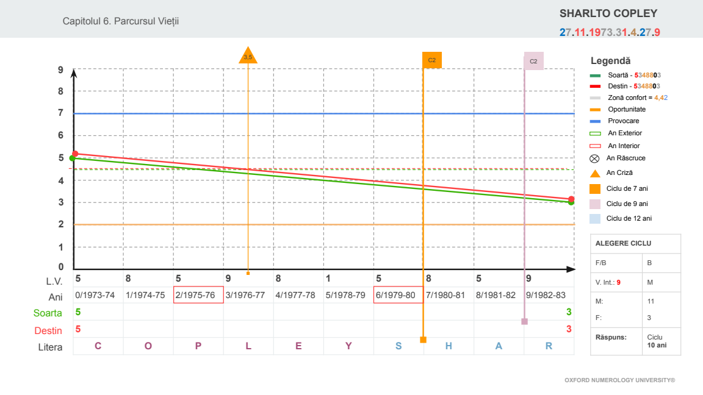

```text
Capitolul 6. Parcursul Vieții
3,5 C2 C2 Legendă
9
Soartă - 5348803
Destin - 5348803
8
Zonă confort = 4,42
7 Oportunitate
Provocare
6 An Exterior
An Interior
5 An Răscruce
An Criză
4
Ciclu de 7 ani
3 Ciclu de 9 ani
Ciclu de 12 ani
2
1 ALEGERE CICLU
0 F/B B
L.V. 5 8 5 9 8 1 5 8 5 9 V. Int.: 9 M
Ani 0/1973-74 1/1974-75 2/1975-76 3/1976-77 4/1977-78 5/1978-79 6/1979-80 7/1980-81 8/1981-82 9/1982-83
M: 11
Soarta 5 3
F: 3
Destin 5 3
Răspuns: Ciclu
Litera C O P L E Y S H A R 10 ani
OXFORD NUMEROLOGY UNIVERSITY®
```

### Pagina 301

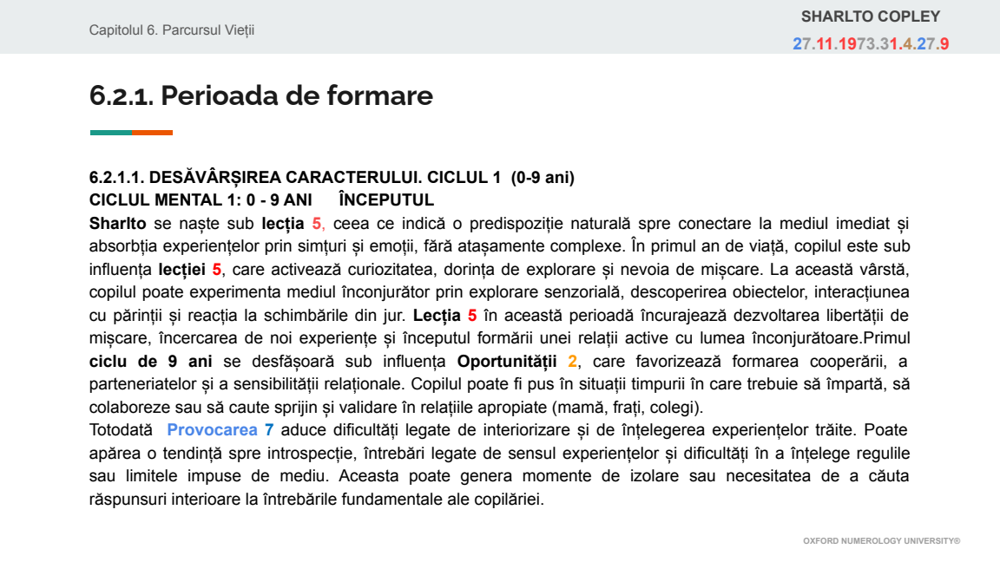

```text
Capitolul 6. Parcursul Vieții
6.2.1. Perioada de formare
6.2.1.1. DESĂVÂRȘIREA CARACTERULUI. CICLUL 1 (0-9 ani)
CICLUL MENTAL 1: 0 - 9 ANI ÎNCEPUTUL
Sharlto se naște sub lecția 5, ceea ce indică o predispoziție naturală spre conectare la mediul imediat și
absorbția experiențelor prin simțuri și emoții, fără atașamente complexe. În primul an de viață, copilul este sub
influența lecției 5, care activează curiozitatea, dorința de explorare și nevoia de mișcare. La această vârstă,
copilul poate experimenta mediul înconjurător prin explorare senzorială, descoperirea obiectelor, interacțiunea
cu părinții și reacția la schimbările din jur. Lecția 5 în această perioadă încurajează dezVAULTarea libertății de
mișcare, încercarea de noi experiențe și începutul formării unei relații active cu lumea înconjurătoare.Primul
ciclu de 9 ani se desfășoară sub influența Oportunității 2, care favorizează formarea cooperării, a
parteneriatelor și a sensibilității relaționale. Copilul poate fi pus în situații timpurii în care trebuie să împartă, să
colaboreze sau să caute sprijin și validare în relațiile apropiate (mamă, frați, colegi).
Totodată Provocarea 7 aduce dificultăți legate de interiorizare și de înțelegerea experiențelor trăite. Poate
apărea o tendință spre introspecție, întrebări legate de sensul experiențelor și dificultăți în a înțelege regulile
sau limitele impuse de mediu. Aceasta poate genera momente de izolare sau necesitatea de a căuta
răspunsuri interioare la întrebările fundamentale ale copilăriei.
OXFORD NUMEROLOGY UNIVERSITY®
```

### Pagina 302

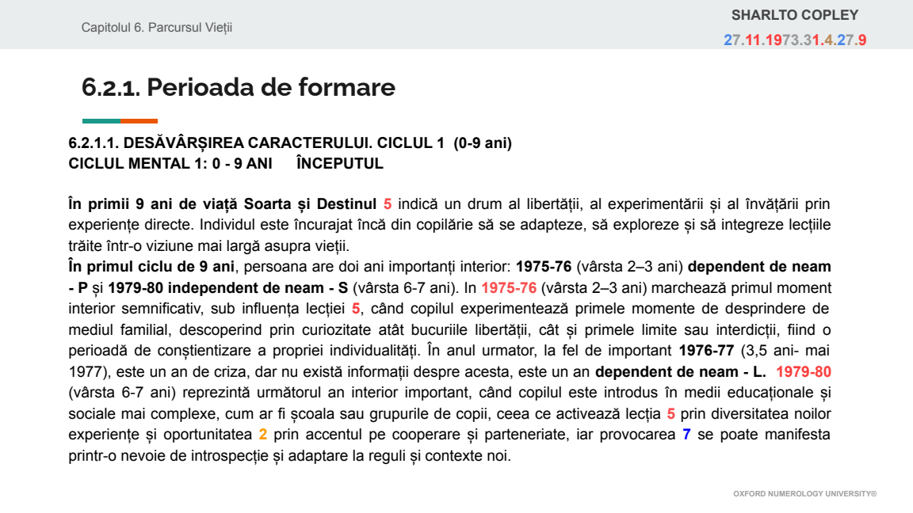

```text
Capitolul 6. Parcursul Vieții
6.2.1. Perioada de formare
6.2.1.1. DESĂVÂRȘIREA CARACTERULUI. CICLUL 1 (0-9 ani)
CICLUL MENTAL 1: 0 - 9 ANI ÎNCEPUTUL
În primii 9 ani de viață Soarta și Destinul 5 indică un drum al libertății, al experimentării și al învățării prin
experiențe directe. Individul este încurajat încă din copilărie să se adapteze, să exploreze și să integreze lecțiile
trăite într-o viziune mai largă asupra vieții.
În primul ciclu de 9 ani, persoana are doi ani importanți interior: 1975-76 (vârsta 2–3 ani) dependent de neam
- P și 1979-80 independent de neam - S (vârsta 6-7 ani). In 1975-76 (vârsta 2–3 ani) marchează primul moment
interior semnificativ, sub influența lecției 5, când copilul experimentează primele momente de desprindere de
mediul familial, descoperind prin curiozitate atât bucuriile libertății, cât și primele limite sau interdicții, fiind o
perioadă de conștientizare a propriei individualități. În anul urmator, la fel de important 1976-77 (3,5 ani- mai
1977), este un an de criza, dar nu există informații despre acesta, este un an dependent de neam - L. 1979-80
(vârsta 6-7 ani) reprezintă următorul an interior important, când copilul este introdus în medii educaționale și
sociale mai complexe, cum ar fi școala sau grupurile de copii, ceea ce activează lecția 5 prin diversitatea noilor
experiențe și oportunitatea 2 prin accentul pe cooperare și parteneriate, iar provocarea 7 se poate manifesta
printr-o nevoie de introspecție și adaptare la reguli și contexte noi.
OXFORD NUMEROLOGY UNIVERSITY®
```

### Pagina 303

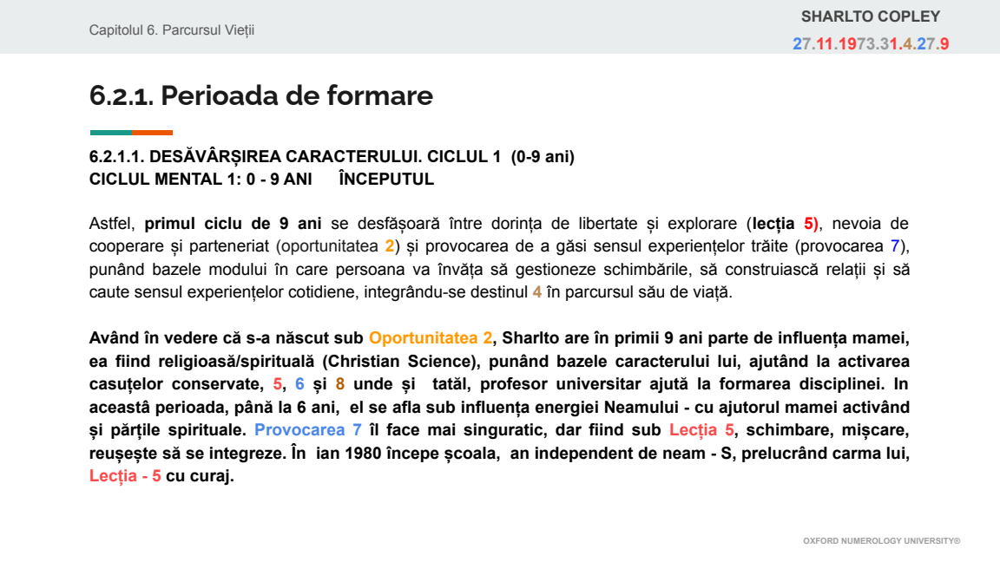

```text
Capitolul 6. Parcursul Vieții
6.2.1. Perioada de formare
6.2.1.1. DESĂVÂRȘIREA CARACTERULUI. CICLUL 1 (0-9 ani)
CICLUL MENTAL 1: 0 - 9 ANI ÎNCEPUTUL
Astfel, primul ciclu de 9 ani se desfășoară între dorința de libertate și explorare (lecția 5), nevoia de
cooperare și parteneriat (oportunitatea 2) și provocarea de a găsi sensul experiențelor trăite (provocarea 7),
punând bazele modului în care persoana va învăța să gestioneze schimbările, să construiască relații și să
caute sensul experiențelor cotidiene, integrându-se destinul 4 în parcursul său de viață.
Având în vedere că s-a născut sub Oportunitatea 2, Sharlto are în primii 9 ani parte de influența mamei,
ea fiind religioasă/spirituală (Christian Science), punând bazele caracterului lui, ajutând la activarea
casuțelor conservate, 5, 6 și 8 unde și tatăl, profesor universitar ajută la formarea disciplinei. In
aceastâ perioada, până la 6 ani, el se afla sub influența energiei Neamului - cu ajutorul mamei activând
și părțile spirituale. Provocarea 7 îl face mai singuratic, dar fiind sub Lecția 5, schimbare, mișcare,
reușește să se integreze. În ian 1980 începe școala, an independent de neam - S, prelucrând carma lui,
Lecția - 5 cu curaj.
OXFORD NUMEROLOGY UNIVERSITY®
```

### Pagina 304

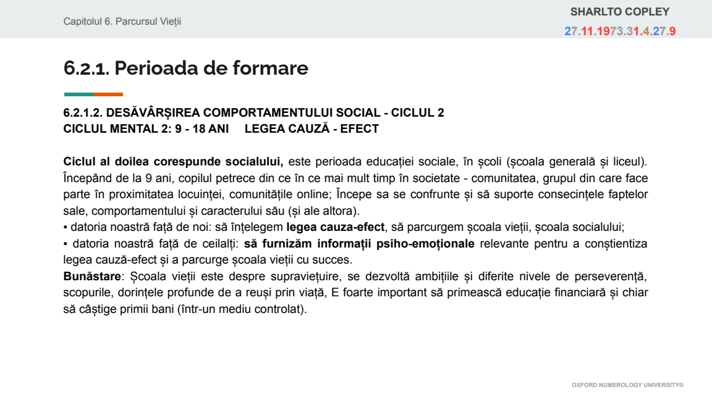

```text
Capitolul 6. Parcursul Vieții
6.2.1. Perioada de formare
6.2.1.2. DESĂVÂRȘIREA COMPORTAMENTULUI SOCIAL - CICLUL 2
CICLUL MENTAL 2: 9 - 18 ANI LEGEA CAUZĂ - EFECT
Ciclul al doilea corespunde socialului, este perioada educației sociale, în școli (școala generală și liceul).
Începând de la 9 ani, copilul petrece din ce în ce mai mult timp în societate - comunitatea, grupul din care face
parte în proximitatea locuinței, comunitățile online; Începe sa se confrunte și să suporte consecințele faptelor
sale, comportamentului și caracterului său (și ale altora).
▪ datoria noastră față de noi: să înțelegem legea cauza-efect, să parcurgem școala vieții, școala socialului;
▪ datoria noastră față de ceilalți: să furnizăm informații psiho-emoționale relevante pentru a conștientiza
legea cauză-efect și a parcurge școala vieții cu succes.
Bunăstare: Școala vieții este despre supraviețuire, se dezVAULTă ambițiile și diferite nivele de perseverență,
scopurile, dorințele profunde de a reuși prin viață, E foarte important să primească educație financiară și chiar
să câștige primii bani (într-un mediu controlat).
OXFORD NUMEROLOGY UNIVERSITY®
```

### Pagina 305

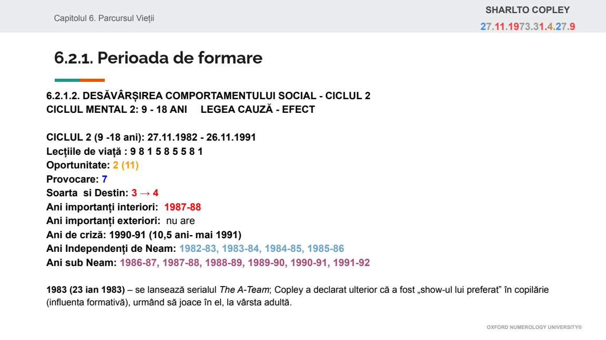

```text
Capitolul 6. Parcursul Vieții
6.2.1. Perioada de formare
6.2.1.2. DESĂVÂRȘIREA COMPORTAMENTULUI SOCIAL - CICLUL 2
CICLUL MENTAL 2: 9 - 18 ANI LEGEA CAUZĂ - EFECT
CICLUL 2 (9 -18 ani): 27.11.1982 - 26.11.1991
Lecțiile de viață : 9 8 1 5 8 5 5 8 1
Oportunitate: 2 (11)
Provocare: 7
Soarta si Destin: 3 → 4
Ani importanți interiori: 1987-88
Ani importanți exteriori: nu are
Ani de criză: 1990-91 (10,5 ani- mai 1991)
Ani Independenți de Neam: 1982-83, 1983-84, 1984-85, 1985-86
Ani sub Neam: 1986-87, 1987-88, 1988-89, 1989-90, 1990-91, 1991-92
1983 (23 ian 1983) – se lansează serialul The A-Team; Copley a declarat ulterior că a fost „show-ul lui preferat” în copilărie
(influenta formativă), urmând să joace în el, la vârsta adultă.
OXFORD NUMEROLOGY UNIVERSITY®
```

### Pagina 306

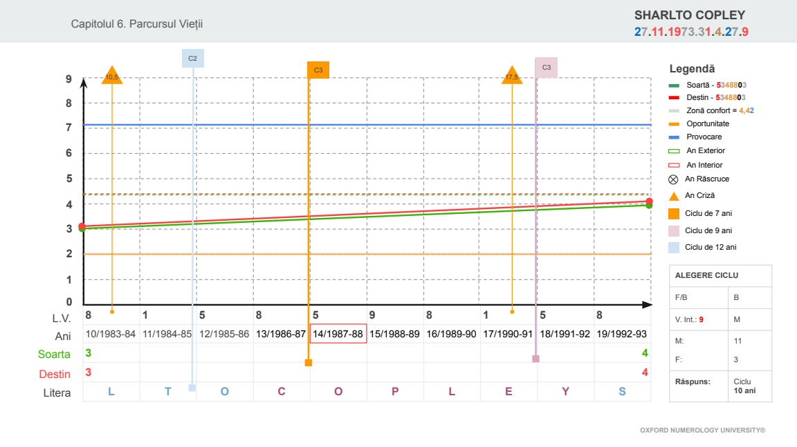

```text
Capitolul 6. Parcursul Vieții
C2
C3 C3 Legendă
9 10,5 17,5
Soartă - 5348803
Destin - 5348803
8
Zonă confort = 4,42
7 Oportunitate
Provocare
6 An Exterior
An Interior
5 An Răscruce
An Criză
4
Ciclu de 7 ani
3 Ciclu de 9 ani
Ciclu de 12 ani
2
1 ALEGERE CICLU
0 F/B B
L.V. 8 1 5 8 5 9 8 1 5 8 V. Int.: 9 M
Ani 10/1983-84 11/1984-85 12/1985-86 13/1986-87 14/1987-88 15/1988-89 16/1989-90 17/1990-91 18/1991-92 19/1992-93
M: 11
Soarta 3 4
F: 3
Destin 3 4
Răspuns: Ciclu
Litera L T O C O P L E Y S 10 ani
OXFORD NUMEROLOGY UNIVERSITY®
```

### Pagina 307

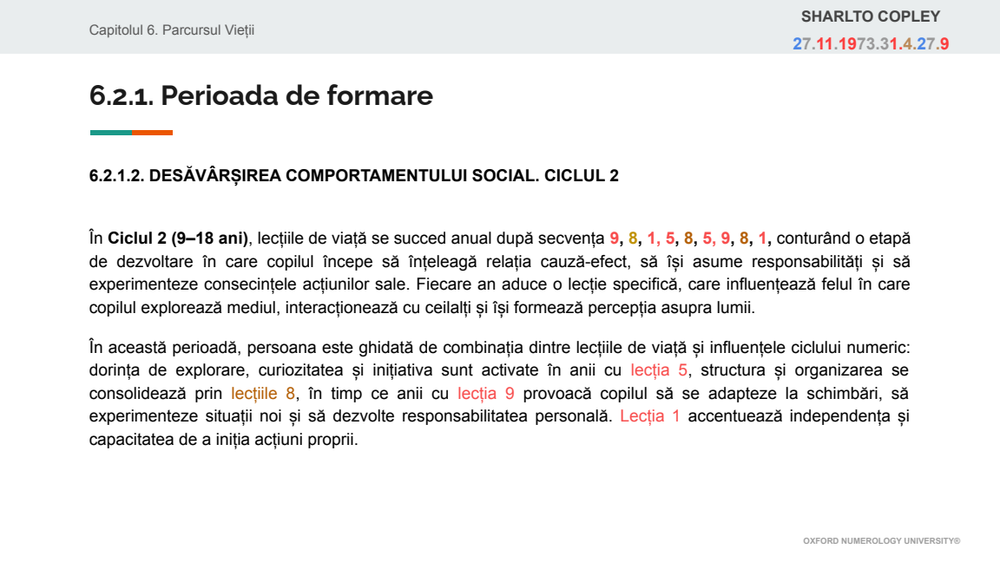

```text
Capitolul 6. Parcursul Vieții
6.2.1. Perioada de formare
6.2.1.2. DESĂVÂRȘIREA COMPORTAMENTULUI SOCIAL. CICLUL 2
În Ciclul 2 (9–18 ani), lecțiile de viață se succed anual după secvența 9, 8, 1, 5, 8, 5, 9, 8, 1, conturând o etapă
de dezVAULTare în care copilul începe să înțeleagă relația cauză-efect, să își asume responsabilități și să
experimenteze consecințele acțiunilor sale. Fiecare an aduce o lecție specifică, care influențează felul în care
copilul explorează mediul, interacționează cu ceilalți și își formează percepția asupra lumii.
În această perioadă, persoana este ghidată de combinația dintre lecțiile de viață și influențele ciclului numeric:
dorința de explorare, curiozitatea și inițiativa sunt activate în anii cu lecția 5, structura și organizarea se
consolidează prin lecțiile 8, în timp ce anii cu lecția 9 provoacă copilul să se adapteze la schimbări, să
experimenteze situații noi și să dezVAULTe responsabilitatea personală. Lecția 1 accentuează independența și
capacitatea de a iniția acțiuni proprii.
OXFORD NUMEROLOGY UNIVERSITY®
```

### Pagina 308

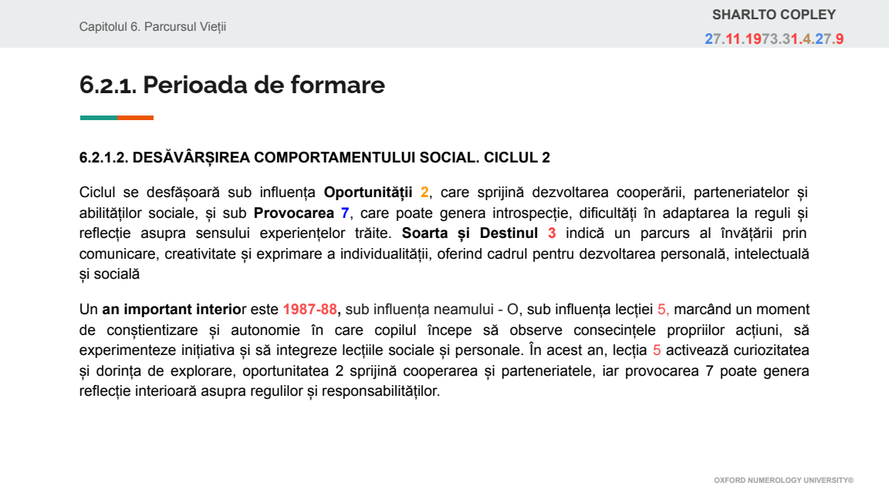

```text
Capitolul 6. Parcursul Vieții
6.2.1. Perioada de formare
6.2.1.2. DESĂVÂRȘIREA COMPORTAMENTULUI SOCIAL. CICLUL 2
Ciclul se desfășoară sub influența Oportunității 2, care sprijină dezVAULTarea cooperării, parteneriatelor și
abilităților sociale, și sub Provocarea 7, care poate genera introspecție, dificultăți în adaptarea la reguli și
reflecție asupra sensului experiențelor trăite. Soarta și Destinul 3 indică un parcurs al învățării prin
comunicare, creativitate și exprimare a individualității, oferind cadrul pentru dezVAULTarea personală, intelectuală
și socială
Un an important interior este 1987-88, sub influența neamului - O, sub influența lecției 5, marcând un moment
de conștientizare și autonomie în care copilul începe să observe consecințele propriilor acțiuni, să
experimenteze inițiativa și să integreze lecțiile sociale și personale. În acest an, lecția 5 activează curiozitatea
și dorința de explorare, oportunitatea 2 sprijină cooperarea și parteneriatele, iar provocarea 7 poate genera
reflecție interioară asupra regulilor și responsabilităților.
OXFORD NUMEROLOGY UNIVERSITY®
```

### Pagina 309

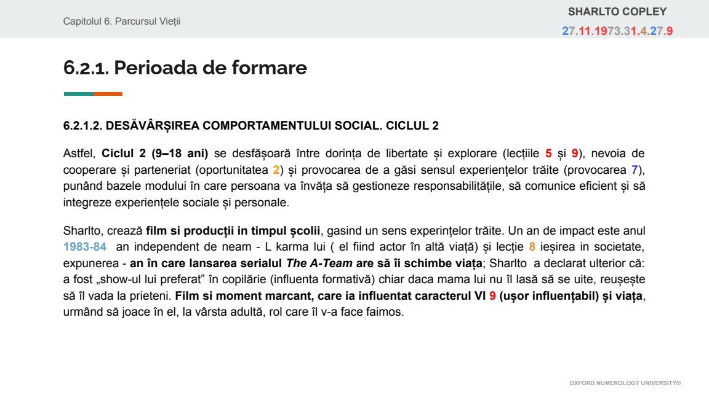

```text
Capitolul 6. Parcursul Vieții
6.2.1. Perioada de formare
6.2.1.2. DESĂVÂRȘIREA COMPORTAMENTULUI SOCIAL. CICLUL 2
Astfel, Ciclul 2 (9–18 ani) se desfășoară între dorința de libertate și explorare (lecțiile 5 și 9), nevoia de
cooperare și parteneriat (oportunitatea 2) și provocarea de a găsi sensul experiențelor trăite (provocarea 7),
punând bazele modului în care persoana va învăța să gestioneze responsabilitățile, să comunice eficient și să
integreze experiențele sociale și personale.
Sharlto, crează film si producții in timpul școlii, gasind un sens experințelor trăite. Un an de impact este anul
1983-84 an independent de neam - L karma lui ( el fiind actor în altă viață) și lecție 8 ieșirea in societate,
expunerea - an în care lansarea serialul The A-Team are să îi schimbe viața; Sharlto a declarat ulterior că:
a fost „show-ul lui preferat” în copilărie (influenta formativă) chiar daca mama lui nu îl lasă să se uite, reușește
să îl vada la prieteni. Film si moment marcant, care ia influentat caracterul VI 9 (ușor influențabil) și viața,
urmând să joace în el, la vârsta adultă, rol care îl v-a face faimos.
OXFORD NUMEROLOGY UNIVERSITY®
```

### Pagina 310

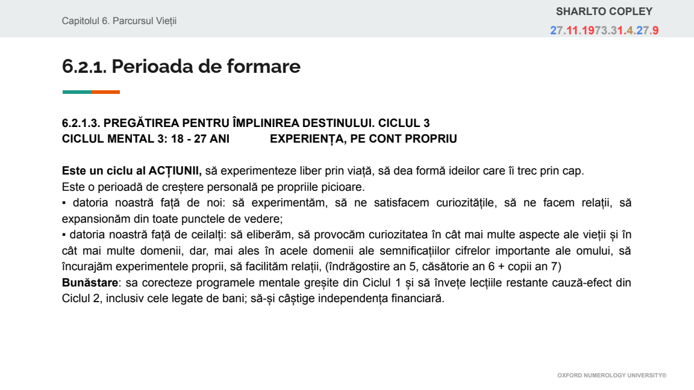

```text
Capitolul 6. Parcursul Vieții
6.2.1. Perioada de formare
6.2.1.3. PREGĂTIREA PENTRU ÎMPLINIREA DESTINULUI. CICLUL 3
CICLUL MENTAL 3: 18 - 27 ANI EXPERIENȚA, PE CONT PROPRIU
Este un ciclu al ACȚIUNII, să experimenteze liber prin viață, să dea formă ideilor care îi trec prin cap.
Este o perioadă de creștere personală pe propriile picioare.
▪ datoria noastră față de noi: să experimentăm, să ne satisfacem curiozitățile, să ne facem relații, să
expansionăm din toate punctele de vedere;
▪ datoria noastră față de ceilalți: să eliberăm, să provocăm curiozitatea în cât mai multe aspecte ale vieții și în
cât mai multe domenii, dar, mai ales în acele domenii ale semnificațiilor cifrelor importante ale omului, să
încurajăm experimentele proprii, să facilităm relații, (îndrăgostire an 5, căsătorie an 6 + copii an 7)
Bunăstare: sa corecteze programele mentale greșite din Ciclul 1 și să învețe lecțiile restante cauză-efect din
Ciclul 2, inclusiv cele legate de bani; să-și câștige independența financiară.
OXFORD NUMEROLOGY UNIVERSITY®
```

### Pagina 311

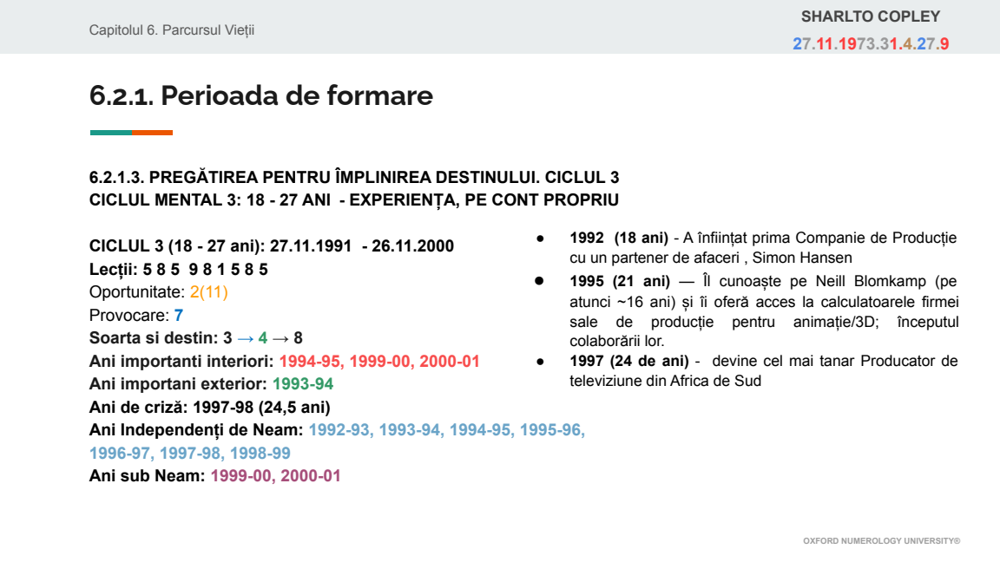

```text
Capitolul 6. Parcursul Vieții
6.2.1. Perioada de formare
6.2.1.3. PREGĂTIREA PENTRU ÎMPLINIREA DESTINULUI. CICLUL 3
CICLUL MENTAL 3: 18 - 27 ANI - EXPERIENȚA, PE CONT PROPRIU
● 1992 (18 ani) - A înființat prima Companie de Producție
CICLUL 3 (18 - 27 ani): 27.11.1991 - 26.11.2000
cu un partener de afaceri , Simon Hansen
Lecții: 5 8 5 9 8 1 5 8 5
● 1995 (21 ani) — Îl cunoaște pe Neill Blomkamp (pe
Oportunitate: 2(11)
atunci ~16 ani) și îi oferă acces la calculatoarele firmei
Provocare: 7
sale de producție pentru animație/3D; începutul
Soarta si destin: 3 → 4 → 8 colaborării lor.
Ani importanti interiori: 1994-95, 1999-00, 2000-01 ● 1997 (24 de ani) - devine cel mai tanar Producator de
Ani importani exterior: 1993-94 televiziune din Africa de Sud
Ani de criză: 1997-98 (24,5 ani)
Ani Independenți de Neam: 1992-93, 1993-94, 1994-95, 1995-96,
1996-97, 1997-98, 1998-99
Ani sub Neam: 1999-00, 2000-01
OXFORD NUMEROLOGY UNIVERSITY®
```

### Pagina 312

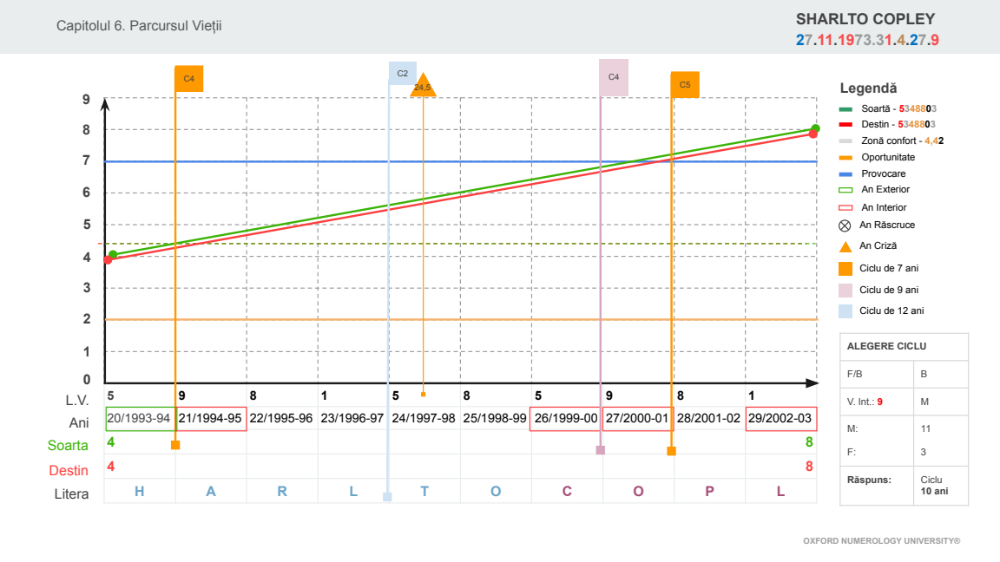

```text
Capitolul 6. Parcursul Vieții
C4 C2 C4
24,5 C5 Legendă
9
Soartă - 5348803
8 Destin - 5348803
Zonă confort - 4,42
7 Oportunitate
Provocare
6 An Exterior
An Interior
5 An Răscruce
An Criză
4
Ciclu de 7 ani
3 Ciclu de 9 ani
Ciclu de 12 ani
2
1 ALEGERE CICLU
0 F/B B
L.V. 5 9 8 1 5 8 5 9 8 1 V. Int.: 9 M
Ani 20/1993-94 21/1994-95 22/1995-96 23/1996-97 24/1997-98 25/1998-99 26/1999-00 27/2000-01 28/2001-02 29/2002-03
M: 11
Soarta 4 8
F: 3
Destin 4 8
Răspuns: Ciclu
Litera H A R L T O C O P L 10 ani
OXFORD NUMEROLOGY UNIVERSITY®
```

### Pagina 313

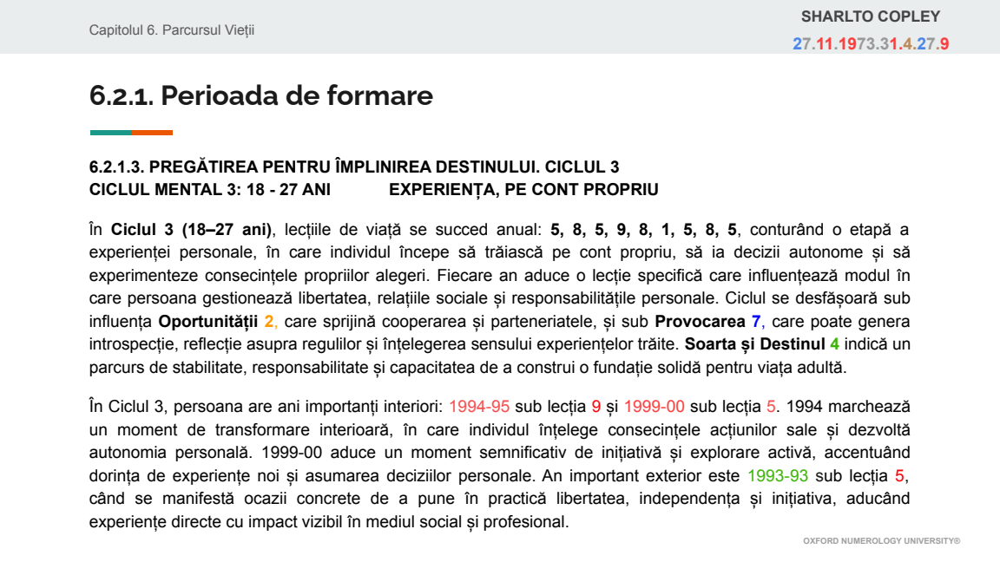

```text
Capitolul 6. Parcursul Vieții
6.2.1. Perioada de formare
6.2.1.3. PREGĂTIREA PENTRU ÎMPLINIREA DESTINULUI. CICLUL 3
CICLUL MENTAL 3: 18 - 27 ANI EXPERIENȚA, PE CONT PROPRIU
În Ciclul 3 (18–27 ani), lecțiile de viață se succed anual: 5, 8, 5, 9, 8, 1, 5, 8, 5, conturând o etapă a
experienței personale, în care individul începe să trăiască pe cont propriu, să ia decizii autonome și să
experimenteze consecințele propriilor alegeri. Fiecare an aduce o lecție specifică care influențează modul în
care persoana gestionează libertatea, relațiile sociale și responsabilitățile personale. Ciclul se desfășoară sub
influența Oportunității 2, care sprijină cooperarea și parteneriatele, și sub Provocarea 7, care poate genera
introspecție, reflecție asupra regulilor și înțelegerea sensului experiențelor trăite. Soarta și Destinul 4 indică un
parcurs de stabilitate, responsabilitate și capacitatea de a construi o fundație solidă pentru viața adultă.
În Ciclul 3, persoana are ani importanți interiori: 1994-95 sub lecția 9 și 1999-00 sub lecția 5. 1994 marchează
un moment de transformare interioară, în care individul înțelege consecințele acțiunilor sale și dezVAULTă
autonomia personală. 1999-00 aduce un moment semnificativ de inițiativă și explorare activă, accentuând
dorința de experiențe noi și asumarea deciziilor personale. An important exterior este 1993-93 sub lecția 5,
când se manifestă ocazii concrete de a pune în practică libertatea, independența și inițiativa, aducând
experiențe directe cu impact vizibil în mediul social și profesional.
OXFORD NUMEROLOGY UNIVERSITY®
```

### Pagina 314

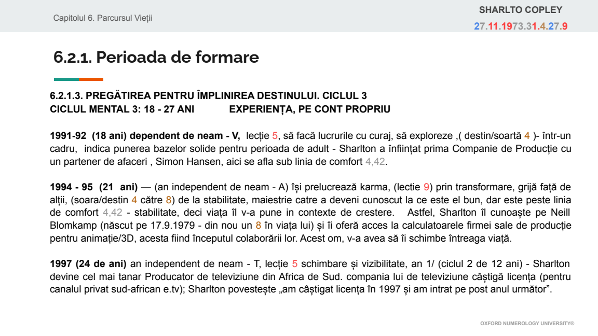

```text
Capitolul 6. Parcursul Vieții
6.2.1. Perioada de formare
6.2.1.3. PREGĂTIREA PENTRU ÎMPLINIREA DESTINULUI. CICLUL 3
CICLUL MENTAL 3: 18 - 27 ANI EXPERIENȚA, PE CONT PROPRIU
1991-92 (18 ani) dependent de neam - V, lecție 5, să facă lucrurile cu curaj, să exploreze ,( destin/soartă 4 )- într-un
cadru, indica punerea bazelor solide pentru perioada de adult - Sharlton a înființat prima Companie de Producție cu
un partener de afaceri , Simon Hansen, aici se afla sub linia de comfort 4,42.
1994 - 95 (21 ani) — (an independent de neam - A) își prelucrează karma, (lectie 9) prin transformare, grijă față de
alții, (soara/destin 4 către 8) de la stabilitate, maiestrie catre a deveni cunoscut la ce este el bun, dar este peste linia
de comfort 4,42 - stabilitate, deci viața îl v-a pune in contexte de crestere. Astfel, Sharlton îl cunoaște pe Neill
Blomkamp (născut pe 17.9.1979 - din nou un 8 în viața lui) și îi oferă acces la calculatoarele firmei sale de producție
pentru animație/3D, acesta fiind începutul colaborării lor. Acest om, v-a avea să îi schimbe întreaga viață.
1997 (24 de ani) an independent de neam - T, lecție 5 schimbare și vizibilitate, an 1/ (ciclul 2 de 12 ani) - Sharlton
devine cel mai tanar Producator de televiziune din Africa de Sud. compania lui de televiziune câștigă licența (pentru
canalul privat sud-african e.tv); Sharlton povestește „am câștigat licența în 1997 și am intrat pe post anul următor”.
OXFORD NUMEROLOGY UNIVERSITY®
```

### Pagina 315

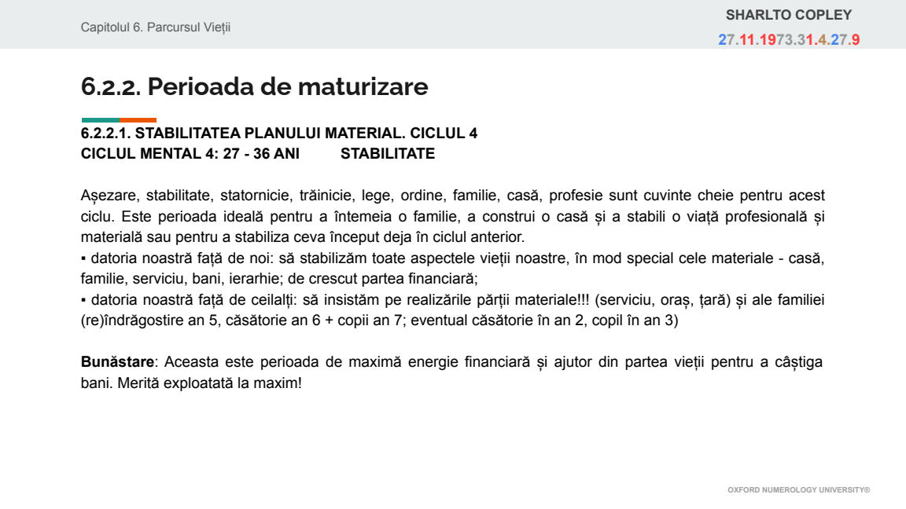

```text
Capitolul 6. Parcursul Vieții
6.2.2. Perioada de maturizare
6.2.2.1. STABILITATEA PLANULUI MATERIAL. CICLUL 4
CICLUL MENTAL 4: 27 - 36 ANI STABILITATE
Așezare, stabilitate, statornicie, trăinicie, lege, ordine, familie, casă, profesie sunt cuvinte cheie pentru acest
ciclu. Este perioada ideală pentru a întemeia o familie, a construi o casă și a stabili o viață profesională și
materială sau pentru a stabiliza ceva început deja în ciclul anterior.
▪ datoria noastră față de noi: să stabilizăm toate aspectele vieții noastre, în mod special cele materiale - casă,
familie, serviciu, bani, ierarhie; de crescut partea financiară;
▪ datoria noastră față de ceilalți: să insistăm pe realizările părții materiale!!! (serviciu, oraș, țară) și ale familiei
(re)îndrăgostire an 5, căsătorie an 6 + copii an 7; eventual căsătorie în an 2, copil în an 3)
Bunăstare: Aceasta este perioada de maximă energie financiară și ajutor din partea vieții pentru a câștiga
bani. Merită exploatată la maxim!
OXFORD NUMEROLOGY UNIVERSITY®
```

### Pagina 316

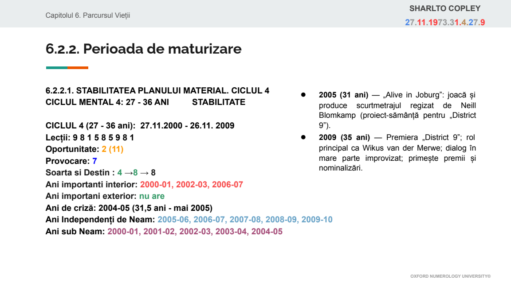

```text
Capitolul 6. Parcursul Vieții
6.2.2. Perioada de maturizare
6.2.2.1. STABILITATEA PLANULUI MATERIAL. CICLUL 4
● 2005 (31 ani) — „Alive in Joburg”: joacă și
CICLUL MENTAL 4: 27 - 36 ANI STABILITATE
produce scurtmetrajul regizat de Neill
Blomkamp (proiect-sămânță pentru „District
CICLUL 4 (27 - 36 ani): 27.11.2000 - 26.11. 2009 9”).
Lecții: 9 8 1 5 8 5 9 8 1 ● 2009 (35 ani) — Premiera „District 9”; rol
Oportunitate: 2 (11) principal ca Wikus van der Merwe; dialog în
mare parte improvizat; primește premii și
Provocare: 7
nominalizări.
Soarta si Destin : 4 →8 → 8
Ani importanti interior: 2000-01, 2002-03, 2006-07
Ani importani exterior: nu are
Ani de criză: 2004-05 (31,5 ani - mai 2005)
Ani Independenți de Neam: 2005-06, 2006-07, 2007-08, 2008-09, 2009-10
Ani sub Neam: 2000-01, 2001-02, 2002-03, 2003-04, 2004-05
OXFORD NUMEROLOGY UNIVERSITY®
```

### Pagina 317

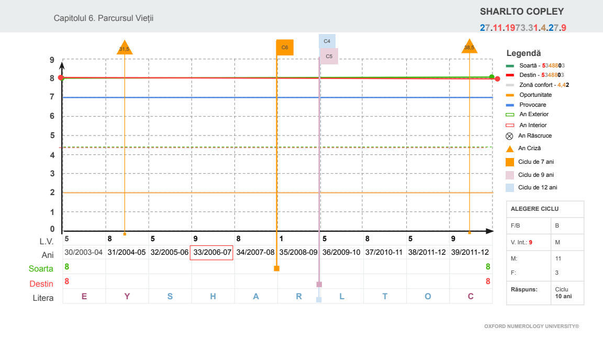

```text
Capitolul 6. Parcursul Vieții
C4
31,5 C6 38,5
Legendă
9 C5
Soartă - 5348803
8 Destin - 5348803
Zonă confort - 4,42
7 Oportunitate
Provocare
6 An Exterior
An Interior
5 An Răscruce
An Criză
4
Ciclu de 7 ani
3 Ciclu de 9 ani
Ciclu de 12 ani
2
1 ALEGERE CICLU
0 F/B B
L.V. 5 8 5 9 8 1 5 8 5 9 V. Int.: 9 M
Ani 30/2003-04 31/2004-05 32/2005-06 33/2006-07 34/2007-08 35/2008-09 36/2009-10 37/2010-11 38/2011-12 39/2011-12
M: 11
Soarta 8 8
F: 3
Destin 8 8
Răspuns: Ciclu
Litera E Y S H A R L T O C 10 ani
OXFORD NUMEROLOGY UNIVERSITY®
```

### Pagina 318

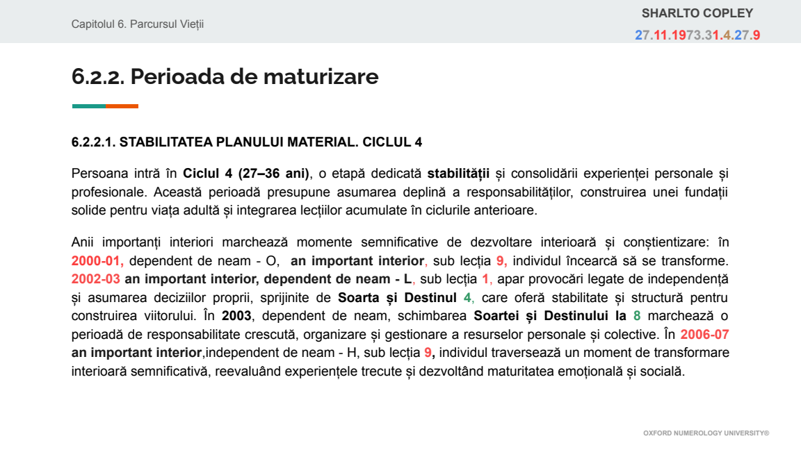

```text
Capitolul 6. Parcursul Vieții
6.2.2. Perioada de maturizare
6.2.2.1. STABILITATEA PLANULUI MATERIAL. CICLUL 4
Persoana intră în Ciclul 4 (27–36 ani), o etapă dedicată stabilității și consolidării experienței personale și
profesionale. Această perioadă presupune asumarea deplină a responsabilităților, construirea unei fundații
solide pentru viața adultă și integrarea lecțiilor acumulate în ciclurile anterioare.
Anii importanți interiori marchează momente semnificative de dezVAULTare interioară și conștientizare: în
2000-01, dependent de neam - O, an important interior, sub lecția 9, individul încearcă să se transforme.
2002-03 an important interior, dependent de neam - L, sub lecția 1, apar provocări legate de independență
și asumarea deciziilor proprii, sprijinite de Soarta și Destinul 4, care oferă stabilitate și structură pentru
construirea viitorului. În 2003, dependent de neam, schimbarea Soartei și Destinului la 8 marchează o
perioadă de responsabilitate crescută, organizare și gestionare a resurselor personale și colective. În 2006-07
an important interior,independent de neam - H, sub lecția 9, individul traversează un moment de transformare
interioară semnificativă, reevaluând experiențele trecute și dezVAULTând maturitatea emoțională și socială.
OXFORD NUMEROLOGY UNIVERSITY®
```

### Pagina 319

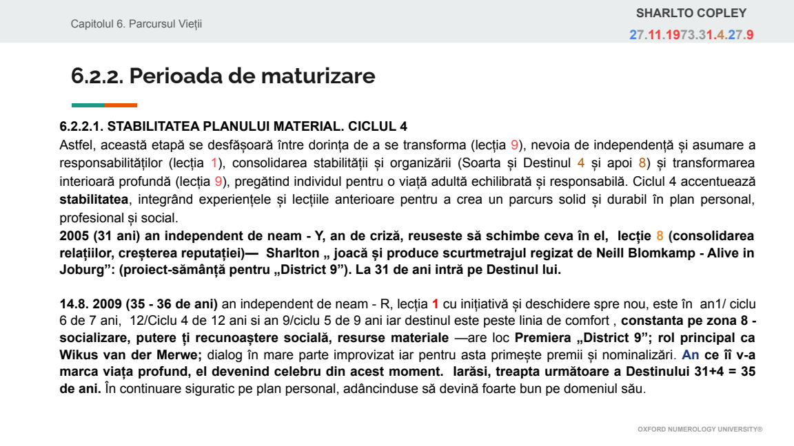

```text
Capitolul 6. Parcursul Vieții
6.2.2. Perioada de maturizare
6.2.2.1. STABILITATEA PLANULUI MATERIAL. CICLUL 4
Astfel, această etapă se desfășoară între dorința de a se transforma (lecția 9), nevoia de independență și asumare a
responsabilităților (lecția 1), consolidarea stabilității și organizării (Soarta și Destinul 4 și apoi 8) și transformarea
interioară profundă (lecția 9), pregătind individul pentru o viață adultă echilibrată și responsabilă. Ciclul 4 accentuează
stabilitatea, integrând experiențele și lecțiile anterioare pentru a crea un parcurs solid și durabil în plan personal,
profesional și social.
2005 (31 ani) an independent de neam - Y, an de criză, reuseste să schimbe ceva în el, lecție 8 (consolidarea
relațiilor, creșterea reputației)— Sharlton „ joacă și produce scurtmetrajul regizat de Neill Blomkamp - Alive in
Joburg”: (proiect-sămânță pentru „District 9”). La 31 de ani intră pe Destinul lui.
14.8. 2009 (35 - 36 de ani) an independent de neam - R, lecția 1 cu inițiativă și deschidere spre nou, este în an1/ ciclu
6 de 7 ani, 12/Ciclu 4 de 12 ani si an 9/ciclu 5 de 9 ani iar destinul este peste linia de comfort , constanta pe zona 8 -
socializare, putere ți recunoaștere socială, resurse materiale —are loc Premiera „District 9”; rol principal ca
Wikus van der Merwe; dialog în mare parte improvizat iar pentru asta primește premii și nominalizări. An ce îî v-a
marca viața profund, el devenind celebru din acest moment. Iarăsi, treapta următoare a Destinului 31+4 = 35
de ani. În continuare siguratic pe plan personal, adâncinduse să devină foarte bun pe domeniul său.
OXFORD NUMEROLOGY UNIVERSITY®
```

### Pagina 320

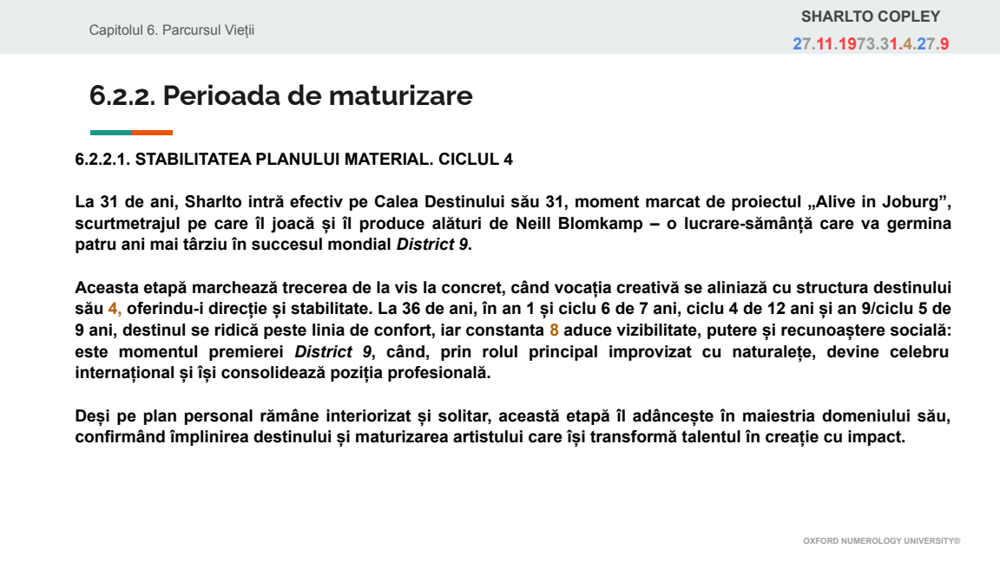

```text
Capitolul 6. Parcursul Vieții
6.2.2. Perioada de maturizare
6.2.2.1. STABILITATEA PLANULUI MATERIAL. CICLUL 4
La 31 de ani, Sharlto intră efectiv pe Calea Destinului său 31, moment marcat de proiectul „Alive in Joburg”,
scurtmetrajul pe care îl joacă și îl produce alături de Neill Blomkamp – o lucrare-sămânță care va germina
patru ani mai târziu în succesul mondial District 9.
Aceasta etapă marchează trecerea de la vis la concret, când vocația creativă se aliniază cu structura destinului
său 4, oferindu-i direcție și stabilitate. La 36 de ani, în an 1 și ciclu 6 de 7 ani, ciclu 4 de 12 ani și an 9/ciclu 5 de
9 ani, destinul se ridică peste linia de confort, iar constanta 8 aduce vizibilitate, putere și recunoaștere socială:
este momentul premierei District 9, când, prin rolul principal improvizat cu naturalețe, devine celebru
internațional și își consolidează poziția profesională.
Deși pe plan personal rămâne interiorizat și solitar, această etapă îl adâncește în maiestria domeniului său,
confirmând împlinirea destinului și maturizarea artistului care își transformă talentul în creație cu impact.
OXFORD NUMEROLOGY UNIVERSITY®
```

### Pagina 321

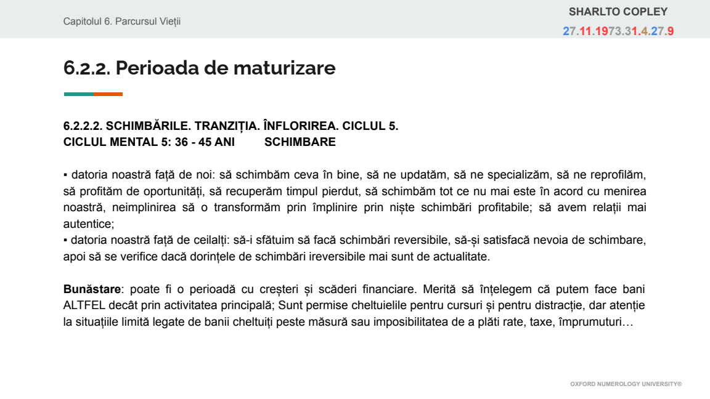

```text
Capitolul 6. Parcursul Vieții
6.2.2. Perioada de maturizare
6.2.2.2. SCHIMBĂRILE. TRANZIȚIA. ÎNFLORIREA. CICLUL 5.
CICLUL MENTAL 5: 36 - 45 ANI SCHIMBARE
▪ datoria noastră față de noi: să schimbăm ceva în bine, să ne updatăm, să ne specializăm, să ne reprofilăm,
să profităm de oportunități, să recuperăm timpul pierdut, să schimbăm tot ce nu mai este în acord cu menirea
noastră, neimplinirea să o transformăm prin împlinire prin niște schimbări profitabile; să avem relații mai
autentice;
▪ datoria noastră față de ceilalți: să-i sfătuim să facă schimbări reversibile, să-și satisfacă nevoia de schimbare,
apoi să se verifice dacă dorințele de schimbări ireversibile mai sunt de actualitate.
Bunăstare: poate fi o perioadă cu creșteri și scăderi financiare. Merită să înțelegem că putem face bani
ALTFEL decât prin activitatea principală; Sunt permise cheltuielile pentru cursuri și pentru distracție, dar atenție
la situațiile limită legate de banii cheltuiți peste măsură sau imposibilitatea de a plăti rate, taxe, împrumuturi…
OXFORD NUMEROLOGY UNIVERSITY®
```

### Pagina 322

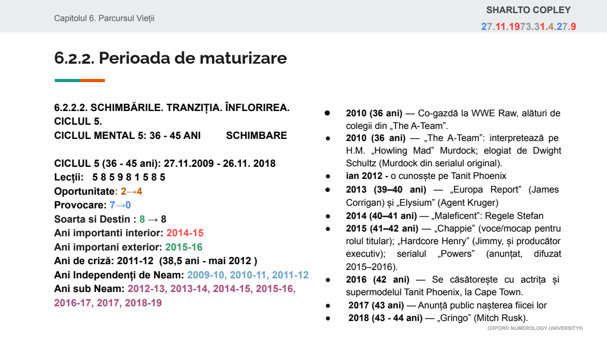

```text
Capitolul 6. Parcursul Vieții
6.2.2. Perioada de maturizare
6.2.2.2. SCHIMBĂRILE. TRANZIȚIA. ÎNFLORIREA.
● 2010 (36 ani) — Co-gazdă la WWE Raw, alături de
CICLUL 5.
colegii din „The A-Team”.
CICLUL MENTAL 5: 36 - 45 ANI SCHIMBARE
● 2010 (36 ani) — „The A-Team”: interpretează pe
H.M. „Howling Mad” Murdock; elogiat de Dwight
CICLUL 5 (36 - 45 ani): 27.11.2009 - 26.11. 2018 Schultz (Murdock din serialul original).
Lecții: 5 8 5 9 8 1 5 8 5 ● ian 2012 - o cunosște pe Tanit Phoenix
Oportunitate: 2→4 ● 2013 (39–40 ani) — „Europa Report” (James
Provocare: 7→0 Corrigan) și „Elysium” (Agent Kruger)
● 2014 (40–41 ani) — „Maleficent”: Regele Stefan
Soarta si Destin : 8 → 8
● 2015 (41–42 ani) — „Chappie” (voce/mocap pentru
Ani importanti interior: 2014-15
rolul titular); „Hardcore Henry” (Jimmy, și producător
Ani importani exterior: 2015-16
executiv); serialul „Powers” (anunțat, difuzat
Ani de criză: 2011-12 (38,5 ani - mai 2012 )
2015–2016).
Ani Independenți de Neam: 2009-10, 2010-11, 2011-12
● 2016 (42 ani) — Se căsătorește cu actrița și
Ani sub Neam: 2012-13, 2013-14, 2014-15, 2015-16,
supermodelul Tanit Phoenix, la Cape Town.
2016-17, 2017, 2018-19
● 2017 (43 ani) — Anunță public nașterea fiicei lor
● 2018 (43 - 44 ani) — „Gringo” (Mitch Rusk).
OXFORD NUMEROLOGY UNIVERSITY®
```

### Pagina 323

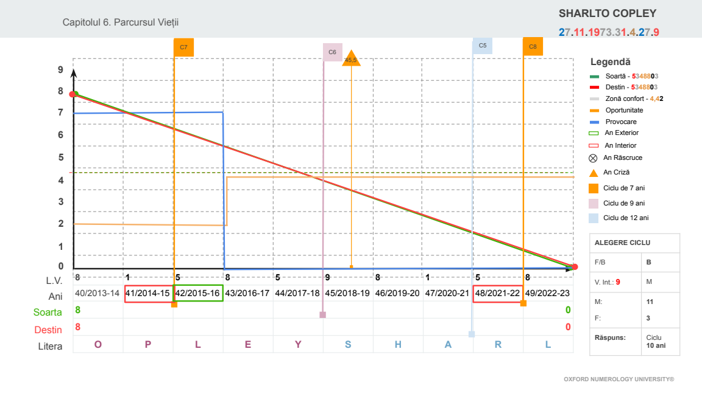

```text
Capitolul 6. Parcursul Vieții
C7 C5 C8
C6
45,5 Legendă
9
Soartă - 5348803
8 Destin - 5348803
Zonă confort - 4,42
7 Oportunitate
Provocare
6 An Exterior
An Interior
5 An Răscruce
An Criză
4
Ciclu de 7 ani
3 Ciclu de 9 ani
Ciclu de 12 ani
2
1 ALEGERE CICLU
0 F/B B
L.V. 8 1 5 8 5 9 8 1 5 8 V. Int.: 9 M
Ani 40/2013-14 41/2014-15 42/2015-16 43/2016-17 44/2017-18 45/2018-19 46/2019-20 47/2020-21 48/2021-22 49/2022-23
M: 11
Soarta 8 0
F: 3
Destin 8 0
Răspuns: Ciclu
Litera O P L E Y S H A R L 10 ani
OXFORD NUMEROLOGY UNIVERSITY®
```

### Pagina 324

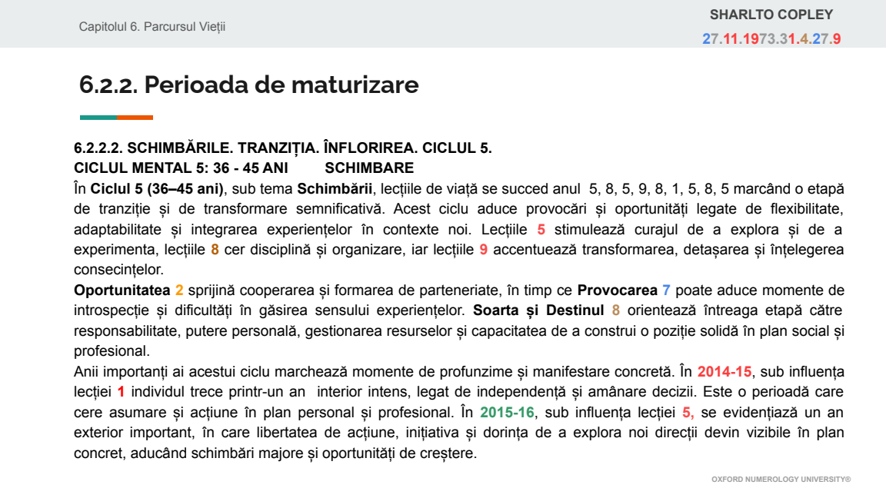

```text
Capitolul 6. Parcursul Vieții
6.2.2. Perioada de maturizare
6.2.2.2. SCHIMBĂRILE. TRANZIȚIA. ÎNFLORIREA. CICLUL 5.
CICLUL MENTAL 5: 36 - 45 ANI SCHIMBARE
În Ciclul 5 (36–45 ani), sub tema Schimbării, lecțiile de viață se succed anul 5, 8, 5, 9, 8, 1, 5, 8, 5 marcând o etapă
de tranziție și de transformare semnificativă. Acest ciclu aduce provocări și oportunități legate de flexibilitate,
adaptabilitate și integrarea experiențelor în contexte noi. Lecțiile 5 stimulează curajul de a explora și de a
experimenta, lecțiile 8 cer disciplină și organizare, iar lecțiile 9 accentuează transformarea, detașarea și înțelegerea
consecințelor.
Oportunitatea 2 sprijină cooperarea și formarea de parteneriate, în timp ce Provocarea 7 poate aduce momente de
introspecție și dificultăți în găsirea sensului experiențelor. Soarta și Destinul 8 orientează întreaga etapă către
responsabilitate, putere personală, gestionarea resurselor și capacitatea de a construi o poziție solidă în plan social și
profesional.
Anii importanți ai acestui ciclu marchează momente de profunzime și manifestare concretă. În 2014-15, sub influența
lecției 1 individul trece printr-un an interior intens, legat de independență și amânare decizii. Este o perioadă care
cere asumare și acțiune în plan personal și profesional. În 2015-16, sub influența lecției 5, se evidențiază un an
exterior important, în care libertatea de acțiune, inițiativa și dorința de a explora noi direcții devin vizibile în plan
concret, aducând schimbări majore și oportunități de creștere.
OXFORD NUMEROLOGY UNIVERSITY®
```

### Pagina 325

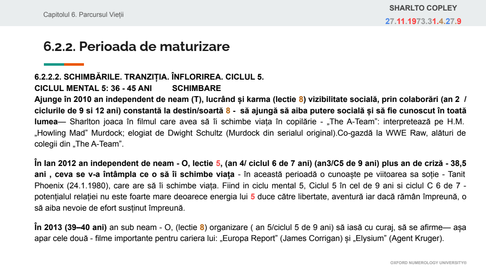

```text
Capitolul 6. Parcursul Vieții
6.2.2. Perioada de maturizare
6.2.2.2. SCHIMBĂRILE. TRANZIȚIA. ÎNFLORIREA. CICLUL 5.
CICLUL MENTAL 5: 36 - 45 ANI SCHIMBARE
Ajunge în 2010 an independent de neam (T), lucrând și karma (lectie 8) vizibilitate socială, prin colaborări (an 2 /
ciclurile de 9 si 12 ani) constantă la destin/soartă 8 - să ajungă să aiba putere socială și să fie cunoscut în toată
lumea— Sharlton joaca în filmul care avea să îi schimbe viața în copilărie - „The A-Team”: interpretează pe H.M.
„Howling Mad” Murdock; elogiat de Dwight Schultz (Murdock din serialul original).Co-gazdă la WWE Raw, alături de
colegii din „The A-Team”.
În Ian 2012 an independent de neam - O, lectie 5, (an 4/ ciclul 6 de 7 ani) (an3/C5 de 9 ani) plus an de criză - 38,5
ani , ceva se v-a întâmpla ce o să îi schimbe viața - în această perioadă o cunoaște pe viitoarea sa soție - Tanit
Phoenix (24.1.1980), care are să îi schimbe viața. Fiind in ciclu mental 5, Ciclul 5 în cel de 9 ani si ciclul C 6 de 7 -
potențialul relației nu este foarte mare deoarece energia lui 5 duce către libertate, aventură iar dacă rămân împreună, o
să aiba nevoie de efort susținut împreună.
În 2013 (39–40 ani) an sub neam - O, (lectie 8) organizare ( an 5/ciclul 5 de 9 ani) să iasă cu curaj, să se afirme— așa
apar cele două - filme importante pentru cariera lui: „Europa Report” (James Corrigan) și „Elysium” (Agent Kruger).
OXFORD NUMEROLOGY UNIVERSITY®
```

### Pagina 326

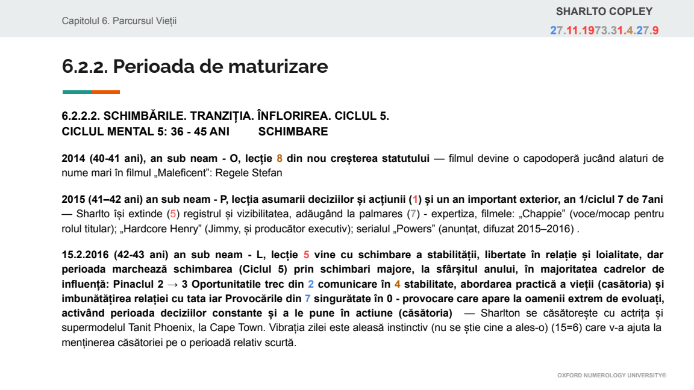

```text
Capitolul 6. Parcursul Vieții
6.2.2. Perioada de maturizare
6.2.2.2. SCHIMBĂRILE. TRANZIȚIA. ÎNFLORIREA. CICLUL 5.
CICLUL MENTAL 5: 36 - 45 ANI SCHIMBARE
2014 (40-41 ani), an sub neam - O, lecție 8 din nou creșterea statutului — filmul devine o capodoperă jucând alaturi de
nume mari în filmul „Maleficent”: Regele Stefan
2015 (41–42 ani) an sub neam - P, lecția asumarii deciziilor și acțiunii (1) și un an important exterior, an 1/ciclul 7 de 7ani
— Sharlto își extinde (5) registrul și vizibilitatea, adăugând la palmares (7) - expertiza, filmele: „Chappie” (voce/mocap pentru
rolul titular); „Hardcore Henry” (Jimmy, și producător executiv); serialul „Powers” (anunțat, difuzat 2015–2016) .
15.2.2016 (42-43 ani) an sub neam - L, lecție 5 vine cu schimbare a stabilității, libertate în relație și loialitate, dar
perioada marchează schimbarea (Ciclul 5) prin schimbari majore, la sfârșitul anului, în majoritatea cadrelor de
influență: Pinaclul 2 → 3 Oportunitatile trec din 2 comunicare în 4 stabilitate, abordarea practică a vieții (casătoria) și
imbunătățirea relației cu tata iar Provocările din 7 singurătate în 0 - provocare care apare la oamenii extrem de evoluați,
activând perioada deciziilor constante și a le pune în actiune (căsătoria) — Sharlton se căsătorește cu actrița și
supermodelul Tanit Phoenix, la Cape Town. Vibrația zilei este aleasă instinctiv (nu se știe cine a ales-o) (15=6) care v-a ajuta la
menținerea căsătoriei pe o perioadă relativ scurtă.
OXFORD NUMEROLOGY UNIVERSITY®
```

### Pagina 327

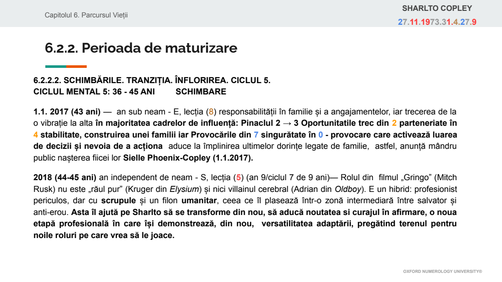

```text
Capitolul 6. Parcursul Vieții
6.2.2. Perioada de maturizare
6.2.2.2. SCHIMBĂRILE. TRANZIȚIA. ÎNFLORIREA. CICLUL 5.
CICLUL MENTAL 5: 36 - 45 ANI SCHIMBARE
1.1. 2017 (43 ani) — an sub neam - E, lecția (8) responsabilității în familie și a angajamentelor, iar trecerea de la
o vibrație la alta în majoritatea cadrelor de influență: Pinaclul 2 → 3 Oportunitatile trec din 2 parteneriate în
4 stabilitate, construirea unei familii iar Provocările din 7 singurătate în 0 - provocare care activează luarea
de decizii și nevoia de a acționa aduce la împlinirea ultimelor dorințe legate de familie, astfel, anunță mândru
public nașterea fiicei lor Sielle Phoenix-Copley (1.1.2017).
2018 (44-45 ani) an independent de neam - S, lecția (5) (an 9/ciclul 7 de 9 ani)— Rolul din filmul „Gringo” (Mitch
Rusk) nu este „răul pur” (Kruger din Elysium) și nici villainul cerebral (Adrian din Oldboy). E un hibrid: profesionist
periculos, dar cu scrupule și un filon umanitar, ceea ce îl plasează într-o zonă intermediară între salvator și
anti-erou. Asta îl ajută pe Sharlto să se transforme din nou, să aducă noutatea si curajul în afirmare, o noua
etapă profesională în care își demonstrează, din nou, versatilitatea adaptării, pregătind terenul pentru
noile roluri pe care vrea să le joace.
OXFORD NUMEROLOGY UNIVERSITY®
```

### Pagina 328

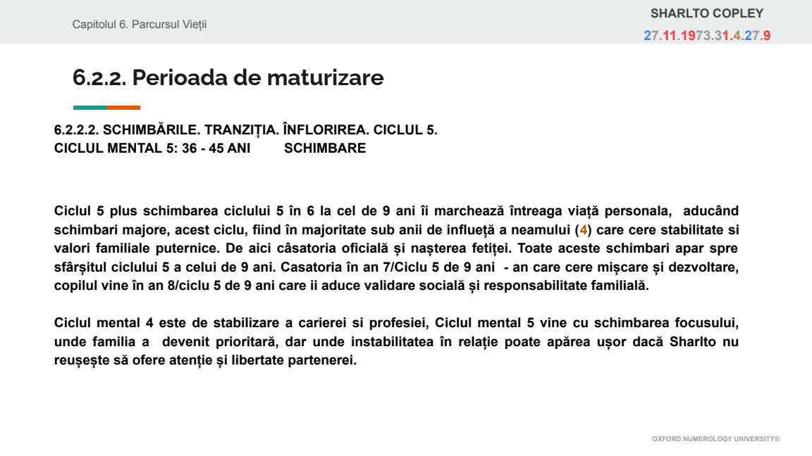

```text
Capitolul 6. Parcursul Vieții
6.2.2. Perioada de maturizare
6.2.2.2. SCHIMBĂRILE. TRANZIȚIA. ÎNFLORIREA. CICLUL 5.
CICLUL MENTAL 5: 36 - 45 ANI SCHIMBARE
Ciclul 5 plus schimbarea ciclului 5 în 6 la cel de 9 ani îi marchează întreaga viață personala, aducând
schimbari majore, acest ciclu, fiind în majoritate sub anii de influeță a neamului (4) care cere stabilitate si
valori familiale puternice. De aici câsatoria oficială și nașterea fetiței. Toate aceste schimbari apar spre
sfârșitul ciclului 5 a celui de 9 ani. Casatoria în an 7/Ciclu 5 de 9 ani - an care cere mișcare și dezVAULTare,
copilul vine în an 8/ciclu 5 de 9 ani care ii aduce validare socială și responsabilitate familială.
Ciclul mental 4 este de stabilizare a carierei si profesiei, Ciclul mental 5 vine cu schimbarea focusului,
unde familia a devenit prioritară, dar unde instabilitatea în relație poate apărea ușor dacă Sharlto nu
reușește să ofere atenție și libertate partenerei.
OXFORD NUMEROLOGY UNIVERSITY®
```

### Pagina 329

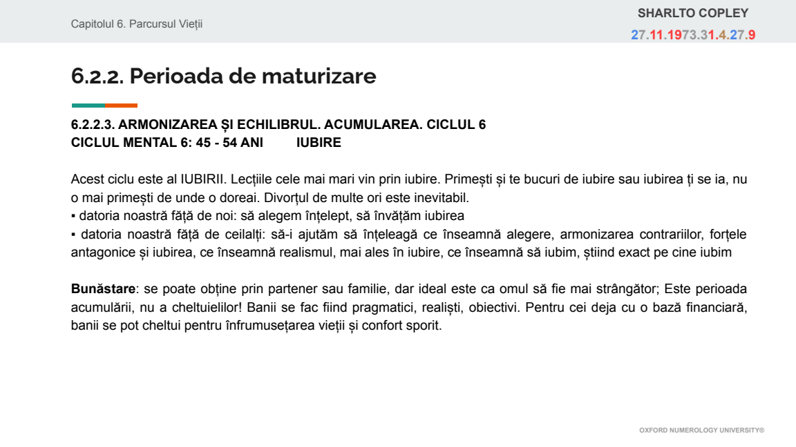

```text
Capitolul 6. Parcursul Vieții
6.2.2. Perioada de maturizare
6.2.2.3. ARMONIZAREA ȘI ECHILIBRUL. ACUMULAREA. CICLUL 6
CICLUL MENTAL 6: 45 - 54 ANI IUBIRE
Acest ciclu este al IUBIRII. Lecțiile cele mai mari vin prin iubire. Primești și te bucuri de iubire sau iubirea ți se ia, nu
o mai primești de unde o doreai. Divorțul de multe ori este inevitabil.
▪ datoria noastră făță de noi: să alegem înțelept, să învățăm iubirea
▪ datoria noastră făță de ceilalți: să-i ajutăm să înțeleagă ce înseamnă alegere, armonizarea contrariilor, forțele
antagonice și iubirea, ce înseamnă realismul, mai ales în iubire, ce înseamnă să iubim, știind exact pe cine iubim
Bunăstare: se poate obține prin partener sau familie, dar ideal este ca omul să fie mai strângător; Este perioada
acumulării, nu a cheltuielilor! Banii se fac fiind pragmatici, realiști, obiectivi. Pentru cei deja cu o bază financiară,
banii se pot cheltui pentru înfrumusețarea vieții și confort sporit.
OXFORD NUMEROLOGY UNIVERSITY®
```

### Pagina 330

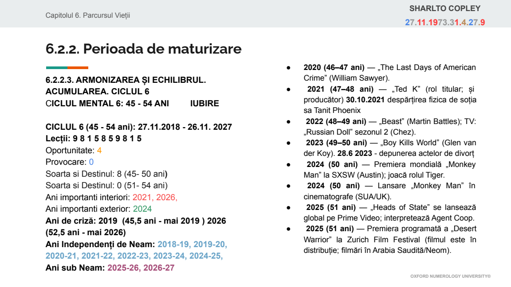

```text
Capitolul 6. Parcursul Vieții
6.2.2. Perioada de maturizare
● 2020 (46–47 ani) — „The Last Days of American
6.2.2.3. ARMONIZAREA ȘI ECHILIBRUL. Crime” (William Sawyer).
● 2021 (47–48 ani) — „Ted K” (rol titular; și
ACUMULAREA. CICLUL 6
producător) 30.10.2021 despărțirea fizica de soția
CICLUL MENTAL 6: 45 - 54 ANI IUBIRE
sa Tanit Phoenix
● 2022 (48–49 ani) — „Beast” (Martin Battles); TV:
CICLUL 6 (45 - 54 ani): 27.11.2018 - 26.11. 2027
„Russian Doll” sezonul 2 (Chez).
Lecții: 9 8 1 5 8 5 9 8 1 5
● 2023 (49–50 ani) — „Boy Kills World” (Glen van
Oportunitate: 4
der Koy). 28.6 2023 - depunerea actelor de divorț
Provocare: 0
● 2024 (50 ani) — Premiera mondială „Monkey
Soarta si Destinul: 8 (45- 50 ani) Man” la SXSW (Austin); joacă rolul Tiger.
Soarta si Destinul: 0 (51- 54 ani) ● 2024 (50 ani) — Lansare „Monkey Man” în
Ani importanti interiori: 2021, 2026, cinematografe (SUA/UK).
Ani importanti exterior: 2024 ● 2025 (51 ani) — „Heads of State” se lansează
global pe Prime Video; interpretează Agent Coop.
Ani de criză: 2019 (45,5 ani - mai 2019 ) 2026
● 2025 (51 ani) — Premiera programată a „Desert
(52,5 ani - mai 2026)
Warrior” la Zurich Film Festival (filmul este în
Ani Independenți de Neam: 2018-19, 2019-20,
distribuție; filmări în Arabia Saudită/Neom).
2020-21, 2021-22, 2022-23, 2023-24, 2024-25,
Ani sub Neam: 2025-26, 2026-27
OXFORD NUMEROLOGY UNIVERSITY®
```

### Pagina 331

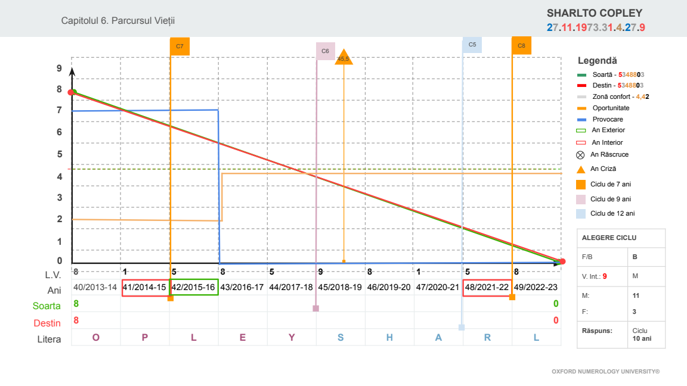

```text
Capitolul 6. Parcursul Vieții
C7 C5 C8
C6
45,5 Legendă
9
Soartă - 5348803
8 Destin - 5348803
Zonă confort - 4,42
7 Oportunitate
Provocare
6 An Exterior
An Interior
5 An Răscruce
An Criză
4
Ciclu de 7 ani
3 Ciclu de 9 ani
Ciclu de 12 ani
2
1 ALEGERE CICLU
0 F/B B
L.V. 8 1 5 8 5 9 8 1 5 8 V. Int.: 9 M
Ani 40/2013-14 41/2014-15 42/2015-16 43/2016-17 44/2017-18 45/2018-19 46/2019-20 47/2020-21 48/2021-22 49/2022-23
M: 11
Soarta 8 0
F: 3
Destin 8 0
Răspuns: Ciclu
Litera O P L E Y S H A R L 10 ani
OXFORD NUMEROLOGY UNIVERSITY®
```

### Pagina 332

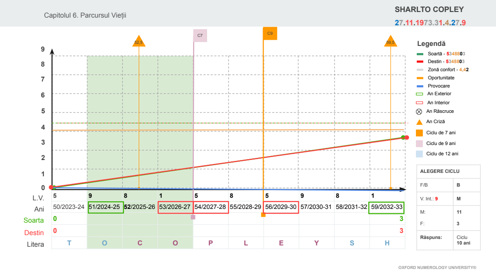

```text
Capitolul 6. Parcursul Vieții
C7 C9
52,5 59,5 Legendă
9
Soartă - 5348803
8 Destin - 5348803
Zonă confort - 4,42
7 Oportunitate
Provocare
6 An Exterior
An Interior
5 An Răscruce
An Criză
4
Ciclu de 7 ani
3 Ciclu de 9 ani
Ciclu de 12 ani
2
1 ALEGERE CICLU
0 F/B B
L.V. 5 9 8 1 5 8 5 9 8 1 V. Int.: 9 M
Ani 50/2023-24 51/2024-25 52/2025-26 53/2026-27 54/2027-28 55/2028-29 56/2029-30 57/2030-31 58/2031-32 59/2032-33
M: 11
Soarta 0 3
F: 3
Destin 0 3
Răspuns: Ciclu
Litera T O C O P L E Y S H 10 ani
OXFORD NUMEROLOGY UNIVERSITY®
```

### Pagina 333

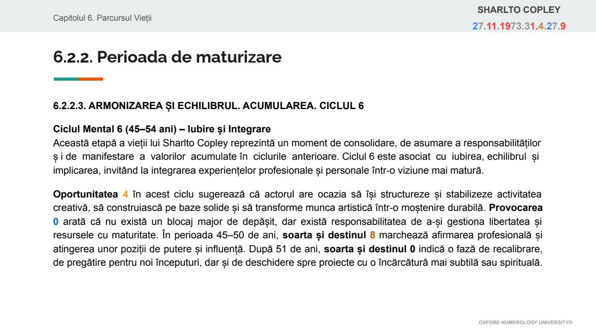

```text
Capitolul 6. Parcursul Vieții
6.2.2. Perioada de maturizare
6.2.2.3. ARMONIZAREA ȘI ECHILIBRUL. ACUMULAREA. CICLUL 6
Ciclul Mental 6 (45–54 ani) – Iubire și Integrare
Această etapă a vieții lui Sharlto Copley reprezintă un moment de consolidare, de asumare a responsabilităților
ș i de manifestare a valorilor acumulate în ciclurile anterioare. Ciclul 6 este asociat cu iubirea, echilibrul și
implicarea, invitând la integrarea experiențelor profesionale și personale într-o viziune mai matură.
Oportunitatea 4 în acest ciclu sugerează că actorul are ocazia să își structureze și stabilizeze activitatea
creativă, să construiască pe baze solide și să transforme munca artistică într-o moștenire durabilă. Provocarea
0 arată că nu există un blocaj major de depășit, dar există responsabilitatea de a-și gestiona libertatea și
resursele cu maturitate. În perioada 45–50 de ani, soarta și destinul 8 marchează afirmarea profesională și
atingerea unor poziții de putere și influență. După 51 de ani, soarta și destinul 0 indică o fază de recalibrare,
de pregătire pentru noi începuturi, dar și de deschidere spre proiecte cu o încărcătură mai subtilă sau spirituală.
OXFORD NUMEROLOGY UNIVERSITY®
```

### Pagina 334

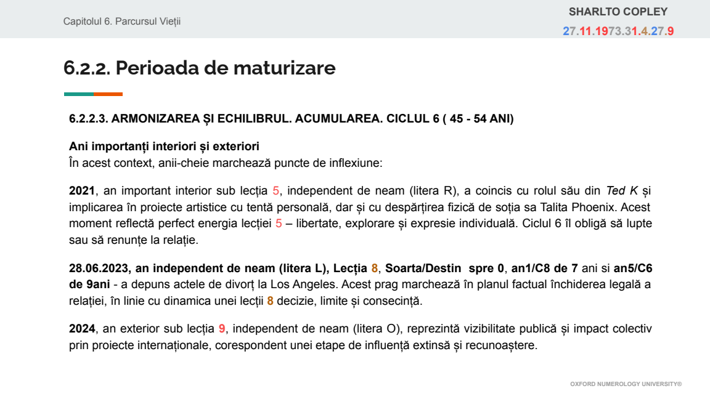

```text
Capitolul 6. Parcursul Vieții
6.2.2. Perioada de maturizare
6.2.2.3. ARMONIZAREA ȘI ECHILIBRUL. ACUMULAREA. CICLUL 6 ( 45 - 54 ANI)
Ani importanți interiori și exteriori
În acest context, anii-cheie marchează puncte de inflexiune:
2021, an important interior sub lecția 5, independent de neam (litera R), a coincis cu rolul său din Ted K și
implicarea în proiecte artistice cu tentă personală, dar și cu despărțirea fizică de soția sa Talita Phoenix. Acest
moment reflectă perfect energia lecției 5 – libertate, explorare și expresie individuală. Ciclul 6 îl obligă să lupte
sau să renunțe la relație.
28.06.2023, an independent de neam (litera L), Lecția 8, Soarta/Destin spre 0, an1/C8 de 7 ani si an5/C6
de 9ani - a depuns actele de divorț la Los Angeles. Acest prag marchează în planul factual închiderea legală a
relației, în linie cu dinamica unei lecții 8 decizie, limite și consecință.
2024, an exterior sub lecția 9, independent de neam (litera O), reprezintă vizibilitate publică și impact colectiv
prin proiecte internaționale, corespondent unei etape de influență extinsă și recunoaștere.
OXFORD NUMEROLOGY UNIVERSITY®
```

### Pagina 335

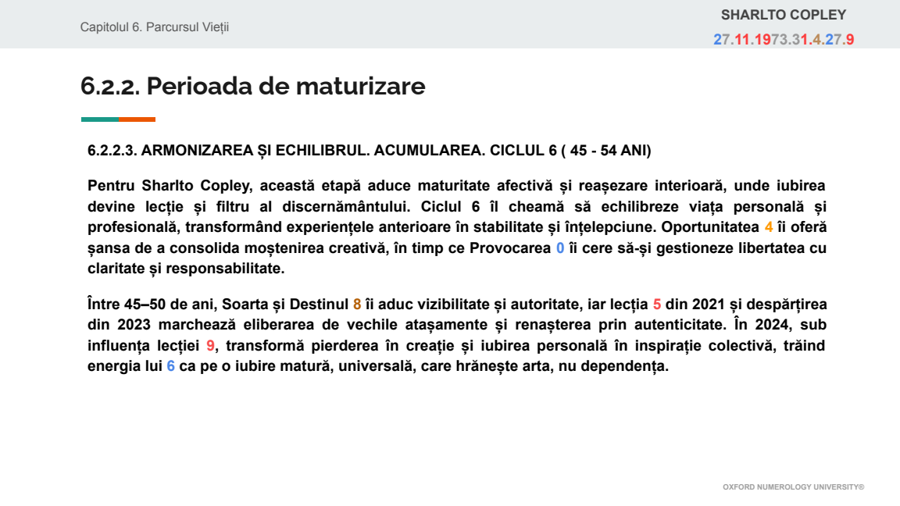

```text
Capitolul 6. Parcursul Vieții
6.2.2. Perioada de maturizare
6.2.2.3. ARMONIZAREA ȘI ECHILIBRUL. ACUMULAREA. CICLUL 6 ( 45 - 54 ANI)
Pentru Sharlto Copley, această etapă aduce maturitate afectivă și reașezare interioară, unde iubirea
devine lecție și filtru al discernământului. Ciclul 6 îl cheamă să echilibreze viața personală și
profesională, transformând experiențele anterioare în stabilitate și înțelepciune. Oportunitatea 4 îi oferă
șansa de a consolida moștenirea creativă, în timp ce Provocarea 0 îi cere să-și gestioneze libertatea cu
claritate și responsabilitate.
Între 45–50 de ani, Soarta și Destinul 8 îi aduc vizibilitate și autoritate, iar lecția 5 din 2021 și despărțirea
din 2023 marchează eliberarea de vechile atașamente și renașterea prin autenticitate. În 2024, sub
influența lecției 9, transformă pierderea în creație și iubirea personală în inspirație colectivă, trăind
energia lui 6 ca pe o iubire matură, universală, care hrănește arta, nu dependența.
OXFORD NUMEROLOGY UNIVERSITY®
```

### Pagina 336

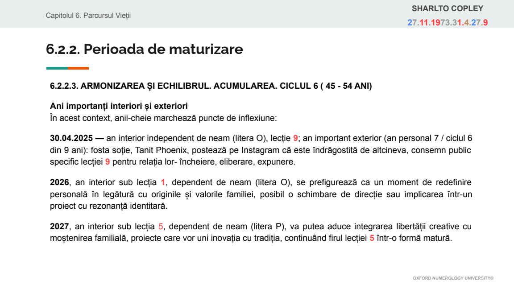

```text
Capitolul 6. Parcursul Vieții
6.2.2. Perioada de maturizare
6.2.2.3. ARMONIZAREA ȘI ECHILIBRUL. ACUMULAREA. CICLUL 6 ( 45 - 54 ANI)
Ani importanți interiori și exteriori
În acest context, anii-cheie marchează puncte de inflexiune:
30.04.2025 — an interior independent de neam (litera O), lecție 9; an important exterior (an personal 7 / ciclul 6
din 9 ani): fosta soție, Tanit Phoenix, postează pe Instagram că este îndrăgostită de altcineva, consemn public
specific lecției 9 pentru relația lor- încheiere, eliberare, expunere.
2026, an interior sub lecția 1, dependent de neam (litera O), se prefigurează ca un moment de redefinire
personală în legătură cu originile și valorile familiei, posibil o schimbare de direcție sau implicarea într-un
proiect cu rezonanță identitară.
2027, an interior sub lecția 5, dependent de neam (litera P), va putea aduce integrarea libertății creative cu
moștenirea familială, proiecte care vor uni inovația cu tradiția, continuând firul lecției 5 într-o formă matură.
OXFORD NUMEROLOGY UNIVERSITY®
```

### Pagina 337

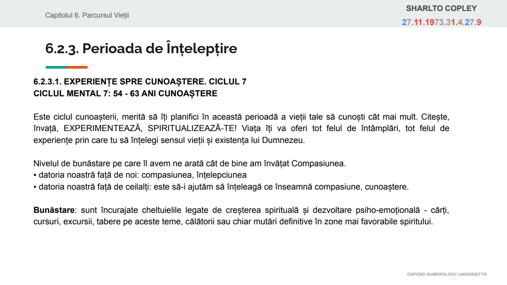

```text
Capitolul 6. Parcursul Vieții
6.2.3. Perioada de Înțelepțire
6.2.3.1. EXPERIENȚE SPRE CUNOAȘTERE. CICLUL 7
CICLUL MENTAL 7: 54 - 63 ANI CUNOAȘTERE
Este ciclul cunoașterii, merită să îți planifici în această perioadă a vieții tale să cunoști cât mai mult. Citește,
învață, EXPERIMENTEAZĂ, SPIRITUALIZEAZĂ-TE! Viața îți va oferi tot felul de întâmplări, tot felul de
experiențe prin care tu să înțelegi sensul vieții și existența lui Dumnezeu.
Nivelul de bunăstare pe care îl avem ne arată cât de bine am învățat Compasiunea.
▪ datoria noastră față de noi: compasiunea, înțelepciunea
▪ datoria noastră față de ceilalți: este să-i ajutăm să înțeleagă ce înseamnă compasiune, cunoaștere.
Bunăstare: sunt încurajate cheltuielile legate de creșterea spirituală și dezVAULTare psiho-emoțională - cărți,
cursuri, excursii, tabere pe aceste teme, călătorii sau chiar mutări definitive în zone mai favorabile spiritului.
OXFORD NUMEROLOGY UNIVERSITY®
```

### Pagina 338

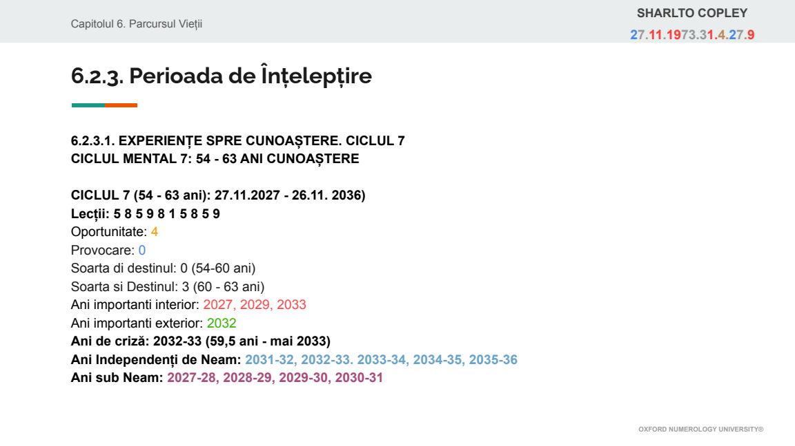

```text
Capitolul 6. Parcursul Vieții
6.2.3. Perioada de Înțelepțire
6.2.3.1. EXPERIENȚE SPRE CUNOAȘTERE. CICLUL 7
CICLUL MENTAL 7: 54 - 63 ANI CUNOAȘTERE
CICLUL 7 (54 - 63 ani): 27.11.2027 - 26.11. 2036)
Lecții: 5 8 5 9 8 1 5 8 5 9
Oportunitate: 4
Provocare: 0
Soarta di destinul: 0 (54-60 ani)
Soarta si Destinul: 3 (60 - 63 ani)
Ani importanti interior: 2027, 2029, 2033
Ani importanti exterior: 2032
Ani de criză: 2032-33 (59,5 ani - mai 2033)
Ani Independenți de Neam: 2031-32, 2032-33. 2033-34, 2034-35, 2035-36
Ani sub Neam: 2027-28, 2028-29, 2029-30, 2030-31
OXFORD NUMEROLOGY UNIVERSITY®
```

### Pagina 339

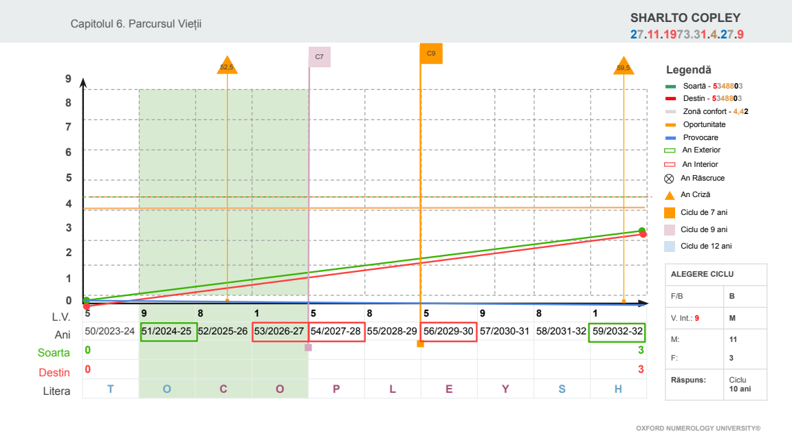

```text
Capitolul 6. Parcursul Vieții
C7 C9
52,5 59,5 Legendă
9
Soartă - 5348803
8 Destin - 5348803
Zonă confort - 4,42
7 Oportunitate
Provocare
6 An Exterior
An Interior
5 An Răscruce
An Criză
4
Ciclu de 7 ani
3 Ciclu de 9 ani
Ciclu de 12 ani
2
1 ALEGERE CICLU
0 F/B B
L.V. 5 9 8 1 5 8 5 9 8 1 V. Int.: 9 M
Ani 50/2023-24 51/2024-25 52/2025-26 53/2026-27 54/2027-28 55/2028-29 56/2029-30 57/2030-31 58/2031-32 59/2032-32
M: 11
Soarta 0 3
F: 3
Destin 0 3
Răspuns: Ciclu
Litera T O C O P L E Y S H 10 ani
OXFORD NUMEROLOGY UNIVERSITY®
```

### Pagina 340

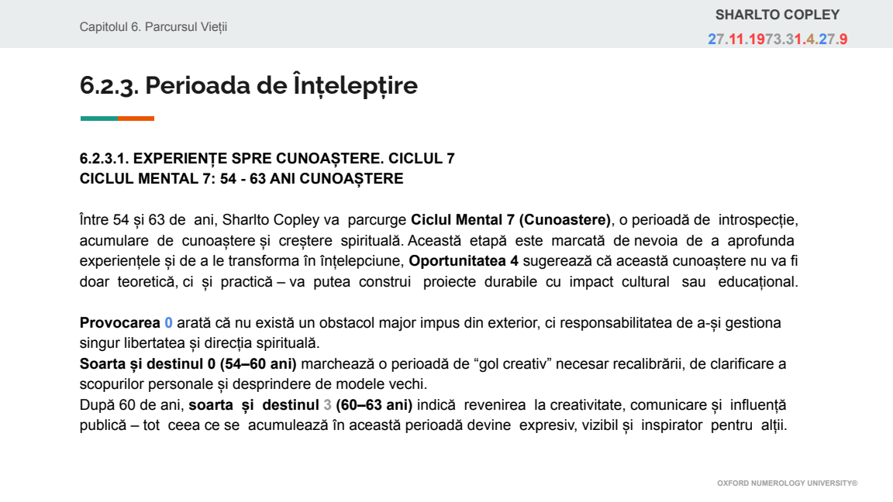

```text
Capitolul 6. Parcursul Vieții
6.2.3. Perioada de Înțelepțire
6.2.3.1. EXPERIENȚE SPRE CUNOAȘTERE. CICLUL 7
CICLUL MENTAL 7: 54 - 63 ANI CUNOAȘTERE
Între 54 și 63 de ani, Sharlto Copley va parcurge Ciclul Mental 7 (Cunoastere), o perioadă de introspecție,
acumulare de cunoaștere și creștere spirituală. Această etapă este marcată de nevoia de a aprofunda
experiențele și de a le transforma în înțelepciune, Oportunitatea 4 sugerează că această cunoaștere nu va fi
doar teoretică, ci și practică – va putea construi proiecte durabile cu impact cultural sau educațional.
Provocarea 0 arată că nu există un obstacol major impus din exterior, ci responsabilitatea de a-și gestiona
singur libertatea și direcția spirituală.
Soarta și destinul 0 (54–60 ani) marchează o perioadă de “gol creativ” necesar recalibrării, de clarificare a
scopurilor personale și desprindere de modele vechi.
După 60 de ani, soarta și destinul 3 (60–63 ani) indică revenirea la creativitate, comunicare și influență
publică – tot ceea ce se acumulează în această perioadă devine expresiv, vizibil și inspirator pentru alții.
OXFORD NUMEROLOGY UNIVERSITY®
```

### Pagina 341

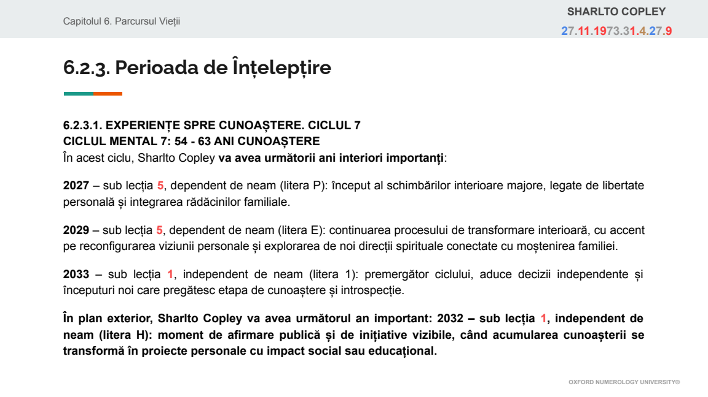

```text
Capitolul 6. Parcursul Vieții
6.2.3. Perioada de Înțelepțire
6.2.3.1. EXPERIENȚE SPRE CUNOAȘTERE. CICLUL 7
CICLUL MENTAL 7: 54 - 63 ANI CUNOAȘTERE
În acest ciclu, Sharlto Copley va avea următorii ani interiori importanți:
2027 – sub lecția 5, dependent de neam (litera P): început al schimbărilor interioare majore, legate de libertate
personală și integrarea rădăcinilor familiale.
2029 – sub lecția 5, dependent de neam (litera E): continuarea procesului de transformare interioară, cu accent
pe reconfigurarea viziunii personale și explorarea de noi direcții spirituale conectate cu moștenirea familiei.
2033 – sub lecția 1, independent de neam (litera 1): premergător ciclului, aduce decizii independente și
începuturi noi care pregătesc etapa de cunoaștere și introspecție.
În plan exterior, Sharlto Copley va avea următorul an important: 2032 – sub lecția 1, independent de
neam (litera H): moment de afirmare publică și de inițiative vizibile, când acumularea cunoașterii se
transformă în proiecte personale cu impact social sau educațional.
OXFORD NUMEROLOGY UNIVERSITY®
```

### Pagina 342

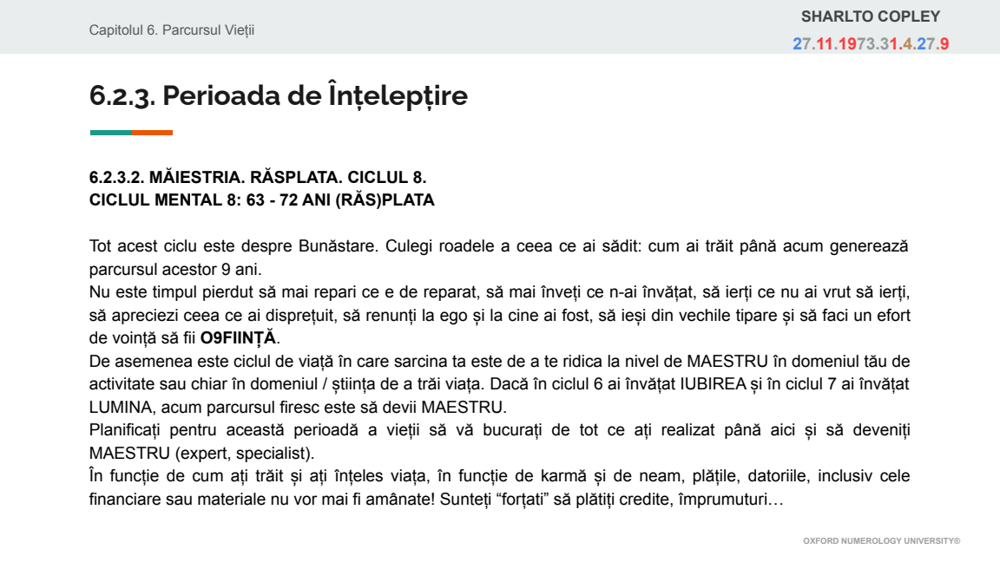

```text
Capitolul 6. Parcursul Vieții
6.2.3. Perioada de Înțelepțire
6.2.3.2. MĂIESTRIA. RĂSPLATA. CICLUL 8.
CICLUL MENTAL 8: 63 - 72 ANI (RĂS)PLATA
Tot acest ciclu este despre Bunăstare. Culegi roadele a ceea ce ai sădit: cum ai trăit până acum generează
parcursul acestor 9 ani.
Nu este timpul pierdut să mai repari ce e de reparat, să mai înveți ce n-ai învățat, să ierți ce nu ai vrut să ierți,
să apreciezi ceea ce ai disprețuit, să renunți la ego și la cine ai fost, să ieși din vechile tipare și să faci un efort
de voință să fii O9FIINȚĂ.
De asemenea este ciclul de viață în care sarcina ta este de a te ridica la nivel de MAESTRU în domeniul tău de
activitate sau chiar în domeniul / știința de a trăi viața. Dacă în ciclul 6 ai învățat IUBIREA și în ciclul 7 ai învățat
LUMINA, acum parcursul firesc este să devii MAESTRU.
Planificați pentru această perioadă a vieții să vă bucurați de tot ce ați realizat până aici și să deveniți
MAESTRU (expert, specialist).
În funcție de cum ați trăit și ați înțeles viața, în funcție de karmă și de neam, plățile, datoriile, inclusiv cele
financiare sau materiale nu vor mai fi amânate! Sunteți “forțati” să plătiți credite, împrumuturi…
OXFORD NUMEROLOGY UNIVERSITY®
```

### Pagina 343

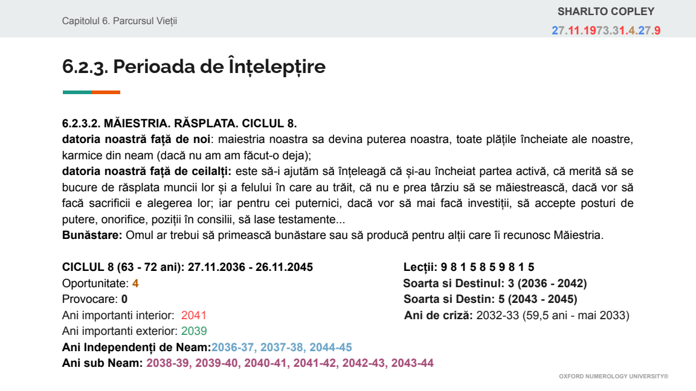

```text
Capitolul 6. Parcursul Vieții
6.2.3. Perioada de Înțelepțire
6.2.3.2. MĂIESTRIA. RĂSPLATA. CICLUL 8.
datoria noastră față de noi: maiestria noastra sa devina puterea noastra, toate plățile încheiate ale noastre,
karmice din neam (dacă nu am am făcut-o deja);
datoria noastră față de ceilalți: este să-i ajutăm să înțeleagă că și-au încheiat partea activă, că merită să se
bucure de răsplata muncii lor și a felului în care au trăit, că nu e prea târziu să se măiestrească, dacă vor să
facă sacrificii e alegerea lor; iar pentru cei puternici, dacă vor să mai facă investiții, să accepte posturi de
putere, onorifice, poziții în consilii, să lase testamente...
Bunăstare: Omul ar trebui să primească bunăstare sau să producă pentru alții care îi recunosc Măiestria.
CICLUL 8 (63 - 72 ani): 27.11.2036 - 26.11.2045 Lecții: 9 8 1 5 8 5 9 8 1 5
Oportunitate: 4 Soarta si Destinul: 3 (2036 - 2042)
Provocare: 0 Soarta si Destin: 5 (2043 - 2045)
Ani importanti interior: 2041 Ani de criză: 2032-33 (59,5 ani - mai 2033)
Ani importanti exterior: 2039
Ani Independenți de Neam:2036-37, 2037-38, 2044-45
Ani sub Neam: 2038-39, 2039-40, 2040-41, 2041-42, 2042-43, 2043-44
OXFORD NUMEROLOGY UNIVERSITY®
```

### Pagina 344

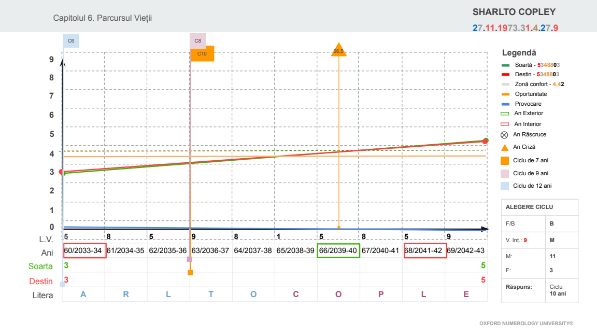

```text
Capitolul 6. Parcursul Vieții
C6 C8
C10 66,5 Legendă
9
Soartă - 5348803
8 Destin - 5348803
Zonă confort - 4,42
7 Oportunitate
Provocare
6 An Exterior
An Interior
5 An Răscruce
An Criză
4
Ciclu de 7 ani
3 Ciclu de 9 ani
Ciclu de 12 ani
2
1 ALEGERE CICLU
0 F/B B
L.V. 5 8 5 9 8 1 5 8 5 9 V. Int.: 9 M
Ani 60/2033-34 61/2034-35 62/2035-36 63/2036-37 64/2037-38 65/2038-39 66/2039-40 67/2040-41 68/2041-42 69/2042-43
M: 11
Soarta 3 5
F: 3
Destin 3 5
Răspuns: Ciclu
Litera A R L T O C O P L E 10 ani
OXFORD NUMEROLOGY UNIVERSITY®
```

### Pagina 345

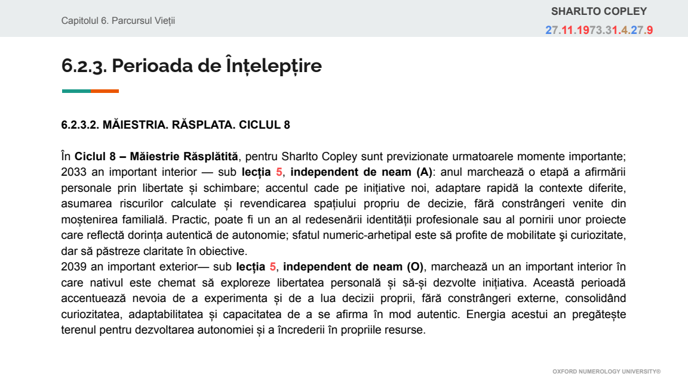

```text
Capitolul 6. Parcursul Vieții
6.2.3. Perioada de Înțelepțire
6.2.3.2. MĂIESTRIA. RĂSPLATA. CICLUL 8
În Ciclul 8 – Măiestrie Răsplătită, pentru Sharlto Copley sunt previzionate urmatoarele momente importante;
2033 an important interior — sub lecția 5, independent de neam (A): anul marchează o etapă a afirmării
personale prin libertate și schimbare; accentul cade pe inițiative noi, adaptare rapidă la contexte diferite,
asumarea riscurilor calculate și revendicarea spațiului propriu de decizie, fără constrângeri venite din
moștenirea familială. Practic, poate fi un an al redesenării identității profesionale sau al pornirii unor proiecte
care reflectă dorința autentică de autonomie; sfatul numeric-arhetipal este să profite de mobilitate şi curiozitate,
dar să păstreze claritate în obiective.
2039 an important exterior— sub lecția 5, independent de neam (O), marchează un an important interior în
care nativul este chemat să exploreze libertatea personală și să-și dezVAULTe inițiativa. Această perioadă
accentuează nevoia de a experimenta și de a lua decizii proprii, fără constrângeri externe, consolidând
curiozitatea, adaptabilitatea și capacitatea de a se afirma în mod autentic. Energia acestui an pregătește
terenul pentru dezVAULTarea autonomiei și a încrederii în propriile resurse.
OXFORD NUMEROLOGY UNIVERSITY®
```

### Pagina 346

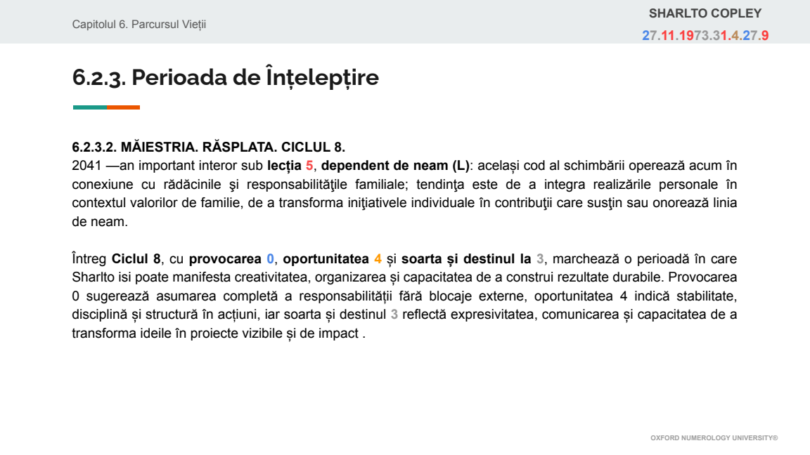

```text
Capitolul 6. Parcursul Vieții
6.2.3. Perioada de Înțelepțire
6.2.3.2. MĂIESTRIA. RĂSPLATA. CICLUL 8.
2041 —an important interor sub lecția 5, dependent de neam (L): același cod al schimbării operează acum în
conexiune cu rădăcinile şi responsabilităţile familiale; tendinţa este de a integra realizările personale în
contextul valorilor de familie, de a transforma iniţiativele individuale în contribuţii care susţin sau onorează linia
de neam.
Întreg Ciclul 8, cu provocarea 0, oportunitatea 4 și soarta și destinul la 3, marchează o perioadă în care
Sharlto isi poate manifesta creativitatea, organizarea și capacitatea de a construi rezultate durabile. Provocarea
0 sugerează asumarea completă a responsabilității fără blocaje externe, oportunitatea 4 indică stabilitate,
disciplină și structură în acțiuni, iar soarta și destinul 3 reflectă expresivitatea, comunicarea și capacitatea de a
transforma ideile în proiecte vizibile și de impact .
OXFORD NUMEROLOGY UNIVERSITY®
```

### Pagina 347

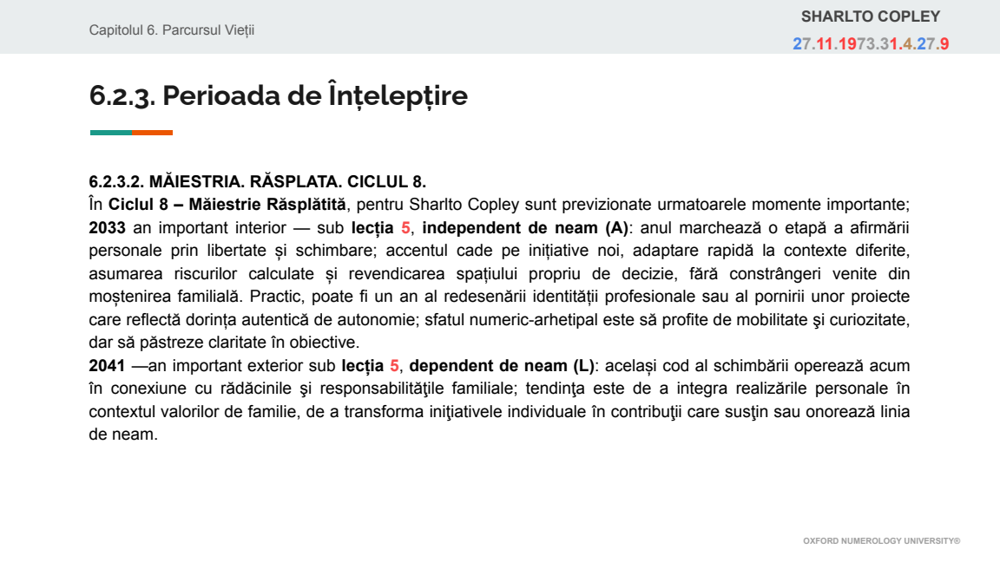

```text
Capitolul 6. Parcursul Vieții
6.2.3. Perioada de Înțelepțire
6.2.3.2. MĂIESTRIA. RĂSPLATA. CICLUL 8.
În Ciclul 8 – Măiestrie Răsplătită, pentru Sharlto Copley sunt previzionate urmatoarele momente importante;
2033 an important interior — sub lecția 5, independent de neam (A): anul marchează o etapă a afirmării
personale prin libertate și schimbare; accentul cade pe inițiative noi, adaptare rapidă la contexte diferite,
asumarea riscurilor calculate și revendicarea spațiului propriu de decizie, fără constrângeri venite din
moștenirea familială. Practic, poate fi un an al redesenării identității profesionale sau al pornirii unor proiecte
care reflectă dorința autentică de autonomie; sfatul numeric-arhetipal este să profite de mobilitate şi curiozitate,
dar să păstreze claritate în obiective.
2041 —an important exterior sub lecția 5, dependent de neam (L): același cod al schimbării operează acum
în conexiune cu rădăcinile şi responsabilităţile familiale; tendinţa este de a integra realizările personale în
contextul valorilor de familie, de a transforma iniţiativele individuale în contribuţii care susţin sau onorează linia
de neam.
OXFORD NUMEROLOGY UNIVERSITY®
```

### Pagina 348

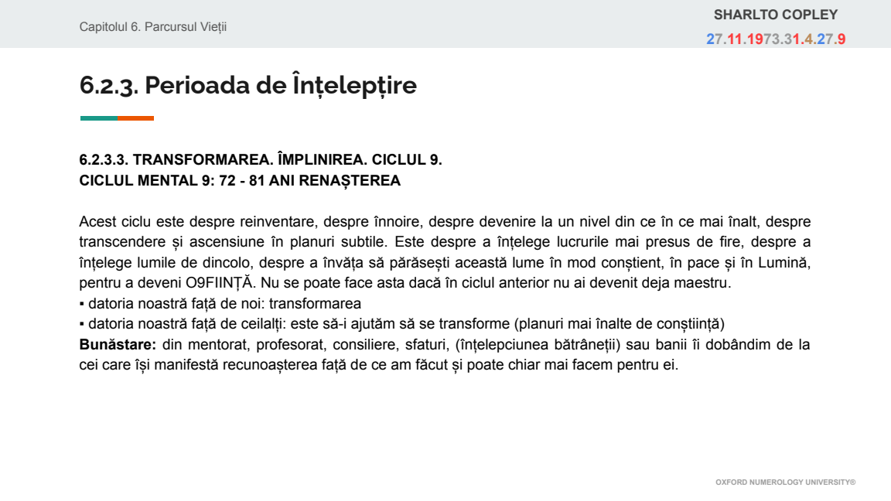

```text
Capitolul 6. Parcursul Vieții
6.2.3. Perioada de Înțelepțire
6.2.3.3. TRANSFORMAREA. ÎMPLINIREA. CICLUL 9.
CICLUL MENTAL 9: 72 - 81 ANI RENAȘTEREA
Acest ciclu este despre reinventare, despre înnoire, despre devenire la un nivel din ce în ce mai înalt, despre
transcendere și ascensiune în planuri subtile. Este despre a înțelege lucrurile mai presus de fire, despre a
înțelege lumile de dincolo, despre a învăța să părăsești această lume în mod conștient, în pace și în Lumină,
pentru a deveni O9FIINȚĂ. Nu se poate face asta dacă în ciclul anterior nu ai devenit deja maestru.
▪ datoria noastră față de noi: transformarea
▪ datoria noastră față de ceilalți: este să-i ajutăm să se transforme (planuri mai înalte de conștiință)
Bunăstare: din mentorat, profesorat, consiliere, sfaturi, (înțelepciunea bătrâneții) sau banii îi dobândim de la
cei care își manifestă recunoașterea față de ce am făcut și poate chiar mai facem pentru ei.
OXFORD NUMEROLOGY UNIVERSITY®
```

### Pagina 349

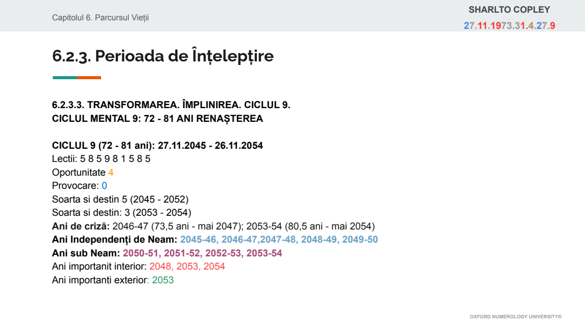

```text
Capitolul 6. Parcursul Vieții
6.2.3. Perioada de Înțelepțire
6.2.3.3. TRANSFORMAREA. ÎMPLINIREA. CICLUL 9.
CICLUL MENTAL 9: 72 - 81 ANI RENAȘTEREA
CICLUL 9 (72 - 81 ani): 27.11.2045 - 26.11.2054
Lectii: 5 8 5 9 8 1 5 8 5
Oportunitate 4
Provocare: 0
Soarta si destin 5 (2045 - 2052)
Soarta si destin: 3 (2053 - 2054)
Ani de criză: 2046-47 (73,5 ani - mai 2047); 2053-54 (80,5 ani - mai 2054)
Ani Independenți de Neam: 2045-46, 2046-47,2047-48, 2048-49, 2049-50
Ani sub Neam: 2050-51, 2051-52, 2052-53, 2053-54
Ani importanit interior: 2048, 2053, 2054
Ani importanti exterior: 2053
OXFORD NUMEROLOGY UNIVERSITY®
```

### Pagina 350

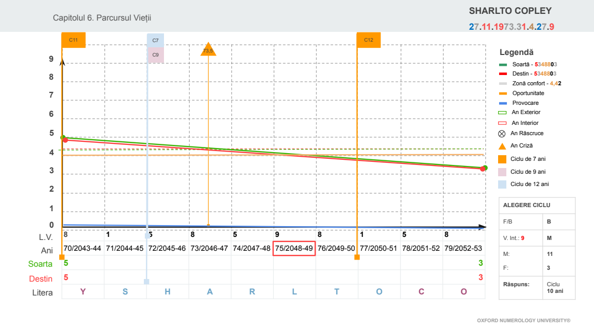

```text
Capitolul 6. Parcursul Vieții
C11 C7 C12
73,5 Legendă
9 C9
Soartă - 5348803
8 Destin - 5348803
Zonă confort - 4,42
7 Oportunitate
Provocare
6 An Exterior
An Interior
5 An Răscruce
An Criză
4
Ciclu de 7 ani
3 Ciclu de 9 ani
Ciclu de 12 ani
2
1 ALEGERE CICLU
0 F/B B
L.V. 8 1 5 8 5 9 8 1 5 8 V. Int.: 9 M
Ani 70/2043-44 71/2044-45 72/2045-46 73/2046-47 74/2047-48 75/2048-49 76/2049-50 77/2050-51 78/2051-52 79/2052-53
M: 11
Soarta 5 3
F: 3
Destin 5 3
Răspuns: Ciclu
Litera Y S H A R L T O C O 10 ani
OXFORD NUMEROLOGY UNIVERSITY®
```

### Pagina 351

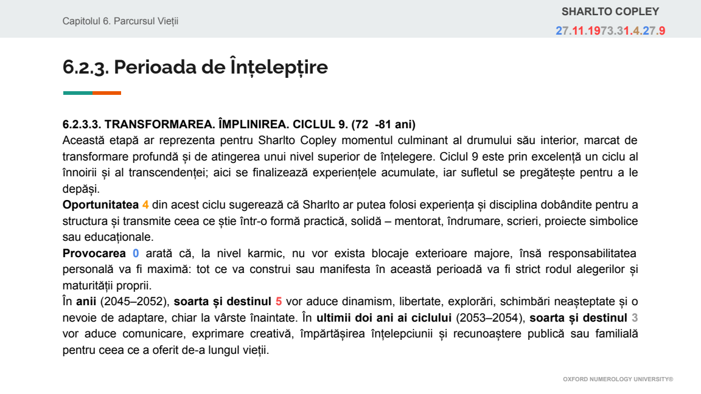

```text
Capitolul 6. Parcursul Vieții
6.2.3. Perioada de Înțelepțire
6.2.3.3. TRANSFORMAREA. ÎMPLINIREA. CICLUL 9. (72 -81 ani)
Această etapă ar reprezenta pentru Sharlto Copley momentul culminant al drumului său interior, marcat de
transformare profundă și de atingerea unui nivel superior de înțelegere. Ciclul 9 este prin excelență un ciclu al
înnoirii și al transcendenței; aici se finalizează experiențele acumulate, iar sufletul se pregătește pentru a le
depăși.
Oportunitatea 4 din acest ciclu sugerează că Sharlto ar putea folosi experiența și disciplina dobândite pentru a
structura și transmite ceea ce știe într-o formă practică, solidă – mentorat, îndrumare, scrieri, proiecte simbolice
sau educaționale.
Provocarea 0 arată că, la nivel karmic, nu vor exista blocaje exterioare majore, însă responsabilitatea
personală va fi maximă: tot ce va construi sau manifesta în această perioadă va fi strict rodul alegerilor și
maturității proprii.
În anii (2045–2052), soarta și destinul 5 vor aduce dinamism, libertate, explorări, schimbări neașteptate și o
nevoie de adaptare, chiar la vârste înaintate. În ultimii doi ani ai ciclului (2053–2054), soarta și destinul 3
vor aduce comunicare, exprimare creativă, împărtășirea înțelepciunii și recunoaștere publică sau familială
pentru ceea ce a oferit de-a lungul vieții.
OXFORD NUMEROLOGY UNIVERSITY®
```

### Pagina 352

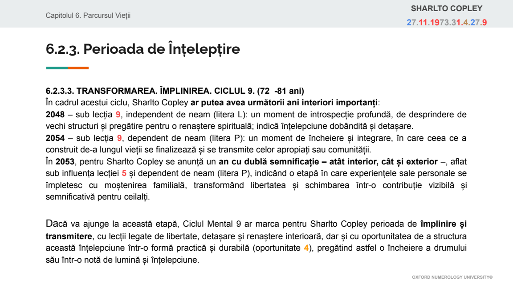

```text
Capitolul 6. Parcursul Vieții
6.2.3. Perioada de Înțelepțire
6.2.3.3. TRANSFORMAREA. ÎMPLINIREA. CICLUL 9. (72 -81 ani)
În cadrul acestui ciclu, Sharlto Copley ar putea avea următorii ani interiori importanți:
2048 – sub lecția 9, independent de neam (litera L): un moment de introspecție profundă, de desprindere de
vechi structuri și pregătire pentru o renaștere spirituală; indică înțelepciune dobândită și detașare.
2054 – sub lecția 9, dependent de neam (litera P): un moment de încheiere și integrare, în care ceea ce a
construit de-a lungul vieții se finalizează și se transmite celor apropiați sau comunității.
În 2053, pentru Sharlto Copley se anunță un an cu dublă semnificație – atât interior, cât și exterior –, aflat
sub influența lecției 5 și dependent de neam (litera P), indicând o etapă în care experiențele sale personale se
împletesc cu moștenirea familială, transformând libertatea și schimbarea într-o contribuție vizibilă și
semnificativă pentru ceilalți.
Dacă va ajunge la această etapă, Ciclul Mental 9 ar marca pentru Sharlto Copley perioada de împlinire și
transmitere, cu lecții legate de libertate, detașare și renaștere interioară, dar și cu oportunitatea de a structura
această înțelepciune într-o formă practică și durabilă (oportunitate 4), pregătind astfel o încheiere a drumului
său într-o notă de lumină și înțelepciune.
OXFORD NUMEROLOGY UNIVERSITY®
```

### Pagina 353

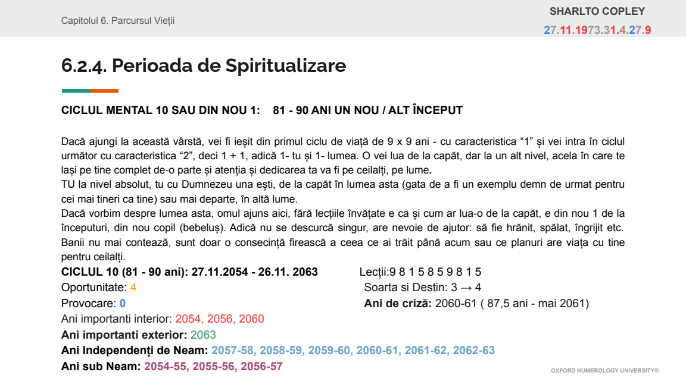

```text
Capitolul 6. Parcursul Vieții
6.2.4. Perioada de Spiritualizare
CICLUL MENTAL 10 SAU DIN NOU 1: 81 - 90 ANI UN NOU / ALT ÎNCEPUT
Dacă ajungi la această vârstă, vei fi ieșit din primul ciclu de viață de 9 x 9 ani - cu caracteristica “1” și vei intra în ciclul
următor cu caracteristica “2”, deci 1 + 1, adică 1- tu și 1- lumea. O vei lua de la capăt, dar la un alt nivel, acela în care te
lași pe tine complet de-o parte și atenția și dedicarea ta va fi pe ceilalți, pe lume.
TU la nivel absolut, tu cu Dumnezeu una ești, de la capăt în lumea asta (gata de a fi un exemplu demn de urmat pentru
cei mai tineri ca tine) sau mai departe, în altă lume.
Dacă vorbim despre lumea asta, omul ajuns aici, fără lecțiile învățate e ca și cum ar lua-o de la capăt, e din nou 1 de la
începuturi, din nou copil (bebeluș). Adică nu se descurcă singur, are nevoie de ajutor: să fie hrănit, spălat, îngrijit etc.
Banii nu mai contează, sunt doar o consecință firească a ceea ce ai trăit până acum sau ce planuri are viața cu tine
pentru ceilalți.
CICLUL 10 (81 - 90 ani): 27.11.2054 - 26.11. 2063 Lecții:9 8 1 5 8 5 9 8 1 5
Oportunitate: 4 Soarta si Destin: 3 → 4
Provocare: 0 Ani de criză: 2060-61 ( 87,5 ani - mai 2061)
Ani importanti interior: 2054, 2056, 2060
Ani importanti exterior: 2063
Ani Independenți de Neam: 2057-58, 2058-59, 2059-60, 2060-61, 2061-62, 2062-63
Ani sub Neam: 2054-55, 2055-56, 2056-57
OXFORD NUMEROLOGY UNIVERSITY®
```

### Pagina 354

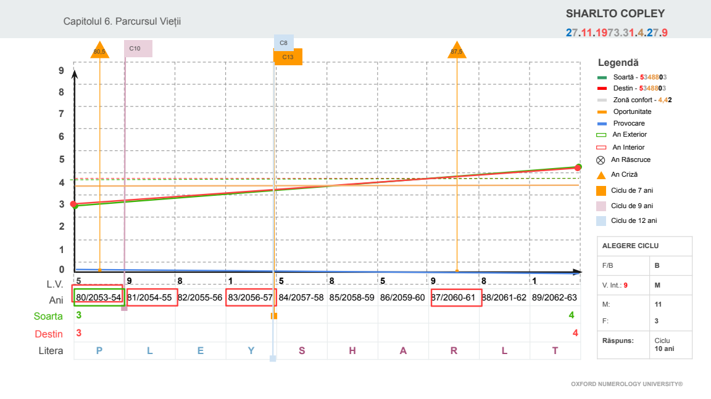

```text
Capitolul 6. Parcursul Vieții
C8
80,5 C10 87,5
C13
Legendă
9
Soartă - 5348803
8 Destin - 5348803
Zonă confort - 4,42
7 Oportunitate
Provocare
6 An Exterior
An Interior
5 An Răscruce
An Criză
4
Ciclu de 7 ani
3 Ciclu de 9 ani
Ciclu de 12 ani
2
1 ALEGERE CICLU
0 F/B B
L.V. 5 9 8 1 5 8 5 9 8 1 V. Int.: 9 M
Ani 80/2053-54 81/2054-55 82/2055-56 83/2056-57 84/2057-58 85/2058-59 86/2059-60 87/2060-61 88/2061-62 89/2062-63
M: 11
Soarta 3 4
F: 3
Destin 3 4
Răspuns: Ciclu
Litera P L E Y S H A R L T 10 ani
OXFORD NUMEROLOGY UNIVERSITY®
```

### Pagina 355

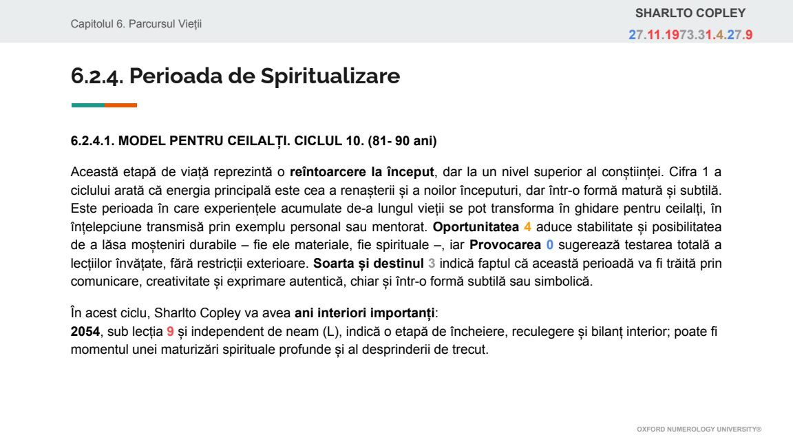

```text
Capitolul 6. Parcursul Vieții
6.2.4. Perioada de Spiritualizare
6.2.4.1. MODEL PENTRU CEILALȚI. CICLUL 10. (81- 90 ani)
Această etapă de viață reprezintă o reîntoarcere la început, dar la un nivel superior al conștiinței. Cifra 1 a
ciclului arată că energia principală este cea a renașterii și a noilor începuturi, dar într-o formă matură și subtilă.
Este perioada în care experiențele acumulate de-a lungul vieții se pot transforma în ghidare pentru ceilalți, în
înțelepciune transmisă prin exemplu personal sau mentorat. Oportunitatea 4 aduce stabilitate și posibilitatea
de a lăsa moșteniri durabile – fie ele materiale, fie spirituale –, iar Provocarea 0 sugerează testarea totală a
lecțiilor învățate, fără restricții exterioare. Soarta și destinul 3 indică faptul că această perioadă va fi trăită prin
comunicare, creativitate și exprimare autentică, chiar și într-o formă subtilă sau simbolică.
În acest ciclu, Sharlto Copley va avea ani interiori importanți:
2054, sub lecția 9 și independent de neam (L), indică o etapă de încheiere, reculegere și bilanț interior; poate fi
momentul unei maturizări spirituale profunde și al desprinderii de trecut.
OXFORD NUMEROLOGY UNIVERSITY®
```

### Pagina 356

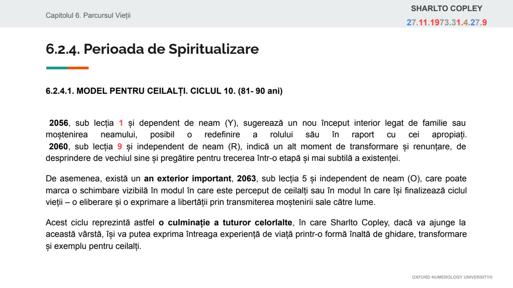

```text
Capitolul 6. Parcursul Vieții
6.2.4. Perioada de Spiritualizare
6.2.4.1. MODEL PENTRU CEILALȚI. CICLUL 10. (81- 90 ani)
2056, sub lecția 1 și dependent de neam (Y), sugerează un nou început interior legat de familie sau
moștenirea neamului, posibil o redefinire a rolului său în raport cu cei apropiați.
2060, sub lecția 9 și independent de neam (R), indică un alt moment de transformare și renunțare, de
desprindere de vechiul sine și pregătire pentru trecerea într-o etapă și mai subtilă a existenței.
De asemenea, există un an exterior important, 2063, sub lecția 5 și independent de neam (O), care poate
marca o schimbare vizibilă în modul în care este perceput de ceilalți sau în modul în care își finalizează ciclul
vieții – o eliberare și o exprimare a libertății prin transmiterea moștenirii sale către lume.
Acest ciclu reprezintă astfel o culminație a tuturor celorlalte, în care Sharlto Copley, dacă va ajunge la
această vârstă, își va putea exprima întreaga experiență de viață printr-o formă înaltă de ghidare, transformare
și exemplu pentru ceilalți.
OXFORD NUMEROLOGY UNIVERSITY®
```

### Pagina 357

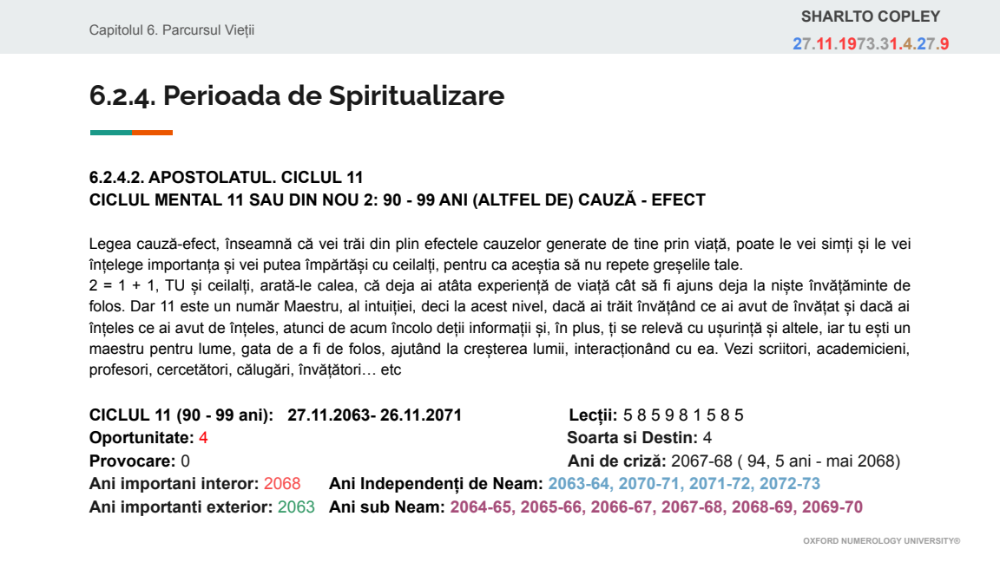

```text
Capitolul 6. Parcursul Vieții
6.2.4. Perioada de Spiritualizare
6.2.4.2. APOSTOLATUL. CICLUL 11
CICLUL MENTAL 11 SAU DIN NOU 2: 90 - 99 ANI (ALTFEL DE) CAUZĂ - EFECT
Legea cauză-efect, înseamnă că vei trăi din plin efectele cauzelor generate de tine prin viață, poate le vei simți și le vei
înțelege importanța și vei putea împărtăși cu ceilalți, pentru ca aceștia să nu repete greșelile tale.
2 = 1 + 1, TU și ceilalți, arată-le calea, că deja ai atâta experiență de viață cât să fi ajuns deja la niște învățăminte de
folos. Dar 11 este un număr Maestru, al intuiției, deci la acest nivel, dacă ai trăit învățând ce ai avut de învățat și dacă ai
înțeles ce ai avut de înțeles, atunci de acum încolo deții informații și, în plus, ți se relevă cu ușurință și altele, iar tu ești un
maestru pentru lume, gata de a fi de folos, ajutând la creșterea lumii, interacționând cu ea. Vezi scriitori, academicieni,
profesori, cercetători, călugări, învățători… etc
CICLUL 11 (90 - 99 ani): 27.11.2063- 26.11.2071 Lecții: 5 8 5 9 8 1 5 8 5
Oportunitate: 4 Soarta si Destin: 4
Provocare: 0 Ani de criză: 2067-68 ( 94, 5 ani - mai 2068)
Ani importani interor: 2068 Ani Independenți de Neam: 2063-64, 2070-71, 2071-72, 2072-73
Ani importanti exterior: 2063 Ani sub Neam: 2064-65, 2065-66, 2066-67, 2067-68, 2068-69, 2069-70
OXFORD NUMEROLOGY UNIVERSITY®
```

### Pagina 358

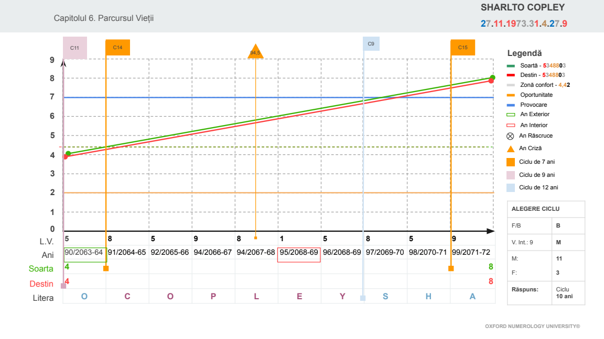

```text
Capitolul 6. Parcursul Vieții
C9
C11 C14 C15
94,5 Legendă
9
Soartă - 5348803
8 Destin - 5348803
Zonă confort - 4,42
7 Oportunitate
Provocare
6 An Exterior
An Interior
5 An Răscruce
An Criză
4
Ciclu de 7 ani
3 Ciclu de 9 ani
Ciclu de 12 ani
2
1 ALEGERE CICLU
0 F/B B
L.V. 5 8 5 9 8 1 5 8 5 9 V. Int.: 9 M
Ani 90/2063-64 91/2064-65 92/2065-66 94/2066-67 94/2067-68 95/2068-69 96/2068-69 97/2069-70 98/2070-71 99/2071-72
M: 11
Soarta 4 8
F: 3
Destin 4 8
Răspuns: Ciclu
Litera O C O P L E Y S H A 10 ani
OXFORD NUMEROLOGY UNIVERSITY®
```

### Pagina 359

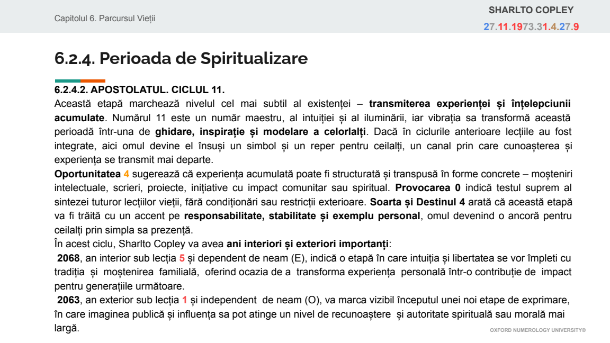

```text
Capitolul 6. Parcursul Vieții
6.2.4. Perioada de Spiritualizare
6.2.4.2. APOSTOLATUL. CICLUL 11.
Această etapă marchează nivelul cel mai subtil al existenței – transmiterea experienței și înțelepciunii
acumulate. Numărul 11 este un număr maestru, al intuiției și al iluminării, iar vibrația sa transformă această
perioadă într-una de ghidare, inspirație și modelare a celorlalți. Dacă în ciclurile anterioare lecțiile au fost
integrate, aici omul devine el însuși un simbol și un reper pentru ceilalți, un canal prin care cunoașterea și
experiența se transmit mai departe.
Oportunitatea 4 sugerează că experiența acumulată poate fi structurată și transpusă în forme concrete – moșteniri
intelectuale, scrieri, proiecte, inițiative cu impact comunitar sau spiritual. Provocarea 0 indică testul suprem al
sintezei tuturor lecțiilor vieții, fără condiționări sau restricții exterioare. Soarta și Destinul 4 arată că această etapă
va fi trăită cu un accent pe responsabilitate, stabilitate și exemplu personal, omul devenind o ancoră pentru
ceilalți prin simpla sa prezență.
În acest ciclu, Sharlto Copley va avea ani interiori și exteriori importanți:
2068, an interior sub lecția 5 și dependent de neam (E), indică o etapă în care intuiția și libertatea se vor împleti cu
tradiția și moștenirea familială, oferind ocazia de a transforma experiența personală într-o contribuție de impact
pentru generațiile următoare.
2063, an exterior sub lecția 1 și independent de neam (O), va marca vizibil începutul unei noi etape de exprimare,
în care imaginea publică și influența sa pot atinge un nivel de recunoaștere și autoritate spirituală sau morală mai
largă.
OXFORD NUMEROLOGY UNIVERSITY®
```

### Pagina 360

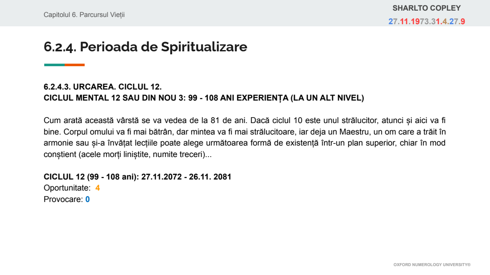

```text
Capitolul 6. Parcursul Vieții
6.2.4. Perioada de Spiritualizare
6.2.4.3. URCAREA. CICLUL 12.
CICLUL MENTAL 12 SAU DIN NOU 3: 99 - 108 ANI EXPERIENȚA (LA UN ALT NIVEL)
Cum arată această vârstă se va vedea de la 81 de ani. Dacă ciclul 10 este unul strălucitor, atunci și aici va fi
bine. Corpul omului va fi mai bătrân, dar mintea va fi mai strălucitoare, iar deja un Maestru, un om care a trăit în
armonie sau și-a învățat lecțiile poate alege următoarea formă de existență într-un plan superior, chiar în mod
conștient (acele morți liniștite, numite treceri)...
CICLUL 12 (99 - 108 ani): 27.11.2072 - 26.11. 2081
Oportunitate: 4
Provocare: 0
OXFORD NUMEROLOGY UNIVERSITY®
```

### Pagina 361

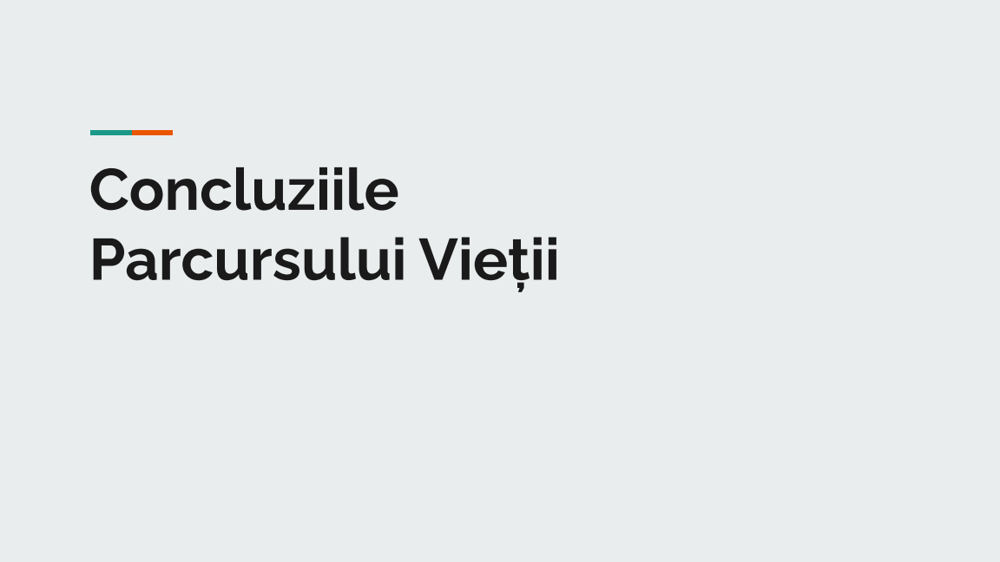

```text
Concluziile
Parcursului Vieții
```

### Pagina 362

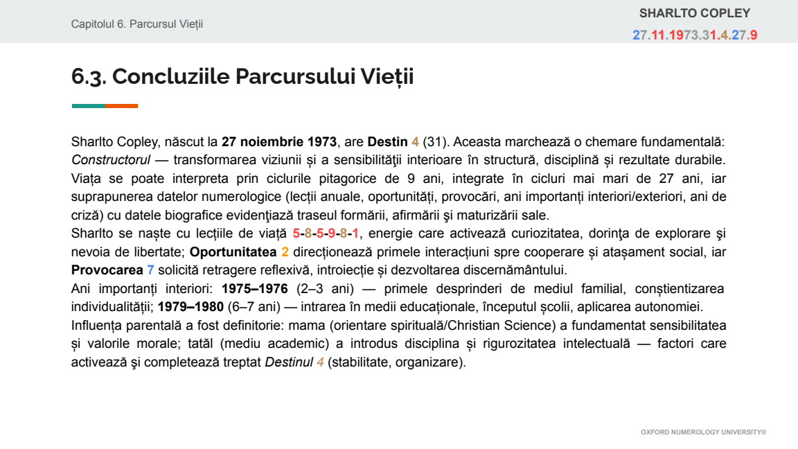

```text
Capitolul 6. Parcursul Vieții
6.3. Concluziile Parcursului Vieții
Sharlto Copley, născut la 27 noiembrie 1973, are Destin 4 (31). Aceasta marchează o chemare fundamentală:
Constructorul — transformarea viziunii și a sensibilităţii interioare în structură, disciplină și rezultate durabile.
Viața se poate interpreta prin ciclurile pitagorice de 9 ani, integrate în cicluri mai mari de 27 ani, iar
suprapunerea datelor numerologice (lecții anuale, oportunități, provocări, ani importanți interiori/exteriori, ani de
criză) cu datele biografice evidenţiază traseul formării, afirmării şi maturizării sale.
Sharlto se naște cu lecțiile de viață 5-8-5-9-8-1, energie care activează curiozitatea, dorinţa de explorare şi
nevoia de libertate; Oportunitatea 2 direcționează primele interacțiuni spre cooperare și atașament social, iar
Provocarea 7 solicită retragere reflexivă, introiecție și dezVAULTarea discernământului.
Ani importanți interiori: 1975–1976 (2–3 ani) — primele desprinderi de mediul familial, conștientizarea
individualității; 1979–1980 (6–7 ani) — intrarea în medii educaționale, începutul școlii, aplicarea autonomiei.
Influența parentală a fost definitorie: mama (orientare spirituală/Christian Science) a fundamentat sensibilitatea
și valorile morale; tatăl (mediu academic) a introdus disciplina și rigurozitatea intelectuală — factori care
activează şi completează treptat Destinul 4 (stabilitate, organizare).
OXFORD NUMEROLOGY UNIVERSITY®
```

### Pagina 363

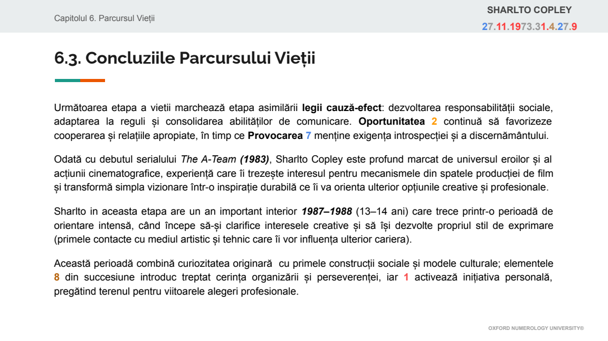

```text
Capitolul 6. Parcursul Vieții
6.3. Concluziile Parcursului Vieții
Următoarea etapa a vietii marchează etapa asimilării legii cauză-efect: dezVAULTarea responsabilității sociale,
adaptarea la reguli și consolidarea abilităților de comunicare. Oportunitatea 2 continuă să favorizeze
cooperarea și relațiile apropiate, în timp ce Provocarea 7 menține exigența introspecției și a discernământului.
Odată cu debutul serialului The A-Team (1983), Sharlto Copley este profund marcat de universul eroilor și al
acțiunii cinematografice, experiență care îi trezește interesul pentru mecanismele din spatele producției de film
și transformă simpla vizionare într-o inspirație durabilă ce îi va orienta ulterior opțiunile creative și profesionale.
Sharlto in aceasta etapa are un an important interior 1987–1988 (13–14 ani) care trece printr-o perioadă de
orientare intensă, când începe să-și clarifice interesele creative și să își dezVAULTe propriul stil de exprimare
(primele contacte cu mediul artistic și tehnic care îi vor influența ulterior cariera).
Această perioadă combină curiozitatea originară cu primele construcții sociale și modele culturale; elementele
8 din succesiune introduc treptat cerința organizării și perseverenței, iar 1 activează inițiativa personală,
pregătind terenul pentru viitoarele alegeri profesionale.
OXFORD NUMEROLOGY UNIVERSITY®
```

### Pagina 364

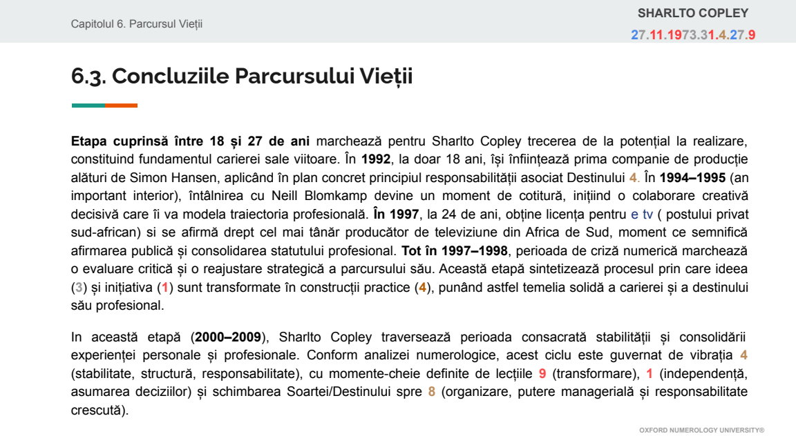

```text
Capitolul 6. Parcursul Vieții
6.3. Concluziile Parcursului Vieții
Etapa cuprinsă între 18 și 27 de ani marchează pentru Sharlto Copley trecerea de la potențial la realizare,
constituind fundamentul carierei sale viitoare. În 1992, la doar 18 ani, își înființează prima companie de producție
alături de Simon Hansen, aplicând în plan concret principiul responsabilității asociat Destinului 4. În 1994–1995 (an
important interior), întâlnirea cu Neill Blomkamp devine un moment de cotitură, inițiind o colaborare creativă
decisivă care îi va modela traiectoria profesională. În 1997, la 24 de ani, obține licența pentru e tv ( postului privat
sud-african) si se afirmă drept cel mai tânăr producător de televiziune din Africa de Sud, moment ce semnifică
afirmarea publică și consolidarea statutului profesional. Tot în 1997–1998, perioada de criză numerică marchează
o evaluare critică și o reajustare strategică a parcursului său. Această etapă sintetizează procesul prin care ideea
(3) și inițiativa (1) sunt transformate în construcții practice (4), punând astfel temelia solidă a carierei și a destinului
său profesional.
In această etapă (2000–2009), Sharlto Copley traversează perioada consacrată stabilității și consolidării
experienței personale și profesionale. Conform analizei numerologice, acest ciclu este guvernat de vibrația 4
(stabilitate, structură, responsabilitate), cu momente-cheie definite de lecțiile 9 (transformare), 1 (independență,
asumarea deciziilor) și schimbarea Soartei/Destinului spre 8 (organizare, putere managerială și responsabilitate
crescută).
OXFORD NUMEROLOGY UNIVERSITY®
```

### Pagina 365

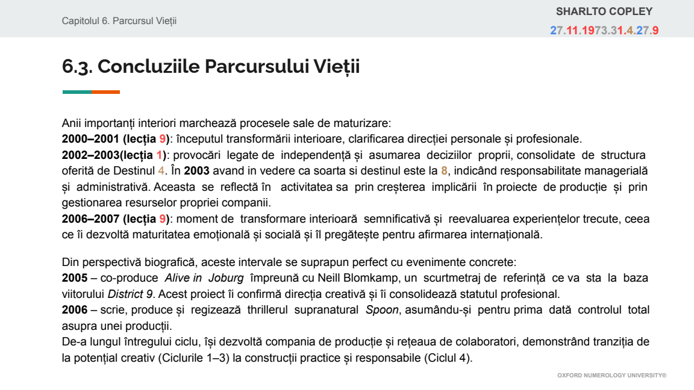

```text
Capitolul 6. Parcursul Vieții
6.3. Concluziile Parcursului Vieții
Anii importanți interiori marchează procesele sale de maturizare:
2000–2001 (lecția 9): începutul transformării interioare, clarificarea direcției personale și profesionale.
2002–2003(lecția 1): provocări legate de independență și asumarea deciziilor proprii, consolidate de structura
oferită de Destinul 4. În 2003 avand in vedere ca soarta si destinul este la 8, indicând responsabilitate managerială
și administrativă. Aceasta se reflectă în activitatea sa prin creșterea implicării în proiecte de producție și prin
gestionarea resurselor propriei companii.
2006–2007 (lecția 9): moment de transformare interioară semnificativă și reevaluarea experiențelor trecute, ceea
ce îi dezVAULTă maturitatea emoțională și socială și îl pregătește pentru afirmarea internațională.
Din perspectivă biografică, aceste intervale se suprapun perfect cu evenimente concrete:
2005 – co-produce Alive in Joburg împreună cu Neill Blomkamp, un scurtmetraj de referință ce va sta la baza
viitorului District 9. Acest proiect îi confirmă direcția creativă și îi consolidează statutul profesional.
2006 – scrie, produce și regizează thrillerul supranatural Spoon, asumându-și pentru prima dată controlul total
asupra unei producții.
De-a lungul întregului ciclu, își dezVAULTă compania de producție și rețeaua de colaboratori, demonstrând tranziția de
la potențial creativ (Ciclurile 1–3) la construcții practice și responsabile (Ciclul 4).
OXFORD NUMEROLOGY UNIVERSITY®
```

### Pagina 366

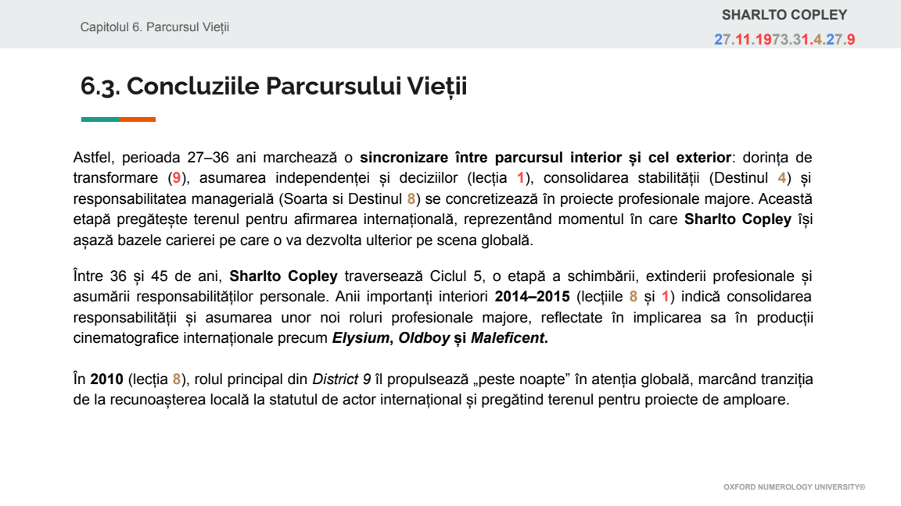

```text
Capitolul 6. Parcursul Vieții
6.3. Concluziile Parcursului Vieții
Astfel, perioada 27–36 ani marchează o sincronizare între parcursul interior și cel exterior: dorința de
transformare (9), asumarea independenței și deciziilor (lecția 1), consolidarea stabilității (Destinul 4) și
responsabilitatea managerială (Soarta si Destinul 8) se concretizează în proiecte profesionale majore. Această
etapă pregătește terenul pentru afirmarea internațională, reprezentând momentul în care Sharlto Copley își
așază bazele carierei pe care o va dezVAULTa ulterior pe scena globală.
Între 36 și 45 de ani, Sharlto Copley traversează Ciclul 5, o etapă a schimbării, extinderii profesionale și
asumării responsabilităților personale. Anii importanți interiori 2014–2015 (lecțiile 8 și 1) indică consolidarea
responsabilității și asumarea unor noi roluri profesionale majore, reflectate în implicarea sa în producții
cinematografice internaționale precum Elysium, Oldboy și Maleficent.
În 2010 (lecția 8), rolul principal din District 9 îl propulsează „peste noapte” în atenția globală, marcând tranziția
de la recunoașterea locală la statutul de actor internațional și pregătind terenul pentru proiecte de amploare.
OXFORD NUMEROLOGY UNIVERSITY®
```

### Pagina 367

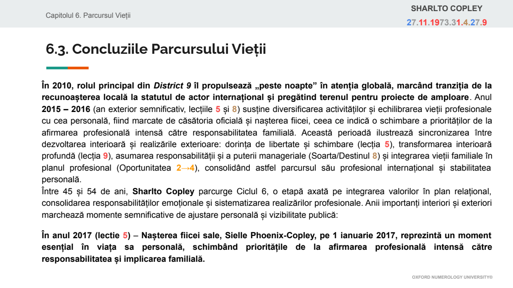

```text
Capitolul 6. Parcursul Vieții
6.3. Concluziile Parcursului Vieții
În 2010, rolul principal din District 9 îl propulsează „peste noapte” în atenția globală, marcând tranziția de la
recunoașterea locală la statutul de actor internațional și pregătind terenul pentru proiecte de amploare. Anul
2015 – 2016 (an exterior semnificativ, lecțiile 5 și 8) susține diversificarea activităților și echilibrarea vieții profesionale
cu cea personală, fiind marcate de căsătoria oficială și nașterea fiicei, ceea ce indică o schimbare a priorităților de la
afirmarea profesională intensă către responsabilitatea familială. Această perioadă ilustrează sincronizarea între
dezVAULTarea interioară și realizările exterioare: dorința de libertate și schimbare (lecția 5), transformarea interioară
profundă (lecția 9), asumarea responsabilității și a puterii manageriale (Soarta/Destinul 8) și integrarea vieții familiale în
planul profesional (Oportunitatea 2→4), consolidând astfel parcursul său profesional internațional și stabilitatea
personală.
Între 45 și 54 de ani, Sharlto Copley parcurge Ciclul 6, o etapă axată pe integrarea valorilor în plan relațional,
consolidarea responsabilităților emoționale și sistematizarea realizărilor profesionale. Anii importanți interiori și exteriori
marchează momente semnificative de ajustare personală și vizibilitate publică:
În anul 2017 (lectie 5) – Nașterea fiicei sale, Sielle Phoenix-Copley, pe 1 ianuarie 2017, reprezintă un moment
esențial în viața sa personală, schimbând prioritățile de la afirmarea profesională intensă către
responsabilitatea și implicarea familială.
OXFORD NUMEROLOGY UNIVERSITY®
```

### Pagina 368

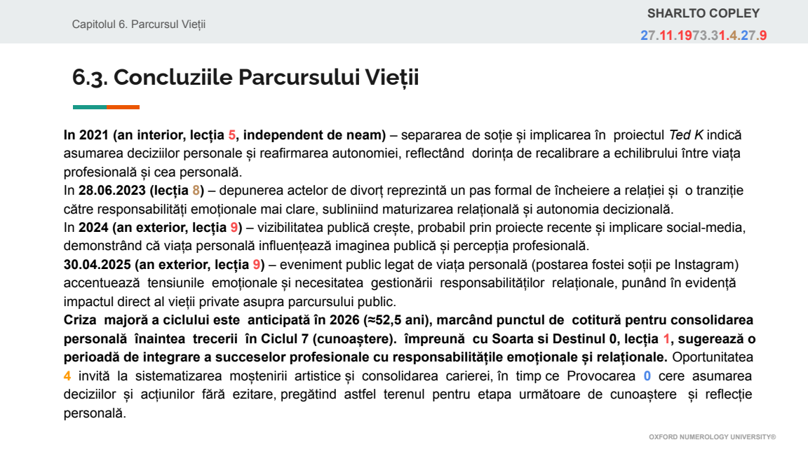

```text
Capitolul 6. Parcursul Vieții
6.3. Concluziile Parcursului Vieții
In 2021 (an interior, lecția 5, independent de neam) – separarea de soție și implicarea în proiectul Ted K indică
asumarea deciziilor personale și reafirmarea autonomiei, reflectând dorința de recalibrare a echilibrului între viața
profesională și cea personală.
In 28.06.2023 (lecția 8) – depunerea actelor de divorț reprezintă un pas formal de încheiere a relației și o tranziție
către responsabilități emoționale mai clare, subliniind maturizarea relațională și autonomia decizională.
In 2024 (an exterior, lecția 9) – vizibilitatea publică crește, probabil prin proiecte recente și implicare social-media,
demonstrând că viața personală influențează imaginea publică și percepția profesională.
30.04.2025 (an exterior, lecția 9) – eveniment public legat de viața personală (postarea fostei soții pe Instagram)
accentuează tensiunile emoționale și necesitatea gestionării responsabilităților relaționale, punând în evidență
impactul direct al vieții private asupra parcursului public.
Criza majoră a ciclului este anticipată în 2026 (≈52,5 ani), marcând punctul de cotitură pentru consolidarea
personală înaintea trecerii în Ciclul 7 (cunoaștere). împreună cu Soarta si Destinul 0, lecția 1, sugerează o
perioadă de integrare a succeselor profesionale cu responsabilitățile emoționale și relaționale. Oportunitatea
4 invită la sistematizarea moștenirii artistice și consolidarea carierei, în timp ce Provocarea 0 cere asumarea
deciziilor și acțiunilor fără ezitare, pregătind astfel terenul pentru etapa următoare de cunoaștere și reflecție
personală.
OXFORD NUMEROLOGY UNIVERSITY®
```

# Capitolul 7. Ajutoare

_Pagini sursa: 369-374._

## Formule si calcule extrase pentru rafinare

### Barbați

- Concept analizat: verificat in VAULT/Numerologie - [[Vibratie Cosmica Variabila]].
- Metoda de calcul: Barbați: 10 - Vibratia cosmică variabilă redusă la o cifră (din anul de naștere) SUCCES (CARIERĂ,
- Calcul: Barbați: 10 - Vibratia cosmică variabilă redusă la o cifră (din anul de naștere) SUCCES (CARIERĂ,
- Verificare: ok - concept verificat in VAULT/Numerologie; metoda trebuie rafinata din textul paginii.
- Verificare pagina: pagina 372.

### Triunghiul financiar

- Concept analizat: verificat in VAULT/Numerologie - [[Cod Numerologic Personal]].
- Metoda de calcul: Triunghiul financiar: 9224
- Calcul: Triunghiul financiar: 9224
- Verificare: ok - concept verificat in VAULT/Numerologie; metoda trebuie rafinata din textul paginii.
- Verificare pagina: pagina 373.

### Pătratul de Aur (Magic) 3x3 30+31+32

- Concept analizat: verificat in VAULT/Numerologie - [[Cod Numerologic Personal]].
- Metoda de calcul: Pătratul de Aur (Magic) 3x3 30+31+32=93
- Calcul: Pătratul de Aur (Magic) 3x3 30+31+32=93
- Verificare: ok - concept verificat in VAULT/Numerologie; formula de calcul este compatibila cu documentatia.
- Verificare pagina: pagina 374.

### Pătratul de aur conține numere care adunate pe fiecare rând, 34 27 32 34+27+32

- Concept analizat: verificat in VAULT/Numerologie - [[Cod Numerologic Personal]].
- Metoda de calcul: Pătratul de aur conține numere care adunate pe fiecare rând, 34 27 32 34+27+32=93
- Calcul: Pătratul de aur conține numere care adunate pe fiecare rând, 34 27 32 34+27+32=93
- Verificare: ok - concept verificat in VAULT/Numerologie; formula de calcul este compatibila cu documentatia.
- Verificare pagina: pagina 374.

## Pagini si text sursa

### Pagina 369


```text
Ajutoare
```

### Pagina 370

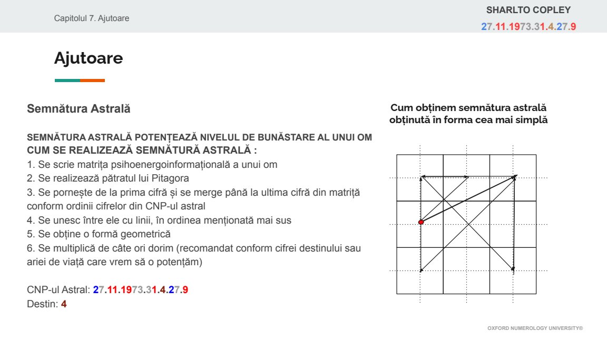

```text
Capitolul 7. Ajutoare
Ajutoare
Semnătura Astrală Cum obținem semnătura astrală
obținută în forma cea mai simplă
SEMNĂTURA ASTRALĂ POTENȚEAZĂ NIVELUL DE BUNĂSTARE AL UNUI OM
CUM SE REALIZEAZĂ SEMNĂTURĂ ASTRALĂ :
1. Se scrie matrița psihoenergoinformațională a unui om
2. Se realizează pătratul lui Pitagora
3. Se pornește de la prima cifră și se merge până la ultima cifră din matriță
conform ordinii cifrelor din CNP-ul astral
4. Se unesc între ele cu linii, în ordinea menționată mai sus
5. Se obține o formă geometrică
6. Se multiplică de câte ori dorim (recomandat conform cifrei destinului sau
ariei de viață care vrem să o potențăm)
CNP-ul Astral: 27.11.1973.31.4.27.9
Destin: 4
OXFORD NUMEROLOGY UNIVERSITY®
```

### Pagina 371

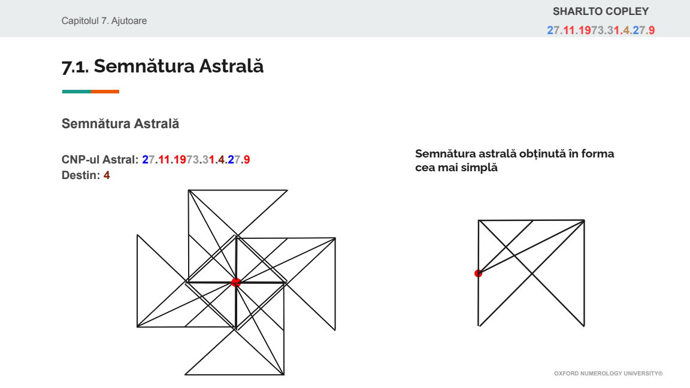

```text
Capitolul 7. Ajutoare
7.1. Semnătura Astrală
Semnătura Astrală
CNP-ul Astral: 27.11.1973.31.4.27.9
Destin: 4
OXFORD NUMEROLOGY UNIVERSITY®
Semnătura astrală obținută în forma
cea mai simplă
```

### Pagina 372

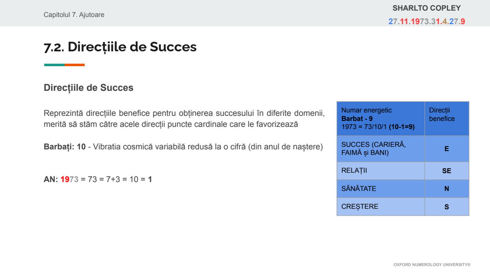

```text
Capitolul 7. Ajutoare
7.2. Direcțiile de Succes
Direcțiile de Succes
Reprezintă direcțiile benefice pentru obținerea succesului în diferite domenii, Numar energetic Direcții
Barbat - 9 benefice
merită să stăm către acele direcții puncte cardinale care le favorizează
1973 = 73/10/1 (10-1=9)
Barbați: 10 - Vibratia cosmică variabilă redusă la o cifră (din anul de naștere) SUCCES (CARIERĂ,
E
FAIMĂ și BANI)
RELAȚII SE
AN: 1973 = 73 = 7+3 = 10 = 1
SĂNĂTATE N
CREȘTERE S
OXFORD NUMEROLOGY UNIVERSITY®
```

### Pagina 373

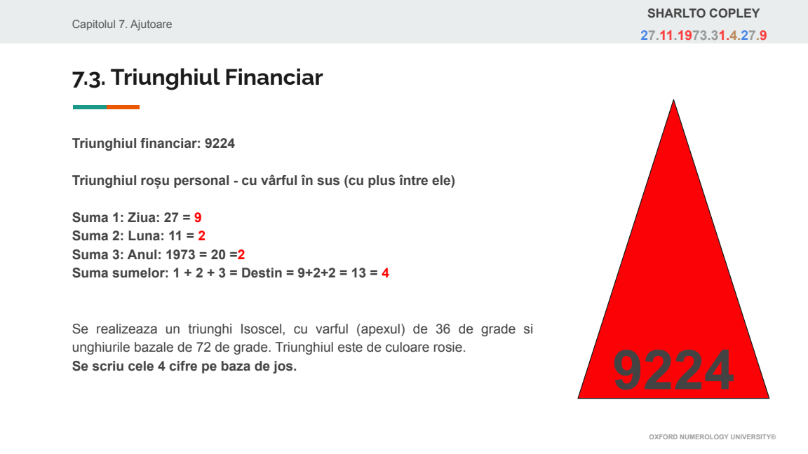

```text
Capitolul 7. Ajutoare
7.3. Triunghiul Financiar
Triunghiul financiar: 9224
Triunghiul roșu personal - cu vârful în sus (cu plus între ele)
Suma 1: Ziua: 27 = 9
Suma 2: Luna: 11 = 2
Suma 3: Anul: 1973 = 20 =2
Suma sumelor: 1 + 2 + 3 = Destin = 9+2+2 = 13 = 4
Se realizeaza un triunghi Isoscel, cu varful (apexul) de 36 de grade si
unghiurile bazale de 72 de grade. Triunghiul este de culoare rosie.
9224
Se scriu cele 4 cifre pe baza de jos.
OXFORD NUMEROLOGY UNIVERSITY®
```

### Pagina 374

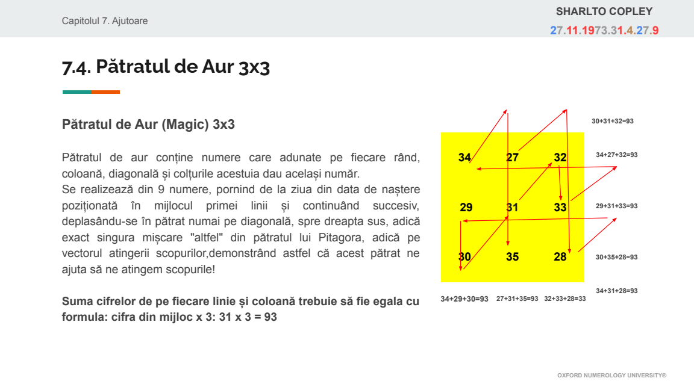

```text
Capitolul 7. Ajutoare
7.4. Pătratul de Aur 3x3
Pătratul de Aur (Magic) 3x3 30+31+32=93
Pătratul de aur conține numere care adunate pe fiecare rând, 34 27 32 34+27+32=93
coloană, diagonală și colțurile acestuia dau același număr.
Se realizează din 9 numere, pornind de la ziua din data de naștere
poziționată în mijlocul primei linii și continuând succesiv, 29 31 33 29+31+33=93
deplasându-se în pătrat numai pe diagonală, spre dreapta sus, adică
exact singura mișcare "altfel" din pătratul lui Pitagora, adică pe
vectorul atingerii scopurilor,demonstrând astfel că acest pătrat ne
30 35 28 30+35+28=93
ajuta să ne atingem scopurile!
34+31+28=93
Suma cifrelor de pe fiecare linie și coloană trebuie să fie egala cu 34+29+30=93 27+31+35=93 32+33+28=33
formula: cifra din mijloc x 3: 31 x 3 = 93
OXFORD NUMEROLOGY UNIVERSITY®
```

# Capitolul 8. Concluzii finale pentru numerologi

_Pagini sursa: 375-389._

## Formule si calcule extrase pentru rafinare

### și perseverență. Vibrația interioară 9 reflectă trăsături esențiale ale caracterului său

- Concept analizat: verificat in VAULT/Numerologie - [[Vibratie Interioara]].
- Metoda de calcul: și perseverență. Vibrația interioară 9 reflectă trăsături esențiale ale caracterului său: dedicarea,
- Calcul: și perseverență. Vibrația interioară 9 reflectă trăsături esențiale ale caracterului său: dedicarea,
- Verificare: ok - concept verificat in VAULT/Numerologie; metoda trebuie rafinata din textul paginii.
- Verificare pagina: pagina 376.

### autoritarism, izolare orgolioasă. Astfel, ajunge natural la Destinul 4

- Concept analizat: verificat in VAULT/Numerologie - [[Vibratia Destinului]].
- Metoda de calcul: autoritarism, izolare orgolioasă. Astfel, ajunge natural la Destinul 4: cadru, metodă, disciplină, rezultate
- Calcul: autoritarism, izolare orgolioasă. Astfel, ajunge natural la Destinul 4: cadru, metodă, disciplină, rezultate
- Verificare: ok - concept verificat in VAULT/Numerologie; metoda trebuie rafinata din textul paginii.
- Verificare pagina: pagina 384.

### Calea Destinului Karmic 31 (4) indică o lecție de singurătate activă și discernământ

- Concept analizat: verificat in VAULT/Numerologie - [[Karma din Calea Destinului]].
- Metoda de calcul: Calea Destinului Karmic 31 (4) indică o lecție de singurătate activă și discernământ: perioade în care reflecția,
- Calcul: Calea Destinului Karmic 31 (4) indică o lecție de singurătate activă și discernământ: perioade în care reflecția,
- Verificare: ok - concept verificat in VAULT/Numerologie; metoda trebuie rafinata din textul paginii.
- Verificare pagina: pagina 384.

### memorie de

- Concept analizat: verificat in VAULT/Numerologie - [[Vibratie Interioara]].
- Metoda de calcul: memorie de: carismă și interpretare de roluri plus vibrația interioară 9 care are aceste caracteristici de
- Calcul: memorie de: carismă și interpretare de roluri plus vibrația interioară 9 care are aceste caracteristici de
- Verificare: ok - concept verificat in VAULT/Numerologie; metoda trebuie rafinata din textul paginii.
- Verificare pagina: pagina 384.

## Pagini si text sursa

### Pagina 375

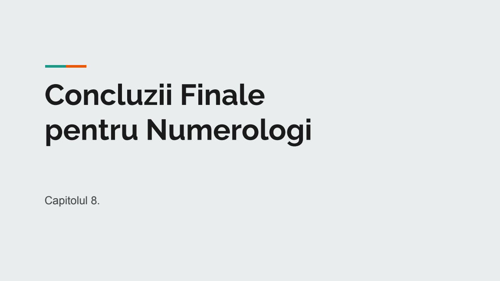

```text
Concluzii Finale
pentru Numerologi
```

### Pagina 376

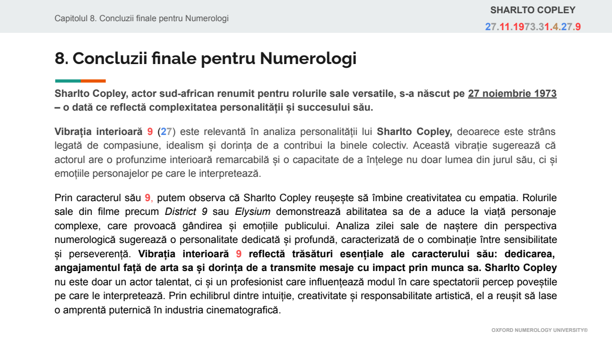

```text
Capitolul 8. Concluzii finale pentru Numerologi
8. Concluzii finale pentru Numerologi
Sharlto Copley, actor sud-african renumit pentru rolurile sale versatile, s-a născut pe 27 noiembrie 1973
– o dată ce reflectă complexitatea personalității și succesului său.
Vibrația interioară 9 (27) este relevantă în analiza personalității lui Sharlto Copley, deoarece este strâns
legată de compasiune, idealism și dorința de a contribui la binele colectiv. Această vibrație sugerează că
actorul are o profunzime interioară remarcabilă și o capacitate de a înțelege nu doar lumea din jurul său, ci și
emoțiile personajelor pe care le interpretează.
Prin caracterul său 9, putem observa că Sharlto Copley reușește să îmbine creativitatea cu empatia. Rolurile
sale din filme precum District 9 sau Elysium demonstrează abilitatea sa de a aduce la viață personaje
complexe, care provoacă gândirea și emoțiile publicului. Analiza zilei sale de naștere din perspectiva
numerologică sugerează o personalitate dedicată și profundă, caracterizată de o combinație între sensibilitate
și perseverență. Vibrația interioară 9 reflectă trăsături esențiale ale caracterului său: dedicarea,
angajamentul față de arta sa și dorința de a transmite mesaje cu impact prin munca sa. Sharlto Copley
nu este doar un actor talentat, ci și un profesionist care influențează modul în care spectatorii percep poveștile
pe care le interpretează. Prin echilibrul dintre intuiție, creativitate și responsabilitate artistică, el a reușit să lase
o amprentă puternică în industria cinematografică.
OXFORD NUMEROLOGY UNIVERSITY®
```

### Pagina 377

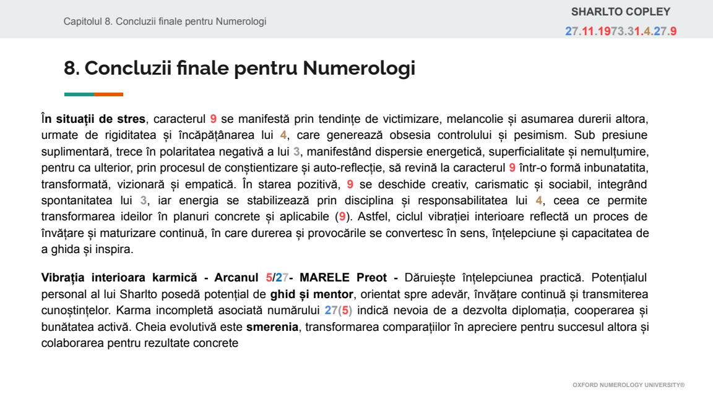

```text
Capitolul 8. Concluzii finale pentru Numerologi
8. Concluzii finale pentru Numerologi
În situații de stres, caracterul 9 se manifestă prin tendințe de victimizare, melancolie și asumarea durerii altora,
urmate de rigiditatea și încăpățânarea lui 4, care generează obsesia controlului și pesimism. Sub presiune
suplimentară, trece în polaritatea negativă a lui 3, manifestând dispersie energetică, superficialitate și nemulțumire,
pentru ca ulterior, prin procesul de conștientizare și auto-reflecție, să revină la caracterul 9 într-o formă inbunatatita,
transformată, vizionară și empatică. În starea pozitivă, 9 se deschide creativ, carismatic și sociabil, integrând
spontanitatea lui 3, iar energia se stabilizează prin disciplina și responsabilitatea lui 4, ceea ce permite
transformarea ideilor în planuri concrete și aplicabile (9). Astfel, ciclul vibrației interioare reflectă un proces de
învățare și maturizare continuă, în care durerea și provocările se convertesc în sens, înțelepciune și capacitatea de
a ghida și inspira.
Vibrația interioara karmică - Arcanul 5/27- MARELE Preot - Dăruiește înțelepciunea practică. Potențialul
personal al lui Sharlto posedă potențial de ghid și mentor, orientat spre adevăr, învățare continuă și transmiterea
cunoștințelor. Karma incompletă asociată numărului 27(5) indică nevoia de a dezVAULTa diplomația, cooperarea și
bunătatea activă. Cheia evolutivă este smerenia, transformarea comparațiilor în apreciere pentru succesul altora și
colaborarea pentru rezultate concrete
OXFORD NUMEROLOGY UNIVERSITY®
```

### Pagina 378

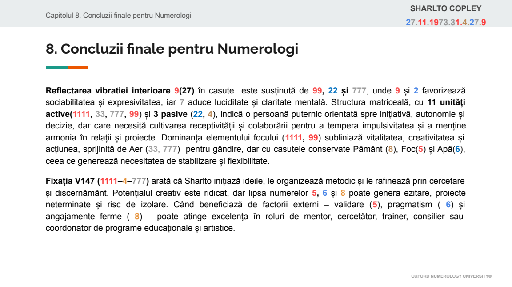

```text
Capitolul 8. Concluzii finale pentru Numerologi
8. Concluzii finale pentru Numerologi
Reflectarea vibratiei interioare 9(27) în casute este susținută de 99, 22 și 777, unde 9 și 2 favorizează
sociabilitatea și expresivitatea, iar 7 aduce luciditate și claritate mentală. Structura matriceală, cu 11 unități
active(1111, 33, 777, 99) și 3 pasive (22, 4), indică o persoană puternic orientată spre inițiativă, autonomie și
decizie, dar care necesită cultivarea receptivității și colaborării pentru a tempera impulsivitatea și a menține
armonia în relații și proiecte. Dominanța elementului focului (1111, 99) subliniază vitalitatea, creativitatea și
acțiunea, sprijinită de Aer (33, 777) pentru gândire, dar cu casutele conservate Pământ (8), Foc(5) și Apă(6),
ceea ce generează necesitatea de stabilizare și flexibilitate.
Fixația V147 (1111–4–777) arată că Sharlto inițiază ideile, le organizează metodic și le rafinează prin cercetare
și discernământ. Potențialul creativ este ridicat, dar lipsa numerelor 5, 6 și 8 poate genera ezitare, proiecte
neterminate și risc de izolare. Când beneficiază de factorii externi – validare (5), pragmatism ( 6) și
angajamente ferme ( 8) – poate atinge excelența în roluri de mentor, cercetător, trainer, consilier sau
coordonator de programe educaționale și artistice.
OXFORD NUMEROLOGY UNIVERSITY®
```

### Pagina 379

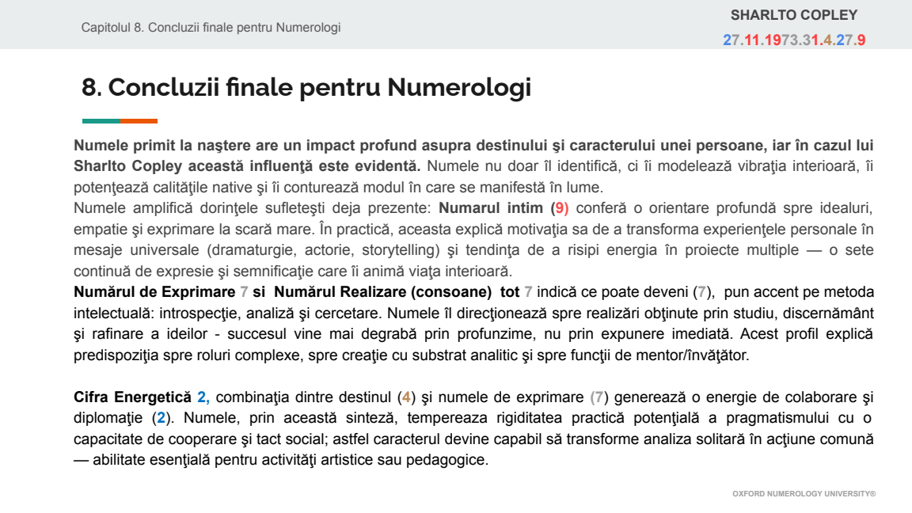

```text
Capitolul 8. Concluzii finale pentru Numerologi
8. Concluzii finale pentru Numerologi
Numele primit la naştere are un impact profund asupra destinului şi caracterului unei persoane, iar în cazul lui
Sharlto Copley această influenţă este evidentă. Numele nu doar îl identifică, ci îi modelează vibraţia interioară, îi
potenţează calităţile native şi îi conturează modul în care se manifestă în lume.
Numele amplifică dorinţele sufleteşti deja prezente: Numarul intim (9) conferă o orientare profundă spre idealuri,
empatie şi exprimare la scară mare. În practică, aceasta explică motivaţia sa de a transforma experienţele personale în
mesaje universale (dramaturgie, actorie, storytelling) şi tendinţa de a risipi energia în proiecte multiple — o sete
continuă de expresie şi semnificaţie care îi animă viaţa interioară.
Numărul de Exprimare 7 si Numărul Realizare (consoane) tot 7 indică ce poate deveni (7), pun accent pe metoda
intelectuală: introspecţie, analiză şi cercetare. Numele îl direcţionează spre realizări obţinute prin studiu, discernământ
şi rafinare a ideilor - succesul vine mai degrabă prin profunzime, nu prin expunere imediată. Acest profil explică
predispoziţia spre roluri complexe, spre creaţie cu substrat analitic şi spre funcţii de mentor/învăţător.
Cifra Energetică 2, combinaţia dintre destinul (4) şi numele de exprimare (7) generează o energie de colaborare şi
diplomaţie (2). Numele, prin această sinteză, tempereaza rigiditatea practică potenţială a pragmatismului cu o
capacitate de cooperare şi tact social; astfel caracterul devine capabil să transforme analiza solitară în acţiune comună
— abilitate esenţială pentru activităţi artistice sau pedagogice.
OXFORD NUMEROLOGY UNIVERSITY®
```

### Pagina 380

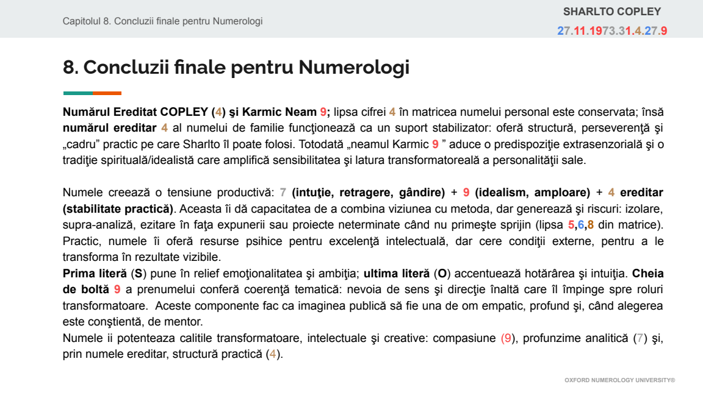

```text
Capitolul 8. Concluzii finale pentru Numerologi
8. Concluzii finale pentru Numerologi
Numărul Ereditat COPLEY (4) şi Karmic Neam 9; lipsa cifrei 4 în matricea numelui personal este conservata; însă
numărul ereditar 4 al numelui de familie funcţionează ca un suport stabilizator: oferă structură, perseverenţă şi
„cadru” practic pe care Sharlto îl poate folosi. Totodată „neamul Karmic 9 ” aduce o predispoziţie extrasenzorială şi o
tradiţie spirituală/idealistă care amplifică sensibilitatea şi latura transformatoreală a personalităţii sale.
Numele creează o tensiune productivă: 7 (intuţie, retragere, gândire) + 9 (idealism, amploare) + 4 ereditar
(stabilitate practică). Aceasta îi dă capacitatea de a combina viziunea cu metoda, dar generează şi riscuri: izolare,
supra-analiză, ezitare în faţa expunerii sau proiecte neterminate când nu primeşte sprijin (lipsa 5,6,8 din matrice).
Practic, numele îi oferă resurse psihice pentru excelenţă intelectuală, dar cere condiţii externe, pentru a le
transforma în rezultate vizibile.
Prima literă (S) pune în relief emoţionalitatea şi ambiţia; ultima literă (O) accentuează hotărârea şi intuiţia. Cheia
de boltă 9 a prenumelui conferă coerenţă tematică: nevoia de sens şi direcţie înaltă care îl împinge spre roluri
transformatoare. Aceste componente fac ca imaginea publică să fie una de om empatic, profund şi, când alegerea
este conştientă, de mentor.
Numele ii potenteaza calitile transformatoare, intelectuale şi creative: compasiune (9), profunzime analitică (7) şi,
prin numele ereditar, structură practică (4).
OXFORD NUMEROLOGY UNIVERSITY®
```

### Pagina 381

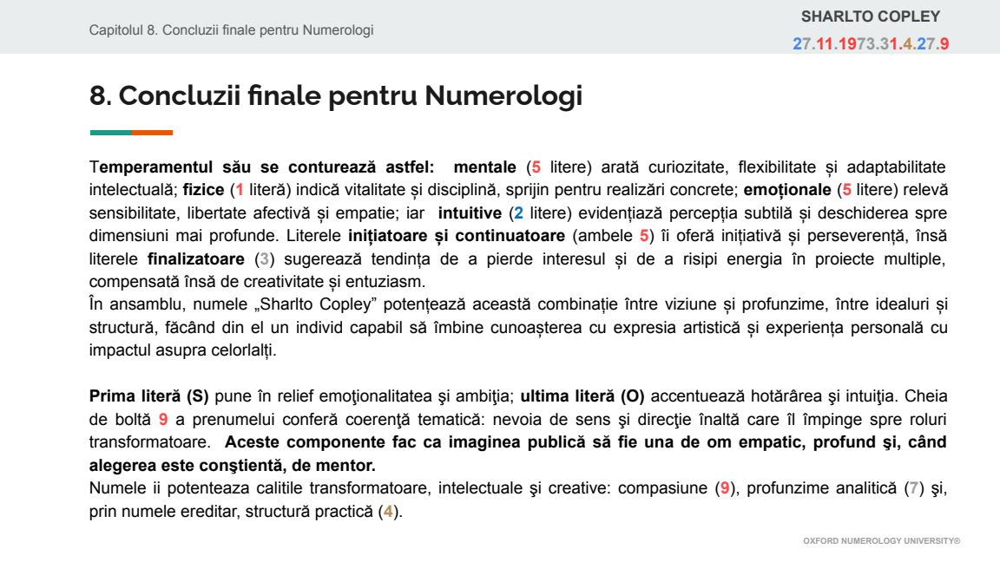

```text
Capitolul 8. Concluzii finale pentru Numerologi
8. Concluzii finale pentru Numerologi
Temperamentul său se conturează astfel: mentale (5 litere) arată curiozitate, flexibilitate și adaptabilitate
intelectuală; fizice (1 literă) indică vitalitate și disciplină, sprijin pentru realizări concrete; emoționale (5 litere) relevă
sensibilitate, libertate afectivă și empatie; iar intuitive (2 litere) evidențiază percepția subtilă și deschiderea spre
dimensiuni mai profunde. Literele inițiatoare și continuatoare (ambele 5) îi oferă inițiativă și perseverență, însă
literele finalizatoare (3) sugerează tendința de a pierde interesul și de a risipi energia în proiecte multiple,
compensată însă de creativitate și entuziasm.
În ansamblu, numele „Sharlto Copley” potențează această combinație între viziune și profunzime, între idealuri și
structură, făcând din el un individ capabil să îmbine cunoașterea cu expresia artistică și experiența personală cu
impactul asupra celorlalți.
Prima literă (S) pune în relief emoţionalitatea şi ambiţia; ultima literă (O) accentuează hotărârea şi intuiţia. Cheia
de boltă 9 a prenumelui conferă coerenţă tematică: nevoia de sens şi direcţie înaltă care îl împinge spre roluri
transformatoare. Aceste componente fac ca imaginea publică să fie una de om empatic, profund şi, când
alegerea este conştientă, de mentor.
Numele ii potenteaza calitile transformatoare, intelectuale şi creative: compasiune (9), profunzime analitică (7) şi,
prin numele ereditar, structură practică (4).
OXFORD NUMEROLOGY UNIVERSITY®
```

### Pagina 382

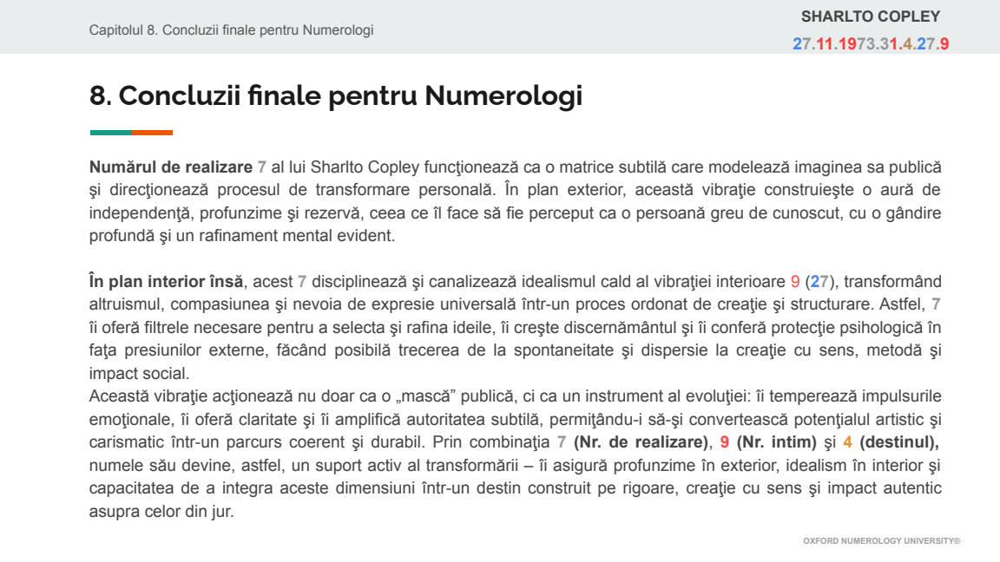

```text
Capitolul 8. Concluzii finale pentru Numerologi
8. Concluzii finale pentru Numerologi
Numărul de realizare 7 al lui Sharlto Copley funcţionează ca o matrice subtilă care modelează imaginea sa publică
şi direcţionează procesul de transformare personală. În plan exterior, această vibraţie construieşte o aură de
independenţă, profunzime şi rezervă, ceea ce îl face să fie perceput ca o persoană greu de cunoscut, cu o gândire
profundă şi un rafinament mental evident.
În plan interior însă, acest 7 disciplinează şi canalizează idealismul cald al vibraţiei interioare 9 (27), transformând
altruismul, compasiunea şi nevoia de expresie universală într-un proces ordonat de creaţie şi structurare. Astfel, 7
îi oferă filtrele necesare pentru a selecta şi rafina ideile, îi creşte discernământul şi îi conferă protecţie psihologică în
faţa presiunilor externe, făcând posibilă trecerea de la spontaneitate şi dispersie la creaţie cu sens, metodă şi
impact social.
Această vibraţie acţionează nu doar ca o „mască” publică, ci ca un instrument al evoluţiei: îi temperează impulsurile
emoţionale, îi oferă claritate şi îi amplifică autoritatea subtilă, permiţându-i să-şi convertească potenţialul artistic şi
carismatic într-un parcurs coerent şi durabil. Prin combinaţia 7 (Nr. de realizare), 9 (Nr. intim) şi 4 (destinul),
numele său devine, astfel, un suport activ al transformării – îi asigură profunzime în exterior, idealism în interior şi
capacitatea de a integra aceste dimensiuni într-un destin construit pe rigoare, creaţie cu sens şi impact autentic
asupra celor din jur.
OXFORD NUMEROLOGY UNIVERSITY®
```

### Pagina 383

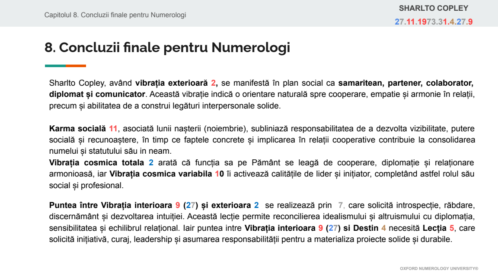

```text
Capitolul 8. Concluzii finale pentru Numerologi
8. Concluzii finale pentru Numerologi
Sharlto Copley, având vibrația exterioară 2, se manifestă în plan social ca samaritean, partener, colaborator,
diplomat și comunicator. Această vibrație indică o orientare naturală spre cooperare, empatie și armonie în relații,
precum și abilitatea de a construi legături interpersonale solide.
Karma socială 11, asociată lunii nașterii (noiembrie), subliniază responsabilitatea de a dezVAULTa vizibilitate, putere
socială și recunoaștere, în timp ce faptele concrete și implicarea în relații cooperative contribuie la consolidarea
numelui și statutului său in neam.
Vibrația cosmica totala 2 arată că funcția sa pe Pământ se leagă de cooperare, diplomație și relaționare
armonioasă, iar Vibrația cosmica variabila 10 îi activează calitățile de lider și inițiator, completând astfel rolul său
social și profesional.
Puntea între Vibrația interioara 9 (27) și exterioara 2 se realizează prin 7, care solicită introspecție, răbdare,
discernământ și dezVAULTarea intuiției. Această lecție permite reconcilierea idealismului și altruismului cu diplomația,
sensibilitatea și echilibrul relațional. Iair puntea intre Vibrația interioara 9 (27) si Destin 4 necesită Lecția 5, care
solicită inițiativă, curaj, leadership și asumarea responsabilității pentru a materializa proiecte solide și durabile.
OXFORD NUMEROLOGY UNIVERSITY®
```

### Pagina 384

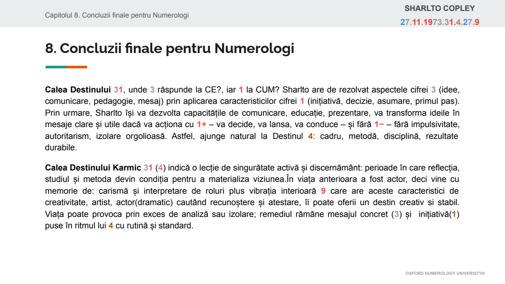

```text
Capitolul 8. Concluzii finale pentru Numerologi
8. Concluzii finale pentru Numerologi
Calea Destinului 31, unde 3 răspunde la CE?, iar 1 la CUM? Sharlto are de rezolvat aspectele cifrei 3 (idee,
comunicare, pedagogie, mesaj) prin aplicarea caracteristicilor cifrei 1 (inițiativă, decizie, asumare, primul pas).
Prin urmare, Sharlto își va dezVAULTa capacitățile de comunicare, educație, prezentare, va transforma ideile în
mesaje clare și utile dacă va acționa cu 1+ – va decide, va lansa, va conduce – și fără 1− – fără impulsivitate,
autoritarism, izolare orgolioasă. Astfel, ajunge natural la Destinul 4: cadru, metodă, disciplină, rezultate
durabile.
Calea Destinului Karmic 31 (4) indică o lecție de singurătate activă și discernământ: perioade în care reflecția,
studiul și metoda devin condiția pentru a materializa viziunea.În viața anterioara a fost actor, deci vine cu
memorie de: carismă și interpretare de roluri plus vibrația interioară 9 care are aceste caracteristici de
creativitate, artist, actor(dramatic) cautând recunoștere și atestare, îi poate oferii un destin creativ si stabil.
Viața poate provoca prin exces de analiză sau izolare; remediul rămâne mesajul concret (3) și inițiativă(1)
puse în ritmul lui 4 cu rutină și standard.
OXFORD NUMEROLOGY UNIVERSITY®
```

### Pagina 385

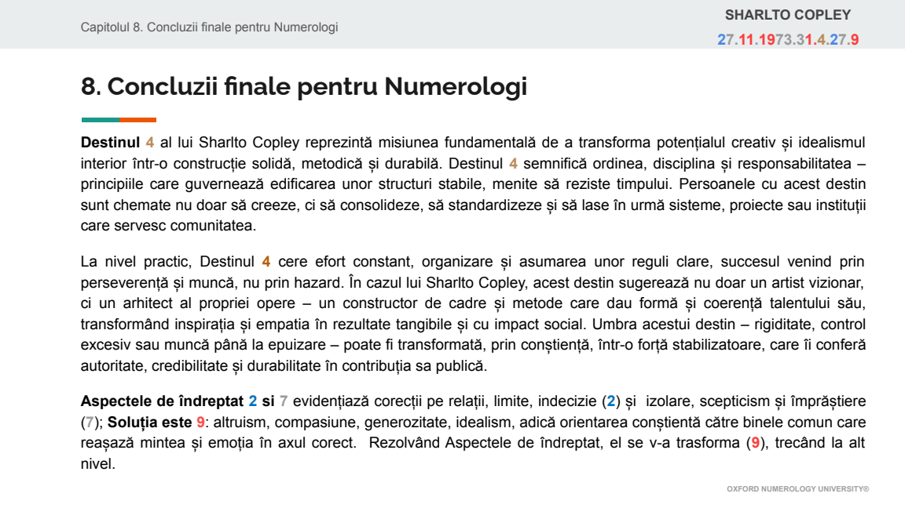

```text
Capitolul 8. Concluzii finale pentru Numerologi
8. Concluzii finale pentru Numerologi
Destinul 4 al lui Sharlto Copley reprezintă misiunea fundamentală de a transforma potențialul creativ și idealismul
interior într-o construcție solidă, metodică și durabilă. Destinul 4 semnifică ordinea, disciplina și responsabilitatea –
principiile care guvernează edificarea unor structuri stabile, menite să reziste timpului. Persoanele cu acest destin
sunt chemate nu doar să creeze, ci să consolideze, să standardizeze și să lase în urmă sisteme, proiecte sau instituții
care servesc comunitatea.
La nivel practic, Destinul 4 cere efort constant, organizare și asumarea unor reguli clare, succesul venind prin
perseverență și muncă, nu prin hazard. În cazul lui Sharlto Copley, acest destin sugerează nu doar un artist vizionar,
ci un arhitect al propriei opere – un constructor de cadre și metode care dau formă și coerență talentului său,
transformând inspirația și empatia în rezultate tangibile și cu impact social. Umbra acestui destin – rigiditate, control
excesiv sau muncă până la epuizare – poate fi transformată, prin conștiență, într-o forță stabilizatoare, care îi conferă
autoritate, credibilitate și durabilitate în contribuția sa publică.
Aspectele de îndreptat 2 si 7 evidențiază corecții pe relații, limite, indecizie (2) și izolare, scepticism și împrăștiere
(7); Soluția este 9: altruism, compasiune, generozitate, idealism, adică orientarea conștientă către binele comun care
reașază mintea și emoția în axul corect. Rezolvând Aspectele de îndreptat, el se v-a trasforma (9), trecând la alt
nivel.
OXFORD NUMEROLOGY UNIVERSITY®
```

### Pagina 386

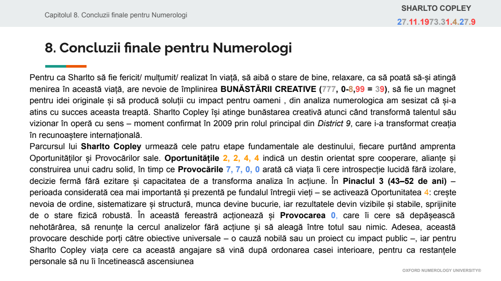

```text
Capitolul 8. Concluzii finale pentru Numerologi
8. Concluzii finale pentru Numerologi
Pentru ca Sharlto să fie fericit/ mulțumit/ realizat în viață, să aibă o stare de bine, relaxare, ca să poată să-și atingă
menirea în această viață, are nevoie de împlinirea BUNĂSTĂRII CREATIVE (777, 0-8,99 = 39), să fie un magnet
pentru idei originale și să producă soluții cu impact pentru oameni , din analiza numerologica am sesizat că și-a
atins cu succes aceasta treaptă. Sharlto Copley își atinge bunăstarea creativă atunci când transformă talentul său
vizionar în operă cu sens – moment confirmat în 2009 prin rolul principal din District 9, care i-a transformat creația
în recunoaștere internațională.
Parcursul lui Sharlto Copley urmează cele patru etape fundamentale ale destinului, fiecare purtând amprenta
Oportunităților și Provocărilor sale. Oportunitățile 2, 2, 4, 4 indică un destin orientat spre cooperare, alianțe și
construirea unui cadru solid, în timp ce Provocările 7, 7, 0, 0 arată că viața îi cere introspecție lucidă fără izolare,
decizie fermă fără ezitare și capacitatea de a transforma analiza în acțiune. În Pinaclul 3 (43–52 de ani) –
perioada considerată cea mai importantă și prezentă pe fundalul întregii vieți – se activează Oportunitatea 4: crește
nevoia de ordine, sistematizare și structură, munca devine bucurie, iar rezultatele devin vizibile și stabile, sprijinite
de o stare fizică robustă. În această fereastră acționează și Provocarea 0, care îi cere să depășească
nehotărârea, să renunțe la cercul analizelor fără acțiune și să aleagă între totul sau nimic. Adesea, această
provocare deschide porți către obiective universale – o cauză nobilă sau un proiect cu impact public –, iar pentru
Sharlto Copley viața cere ca această angajare să vină după ordonarea casei interioare, pentru ca restanțele
personale să nu îi încetinească ascensiunea
OXFORD NUMEROLOGY UNIVERSITY®
```

### Pagina 387

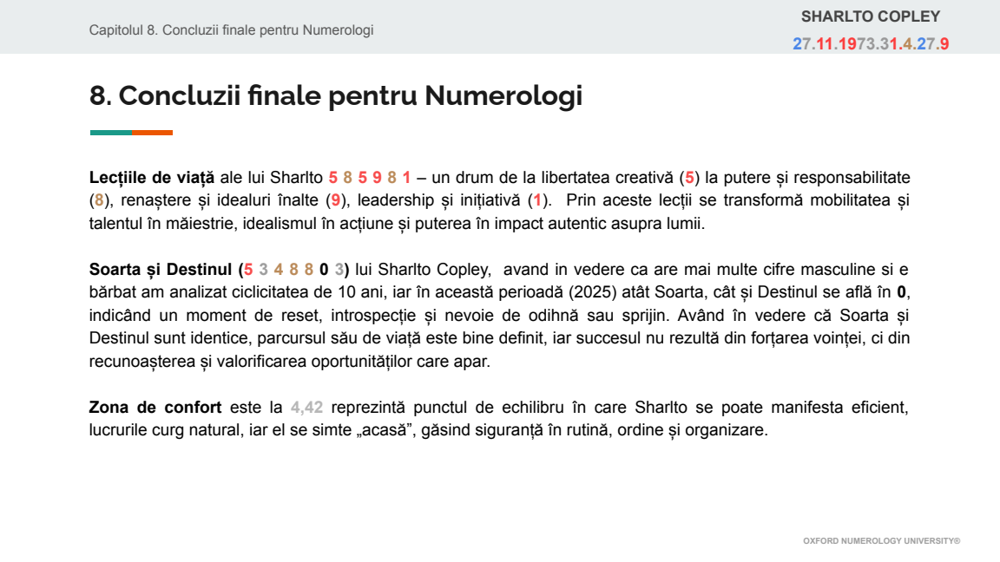

```text
Capitolul 8. Concluzii finale pentru Numerologi
8. Concluzii finale pentru Numerologi
Lecțiile de viață ale lui Sharlto 5 8 5 9 8 1 – un drum de la libertatea creativă (5) la putere și responsabilitate
(8), renaștere și idealuri înalte (9), leadership și inițiativă (1). Prin aceste lecții se transformă mobilitatea și
talentul în măiestrie, idealismul în acțiune și puterea în impact autentic asupra lumii.
Soarta și Destinul (5 3 4 8 8 0 3) lui Sharlto Copley, avand in vedere ca are mai multe cifre masculine si e
bărbat am analizat ciclicitatea de 10 ani, iar în această perioadă (2025) atât Soarta, cât și Destinul se află în 0,
indicând un moment de reset, introspecție și nevoie de odihnă sau sprijin. Având în vedere că Soarta și
Destinul sunt identice, parcursul său de viață este bine definit, iar succesul nu rezultă din forțarea voinței, ci din
recunoașterea și valorificarea oportunităților care apar.
Zona de confort este la 4,42 reprezintă punctul de echilibru în care Sharlto se poate manifesta eficient,
lucrurile curg natural, iar el se simte „acasă”, găsind siguranță în rutină, ordine și organizare.
OXFORD NUMEROLOGY UNIVERSITY®
```

### Pagina 388

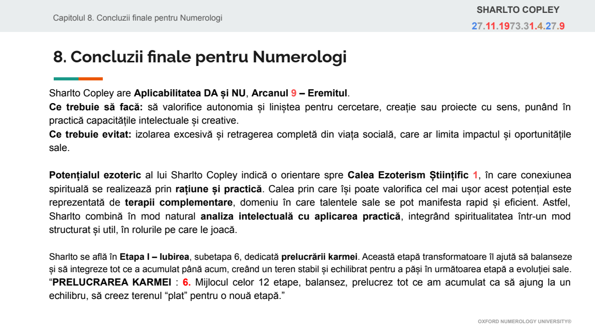

```text
Capitolul 8. Concluzii finale pentru Numerologi
8. Concluzii finale pentru Numerologi
Sharlto Copley are Aplicabilitatea DA și NU, Arcanul 9 – Eremitul.
Ce trebuie să facă: să valorifice autonomia și liniștea pentru cercetare, creație sau proiecte cu sens, punând în
practică capacitățile intelectuale și creative.
Ce trebuie evitat: izolarea excesivă și retragerea completă din viața socială, care ar limita impactul și oportunitățile
sale.
Potențialul ezoteric al lui Sharlto Copley indică o orientare spre Calea Ezoterism Științific 1, în care conexiunea
spirituală se realizează prin rațiune și practică. Calea prin care își poate valorifica cel mai ușor acest potențial este
reprezentată de terapii complementare, domeniu în care talentele sale se pot manifesta rapid și eficient. Astfel,
Sharlto combină în mod natural analiza intelectuală cu aplicarea practică, integrând spiritualitatea într-un mod
structurat și util, în rolurile pe care le joacă.
Sharlto se află în Etapa I – Iubirea, subetapa 6, dedicată prelucrării karmei. Această etapă transformatoare îl ajută să balanseze
și să integreze tot ce a acumulat până acum, creând un teren stabil și echilibrat pentru a păși în următoarea etapă a evoluției sale.
“PRELUCRAREA KARMEI : 6. Mijlocul celor 12 etape, balansez, prelucrez tot ce am acumulat ca să ajung la un
echilibru, să creez terenul “plat” pentru o nouă etapă.”
OXFORD NUMEROLOGY UNIVERSITY®
```

### Pagina 389

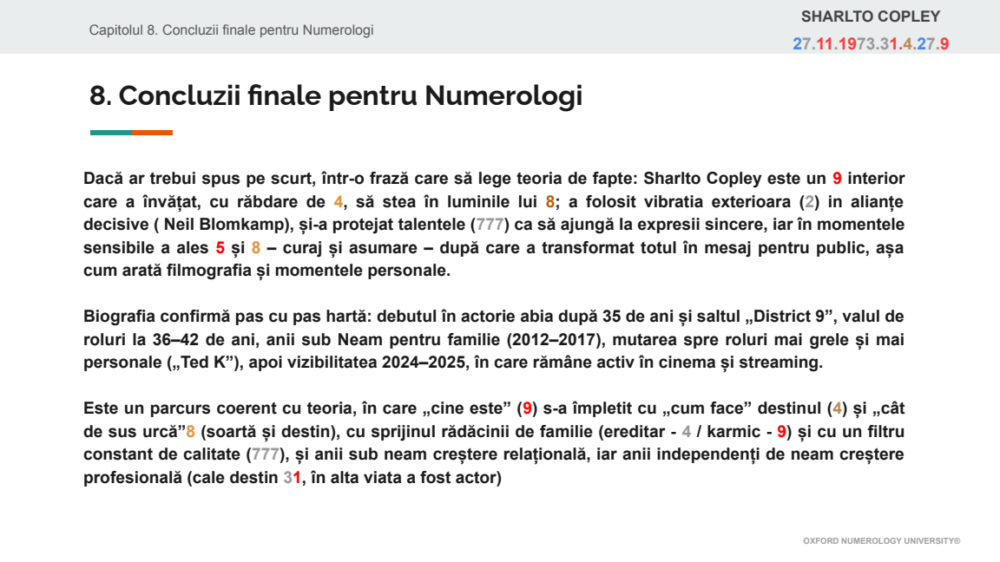

```text
Capitolul 8. Concluzii finale pentru Numerologi
8. Concluzii finale pentru Numerologi
Dacă ar trebui spus pe scurt, într-o frază care să lege teoria de fapte: Sharlto Copley este un 9 interior
care a învățat, cu răbdare de 4, să stea în luminile lui 8; a folosit vibratia exterioara (2) in alianțe
decisive ( Neil Blomkamp), și-a protejat talentele (777) ca să ajungă la expresii sincere, iar în momentele
sensibile a ales 5 și 8 – curaj și asumare – după care a transformat totul în mesaj pentru public, așa
cum arată filmografia și momentele personale.
Biografia confirmă pas cu pas hartă: debutul în actorie abia după 35 de ani și saltul „District 9”, valul de
roluri la 36–42 de ani, anii sub Neam pentru familie (2012–2017), mutarea spre roluri mai grele și mai
personale („Ted K”), apoi vizibilitatea 2024–2025, în care rămâne activ în cinema și streaming.
Este un parcurs coerent cu teoria, în care „cine este” (9) s-a împletit cu „cum face” destinul (4) și „cât
de sus urcă”8 (soartă și destin), cu sprijinul rădăcinii de familie (ereditar - 4 / karmic - 9) și cu un filtru
constant de calitate (777), și anii sub neam creștere relațională, iar anii independenți de neam creștere
profesională (cale destin 31, în alta viata a fost actor)
OXFORD NUMEROLOGY UNIVERSITY®
```

# Capitolul 9. Sfatul numerologului

_Pagini sursa: 390-410._

## Formule si calcule extrase pentru rafinare

### doar debutul său internațional, ci și oglinda perfectă a numerologiei sale interioare

- Concept analizat: concept lipsa in VAULT/Numerologie.
- Metoda de calcul: doar debutul său internațional, ci și oglinda perfectă a numerologiei sale interioare: vibrația 27 - 9 – misiunea
- Calcul: doar debutul său internațional, ci și oglinda perfectă a numerologiei sale interioare: vibrația 27 - 9 – misiunea
- Verificare: concept lipsa in VAULT/Numerologie.
- Verificare pagina: pagina 397.

### dureroasă, reflectă exact calea de viață a unui 9

- Concept analizat: concept lipsa in VAULT/Numerologie.
- Metoda de calcul: dureroasă, reflectă exact calea de viață a unui 9: trecerea de la ego la compasiune, de la control la înțelegere.
- Calcul: dureroasă, reflectă exact calea de viață a unui 9: trecerea de la ego la compasiune, de la control la înțelegere.
- Verificare: concept lipsa in VAULT/Numerologie.
- Verificare pagina: pagina 397.

### și l-a cunoscut pe Neill Blomkamp. În acei ani, și-a activat destinul 4

- Concept analizat: verificat in VAULT/Numerologie - [[Vibratia Destinului]].
- Metoda de calcul: și l-a cunoscut pe Neill Blomkamp. În acei ani, și-a activat destinul 4: a creat structuri, sisteme, a învățat să lucreze metodic
- Calcul: și l-a cunoscut pe Neill Blomkamp. În acei ani, și-a activat destinul 4: a creat structuri, sisteme, a învățat să lucreze metodic
- Verificare: ok - concept verificat in VAULT/Numerologie; metoda trebuie rafinata din textul paginii.
- Verificare pagina: pagina 398.

### Adunarea vibrațiilor interioare (9 + 7 = 16 → 7) arată misiunea lor comună

- Concept analizat: concept lipsa in VAULT/Numerologie.
- Metoda de calcul: Adunarea vibrațiilor interioare (9 + 7 = 16 → 7) arată misiunea lor comună: să devină maeștri, experți, vizionari
- Calcul: să devină maeștri, experți, vizionari
- Verificare: concept lipsa in VAULT/Numerologie.
- Verificare pagina: pagina 399.

### Scăderea vibrațiilor interioare (7 – 9

- Concept analizat: verificat in VAULT/Numerologie - [[Lectii de Viata]].
- Metoda de calcul: Scăderea vibrațiilor interioare (7 – 9 = 2) arată lecția de cooperare și empatie. Într-adevăr, colaborarea lor a
- Calcul: Scăderea vibrațiilor interioare (7 – 9 = 2) arată lecția de cooperare și empatie. Într-adevăr, colaborarea lor a
- Verificare: ok - concept verificat in VAULT/Numerologie; formula de calcul este compatibila cu documentatia.
- Verificare pagina: pagina 399.

### La nivel exterior, adunarea vibrațiilor (5 + 2

- Concept analizat: concept lipsa in VAULT/Numerologie.
- Metoda de calcul: La nivel exterior, adunarea vibrațiilor (5 + 2 = 7) confirmă menirea lor comună – desăvârșirea profesională. 7
- Calcul: La nivel exterior, adunarea vibrațiilor (5 + 2 = 7) confirmă menirea lor comună – desăvârșirea profesională. 7
- Verificare: concept lipsa in VAULT/Numerologie.
- Verificare pagina: pagina 399.

### Scăderea vibrațiilor exterioare (5 – 2

- Concept analizat: verificat in VAULT/Numerologie - [[Lectii de Viata]].
- Metoda de calcul: Scăderea vibrațiilor exterioare (5 – 2 = 3) arată lecția exprimării clare. 3 i-a obligat să traducă ideile abstracte
- Calcul: Scăderea vibrațiilor exterioare (5 – 2 = 3) arată lecția exprimării clare. 3 i-a obligat să traducă ideile abstracte
- Verificare: ok - concept verificat in VAULT/Numerologie; formula de calcul este compatibila cu documentatia.
- Verificare pagina: pagina 400.

### Patru ani mai târziu, la 35 de ani, urcă pe încă o treaptă a destinului sub lecție 3 și constantă Soartă/Destin 8

- Concept analizat: verificat in VAULT/Numerologie - [[Vibratia Destinului]].
- Metoda de calcul: Patru ani mai târziu, la 35 de ani, urcă pe încă o treaptă a destinului sub lecție 3 și constantă Soartă/Destin 8:
- Calcul: Patru ani mai târziu, la 35 de ani, urcă pe încă o treaptă a destinului sub lecție 3 și constantă Soartă/Destin 8:
- Verificare: ok - concept verificat in VAULT/Numerologie; metoda trebuie rafinata din textul paginii.
- Verificare pagina: pagina 401.

### privire din ochii unui 9 care și-a înțeles destinul de 4

- Concept analizat: verificat in VAULT/Numerologie - [[Vibratia Destinului]].
- Metoda de calcul: privire din ochii unui 9 care și-a înțeles destinul de 4: să construiască, prin iubire, ordine și adevăr.
- Calcul: privire din ochii unui 9 care și-a înțeles destinul de 4: să construiască, prin iubire, ordine și adevăr.
- Verificare: ok - concept verificat in VAULT/Numerologie; metoda trebuie rafinata din textul paginii.
- Verificare pagina: pagina 403.

### Anul 2026 aduce o tranziție majoră

- Concept analizat: verificat in VAULT/Numerologie - [[Ciclul de 9 Ani]].
- Metoda de calcul: Anul 2026 aduce o tranziție majoră: un an 8 în ciclul 6 de 9 ani, sub influența neamului 9 și a karmei lunii 11,
- Calcul: Anul 2026 aduce o tranziție majoră: un an 8 în ciclul 6 de 9 ani, sub influența neamului 9 și a karmei lunii 11,
- Verificare: ok - concept verificat in VAULT/Numerologie; metoda trebuie rafinata din textul paginii.
- Verificare pagina: pagina 405.

## Pagini si text sursa

### Pagina 390

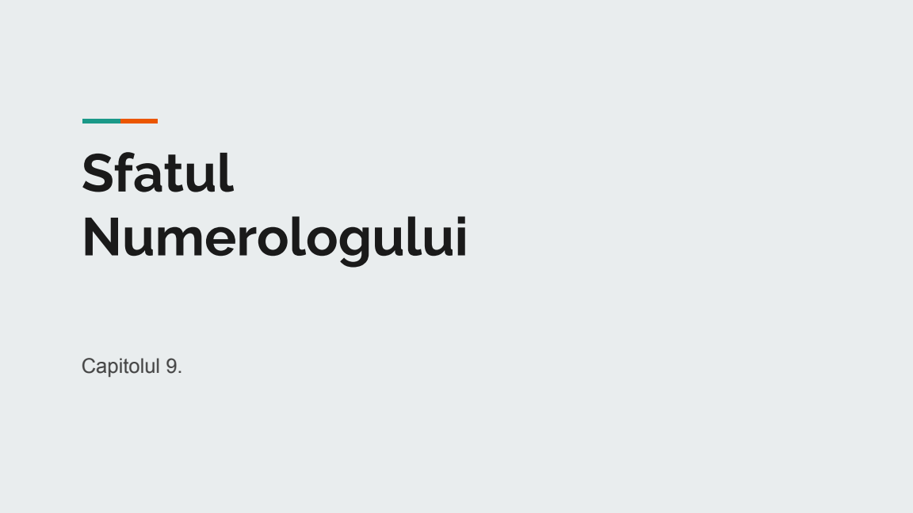

```text
Sfatul
Numerologului
```

### Pagina 391

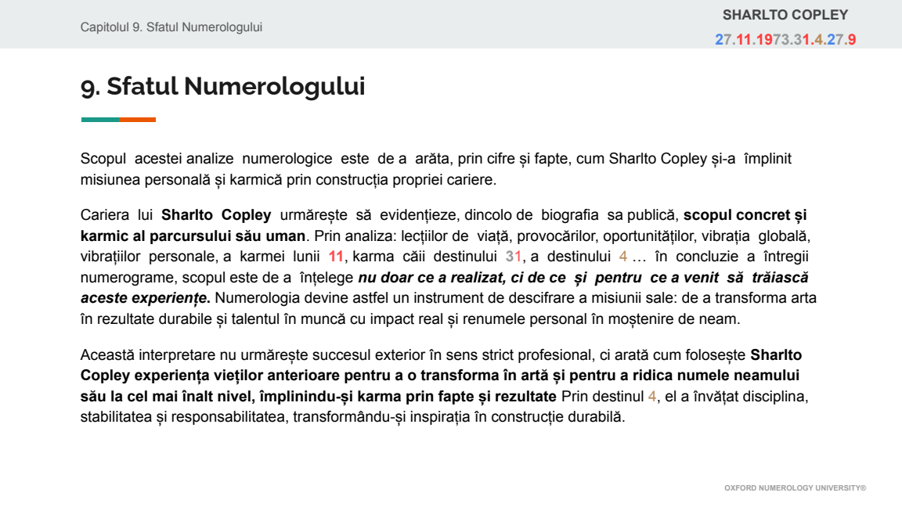

```text
Capitolul 9. Sfatul Numerologului
9. Sfatul Numerologului
Scopul acestei analize numerologice este de a arăta, prin cifre și fapte, cum Sharlto Copley și-a împlinit
misiunea personală și karmică prin construcția propriei cariere.
Cariera lui Sharlto Copley urmărește să evidențieze, dincolo de biografia sa publică, scopul concret și
karmic al parcursului său uman. Prin analiza: lecțiilor de viață, provocărilor, oportunităților, vibrația globală,
vibrațiilor personale, a karmei lunii 11, karma căii destinului 31, a destinului 4 … în concluzie a întregii
numerograme, scopul este de a înțelege nu doar ce a realizat, ci de ce și pentru ce a venit să trăiască
aceste experiențe. Numerologia devine astfel un instrument de descifrare a misiunii sale: de a transforma arta
în rezultate durabile și talentul în muncă cu impact real și renumele personal în moștenire de neam.
Această interpretare nu urmărește succesul exterior în sens strict profesional, ci arată cum folosește Sharlto
Copley experiența vieților anterioare pentru a o transforma în artă și pentru a ridica numele neamului
său la cel mai înalt nivel, împlinindu-și karma prin fapte și rezultate Prin destinul 4, el a învățat disciplina,
stabilitatea și responsabilitatea, transformându-și inspirația în construcție durabilă.
OXFORD NUMEROLOGY UNIVERSITY®
```

### Pagina 392

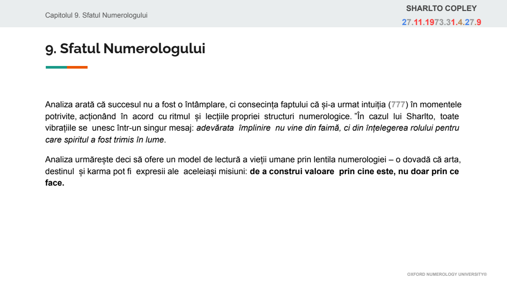

```text
Capitolul 9. Sfatul Numerologului
9. Sfatul Numerologului
Analiza arată că succesul nu a fost o întâmplare, ci consecința faptului că și-a urmat intuiția (777) în momentele
potrivite, acționând în acord cu ritmul și lecțiile propriei structuri numerologice. ”În cazul lui Sharlto, toate
vibrațiile se unesc într-un singur mesaj: adevărata împlinire nu vine din faimă, ci din înțelegerea rolului pentru
care spiritul a fost trimis în lume.
Analiza urmărește deci să ofere un model de lectură a vieții umane prin lentila numerologiei – o dovadă că arta,
destinul și karma pot fi expresii ale aceleiași misiuni: de a construi valoare prin cine este, nu doar prin ce
face.
OXFORD NUMEROLOGY UNIVERSITY®
```

### Pagina 393

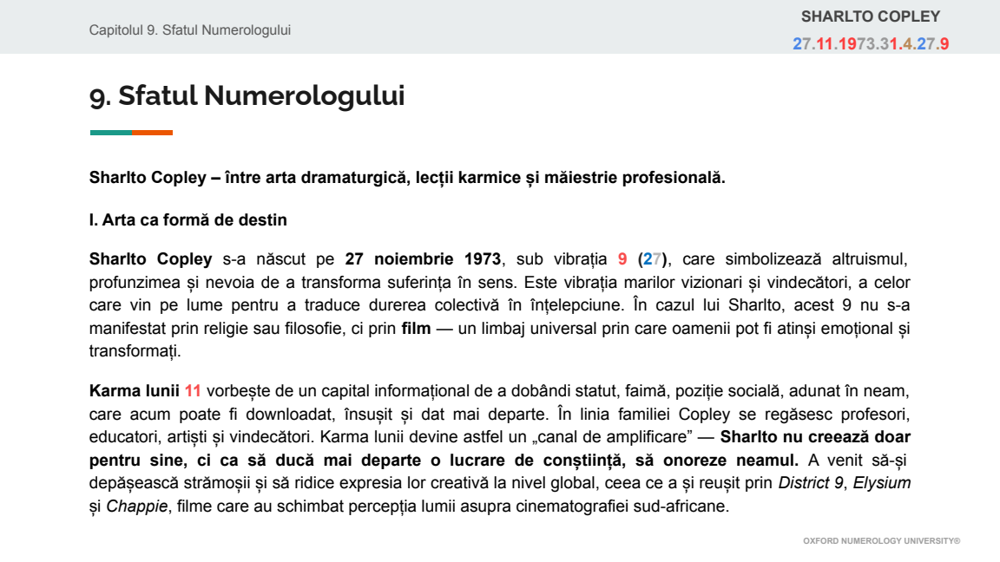

```text
Capitolul 9. Sfatul Numerologului
9. Sfatul Numerologului
Sharlto Copley – între arta dramaturgică, lecții karmice și măiestrie profesională.
I. Arta ca formă de destin
Sharlto Copley s-a născut pe 27 noiembrie 1973, sub vibrația 9 (27), care simbolizează altruismul,
profunzimea și nevoia de a transforma suferința în sens. Este vibrația marilor vizionari și vindecători, a celor
care vin pe lume pentru a traduce durerea colectivă în înțelepciune. În cazul lui Sharlto, acest 9 nu s-a
manifestat prin religie sau filosofie, ci prin film — un limbaj universal prin care oamenii pot fi atinși emoțional și
transformați.
Karma lunii 11 vorbește de un capital informațional de a dobândi statut, faimă, poziție socială, adunat în neam,
care acum poate fi downloadat, însușit și dat mai departe. În linia familiei Copley se regăsesc profesori,
educatori, artiști și vindecători. Karma lunii devine astfel un „canal de amplificare” — Sharlto nu creează doar
pentru sine, ci ca să ducă mai departe o lucrare de conștiință, să onoreze neamul. A venit să-și
depășească strămoșii și să ridice expresia lor creativă la nivel global, ceea ce a și reușit prin District 9, Elysium
și Chappie, filme care au schimbat percepția lumii asupra cinematografiei sud-africane.
OXFORD NUMEROLOGY UNIVERSITY®
```

### Pagina 394

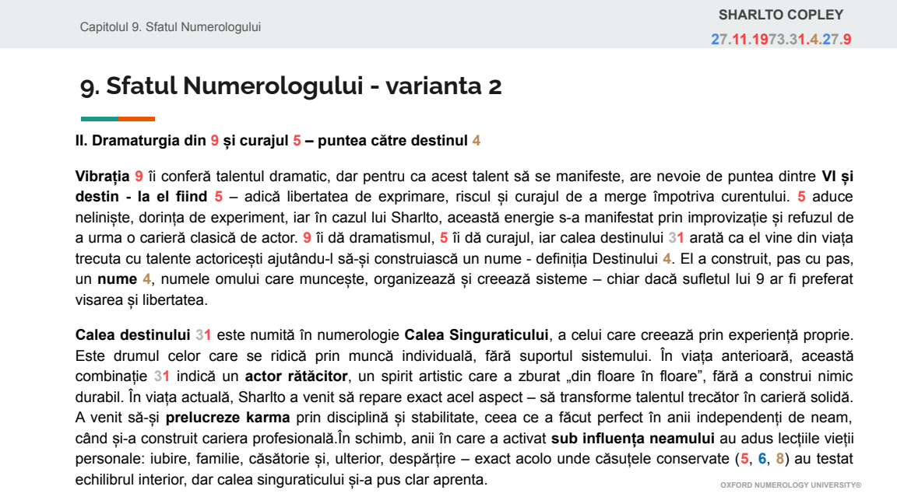

```text
Capitolul 9. Sfatul Numerologului
9. Sfatul Numerologului - varianta 2
II. Dramaturgia din 9 și curajul 5 – puntea către destinul 4
Vibrația 9 îi conferă talentul dramatic, dar pentru ca acest talent să se manifeste, are nevoie de puntea dintre VI și
destin - la el fiind 5 – adică libertatea de exprimare, riscul și curajul de a merge împotriva curentului. 5 aduce
neliniște, dorința de experiment, iar în cazul lui Sharlto, această energie s-a manifestat prin improvizație și refuzul de
a urma o carieră clasică de actor. 9 îi dă dramatismul, 5 îi dă curajul, iar calea destinului 31 arată ca el vine din viața
trecuta cu talente actoricești ajutându-l să-și construiască un nume - definiția Destinului 4. El a construit, pas cu pas,
un nume 4, numele omului care muncește, organizează și creează sisteme – chiar dacă sufletul lui 9 ar fi preferat
visarea și libertatea.
Calea destinului 31 este numită în numerologie Calea Singuraticului, a celui care creează prin experiență proprie.
Este drumul celor care se ridică prin muncă individuală, fără suportul sistemului. În viața anterioară, această
combinație 31 indică un actor rătăcitor, un spirit artistic care a zburat „din floare în floare”, fără a construi nimic
durabil. În viața actuală, Sharlto a venit să repare exact acel aspect – să transforme talentul trecător în carieră solidă.
A venit să-și prelucreze karma prin disciplină și stabilitate, ceea ce a făcut perfect în anii independenți de neam,
când și-a construit cariera profesională.În schimb, anii în care a activat sub influența neamului au adus lecțiile vieții
personale: iubire, familie, căsătorie și, ulterior, despărțire – exact acolo unde căsuțele conservate (5, 6, 8) au testat
echilibrul interior, dar calea singuraticului și-a pus clar aprenta.
OXFORD NUMEROLOGY UNIVERSITY®
```

### Pagina 395

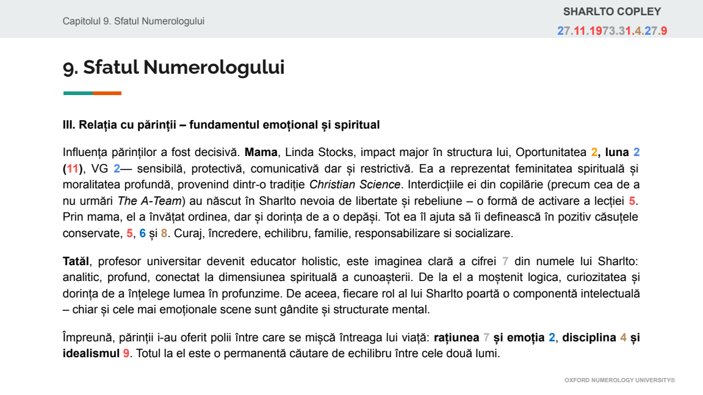

```text
Capitolul 9. Sfatul Numerologului
9. Sfatul Numerologului
III. Relația cu părinții – fundamentul emoțional și spiritual
Influența părinților a fost decisivă. Mama, Linda Stocks, impact major în structura lui, Oportunitatea 2, luna 2
(11), VG 2— sensibilă, protectivă, comunicativă dar și restrictivă. Ea a reprezentat feminitatea spirituală și
moralitatea profundă, provenind dintr-o tradiție Christian Science. Interdicțiile ei din copilărie (precum cea de a
nu urmări The A-Team) au născut în Sharlto nevoia de libertate și rebeliune – o formă de activare a lecției 5.
Prin mama, el a învățat ordinea, dar și dorința de a o depăși. Tot ea îl ajuta să îi definească în pozitiv căsuțele
conservate, 5, 6 și 8. Curaj, încredere, echilibru, familie, responsabilizare si socializare.
Tatăl, profesor universitar devenit educator holistic, este imaginea clară a cifrei 7 din numele lui Sharlto:
analitic, profund, conectat la dimensiunea spirituală a cunoașterii. De la el a moștenit logica, curiozitatea și
dorința de a înțelege lumea în profunzime. De aceea, fiecare rol al lui Sharlto poartă o componentă intelectuală
– chiar și cele mai emoționale scene sunt gândite și structurate mental.
Împreună, părinții i-au oferit polii între care se mișcă întreaga lui viață: rațiunea 7 și emoția 2, disciplina 4 și
idealismul 9. Totul la el este o permanentă căutare de echilibru între cele două lumi.
OXFORD NUMEROLOGY UNIVERSITY®
```

### Pagina 396

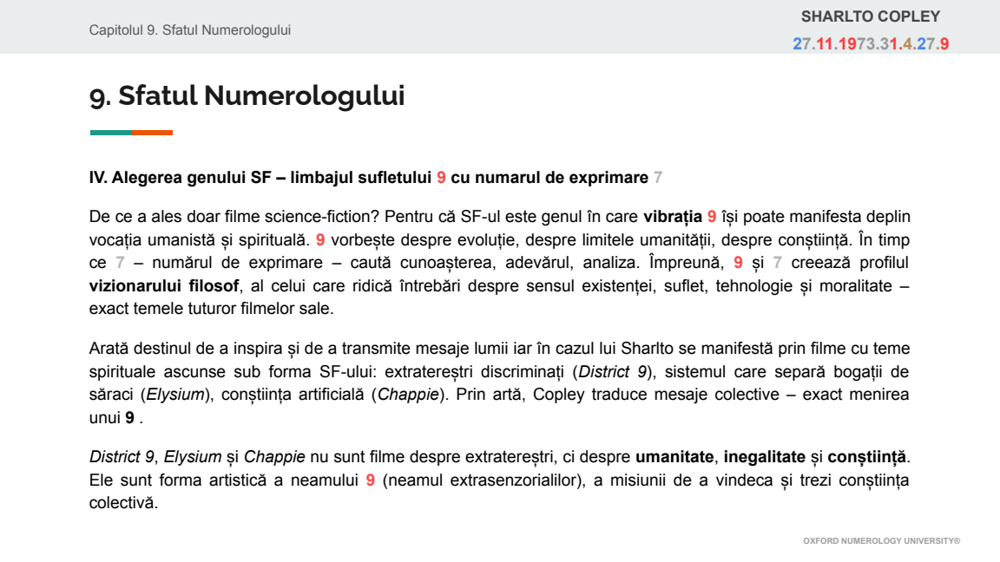

```text
Capitolul 9. Sfatul Numerologului
9. Sfatul Numerologului
IV. Alegerea genului SF – limbajul sufletului 9 cu numarul de exprimare 7
De ce a ales doar filme science-fiction? Pentru că SF-ul este genul în care vibrația 9 își poate manifesta deplin
vocația umanistă și spirituală. 9 vorbește despre evoluție, despre limitele umanității, despre conștiință. În timp
ce 7 – numărul de exprimare – caută cunoașterea, adevărul, analiza. Împreună, 9 și 7 creează profilul
vizionarului filosof, al celui care ridică întrebări despre sensul existenței, suflet, tehnologie și moralitate –
exact temele tuturor filmelor sale.
Arată destinul de a inspira și de a transmite mesaje lumii iar în cazul lui Sharlto se manifestă prin filme cu teme
spirituale ascunse sub forma SF-ului: extratereștri discriminați (District 9), sistemul care separă bogații de
săraci (Elysium), conștiința artificială (Chappie). Prin artă, Copley traduce mesaje colective – exact menirea
unui 9 .
District 9, Elysium și Chappie nu sunt filme despre extratereștri, ci despre umanitate, inegalitate și conștiință.
Ele sunt forma artistică a neamului 9 (neamul extrasenzorialilor), a misiunii de a vindeca și trezi conștiința
colectivă.
OXFORD NUMEROLOGY UNIVERSITY®
```

### Pagina 397

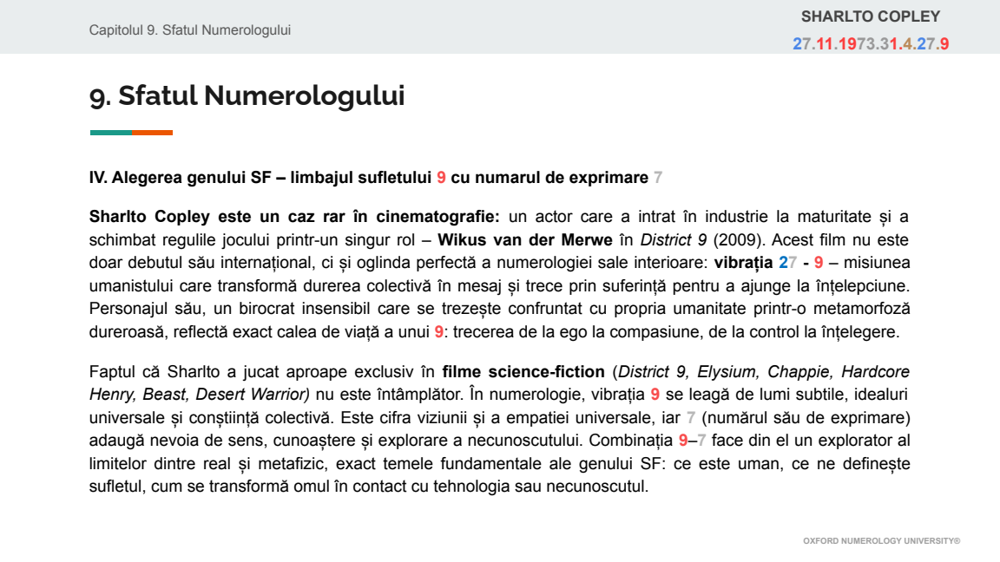

```text
Capitolul 9. Sfatul Numerologului
9. Sfatul Numerologului
IV. Alegerea genului SF – limbajul sufletului 9 cu numarul de exprimare 7
Sharlto Copley este un caz rar în cinematografie: un actor care a intrat în industrie la maturitate și a
schimbat regulile jocului printr-un singur rol – Wikus van der Merwe în District 9 (2009). Acest film nu este
doar debutul său internațional, ci și oglinda perfectă a numerologiei sale interioare: vibrația 27 - 9 – misiunea
umanistului care transformă durerea colectivă în mesaj și trece prin suferință pentru a ajunge la înțelepciune.
Personajul său, un birocrat insensibil care se trezește confruntat cu propria umanitate printr-o metamorfoză
dureroasă, reflectă exact calea de viață a unui 9: trecerea de la ego la compasiune, de la control la înțelegere.
Faptul că Sharlto a jucat aproape exclusiv în filme science-fiction (District 9, Elysium, Chappie, Hardcore
Henry, Beast, Desert Warrior) nu este întâmplător. În numerologie, vibrația 9 se leagă de lumi subtile, idealuri
universale și conștiință colectivă. Este cifra viziunii și a empatiei universale, iar 7 (numărul său de exprimare)
adaugă nevoia de sens, cunoaștere și explorare a necunoscutului. Combinația 9–7 face din el un explorator al
limitelor dintre real și metafizic, exact temele fundamentale ale genului SF: ce este uman, ce ne definește
sufletul, cum se transformă omul în contact cu tehnologia sau necunoscutul.
OXFORD NUMEROLOGY UNIVERSITY®
```

### Pagina 398

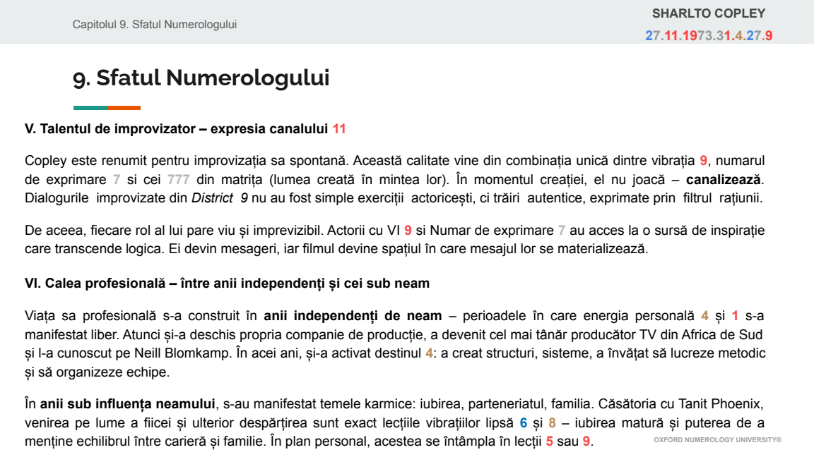

```text
Capitolul 9. Sfatul Numerologului
9. Sfatul Numerologului
V. Talentul de improvizator – expresia canalului 11
Copley este renumit pentru improvizația sa spontană. Această calitate vine din combinația unică dintre vibrația 9, numarul
de exprimare 7 si cei 777 din matrița (lumea creată în mintea lor). În momentul creației, el nu joacă – canalizează.
Dialogurile improvizate din District 9 nu au fost simple exerciții actoricești, ci trăiri autentice, exprimate prin filtrul rațiunii.
De aceea, fiecare rol al lui pare viu și imprevizibil. Actorii cu VI 9 si Numar de exprimare 7 au acces la o sursă de inspirație
care transcende logica. Ei devin mesageri, iar filmul devine spațiul în care mesajul lor se materializează.
VI. Calea profesională – între anii independenți și cei sub neam
Viața sa profesională s-a construit în anii independenți de neam – perioadele în care energia personală 4 și 1 s-a
manifestat liber. Atunci și-a deschis propria companie de producție, a devenit cel mai tânăr producător TV din Africa de Sud
și l-a cunoscut pe Neill Blomkamp. În acei ani, și-a activat destinul 4: a creat structuri, sisteme, a învățat să lucreze metodic
și să organizeze echipe.
În anii sub influența neamului, s-au manifestat temele karmice: iubirea, parteneriatul, familia. Căsătoria cu Tanit Phoenix,
venirea pe lume a fiicei și ulterior despărțirea sunt exact lecțiile vibrațiilor lipsă 6 și 8 – iubirea matură și puterea de a
menține echilibrul între carieră și familie. În plan personal, acestea se întâmpla în lecții 5 sau 9. OXFORD NUMEROLOGY UNIVERSITY®
```

### Pagina 399

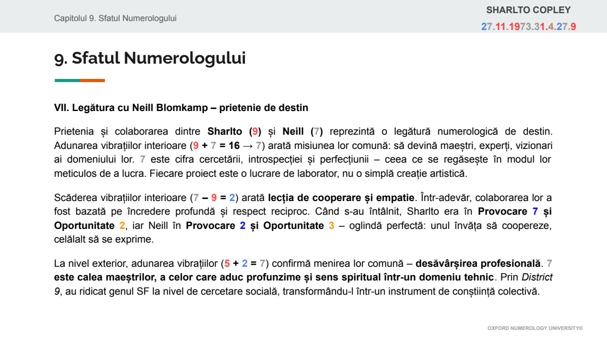

```text
Capitolul 9. Sfatul Numerologului
9. Sfatul Numerologului
VII. Legătura cu Neill Blomkamp – prietenie de destin
Prietenia și colaborarea dintre Sharlto (9) și Neill (7) reprezintă o legătură numerologică de destin.
Adunarea vibrațiilor interioare (9 + 7 = 16 → 7) arată misiunea lor comună: să devină maeștri, experți, vizionari
ai domeniului lor. 7 este cifra cercetării, introspecției și perfecțiunii – ceea ce se regăsește în modul lor
meticulos de a lucra. Fiecare proiect este o lucrare de laborator, nu o simplă creație artistică.
Scăderea vibrațiilor interioare (7 – 9 = 2) arată lecția de cooperare și empatie. Într-adevăr, colaborarea lor a
fost bazată pe încredere profundă și respect reciproc. Când s-au întâlnit, Sharlto era în Provocare 7 și
Oportunitate 2, iar Neill în Provocare 2 și Oportunitate 3 – oglindă perfectă: unul învăța să coopereze,
celălalt să se exprime.
La nivel exterior, adunarea vibrațiilor (5 + 2 = 7) confirmă menirea lor comună – desăvârșirea profesională. 7
este calea maeștrilor, a celor care aduc profunzime și sens spiritual într-un domeniu tehnic. Prin District
9, au ridicat genul SF la nivel de cercetare socială, transformându-l într-un instrument de conștiință colectivă.
OXFORD NUMEROLOGY UNIVERSITY®
```

### Pagina 400

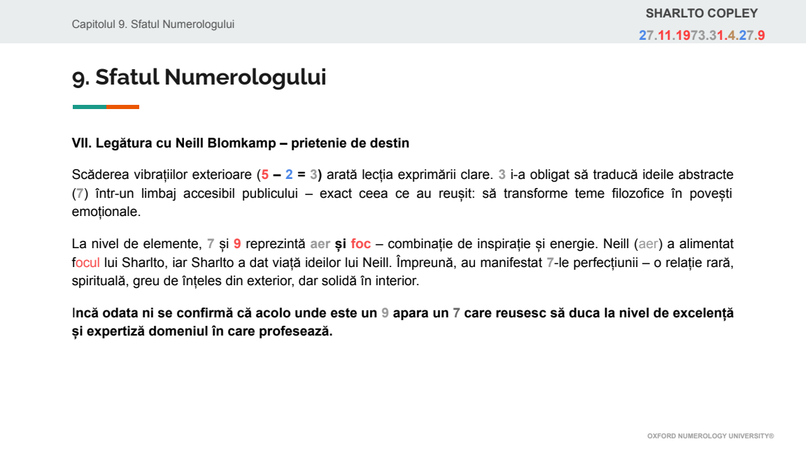

```text
Capitolul 9. Sfatul Numerologului
9. Sfatul Numerologului
VII. Legătura cu Neill Blomkamp – prietenie de destin
Scăderea vibrațiilor exterioare (5 – 2 = 3) arată lecția exprimării clare. 3 i-a obligat să traducă ideile abstracte
(7) într-un limbaj accesibil publicului – exact ceea ce au reușit: să transforme teme filozofice în povești
emoționale.
La nivel de elemente, 7 și 9 reprezintă aer și foc – combinație de inspirație și energie. Neill (aer) a alimentat
focul lui Sharlto, iar Sharlto a dat viață ideilor lui Neill. Împreună, au manifestat 7-le perfecțiunii – o relație rară,
spirituală, greu de înțeles din exterior, dar solidă în interior.
Incă odata ni se confirmă că acolo unde este un 9 apara un 7 care reusesc să duca la nivel de excelență
și expertiză domeniul în care profesează.
OXFORD NUMEROLOGY UNIVERSITY®
```

### Pagina 401

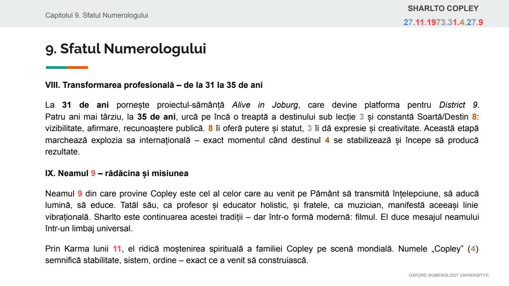

```text
Capitolul 9. Sfatul Numerologului
9. Sfatul Numerologului
VIII. Transformarea profesională – de la 31 la 35 de ani
La 31 de ani pornește proiectul-sămânță Alive in Joburg, care devine platforma pentru District 9.
Patru ani mai târziu, la 35 de ani, urcă pe încă o treaptă a destinului sub lecție 3 și constantă Soartă/Destin 8:
vizibilitate, afirmare, recunoaștere publică. 8 îi oferă putere și statut, 3 îi dă expresie și creativitate. Această etapă
marchează explozia sa internațională – exact momentul când destinul 4 se stabilizează și începe să producă
rezultate.
IX. Neamul 9 – rădăcina și misiunea
Neamul 9 din care provine Copley este cel al celor care au venit pe Pământ să transmită înțelepciune, să aducă
lumină, să educe. Tatăl său, ca profesor și educator holistic, și fratele, ca muzician, manifestă aceeași linie
vibrațională. Sharlto este continuarea acestei tradiții – dar într-o formă modernă: filmul. El duce mesajul neamului
într-un limbaj universal.
Prin Karma lunii 11, el ridică moștenirea spirituală a familiei Copley pe scenă mondială. Numele „Copley” (4)
semnifică stabilitate, sistem, ordine – exact ce a venit să construiască.
OXFORD NUMEROLOGY UNIVERSITY®
```

### Pagina 402

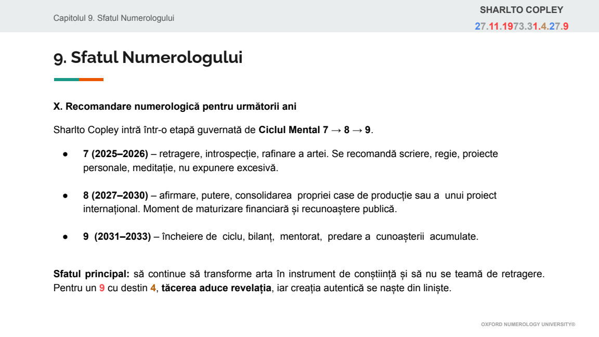

```text
Capitolul 9. Sfatul Numerologului
9. Sfatul Numerologului
X. Recomandare numerologică pentru următorii ani
Sharlto Copley intră într-o etapă guvernată de Ciclul Mental 7 → 8 → 9.
● 7 (2025–2026) – retragere, introspecție, rafinare a artei. Se recomandă scriere, regie, proiecte
personale, meditație, nu expunere excesivă.
● 8 (2027–2030) – afirmare, putere, consolidarea propriei case de producție sau a unui proiect
internațional. Moment de maturizare financiară și recunoaștere publică.
● 9 (2031–2033) – încheiere de ciclu, bilanț, mentorat, predare a cunoașterii acumulate.
Sfatul principal: să continue să transforme arta în instrument de conștiință și să nu se teamă de retragere.
Pentru un 9 cu destin 4, tăcerea aduce revelația, iar creația autentică se naște din liniște.
OXFORD NUMEROLOGY UNIVERSITY®
```

### Pagina 403

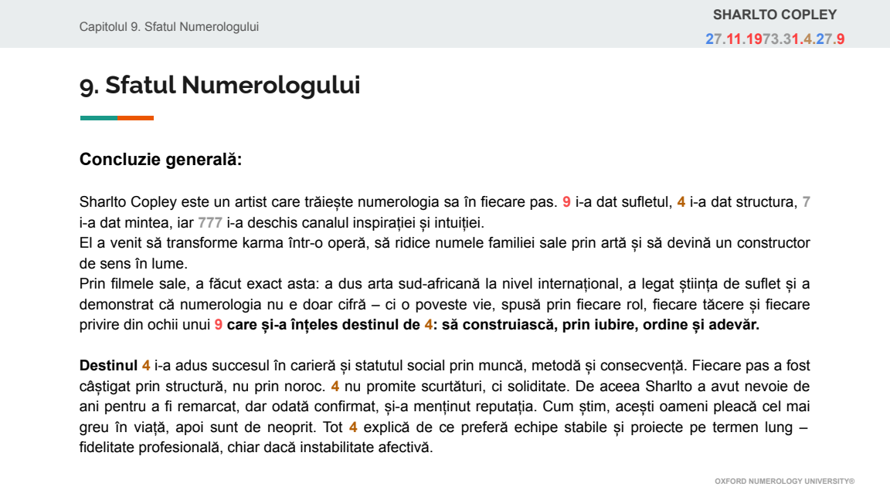

```text
Capitolul 9. Sfatul Numerologului
9. Sfatul Numerologului
Concluzie generală:
Sharlto Copley este un artist care trăiește numerologia sa în fiecare pas. 9 i-a dat sufletul, 4 i-a dat structura, 7
i-a dat mintea, iar 777 i-a deschis canalul inspirației și intuiției.
El a venit să transforme karma într-o operă, să ridice numele familiei sale prin artă și să devină un constructor
de sens în lume.
Prin filmele sale, a făcut exact asta: a dus arta sud-africană la nivel internațional, a legat știința de suflet și a
demonstrat că numerologia nu e doar cifră – ci o poveste vie, spusă prin fiecare rol, fiecare tăcere și fiecare
privire din ochii unui 9 care și-a înțeles destinul de 4: să construiască, prin iubire, ordine și adevăr.
Destinul 4 i-a adus succesul în carieră și statutul social prin muncă, metodă și consecvență. Fiecare pas a fost
câștigat prin structură, nu prin noroc. 4 nu promite scurtături, ci soliditate. De aceea Sharlto a avut nevoie de
ani pentru a fi remarcat, dar odată confirmat, și-a menținut reputația. Cum știm, acești oameni pleacă cel mai
greu în viață, apoi sunt de neoprit. Tot 4 explică de ce preferă echipe stabile și proiecte pe termen lung –
fidelitate profesională, chiar dacă instabilitate afectivă.
OXFORD NUMEROLOGY UNIVERSITY®
```

### Pagina 404

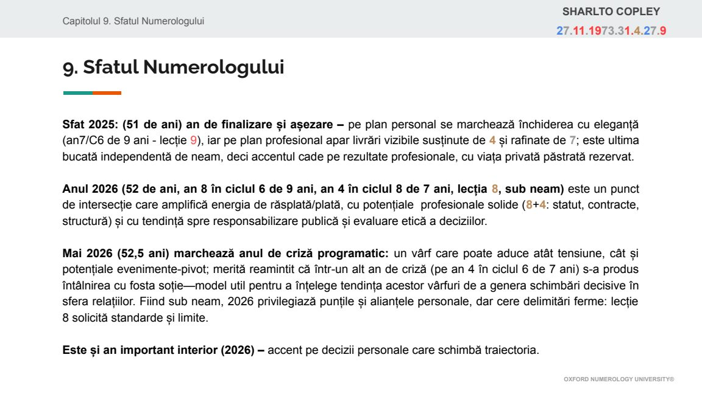

```text
Capitolul 9. Sfatul Numerologului
9. Sfatul Numerologului
Sfat 2025: (51 de ani) an de finalizare și așezare – pe plan personal se marchează închiderea cu eleganță
(an7/C6 de 9 ani - lecție 9), iar pe plan profesional apar livrări vizibile susținute de 4 și rafinate de 7; este ultima
bucată independentă de neam, deci accentul cade pe rezultate profesionale, cu viața privată păstrată rezervat.
Anul 2026 (52 de ani, an 8 în ciclul 6 de 9 ani, an 4 în ciclul 8 de 7 ani, lecția 8, sub neam) este un punct
de intersecție care amplifică energia de răsplată/plată, cu potențiale profesionale solide (8+4: statut, contracte,
structură) și cu tendință spre responsabilizare publică și evaluare etică a deciziilor.
Mai 2026 (52,5 ani) marchează anul de criză programatic: un vârf care poate aduce atât tensiune, cât și
potențiale evenimente-pivot; merită reamintit că într-un alt an de criză (pe an 4 în ciclul 6 de 7 ani) s-a produs
întâlnirea cu fosta soție—model util pentru a înțelege tendința acestor vârfuri de a genera schimbări decisive în
sfera relațiilor. Fiind sub neam, 2026 privilegiază punțile și alianțele personale, dar cere delimitări ferme: lecție
8 solicită standarde și limite.
Este și an important interior (2026) – accent pe decizii personale care schimbă traiectoria.
OXFORD NUMEROLOGY UNIVERSITY®
```

### Pagina 405

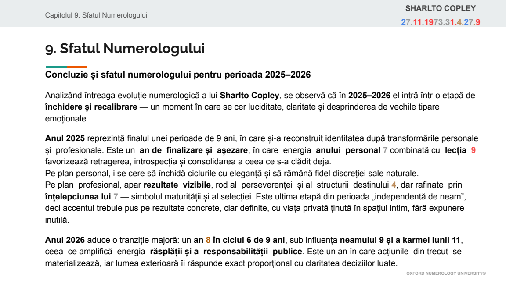

```text
Capitolul 9. Sfatul Numerologului
9. Sfatul Numerologului
Concluzie și sfatul numerologului pentru perioada 2025–2026
Analizând întreaga evoluție numerologică a lui Sharlto Copley, se observă că în 2025–2026 el intră într-o etapă de
închidere și recalibrare — un moment în care se cer luciditate, claritate și desprinderea de vechile tipare
emoționale.
Anul 2025 reprezintă finalul unei perioade de 9 ani, în care și-a reconstruit identitatea după transformările personale
și profesionale. Este un an de finalizare și așezare, în care energia anului personal 7 combinată cu lecția 9
favorizează retragerea, introspecția și consolidarea a ceea ce s-a clădit deja.
Pe plan personal, i se cere să închidă ciclurile cu eleganță și să rămână fidel discreției sale naturale.
Pe plan profesional, apar rezultate vizibile, rod al perseverenței și al structurii destinului 4, dar rafinate prin
înțelepciunea lui 7 — simbolul maturității și al selecției. Este ultima etapă din perioada „independentă de neam”,
deci accentul trebuie pus pe rezultate concrete, clar definite, cu viața privată ținută în spațiul intim, fără expunere
inutilă.
Anul 2026 aduce o tranziție majoră: un an 8 în ciclul 6 de 9 ani, sub influența neamului 9 și a karmei lunii 11,
ceea ce amplifică energia răsplății și a responsabilității publice. Este un an în care acțiunile din trecut se
materializează, iar lumea exterioară îi răspunde exact proporțional cu claritatea deciziilor luate.
OXFORD NUMEROLOGY UNIVERSITY®
```

### Pagina 406

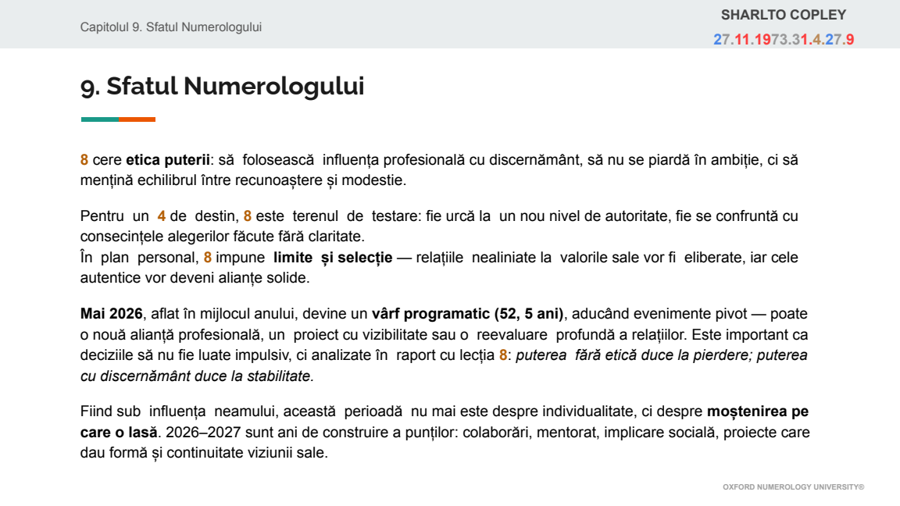

```text
Capitolul 9. Sfatul Numerologului
9. Sfatul Numerologului
8 cere etica puterii: să folosească influența profesională cu discernământ, să nu se piardă în ambiție, ci să
mențină echilibrul între recunoaștere și modestie.
Pentru un 4 de destin, 8 este terenul de testare: fie urcă la un nou nivel de autoritate, fie se confruntă cu
consecințele alegerilor făcute fără claritate.
În plan personal, 8 impune limite și selecție — relațiile nealiniate la valorile sale vor fi eliberate, iar cele
autentice vor deveni alianțe solide.
Mai 2026, aflat în mijlocul anului, devine un vârf programatic (52, 5 ani), aducând evenimente pivot — poate
o nouă alianță profesională, un proiect cu vizibilitate sau o reevaluare profundă a relațiilor. Este important ca
deciziile să nu fie luate impulsiv, ci analizate în raport cu lecția 8: puterea fără etică duce la pierdere; puterea
cu discernământ duce la stabilitate.
Fiind sub influența neamului, această perioadă nu mai este despre individualitate, ci despre moștenirea pe
care o lasă. 2026–2027 sunt ani de construire a punților: colaborări, mentorat, implicare socială, proiecte care
dau formă și continuitate viziunii sale.
OXFORD NUMEROLOGY UNIVERSITY®
```

### Pagina 407

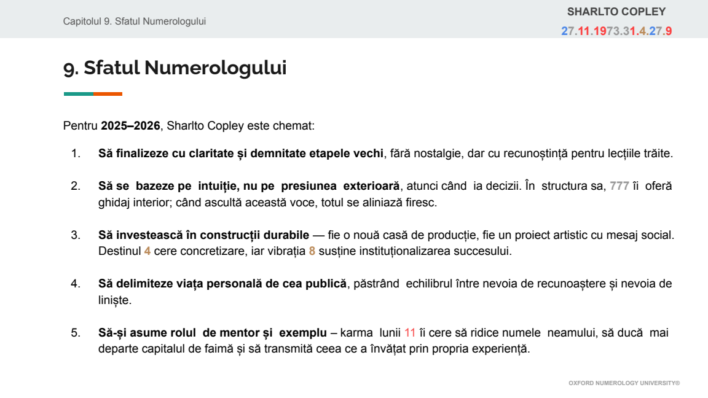

```text
Capitolul 9. Sfatul Numerologului
9. Sfatul Numerologului
Pentru 2025–2026, Sharlto Copley este chemat:
1. Să finalizeze cu claritate și demnitate etapele vechi, fără nostalgie, dar cu recunoștință pentru lecțiile trăite.
2. Să se bazeze pe intuiție, nu pe presiunea exterioară, atunci când ia decizii. În structura sa, 777 îi oferă
ghidaj interior; când ascultă această voce, totul se aliniază firesc.
3. Să investească în construcții durabile — fie o nouă casă de producție, fie un proiect artistic cu mesaj social.
Destinul 4 cere concretizare, iar vibrația 8 susține instituționalizarea succesului.
4. Să delimiteze viața personală de cea publică, păstrând echilibrul între nevoia de recunoaștere și nevoia de
liniște.
5. Să-și asume rolul de mentor și exemplu – karma lunii 11 îi cere să ridice numele neamului, să ducă mai
departe capitalul de faimă și să transmită ceea ce a învățat prin propria experiență.
OXFORD NUMEROLOGY UNIVERSITY®
```

### Pagina 408

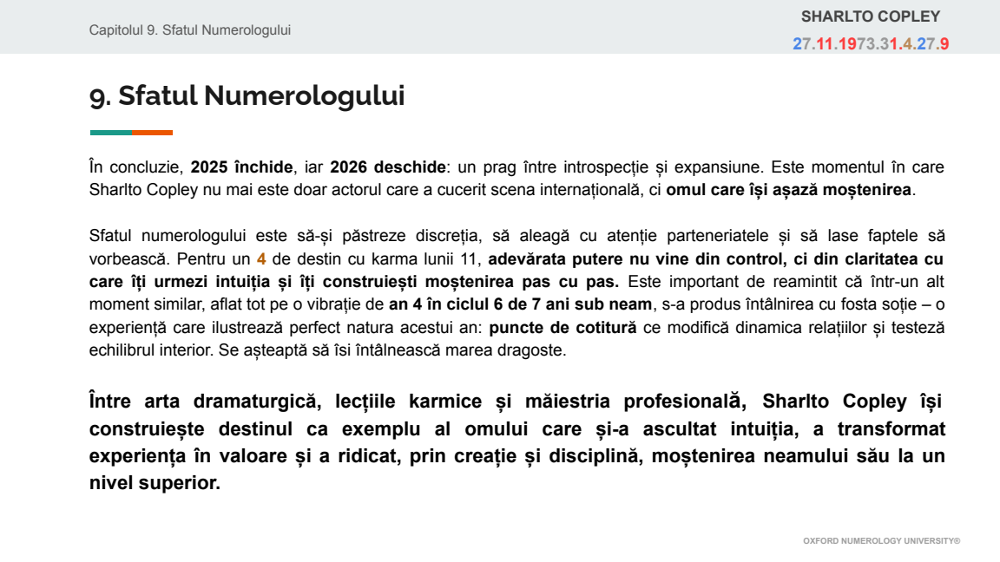

```text
Capitolul 9. Sfatul Numerologului
9. Sfatul Numerologului
În concluzie, 2025 închide, iar 2026 deschide: un prag între introspecție și expansiune. Este momentul în care
Sharlto Copley nu mai este doar actorul care a cucerit scena internațională, ci omul care își așază moștenirea.
Sfatul numerologului este să-și păstreze discreția, să aleagă cu atenție parteneriatele și să lase faptele să
vorbească. Pentru un 4 de destin cu karma lunii 11, adevărata putere nu vine din control, ci din claritatea cu
care îți urmezi intuiția și îți construiești moștenirea pas cu pas. Este important de reamintit că într-un alt
moment similar, aflat tot pe o vibrație de an 4 în ciclul 6 de 7 ani sub neam, s-a produs întâlnirea cu fosta soție – o
experiență care ilustrează perfect natura acestui an: puncte de cotitură ce modifică dinamica relațiilor și testeză
echilibrul interior. Se așteaptă să îsi întâlnească marea dragoste.
Între arta dramaturgică, lecțiile karmice și măiestria profesională, Sharlto Copley își
construiește destinul ca exemplu al omului care și-a ascultat intuiția, a transformat
experiența în valoare și a ridicat, prin creație și disciplină, moștenirea neamului său la un
nivel superior.
OXFORD NUMEROLOGY UNIVERSITY®
```

### Pagina 409

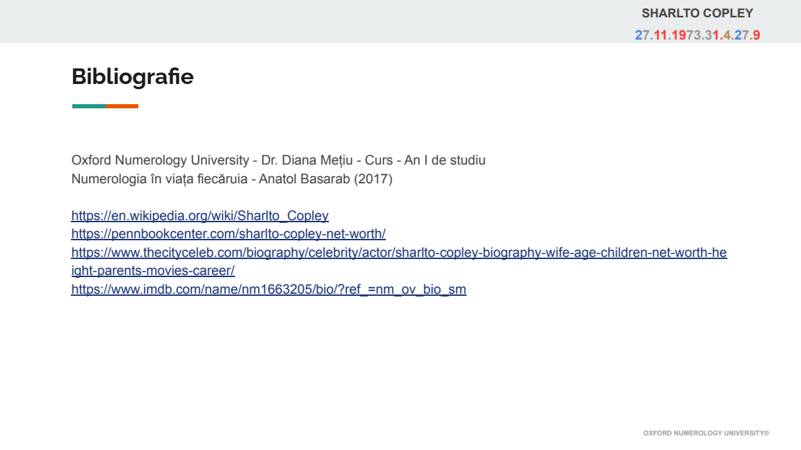

```text
Bibliografie
Oxford Numerology University - Dr. Diana Mețiu - Curs - An I de studiu
Numerologia în viața fiecăruia - Anatol Basarab (2017)
https://en.wikipedia.org/wiki/Sharlto_Copley
https://pennbookcenter.com/sharlto-copley-net-worth/
https://www.thecityceleb.com/biography/celebrity/actor/sharlto-copley-biography-wife-age-children-net-worth-he
ight-parents-movies-career/
https://www.imdb.com/name/nm1663205/bio/?ref_=nm_ov_bio_sm
OXFORD NUMEROLOGY UNIVERSITY®
```

### Pagina 410


```text
2025
OXFORD NUMEROLOGY UNIVERSITY®
---
```


